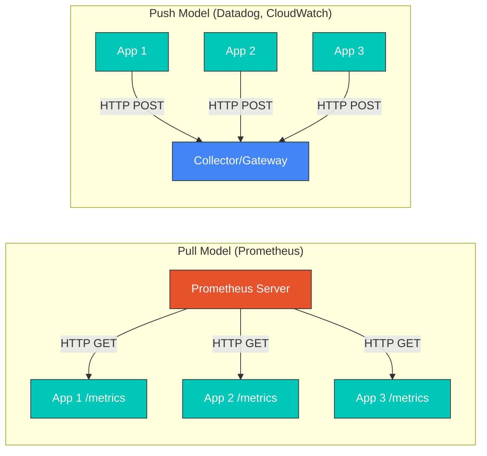
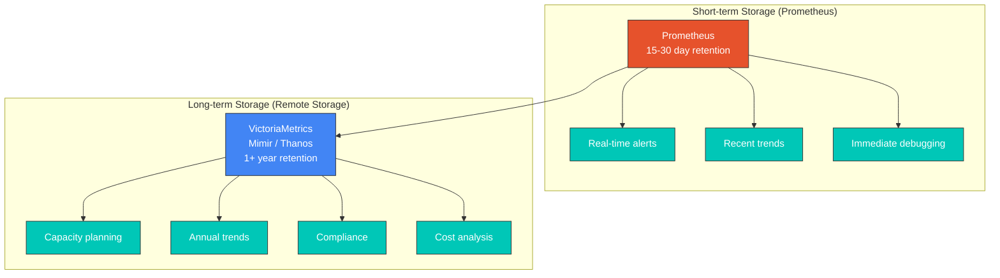
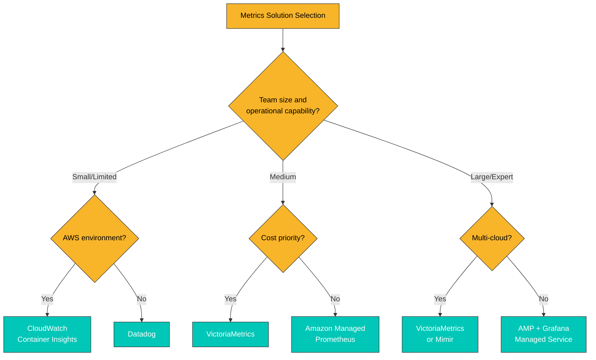
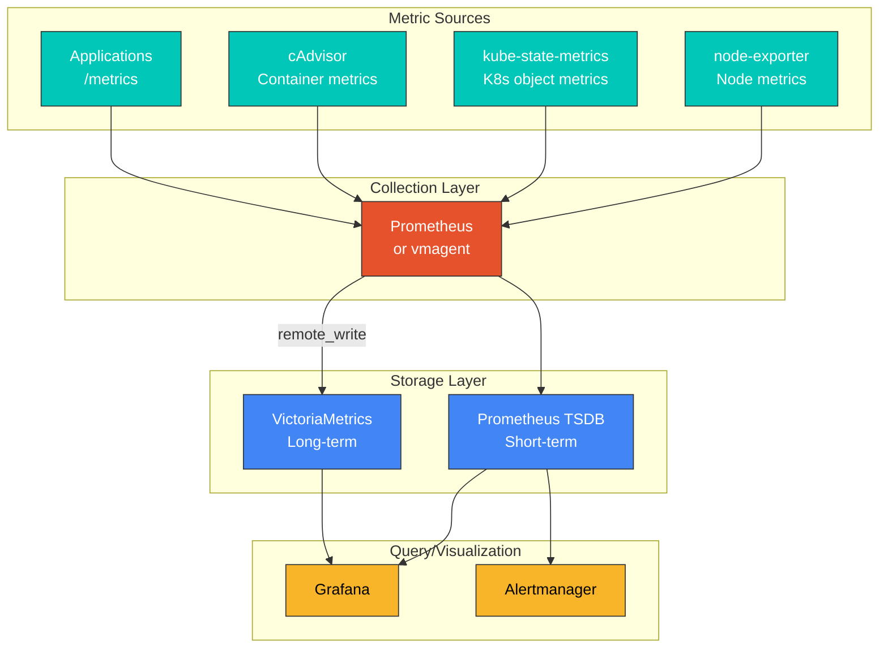

# 指标概述

> **最后更新**: February 20, 2026

## 目录

- [指标基础](#metrics-fundamentals)
- [指标类型](#metric-types)
- [Pull 与 Push 模型](#pull-vs-push-model)
- [基数与指标设计](#cardinality-and-metric-design)
- [长期存储要求](#long-term-storage-requirements)
- [解决方案对比](#solution-comparison)
- [指标采集架构](#metrics-collection-architecture)

## 指标基础

指标是用于衡量和监控系统状态及性能的定量数据。在 Kubernetes 环境中，指标对于了解集群健康状况、及早发现问题以及进行容量规划和性能优化至关重要。

### 指标组件

指标由以下组件构成：

```
http_requests_total{method="GET", endpoint="/api/users", status="200"} 1234 1677649200000
      |                              |                                   |        |
  metric name                      labels                              value  timestamp
```

1. **指标名称**：标识正在测量的内容
2. **标签**：用于细分指标的键值对
3. **值**：测得的数值数据
4. **时间戳**：进行测量的时间（以毫秒为单位的 Unix 时间）

### 指标命名约定

良好的指标名称遵循以下规则：

```yaml
# Good examples
http_requests_total              # Total request count (Counter)
http_request_duration_seconds    # Request duration (Histogram)
node_memory_usage_bytes          # Memory usage (Gauge)

# Bad examples
requests                         # Too vague
httpRequestDurationMs            # Unit not in name, uses camelCase
```

**命名规则**：
- 使用 snake_case（小写字母加下划线）
- 使用后缀包含单位（`_seconds`、`_bytes`、`_total`）
- 使用应用程序/领域前缀（`http_`、`node_`、`kube_`）

## 指标类型

兼容 Prometheus 的指标系统使用四种基本指标类型：

### 1. Counter

一种跟踪累计值的指标类型。值只能增加，并在重启时重置为 0。

```yaml
# Use cases: request count, error count, completed tasks
http_requests_total{method="GET", status="200"} 12345
http_requests_total{method="POST", status="500"} 23

# PromQL query examples
rate(http_requests_total[5m])                    # Requests per second
increase(http_requests_total[1h])                # Increase over 1 hour
```

**特性**：
- 单调递增
- 重启时重置，但 `rate()` 函数会自动修正
- 应按变化速率而非总量进行分析

### 2. Gauge

表示当前状态且可以增加或减少的值。

```yaml
# Use cases: temperature, memory usage, current connections
node_memory_usage_bytes 8589934592
kube_pod_status_ready{pod="nginx-abc123"} 1
temperature_celsius{location="datacenter-1"} 23.5

# PromQL query examples
node_memory_usage_bytes / node_memory_total_bytes * 100  # Memory usage %
max_over_time(temperature_celsius[1h])                    # Max temp in 1 hour
```

**特性**：
- 当前状态的快照
- 可以增加或减少
- 在某一时刻作为绝对值具有意义

### 3. Histogram

使用 bucket（桶）观察值的分布。非常适合分析延迟、响应大小等的分布。

```yaml
# Histogram generates three metrics
http_request_duration_seconds_bucket{le="0.005"} 24054    # Requests <= 5ms
http_request_duration_seconds_bucket{le="0.01"} 33444     # Requests <= 10ms
http_request_duration_seconds_bucket{le="0.025"} 100392   # Requests <= 25ms
http_request_duration_seconds_bucket{le="0.05"} 129389    # Requests <= 50ms
http_request_duration_seconds_bucket{le="0.1"} 133988     # Requests <= 100ms
http_request_duration_seconds_bucket{le="+Inf"} 144320    # Total requests
http_request_duration_seconds_sum 53.42                    # Total duration
http_request_duration_seconds_count 144320                 # Total count

# PromQL query examples
histogram_quantile(0.95, rate(http_request_duration_seconds_bucket[5m]))  # p95 latency
rate(http_request_duration_seconds_sum[5m]) / rate(http_request_duration_seconds_count[5m])  # Average latency
```

**特性**：
- 在服务端聚合到各个 bucket 中
- 可跨多个实例计算分位数
- bucket 边界在定义指标时确定

### 4. Summary

在客户端计算分位数。与 Histogram 类似，但计算方法不同。

```yaml
# Summary generates quantiles and sum/count
http_request_duration_seconds{quantile="0.5"} 0.052      # Median (p50)
http_request_duration_seconds{quantile="0.9"} 0.089      # p90
http_request_duration_seconds{quantile="0.99"} 0.245     # p99
http_request_duration_seconds_sum 29969.50               # Total duration
http_request_duration_seconds_count 562887               # Total count

# PromQL query examples
http_request_duration_seconds{quantile="0.99"}           # p99 latency (direct query)
```

**特性**：
- 在客户端计算分位数
- 无法跨多个实例聚合
- 提供精确的分位数（而非近似值）

### Histogram 与 Summary 对比

| 特性 | Histogram | Summary |
|---------|-----------|---------|
| 分位数计算 | 服务端（查询时） | 客户端（采集时） |
| 聚合 | 可跨实例聚合 | 无法聚合 |
| 准确性 | 基于 bucket 边界的近似值 | 精确分位数 |
| 配置变更 | 更改 bucket 需要重新部署 | 更改分位数需要重新部署 |
| 推荐用途 | SLO/SLI 测量、分布式系统 | 单实例、准确性至关重要时 |

## Pull 与 Push 模型

指标采集主要有两种模型：



### Pull 模型

Prometheus 是典型的基于 Pull 的系统。

**优点**：
- 集中控制采集目标和间隔
- 自动检测目标可用性
- 简化防火墙配置（仅允许入站流量）
- 易于调试（可直接查询端点）

**缺点**：
- 难以从短生命周期 Job 采集指标
- 对 NAT/防火墙后的目标访问受限
- 需要服务发现

```yaml
# Prometheus scrape configuration example
scrape_configs:
  - job_name: 'kubernetes-pods'
    kubernetes_sd_configs:
      - role: pod
    relabel_configs:
      - source_labels: [__meta_kubernetes_pod_annotation_prometheus_io_scrape]
        action: keep
        regex: true
      - source_labels: [__meta_kubernetes_pod_annotation_prometheus_io_path]
        action: replace
        target_label: __metrics_path__
        regex: (.+)
```

### Push 模型

Datadog、CloudWatch、Graphite 等均基于 Push。

**优点**：
- 可以从短生命周期 Job 采集指标
- 在防火墙/NAT 环境中具有优势
- 事件驱动的指标传输

**缺点**：
- 可能使采集服务器过载
- 难以自动检测目标可用性
- 客户端需要传输逻辑

```yaml
# Push example using Pushgateway
# Used for short-lived batch jobs
apiVersion: batch/v1
kind: Job
metadata:
  name: batch-job
spec:
  template:
    spec:
      containers:
      - name: worker
        image: my-batch-job:latest
        env:
        - name: PUSHGATEWAY_URL
          value: "http://pushgateway:9091"
        command:
        - /bin/sh
        - -c
        - |
          # Perform work
          do_work()

          # Push metrics
          cat <<EOF | curl --data-binary @- ${PUSHGATEWAY_URL}/metrics/job/batch_job/instance/${HOSTNAME}
          batch_job_duration_seconds ${DURATION}
          batch_job_records_processed ${RECORDS}
          EOF
      restartPolicy: Never
```

## 基数与指标设计

### 什么是基数？

基数是指一个指标的唯一时间序列组合数量。高基数会直接影响存储和查询性能。

```yaml
# Low cardinality (good)
http_requests_total{method="GET", status="200"}     # method: ~5, status: ~10 = max 50 combinations

# High cardinality (caution needed)
http_requests_total{method="GET", user_id="12345"}  # user_id could be millions

# Very high cardinality (dangerous)
http_requests_total{request_id="abc-123-def"}       # Unique ID per request = infinite growth
```

### 计算基数

```
Total time series = label1 unique values x label2 unique values x ... x labelN unique values
```

**示例**：
- `method`：5（GET、POST、PUT、DELETE、PATCH）
- `endpoint`：20
- `status`：10（200、201、400、401、403、404、500、502、503、504）
- **总时间序列数**：5 x 20 x 10 = **1,000**

### 基数最佳实践

```yaml
# Bad example: Infinite cardinality
http_request_duration_seconds{
  user_id="12345",           # Unique per user
  request_id="abc-123",      # Unique per request
  timestamp="1677649200"     # New value every second
}

# Good example: Bounded cardinality
http_request_duration_seconds{
  method="GET",              # 5 or fewer
  endpoint="/api/users",     # Dozens
  status_class="2xx"         # 5 (1xx, 2xx, 3xx, 4xx, 5xx)
}
```

**建议**：
1. 避免使用可能无限增长的标签值
2. 不要将用户 ID、请求 ID、会话 ID 用作标签
3. 对状态码分组（200 -> 2xx）
4. 规范化 URL 路径（`/users/123` -> `/users/{id}`）

### 监控基数

```yaml
# Query to detect high cardinality metrics
topk(10, count by (__name__)({__name__=~".+"}))

# Check cardinality of specific metric
count(http_requests_total)

# Check unique values per label
count(count by (endpoint)(http_requests_total))
```

## 长期存储要求

### Prometheus 的局限性

Prometheus 是出色的实时监控工具，但在长期数据存储方面存在局限：



**Prometheus 长期存储的问题**：

1. **存储效率**：压缩率低会增加磁盘使用量
2. **水平可扩展性**：单节点架构限制扩展
3. **高可用性**：不支持原生 HA 集群
4. **查询性能**：较长时间范围内的查询更慢

### 为什么需要长期存储

| 用例 | 所需保留期 | 描述 |
|----------|-------------------|-------------|
| 实时告警 | 1-7 天 | 立即检测问题 |
| 故障排查 | 7-30 天 | 分析近期问题 |
| 容量规划 | 3-12 个月 | 预测增长趋势 |
| 同比比较 | 12+ 个月 | 同比分析 |
| 合规性 | 1-7 年 | 审计和法律要求 |
| 成本优化 | 6-12 个月 | 分析资源使用模式 |

### Remote Write 架构

```yaml
# Prometheus remote_write configuration
global:
  scrape_interval: 15s

remote_write:
  - url: "http://victoriametrics:8428/api/v1/write"
    queue_config:
      max_samples_per_send: 10000
      batch_send_deadline: 5s
      min_backoff: 30ms
      max_backoff: 5s
      max_shards: 10
      capacity: 2500
    write_relabel_configs:
      # Exclude high cardinality metrics
      - source_labels: [__name__]
        regex: "go_.*"
        action: drop
```

## 解决方案对比

### 主要指标解决方案对比

| 特性 | Prometheus | VictoriaMetrics | Mimir | CloudWatch | Datadog |
|---------|------------|-----------------|-------|------------|---------|
| **部署模式** | 自托管 | 自托管 | 自托管 | 托管 | SaaS |
| **可扩展性** | 单节点 | 水平扩展 | 水平扩展 | 自动扩展 | 自动扩展 |
| **高可用性** | 需要 Thanos/Cortex | 原生支持 | 原生支持 | 原生支持 | 原生支持 |
| **数据压缩** | 中等 | 很高（7x） | 高 | 不适用 | 不适用 |
| **查询语言** | PromQL | MetricsQL | PromQL | 自定义语法 | 自定义语法 |
| **长期存储** | 有限 | 高效 | 高效 | 15 个月 | 15 个月 |
| **多租户** | 有限 | 支持 | 支持 | 账户隔离 | 组织隔离 |
| **成本** | 免费（仅基础设施） | 免费（仅基础设施） | 免费（仅基础设施） | 按使用量计费 | 按主机计费 |
| **设置复杂度** | 低 | 中 | 高 | 低 | 低 |
| **AWS 集成** | 手动设置 | 手动设置 | 手动设置 | 原生 | 原生 |

### 成本对比（每月估算）

**假设**：1,000 个节点、100 万条活跃时间序列、保留 30 天

| 解决方案 | 基础设施成本 | 服务成本 | 总成本 |
|----------|--------------------|--------------| -----------|
| Prometheus + VictoriaMetrics | ~$500 | $0 | ~$500 |
| Amazon Managed Prometheus | ~$200 | ~$1,500 | ~$1,700 |
| CloudWatch | $0 | ~$3,000+ | ~$3,000+ |
| Datadog | $0 | ~$15,000+ | ~$15,000+ |

*实际成本可能会因使用模式而有显著差异。*

### 选型指南



## 指标采集架构

### Kubernetes 环境指标采集结构



### 关键指标来源

| 组件 | 角色 | 关键指标 |
|-----------|------|-------------|
| **node-exporter** | Node 级指标 | CPU、内存、磁盘、网络 |
| **kube-state-metrics** | K8s 对象状态 | Pod、Deployment、Node 状态 |
| **cAdvisor** | Container 指标 | 每个 Container 的 CPU、内存、I/O |
| **metrics-server** | 资源指标 | 用于 HPA/VPA 的 CPU、内存 |

### 后续步骤

有关各指标解决方案的详细信息，请参阅以下文档：

1. [Prometheus](./01-prometheus.md) - 开源监控标准
2. [VictoriaMetrics](./02-victoriametrics.md) - 高性能长期存储
3. [Grafana Mimir](./03-mimir.md) - 企业级指标存储
4. [CloudWatch Metrics](./04-cloudwatch-metrics.md) - AWS 原生监控
5. [Datadog](./05-datadog.md) - 统一可观测性平台

## 测验

要测试您对本章的理解，请尝试完成 [Metrics Overview Quiz](../../quizzes/observability/metrics/00-metrics-overview-quiz.md)。
