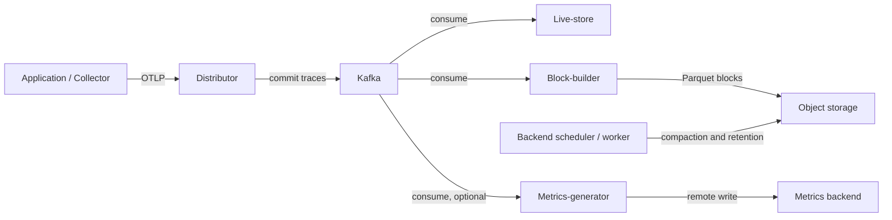
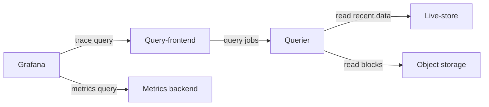

# Grafana Tempo

> **审阅基线**: Tempo 3.0.3；`tempo-distributed` chart 3.6.0（appVersion 3.0.3）
> **最后更新**: September 13, 2026

## 简介

Grafana Tempo 使用对象存储、Parquet 块和 TraceQL 来存储与查询分布式追踪（distributed traces）。TraceID 只能定位**已保留且成功摄取的数据**；它无法恢复因采样、导出失败或保留期到期而丢失的 span。Tempo 不需要单独的通用搜索数据库，但专用列、元数据、缓存、计算以及对象存储请求仍然会产生成本。

本章将本地单体（monolithic）示例与分布式 EKS 配置基线分开介绍。我们检查了本地二进制文件、查询编译器、Helm 渲染和配置解析。**未**实际验证 EKS 部署、Kafka 认证、S3 授权、高可用以及生产环境容量规划。

## 主要特性

| 特性 | 范围 |
|---------|-------|
| 对象存储 | S3、GCS 和 Azure Blob；本地存储适用于范围受限的开发示例 |
| TraceQL | 属性、耗时、状态和结构化查询；metrics 函数与按 trace 聚合是不同的机制 |
| 协议 | OTLP，以及可选的接收器如 Jaeger 和 Zipkin；需要启用 chart 中对应的端口 |
| 关联 | 当标识符和数据源 UID 匹配时，Grafana 可关联 traces、logs、metrics 和 exemplars |
| 部署模式 | 单体模式 `target: all`，或使用 Kafka 兼容摄取队列的微服务模式 |
| 指标生成 | 可选的 span metrics 和 service graphs；需要 processors 和可用的 remote-write 目标 |

## 架构

**Tempo 3 的微服务模式需要 Kafka，单体模式不需要。** distributor 在提交到 Kafka 之后才确认摄取；live-store、block-builder 和 metrics-generator 各自独立消费。live-store 提供近期数据服务；block-builder 写入长期存储块。query-frontend 拆分工作，querier 从近期存储或对象存储读取。



读取路径（存储与指标组件相同）：



箭头表示请求和数据流向，并不涵盖每一个响应或控制平面连接。Grafana **查询**指标后端；metrics-generator 不会把指标存储在 Grafana 中。

### 组件详解

| 组件 | Tempo 3 中的职责 | 运维注意事项 |
|-----------|-------------------------|---------------------------|
| Distributor | 校验并将 traces 路由到 Kafka 分区 | 背压、接受/拒绝的字节数与 span 数 |
| Live-store | 近期 trace 查询与本地 WAL | 消费延迟（consumer lag）、本地容量与分区归属 |
| Block-builder | 消费 Kafka 并写入 Parquet 块 | 分区分配与对象存储吞吐 |
| Query-frontend / querier | 拆分、调度并执行查询 | 排队、扫描字节数、并发度与缓存 |
| Backend scheduler / worker | 压缩（compaction）、保留期与后台作业 | 调度器协调、worker 资源与失败作业 |
| Metrics-generator | 生成 span metrics 与 service graphs | 基数（cardinality）、processor 启用情况与 remote-write 健康状况 |

Tempo 2 的 `ingester` 和 `compactor` 配置并不是 Tempo 3 的安装方案。分布式的 **2→3 迁移是并行（side by side）方式**：需要兼容的现有存储块（`vParquet4` 或更高版本）、新的摄取路径以及受控的流量切换。不支持从 3 降级到 2。在没有[官方迁移流程](https://grafana.com/docs/tempo/latest/set-up-for-tracing/setup-tempo/upgrade/)的情况下，不要让相互竞争的多个安装实例指向同一份可写数据。

Kafka 的副本机制、in-sync replicas、保留期和磁盘容量决定了写入路径的持久性。Tempo 的副本数既不能提供 Kafka 的持久性，也不能保证零丢失。在 chart 3.6.0 中，live-store 和 block-builder 的数据卷是 `emptyDir`；三个副本并不意味着三个持久化 PVC。

## Helm 安装（分布式模式）

### 1. 添加 Helm 仓库

使用受维护的社区 chart 并指定明确的版本：

```bash
helm repo add grafana-community https://grafana-community.github.io/helm-charts
helm repo update grafana-community
helm show chart grafana-community/tempo-distributed --version 3.6.0
helm show values grafana-community/tempo-distributed --version 3.6.0 > tempo-defaults.yaml
```

该 chart 声明 Kubernetes `^1.25.0-0`。这只是 chart 的约束条件，**并非**针对每个 Kubernetes/EKS 版本及插件组合的测试矩阵。

### 2. values.yaml 配置

将以下内容保存为 `tempo-distributed-values.yaml`。它只是**用于渲染的起点**，其中账号/存储桶名称为占位符，Kafka 地址仅用于隔离测试。

```yaml
# Render-only baseline. Read the Kafka security/deployment gates first.
fullnameOverride: tempo
reportingEnabled: false
serviceAccount:
  create: true
  name: tempo
  annotations:
    eks.amazonaws.com/role-arn: arn:aws:iam::123456789012:role/tempo-s3
traces:
  otlp:
    grpc:
      enabled: true
    http:
      enabled: true
ingest:
  kafka:
    address: kafka-bootstrap.kafka.svc.cluster.local:9092
    topic: tempo-traces
    auto_create_topic_enabled: false
storage:
  trace:
    backend: s3
    s3:
      bucket: replace-with-owned-tempo-bucket
      region: ap-northeast-2
      endpoint: s3.ap-northeast-2.amazonaws.com
      insecure: false
backendScheduler:
  config:
    provider:
      compaction:
        compaction:
          block_retention: 336h
metricsGenerator:
  enabled: false
gateway:
  enabled: false
ingress:
  enabled: false
metaMonitoring:
  serviceMonitor:
    enabled: false
tempo:
  structuredConfig:
    distributor:
      receivers:
        otlp:
          protocols:
            grpc:
              max_recv_msg_size_mib: 16
    overrides:
      defaults:
        ingestion:
          rate_limit_bytes: 15000000
          burst_size_bytes: 20000000
```

在实际部署前，请先满足以下要求：

- 单独准备并拥有 Kafka topic。默认的三个 live-store/block-builder 副本以及 `partitions_per_instance: 1` 需要匹配的分区设计；仅扩展 Pod 并不会重新分配所有 block-builder 的归属。
- 端到端验证 Kafka 传输与认证。Tempo **3.0.3 的 Kafka 客户端仅提供 SASL/PLAIN，不支持 Kafka TLS、SCRAM 或 MSK IAM 配置**。PLAIN 不等于加密。本示例不是可直接用于 MSK 的安全方案。网络/代理方案必须覆盖所有对外通告（advertised）的 broker 端点，而不仅是 bootstrap，并且必须在投入生产前独立测试。
- 使用下一节中的 S3 存储桶和 role。设置准确的 ServiceAccount 名称和 role 注解；创建一个无关的 ServiceAccount 是不够的。
- 使用集群实际的网络控制和经过认证的传输来限制对 OTLP、查询、memberlist 和组件 RPC 的访问。仅有内部负载均衡器或 `X-Scope-OrgID` 请求头并不构成认证。
- 为该工作负载设置资源、调度、中断预算以及存储/恢复策略。PodDisruptionBudget 限制的是自愿驱逐；反亲和性（anti-affinity）控制的是调度位置。两者都不能证明可用性。

接收大小限制的单位是 **MiB**；摄取速率/突发字段的单位是**字节**。16 MiB 与 15/20 MB 只是示例性限制值，并非实测容量。

可选的指标生成既需要启用，也需要一个已存在且经过认证的接收端。只有在创建了包含三个指定证书文件的 `tempo-metrics-client` Secret 并替换了 URL 之后，才可以合并第二个文件：

```yaml
metricsGenerator:
  enabled: true
  config:
    storage:
      remote_write:
        - url: https://metrics-write.example.org/api/v1/write
          send_exemplars: true
          tls_config:
            ca_file: /etc/metrics-tls/ca.crt
            cert_file: /etc/metrics-tls/tls.crt
            key_file: /etc/metrics-tls/tls.key
  extraVolumes:
    - name: metrics-tls
      secret:
        secretName: tempo-metrics-client
  extraVolumeMounts:
    - name: metrics-tls
      mountPath: /etc/metrics-tls
      readOnly: true
overrides:
  defaults:
    metrics_generator:
      processors: [span-metrics, service-graphs]
      generate_native_histograms: both
```

接收端必须支持 Prometheus remote write；exemplars 和 native histograms 还需要目标端的支持。该 chart 默认的 generator WAL 是临时的。请单独验证重放/队列/存储行为；不要把 `send_exemplars: true` 理解为投递保证。

### 3. IRSA 配置

该示例使用准确的身份 `system:serviceaccount:monitoring:tempo`。其 role 信任关系同时受 OIDC 的 `sub` 和 `aud` claim 限制。该 role 只允许访问自己拥有的 Tempo 存储桶。避免在环境变量或 Helm values 中使用静态访问密钥。

IRSA 是这里展示的具体方案，但并不是 EKS 上唯一可用的工作负载身份方式。若改用 Pod Identity，需要对照所固定 Tempo 镜像使用的凭证提供程序进行验证。此外还要确认 STS 可达性、存储桶策略、VPC 端点以及任何 KMS 密钥策略；YAML 渲染成功并不能证明其中任何一项。

### 4. 执行安装

先在不连接集群的情况下渲染并检查：

```bash
helm template tempo grafana-community/tempo-distributed \
  --version 3.6.0 --namespace monitoring --kube-version 1.36.2 \
  -f tempo-distributed-values.yaml > tempo-rendered.yaml
```

`--kube-version` 只决定渲染时可用的能力；它不代表已认证兼容 EKS 1.36.2。请检查 Service 端口、Pod 身份、ConfigMap、资源设置以及可选的 generator 配置。提取渲染出的 `tempo.yaml` 并用**版本匹配的**二进制文件验证：

```bash
tempo -config.file=tempo.yaml -config.verify=true
```

该命令会在服务初始化之前退出。它不会连接 Kafka/S3，也不会完整验证任意接收器配置。**在满足上述部署要求之前，不要执行 Helm 安装。** 之后请在你的部署流程中使用经过审阅的 values 以及自己拥有的 release/namespace，并准备回滚/迁移方案。

如需进行本地单进程检查，请将下面这份独立文件保存为 `tempo-local.yaml`，并使用适用于你的操作系统/架构、已验证的官方 Tempo 3.0.3 二进制文件：

```yaml
target: all
stream_over_http_enabled: true
server:
  http_listen_address: 127.0.0.1
  http_listen_port: 3200
  grpc_listen_address: 127.0.0.1
  grpc_listen_port: 9095
distributor:
  receivers:
    otlp:
      protocols:
        grpc:
          endpoint: 127.0.0.1:4317
        http:
          endpoint: 127.0.0.1:4318
storage:
  trace:
    backend: local
    wal:
      path: ./tempo-data/wal
    local:
      path: ./tempo-data/blocks
live_store:
  wal:
    path: ./tempo-data/live-store/traces
  shutdown_marker_dir: ./tempo-data/live-store/shutdown-marker
  ring:
    instance_addr: 127.0.0.1
    instance_interface_names: [lo]
metrics_generator:
  storage:
    path: ./tempo-data/generator/wal
backend_scheduler:
  local_work_path: ./tempo-data/scheduler
memberlist:
  bind_addr: [127.0.0.1]
  advertise_addr: 127.0.0.1
usage_report:
  reporting_enabled: false
```

```bash
tempo -config.file=tempo-local.yaml -config.verify=true
tempo -config.file=tempo-local.yaml
# In a second terminal:
curl --fail http://127.0.0.1:3200/ready
```

它绑定在回环地址、禁用了使用情况上报，并把数据写入 `./tempo-data`。用 Ctrl-C 停止该进程。这只是一个本地实例，没有 Kafka、S3、认证网关，也不具备任何高可用能力。

## TraceQL 查询

### 基本语法

可以使用 Grafana Explore 的 TraceID 模式直接查找，或在 TraceQL intrinsic 中使用完整的 32 位十六进制 ID：

```traceql
{ trace:id = "4bf92f3577b34da6a3ce929d0e0e4736" }
{ resource.service.name = "payment-service" }
{ span.http.response.status_code >= 400 }
{ duration > 1s }
{ status = error }
```

这些是彼此独立的查询。span 状态为 `error` 并不等同于所有 HTTP 状态码 ≥400 的情况。属性名取决于产生数据的 SDK 所遵循的语义约定版本：较早的 `http.status_code` 和 `db.system` 数据仍然以其原始名称可查；Tempo 不会自动重命名已存储的属性。

### 高级查询示例

```traceql
{ span.db.system.name = "postgresql" && duration > 100ms }
{ span.http.route = "/api/payment" && status = error }
{ resource.service.name = "api-gateway" } >> { resource.service.name = "payment-service" }
{ resource.service.name = "order-service" } > { span.db.system.name = "postgresql" }
{ resource.service.name = "order-service" } ~ { resource.service.name = "inventory-service" }
{ trace:rootService = "api-gateway" } | count() > 50
{ duration > 2s } | by(resource.service.name) | avg(duration) > 2s
{ status = error } | rate() by (resource.service.name)
{ } | avg_over_time(duration) by (resource.service.name)
```

- `A >> B` 返回 A 的匹配**后代 B**；`A > B` 返回匹配的直接子级 B。若要获取父级，请使用相应的反向关系，而不要把子级描述成父级。
- `A ~ B` 匹配兄弟节点。它并不表示存在 A→B 的网络调用。
- `count()` 统计**当前 spanset** 中的 span 数量。若先过滤出错误再计数，得到的是错误 span 数，而不是 trace 中的全部 span 数。`traceSpanCount` 不是有效的 intrinsic。
- 该版本接受 `nestedSetParent`，但它是内部的 nested-set 父级标记，而不是嵌套深度计数器。
- `by(...) | avg(...) > ...` 过滤的是按 trace 的 spanset；`rate()` 和 `avg_over_time(...)` 产生时间序列。前者是错误 span 的速率，**而不是错误比例**。时间区间要在 Grafana 或查询 API 中选择；耗时过滤条件不是墙钟时间范围。

诸如 `{ span.user.id = "synthetic-user-123" }` 这样的查询要求应用显式发出该属性。请使用合成的或经批准的假名标识符；不要把个人数据变成追踪的前提条件。优先使用低基数的 `http.route`，而不是包含用户 ID 或查询字符串的字面 URL。

### 在 Grafana 中使用 TraceQL

使用 query-frontend 的 URL 和端口 **3200** 创建 Tempo 数据源，然后选择 Explore → Tempo → Search/TraceQL。`tempo` 这个 UID 必须与日志链接和 exemplar 目标中的一致。在提高查询并发度或上限之前，先缩短时间范围。

## S3 后端配置

### S3 存储桶设置

使用专用存储桶，并启用 Block Public Access、bucket-owner-enforced 所有权和加密。将其所有权保持在单一的基础设施状态中；不要同时用 CLI 片段和 Terraform 创建同一个存储桶。

Tempo 的 `block_retention: 336h` 是由后台处理异步执行的保留目标，而不是精确的删除截止时间。一条笼统的 S3“30 天后删除所有对象”策略可能与压缩和元数据冲突。在没有明确记录的、了解后端特性的生命周期设计之前，不要添加此类策略。如果启用了版本控制，删除当前对象可能会留下非当前版本并继续产生费用；请单独定义它们的保留和恢复要求。

### 使用 Terraform 配置 S3 与 IRSA

这个 AWS provider **6.64.0** 示例使用 SSE-S3 和**已存在的**集群 OIDC provider。请替换账号、全局唯一的存储桶名称和 issuer 输入。它有意不创建 EKS 集群、Kafka 或 KMS 密钥。

```hcl
terraform {
  required_version = ">= 1.6.0"
  required_providers {
    aws = {
      source  = "hashicorp/aws"
      version = "6.64.0"
    }
  }
}

variable "region" {
  type    = string
  default = "ap-northeast-2"
}
variable "account_id" {
  type = string
  validation {
    condition     = can(regex("^[0-9]{12}$", var.account_id))
    error_message = "Supply the bucket and role owner account ID."
  }
}
variable "bucket_name" { type = string }
variable "oidc_provider_arn" { type = string }
variable "oidc_issuer_hostpath" {
  type        = string
  description = "Existing cluster OIDC issuer without https://."
}
provider "aws" { region = var.region }

resource "aws_s3_bucket" "tempo" {
  bucket        = var.bucket_name
  force_destroy = false
  lifecycle { prevent_destroy = true }
}
resource "aws_s3_bucket_public_access_block" "tempo" {
  bucket                  = aws_s3_bucket.tempo.id
  block_public_acls       = true
  block_public_policy     = true
  ignore_public_acls      = true
  restrict_public_buckets = true
}
resource "aws_s3_bucket_ownership_controls" "tempo" {
  bucket = aws_s3_bucket.tempo.id
  rule { object_ownership = "BucketOwnerEnforced" }
}
resource "aws_s3_bucket_server_side_encryption_configuration" "tempo" {
  bucket = aws_s3_bucket.tempo.id
  rule {
    apply_server_side_encryption_by_default { sse_algorithm = "AES256" }
  }
}
resource "aws_s3_bucket_policy" "tempo" {
  bucket = aws_s3_bucket.tempo.id
  policy = jsonencode({
    Version = "2012-10-17"
    Statement = [{
      Sid       = "DenyInsecureTransport"
      Effect    = "Deny"
      Principal = "*"
      Action    = "s3:*"
      Resource  = [aws_s3_bucket.tempo.arn, "${aws_s3_bucket.tempo.arn}/*"]
      Condition = { Bool = { "aws:SecureTransport" = "false" } }
    }]
  })
}
resource "aws_iam_role" "tempo" {
  name = "tempo-s3"
  assume_role_policy = jsonencode({
    Version = "2012-10-17"
    Statement = [{
      Effect    = "Allow"
      Principal = { Federated = var.oidc_provider_arn }
      Action    = "sts:AssumeRoleWithWebIdentity"
      Condition = {
        StringEquals = {
          "${var.oidc_issuer_hostpath}:aud" = "sts.amazonaws.com"
          "${var.oidc_issuer_hostpath}:sub" = "system:serviceaccount:monitoring:tempo"
        }
      }
    }]
  })
}
resource "aws_iam_role_policy" "tempo" {
  role = aws_iam_role.tempo.id
  policy = jsonencode({
    Version = "2012-10-17"
    Statement = [
      {
        Effect    = "Allow"
        Action    = ["s3:ListBucket", "s3:GetBucketLocation"]
        Resource  = aws_s3_bucket.tempo.arn
        Condition = { StringEquals = { "aws:ResourceAccount" = var.account_id } }
      },
      {
        Effect    = "Allow"
        Action    = ["s3:GetObject", "s3:PutObject", "s3:DeleteObject", "s3:AbortMultipartUpload"]
        Resource  = "${aws_s3_bucket.tempo.arn}/*"
        Condition = { StringEquals = { "aws:ResourceAccount" = var.account_id } }
      }
    ]
  })
}
output "tempo_role_arn" { value = aws_iam_role.tempo.arn }
output "tempo_bucket" { value = aws_s3_bucket.tempo.id }
```

在 Helm values 中使用 `tempo_role_arn` 和 `tempo_bucket`。在执行 plan 之前进行 Terraform 格式化/schema 校验很有帮助；在 apply 之前请审阅实际的 plan 和资源所有权。若要使用 SSE-KMS，必须显式提供自己拥有的密钥、兼容的存储桶/Tempo 设置、范围受限的 `kms:GenerateDataKey`/`kms:Decrypt` 权限，以及允许该工作负载使用的密钥策略。引用一个未定义的 `aws_kms_key` 并不构成完整配置。

## Trace 与日志关联（Loki 集成）

### Grafana 数据源配置

这是一份 **Grafana provisioning 文件**，不是特定 chart 的 `values.yaml`。请通过你所用 Grafana chart 支持的机制挂载它。其中三个内部 URL 是已存在且受访问控制的服务的占位符：

```yaml
apiVersion: 1
datasources:
  - name: Tempo
    uid: tempo
    type: tempo
    access: proxy
    url: http://tempo-query-frontend.monitoring.svc.cluster.local:3200
    jsonData:
      tracesToLogsV2:
        datasourceUid: loki
        spanStartTimeShift: '-1m'
        spanEndTimeShift: '1m'
        tags: [{key: service.name, value: service_name}]
        filterByTraceID: true
        filterBySpanID: false
        customQuery: false
      tracesToMetrics:
        datasourceUid: prometheus
        tags: [{key: service.name, value: service}]
        queries:
          - name: Span request rate
            query: 'sum(rate(traces_spanmetrics_calls_total{$$__tags}[5m]))'
          - name: Span error ratio
            query: '(sum(rate(traces_spanmetrics_calls_total{$$__tags,status_code="STATUS_CODE_ERROR"}[5m])) or (0 * sum(rate(traces_spanmetrics_calls_total{$$__tags}[5m])))) / (sum(rate(traces_spanmetrics_calls_total{$$__tags}[5m])) > 0)'
      serviceMap:
        datasourceUid: prometheus
      nodeGraph:
        enabled: true
  - name: Loki
    uid: loki
    type: loki
    access: proxy
    url: http://loki-gateway.logging.svc.cluster.local
    jsonData:
      derivedFields:
        - name: TraceID
          matcherRegex: '"traceId"\s*:\s*"([0-9a-f]{32})"'
          datasourceUid: tempo
          url: '$${__value.raw}'
  - name: Prometheus
    uid: prometheus
    type: prometheus
    access: proxy
    url: http://prometheus-operated.monitoring.svc.cluster.local:9090
    jsonData:
      httpMethod: POST
      exemplarTraceIdDestinations:
        - name: traceID
          datasourceUid: tempo
```

Tempo 的 `tracesToLogsV2` 实现 **Trace→Logs**；Loki 的 `derivedFields` 实现 **Logs→Trace**。该示例把 OTel 的 `service.name` 属性映射到 Loki 已有的 `service_name` 标签。请核实你的 collector 的映射关系；链接本身无法凭空创造标签或日志记录。示例中禁用了 span 过滤，因为并非每条日志都带有 span ID。

在 provisioning YAML 中，`$$` 用于保留字面量 `$`，以便 Grafana 在运行时展开宏。`__tags` 会展开成一组标签匹配器；不要把它作为 `service="..."` 的值嵌入。错误比例查询会用总量序列补齐缺失的错误序列，并且只在总速率为正时才做除法。零流量和缺失遥测数据的情况仍然返回空结果。

span metrics 的标签 `service` 和状态值 `STATUS_CODE_ERROR` 必须与实际生成的序列一致。Exemplars 使用实际观察到的 exemplar 标签名（示例 generator 配置中为 `traceID`）；其他生产者可能使用 `trace_id`。采样会使这些指标与应用的完整请求数不一致。

### 应用日志

对于使用 OpenTelemetry API 1.44 的 Python，应检查 context 的有效性，而不是 `span.is_recording()`。一个有效但不记录（nonrecording）的 span 仍然可以用于关联日志：

```python
import datetime
import json
import logging
from opentelemetry import trace


class TraceJsonFormatter(logging.Formatter):
    def format(self, record):
        payload = {
            "timestamp": datetime.datetime.fromtimestamp(
                record.created, datetime.timezone.utc
            ).isoformat(),
            "level": record.levelname,
            "message": record.getMessage(),
        }
        context = trace.get_current_span().get_span_context()
        if context.is_valid:
            payload["traceId"] = f"{context.trace_id:032x}"
            payload["spanId"] = f"{context.span_id:016x}"
        if record.exc_info:
            payload["exception"] = self.formatException(record.exc_info)
        return json.dumps(payload, ensure_ascii=False)


logger = logging.getLogger("payment")
logger.setLevel(logging.INFO)
logger.propagate = False
# Configure once at application startup.
if not logger.handlers:
    handler = logging.StreamHandler()
    handler.setFormatter(TraceJsonFormatter())
    logger.addHandler(handler)
```

这段代码保留了 UTC 时间戳、消息格式化和异常信息，并且会省略无效 ID，而不是伪造全零的 trace。handler 只需配置一次；请在异步边界之间传播 OTel context，并在源头对敏感消息/异常做脱敏处理。

对于 Java，请使用[追踪概览中的作用域化 MDC 辅助方法 (English)](https://www.atomai.click/kubernetes-docs/en/observability/tracing/#linking-logs-via-traceid)：校验当前的 `SpanContext`，为日志作用域设置 ID，并在 `finally` 中恢复先前的 MDC 值。仅调用 `MDC.put` 可能在复用线程上泄漏上一个请求的 ID。我们检查了 Java API 契约；本章未运行任何 Java 应用。

## 性能调优

### 摄取速率优化

测量接受/拒绝的字节数与 span 数、exporter 重试、Kafka 生产者错误以及消费延迟。在内存和队列容量不足的情况下增大接收大小、摄取上限或副本数，可能只是把瓶颈转移，而不是消除瓶颈。在解读生成的指标时，请保持上游采样假设的一致性。

租户限制使用 `overrides.defaults.ingestion`，gRPC 消息大小使用接收器的 `max_recv_msg_size_mib` 字段。旧的 `distributor.rate_limit` 配置块和 Tempo 2 的 `ingester` 调优块无法配置 Tempo 3。

### 压缩优化

通过 chart 的 `backendScheduler.config.provider.compaction.compaction` 设置以及相应的后端 worker 配置来配置保留期。观察作业年龄、失败情况、对象存储请求和临时工作空间。提高压缩并发度会增加对象存储流量和内存占用；旧架构中“每个集群一个 compactor”的规则并不普遍适用。

### 查询性能优化

先缩小时间范围并提高选择性；然后检查扫描字节数、排队情况、querier 并发度和相关的缓存角色。请按照所固定的 chart/配置来设置缓存字段，而不是复制已被移除的 `cache:` 结构。对象存储的 hedging 能以额外请求为代价改善尾部延迟；请通过测量来验证这种权衡。

Tempo 3 的 live-store `fail_on_high_lag` 默认为 true，query-frontend 的 `query_end_cutoff` 默认为 30s。最近数据的搜索可见性可能落后于直接的 TraceID 查找。不要仅为了让空仪表板看起来正常而禁用这些保护机制。

### 资源建议

distributor 按摄入量规划，live-store 按近期 trace 量/延迟规划，block-builder 按分配的分区数和块大小规划，querier 按查询并发度规划，generator 按活跃序列数规划。旧的、未经实测的 Tempo 2 Ingester/Compactor CPU 与磁盘表格不能作为 Tempo 3 的容量建议。请在具有代表性的流量下测量 CPU、RSS、本地/WAL 使用量、Kafka 延迟、请求成本和饱和度。

## 故障排查

### 常见问题与解决方法

#### 1. Trace 数据未显示

检查 SDK 导出错误、采样、传播的 context、collector 队列、OTLP 传输、租户路由和保留期。对 `/v1/traces` 发起 GET 请求不是摄取测试；应发送一个有效的 OTLP POST，然后查询其已知的合成 TraceID。仅靠 `/ready` 探针成功并不能证明所有环节都正常工作。

#### 2. S3 权限错误

检查准确的 ServiceAccount、role 信任关系、存储桶策略、端点可达性，以及（如适用）KMS 策略。不要导出 Pod 环境变量或投射的 token。不要假设 Tempo 镜像中包含 AWS CLI 或 shell。

```bash
kubectl get serviceaccount tempo -n monitoring -o yaml
kubectl get pods -n monitoring -l app.kubernetes.io/instance=tempo \
  -o custom-columns=NAME:.metadata.name,SA:.spec.serviceAccountName
kubectl logs -n monitoring -l app.kubernetes.io/component=block-builder --tail=100
```

限制对诊断输出的访问：日志中可能包含运维元数据或应用属性。

#### 3. 查询超时

检查 query-frontend/querier 日志、时间范围、Kafka 延迟、可用的 live-store 分区以及 S3 限流。只有在测量了内存和后端限制之后才提高并发度。请把空结果、超时和遥测数据缺失视为不同的状态。

#### 4. Live-store 内存压力

对于 Tempo 3，检查 live-store 内存、近期数据窗口、块轮转和分区归属。对于仍在运行的 Tempo 2 部署，迁移期间请参考其对应版本的 ingester 文档；把 `ingester.max_block_duration: 30m` 复制到 Tempo 3 并不能调优 live-store。

### 有用的调试命令

使用授权的 port-forward 来检查实际的 query-frontend：

```bash
kubectl port-forward -n monitoring service/tempo-query-frontend 3200:3200
# In a second terminal:
curl --fail http://127.0.0.1:3200/ready
curl --fail http://127.0.0.1:3200/metrics
curl --fail http://127.0.0.1:3200/api/traces/4bf92f3577b34da6a3ce929d0e0e4736
```

最后那个 ID 必须在该部署中真实存在。只读的 ring/status 端点因组件而异；使用前请核实所固定版本的 API。已被移除的 `/ingester/ring`、`/compactor/ring` 和强制 flush 命令不是 Tempo 3 的通用诊断手段。

### 监控仪表板

请使用你的部署实际发出的序列，并加上其目标标签：

```promql
sum(rate(tempo_distributor_spans_received_total[5m]))
sum(process_resident_memory_bytes{job=~"tempo.*"})
histogram_quantile(0.99, sum by (le) (rate(tempo_request_duration_seconds_bucket{route="api_search"}[5m])))
```

这些面板分别表示**每秒接收的 span 数**、**进程 RSS 字节数**和 **HTTP 搜索请求 p99 秒数**。内存查询假定了你的抓取作业命名方式；请先检查标签。字节写入计数器不是内存，span 数也不是 trace 数。该请求直方图/route 是在本地 Tempo 3.0.3 冒烟测试中观察到的；它不是分布式端到端延迟测量结果。

## 参考资料

- [Tempo 3.0.3 release](https://github.com/grafana/tempo/releases/tag/v3.0.3)、[chart 3.6.0 values](https://github.com/grafana-community/helm-charts/blob/tempo-distributed-3.6.0/charts/tempo-distributed/values.yaml)
- [Tempo 架构](https://grafana.com/docs/tempo/latest/introduction/architecture/)、[Kafka 客户端实现](https://github.com/grafana/tempo/blob/v3.0.3/pkg/ingest/writer_client.go)
- [TraceQL 语法](https://grafana.com/docs/tempo/latest/traceql/construct-traceql-queries/)、[Grafana provisioning](https://grafana.com/docs/grafana/latest/datasources/tempo/configure-tempo-data-source/provision/)
- [EKS IRSA 关联](https://docs.aws.amazon.com/eks/latest/userguide/associate-service-account-role.html)、[S3 Block Public Access](https://docs.aws.amazon.com/AmazonS3/latest/userguide/access-control-block-public-access.html)

## 测验

通过 [Tempo 测验](../../quizzes/observability/tracing/01-tempo-quiz.md)检验本章内容。
