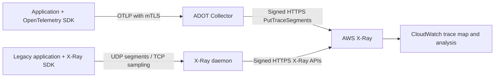
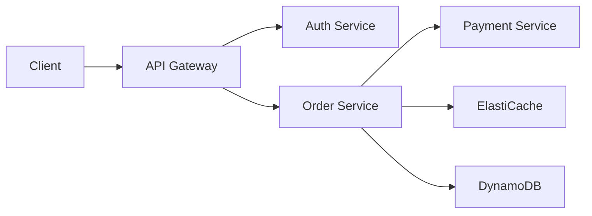

# AWS X-Ray

> **最后更新**: September 13, 2026

## 简介

AWS X-Ray 是一项 AWS 原生服务，用于追踪和分析分布式应用程序中的请求。在 EKS 环境中使用 X-Ray 可让您可视化微服务之间的请求流、识别性能瓶颈并确定错误的根本原因。

**自 2026 年 2 月 25 日起，X-Ray SDK 和 daemon 已进入维护模式**，根据当前的[支持时间线](https://docs.aws.amazon.com/xray/latest/devguide/xray-sdk-daemon-timeline.html)，仅提供安全修复，且尚未宣布结束日期。这是插桩生命周期，而非 X-Ray 服务退役。AWS 建议在新的插桩和迁移中使用 OpenTelemetry。下面的 daemon 示例是一条旧版兼容路径。

## 主要功能

| 功能 | 说明 |
|---------|-------------|
| **服务地图** | 自动可视化服务依赖关系 |
| **请求追踪** | 端到端请求路径跟踪 |
| **分析工具** | 响应时间分布、错误率分析 |
| **AWS 集成** | 原生支持 Lambda、API Gateway、ECS、EKS |
| **采样规则** | 集中式采样配置 |
| **组和告警** | 基于筛选条件的分组和 CloudWatch 告警 |

## 架构

下图展示了此处所述的两种采集替代方案。daemon 向 AWS 发送已签名的 HTTPS 请求；UDP/TCP2000 是面向应用程序的旧版协议。已配置的 ADOT awsxray exporter 使用 PutTraceSegments，而非原生 CloudWatch OTLP 端点。



EKS 不会自动为每个应用程序添加插桩。Lambda/API Gateway 和其他服务集成需要各自受支持的追踪配置和传播。原生 CloudWatch OTLP 是独立的摄取路径，具有 Transaction Search 和 SigV4 前提条件，如下所述。

## X-Ray Daemon 部署

### 以 DaemonSet 部署

```yaml
# xray-daemon.yaml
apiVersion: v1
kind: ServiceAccount
metadata:
  name: xray-daemon
  namespace: amazon-cloudwatch
  annotations:
    eks.amazonaws.com/role-arn: arn:aws:iam::123456789012:role/xray-daemon-role
---
apiVersion: apps/v1
kind: DaemonSet
metadata:
  name: xray-daemon
  namespace: amazon-cloudwatch
spec:
  selector:
    matchLabels:
      app: xray-daemon
  updateStrategy:
    type: RollingUpdate
  template:
    metadata:
      labels:
        app: xray-daemon
    spec:
      serviceAccountName: xray-daemon
      nodeSelector:
        kubernetes.io/os: linux
      containers:
        - name: xray-daemon
          image: amazon/aws-xray-daemon:3.7.0@sha256:a2303d37f9dd7077c93e596689cb1de12f2ef8333c15b088ba223840164f6bc2
          args: ["-o", "-n", "ap-northeast-2"]
          ports:
            - name: xray-udp
              containerPort: 2000
              protocol: UDP
            - name: xray-tcp
              containerPort: 2000
              protocol: TCP
          resources:
            requests:
              cpu: 50m
              memory: 64Mi
            limits:
              cpu: 100m
              memory: 128Mi
          env:
            - name: AWS_REGION
              value: ap-northeast-2
      tolerations:
        - key: node-role.kubernetes.io/master
          effect: NoSchedule
---
apiVersion: v1
kind: Service
metadata:
  name: xray-daemon
  namespace: amazon-cloudwatch
spec:
  selector:
    app: xray-daemon
  ports:
    - name: xray-udp
      port: 2000
      protocol: UDP
    - name: xray-tcp
      port: 2000
      protocol: TCP
  type: ClusterIP
```

此维护路径镜像固定为已验证的官方 3.7.0 多架构 manifest（Linux amd64/arm64）。其入口点是 `/xray`，不是 `/usr/bin/xray`；`-o` 禁用 EC2 元数据扩充，`-n` 提供 Region。DaemonSet 不会在 EKS Fargate 上运行。此 ClusterIP Service 可以选择另一个节点上的 daemon，因此不能保证节点本地交付或无丢失 UDP。

对于旧版 SDK 客户端，请设置 `AWS_XRAY_DAEMON_ADDRESS=xray-daemon.amazon-cloudwatch.svc.cluster.local:2000`。UDP segment 和 TCP 采样流量都需要可达性。将这条未加密的旧版路径限制为受信任的工作负载；对已认证的 TLS 采集使用 OpenTelemetry 路径。每个 producer 选择一条采集路径。


### IRSA 配置

通过其现有所有者创建 `amazon-cloudwatch` namespace。旧版 daemon 的 `xray-daemon` ServiceAccount 必须引用其自身准备好的 role。以下权限 policy 涵盖 segment/telemetry 导出和集中式采样调用；请将 Region 替换为实际部署 Region：

```json
{
  "Version": "2012-10-17",
  "Statement": [
    {
      "Effect": "Allow",
      "Action": [
        "xray:PutTraceSegments",
        "xray:PutTelemetryRecords",
        "xray:GetSamplingRules",
        "xray:GetSamplingTargets",
        "xray:GetSamplingStatisticSummaries"
      ],
      "Resource": "*",
      "Condition": {
        "StringEquals": {
          "aws:RequestedRegion": "ap-northeast-2"
        }
      }
    }
  ]
}
```

这些 X-Ray 操作使用 `Resource: "*"`，此处由 `aws:RequestedRegion` 约束。daemon 的 policy 与下面较窄的 ADOT policy 分开。两项 policy 均不授予 operator 创建组或采样规则的权限。

对于任一 collector，请使用集群已注册的 OIDC provider、`aud=sts.amazonaws.com` 和**精确的 namespace/ServiceAccount subject**准备一个 IRSA role。以下信任示例适用于 `adot-collector`；daemon role 则需要 `system:serviceaccount:amazon-cloudwatch:xray-daemon`。请一致地替换示例 account、Region 和 OIDC ID。

```json
{
  "Version": "2012-10-17",
  "Statement": [
    {
      "Effect": "Allow",
      "Principal": {
        "Federated": "arn:aws:iam::123456789012:oidc-provider/oidc.eks.ap-northeast-2.amazonaws.com/id/EXAMPLE"
      },
      "Action": "sts:AssumeRoleWithWebIdentity",
      "Condition": {
        "StringEquals": {
          "oidc.eks.ap-northeast-2.amazonaws.com/id/EXAMPLE:aud": "sts.amazonaws.com",
          "oidc.eks.ap-northeast-2.amazonaws.com/id/EXAMPLE:sub": "system:serviceaccount:amazon-cloudwatch:adot-collector"
        }
      }
    }
  ]
}
```

请 IAM/基础设施所有者创建或更新预期的 role 并附加匹配的权限 policy。保留现有 ServiceAccount 的所有权；不要将 `eksctl --override-existing-serviceaccounts` 作为通用设置步骤运行。在批准的环境中验证渲染后 Pod 的 projected token、role ARN、SDK 凭证解析和实际授权。仅有 ServiceAccount annotation 并不是授权测试。

## ADOT Collector 部署

此 trace pipeline 使用 [ADOT Collector 0.50.0](https://github.com/aws-observability/aws-otel-collector/releases/tag/v0.50.0)，基于 Collector/Contrib 0.158.0。已发布的 ADOT distribution 有自己的 component inventory；不要假设其包含上游 Contrib 版本中的每个 component。固定的 collector binary 已使用合成 OTLP/X-Ray 数据和一个假的 loopback X-Ray endpoint 在本地进行了测试。未执行 AWS 授权、Kubernetes 部署或生产可用性测试。

<a id="adot-collector-daemonset"></a>

### Collector 部署和前提条件

该示例是一个中心化的 **Deployment** 和 ClusterIP Service，没有 host port。它不是 HA 配置。应用程序显式选择其 DNS endpoint；安装它不会为应用程序添加插桩。DaemonSet 是一种独立的 placement design，且不受 EKS Fargate 支持。Fargate 上的 Deployment 仍需匹配的 Fargate profile 以及受支持的资源/存储/网络配置。

在应用这些资源之前：

- 使用上一节中的 subject `system:serviceaccount:amazon-cloudwatch:adot-collector` 准备 namespace 和 IRSA role。
- 通过已批准的证书流程交付现有 Kubernetes Secret `adot-collector-tls`。它包含 `server.crt`、`server.key` 和 `ca.crt`。server certificate 必须覆盖实际的 Service DNS name，例如 `adot-collector.amazon-cloudwatch.svc.cluster.local`；CA 必须信任预期的 client certificates。
- 将已批准的 CA/client certificate/key 文件挂载到 producers。限制对 Secret 的访问、工作负载对端口 4317/4318 和 health endpoint 的访问；规划证书轮换。不要将证书 private-key 内容或 AWS 凭证放入环境变量。
- 替换 cluster/account/Region 值并检查最终的 workload identity。resource processor 明确设置一个 cluster name；它不会发现所有 Pod/node 元数据，并且不得将来自无关 cluster 的流量重新标记为此 cluster。

以下 ADOT pipeline 禁用 exporter telemetry，并且只使用经典的 X-Ray `PutTraceSegments` 导出路径，因此其工作负载权限 policy 为：

```json
{
  "Version": "2012-10-17",
  "Statement": [
    {
      "Effect": "Allow",
      "Action": ["xray:PutTraceSegments"],
      "Resource": "*",
      "Condition": {
        "StringEquals": {
          "aws:RequestedRegion": "ap-northeast-2"
        }
      }
    }
  ]
}
```

将这个完整的 ConfigMap 与以下 workload/Service manifest 一起使用：

```yaml
apiVersion: v1
kind: ConfigMap
metadata:
  name: adot-collector-config
  namespace: amazon-cloudwatch
data:
  collector.yaml: |
    receivers:
      otlp:
        protocols:
          grpc:
            endpoint: 0.0.0.0:4317
            tls:
              cert_file: /etc/otel/tls/server.crt
              key_file: /etc/otel/tls/server.key
              client_ca_file: /etc/otel/tls/ca.crt
              min_version: "1.2"
          http:
            endpoint: 0.0.0.0:4318
            tls:
              cert_file: /etc/otel/tls/server.crt
              key_file: /etc/otel/tls/server.key
              client_ca_file: /etc/otel/tls/ca.crt
              min_version: "1.2"
    processors:
      memory_limiter:
        check_interval: 1s
        limit_mib: 400
        spike_limit_mib: 100
      resource:
        attributes:
          - key: cloud.provider
            value: aws
            action: upsert
          - key: k8s.cluster.name
            value: ${env:CLUSTER_NAME}
            action: upsert
      batch:
        timeout: 5s
        send_batch_size: 256
        send_batch_max_size: 512
    exporters:
      awsxray:
        region: ap-northeast-2
        local_mode: true
        index_all_attributes: false
        indexed_attributes:
          - deployment.environment.name
          - app.operation
        telemetry:
          enabled: false
    extensions:
      health_check:
        endpoint: 0.0.0.0:13133
    service:
      extensions: [health_check]
      pipelines:
        traces:
          receivers: [otlp]
          processors: [memory_limiter, resource, batch]
          exporters: [awsxray]
```

```yaml
apiVersion: v1
kind: ServiceAccount
metadata:
  name: adot-collector
  namespace: amazon-cloudwatch
  annotations:
    eks.amazonaws.com/role-arn: arn:aws:iam::123456789012:role/adot-xray-role
automountServiceAccountToken: false
---
apiVersion: apps/v1
kind: Deployment
metadata:
  name: adot-collector
  namespace: amazon-cloudwatch
spec:
  replicas: 1
  selector:
    matchLabels:
      app: adot-collector
  template:
    metadata:
      labels:
        app: adot-collector
    spec:
      serviceAccountName: adot-collector
      nodeSelector:
        kubernetes.io/os: linux
      automountServiceAccountToken: false
      terminationGracePeriodSeconds: 30
      securityContext:
        runAsNonRoot: true
        runAsUser: 4317
        runAsGroup: 4317
        fsGroup: 4317
        seccompProfile:
          type: RuntimeDefault
      containers:
        - name: collector
          image: public.ecr.aws/aws-observability/aws-otel-collector:v0.50.0
          args: ["--config=/conf/collector.yaml"]
          env:
            - name: CLUSTER_NAME
              value: replace-with-cluster-name
            - name: AWS_REGION
              value: ap-northeast-2
            - name: AWS_EC2_METADATA_DISABLED
              value: "true"
            - name: GOMEMLIMIT
              value: 400MiB
          resources:
            requests:
              cpu: 100m
              memory: 256Mi
            limits:
              cpu: 500m
              memory: 512Mi
          securityContext:
            allowPrivilegeEscalation: false
            readOnlyRootFilesystem: true
            capabilities:
              drop: [ALL]
          ports:
            - name: otlp-grpc
              containerPort: 4317
            - name: otlp-http
              containerPort: 4318
            - name: health
              containerPort: 13133
          volumeMounts:
            - name: config
              mountPath: /conf
              readOnly: true
            - name: tls
              mountPath: /etc/otel/tls
              readOnly: true
          readinessProbe:
            httpGet:
              path: /
              port: health
            initialDelaySeconds: 5
          livenessProbe:
            httpGet:
              path: /
              port: health
            initialDelaySeconds: 15
      volumes:
        - name: config
          configMap:
            name: adot-collector-config
        - name: tls
          secret:
            secretName: adot-collector-tls
            defaultMode: 0440
---
apiVersion: v1
kind: Service
metadata:
  name: adot-collector
  namespace: amazon-cloudwatch
spec:
  type: ClusterIP
  selector:
    app: adot-collector
  ports:
    - name: otlp-grpc
      port: 4317
      targetPort: otlp-grpc
    - name: otlp-http
      port: 4318
      targetPort: otlp-http
```

container image 提供 `RUN_IN_CONTAINER=True`；对于独立的 native collector 测试，需要此变量以使其自定义 CLI logging 不写入 `/opt`。其 CLI 不能与每个上游 `otelcol` 命令互换。本地测试使用了带版本的 AWS binary、测试证书和仅 loopback destinations。

建议的配置通过了五项本地 mTLS 检查，包括在没有 client certificate 时拒绝，以及在使用受信任证书时接受。这三个 Kubernetes 资源通过了本地 OpenAPI schema 验证。这并不验证实际的 Secret、IRSA mutation、CNI policy、调度或 AWS 权限。health endpoint 报告 collector process health，而非成功交付到 X-Ray。队列、重试、内存压力、终止和 backend 故障仍可能丢失 telemetry；请规划容量并监控被拒绝/丢弃/导出失败的数据。

### 旧版 X-Ray Receiver 和独立的 Telemetry Pipelines

ADOT 0.50.0 还包括 `awsxray` receiver。其受支持的 UDP 配置为：

```yaml
# Receiver fragment only; requires an explicitly connected trace pipeline.
receivers:
  awsxray:
    endpoint: 0.0.0.0:2000
    transport: udp
```

此旧版 receiver 是通过 daemon 发送 SDK segments 的替代方案；避免复制同一 producer 的 trace path。它默认还启动一个 TCP sampling proxy。如果使用集中式采样，请配置并限制所需的 TCP2000 Service/proxy path 和采样权限，以及 UDP2000。旧版协议不受 OTLP receiver 的 mTLS 设置保护。原生审计确认了 OTLP 和 X-Ray UDP 接收；它未执行远程 AWS sampling。

metrics、应用程序 logs 和 traces 需要各自连接的 pipelines 和 backend 配置。仅声明一个 `awscloudwatchlogs` exporter 不会将 traces 转换为 logs，也不会将其写入虚构的 `/aws/xray/traces` log group。同样，metrics remote-write endpoint 也需要其实际的 receiver、认证和 TLS 配置；它不是 X-Ray 的前提条件。

## OpenTelemetry 到 X-Ray 集成

这些示例使用上述已认证的 collector Service。producers 需要访问该 Service 及其挂载的 client TLS files；它们不需要 collector 的 AWS credentials。这些示例创建合成 spans，且不执行支付、数据库或 AWS 业务操作。

确切的验证基线是 Python SDK/exporter1.44.0 配合 Flask3.1.3、Go SDK/exporter1.44.0 配合 Go1.26.8，以及 Java1.66.0 API sources。这些固定版本不是通用的 AWS compatibility matrix，也不声明每种语言都具有相同的最新版本。Python 和 Go 已在本地进行了测试；Java API/configuration 已针对标记的 source 进行了检查，但在本次审计中没有可用的 JDK/Maven compilation。

对有限的 demo process 使用这些设置。endpoint 包含用于 OTLP/HTTP 的 `/v1/traces`。将 client private key 保存在挂载的受保护文件中。为此有限演示对 root spans 进行采样，并遵循 remote parent decisions；请选择经过衡量的生产 sampler，而不要将全 root demo 设置复制到不受限制的生产流量中。通用 SDK samplers 不会自动获取 X-Ray 集中式规则。

```bash
# Application-process configuration; mounted file paths are not secret contents.
export OTEL_SDK_DISABLED=false
export OTEL_SERVICE_NAME=inventory-demo
export OTEL_TRACES_EXPORTER=otlp
export OTEL_METRICS_EXPORTER=none
export OTEL_LOGS_EXPORTER=none
export OTEL_EXPORTER_OTLP_TRACES_PROTOCOL=http/protobuf
export OTEL_EXPORTER_OTLP_TRACES_ENDPOINT=https://adot-collector.amazon-cloudwatch.svc.cluster.local:4318/v1/traces
export OTEL_EXPORTER_OTLP_TRACES_CERTIFICATE=/etc/otel/client/ca.crt
export OTEL_EXPORTER_OTLP_TRACES_CLIENT_CERTIFICATE=/etc/otel/client/client.crt
export OTEL_EXPORTER_OTLP_TRACES_CLIENT_KEY=/etc/otel/client/client.key
export OTEL_PROPAGATORS=tracecontext
export OTEL_TRACES_SAMPLER=parentbased_always_on
```

### 应用程序配置 (Java)

将 `InventoryDemo.java` 保存到现有 Java project 中。Autoconfiguration 会读取标准 OTLP endpoint、protocol 和 CA/client-key/client-certificate file settings。它不会自动为整个应用程序添加插桩。如果 agent/framework 已拥有另一个 SDK，请不要初始化它。`OpenTelemetrySdk` 实现了 Closeable；关闭它会协调 provider shutdown，但一个已完成的方法调用并不能证明后端交付。

```xml
<!-- Dependency fragment for an existing Java17+ Maven project. -->
<dependencies>
  <dependency>
    <groupId>io.opentelemetry</groupId>
    <artifactId>opentelemetry-sdk-extension-autoconfigure</artifactId>
    <version>1.66.0</version>
  </dependency>
  <dependency>
    <groupId>io.opentelemetry</groupId>
    <artifactId>opentelemetry-exporter-otlp</artifactId>
    <version>1.66.0</version>
  </dependency>
</dependencies>
```

```java
import io.opentelemetry.api.trace.Span;
import io.opentelemetry.api.trace.Tracer;
import io.opentelemetry.context.Scope;
import io.opentelemetry.sdk.OpenTelemetrySdk;
import io.opentelemetry.sdk.autoconfigure.AutoConfiguredOpenTelemetrySdk;

// Standalone finite demo; do not create a second SDK when an agent/framework owns it.
public final class InventoryDemo {
    public static void main(String[] args) {
        try (OpenTelemetrySdk sdk = AutoConfiguredOpenTelemetrySdk.builder()
                .build().getOpenTelemetrySdk()) {
            Tracer tracer = sdk.getTracer("inventory-demo");
            Span root = tracer.spanBuilder("inventory.demo").startSpan();
            try (Scope ignored = root.makeCurrent()) {
                root.setAttribute("app.operation", "inventory.demo");
                root.setAttribute("deployment.environment.name", "demo");
                Span child = tracer.spanBuilder("inventory.lookup").startSpan();
                try {
                    child.setAttribute("lookup.result", "demo");
                    // No AWS or database call is performed by this example.
                } finally {
                    child.end();
                }
            } finally {
                root.end();
            }
        } // SDK close shuts down providers/exporters; delivery must still be monitored.
    }
}
```

### 应用程序配置 (Python)

使用隔离的应用程序环境，其中包含 `opentelemetry-api==1.44.0`、`opentelemetry-sdk==1.44.0`、`opentelemetry-exporter-otlp-proto-http==1.44.0` 和 `Flask==3.1.3`。将以下内容保存为 `payment_demo.py`。其 `/api/payment` endpoint 只返回合成响应；它不会收费或验证真实付款。本地 Flask development server 不是生产 WSGI deployment。

```python
"""Synthetic Flask instrumentation example: no payment is processed."""
import os
from pathlib import Path
from urllib.parse import urlparse

from flask import Flask, jsonify, request
from opentelemetry.exporter.otlp.proto.http.trace_exporter import OTLPSpanExporter
from opentelemetry.sdk.resources import Resource
from opentelemetry.sdk.trace import TracerProvider
from opentelemetry.sdk.trace.export import BatchSpanProcessor
from opentelemetry.sdk.trace.sampling import ParentBased, ALWAYS_ON
from opentelemetry.trace import SpanKind
from opentelemetry.trace.propagation.tracecontext import TraceContextTextMapPropagator


def configure_provider():
    endpoint = os.environ["OTEL_EXPORTER_OTLP_TRACES_ENDPOINT"]
    url = urlparse(endpoint)
    if url.scheme != "https" or not url.hostname or url.username or url.password:
        raise ValueError("Configure an HTTPS collector endpoint without URL credentials")
    certs = {
        "certificate_file": os.environ["OTEL_EXPORTER_OTLP_TRACES_CERTIFICATE"],
        "client_certificate_file": os.environ["OTEL_EXPORTER_OTLP_TRACES_CLIENT_CERTIFICATE"],
        "client_key_file": os.environ["OTEL_EXPORTER_OTLP_TRACES_CLIENT_KEY"],
    }
    for path in certs.values():
        if not Path(path).is_file():
            raise ValueError("A required mounted TLS file is missing")
    provider = TracerProvider(
        resource=Resource.create({"service.name": "payment-demo"}),
        # Finite demo traffic only. Select a measured production sampling policy.
        sampler=ParentBased(ALWAYS_ON),
    )
    provider.add_span_processor(BatchSpanProcessor(
        OTLPSpanExporter(endpoint=endpoint, timeout=5, **certs),
        max_queue_size=256, max_export_batch_size=64,
    ))
    return provider


def create_app(provider):
    app = Flask(__name__)
    tracer = provider.get_tracer("payment-demo")
    propagator = TraceContextTextMapPropagator()

    @app.post("/api/payment")
    def payment_demo():
        carrier = {name.lower(): value for name, value in request.headers.items()}
        parent = propagator.extract(carrier)
        with tracer.start_as_current_span(
            "POST /api/payment", context=parent, kind=SpanKind.SERVER
        ) as span:
            span.set_attribute("app.operation", "payment.demo")
            span.set_attribute("deployment.environment.name", "demo")
            span.set_attribute("http.request.method", "POST")
            span.set_attribute("http.route", "/api/payment")
            with tracer.start_as_current_span("validation.demo") as child:
                child.set_attribute("validation.result", "accepted")
            span.set_attribute("http.response.status_code", 202)
            # No request payload/Authorization/user ID is added to telemetry.
            return jsonify(status="demo-only-no-payment-processed"), 202

    return app


if __name__ == "__main__":
    provider = configure_provider()
    try:
        # Local development server only; not a production WSGI deployment.
        create_app(provider).run(host="127.0.0.1", port=8080)
    finally:
        provider.shutdown()
```

### 应用程序配置 (Go)

将以下 `go.mod` 和 `main.go` 保存到单独的 example directory 中，使用 `go mod tidy` 解析固定 dependencies，并且只在预期的 collector/TLS environment 中运行它。该示例发出两个有限 spans。`DEMO_TRACEPARENT` 是可选的演示 carrier；真实 HTTP handlers 必须从 request headers 中提取并注入到 outgoing requests。仅创建 SDK 不会为每个 HTTP/database library 添加插桩。

```text
module example.invalid/xray-otel-demo

go 1.25.0

require (
    go.opentelemetry.io/otel v1.44.0
    go.opentelemetry.io/otel/exporters/otlp/otlptrace/otlptracehttp v1.44.0
    go.opentelemetry.io/otel/sdk v1.44.0
    go.opentelemetry.io/otel/trace v1.44.0
)
```

```go
package main

import (
	"context"
	"fmt"
	"log"
	"net/url"
	"os"
	"time"

	"go.opentelemetry.io/otel/attribute"
	"go.opentelemetry.io/otel/exporters/otlp/otlptrace/otlptracehttp"
	"go.opentelemetry.io/otel/propagation"
	"go.opentelemetry.io/otel/sdk/resource"
	sdktrace "go.opentelemetry.io/otel/sdk/trace"
	"go.opentelemetry.io/otel/trace"
)

func configureProvider(ctx context.Context) (*sdktrace.TracerProvider, error) {
	endpoint := os.Getenv("OTEL_EXPORTER_OTLP_TRACES_ENDPOINT")
	u, err := url.Parse(endpoint)
	if err != nil || u.Scheme != "https" || u.Hostname() == "" || u.User != nil {
		return nil, fmt.Errorf("configure an HTTPS collector endpoint without URL credentials")
	}
	for _, name := range []string{
		"OTEL_EXPORTER_OTLP_TRACES_CERTIFICATE",
		"OTEL_EXPORTER_OTLP_TRACES_CLIENT_CERTIFICATE",
		"OTEL_EXPORTER_OTLP_TRACES_CLIENT_KEY",
	} {
		info, err := os.Stat(os.Getenv(name))
		if err != nil || !info.Mode().IsRegular() {
			return nil, fmt.Errorf("required mounted TLS file is missing: %s", name)
		}
	}
	// This exporter reads the standard signal-specific TLS file environment settings.
	exporter, err := otlptracehttp.New(ctx,
		otlptracehttp.WithEndpointURL(endpoint),
		otlptracehttp.WithTimeout(5*time.Second))
	if err != nil {
		return nil, err
	}
	return sdktrace.NewTracerProvider(
		sdktrace.WithResource(resource.NewSchemaless(
			attribute.String("service.name", "inventory-demo"))),
		// Finite demo only; honors a remote parent's unsampled decision.
		sdktrace.WithSampler(sdktrace.ParentBased(sdktrace.AlwaysSample())),
		sdktrace.WithBatcher(exporter),
	), nil
}

func emitDemo(ctx context.Context, tracer trace.Tracer) {
	ctx, parent := tracer.Start(ctx, "inventory.demo")
	defer parent.End()
	parent.SetAttributes(
		attribute.String("app.operation", "inventory.demo"),
		attribute.String("deployment.environment.name", "demo"))
	_, child := tracer.Start(ctx, "inventory.lookup")
	child.SetAttributes(attribute.String("lookup.result", "demo"))
	child.End()
}

func run() error {
	ctx := context.Background()
	provider, err := configureProvider(ctx)
	if err != nil {
		return err
	}
	// Optional CLI demonstration carrier, not automatic HTTP instrumentation.
	parent := propagation.TraceContext{}.Extract(ctx,
		propagation.MapCarrier{"traceparent": os.Getenv("DEMO_TRACEPARENT")})
	emitDemo(parent, provider.Tracer("inventory-demo"))
	shutdown, cancel := context.WithTimeout(ctx, 10*time.Second)
	defer cancel()
	return provider.Shutdown(shutdown)
}

func main() {
	if err := run(); err != nil {
		log.Fatal(err)
	}
}
```

Python 示例通过了 13 项检查，涵盖混合大小写的传入 headers、parent/child identity、未采样 parents、敏感 payload 排除和真实的 loopback mTLS OTLP POST。Go 通过了 4 项 native tests，涵盖 mTLS/protobuf export、W3C identity、未采样 parents、plaintext 拒绝和缺失的 TLS files。两项测试均未联系 AWS 或展示生产应用程序性能。Java imports、lifecycle 和 TLS autoconfiguration 仅经过 source 验证。

请审慎选择 propagation：此处使用 W3C Trace Context。X-Amzn-Trace-Id 互操作可能需要特定语言/集成的适当 AWS propagator，但 W3C traces 并非普遍需要特定于 X-Ray 的 ID generator。如果接受多种格式，应定义优先级和信任边界，而不是盲目组合 propagators。异步工作必须显式携带其 parent context。

## 采样规则

### 集中式采样配置

X-Ray 集中式规则仅适用于使用兼容 X-Ray remote sampler 的 producers。通用 OpenTelemetry `parentbased_traceidratio` sampler 不会获取这些规则，且创建规则不会在 SDK 中启用 remote sampling。collector 的 `awsxray` exporter 导出已经选择的 spans；它不会追溯选择 requests。

head sampling 会在已完成响应已知之前作出决定。匹配未来的 HTTP500 或最终时长无法保证捕获每个错误/慢请求。经典 X-Ray SDK 忽略包含 `Attributes` 的规则，并支持 `ResourceARN: "*"`；此前的错误属性规则并非有效的全错误 policy。广泛匹配的“慢”规则也不会检查最终 latency。

规则按数字 priority 升序匹配。当请求量较少时，reservoir targets 和 fixed rates 是尽力而为的采样行为，而不是每秒十个 traces 的保证。parent decisions、受支持的 sampler implementations 和分布式 quotas 都很重要。

以下是三个独立的 request files。其 AWS API shapes 已在本地验证，未应用到 AWS。

**`sampling-production.json` — 通用 API request policy：**

```json
{
  "SamplingRule": {
    "RuleName": "docs-production-api",
    "ResourceARN": "*",
    "Priority": 1000,
    "FixedRate": 0.05,
    "ReservoirSize": 10,
    "ServiceName": "*",
    "ServiceType": "*",
    "Host": "*",
    "HTTPMethod": "*",
    "URLPath": "/api/*",
    "Version": 1,
    "Attributes": {}
  }
}
```

**`sampling-health.json` — 一个更高 priority 的 GET health-check exclusion：**

```json
{
  "SamplingRule": {
    "RuleName": "docs-health-checks",
    "ResourceARN": "*",
    "Priority": 100,
    "FixedRate": 0,
    "ReservoirSize": 0,
    "ServiceName": "*",
    "ServiceType": "*",
    "Host": "*",
    "HTTPMethod": "GET",
    "URLPath": "/health*",
    "Version": 1,
    "Attributes": {}
  }
}
```

**`sampling-adaptive.json` — 可选的 request-scoped adaptive 示例：**

当前的 [SamplingRateBoost](https://docs.aws.amazon.com/xray/latest/api/API_SamplingRateBoost.html) 支持由异常驱动的临时提升，并具有最大 rate 和 cooldown。`MaxRate: 0.5` 是绝对采样率上限，而不是相对增加 50%。这不是追溯性的 tail sampling，也不保证捕获所有失败请求。使用前请确认 producer 对 adaptive-sampling 的支持。

```json
{
  "SamplingRule": {
    "RuleName": "docs-adaptive-checkout",
    "ResourceARN": "*",
    "Priority": 200,
    "FixedRate": 0.05,
    "ReservoirSize": 1,
    "ServiceName": "*",
    "ServiceType": "*",
    "Host": "*",
    "HTTPMethod": "POST",
    "URLPath": "/api/checkout*",
    "Version": 1,
    "Attributes": {},
    "SamplingRateBoost": {
      "MaxRate": 0.5,
      "CooldownWindowMinutes": 10
    }
  }
}
```

### 采样规则管理

在创建、更新或删除任何内容之前，请检查预期 account/Region 中现有的 rule names 和 priorities。使用具有所需 rule-management permissions 的 operator role；collector write permissions 不足。

```bash
set -euo pipefail
: "${AWS_REGION:?Set the reviewed Region}"
aws xray get-sampling-rules --region "$AWS_REGION"
aws xray get-sampling-statistic-summaries --region "$AWS_REGION"
# AWS mutation: apply only a reviewed new rule with no conflicting owner.
aws xray create-sampling-rule --region "$AWS_REGION"   --cli-input-json file://sampling-production.json
```

对于您拥有的现有规则，请使用 `update-sampling-rule` 并保留其先前配置。仅使用 `delete-sampling-rule` 删除明确退役的自有规则；查询失败或猜测的名称都不能证明规则可安全移除。

要基于错误/latency 保留完成的 traces，请评估单独设计的 tail-sampling pipeline。它必须在任何上游 head drop 之前接收相关 spans、将每个 trace 保留在适当的 sampler 上，并容忍 late spans 和有限内存。它无法恢复已丢弃的 spans，也无法保证无丢失地捕获所有错误。

### 筛选表达式示例

这些是用于其 query UI/API 的 X-Ray filter expressions，而不是 shell commands 或 Logs Insights queries。Duration 值以秒为单位；`> 2` 表示严格大于两秒。选择由 producers 实际发出并已编入索引的 annotations。

```text
service("order-service")
http.status >= 400
responsetime > 2
annotation[environment] = "demo"
service("api-gateway") AND responsetime > 1 AND !fault
edge("api-gateway", "order-service")
```

## 服务地图

### 使用 Trace Map

CloudWatch 的 trace map 汇集了 X-Ray map 和原 ServiceLens map。其流量颜色区分类别：红色表示 server faults (HTTP5xx)，黄色表示 client errors (HTTP4xx)，紫色表示 throttling (HTTP429)，绿色表示成功流量。它们并非任意的 latency-warning thresholds。

原始韩文插图使用了以下 topology。其值保留为**说明性的 aggregate averages**，并非实际 measurements、单个 trace 的 additive timings 或 QPS ranking。拥有更多 outgoing connections 并不能证明 Order Service 收到最多 requests。



| 组件 | 原始说明性平均值 |
|---|---:|
| Client |250ms|
| API Gateway |50ms|
| Auth Service |30ms|
| Order Service |100ms|
| Payment Service |150ms; 说明性错误率2%|
| ElastiCache |5ms|
| DynamoDB |20ms|

### 阅读服务图

```bash
# Read-only AWS API example; requires the approved operator role.
set -euo pipefail
: "${AWS_REGION:?Set the reviewed Region}"
END_TIME=$(date -u +%s)
START_TIME=$((END_TIME - 3600))
aws xray get-service-graph --region "$AWS_REGION"   --start-time "$START_TIME" --end-time "$END_TIME"
# Add --group-name only for a verified existing group.
```

## CloudWatch ServiceLens 集成

### 配置实际采集路径

CloudWatch 可以关联 traces、metrics 和 logs，但它们必须实际被采集并共享适当的 service/trace identifiers。未挂载的 ConfigMap 不会配置 agent。使用 [CloudWatch Observability EKS add-on](https://docs.aws.amazon.com/AmazonCloudWatch/latest/monitoring/install-CloudWatch-Observability-EKS-addon.html) 或已批准的现有 agent/operator configuration，并保留其所有者、IAM identity、Secret/CA settings 和受支持的平台行为。不要在已由另一个 collector 拥有的 host port 上启动额外 receiver。此前单独的 ConfigMap 并未建立此集成。

原生 OTLP trace ingestion 使用 HTTPS endpoint `https://xray.REGION.amazonaws.com/v1/traces`、**带 SigV4 的 HTTP**，并要求 [Transaction Search](https://docs.aws.amazon.com/AmazonCloudWatch/latest/monitoring/CloudWatch-Transaction-Search.html)。指向该 URL 的通用未签名 OTLP exporter 不足。这与上述 ADOT awsxray exporter 不同，后者将 OTLP spans 转换为经典 X-Ray segment documents。

Transaction Search 将 structured spans 存储在 CloudWatch `aws/spans` log group 中。其 index-sampling controls 与 producer head sampling 和 span ingestion 分离。X-Ray 支持 W3C 128-bit trace IDs；经典 segment representation 使用 `1-8hex-24hex`，但 W3C traces 并非普遍需要特定于 X-Ray 的 SDK ID generator。仅在实际 upstream/downstream integration 需要时选择 X-Amzn-Trace-Id propagation；如果接受多个 propagation formats，请定义优先级。

### Span 分析查询

以下是针对 `aws/spans` 的**独立 Logs Insights QL queries**，基于[已记录的 span fields](https://docs.aws.amazon.com/AmazonCloudWatch/latest/monitoring/CloudWatch-Transaction-Search-search-analyze-spans.html)。请先检查来自您 ingestion path 的实际 fields；并非每个 custom span 都具有 AWS local-service 或 HTTP attributes。不存在名为 `xray.traces` 的提供 SQL table。这些示例已根据文档化的 query/field contracts 进行检查，但未在受管 CloudWatch account 中执行。

```text
fields @timestamp, durationNano, attributes.aws.local.service
| filter ispresent(durationNano)
| limit 20

# Separate query: sampled span durations in milliseconds, not request-level SLOs.
filter ispresent(durationNano) and ispresent(attributes.aws.local.service)
| stats count(*) as sampled_spans,
        avg(durationNano) / 1000000 as avg_ms,
        pct(durationNano, 99) / 1000000 as p99_ms
  by attributes.aws.local.service
| sort p99_ms desc

# Separate query: largest sampled HTTP 5xx span counts.
filter attributes.http.response.status_code >= 500
| stats count(*) as sampled_5xx_spans by attributes.aws.local.service
| sort sampled_5xx_spans desc
```

在 query UI 中选择预期的 time range 和 span/service scope。多个 spans 可以属于一个 request；已采样 span counts 和 span-duration percentiles 并非无偏的应用程序错误率或 request-latency SLO。对于 request-level rates，请使用范围一致的 request metrics，包括无错误的健康流量、缺失数据和采样偏差。降序会选择最大的值。

## 组和筛选器

### 创建 X-Ray 组

使用已授权的 operator role 和预期 Region。在创建前检查现有 groups；对于您拥有的现有 group，使用 update operation。以下 demo filter 匹配由 SDK examples 发出的明确编入索引的 environment attribute。请在适用时将其替换为实际的生产 field/value。

```bash
set -euo pipefail
: "${AWS_REGION:?Set the reviewed Region}"
aws xray get-groups --region "$AWS_REGION"
# AWS mutations: create only reviewed new groups whose names are not already owned.
aws xray create-group --region "$AWS_REGION" --group-name docs-demo \
  --filter-expression 'annotation[deployment.environment.name] = "demo"'
aws xray create-group --region "$AWS_REGION" --group-name docs-errors \
  --filter-expression 'fault = true OR error = true'
aws xray create-group --region "$AWS_REGION" --group-name docs-slow \
  --filter-expression 'responsetime > 1'
aws xray create-group --region "$AWS_REGION" --group-name docs-payment \
  --filter-expression 'service("payment-demo")'
```

组会筛选收集到的 traces 并公开相关 metrics；它们不定义 IAM isolation、retention 或 producer sampling。请单独配置和测试 CloudWatch alarms。空结果可能表示不匹配的 attributes、sampling、缺失数据或错误的 time range，而不是应用程序健康。

## 最佳实践

### 1. Segment 和 Subsegment 设计

为有意义的 operations 使用有限的名称，并保留 parent context。以下旧版 Java SDK fragment 展示嵌套同步工作，而不是完整应用程序或已执行的 AWS operation。X-Ray Java 2.21.1 Segment/Subsegment 实现了 AutoCloseable，因此 try-with-resources 有效；应重用 middleware-created segment，而不是添加第二个 root。异步/thread transitions 需要显式的受支持 context propagation。新代码优先使用 OpenTelemetry。

```java
// Legacy X-Ray SDK structure fragment; no database/payment/queue call is executed.
// AWSXRay, Segment and Subsegment are from the reviewed X-Ray Java SDK.
try (Segment segment = AWSXRay.beginSegment("ProcessOrder")) {
    segment.putAnnotation("operation", "checkout");
    segment.putAnnotation("environment", "demo");
    try (Subsegment lookup = AWSXRay.beginSubsegment("inventory.lookup")) {
        lookup.putMetadata("operation", "GetItem");
        // Invoke the application's reviewed client here, without recording secrets.
    }
    try (Subsegment payment = AWSXRay.beginSubsegment("payment.authorize")) {
        payment.putAnnotation("payment_method", "card");
    }
    try (Subsegment notification = AWSXRay.beginSubsegment("notification.publish")) {
        notification.putMetadata("operation", "SendMessage");
    }
}
```

### 2. 使用 Annotations 和 Metadata

X-Ray 每个 trace 最多索引 **50 个 annotations**，而非每个 segment 独立 50 个。使用经过审慎设计的低基数字段。Metadata 不会作为 annotations 编入索引，但仍会被存储和访问；它不是脱敏或隐私边界。采集前移除 access tokens、cookies、private keys、原始 request/response payloads、user identifiers 和 SQL parameters。Transaction Search span/log access 和 retention 也需要审查。collector 的 index_all_attributes=false 不会移除未编入索引的 attributes。

```java
// Synthetic, bounded examples. Never attach complete request/response bodies.
segment.putAnnotation("environment", "demo");
segment.putAnnotation("operation", "checkout");
segment.putMetadata("diagnostics", Map.of(
    "operation", "GetItem",
    "result_category", "success"
));
```

### 3. 成本优化

针对所选路径使用实际的 SDK/remote-sampler 或 collector configuration；通用 sampling.default/errors YAML block 不是 X-Ray API 或 ADOT configuration。将 health-check exclusions 置于更宽泛的 API rules 之前，并衡量其影响。head sampling 无法保证获取 100% 的最终 errors。请针对当前定价分别评估 recording、retrieval/scanning、Transaction Search ingestion/indexing、CloudWatch retention 和 collector capacity。index sampling 和 producer sampling 是不同 controls；降低其中一个不一定会减少所有已存储 spans 或每项费用。

## 测验

通过 [X-Ray 测验](../../quizzes/observability/tracing/02-xray-quiz.md) 测试您的知识。
