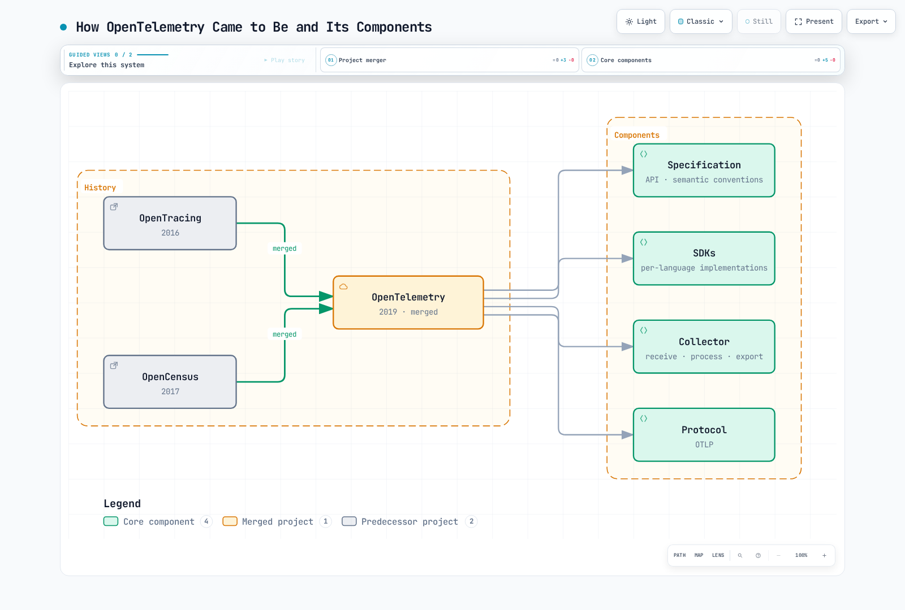
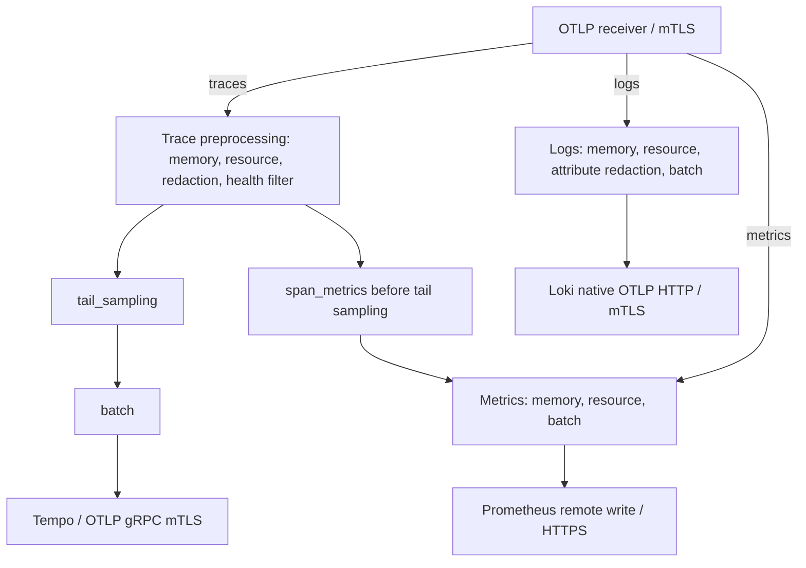

# OpenTelemetry

> **审校基线**：Collector Contrib 0.160.0；Operator 0.158.0；语言版本见下文
> **最后更新**：September 13, 2026

## 简介

OpenTelemetry（OTel）是面向云原生软件的可观测性框架。它为三类信号——Traces（链路追踪）、Metrics（指标）和 Logs（日志）——的生成、采集和管理提供了厂商中立的标准。CNCF 在 2026 年 7 月 24 日发布的回顾文章中称，其贡献活跃度仅次于 Kubernetes。项目整体成熟度与单个 SDK/组件的稳定性是两件不同的事情。

### 2026 年 7 月更新：CNCF 毕业

OpenTelemetry 于 **2026 年 5 月**达到 CNCF **毕业（graduated）**状态；7 月 24 日的文章是一篇回顾。这是该基金会的最高成熟度级别，Kubernetes 和 Prometheus 等项目也处于该级别。毕业意味着项目的治理、安全实践和采用情况已通过面向生产使用的审核。该回顾文章讨论了 GenAI 语义约定、浏览器/移动端可观测性、schema 治理与推广工具。背景与路线图参见 CNCF 博客文章 ["OpenTelemetry has graduated… Now what?"](https://www.cncf.io/blog/2026/07/24/opentelemetry-has-graduated-now-what/)。

## 什么是 OpenTelemetry？

OpenTelemetry 诞生于 OpenTracing 与 OpenCensus 两个项目的合并：



[🔍 查看交互式图表](https://www.atomai.click/kubernetes-docs/archmaps/en-observability-tracing-03-opentelemetry-0.html)

## 核心概念

### 三类信号

本章聚焦 traces、metrics 和 logs。Profiling 是另一个仍在演进中的信号，其支持程度和稳定性因实现而异。Trace/log ID 以及 metric exemplar 需要相应的埋点（instrumentation）与后端配置。

| Signal | Description | Use Cases |
|--------|-------------|-----------|
| **Traces** | 分布式请求追踪 | 延迟分析、依赖关系梳理 |
| **Metrics** | 数值型测量 | 资源使用率、SLI/SLO |
| **Logs** | 事件记录 | 调试、审计 |

### 核心组件


[🔍 查看交互式图表](https://www.atomai.click/kubernetes-docs/archmaps/en-observability-tracing-03-opentelemetry-2.html)

图中按信号列出了后端选项。只有已配置的 exporter 才处于启用状态；下文的基础示例并不会自动启用每一家厂商的后端。


## OpenTelemetry SDK

Collector、Operator、Java agent 与各语言 SDK 拥有各自独立的版本号。下列 Linux 工作负载模板已针对 Kubernetes 1.35 的 schema 做过校验：应用镜像、namespace、证书和目标服务需由各自的负责人准备。Operator 更宽泛的兼容矩阵并不会消除具体方案特有的要求，例如原生 sidecar。本地校验并不等于已在 EKS 上部署了应用。

| Component | Baseline and boundary |
|---|---|
| Standalone Collector Contrib | 0.160.0；组件与 schema 使用其真实二进制文件校验 |
| Operator | 0.158.0；其兼容性表列出 Kubernetes 1.25–1.36 与 cert-manager v1 |
| Java agent | 2.31.1，面向 SDK 1.65.0；与 Operator 默认 Java 镜像的版本并不相同 |
| Python | SDK/exporter 1.44.0 与 instrumentation/distro 0.65b0；Python ≥3.10 |
| Node.js CommonJS example | SDK-node 0.220.0、auto-instrumentations-node 0.78.0、resources 2.9.0、API 1.9.1 |

Operator 默认使用 Collector 0.158.0。下文独立部署的 0.160.0 工作负载并不等于对 Operator 托管的 Collector 做了升级。请确认与受支持的 EKS 版本的交集；最新的 Kubernetes 发布版本并不会自动落入 Operator 的兼容矩阵。

### 自动埋点（Auto-instrumentation）

截至 2026 年 9 月 13 日，EKS 生命周期页面将 1.34、1.35 和 1.36 列入标准支持。1.35 的 schema 基线位于该列表以及 Operator 兼容矩阵之内；这仍然无法替代对实际平台/插件（add-on）的验收检查。

零代码埋点会挂接受支持的库；它不会自动发现任意的业务操作。对同一个进程，请二者择一：直接准备好的 agent/launcher，或由 Operator 注入。不要在已配置好的 provider 之上再初始化第二个 SDK。下列应用镜像只是你自有构建产物的占位符，其启动命令与依赖同样如此。

请准备好 `ecommerce` namespace，并在其中创建包含 `ca.crt`、`tls.crt` 和 `tls.key` 的 `otel-client-tls` Secret。客户端证书必须能被 Collector 接受，而 Collector 的证书必须匹配 `otel-collector.otel.svc.cluster.local`。Secret 文件以只读方式挂载；请根据镜像情况调整 UID/GID 访问权限。环境变量中只出现证书**路径**，不含密钥内容或 bearer token。这些模板在 TLS 端口 4318 上使用 OTLP HTTP/protobuf。

#### Java 自动埋点

将固定版本的 agent 下载到应用构建中，并校验发布产物的 checksum。2.31.1 的 JAR 为 25,107,554 字节，超过了 Kubernetes 的 1 MiB ConfigMap 限制。请将其包含在镜像中或使用 Operator 注入；ConfigMap 不是分发 agent 二进制文件的机制。


```bash
curl --fail --location --output opentelemetry-javaagent.jar \
  https://github.com/open-telemetry/opentelemetry-java-instrumentation/releases/download/v2.31.1/opentelemetry-javaagent.jar
printf '%s  %s\n' \
  bbf83c151b6400709e2f225bdd07a04f839d9d13b8b93464241333fd25d3e3ba \
  opentelemetry-javaagent.jar | sha256sum --check -
```

```dockerfile
# Add to the application's existing Dockerfile; not a complete image build.
COPY opentelemetry-javaagent.jar /opt/otel/opentelemetry-javaagent.jar
```
请将 agent 选项与已有的 `JAVA_TOOL_OPTIONS` 合并；不要丢弃应用原有的 JVM 选项。Deployment 的 selector 与 Pod 标签必须匹配。


```yaml
apiVersion: apps/v1
kind: Deployment
metadata:
  name: order-service
  namespace: ecommerce
spec:
  replicas: 1
  selector:
    matchLabels:
      app: order-service
  template:
    metadata:
      labels:
        app: order-service
    spec:
      automountServiceAccountToken: false
      securityContext:
        fsGroup: 10001
      containers:
      - name: app
        image: registry.example.com/order-service:otel-demo
        env:
        - name: OTEL_SERVICE_NAME
          value: order-service
        - name: OTEL_RESOURCE_ATTRIBUTES
          value: service.namespace=ecommerce,deployment.environment.name=demo
        - name: OTEL_EXPORTER_OTLP_ENDPOINT
          value: https://otel-collector.otel.svc.cluster.local:4318
        - name: OTEL_EXPORTER_OTLP_PROTOCOL
          value: http/protobuf
        - name: OTEL_EXPORTER_OTLP_CERTIFICATE
          value: /var/run/otel-client/ca.crt
        - name: OTEL_EXPORTER_OTLP_CLIENT_CERTIFICATE
          value: /var/run/otel-client/tls.crt
        - name: OTEL_EXPORTER_OTLP_CLIENT_KEY
          value: /var/run/otel-client/tls.key
        - name: OTEL_TRACES_EXPORTER
          value: otlp
        - name: OTEL_METRICS_EXPORTER
          value: otlp
        - name: OTEL_LOGS_EXPORTER
          value: none
        - name: OTEL_TRACES_SAMPLER
          value: parentbased_always_on
        - name: OTEL_METRIC_EXPORT_INTERVAL
          value: '60000'
        - name: JAVA_TOOL_OPTIONS
          value: -javaagent:/opt/otel/opentelemetry-javaagent.jar
        volumeMounts:
        - name: otel-client-tls
          mountPath: /var/run/otel-client
          readOnly: true
      volumes:
      - name: otel-client-tls
        secret:
          secretName: otel-client-tls
          defaultMode: 288
```
#### Python 自动埋点

对于 Flask 应用，请在其构建环境中安装版本匹配的软件包，并锁定解析后的应用依赖。其他框架需要各自对应的 instrumentation 包。本示例显式选择了 HTTP exporter，而不是把 Python 的 HTTP 默认行为发送到 gRPC 端口 4317。


```bash
python -m pip install \
  opentelemetry-api==1.44.0 opentelemetry-sdk==1.44.0 \
  opentelemetry-distro==0.65b0 \
  opentelemetry-instrumentation-flask==0.65b0 \
  opentelemetry-exporter-otlp-proto-http==1.44.0
```

```yaml
apiVersion: apps/v1
kind: Deployment
metadata:
  name: payment-service
  namespace: ecommerce
spec:
  replicas: 1
  selector:
    matchLabels:
      app: payment-service
  template:
    metadata:
      labels:
        app: payment-service
    spec:
      automountServiceAccountToken: false
      securityContext:
        fsGroup: 10001
      containers:
      - name: app
        image: registry.example.com/payment-service:otel-demo
        env:
        - name: OTEL_SERVICE_NAME
          value: payment-service
        - name: OTEL_RESOURCE_ATTRIBUTES
          value: service.namespace=ecommerce,deployment.environment.name=demo
        - name: OTEL_EXPORTER_OTLP_ENDPOINT
          value: https://otel-collector.otel.svc.cluster.local:4318
        - name: OTEL_EXPORTER_OTLP_PROTOCOL
          value: http/protobuf
        - name: OTEL_EXPORTER_OTLP_CERTIFICATE
          value: /var/run/otel-client/ca.crt
        - name: OTEL_EXPORTER_OTLP_CLIENT_CERTIFICATE
          value: /var/run/otel-client/tls.crt
        - name: OTEL_EXPORTER_OTLP_CLIENT_KEY
          value: /var/run/otel-client/tls.key
        - name: OTEL_TRACES_EXPORTER
          value: otlp
        - name: OTEL_METRICS_EXPORTER
          value: otlp
        - name: OTEL_LOGS_EXPORTER
          value: none
        - name: OTEL_TRACES_SAMPLER
          value: parentbased_always_on
        - name: OTEL_METRIC_EXPORT_INTERVAL
          value: '60000'
        volumeMounts:
        - name: otel-client-tls
          mountPath: /var/run/otel-client
          readOnly: true
        command:
        - opentelemetry-instrument
        - python
        - app.py
      volumes:
      - name: otel-client-tls
        secret:
          secretName: otel-client-tls
          defaultMode: 288
```
#### Node.js 自动埋点


```bash
npm install --save-exact \
  @opentelemetry/api@1.9.1 @opentelemetry/resources@2.9.0 \
  @opentelemetry/sdk-node@0.220.0 \
  @opentelemetry/auto-instrumentations-node@0.78.0
# Commit package-lock.json and use npm ci for subsequent application builds.
```
保存为 `tracing.cjs`，并在应用/框架模块之前加载。这是一个 CommonJS 示例；ESM 加载需要语言指南中另行说明的配置。SDK 会读取下文显式设置的 OTEL exporter/TLS 环境变量。若以编程方式配置 metric reader，当前配置使用 `metricReaders`，它取代了已废弃的单数形式选项。请在应用自身完成请求排空（draining）步骤之后再接入 `shutdownTelemetry()`。


```javascript
// Load before application/framework modules in a CommonJS application.
const { NodeSDK } = require('@opentelemetry/sdk-node');
const { envDetector } = require('@opentelemetry/resources');
const { getNodeAutoInstrumentations } = require('@opentelemetry/auto-instrumentations-node');

const sdk = new NodeSDK({
  resourceDetectors: [envDetector],
  instrumentations: [
    getNodeAutoInstrumentations({
      '@opentelemetry/instrumentation-fs': { enabled: false },
      '@opentelemetry/instrumentation-http': {
        ignoreIncomingRequestHook: (request) =>
          String(request.url || '').split('?')[0] === '/health',
      },
    }),
  ],
});

// OTEL_* variables configure exporters, protocol, TLS and metric interval.
sdk.start();

// Call after the application's own request-draining step on shutdown.
module.exports = { shutdownTelemetry: () => sdk.shutdown() };
```

```yaml
apiVersion: apps/v1
kind: Deployment
metadata:
  name: notification-service
  namespace: ecommerce
spec:
  replicas: 1
  selector:
    matchLabels:
      app: notification-service
  template:
    metadata:
      labels:
        app: notification-service
    spec:
      automountServiceAccountToken: false
      securityContext:
        fsGroup: 10001
      containers:
      - name: app
        image: registry.example.com/notification-service:otel-demo
        env:
        - name: OTEL_SERVICE_NAME
          value: notification-service
        - name: OTEL_RESOURCE_ATTRIBUTES
          value: service.namespace=ecommerce,deployment.environment.name=demo
        - name: OTEL_EXPORTER_OTLP_ENDPOINT
          value: https://otel-collector.otel.svc.cluster.local:4318
        - name: OTEL_EXPORTER_OTLP_PROTOCOL
          value: http/protobuf
        - name: OTEL_EXPORTER_OTLP_CERTIFICATE
          value: /var/run/otel-client/ca.crt
        - name: OTEL_EXPORTER_OTLP_CLIENT_CERTIFICATE
          value: /var/run/otel-client/tls.crt
        - name: OTEL_EXPORTER_OTLP_CLIENT_KEY
          value: /var/run/otel-client/tls.key
        - name: OTEL_TRACES_EXPORTER
          value: otlp
        - name: OTEL_METRICS_EXPORTER
          value: otlp
        - name: OTEL_LOGS_EXPORTER
          value: none
        - name: OTEL_TRACES_SAMPLER
          value: parentbased_always_on
        - name: OTEL_METRIC_EXPORT_INTERVAL
          value: '60000'
        volumeMounts:
        - name: otel-client-tls
          mountPath: /var/run/otel-client
          readOnly: true
        command:
        - node
        - --require
        - ./tracing.cjs
        - app.cjs
      volumes:
      - name: otel-client-tls
        secret:
          secretName: otel-client-tls
          defaultMode: 288
```
这些示例有意设置了 `OTEL_LOGS_EXPORTER=none`。启用日志 exporter 并不会去 tail 应用的 stdout：请安装合适的日志桥接器/handler 或日志采集器，并先评估负载内容的暴露风险。`parentbased_always_on` 采样器仍会遵循未被采样的父级。如果你改用 10% 的头部采样，尾部的 Collector 无法恢复已被丢弃的 span。

### 手动埋点（Manual Instrumentation）

请复用由 agent 或应用初始化的 OpenTelemetry 实例/provider。若没有 SDK provider，API 调用可能是空操作（no-op）。这些业务流程 span 属于 INTERNAL 类型：已埋点的 HTTP/数据库客户端会创建各自的 CLIENT span 并传播上下文。单独手动创建一个 CLIENT span 既不会发送请求，也不会注入 trace 上下文。

#### Java 手动埋点

库存/支付回调由应用自身提供。不记录任何订单/客户 ID、金额、交易 ID 或原始异常消息。这些只是应用层操作，并非某个 payment-service 的实现，也不是经过测试的 Spring 部署。


```java
import io.opentelemetry.api.OpenTelemetry;
import io.opentelemetry.api.trace.Span;
import io.opentelemetry.api.trace.SpanKind;
import io.opentelemetry.api.trace.StatusCode;
import io.opentelemetry.api.trace.Tracer;
import io.opentelemetry.context.Scope;

public final class OrderTelemetry {
    private final Tracer tracer;

    public OrderTelemetry(OpenTelemetry telemetry) {
        this.tracer = telemetry.getTracer("example.order-workflow", "1.0.0");
    }

    public void processOrder(Runnable validateInventory, Runnable processPayment) {
        Span parent = tracer.spanBuilder("processOrder")
                .setSpanKind(SpanKind.INTERNAL).startSpan();
        try (Scope ignored = parent.makeCurrent()) {
            parent.addEvent("validation.started");
            child("checkInventory", validateInventory);
            child("processPayment", processPayment);
            parent.addEvent("processing.completed");
        } catch (RuntimeException error) {
            parent.setStatus(StatusCode.ERROR);
            parent.setAttribute("error.type", error.getClass().getName());
            throw error;
        } finally {
            parent.end();
        }
    }

    private void child(String name, Runnable operation) {
        Span span = tracer.spanBuilder(name).setSpanKind(SpanKind.INTERNAL).startSpan();
        try (Scope ignored = span.makeCurrent()) {
            operation.run();
        } catch (RuntimeException error) {
            span.setStatus(StatusCode.ERROR);
            span.setAttribute("error.type", error.getClass().getName());
            throw error;
        } finally {
            span.end();
        }
    }
}
```
#### Python 手动埋点

这个同步装饰器在结束嵌套 span 的同时保留返回结果和错误。它只记录错误类型，避免产生重复的原始异常事件。异步函数需要一个支持 async 的包装器。请自行提供参数化的数据库查询、校验、持久化和事件发布回调；本地验证使用的是合成回调与内存 exporter。


```python
"""Manual spans for synchronous application callbacks; no database is created."""
from functools import wraps
from contextlib import contextmanager
from opentelemetry import trace
from opentelemetry.trace import SpanKind, Status, StatusCode

# Reuse the SDK provider initialized by auto-instrumentation or the application.
tracer = trace.get_tracer("example.user-workflow", "1.0.0")

@contextmanager
def operation(name):
    with tracer.start_as_current_span(
        name, kind=SpanKind.INTERNAL,
        record_exception=False, set_status_on_exception=False,
    ) as span:
        try:
            yield span
        except Exception as error:
            span.set_status(Status(StatusCode.ERROR))
            span.set_attribute("error.type", type(error).__name__)
            raise

def traced(name):
    def decorate(function):
        @wraps(function)
        def wrapped(*args, **kwargs):
            with operation(name):
                return function(*args, **kwargs)
        return wrapped
    return decorate

@traced("get_user")
def get_user(user_id, lookup):
    # lookup is supplied by the application, with parameterized queries.
    # The ID and SQL text are not added to telemetry.
    with operation("lookup_user"):
        result = lookup(user_id)
    trace.get_current_span().set_attribute("app.user.found", result is not None)
    return result

@traced("create_user")
def create_user(user_data, validate, save, publish):
    # These callbacks are the application's own implementations.
    with operation("validate_user_data"):
        validate(user_data)
    with operation("save_user"):
        result = save(user_data)
    with operation("publish_user_event"):
        publish(result)
    return result
```
对于真实的数据库/消息中间件埋点，请遵循所实现的语义约定版本，例如 `db.system.name`、`db.operation.name` 和 `messaging.destination.name`。不要把用户 ID 复制进 SQL 遥测字符串，也不要把原始查询语句用作指标标签。上文的业务回调并不能证明 PostgreSQL 或 Kafka 已实际执行。

## OTEL Collector

### 架构




以上是下文配置的信号路径。trace 预处理方框概括了两条独立 trace 流水线中等价的处理步骤。span 指标在尾部采样之前分支；进入的 metrics 和 logs 各自使用独立的流水线。

### Collector 配置

保存为 `otel-collector-config.yaml`。这是一个用于实验环境的单实例、有状态的采样/聚合实例，并非高可用（HA）或容量保证。一条独立的 trace 流水线在**尾部采样之前**派生指标。已被头部采样或过滤掉的 span 依然不会出现在这些指标中。这些计数器统计的是观测到的 span，而不是唯一的最终用户请求；请为请求类 SLI 选择合适的 span kind 和有界的维度。在 0.160.0 中，累积型 span 指标计数器最初会导出 0；在把首个数值解读为“无流量”之前，请先评估后续的 flush 结果。

请准备好启用了 OTLP 的 Tempo、一个 Prometheus 兼容的 remote-write 接收端以及 Loki 的原生 OTLP 摄取入口，并由运维方提供 TLS/认证网关。下文示例中的网关名称并非本指南创建的服务。Prometheus 需要启用其 remote-write 接收端（使用 Prometheus 本身时为 `--web.enable-remote-write-receiver`）。Loki 的 exporter 基础地址以 `/otlp` 结尾；HTTP exporter 会追加 `/v1/logs`。请按需配置 Loki 的结构化元数据以及可信租户映射；租户 header 并不构成认证。

环境变量用于指明已有的证书与端点。所有已配置的 receiver 都使用双向 TLS；没有启用通配符浏览器 CORS，也没有开放公共的 profiling 端点。列出的属性删除操作只是有限的控制手段，并不等于对日志正文、span 事件、resource 属性或任意负载做了完整的敏感数据清除。也请在 SDK 侧就尽量减少采集的数据。


```yaml
# otel-collector-config.yaml
receivers:
  otlp:
    protocols:
      grpc:
        endpoint: 0.0.0.0:4317
        max_recv_msg_size_mib: 16
        tls:
          cert_file: ${env:OTEL_SERVER_CERT}
          key_file: ${env:OTEL_SERVER_KEY}
          client_ca_file: ${env:OTEL_CLIENT_CA}
      http:
        endpoint: 0.0.0.0:4318
        tls:
          cert_file: ${env:OTEL_SERVER_CERT}
          key_file: ${env:OTEL_SERVER_KEY}
          client_ca_file: ${env:OTEL_CLIENT_CA}

processors:
  memory_limiter:
    check_interval: 1s
    limit_mib: 384
    spike_limit_mib: 96
  resource/cluster:
    attributes:
      - key: k8s.cluster.name
        value: ${env:K8S_CLUSTER_NAME}
        action: insert
  attributes/redact:
    actions:
      - key: http.request.header.authorization
        action: delete
      - key: user.email
        action: delete
      - key: user.id
        action: delete
      - key: customer.id
        action: delete
      - key: db.statement
        action: delete
      - key: db.query.text
        action: delete
  filter/health:
    error_mode: propagate
    traces:
      span:
        - 'attributes["http.route"] == "/health"'
        - 'attributes["http.route"] == "/ready"'
        - 'attributes["http.route"] == "/metrics"'
  tail_sampling:
    decision_wait: 10s
    num_traces: 10000
    expected_new_traces_per_sec: 100
    policies:
      - name: errors
        type: status_code
        status_code:
          status_codes: [ERROR]
      - name: slow
        type: latency
        latency:
          threshold_ms: 1000
      - name: selected-services
        type: string_attribute
        string_attribute:
          key: service.name
          values: [payment-service, order-service]
      - name: baseline
        type: probabilistic
        probabilistic:
          sampling_percentage: 10
  batch:
    timeout: 5s
    send_batch_size: 512
    send_batch_max_size: 1024

connectors:
  span_metrics:
    histogram:
      unit: s
      explicit:
        buckets: [5ms, 10ms, 25ms, 50ms, 100ms, 250ms, 500ms, 1s, 2s, 5s]
    dimensions:
      - name: http.request.method
      - name: http.response.status_code
    aggregation_cardinality_limit: 1000
    metrics_flush_interval: 15s

exporters:
  otlp_grpc/tempo:
    endpoint: ${env:TEMPO_OTLP_GRPC_ENDPOINT}
    tls:
      ca_file: ${env:BACKEND_CA}
      cert_file: ${env:BACKEND_CLIENT_CERT}
      key_file: ${env:BACKEND_CLIENT_KEY}
  prometheus_remote_write:
    endpoint: ${env:PROMETHEUS_REMOTE_WRITE_ENDPOINT}
    tls:
      ca_file: ${env:BACKEND_CA}
      cert_file: ${env:BACKEND_CLIENT_CERT}
      key_file: ${env:BACKEND_CLIENT_KEY}
  otlp_http/loki:
    endpoint: ${env:LOKI_OTLP_HTTP_ENDPOINT}
    tls:
      ca_file: ${env:BACKEND_CA}
      cert_file: ${env:BACKEND_CLIENT_CERT}
      key_file: ${env:BACKEND_CLIENT_KEY}

extensions:
  health_check:
    endpoint: 0.0.0.0:13133
    path: /health

service:
  extensions: [health_check]
  pipelines:
    traces:
      receivers: [otlp]
      processors: [memory_limiter, resource/cluster, attributes/redact, filter/health, tail_sampling, batch]
      exporters: [otlp_grpc/tempo]
    traces/span-metrics:
      receivers: [otlp]
      processors: [memory_limiter, resource/cluster, attributes/redact, filter/health]
      exporters: [span_metrics]
    metrics:
      receivers: [otlp, span_metrics]
      processors: [memory_limiter, resource/cluster, batch]
      exporters: [prometheus_remote_write]
    logs:
      receivers: [otlp]
      processors: [memory_limiter, resource/cluster, attributes/redact, batch]
      exporters: [otlp_http/loki]
  telemetry:
    logs:
      level: info
      encoding: json
    metrics:
      readers:
        - pull:
            exporter:
              prometheus:
                host: 127.0.0.1
                port: 8888
```
这些正向采样策略之间是 OR 关系，而不是按顺序排列的优先级阶梯。被选中的服务可以独立于基线概率而保留下来。延迟使用严格的 `>1000 ms` 比较。基于定时器的判定并不能证明 trace 已完整；而且健康检查过滤器会有意移除匹配的 span，即使这些 span 含有错误；过滤单个 span 可能留下不完整的 trace。

内存硬限制为 384 MiB，软限制为 288 MiB，在模板中 512 MiB 的容器限制之下留出了余量。拒绝请求、重试、队列和突发流量仍需实测。这里的批处理/trace/基数限制只是演示设置，不是基准测试结果。

### 单实例工作负载与配置

请准备 `otel` namespace，以及包含 `tls.crt`、`tls.key`、`ca.crt` 的 `otel-ingest-tls` / `otel-backend-tls` Secret。证书 SAN 需匹配相关 Service/网关名称，并使用合适的信任包（trust bundle）以及具备正确 server/client 用途的证书。请调整 10001 UID/GID 的文件访问权限。ConfigMap 中只包含文本配置，不含私钥。对这个单实例采样器而言，`Recreate` 可以避免常规滚动更新时的实例重叠，代价是存在停机时间；它并不会在重启之间保留内存中的 trace。


```bash
: "${KUBE_CONTEXT:?Set the reviewed cluster context}"
kubectl --context "$KUBE_CONTEXT" -n otel create configmap otel-collector-config \
  --from-file=otel-collector-config.yaml --dry-run=client -o yaml > otel-collector-configmap.yaml
# Inspect the namespace, Secrets, endpoints and workloads before any real apply.
```

```yaml
apiVersion: v1
kind: ServiceAccount
metadata:
  name: otel-collector
  namespace: otel
automountServiceAccountToken: false
---
apiVersion: apps/v1
kind: Deployment
metadata:
  name: otel-collector
  namespace: otel
spec:
  selector:
    matchLabels:
      app: otel-collector
  template:
    metadata:
      labels:
        app: otel-collector
    spec:
      serviceAccountName: otel-collector
      automountServiceAccountToken: false
      nodeSelector:
        kubernetes.io/os: linux
      securityContext:
        runAsNonRoot: true
        runAsUser: 10001
        fsGroup: 10001
        seccompProfile:
          type: RuntimeDefault
      containers:
      - name: collector
        image: otel/opentelemetry-collector-contrib:0.160.0
        args:
        - --config=/conf/otel-collector-config.yaml
        env:
        - name: GOMEMLIMIT
          value: 384MiB
        - name: OTEL_SERVER_CERT
          value: /var/run/otel/ingest/tls.crt
        - name: OTEL_SERVER_KEY
          value: /var/run/otel/ingest/tls.key
        - name: OTEL_CLIENT_CA
          value: /var/run/otel/ingest/ca.crt
        - name: BACKEND_CA
          value: /var/run/otel/backend/ca.crt
        - name: BACKEND_CLIENT_CERT
          value: /var/run/otel/backend/tls.crt
        - name: BACKEND_CLIENT_KEY
          value: /var/run/otel/backend/tls.key
        - name: OTEL_UPSTREAM_ENDPOINT
          value: otel-collector.otel.svc.cluster.local:4317
        - name: K8S_CLUSTER_NAME
          value: REPLACE_WITH_CLUSTER_NAME
        - name: TEMPO_OTLP_GRPC_ENDPOINT
          value: tempo-gateway.tempo.svc.cluster.local:4317
        - name: PROMETHEUS_REMOTE_WRITE_ENDPOINT
          value: https://prometheus-gateway.monitoring.svc.cluster.local/api/v1/write
        - name: LOKI_OTLP_HTTP_ENDPOINT
          value: https://loki-gateway.loki.svc.cluster.local/otlp
        ports:
        - name: otlp-grpc
          containerPort: 4317
        - name: otlp-http
          containerPort: 4318
        resources:
          requests:
            cpu: 100m
            memory: 256Mi
          limits:
            cpu: 500m
            memory: 512Mi
        securityContext:
          allowPrivilegeEscalation: false
          readOnlyRootFilesystem: true
          capabilities:
            drop:
            - ALL
        volumeMounts:
        - name: config
          mountPath: /conf
          readOnly: true
        - name: ingest-tls
          mountPath: /var/run/otel/ingest
          readOnly: true
        - name: backend-tls
          mountPath: /var/run/otel/backend
          readOnly: true
        readinessProbe:
          httpGet:
            path: /health
            port: 13133
        livenessProbe:
          httpGet:
            path: /health
            port: 13133
          initialDelaySeconds: 15
      volumes:
      - name: config
        configMap:
          name: otel-collector-config
      - name: ingest-tls
        secret:
          secretName: otel-ingest-tls
          defaultMode: 288
      - name: backend-tls
        secret:
          secretName: otel-backend-tls
          defaultMode: 288
  replicas: 1
  strategy:
    type: Recreate
---
apiVersion: v1
kind: Service
metadata:
  name: otel-collector
  namespace: otel
spec:
  type: ClusterIP
  selector:
    app: otel-collector
  ports:
  - name: otlp-grpc
    port: 4317
    targetPort: otlp-grpc
  - name: otlp-http
    port: 4318
    targetPort: otlp-http
```
### 可选的采集与富化

| Requirement | Separate configuration needed |
|---|---|
| 遗留的 Jaeger/Zipkin 客户端 | 相应的 receiver 组件仍然可用；只启用必需的协议/端口，并在流水线中匹配 receiver ID。请通过 OTLP 导出到 Jaeger，而不是使用已被移除的 Jaeger exporter。 |
| Collector 自身指标 | `service.telemetry.metrics.readers` 用于配置当前的 Prometheus reader。旧的 `address` 字段已被移除。请通过刻意设计的监控路径抓取 loopback 端点。 |
| Kubernetes 集群指标 | 只运行一个处于活动状态的 `k8s_cluster` receiver，或者配置其 leader-elector 扩展。请提供 API 凭据和经过审核的 RBAC，然后将其接入 metrics 流水线。上文默认不挂载 token 的工作负载并不提供这些前提条件。 |
| 节点/容器日志或主机指标 | 添加相应的 receiver、挂载和权限；仅仅使用 DaemonSet 并不会采集它们。 |
| EC2/EKS 资源检测 | 请刻意配置所需的 detector 及其元数据/API 访问权限；不要用 Collector 主机身份取代工作负载身份。 |
| 从 span 派生的指标 | 使用 `span_metrics` connector，并显式指定时长单位和有界维度。旧的 spanmetrics processor 已被移除。 |

参见[collector 指南](../logging/05-collectors.md)与 [Kubernetes cluster receiver](https://github.com/open-telemetry/opentelemetry-collector-contrib/tree/v0.160.0/receiver/k8sclusterreceiver)。不要声明一个未被使用的 receiver/processor 就认为它已经生效。

## EKS 部署模式

以下是可供选择的部署模式，而不是一个可以不加区分地全部套用的技术栈。一个无状态中继（relay）会把三类信号全部转发给上文那个单一的采样层。请让尾部采样和 span 聚合远离任意负载均衡的 node/sidecar/HPA 层。多个采样实例需要感知 trace ID 的路由，并需要针对端点变更、传输中的 trace、重启和存储做出规划；仅靠一个 Service 或 HPA 无法提供这些能力。

保存 `otel-relay-config.yaml`，并按同样的客户端 ConfigMap 生成流程创建 `otel-relay-config`。`OTEL_UPSTREAM_ENDPOINT` 和客户端证书用于标识另行准备好的上游 Collector。就采样决策而言，relay 是无状态的；但它在内存中的批处理/导出队列仍然存在故障和关停方面的限制。


```yaml
receivers:
  otlp:
    protocols:
      grpc:
        endpoint: 0.0.0.0:4317
        max_recv_msg_size_mib: 16
        tls:
          cert_file: ${env:OTEL_SERVER_CERT}
          key_file: ${env:OTEL_SERVER_KEY}
          client_ca_file: ${env:OTEL_CLIENT_CA}
      http:
        endpoint: 0.0.0.0:4318
        tls:
          cert_file: ${env:OTEL_SERVER_CERT}
          key_file: ${env:OTEL_SERVER_KEY}
          client_ca_file: ${env:OTEL_CLIENT_CA}
processors:
  memory_limiter:
    check_interval: 1s
    limit_mib: 384
    spike_limit_mib: 96
  batch:
    timeout: 5s
    send_batch_size: 512
    send_batch_max_size: 1024
exporters:
  otlp_grpc/upstream:
    endpoint: ${env:OTEL_UPSTREAM_ENDPOINT}
    tls:
      ca_file: ${env:BACKEND_CA}
      cert_file: ${env:BACKEND_CLIENT_CERT}
      key_file: ${env:BACKEND_CLIENT_KEY}
extensions:
  health_check:
    endpoint: 0.0.0.0:13133
    path: /health
service:
  extensions:
  - health_check
  pipelines:
    traces:
      receivers:
      - otlp
      processors:
      - memory_limiter
      - batch
      exporters:
      - otlp_grpc/upstream
    metrics:
      receivers:
      - otlp
      processors:
      - memory_limiter
      - batch
      exporters:
      - otlp_grpc/upstream
    logs:
      receivers:
      - otlp
      processors:
      - memory_limiter
      - batch
      exporters:
      - otlp_grpc/upstream
  telemetry:
    logs:
      level: info
      encoding: json
    metrics:
      readers:
      - pull:
          exporter:
            prometheus:
              host: 127.0.0.1
              port: 8888
```
### DaemonSet 模式

DaemonSet 运行在符合条件的 Linux 节点上，而不是 EKS Fargate 上。请为已批准的节点配置 selector/toleration；这里没有全量 toleration 或 hostPort 占用。`internalTrafficPolicy: Local` 只会把该 Service 的流量路由到调用方所在节点上处于 ready 状态的端点，如果不存在这样的端点则丢弃流量。它不是面向 Fargate 客户端的回退机制。应用必须显式地把遥测数据发送到该端点。


```yaml
apiVersion: apps/v1
kind: DaemonSet
metadata:
  name: otel-agent
  namespace: otel
spec:
  selector:
    matchLabels:
      app: otel-agent
  template:
    metadata:
      labels:
        app: otel-agent
    spec:
      serviceAccountName: otel-collector
      automountServiceAccountToken: false
      nodeSelector:
        kubernetes.io/os: linux
      securityContext:
        runAsNonRoot: true
        runAsUser: 10001
        fsGroup: 10001
        seccompProfile:
          type: RuntimeDefault
      containers:
      - name: collector
        image: otel/opentelemetry-collector-contrib:0.160.0
        args:
        - --config=/conf/otel-relay-config.yaml
        env:
        - name: GOMEMLIMIT
          value: 384MiB
        - name: OTEL_SERVER_CERT
          value: /var/run/otel/ingest/tls.crt
        - name: OTEL_SERVER_KEY
          value: /var/run/otel/ingest/tls.key
        - name: OTEL_CLIENT_CA
          value: /var/run/otel/ingest/ca.crt
        - name: BACKEND_CA
          value: /var/run/otel/backend/ca.crt
        - name: BACKEND_CLIENT_CERT
          value: /var/run/otel/backend/tls.crt
        - name: BACKEND_CLIENT_KEY
          value: /var/run/otel/backend/tls.key
        - name: OTEL_UPSTREAM_ENDPOINT
          value: otel-collector.otel.svc.cluster.local:4317
        ports:
        - name: otlp-grpc
          containerPort: 4317
        - name: otlp-http
          containerPort: 4318
        resources:
          requests:
            cpu: 100m
            memory: 256Mi
          limits:
            cpu: 500m
            memory: 512Mi
        securityContext:
          allowPrivilegeEscalation: false
          readOnlyRootFilesystem: true
          capabilities:
            drop:
            - ALL
        volumeMounts:
        - name: config
          mountPath: /conf
          readOnly: true
        - name: ingest-tls
          mountPath: /var/run/otel/ingest
          readOnly: true
        - name: backend-tls
          mountPath: /var/run/otel/backend
          readOnly: true
        readinessProbe:
          httpGet:
            path: /health
            port: 13133
        livenessProbe:
          httpGet:
            path: /health
            port: 13133
          initialDelaySeconds: 15
      volumes:
      - name: config
        configMap:
          name: otel-relay-config
      - name: ingest-tls
        secret:
          secretName: otel-ingest-tls
          defaultMode: 288
      - name: backend-tls
        secret:
          secretName: otel-backend-tls
          defaultMode: 288
---
apiVersion: v1
kind: Service
metadata:
  name: otel-agent
  namespace: otel
spec:
  type: ClusterIP
  selector:
    app: otel-agent
  ports:
  - name: otlp-grpc
    port: 4317
    targetPort: otlp-grpc
  - name: otlp-http
    port: 4318
    targetPort: otlp-http
  internalTrafficPolicy: Local
```
### Sidecar 模式

请使用一个单独的 `otel-sidecar-config` ConfigMap 承载下面的配置。只有同一个 Pod 会使用其 loopback 明文 OTLP receiver；发往上游的流量使用双向 TLS。该配置为 256 MiB 的 sidecar 设定了 192 MiB 硬限制 / 144 MiB 软限制。应用镜像必须包含其选定的 SDK/agent；仅设置一个端点环境变量本身并不会添加埋点。这个 Kubernetes 1.35 schema 示例使用了原生 sidecar（带 `restartPolicy: Always` 的 `initContainers`，在 1.33 中 GA）。其 startup probe 先于应用启动完成，而正常关停时会先停止应用容器再停止 sidecar。后端投递以及突发故障后的恢复仍需单独验证。


```yaml
receivers:
  otlp:
    protocols:
      grpc:
        endpoint: 127.0.0.1:4317
      http:
        endpoint: 127.0.0.1:4318
processors:
  memory_limiter:
    check_interval: 1s
    limit_mib: 192
    spike_limit_mib: 48
  batch:
    timeout: 5s
    send_batch_size: 512
    send_batch_max_size: 1024
exporters:
  otlp_grpc/upstream:
    endpoint: ${env:OTEL_UPSTREAM_ENDPOINT}
    tls:
      ca_file: ${env:BACKEND_CA}
      cert_file: ${env:BACKEND_CLIENT_CERT}
      key_file: ${env:BACKEND_CLIENT_KEY}
extensions:
  health_check:
    endpoint: 0.0.0.0:13133
    path: /health
service:
  extensions:
  - health_check
  pipelines:
    traces:
      receivers:
      - otlp
      processors:
      - memory_limiter
      - batch
      exporters:
      - otlp_grpc/upstream
    metrics:
      receivers:
      - otlp
      processors:
      - memory_limiter
      - batch
      exporters:
      - otlp_grpc/upstream
    logs:
      receivers:
      - otlp
      processors:
      - memory_limiter
      - batch
      exporters:
      - otlp_grpc/upstream
  telemetry:
    logs:
      level: info
      encoding: json
    metrics:
      readers:
      - pull:
          exporter:
            prometheus:
              host: 127.0.0.1
              port: 8888
```

```yaml
apiVersion: apps/v1
kind: Deployment
metadata:
  name: order-with-sidecar
  namespace: otel
spec:
  selector:
    matchLabels:
      app: order-with-sidecar
  template:
    metadata:
      labels:
        app: order-with-sidecar
    spec:
      serviceAccountName: otel-collector
      automountServiceAccountToken: false
      nodeSelector:
        kubernetes.io/os: linux
      securityContext:
        runAsNonRoot: true
        runAsUser: 10001
        fsGroup: 10001
        seccompProfile:
          type: RuntimeDefault
      containers:
      - name: app
        image: registry.example.com/order-service:otel-demo
        env:
        - name: OTEL_SERVICE_NAME
          value: order-service
        - name: OTEL_EXPORTER_OTLP_ENDPOINT
          value: http://127.0.0.1:4318
        - name: OTEL_EXPORTER_OTLP_PROTOCOL
          value: http/protobuf
      volumes:
      - name: config
        configMap:
          name: otel-sidecar-config
      - name: backend-tls
        secret:
          secretName: otel-backend-tls
          defaultMode: 288
      initContainers:
      - name: collector
        image: otel/opentelemetry-collector-contrib:0.160.0
        args:
        - --config=/conf/otel-sidecar-config.yaml
        env:
        - name: GOMEMLIMIT
          value: 192MiB
        - name: BACKEND_CA
          value: /var/run/otel/backend/ca.crt
        - name: BACKEND_CLIENT_CERT
          value: /var/run/otel/backend/tls.crt
        - name: BACKEND_CLIENT_KEY
          value: /var/run/otel/backend/tls.key
        - name: OTEL_UPSTREAM_ENDPOINT
          value: otel-collector.otel.svc.cluster.local:4317
        ports:
        - name: otlp-grpc
          containerPort: 4317
        - name: otlp-http
          containerPort: 4318
        resources:
          requests:
            cpu: 100m
            memory: 64Mi
          limits:
            cpu: 500m
            memory: 256Mi
        securityContext:
          allowPrivilegeEscalation: false
          readOnlyRootFilesystem: true
          capabilities:
            drop:
            - ALL
        volumeMounts:
        - name: config
          mountPath: /conf
          readOnly: true
        - name: backend-tls
          mountPath: /var/run/otel/backend
          readOnly: true
        readinessProbe:
          httpGet:
            path: /health
            port: 13133
        livenessProbe:
          httpGet:
            path: /health
            port: 13133
          initialDelaySeconds: 15
        restartPolicy: Always
        startupProbe:
          httpGet:
            path: /health
            port: 13133
          periodSeconds: 2
          failureThreshold: 30
  replicas: 1
```
### Gateway 模式

此处的 HPA 伸缩的是无状态的**relay**，而不是有状态的采样器。Metrics Server 以及合适的 request/容量是前提条件。三个副本、preferred 反亲和性以及 3–10 的范围只是示意性选择，并不构成高可用或吞吐量的证明。只有在确认了执行方式、存储、网络和 receiver 需求之后，才可以考虑在 Fargate 或 Auto Mode 上使用基于 Deployment 的 collector。


```yaml
apiVersion: apps/v1
kind: Deployment
metadata:
  name: otel-relay
  namespace: otel
spec:
  selector:
    matchLabels:
      app: otel-relay
  template:
    metadata:
      labels:
        app: otel-relay
    spec:
      serviceAccountName: otel-collector
      automountServiceAccountToken: false
      nodeSelector:
        kubernetes.io/os: linux
      securityContext:
        runAsNonRoot: true
        runAsUser: 10001
        fsGroup: 10001
        seccompProfile:
          type: RuntimeDefault
      containers:
      - name: collector
        image: otel/opentelemetry-collector-contrib:0.160.0
        args:
        - --config=/conf/otel-relay-config.yaml
        env:
        - name: GOMEMLIMIT
          value: 384MiB
        - name: OTEL_SERVER_CERT
          value: /var/run/otel/ingest/tls.crt
        - name: OTEL_SERVER_KEY
          value: /var/run/otel/ingest/tls.key
        - name: OTEL_CLIENT_CA
          value: /var/run/otel/ingest/ca.crt
        - name: BACKEND_CA
          value: /var/run/otel/backend/ca.crt
        - name: BACKEND_CLIENT_CERT
          value: /var/run/otel/backend/tls.crt
        - name: BACKEND_CLIENT_KEY
          value: /var/run/otel/backend/tls.key
        - name: OTEL_UPSTREAM_ENDPOINT
          value: otel-collector.otel.svc.cluster.local:4317
        ports:
        - name: otlp-grpc
          containerPort: 4317
        - name: otlp-http
          containerPort: 4318
        resources:
          requests:
            cpu: 100m
            memory: 256Mi
          limits:
            cpu: 500m
            memory: 512Mi
        securityContext:
          allowPrivilegeEscalation: false
          readOnlyRootFilesystem: true
          capabilities:
            drop:
            - ALL
        volumeMounts:
        - name: config
          mountPath: /conf
          readOnly: true
        - name: ingest-tls
          mountPath: /var/run/otel/ingest
          readOnly: true
        - name: backend-tls
          mountPath: /var/run/otel/backend
          readOnly: true
        readinessProbe:
          httpGet:
            path: /health
            port: 13133
        livenessProbe:
          httpGet:
            path: /health
            port: 13133
          initialDelaySeconds: 15
      volumes:
      - name: config
        configMap:
          name: otel-relay-config
      - name: ingest-tls
        secret:
          secretName: otel-ingest-tls
          defaultMode: 288
      - name: backend-tls
        secret:
          secretName: otel-backend-tls
          defaultMode: 288
      affinity:
        podAntiAffinity:
          preferredDuringSchedulingIgnoredDuringExecution:
          - weight: 100
            podAffinityTerm:
              labelSelector:
                matchLabels:
                  app: otel-relay
              topologyKey: kubernetes.io/hostname
  replicas: 3
---
apiVersion: v1
kind: Service
metadata:
  name: otel-relay
  namespace: otel
spec:
  type: ClusterIP
  selector:
    app: otel-relay
  ports:
  - name: otlp-grpc
    port: 4317
    targetPort: otlp-grpc
  - name: otlp-http
    port: 4318
    targetPort: otlp-http
---
apiVersion: autoscaling/v2
kind: HorizontalPodAutoscaler
metadata:
  name: otel-relay
  namespace: otel
spec:
  scaleTargetRef:
    apiVersion: apps/v1
    kind: Deployment
    name: otel-relay
  minReplicas: 3
  maxReplicas: 10
  metrics:
  - type: Resource
    resource:
      name: cpu
      target:
        type: Utilization
        averageUtilization: 70
  - type: Resource
    resource:
      name: memory
      target:
        type: Utilization
        averageUtilization: 80
```

## Kubernetes Operator

Operator 0.158.0 有其单独的兼容性矩阵。其发布清单假定 cert-manager v1 已安装就绪；请从[cert-manager 指南](../../security/10-cert-manager.md)中选择一个仍在维护的兼容版本，而不要安装已过时的 1.13.3 示例。在升级现有的由负责人管理的安装之前，请先审阅 0.158.0 中的 CRD 变更与默认网络策略。

### Operator 安装


```bash
curl --fail --location --output opentelemetry-operator.yaml \
  https://github.com/open-telemetry/opentelemetry-operator/releases/download/v0.158.0/opentelemetry-operator.yaml
printf '%s  %s\n' \
  3c258efb3d64834a857ce4ed5256af2883dc9c77a300eee465df833ab2354c8e \
  opentelemetry-operator.yaml | sha256sum --check -
# After prerequisites and ownership/upgrade review; this changes the cluster:
: "${KUBE_CONTEXT:?Set the reviewed cluster context}"
kubectl --context "$KUBE_CONTEXT" apply -f opentelemetry-operator.yaml
```
### Instrumentation CR

该资源与示例应用都位于 `ecommerce` 中。固定版本的 Operator 会提供与其版本对应的默认埋点镜像；请检查被注入的镜像，不要把它们统统替换为 `latest`。它的 Java/Python 默认版本与上文直接安装的版本并不相同。每个进程只使用一种埋点方式。TLS Secret 的挂载仍由应用方负责。


```yaml
apiVersion: opentelemetry.io/v1alpha1
kind: Instrumentation
metadata:
  name: otel-instrumentation
  namespace: ecommerce
spec:
  exporter:
    endpoint: https://otel-collector.otel.svc.cluster.local:4318
  propagators:
  - tracecontext
  - baggage
  sampler:
    type: parentbased_always_on
  env:
  - name: OTEL_RESOURCE_ATTRIBUTES
    value: service.namespace=ecommerce,deployment.environment.name=demo
  - name: OTEL_EXPORTER_OTLP_PROTOCOL
    value: http/protobuf
  - name: OTEL_EXPORTER_OTLP_CERTIFICATE
    value: /var/run/otel-client/ca.crt
  - name: OTEL_EXPORTER_OTLP_CLIENT_CERTIFICATE
    value: /var/run/otel-client/tls.crt
  - name: OTEL_EXPORTER_OTLP_CLIENT_KEY
    value: /var/run/otel-client/tls.key
  - name: OTEL_TRACES_EXPORTER
    value: otlp
  - name: OTEL_METRICS_EXPORTER
    value: otlp
  - name: OTEL_LOGS_EXPORTER
    value: none
  - name: OTEL_METRIC_EXPORT_INTERVAL
    value: '60000'
```
这里选择了 W3C Trace Context 与 baggage。只有当语言的 propagator 包及对端都支持时，B3 才是一个可选的互操作方案。不要把凭据或个人数据放入 baggage；传播过程可能跨越服务边界和信任边界。

### 自动埋点注入

该注解应写在 Pod 模板上，而不是只写在 Deployment 的 metadata 上。`otel-instrumentation` 会选择 Pod 所在 namespace 中的同名资源；`namespace/name` 可以显式选择另一个 namespace。虽然存在 namespace 级别的注解，但不要不加区分地为每个 Pod 都启用 Java、Python 和 Node.js。注入发生在新 Pod 被准入时，不会追溯性地作用于正在运行的 Pod。


```yaml
apiVersion: apps/v1
kind: Deployment
metadata:
  name: order-injected
  namespace: ecommerce
spec:
  replicas: 1
  selector:
    matchLabels:
      app: order-injected
  template:
    metadata:
      labels:
        app: order-injected
      annotations:
        instrumentation.opentelemetry.io/inject-java: otel-instrumentation
    spec:
      automountServiceAccountToken: false
      securityContext:
        fsGroup: 10001
      containers:
      - name: app
        image: registry.example.com/order-injected:otel-demo
        env:
        - name: OTEL_SERVICE_NAME
          value: order-injected
        - name: OTEL_RESOURCE_ATTRIBUTES
          value: service.namespace=ecommerce,deployment.environment.name=demo
        - name: OTEL_EXPORTER_OTLP_ENDPOINT
          value: https://otel-collector.otel.svc.cluster.local:4318
        - name: OTEL_EXPORTER_OTLP_PROTOCOL
          value: http/protobuf
        - name: OTEL_EXPORTER_OTLP_CERTIFICATE
          value: /var/run/otel-client/ca.crt
        - name: OTEL_EXPORTER_OTLP_CLIENT_CERTIFICATE
          value: /var/run/otel-client/tls.crt
        - name: OTEL_EXPORTER_OTLP_CLIENT_KEY
          value: /var/run/otel-client/tls.key
        - name: OTEL_TRACES_EXPORTER
          value: otlp
        - name: OTEL_METRICS_EXPORTER
          value: otlp
        - name: OTEL_LOGS_EXPORTER
          value: none
        - name: OTEL_TRACES_SAMPLER
          value: parentbased_always_on
        - name: OTEL_METRIC_EXPORT_INTERVAL
          value: '60000'
        volumeMounts:
        - name: otel-client-tls
          mountPath: /var/run/otel-client
          readOnly: true
      volumes:
      - name: otel-client-tls
        secret:
          secretName: otel-client-tls
          defaultMode: 288
```
Java、Python、Node.js、.NET、Go、Apache HTTPD 和 Nginx 各有不同的前提条件。在该版本中，Go 自动埋点需要目标可执行文件路径，并会注入一个以 UID 0 运行的特权组件；它并不是通用的 Restricted-PSS/Fargate 方案。请确认 operator 的特性开关设置以及各语言的专门指南。在没有匹配协议配置的情况下，不能把 Python/.NET/Go 的 HTTP 默认设置指向 gRPC 端点。

## 多后端配置

请把这段片段合并进经过审核的基础配置；它不能单独使用。每个后端都需要各自的端点、信任关系和授权。AWS X-Ray 使用已配置的 Region 与工作负载身份；准确的 IAM 信任关系/权限请参考 [X-Ray 指南](./02-xray.md)。关闭属性索引并不等于敏感数据清除。Datadog 的 api 对象来自由 Secret 管理的 api.yaml，其中包含 key（带引号的字符串）和 site。请把该 Secret 以只读方式挂载到工作负载中；基础工作负载并未挂载它。任何密钥都不会写入环境变量。本次审查未执行任何 AWS/Datadog/Jaeger 服务调用。


```yaml
exporters:
  awsxray:
    region: ap-northeast-2
    index_all_attributes: false
    telemetry:
      enabled: false
  datadog:
    api: ${file:/var/run/secrets/datadog/api.yaml}
  otlp_grpc/jaeger:
    endpoint: ${env:JAEGER_OTLP_GRPC_ENDPOINT}
    tls:
      ca_file: ${env:BACKEND_CA}
      cert_file: ${env:BACKEND_CLIENT_CERT}
      key_file: ${env:BACKEND_CLIENT_KEY}
service:
  pipelines:
    traces:
      exporters:
      - otlp_grpc/tempo
      - awsxray
      - datadog
      - otlp_grpc/jaeger
```
扇出（fan-out）并不提供原子投递，也不保证各后端拥有相同的保留策略。

### 2026 年 7 月更新：为 AI Agent 流量观测网络边界

[7 月 8 日的 CNCF 文章](https://www.cncf.io/blog/2026/07/08/network-boundary-for-ai-agents-using-nginx-and-opentelemetry/)介绍了一个使用 NGINX 和 OTel 的单节点原型。其边界依赖于阻断其他出站路径的网络规则，而不仅仅是设置一个代理环境变量。这些 span 描述的是所配置代理可见的流量；TLS 处理、采样、collector 保留策略以及代理自身的安全性同样重要。这只是网络控制的一个层面，并不能说明某个 agent 的决策是正确或安全的。

### 2026 年 8 月更新：把慢 SQL 查询提炼为可靠性指标

[8 月 21 日的 CNCF 文章](https://www.cncf.io/blog/2026/08/21/how-to-turn-slow-queries-into-actionable-reliability-metrics-with-opentelemetry/)及其[实验环境](https://github.com/causely-oss/slow-query-lab)对比了查询耗时、按流量加权的影响以及从 span 派生的指标与异常基线。请把文中的历史示例仅当作示例看待，而不是你自己集群的容量测量结果。文章本身也提醒了指标标签中的原始 SQL、敏感参数、基数以及基线预热等问题。在采用某个实验配置之前，请先对维度做清洗和限界；延迟异常只是症状，不能证明根因。

## 最佳实践

### 1. 统一 Resource 属性

| Attribute | Example / source |
|---|---|
| `service.name`、`service.version`、`service.namespace` | `order-service`、`1.2.3`、`ecommerce`；由应用配置提供 |
| `deployment.environment.name` | `demo`；取代已废弃的 `deployment.environment` |
| `cloud.provider`、`cloud.region`、`cloud.availability_zone` | 已核实的部署元数据，而不是从 Collector 主机推测得来 |
| `k8s.cluster.name`、`k8s.namespace.name`、`k8s.pod.name`、`k8s.deployment.name` | 正确配置的 Kubernetes 富化或工作负载元数据 |

这是一份属性清单，不是 Collector processor 的 YAML。Resource 用于标识数据的产生方。避免把每一个 resource 属性都复制到指标标签中；Pod 名称、用户 ID 和原始查询文本都可能造成高基数。Profiles 是另一个仍在演进的信号；本指南聚焦 traces、metrics 和 logs，并不声称各 SDK 的稳定性一致。

### 2. 采样策略

对于一个进阶示例——错误、>2 秒延迟、50% 的关键服务条件以及 5% 基线——请把每条正向规则视为 OR 条件，而不是首次匹配优先级或预留配额。另一条规则也可能保留同一个 trace。如果需要互斥的分类或 span 速率预算，请显式设计并测试相应策略。头部采样、被丢弃的 span、分片变化和延迟到达仍是各自独立的限制。


```yaml
# Replace the base policies list; positive rules are OR conditions, not priorities.
processors:
  tail_sampling:
    policies:
    - name: errors
      type: status_code
      status_code:
        status_codes:
        - ERROR
    - name: slow
      type: latency
      latency:
        threshold_ms: 2000
    - name: critical-services
      type: and
      and:
        and_sub_policy:
        - name: service-name
          type: string_attribute
          string_attribute:
            key: service.name
            values:
            - payment-service
            - order-service
        - name: probabilistic
          type: probabilistic
          probabilistic:
            sampling_percentage: 50
    - name: default
      type: probabilistic
      probabilistic:
        sampling_percentage: 5
```
### 3. 安全考量

没有 `client_ca_file` 的服务端 TLS 与要求客户端证书并不是一回事。请对双向都加以保护，校验证书名称与生命周期，并限制 Service/网络/后端的访问。sidecar 示例中同 Pod 内的 loopback 明文通信属于另一个信任边界。浏览器遥测需要自己的来源（origin）/认证/限流设计，而不是通配符 CORS。

attributes processor 的 `hash` 动作使用 SHA-1。对可预测的 ID 或 SQL 文本做哈希并不等于匿名化；字典还原和可关联性依然存在。首选做法是不采集敏感值，其次是在导出前显式删除已识别的字段。日志正文、span 事件和 resource 属性需要分别审查。详细的 debug exporter 或 profiling 端点可能暴露数据，应当作为临时且受控的诊断手段。

### 验证范围与局限

本地验证使用了真实的 Collector 0.160.0，配合合成 OTLP 流量和 mTLS loopback 端点，覆盖了 trace/log 处理以及尾部采样之前的 span 指标。remote-write 检查证明的是向测试接收端的 HTTPS 投递，而不是真实 Prometheus 的摄取结果。Python 手动 span 使用了 SDK 1.44.0 与内存 exporter。Kubernetes/Instrumentation schema 与 Node.js 语法已做检查；Java/Node 应用启动、零代码注入、真实后端产品、EKS、IAM 和自动伸缩均未实际执行。

### 官方参考资料

- [Collector 0.160.0 components](https://github.com/open-telemetry/opentelemetry-collector-releases/blob/v0.160.0/distributions/otelcol-contrib/manifest.yaml)
- [Operator 0.158.0 compatibility](https://github.com/open-telemetry/opentelemetry-operator/blob/v0.158.0/docs/getting-started/compatibility.md)
- [Operator auto-instrumentation](https://github.com/open-telemetry/opentelemetry-operator/blob/v0.158.0/docs/auto-instrumentation/README.md)
- [Java agent 2.31.1](https://github.com/open-telemetry/opentelemetry-java-instrumentation/releases/tag/v2.31.1)
- [OTLP exporter configuration](https://opentelemetry.io/docs/languages/sdk-configuration/otlp-exporter/)
- [Collector scaling](https://opentelemetry.io/docs/collector/scaling/)
- [Tail sampling](https://github.com/open-telemetry/opentelemetry-collector-contrib/tree/v0.160.0/processor/tailsamplingprocessor)
- [Span metrics connector](https://github.com/open-telemetry/opentelemetry-collector-contrib/tree/v0.160.0/connector/spanmetricsconnector)
- [Memory limiter](https://github.com/open-telemetry/opentelemetry-collector/tree/v0.160.0/processor/memorylimiterprocessor)
- [Loki native OTLP](https://grafana.com/docs/loki/latest/send-data/otel/)
- [W3C Trace Context](https://www.w3.org/TR/trace-context/)
- [Kubernetes native sidecars](https://kubernetes.io/docs/concepts/workloads/pods/sidecar-containers/)
- [EKS Kubernetes lifecycle](https://docs.aws.amazon.com/eks/latest/userguide/kubernetes-versions.html)
- [OpenTracing CNCF milestones](https://www.cncf.io/projects/opentracing/)
- [OpenCensus Go repository](https://github.com/census-instrumentation/opencensus-go)

## 测验

通过 [OpenTelemetry 测验](../../quizzes/observability/tracing/03-opentelemetry-quiz.md)检验你的掌握程度。
