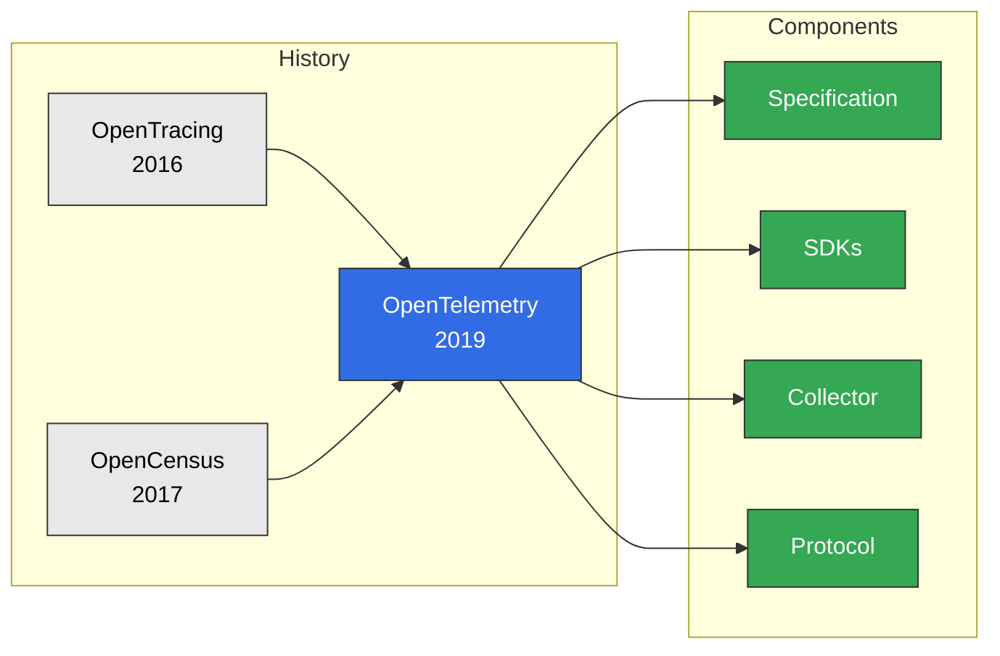
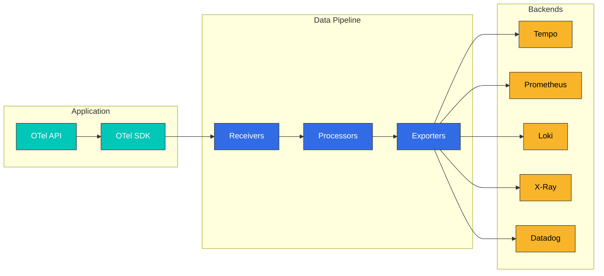
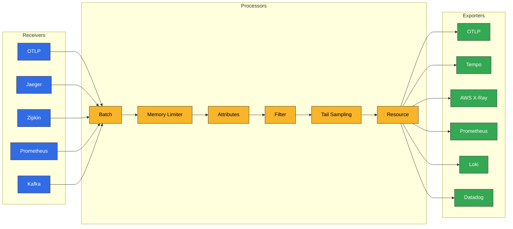

# OpenTelemetry

> **支持的版本**: OTEL 1.x
> **最后更新**: August 24, 2026

## 简介

OpenTelemetry（OTel）是一个面向云原生软件的可观测性框架。它为生成、收集和管理三类信号提供了供应商中立的标准：Traces、Metrics 和 Logs。作为 CNCF 第二活跃的项目，它已成为行业标准。

### 2026 年 7 月更新：CNCF 毕业

OpenTelemetry 已正式获得 CNCF **毕业**状态，这是该基金会最高的成熟度级别，与 Kubernetes 和 Prometheus 等项目并列。毕业表明该项目的治理、安全实践和采用情况已通过生产使用验证。社区公布的后续重点是推进其余信号（例如 profiling）的成熟度，并保持贡献者增长。有关背景和路线图，请参阅 CNCF 博文 ["OpenTelemetry has graduated… Now what?"](https://www.cncf.io/blog/2026/07/24/opentelemetry-has-graduated-now-what/)。

## 什么是 OpenTelemetry？

OpenTelemetry 源自 OpenTracing 和 OpenCensus 项目的合并：



## 核心概念

### 三类信号

| 信号 | 描述 | 使用场景 |
|--------|-------------|-----------|
| **Traces** | 分布式请求追踪 | 延迟分析、依赖关系映射 |
| **Metrics** | 数值测量 | 资源使用情况、SLI/SLO |
| **Logs** | 事件记录 | 调试、审计 |

### 核心组件



## OpenTelemetry SDK

### 自动插桩

无需更改代码即可自动添加插桩。

#### Java 自动插桩

```bash
# Download Java Agent
curl -L -o opentelemetry-javaagent.jar \
  https://github.com/open-telemetry/opentelemetry-java-instrumentation/releases/latest/download/opentelemetry-javaagent.jar
```

```yaml
# Kubernetes Deployment
apiVersion: apps/v1
kind: Deployment
metadata:
  name: order-service
spec:
  template:
    spec:
      containers:
        - name: app
          image: order-service:latest
          env:
            - name: JAVA_TOOL_OPTIONS
              value: "-javaagent:/opt/opentelemetry-javaagent.jar"
            - name: OTEL_SERVICE_NAME
              value: "order-service"
            - name: OTEL_EXPORTER_OTLP_ENDPOINT
              value: "http://otel-collector:4317"
            - name: OTEL_EXPORTER_OTLP_PROTOCOL
              value: "grpc"
            - name: OTEL_TRACES_SAMPLER
              value: "parentbased_traceidratio"
            - name: OTEL_TRACES_SAMPLER_ARG
              value: "0.1"
            - name: OTEL_RESOURCE_ATTRIBUTES
              value: "service.namespace=ecommerce,deployment.environment=production"
          volumeMounts:
            - name: otel-agent
              mountPath: /opt/opentelemetry-javaagent.jar
              subPath: opentelemetry-javaagent.jar
      volumes:
        - name: otel-agent
          configMap:
            name: otel-java-agent
```

#### Python 自动插桩

```bash
# Installation
pip install opentelemetry-distro opentelemetry-exporter-otlp
opentelemetry-bootstrap -a install
```

```yaml
# Kubernetes Deployment
apiVersion: apps/v1
kind: Deployment
metadata:
  name: payment-service
spec:
  template:
    spec:
      containers:
        - name: app
          image: payment-service:latest
          command:
            - opentelemetry-instrument
            - python
            - app.py
          env:
            - name: OTEL_SERVICE_NAME
              value: "payment-service"
            - name: OTEL_EXPORTER_OTLP_ENDPOINT
              value: "http://otel-collector:4317"
            - name: OTEL_PYTHON_LOGGING_AUTO_INSTRUMENTATION_ENABLED
              value: "true"
```

#### Node.js 自动插桩

```javascript
// tracing.js
const { NodeSDK } = require('@opentelemetry/sdk-node');
const { getNodeAutoInstrumentations } = require('@opentelemetry/auto-instrumentations-node');
const { OTLPTraceExporter } = require('@opentelemetry/exporter-trace-otlp-grpc');
const { OTLPMetricExporter } = require('@opentelemetry/exporter-metrics-otlp-grpc');
const { PeriodicExportingMetricReader } = require('@opentelemetry/sdk-metrics');

const sdk = new NodeSDK({
  serviceName: 'notification-service',
  traceExporter: new OTLPTraceExporter({
    url: 'http://otel-collector:4317',
  }),
  metricReader: new PeriodicExportingMetricReader({
    exporter: new OTLPMetricExporter({
      url: 'http://otel-collector:4317',
    }),
    exportIntervalMillis: 60000,
  }),
  instrumentations: [
    getNodeAutoInstrumentations({
      '@opentelemetry/instrumentation-fs': { enabled: false },
      '@opentelemetry/instrumentation-http': {
        ignoreIncomingRequestHook: (req) => req.url === '/health',
      },
    }),
  ],
});

sdk.start();

process.on('SIGTERM', () => {
  sdk.shutdown().then(() => process.exit(0));
});
```

### 手动插桩

如需细粒度控制，请手动进行插桩。

#### Java 手动插桩

```java
import io.opentelemetry.api.OpenTelemetry;
import io.opentelemetry.api.trace.Span;
import io.opentelemetry.api.trace.SpanKind;
import io.opentelemetry.api.trace.StatusCode;
import io.opentelemetry.api.trace.Tracer;
import io.opentelemetry.context.Scope;

@Service
public class OrderService {

    private final Tracer tracer;

    public OrderService(OpenTelemetry openTelemetry) {
        this.tracer = openTelemetry.getTracer("order-service", "1.0.0");
    }

    public Order processOrder(OrderRequest request) {
        // Create parent span
        Span parentSpan = tracer.spanBuilder("processOrder")
            .setSpanKind(SpanKind.SERVER)
            .setAttribute("order.id", request.getOrderId())
            .setAttribute("customer.id", request.getCustomerId())
            .startSpan();

        try (Scope scope = parentSpan.makeCurrent()) {
            // Business logic
            parentSpan.addEvent("Order validation started");

            // Child span - inventory check
            Order order = checkInventory(request);

            // Child span - payment processing
            processPayment(order);

            parentSpan.addEvent("Order processing completed");
            parentSpan.setStatus(StatusCode.OK);

            return order;

        } catch (Exception e) {
            parentSpan.setStatus(StatusCode.ERROR, e.getMessage());
            parentSpan.recordException(e);
            throw e;

        } finally {
            parentSpan.end();
        }
    }

    private Order checkInventory(OrderRequest request) {
        Span span = tracer.spanBuilder("checkInventory")
            .setSpanKind(SpanKind.INTERNAL)
            .startSpan();

        try (Scope scope = span.makeCurrent()) {
            span.setAttribute("product.count", request.getItems().size());

            // Inventory check logic
            Order order = inventoryService.check(request);

            span.setAttribute("inventory.available", true);
            return order;

        } catch (InsufficientStockException e) {
            span.setAttribute("inventory.available", false);
            span.setStatus(StatusCode.ERROR, "Insufficient stock");
            throw e;

        } finally {
            span.end();
        }
    }
}
```

## OTEL Collector

### 架构



### Collector 配置

```yaml
# otel-collector-config.yaml
receivers:
  # OTLP receiver
  otlp:
    protocols:
      grpc:
        endpoint: 0.0.0.0:4317
        max_recv_msg_size_mib: 16
      http:
        endpoint: 0.0.0.0:4318
        cors:
          allowed_origins:
            - "http://*"
            - "https://*"

  # Jaeger compatibility
  jaeger:
    protocols:
      thrift_http:
        endpoint: 0.0.0.0:14268
      grpc:
        endpoint: 0.0.0.0:14250

  # Zipkin compatibility
  zipkin:
    endpoint: 0.0.0.0:9411

processors:
  # Memory limiter
  memory_limiter:
    check_interval: 1s
    limit_mib: 1500
    spike_limit_mib: 500

  # Batch processing
  batch:
    timeout: 5s
    send_batch_size: 1000
    send_batch_max_size: 1500

  # Add/modify attributes
  attributes:
    actions:
      - key: environment
        value: production
        action: upsert
      - key: cluster
        value: eks-prod-cluster
        action: upsert

  # Resource detection
  resourcedetection:
    detectors: [env, system, ec2, eks]
    timeout: 5s
    override: false

  # Filtering (exclude health checks)
  filter:
    error_mode: ignore
    traces:
      span:
        - 'attributes["http.target"] == "/health"'
        - 'attributes["http.target"] == "/ready"'
        - 'attributes["http.target"] == "/metrics"'

  # Tail Sampling (for traces)
  tail_sampling:
    decision_wait: 10s
    num_traces: 100000
    expected_new_traces_per_sec: 1000
    policies:
      # 100% collection for error requests
      - name: error-policy
        type: status_code
        status_code:
          status_codes: [ERROR]
      # Collect slow requests
      - name: latency-policy
        type: latency
        latency:
          threshold_ms: 1000
      # Priority collection for specific services
      - name: service-priority
        type: string_attribute
        string_attribute:
          key: service.name
          values: [payment-service, order-service]
          enabled_regex_matching: false
      # Probabilistic sampling for the rest
      - name: probabilistic-policy
        type: probabilistic
        probabilistic:
          sampling_percentage: 10

exporters:
  # OTLP (Tempo)
  otlp/tempo:
    endpoint: tempo-distributor.tempo.svc.cluster.local:4317
    tls:
      insecure: true

  # AWS X-Ray
  awsxray:
    region: ap-northeast-2
    index_all_attributes: true

  # Prometheus Remote Write
  prometheusremotewrite:
    endpoint: http://prometheus:9090/api/v1/write
    tls:
      insecure: true

  # Loki (logs)
  loki:
    endpoint: http://loki-gateway.loki.svc.cluster.local:3100/loki/api/v1/push
    tls:
      insecure: true
    labels:
      attributes:
        service.name: "service"
        service.namespace: "namespace"
        k8s.pod.name: "pod"

extensions:
  health_check:
    endpoint: 0.0.0.0:13133
    path: /health

  pprof:
    endpoint: 0.0.0.0:1777

service:
  extensions: [health_check, pprof]

  pipelines:
    traces:
      receivers: [otlp, jaeger, zipkin]
      processors: [memory_limiter, resourcedetection, attributes, filter, tail_sampling, batch]
      exporters: [otlp/tempo, awsxray]

    metrics:
      receivers: [otlp]
      processors: [memory_limiter, resourcedetection, batch]
      exporters: [prometheusremotewrite]

    logs:
      receivers: [otlp]
      processors: [memory_limiter, resourcedetection, batch]
      exporters: [loki]
```

## EKS 部署模式

### DaemonSet 模式

在每个节点上部署 Collector，以收集该节点上所有 Pod 的数据：

```yaml
# otel-collector-daemonset.yaml
apiVersion: v1
kind: ServiceAccount
metadata:
  name: otel-collector
  namespace: otel
  annotations:
    eks.amazonaws.com/role-arn: arn:aws:iam::123456789012:role/otel-collector-role
---
apiVersion: apps/v1
kind: DaemonSet
metadata:
  name: otel-collector
  namespace: otel
spec:
  selector:
    matchLabels:
      app: otel-collector
  template:
    metadata:
      labels:
        app: otel-collector
    spec:
      serviceAccountName: otel-collector
      containers:
        - name: collector
          image: otel/opentelemetry-collector-contrib:0.92.0
          args:
            - --config=/conf/otel-collector-config.yaml
          ports:
            - containerPort: 4317
              hostPort: 4317
              protocol: TCP
            - containerPort: 4318
              hostPort: 4318
              protocol: TCP
          env:
            - name: K8S_NODE_NAME
              valueFrom:
                fieldRef:
                  fieldPath: spec.nodeName
          resources:
            requests:
              cpu: 200m
              memory: 400Mi
            limits:
              cpu: 1000m
              memory: 1Gi
          volumeMounts:
            - name: config
              mountPath: /conf
      volumes:
        - name: config
          configMap:
            name: otel-collector-config
      tolerations:
        - effect: NoSchedule
          operator: Exists
---
apiVersion: v1
kind: Service
metadata:
  name: otel-collector
  namespace: otel
spec:
  selector:
    app: otel-collector
  ports:
    - name: otlp-grpc
      port: 4317
      protocol: TCP
    - name: otlp-http
      port: 4318
      protocol: TCP
  type: ClusterIP
```

### Sidecar 模式

将 Collector 作为 sidecar 部署在每个应用 Pod 中：

```yaml
# application-with-sidecar.yaml
apiVersion: apps/v1
kind: Deployment
metadata:
  name: order-service
spec:
  template:
    spec:
      containers:
        # Application container
        - name: app
          image: order-service:latest
          ports:
            - containerPort: 8080
          env:
            - name: OTEL_EXPORTER_OTLP_ENDPOINT
              value: "http://localhost:4317"
            - name: OTEL_SERVICE_NAME
              value: "order-service"

        # OTEL Collector sidecar
        - name: otel-collector
          image: otel/opentelemetry-collector-contrib:0.92.0
          args:
            - --config=/conf/otel-collector-config.yaml
          ports:
            - containerPort: 4317
          resources:
            requests:
              cpu: 50m
              memory: 100Mi
            limits:
              cpu: 200m
              memory: 200Mi
          volumeMounts:
            - name: otel-config
              mountPath: /conf
      volumes:
        - name: otel-config
          configMap:
            name: otel-sidecar-config
```

## Kubernetes Operator

使用 OpenTelemetry Operator 进行自动插桩：

### Operator 安装

```bash
# Install cert-manager (required)
kubectl apply -f https://github.com/cert-manager/cert-manager/releases/download/v1.13.3/cert-manager.yaml

# Install OpenTelemetry Operator
kubectl apply -f https://github.com/open-telemetry/opentelemetry-operator/releases/latest/download/opentelemetry-operator.yaml
```

### Instrumentation CR

```yaml
# instrumentation.yaml
apiVersion: opentelemetry.io/v1alpha1
kind: Instrumentation
metadata:
  name: otel-instrumentation
  namespace: default
spec:
  exporter:
    endpoint: http://otel-collector.otel.svc.cluster.local:4317

  propagators:
    - tracecontext
    - baggage
    - b3

  sampler:
    type: parentbased_traceidratio
    argument: "0.1"

  # Java configuration
  java:
    image: ghcr.io/open-telemetry/opentelemetry-operator/autoinstrumentation-java:latest
    env:
      - name: OTEL_JAVAAGENT_DEBUG
        value: "false"

  # Python configuration
  python:
    image: ghcr.io/open-telemetry/opentelemetry-operator/autoinstrumentation-python:latest
    env:
      - name: OTEL_PYTHON_LOGGING_AUTO_INSTRUMENTATION_ENABLED
        value: "true"

  # Node.js configuration
  nodejs:
    image: ghcr.io/open-telemetry/opentelemetry-operator/autoinstrumentation-nodejs:latest
```

### 自动插桩注入

```yaml
# Enable auto-instrumentation on namespace
apiVersion: v1
kind: Namespace
metadata:
  name: ecommerce
  annotations:
    instrumentation.opentelemetry.io/inject-java: "true"
    instrumentation.opentelemetry.io/inject-python: "true"
    instrumentation.opentelemetry.io/inject-nodejs: "true"
---
# Or apply to individual Deployment
apiVersion: apps/v1
kind: Deployment
metadata:
  name: order-service
  namespace: ecommerce
  annotations:
    instrumentation.opentelemetry.io/inject-java: "otel-instrumentation"
spec:
  template:
    metadata:
      annotations:
        # Pod-level annotation
        instrumentation.opentelemetry.io/inject-java: "true"
    spec:
      containers:
        - name: app
          image: order-service:latest
```

## 多后端配置

从单个 Collector 向多个后端发送数据：

```yaml
exporters:
  # Grafana Tempo
  otlp/tempo:
    endpoint: tempo-distributor:4317
    tls:
      insecure: true

  # AWS X-Ray
  awsxray:
    region: ap-northeast-2

  # Datadog
  datadog:
    api:
      key: ${DD_API_KEY}
      site: datadoghq.com
    traces:
      span_name_as_resource_name: true

  # Jaeger
  jaeger:
    endpoint: jaeger-collector:14250
    tls:
      insecure: true

service:
  pipelines:
    traces:
      receivers: [otlp]
      processors: [batch]
      exporters: [otlp/tempo, awsxray, datadog, jaeger]
```

### 2026 年 7 月更新：为 AI Agent 流量观测网络边界

一篇 CNCF 博文介绍了一种[使用 NGINX 和 OpenTelemetry 为 AI Agent 构建网络边界](https://www.cncf.io/blog/2026/07/08/network-boundary-for-ai-agents-using-nginx-and-opentelemetry/)的模式。来自 AI Agent 的出站流量会被强制通过正向代理（NGINX），而 NGINX 原生 OpenTelemetry 模块会为每个请求生成一个 OTel span。这些 span 与上文介绍的管道一样流经 OTel Collector——持久化到审计日志，或转发到 Jaeger、Grafana 或 SIEM——使您能够将用户交互与 Agent 代其发出的外部调用关联起来。如果您在集群中运行 Agent 工作负载，这是一种很有用的可观测性模式，可原样复用现有的 OTel 管道。

### 2026 年 8 月更新：将慢 SQL 查询提炼为可靠性 Metrics

一篇 CNCF 博文讲解了[如何使用 OpenTelemetry 将慢查询转化为可操作的可靠性 Metrics](https://www.cncf.io/blog/2026/08/21/how-to-turn-slow-queries-into-actionable-reliability-metrics-with-opentelemetry/)。它构建了一个可重复的工作流程，将您的应用已生成的 OpenTelemetry 数据库 span 提炼为可在仪表板中展示并设置告警的 span 派生 Metrics——从简单的慢查询检测开始，随后加入按流量加权的影响（哪些查询最值得优化）和异常检测（哪些查询当前表现异常）。该博文附有一个实践用的[实验仓库](https://github.com/causely-oss/slow-query-lab)。

## 最佳实践

### 1. 标准化资源属性

```yaml
# Follow Semantic Conventions
resource:
  attributes:
    # Service information
    service.name: order-service
    service.version: 1.2.3
    service.namespace: ecommerce

    # Deployment environment
    deployment.environment: production

    # Cloud information
    cloud.provider: aws
    cloud.region: ap-northeast-2
    cloud.availability_zone: ap-northeast-2a

    # Kubernetes information
    k8s.cluster.name: eks-prod
    k8s.namespace.name: ecommerce
    k8s.pod.name: order-service-abc123
    k8s.deployment.name: order-service
```

### 2. 采样策略

```yaml
# Hierarchical sampling
processors:
  tail_sampling:
    policies:
      # Priority 1: 100% errors
      - name: errors
        type: status_code
        status_code:
          status_codes: [ERROR]

      # Priority 2: 100% slow requests
      - name: slow
        type: latency
        latency:
          threshold_ms: 2000

      # Priority 3: 50% critical services
      - name: critical-services
        type: and
        and:
          and_sub_policy:
            - name: service-name
              type: string_attribute
              string_attribute:
                key: service.name
                values: [payment-service, order-service]
            - name: probabilistic
              type: probabilistic
              probabilistic:
                sampling_percentage: 50

      # Priority 4: 5% for the rest
      - name: default
        type: probabilistic
        probabilistic:
          sampling_percentage: 5
```

### 3. 安全注意事项

```yaml
# Enable TLS
receivers:
  otlp:
    protocols:
      grpc:
        endpoint: 0.0.0.0:4317
        tls:
          cert_file: /certs/server.crt
          key_file: /certs/server.key

exporters:
  otlp:
    endpoint: tempo:4317
    tls:
      ca_file: /certs/ca.crt
      cert_file: /certs/client.crt
      key_file: /certs/client.key

# Filter sensitive information
processors:
  attributes:
    actions:
      - key: http.request.header.authorization
        action: delete
      - key: db.statement
        action: hash  # Hashing
```

## 测验

通过 [OpenTelemetry 测验](../../quizzes/observability/tracing/03-opentelemetry-quiz.md)测试您的知识。
