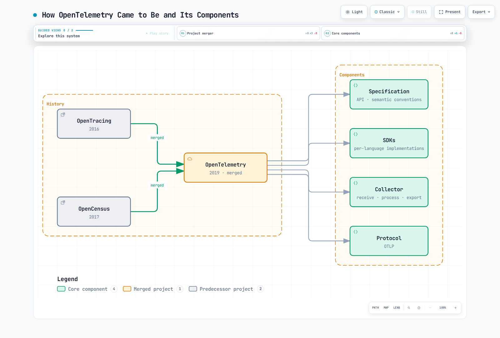
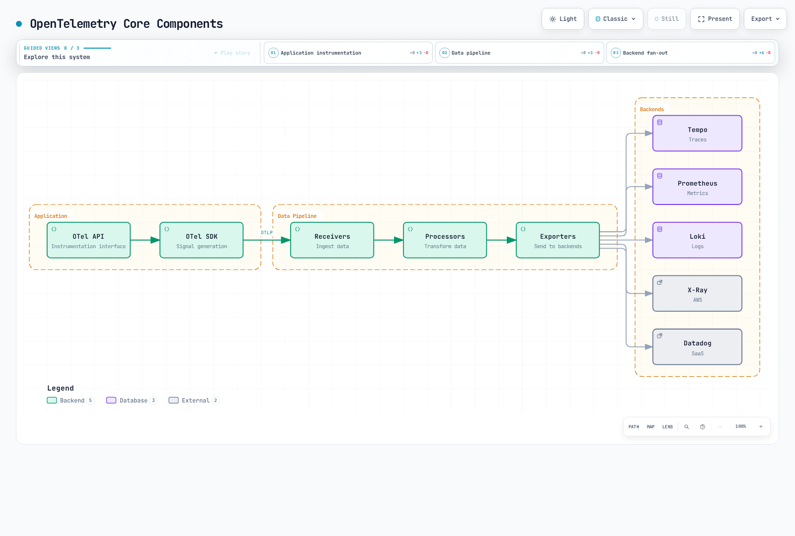
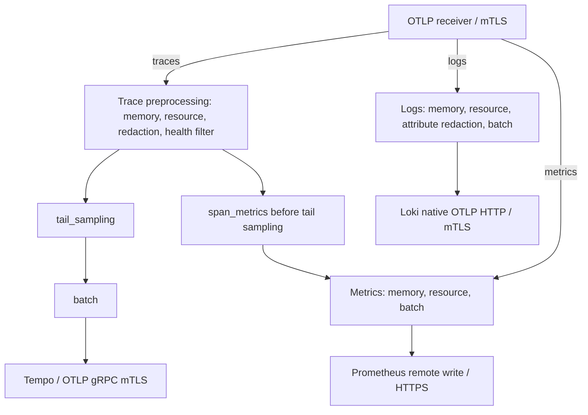

# OpenTelemetry

> **审查基线**：Collector Contrib 0.160.0；Operator 0.158.0；语言版本见下文
> **最后更新**：2026 年 10 月 12 日

## 简介

OpenTelemetry（OTel）是面向云原生软件的可观测性框架。它提供与供应商无关的标准，用于生成、收集和管理三种信号：Trace、Metrics 和 Logs。CNCF 于 2026 年 7 月 24 日发布的回顾文章称，其贡献速度仅次于 Kubernetes。项目成熟度与各 SDK/组件的稳定性是两个不同的方面。

### 2026 年 7 月更新：CNCF 毕业

OpenTelemetry 于 **2026 年 5 月**在 CNCF 获得**毕业**状态；7 月 24 日的文章是一篇回顾。这是基金会的最高成熟度级别，Kubernetes 和 Prometheus 等项目也处于该级别。毕业意味着该项目的治理、安全实践和采用情况已通过审查，可用于生产环境。回顾文章讨论了 GenAI 语义约定、浏览器/移动端可观测性、架构治理和发布工具。背景和路线图请参阅 CNCF 博客文章 ["OpenTelemetry has graduated… Now what?"](https://www.cncf.io/blog/2026/07/24/opentelemetry-has-graduated-now-what/)。

## 什么是 OpenTelemetry？

OpenTelemetry 由 OpenTracing 和 OpenCensus 项目合并而来：



[🔍 查看交互式图表](https://www.atomai.click/kubernetes-docs/archmaps/en-observability-tracing-03-opentelemetry-0.html)

## 核心概念

### 三种信号

本章重点介绍 traces、metrics 和 logs。Profiling 是另一种不断发展的信号；不同实现的支持情况和稳定性各不相同。Trace/log ID 和 metric exemplar 需要相应的 instrumentation 和后端配置。

| 信号 | 说明 | 使用场景 |
|--------|-------------|-----------|
| **Traces** | 分布式请求追踪 | 延迟分析、依赖关系映射 |
| **Metrics** | 数值测量 | 资源使用情况、SLI/SLO |
| **Logs** | 事件记录 | 调试、审计 |

### 核心组件



[🔍 查看交互式图表](https://www.atomai.click/kubernetes-docs/archmaps/en-observability-tracing-03-opentelemetry-2.html)

图中按信号列出了后端选项。只有已配置的 exporter 会启用；以下基础示例不会自动启用所有供应商。


## OpenTelemetry SDK

Collector、Operator、Java agent 和各语言 SDK 的版本号彼此独立。以下 Linux 工作负载模板已根据 Kubernetes 1.35 schema 检查：应用镜像、命名空间、证书和目标 Service 必须由其所有者准备。范围更广的 Operator 兼容矩阵并不会免除特定示例所需的条件，例如 native sidecar。本地检查无法证明已部署的 EKS 应用可正常运行。

| 组件 | 基线和范围 |
|---|---|
| 独立 Collector Contrib | 0.160.0；使用其真实二进制文件检查组件和 schema |
| Operator | 0.158.0；其兼容性表列出了 Kubernetes 1.25–1.36 和 cert-manager v1 |
| Java agent | 2.31.1，目标 SDK 版本为 1.65.0；与 Operator 的默认 Java 镜像版本不同 |
| Python | SDK/exporter 1.44.0，instrumentation/distro 0.65b0；Python ≥3.10 |
| Node.js CommonJS 示例 | SDK-node 0.220.0、auto-instrumentations-node 0.78.0、resources 2.9.0、API 1.9.1 |

Operator 默认使用 Collector 0.158.0。以下独立的 0.160.0 工作负载并非由 Operator 管理的 Collector 升级。请检查与受支持 EKS 版本的交集；最新的 Kubernetes 版本并不一定包含在 Operator 兼容矩阵中。

### 自动插桩

截至 2026 年 10 月 12 日，EKS 标准支持包括 1.34–1.37。1.35 schema 基线在此列表和 Operator 矩阵范围内；但这仍不能取代对实时平台/附加组件的验收检查。

零代码插桩会挂接受支持的库；它不会发现任意业务操作。对于一个进程，应选择直接准备 agent/launcher，或使用 Operator 注入。请勿在已经配置的 provider 上再次初始化 SDK。以下应用镜像只是占位符，应替换为你自己的构建，包括启动命令和依赖项。

准备 `ecommerce` 命名空间，并在其中创建包含 `ca.crt`、`tls.crt` 和 `tls.key` 的 `otel-client-tls` Secret。客户端证书必须得到 Collector 的信任，且 Collector 证书必须与 `otel-collector.otel.svc.cluster.local` 匹配。Secret 文件以只读方式挂载；请根据你的镜像调整 UID/GID 访问权限。环境变量中仅包含证书**路径**，不包含密钥内容或 bearer token。这些模板使用 4318 TLS 端口上的 OTLP HTTP/protobuf。

#### Java 自动插桩

将固定版本的 agent 下载到应用构建中，并验证发布资产的校验和。2.31.1 JAR 的大小为 25,107,554 字节，超过 Kubernetes ConfigMap 的 1 MiB 限制。请将其包含在镜像中，或使用 Operator 注入；ConfigMap 不是分发 agent 二进制文件的机制。


```bash
curl --fail --location --output opentelemetry-javaagent.jar \
  https://github.com/open-telemetry/opentelemetry-java-instrumentation/releases/download/v2.31.1/opentelemetry-javaagent.jar
printf '%s  %s\n' \
  bbf83c151b6400709e2f225bdd07a04f839d9d13b8b93464241333fd25d3e3ba \
  opentelemetry-javaagent.jar | sha256sum --check -
```

```dockerfile
# Add to the application's existing Dockerfile; not a complete image build.
COPY opentelemetry-javaagent.jar /opt/otel/opentelemetry-javaagent.jar
```
将 agent 选项合并到现有的 `JAVA_TOOL_OPTIONS` 中；不要丢弃应用的 JVM 选项。Deployment selector 必须与 Pod 标签匹配。


```yaml
apiVersion: apps/v1
kind: Deployment
metadata:
  name: order-service
  namespace: ecommerce
spec:
  replicas: 1
  selector:
    matchLabels:
      app: order-service
  template:
    metadata:
      labels:
        app: order-service
    spec:
      automountServiceAccountToken: false
      securityContext:
        fsGroup: 10001
      containers:
      - name: app
        image: registry.example.com/order-service:otel-demo
        env:
        - name: OTEL_SERVICE_NAME
          value: order-service
        - name: OTEL_RESOURCE_ATTRIBUTES
          value: service.namespace=ecommerce,deployment.environment.name=demo
        - name: OTEL_EXPORTER_OTLP_ENDPOINT
          value: https://otel-collector.otel.svc.cluster.local:4318
        - name: OTEL_EXPORTER_OTLP_PROTOCOL
          value: http/protobuf
        - name: OTEL_EXPORTER_OTLP_CERTIFICATE
          value: /var/run/otel-client/ca.crt
        - name: OTEL_EXPORTER_OTLP_CLIENT_CERTIFICATE
          value: /var/run/otel-client/tls.crt
        - name: OTEL_EXPORTER_OTLP_CLIENT_KEY
          value: /var/run/otel-client/tls.key
        - name: OTEL_TRACES_EXPORTER
          value: otlp
        - name: OTEL_METRICS_EXPORTER
          value: otlp
        - name: OTEL_LOGS_EXPORTER
          value: none
        - name: OTEL_TRACES_SAMPLER
          value: parentbased_always_on
        - name: OTEL_METRIC_EXPORT_INTERVAL
          value: '60000'
        - name: JAVA_TOOL_OPTIONS
          value: -javaagent:/opt/otel/opentelemetry-javaagent.jar
        volumeMounts:
        - name: otel-client-tls
          mountPath: /var/run/otel-client
          readOnly: true
      volumes:
      - name: otel-client-tls
        secret:
          secretName: otel-client-tls
          defaultMode: 288
```
#### Python 自动插桩

对于 Flask 应用，请在其构建环境中安装匹配的软件包，并锁定解析后的应用依赖项。其他框架需要安装与之匹配的 instrumentation 软件包。此示例显式选择 HTTP exporter，而不是将 Python 的 HTTP 默认配置发送到 gRPC 端口 4317。


```bash
python -m pip install \
  opentelemetry-api==1.44.0 opentelemetry-sdk==1.44.0 \
  opentelemetry-distro==0.65b0 \
  opentelemetry-instrumentation-flask==0.65b0 \
  opentelemetry-exporter-otlp-proto-http==1.44.0
```

```yaml
apiVersion: apps/v1
kind: Deployment
metadata:
  name: payment-service
  namespace: ecommerce
spec:
  replicas: 1
  selector:
    matchLabels:
      app: payment-service
  template:
    metadata:
      labels:
        app: payment-service
    spec:
      automountServiceAccountToken: false
      securityContext:
        fsGroup: 10001
      containers:
      - name: app
        image: registry.example.com/payment-service:otel-demo
        env:
        - name: OTEL_SERVICE_NAME
          value: payment-service
        - name: OTEL_RESOURCE_ATTRIBUTES
          value: service.namespace=ecommerce,deployment.environment.name=demo
        - name: OTEL_EXPORTER_OTLP_ENDPOINT
          value: https://otel-collector.otel.svc.cluster.local:4318
        - name: OTEL_EXPORTER_OTLP_PROTOCOL
          value: http/protobuf
        - name: OTEL_EXPORTER_OTLP_CERTIFICATE
          value: /var/run/otel-client/ca.crt
        - name: OTEL_EXPORTER_OTLP_CLIENT_CERTIFICATE
          value: /var/run/otel-client/tls.crt
        - name: OTEL_EXPORTER_OTLP_CLIENT_KEY
          value: /var/run/otel-client/tls.key
        - name: OTEL_TRACES_EXPORTER
          value: otlp
        - name: OTEL_METRICS_EXPORTER
          value: otlp
        - name: OTEL_LOGS_EXPORTER
          value: none
        - name: OTEL_TRACES_SAMPLER
          value: parentbased_always_on
        - name: OTEL_METRIC_EXPORT_INTERVAL
          value: '60000'
        volumeMounts:
        - name: otel-client-tls
          mountPath: /var/run/otel-client
          readOnly: true
        command:
        - opentelemetry-instrument
        - python
        - app.py
      volumes:
      - name: otel-client-tls
        secret:
          secretName: otel-client-tls
          defaultMode: 288
```
#### Node.js 自动插桩


```bash
npm install --save-exact \
  @opentelemetry/api@1.9.1 @opentelemetry/resources@2.9.0 \
  @opentelemetry/sdk-node@0.220.0 \
  @opentelemetry/auto-instrumentations-node@0.78.0
# Commit package-lock.json and use npm ci for subsequent application builds.
```
将代码保存为 `tracing.cjs`，并在应用/框架模块加载前加载。这是一个 CommonJS 示例；ESM 加载需要按照语言指南单独配置。SDK 会读取下方显式设置的 OTEL exporter/TLS 环境变量。对于以编程方式配置的 metric reader，当前配置使用 `metricReaders`，取代已弃用的单数选项。在应用自身的请求排空步骤之后，集成 `shutdownTelemetry()`。


```javascript
// Load before application/framework modules in a CommonJS application.
const { NodeSDK } = require('@opentelemetry/sdk-node');
const { envDetector } = require('@opentelemetry/resources');
const { getNodeAutoInstrumentations } = require('@opentelemetry/auto-instrumentations-node');

const sdk = new NodeSDK({
  resourceDetectors: [envDetector],
  instrumentations: [
    getNodeAutoInstrumentations({
      '@opentelemetry/instrumentation-fs': { enabled: false },
      '@opentelemetry/instrumentation-http': {
        ignoreIncomingRequestHook: (request) =>
          String(request.url || '').split('?')[0] === '/health',
      },
    }),
  ],
});

// OTEL_* variables configure exporters, protocol, TLS and metric interval.
sdk.start();

// Call after the application's own request-draining step on shutdown.
module.exports = { shutdownTelemetry: () => sdk.shutdown() };
```

```yaml
apiVersion: apps/v1
kind: Deployment
metadata:
  name: notification-service
  namespace: ecommerce
spec:
  replicas: 1
  selector:
    matchLabels:
      app: notification-service
  template:
    metadata:
      labels:
        app: notification-service
    spec:
      automountServiceAccountToken: false
      securityContext:
        fsGroup: 10001
      containers:
      - name: app
        image: registry.example.com/notification-service:otel-demo
        env:
        - name: OTEL_SERVICE_NAME
          value: notification-service
        - name: OTEL_RESOURCE_ATTRIBUTES
          value: service.namespace=ecommerce,deployment.environment.name=demo
        - name: OTEL_EXPORTER_OTLP_ENDPOINT
          value: https://otel-collector.otel.svc.cluster.local:4318
        - name: OTEL_EXPORTER_OTLP_PROTOCOL
          value: http/protobuf
        - name: OTEL_EXPORTER_OTLP_CERTIFICATE
          value: /var/run/otel-client/ca.crt
        - name: OTEL_EXPORTER_OTLP_CLIENT_CERTIFICATE
          value: /var/run/otel-client/tls.crt
        - name: OTEL_EXPORTER_OTLP_CLIENT_KEY
          value: /var/run/otel-client/tls.key
        - name: OTEL_TRACES_EXPORTER
          value: otlp
        - name: OTEL_METRICS_EXPORTER
          value: otlp
        - name: OTEL_LOGS_EXPORTER
          value: none
        - name: OTEL_TRACES_SAMPLER
          value: parentbased_always_on
        - name: OTEL_METRIC_EXPORT_INTERVAL
          value: '60000'
        volumeMounts:
        - name: otel-client-tls
          mountPath: /var/run/otel-client
          readOnly: true
        command:
        - node
        - --require
        - ./tracing.cjs
        - app.cjs
      volumes:
      - name: otel-client-tls
        secret:
          secretName: otel-client-tls
          defaultMode: 288
```
这些示例有意设置 `OTEL_LOGS_EXPORTER=none`。启用 log exporter 并不会收集应用 stdout：请安装适当的 logging bridge/handler 或 log collector，并先检查 payload 是否会暴露信息。`parentbased_always_on` sampler 仍会遵循未采样的 parent。如果改用 10% head sampling，tail Collector 就无法恢复已丢弃的 spans。

### 手动插桩

复用由 agent 或应用初始化的 OpenTelemetry 实例/provider。若没有 SDK provider，API 调用可能不起作用。这些业务工作流 spans 属于 INTERNAL：经过插桩的 HTTP/数据库客户端会创建自己的 CLIENT spans 并传播上下文。仅手动创建 CLIENT span 不会发送请求，也不会注入 trace 上下文。

#### Java 手动插桩

应用提供 inventory/payment 回调。不会记录订单/客户 ID、金额、交易 ID 或原始异常消息。这些是应用操作，不是 payment-service 实现，也不是经过测试的 Spring 部署。


```java
import io.opentelemetry.api.OpenTelemetry;
import io.opentelemetry.api.trace.Span;
import io.opentelemetry.api.trace.SpanKind;
import io.opentelemetry.api.trace.StatusCode;
import io.opentelemetry.api.trace.Tracer;
import io.opentelemetry.context.Scope;

public final class OrderTelemetry {
    private final Tracer tracer;

    public OrderTelemetry(OpenTelemetry telemetry) {
        this.tracer = telemetry.getTracer("example.order-workflow", "1.0.0");
    }

    public void processOrder(Runnable validateInventory, Runnable processPayment) {
        Span parent = tracer.spanBuilder("processOrder")
                .setSpanKind(SpanKind.INTERNAL).startSpan();
        try (Scope ignored = parent.makeCurrent()) {
            parent.addEvent("validation.started");
            child("checkInventory", validateInventory);
            child("processPayment", processPayment);
            parent.addEvent("processing.completed");
        } catch (RuntimeException error) {
            parent.setStatus(StatusCode.ERROR);
            parent.setAttribute("error.type", error.getClass().getName());
            throw error;
        } finally {
            parent.end();
        }
    }

    private void child(String name, Runnable operation) {
        Span span = tracer.spanBuilder(name).setSpanKind(SpanKind.INTERNAL).startSpan();
        try (Scope ignored = span.makeCurrent()) {
            operation.run();
        } catch (RuntimeException error) {
            span.setStatus(StatusCode.ERROR);
            span.setAttribute("error.type", error.getClass().getName());
            throw error;
        } finally {
            span.end();
        }
    }
}
```
#### Python 手动插桩

同步装饰器会保留返回值和错误，同时结束嵌套 spans。它仅记录错误类型，避免重复记录原始异常事件。异步函数需要支持 async 的包装器。请提供自己的参数化数据库查询、验证、持久化和事件发布回调；本地验证使用了合成回调和内存 exporter。


```python
"""Manual spans for synchronous application callbacks; no database is created."""
from functools import wraps
from contextlib import contextmanager
from opentelemetry import trace
from opentelemetry.trace import SpanKind, Status, StatusCode

# Reuse the SDK provider initialized by auto-instrumentation or the application.
tracer = trace.get_tracer("example.user-workflow", "1.0.0")

@contextmanager
def operation(name):
    with tracer.start_as_current_span(
        name, kind=SpanKind.INTERNAL,
        record_exception=False, set_status_on_exception=False,
    ) as span:
        try:
            yield span
        except Exception as error:
            span.set_status(Status(StatusCode.ERROR))
            span.set_attribute("error.type", type(error).__name__)
            raise

def traced(name):
    def decorate(function):
        @wraps(function)
        def wrapped(*args, **kwargs):
            with operation(name):
                return function(*args, **kwargs)
        return wrapped
    return decorate

@traced("get_user")
def get_user(user_id, lookup):
    # lookup is supplied by the application, with parameterized queries.
    # The ID and SQL text are not added to telemetry.
    with operation("lookup_user"):
        result = lookup(user_id)
    trace.get_current_span().set_attribute("app.user.found", result is not None)
    return result

@traced("create_user")
def create_user(user_data, validate, save, publish):
    # These callbacks are the application's own implementations.
    with operation("validate_user_data"):
        validate(user_data)
    with operation("save_user"):
        result = save(user_data)
    with operation("publish_user_event"):
        publish(result)
    return result
```
对于真实的数据库/消息 instrumentation，请遵循已实现的约定版本，例如 `db.system.name`、`db.operation.name` 和 `messaging.destination.name`。不要将用户 ID 复制到 SQL telemetry 字符串中，也不要将原始查询用作 metric 标签。上述业务回调并不能证明实际执行了 PostgreSQL 或 Kafka。

## OTEL Collector

### 架构



```mermaid
flowchart TD
    R["OTLP receiver / mTLS"]
    R -->|traces| P["Trace preprocessing: memory, resource, redaction, health filter"]
    P --> S["tail_sampling"]
    S --> B["batch"]
    B --> T["Tempo / OTLP gRPC mTLS"]
    P --> C["span_metrics before tail sampling"]
    C --> M["Metrics: memory, resource, batch"]
    R -->|metrics| M
    M --> W["Prometheus remote write / HTTPS"]
    R -->|logs| L["Logs: memory, resource, attribute redaction, batch"]
    L --> K["Loki native OTLP HTTP / mTLS"]
```

以下配置的信号路由。Trace 预处理框概括了两个独立 trace pipeline 中的等效处理。Span metrics 在 tail sampling 前分流；传入的 metrics 和 logs 使用各自的 pipeline。

### Collector 配置

保存为 `otel-collector-config.yaml`。这是一个用于实验环境的单实例有状态采样/聚合配置，不保证高可用或容量。另一个独立的 trace pipeline 会在 **tail sampling 之前**生成 metrics。经过 head sampling 或过滤的 spans 仍不会出现在这些 metrics 中。这些计数器统计的是观察到的 spans，而不是唯一的最终用户请求；应选择合适的 span kind 和有限的维度来计算请求 SLI。在 0.160.0 中，span-metric 累积计数器最初会导出零值；在将第一个值解释为没有流量之前，请检查后续 flush。

准备启用了 OTLP 的 Tempo、兼容 Prometheus 的 remote-write 接收端，以及 Loki 原生 OTLP ingestion，并配置由运维人员提供的 TLS/身份验证网关。下方示例中的网关名称并非本指南创建的 Service。Prometheus 需要启用 remote-write receiver（直接使用 Prometheus 时设置 `--web.enable-remote-write-receiver`）。Loki exporter 的基础 endpoint 以 `/otlp` 结尾；HTTP exporter 会追加 `/v1/logs`。请根据需要配置 Loki structured metadata 和可信任的租户映射；tenant header 并非身份验证。

环境变量指向已有的证书和 endpoint。所有已配置的 receiver 均使用 mutual TLS；未启用通配符浏览器 CORS 或公共 profiling endpoint。指定的属性删除规则只是有限的控制措施，并不代表已完整清除日志正文、span events、resource attributes 或任意 payload 中的敏感信息。也应在 SDK 端尽量减少数据。


```yaml
# otel-collector-config.yaml
receivers:
  otlp:
    protocols:
      grpc:
        endpoint: 0.0.0.0:4317
        max_recv_msg_size_mib: 16
        tls:
          cert_file: ${env:OTEL_SERVER_CERT}
          key_file: ${env:OTEL_SERVER_KEY}
          client_ca_file: ${env:OTEL_CLIENT_CA}
      http:
        endpoint: 0.0.0.0:4318
        tls:
          cert_file: ${env:OTEL_SERVER_CERT}
          key_file: ${env:OTEL_SERVER_KEY}
          client_ca_file: ${env:OTEL_CLIENT_CA}

processors:
  memory_limiter:
    check_interval: 1s
    limit_mib: 384
    spike_limit_mib: 96
  resource/cluster:
    attributes:
      - key: k8s.cluster.name
        value: ${env:K8S_CLUSTER_NAME}
        action: insert
  attributes/redact:
    actions:
      - key: http.request.header.authorization
        action: delete
      - key: user.email
        action: delete
      - key: user.id
        action: delete
      - key: customer.id
        action: delete
      - key: db.statement
        action: delete
      - key: db.query.text
        action: delete
  filter/health:
    error_mode: propagate
    traces:
      span:
        - 'attributes["http.route"] == "/health"'
        - 'attributes["http.route"] == "/ready"'
        - 'attributes["http.route"] == "/metrics"'
  tail_sampling:
    decision_wait: 10s
    num_traces: 10000
    expected_new_traces_per_sec: 100
    policies:
      - name: errors
        type: status_code
        status_code:
          status_codes: [ERROR]
      - name: slow
        type: latency
        latency:
          threshold_ms: 1000
      - name: selected-services
        type: string_attribute
        string_attribute:
          key: service.name
          values: [payment-service, order-service]
      - name: baseline
        type: probabilistic
        probabilistic:
          sampling_percentage: 10
  batch:
    timeout: 5s
    send_batch_size: 512
    send_batch_max_size: 1024

connectors:
  span_metrics:
    histogram:
      unit: s
      explicit:
        buckets: [5ms, 10ms, 25ms, 50ms, 100ms, 250ms, 500ms, 1s, 2s, 5s]
    dimensions:
      - name: http.request.method
      - name: http.response.status_code
    aggregation_cardinality_limit: 1000
    metrics_flush_interval: 15s

exporters:
  otlp_grpc/tempo:
    endpoint: ${env:TEMPO_OTLP_GRPC_ENDPOINT}
    tls:
      ca_file: ${env:BACKEND_CA}
      cert_file: ${env:BACKEND_CLIENT_CERT}
      key_file: ${env:BACKEND_CLIENT_KEY}
  prometheus_remote_write:
    endpoint: ${env:PROMETHEUS_REMOTE_WRITE_ENDPOINT}
    tls:
      ca_file: ${env:BACKEND_CA}
      cert_file: ${env:BACKEND_CLIENT_CERT}
      key_file: ${env:BACKEND_CLIENT_KEY}
  otlp_http/loki:
    endpoint: ${env:LOKI_OTLP_HTTP_ENDPOINT}
    tls:
      ca_file: ${env:BACKEND_CA}
      cert_file: ${env:BACKEND_CLIENT_CERT}
      key_file: ${env:BACKEND_CLIENT_KEY}

extensions:
  health_check:
    endpoint: 0.0.0.0:13133
    path: /health

service:
  extensions: [health_check]
  pipelines:
    traces:
      receivers: [otlp]
      processors: [memory_limiter, resource/cluster, attributes/redact, filter/health, tail_sampling, batch]
      exporters: [otlp_grpc/tempo]
    traces/span-metrics:
      receivers: [otlp]
      processors: [memory_limiter, resource/cluster, attributes/redact, filter/health]
      exporters: [span_metrics]
    metrics:
      receivers: [otlp, span_metrics]
      processors: [memory_limiter, resource/cluster, batch]
      exporters: [prometheus_remote_write]
    logs:
      receivers: [otlp]
      processors: [memory_limiter, resource/cluster, attributes/redact, batch]
      exporters: [otlp_http/loki]
  telemetry:
    logs:
      level: info
      encoding: json
    metrics:
      readers:
        - pull:
            exporter:
              prometheus:
                host: 127.0.0.1
                port: 8888
```
正向采样策略之间是 OR 条件，并非按顺序排列的优先级阶梯。即使不符合基线概率，选定的服务也可以单独保留。延迟判断采用严格的 `>1000 ms` 比较。基于计时器的决策并不能证明 trace 已完整；健康检查过滤器会有意移除匹配的 spans，即使它们带有错误；过滤单个 spans 可能导致 trace 不完整。

硬内存限制为 384 MiB，软限制为 288 MiB，与模板中的 512 MiB 容器限制之间留有余量。仍需测量拒绝、重试、队列和突发流量。此处的 batch/trace/cardinality 限制只是演示设置，并非基准测试结果。

### 单实例工作负载和配置

准备 `otel` 命名空间和 `otel-ingest-tls` / `otel-backend-tls` Secrets，并包含 `tls.crt`、`tls.key`、`ca.crt`。证书 SAN 必须与相应的 Service/网关名称匹配，并使用合适的信任包以及具有正确 server/client 用途的证书。根据 UID/GID 10001 调整文件访问权限。ConfigMap 包含文本配置，不包含私钥。对于此单实例 sampler，`Recreate` 可避免常规滚动更新期间出现重叠，但需要接受停机；它无法在重启期间保留内存中的 traces。


```bash
: "${KUBE_CONTEXT:?Set the reviewed cluster context}"
kubectl --context "$KUBE_CONTEXT" -n otel create configmap otel-collector-config \
  --from-file=otel-collector-config.yaml --dry-run=client -o yaml > otel-collector-configmap.yaml
# Inspect the namespace, Secrets, endpoints and workloads before any real apply.
```

```yaml
apiVersion: v1
kind: ServiceAccount
metadata:
  name: otel-collector
  namespace: otel
automountServiceAccountToken: false
---
apiVersion: apps/v1
kind: Deployment
metadata:
  name: otel-collector
  namespace: otel
spec:
  selector:
    matchLabels:
      app: otel-collector
  template:
    metadata:
      labels:
        app: otel-collector
    spec:
      serviceAccountName: otel-collector
      automountServiceAccountToken: false
      nodeSelector:
        kubernetes.io/os: linux
      securityContext:
        runAsNonRoot: true
        runAsUser: 10001
        fsGroup: 10001
        seccompProfile:
          type: RuntimeDefault
      containers:
      - name: collector
        image: otel/opentelemetry-collector-contrib:0.160.0
        args:
        - --config=/conf/otel-collector-config.yaml
        env:
        - name: GOMEMLIMIT
          value: 384MiB
        - name: OTEL_SERVER_CERT
          value: /var/run/otel/ingest/tls.crt
        - name: OTEL_SERVER_KEY
          value: /var/run/otel/ingest/tls.key
        - name: OTEL_CLIENT_CA
          value: /var/run/otel/ingest/ca.crt
        - name: BACKEND_CA
          value: /var/run/otel/backend/ca.crt
        - name: BACKEND_CLIENT_CERT
          value: /var/run/otel/backend/tls.crt
        - name: BACKEND_CLIENT_KEY
          value: /var/run/otel/backend/tls.key
        - name: OTEL_UPSTREAM_ENDPOINT
          value: otel-collector.otel.svc.cluster.local:4317
        - name: K8S_CLUSTER_NAME
          value: REPLACE_WITH_CLUSTER_NAME
        - name: TEMPO_OTLP_GRPC_ENDPOINT
          value: tempo-gateway.tempo.svc.cluster.local:4317
        - name: PROMETHEUS_REMOTE_WRITE_ENDPOINT
          value: https://prometheus-gateway.monitoring.svc.cluster.local/api/v1/write
        - name: LOKI_OTLP_HTTP_ENDPOINT
          value: https://loki-gateway.loki.svc.cluster.local/otlp
        ports:
        - name: otlp-grpc
          containerPort: 4317
        - name: otlp-http
          containerPort: 4318
        resources:
          requests:
            cpu: 100m
            memory: 256Mi
          limits:
            cpu: 500m
            memory: 512Mi
        securityContext:
          allowPrivilegeEscalation: false
          readOnlyRootFilesystem: true
          capabilities:
            drop:
            - ALL
        volumeMounts:
        - name: config
          mountPath: /conf
          readOnly: true
        - name: ingest-tls
          mountPath: /var/run/otel/ingest
          readOnly: true
        - name: backend-tls
          mountPath: /var/run/otel/backend
          readOnly: true
        readinessProbe:
          httpGet:
            path: /health
            port: 13133
        livenessProbe:
          httpGet:
            path: /health
            port: 13133
          initialDelaySeconds: 15
      volumes:
      - name: config
        configMap:
          name: otel-collector-config
      - name: ingest-tls
        secret:
          secretName: otel-ingest-tls
          defaultMode: 288
      - name: backend-tls
        secret:
          secretName: otel-backend-tls
          defaultMode: 288
  replicas: 1
  strategy:
    type: Recreate
---
apiVersion: v1
kind: Service
metadata:
  name: otel-collector
  namespace: otel
spec:
  type: ClusterIP
  selector:
    app: otel-collector
  ports:
  - name: otlp-grpc
    port: 4317
    targetPort: otlp-grpc
  - name: otlp-http
    port: 4318
    targetPort: otlp-http
```
### 可选的数据收集和丰富

| 要求 | 需要单独配置 |
|---|---|
| 旧版 Jaeger/Zipkin 客户端 | 其 receiver 组件仍可使用；仅启用所需协议/端口，并确保 pipeline 中的 receiver ID 匹配。通过 OTLP 导出到 Jaeger，而不要使用已移除的 Jaeger exporter。 |
| Collector 自身的 metrics | `service.telemetry.metrics.readers` 用于配置当前的 Prometheus reader。旧的 `address` 字段已移除。通过专门设计的监控路径抓取 loopback endpoint。 |
| Kubernetes 集群 metrics | 运行一个活跃的 `k8s_cluster` receiver，或配置其 leader-elector extension。提供 API 凭证和经过审查的 RBAC，然后将其连接到 metrics pipeline。上述默认不使用 token 的工作负载不具备这些前置条件。 |
| 节点/容器日志或主机 metrics | 添加合适的 receiver、挂载和权限；仅使用 DaemonSet 并不会收集这些数据。 |
| EC2/EKS 资源检测 | 明确配置所需的 detector 及其元数据/API 访问权限；不要用 Collector 主机身份替代工作负载身份。 |
| 从 spans 派生 metrics | 使用 `span_metrics` connector，明确指定持续时间单位和有限的维度。旧版 spanmetrics processor 已移除。 |

请参阅 [collector 指南](../logging/05-collectors.md)和 [Kubernetes cluster receiver](https://github.com/open-telemetry/opentelemetry-collector-contrib/tree/v0.160.0/receiver/k8sclusterreceiver)。不要仅仅声明一个未使用的 receiver/processor，就以为它已启用。

## EKS 部署模式

这些是可选的部署模式，不应不加区分地全部应用。无状态 relay 会将所有三种信号转发到上述单一采样层。不要在任意负载均衡的节点/sidecar/HPA 层中运行 tail sampling 和 span 聚合。多个采样实例需要按 trace ID 路由，并制定有关 endpoint 变更、进行中的 traces、重启和存储的方案；Service 或 HPA 本身不提供这些能力。

将 `otel-relay-config.yaml` 保存下来，并通过相同的客户端 ConfigMap 生成流程创建 `otel-relay-config`。`OTEL_UPSTREAM_ENDPOINT` 和客户端证书指向单独准备的上游 Collector。relay 不保存采样决策状态；但它的内存 batch/export 队列仍有故障和关闭方面的限制。


```yaml
receivers:
  otlp:
    protocols:
      grpc:
        endpoint: 0.0.0.0:4317
        max_recv_msg_size_mib: 16
        tls:
          cert_file: ${env:OTEL_SERVER_CERT}
          key_file: ${env:OTEL_SERVER_KEY}
          client_ca_file: ${env:OTEL_CLIENT_CA}
      http:
        endpoint: 0.0.0.0:4318
        tls:
          cert_file: ${env:OTEL_SERVER_CERT}
          key_file: ${env:OTEL_SERVER_KEY}
          client_ca_file: ${env:OTEL_CLIENT_CA}
processors:
  memory_limiter:
    check_interval: 1s
    limit_mib: 384
    spike_limit_mib: 96
  batch:
    timeout: 5s
    send_batch_size: 512
    send_batch_max_size: 1024
exporters:
  otlp_grpc/upstream:
    endpoint: ${env:OTEL_UPSTREAM_ENDPOINT}
    tls:
      ca_file: ${env:BACKEND_CA}
      cert_file: ${env:BACKEND_CLIENT_CERT}
      key_file: ${env:BACKEND_CLIENT_KEY}
extensions:
  health_check:
    endpoint: 0.0.0.0:13133
    path: /health
service:
  extensions:
  - health_check
  pipelines:
    traces:
      receivers:
      - otlp
      processors:
      - memory_limiter
      - batch
      exporters:
      - otlp_grpc/upstream
    metrics:
      receivers:
      - otlp
      processors:
      - memory_limiter
      - batch
      exporters:
      - otlp_grpc/upstream
    logs:
      receivers:
      - otlp
      processors:
      - memory_limiter
      - batch
      exporters:
      - otlp_grpc/upstream
  telemetry:
    logs:
      level: info
      encoding: json
    metrics:
      readers:
      - pull:
          exporter:
            prometheus:
              host: 127.0.0.1
              port: 8888
```
### DaemonSet 模式

DaemonSet 会在符合条件的 Linux 节点上运行，不会运行在 EKS Fargate 上。请为获准的节点配置 selectors/tolerations；此处不提供通用 toleration 或 hostPort 预留。`internalTrafficPolicy: Local` 会将此 Service 的流量仅路由到调用方所在节点上的就绪 endpoint；如果没有此类 endpoint，流量会被丢弃。它不是面向 Fargate 客户端的回退机制。应用必须显式将遥测数据发送到此 endpoint。


```yaml
apiVersion: apps/v1
kind: DaemonSet
metadata:
  name: otel-agent
  namespace: otel
spec:
  selector:
    matchLabels:
      app: otel-agent
  template:
    metadata:
      labels:
        app: otel-agent
    spec:
      serviceAccountName: otel-collector
      automountServiceAccountToken: false
      nodeSelector:
        kubernetes.io/os: linux
      securityContext:
        runAsNonRoot: true
        runAsUser: 10001
        fsGroup: 10001
        seccompProfile:
          type: RuntimeDefault
      containers:
      - name: collector
        image: otel/opentelemetry-collector-contrib:0.160.0
        args:
        - --config=/conf/otel-relay-config.yaml
        env:
        - name: GOMEMLIMIT
          value: 384MiB
        - name: OTEL_SERVER_CERT
          value: /var/run/otel/ingest/tls.crt
        - name: OTEL_SERVER_KEY
          value: /var/run/otel/ingest/tls.key
        - name: OTEL_CLIENT_CA
          value: /var/run/otel/ingest/ca.crt
        - name: BACKEND_CA
          value: /var/run/otel/backend/ca.crt
        - name: BACKEND_CLIENT_CERT
          value: /var/run/otel/backend/tls.crt
        - name: BACKEND_CLIENT_KEY
          value: /var/run/otel/backend/tls.key
        - name: OTEL_UPSTREAM_ENDPOINT
          value: otel-collector.otel.svc.cluster.local:4317
        ports:
        - name: otlp-grpc
          containerPort: 4317
        - name: otlp-http
          containerPort: 4318
        resources:
          requests:
            cpu: 100m
            memory: 256Mi
          limits:
            cpu: 500m
            memory: 512Mi
        securityContext:
          allowPrivilegeEscalation: false
          readOnlyRootFilesystem: true
          capabilities:
            drop:
            - ALL
        volumeMounts:
        - name: config
          mountPath: /conf
          readOnly: true
        - name: ingest-tls
          mountPath: /var/run/otel/ingest
          readOnly: true
        - name: backend-tls
          mountPath: /var/run/otel/backend
          readOnly: true
        readinessProbe:
          httpGet:
            path: /health
            port: 13133
        livenessProbe:
          httpGet:
            path: /health
            port: 13133
          initialDelaySeconds: 15
      volumes:
      - name: config
        configMap:
          name: otel-relay-config
      - name: ingest-tls
        secret:
          secretName: otel-ingest-tls
          defaultMode: 288
      - name: backend-tls
        secret:
          secretName: otel-backend-tls
          defaultMode: 288
---
apiVersion: v1
kind: Service
metadata:
  name: otel-agent
  namespace: otel
spec:
  type: ClusterIP
  selector:
    app: otel-agent
  ports:
  - name: otlp-grpc
    port: 4317
    targetPort: otlp-grpc
  - name: otlp-http
    port: 4318
    targetPort: otlp-http
  internalTrafficPolicy: Local
```
### Sidecar 模式

使用单独的 `otel-sidecar-config` ConfigMap，并采用以下配置。只有同一 Pod 会使用其 loopback 明文 OTLP receiver；上游流量使用 mutual TLS。此配置为 256 MiB sidecar 设置了 192 MiB 硬限制 / 144 MiB 软限制。应用镜像必须包含所选 SDK/agent；仅设置 endpoint 变量本身并不会添加 instrumentation。此 Kubernetes 1.35 schema 示例使用 native sidecar（`initContainers` 中设置 `restartPolicy: Always`，该功能在 1.33 中 GA）。它的 startup probe 会先于应用启动；正常关闭时会在 sidecar 之前停止应用容器。后端数据交付和意外故障恢复仍需单独检查。


```yaml
receivers:
  otlp:
    protocols:
      grpc:
        endpoint: 127.0.0.1:4317
      http:
        endpoint: 127.0.0.1:4318
processors:
  memory_limiter:
    check_interval: 1s
    limit_mib: 192
    spike_limit_mib: 48
  batch:
    timeout: 5s
    send_batch_size: 512
    send_batch_max_size: 1024
exporters:
  otlp_grpc/upstream:
    endpoint: ${env:OTEL_UPSTREAM_ENDPOINT}
    tls:
      ca_file: ${env:BACKEND_CA}
      cert_file: ${env:BACKEND_CLIENT_CERT}
      key_file: ${env:BACKEND_CLIENT_KEY}
extensions:
  health_check:
    endpoint: 0.0.0.0:13133
    path: /health
service:
  extensions:
  - health_check
  pipelines:
    traces:
      receivers:
      - otlp
      processors:
      - memory_limiter
      - batch
      exporters:
      - otlp_grpc/upstream
    metrics:
      receivers:
      - otlp
      processors:
      - memory_limiter
      - batch
      exporters:
      - otlp_grpc/upstream
    logs:
      receivers:
      - otlp
      processors:
      - memory_limiter
      - batch
      exporters:
      - otlp_grpc/upstream
  telemetry:
    logs:
      level: info
      encoding: json
    metrics:
      readers:
      - pull:
          exporter:
            prometheus:
              host: 127.0.0.1
              port: 8888
```

```yaml
apiVersion: apps/v1
kind: Deployment
metadata:
  name: order-with-sidecar
  namespace: otel
spec:
  selector:
    matchLabels:
      app: order-with-sidecar
  template:
    metadata:
      labels:
        app: order-with-sidecar
    spec:
      serviceAccountName: otel-collector
      automountServiceAccountToken: false
      nodeSelector:
        kubernetes.io/os: linux
      securityContext:
        runAsNonRoot: true
        runAsUser: 10001
        fsGroup: 10001
        seccompProfile:
          type: RuntimeDefault
      containers:
      - name: app
        image: registry.example.com/order-service:otel-demo
        env:
        - name: OTEL_SERVICE_NAME
          value: order-service
        - name: OTEL_EXPORTER_OTLP_ENDPOINT
          value: http://127.0.0.1:4318
        - name: OTEL_EXPORTER_OTLP_PROTOCOL
          value: http/protobuf
      volumes:
      - name: config
        configMap:
          name: otel-sidecar-config
      - name: backend-tls
        secret:
          secretName: otel-backend-tls
          defaultMode: 288
      initContainers:
      - name: collector
        image: otel/opentelemetry-collector-contrib:0.160.0
        args:
        - --config=/conf/otel-sidecar-config.yaml
        env:
        - name: GOMEMLIMIT
          value: 192MiB
        - name: BACKEND_CA
          value: /var/run/otel/backend/ca.crt
        - name: BACKEND_CLIENT_CERT
          value: /var/run/otel/backend/tls.crt
        - name: BACKEND_CLIENT_KEY
          value: /var/run/otel/backend/tls.key
        - name: OTEL_UPSTREAM_ENDPOINT
          value: otel-collector.otel.svc.cluster.local:4317
        ports:
        - name: otlp-grpc
          containerPort: 4317
        - name: otlp-http
          containerPort: 4318
        resources:
          requests:
            cpu: 100m
            memory: 64Mi
          limits:
            cpu: 500m
            memory: 256Mi
        securityContext:
          allowPrivilegeEscalation: false
          readOnlyRootFilesystem: true
          capabilities:
            drop:
            - ALL
        volumeMounts:
        - name: config
          mountPath: /conf
          readOnly: true
        - name: backend-tls
          mountPath: /var/run/otel/backend
          readOnly: true
        readinessProbe:
          httpGet:
            path: /health
            port: 13133
        livenessProbe:
          httpGet:
            path: /health
            port: 13133
          initialDelaySeconds: 15
        restartPolicy: Always
        startupProbe:
          httpGet:
            path: /health
            port: 13133
          periodSeconds: 2
          failureThreshold: 30
  replicas: 1
```
### Gateway 模式

此 HPA 扩展的是无状态 **relay**，而不是有状态 sampler。使用 Metrics Server 以及合适的 requests/capacity 是前置条件。三个副本、优先级反亲和性以及 3–10 的范围都只是示例选择，并不能证明高可用性或吞吐量。只有在检查执行环境、存储、网络和 receiver 要求后，才能考虑在 Fargate 或 Auto Mode 中使用基于 Deployment 的 collectors。


```yaml
apiVersion: apps/v1
kind: Deployment
metadata:
  name: otel-relay
  namespace: otel
spec:
  selector:
    matchLabels:
      app: otel-relay
  template:
    metadata:
      labels:
        app: otel-relay
    spec:
      serviceAccountName: otel-collector
      automountServiceAccountToken: false
      nodeSelector:
        kubernetes.io/os: linux
      securityContext:
        runAsNonRoot: true
        runAsUser: 10001
        fsGroup: 10001
        seccompProfile:
          type: RuntimeDefault
      containers:
      - name: collector
        image: otel/opentelemetry-collector-contrib:0.160.0
        args:
        - --config=/conf/otel-relay-config.yaml
        env:
        - name: GOMEMLIMIT
          value: 384MiB
        - name: OTEL_SERVER_CERT
          value: /var/run/otel/ingest/tls.crt
        - name: OTEL_SERVER_KEY
          value: /var/run/otel/ingest/tls.key
        - name: OTEL_CLIENT_CA
          value: /var/run/otel/ingest/ca.crt
        - name: BACKEND_CA
          value: /var/run/otel/backend/ca.crt
        - name: BACKEND_CLIENT_CERT
          value: /var/run/otel/backend/tls.crt
        - name: BACKEND_CLIENT_KEY
          value: /var/run/otel/backend/tls.key
        - name: OTEL_UPSTREAM_ENDPOINT
          value: otel-collector.otel.svc.cluster.local:4317
        ports:
        - name: otlp-grpc
          containerPort: 4317
        - name: otlp-http
          containerPort: 4318
        resources:
          requests:
            cpu: 100m
            memory: 256Mi
          limits:
            cpu: 500m
            memory: 512Mi
        securityContext:
          allowPrivilegeEscalation: false
          readOnlyRootFilesystem: true
          capabilities:
            drop:
            - ALL
        volumeMounts:
        - name: config
          mountPath: /conf
          readOnly: true
        - name: ingest-tls
          mountPath: /var/run/otel/ingest
          readOnly: true
        - name: backend-tls
          mountPath: /var/run/otel/backend
          readOnly: true
        readinessProbe:
          httpGet:
            path: /health
            port: 13133
        livenessProbe:
          httpGet:
            path: /health
            port: 13133
          initialDelaySeconds: 15
      volumes:
      - name: config
        configMap:
          name: otel-relay-config
      - name: ingest-tls
        secret:
          secretName: otel-ingest-tls
          defaultMode: 288
      - name: backend-tls
        secret:
          secretName: otel-backend-tls
          defaultMode: 288
      affinity:
        podAntiAffinity:
          preferredDuringSchedulingIgnoredDuringExecution:
          - weight: 100
            podAffinityTerm:
              labelSelector:
                matchLabels:
                  app: otel-relay
              topologyKey: kubernetes.io/hostname
  replicas: 3
---
apiVersion: v1
kind: Service
metadata:
  name: otel-relay
  namespace: otel
spec:
  type: ClusterIP
  selector:
    app: otel-relay
  ports:
  - name: otlp-grpc
    port: 4317
    targetPort: otlp-grpc
  - name: otlp-http
    port: 4318
    targetPort: otlp-http
---
apiVersion: autoscaling/v2
kind: HorizontalPodAutoscaler
metadata:
  name: otel-relay
  namespace: otel
spec:
  scaleTargetRef:
    apiVersion: apps/v1
    kind: Deployment
    name: otel-relay
  minReplicas: 3
  maxReplicas: 10
  metrics:
  - type: Resource
    resource:
      name: cpu
      target:
        type: Utilization
        averageUtilization: 70
  - type: Resource
    resource:
      name: memory
      target:
        type: Utilization
        averageUtilization: 80
```

## Kubernetes Operator

Operator 0.158.0 有独立的兼容性矩阵。其发布清单假设已准备好 cert-manager v1；请从 [cert-manager 指南](../../security/10-cert-manager.md)中选择受维护且兼容的版本，而不要安装过时的 1.13.3 示例。升级由现有所有者管理的安装之前，请检查 0.158.0 中的 CRD 变更和默认网络策略。

### Operator 安装


```bash
curl --fail --location --output opentelemetry-operator.yaml \
  https://github.com/open-telemetry/opentelemetry-operator/releases/download/v0.158.0/opentelemetry-operator.yaml
printf '%s  %s\n' \
  3c258efb3d64834a857ce4ed5256af2883dc9c77a300eee465df833ab2354c8e \
  opentelemetry-operator.yaml | sha256sum --check -
# After prerequisites and ownership/upgrade review; this changes the cluster:
: "${KUBE_CONTEXT:?Set the reviewed cluster context}"
kubectl --context "$KUBE_CONTEXT" apply -f opentelemetry-operator.yaml
```
### Instrumentation CR

资源和示例应用都位于 `ecommerce`。固定版本的 Operator 会提供带版本号的默认 instrumentation 镜像；请检查注入的镜像，不要将它们全部替换为 `latest`。其 Java/Python 默认版本与上方直接安装的版本不同。每个进程只使用一种 instrumentation 方式。TLS Secret 挂载仍由应用负责。


```yaml
apiVersion: opentelemetry.io/v1alpha1
kind: Instrumentation
metadata:
  name: otel-instrumentation
  namespace: ecommerce
spec:
  exporter:
    endpoint: https://otel-collector.otel.svc.cluster.local:4318
  propagators:
  - tracecontext
  - baggage
  sampler:
    type: parentbased_always_on
  env:
  - name: OTEL_RESOURCE_ATTRIBUTES
    value: service.namespace=ecommerce,deployment.environment.name=demo
  - name: OTEL_EXPORTER_OTLP_PROTOCOL
    value: http/protobuf
  - name: OTEL_EXPORTER_OTLP_CERTIFICATE
    value: /var/run/otel-client/ca.crt
  - name: OTEL_EXPORTER_OTLP_CLIENT_CERTIFICATE
    value: /var/run/otel-client/tls.crt
  - name: OTEL_EXPORTER_OTLP_CLIENT_KEY
    value: /var/run/otel-client/tls.key
  - name: OTEL_TRACES_EXPORTER
    value: otlp
  - name: OTEL_METRICS_EXPORTER
    value: otlp
  - name: OTEL_LOGS_EXPORTER
    value: none
  - name: OTEL_METRIC_EXPORT_INTERVAL
    value: '60000'
```
此处选择了 W3C Trace Context 和 baggage。只有在语言的 propagator 软件包和对端均支持时，才可将 B3 作为可选的互操作方案。不要在 baggage 中放入凭证或个人数据；传播可能跨越服务和信任边界。

### 自动插桩注入

注解必须放在 Pod 模板上，而不仅是 Deployment 元数据中。`otel-instrumentation` 会在 Pod 所属的命名空间中选择相应资源；也可以使用 `namespace/name` 显式指定其他命名空间。也可以设置命名空间级别的注解，但不要不加区分地为每个 Pod 启用 Java、Python 和 Node.js。注入会在新 Pod 被接纳时发生，不会追溯应用到正在运行的 Pod。


```yaml
apiVersion: apps/v1
kind: Deployment
metadata:
  name: order-injected
  namespace: ecommerce
spec:
  replicas: 1
  selector:
    matchLabels:
      app: order-injected
  template:
    metadata:
      labels:
        app: order-injected
      annotations:
        instrumentation.opentelemetry.io/inject-java: otel-instrumentation
    spec:
      automountServiceAccountToken: false
      securityContext:
        fsGroup: 10001
      containers:
      - name: app
        image: registry.example.com/order-injected:otel-demo
        env:
        - name: OTEL_SERVICE_NAME
          value: order-injected
        - name: OTEL_RESOURCE_ATTRIBUTES
          value: service.namespace=ecommerce,deployment.environment.name=demo
        - name: OTEL_EXPORTER_OTLP_ENDPOINT
          value: https://otel-collector.otel.svc.cluster.local:4318
        - name: OTEL_EXPORTER_OTLP_PROTOCOL
          value: http/protobuf
        - name: OTEL_EXPORTER_OTLP_CERTIFICATE
          value: /var/run/otel-client/ca.crt
        - name: OTEL_EXPORTER_OTLP_CLIENT_CERTIFICATE
          value: /var/run/otel-client/tls.crt
        - name: OTEL_EXPORTER_OTLP_CLIENT_KEY
          value: /var/run/otel-client/tls.key
        - name: OTEL_TRACES_EXPORTER
          value: otlp
        - name: OTEL_METRICS_EXPORTER
          value: otlp
        - name: OTEL_LOGS_EXPORTER
          value: none
        - name: OTEL_TRACES_SAMPLER
          value: parentbased_always_on
        - name: OTEL_METRIC_EXPORT_INTERVAL
          value: '60000'
        volumeMounts:
        - name: otel-client-tls
          mountPath: /var/run/otel-client
          readOnly: true
      volumes:
      - name: otel-client-tls
        secret:
          secretName: otel-client-tls
          defaultMode: 288
```
Java、Python、Node.js、.NET、Go、Apache HTTPD 和 Nginx 各自有不同的前置条件。在此版本中，Go 自动插桩需要目标可执行文件路径，并会注入一个特权 UID-0 组件；它并不是通用的 Restricted-PSS/Fargate 配置方案。请核实 Operator 功能设置和各语言指南。若未配置匹配的协议，Python/.NET/Go 的 HTTP 默认值不能指向 gRPC endpoint。

## 多后端配置

将此片段合并到经过审查的基础配置中；它不能独立使用。每个后端都需要自己的 endpoint、信任配置和授权。AWS X-Ray 使用已配置的 Region 和工作负载身份；有关具体 IAM 信任/权限，请遵循 [X-Ray 指南](./02-xray.md)。禁用属性索引并不等于已清除敏感信息。Datadog 的 api 对象来自由 Secret 管理的 api.yaml，其中包含 key（带引号的字符串）和 site。请在工作负载中添加该 Secret 的只读挂载；基础工作负载并未挂载它。密钥不会放入环境变量中。本次审计未执行任何 AWS/Datadog/Jaeger 服务调用。


```yaml
exporters:
  awsxray:
    region: ap-northeast-2
    index_all_attributes: false
    telemetry:
      enabled: false
  datadog:
    api: ${file:/var/run/secrets/datadog/api.yaml}
  otlp_grpc/jaeger:
    endpoint: ${env:JAEGER_OTLP_GRPC_ENDPOINT}
    tls:
      ca_file: ${env:BACKEND_CA}
      cert_file: ${env:BACKEND_CLIENT_CERT}
      key_file: ${env:BACKEND_CLIENT_KEY}
service:
  pipelines:
    traces:
      exporters:
      - otlp_grpc/tempo
      - awsxray
      - datadog
      - otlp_grpc/jaeger
```
扇出导出不保证原子交付，也不保证各后端具有相同的数据保留期限。

### 2026 年 7 月更新：观测 AI Agent 流量的网络边界

[7 月 8 日的 CNCF 文章](https://www.cncf.io/blog/2026/07/08/network-boundary-for-ai-agents-using-nginx-and-opentelemetry/)介绍了一个使用 NGINX 和 OTel 的单节点原型。它的边界依赖于阻止其他出口路径的网络规则，而不仅仅是设置 proxy 变量。Spans 描述的是配置的 proxy 可见的流量；TLS 处理、采样、Collector 数据保留和 proxy 安全仍然重要。这只是网络控制的一层，并不能证明 agent 的决策正确或安全。

### 2026 年 8 月更新：将慢 SQL 查询提炼为可靠性指标

[8 月 21 日的 CNCF 文章](https://www.cncf.io/blog/2026/08/21/how-to-turn-slow-queries-into-actionable-reliability-metrics-with-opentelemetry/)及其[实验项目](https://github.com/causely-oss/slow-query-lab)比较了查询时长、按流量加权的影响，以及与异常基线对比的 span 派生 metrics。文章中的历史示例应作为示例看待，而不是你集群的容量测量结果。文章本身也提醒了原始 SQL 作为 metric 标签、敏感参数、基数和基线预热等问题。采用实验配置前，请先对维度进行清理并限制其取值范围；延迟异常是症状，并不能证明根本原因。

### 2026 年 10 月更新：基于 OTel 数据流重建事件检测

在 [9 月 30 日的 CNCF 文章](https://www.cncf.io/blog/2026/09/30/from-40-seconds-to-under-10-rebuilding-incident-detection-on-opentelemetry-apache-kafka-and-apache-flink-on-kubernetes/)中，Atlassian 介绍了其历时 18 个月，在 Kubernetes 上基于 OpenTelemetry、Apache Kafka 和 Apache Flink 重建自动事件创建平台的工作，将事件到指标的延迟从 40 多秒缩短到不到 10 秒。正如文章本身所述，范围内的召回率从约 60% 提升到 86%，但在表现不佳的一个月又降至 64%，而精确率仍低于目标。请将这些数字视为该组织的测量结果，而不是此架构所保证的效果；这篇文章最值得参考的是其对权衡的讨论，例如在共享队列中隔离 noisy neighbor 和控制成本。

## 最佳实践

### 1. 标准化 Resource Attributes

| Attribute | 示例 / 来源 |
|---|---|
| `service.name`、`service.version`、`service.namespace` | `order-service`、`1.2.3`、`ecommerce`；应用配置 |
| `deployment.environment.name` | `demo`；替代已弃用的 `deployment.environment` |
| `cloud.provider`、`cloud.region`、`cloud.availability_zone` | 已验证的部署元数据，不要从 Collector 主机信息中猜测 |
| `k8s.cluster.name`、`k8s.namespace.name`、`k8s.pod.name`、`k8s.deployment.name` | 正确配置的 Kubernetes enrichment 或工作负载元数据 |

这是属性清单，而不是 Collector processor YAML。Resource 用于标识数据的产生者。避免将所有 resource attributes 都复制到 metric 标签中；Pod 名称、用户 ID 和原始查询文本可能导致高基数问题。Profiles 是另一种不断发展的信号；本指南重点介绍 traces、metrics 和 logs，并不声称各 SDK 都具有一致的稳定性。

### 2. 采样策略

对于高级示例（错误、延迟 >2 秒、关键服务条件为 50%、基线为 5%），应将每条正向规则视为 OR 条件，而不是优先匹配规则或预留配额。其他规则也可能保留某个 trace。如果需要互斥类别或 span 速率预算，请明确设计并测试该策略。Head sampling、丢弃的 spans、分片变更和延迟到达仍然是需要单独考虑的限制。


```yaml
# Replace the base policies list; positive rules are OR conditions, not priorities.
processors:
  tail_sampling:
    policies:
    - name: errors
      type: status_code
      status_code:
        status_codes:
        - ERROR
    - name: slow
      type: latency
      latency:
        threshold_ms: 2000
    - name: critical-services
      type: and
      and:
        and_sub_policy:
        - name: service-name
          type: string_attribute
          string_attribute:
            key: service.name
            values:
            - payment-service
            - order-service
        - name: probabilistic
          type: probabilistic
          probabilistic:
            sampling_percentage: 50
    - name: default
      type: probabilistic
      probabilistic:
        sampling_percentage: 5
```
### 3. 安全注意事项

没有 `client_ca_file` 的 server TLS 并不等于要求客户端证书。请保护通信的两个方向，验证证书名称和生命周期，并限制 Service/网络/后端访问。sidecar 示例中的同 Pod loopback 明文通信属于另一种信任边界。浏览器遥测需要单独设计来源验证/身份验证/速率限制，而不是使用通配符 CORS。

attributes processor 的 `hash` 操作使用 SHA-1。对可预测的 ID 或 SQL 文本进行哈希并不构成匿名化；仍可能通过字典恢复，也仍可进行关联分析。应优先避免采集敏感值，然后在导出前删除明确识别出的字段。请分别审查日志正文、span events 和 resource attributes。详细的 debug exporter 或 profiling endpoint 可能暴露数据，应仅作为临时且受控的诊断手段。

### 验证和限制

本地验证使用了真实的 Collector 0.160.0、合成 OTLP 流量和 mTLS loopback endpoint，包括 trace/log 处理和 tail 前 span metrics。remote-write 检查确认了数据可通过 HTTPS 发送到测试接收端，但不代表真实 Prometheus ingestion 的结果。Python 手动 spans 使用 SDK 1.44.0 和内存 exporter。已检查 Kubernetes/Instrumentation schema 和 Node.js 语法；未执行 Java/Node 应用启动、零代码注入、真实后端产品、EKS、IAM 和自动扩缩容。

### 官方参考资料

- [Collector 0.160.0 组件](https://github.com/open-telemetry/opentelemetry-collector-releases/blob/v0.160.0/distributions/otelcol-contrib/manifest.yaml)
- [Operator 0.158.0 兼容性](https://github.com/open-telemetry/opentelemetry-operator/blob/v0.158.0/docs/getting-started/compatibility.md)
- [Operator 自动插桩](https://github.com/open-telemetry/opentelemetry-operator/blob/v0.158.0/docs/auto-instrumentation/README.md)
- [Java agent 2.31.1](https://github.com/open-telemetry/opentelemetry-java-instrumentation/releases/tag/v2.31.1)
- [OTLP exporter 配置](https://opentelemetry.io/docs/languages/sdk-configuration/otlp-exporter/)
- [Collector 扩展](https://opentelemetry.io/docs/collector/scaling/)
- [Tail sampling](https://github.com/open-telemetry/opentelemetry-collector-contrib/tree/v0.160.0/processor/tailsamplingprocessor)
- [Span metrics connector](https://github.com/open-telemetry/opentelemetry-collector-contrib/tree/v0.160.0/connector/spanmetricsconnector)
- [Memory limiter](https://github.com/open-telemetry/opentelemetry-collector/tree/v0.160.0/processor/memorylimiterprocessor)
- [Loki 原生 OTLP](https://grafana.com/docs/loki/latest/send-data/otel/)
- [W3C Trace Context](https://www.w3.org/TR/trace-context/)
- [Kubernetes native sidecars](https://kubernetes.io/docs/concepts/workloads/pods/sidecar-containers/)
- [EKS Kubernetes 生命周期](https://docs.aws.amazon.com/eks/latest/userguide/kubernetes-versions.html)
- [OpenTracing CNCF 里程碑](https://www.cncf.io/projects/opentracing/)
- [OpenCensus Go 仓库](https://github.com/census-instrumentation/opencensus-go)

## 测验

通过 [OpenTelemetry 测验](../../quizzes/observability/tracing/03-opentelemetry-quiz.md)检验你的知识。
