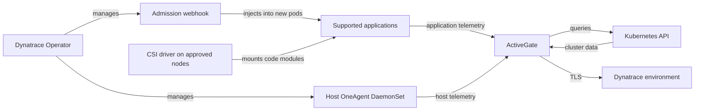
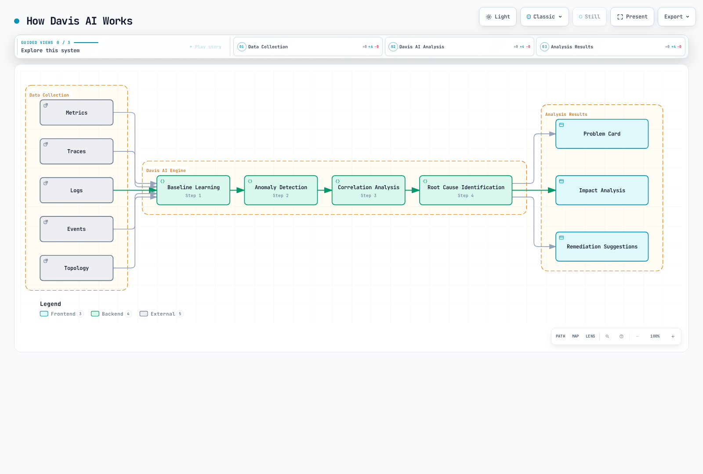

# Dynatrace

> **最后更新**: September 13, 2026

## 简介

Dynatrace 将应用程序和基础设施遥测数据与拓扑和问题分析相结合。OneAgent 自动插桩取决于受支持的运行时、部署模式和权限；仅安装 Operator 并不能提供每一种信号。PurePath 提供受支持的请求/代码上下文，而 Smartscape 映射观察到的依赖关系。两者都不承诺捕获每个请求、方法或依赖关系。

本指南使用 **Dynatrace Operator/chart 1.10.2**、**DynaKube v1beta6** 和 **EKS 1.35 Linux EC2-node 基线**。已检查 Helm 渲染、CRD schema 和本地示例；但未执行 EKS 安装、租户 API 调用、实时 OneAgent 插桩或生产容量测试。

## 主要功能

| 功能 | 提供的能力和要求 |
|---|---|
| **OneAgent** | 主机/进程和受支持应用程序的可见性；模式和主机权限很重要。 |
| **自动插桩** | 为受支持的运行时注入代码模块；现有 Pod 通常需要重新创建。 |
| **Davis AI / Dynatrace Intelligence** | 基于可用证据进行关联、异常和因果分析。 |
| **PurePath** | 分布式请求分析；采样和受支持的技术会影响覆盖范围。 |
| **Smartscape** | 从观察到的遥测数据推断的关系，而非完整的资产清单。 |
| **Full Stack** | 应用程序和基础设施功能；RUM、synthetic monitoring 和其他信号具有独立的设置/使用要求。 |

## 架构

云原生 full-stack 路径将**注入控制**与**遥测传输**分离。webhook 修改新的应用程序 Pod；CSI driver 提供代码模块；主机 OneAgent 收集节点/进程信号。ActiveGate 可以路由流量并查询 Kubernetes API。该图省略了可选的直接路径和其他接收组件。



<span id="使用-helm-部署到-eks"></span>

## 使用 Helm 部署 EKS

### 1. 安装 Dynatrace Operator

安装前，请比较[受支持的发行版](https://docs.dynatrace.com/docs/ingest-from/setup-on-k8s/deployment/supported-technologies)和[技术矩阵](https://docs.dynatrace.com/docs/ingest-from/technology-support/support-model-and-issues)。chart 的 `kubeVersion >=1.25` 约束并非完整的兼容性声明。

| 目标 | 审查时的范围 |
|---|---|
| 受支持 Linux EC2 节点上的 EKS 1.35 | 矩阵要求 OneAgent/ActiveGate **1.329+** 和 Operator **1.6+**，建议使用 Operator **1.9+**。本指南固定使用 1.10.2。 |
| Kubernetes 1.36 | OneAgent/ActiveGate 最低版本为 **1.335**；请单独检查平台和版本组合。 |
| Kubernetes 1.37 | 审查的 Dynatrace 矩阵中未列出；新的 Kubernetes 发行版并不代表已获得供应商支持。 |
| EKS Fargate | 使用[适用于 Fargate 的 EKS 工作流程](https://docs.dynatrace.com/docs/ingest-from/setup-on-k8s/deployment/marketplaces/eks-dto)进行**不使用 CSI**的应用程序监控；没有主机 OneAgent。 |
| Bottlerocket | 应用程序监控和 ActiveGate Kubernetes 监控；引用的发行版表中不支持 OneAgent 主机监控。 |
| EKS Auto Mode | 不要根据通用 EKS 条目推断完整的主机 agent 支持。请确认托管节点 OS、权限和供应商支持；此方案未在 Auto Mode 上验证。 |

主方案应使用已获批准且受支持的 EC2 节点。管理员必须将自定义节点标签 `monitoring.example.com/dynatrace-host=true` 应用于该节点池，并在带有 CSI driver 的节点上调度受监控的应用程序。该标签是放置约定，不是安全边界。请明确规划节点 taint/toleration；不要默认容忍每一种 taint。

安装 CRD、webhook 和集群 RBAC 需要经过授权的部署者。主机 OneAgent/CSI 权限不适用于普通的受限应用程序 namespace。请审查[Operator 安全权限](https://docs.dynatrace.com/docs/ingest-from/setup-on-k8s/reference/security)、admission 例外和受保护的 `dynatrace` namespace。不要仅为使安装成功而授予可选的集群范围 Secrets/ConfigMaps 读取者权限。

**现有安装：**请遵循[升级和已存储版本迁移说明](https://docs.dynatrace.com/docs/ingest-from/setup-on-k8s/guides/deployment-and-configuration/updates-and-maintenance/update-uninstall-operator)。如果集群存有 `v1beta1`/`v1beta2` DynaKube，文档路径会先经过 **Operator 1.7.3，再升级到 1.8+**。将 YAML 改为 `v1beta6` 不会迁移持久化对象。检查 CRD `status.storedVersions`；不要清除它或禁用迁移检查。下面的安装命令适用于**新发行版**，而不是从以前的 1.0 示例直接升级。

```bash
kubectl get nodes -l monitoring.example.com/dynatrace-host=true
kubectl get crd dynakubes.dynatrace.com \
  -o jsonpath='{.status.storedVersions}' --ignore-not-found
kubectl create namespace dynatrace
```

### 2. 创建 API Token

请根据租户的 Token 类型使用当前的[Token 和权限指南](https://docs.dynatrace.com/docs/ingest-from/setup-on-k8s/deployment/tokens-permissions)：

- **最新 Dynatrace platform token：**使用专用 service user，并配合有环境限制的、文档规定的 `Kubernetes Operator` 和 `Kubernetes Ingest` policy。Operator 权限涵盖所需的 `fleet-management` 和 `settings` 操作；接收使用相应的 `openpipeline`/`storage` 权限。用户权限和 Token scope 均适用。
- **Classic access token：**将 Operator 与接收凭证分开保管。当前指南记录了 installer/connection/ActiveGate-token 权限；从 Operator 1.7 起不再需要 `entities.read`，并且从 1.7 起 settings 权限为可选。不要复用旧的无限制权限清单。
- 仅接收已启用的信号。Classic OTLP scope 为 `openTelemetryTrace.ingest`、`metrics.ingest` 和 `logs.ingest`；部署事件和 settings 写入使用不同的权限。

Platform-token API 调用使用 `Bearer`；Classic access-token 调用使用 `Api-Token`。不要混用它们的 scope 名称或 header。轮换具有 scope 的凭证，并限制谁可以读取其文件和 Kubernetes Secret。

### 3. 创建 Secret

将两个生成的 Token 值放入受保护的本地文件中，**末尾不得有换行符**，文件名为 `apiToken` 和 `dataIngestToken`。Base64 是编码，不是加密。不要提交 Token YAML、将 Token 值放入命令参数，或打印 Pod environment。此操作创建新的 Secret；轮换现有 Secret 是独立的受控操作。

```bash
token_dir="$PWD/private-dynatrace-tokens"
chmod 700 "$token_dir"
chmod 600 "$token_dir/apiToken" "$token_dir/dataIngestToken"
kubectl create secret generic dynakube --namespace dynatrace \
  --from-file=apiToken="$token_dir/apiToken" \
  --from-file=dataIngestToken="$token_dir/dataIngestToken"
```

### 4. values.yaml 配置

这些是 chart **1.10.2** 的 values。保持 chart 兼容的默认 image 设置不变。如需调优，此版本使用 `operator.requests`/`operator.limits` 和 `webhook.requests`/`webhook.limits`，而不是嵌套的 `resources`。旧的 `operator.image.tag` 和 `operator.resources` 示例会被此 chart 忽略。OneAgent/ActiveGate 自定义配置应放在适当的 DynaKube 字段中，而非虚构的 chart key。

```yaml
# values-fullstack.yaml
installCRD: true
debugLogs: false
operator:
  nodeSelector:
    kubernetes.io/os: linux
    monitoring.example.com/dynatrace-host: 'true'
webhook:
  nodeSelector:
    kubernetes.io/os: linux
    monitoring.example.com/dynatrace-host: 'true'
csidriver:
  enabled: true
  nodeSelector:
    kubernetes.io/os: linux
    monitoring.example.com/dynatrace-host: 'true'
```

### 5. 安装 Operator

使用官方 OCI chart 和固定版本。该命令假设使用 **Helm 3**；Helm 4 使用 `--rollback-on-failure` 而非 `--atomic`。先审查渲染的 RBAC、CSI host mount 和 admission 权限。Helm rollback 不会撤销每一个 CRD 或外部影响。

```bash
helm template dynatrace-operator \
  oci://public.ecr.aws/dynatrace/dynatrace-operator \
  --version 1.10.2 --namespace dynatrace --kube-version 1.35.0 \
  --values values-fullstack.yaml > dynatrace-rendered.yaml

helm install dynatrace-operator \
  oci://public.ecr.aws/dynatrace/dynatrace-operator \
  --version 1.10.2 --namespace dynatrace \
  --values values-fullstack.yaml --atomic --timeout 10m
```

### 6. DynaKube CR 配置

对此 DynaKube 仅使用一种监控模式变体。将 `ENVIRONMENTID` 替换为已批准的环境 ID；API URL 使用 `.live.dynatrace.com/api`，而不是 Web 应用程序的 `.apps` origin。发布的 [v1beta6 full-stack 示例](https://github.com/Dynatrace/dynatrace-operator/blob/v1.10.2/assets/samples/dynakube/v1beta6/cloudNativeFullStack.yaml)也记录了 `dynatrace-api`；它是真实的 ActiveGate 功能。

```yaml
# dynakube-fullstack.yaml
apiVersion: dynatrace.com/v1beta6
kind: DynaKube
metadata:
  name: dynakube
  namespace: dynatrace
spec:
  apiUrl: https://ENVIRONMENTID.live.dynatrace.com/api
  tokens: dynakube
  metadataEnrichment:
    enabled: true
    namespaceSelector:
      matchLabels:
        monitoring.example.com/dynatrace: 'true'
  oneAgent:
    hostGroup: eks-production
    cloudNativeFullStack:
      namespaceSelector:
        matchLabels:
          monitoring.example.com/dynatrace: 'true'
      nodeSelector:
        kubernetes.io/os: linux
        monitoring.example.com/dynatrace-host: 'true'
  activeGate:
    capabilities:
    - routing
    - kubernetes-monitoring
    - dynatrace-api
    replicas: 2
    nodeSelector:
      kubernetes.io/os: linux
      monitoring.example.com/dynatrace-host: 'true'
```

创建专用示例应用程序 namespace，或通过其所属配置为现有 namespace 添加标签。注入 selector 适用于 **webhook mutation**，而不是所有 OneAgent 主机遥测数据或 ActiveGate 的集群 API 查询。仅设置 `replicas: 2` 既不能证明容量，也不能证明故障域冗余；请根据实际工作负载确定 ActiveGate 的大小和分布。

```yaml
# application-namespace.yaml
apiVersion: v1
kind: Namespace
metadata:
  name: observability-demo
  labels:
    monitoring.example.com/dynatrace: 'true'
```

### 7. 部署并验证

验证前提条件后，应用所选 CR 和 namespace。在推出应用程序之前检查 status。通过正常的 rollout 流程重新创建选定的应用程序 Pod；这些命令不会自动重启现有进程。

```bash
kubectl apply -f application-namespace.yaml
kubectl apply -f dynakube-fullstack.yaml
kubectl get dynakube dynakube -n dynatrace
kubectl get deploy,ds,sts,pods -n dynatrace
kubectl get dynakube dynakube -n dynatrace -o jsonpath='{.status.conditions}'
```

## Cloud Native Full Stack 模式

Cloud-native full stack 通过 webhook/CSI 路径结合主机监控和应用程序代码模块注入。它不是 application-only sidecar 模式，也不是通用的资源节省设置。`oneAgent.hostGroup` 设置 host group；其 host agent 的资源覆盖应位于 `cloudNativeFullStack.oneAgentResources` 下。请验证大小设置，而不是沿用任意限制。

**Classic Full Stack 在 1.10.2 中仍然可用。**以下完整替代方案使用基于主机的注入。不要将它应用在具有相同名称的 cloud-native CR 之外；请选择并规划受支持的模式转换。两种 full-stack 方法均需主机访问。

```yaml
# dynakube-classic.yaml
apiVersion: dynatrace.com/v1beta6
kind: DynaKube
metadata:
  name: dynakube
  namespace: dynatrace
spec:
  apiUrl: https://ENVIRONMENTID.live.dynatrace.com/api
  tokens: dynakube
  metadataEnrichment:
    enabled: true
    namespaceSelector:
      matchLabels:
        monitoring.example.com/dynatrace: 'true'
  oneAgent:
    hostGroup: eks-production
    classicFullStack:
      nodeSelector:
        kubernetes.io/os: linux
        monitoring.example.com/dynatrace-host: 'true'
  activeGate:
    capabilities:
    - routing
    - kubernetes-monitoring
    - dynatrace-api
    replicas: 2
    nodeSelector:
      kubernetes.io/os: linux
      monitoring.example.com/dynatrace-host: 'true'
```

## Application-Only Monitoring

`applicationMonitoring` 会省略主机 OneAgent。CSI 是**chart 级选项**，而不是 `applicationMonitoring.useCSIDriver`。对于不使用 CSI 的新 application-only 安装，请使用下面的 `values-app-only.yaml` **替代** full-stack values，再加上 application-only CR。不要在没有供应商迁移流程的情况下，在现有 full-stack 安装中禁用 CSI。

下方 node selector 仍然指向已批准的 EC2 池。EKS Fargate 部署需要引用工作流程中的匹配 Fargate profile 和放置配置；仅禁用 CSI 并不会使此 EC2 方案成为 Fargate 方案。不要在同一集群/环境中组合独立的 `hostMonitoring` 和 `applicationMonitoring` DynaKube；两者都需要时请使用 cloud-native full stack。

```yaml
# values-app-only.yaml
installCRD: true
debugLogs: false
operator:
  nodeSelector:
    kubernetes.io/os: linux
    monitoring.example.com/dynatrace-host: 'true'
webhook:
  nodeSelector:
    kubernetes.io/os: linux
    monitoring.example.com/dynatrace-host: 'true'
csidriver:
  enabled: false
  nodeSelector:
    kubernetes.io/os: linux
    monitoring.example.com/dynatrace-host: 'true'
```

```yaml
# dynakube-app-only.yaml
apiVersion: dynatrace.com/v1beta6
kind: DynaKube
metadata:
  name: dynakube
  namespace: dynatrace
spec:
  apiUrl: https://ENVIRONMENTID.live.dynatrace.com/api
  tokens: dynakube
  metadataEnrichment:
    enabled: true
    namespaceSelector:
      matchLabels:
        monitoring.example.com/dynatrace: 'true'
  oneAgent:
    applicationMonitoring:
      namespaceSelector:
        matchLabels:
          monitoring.example.com/dynatrace: 'true'
  activeGate:
    capabilities:
    - routing
    - kubernetes-monitoring
    - dynatrace-api
    replicas: 2
    nodeSelector:
      kubernetes.io/os: linux
      monitoring.example.com/dynatrace-host: 'true'
```

<span id="davis-ai-根本原因分析"></span>

## Davis AI 根因分析

### Davis AI 的工作原理

以下现有插图是对信号关联和问题输出的**概念性说明**，而非固定的处理算法或根因确定性的证明。Smartscape 和 PurePath 提供观察到的上下文；缺失的插桩可能隐藏依赖关系。当前的 [Dynatrace Intelligence](https://docs.dynatrace.com/docs/dynatrace-intelligence) 包含其他功能和处于 Preview 的已批准 agentic 操作。仅检测问题并不授权更改生产代码或基础设施。



[查看交互式图表](https://www.atomai.click/kubernetes-docs/archmaps/en-observability-tracing-04-dynatrace-1.html)

### 问题告警配置

以前的 `/api/config/v1/alertingProfiles` endpoint 已弃用。请通过 `POST /api/v2/settings/objects` 使用 [Settings schema `builtin:alerting.profile`](https://docs.dynatrace.com/docs/dynatrace-api/environment-api/settings/schemas/builtin-alerting-profile)。先通过 `?validateOnly=true` 验证；检查每个响应项目的 code，包括 multi-status 响应。验证仍需要 endpoint 的写入权限，并且不会创建通知目标。

将以下正文保存为 `alerting-profile.json`。这些 tag 是**必须已存在的 Dynatrace entity tag**，不是 Kubernetes label 的自动转换。当前 enum 是 `ERRORS`（复数）；`PERFORMANCE` 仍然有效。

```json
[
  {
    "schemaId": "builtin:alerting.profile",
    "scope": "environment",
    "value": {
      "name": "EKS Production Alerts",
      "severityRules": [
        {
          "severityLevel": "AVAILABILITY",
          "delayInMinutes": 0,
          "tagFilterIncludeMode": "INCLUDE_ANY",
          "tagFilter": [
            "cluster:eks-production"
          ]
        },
        {
          "severityLevel": "ERRORS",
          "delayInMinutes": 5,
          "tagFilterIncludeMode": "INCLUDE_ANY",
          "tagFilter": [
            "environment:production"
          ]
        },
        {
          "severityLevel": "PERFORMANCE",
          "delayInMinutes": 15,
          "tagFilterIncludeMode": "INCLUDE_ANY",
          "tagFilter": [
            "tier:critical"
          ]
        }
      ],
      "eventFilters": []
    }
  }
]
```

### 自定义部署事件

[Events v2 API](https://docs.dynatrace.com/docs/dynatrace-api/environment-api/events-v2/post-event) 接受 `CUSTOM_DEPLOYMENT`。请使用经验证的 service entity ID，以免未经检查的 service-name 字符串扩大 selector。以下 helper 需要 Python 3 和 `requests`；默认仅预览，只在使用 `--send` 时发送一次，不跟随重定向，并检查 **201 body 和每个 report status**，而不仅是 HTTP 成功。超时会使接收状态未知：重试前请先调查，因为此示例不提供幂等性保证。

SaaS origin allowlist 有意排除了 Managed/custom origin；请为这些部署调整并审查它。Classic 调用需要 `events.ingest`；platform 调用需要文档规定的 event-ingest scope，例如 `openpipeline:events.davis:ingest` 和 `--scheme Bearer`。使用仅含凭证的受保护 Token 文件。这是 HTTP client code，不是 Dynatrace SDK，并且 import 时不会执行调用。

```python
# deployment_event.py
"""Prepare one deployment annotation; send only when explicitly requested."""
from pathlib import Path
from urllib.parse import urlsplit
import argparse
import json
import re
import requests

def payload_for(entity_id, version):
    if not isinstance(entity_id, str) or not re.fullmatch(r"SERVICE-[0-9A-F]{16}", entity_id):
        raise ValueError("Use one verified SERVICE entity ID")
    if not isinstance(version, str) or not 1 <= len(version) <= 128:
        raise ValueError("Version must contain 1–128 characters")
    if any(ord(char) < 32 or ord(char) == 127 for char in version):
        raise ValueError("Version must not contain control characters")
    return {
        "eventType": "CUSTOM_DEPLOYMENT",
        "title": f"Deployment {version}",
        "entitySelector": f'type(SERVICE),entityId("{entity_id}")',
        "properties": {"release.version": version, "deployment.source": "ci"},
    }

def send_event(environment_url, token_file, entity_id, version, *, scheme="Api-Token", session=None):
    payload = payload_for(entity_id, version)
    parsed = urlsplit(environment_url)
    if (parsed.scheme != "https" or parsed.username or parsed.password
            or parsed.port not in (None, 443)
            or not re.fullmatch(r"[a-z0-9-]+\.live\.dynatrace\.com", parsed.hostname or "")
            or parsed.path not in ("", "/") or parsed.query or parsed.fragment):
        raise ValueError("Use the approved SaaS environment origin, without .apps or a path")
    if scheme not in ("Api-Token", "Bearer"):
        raise ValueError("Choose the authentication scheme required by the token family")
    token = Path(token_file).read_text(encoding="utf-8")
    if not token or token != token.strip() or any(ord(c) < 33 or ord(c) > 126 for c in token):
        raise ValueError("Token file must contain only the token, without whitespace")
    client = session if session is not None else requests.Session()
    try:
        response = client.post(
            f"https://{parsed.hostname}/api/v2/events/ingest",
            headers={"Authorization": f"{scheme} {token}", "Content-Type": "application/json"},
            json=payload, timeout=(5, 30), allow_redirects=False,
        )
        if response.status_code != 201:
            raise RuntimeError(f"Unexpected event API status: {response.status_code}")
        body = response.json()
        if not isinstance(body, dict):
            raise RuntimeError("Invalid event response")
        results = body.get("eventIngestResults")
        if (type(body.get("reportCount")) is not int or body["reportCount"] != 1
                or not isinstance(results, list) or len(results) != 1
                or not isinstance(results[0], dict) or results[0].get("status") != "OK"
                or not isinstance(results[0].get("correlationId"), str)
                or not results[0]["correlationId"]):
            raise RuntimeError("The response did not confirm one successful event report")
        return results[0]["correlationId"]
    finally:
        if session is None:
            client.close()

if __name__ == "__main__":
    parser = argparse.ArgumentParser()
    parser.add_argument("--entity-id", required=True)
    parser.add_argument("--version", required=True)
    parser.add_argument("--send", action="store_true")
    parser.add_argument("--environment-url")
    parser.add_argument("--token-file")
    parser.add_argument("--scheme", choices=["Api-Token", "Bearer"], default="Api-Token")
    args = parser.parse_args()
    if not args.send:
        print(json.dumps(payload_for(args.entity_id, args.version), indent=2))
    else:
        if not args.environment_url or not args.token_file:
            parser.error("--send requires --environment-url and --token-file")
        print("Event report:", send_event(args.environment_url, args.token_file,
              args.entity_id, args.version, scheme=args.scheme))
```

```bash
python3 deployment_event.py --entity-id SERVICE-0123456789ABCDEF --version 2.3.0
```

上方 ID 仅用于说明：在任何发送操作前，请将其替换为环境中经过验证的 entity。要发送，请显式添加 `--send --environment-url https://ENVIRONMENTID.live.dynatrace.com --token-file /protected/path/events-token` 和正确的 scheme。不要将 Operator 凭证复用于这项独立的 CI 职责。

## 自动插桩

<span id="支持的技术"></span>

### 受支持的技术

OneAgent 支持多个技术系列。请在[支持矩阵](https://docs.dynatrace.com/docs/ingest-from/technology-support/support-model-and-issues)中检查确切的运行时/framework 版本、架构和部署模式，而不要将以下示例视为与版本无关的承诺。

| 系列 | 要根据矩阵检查的示例 |
|---|---|
| Java | JVM 以及 Spring/Spring Boot、Micronaut、Quarkus 或 Jakarta EE 版本 |
| Node.js | Node runtime 和 HTTP/framework 插桩，包括 Express 系列应用程序 |
| Python | Runtime 和 Django/Flask/FastAPI 插桩路径 |
| .NET | .NET runtime、ASP.NET Core 与 Windows/.NET Framework 部署的差异 |
| Go | Go 版本、编译/build flag 和受支持的 HTTP framework 插桩 |
| PHP | PHP runtime 和 Laravel/Symfony framework 版本 |

### 验证自动插桩

检查 container 名称、image 和 readiness，而不导出 environment 值或凭证。然后通过受支持的应用程序发送经过授权的测试请求，并验证预期租户中的 service/trace 可见性。仅 Pod readiness 并不能证明 trace 已送达。审查[注入 selector 和 opt-out](https://docs.dynatrace.com/docs/ingest-from/setup-on-k8s/guides/deployment-and-configuration/monitoring-and-instrumentation/annotate)：`dynatrace.com/inject: "false"` 会 opt out，而将其设为 `"true"` 并不会覆盖所有选择规则。

```bash
kubectl get pods -n observability-demo \
  -o custom-columns='NAME:.metadata.name,INIT:.spec.initContainers[*].name,IMAGES:.spec.containers[*].image,READY:.status.containerStatuses[*].ready'
```

### 自定义 Service 定义

[custom Java service API](https://docs.dynatrace.com/docs/dynatrace-api/configuration-api/service-api/custom-services-api/post-rule) 仍支持 `POST /api/config/v1/service/customServices/java`。以下显式 method signature 是有效的**配置形态**，而非样例应用程序包含该 method 的证明。使用 `/api/config/v1/service/customServices/java/validator` 验证正文（成功时为 204），然后仅在检查 class、return type、argument 和 OneAgent 支持后创建。Classic 授权使用 `WriteConfig`；platform 授权遵循 endpoint 的 `settings:objects:write` 要求。

```json
{
  "name": "Payment Gateway",
  "enabled": true,
  "rules": [
    {
      "enabled": true,
      "className": "com.example.payment.PaymentGateway",
      "methodRules": [
        {
          "methodName": "processPayment",
          "returnType": "com.example.payment.PaymentResult",
          "argumentTypes": []
        }
      ]
    }
  ],
  "queueEntryPoint": false
}
```

## Kubernetes 监控集成

### 集群指标

ActiveGate 的 `kubernetes-monitoring` 功能查询 Kubernetes API 以获取集群/workload 状态。其 scope 与应用程序注入独立。对于仅 ActiveGate 的安装，以下完整替代方案包含必需的环境 URL。不要无意中将其叠加到前面同名的 DynaKube 上。

```yaml
# dynakube-platform.yaml
apiVersion: dynatrace.com/v1beta6
kind: DynaKube
metadata:
  name: dynakube
  namespace: dynatrace
spec:
  apiUrl: https://ENVIRONMENTID.live.dynatrace.com/api
  tokens: dynakube
  metadataEnrichment:
    enabled: false
  activeGate:
    capabilities:
    - routing
    - kubernetes-monitoring
    - dynatrace-api
    replicas: 2
    nodeSelector:
      kubernetes.io/os: linux
      monitoring.example.com/dynatrace-host: 'true'
```

通过当前 platform settings 和记录的 capability 选项配置 workload/event/Prometheus 监控。以前任意的 `[kubernetes_monitoring] monitor_*` 和 `kubernetes_namespace_filter` property 并非此配置的已验证替代方案。在授予更多权限前，请审查实际 RBAC 和所选 collection feature。

### Prometheus 指标收集

对于记录的 [ActiveGate Prometheus 集成](https://docs.dynatrace.com/docs/observe/infrastructure-observability/container-platform-monitoring/kubernetes-monitoring/monitor-prometheus-metrics)，请在集群 settings 中启用 workload monitoring 和带 annotation 的 exporter，并允许预期的网络路径。annotation 必须位于 **Pod template** 上。将下方占位 image 替换为实际在端口 8080 的 `/metrics` 上提供 Prometheus text 的自有应用程序；这是完整的 Deployment 形态，不是提供的可运行应用程序。

```yaml
# prometheus-application.yaml
apiVersion: apps/v1
kind: Deployment
metadata:
  name: metrics-demo
  namespace: observability-demo
spec:
  replicas: 1
  selector:
    matchLabels:
      app: metrics-demo
  template:
    metadata:
      labels:
        app: metrics-demo
      annotations:
        metrics.dynatrace.com/scrape: 'true'
        metrics.dynatrace.com/port: '8080'
        metrics.dynatrace.com/path: /metrics
    spec:
      automountServiceAccountToken: false
      containers:
      - name: app
        image: registry.example.com/app:metrics-demo
        ports:
        - name: metrics
          containerPort: 8080
      nodeSelector:
        kubernetes.io/os: linux
        monitoring.example.com/dynatrace-host: 'true'
```

此集成独立于 DynaKube 的注入 selector，跨 namespace 发现带 annotation 的 Pod。引用的 ActiveGate module 记录的限制为：1,000 个 exporter Pod、每个 Pod 1,000 个 metric 以及每个 Pod 500,000 个 data point。它支持 counter、gauge、histogram 和 summary，并不支持每个 OpenMetrics feature 或 exemplar。对于更大的部署，请评估已记录的 Collector/Target Allocator 替代方案及其独立权限。

## 成本结构

<span id="许可模型"></span>

### 许可模式

区分现代 **Dynatrace Platform Subscription (DPS)** 用量和仍使用 **Classic licensing** 的合同。请查阅您的 rate card 和[当前 capability unit](https://www.dynatrace.com/pricing/)；这里不假定固定美元价格或保证节省。

| DPS capability | 示例用量单位 |
|---|---|
| Full-Stack Monitoring | Memory GiB-hours，具有特定模式规则 |
| Infrastructure Monitoring | Host-hours |
| Kubernetes Platform Monitoring | Pod-hours，受文档规定的 Full-Stack 包含规则约束 |
| Code Monitoring | Container-hours |
| Logs | 在所选计划下的 Ingested GiB、retained GiB-days 和 query consumption |
| Digital experience | RUM session；synthetic action/request 是独立单位 |
| Application security | 特定功能的 memory GiB-hours 或 host-hours |

Full-stack 并不承诺无限制的 log ingest、retention、query、RUM 或 synthetic test。年度承诺、rate card 和超额使用量会影响实际账单。

### 成本优化策略

- 有意选择所需的 application injection 和 signal collection。Namespace injection selector 不会限制 host 或 cluster monitoring 用量。
- 根据遥测数据量调整 agent resource；agent container 的 memory limit 不是受监控 host RAM 的计费限制。
- 使用当前 capability setting 和隐私要求控制 log volume、retention、query pattern 和可选 session replay。
- 对于 application-only 模式，请考虑其独立的 memory measurement/minimum 规则以及不包含主机基础设施监控这一事实。

<span id="host-unit-计算"></span>

### 主机单位计算

旧的 `max(memory/16, vCPU/1.5)` 公式不正确。[Classic Full-Stack host unit](https://docs.dynatrace.com/docs/license/classic-licensing/application-and-infrastructure-monitoring)使用 RAM tier。请将以下内容保留为 **Classic 示例**，而不是当前 DPS 价格模式：

| 主机示例 | Classic Full-Stack 权重 | 一个完整对齐小时的 DPS host Full-Stack 使用量 |
|---|---:|---:|
| 4 vCPU, 16 GiB RAM | 1 HU | 16 memory GiB-hours |
| 8 vCPU, 32 GiB RAM | 2 HU | 32 memory GiB-hours |
| 2 vCPU, 8 GiB RAM | 0.5 HU | 8 memory GiB-hours |

对于 DPS physical/virtual host，[Full-Stack 规则](https://docs.dynatrace.com/docs/license/capabilities/app-infra-observability/full-stack-monitoring)将内存向上取整到四分之一 GiB，最低为 4 GiB，并对涵盖的 **15-minute calendar interval** 计费。对于固定内存，用量为 `max(4, ceil(memoryGiB × 4) / 4) × coveredIntervals × 0.25`。请计算 calendar interval，而非仅对总运行时间向上取整：跨越一个边界可能涵盖两个 interval。Application-only/container 计算具有不同的最小值和测量/版本规则；不要将此 host 公式应用于它们。

## OpenTelemetry 集成

Dynatrace 的[native OTLP endpoint](https://docs.dynatrace.com/docs/ingest-from/opentelemetry/otlp-api)接受带二进制 Protobuf 的 **HTTP**，而非原生 gRPC 或 JSON。Collector 可以接受本地 gRPC 并导出 HTTP。以下完整配置已使用 Contrib **0.160.0** 解析；对于生产环境，Dynatrace 建议使用其自身受支持的 Collector distribution 和 component/version matrix。

[当前配置指南](https://docs.dynatrace.com/docs/ingest-from/opentelemetry/collector/configuration)要求 delta metric temporality。`cumulative_to_delta` 在内存中跟踪 cumulative stream；请将每个 stream 路由到同一 conversion instance。其第一次 observation 会建立 baseline，而重启或 stream eviction 会影响转换。25-hour staleness 设置假定报告 interval 短于该时长，并非 cardinality budget。

receiver 仅绑定到 loopback，适合本地 app 或 same-pod sidecar。multi-pod gateway 需要明确的已认证/TLS receiver access 和网络控制。替换环境 ID，然后挂载包含完整 map 的受保护 `headers.yaml`，例如 `Authorization: "Api-Token REPLACE_WITH_INGEST_TOKEN"`。不要将真实 Token 放在本文档、environment variable 或 ConfigMap 中。此示例使用上文所述的 Classic 三信号 ingest scope。

```yaml
# otel-collector.yaml
receivers:
  otlp:
    protocols:
      grpc:
        endpoint: 127.0.0.1:4317
      http:
        endpoint: 127.0.0.1:4318
processors:
  memory_limiter:
    check_interval: 1s
    limit_mib: 256
    spike_limit_mib: 64
  cumulative_to_delta:
    max_staleness: 25h
  batch:
    timeout: 5s
exporters:
  otlp_http/dynatrace:
    endpoint: https://ENVIRONMENTID.live.dynatrace.com/api/v2/otlp
    headers: ${file:/var/run/secrets/dynatrace/headers.yaml}
service:
  pipelines:
    traces:
      receivers: [otlp]
      processors: [memory_limiter, batch]
      exporters: [otlp_http/dynatrace]
    metrics:
      receivers: [otlp]
      processors: [memory_limiter, cumulative_to_delta, batch]
      exporters: [otlp_http/dynatrace]
    logs:
      receivers: [otlp]
      processors: [memory_limiter, batch]
      exporters: [otlp_http/dynatrace]
```

```bash
otelcol-contrib validate --config=otel-collector.yaml
```

请在启动前使用**已安装 distribution 的 binary**进行验证。file provider 使用完整的 headers map；它不会通过 `:key` suffix 选择 subkey。默认 TLS verification 保持启用。exporter 会追加 `/v1/traces`、`/v1/metrics` 和 `/v1/logs`；不要在其 base endpoint 中重复这些 suffix。

ActiveGate ingest endpoint 具有不同的 port/path 和 capability/storage 要求；仅启用 `routing` 不会创建每个 OTLP ingest pipeline。Collector 验证或本地 HTTP test 并不能证明租户接收、quota 或端到端交付。授权部署后，请检查 partial-success response 和服务端可见性。

## 故障排除

### 常见问题

| 症状 | 检查项 |
|---|---|
| CR 被拒绝 | 提供的 API version 和当前 CRD field；根 `namespaceSelector`/`hostGroup` 以及 `applicationMonitoring.useCSIDriver` 不是有效替代项。 |
| Operator/CSI/ActiveGate Pending | 已批准的 node label、taint、resource、admission restriction 和 CSI 可用性。 |
| 缺少注入的模块 | Namespace selector、opt-out annotation、受支持 runtime，以及重新创建 application Pod。 |
| 认证失败 | Token 类型、文件空白、过期、scope 和环境限制。绝不要为诊断而打印 Token 值。 |
| 缺少主机遥测数据 | 受支持的 OS 和模式、主机权限和 OneAgent status；application-only 不会创建主机监控。 |
| 缺少 OTLP metric | HTTP/protobuf endpoint、delta conversion、stream routing 和 response detail。 |
| 无外部连接 | DNS、已批准的 egress/proxy 和可信 certificate chain。proxy 不是真正断开连接的 SaaS 部署。 |

ActiveGate 可以缓冲遥测数据，并且某些 ingest 配置需要 persistent storage，但它不是长期 Grail lakehouse。请检查当前 Pod/workload status，而不要调用 container 中未记录的 Java CLI path。

<span id="日志收集验证"></span>

### Log 收集验证

先列出 Pod 和 container 名称，然后从明确选择的 component 获取有界 log。在共享前请审查并遮蔽诊断 log 和 support archive：它们可能包含敏感的应用程序或配置数据。agent readiness 和 log 输出本身并不能验证租户中的 log ingest。

```bash
kubectl get pods -n dynatrace \
  -o custom-columns='POD:.metadata.name,CONTAINERS:.spec.containers[*].name,READY:.status.containerStatuses[*].ready'
# Replace with names from the preceding output.
dynatrace_pod='REPLACE_WITH_POD_NAME'
dynatrace_container='REPLACE_WITH_CONTAINER_NAME'
kubectl logs -n dynatrace "$dynatrace_pod" -c "$dynatrace_container" \
  --tail=100 --since=10m
```

## 测验

通过 [Dynatrace 测验](../../quizzes/observability/tracing/04-dynatrace-quiz.md)测试您的知识。
