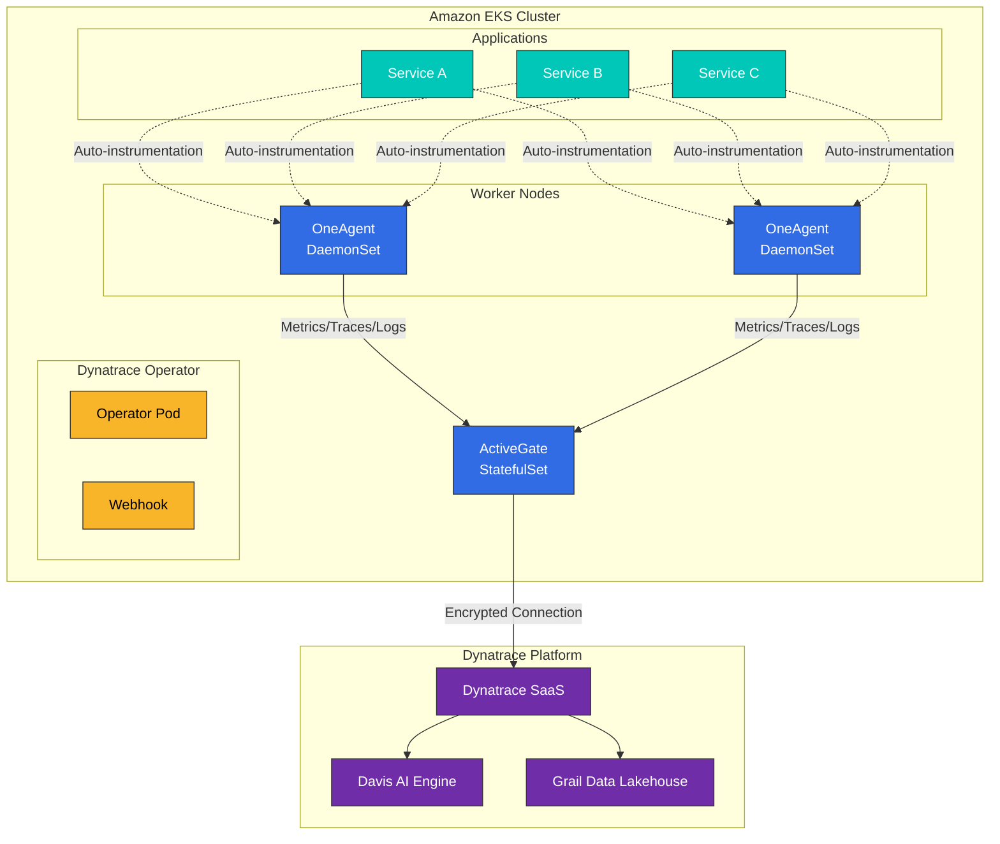
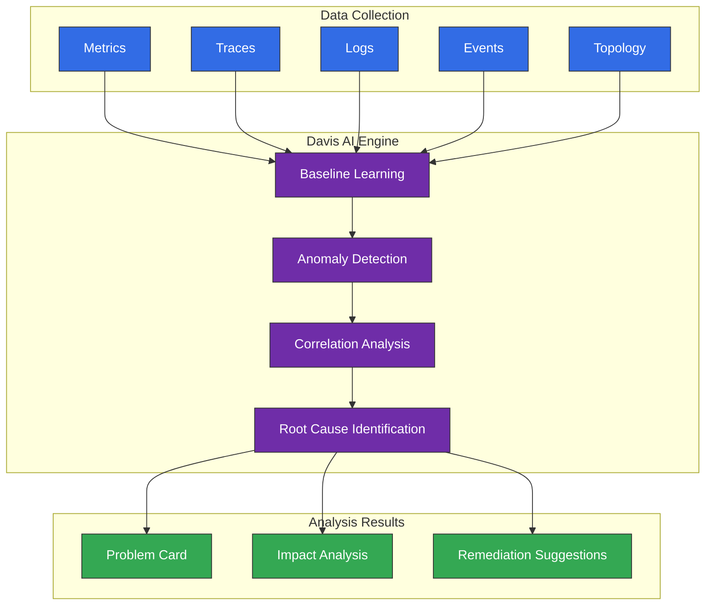

# Dynatrace

> **最后更新**: February 20, 2026

## 简介

Dynatrace 是一个由 AI 驱动的全栈可观测性平台。通过 OneAgent 技术，它可自动监控应用程序、基础设施和用户体验，同时 Davis AI 引擎会自动分析问题的根本原因。

## 主要功能

| 功能 | 描述 |
|---------|-------------|
| **OneAgent** | 使用单个 Agent 进行全栈监控 |
| **Auto-instrumentation** | 无需修改代码即可自动追踪 |
| **Davis AI** | AI 驱动的根本原因分析 |
| **PurePath** | 分布式追踪技术 |
| **Smartscape** | 实时拓扑映射 |
| **Full Stack** | 从基础设施到用户体验 |

## 架构



## 使用 Helm 部署到 EKS

### 1. 安装 Dynatrace Operator

```bash
# Add Helm repository
helm repo add dynatrace https://raw.githubusercontent.com/Dynatrace/dynatrace-operator/main/config/helm/repos/stable
helm repo update

# Create namespace
kubectl create namespace dynatrace
```

### 2. 创建 API Token

在 Dynatrace 控制台中创建具有以下权限的 API Token：

- `Access problem and event feed, metrics, and topology`
- `Read configuration`
- `Write configuration`
- `PaaS integration - Installer download`
- `PaaS integration - Support alert`
- `Read entities`
- `Write entities`
- `Read settings`
- `Write settings`
- `Ingest logs`
- `Ingest metrics`
- `Ingest OpenTelemetry traces`

### 3. 创建 Secret

```yaml
# dynatrace-secret.yaml
apiVersion: v1
kind: Secret
metadata:
  name: dynakube
  namespace: dynatrace
type: Opaque
data:
  # Base64 encoded values
  apiToken: <BASE64_ENCODED_API_TOKEN>
  dataIngestToken: <BASE64_ENCODED_DATA_INGEST_TOKEN>
```

```bash
# Or create via CLI
kubectl create secret generic dynakube \
  --namespace dynatrace \
  --from-literal=apiToken=<API_TOKEN> \
  --from-literal=dataIngestToken=<DATA_INGEST_TOKEN>
```

### 4. values.yaml 配置

```yaml
# dynatrace-values.yaml
platform: "kubernetes"

operator:
  image:
    repository: docker.io/dynatrace/dynatrace-operator
    tag: v1.0.0
  resources:
    requests:
      cpu: 50m
      memory: 64Mi
    limits:
      cpu: 100m
      memory: 256Mi

webhook:
  resources:
    requests:
      cpu: 50m
      memory: 64Mi
    limits:
      cpu: 100m
      memory: 256Mi

csidriver:
  enabled: true
```

### 5. 安装 Operator

```bash
helm upgrade --install dynatrace-operator dynatrace/dynatrace-operator \
  --namespace dynatrace \
  --values dynatrace-values.yaml \
  --wait
```

### 6. DynaKube CR 配置

```yaml
# dynakube.yaml
apiVersion: dynatrace.com/v1beta2
kind: DynaKube
metadata:
  name: dynakube
  namespace: dynatrace
spec:
  # Dynatrace environment URL
  apiUrl: https://<ENVIRONMENT_ID>.live.dynatrace.com/api

  # OneAgent deployment mode
  oneAgent:
    # Classic Full Stack (DaemonSet)
    classicFullStack:
      tolerations:
        - effect: NoSchedule
          operator: Exists
      args:
        - --set-host-group=eks-production
      env:
        - name: ONEAGENT_ENABLE_VOLUME_STORAGE
          value: "true"
      resources:
        requests:
          cpu: 100m
          memory: 512Mi
        limits:
          cpu: 500m
          memory: 1.5Gi
      # Node selector
      nodeSelector:
        kubernetes.io/os: linux

  # ActiveGate configuration
  activeGate:
    capabilities:
      - routing
      - kubernetes-monitoring
      - dynatrace-api
    resources:
      requests:
        cpu: 500m
        memory: 512Mi
      limits:
        cpu: 1000m
        memory: 1.5Gi
    # Replica count
    replicas: 2
    # Kubernetes API monitoring
    group: eks-production
    # Custom properties
    customProperties:
      value: |
        [kubernetes_monitoring]
        kubernetes_cluster_name=eks-production

  # Metadata enrichment
  metadataEnrichment:
    enabled: true

  # Namespace selector (namespaces to monitor)
  namespaceSelector:
    matchLabels:
      dynatrace: enabled
---
# Add label to namespaces to monitor
apiVersion: v1
kind: Namespace
metadata:
  name: production
  labels:
    dynatrace: enabled
```

### 7. 部署并验证

```bash
# Deploy DynaKube
kubectl apply -f dynakube.yaml

# Check status
kubectl get dynakube -n dynatrace
kubectl get pods -n dynatrace

# Check OneAgent status
kubectl logs -n dynatrace -l app.kubernetes.io/name=oneagent --tail=100

# Check ActiveGate status
kubectl logs -n dynatrace -l app.kubernetes.io/name=activegate --tail=100
```

## Cloud Native Full Stack 模式

通过代码模块注入进行轻量级监控：

```yaml
# dynakube-cloudnative.yaml
apiVersion: dynatrace.com/v1beta2
kind: DynaKube
metadata:
  name: dynakube
  namespace: dynatrace
spec:
  apiUrl: https://<ENVIRONMENT_ID>.live.dynatrace.com/api

  oneAgent:
    # Cloud Native Full Stack (Sidecar approach)
    cloudNativeFullStack:
      # Code modules image
      codeModulesImage: docker.io/dynatrace/dynatrace-codemodules

      # Namespace selector
      namespaceSelector:
        matchLabels:
          dynatrace-injection: enabled

      # Resource limits
      initResources:
        requests:
          cpu: 30m
          memory: 30Mi
        limits:
          cpu: 300m
          memory: 300Mi

      # Node selector
      nodeSelector:
        kubernetes.io/os: linux

      # Tolerations
      tolerations:
        - effect: NoSchedule
          operator: Exists

  # Host monitoring separate configuration
  hostGroup: eks-prod-cloudnative

  activeGate:
    capabilities:
      - routing
      - kubernetes-monitoring
```

## Davis AI 根本原因分析

### Davis AI 的工作原理



### 问题告警配置

```yaml
# Dynatrace alerting profile (via API)
# POST /api/config/v1/alertingProfiles
{
  "displayName": "EKS Production Alerts",
  "rules": [
    {
      "severityLevel": "AVAILABILITY",
      "tagFilter": {
        "includeMode": "INCLUDE_ANY",
        "tagFilters": [
          {
            "context": "KUBERNETES_CLUSTER",
            "key": "eks-production"
          }
        ]
      },
      "delayInMinutes": 0
    },
    {
      "severityLevel": "ERROR",
      "tagFilter": {
        "includeMode": "INCLUDE_ANY",
        "tagFilters": [
          {
            "context": "CONTEXTLESS",
            "key": "environment",
            "value": "production"
          }
        ]
      },
      "delayInMinutes": 5
    }
  ],
  "eventTypeFilters": []
}
```

## 自动插桩

### 支持的技术

| 语言/平台 | 支持的框架 |
|-------------------|---------------------|
| **Java** | Spring, Spring Boot, Micronaut, Quarkus, Jakarta EE |
| **Node.js** | Express, Fastify, NestJS, Koa |
| **Python** | Django, Flask, FastAPI |
| **.NET** | ASP.NET Core, .NET Framework |
| **Go** | net/http, Gin, Echo, Fiber |
| **PHP** | Laravel, Symfony |

### 验证自动插桩

```bash
# Check Pod environment variables
kubectl exec -it <pod-name> -- env | grep -i dynatrace

# Expected output:
# LD_PRELOAD=/opt/dynatrace/oneagent/agent/lib64/liboneagentproc.so
# DT_TENANT=abc12345
# DT_TENANTTOKEN=xxxxx
# DT_CONNECTION_POINT=https://abc12345.live.dynatrace.com/communication

# Check OneAgent logs
kubectl exec -it <pod-name> -- cat /var/log/dynatrace/oneagent/oneagent.log
```

## 成本结构

### 许可模型

| 类型 | 单位 | 包含内容 |
|------|------|----------|
| **Full-Stack** | Host Unit | 基础设施 + APM + 日志 |
| **Infrastructure** | Host Unit | 仅基础设施监控 |
| **Application Security** | Host Unit | RASP + 漏洞分析 |
| **DEM (Digital Experience)** | Session | RUM + Synthetic |
| **Log Monitoring** | GiB | 日志收集和分析 |

### 成本优化策略

```yaml
# 1. Selective namespace monitoring
spec:
  oneAgent:
    cloudNativeFullStack:
      namespaceSelector:
        matchLabels:
          dynatrace-injection: enabled  # Only necessary namespaces

# 2. Resource limits
      resources:
        limits:
          cpu: 500m
          memory: 1Gi

# 3. Data retention adjustment (Dynatrace console)
# Settings > Monitoring > Data privacy > Data retention

# 4. Disable session replay if needed
# Applications > [App] > Session Replay > Disable
```

### Host Unit 计算

```
Host Units = max(memory_GB / 16, vCPU / 1.5)

Examples:
- 4 vCPU, 16GB RAM = max(1, 2.67) = 2.67 Host Units
- 8 vCPU, 32GB RAM = max(2, 5.33) = 5.33 Host Units
- 2 vCPU, 8GB RAM  = max(0.5, 1.33) = 1.33 Host Units
```

## OpenTelemetry 集成

Dynatrace 可原生收集 OpenTelemetry 数据：

```yaml
# Send from OTEL Collector to Dynatrace
exporters:
  otlphttp/dynatrace:
    endpoint: https://<ENVIRONMENT_ID>.live.dynatrace.com/api/v2/otlp
    headers:
      Authorization: "Api-Token <DYNATRACE_API_TOKEN>"

service:
  pipelines:
    traces:
      exporters: [otlphttp/dynatrace]
    metrics:
      exporters: [otlphttp/dynatrace]
    logs:
      exporters: [otlphttp/dynatrace]
```

## 故障排除

### 常见问题

```bash
# 1. OneAgent connection issues
kubectl logs -n dynatrace -l app.kubernetes.io/name=oneagent | grep -i error

# 2. ActiveGate status check
kubectl exec -n dynatrace -it $(kubectl get pod -n dynatrace -l app.kubernetes.io/name=activegate -o jsonpath='{.items[0].metadata.name}') -- \
  /opt/dynatrace/gateway/jre/bin/java -jar /opt/dynatrace/gateway/lib/cli.jar status

# 3. Code module injection verification
kubectl describe pod <pod-name> | grep -A5 "Init Containers"

# 4. Network connectivity test
kubectl exec -n dynatrace -it <oneagent-pod> -- \
  curl -v https://<ENVIRONMENT_ID>.live.dynatrace.com/api/v1/deployment/installer/agent/connectioninfo

# 5. Token permission verification
curl -X GET "https://<ENVIRONMENT_ID>.live.dynatrace.com/api/v2/apiTokens/<TOKEN_ID>" \
  -H "Authorization: Api-Token <API_TOKEN>"
```

### 日志收集验证

```bash
# ActiveGate logs
kubectl logs -n dynatrace -l app.kubernetes.io/name=activegate --tail=200

# OneAgent logs
kubectl exec -n dynatrace -it <oneagent-pod> -- \
  tail -100 /var/log/dynatrace/oneagent/oneagent.log

# Operator logs
kubectl logs -n dynatrace -l app.kubernetes.io/name=dynatrace-operator --tail=100
```

## 测验

通过 [Dynatrace 测验](../../quizzes/observability/tracing/04-dynatrace-quiz.md) 测试你的知识。
