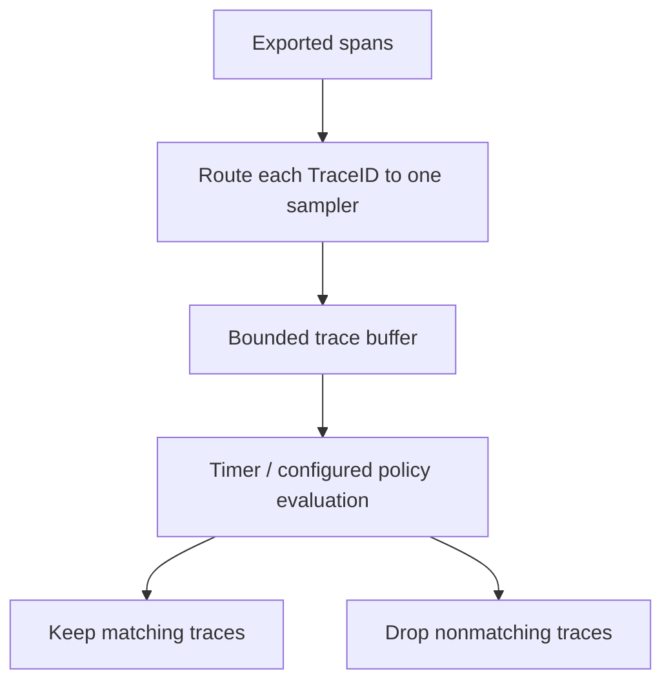

# 分布式追踪概述

> **最后更新**: September 13, 2026

## 简介

分布式追踪会记录跨进程边界的已插桩操作，并通过传播的上下文将其关联起来。已存储的 trace 是**观测到的 Span 集合**，并非已捕获每项操作或请求的证明。插桩、采样、导出、存储和保留策略决定了哪些内容可见。

## 为什么需要分布式追踪

### 传统监控的局限性

没有共享上下文的日志和指标可能使请求路径和时序难以重建。Trace 通过表示因果关系来补充这些信号：

- 哪些已插桩 Service 参与了？
- 哪项操作较慢或失败了？
- 哪些工作发生了重叠、等待或重试？
- 哪些额外日志和资源指标支持该诊断？


[查看交互式图表](https://www.atomai.click/kubernetes-docs/archmaps/en-observability-tracing-readme-0.html)

该图说明了关联为何有帮助。它并不表示适当关联的日志永远无法回答这些问题，也不表示仅凭一个 trace 就能证明根本原因。

## 核心概念

### 1. Trace

一个 trace 将共享 TraceID 的 Span 分组。父子关系描述与该 trace 具有因果关联的工作。缺少插桩或数据丢失可能留下缺口。

请考虑以下**说明性时间线**，单位为相对于根起始时间的毫秒：

| Span | 开始 | 结束 | 时长 |
|---|---:|---:|---:|
| API gateway 根 | 0 | 650 | 650 |
| User service | 20 | 70 | 50 |
| Order service | 100 | 600 | 500 |
| Payment service，Order 的子级 | 250 | 550 | 300 |
| Notification service，Order 的子级 | 500 | 600 | 100 |

观测窗口为 650ms。所有 Span 时长相加为 1,600ms，因为父级时长包含子级工作，且部分子级存在重叠。请勿将包含式父级时长与其后代相加来计算“关键路径”。应分析实际开始/结束时间和依赖关系，包括异步工作和时钟偏差。

### 2. Span

一个 Span 描述一项已插桩操作：

| 字段 | 含义 | 示例 |
|---|---|---|
| TraceID | Trace 的标识符 | `4bf92f3577b34da6a3ce929d0e0e4736` |
| SpanID | 此 Span 的标识符 | `00f067aa0ba902b7` |
| ParentSpanID | 父级 Span 标识符；根 Span 中不存在 | `b7ad6b7169203331` |
| 名称 | 低基数操作名称 | `GET /api/users/{id}` |
| 开始 / 结束 | 时间戳；时长由两者的差值确定 | `2025-02-15T10:30:00Z` 是说明性时间戳 |
| 属性 | 带类型的元数据 | `http.response.status_code=200` |
| 事件 | 与 Span 关联的带时间戳事件 | 已记录的异常事件 |
| 状态 | `UNSET`、`OK` 或 `ERROR` | 对于成功的 HTTP 请求，除非插桩另有规定，否则保持 Span 状态为 UNSET |

OpenTelemetry 使用**属性**和**事件**，而不是将 Span 事件视为所有应用程序日志的副本。初始属性/链接可能在创建 Span 时出现；之后还可以添加更多事件/属性/状态更新。Span 开始时尚不知晓其时长。记录异常和设置错误状态是不同的 API 操作。

### 3. Span 关系和层级结构


[查看交互式图表](https://www.atomai.click/kubernetes-docs/archmaps/en-observability-tracing-readme-3.html)

图中的 `span001`–`span005` 是**符号标签**，不是有效线格式的 SpanID。一个 Span 最多只能有一个父级。**链接**可以关联同一个或不同 trace 中的 Span，这对异步消息传递、批处理和具有多个因果输入的工作很有用；这些链接未在这个简单树中展示。

### 4. SpanContext

SpanContext 是不可变的 trace 身份/传播信息。此 YAML 是概念性表示，而不是 SDK 配置文件：

```yaml
SpanContext:
  trace_id: "4bf92f3577b34da6a3ce929d0e0e4736"
  span_id: "00f067aa0ba902b7"
  trace_flags: "01"
  trace_state: "vendor=value"
  is_remote: false
```

OpenTelemetry TraceID 为 16 字节，显示为 32 个小写十六进制字符；SpanID 为 8 字节，显示为 16 个。有效的 SpanContext 具有非零 ID。`is_remote` 用于区分提取的远程父级和本地创建的 Span。`01` 设置已采样位；该标记并不能证明后端已存储该 trace。

Baggage 与 SpanContext 和 `tracestate` 相互独立。请勿将凭据或个人信息放入传播的上下文，也不要将调用方提供的 trace ID 视为身份验证。

## 上下文传播

传播在边界间传递身份；它本身不会为操作插桩或导出 Span。使用框架/SDK propagator 注入和提取标头，并正确附加/分离活动上下文。

### W3C Trace Context（推荐）

```http
traceparent: 00-4bf92f3577b34da6a3ce929d0e0e4736-00f067aa0ba902b7-01
tracestate: vendor=value
```

对于版本 `00`，字段如下：

```text
version(2 hex)-trace_id(32 hex)-parent_id(16 hex)-trace_flags(2 hex)
```

在线传输的 `parent_id` 是**发送 Span 的 SpanID**，接收方创建其子级时将其用作远程父级。它不是发送方自身的 ParentSpanID。无效长度、非十六进制 ID 和全零 ID 不得复制到示例中；应使用实现的验证规则，而不是从任意字符串构造标头。

### B3 传播（与 Zipkin 兼容）

B3 允许 64 位或 128 位 TraceID，以及 64 位 SpanID。以下两个示例携带相同的已采样上下文：

```http
b3: 4bf92f3577b34da6a3ce929d0e0e4736-00f067aa0ba902b7-1
```

```http
X-B3-TraceId: 4bf92f3577b34da6a3ce929d0e0e4736
X-B3-SpanId: 00f067aa0ba902b7
X-B3-Sampled: 1
```

可选的 ParentSpanID 有自己的规则，此处省略。B3 还支持仅采样和调试形式。HTTP 标头名称不区分大小写；其他传输方式可能需要规范化的名称。如果两种 B3 形式同时存在，根据规范单标头形式优先。

### 传播格式比较

| 格式 | 典型字段 | 选择考量 |
|---|---|---|
| W3C Trace Context | `traceparent`, `tracestate` | 基于标准的互操作性 |
| B3 单标头 | `b3` | 现有 Zipkin/B3 集成 |
| B3 多标头 | `X-B3-*` | 现有集成和可单独查看的字段 |
| Jaeger legacy | `uber-trace-id` | 旧版兼容性；验证已安装的 propagator |

在两端进行一致配置，并测试 HTTP/gRPC/消息传递边界。避免同时使用会提取不同父级的相互竞争 propagator。标准化标头并不能保证代理、队列或异步任务会保留它。

## 采样策略

采样可减少保留的数据和开销。它也会改变能够从 trace 中回答的问题。请说明决策点、概率/策略和缺失数据行为。

### 基于头部的采样


[查看交互式图表](https://www.atomai.click/kubernetes-docs/archmaps/en-observability-tracing-readme-4.html)

10%/90% 的划分是配置的概率，而不是小规模运行中的精确计数。该图假定插桩、传播和交付正常工作；“已收集”并不无条件保证每个子 Span 都可用。

对于支持标准环境变量的 SDK/自动配置机制：

```bash
export OTEL_TRACES_SAMPLER=parentbased_traceidratio
export OTEL_TRACES_SAMPLER_ARG=0.1
```

ParentBased 遵循父级决策；该比率通过其配置的 delegate 应用于根 Span。因此，即使本地根比率为零，已采样的远程父级也可能产生已采样的子级决策。请检查所选语言 SDK 的配置支持。不要将虚构的 `sampling: {type, ratio}` YAML 对象描述为通用 SDK 配置。

头部采样相对简单，但无法知晓未来的错误或延迟。未采样的请求后来可能变得重要，而尾部采样无法重新创建从未在上游记录/导出的 Span。

### 基于尾部的采样

尾部采样会根据策略评估**已接收的** trace 数据。它不会收到绝对可靠的“所有 Span 均已完成”通知。



Collector Contrib **0.160.0** 支持此 processor 片段；请将其集成到完整的 traces pipeline：

```yaml
processors:
  tail_sampling:
    decision_wait: 10s
    num_traces: 10000
    policies:
    - name: errors
      type: status_code
      status_code:
        status_codes:
        - ERROR
    - name: slow-requests
      type: latency
      latency:
        threshold_ms: 1000
    - name: probabilistic
      type: probabilistic
      probabilistic:
        sampling_percentage: 10
```

在默认的 `trace-complete` 策略中，评估会在计时器路径上使用累积的 Span。`decision_wait` 从收到 trace 数据时开始计时，并不保证请求已完成。当前 processor 还具有独立的 `span-ingest` 策略；其策略兼容性和时序不同。

状态策略匹配观测到的 Span 状态 `ERROR`，而非每个应用程序错误字符串。延迟策略使用已接收 trace 中最早的开始时间和最晚的结束时间。概率策略可保留额外符合条件的 trace，因此普通 trace 并不会被普遍丢弃。

将同一 TraceID 的所有 Span 路由到同一个 sampler 实例。请考虑延迟到达、决策缓存、重启、上游采样/导出失败、trace 数量/字节限制和缓冲区驱逐。`num_traces` 并不是进程内存限制。应根据流量和 Span 大小进行容量规划，并观察丢弃/驱逐/延迟 Span 指标。**尾部采样无法保证不会遗漏任何重要请求。**

### 采样策略比较

| 策略 | 决策信息 | 权衡 |
|---|---|---|
| 头部 | Span 创建/父级决策时可用的信息 | 缓冲需求较低，但可能遗漏未来结果 |
| 尾部 | 已接收 Span 以及配置的策略/时序 | 需要更多状态和路由；仍可能存在不完整 trace |
| 自适应 | 随观测到的流量或预算变化的策略 | 特定于产品/实现；验证其控制循环和限制 |

不存在通用的“准确性：中/高”排名。应评估保留的总体是否能回答预期的诊断或统计问题。对所有错误 trace 进行采样可能会有意使错误比例产生偏差。

## Trace-日志-指标关联

### 通过 TraceID 链接日志

优先为你的框架使用受支持的日志插桩。如果手动使用 SLF4J MDC，即使操作抛出异常也应恢复之前的上下文：

```java
import java.util.Map;
import org.slf4j.MDC;
import io.opentelemetry.api.trace.Span;
import io.opentelemetry.api.trace.SpanContext;

public final class TraceMdc {
    private TraceMdc() {}

    public static void run(Runnable operation) {
        Map<String, String> previous = MDC.getCopyOfContextMap();
        try {
            SpanContext context = Span.current().getSpanContext();
            if (context.isValid()) {
                MDC.put("traceId", context.getTraceId());
                MDC.put("spanId", context.getSpanId());
            } else {
                MDC.remove("traceId");
                MDC.remove("spanId");
            }
            operation.run();
        } finally {
            if (previous == null) {
                MDC.clear();
            } else {
                MDC.setContextMap(previous);
            }
        }
    }
}
```

在具备所需 OpenTelemetry/SLF4J 依赖项和兼容日志后端的情况下，使用 `TraceMdc.run(() -> logger.info("Processing order"));`。配置 encoder/pattern 以包含 `traceId` 和 `spanId`；仅将值放入 MDC 并不会使它们出现在输出中。

有效性检查避免从非活动上下文记录全零 ID。MDC 是线程本地的；将 OpenTelemetry 上下文和 MDC 传播到异步工作需要适当的框架机制。此 helper 将范围限定为同步日志记录，并不声称能解决任意线程交接。

### 通过 Exemplars 链接指标

这是 **OpenMetrics exposition text**，不是 YAML。一个 exemplar 具有标签和观测值；后面可以跟随可选时间戳：

```text
# TYPE http_request_duration_seconds histogram
http_request_duration_seconds_bucket{le="0.5"} 1 # {trace_id="4bf92f3577b34da6a3ce929d0e0e4736"} 0.42
http_request_duration_seconds_bucket{le="+Inf"} 1
http_request_duration_seconds_sum 0.42
http_request_duration_seconds_count 1
# EOF
```

该 exemplar 是直方图 bucket 中一个具有代表性的 0.42 秒观测值。它并不能证明此请求恰好是 p99 边界。exporter/remote-write 保留、后端 exemplar 存储和 Grafana datasource 链接都必须正常工作。Trace 采样/保留可能留下一个 trace 不可用的 exemplar。

### Grafana 中的关联


[查看交互式图表](https://www.atomai.click/kubernetes-docs/archmaps/en-observability-tracing-readme-6.html)

此旧图中的简短 `abc123` 是缩写，并非有效的 W3C TraceID。请在实际数据中使用完整 ID。对齐 `trace_id`/`traceId`/`traceID`、datasource UID、时间填充和资源/日志标签映射。验证一个跨所有信号的真实请求；仅凭导航链接并不能证明关联成功。

## 解决方案比较

### 分布式追踪解决方案比较

| 解决方案 | 要评估的模型 / 能力 | 部署和成本考量 |
|---|---|---|
| [Tempo](https://github.com/grafana/tempo/tree/v3.0.3) | TraceQL 和 Grafana 集成 | 计算、摄取、存储、查询、请求和网络；不只是“存储成本” |
| [AWS X-Ray](https://docs.aws.amazon.com/xray/latest/devguide/aws-xray.html) | AWS 托管的请求追踪和筛选 | 支持的插桩/OTel 路径、IAM、配额、保留期限和使用费用 |
| [Jaeger](https://www.jaegertracing.io/docs/2.20/architecture/) | 查询/UI 和可配置的 collector/storage 架构 | 选择受支持的存储、摄取拓扑和 collector processor；并非天然仅支持头部采样 |
| [Datadog APM](https://docs.datadoghq.com/tracing/) | 托管 APM/搜索/分析 | Agent/OTel 映射、保留/索引/采样和实际套餐条款 |
| [Dynatrace](https://docs.dynatrace.com/docs/observe/application-observability/distributed-tracing) | OneAgent/OTel 摄取；Grail/DQL 追踪能力 | 部署模式、权限、保留、处理和实际用量/套餐条款 |

采样可以发生在 SDK、collector 和后端特定组件中。“原生 OTel 支持”并不意味着每个信号属性、Span link、采样策略或资源限制在不同产品中都相同。AI 辅助功能取决于周边平台和套餐；不要将此简化为存储后端的永久“是/否”属性。

### 选择指南

从互操作性、调查工作流、安全性/数据驻留、运维所有权和预期流量开始。对实际摄取/查询路径进行原型验证，并在相同的保留和可靠性要求下比较总运营成本。开源或已有 Grafana stack 均不保证最低成本。

## 最佳实践

### 1. 插桩策略

使用受支持的库对有意义的 Service 边界进行插桩——HTTP/gRPC、数据库客户端、消息传递和外部 API。在能回答具体诊断问题的场景下添加内部/缓存/文件 Span。避免为每个微小函数自动创建 Span，或暴露敏感的请求/查询正文。

应连同导出一起规划上下文传播、Span kind、错误状态行为和异步链接。插桩覆盖率和采样决策是独立的控制项。

### 2. Span 命名约定

根据所选语义约定使用低基数名称：

```text
GET /api/users/{id}
SELECT users
GET
send orders
```

Redis 风格的 `GET` 名称不得嵌入实际 key，例如 `user:123`。在属性中存储适当且非敏感的上下文。避免在 Span 名称中使用随机 ID、字面 SQL 值和完整 URL。

### 3. Tag 标准化

对于当前约定，请检查 SDK 发出的 schema 和迁移模式：

```yaml
attributes:
  http.request.method: GET
  http.response.status_code: 200
  http.route: /api/users/{id}
  db.system.name: postgresql
  db.operation.name: SELECT
resource:
  service.name: user-service
  service.version: 1.2.3
```

这描述的是示例属性，而不是通用插桩配置。较旧数据可能使用 `http.method`、`http.status_code`、`db.system`、`db.operation` 或 `db.statement`。重命名查询不会转换这些数据。仅在经过审查的脱敏策略下捕获 `db.query.text`；优先采用不暴露字面值或凭据的有用摘要。

## 后续步骤

- [Grafana Tempo](./01-tempo.md)
- [AWS X-Ray](./02-xray.md)
- [OpenTelemetry](./03-opentelemetry.md)
- [Dynatrace](./04-dynatrace.md)

## 参考资料和验证范围

- [W3C Trace Context](https://www.w3.org/TR/trace-context/)
- [B3 propagation](https://github.com/openzipkin/b3-propagation)
- [OpenTelemetry Trace API](https://opentelemetry.io/docs/specs/otel/trace/api/)
- [SDK environment variables](https://opentelemetry.io/docs/specs/otel/configuration/sdk-environment-variables/)
- [Collector 0.160 tail sampling](https://github.com/open-telemetry/opentelemetry-collector-contrib/blob/v0.160.0/processor/tailsamplingprocessor/README.md)
- [OpenMetrics specification](https://github.com/prometheus/OpenMetrics/blob/main/specification/OpenMetrics.md)
- [SLF4J MDC API](https://www.slf4j.org/apidocs/org/slf4j/MDC.html)
- [HTTP semantic conventions](https://opentelemetry.io/docs/specs/semconv/http/http-spans/)
- [Database semantic conventions](https://opentelemetry.io/docs/specs/semconv/db/database-spans/)

使用合成本地数据对 OpenTelemetry Python API/SDK/B3 1.44.0、prometheus-client 的 OpenMetrics parser 和 Collector Contrib 0.160.0 进行了原生检查。Java MDC 代码已根据 API 和语言语义检查，未执行 Java runtime。未测试真实分布式应用程序、供应商后端、trace-affinity cluster、性能基准测试或云部署。

## 测验

- [Tempo quiz](../../quizzes/observability/tracing/01-tempo-quiz.md)
- [X-Ray quiz](../../quizzes/observability/tracing/02-xray-quiz.md)
- [OpenTelemetry quiz](../../quizzes/observability/tracing/03-opentelemetry-quiz.md)
- [Dynatrace quiz](../../quizzes/observability/tracing/04-dynatrace-quiz.md)
