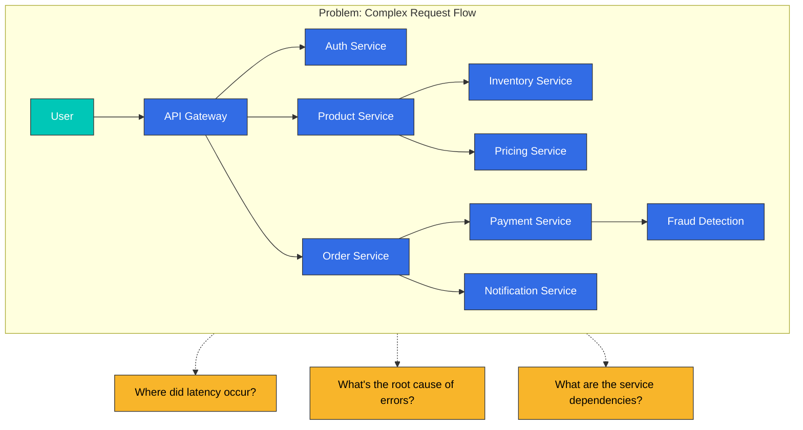
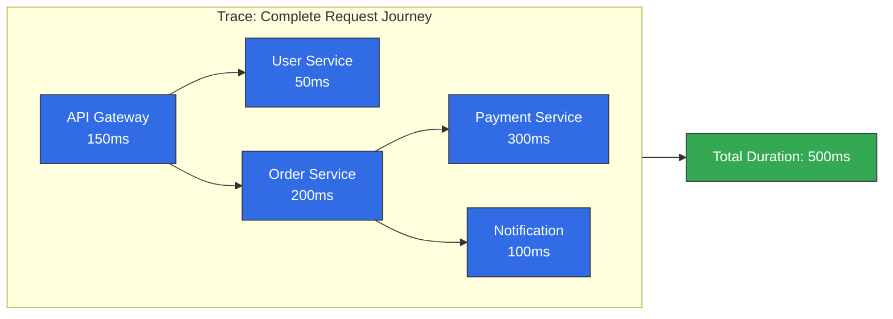
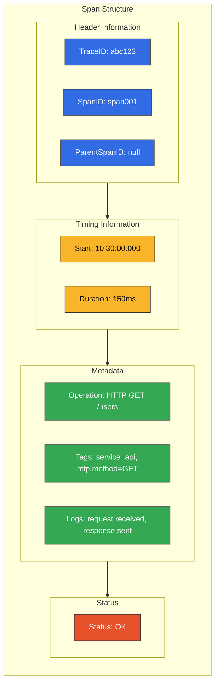
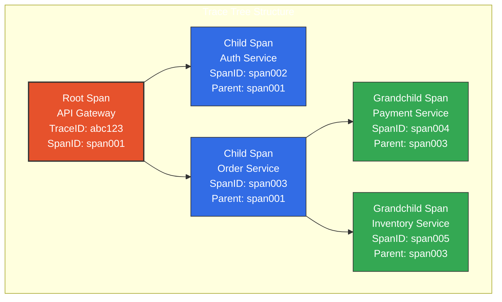
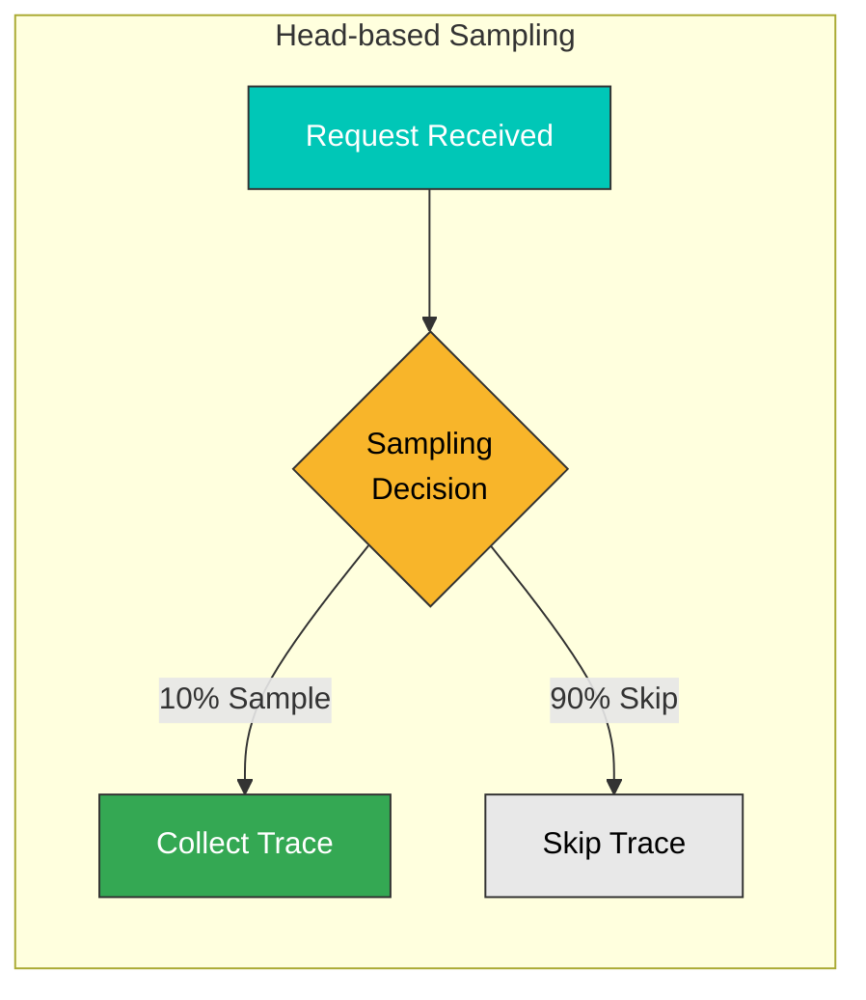
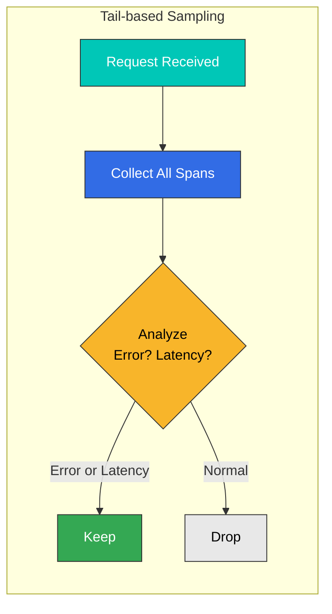
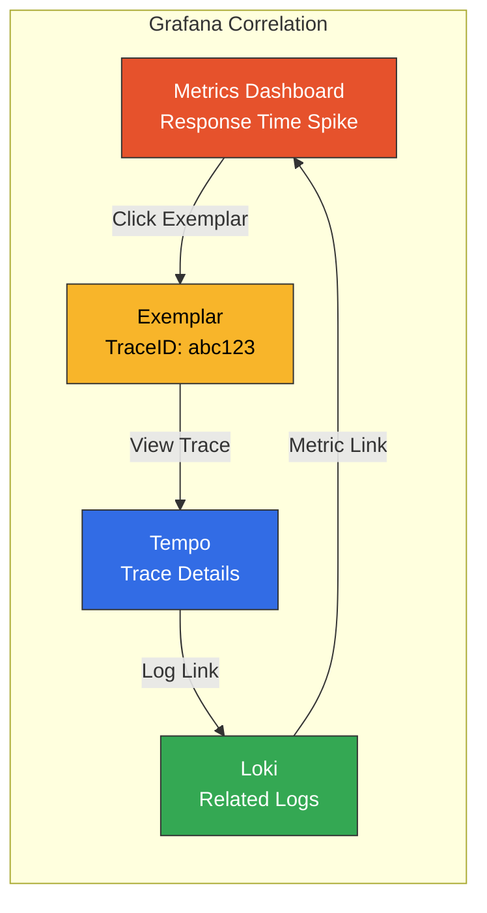
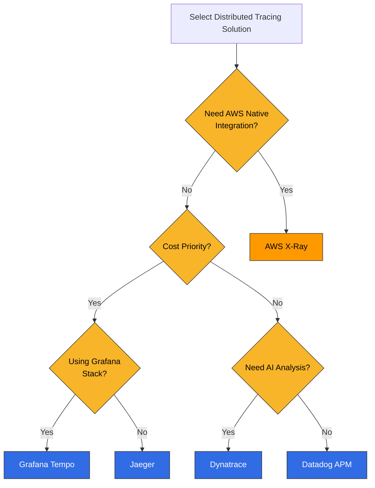

# 分布式追踪概述

> **最后更新**: February 20, 2026

## 简介

分布式追踪是一种用于跟踪请求在微服务架构中穿越多个 Service 时完整路径的技术。在现代系统中，单个请求可能会经过数十个 Service，因此分布式追踪对于识别性能瓶颈和排查问题至关重要。

## 分布式追踪的必要性

### 传统监控的局限性

在微服务环境中，仅依靠传统日志和指标无法回答以下问题：

- 请求经过了哪些 Service？
- 每个 Service 耗时多久？
- 错误发生在哪里？
- Service 之间有哪些依赖关系？



## 核心概念

### 1. Trace

Trace 表示单个请求的完整旅程。它是请求在系统中传递时生成的所有操作的集合。



### 2. Span

Span 表示单个工作单元。每个 Span 包含以下信息：

| 字段 | 描述 | 示例 |
|-------|-------------|---------|
| **TraceID** | 整个 Trace 的唯一标识符 | `abc123def456` |
| **SpanID** | 单个 Span 的唯一标识符 | `span789` |
| **ParentSpanID** | 父 Span 的标识符 | `span456` |
| **操作名称** | 操作的名称 | `HTTP GET /api/users` |
| **开始时间** | 开始时间戳 | `2025-02-15T10:30:00Z` |
| **持续时间** | 耗费的时间 | `150ms` |
| **标签** | 元数据 | `http.status_code=200` |
| **日志** | 事件记录 | `error: connection timeout` |



### 3. Span 关系与层级结构

Span 会形成父子关系，从而创建树形结构：



### 4. SpanContext

SpanContext 是在 Service 之间传播的 Trace 信息：

```yaml
# SpanContext Components
SpanContext:
  trace_id: "abc123def456789"      # Trace identifier
  span_id: "span789"               # Current Span identifier
  trace_flags: "01"                # Sampling flag
  trace_state: "vendor=value"      # Vendor-specific additional info
```

## 上下文传播

在 Service 之间传递 Trace 上下文的方法。

### W3C Trace Context（推荐）

使用 W3C 标准 Header 进行传播：

```http
# HTTP Request Headers
traceparent: 00-abc123def456789012345678901234-span12345678-01
tracestate: rojo=00f067aa0ba902b7,congo=t61rcWkgMzE
```

**traceparent 格式：**
```
version-trace_id-parent_id-trace_flags
00     -abc123...-span1234...-01
```

### B3 传播（兼容 Zipkin）

Zipkin 使用的传播格式：

```http
# Single header format
b3: abc123def456789-span12345678-1-parent12345678

# Multi-header format
X-B3-TraceId: abc123def456789
X-B3-SpanId: span12345678
X-B3-ParentSpanId: parent12345678
X-B3-Sampled: 1
```

### 传播格式比较

| 格式 | Header | 优点 | 缺点 |
|--------|---------|------------|---------------|
| **W3C Trace Context** | `traceparent`, `tracestate` | 标准、可扩展 | 相对较新 |
| **B3 Single** | `b3` | 简单，单个 Header | Zipkin 专用 |
| **B3 Multi** | `X-B3-*` | 易于调试 | Header 较多 |
| **Jaeger** | `uber-trace-id` | 针对 Jaeger 优化 | 供应商锁定 |

## 采样策略

追踪所有请求会造成成本和性能问题。采样用于管理这一问题。

### 基于头部的采样

在请求开始时作出采样决策：



**优点：**
- 实现简单
- 开销低
- 采样决策一致

**缺点：**
- 可能遗漏重要请求
- 可能跳过存在错误或延迟的请求

**配置示例：**
```yaml
# OpenTelemetry SDK Configuration
sampling:
  type: parentbased_traceidratio
  ratio: 0.1  # 10% sampling
```

### 基于尾部的采样

在请求完成后根据结果作出采样决策：



**优点：**
- 绝不会遗漏重要请求（错误、延迟）
- 更智能的采样
- 成本效益高

**缺点：**
- 实现复杂
- 内存使用量更高
- 必须临时存储所有 Span

**OTEL Collector 尾部采样配置：**
```yaml
processors:
  tail_sampling:
    decision_wait: 10s
    num_traces: 100000
    policies:
      # Collect all error requests
      - name: errors
        type: status_code
        status_code:
          status_codes: [ERROR]
      # Collect slow requests
      - name: slow-requests
        type: latency
        latency:
          threshold_ms: 1000
      # 10% sampling for the rest
      - name: probabilistic
        type: probabilistic
        probabilistic:
          sampling_percentage: 10
```

### 采样策略比较

| 策略 | 决策时点 | 资源使用量 | 准确性 | 使用场景 |
|----------|---------------|----------------|----------|----------|
| **基于头部** | 请求开始 | 低 | 中 | 大多数场景 |
| **基于尾部** | 请求完成 | 高 | 高 | 聚焦错误/延迟 |
| **自适应** | 动态 | 中 | 高 | 高流量波动 |

## Trace-Log-Metric 关联

### 通过 TraceID 关联日志

```java
// Java logging example (SLF4J + MDC)
import org.slf4j.MDC;
import io.opentelemetry.api.trace.Span;

public void processOrder(Order order) {
    Span span = Span.current();
    MDC.put("traceId", span.getSpanContext().getTraceId());
    MDC.put("spanId", span.getSpanContext().getSpanId());

    logger.info("Processing order: {}", order.getId());
    // Log output: {"traceId": "abc123", "spanId": "span456", "message": "Processing order: 12345"}
}
```

### 通过 Exemplars 关联指标

```yaml
# Linking TraceID to Prometheus metrics
http_request_duration_seconds_bucket{le="0.5"} 1000 # {traceID="abc123"}
http_request_duration_seconds_bucket{le="1.0"} 1500 # {traceID="def456"}
```

### 在 Grafana 中关联



## 解决方案比较

### 分布式追踪解决方案比较

| 功能 | Tempo | X-Ray | Jaeger | Datadog APM | Dynatrace |
|---------|-------|-------|--------|-------------|-----------|
| **类型** | 开源 | AWS 托管 | 开源 | 商业 SaaS | 商业 SaaS |
| **存储** | 对象存储 | AWS 内部 | Cassandra/ES | Datadog | Dynatrace |
| **查询语言** | TraceQL | 过滤表达式 | - | - | DQL |
| **采样** | 头部/尾部 | 基于规则 | 头部 | 动态 | 动态 |
| **OTEL 支持** | 原生 | 原生 | 原生 | 原生 | 原生 |
| **Service Map** | Grafana 集成 | 内置 | 内置 | 内置 | 内置 |
| **AI 分析** | 无 | 无 | 无 | Watchdog | Davis AI |
| **成本** | 仅存储成本 | 基于使用量 | 基础设施成本 | 基于 Host/span | 基于 Host |
| **EKS 集成** | 手动配置 | 原生 | 手动配置 | Agent 部署 | OneAgent |

### 选择指南



## 最佳实践

### 1. 埋点策略

```yaml
# Recommended instrumentation scope
instrumentation:
  # Always instrument
  always:
    - HTTP requests/responses
    - gRPC calls
    - Database queries
    - Message queue operations
    - External API calls

  # Optional instrumentation
  optional:
    - Internal function calls
    - Cache operations
    - File I/O
```

### 2. Span 命名约定

```yaml
# Good examples
- "HTTP GET /api/users/{id}"
- "PostgreSQL SELECT users"
- "Redis GET user:123"
- "Kafka SEND orders"

# Bad examples
- "http call"
- "db query"
- "process"
- "span1"
```

### 3. 标签标准化

```yaml
# OpenTelemetry Semantic Conventions
tags:
  # HTTP
  http.method: GET
  http.url: https://api.example.com/users
  http.status_code: 200

  # Database
  db.system: postgresql
  db.statement: SELECT * FROM users
  db.operation: SELECT

  # Service
  service.name: user-service
  service.version: 1.2.3
```

## 后续步骤

了解分布式追踪概念后，请在以下章节学习具体工具的使用方法：

- [Grafana Tempo](./01-tempo.md)：Grafana stack 的分布式追踪后端
- [AWS X-Ray](./02-xray.md)：AWS 原生分布式追踪
- [OpenTelemetry](./03-opentelemetry.md)：标准化埋点框架
- [Dynatrace](./04-dynatrace.md)：AI 驱动的 APM 解决方案

## 测验

通过以下工具专属测验检验您的知识：
- [Tempo 测验](../../quizzes/observability/tracing/01-tempo-quiz.md)
- [X-Ray 测验](../../quizzes/observability/tracing/02-xray-quiz.md)
- [OpenTelemetry 测验](../../quizzes/observability/tracing/03-opentelemetry-quiz.md)
- [Dynatrace 测验](../../quizzes/observability/tracing/04-dynatrace-quiz.md)
