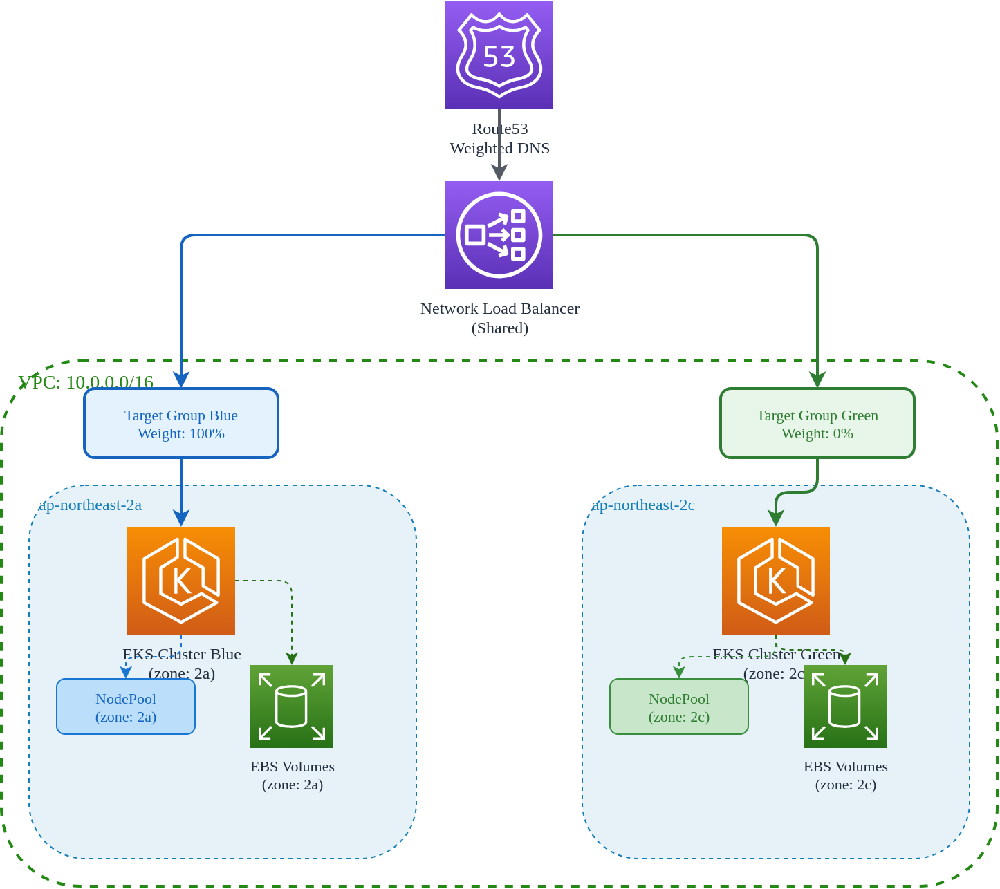

# 高级基础设施

> **支持版本**: Terraform >= 1.5, AWS Provider >= 5.40, EKS >= 1.29 **最后更新**: February 19, 2026

< [上一篇：Terraform 3 层基础设施](01-infrastructure-setup.md) | [目录](./) | [下一篇：CI Pipelines](03-ci-pipelines.md) >

***

## 概述

本指南介绍用于运行生产级 EKS workload 的高级基础设施模式，重点包括高可用性和零停机部署。Blue/Green cluster 架构支持无缝 cluster 升级、灾难恢复，以及跨多个 Availability Zone（可用区）的流量管理。

**主要主题：**

* Blue/Green 双 cluster 架构
* 用于流量分发的 NLB 加权 target group
* 使用 Route53 进行基于 DNS 的流量切换
* 用于有状态 workload 的 zone-aware 数据放置
* 使用 CloudWatch 和 Lambda 实现自动 failover

***

## 1. Blue/Green 架构概述

### 为什么使用 Blue/Green Cluster？

传统的原地 cluster 升级存在显著风险：

* control plane 更新期间 workload 中断
* Node drain 可能导致容量问题
* 出现问题时 rollback 复杂
* 维护窗口较长

Blue/Green 架构通过维护两个独立 cluster 来消除这些风险：

| 方面          | 原地升级           | Blue/Green                     |
| ----------- | -------------- | ------------------------------ |
| 停机风险        | 中高             | 接近零                            |
| Rollback 时间 | 30-60 分钟       | 秒级（DNS/NLB）                    |
| 测试          | 有限             | 完整生产流量                         |
| 成本          | 单 cluster      | 2x cluster（过渡期间）               |

### 架构图



### 单 Zone 设计依据

每个 cluster 在单个 Availability Zone 中运行：

**优势：**

1. **数据本地性**：Pod 始终调度到靠近其 storage volume 的位置
2. **成本优化**：跨 AZ 数据传输成本为零
3. **故障隔离**：AZ 故障只影响一个 cluster
4. **简化网络**：无需复杂的 multi-AZ load balancing

**权衡：**

* 单 AZ 风险更高（通过 Blue/Green failover 缓解）
* 需要针对每个 zone 进行谨慎的容量规划

### Zone 分配

| Cluster | Availability Zone | 用途                  |
| ------- | ----------------- | ------------------------ |
| Blue    | ap-northeast-2a   | 主生产环境                  |
| Green   | ap-northeast-2c   | 次要/升级目标                |

***

## 2. NLB 加权 Target Group

### Network Load Balancer 配置

共享 NLB 根据 target group 权重在 Blue 和 Green cluster 之间分发流量。

```hcl
# nlb/main.tf

terraform {
  required_version = ">= 1.5.0"
  required_providers {
    aws = {
      source  = "hashicorp/aws"
      version = ">= 5.40.0"
    }
  }
}

provider "aws" {
  region = var.region

  default_tags {
    tags = local.tags
  }
}

locals {
  name_prefix = "${var.project_name}-${var.environment}"

  tags = {
    Environment = var.environment
    Project     = var.project_name
    ManagedBy   = "terraform"
    Component   = "nlb"
  }
}

# Reference network layer for VPC and subnets
data "terraform_remote_state" "network" {
  backend = "s3"

  config = {
    bucket = "${var.project_name}-${var.environment}-tfstate"
    key    = "network/terraform.tfstate"
    region = var.region
  }
}

#------------------------------------------------------------------------------
# Network Load Balancer
#------------------------------------------------------------------------------

resource "aws_lb" "main" {
  name               = "${local.name_prefix}-nlb"
  internal           = false
  load_balancer_type = "network"

  # Deploy in both AZs for high availability
  subnets = data.terraform_remote_state.network.outputs.public_subnet_ids

  enable_deletion_protection = var.environment == "prod"
  enable_cross_zone_load_balancing = true

  tags = merge(local.tags, {
    Name = "${local.name_prefix}-nlb"
  })
}

#------------------------------------------------------------------------------
# Target Groups - Blue Cluster
#------------------------------------------------------------------------------

resource "aws_lb_target_group" "blue_http" {
  name        = "${local.name_prefix}-blue-http"
  port        = 80
  protocol    = "TCP"
  vpc_id      = data.terraform_remote_state.network.outputs.vpc_id
  target_type = "ip"

  health_check {
    enabled             = true
    protocol            = "HTTP"
    port                = "traffic-port"
    path                = "/healthz"
    healthy_threshold   = 2
    unhealthy_threshold = 2
    interval            = 10
    timeout             = 5
  }

  # Deregistration delay for graceful shutdown
  deregistration_delay = 30

  tags = merge(local.tags, {
    Name    = "${local.name_prefix}-blue-http"
    Cluster = "blue"
  })
}

resource "aws_lb_target_group" "blue_https" {
  name        = "${local.name_prefix}-blue-https"
  port        = 443
  protocol    = "TCP"
  vpc_id      = data.terraform_remote_state.network.outputs.vpc_id
  target_type = "ip"

  health_check {
    enabled             = true
    protocol            = "HTTPS"
    port                = "traffic-port"
    path                = "/healthz"
    healthy_threshold   = 2
    unhealthy_threshold = 2
    interval            = 10
    timeout             = 5
  }

  deregistration_delay = 30

  tags = merge(local.tags, {
    Name    = "${local.name_prefix}-blue-https"
    Cluster = "blue"
  })
}

#------------------------------------------------------------------------------
# Target Groups - Green Cluster
#------------------------------------------------------------------------------

resource "aws_lb_target_group" "green_http" {
  name        = "${local.name_prefix}-green-http"
  port        = 80
  protocol    = "TCP"
  vpc_id      = data.terraform_remote_state.network.outputs.vpc_id
  target_type = "ip"

  health_check {
    enabled             = true
    protocol            = "HTTP"
    port                = "traffic-port"
    path                = "/healthz"
    healthy_threshold   = 2
    unhealthy_threshold = 2
    interval            = 10
    timeout             = 5
  }

  deregistration_delay = 30

  tags = merge(local.tags, {
    Name    = "${local.name_prefix}-green-http"
    Cluster = "green"
  })
}

resource "aws_lb_target_group" "green_https" {
  name        = "${local.name_prefix}-green-https"
  port        = 443
  protocol    = "TCP"
  vpc_id      = data.terraform_remote_state.network.outputs.vpc_id
  target_type = "ip"

  health_check {
    enabled             = true
    protocol            = "HTTPS"
    port                = "traffic-port"
    path                = "/healthz"
    healthy_threshold   = 2
    unhealthy_threshold = 2
    interval            = 10
    timeout             = 5
  }

  deregistration_delay = 30

  tags = merge(local.tags, {
    Name    = "${local.name_prefix}-green-https"
    Cluster = "green"
  })
}

#------------------------------------------------------------------------------
# Listeners with Weighted Target Groups
#------------------------------------------------------------------------------

resource "aws_lb_listener" "http" {
  load_balancer_arn = aws_lb.main.arn
  port              = 80
  protocol          = "TCP"

  default_action {
    type = "forward"

    forward {
      target_group {
        arn    = aws_lb_target_group.blue_http.arn
        weight = var.blue_weight
      }
      target_group {
        arn    = aws_lb_target_group.green_http.arn
        weight = var.green_weight
      }

      stickiness {
        enabled  = true
        duration = 3600  # 1 hour session stickiness
      }
    }
  }

  tags = merge(local.tags, {
    Name = "${local.name_prefix}-http-listener"
  })
}

resource "aws_lb_listener" "https" {
  load_balancer_arn = aws_lb.main.arn
  port              = 443
  protocol          = "TCP"

  default_action {
    type = "forward"

    forward {
      target_group {
        arn    = aws_lb_target_group.blue_https.arn
        weight = var.blue_weight
      }
      target_group {
        arn    = aws_lb_target_group.green_https.arn
        weight = var.green_weight
      }

      stickiness {
        enabled  = true
        duration = 3600
      }
    }
  }

  tags = merge(local.tags, {
    Name = "${local.name_prefix}-https-listener"
  })
}
```

### 变量

```hcl
# nlb/variables.tf

variable "region" {
  description = "AWS region"
  type        = string
  default     = "ap-northeast-2"
}

variable "environment" {
  description = "Environment name"
  type        = string
  default     = "prod"
}

variable "project_name" {
  description = "Project name"
  type        = string
  default     = "eks-platform"
}

variable "blue_weight" {
  description = "Traffic weight for blue cluster (0-100)"
  type        = number
  default     = 100

  validation {
    condition     = var.blue_weight >= 0 && var.blue_weight <= 100
    error_message = "Blue weight must be between 0 and 100."
  }
}

variable "green_weight" {
  description = "Traffic weight for green cluster (0-100)"
  type        = number
  default     = 0

  validation {
    condition     = var.green_weight >= 0 && var.green_weight <= 100
    error_message = "Green weight must be between 0 and 100."
  }
}
```

### 输出

```hcl
# nlb/outputs.tf

output "nlb_arn" {
  description = "NLB ARN"
  value       = aws_lb.main.arn
}

output "nlb_dns_name" {
  description = "NLB DNS name"
  value       = aws_lb.main.dns_name
}

output "nlb_zone_id" {
  description = "NLB hosted zone ID"
  value       = aws_lb.main.zone_id
}

output "blue_http_target_group_arn" {
  description = "Blue HTTP target group ARN"
  value       = aws_lb_target_group.blue_http.arn
}

output "blue_https_target_group_arn" {
  description = "Blue HTTPS target group ARN"
  value       = aws_lb_target_group.blue_https.arn
}

output "green_http_target_group_arn" {
  description = "Green HTTP target group ARN"
  value       = aws_lb_target_group.green_http.arn
}

output "green_https_target_group_arn" {
  description = "Green HTTPS target group ARN"
  value       = aws_lb_target_group.green_https.arn
}

output "current_weights" {
  description = "Current traffic weights"
  value = {
    blue  = var.blue_weight
    green = var.green_weight
  }
}
```

### 部署的权重调整

针对 canary 风格部署逐步调整权重：

```hcl
# terraform.tfvars examples for different deployment stages

# Stage 1: All traffic to Blue (default)
blue_weight  = 100
green_weight = 0

# Stage 2: Canary - 10% to Green
blue_weight  = 90
green_weight = 10

# Stage 3: 50/50 split
blue_weight  = 50
green_weight = 50

# Stage 4: All traffic to Green
blue_weight  = 0
green_weight = 100
```

应用权重变更：

```bash
# Update weights
terraform apply -var="blue_weight=90" -var="green_weight=10"

# Verify listener configuration
aws elbv2 describe-listeners \
  --load-balancer-arn $(terraform output -raw nlb_arn) \
  --query 'Listeners[*].DefaultActions[*].ForwardConfig.TargetGroups'
```

***

## 3. 基于 DNS 的流量切换

### Route53 加权路由

如需更细粒度的控制和全局路由，可在 NLB 权重之外或替代 NLB 权重使用 Route53 weighted record。

```hcl
# dns/main.tf

terraform {
  required_version = ">= 1.5.0"
  required_providers {
    aws = {
      source  = "hashicorp/aws"
      version = ">= 5.40.0"
    }
  }
}

provider "aws" {
  region = var.region
}

locals {
  name_prefix = "${var.project_name}-${var.environment}"
}

# Reference NLB outputs
data "terraform_remote_state" "nlb" {
  backend = "s3"

  config = {
    bucket = "${var.project_name}-${var.environment}-tfstate"
    key    = "nlb/terraform.tfstate"
    region = var.region
  }
}

#------------------------------------------------------------------------------
# Route53 Hosted Zone
#------------------------------------------------------------------------------

data "aws_route53_zone" "main" {
  name         = var.domain_name
  private_zone = false
}

#------------------------------------------------------------------------------
# Health Checks
#------------------------------------------------------------------------------

resource "aws_route53_health_check" "blue" {
  fqdn              = "blue.${var.domain_name}"
  port              = 443
  type              = "HTTPS"
  resource_path     = "/healthz"
  failure_threshold = 3
  request_interval  = 10

  tags = {
    Name        = "${local.name_prefix}-blue-health"
    Environment = var.environment
    Cluster     = "blue"
  }
}

resource "aws_route53_health_check" "green" {
  fqdn              = "green.${var.domain_name}"
  port              = 443
  type              = "HTTPS"
  resource_path     = "/healthz"
  failure_threshold = 3
  request_interval  = 10

  tags = {
    Name        = "${local.name_prefix}-green-health"
    Environment = var.environment
    Cluster     = "green"
  }
}

#------------------------------------------------------------------------------
# Weighted DNS Records
#------------------------------------------------------------------------------

# Primary record - Blue cluster
resource "aws_route53_record" "app_blue" {
  zone_id = data.aws_route53_zone.main.zone_id
  name    = "app.${var.domain_name}"
  type    = "A"

  set_identifier = "blue"
  weighted_routing_policy {
    weight = var.blue_dns_weight
  }

  alias {
    name                   = data.terraform_remote_state.nlb.outputs.nlb_dns_name
    zone_id                = data.terraform_remote_state.nlb.outputs.nlb_zone_id
    evaluate_target_health = true
  }

  health_check_id = aws_route53_health_check.blue.id
}

# Secondary record - Green cluster
resource "aws_route53_record" "app_green" {
  zone_id = data.aws_route53_zone.main.zone_id
  name    = "app.${var.domain_name}"
  type    = "A"

  set_identifier = "green"
  weighted_routing_policy {
    weight = var.green_dns_weight
  }

  alias {
    name                   = data.terraform_remote_state.nlb.outputs.nlb_dns_name
    zone_id                = data.terraform_remote_state.nlb.outputs.nlb_zone_id
    evaluate_target_health = true
  }

  health_check_id = aws_route53_health_check.green.id
}

#------------------------------------------------------------------------------
# Direct Cluster Access Records
#------------------------------------------------------------------------------

# Blue cluster direct access
resource "aws_route53_record" "blue_direct" {
  zone_id = data.aws_route53_zone.main.zone_id
  name    = "blue.${var.domain_name}"
  type    = "A"

  alias {
    name                   = data.terraform_remote_state.nlb.outputs.nlb_dns_name
    zone_id                = data.terraform_remote_state.nlb.outputs.nlb_zone_id
    evaluate_target_health = true
  }
}

# Green cluster direct access
resource "aws_route53_record" "green_direct" {
  zone_id = data.aws_route53_zone.main.zone_id
  name    = "green.${var.domain_name}"
  type    = "A"

  alias {
    name                   = data.terraform_remote_state.nlb.outputs.nlb_dns_name
    zone_id                = data.terraform_remote_state.nlb.outputs.nlb_zone_id
    evaluate_target_health = true
  }
}

#------------------------------------------------------------------------------
# Failover Configuration
#------------------------------------------------------------------------------

# Primary failover record
resource "aws_route53_record" "app_primary" {
  zone_id = data.aws_route53_zone.main.zone_id
  name    = "failover.${var.domain_name}"
  type    = "A"

  set_identifier = "primary"
  failover_routing_policy {
    type = "PRIMARY"
  }

  alias {
    name                   = data.terraform_remote_state.nlb.outputs.nlb_dns_name
    zone_id                = data.terraform_remote_state.nlb.outputs.nlb_zone_id
    evaluate_target_health = true
  }

  health_check_id = aws_route53_health_check.blue.id
}

# Secondary failover record
resource "aws_route53_record" "app_secondary" {
  zone_id = data.aws_route53_zone.main.zone_id
  name    = "failover.${var.domain_name}"
  type    = "A"

  set_identifier = "secondary"
  failover_routing_policy {
    type = "SECONDARY"
  }

  alias {
    name                   = data.terraform_remote_state.nlb.outputs.nlb_dns_name
    zone_id                = data.terraform_remote_state.nlb.outputs.nlb_zone_id
    evaluate_target_health = true
  }

  health_check_id = aws_route53_health_check.green.id
}
```

### 变量

```hcl
# dns/variables.tf

variable "region" {
  description = "AWS region"
  type        = string
  default     = "ap-northeast-2"
}

variable "environment" {
  description = "Environment name"
  type        = string
  default     = "prod"
}

variable "project_name" {
  description = "Project name"
  type        = string
  default     = "eks-platform"
}

variable "domain_name" {
  description = "Domain name for Route53 records"
  type        = string
}

variable "blue_dns_weight" {
  description = "DNS weight for blue cluster (0-255)"
  type        = number
  default     = 255

  validation {
    condition     = var.blue_dns_weight >= 0 && var.blue_dns_weight <= 255
    error_message = "DNS weight must be between 0 and 255."
  }
}

variable "green_dns_weight" {
  description = "DNS weight for green cluster (0-255)"
  type        = number
  default     = 0

  validation {
    condition     = var.green_dns_weight >= 0 && var.green_dns_weight <= 255
    error_message = "DNS weight must be between 0 and 255."
  }
}
```

### TTL 策略

DNS TTL 会影响权重变更时流量切换的速度：

| TTL 值       | 切换时间            | 使用场景          |
| ------------ | --------------- | ----------------- |
| 60 秒         | \~2-3 分钟       | 快速 failover       |
| 300 秒        | \~10-15 分钟     | 正常运维             |
| 3600 秒       | \~1-2 小时       | 稳定路由             |

对于 Route53 Alias record，TTL 继承自目标（NLB）。如需显式控制 TTL，请使用带 IP 地址的非 alias record。

***

## 4. Data Node 放置

### Zone Affinity 概念

对于有状态 workload，Pod 必须调度到与其 persistent volume 相同的 zone。EKS Auto Mode 会自动处理其中的大部分工作，但理解这些概念有助于故障排查。

### NodePool Zone 配置

实际的 NodePool YAML 由 ArgoCD GitOps 管理（参见 [GitOps Pipeline 配置](https://github.com/Atom-oh/kubernetes-docs/blob/main/en/ops/04-gitops-pipeline.md)），但以下是关键概念：

```yaml
# Conceptual NodePool for Blue cluster (zone: ap-northeast-2a)
# Actual resource managed by ArgoCD, not Terraform
apiVersion: karpenter.sh/v1
kind: NodePool
metadata:
  name: blue-data-nodes
spec:
  template:
    spec:
      requirements:
        - key: topology.kubernetes.io/zone
          operator: In
          values:
            - ap-northeast-2a
        - key: karpenter.sh/capacity-type
          operator: In
          values:
            - on-demand
        - key: node.kubernetes.io/instance-type
          operator: In
          values:
            - r6i.xlarge
            - r6i.2xlarge
            - r6i.4xlarge
      nodeClassRef:
        group: eks.amazonaws.com
        kind: NodeClass
        name: default
  limits:
    cpu: 1000
    memory: 4000Gi
  disruption:
    consolidationPolicy: WhenEmpty
    consolidateAfter: 30m
```

### TopologySpreadConstraints

确保 workload 在单 zone cluster 内正确分散：

```yaml
# Example Deployment with topology constraints
apiVersion: apps/v1
kind: Deployment
metadata:
  name: api-server
spec:
  replicas: 3
  selector:
    matchLabels:
      app: api-server
  template:
    metadata:
      labels:
        app: api-server
    spec:
      topologySpreadConstraints:
        # Spread across nodes within the zone
        - maxSkew: 1
          topologyKey: kubernetes.io/hostname
          whenUnsatisfiable: DoNotSchedule
          labelSelector:
            matchLabels:
              app: api-server
      containers:
        - name: api-server
          image: myapp/api-server:latest
          resources:
            requests:
              cpu: 500m
              memory: 512Mi
```

### 用于共置的 Pod Affinity

将相关 Pod 共置以降低延迟：

```yaml
# Cache pods should be near API pods
apiVersion: apps/v1
kind: Deployment
metadata:
  name: cache
spec:
  replicas: 3
  selector:
    matchLabels:
      app: cache
  template:
    metadata:
      labels:
        app: cache
    spec:
      affinity:
        podAffinity:
          preferredDuringSchedulingIgnoredDuringExecution:
            - weight: 100
              podAffinityTerm:
                labelSelector:
                  matchLabels:
                    app: api-server
                topologyKey: kubernetes.io/hostname
        podAntiAffinity:
          requiredDuringSchedulingIgnoredDuringExecution:
            - labelSelector:
                matchLabels:
                  app: cache
              topologyKey: kubernetes.io/hostname
      containers:
        - name: redis
          image: redis:7-alpine
```

### 带 Zone-Specific Storage 的 StatefulSet

适用于数据库和其他有状态 workload：

```yaml
# PostgreSQL StatefulSet with zone-locked storage
apiVersion: apps/v1
kind: StatefulSet
metadata:
  name: postgresql
spec:
  serviceName: postgresql
  replicas: 1
  selector:
    matchLabels:
      app: postgresql
  template:
    metadata:
      labels:
        app: postgresql
    spec:
      # Node selector ensures pod schedules in correct zone
      nodeSelector:
        topology.kubernetes.io/zone: ap-northeast-2a
      containers:
        - name: postgresql
          image: postgres:15
          ports:
            - containerPort: 5432
          volumeMounts:
            - name: data
              mountPath: /var/lib/postgresql/data
          env:
            - name: POSTGRES_DB
              value: myapp
            - name: PGDATA
              value: /var/lib/postgresql/data/pgdata
  volumeClaimTemplates:
    - metadata:
        name: data
      spec:
        accessModes:
          - ReadWriteOnce
        storageClassName: ebs-sc  # Auto Mode managed
        resources:
          requests:
            storage: 100Gi
```

### 用于 Zone-Specific Provisioning 的 Storage Class

```yaml
# StorageClass that provisions in specific zone
apiVersion: storage.k8s.io/v1
kind: StorageClass
metadata:
  name: ebs-sc-zone-a
provisioner: ebs.csi.aws.com
parameters:
  type: gp3
  iops: "3000"
  throughput: "125"
  encrypted: "true"
allowedTopologies:
  - matchLabelExpressions:
      - key: topology.kubernetes.io/zone
        values:
          - ap-northeast-2a
volumeBindingMode: WaitForFirstConsumer
reclaimPolicy: Retain
```

***

## 5. Failover 自动化

### CloudWatch Alarm

监控 cluster 健康状况并触发自动 failover：

```hcl
# failover/cloudwatch.tf

resource "aws_cloudwatch_metric_alarm" "blue_unhealthy" {
  alarm_name          = "${local.name_prefix}-blue-unhealthy"
  comparison_operator = "LessThanThreshold"
  evaluation_periods  = 2
  metric_name         = "HealthyHostCount"
  namespace           = "AWS/NetworkELB"
  period              = 60
  statistic           = "Average"
  threshold           = 1
  alarm_description   = "Blue cluster has no healthy targets"

  dimensions = {
    TargetGroup  = aws_lb_target_group.blue_http.arn_suffix
    LoadBalancer = aws_lb.main.arn_suffix
  }

  alarm_actions = [
    aws_sns_topic.alerts.arn,
    aws_lambda_function.failover.arn
  ]

  ok_actions = [
    aws_sns_topic.alerts.arn
  ]

  tags = local.tags
}

resource "aws_cloudwatch_metric_alarm" "green_unhealthy" {
  alarm_name          = "${local.name_prefix}-green-unhealthy"
  comparison_operator = "LessThanThreshold"
  evaluation_periods  = 2
  metric_name         = "HealthyHostCount"
  namespace           = "AWS/NetworkELB"
  period              = 60
  statistic           = "Average"
  threshold           = 1
  alarm_description   = "Green cluster has no healthy targets"

  dimensions = {
    TargetGroup  = aws_lb_target_group.green_http.arn_suffix
    LoadBalancer = aws_lb.main.arn_suffix
  }

  alarm_actions = [
    aws_sns_topic.alerts.arn
  ]

  tags = local.tags
}

# SNS Topic for alerts
resource "aws_sns_topic" "alerts" {
  name = "${local.name_prefix}-failover-alerts"
  tags = local.tags
}

resource "aws_sns_topic_subscription" "email" {
  topic_arn = aws_sns_topic.alerts.arn
  protocol  = "email"
  endpoint  = var.alert_email
}
```

### Lambda Failover Function

当 cluster 变为不健康时自动切换权重：

```hcl
# failover/lambda.tf

resource "aws_lambda_function" "failover" {
  filename         = data.archive_file.failover.output_path
  function_name    = "${local.name_prefix}-failover"
  role             = aws_iam_role.failover_lambda.arn
  handler          = "index.handler"
  source_code_hash = data.archive_file.failover.output_base64sha256
  runtime          = "python3.11"
  timeout          = 30

  environment {
    variables = {
      LISTENER_ARN_HTTP  = aws_lb_listener.http.arn
      LISTENER_ARN_HTTPS = aws_lb_listener.https.arn
      BLUE_TG_ARN_HTTP   = aws_lb_target_group.blue_http.arn
      BLUE_TG_ARN_HTTPS  = aws_lb_target_group.blue_https.arn
      GREEN_TG_ARN_HTTP  = aws_lb_target_group.green_http.arn
      GREEN_TG_ARN_HTTPS = aws_lb_target_group.green_https.arn
      SNS_TOPIC_ARN      = aws_sns_topic.alerts.arn
    }
  }

  tags = local.tags
}

data "archive_file" "failover" {
  type        = "zip"
  source_file = "${path.module}/lambda/failover.py"
  output_path = "${path.module}/lambda/failover.zip"
}

# Lambda IAM Role
resource "aws_iam_role" "failover_lambda" {
  name = "${local.name_prefix}-failover-lambda-role"

  assume_role_policy = jsonencode({
    Version = "2012-10-17"
    Statement = [
      {
        Action = "sts:AssumeRole"
        Effect = "Allow"
        Principal = {
          Service = "lambda.amazonaws.com"
        }
      }
    ]
  })

  tags = local.tags
}

resource "aws_iam_role_policy" "failover_lambda" {
  name = "failover-policy"
  role = aws_iam_role.failover_lambda.id

  policy = jsonencode({
    Version = "2012-10-17"
    Statement = [
      {
        Effect = "Allow"
        Action = [
          "logs:CreateLogGroup",
          "logs:CreateLogStream",
          "logs:PutLogEvents"
        ]
        Resource = "arn:aws:logs:*:*:*"
      },
      {
        Effect = "Allow"
        Action = [
          "elasticloadbalancing:ModifyListener",
          "elasticloadbalancing:DescribeListeners",
          "elasticloadbalancing:DescribeTargetGroups",
          "elasticloadbalancing:DescribeTargetHealth"
        ]
        Resource = "*"
      },
      {
        Effect = "Allow"
        Action = [
          "sns:Publish"
        ]
        Resource = aws_sns_topic.alerts.arn
      }
    ]
  })
}

# CloudWatch permission to invoke Lambda
resource "aws_lambda_permission" "cloudwatch" {
  statement_id  = "AllowCloudWatch"
  action        = "lambda:InvokeFunction"
  function_name = aws_lambda_function.failover.function_name
  principal     = "lambda.alarms.cloudwatch.amazonaws.com"
  source_arn    = aws_cloudwatch_metric_alarm.blue_unhealthy.arn
}
```

### Lambda Function 代码

```python
# failover/lambda/failover.py
"""
Automated failover handler for Blue/Green EKS clusters.
Triggered by CloudWatch alarms when a cluster becomes unhealthy.
"""

import json
import os
import boto3
from datetime import datetime

elbv2 = boto3.client('elbv2')
sns = boto3.client('sns')

def handler(event, context):
    """
    Handle CloudWatch alarm and adjust NLB weights.
    """
    print(f"Event received: {json.dumps(event)}")

    # Parse CloudWatch alarm
    alarm_name = event.get('alarmName', '')
    alarm_state = event.get('newStateValue', '')

    if alarm_state != 'ALARM':
        print(f"Alarm state is {alarm_state}, not ALARM. No action needed.")
        return {'statusCode': 200, 'body': 'No action needed'}

    # Determine which cluster is unhealthy
    if 'blue' in alarm_name.lower():
        unhealthy_cluster = 'blue'
        healthy_cluster = 'green'
    elif 'green' in alarm_name.lower():
        unhealthy_cluster = 'green'
        healthy_cluster = 'blue'
    else:
        print(f"Cannot determine cluster from alarm name: {alarm_name}")
        return {'statusCode': 400, 'body': 'Unknown alarm'}

    print(f"Unhealthy cluster: {unhealthy_cluster}")
    print(f"Switching traffic to: {healthy_cluster}")

    # Get environment variables
    listener_arns = [
        os.environ['LISTENER_ARN_HTTP'],
        os.environ['LISTENER_ARN_HTTPS']
    ]

    target_groups = {
        'blue': {
            'http': os.environ['BLUE_TG_ARN_HTTP'],
            'https': os.environ['BLUE_TG_ARN_HTTPS']
        },
        'green': {
            'http': os.environ['GREEN_TG_ARN_HTTP'],
            'https': os.environ['GREEN_TG_ARN_HTTPS']
        }
    }

    # Check health of target cluster before switching
    healthy_tg_arn = target_groups[healthy_cluster]['http']
    health_response = elbv2.describe_target_health(TargetGroupArn=healthy_tg_arn)
    healthy_targets = [
        t for t in health_response['TargetHealthDescriptions']
        if t['TargetHealth']['State'] == 'healthy'
    ]

    if len(healthy_targets) == 0:
        message = f"CRITICAL: Both clusters unhealthy! Cannot failover."
        print(message)
        notify(message, 'CRITICAL')
        return {'statusCode': 500, 'body': message}

    # Update listener weights
    for listener_arn in listener_arns:
        protocol = 'https' if '443' in listener_arn else 'http'

        new_action = {
            'Type': 'forward',
            'ForwardConfig': {
                'TargetGroups': [
                    {
                        'TargetGroupArn': target_groups[unhealthy_cluster][protocol],
                        'Weight': 0
                    },
                    {
                        'TargetGroupArn': target_groups[healthy_cluster][protocol],
                        'Weight': 100
                    }
                ],
                'TargetGroupStickinessConfig': {
                    'Enabled': True,
                    'DurationSeconds': 3600
                }
            }
        }

        elbv2.modify_listener(
            ListenerArn=listener_arn,
            DefaultActions=[new_action]
        )

        print(f"Updated listener {listener_arn}")

    # Send notification
    message = (
        f"FAILOVER EXECUTED\n"
        f"Time: {datetime.utcnow().isoformat()}Z\n"
        f"Unhealthy Cluster: {unhealthy_cluster}\n"
        f"Traffic Redirected To: {healthy_cluster}\n"
        f"Healthy Targets in {healthy_cluster}: {len(healthy_targets)}\n"
        f"\n"
        f"Action Required: Investigate {unhealthy_cluster} cluster health."
    )
    notify(message, 'FAILOVER')

    return {
        'statusCode': 200,
        'body': f'Failover to {healthy_cluster} completed'
    }


def notify(message, severity):
    """Send notification via SNS."""
    sns_topic_arn = os.environ.get('SNS_TOPIC_ARN')
    if sns_topic_arn:
        sns.publish(
            TopicArn=sns_topic_arn,
            Subject=f'[{severity}] EKS Cluster Failover Alert',
            Message=message
        )
```

### EventBridge Rule

按计划触发 failover 检查：

```hcl
# failover/eventbridge.tf

resource "aws_cloudwatch_event_rule" "health_check" {
  name                = "${local.name_prefix}-health-check"
  description         = "Periodic health check for EKS clusters"
  schedule_expression = "rate(1 minute)"

  tags = local.tags
}

resource "aws_cloudwatch_event_target" "health_check" {
  rule      = aws_cloudwatch_event_rule.health_check.name
  target_id = "HealthCheckLambda"
  arn       = aws_lambda_function.health_check.arn
}

resource "aws_lambda_permission" "eventbridge" {
  statement_id  = "AllowEventBridge"
  action        = "lambda:InvokeFunction"
  function_name = aws_lambda_function.health_check.function_name
  principal     = "events.amazonaws.com"
  source_arn    = aws_cloudwatch_event_rule.health_check.arn
}
```

### 手动切换流程

用于计划维护或手动 failover：

```bash
#!/bin/bash
# manual-switchover.sh - Manually switch traffic between clusters

set -e

TARGET_CLUSTER="${1:-green}"  # Target cluster to receive traffic
REGION="${2:-ap-northeast-2}"

echo "=== Manual Cluster Switchover ==="
echo "Target: $TARGET_CLUSTER"
echo "Region: $REGION"
echo ""

# Validate target
if [[ "$TARGET_CLUSTER" != "blue" && "$TARGET_CLUSTER" != "green" ]]; then
  echo "ERROR: Target cluster must be 'blue' or 'green'"
  exit 1
fi

# Set weights based on target
if [ "$TARGET_CLUSTER" == "blue" ]; then
  BLUE_WEIGHT=100
  GREEN_WEIGHT=0
else
  BLUE_WEIGHT=0
  GREEN_WEIGHT=100
fi

echo "Setting weights: Blue=$BLUE_WEIGHT%, Green=$GREEN_WEIGHT%"
echo ""

# Confirm with user
read -p "Proceed with switchover? (yes/no): " CONFIRM
if [ "$CONFIRM" != "yes" ]; then
  echo "Aborted."
  exit 0
fi

# Apply Terraform changes
cd "$(dirname "$0")/../nlb"
terraform apply \
  -var="blue_weight=$BLUE_WEIGHT" \
  -var="green_weight=$GREEN_WEIGHT" \
  -auto-approve

echo ""
echo "=== Switchover Complete ==="
echo "Traffic is now routed to: $TARGET_CLUSTER"
echo ""
echo "Verify with:"
echo "  aws elbv2 describe-listeners --load-balancer-arn \$(terraform output -raw nlb_arn)"
```

### 渐进式 Rollback 脚本

```bash
#!/bin/bash
# gradual-rollback.sh - Gradually shift traffic back to original cluster

set -e

FROM_CLUSTER="${1:-green}"
TO_CLUSTER="${2:-blue}"
STEP="${3:-10}"  # Percentage step
INTERVAL="${4:-60}"  # Seconds between steps

echo "=== Gradual Traffic Shift ==="
echo "From: $FROM_CLUSTER"
echo "To: $TO_CLUSTER"
echo "Step: $STEP%"
echo "Interval: ${INTERVAL}s"
echo ""

cd "$(dirname "$0")/../nlb"

# Current weights
CURRENT_FROM=100
CURRENT_TO=0

while [ $CURRENT_TO -lt 100 ]; do
  CURRENT_FROM=$((CURRENT_FROM - STEP))
  CURRENT_TO=$((CURRENT_TO + STEP))

  # Clamp values
  [ $CURRENT_FROM -lt 0 ] && CURRENT_FROM=0
  [ $CURRENT_TO -gt 100 ] && CURRENT_TO=100

  echo "Setting: $FROM_CLUSTER=$CURRENT_FROM%, $TO_CLUSTER=$CURRENT_TO%"

  if [ "$TO_CLUSTER" == "blue" ]; then
    terraform apply \
      -var="blue_weight=$CURRENT_TO" \
      -var="green_weight=$CURRENT_FROM" \
      -auto-approve
  else
    terraform apply \
      -var="blue_weight=$CURRENT_FROM" \
      -var="green_weight=$CURRENT_TO" \
      -auto-approve
  fi

  if [ $CURRENT_TO -lt 100 ]; then
    echo "Waiting ${INTERVAL}s before next step..."
    sleep $INTERVAL
  fi
done

echo ""
echo "=== Traffic Shift Complete ==="
echo "All traffic now routed to: $TO_CLUSTER"
```

***

## 总结

采用 NLB 加权路由的 Blue/Green cluster 架构提供：

1. **零停机部署**：逐步或即时切换流量
2. **快速 Rollback**：数秒内切回之前的 cluster
3. **隔离的故障域**：AZ 故障只影响一个 cluster
4. **生产环境测试**：将小比例流量路由到新 cluster
5. **自动恢复**：使用 CloudWatch + Lambda 实现自动 failover

### 相关文档

* [Terraform 3 层基础设施](01-infrastructure-setup.md)
* [CI Pipelines](03-ci-pipelines.md)
* [GitOps Pipeline 配置](https://github.com/Atom-oh/kubernetes-docs/blob/main/en/ops/04-gitops-pipeline.md)
* [EKS Auto Mode 入门](../eks-auto-mode/01-getting-started.md)

***

< [上一篇：Terraform 3 层基础设施](01-infrastructure-setup.md) | [目录](./) | [下一篇：CI Pipelines](03-ci-pipelines.md) >
