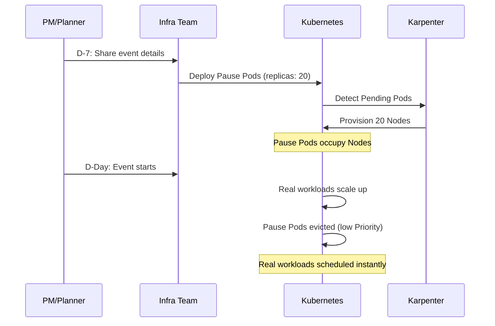
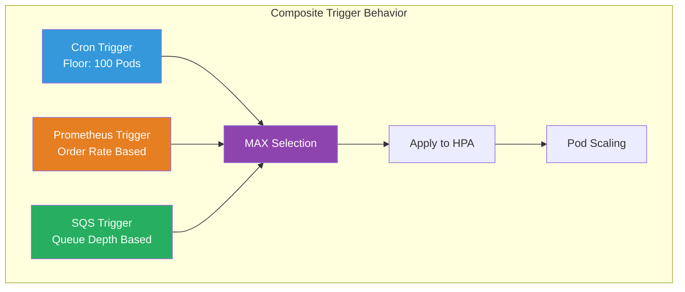
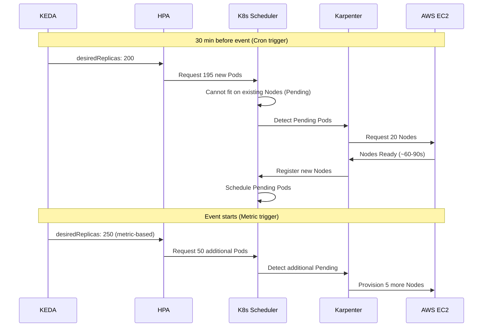

# 活动容量规划 Playbook

> **支持版本**: Kubernetes 1.28+, KEDA 2.14+, Karpenter 0.37+
> **最后更新**: April 25, 2026

< [上一节: EKS 升级运维](./11-upgrade-operations.md) | [目录](./README.md) | [下一节: FinOps 成本可视化](./13-finops-cost-platform.md) >

---

## 概述

Flash sales、营销活动和季节性活动都需要主动进行基础设施容量规划，才能可靠地应对流量激增。本 playbook 同时面向 **运维工程师** 和 **非技术干系人**（PM、营销人员），提供实用且可执行的指导。

通过将 KEDA 用于 Pod（容器组）级伸缩、将 Karpenter 用于 Node（节点）级供应，可以创建稳健的活动伸缩策略：以基于 cron 的预伸缩作为安全下限，同时由业务指标驱动实时弹性。

### 学习目标

- 了解不同活动类型的流量模式和伸缩策略
- 使用容量规划工作表估算基础设施需求
- 配置 KEDA cron + 业务指标组合触发器
- 利用 Karpenter warm pools 和 EC2 Capacity Reservations
- 实现端到端的 KEDA + Karpenter 协调
- 构建面向特定活动的 runbook 和运维流程

---

## 1. 活动容量规划框架

### 1.1 活动类型分类

| Event Type | Traffic Multiplier | Ramp-Up Time | Duration | Predictability | Examples |
|-----------|-------------------|-------------|----------|---------------|---------|
| Flash Sales | 10-50x | 秒级 | 1-4 小时 | 高 | 限时优惠、限量版发布 |
| Product Launches | 5-20x | 分钟级 | 1-7 天 | 高 | 新功能发布、应用更新 |
| Marketing Campaigns | 3-10x | 分钟-小时级 | 小时-天级 | 中 | 电视广告、社交媒体 viral |
| Seasonal Events | 5-30x | 小时级 | 1-7 天 | 高 | Black Friday、年末促销 |
| Unexpected Surges | 5-100x | 秒级 | 不确定 | 低 | 新闻/SNS viral、bot 攻击 |

### 1.2 容量规划工作表

PM 和规划人员可填写并交给基础设施团队的标准工作表。

**输入（由 PM/规划人员填写）：**

| Field | Description | Example Value |
|-------|------------|---------------|
| Event Type | Flash sale / Marketing / Seasonal | Flash Sale |
| Expected Concurrent Users | 峰值同时连接数 | 100,000 |
| Expected Peak RPM | 每分钟最大请求数 | 600,000 |
| Event Start Time | 日期和时间（本地 TZ） | 2026-05-01 12:00 KST |
| Event Duration | 处于峰值流量的小时数 | 2 hours |
| Ramp-Up Time | 达到峰值流量所需时间 | 10 seconds |
| Baseline Traffic | 正常时段 RPM | 30,000 |

**计算公式：**

```
Required Pods  = Peak RPM ÷ RPM per Pod
Required Nodes = Required Pods ÷ Pods per Node
Estimated Cost = Nodes × Hourly Cost × (Event Hours + Pre-scale + Cooldown)

Example:
- RPM per Pod: 3,000 (measured via load test)
- Required Pods: 600,000 ÷ 3,000 = 200 Pods
- Pods per Node: 10 (c5.4xlarge)
- Required Nodes: 200 ÷ 10 = 20 Nodes
- Safety margin (+30%): 26 Nodes
- Cost: 26 × $0.68/hr × (2hr event + 1hr pre + 1hr cooldown) = ~$70.72
```

### 1.3 D-30 到 D+1 时间线检查清单

| When | Owner | Task | Done |
|------|-------|------|------|
| **D-30** | PM + Infra | 共享活动详情（填写工作表） | ☐ |
| **D-30** | Infra | 申请 Capacity Reservations（如需要） | ☐ |
| **D-30** | Finance | 批准额外基础设施预算 | ☐ |
| **D-14** | Infra | 以目标 RPM 的 120% 运行负载测试 | ☐ |
| **D-14** | Infra | 识别并解决瓶颈 | ☐ |
| **D-7** | Infra | 部署 KEDA ScaledObject（cron 预伸缩） | ☐ |
| **D-7** | Infra | 部署 Karpenter 活动 NodePool | ☐ |
| **D-7** | Infra | 配置监控 dashboard | ☐ |
| **D-3** | Infra | 预伸缩 dry-run（在无真实流量下验证） | ☐ |
| **D-1** | Infra + PM | 最终验证：Pod/Node 数量、告警渠道、dashboard URL | ☐ |
| **D-1** | Infra | 建立 war room，安排 on-call | ☐ |
| **D-Day** | Infra | 验证预伸缩（活动前 30 分钟） | ☐ |
| **D-Day** | Infra | 实时监控并待命进行手动干预 | ☐ |
| **D+1** | Infra | 确认 scale-down，清理遗留资源 | ☐ |
| **D+1** | Infra + PM | 复盘：预测值 vs 实际值，成本分析 | ☐ |

---

## 2. 预伸缩策略

### 2.1 基于 KEDA Cron 的预伸缩

在活动前扩容 Pod，以吸收初始流量峰值。

**单个活动窗口：**

```yaml
apiVersion: keda.sh/v1alpha1
kind: ScaledObject
metadata:
  name: flash-sale-prescale
  namespace: ecommerce
spec:
  scaleTargetRef:
    name: order-service
  minReplicaCount: 5
  maxReplicaCount: 300
  triggers:
    # Pre-scale 30 min before the event
    - type: cron
      metadata:
        timezone: Asia/Seoul
        start: "30 11 1 5 *"    # May 1st, 11:30
        end: "30 14 1 5 *"      # May 1st, 14:30
        desiredReplicas: "200"
```

**多区域活动窗口：**

```yaml
apiVersion: keda.sh/v1alpha1
kind: ScaledObject
metadata:
  name: global-sale-prescale
  namespace: ecommerce
spec:
  scaleTargetRef:
    name: order-service
  minReplicaCount: 5
  maxReplicaCount: 500
  triggers:
    # Korea flash sale (KST 12:00-14:00)
    - type: cron
      metadata:
        timezone: Asia/Seoul
        start: "30 11 1 5 *"
        end: "30 14 1 5 *"
        desiredReplicas: "200"
    # Japan flash sale (JST 18:00-20:00)
    - type: cron
      metadata:
        timezone: Asia/Tokyo
        start: "30 17 1 5 *"
        end: "30 20 1 5 *"
        desiredReplicas: "150"
    # US flash sale (EST 09:00-11:00)
    - type: cron
      metadata:
        timezone: America/New_York
        start: "30 8 1 5 *"
        end: "30 11 1 5 *"
        desiredReplicas: "180"
```

### 2.2 Karpenter Warm Pools

在活动前预先供应 Node，以消除 Pod 调度延迟。

```yaml
apiVersion: karpenter.sh/v1
kind: NodePool
metadata:
  name: event-warm-pool
spec:
  template:
    metadata:
      labels:
        workload-type: event
        pool: warm
    spec:
      requirements:
        - key: kubernetes.io/arch
          operator: In
          values: ["amd64"]
        - key: karpenter.sh/capacity-type
          operator: In
          values: ["on-demand"]
        - key: node.kubernetes.io/instance-type
          operator: In
          values:
            - c5.4xlarge
            - c5.2xlarge
            - m5.4xlarge
      nodeClassRef:
        group: karpenter.k8s.aws
        kind: EC2NodeClass
        name: event-nodes
  limits:
    cpu: "640"
    memory: 1280Gi
  disruption:
    consolidationPolicy: WhenEmpty
    consolidateAfter: 30m
  weight: 100   # Higher weight = preferred over default NodePool
---
apiVersion: karpenter.k8s.aws/v1
kind: EC2NodeClass
metadata:
  name: event-nodes
spec:
  amiSelectorTerms:
    - alias: al2023@latest
  subnetSelectorTerms:
    - tags:
        karpenter.sh/discovery: my-cluster
  securityGroupSelectorTerms:
    - tags:
        karpenter.sh/discovery: my-cluster
  blockDeviceMappings:
    - deviceName: /dev/xvda
      ebs:
        volumeSize: 100Gi
        volumeType: gp3
        iops: 5000
        throughput: 250
  tags:
    event: flash-sale-2026-05
    cost-center: marketing
```

### 2.3 EC2 Capacity Reservations

为大规模活动保证实例可用性。

**Terraform HCL：**

```hcl
resource "aws_ec2_capacity_reservation" "flash_sale" {
  instance_type     = "c5.4xlarge"
  instance_platform = "Linux/UNIX"
  availability_zone = "ap-northeast-2a"
  instance_count    = 15
  instance_match_criteria = "targeted"

  end_date_type = "limited"
  end_date      = "2026-05-01T15:00:00Z"

  tags = {
    Name       = "flash-sale-2026-05"
    Event      = "flash-sale"
    CostCenter = "marketing"
  }
}

resource "aws_ec2_capacity_reservation" "flash_sale_2b" {
  instance_type     = "c5.4xlarge"
  instance_platform = "Linux/UNIX"
  availability_zone = "ap-northeast-2b"
  instance_count    = 11
  instance_match_criteria = "targeted"
  end_date_type = "limited"
  end_date      = "2026-05-01T15:00:00Z"
  tags = {
    Name       = "flash-sale-2026-05-2b"
    Event      = "flash-sale"
    CostCenter = "marketing"
  }
}
```

**在 Karpenter 中定向使用 Capacity Reservations：**

```yaml
apiVersion: karpenter.k8s.aws/v1
kind: EC2NodeClass
metadata:
  name: event-reserved
spec:
  amiSelectorTerms:
    - alias: al2023@latest
  subnetSelectorTerms:
    - tags:
        karpenter.sh/discovery: my-cluster
  securityGroupSelectorTerms:
    - tags:
        karpenter.sh/discovery: my-cluster
  capacityReservationSelectorTerms:
    - tags:
        Event: flash-sale
```

### 2.4 Pause Pods（占位符伸缩）

使用低优先级占位 Pod 预热 Node。当真实工作负载需要容量时，它们会被自动驱逐。

```yaml
apiVersion: scheduling.k8s.io/v1
kind: PriorityClass
metadata:
  name: pause-priority
value: -10
globalDefault: false
description: "Pause pods for pre-warming nodes - evicted by real workloads"
---
apiVersion: apps/v1
kind: Deployment
metadata:
  name: event-pause-pods
  namespace: ecommerce
  labels:
    purpose: node-warm-pool
spec:
  replicas: 20
  selector:
    matchLabels:
      app: pause-placeholder
  template:
    metadata:
      labels:
        app: pause-placeholder
    spec:
      priorityClassName: pause-priority
      terminationGracePeriodSeconds: 0
      containers:
        - name: pause
          image: registry.k8s.io/pause:3.9
          resources:
            requests:
              cpu: "14"
              memory: 24Gi
            limits:
              cpu: "14"
              memory: 24Gi
      tolerations:
        - key: event-workload
          operator: Exists
          effect: NoSchedule
```

**工作原理：**



---

## 3. 业务指标驱动的伸缩

### 3.1 基于订单速率的伸缩

基于 Prometheus 中收集的业务指标进行伸缩。

**PrometheusRule（Recording Rules）：**

```yaml
apiVersion: monitoring.coreos.com/v1
kind: PrometheusRule
metadata:
  name: business-metrics
  namespace: monitoring
spec:
  groups:
    - name: business.rules
      interval: 15s
      rules:
        - record: business:orders_per_minute:rate5m
          expr: sum(rate(order_completed_total[5m])) * 60
        - record: business:page_views_per_minute:rate5m
          expr: sum(rate(nginx_http_requests_total{path=~"/product.*"}[5m])) * 60
        - record: business:cart_additions_per_minute:rate5m
          expr: sum(rate(cart_add_total[5m])) * 60
```

**KEDA ScaledObject（订单速率）：**

```yaml
apiVersion: keda.sh/v1alpha1
kind: ScaledObject
metadata:
  name: order-service-scaler
  namespace: ecommerce
spec:
  scaleTargetRef:
    name: order-service
  pollingInterval: 10
  cooldownPeriod: 60
  minReplicaCount: 5
  maxReplicaCount: 300
  triggers:
    - type: prometheus
      metadata:
        serverAddress: http://prometheus.monitoring.svc:9090
        query: business:orders_per_minute:rate5m
        threshold: "150"
        activationThreshold: "10"
  advanced:
    horizontalPodAutoscalerConfig:
      behavior:
        scaleUp:
          stabilizationWindowSeconds: 0
          policies:
            - type: Percent
              value: 100
              periodSeconds: 15
        scaleDown:
          stabilizationWindowSeconds: 300
          policies:
            - type: Percent
              value: 10
              periodSeconds: 60
```

### 3.2 基于 Page Views / Session 的伸缩

使用 CloudWatch 指标进行 frontend 伸缩。

```yaml
apiVersion: keda.sh/v1alpha1
kind: ScaledObject
metadata:
  name: frontend-pageview-scaler
  namespace: ecommerce
spec:
  scaleTargetRef:
    name: frontend-web
  pollingInterval: 15
  cooldownPeriod: 120
  minReplicaCount: 3
  maxReplicaCount: 200
  triggers:
    - type: aws-cloudwatch
      metadata:
        namespace: ECommerce/Frontend
        dimensionName: Service
        dimensionValue: frontend-web
        metricName: PageViewsPerMinute
        targetMetricValue: "5000"
        minMetricValue: "100"
        metricStatPeriod: "60"
        metricStatType: Sum
        awsRegion: ap-northeast-2
      authenticationRef:
        name: keda-aws-credentials
---
apiVersion: keda.sh/v1alpha1
kind: TriggerAuthentication
metadata:
  name: keda-aws-credentials
  namespace: ecommerce
spec:
  podIdentity:
    provider: aws
```

### 3.3 SQS Queue Depth 伸缩

基于队列积压伸缩订单处理 worker。

```yaml
apiVersion: keda.sh/v1alpha1
kind: ScaledObject
metadata:
  name: order-worker-scaler
  namespace: ecommerce
spec:
  scaleTargetRef:
    name: order-worker
  pollingInterval: 5
  cooldownPeriod: 30
  minReplicaCount: 2
  maxReplicaCount: 100
  triggers:
    - type: aws-sqs-queue
      metadata:
        queueURL: https://sqs.ap-northeast-2.amazonaws.com/123456789012/order-processing
        queueLength: "5"
        awsRegion: ap-northeast-2
        activationQueueLength: "1"
      authenticationRef:
        name: keda-aws-credentials
```

### 3.4 组合触发器配置

**Cron 设置下限，指标决定上限。**

```yaml
apiVersion: keda.sh/v1alpha1
kind: ScaledObject
metadata:
  name: order-service-composite
  namespace: ecommerce
spec:
  scaleTargetRef:
    name: order-service
  pollingInterval: 10
  cooldownPeriod: 120
  minReplicaCount: 5
  maxReplicaCount: 300
  triggers:
    # Floor: guarantee minimum 100 Pods during event window
    - type: cron
      metadata:
        timezone: Asia/Seoul
        start: "30 11 1 5 *"
        end: "30 14 1 5 *"
        desiredReplicas: "100"
    # Ceiling: scale beyond 100 based on actual order volume
    - type: prometheus
      metadata:
        serverAddress: http://prometheus.monitoring.svc:9090
        query: business:orders_per_minute:rate5m
        threshold: "150"
        activationThreshold: "10"
    # Auxiliary: also consider SQS backlog
    - type: aws-sqs-queue
      metadata:
        queueURL: https://sqs.ap-northeast-2.amazonaws.com/123456789012/order-processing
        queueLength: "10"
        awsRegion: ap-northeast-2
      authenticationRef:
        name: keda-aws-credentials
```

KEDA 会从所有触发器中选择 **最大副本数**。如果 cron 请求 100，而 Prometheus 请求 150，则结果为 150。



---

## 4. KEDA + Karpenter 协调

### 4.1 Pod 级与 Node 级伸缩



### 4.2 伸缩时序优化

| Phase | Duration | Optimization |
|-------|----------|-------------|
| KEDA polling → HPA update | 10-30s | 降低 pollingInterval |
| HPA → Pod creation | 1-5s | scaleUp stabilization: 0 |
| Pod Pending → Node provisioning | 60-90s | Karpenter（vs CA 3-5 分钟） |
| Node Ready → Pod Running | 10-30s | 预缓存镜像 |
| **Total cold start** | **~2 min** | **通过 Warm Pool 消除** |

**镜像预缓存 DaemonSet：**

```yaml
apiVersion: apps/v1
kind: DaemonSet
metadata:
  name: image-cache
  namespace: kube-system
spec:
  selector:
    matchLabels:
      app: image-cache
  template:
    metadata:
      labels:
        app: image-cache
    spec:
      initContainers:
        - name: cache-order-service
          image: 123456789012.dkr.ecr.ap-northeast-2.amazonaws.com/order-service:v2.5.0
          command: ["sh", "-c", "echo cached"]
        - name: cache-frontend
          image: 123456789012.dkr.ecr.ap-northeast-2.amazonaws.com/frontend:v3.1.0
          command: ["sh", "-c", "echo cached"]
      containers:
        - name: pause
          image: registry.k8s.io/pause:3.9
          resources:
            requests:
              cpu: 10m
              memory: 16Mi
      tolerations:
        - operator: Exists
```

### 4.3 端到端示例：Flash Sale 场景

面向 5 月 1 日 12:00 KST flash sale 的完整配置。

**1) KEDA ScaledObject：**

```yaml
apiVersion: keda.sh/v1alpha1
kind: ScaledObject
metadata:
  name: flash-sale-order-service
  namespace: ecommerce
spec:
  scaleTargetRef:
    name: order-service
  pollingInterval: 10
  cooldownPeriod: 180
  minReplicaCount: 5
  maxReplicaCount: 300
  triggers:
    - type: cron
      metadata:
        timezone: Asia/Seoul
        start: "30 11 1 5 *"
        end: "00 15 1 5 *"
        desiredReplicas: "150"
    - type: prometheus
      metadata:
        serverAddress: http://prometheus.monitoring.svc:9090
        query: business:orders_per_minute:rate5m
        threshold: "150"
  advanced:
    horizontalPodAutoscalerConfig:
      behavior:
        scaleUp:
          stabilizationWindowSeconds: 0
          policies:
            - type: Percent
              value: 100
              periodSeconds: 15
        scaleDown:
          stabilizationWindowSeconds: 600
          policies:
            - type: Percent
              value: 5
              periodSeconds: 60
```

**2) Karpenter NodePool：**

```yaml
apiVersion: karpenter.sh/v1
kind: NodePool
metadata:
  name: flash-sale-pool
spec:
  template:
    metadata:
      labels:
        event: flash-sale-2026-05
    spec:
      requirements:
        - key: karpenter.sh/capacity-type
          operator: In
          values: ["on-demand", "spot"]
        - key: node.kubernetes.io/instance-type
          operator: In
          values: ["c5.4xlarge", "c5.2xlarge", "c6i.4xlarge", "c6i.2xlarge"]
      nodeClassRef:
        group: karpenter.k8s.aws
        kind: EC2NodeClass
        name: event-nodes
  limits:
    cpu: "800"
    memory: 1600Gi
  disruption:
    consolidationPolicy: WhenEmpty
    consolidateAfter: 30m
  weight: 100
```

**3) PodDisruptionBudget：**

```yaml
apiVersion: policy/v1
kind: PodDisruptionBudget
metadata:
  name: order-service-pdb
  namespace: ecommerce
spec:
  minAvailable: "80%"
  selector:
    matchLabels:
      app: order-service
```

**4) 时间线可视化：**

```
Time    11:00  11:30  12:00  12:30  13:00  13:30  14:00  14:30  15:00
        ──────────────────────────────────────────────────────────
Pods:     5     150    250    280    260    200    150     50      5
Nodes:    2      20     28     30     28     22     20      8      2
Traffic:  1x     1x    20x    35x    25x    15x    10x     2x     1x
        ──────────────────────────────────────────────────────────
             ▲                                           ▲
         Cron fires                                  Cron ends
         Pre-scaling                                 Cooldown starts
```

---

## 5. Runbook：面向特定活动的 Playbook

### 5.1 Flash Sale Runbook

**D-7：部署预配置**

```bash
# 1. Label the event namespace
kubectl label namespace ecommerce event=flash-sale-2026-05

# 2. Deploy KEDA ScaledObject
kubectl apply -f flash-sale-scaledobject.yaml

# 3. Deploy Karpenter NodePool
kubectl apply -f flash-sale-nodepool.yaml

# 4. Deploy PDB
kubectl apply -f order-service-pdb.yaml

# 5. Deploy image cache DaemonSet
kubectl apply -f image-cache-daemonset.yaml
```

**D-1：最终验证**

```bash
# Verify ScaledObject status
kubectl get scaledobject -n ecommerce
kubectl describe scaledobject flash-sale-order-service -n ecommerce

# Verify Karpenter NodePool
kubectl get nodepool flash-sale-pool
kubectl describe nodepool flash-sale-pool

# Record baseline
echo "=== Baseline ==="
echo "Pods: $(kubectl get pods -n ecommerce -l app=order-service --no-headers | wc -l)"
echo "Nodes: $(kubectl get nodes --no-headers | wc -l)"
```

**D-Day：活动监控**

```bash
# Real-time Pod count monitoring
watch -n 5 'kubectl get pods -n ecommerce -l app=order-service --no-headers | wc -l'

# Real-time Node count monitoring
watch -n 10 'kubectl get nodes -l event=flash-sale-2026-05 --no-headers | wc -l'

# Watch HPA status
kubectl get hpa -n ecommerce -w

# Emergency manual scale (if metrics are slow)
kubectl scale deployment order-service -n ecommerce --replicas=250
```

**D+1：清理与分析**

```bash
# Remove event ScaledObject (restore normal config)
kubectl delete scaledobject flash-sale-order-service -n ecommerce

# Remove event NodePool
kubectl delete nodepool flash-sale-pool

# Cost analysis via Kubecost API
kubectl port-forward -n kubecost svc/kubecost-cost-analyzer 9090:9090 &
curl -s "http://localhost:9090/model/allocation?window=2d&aggregate=label:event" | jq '.data'
```

### 5.2 Marketing Campaign Runbook

Marketing campaigns 具有渐进式 ramp-up，因此使用分阶段 cron 触发器。

```yaml
apiVersion: keda.sh/v1alpha1
kind: ScaledObject
metadata:
  name: campaign-gradual-scale
  namespace: ecommerce
spec:
  scaleTargetRef:
    name: frontend-web
  minReplicaCount: 3
  maxReplicaCount: 100
  triggers:
    # Campaign start: moderate scale-up
    - type: cron
      metadata:
        timezone: Asia/Seoul
        start: "0 9 1 5 *"
        end: "0 12 1 5 *"
        desiredReplicas: "20"
    # Peak hours: full scale
    - type: cron
      metadata:
        timezone: Asia/Seoul
        start: "0 12 1 5 *"
        end: "0 22 1 5 *"
        desiredReplicas: "50"
    # Metric-based additional scaling
    - type: prometheus
      metadata:
        serverAddress: http://prometheus.monitoring.svc:9090
        query: sum(rate(nginx_http_requests_total{service="frontend-web"}[2m])) * 60
        threshold: "10000"
```

### 5.3 紧急响应 Runbook

面向意外流量激增的即时响应流程。

```bash
#!/bin/bash
# emergency-scale.sh

NAMESPACE=${1:-ecommerce}
DEPLOYMENT=${2:-order-service}
TARGET_REPLICAS=${3:-100}

echo "=== Emergency Scaling ==="
echo "Target: ${NAMESPACE}/${DEPLOYMENT}"
echo "Desired Replicas: ${TARGET_REPLICAS}"

# 1. Immediate manual scale
kubectl scale deployment ${DEPLOYMENT} \
  -n ${NAMESPACE} \
  --replicas=${TARGET_REPLICAS}

# 2. Temporarily raise HPA minimum
kubectl patch hpa ${DEPLOYMENT} \
  -n ${NAMESPACE} \
  --type='json' \
  -p='[{"op":"replace","path":"/spec/minReplicas","value":'${TARGET_REPLICAS}'}]'

# 3. Apply emergency NodePool
cat <<EOF | kubectl apply -f -
apiVersion: karpenter.sh/v1
kind: NodePool
metadata:
  name: emergency-pool
spec:
  template:
    spec:
      requirements:
        - key: karpenter.sh/capacity-type
          operator: In
          values: ["on-demand"]
        - key: node.kubernetes.io/instance-type
          operator: In
          values: ["c5.4xlarge", "c6i.4xlarge", "m5.4xlarge"]
      nodeClassRef:
        group: karpenter.k8s.aws
        kind: EC2NodeClass
        name: default
  limits:
    cpu: "500"
  weight: 200
EOF

echo "=== Scaling Status ==="
kubectl get pods -n ${NAMESPACE} -l app=${DEPLOYMENT} --no-headers | wc -l
kubectl get nodes --no-headers | wc -l
```

---

## 6. 监控与 Dashboard

### 6.1 活动期间 Dashboard

用于实时活动监控的关键面板：

| Panel | PromQL | Purpose |
|-------|--------|---------|
| RPS | `sum(rate(http_requests_total[1m]))` | 每秒请求数 |
| Pod Count | `count(kube_pod_info{namespace="ecommerce"})` | 当前 Pod 数量 |
| Node Count | `count(kube_node_info)` | 当前 Node 数量 |
| Error Rate | `sum(rate(http_requests_total{code=~"5.."}[1m])) / sum(rate(http_requests_total[1m]))` | 错误率 |
| P99 Latency | `histogram_quantile(0.99, sum(rate(http_request_duration_seconds_bucket[1m])) by (le))` | 响应时间 |
| Queue Depth | `aws_sqs_approximate_number_of_messages_visible` | SQS 积压 |
| Cost/Hour | `sum(node_cost_hourly)` | 当前基础设施成本 |

**Grafana Dashboard JSON（关键面板）：**

```json
{
  "dashboard": {
    "title": "Event Capacity Dashboard",
    "tags": ["event", "capacity"],
    "panels": [
      {
        "title": "Requests Per Second",
        "type": "timeseries",
        "gridPos": {"h": 8, "w": 8, "x": 0, "y": 0},
        "targets": [
          {
            "expr": "sum(rate(http_requests_total{namespace=\"ecommerce\"}[1m]))",
            "legendFormat": "RPS"
          }
        ],
        "fieldConfig": {
          "defaults": {
            "thresholds": {
              "steps": [
                {"color": "green", "value": null},
                {"color": "yellow", "value": 5000},
                {"color": "red", "value": 8000}
              ]
            }
          }
        }
      },
      {
        "title": "Pod Count vs Target",
        "type": "timeseries",
        "gridPos": {"h": 8, "w": 8, "x": 8, "y": 0},
        "targets": [
          {
            "expr": "count(kube_pod_status_phase{namespace=\"ecommerce\",phase=\"Running\"})",
            "legendFormat": "Running Pods"
          },
          {
            "expr": "kube_horizontalpodautoscaler_spec_target_metric{namespace=\"ecommerce\"}",
            "legendFormat": "Target"
          }
        ]
      },
      {
        "title": "Node Count",
        "type": "stat",
        "gridPos": {"h": 8, "w": 8, "x": 16, "y": 0},
        "targets": [
          {
            "expr": "count(kube_node_info)",
            "legendFormat": "Total Nodes"
          }
        ]
      }
    ]
  }
}
```

### 6.2 活动后分析

**复盘模板：**

| Metric | Predicted | Actual | Variance |
|--------|----------|--------|---------|
| Peak RPM | 600,000 | 520,000 | -13% |
| Max Pod Count | 200 | 175 | -12.5% |
| Max Node Count | 26 | 22 | -15% |
| Peak P99 Latency | 200ms | 180ms | -10% |
| Error Rate | < 0.1% | 0.02% | OK |
| Total Event Cost | $70.72 | $59.84 | -15% |
| Revenue | $500,000 | $620,000 | +24% |
| Infra Cost / Revenue | 0.014% | 0.010% | OK |

```bash
# Cost analysis via Kubecost for the event period
curl -s "http://kubecost:9090/model/allocation" \
  --data-urlencode "window=2026-05-01T02:00:00Z,2026-05-01T08:00:00Z" \
  --data-urlencode "aggregate=namespace" \
  --data-urlencode "accumulate=true" | jq '
  .data[0] | to_entries[] | 
  select(.key == "ecommerce") | 
  {namespace: .key, totalCost: .value.totalCost, cpuCost: .value.cpuCost, memCost: .value.ramCost}'
```

---

## 7. 成本管理

### 7.1 活动成本估算

| Instance Type | vCPU | Memory | Hourly Cost (Seoul) | Pod Capacity |
|-------------|------|--------|--------------------|----|
| c5.2xlarge | 8 | 16 GiB | $0.34 | ~5 pods |
| c5.4xlarge | 16 | 32 GiB | $0.68 | ~10 pods |
| c6i.4xlarge | 16 | 32 GiB | $0.72 | ~10 pods |
| m5.4xlarge | 16 | 64 GiB | $0.77 | ~10 pods |

**Spot vs On-Demand 决策矩阵：**

| Criteria | Use On-Demand | Spot Acceptable |
|----------|--------------|----------------|
| Event Criticality | 影响收入 | 辅助服务 |
| Interruption Tolerance | 不可接受 | OK（具备重试逻辑） |
| Event Duration | < 2 hours | > 4 hours |
| Spot Savings | < 50% | > 60% |

### 7.2 自动 Scale-Down

```yaml
# Gradual scale-down after event
advanced:
  horizontalPodAutoscalerConfig:
    behavior:
      scaleDown:
        stabilizationWindowSeconds: 600
        policies:
          - type: Percent
            value: 10
            periodSeconds: 120
```

**Karpenter Consolidation 清理：**

```bash
# 1. Switch event NodePool to aggressive consolidation
kubectl patch nodepool flash-sale-pool --type='merge' -p '
  {"spec":{"disruption":{"consolidationPolicy":"WhenEmptyOrUnderutilized","consolidateAfter":"5m"}}}'

# 2. Remove event NodePool after 30 min
sleep 1800 && kubectl delete nodepool flash-sale-pool

# 3. Release Capacity Reservations (Terraform)
terraform destroy -target=aws_ec2_capacity_reservation.flash_sale
```

---

## 8. 最佳实践与反模式

### 最佳实践

| # | Practice | Description |
|---|---------|-------------|
| 1 | 提前进行负载测试 | 在活动前两周以目标 RPM 的 120% 运行测试 |
| 2 | 组合 cron + 指标 | Cron 设置下限，指标决定上限 |
| 3 | 渐进式 scale-down | 每次降低 10%，避免急剧下降 |
| 4 | 为所有资源打标签 | 用活动名称标记所有资源，便于成本跟踪 |
| 5 | 纳入非技术干系人 | 与 PM 共享 dashboard URL 和状态 |
| 6 | 每次活动都复盘 | 比较预测值 vs 实际值以提升准确性 |
| 7 | 使用 warm pools | 完全消除 2 分钟冷启动 |

### 反模式

| # | Anti-Pattern | Problem | Alternative |
|---|-------------|---------|-------------|
| 1 | 仅手动伸缩 | 无法响应夜间/周末活动 | 使用 KEDA cron 自动化 |
| 2 | 未设置 maxReplicas | 成本爆炸、资源耗尽 | 始终设置上限 |
| 3 | 最后一刻更改配置 | 没有时间验证，有中断风险 | 在 D-7 部署，在 D-3 验证 |
| 4 | 忘记 scale down | 活动后持续产生不必要成本 | 设置 TTL/cooldown 策略 |

---

## 9. 参考资料

- [KEDA Documentation](https://keda.sh/docs/)
- [Karpenter Documentation](https://karpenter.sh/docs/)
- [AWS EC2 Capacity Reservations](https://docs.aws.amazon.com/AWSEC2/latest/UserGuide/ec2-capacity-reservations.html)
- [KEDA Cron Trigger](https://keda.sh/docs/scalers/cron/)
- [Kubernetes HPA Behavior](https://kubernetes.io/docs/tasks/run-application/horizontal-pod-autoscale/#configurable-scaling-behavior)
- [KEDA Event-Driven Scaling](../autoscaling/01-keda.md)
- [Karpenter Node Autoscaling](../autoscaling/02-karpenter.md)
- [Scaling Strategies Deep Dive](./06-scaling-strategies.md)
- [EKS Cost Optimization](../eks/07-eks-cost-optimization.md)
