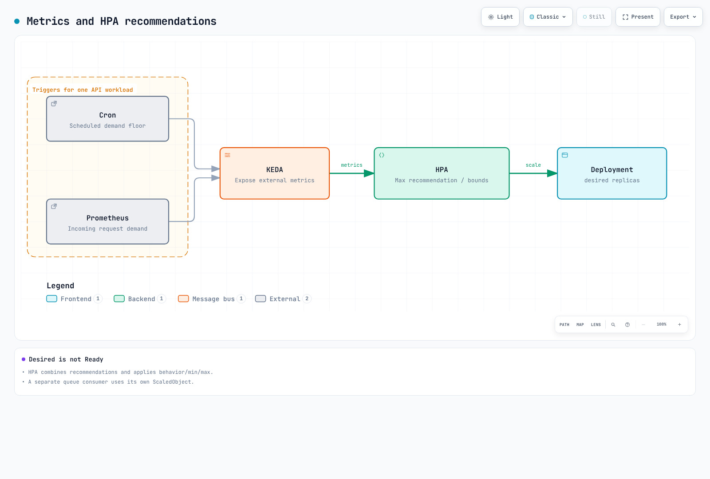

# 活动容量规划操作手册

> **最后更新**：2026 年 9 月 12 日，依据 KEDA 2.20.2 和自主管理 Karpenter AWS provider 1.14.1。
> 数值根据所述假设计算，并非生产基准测试结果。

产品经理/规划人员提供需求、时间、延迟和故障目标。运维验证应用、节点、数据库、网络和队列吞吐量、配额及准备时间。仅活动类型不能保证流量倍数或固定预热时长。按需使用限速、等候室和背压；扩缩容不是唯一过载控制。

## 1. 输入和单位

| 输入 | 验证内容 |
|---|---|
| 峰值 RPM/RPS | 单位、用户行为、缓存命中、重试放大和各 API 需求 |
| 每 Pod 吞吐量 | 使用代表性输入、requests 和并发测得的 SLO 容量 |
| 节点容量 | 实际可分配资源减去 DaemonSet；CPU、内存和 Pod 槽位约束 |
| 故障目标 | 定义 Pod/节点/可用区丢失期间的流量目标 |
| 时间 | IANA 时区、显式 UTC 偏移和实际节点/预留活动区间 |
| 成本 | 价格日期、区域、操作系统、租用方式、闲置预留及其他服务/税费 |

计算器检查取整、单位、预留重复计费和可用区丢失。它假定统一 Pod 规格；单独汇总其他工作负载并验证拓扑、卷和端口约束。增加 30% 容量不同于保留 30% 容量不用。可用区丢失测试覆盖基线峰值需求，不包含同时增加的额外需求。

`scenario.json`

```json
{
  "description": "Illustrative inputs; replace throughput and allocatable values with measured evidence.",
  "peak_rpm": 600000,
  "pod_rpm_at_slo": 3000,
  "extra_capacity_fraction": "0.30",
  "pod_cpu_milli": 1500,
  "pod_memory_mib": 2048,
  "allocatable_cpu_milli": 15500,
  "daemon_cpu_milli": 500,
  "allocatable_memory_mib": 29696,
  "daemon_memory_mib": 1024,
  "max_pods": 58,
  "daemon_pods": 7,
  "nodes_by_az": {"az-a": 15, "az-b": 11},
  "reserved_nodes_by_az": {"az-a": 15, "az-b": 11},
  "node_start": "2026-11-27T11:00:00+09:00",
  "node_end": "2026-11-27T15:00:00+09:00",
  "reservation_start": "2026-11-27T11:00:00+09:00",
  "reservation_end": "2026-11-27T15:00:00+09:00",
  "usd_per_instance_hour": "0.768",
  "price_region": "ap-northeast-2",
  "price_instance_type": "c5.4xlarge",
  "price_observed_date": "2026-09-12",
  "hpa_max_replicas": 300,
  "node_budget": 40,
  "require_one_az_loss": true,
  "other_services_budget_usd": null
}
```

```python
# capacity.py
"""Deterministic planning arithmetic, not a benchmark or AWS provisioning tool."""
import argparse
import json
from datetime import datetime, timezone
from decimal import Decimal, ROUND_CEILING, ROUND_HALF_UP


def number(value, name, minimum=Decimal(0), positive=False):
    if isinstance(value, bool):
        raise ValueError(f"{name}: boolean is not a number")
    result = Decimal(str(value))
    if not result.is_finite() or result < minimum or (positive and result == minimum):
        raise ValueError(f"{name}: invalid finite range")
    return result


def integer(value, name, positive=False):
    result = number(value, name, positive=positive)
    if result != result.to_integral_value():
        raise ValueError(f"{name}: integer required")
    return int(result)


def instant(value):
    result = datetime.fromisoformat(value.replace("Z", "+00:00"))
    if result.tzinfo is None or result.utcoffset() is None:
        raise ValueError("Use timestamps with an explicit UTC offset")
    return result.astimezone(timezone.utc)


def seconds_between(start, end):
    delta = end-start
    return Decimal(delta.days*86400 + delta.seconds) + Decimal(delta.microseconds)/Decimal(1_000_000)


def hours(start, end):
    seconds = seconds_between(start,end)
    if seconds < 60:
        raise ValueError("Planning intervals must be at least 60 seconds")
    return seconds/Decimal(3600)


def ceiling(value):
    return int(value.to_integral_value(rounding=ROUND_CEILING))


def calculate(config):
    if type(config.get("require_one_az_loss",False)) is not bool:
        raise ValueError("require_one_az_loss must be a boolean")
    demand = number(config["peak_rpm"], "peak_rpm", positive=True)
    pod_rate = number(config["pod_rpm_at_slo"], "pod_rpm_at_slo", positive=True)
    margin = number(config["extra_capacity_fraction"], "extra_capacity_fraction")
    pod_cpu = number(config["pod_cpu_milli"], "pod_cpu_milli", positive=True)
    pod_mem = number(config["pod_memory_mib"], "pod_memory_mib", positive=True)
    cpu = number(config["allocatable_cpu_milli"], "allocatable_cpu_milli", positive=True) - number(config["daemon_cpu_milli"], "daemon_cpu_milli")
    memory = number(config["allocatable_memory_mib"], "allocatable_memory_mib", positive=True) - number(config["daemon_memory_mib"], "daemon_memory_mib")
    slots = integer(config["max_pods"], "max_pods", positive=True) - integer(config["daemon_pods"], "daemon_pods")
    if cpu <= 0 or memory <= 0 or slots <= 0:
        raise ValueError("No allocatable application capacity after DaemonSet overhead")
    per_node = min(int(cpu//pod_cpu), int(memory//pod_mem), slots)
    if per_node < 1:
        raise ValueError("The workload cannot fit this node profile")
    base_pods = ceiling(demand/pod_rate)
    planned_pods = ceiling(demand*(Decimal(1)+margin)/pod_rate)
    needed_nodes = ceiling(Decimal(planned_pods)/Decimal(per_node))
    placements = {zone:integer(count, "nodes_by_az") for zone,count in config["nodes_by_az"].items()}
    reservations = {zone:integer(count, "reserved_nodes_by_az") for zone,count in config["reserved_nodes_by_az"].items()}
    if not placements or sum(placements.values()) < 1:
        raise ValueError("Provide at least one planned node")
    nodes = sum(placements.values())
    survivors = nodes-max(placements.values())
    surviving_rpm = Decimal(survivors*per_node)*pod_rate
    start, end = instant(config["node_start"]), instant(config["node_end"])
    reserve_start, reserve_end = instant(config["reservation_start"]), instant(config["reservation_end"])
    node_hours = hours(start,end)
    reservation_hours = hours(reserve_start,reserve_end)
    overlap_start, overlap_end = max(start,reserve_start), min(end,reserve_end)
    overlap = (seconds_between(overlap_start,overlap_end)/Decimal(3600)
               if overlap_end > overlap_start else Decimal(0))
    price = number(config["usd_per_instance_hour"], "usd_per_instance_hour", positive=True)
    # Pay for running instances and unused reserved slots, without double-counting
    # a matching instance occupying a reservation. Assume one instance profile/type.
    running_cost = Decimal(nodes)*node_hours*price
    unused_cost = Decimal(0)
    for zone,reserved in reservations.items():
        used = min(reserved,placements.get(zone,0))
        unused_slot_hours = Decimal(reserved)*reservation_hours-Decimal(used)*overlap
        unused_cost += unused_slot_hours*price
    compute_cost = running_cost+unused_cost
    other = config.get("other_services_budget_usd")
    total = None if other is None else compute_cost+number(other,"other_services_budget_usd")
    findings = []
    if nodes < needed_nodes:
        findings.append("Planned nodes do not satisfy the capacity target")
    if planned_pods > integer(config["hpa_max_replicas"],"hpa_max_replicas",positive=True):
        findings.append("Planned Pod target exceeds the approved HPA maximum")
    if nodes > integer(config["node_budget"],"node_budget",positive=True):
        findings.append("Planned nodes exceed the approved node budget")
    if config.get("require_one_az_loss") and surviving_rpm < demand:
        findings.append("Losing the largest AZ leaves less than the baseline peak demand capacity")
    money = lambda value: format(value.quantize(Decimal("0.01"),rounding=ROUND_HALF_UP),"f")
    return {
        "base_pods":base_pods, "planned_pods_with_extra_capacity":planned_pods,
        "pods_per_node_from_inputs":per_node, "minimum_nodes_for_capacity":needed_nodes,
        "planned_nodes":nodes, "surviving_nodes_after_largest_az_loss":survivors,
        "surviving_rpm":str(surviving_rpm), "node_hours_per_instance":str(node_hours),
        "reservation_hours_per_slot":str(reservation_hours),
        "running_instances_usd":money(running_cost), "unused_reservations_usd":money(unused_cost),
        "ec2_compute_subtotal_usd":money(compute_cost),
        "total_budget_estimate_usd":None if total is None else money(total),
        "findings":findings,
        "assumptions":[
            "Input throughput/allocatable values require workload-specific measurement.",
            "Extra capacity is added once; it is not the same as leaving that fraction unused.",
            "Constant node counts over the interval; matching reservations consumed first within each AZ.",
            "All instances/reservations have the same type/platform/tenancy and supplied hourly rate.",
            "Current public pricing is an estimate for a future event, not a guaranteed charge.",
            "EC2 subtotal excludes EBS, EKS/Auto Mode, networking, load balancers, databases, telemetry and tax.",
            "Capacity and AZ arithmetic do not prove scheduling, recovery or application SLO."
        ]
    }


if __name__ == "__main__":
    parser = argparse.ArgumentParser()
    parser.add_argument("input")
    args = parser.parse_args()
    try:
        with open(args.input,encoding="utf-8") as stream:
            result = calculate(json.load(stream))
    except (ValueError, KeyError, ArithmeticError) as error:
        parser.error(str(error))
    print(json.dumps(result,indent=2))
```

```bash
python3 capacity.py scenario.json
```

示例算出基线 200 个 Pod、加额外容量后 260 个，以及至少 26 个节点。但失去 15/11 节点可用区中较大的一个后，仅剩 11 节点和 330,000 RPM，低于 600,000 RPM 基线峰值。不要忽略发现而批准计划。另一个计算在三个可用区中各放十个节点，同规格下可覆盖基线峰值，但仍需放置和恢复测试。

区分实际消耗预留的实例与闲置槽位。仅硬件匹配不会自动将现有实例附加到定向预留。验证实际 CapacityReservationId/可用数量；计算器关于消耗的假设需要验证。未知的其他服务成本使总预算保持 null。EC2 小计不是整个活动成本。

### 定价证据

2026-09-12，AWS Price List API 返回以下首尔 Linux/共享租用、未预装软件的按需每小时价格。不含合同折扣、Spot 和税费。

| 类型 | vCPU | 内存 | USD/小时 |
|---|---:|---:|---:|
| c5.2xlarge | 8 | 16 GiB | 0.384 |
| c5.4xlarge | 16 | 32 GiB | 0.768 |
| c6i.4xlarge | 16 | 32 GiB | 0.768 |
| m5.4xlarge | 16 | 64 GiB | 0.944 |

示意的 26 节点/四小时 c5.4xlarge 小计为 $79.87。原先 $70.72 估算使用了错误的首尔价格 $0.68/小时。如果相同预留比节点提前三十天激活，包含闲置槽位的示意小计为 $14,456.83。这些是计算，不是实际账单。活动前重新检查价格和激活时间。包含 EBS、EKS/Auto Mode、负载均衡、NAT/传输、数据库、遥测，并区分基线和增量成本。

## 2. 职责和前提条件

EC2NodeClass/NodePool 示例使用自主管理 Karpenter。Auto Mode 使用 eks.amazonaws.com NodeClass；不要复制相同 YAML。当前 Auto Mode NodeClass 也支持 capacityReservationSelectorTerms，因此不要假定不支持预留。单独检查该服务的选择器、权限和支持范围。

基线安装和 Operator IRSA 参阅[扩缩容章节](./06-scaling-strategies.md)。先准备应用 Deployment、ecommerce 命名空间、Prometheus 和指标约定。此身份验证使用 Operator 身份；不创建 IAM 角色。

```yaml
# trigger-auth.yaml
apiVersion: keda.sh/v1alpha1
kind: TriggerAuthentication
metadata:
  name: event-aws
  namespace: ecommerce
spec:
  podIdentity:
    provider: aws
    identityOwner: keda
```

`operator-read-policy.json`

```json
{
  "Version": "2012-10-17",
  "Statement": [
    {
      "Effect": "Allow",
      "Action": ["sqs:GetQueueAttributes"],
      "Resource": "arn:aws:sqs:ap-northeast-2:123456789012:order-processing"
    },
    {
      "Effect": "Allow",
      "Action": ["cloudwatch:GetMetricData"],
      "Resource": "*",
      "Condition": {
        "StringEquals": {
          "aws:RequestedRegion": "ap-northeast-2"
        }
      }
    }
  ]
}
```

替换账户/队列 ARN 值，并将所需读取权限附加到 Operator 角色。CloudWatch GetMetricData 使用请求区域条件，而非资源级限定。此策略不授予工作进程 ReceiveMessage/DeleteMessage 权限。共享安装还应控制谁能创建 ScaledObject 和 TriggerAuthentication。

## 3. KEDA：每个工作负载一个所有者

不要将多个 ScaledObject/HPA 附加到同一 Deployment。这些示例针对三个不同工作负载：order-api、order-worker 和 frontend。保留基线指标自动扩缩容，并在活动后移除/更新活动 Cron。

不要仅根据已完成订单扩缩 API：饱和时完成量可能停滞或下降，错误地建议缩容。将入站请求、积压和等待时间与实际容量关联。下文假定应用具有 http_requests_total 计数器和 namespace/service 抓取标签。不要假定标准 NGINX 导出器自动提供路径/页面访问指标。此 Prometheus 为单集群；共享后端需添加集群范围限定。

```yaml
# prometheus-rule.yaml
apiVersion: monitoring.coreos.com/v1
kind: PrometheusRule
metadata:
  name: event-demand
  namespace: observability
  labels:
    release: prometheus
spec:
  groups:
  - name: event-demand
    rules:
    - record: event:incoming_requests_per_minute:rate1m
      expr: sum by (namespace, service) (rate(http_requests_total{namespace="ecommerce",service="order-api"}[1m]))
        * 60
    - record: event:order_api_error_ratio:rate5m
      expr: (sum by (namespace, service) (rate(http_requests_total{namespace="ecommerce",service="order-api",status=~"5.."}[5m]))
        or 0 * sum by (namespace, service) (rate(http_requests_total{namespace="ecommerce",service="order-api"}[5m])))
        / (sum by (namespace, service) (rate(http_requests_total{namespace="ecommerce",service="order-api"}[5m]))
        > 0)
```

```yaml
# order-api-scaledobject.yaml
apiVersion: keda.sh/v1alpha1
kind: ScaledObject
metadata:
  name: order-api
  namespace: ecommerce
  labels:
    event: flash-sale-2026-11
spec:
  scaleTargetRef:
    name: order-api
  minReplicaCount: 5
  maxReplicaCount: 300
  pollingInterval: 15
  advanced:
    horizontalPodAutoscalerConfig:
      behavior:
        scaleUp:
          stabilizationWindowSeconds: 0
          policies:
          - type: Percent
            value: 100
            periodSeconds: 15
        scaleDown:
          stabilizationWindowSeconds: 600
          policies:
          - type: Percent
            value: 10
            periodSeconds: 120
  triggers:
  - type: cron
    metricType: AverageValue
    metadata:
      timezone: Asia/Seoul
      start: 0 11 27 11 *
      end: 0 15 27 11 *
      desiredReplicas: '260'
  - type: prometheus
    metricType: AverageValue
    metadata:
      serverAddress: http://prometheus-kube-prometheus-prometheus.observability.svc:9090
      query: event:incoming_requests_per_minute:rate1m{namespace="ecommerce",service="order-api"}
      threshold: '3000'
      ignoreNullValues: 'false'
```

阈值 3,000 是每 Pod 每分钟请求数，匹配示意吞吐量单位。用负载测试证据替换。查询必须返回一个值。ignoreNullValues=false 避免将缺失观测隐藏为零需求。在生产环境之外测试 HPA 错误/缺失数据行为和人工响应。

Cron 使用五个 Linux 字段，没有年份字段。保留 11 月 27 日示例会使其明年重复执行。一次性活动后，从 Git 移除活动配置。IANA 时区遵循夏令时：五月的纽约是 EDT，不是 EST。测试边界、重叠窗口和有歧义的夏令时时间。

HPA 对各指标建议取最大值，再应用最小/最大值和行为约束。Cron 提供需求下限，不保证 Pod 就绪。上限来自 maxReplicaCount 和其他限制，不来自其他指标。策略或容量约束可延迟达到目标。



[打开交互式图表](https://www.atomai.click/kubernetes-docs/archmaps/en-ops-12-event-capacity-planning-1.html)

minReplicaCount 大于零时，cooldownPeriod 不是返回基线前的通用延迟。区分 KEDA 激活/缩至零与 HPA 的 1→N 循环，以及各自轮询/同步/缓存间隔。Percent/periodSeconds 是滚动窗口变化限制，不是精确重复定时器。稳定化并非简单固定休眠后执行一次操作。

### SQS 工作进程

queueLength 是每 Pod 目标积压量，不承诺每个 Pod 恰好处理十条消息。根据处理时间、并发和允许等待时间选择，并监控最旧消息年龄、死信队列和重试。此示例包括可见及处理中消息，但排除延迟消息；计数为近似值。单独实现可见性超时、幂等性及关闭/确认行为。

```yaml
# worker-scaledobject.yaml
apiVersion: keda.sh/v1alpha1
kind: ScaledObject
metadata:
  name: order-worker
  namespace: ecommerce
  labels:
    event: flash-sale-2026-11
spec:
  scaleTargetRef:
    name: order-worker
  minReplicaCount: 2
  maxReplicaCount: 100
  pollingInterval: 15
  advanced:
    horizontalPodAutoscalerConfig:
      behavior:
        scaleUp:
          stabilizationWindowSeconds: 0
          policies:
          - type: Percent
            value: 100
            periodSeconds: 15
        scaleDown:
          stabilizationWindowSeconds: 600
          policies:
          - type: Percent
            value: 10
            periodSeconds: 120
  triggers:
  - type: aws-sqs-queue
    metricType: AverageValue
    metadata:
      queueURL: https://sqs.ap-northeast-2.amazonaws.com/123456789012/order-processing
      awsRegion: ap-northeast-2
      queueLength: '10'
      activationQueueLength: '1'
      scaleOnInFlight: 'true'
      scaleOnDelayed: 'false'
    authenticationRef:
      name: event-aws
```

### CloudWatch 前端

RequestCount 是应用发布的请求计数/增量；60 秒上的 Sum 得到该周期请求数。不要对重复发布的每分钟速率 gauge 或累计计数器求和。KEDA 2.20.2 使用 metricStat，不是 metricStatType。minMetricValue 是 NoData 回退值，不是激活阈值。ignoreNullValues=false 优先。验证采集时间、结束偏移和发布延迟。

```yaml
# frontend-scaledobject.yaml
apiVersion: keda.sh/v1alpha1
kind: ScaledObject
metadata:
  name: frontend
  namespace: ecommerce
  labels:
    event: flash-sale-2026-11
spec:
  scaleTargetRef:
    name: frontend
  minReplicaCount: 3
  maxReplicaCount: 100
  triggers:
  - type: aws-cloudwatch
    metricType: AverageValue
    metadata:
      namespace: ECommerce/Frontend
      dimensionName: Service
      dimensionValue: frontend
      metricName: RequestCount
      metricStat: Sum
      metricStatPeriod: '60'
      metricCollectionTime: '180'
      metricEndTimeOffset: '60'
      metricUnit: Count
      targetMetricValue: '3000'
      activationTargetMetricValue: '0'
      minMetricValue: '0'
      ignoreNullValues: 'false'
      awsRegion: ap-northeast-2
    authenticationRef:
      name: event-aws
```

## 4. 动态与静态预先预置

仅 NodePool weight 和 limits 不会创建预热节点。动态池响应 Pod 调度需求。基线方法是预先扩展实际应用并验证初始化。自主管理 Karpenter 也通过 spec.replicas 支持静态 NodePool。这不同于 EC2 Auto Scaling 的已停止实例 Warm Pool。

此 NodeClass 用于自主管理 Karpenter。设置真实 IAM 角色、子网/安全组标签和集群版本。别名固定到通过首尔 EKS 1.36 AL2023 x86_64 公共 SSM 参数验证的发布版本。其他 Kubernetes 版本/架构应重新检查兼容性。明确决定预留缺失或耗尽时是否允许回退。

```yaml
# nodeclass.yaml
apiVersion: karpenter.k8s.aws/v1
kind: EC2NodeClass
metadata:
  name: event-nodes
spec:
  role: KarpenterNodeRole-my-cluster
  amiSelectorTerms:
  - alias: al2023@v20260903
  subnetSelectorTerms:
  - tags:
      karpenter.sh/discovery: my-cluster
  securityGroupSelectorTerms:
  - tags:
      karpenter.sh/discovery: my-cluster
  capacityReservationSelectorTerms:
  - tags:
      event: flash-sale-2026-11
  blockDeviceMappings:
  - deviceName: /dev/xvda
    ebs:
      volumeSize: 100Gi
      volumeType: gp3
      encrypted: true
  tags:
    event: flash-sale-2026-11
```

### 选项 A：动态池与实际应用预扩容

reserved 指 ODCR/容量块容量，不是 Reserved Instance 折扣。Karpenter 在允许的类型中优先使用预留容量，再回退到允许的替代类型。此示例排除 Spot，但按需不保证服务正常运行时间或新容量可用性。weight 表示兼容动态池之间的预置偏好，不是强制放置到现有节点。

```yaml
# dynamic-nodepool.yaml
apiVersion: karpenter.sh/v1
kind: NodePool
metadata:
  name: event-dynamic
spec:
  template:
    metadata:
      labels:
        event: flash-sale-2026-11
    spec:
      nodeClassRef:
        group: karpenter.k8s.aws
        kind: EC2NodeClass
        name: event-nodes
      taints:
      - key: event
        value: flash-sale-2026-11
        effect: NoSchedule
      requirements:
      - key: kubernetes.io/arch
        operator: In
        values:
        - amd64
      - key: karpenter.sh/capacity-type
        operator: In
        values:
        - reserved
        - on-demand
      - key: node.kubernetes.io/instance-type
        operator: In
        values:
        - c5.4xlarge
  limits:
    cpu: '640'
  weight: 100
  disruption:
    consolidationPolicy: WhenEmptyOrUnderutilized
    consolidateAfter: 10m
```

匹配节点/Pod 活动标签、选择器、污点和容忍。此处是现有 Deployment 的放置补丁，不是完整独立清单。命名空间标签不会自动创建 Pod 标签或 EC2 计费标签。更改在线工作负载选择器会改变滚动发布/放置；先验证就绪容量和 PDB。

```yaml
# workload-placement-patch.yaml
spec:
  template:
    metadata:
      labels:
        event: flash-sale-2026-11
    spec:
      nodeSelector:
        event: flash-sale-2026-11
      tolerations:
      - key: event
        operator: Equal
        value: flash-sale-2026-11
        effect: NoSchedule
```

### 选项 B：静态池

这是替代方案，不是无意添加到选项 A 上。replicas=0 定义静态池但不创建节点；在获准时间提高数量。一旦设置，不能通过移除 spec.replicas 切换为动态模式。静态池不能使用 weight，且仅支持 limits.nodes。它们不会被整合；扩缩操作绕过 NodePool 中断预算，但遵守 PDB。一个允许多个可用区的池不保证均衡放置，因此此示例分离可用区。

```yaml
# static-nodepools.yaml
apiVersion: karpenter.sh/v1
kind: NodePool
metadata:
  name: event-static-a
spec:
  replicas: 0
  template:
    metadata:
      labels:
        event: flash-sale-2026-11
    spec:
      nodeClassRef:
        group: karpenter.k8s.aws
        kind: EC2NodeClass
        name: event-nodes
      taints:
      - key: event
        value: flash-sale-2026-11
        effect: NoSchedule
      requirements:
      - key: kubernetes.io/arch
        operator: In
        values:
        - amd64
      - key: karpenter.sh/capacity-type
        operator: In
        values:
        - reserved
        - on-demand
      - key: node.kubernetes.io/instance-type
        operator: In
        values:
        - c5.4xlarge
      - key: topology.kubernetes.io/zone
        operator: In
        values:
        - ap-northeast-2a
  limits:
    nodes: 12
---
apiVersion: karpenter.sh/v1
kind: NodePool
metadata:
  name: event-static-b
spec:
  replicas: 0
  template:
    metadata:
      labels:
        event: flash-sale-2026-11
    spec:
      nodeClassRef:
        group: karpenter.k8s.aws
        kind: EC2NodeClass
        name: event-nodes
      taints:
      - key: event
        value: flash-sale-2026-11
        effect: NoSchedule
      requirements:
      - key: kubernetes.io/arch
        operator: In
        values:
        - amd64
      - key: karpenter.sh/capacity-type
        operator: In
        values:
        - reserved
        - on-demand
      - key: node.kubernetes.io/instance-type
        operator: In
        values:
        - c5.4xlarge
      - key: topology.kubernetes.io/zone
        operator: In
        values:
        - ap-northeast-2b
  limits:
    nodes: 12
---
apiVersion: karpenter.sh/v1
kind: NodePool
metadata:
  name: event-static-c
spec:
  replicas: 0
  template:
    metadata:
      labels:
        event: flash-sale-2026-11
    spec:
      nodeClassRef:
        group: karpenter.k8s.aws
        kind: EC2NodeClass
        name: event-nodes
      taints:
      - key: event
        value: flash-sale-2026-11
        effect: NoSchedule
      requirements:
      - key: kubernetes.io/arch
        operator: In
        values:
        - amd64
      - key: karpenter.sh/capacity-type
        operator: In
        values:
        - reserved
        - on-demand
      - key: node.kubernetes.io/instance-type
        operator: In
        values:
        - c5.4xlarge
      - key: topology.kubernetes.io/zone
        operator: In
        values:
        - ap-northeast-2c
  limits:
    nodes: 12
```

```bash
# Example only after approval of matching capacity and cost:
DOCS_CONTEXT="my-event-cluster"
kubectl --context "$DOCS_CONTEXT" scale nodepool event-static-a --replicas=10
kubectl --context "$DOCS_CONTEXT" scale nodepool event-static-b --replicas=10
kubectl --context "$DOCS_CONTEXT" scale nodepool event-static-c --replicas=10
```

若 replicas 由 GitOps 管理，也更新其期望状态。启用放置和活动扩缩容前，验证静态 Node Ready。不要将在线工作负载移到零副本容量，也不要在准备前激活 Cron。将提前准备时间计入 node_start/reservation_start 成本输入。

### 使用占位 Pod 时

低优先级 Pod 可成为抢占对象，但不保证即时放置/就绪。保持其 Deployment 期望数量不变，可能重新创建被抢占的占位 Pod 并预置额外节点。审核节点保留/到期和交接，移除占位需求，再验证应用就绪。检查过大 requests、缺失选择器及与基线自动扩缩器的冲突。


[打开交互式图表](https://www.atomai.click/kubernetes-docs/archmaps/en-ops-12-event-capacity-planning-0.html)

## 5. Capacity Reservations：容量和计费

targeted 要求显式指定预留；它不是只限一个 NodePool 的安全 ACL。验证账户/共享权限、可用区、类型、平台、租用方式和成功激活。检查选择器、status.capacityReservations 和实例实际 CapacityReservationId。预留容量不保证应用就绪、SLO 或无故障执行。

以下 Terraform 创建即时预留。未来 end_date 不意味着未来开始。在 D-30 应用可能于活动前产生闲置费用。未来日期预留有独立资格、承诺和开始时间规则。根据获准容量和预算计划设置 az_counts。

```hcl
# reservations/main.tf
terraform {
  required_version = ">= 1.15.0, < 2.0.0"
  required_providers {
    aws = {
      source  = "hashicorp/aws"
      version = "6.64.0"
    }
  }
}

provider "aws" {
  region = var.region
}

variable "region" {
  type    = string
  default = "ap-northeast-2"
}

variable "event" {
  type    = string
  default = "flash-sale-2026-11"
}

variable "instance_type" {
  type    = string
  default = "c5.4xlarge"
}

variable "az_counts" {
  type        = map(number)
  description = "Approved matching capacity per Availability Zone in this AWS account."
  validation {
    condition = length(var.az_counts) > 0 && alltrue([
      for count in values(var.az_counts) : count > 0 && floor(count) == count
    ])
    error_message = "Provide positive integer reservation counts."
  }
}

variable "reservation_end_utc" {
  type        = string
  description = "RFC3339 expiration. This resource creates an immediate reservation, not a future-dated request."
  validation {
    condition     = can(timecmp(var.reservation_end_utc, plantimestamp())) && try(timecmp(var.reservation_end_utc, plantimestamp()) > 0, false)
    error_message = "The expiration must be a valid future RFC3339 timestamp."
  }
}

resource "aws_ec2_capacity_reservation" "event" {
  for_each                = var.az_counts
  instance_type           = var.instance_type
  instance_platform       = "Linux/UNIX"
  tenancy                 = "default"
  availability_zone       = each.key
  instance_count          = each.value
  instance_match_criteria = "targeted"
  end_date_type           = "limited"
  end_date                = var.reservation_end_utc
  tags = {
    Name  = "${var.event}-${each.key}"
    event = var.event
  }
}

output "reservation_ids" {
  value = { for zone, reservation in aws_ec2_capacity_reservation.event : zone => reservation.id }
}
```

```json
{
  "az_counts": {
    "ap-northeast-2a": 10,
    "ap-northeast-2b": 10,
    "ap-northeast-2c": 10
  },
  "reservation_end_utc": "2026-11-27T06:00:00Z"
}
```

这些是示例输入。保存 reservations/approved-event.tfvars.json 前，确认账户可用区、容量和到期时间。15:00 KST 是 06:00 UTC。不要使用已过去的到期日期或不带偏移的时间戳。将计划审核与实际创建时间分开。

```bash
terraform -chdir=reservations init
terraform -chdir=reservations plan -var-file=approved-event.tfvars.json -out=event.tfplan
terraform -chdir=reservations show event.tfplan
```

不要在实例费用之外对已占用预留槽位再次收费。闲置槽位可按等效按需价格计费。检查即时/未来预留的计费开始、最小计费单位和适用折扣。取消/到期不会自动终止运行中的 EC2 实例。清理时分别验证节点、卷和预留。

## 6. 启动时间和镜像

分别测量 KEDA 轮询、HPA 同步、控制器协调、EC2 容量/引导、CNI、卷附加、镜像拉取和应用预热。在下方流程中区分期望与 Ready 数量。节点数并非普遍等于 Pod 数除以十。


[打开交互式图表](https://www.atomai.click/kubernetes-docs/archmaps/en-ops-12-event-capacity-planning-2.html)

预先扩展真实应用副本可验证初始化和依赖负载，而不只是镜像拉取。通用缓存 DaemonSet 若在任意应用镜像中运行 sh -c echo cached，会在 distroless 等无 shell 镜像上失败。使用缓存工具时，验证受支持的无害命令、仓库权限、架构、匹配摘要和节点选择器。镜像 GC、节点替换和拉取策略意味着缓存不保证永久保留，也不消除所有拉取。不要承诺零冷启动。

## 7. 操作手册

| 阶段 | 完成标准 |
|---|---|
| 规划 | 需求、SLO、故障目标、依赖、预算、配额和预留可行性 |
| 非生产测试 | 代表性负载、故障/恢复、启动分布和缺失指标 |
| 准备 | 渲染/验证固定设置，记录 GitOps 所有权和基线恢复值 |
| 激活 | 在获准计费窗口准备容量；验证节点、放置、应用就绪和 SLO |
| 活动 | 观察期望/可用数量、错误、延迟、积压年龄、约束和成本 |
| 完成 | 恢复 Cron/下限，排空积压/会话/任务，并验证实际节点/预留 |

渲染、模式和服务器试运行不测试真实 EC2 可用性或应用预热。实际预扩容测试可创建资源并产生费用，应在独立非生产测试中进行。更改前设置并验证实际上下文和区域。

```bash
DOCS_CONTEXT="my-event-cluster"
DOCS_REGION="ap-northeast-2"
kubectl --context "$DOCS_CONTEXT" -n ecommerce get scaledobjects
kubectl --context "$DOCS_CONTEXT" get nodes -l event=flash-sale-2026-11 -o wide
kubectl --context "$DOCS_CONTEXT" -n ecommerce get deployment order-api
DOCS_HPA=$(kubectl --context "$DOCS_CONTEXT" -n ecommerce get scaledobject order-api \
  -o jsonpath='{.status.hpaName}')
test -n "$DOCS_HPA" || exit 1
kubectl --context "$DOCS_CONTEXT" -n ecommerce get hpa "$DOCS_HPA"
```

直接扩缩 Deployment 或修改 KEDA 管理的 HPA 可能被协调覆盖。不要假定 HPA 与 Deployment 同名。必要时，在获准最大值内临时提高 ScaledObject minReplicaCount，记录并恢复原值；由 GitOps 管理时更新 Git。不要默认使用盲目创建池或提高上限的紧急脚本。

```bash
# Example only after checking the current maximum and change ownership:
kubectl --context "$DOCS_CONTEXT" -n ecommerce patch scaledobject order-api \
  --type merge -p '{"spec":{"minReplicaCount":260}}'
```

活动后恢复 Cron/临时下限，同时保留基线指标触发器。删除 ScaledObject 不会自动恢复原始副本数。删除 NodePool 可终止关联节点；不要通过定时删除或 terraform destroy -target 自动清理。对于静态池，安全迁移工作负载，将期望数量降至零并确认实际终止。分别检查 PDB、长任务、会话、预留、卷和费用。

## 8. 观察和活动后分析

对相同工作负载范围比较需求、Deployment 期望/可用数量、HPA 建议、错误率和延迟。目标指标不是目标 Pod 数；统计 Running 阶段 gauge 序列不是统计 Ready Pod。

```promql
max(kube_deployment_spec_replicas{namespace="ecommerce",deployment="order-api"})
```

```promql
max(kube_deployment_status_replicas_available{namespace="ecommerce",deployment="order-api"})
```

```promql
event:incoming_requests_per_minute:rate1m{namespace="ecommerce",service="order-api"} / 60
```

```promql
event:order_api_error_ratio:rate5m{namespace="ecommerce",service="order-api"}
```

采集多个集群时包含集群标签。验证 SQS、CloudWatch 和成本数据的实际导出器指标/标签名。不要假定 node_cost_hourly 等未定义指标存在。OpenCost/Kubecost API 和成本范围参阅 [FinOps 章节](./13-finops-cost-platform.md)。检查 GET API 是否要求 curl -G 与 --data-urlencode 配合。预置完整仪表板 JSON 正文，不是 API 包装层或部分面板。

记录预测/实测值、窗口/样本数、请求与已完成订单、期望与可用数量、依赖瓶颈、实际节点/预留区间和成本范围。不要将假设收入/成本当作实测结果。按需可避免 Spot 容量回收风险，但不消除所有故障。针对 Spot 测试中断、通知限制、重试和恢复；不要仅根据固定节省百分比或活动时长决策。

验证使用 Decimal 计算、固定模式/元数据、Cron 边界/时区、Terraform 模拟和图表。未测试真实活动负载、EC2 可用性、SQS 处理或计费。

## 官方参考资料

- [KEDA Cron](https://keda.sh/docs/2.20/scalers/cron/)
- [KEDA ScaledObject](https://keda.sh/docs/2.20/reference/scaledobject-spec/)
- [KEDA CloudWatch](https://keda.sh/docs/2.20/scalers/aws-cloudwatch/)
- [KEDA SQS](https://keda.sh/docs/2.20/scalers/aws-sqs/)
- [Karpenter NodePool](https://karpenter.sh/docs/concepts/nodepools/)
- [Karpenter NodeClass](https://karpenter.sh/docs/concepts/nodeclasses/)
- [Auto Mode NodeClass](https://docs.aws.amazon.com/eks/latest/userguide/create-node-class.html)
- [容量预留](https://docs.aws.amazon.com/AWSEC2/latest/UserGuide/ec2-capacity-reservations.html)
- [预留计费](https://docs.aws.amazon.com/AWSEC2/latest/UserGuide/capacity-reservations-pricing-billing.html)
- [AWS Price List API](https://docs.aws.amazon.com/awsaccountbilling/latest/aboutv2/price-changes.html)

---

< [上一篇：EKS 升级](./11-upgrade-operations.md) | [目录](./README.md) | [下一篇：FinOps](./13-finops-cost-platform.md) >
