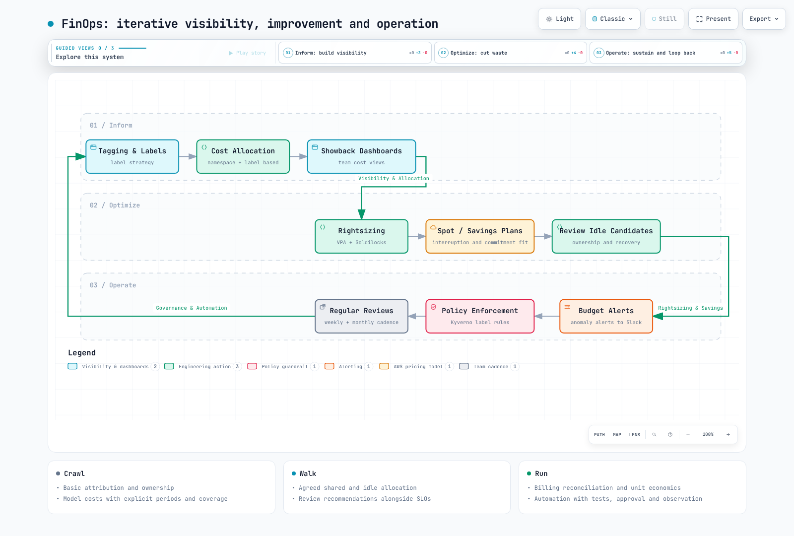

# FinOps 成本可见性平台

> **最后更新**：2026 年 9 月 12 日。OpenCost 1.121.2 / chart 2.5.31、Kubecost 3.2.4、Kyverno 1.19.1。
> **验证**：Helm 渲染、Kubernetes 模式、Terraform 模拟提供程序、本地成本计算和策略评估。这不代表已在生产集群安装，也不代表已与实际 AWS 账单核对。

< [上一篇：活动容量规划](./12-event-capacity-planning.md) | [目录](./README.md) | [下一篇：Tekton 流水线](./14-tekton-pipelines.md) >

## 概述

FinOps 让工程、财务、产品和业务团队共同管理技术支出的价值。仅降低成本不是成功标准：服务水平、增长、单位经济效益和可靠归属同样重要。

本章区分 Kubernetes 分摊模型、AWS 计费数据和团队预算，再将它们连接。部署前替换示例集群名、命名空间、桶和 IAM 角色。安装命令会创建真实资源；本文报告的验证在本地进行。

## 1. FinOps 运营模型

Inform 阶段涵盖数据采集、分摊和可见性。Optimize 阶段将测量转化为改进。Operate 阶段持续维护所有权、预算和审查。这些阶段循环进行。



[查看交互式图表](https://www.atomai.click/kubernetes-docs/archmaps/en-ops-13-finops-cost-platform-0.html)

| 角色 | 职责 |
| --- | --- |
| 平台 | 可靠采集、成本数据访问控制、升级 |
| 服务团队 | 标签、资源 requests、性能测试、变更审查 |
| 财务 / FinOps | 账单核对、共享成本规则、预算和预测 |
| 产品 / 业务 | 单位经济效益、价值和投资优先级 |

Crawl/Walk/Run 描述特定领域的能力。它们不是通用的 1–3 或 6–12 个月时间表。在自动内部计费或删除前，先建立数据质量和所有权。

## 2. 成本数据和安装

### 2.1 区分测量口径

| 测量 | 含义 | 限制 |
| --- | --- | --- |
| 当前分摊费率，USD/小时 | 当前分摊和定价模型 | 不是实际月支出 |
| 时间窗口内分摊模型成本 | 明确时段内的 Kubernetes 归属 | 取决于覆盖、保留期和模型 |
| CUR 2.0 / Cost Explorer | 基于 AWS 计费的成本 | 刷新延迟、折扣、抵扣、税费及摊销选择 |
| 线性月末估算 | 截至目前成本 / 已完成天数 × 当月天数 | 不模拟季节性或变化需求 |

EC2 CPU 和内存通常不是独立计费产品。OpenCost 的每核和每 GiB 价格用于分摊实例成本。不要将任意 CPU/RAM 价格或第二次统一合同折扣当作账单。对同一基础设施将 Cloud Cost 总额与 Allocation 总额相加，可能重复统计支出。

### 2.2 安装 OpenCost

此处假定已有[可观测性技术栈](./09-observability-stack.md)中的 Prometheus Operator 和 ServiceMonitor CRD，以及合适的 `gp3` StorageClass。EKS 存储可使用 EBS CSI 驱动或 Auto Mode 的 StorageClass 配置。示例 `release: prometheus` 必须匹配实际 Prometheus ServiceMonitor 选择器。

之前的七天 Prometheus 保留期无法重建完整月份。月度分析需要足够保留期和存储。延长保留期不能恢复已删除数据。下方 exporter PVC 不替代 Prometheus 存储。

**`opencost-values.yaml`**

```yaml
serviceAccount:
  create: true
  name: opencost
opencost:
  mcp:
    enabled: false
  exporter:
    defaultClusterId: eks-production
    resources:
      requests:
        cpu: 100m
        memory: 256Mi
      limits:
        memory: 2Gi
    persistence:
      enabled: true
      accessMode: ReadWriteOnce
      storageClass: gp3
      size: 10Gi
  prometheus:
    internal:
      enabled: true
      serviceName: prometheus-kube-prometheus-prometheus
      namespaceName: observability
      port: 9090
    external:
      enabled: false
  metrics:
    serviceMonitor:
      enabled: true
      namespace: opencost
      additionalLabels:
        release: prometheus
      honorLabels: true
  customPricing:
    enabled: false
  cloudCost:
    enabled: false
  ui:
    enabled: true
    ingress:
      enabled: false
```

```bash
helm repo add opencost https://opencost.github.io/opencost-helm-chart
helm repo update opencost
helm upgrade --install opencost opencost/opencost \
  --version 2.5.31 --namespace opencost --create-namespace \
  -f opencost-values.yaml --wait --timeout 10m
kubectl -n opencost get pods,pvc,svc,servicemonitor
kubectl -n opencost port-forward service/opencost 9090:9090 9003:9003
```

本地 UI 使用端口 `9090`；API 使用 `9003`。`opencost.prometheus` 和 `opencost.cloudCost` 不属于 exporter 的子项。Chart 2.5.31 默认启用 MCP，因此本基线显式禁用。若通过 MCP 暴露成本工具，应单独设计身份验证和访问范围；成本数据 MCP 不同于文档搜索 MCP。

### 2.3 选择 Kubecost 3.x

Kubecost 是独立产品和部署选择。3.x 使用 ClickHouse 存储和 `finops-agent` 采集。不要原样复制 2.x `kubecostModel`、Prometheus 或 ETL 设置。现有 2.x 安装需要官方迁移流程，包括中间代理、重新导入和功能约束。

当前 chart 仓库为 `https://kubecost.github.io/kubecost/`。这是功能受限的安装基线，显式禁用 Cluster Controller、Admission Controller 和预测。不要将其作为现有安装和存储的原地替换命令。

**`kubecost-values.yaml`**

```yaml
global:
  clusterId: eks-production
  defaultStorageClass: gp3
frontend:
  enabled: true
  service:
    type: ClusterIP
localStore:
  enabled: true
  persistentVolume:
    enabled: true
    size: 32Gi
    storageClass: gp3
finopsagent:
  enabled: true
aggregator:
  enabled: true
cloudCost:
  enabled: false
networkCosts:
  enabled: false
clusterController:
  enabled: false
kubecostAdmissionController:
  enabled: false
forecasting:
  enabled: false
ingress:
  enabled: false
telemetry:
  enabled: false
```

```bash
helm repo add kubecost https://kubecost.github.io/kubecost/
helm repo update kubecost
helm template kubecost kubecost/kubecost --version 3.2.4 \
  --namespace kubecost -f kubecost-values.yaml > kubecost-rendered.yaml
# Review storage, RBAC, images and product entitlements before installation.
helm install kubecost kubecost/kubecost --version 3.2.4 \
  --namespace kubecost --create-namespace -f kubecost-values.yaml
```

检查 SSO、细粒度 RBAC 和多集群功能的产品许可。存在 SAML/OIDC values 不会为每个部署启用这些功能。`global.acknowledged` 关乎 Enterprise 主版本升级确认，不是一般许可接受。内部 ALB 不验证用户身份。

### 2.4 CUR 2.0、Athena 和 OpenCost Cloud Cost

以下 Terraform 定义**新的 CUR 2.0 导出、两个 S3 桶、一个 Athena 工作组和一个 OpenCost IRSA 角色**。管理现有资源前检查所有权和导入。组织范围计费数据需要适当管理账户权限。

不包含 Glue 爬网程序和表创建。遵循 Data Exports Athena 处理流程：等待首次交付，再使用导出的**数据目录**创建和刷新 Glue 表及分区。不要将清单和元数据与数据表混合。提供生成的数据库和表名。Lake Formation 保护需要额外授权。

`COST_AND_USAGE_REPORT` 是 Data Exports SQL 源，不是通用 Athena Glue 表名。检查生成模式：CUR 2.0 使用 `billing_period` 分区，不应假定旧 CUR 的 `year`/`month` 布局。

Data Exports 使用 SSE-S3 交付。不要复制要求直接 KMS 加密交付的配置。若要求 KMS，应同时设计文档规定的交付后加密流程和使用方权限。需要还原的归档存储可能破坏对活动数据的查询。

**`cur.tf`**

```hcl
terraform {
  required_version = ">= 1.12.0"
  required_providers {
    aws = {
      source  = "hashicorp/aws"
      version = "= 6.64.0"
    }
  }
}

provider "aws" {
  region = var.region
}

provider "aws" {
  alias  = "billing"
  region = "us-east-1"
}

variable "region" {
  type    = string
  default = "ap-northeast-2"
}

variable "cur_bucket" {
  type = string
}

variable "results_bucket" {
  type = string
  validation {
    condition     = var.results_bucket != var.cur_bucket
    error_message = "Use separate CUR source and Athena result buckets."
  }
}

variable "oidc_provider_arn" {
  type = string
}

variable "oidc_issuer" {
  type = string
}

variable "glue_database" {
  type = string
}

variable "glue_table" {
  type = string
}

data "aws_caller_identity" "current" {}
data "aws_partition" "current" {}

locals {
  account = data.aws_caller_identity.current.account_id
  arn     = "arn:${data.aws_partition.current.partition}"
  issuer  = trimprefix(trimsuffix(var.oidc_issuer, "/"), "https://")
  buckets = { cur = var.cur_bucket, results = var.results_bucket }
}

resource "aws_s3_bucket" "cost" {
  for_each      = local.buckets
  bucket        = each.value
  force_destroy = false
}

resource "aws_s3_bucket_public_access_block" "cost" {
  for_each                = aws_s3_bucket.cost
  bucket                  = each.value.id
  block_public_acls       = true
  block_public_policy     = true
  ignore_public_acls      = true
  restrict_public_buckets = true
}

resource "aws_s3_bucket_ownership_controls" "cost" {
  for_each = aws_s3_bucket.cost
  bucket   = each.value.id
  rule {
    object_ownership = "BucketOwnerEnforced"
  }
}

resource "aws_s3_bucket_server_side_encryption_configuration" "cost" {
  for_each = aws_s3_bucket.cost
  bucket   = each.value.id
  rule {
    apply_server_side_encryption_by_default {
      sse_algorithm = "AES256"
    }
  }
}

resource "aws_s3_bucket_policy" "delivery" {
  bucket = aws_s3_bucket.cost["cur"].id
  policy = jsonencode({
    Version = "2012-10-17"
    Statement = [{
      Sid       = "AllowDataExports"
      Effect    = "Allow"
      Principal = { Service = "bcm-data-exports.amazonaws.com" }
      Action    = "s3:PutObject"
      Resource  = "${aws_s3_bucket.cost["cur"].arn}/cur/*"
      Condition = {
        StringEquals = { "aws:SourceAccount" = local.account }
        ArnLike = {
          "aws:SourceArn" = "${local.arn}:bcm-data-exports:us-east-1:${local.account}:export/*"
        }
      }
    }]
  })
}

resource "aws_bcmdataexports_export" "cur" {
  provider = aws.billing
  depends_on = [
    aws_s3_bucket_policy.delivery,
    aws_s3_bucket_public_access_block.cost,
    aws_s3_bucket_server_side_encryption_configuration.cost
  ]
  export {
    name = "opencost-cur"
    data_query {
      query_statement = "SELECT * FROM COST_AND_USAGE_REPORT"
      table_configurations = {
        COST_AND_USAGE_REPORT = {
          BILLING_VIEW_ARN                      = "${local.arn}:billing::${local.account}:billingview/primary"
          TIME_GRANULARITY                      = "HOURLY"
          INCLUDE_RESOURCES                     = "TRUE"
          INCLUDE_MANUAL_DISCOUNT_COMPATIBILITY = "FALSE"
          INCLUDE_SPLIT_COST_ALLOCATION_DATA    = "FALSE"
        }
      }
    }
    destination_configurations {
      s3_destination {
        s3_bucket = aws_s3_bucket.cost["cur"].bucket
        s3_prefix = "cur"
        s3_region = var.region
        s3_output_configurations {
          overwrite   = "OVERWRITE_REPORT"
          format      = "PARQUET"
          compression = "PARQUET"
          output_type = "CUSTOM"
        }
      }
    }
    refresh_cadence {
      frequency = "SYNCHRONOUS"
    }
  }
}

resource "aws_athena_workgroup" "opencost" {
  name          = "opencost-cur"
  force_destroy = false
  configuration {
    enforce_workgroup_configuration    = true
    publish_cloudwatch_metrics_enabled = true
    bytes_scanned_cutoff_per_query     = 10737418240
    result_configuration {
      output_location       = "s3://${aws_s3_bucket.cost["results"].bucket}/opencost/"
      expected_bucket_owner = local.account
      encryption_configuration {
        encryption_option = "SSE_S3"
      }
    }
  }
}

resource "aws_iam_role" "opencost" {
  name = "opencost-cur-reader"
  assume_role_policy = jsonencode({
    Version = "2012-10-17"
    Statement = [{
      Effect    = "Allow"
      Principal = { Federated = var.oidc_provider_arn }
      Action    = "sts:AssumeRoleWithWebIdentity"
      Condition = {
        StringEquals = {
          "${local.issuer}:aud" = "sts.amazonaws.com"
          "${local.issuer}:sub" = "system:serviceaccount:opencost:opencost"
        }
      }
    }]
  })
}

resource "aws_iam_role_policy" "opencost" {
  role = aws_iam_role.opencost.id
  policy = jsonencode({
    Version = "2012-10-17"
    Statement = [
      {
        Effect = "Allow"
        Action = ["athena:StartQueryExecution", "athena:StopQueryExecution",
        "athena:GetQueryExecution", "athena:GetQueryResults", "athena:GetWorkGroup"]
        Resource = aws_athena_workgroup.opencost.arn
      },
      {
        Effect = "Allow"
        Action = ["glue:GetDatabase", "glue:GetDatabases", "glue:GetTable",
        "glue:GetTables", "glue:GetPartitions"]
        Resource = [
          "${local.arn}:glue:${var.region}:${local.account}:catalog",
          "${local.arn}:glue:${var.region}:${local.account}:database/${var.glue_database}",
          "${local.arn}:glue:${var.region}:${local.account}:table/${var.glue_database}/${var.glue_table}"
        ]
      },
      {
        Effect   = "Allow"
        Action   = "s3:GetBucketLocation"
        Resource = [for b in aws_s3_bucket.cost : b.arn]
      },
      {
        Effect    = "Allow"
        Action    = "s3:ListBucket"
        Resource  = aws_s3_bucket.cost["cur"].arn
        Condition = { StringLike = { "s3:prefix" = ["cur", "cur/*"] } }
      },
      {
        Effect    = "Allow"
        Action    = "s3:ListBucket"
        Resource  = aws_s3_bucket.cost["results"].arn
        Condition = { StringLike = { "s3:prefix" = ["opencost", "opencost/*"] } }
      },
      {
        Effect   = "Allow"
        Action   = "s3:GetObject"
        Resource = "${aws_s3_bucket.cost["cur"].arn}/cur/*"
      },
      {
        Effect   = "Allow"
        Action   = ["s3:GetObject", "s3:PutObject", "s3:AbortMultipartUpload"]
        Resource = "${aws_s3_bucket.cost["results"].arn}/opencost/*"
      }
    ]
  })
}

output "opencost_role_arn" {
  value = aws_iam_role.opencost.arn
}

output "cur_export_arn" {
  value = aws_bcmdataexports_export.cur.arn
}

output "athena_results" {
  value = "s3://${aws_s3_bucket.cost["results"].bucket}/opencost/"
}
```

`glue_database` 和 `glue_table` 标识查询目标，不创建它。示例 Athena 扫描限制为每查询 10 GiB：调查失败并按数据集调整。每小时记录不意味着每小时交付报告。

此示例使用 **IRSA**。提供现有 OIDC 提供程序 ARN 和签发者，并让信任策略 `sub` 匹配实际 `opencost/opencost` ServiceAccount。EKS Pod Identity 使用不同信任策略和关联，不使用 IRSA 注解。

**`cloud-integration.json`**

```json
{
  "aws": {
    "athena": [
      {
        "bucket": "s3://REPLACE_QUERY_RESULTS_BUCKET/opencost/",
        "region": "ap-northeast-2",
        "database": "REPLACE_GLUE_DATABASE",
        "catalog": "AwsDataCatalog",
        "table": "REPLACE_GLUE_TABLE",
        "workgroup": "opencost-cur",
        "account": "123456789012",
        "authorizer": {
          "authorizerType": "AWSServiceAccount"
        }
      }
    ]
  }
}
```

**`opencost-cloud-values.yaml`**

```yaml
serviceAccount:
  create: true
  name: opencost
  annotations:
    eks.amazonaws.com/role-arn: arn:aws:iam::123456789012:role/opencost-cur-reader
opencost:
  cloudIntegrationSecret: opencost-cloud-integrations
  cloudCost:
    enabled: true
```

```bash
# Replace all placeholders and account IDs in the files first.
kubectl -n opencost create secret generic opencost-cloud-integrations \
  --from-file=cloud-integration.json=cloud-integration.json \
  --dry-run=client -o yaml | kubectl apply -f -
helm upgrade opencost opencost/opencost --version 2.5.31 \
  --namespace opencost -f opencost-values.yaml -f opencost-cloud-values.yaml
```

JSON `bucket` 是 **Athena 查询结果桶**，不是 CUR 源桶。`AWSServiceAccount` 使用 AWS SDK 默认凭证链，不使用静态访问密钥。声称计费集成正常前，应验证源读取、结果写入、Secret 挂载和导入器数据新鲜度。

成本分摊标签键在激活前可能缺失。AWS 当前支持管理账户回填最多 12 个月，条件是该期间标签实际存在于资源上，并存在处理延迟。现在添加标签不会制造历史标签记录。

## 3. 成本展示和内部计费

成本展示让使用团队看到支出。内部计费按约定会计规则分摊并收费。模型值不会自动成为内部账单。先定义时段、币种、直接/共享/闲置/未分配类别、税费、抵扣、退款和取整。

### 3.1 标签和策略

使用命名空间 `team` 标签进行团队聚合，使用 Pod 模板 `team` / `cost-center` 标签做更细归属。Kubernetes 标签和 AWS 成本分摊标签是独立数据。没有团队标签时命名空间分摊仍可能工作，但不保证团队映射。

Kyverno 1.19.1 警告 ClusterPolicy 已弃用。新示例使用 `policies.kyverno.io/v1` 的 CEL `ValidatingPolicy`，要求对应 CRD 和控制器版本。它们针对带 `finops.example.com/enabled=true` 标签的命名空间，并为 Pod 控制器模板生成检查。

**`cost-labels.yaml`**

```yaml
apiVersion: policies.kyverno.io/v1
kind: ValidatingPolicy
metadata:
  name: finops-pod-labels
spec:
  validationActions: [Audit]
  evaluation:
    admission:
      enabled: true
    background:
      enabled: true
  autogen:
    podControllers:
      controllers: [deployments, statefulsets, daemonsets, jobs, cronjobs]
  matchConstraints:
    namespaceSelector:
      matchLabels:
        finops.example.com/enabled: "true"
    resourceRules:
      - apiGroups: [""]
        apiVersions: [v1]
        operations: [CREATE, UPDATE]
        resources: [pods]
  validations:
    - expression: >-
        ['team', 'cost-center'].all(label,
          object.metadata.?labels[label].orValue('') != '')
      message: "Add team and cost-center labels to the Pod template."
```

**`resource-requests.yaml`**

```yaml
apiVersion: policies.kyverno.io/v1
kind: ValidatingPolicy
metadata:
  name: finops-container-requests
spec:
  validationActions: [Audit]
  evaluation:
    admission:
      enabled: true
    background:
      enabled: true
  autogen:
    podControllers:
      controllers: [deployments, statefulsets, daemonsets, jobs, cronjobs]
  matchConstraints:
    namespaceSelector:
      matchLabels:
        finops.example.com/enabled: "true"
    resourceRules:
      - apiGroups: [""]
        apiVersions: [v1]
        operations: [CREATE, UPDATE]
        resources: [pods]
  validations:
    - expression: >-
        object.spec.containers.all(c,
          has(c.resources) && has(c.resources.requests) &&
          ['cpu', 'memory'].all(r,
            r in c.resources.requests &&
            quantity(c.resources.requests[r]).isGreaterThan(quantity('0'))))
      message: "Set positive CPU and memory requests for each regular container."
```

`Audit` 不阻止违规。审核后台报告和范围，与所有者解决问题，再将选定策略切换为 `Deny`。若需要面向用户的警告，单独选择 `Warn`。本地 CLI 可对 Audit 策略返回测试失败；这不能证明准入会被拒绝。

request 策略检查**每个普通容器的 CPU 和内存 requests 均为正**。初始化容器、Pod 级预算和 limit 策略需要独立策略。统一四核 / 8 GiB limits 不能证明应用容量配置正确。

```yaml
apiVersion: v1
kind: Namespace
metadata:
  name: team-backend
  labels:
    team: backend
    finops.example.com/enabled: "true"
---
apiVersion: v1
kind: ResourceQuota
metadata:
  name: team-capacity
  namespace: team-backend
spec:
  hard:
    requests.cpu: "20"
    requests.memory: 40Gi
    requests.storage: 200Gi
    persistentvolumeclaims: "20"
    pods: "100"
```

此配额是示例资源上限，不是美元预算，也不是所有云支出的上限。根据当前用量和自动扩缩最大值调整，并为创建请求被拒绝做好计划。

### 3.2 时间窗口分摊 API

此处使用 OpenCost 1.121.2 的 `/allocation/compute`。验证该产品和版本的时段、聚合和响应结构。`includeIdle` 和 `shareIdle` 是布尔值；`shareIdle=weighted` 不是文档规定的布尔形式。

```bash
curl --fail --silent --show-error --get \
  'http://127.0.0.1:9003/allocation/compute' \
  --data-urlencode 'window=2026-09-01T00:00:00Z,2026-09-12T00:00:00Z' \
  --data-urlencode 'aggregate=namespace' \
  --data-urlencode 'includeIdle=true' \
  --data-urlencode 'shareIdle=false'
```

### 3.3 共享成本分摊和总额守恒

这些是**用于计算验证的合成 USD 输入，不是实际账单**。不重叠成本池包含 6,500 直接成本、2,500 共享成本和 1,000 闲置成本。共享成本按直接成本加权；闲置成本平均分配。小数美分使用最大余数法，同余数时按团队名字典序决胜。


[查看交互式图表](https://www.atomai.click/kubernetes-docs/archmaps/en-ops-13-finops-cost-platform-1.html)

```text
Team     Direct    Shared     Idle      Total
A        3000.00   1153.85    333.34     4487.19
B        2000.00    769.23    333.33     3102.56
C        1500.00    576.92    333.33     2410.25
Total    6500.00   2500.00   1000.00    10000.00
```

**`allocation-example.json`**

```json
{
  "description": "Synthetic reconciled expense pool, not an actual account bill.",
  "currency": "USD",
  "direct": {
    "team-a": "3000.00",
    "team-b": "2000.00",
    "team-c": "1500.00"
  },
  "shared": "2500.00",
  "idle": "1000.00",
  "unallocated": "0.00"
}
```

**`allocate_costs.py`**

```python
"""Allocate one reconciled USD expense pool using explicit, conserved cent amounts."""
import argparse
import json
from decimal import Decimal
from fractions import Fraction


def cents(value):
    if isinstance(value, bool):
        raise ValueError("Money cannot be boolean")
    value=Decimal(str(value))
    if not value.is_finite() or value < 0:
        raise ValueError("Use finite nonnegative expense amounts; handle refunds explicitly")
    scaled=value*100
    if scaled != scaled.to_integral_value():
        raise ValueError("Settle source amounts to cents under an approved rounding policy first")
    return int(scaled)


def money(value):
    return f"{Decimal(value)/100:.2f}"


def distribute(total, weights):
    if not weights:
        raise ValueError("At least one allocation target is required")
    rational={}
    for name, weight in weights.items():
        value=Decimal(str(weight))
        if not value.is_finite() or value < 0:
            raise ValueError("Weights must be finite and nonnegative")
        rational[name]=Fraction(value)
    denominator=sum(rational.values(),Fraction(0))
    if denominator==0:
        if total:
            raise ValueError("A positive pool cannot be allocated with zero total weight")
        return {name:0 for name in weights}
    exact={name:Fraction(total)*weight/denominator for name,weight in rational.items()}
    result={name:value.numerator//value.denominator for name,value in exact.items()}
    remainder=total-sum(result.values())
    # Largest remainder; ties resolved by stable target name.
    order=sorted(exact,key=lambda name:(-(exact[name]-result[name]),name))
    for name in order[:remainder]:
        result[name]+=1
    assert sum(result.values())==total
    return result


def allocate(config):
    if config.get("currency")!="USD":
        raise ValueError("This example accepts a single USD ledger; do not mix currencies")
    direct={name:cents(value) for name,value in config["direct"].items()}
    if not direct:
        raise ValueError("No teams supplied")
    shared=cents(config["shared"])
    idle=cents(config["idle"])
    unallocated=cents(config.get("unallocated","0"))
    shared_alloc=distribute(shared,direct)
    idle_alloc=distribute(idle,{name:1 for name in direct})
    teams={name:{"direct":money(value),"shared":money(shared_alloc[name]),"idle":money(idle_alloc[name]),
                 "total":money(value+shared_alloc[name]+idle_alloc[name])} for name,value in sorted(direct.items())}
    source_total=sum(direct.values())+shared+idle+unallocated
    allocated_total=sum(cents(value["total"]) for value in teams.values())+unallocated
    assert source_total==allocated_total
    return {"currency":"USD","policy":"Shared weighted by direct cost; idle split equally; unallocated retained",
            "rounding":"Exact cents; largest remainder with lexical tie-break",
            "teams":teams,"unallocated":money(unallocated),"source_total":money(source_total),
            "allocated_total":money(allocated_total),
            "limits":["Use one reconciled pool; do not add overlapping Allocation and Cloud Cost totals.",
                      "This policy is an example, not an inherently fair or mandatory chargeback rule.",
                      "Refunds, credits, taxes and currency conversion require explicit separate policies."]}


if __name__=="__main__":
    parser=argparse.ArgumentParser()
    parser.add_argument("input")
    args=parser.parse_args()
    try:
        with open(args.input,encoding="utf-8") as stream:
            result=allocate(json.load(stream))
    except (ValueError,KeyError,ArithmeticError) as error:
        parser.error(str(error))
    print(json.dumps(result,ensure_ascii=False,indent=2))
```

```bash
python3 allocate_costs.py allocation-example.json
```

将无法归属金额保留为 `unallocated`。此计算器不会自动重新分配负成本或退款。实际会计需要独立抵扣、退款和币种转换规则。示例策略并非对每个组织都天然最公平。

### 3.4 Prometheus 和 Grafana

这些规则假定使用**一个集群的 Prometheus**。集中式 Prometheus/Thanos 查询必须在每次聚合和连接中保留真实集群标识符。仅按节点名连接多个集群可能混合成本。

`node_cpu_hourly_cost` 是每核每小时成本，`node_ram_hourly_cost` 是每 GiB 每小时成本。乘以分摊指标，并用 `max` 对重复抓取去重。不要虚构 `kubecost_container_cpu_cost` 等指标。连接标签前，将此 kube-state-metrics 设置合并到现有可观测性 chart values。

```yaml
kube-state-metrics:
  metricLabelsAllowlist:
    - namespaces=[team]
```

**`cost-rules.yaml`**

```yaml
groups:
  - name: finops-current-rates
    rules:
      - record: finops:node_cpu_hourly_cost
        expr: max by (node) (node_cpu_hourly_cost)
      - record: finops:node_ram_hourly_cost
        expr: max by (node) (node_ram_hourly_cost)
      - record: finops:namespace_cpu_cost_per_hour
        expr: |
          sum by (namespace) (
            max by (namespace, pod, container, node) (container_cpu_allocation{container!=""})
            * on (node) group_left finops:node_cpu_hourly_cost
          )
      - record: finops:namespace_ram_cost_per_hour
        expr: |
          sum by (namespace) (
            max by (namespace, pod, container, node) (container_memory_allocation_bytes{container!=""}) / 1073741824
            * on (node) group_left finops:node_ram_hourly_cost
          )
      - record: finops:namespace_compute_cost_per_hour
        expr: finops:namespace_cpu_cost_per_hour + finops:namespace_ram_cost_per_hour
      - record: finops:team_compute_cost_per_hour
        expr: |
          sum by (label_team) (
            finops:namespace_compute_cost_per_hour
            * on (namespace) group_left (label_team)
              max by (namespace, label_team) (kube_namespace_labels{label_team!=""})
          )
      - alert: OpenCostMetricsUnavailable
        expr: absent(node_cpu_hourly_cost)
        for: 15m
        labels:
          severity: warning
        annotations:
          summary: "OpenCost CPU pricing metrics are absent"
      - alert: KubernetesComputeRateAboveReviewThreshold
        expr: sum(finops:namespace_compute_cost_per_hour) > 20
        for: 30m
        labels:
          severity: warning
        annotations:
          summary: "Allocated compute model exceeds the example USD 20/hour threshold"
```

文件采用 Prometheus 规则文件格式。使用 Operator 时，将其放入 `PrometheusRule.spec`，并设置匹配实际规则选择器的元数据标签。USD 20/小时持续 30 分钟是基于模型数据的示例审查阈值。`for` 要求条件持续存在；不消除误报。

Grafana 面板可使用 `finops:namespace_compute_cost_per_hour` 和 `finops:team_compute_cost_per_hour`，标注为 **USD/小时**。这些是分摊的 CPU/RAM 费率，不是包含所有存储、网络、控制平面和闲置成本的账单。将任何 `* 730` 面板标为固定 730 小时估算。缺失价格必须显示为缺失数据，不能显示为零成本。

无团队标签的命名空间可能从团队聚合中消失。比较完整命名空间总额与团队总额。仪表板变量和文件夹不强制执行数据源授权。使用服务器端数据源权限或独立租户隔离团队，并测试跨团队查询被拒绝。

## 4. 基于计费的异常检测

`DIMENSIONAL` / `SERVICE` Cost Anomaly Detection 监视器覆盖 AWS 服务支出。将其命名为“EKS”不会把范围限制到 EKS。对于使用标签、关联账户或 Cost Categories 的 CUSTOM 监视器，验证支持范围及数据可用性。适当时复用现有监视器 ARN。

此可选配置与前面的 Terraform 文件放在一起。区分 `DAILY` EMAIL 摘要和 `IMMEDIATE` SNS 通知。SNS 交付仍遵循计费更新及异常检测；不是即时支出停止。主题需要单独批准的订阅者。此示例不创建 Slack 订阅。

**`anomaly.tf`**

```hcl
# Optional: supply an existing monitor ARN to avoid duplicating a SERVICE monitor.
variable "cost_monitor_arn" {
  type = string
}

variable "notification_email" {
  type = string
}

resource "aws_ce_anomaly_subscription" "daily" {
  provider         = aws.billing
  name             = "daily-cost-anomalies"
  frequency        = "DAILY"
  monitor_arn_list = [var.cost_monitor_arn]
  threshold_expression {
    dimension {
      key           = "ANOMALY_TOTAL_IMPACT_ABSOLUTE"
      match_options = ["GREATER_THAN_OR_EQUAL"]
      values        = ["100"]
    }
  }
  subscriber {
    type    = "EMAIL"
    address = var.notification_email
  }
}

resource "aws_sns_topic" "anomalies" {
  provider = aws.billing
  name     = "cost-anomalies"
}

resource "aws_sns_topic_policy" "anomalies" {
  provider = aws.billing
  arn      = aws_sns_topic.anomalies.arn
  policy = jsonencode({
    Version = "2012-10-17"
    Statement = [{
      Effect    = "Allow"
      Principal = { Service = "costalerts.amazonaws.com" }
      Action    = "sns:Publish"
      Resource  = aws_sns_topic.anomalies.arn
      Condition = {
        StringEquals = { "aws:SourceAccount" = local.account }
        ArnLike = {
          "aws:SourceArn" = "${local.arn}:ce::${local.account}:anomalysubscription/*"
        }
      }
    }]
  })
}

resource "aws_ce_anomaly_subscription" "immediate" {
  provider         = aws.billing
  depends_on       = [aws_sns_topic_policy.anomalies]
  name             = "immediate-cost-anomalies"
  frequency        = "IMMEDIATE"
  monitor_arn_list = [var.cost_monitor_arn]
  threshold_expression {
    dimension {
      key           = "ANOMALY_TOTAL_IMPACT_ABSOLUTE"
      match_options = ["GREATER_THAN_OR_EQUAL"]
      values        = ["100"]
    }
  }
  subscriber {
    type    = "SNS"
    address = aws_sns_topic.anomalies.arn
  }
}
```

创建资源和订阅会产生真实成本及通知影响。对于 KMS 加密 SNS，还需为 `costalerts.amazonaws.com` 配置必要密钥权限，并限制 SourceAccount/SourceArn。按组织情况调整示例 USD 100 阈值。

AWS Budgets Actions 可执行受支持的 EC2/RDS 操作及 IAM/SCP 操作。更新延迟和操作范围仍适用；这不是立即停止所有支出的硬上限。

## 5. 团队预算和定时报告

### 5.1 显式数值预算

`label_replace` 不会将命名空间注解字符串变成数值时间序列。此示例从 JSON 解析显式 USD 预算。缺失预算产生 `null` 比率；零、负数和无效数值预算被拒绝。

**`budgets.json`**

```json
{
  "currency": "USD",
  "namespaces": {
    "backend-production": "3000.00",
    "frontend-production": "2000.00"
  }
}
```

### 5.2 月度模型报告和可选 Slack 交付

此脚本仅使用 Python 3.12 标准库。它查询已完成的 UTC 日期；`--as-of` 是**不包含在内的结束日期**。每月第一天报告上一个完整月份。空数据或多个时间步会失败，不会变为错误的 USD 0 结果。脚本不能证明完整历史覆盖；检查 API 警告和导入器数据新鲜度。

默认创建 JSON 文件，不发送 Slack 消息。交付同时需要 `--send` 和 `--webhook-file`。不同频道需要独立传入 webhook；不使用载荷 `channel` 覆盖。

**`report_costs.py`**

```python
"""Read-only OpenCost monthly model-cost report and optional reviewed Slack delivery."""
import argparse
import calendar
import json
from datetime import date, datetime, timedelta, timezone
from decimal import Decimal, ROUND_HALF_UP
from pathlib import Path
from urllib.parse import urlencode, urlsplit
from urllib.request import Request, build_opener, HTTPRedirectHandler


class NoRedirect(HTTPRedirectHandler):
    def redirect_request(self, req, fp, code, msg, headers, newurl):
        return None


def decimal_value(value, name, positive=False):
    if value is None or isinstance(value, bool):
        raise ValueError(f"{name}: missing/invalid number")
    amount=Decimal(str(value))
    if not amount.is_finite() or (positive and amount <= 0):
        raise ValueError(f"{name}: invalid finite range")
    return amount


def usd(value):
    return format(value.quantize(Decimal("0.01"),rounding=ROUND_HALF_UP),"f")


def month_window(as_of):
    end=date.fromisoformat(as_of)
    month_reference=end if end.day>1 else end-timedelta(days=1)
    start=month_reference.replace(day=1)
    completed=(end-start).days
    return start,end,completed,calendar.monthrange(start.year,start.month)[1]


def summarize(payload, budgets, as_of):
    start,end,days,month_days=month_window(as_of)
    if not isinstance(payload,dict) or not isinstance(budgets,dict) or not isinstance(budgets.get("namespaces",{}),dict):
        raise ValueError("Expected API and budget JSON objects")
    if budgets.get("currency")!="USD":
        raise ValueError("This report requires an explicitly configured USD cost source and budgets")
    if payload.get("code",200)!=200 or payload.get("status","success")!="success" or payload.get("errors"):
        raise ValueError("Cost API reported an error")
    sets=payload.get("data")
    if not isinstance(sets,list) or len(sets)!=1 or not isinstance(sets[0],dict) or not sets[0]:
        raise ValueError("Expected one nonempty whole-window allocation set; missing data is not zero cost")
    namespace_costs={}
    for namespace,allocation in sets[0].items():
        if not isinstance(allocation,dict) or "totalCost" not in allocation:
            raise ValueError(f"{namespace}: missing allocation cost")
        namespace_costs[namespace]=decimal_value(allocation["totalCost"],namespace)
    total=sum(namespace_costs.values(),Decimal(0))
    rows=[]
    for namespace,cost in sorted(namespace_costs.items(),key=lambda row:(-row[1],row[0])):
        budget=budgets.get("namespaces",{}).get(namespace)
        budget_value=None if budget is None else decimal_value(budget,"budget",positive=True)
        projected=cost*Decimal(month_days)/Decimal(days)
        rows.append({
            "namespace":namespace,
            "model_cost_to_date_usd":usd(cost),
            "linear_month_estimate_usd":usd(projected),
            "budget_usd":None if budget_value is None else usd(budget_value),
            "model_budget_ratio":None if budget_value is None else str(cost/budget_value),
            "linear_estimate_budget_ratio":None if budget_value is None else str(projected/budget_value),
        })
    return {
        "source":"OpenCost allocation model, not an AWS invoice",
        "currency":"USD","window_start":start.isoformat()+"T00:00:00Z",
        "window_end_exclusive":end.isoformat()+"T00:00:00Z",
        "completed_calendar_days":days,"days_in_month":month_days,
        "total_model_cost_to_date_usd":usd(total),
        "total_linear_month_estimate_usd":usd(total*Decimal(month_days)/Decimal(days)),
        "namespaces":rows,"api_warnings":payload.get("warnings",[]),
        "limits":[
            "Linear estimates assume complete coverage and stable daily cost; inspect retention, gaps and importer freshness.",
            "Idle and unallocated buckets are retained; this is not automatic chargeback.",
            "Calendar-to-date model cost, a linear estimate and actual billed cost are different quantities.",
            "Do not add overlapping cloud-billing and Kubernetes-allocation totals."
        ]
    }


def get_allocation(base_url, as_of):
    start,end,_,_=month_window(as_of)
    parsed=urlsplit(base_url)
    if parsed.scheme not in ("http","https") or not parsed.netloc or parsed.username or parsed.query or parsed.fragment:
        raise ValueError("Use an HTTP(S) API base URL without credentials, query or fragment")
    query=urlencode({
        "window":start.isoformat()+"T00:00:00Z,"+end.isoformat()+"T00:00:00Z",
        "aggregate":"namespace","includeIdle":"true","shareIdle":"false","resolution":"1m"
    })
    request=Request(base_url.rstrip("/")+"/allocation/compute?"+query,
                    headers={"Accept":"application/json"},method="GET")
    with build_opener(NoRedirect).open(request,timeout=30) as response:
        if response.status != 200:
            raise ValueError(f"Cost API status {response.status}")
        body=response.read(10*1024*1024+1)
    if len(body)>10*1024*1024:
        raise ValueError("Cost API response exceeded the configured limit")
    return json.loads(body,parse_float=Decimal)


def slack_payload(report):
    # Dynamic names stay in plain_text blocks to avoid markup/mention interpretation.
    header=f"Calendar-month Kubernetes model costs — {report['window_end_exclusive'][:10]}"
    blocks=[{"type":"header","text":{"type":"plain_text","text":header}},
            {"type":"section","text":{"type":"plain_text","text":
                f"UTC window: {report['window_start']} to {report['window_end_exclusive']} (exclusive)\n"
                f"Model cost: USD {report['total_model_cost_to_date_usd']}\n"
                f"Linear estimate: USD {report['total_linear_month_estimate_usd']}\n"
                "This is an allocation estimate, not an AWS invoice."}}]
    for row in report["namespaces"][:10]:
        text=f"{row['namespace']}: USD {row['model_cost_to_date_usd']}"
        blocks.append({"type":"section","text":{"type":"plain_text","text":text[:2900]}})
    omitted=max(0,len(report["namespaces"])-10)
    if omitted:
        blocks.append({"type":"section","text":{"type":"plain_text","text":
            f"{omitted} additional buckets are included in the total. See the full JSON report."}})
    return {"blocks":blocks}


def send_slack(payload, webhook_file):
    url=Path(webhook_file).read_text().strip()
    parsed=urlsplit(url)
    if parsed.scheme!="https" or parsed.hostname not in ("hooks.slack.com","hooks.slack-gov.com"):
        raise ValueError("Use a trusted HTTPS Slack incoming-webhook URL file")
    body=json.dumps(payload,ensure_ascii=False).encode()
    request=Request(url,data=body,headers={"Content-Type":"application/json"},method="POST")
    with build_opener(NoRedirect).open(request,timeout=15) as response:
        result=response.read(1024).decode().strip()
        if response.status!=200 or result!="ok":
            raise ValueError("Slack did not acknowledge the message")


def main():
    parser=argparse.ArgumentParser()
    source=parser.add_mutually_exclusive_group(required=True)
    source.add_argument("--input")
    source.add_argument("--api-url")
    parser.add_argument("--budgets",required=True)
    parser.add_argument("--as-of",default=datetime.now(timezone.utc).date().isoformat(),
                        help="Exclusive UTC reporting end date")
    parser.add_argument("--report",default="cost-report.json")
    parser.add_argument("--slack-payload",default="slack-payload.json")
    parser.add_argument("--print-report",action="store_true",
                        help="Write model-cost JSON to stdout for controlled log collection")
    parser.add_argument("--send",action="store_true")
    parser.add_argument("--webhook-file")
    args=parser.parse_args()
    try:
        if args.send and not args.webhook_file:
            raise ValueError("--send requires --webhook-file")
        payload=(json.loads(Path(args.input).read_text(),parse_float=Decimal) if args.input
                 else get_allocation(args.api_url,args.as_of))
        budgets=json.loads(Path(args.budgets).read_text(),parse_float=Decimal)
        report=summarize(payload,budgets,args.as_of)
        slack=slack_payload(report)
        Path(args.report).write_text(json.dumps(report,ensure_ascii=False,indent=2)+"\n")
        Path(args.slack_payload).write_text(json.dumps(slack,ensure_ascii=False,indent=2)+"\n")
        if args.print_report:
            print(json.dumps(report,ensure_ascii=False))
        if args.send:
            send_slack(slack,args.webhook_file)
        print(f"Report written: {args.report}; Slack delivery: {'requested' if args.send else 'disabled'}")
    except (ValueError,KeyError,ArithmeticError,OSError) as error:
        parser.exit(1,f"Cost report failed: {error}\n")


if __name__=="__main__":
    main()
```

```bash
python3 report_costs.py \
  --api-url http://127.0.0.1:9003 \
  --budgets budgets.json --as-of 2026-09-12 \
  --report cost-report.json --slack-payload slack-payload.json
```

合成数据验证模型总成本为 **USD 1,610.10**，线性月末估算为 **USD 4,391.18**。这些不是读者账户中的成本。估算使用九月 30 天中的 11 个已完成日期，而非固定 730 小时预测。

### 5.3 作为 CronJob 运行

将脚本和预算存入 ConfigMap。此 CronJob 每天 **09:00 Asia/Seoul** 运行，将报告打印到 stdout，不发送 Slack 消息。报告边界仍为 UTC。日志含内部成本信息，应配置访问和保留。`emptyDir` 中输出文件随 Pod 删除而消失。

```bash
kubectl -n opencost create configmap finops-report-code \
  --from-file=report_costs.py --from-file=budgets.json \
  --dry-run=client -o yaml | kubectl apply -f -
```

**`reporter-cronjob.yaml`**

```yaml
apiVersion: batch/v1
kind: CronJob
metadata:
  name: finops-report
  namespace: opencost
spec:
  schedule: "0 9 * * *"
  timeZone: Asia/Seoul
  concurrencyPolicy: Forbid
  startingDeadlineSeconds: 1800
  successfulJobsHistoryLimit: 2
  failedJobsHistoryLimit: 2
  jobTemplate:
    spec:
      backoffLimit: 0
      activeDeadlineSeconds: 180
      template:
        spec:
          automountServiceAccountToken: false
          restartPolicy: Never
          securityContext:
            runAsNonRoot: true
            runAsUser: 10001
            runAsGroup: 10001
            fsGroup: 10001
            seccompProfile:
              type: RuntimeDefault
          containers:
            - name: report
              image: python:3.12.13-slim
              command: [python, /app/report_costs.py]
              args:
                - --print-report
                - --api-url
                - http://opencost.opencost.svc.cluster.local:9003
                - --budgets
                - /app/budgets.json
                - --report
                - /output/cost-report.json
                - --slack-payload
                - /output/slack-payload.json
              resources:
                requests:
                  cpu: 50m
                  memory: 64Mi
                limits:
                  memory: 256Mi
              securityContext:
                readOnlyRootFilesystem: true
                allowPrivilegeEscalation: false
                capabilities:
                  drop: [ALL]
              volumeMounts:
                - name: app
                  mountPath: /app
                  readOnly: true
                - name: output
                  mountPath: /output
          volumes:
            - name: app
              configMap:
                name: finops-report-code
            - name: output
              emptyDir: {}
```

部署前验证镜像摘要和平台支持，再固定摘要。Python 版本和标准库代码已在本地测试；未拉取容器镜像或在集群执行 CronJob。

要启用运维 Slack 交付，将 webhook 作为 Secret 文件挂载，并添加 `--send --webhook-file /secrets/webhook`。绝不要将其放入文档、Git 或日志。`concurrencyPolicy: Forbid` 和 `backoffLimit: 0` 降低重复风险，但不提供恰好一次交付。确认丢失后重试可能重复消息；应决定是否需要交付台账和去重。

## 6. 调整资源规格

### 6.1 收集 VPA 建议

此处假定 VPA recommender 和 CRD 已安装。以 `Off` 模式观察，避免多个 VPA 针对同一工作负载。若 Goldilocks 管理 VPA，不要用手动示例重复创建。`target` 是推荐 request；`upperBound` 不是强制容器 limit。

**`vpa.yaml`**

```yaml
apiVersion: autoscaling.k8s.io/v1
kind: VerticalPodAutoscaler
metadata:
  name: backend-api
  namespace: team-backend
spec:
  targetRef:
    apiVersion: apps/v1
    kind: Deployment
    name: backend-api
  updatePolicy:
    updateMode: "Off"
  resourcePolicy:
    containerPolicies:
      - containerName: "*"
        controlledResources: [cpu, memory]
        controlledValues: RequestsOnly
```

Goldilocks 是可选的按命名空间选择启用的 VPA 建议仪表板。安装前检查当前 chart 依赖、控制器权限和仪表板访问；不要添加重复 recommender。为命名空间添加 `goldilocks.fairwinds.com/enabled=true` 标签，本身不会省钱或批准更改。

### 6.2 生成变更提案

此脚本**不修改集群，也不创建 PR**。它读取 `kubectl` JSON 快照，按名称匹配 Deployment/StatefulSet 容器，并建议至少减少 20% 的 requests。它要求 `kubernetes==36.0.3`，该版本数量解析器已用示例测试。

检查建议是否覆盖足够流量、峰值和恢复场景，以及 CPU request 更改是否影响 HPA 利用率计算。初始化容器和 Pod 级资源仍是独立审查项。不会猜测重复 VPA、未知容器或缺失 requests。

```bash
python3 -m venv .venv
.venv/bin/python -m pip install 'kubernetes==36.0.3'
kubectl --context YOUR_CONTEXT get deployments,statefulsets -A -o json > workloads.json
kubectl --context YOUR_CONTEXT get vpa -A -o json > vpas.json
.venv/bin/python recommend_resources.py \
  --workloads workloads.json --vpas vpas.json --threshold 0.20 > proposals.json
```

**`recommend_resources.py`**

```python
#!/usr/bin/env python3
"""Build review proposals from kubectl JSON snapshots; never patch workloads."""
import argparse
import json
from collections import Counter
from decimal import Decimal
from pathlib import Path

from kubernetes.utils.quantity import parse_quantity


def quantity(value):
    parsed = parse_quantity(str(value))
    if not parsed.is_finite() or parsed <= 0:
        raise ValueError("resource quantity must be finite and positive")
    return parsed


def propose(workloads, vpas, threshold=Decimal("0.20")):
    if not Decimal(0) < threshold < Decimal(1):
        raise ValueError("threshold must be between zero and one")
    index = {}
    for w in workloads.get("items", []):
        key = (w["metadata"].get("namespace", "default"), w["kind"], w["metadata"]["name"])
        index[key] = w
    results = []
    targets = Counter(
        (v["metadata"].get("namespace", "default"),
         v.get("spec", {}).get("targetRef", {}).get("kind"),
         v.get("spec", {}).get("targetRef", {}).get("name"))
        for v in vpas.get("items", [])
    )
    for v in vpas.get("items", []):
        namespace = v["metadata"].get("namespace", "default")
        target = v.get("spec", {}).get("targetRef", {})
        key = (namespace, target.get("kind"), target.get("name"))
        row = {"vpa": v["metadata"]["name"], "namespace": namespace,
               "kind": key[1], "workload": key[2], "proposals": [], "warnings": []}
        if target.get("apiVersion") != "apps/v1" or key[1] not in ("Deployment", "StatefulSet"):
            row["warnings"].append("unsupported target: only apps/v1 Deployment/StatefulSet")
        elif targets[key] > 1:
            row["warnings"].append("duplicate VPA target: remove overlap before proceeding")
        elif key not in index:
            row["warnings"].append("target missing from workload snapshot")
        else:
            workload = index[key]
            pod = workload["spec"]["template"]["spec"]
            containers = {c["name"]: c for c in pod["containers"]}
            conditions = v.get("status", {}).get("conditions", [])
            if not any(c.get("type") == "RecommendationProvided" and c.get("status") == "True" for c in conditions):
                row["warnings"].append("RecommendationProvided is not True")
            else:
                recommendations = v.get("status", {}).get("recommendation", {}).get("containerRecommendations", [])
                if not recommendations:
                    row["warnings"].append("recommendations missing")
                for rec in recommendations:
                    name = rec.get("containerName")
                    if name not in containers:
                        row["warnings"].append(f"unknown container {name}")
                        continue
                    container = containers[name]
                    for resource in ("cpu", "memory"):
                        current = container.get("resources", {}).get("requests", {}).get(resource)
                        target_value = rec.get("target", {}).get(resource)
                        if current is None or target_value is None:
                            row["warnings"].append(f"{name}/{resource}: missing current request or target")
                            continue
                        try:
                            current_number, target_number = quantity(current), quantity(target_value)
                            reduction = (current_number - target_number) / current_number
                            limit = container.get("resources", {}).get("limits", {}).get(resource)
                            if limit is not None and target_number > quantity(limit):
                                row["warnings"].append(f"{name}/{resource}: target exceeds existing limit")
                                continue
                        except (ValueError, ArithmeticError) as error:
                            row["warnings"].append(f"{name}/{resource}: invalid quantity ({error})")
                            continue
                        if reduction >= threshold:
                            row["proposals"].append({
                                "container": name, "resource": resource,
                                "currentRequest": current, "proposedRequest": target_value,
                                "requestReductionRatio": str(reduction),
                                "estimatedBillingSavings": None
                            })
                if pod.get("initContainers") or pod.get("resources"):
                    row["warnings"].append("init containers and Pod-level resources require separate review")
        results.append(row)
    return {"mode": "proposal-only", "threshold": str(threshold), "workloads": results,
            "limitations": ["No PR, patch, or cluster change is created.",
                            "VPA history, peak load, HPA interaction, and SLOs require human review.",
                            "Lower requests do not guarantee fewer nodes or billing savings."]}


if __name__ == "__main__":
    parser = argparse.ArgumentParser()
    parser.add_argument("--workloads", type=Path, required=True)
    parser.add_argument("--vpas", type=Path, required=True)
    parser.add_argument("--threshold", type=Decimal, default=Decimal("0.20"))
    args = parser.parse_args()
    print(json.dumps(propose(json.loads(args.workloads.read_text()),
                             json.loads(args.vpas.read_text()), args.threshold), indent=2))
```


[查看交互式图表](https://www.atomai.click/kubernetes-docs/archmaps/en-ops-13-finops-cost-platform-2.html)

`estimatedBillingSavings` 为 `null`：更小 requests 不保证节点更少或承诺成本更低。所有者编辑真实 Git 清单、运行性能测试、审核 PR，并在发布后观察 SLO。自动化此过程需要仓库文件映射、身份验证、重复 PR 处理、CI 和批准规则。

## 7. 闲置候选和治理

### 7.1 审查列表，而非删除指令

此单集群查询寻找没有当前 Pod 卷引用的 Bound PVC。它将 gauge 与 1 比较，同时匹配命名空间和 claim 名称。

```promql
(kube_persistentvolumeclaim_status_phase{phase="Bound"} == 1)
unless on (namespace, persistentvolumeclaim)
kube_pod_spec_volumes_persistentvolumeclaims_info
```

其中可能包含缩至零的 StatefulSet 数据、恢复卷或暂停任务。删除前检查所有权、恢复要求、最近使用、快照和保留策略。Deployment 七天前创建，不证明它连续七天为零副本。验证连续历史、覆盖和缺口。

低 CPU 或内存用量可能适合突发或备用工作负载。将 Pod 聚合为 Deployment 需要所有者关系（ReplicaSet → Deployment）、命名空间和集群标识符。仅网络接收量不能识别业务流量或确定资源是否需要。

### 7.2 定期审查

| 频率 | 审查内容 |
| --- | --- |
| 每日 | 采集缺口、导入器数据新鲜度、异常、预算估算 |
| 每周 | 闲置候选所有权、VPA 提案、SLO 影响 |
| 每月 | 账单核对、折扣、抵扣、无法归属成本、共享规则、单位经济效益 |

记录时段、币种、模型或计费来源、刷新时间、分摊策略、无法归属金额和批准者。不要假定标签完整就完全准确、减少 requests 就等于节省，或仪表板过滤器能强制团队访问控制。

## 8. 参考资料

- [FinOps Foundation 定义](https://www.finops.org/introduction/what-is-finops/)
- [OpenCost 1.121.2 发布](https://github.com/opencost/opencost/releases/tag/v1.121.2)
- [OpenCost Helm chart](https://github.com/opencost/opencost-helm-chart)
- [OpenCost API](https://opencost.io/docs/integrations/api/)
- [OpenCost AWS 授权器源码](https://github.com/opencost/opencost/blob/v1.121.2/pkg/cloud/aws/authorizer.go)
- [Kubecost chart 和迁移](https://github.com/kubecost/cost-analyzer-helm-chart)
- [AWS Data Exports](https://docs.aws.amazon.com/cur/latest/userguide/what-is-data-exports.html)
- [Data Exports 加密](https://docs.aws.amazon.com/cur/latest/userguide/data-protection.html)
- [Data Exports 桶策略](https://docs.aws.amazon.com/cur/latest/userguide/dataexports-s3-bucket.html)
- [成本分摊标签回填](https://docs.aws.amazon.com/awsaccountbilling/latest/aboutv2/cost-allocation-backfill.html)
- [成本异常 SNS 权限](https://docs.aws.amazon.com/cost-management/latest/userguide/ad-SNS.html)
- [Kyverno CEL 迁移](https://kyverno.io/docs/guides/migration-to-cel/)
- [Kyverno ValidatingPolicy](https://kyverno.io/docs/policy-types/validating-policy/)
- [Goldilocks](https://goldilocks.docs.fairwinds.com/)


- [可观测性技术栈](./09-observability-stack.md)
- [资源优化](./10-resource-optimization.md)
- [活动容量规划](./12-event-capacity-planning.md)
