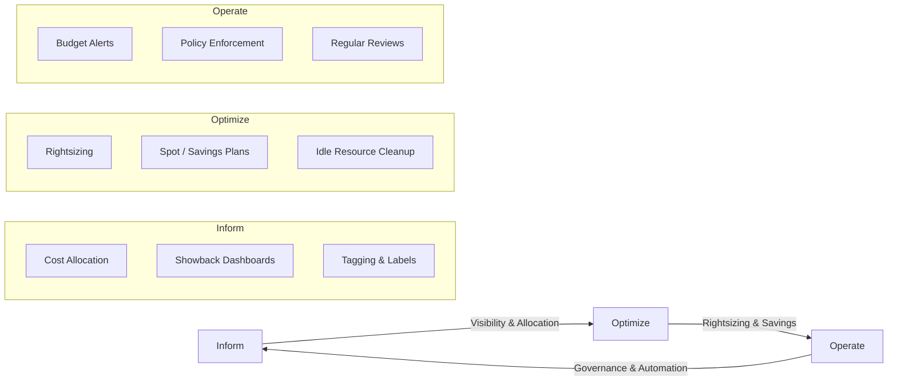
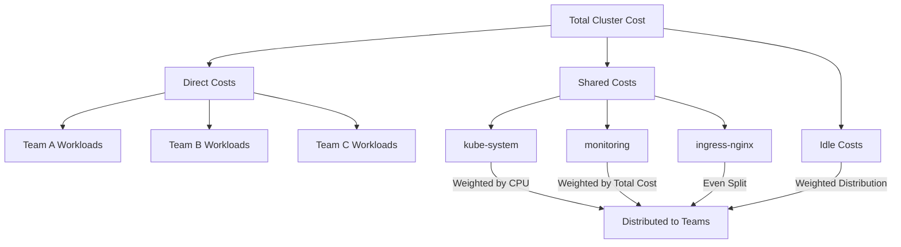
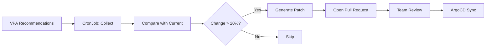

# FinOps 成本可视化平台

> **支持版本**: Kubernetes 1.28+, Kubecost 2.x, OpenCost 1.x
> **最后更新**: April 25, 2026

< [上一篇：事件容量规划](./12-event-capacity-planning.md) | [目录](./README.md) | [下一篇：Tekton Pipelines](./14-tekton-pipelines.md) >

---

## 概述

大规模运行 Kubernetes 会带来独特的成本管理挑战：工作负载是短暂的、资源是共享的，传统的按服务器成本归因方式不再适用。如果没有有意设计的成本可视化，组织经常会发现云账单增长到预期的 2-5 倍。

**FinOps** (Financial Operations) 是一种将财务问责引入云计算可变支出模型的实践。FinOps 生命周期遵循三个迭代阶段：

- **告知**：提供资金花费位置以及由谁花费的可视化
- **优化**：识别并执行减少浪费、提升效率的机会
- **运营**：建立能够持续保持成本效率的治理、自动化和文化实践

本指南使用 OpenCost、Kubecost、Prometheus 和 Grafana 在 Kubernetes 上构建一个完整的 FinOps 成本可视化平台。

### 学习目标

- 理解 FinOps 运营模型以及它如何应用于 Kubernetes 环境
- 部署并配置 OpenCost 和 Kubecost，以实现准确的成本分摊
- 使用标签、命名空间和成本 API 实现 showback 和 chargeback 系统
- 构建带有 Slack 告警管道的成本异常检测
- 启用团队自助式成本仪表板和自动化每周成本报告
- 使用 VPA 建议和 Goldilocks 建立资源 rightsizing 工作流

---

## 1. FinOps 运营模型

### 1.1 告知、优化、运营循环



**告知阶段**：通过部署成本监控工具、实施标签策略并构建 showback 仪表板来建立可视化能力。这是所有优化工作的基础。

**优化阶段**：使用可视化数据识别浪费。这包括对工作负载进行 rightsizing、利用 Spot 实例和 Savings Plans，以及清理闲置资源。

**运营阶段**：通过预算告警、策略执行和定期成本审查会议，将成本效率制度化。

### 1.2 组织角色

| 角色 | 职责 | 主要工具 | 节奏 |
|------|-----------------|---------------|---------|
| **FinOps 团队** | 定义成本分摊模型，维护仪表板，推动优化 | Kubecost, Grafana, AWS Cost Explorer | 每日监控，每周报告 |
| **工程团队** | 设置资源 requests/limits，应用成本标签，审查团队仪表板 | 团队仪表板, VPA, Goldilocks | Sprint 级别审查 |
| **财务** | 预算规划，预测验证，chargeback 对账 | 月度成本报告，showback 数据 | 月度对账 |
| **领导层** | 批准预算，设定成本目标，审查单位经济性 | 高管仪表板，趋势报告 | 月度/季度审查 |
| **平台工程** | 部署并维护成本工具，构建自助式仪表板 | Kubecost, OpenCost, Kyverno, Prometheus | 持续 |

### 1.3 成熟度级别

| 级别 | 成本分摊 | 优化 | 治理 | 时间线 |
|-------|----------------|--------------|------------|----------|
| **爬行** | 命名空间级别分摊，基础标签 | 手动 rightsizing，临时清理 | 无正式策略，响应式告警 | 1-3 个月 |
| **步行** | 基于标签的分摊，包含共享成本拆分和 showback | VPA 建议，采用 Spot | 标签强制执行，月度审查 | 3-6 个月 |
| **奔跑** | 使用 CUR 对账的实时 chargeback | 自动化 rightsizing 管道 | 自动化策略，CI/CD 中的成本门禁 | 6-12 个月 |

---

## 2. OpenCost/Kubecost 深度配置

### 2.1 OpenCost 安装（开源）

OpenCost 需要 Prometheus 提供指标，并暴露自身的成本分摊 API。

```yaml
# opencost-values.yaml
# helm install opencost opencost/opencost -n opencost --create-namespace -f opencost-values.yaml
opencost:
  exporter:
    defaultClusterId: "production-eks-us-east-1"
    image:
      registry: ghcr.io
      repository: opencost/opencost
      tag: "1.112.0"
    aws:
      spot_data_region: "us-east-1"
      spot_data_bucket: "my-company-spot-data-feed"
    prometheus:
      internal:
        enabled: true
        serviceName: prometheus-server
        namespaceName: monitoring
        port: 80
    resources:
      requests:
        cpu: "100m"
        memory: "256Mi"
      limits:
        cpu: "500m"
        memory: "512Mi"
    persistence:
      enabled: true
      storageClass: "gp3"
      size: "32Gi"
    cloudCost:
      enabled: true
      refreshRateHours: 6
  ui:
    enabled: true
    ingress:
      enabled: true
      ingressClassName: "alb"
      annotations:
        alb.ingress.kubernetes.io/scheme: "internal"
        alb.ingress.kubernetes.io/target-type: "ip"
        alb.ingress.kubernetes.io/listen-ports: '[{"HTTPS": 443}]'
      hosts:
        - host: "opencost.internal.mycompany.com"
          paths:
            - path: /
              pathType: Prefix
  metrics:
    serviceMonitor:
      enabled: true
      namespace: monitoring
serviceAccount:
  create: true
  annotations:
    eks.amazonaws.com/role-arn: "arn:aws:iam::123456789012:role/opencost-role"
```

### 2.2 Kubecost Enterprise

Kubecost 在 OpenCost 之上增加了多集群联邦、S3 ETL 存储和高级分摊功能。

```yaml
# kubecost-values.yaml
# helm install kubecost kubecost/cost-analyzer -n kubecost --create-namespace -f kubecost-values.yaml
global:
  prometheus:
    enabled: false
    fqdn: "http://prometheus-server.monitoring.svc:80"
  grafana:
    enabled: false
    domainName: "grafana.monitoring.svc"

kubecostProductConfigs:
  clusterName: "production-eks-us-east-1"
  currencyCode: "USD"
  defaultModelPricing:
    enabled: false
  sharedNamespaces: "kube-system,kubecost,monitoring,cert-manager,ingress-nginx"
  shareTenancyCosts: true
  shareSplit: "weighted"

kubecostModel:
  etl: true
  etlBucketConfig:
    enabled: true
  federatedETL:
    enabled: true
    primaryCluster: true
  resources:
    requests:
      cpu: "200m"
      memory: "512Mi"
    limits:
      cpu: "1000m"
      memory: "2Gi"

# S3 backend for ETL data
kubecostS3Config:
  enabled: true
  bucketName: "mycompany-kubecost-etl"
  region: "us-east-1"

federatedETL:
  federatedStore:
    enabled: true
    bucket: "mycompany-kubecost-federation"
    region: "us-east-1"

kubecostAggregator:
  enabled: true
  replicas: 1
  resources:
    requests:
      cpu: "500m"
      memory: "1Gi"
    limits:
      cpu: "2000m"
      memory: "4Gi"

ingress:
  enabled: true
  className: "alb"
  annotations:
    alb.ingress.kubernetes.io/scheme: "internal"
    alb.ingress.kubernetes.io/target-type: "ip"
  hosts:
    - host: "kubecost.internal.mycompany.com"
      paths:
        - path: /
          pathType: Prefix

serviceAccount:
  create: true
  annotations:
    eks.amazonaws.com/role-arn: "arn:aws:iam::123456789012:role/kubecost-role"

podDisruptionBudget:
  enabled: true
  minAvailable: 1
```

### 2.3 AWS Cost and Usage Report (CUR) 集成

CUR 提供最准确的 AWS 账单数据来源，允许将集群内估算值与实际费用进行对账。

#### Terraform 配置

```hcl
# cur-infrastructure.tf
terraform {
  required_version = ">= 1.5.0"
  required_providers { aws = { source = "hashicorp/aws"; version = "~> 5.0" } }
}

data "aws_caller_identity" "current" {}

resource "aws_s3_bucket" "cur_bucket" {
  bucket = "mycompany-cur-reports"
  tags   = { Purpose = "cost-and-usage-reports", ManagedBy = "terraform" }
}

resource "aws_s3_bucket_versioning" "cur" {
  bucket = aws_s3_bucket.cur_bucket.id
  versioning_configuration { status = "Enabled" }
}

resource "aws_s3_bucket_lifecycle_configuration" "cur" {
  bucket = aws_s3_bucket.cur_bucket.id
  rule {
    id     = "transition-to-ia"
    status = "Enabled"
    transition { days = 90;  storage_class = "STANDARD_IA" }
    transition { days = 365; storage_class = "GLACIER" }
    expiration { days = 730 }
  }
}

resource "aws_s3_bucket_server_side_encryption_configuration" "cur" {
  bucket = aws_s3_bucket.cur_bucket.id
  rule { apply_server_side_encryption_by_default { sse_algorithm = "aws:kms" }; bucket_key_enabled = true }
}

resource "aws_s3_bucket_public_access_block" "cur" {
  bucket = aws_s3_bucket.cur_bucket.id
  block_public_acls = true; block_public_policy = true; ignore_public_acls = true; restrict_public_buckets = true
}

resource "aws_s3_bucket_policy" "cur" {
  bucket = aws_s3_bucket.cur_bucket.id
  policy = jsonencode({
    Version = "2012-10-17"
    Statement = [
      { Sid = "AllowCURDelivery", Effect = "Allow", Principal = { Service = "billingreports.amazonaws.com" },
        Action = ["s3:GetBucketAcl", "s3:GetBucketPolicy"], Resource = aws_s3_bucket.cur_bucket.arn },
      { Sid = "AllowCURWrite", Effect = "Allow", Principal = { Service = "billingreports.amazonaws.com" },
        Action = "s3:PutObject", Resource = "${aws_s3_bucket.cur_bucket.arn}/*" }
    ]
  })
}

resource "aws_cur_report_definition" "daily_cur" {
  report_name                = "mycompany-daily-cur"
  time_unit                  = "DAILY"
  format                     = "Parquet"
  compression                = "Parquet"
  additional_schema_elements = ["RESOURCES"]
  s3_bucket                  = aws_s3_bucket.cur_bucket.id
  s3_region                  = "us-east-1"
  s3_prefix                  = "cur-reports"
  report_versioning          = "OVERWRITE_REPORT"
  refresh_closed_reports     = true
  additional_artifacts       = ["ATHENA"]
}

# IAM role for Kubecost CUR access via IRSA
resource "aws_iam_role" "kubecost_cur" {
  name = "kubecost-cur-reader"
  assume_role_policy = jsonencode({
    Version = "2012-10-17"
    Statement = [{
      Effect = "Allow"
      Principal = { Federated = "arn:aws:iam::${data.aws_caller_identity.current.account_id}:oidc-provider/${var.oidc_provider}" }
      Action = "sts:AssumeRoleWithWebIdentity"
      Condition = { StringEquals = {
        "${var.oidc_provider}:sub" = "system:serviceaccount:kubecost:kubecost-cost-analyzer"
        "${var.oidc_provider}:aud" = "sts.amazonaws.com"
      }}
    }]
  })
}

resource "aws_iam_role_policy" "kubecost_cur" {
  name = "kubecost-cur-read"
  role = aws_iam_role.kubecost_cur.id
  policy = jsonencode({
    Version = "2012-10-17"
    Statement = [
      { Effect = "Allow", Action = ["s3:GetObject", "s3:ListBucket", "s3:GetBucketLocation"],
        Resource = [aws_s3_bucket.cur_bucket.arn, "${aws_s3_bucket.cur_bucket.arn}/*"] },
      { Effect = "Allow", Action = ["athena:StartQueryExecution", "athena:GetQueryExecution", "athena:GetQueryResults"],
        Resource = "arn:aws:athena:us-east-1:${data.aws_caller_identity.current.account_id}:workgroup/primary" },
      { Effect = "Allow", Action = ["glue:GetDatabase", "glue:GetTable", "glue:GetPartitions"],
        Resource = ["arn:aws:glue:us-east-1:${data.aws_caller_identity.current.account_id}:catalog",
                    "arn:aws:glue:us-east-1:${data.aws_caller_identity.current.account_id}:database/athenacurcfn_*",
                    "arn:aws:glue:us-east-1:${data.aws_caller_identity.current.account_id}:table/athenacurcfn_*/*"] },
      { Effect = "Allow", Action = ["pricing:GetProducts", "ec2:DescribeInstances", "ec2:DescribeReservedInstances"], Resource = "*" }
    ]
  })
}

variable "oidc_provider" { description = "OIDC provider URL (without https://)" ; type = string }
output "kubecost_role_arn" { value = aws_iam_role.kubecost_cur.arn }
output "cur_bucket_name"   { value = aws_s3_bucket.cur_bucket.id }
```

#### Kubecost 云集成 Values

```yaml
# Add to kubecost-values.yaml for CUR reconciliation
kubecostProductConfigs:
  cloudIntegrationJSON: |
    {
      "aws": [{
        "athenaBucketName": "mycompany-cur-reports",
        "athenaRegion": "us-east-1",
        "athenaDatabase": "athenacurcfn_mycompany_daily_cur",
        "athenaTable": "mycompany_daily_cur",
        "athenaWorkgroup": "primary",
        "projectID": "123456789012"
      }]
    }
```

### 2.4 成本准确性调优

#### 自定义定价配置

```yaml
# custom-pricing-configmap.yaml
apiVersion: v1
kind: ConfigMap
metadata:
  name: pricing-configs
  namespace: kubecost
data:
  default-pricing.json: |
    {
      "provider": "aws",
      "description": "Custom pricing with negotiated EDP rates",
      "CPU": "0.02835",
      "RAM": "0.00356",
      "GPU": "0.85",
      "storage": "0.000054795",
      "zoneNetworkEgress": "0.00",
      "regionNetworkEgress": "0.01",
      "internetNetworkEgress": "0.05",
      "spotCPU": "0.0085",
      "spotRAM": "0.00107",
      "spotLabel": "karpenter.sh/capacity-type",
      "spotLabelValue": "spot"
    }
```

#### 共享成本分摊规则

```yaml
# shared-cost-allocation-configmap.yaml
apiVersion: v1
kind: ConfigMap
metadata:
  name: allocation-configs
  namespace: kubecost
data:
  shared-costs.json: |
    {
      "sharedCosts": [
        { "name": "Control Plane",       "type": "weighted", "filter": { "namespace": "kube-system" },    "weight": "cpuCost" },
        { "name": "Monitoring Stack",    "type": "weighted", "filter": { "namespace": "monitoring" },     "weight": "totalCost" },
        { "name": "Ingress Controllers", "type": "even",     "filter": { "namespace": "ingress-nginx" } },
        { "name": "Service Mesh",        "type": "weighted", "filter": { "namespace": "istio-system" },   "weight": "networkCost" },
        { "name": "Cert Manager",        "type": "even",     "filter": { "namespace": "cert-manager" } },
        { "name": "Platform Tools",      "type": "even",     "filter": { "namespace": "kubecost,argocd,kyverno" } }
      ],
      "idleCostDistribution": "weighted"
    }
```

---

## 3. Showback/Chargeback 实现

Showback 向团队报告成本以提升认知；chargeback 则实际向成本中心计费。两者都需要与组织单位绑定的准确成本分摊。

### 3.1 标签策略

| 标签 | 目的 | 示例值 |
|-------|---------|---------------|
| `team` | 将成本归因到工程团队 | `platform`, `checkout`, `payments` |
| `service` | Service 级别成本跟踪 | `api-gateway`, `order-service` |
| `environment` | 环境隔离 | `production`, `staging`, `development` |
| `cost-center` | 财务部门映射 | `CC-1001`, `CC-2005` |

#### Kyverno 标签强制执行策略

```yaml
# kyverno-cost-labels-policy.yaml
apiVersion: kyverno.io/v1
kind: ClusterPolicy
metadata:
  name: require-cost-labels
  annotations:
    policies.kyverno.io/title: Require Cost Attribution Labels
    policies.kyverno.io/category: FinOps
    policies.kyverno.io/severity: high
spec:
  validationFailureAction: Enforce
  background: true
  rules:
    - name: check-cost-labels-on-resource
      match:
        any:
          - resources:
              kinds:
                - Deployment
                - StatefulSet
                - DaemonSet
      exclude:
        any:
          - resources:
              namespaces:
                - kube-system
                - kube-public
                - kubecost
                - monitoring
                - ingress-nginx
                - cert-manager
                - argocd
                - kyverno
      validate:
        message: >-
          Resource {{request.object.kind}}/{{request.object.metadata.name}} is missing
          required cost labels. All workloads must have: team, service, environment, cost-center.
        pattern:
          metadata:
            labels:
              team: "?*"
              service: "?*"
              environment: "?*"
              cost-center: "?*"
    - name: check-cost-labels-on-pod-template
      match:
        any:
          - resources:
              kinds:
                - Deployment
                - StatefulSet
                - DaemonSet
      exclude:
        any:
          - resources:
              namespaces:
                - kube-system
                - kube-public
                - kubecost
                - monitoring
                - ingress-nginx
                - cert-manager
                - argocd
                - kyverno
      validate:
        message: "Pod template must also carry cost labels for accurate pod-level cost attribution."
        pattern:
          spec:
            template:
              metadata:
                labels:
                  team: "?*"
                  service: "?*"
                  environment: "?*"
                  cost-center: "?*"
    - name: validate-environment-values
      match:
        any:
          - resources:
              kinds:
                - Deployment
                - StatefulSet
                - DaemonSet
      exclude:
        any:
          - resources:
              namespaces:
                - kube-system
                - kube-public
                - kubecost
                - monitoring
      validate:
        message: "Label 'environment' must be one of: production, staging, development, sandbox."
        pattern:
          metadata:
            labels:
              environment: "production | staging | development | sandbox"
```

### 3.2 基于命名空间的成本分摊

#### Kubecost Allocation API 示例

```bash
# Cost allocation by namespace for the last 7 days
curl -s "http://kubecost.internal.mycompany.com/model/allocation\
?window=7d&aggregate=namespace&accumulate=true" \
  | jq '.data[0] | to_entries[] | {namespace: .key, totalCost: .value.totalCost, cpuCost: .value.cpuCost}'

# Cost allocation by team label for the current month with shared costs
curl -s "http://kubecost.internal.mycompany.com/model/allocation\
?window=thismonth&aggregate=label:team&accumulate=true\
&shareIdle=weighted&shareNamespaces=kube-system,monitoring" \
  | jq '.data[0] | to_entries | sort_by(-.value.totalCost) | .[] | {team: .key, totalCost: (.value.totalCost | round), cpuEfficiency: (.value.cpuEfficiency * 100 | round)}'

# Daily cost trend for a specific team over 30 days
curl -s "http://kubecost.internal.mycompany.com/model/allocation\
?window=30d&aggregate=label:team&step=1d&filterLabels=team:checkout" \
  | jq '[.data[] | to_entries[] | {date: .key, cost: .value.totalCost}]'
```

#### 每个团队命名空间的 ResourceQuota

```yaml
# team-namespace-quota.yaml
apiVersion: v1
kind: Namespace
metadata:
  name: team-checkout
  labels:
    team: checkout
    cost-center: "CC-2005"
    environment: production
---
apiVersion: v1
kind: ResourceQuota
metadata:
  name: team-checkout-quota
  namespace: team-checkout
spec:
  hard:
    requests.cpu: "40"
    requests.memory: "80Gi"
    limits.cpu: "80"
    limits.memory: "160Gi"
    persistentvolumeclaims: "20"
    pods: "200"
---
apiVersion: v1
kind: LimitRange
metadata:
  name: team-checkout-limits
  namespace: team-checkout
spec:
  limits:
    - type: Container
      default:        { cpu: "500m", memory: "512Mi" }
      defaultRequest: { cpu: "100m", memory: "128Mi" }
      max:            { cpu: "8",    memory: "16Gi" }
      min:            { cpu: "10m",  memory: "16Mi" }
```

### 3.3 共享成本分配



| 分配方法 | 何时使用 | 优点 | 缺点 |
|-------------------|-------------|------|------|
| **按 CPU 加权** | Control plane 成本 | 与使用量成比例 | 惩罚 CPU 密集型工作负载 |
| **按总成本加权** | 通用共享服务 | 整体分配公平 | 需要准确的基础分摊 |
| **平均拆分** | 小型共享服务 | 简单、透明 | 如果团队规模不同则不公平 |
| **按网络加权** | Ingress、service mesh | 对网络成本更准确 | 网络成本可能波动较大 |

### 3.4 Grafana Showback 仪表板

以下 Grafana dashboard JSON 提供按团队和按服务的成本面板，并带有团队变量选择器。可通过 Grafana UI 导入，或使用带 `grafana_dashboard: "true"` 标签的 ConfigMap 进行配置。

```json
{
  "description": "FinOps Showback Dashboard",
  "editable": true,
  "panels": [
    {
      "datasource": { "type": "prometheus", "uid": "prometheus" },
      "fieldConfig": { "defaults": { "unit": "currencyUSD", "custom": { "drawStyle": "bars", "fillOpacity": 80, "stacking": { "mode": "normal" } } } },
      "gridPos": { "h": 10, "w": 24, "x": 0, "y": 0 },
      "id": 1, "title": "Daily Cost by Team", "type": "timeseries",
      "targets": [{ "expr": "sum by (label_team) (sum by (namespace, label_team) (kubecost_container_cpu_allocation_cost{} * on(namespace) group_left(label_team) kube_namespace_labels{label_team!=\"\"}) + sum by (namespace, label_team) (kubecost_container_memory_allocation_cost{} * on(namespace) group_left(label_team) kube_namespace_labels{label_team!=\"\"}))", "legendFormat": "{{label_team}}" }]
    },
    {
      "datasource": { "type": "prometheus", "uid": "prometheus" },
      "fieldConfig": { "defaults": { "unit": "currencyUSD" } },
      "gridPos": { "h": 10, "w": 12, "x": 0, "y": 10 },
      "id": 2, "title": "Monthly Cost by Service", "type": "bargauge",
      "targets": [{ "expr": "sum by (label_service) ((kubecost_container_cpu_allocation_cost{} + kubecost_container_memory_allocation_cost{}) * on(pod) group_left(label_service) kube_pod_labels{label_service!=\"\"}) * 730", "legendFormat": "{{label_service}}" }]
    },
    {
      "datasource": { "type": "prometheus", "uid": "prometheus" },
      "fieldConfig": { "defaults": { "unit": "percentunit", "min": 0, "max": 1 } },
      "gridPos": { "h": 10, "w": 12, "x": 12, "y": 10 },
      "id": 3, "title": "Resource Efficiency by Team", "type": "bargauge",
      "targets": [{ "expr": "sum by (label_team) (rate(container_cpu_usage_seconds_total{namespace!~\"kube-system|monitoring\"}[1h]) * on(namespace) group_left(label_team) kube_namespace_labels{label_team!=\"\"}) / sum by (label_team) (kube_pod_container_resource_requests{resource=\"cpu\", namespace!~\"kube-system|monitoring\"} * on(namespace) group_left(label_team) kube_namespace_labels{label_team!=\"\"})", "legendFormat": "{{label_team}}" }]
    },
    {
      "datasource": { "type": "prometheus", "uid": "prometheus" },
      "fieldConfig": { "defaults": { "unit": "currencyUSD" } },
      "gridPos": { "h": 8, "w": 24, "x": 0, "y": 20 },
      "id": 4, "title": "Team Cost Summary Table", "type": "table",
      "targets": [
        { "expr": "sum by (label_team) (kubecost_container_cpu_allocation_cost{} + kubecost_container_memory_allocation_cost{}) * 730", "format": "table", "instant": true, "refId": "A" },
        { "expr": "sum by (label_team) (rate(container_cpu_usage_seconds_total{}[1h])) / sum by (label_team) (kube_pod_container_resource_requests{resource=\"cpu\"})", "format": "table", "instant": true, "refId": "B" }
      ]
    }
  ],
  "schemaVersion": 39, "tags": ["finops", "cost", "showback"],
  "templating": { "list": [{ "name": "team", "type": "query", "query": "label_values(kube_namespace_labels{label_team!=\"\"}, label_team)", "includeAll": true, "multi": true }] },
  "time": { "from": "now-30d", "to": "now" },
  "title": "FinOps Showback Dashboard", "uid": "finops-showback-v1"
}
```

---

## 4. 成本异常检测

成本异常表示由错误配置、流量峰值或基础设施变更导致的意外支出变化。尽早检测可防止账单冲击。

### 4.1 Kubecost 告警配置

```yaml
# kubecost-alerts-values.yaml (merge with main Kubecost Helm values)
kubecostProductConfigs:
  alertConfigs:
    enabled: true
    frontendUrl: "https://kubecost.internal.mycompany.com"
    alerts:
      # Budget exceeded - any namespace over $5000/month
      - type: budget
        threshold: 5000
        window: 30d
        aggregation: namespace
        slackWebhookUrl: "https://hooks.slack.com/services/T00/B00/XXX"
        frequencyMinutes: 1440
      # Budget warning at 80%
      - type: budget
        threshold: 4000
        window: 30d
        aggregation: namespace
        slackWebhookUrl: "https://hooks.slack.com/services/T00/B00/XXX"
        frequencyMinutes: 1440
      # Cluster efficiency below 40%
      - type: efficiency
        threshold: 0.4
        window: 48h
        aggregation: cluster
        slackWebhookUrl: "https://hooks.slack.com/services/T00/B00/XXX"
        frequencyMinutes: 360
      # 30% cost increase week over week per team
      - type: recurringUpdate
        threshold: 0.30
        window: 7d
        aggregation: "label:team"
        slackWebhookUrl: "https://hooks.slack.com/services/T00/B00/XXX"
        frequencyMinutes: 10080
      # Daily spend exceeds 150% of 7-day average
      - type: spendChange
        threshold: 0.50
        window: 1d
        baselineWindow: 7d
        aggregation: namespace
        slackWebhookUrl: "https://hooks.slack.com/services/T00/B00/XXX"
        frequencyMinutes: 360
```

### 4.2 基于 Prometheus 的成本告警

```yaml
# cost-anomaly-prometheus-rules.yaml
apiVersion: monitoring.coreos.com/v1
kind: PrometheusRule
metadata:
  name: cost-anomaly-detection
  namespace: monitoring
  labels:
    release: prometheus
spec:
  groups:
    - name: cost-anomaly-detection
      interval: 30m
      rules:
        - alert: ClusterCostSpike
          expr: |
            (sum(kubecost_cluster_costs{}) / avg_over_time(sum(kubecost_cluster_costs{})[7d:1h])) > 1.5
          for: 2h
          labels:
            severity: warning
            category: finops
          annotations:
            summary: "Cluster cost spike detected"
            description: "Current cost is {{ $value | humanizePercentage }} of 7-day average."
        - alert: NamespaceCostDoubled
          expr: |
            (
              sum by (namespace) (kubecost_container_cpu_allocation_cost{} + kubecost_container_memory_allocation_cost{})
              / sum by (namespace) (kubecost_container_cpu_allocation_cost{} offset 1d + kubecost_container_memory_allocation_cost{} offset 1d)
            ) > 2.0
          for: 1h
          labels:
            severity: warning
            category: finops
          annotations:
            summary: "Namespace {{ $labels.namespace }} cost doubled day-over-day"
        - alert: LowClusterCPUEfficiency
          expr: |
            (
              sum(rate(container_cpu_usage_seconds_total{namespace!~"kube-system|monitoring"}[1h]))
              / sum(kube_pod_container_resource_requests{resource="cpu", namespace!~"kube-system|monitoring"})
            ) < 0.30
          for: 6h
          labels:
            severity: warning
            category: finops
          annotations:
            summary: "Cluster CPU efficiency below 30%"
            description: "Current efficiency: {{ $value | humanizePercentage }}. Review VPA recommendations."
        - alert: HighIdleCost
          expr: |
            (sum(kubecost_cluster_costs{cost_type="idle"}) / sum(kubecost_cluster_costs{})) > 0.20
          for: 24h
          labels:
            severity: info
            category: finops
          annotations:
            summary: "Idle cost exceeds 20% of total cluster cost"
        - alert: ProjectedMonthlyBudgetExceeded
          expr: |
            (sum(kubecost_cluster_costs{}) * 730) > 50000
          for: 12h
          labels:
            severity: critical
            category: finops
          annotations:
            summary: "Projected monthly cost exceeds $50,000 budget"
            description: "Projected: ${{ $value | printf \"%.0f\" }}. Immediate review required."
```

#### Alertmanager 路由和 Receiver

```yaml
# alertmanager-finops-config.yaml
apiVersion: monitoring.coreos.com/v1alpha1
kind: AlertmanagerConfig
metadata:
  name: finops-alerts
  namespace: monitoring
spec:
  route:
    receiver: "finops-slack"
    groupBy: ["alertname", "namespace"]
    groupWait: 30s
    groupInterval: 5m
    repeatInterval: 4h
    matchers:
      - name: category
        value: finops
    routes:
      - receiver: "finops-slack-critical"
        matchers:
          - name: severity
            value: critical
        repeatInterval: 1h
  receivers:
    - name: "finops-slack"
      slackConfigs:
        - apiURL:
            name: finops-slack-webhook
            key: webhook-url
          channel: "#finops-alerts"
          sendResolved: true
          title: "[{{ .CommonLabels.severity | toUpper }}] {{ .CommonLabels.alertname }}"
          text: |
            {{ range .Alerts }}
            *Description:* {{ .Annotations.description }}
            {{ end }}
    - name: "finops-slack-critical"
      slackConfigs:
        - apiURL:
            name: finops-slack-webhook
            key: webhook-url
          channel: "#finops-critical"
          sendResolved: true
          title: "[CRITICAL] {{ .CommonLabels.alertname }}"
          text: |
            {{ range .Alerts }}
            *Description:* {{ .Annotations.description }}
            *Runbook:* {{ .Annotations.runbook_url }}
            {{ end }}
          color: "danger"
---
apiVersion: v1
kind: Secret
metadata:
  name: finops-slack-webhook
  namespace: monitoring
type: Opaque
stringData:
  webhook-url: "https://hooks.slack.com/services/T00/B00/XXXXXXXXXXXXXXXXXXXXXXXX"
```

### 4.3 AWS Cost Anomaly Detection 集成

AWS Cost Anomaly Detection 提供基于 ML 的异常检测，用于补充 Kubernetes 级别的监控。

```hcl
# aws-cost-anomaly-detection.tf
resource "aws_ce_anomaly_monitor" "eks_monitor" {
  name              = "eks-cost-anomaly-monitor"
  monitor_type      = "DIMENSIONAL"
  monitor_dimension = "SERVICE"
}

resource "aws_sns_topic" "finops_alerts" {
  name = "finops-cost-anomaly-alerts"
}

resource "aws_sns_topic_subscription" "finops_email" {
  topic_arn = aws_sns_topic.finops_alerts.arn
  protocol  = "email"
  endpoint  = "finops-team@mycompany.com"
}

resource "aws_ce_anomaly_subscription" "eks_alerts" {
  name      = "eks-anomaly-alerts"
  frequency = "DAILY"
  monitor_arn_list = [aws_ce_anomaly_monitor.eks_monitor.arn]

  subscriber {
    type    = "SNS"
    address = aws_sns_topic.finops_alerts.arn
  }

  threshold_expression {
    dimension {
      key           = "ANOMALY_TOTAL_IMPACT_ABSOLUTE"
      values        = ["100"]
      match_options = ["GREATER_THAN_OR_EQUAL"]
    }
  }
}
```

---

## 5. 团队自助式成本管理

自助式成本管理让 FinOps 能够扩展到平台团队之外。当每个工程团队都能独立查看成本并响应预算告警时，FinOps 团队就可以专注于策略。

### 5.1 按团队的成本仪表板

一个变量驱动的 Grafana 仪表板，允许每个团队只查看自己的成本。关键面板及其 PromQL 查询如下：

```yaml
# grafana-team-dashboard-configmap.yaml
apiVersion: v1
kind: ConfigMap
metadata:
  name: grafana-team-cost-dashboard
  namespace: monitoring
  labels:
    grafana_dashboard: "true"
data:
  team-cost-dashboard.json: |
    {
      "panels": [
        { "id": 1, "title": "Projected Monthly Cost", "type": "stat", "gridPos": { "h": 4, "w": 8, "x": 0, "y": 0 },
          "fieldConfig": { "defaults": { "unit": "currencyUSD" } },
          "targets": [{ "expr": "sum(kubecost_container_cpu_allocation_cost{namespace=~\"team-$team.*\"} + kubecost_container_memory_allocation_cost{namespace=~\"team-$team.*\"}) * 730" }] },
        { "id": 2, "title": "CPU Efficiency", "type": "stat", "gridPos": { "h": 4, "w": 8, "x": 8, "y": 0 },
          "fieldConfig": { "defaults": { "unit": "percentunit" } },
          "targets": [{ "expr": "sum(rate(container_cpu_usage_seconds_total{namespace=~\"team-$team.*\"}[1h])) / sum(kube_pod_container_resource_requests{resource=\"cpu\", namespace=~\"team-$team.*\"})" }] },
        { "id": 3, "title": "Memory Efficiency", "type": "stat", "gridPos": { "h": 4, "w": 8, "x": 16, "y": 0 },
          "fieldConfig": { "defaults": { "unit": "percentunit" } },
          "targets": [{ "expr": "sum(container_memory_working_set_bytes{namespace=~\"team-$team.*\"}) / sum(kube_pod_container_resource_requests{resource=\"memory\", namespace=~\"team-$team.*\"})" }] },
        { "id": 4, "title": "Daily Cost Trend", "type": "timeseries", "gridPos": { "h": 8, "w": 24, "x": 0, "y": 4 },
          "targets": [{ "expr": "sum(kubecost_container_cpu_allocation_cost{namespace=~\"team-$team.*\"} + kubecost_container_memory_allocation_cost{namespace=~\"team-$team.*\"}) * 24", "legendFormat": "Daily Cost" }] },
        { "id": 5, "title": "Cost by Service", "type": "piechart", "gridPos": { "h": 8, "w": 12, "x": 0, "y": 12 },
          "targets": [{ "expr": "sum by (label_service) (kubecost_container_cpu_allocation_cost{namespace=~\"team-$team.*\"} + kubecost_container_memory_allocation_cost{namespace=~\"team-$team.*\"}) * 730", "legendFormat": "{{label_service}}" }] }
      ],
      "templating": { "list": [{ "name": "team", "type": "query", "query": "label_values(kube_namespace_labels{label_team!=\"\"}, label_team)", "refresh": 2 }] },
      "title": "Team Cost Self-Service", "uid": "finops-team-self-service-v1"
    }
```

### 5.2 Slack 成本报告 Bot

每周运行的 CronJob，用于查询 Kubecost 并向 Slack 发布格式化的成本报告。

```yaml
# slack-cost-report-cronjob.yaml
apiVersion: v1
kind: ConfigMap
metadata:
  name: cost-report-script
  namespace: kubecost
data:
  send-cost-report.sh: |
    #!/bin/bash
    set -euo pipefail
    KUBECOST_URL="${KUBECOST_URL:-http://kubecost-cost-analyzer.kubecost.svc:9090}"

    echo "Generating cost report for window: ${REPORT_WINDOW}"

    ALLOCATION_DATA=$(curl -sf "${KUBECOST_URL}/model/allocation?window=${REPORT_WINDOW}&aggregate=label:team&accumulate=true&shareIdle=weighted&shareNamespaces=kube-system,monitoring")

    TOTAL_COST=$(echo "${ALLOCATION_DATA}" | jq '[.data[0] | to_entries[].value.totalCost] | add | round')

    TEAM_BREAKDOWN=$(echo "${ALLOCATION_DATA}" | jq -r '
      .data[0] | to_entries | sort_by(-.value.totalCost) | .[]
      | select(.key != "__idle__" and .key != "__unallocated__")
      | "| \(.key) | $\(.value.totalCost | round) | \(.value.cpuEfficiency * 100 | round)% | \(.value.ramEfficiency * 100 | round)% |"
    ')

    SLACK_PAYLOAD=$(cat <<PAYLOAD
    {
      "blocks": [
        { "type": "header", "text": { "type": "plain_text", "text": "Weekly Kubernetes Cost Report - ${CLUSTER_NAME}" } },
        { "type": "section", "text": { "type": "mrkdwn", "text": "*Report Period:* Last ${REPORT_WINDOW}\n*Total Cluster Cost:* \$${TOTAL_COST}" } },
        { "type": "divider" },
        { "type": "section", "text": { "type": "mrkdwn", "text": "*Cost by Team:*\n| Team | Cost | CPU Eff | Mem Eff |\n|------|------|---------|---------|${TEAM_BREAKDOWN}" } },
        { "type": "section", "text": { "type": "mrkdwn", "text": "<https://kubecost.internal.mycompany.com|View in Kubecost> | <https://grafana.internal.mycompany.com/d/finops-showback-v1|Dashboard>" } }
      ]
    }
    PAYLOAD
    )

    curl -sf -X POST "${SLACK_WEBHOOK_URL}" -H "Content-Type: application/json" -d "${SLACK_PAYLOAD}"
    echo "Cost report sent successfully"
---
apiVersion: batch/v1
kind: CronJob
metadata:
  name: weekly-cost-report
  namespace: kubecost
spec:
  schedule: "0 9 * * 1"  # Every Monday 9:00 AM UTC
  timeZone: "America/New_York"
  concurrencyPolicy: Forbid
  successfulJobsHistoryLimit: 4
  failedJobsHistoryLimit: 2
  jobTemplate:
    spec:
      backoffLimit: 2
      activeDeadlineSeconds: 300
      template:
        metadata:
          labels: { app: cost-report-bot, team: platform }
        spec:
          serviceAccountName: cost-report-bot
          restartPolicy: OnFailure
          containers:
            - name: cost-reporter
              image: curlimages/curl:8.7.1
              command: ["/bin/sh", "/scripts/send-cost-report.sh"]
              env:
                - name: KUBECOST_URL
                  value: "http://kubecost-cost-analyzer.kubecost.svc:9090"
                - name: SLACK_WEBHOOK_URL
                  valueFrom:
                    secretKeyRef: { name: cost-report-slack-webhook, key: webhook-url }
                - name: REPORT_WINDOW
                  value: "7d"
                - name: CLUSTER_NAME
                  value: "production-eks-us-east-1"
              resources:
                requests: { cpu: "50m", memory: "64Mi" }
                limits:   { cpu: "200m", memory: "128Mi" }
              volumeMounts:
                - { name: scripts, mountPath: /scripts }
          volumes:
            - name: scripts
              configMap: { name: cost-report-script, defaultMode: 0755 }
---
apiVersion: v1
kind: ServiceAccount
metadata:
  name: cost-report-bot
  namespace: kubecost
```

### 5.3 成本预算设置和告警

```yaml
# team-budgets-configmap.yaml
apiVersion: v1
kind: ConfigMap
metadata:
  name: team-cost-budgets
  namespace: kubecost
data:
  budgets.json: |
    {
      "budgets": [
        { "team": "checkout",         "monthlyBudget": 8000,  "warningThreshold": 0.80, "criticalThreshold": 0.95, "slackChannel": "#checkout-alerts" },
        { "team": "payments",         "monthlyBudget": 12000, "warningThreshold": 0.80, "criticalThreshold": 0.95, "slackChannel": "#payments-alerts" },
        { "team": "search",           "monthlyBudget": 15000, "warningThreshold": 0.80, "criticalThreshold": 0.95, "slackChannel": "#search-alerts" },
        { "team": "platform",         "monthlyBudget": 20000, "warningThreshold": 0.80, "criticalThreshold": 0.95, "slackChannel": "#platform-alerts" },
        { "team": "data-engineering", "monthlyBudget": 25000, "warningThreshold": 0.75, "criticalThreshold": 0.90, "slackChannel": "#data-eng-alerts" }
      ]
    }
---
apiVersion: batch/v1
kind: CronJob
metadata:
  name: budget-check
  namespace: kubecost
spec:
  schedule: "0 */6 * * *"  # Every 6 hours
  concurrencyPolicy: Forbid
  jobTemplate:
    spec:
      backoffLimit: 1
      activeDeadlineSeconds: 180
      template:
        spec:
          serviceAccountName: cost-report-bot
          restartPolicy: OnFailure
          containers:
            - name: budget-checker
              image: curlimages/curl:8.7.1
              command:
                - /bin/sh
                - -c
                - |
                  set -euo pipefail
                  KUBECOST_URL="http://kubecost-cost-analyzer.kubecost.svc:9090"
                  ALLOCATION=$(curl -sf "${KUBECOST_URL}/model/allocation?window=thismonth&aggregate=label:team&accumulate=true&shareIdle=weighted")
                  DAY_OF_MONTH=$(date +%d)
                  DAYS_IN_MONTH=$(date -d "$(date +%Y-%m-01) +1 month -1 day" +%d)

                  TEAMS=$(cat /config/budgets.json | jq -r '.budgets[].team')
                  for TEAM in ${TEAMS}; do
                    BUDGET=$(jq -r ".budgets[] | select(.team == \"${TEAM}\") | .monthlyBudget" /config/budgets.json)
                    CRITICAL_PCT=$(jq -r ".budgets[] | select(.team == \"${TEAM}\") | .criticalThreshold" /config/budgets.json)
                    WARNING_PCT=$(jq -r ".budgets[] | select(.team == \"${TEAM}\") | .warningThreshold" /config/budgets.json)
                    CHANNEL=$(jq -r ".budgets[] | select(.team == \"${TEAM}\") | .slackChannel" /config/budgets.json)
                    ACTUAL=$(echo "${ALLOCATION}" | jq -r ".data[0][\"${TEAM}\"].totalCost // 0 | round")
                    PROJECTED=$(echo "scale=0; ${ACTUAL} * ${DAYS_IN_MONTH} / ${DAY_OF_MONTH}" | bc)
                    USAGE=$(echo "scale=4; ${PROJECTED} / ${BUDGET}" | bc)

                    if [ "$(echo "${USAGE} >= ${CRITICAL_PCT}" | bc)" = "1" ]; then
                      curl -sf -X POST "${SLACK_WEBHOOK_URL}" -H "Content-Type: application/json" \
                        -d "{\"channel\":\"${CHANNEL}\",\"text\":\":rotating_light: CRITICAL - Team *${TEAM}*: Projected \$${PROJECTED}/\$${BUDGET}\"}"
                    elif [ "$(echo "${USAGE} >= ${WARNING_PCT}" | bc)" = "1" ]; then
                      curl -sf -X POST "${SLACK_WEBHOOK_URL}" -H "Content-Type: application/json" \
                        -d "{\"channel\":\"${CHANNEL}\",\"text\":\":warning: Warning - Team *${TEAM}*: Projected \$${PROJECTED}/\$${BUDGET}\"}"
                    fi
                  done
              env:
                - name: SLACK_WEBHOOK_URL
                  valueFrom:
                    secretKeyRef: { name: cost-report-slack-webhook, key: webhook-url }
              resources:
                requests: { cpu: "50m", memory: "64Mi" }
                limits:   { cpu: "200m", memory: "128Mi" }
              volumeMounts:
                - { name: budget-config, mountPath: /config }
          volumes:
            - name: budget-config
              configMap: { name: team-cost-budgets }
```

---

## 6. 资源 Rightsizing 自动化

Rightsizing 会将资源 requests 和 limits 调整到实际工作负载使用量。过度配置会浪费资金；配置不足会导致 OOM kills 和 throttling。

### 6.1 VPA 建议工作流

以仅建议模式（`updateMode: "Off"`）运行 VPA，以便在不自动应用的情况下建议资源变更。

```yaml
# vpa-recommendation-mode.yaml
apiVersion: autoscaling.k8s.io/v1
kind: VerticalPodAutoscaler
metadata:
  name: order-service-vpa
  namespace: team-checkout
  labels:
    team: checkout
    finops-rightsizing: "true"
spec:
  targetRef:
    apiVersion: apps/v1
    kind: Deployment
    name: order-service
  updatePolicy:
    updateMode: "Off"
  resourcePolicy:
    containerPolicies:
      - containerName: order-service
        minAllowed: { cpu: "50m", memory: "64Mi" }
        maxAllowed: { cpu: "4", memory: "8Gi" }
        controlledResources: ["cpu", "memory"]
        controlledValues: RequestsAndLimits
---
apiVersion: autoscaling.k8s.io/v1
kind: VerticalPodAutoscaler
metadata:
  name: payment-processor-vpa
  namespace: team-payments
  labels:
    team: payments
    finops-rightsizing: "true"
spec:
  targetRef:
    apiVersion: apps/v1
    kind: Deployment
    name: payment-processor
  updatePolicy:
    updateMode: "Off"
  resourcePolicy:
    containerPolicies:
      - containerName: payment-processor
        minAllowed: { cpu: "100m", memory: "128Mi" }
        maxAllowed: { cpu: "8", memory: "16Gi" }
        controlledResources: ["cpu", "memory"]
        controlledValues: RequestsAndLimits
```

审查建议：

```bash
# Get VPA recommendations across all namespaces
kubectl get vpa -A -o custom-columns=\
'NAMESPACE:.metadata.namespace,NAME:.metadata.name,TARGET_CPU:.status.recommendation.containerRecommendations[0].target.cpu,TARGET_MEM:.status.recommendation.containerRecommendations[0].target.memory'
```

### 6.2 Goldilocks 仪表板

Goldilocks 会为标记命名空间中的每个 Deployment 运行 VPA，并提供一个 Web 仪表板来比较当前资源与建议资源。

```yaml
# goldilocks-values.yaml
# helm install goldilocks fairwinds-stable/goldilocks -n goldilocks --create-namespace -f goldilocks-values.yaml
vpa:
  enabled: true
  updater:
    enabled: false  # Recommendations only
dashboard:
  enabled: true
  replicaCount: 2
  resources:
    requests: { cpu: "50m", memory: "64Mi" }
    limits:   { cpu: "200m", memory: "128Mi" }
  ingress:
    enabled: true
    ingressClassName: "alb"
    annotations:
      alb.ingress.kubernetes.io/scheme: "internal"
    hosts:
      - host: "goldilocks.internal.mycompany.com"
        paths:
          - path: /
            pathType: Prefix
controller:
  enabled: true
  resources:
    requests: { cpu: "50m", memory: "64Mi" }
    limits:   { cpu: "200m", memory: "128Mi" }
```

为命名空间启用 Goldilocks：

```bash
kubectl label namespace team-checkout goldilocks.fairwinds.com/enabled=true
kubectl label namespace team-payments goldilocks.fairwinds.com/enabled=true
kubectl label namespace team-search goldilocks.fairwinds.com/enabled=true
kubectl label namespace team-platform goldilocks.fairwinds.com/enabled=true

# Verify
kubectl get namespaces -l goldilocks.fairwinds.com/enabled=true
```

### 6.3 自动化资源调整管道

对于成熟组织，VPA 建议可以流入自动化管道，为审查创建 pull requests。



```yaml
# rightsizing-pipeline-cronjob.yaml
apiVersion: v1
kind: ConfigMap
metadata:
  name: rightsizing-script
  namespace: kubecost
data:
  collect-recommendations.sh: |
    #!/bin/bash
    set -euo pipefail
    OUTPUT_DIR="/tmp/recommendations"
    mkdir -p "${OUTPUT_DIR}"

    VPAS=$(kubectl get vpa -A -l finops-rightsizing=true -o json)

    echo "${VPAS}" | jq -c '.items[]' | while read -r VPA; do
      NS=$(echo "${VPA}" | jq -r '.metadata.namespace')
      TARGET_NAME=$(echo "${VPA}" | jq -r '.spec.targetRef.name')
      REC_CPU=$(echo "${VPA}" | jq -r '.status.recommendation.containerRecommendations[0].target.cpu // empty')
      REC_MEM=$(echo "${VPA}" | jq -r '.status.recommendation.containerRecommendations[0].target.memory // empty')

      [ -z "${REC_CPU}" ] && continue

      CURRENT=$(kubectl get deployment "${TARGET_NAME}" -n "${NS}" -o jsonpath='{.spec.template.spec.containers[0].resources.requests}')
      CUR_CPU=$(echo "${CURRENT}" | jq -r '.cpu // "0"')
      CUR_MEM=$(echo "${CURRENT}" | jq -r '.memory // "0"')

      echo "${NS}/${TARGET_NAME}: CPU ${CUR_CPU} -> ${REC_CPU}, Memory ${CUR_MEM} -> ${REC_MEM}"

      cat > "${OUTPUT_DIR}/${NS}-${TARGET_NAME}.json" <<EOF
    {"namespace":"${NS}","name":"${TARGET_NAME}","current":{"cpu":"${CUR_CPU}","memory":"${CUR_MEM}"},"recommended":{"cpu":"${REC_CPU}","memory":"${REC_MEM}"}}
    EOF
    done

    echo "Collected $(ls ${OUTPUT_DIR}/*.json 2>/dev/null | wc -l) recommendations"
---
apiVersion: batch/v1
kind: CronJob
metadata:
  name: rightsizing-recommendations
  namespace: kubecost
spec:
  schedule: "0 6 * * 1"  # Monday 6:00 AM UTC
  concurrencyPolicy: Forbid
  jobTemplate:
    spec:
      backoffLimit: 1
      template:
        spec:
          serviceAccountName: rightsizing-bot
          restartPolicy: OnFailure
          containers:
            - name: recommender
              image: bitnami/kubectl:1.30
              command: ["/bin/bash", "/scripts/collect-recommendations.sh"]
              resources:
                requests: { cpu: "100m", memory: "128Mi" }
                limits:   { cpu: "500m", memory: "256Mi" }
              volumeMounts:
                - { name: scripts, mountPath: /scripts }
          volumes:
            - name: scripts
              configMap: { name: rightsizing-script, defaultMode: 0755 }
---
apiVersion: v1
kind: ServiceAccount
metadata:
  name: rightsizing-bot
  namespace: kubecost
---
apiVersion: rbac.authorization.k8s.io/v1
kind: ClusterRole
metadata:
  name: rightsizing-reader
rules:
  - apiGroups: ["autoscaling.k8s.io"]
    resources: ["verticalpodautoscalers"]
    verbs: ["get", "list"]
  - apiGroups: ["apps"]
    resources: ["deployments", "statefulsets"]
    verbs: ["get", "list"]
---
apiVersion: rbac.authorization.k8s.io/v1
kind: ClusterRoleBinding
metadata:
  name: rightsizing-reader-binding
subjects:
  - kind: ServiceAccount
    name: rightsizing-bot
    namespace: kubecost
roleRef:
  kind: ClusterRole
  name: rightsizing-reader
  apiGroup: rbac.authorization.k8s.io
```

---

## 7. 成本优化治理

### 7.1 闲置资源自动检测

用于识别消耗资源但没有有意义流量的工作负载的 PromQL 查询：

**7 天内 CPU requests 使用率低于 1% 的 Deployments：**

```promql
(
  sum by (namespace, deployment) (
    rate(container_cpu_usage_seconds_total{namespace!~"kube-system|monitoring|kubecost"}[7d])
  )
  /
  sum by (namespace, deployment) (
    kube_pod_container_resource_requests{resource="cpu", namespace!~"kube-system|monitoring|kubecost"}
    * on(pod) group_left(deployment) kube_pod_owner{owner_kind="ReplicaSet"}
  )
) < 0.01
```

**7 天内 memory requests 使用率低于 10% 的 Deployments：**

```promql
(
  sum by (namespace, deployment) (
    avg_over_time(container_memory_working_set_bytes{namespace!~"kube-system|monitoring"}[7d])
  )
  /
  sum by (namespace, deployment) (
    kube_pod_container_resource_requests{resource="memory", namespace!~"kube-system|monitoring"}
    * on(pod) group_left(deployment) kube_pod_owner{owner_kind="ReplicaSet"}
  )
) < 0.10
```

**7 天内网络流量为零的 Deployments：**

```promql
sum by (namespace, pod) (
  increase(container_network_receive_bytes_total{namespace!~"kube-system|monitoring"}[7d])
) == 0
```

**已绑定但未被任何 pod 挂载的 PVC：**

```promql
kube_persistentvolumeclaim_status_phase{phase="Bound"}
unless on(persistentvolumeclaim, namespace) kube_pod_spec_volumes_persistentvolumeclaims_info
```

### 7.2 成本策略（Kyverno）

#### 阻止没有资源 Limits 的 Deployments

```yaml
# kyverno-require-resource-limits.yaml
apiVersion: kyverno.io/v1
kind: ClusterPolicy
metadata:
  name: require-resource-limits
  annotations:
    policies.kyverno.io/title: Require Resource Limits
    policies.kyverno.io/category: FinOps
    policies.kyverno.io/severity: high
spec:
  validationFailureAction: Enforce
  background: true
  rules:
    - name: validate-resource-limits
      match:
        any:
          - resources:
              kinds:
                - Pod
      exclude:
        any:
          - resources:
              namespaces:
                - kube-system
                - kube-public
      validate:
        message: >-
          All containers must define CPU and memory limits.
          Add resources.limits.cpu and resources.limits.memory to your container spec.
        foreach:
          - list: "request.object.spec.containers"
            deny:
              conditions:
                any:
                  - key: "{{ element.resources.limits.cpu || '' }}"
                    operator: Equals
                    value: ""
                  - key: "{{ element.resources.limits.memory || '' }}"
                    operator: Equals
                    value: ""
```

#### 对过度配置的资源发出警告

```yaml
# kyverno-warn-over-provisioned.yaml
apiVersion: kyverno.io/v1
kind: ClusterPolicy
metadata:
  name: warn-over-provisioned-resources
  annotations:
    policies.kyverno.io/title: Warn on Over-Provisioned Resources
    policies.kyverno.io/category: FinOps
    policies.kyverno.io/severity: medium
spec:
  validationFailureAction: Audit
  background: true
  rules:
    - name: warn-high-cpu-request
      match:
        any:
          - resources:
              kinds:
                - Pod
      exclude:
        any:
          - resources:
              namespaces:
                - kube-system
                - monitoring
      validate:
        message: >-
          Container '{{ element.name }}' requests {{ element.resources.requests.cpu }} CPU.
          Requests above 4 CPU cores should be reviewed with VPA recommendations.
        foreach:
          - list: "request.object.spec.containers"
            deny:
              conditions:
                all:
                  - key: "{{ element.resources.requests.cpu || '0' }}"
                    operator: GreaterThan
                    value: "4000m"
    - name: warn-high-memory-request
      match:
        any:
          - resources:
              kinds:
                - Pod
      exclude:
        any:
          - resources:
              namespaces:
                - kube-system
                - monitoring
      validate:
        message: >-
          Container '{{ element.name }}' requests {{ element.resources.requests.memory }} memory.
          Requests above 8Gi should be reviewed with VPA recommendations.
        foreach:
          - list: "request.object.spec.containers"
            deny:
              conditions:
                all:
                  - key: "{{ element.resources.requests.memory || '0' }}"
                    operator: GreaterThan
                    value: "8Gi"
```

### 7.3 定期成本审查流程

#### 审查节奏

| 审查类型 | 频率 | 参与者 | 时长 | 关键议程 |
|------------|-----------|-------------|----------|------------|
| **团队 Sprint Review** | 每 2 周 | Team lead、工程师 | 15 分钟 | 审查团队仪表板，处理 rightsizing 建议 |
| **每周 FinOps Standup** | 每周（周一） | FinOps lead、platform eng | 30 分钟 | 分诊异常告警，确定优化行动优先级 |
| **月度成本审查** | 每月 | Engineering leads、finance | 60 分钟 | 预算与实际对比，优化 ROI，下月预测 |
| **季度业务审查** | 每季度 | Leadership、FinOps、finance | 90 分钟 | 单位经济性、每客户成本、战略性节省 |

#### 月度审查模板

| 部分 | 内容 | 数据源 |
|---------|---------|-------------|
| 高管摘要 | 总支出、MoM 变化、预算状态 | Kubecost 月度报告 |
| 按团队成本 | 带效率分数的细分 | Kubecost Allocation API |
| Top 5 成本驱动因素 | 支出最高或增长最快的服务 | Kubecost 趋势分析 |
| 优化成果 | 通过 rightsizing、清理实现的节省 | 前后对比 |
| 异常 | 已调查的未解释成本变化 | 异常告警历史 |
| Rightsizing 待办 | 尚未应用的 VPA 建议 | Goldilocks 仪表板 |
| 闲置资源 | 识别为可清理的资源 | PromQL 闲置检测查询 |
| 行动项 | 指定负责人和截止日期 | 上次审查跟进 |

---

## 8. 最佳实践

1. **先建立可视化，再进行优化。** 部署 Kubecost 或 OpenCost，并在提出优化建议前收集 2-4 周数据。没有准确的成本数据，优化就是猜测。

2. **从第一天开始强制执行标签。** 从一开始就使用 Kyverno 将成本标签作为准入要求强制执行。事后为数百个工作负载补标签非常痛苦，缺失标签会产生“未分配”成本，削弱对数据的信任。

3. **先在建议模式下使用 VPA。** 在生产环境中启用 VPA 自动更新之前，必须至少先以建议模式运行两周。自动更新会导致 pod 重启，而错误建议可能导致停机。

4. **分离 showback 与 chargeback 的时间线。** 在实施 chargeback 之前，先给团队 2-3 个月的 showback 可视化。这会建立对数据的信任，并给团队优化时间。

5. **透明地核算共享成本。** 使用文档化的方法分配共享基础设施成本，并在仪表板中清晰显示细分。隐藏成本会滋生不信任和争议。

6. **设置带 15-20% 缓冲的预算。** 过紧的预算会造成告警疲劳，并抑制实验。随着团队建立成本管理信心，再逐步收紧。

7. **让成本成为团队级指标，而不是个人级指标。** 将成本问责降到单个工程师层面会产生不良激励和责备文化。保持在团队或服务级别。

8. **自动化审查流程。** 自动化每周 Slack 报告、预算告警和 rightsizing 建议收集。手动流程无法扩展。

### 反模式

| 反模式 | 问题 | 解决方案 |
|-------------|---------|----------|
| **成本数据囤积** | 只有平台团队能看到成本；工程师处于盲区 | 部署团队自助式仪表板；自动化每周 Slack 报告 |
| **只有告警的 FinOps** | 告警触发但无人处理 | 为每个告警配套 runbook 和指定负责人；跟踪解决时间 |
| **过度优化非生产环境** | 工程时间花在 dev/staging（只占总量很小一部分） | 优先关注生产环境；对非生产环境使用简单策略（夜间 scale-to-zero） |
| **忽视数据传输成本** | 只关注计算，而网络成本悄然增长 | 在仪表板中包含网络成本；集成 CUR 数据；审查跨 AZ 流量 |

---

## 9. 参考资料

### 外部参考资料

- [OpenCost 文档](https://www.opencost.io/docs/) - 开源 Kubernetes 成本监控
- [Kubecost 文档](https://docs.kubecost.com/) - 企业级 Kubernetes 成本管理
- [AWS Cost and Usage Report](https://docs.aws.amazon.com/cur/latest/userguide/what-is-cur.html) - AWS 账单数据导出
- [FinOps Foundation](https://www.finops.org/) - FinOps 最佳实践和社区
- [FinOps Framework](https://www.finops.org/framework/) - 告知、优化、运营生命周期
- [Vertical Pod Autoscaler](https://github.com/kubernetes/autoscaler/tree/master/vertical-pod-autoscaler) - Kubernetes VPA
- [Goldilocks by Fairwinds](https://goldilocks.docs.fairwinds.com/) - VPA 建议仪表板
- [Kyverno Policy Library](https://kyverno.io/policies/) - Kubernetes 策略示例

### 内部参考资料

- [EKS 成本优化](../eks/07-eks-cost-optimization.md) - EKS 的 AWS 特定成本优化策略
- [资源优化](./10-resource-optimization.md) - 详细的资源 requests/limits 调优和框架特定指南
- [扩缩策略](./06-scaling-strategies.md) - HPA、KEDA、VPA 和 Spot 利用策略
