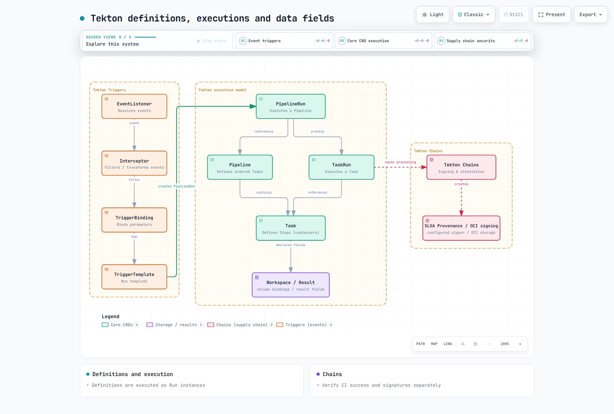

# Tekton Pipelines：Kubernetes 原生 CI

> **最后更新**：2026 年 9 月 12 日。Pipelines 1.16.0、Triggers 0.37.0、Chains 0.29.0、Dashboard 0.72.0、tkn 0.46.0。
> **验证**：发布 CRD 模式、Task 依赖、本地脚本和模拟程序。未执行真实 EKS 安装、镜像构建/推送、KMS 签名、外部 webhook 或通知。

< [上一篇：FinOps](./13-finops-cost-platform.md) | [目录](./README.md) | [下一篇：可用区运维](./15-zonal-operations-guide.md) >

## 概述

Tekton 通过 Kubernetes API 定义 Task、Pipeline 及其执行。操作员仍管理控制器、工作节点容量、存储、升级和访问。其他 CI 系统也可支持 Kubernetes 执行器、自动扩缩容和证明；应避免声称独家支持或零运维成本。

此示例为**获准仓库的受保护 main 分支**运行 Go 应用 CI：克隆 → 并行 vet/test → 发布候选镜像 → 基于摘要扫描。Chains 处理和密码学验证先于单独审核的 GitOps 更改。外部 fork PR 不得共享此 Pipeline 的 IRSA 角色、PVC 或签名权限。

## 1. 执行模型

| 组件 | 作用 |
| --- | --- |
| Task / Pipeline | 可复用工作和依赖定义 |
| TaskRun / PipelineRun | 带参数和状态的执行 |
| Step / Sidecar | 顺序工作 / 支撑服务，通常位于 TaskRun Pod 内 |
| Workspace / Result | 卷绑定 / 小型输出值；不是独立 CRD |

Task 定义本身不是 Pod：执行 TaskRun 才创建 Pod。Result 支持字符串、数组和对象类型；大型报告使用制品存储。同一 Pod 的 Step 共享网络和卷，因此不能在彼此不可信代码之间构成强边界。



[查看交互式图表](https://www.atomai.click/kubernetes-docs/archmaps/en-ops-14-tekton-pipelines-0.html)


[查看交互式图表](https://www.atomai.click/kubernetes-docs/archmaps/en-ops-14-tekton-pipelines-1.html)

## 2. 安装和执行权限

### 2.1 版本和安装路径

官方最低安装要求为 Kubernetes 1.28，而本章安全字段和模式验证针对 Kubernetes 1.36。上游最低要求不是当前受支持 EKS 版本建议。Dashboard 0.72.0 明确支持 Pipelines 1.15 LTS/1.16 和 Triggers 0.37 LTS。

这是固定版本的手动安装示例。官方指南也推荐 Tekton Operator 用于生产生命周期管理。混合手动 apply 和 Operator 管理资源前，应选择所有者。这些命令更改真实集群；应审核所有权，不要盲目强制解决冲突。

```bash
kubectl version -o yaml
kubectl get storageclass

curl --fail --location \
  https://infra.tekton.dev/tekton-releases/pipeline/previous/v1.16.0/release.yaml \
  -o pipelines-release.yaml
kubectl apply --server-side --field-manager=tekton-install -f pipelines-release.yaml
kubectl wait --for=condition=Established --timeout=120s \
  crd/tasks.tekton.dev crd/taskruns.tekton.dev \
  crd/pipelines.tekton.dev crd/pipelineruns.tekton.dev
kubectl -n tekton-pipelines wait deployment --all \
  --for=condition=Available --timeout=300s

kubectl apply --server-side -f \
  https://infra.tekton.dev/tekton-releases/triggers/previous/v0.37.0/release.yaml
kubectl apply --server-side -f \
  https://infra.tekton.dev/tekton-releases/triggers/previous/v0.37.0/interceptors.yaml
kubectl apply --server-side -f \
  https://infra.tekton.dev/tekton-releases/chains/previous/v0.29.0/release.yaml
kubectl apply --server-side -f \
  https://infra.tekton.dev/tekton-releases/dashboard/previous/v0.72.0/release.yaml
kubectl -n tekton-pipelines port-forward service/tekton-dashboard 9097:9097
```

`release.yaml` 安装只读 Dashboard；`release-full.yaml` 包含写入功能。只读模式不验证用户身份，也不会自动执行每命名空间的用户权限。对运维暴露前，验证身份验证代理/OIDC 和访问模型。内部 ALB 不是身份验证。Cognito 集成需要实际 HTTPS 监听器、Cognito/OIDC 端点和 Secret。

`https://tekton.dev/helm-charts` 不是本示例可用的官方 chart 仓库。不要安装此前不存在的 chart 和 values。

### 2.2 当前配置含义

| 设置 | 当前含义 |
| --- | --- |
| `feature-flags.coschedule: workspaces` | 共同调度共享 PVC Workspace 的 TaskRun；此 RWO 示例应保留 |
| `disable-affinity-assistant` | v0.68 后移除的旧标志 |
| `set-security-context: true` | 1.16 中 Tekton 注入容器的默认值；用户 Step 需要自己的兼容上下文 |
| `results-from: termination-message` | 默认路径，受 Kubernetes 终止消息限制 |
| `max-result-size` | 适用于 `sidecar-logs`；仅更改它不会扩大默认终止消息 |
| 默认超时 | 在 `config-defaults` 中管理；此示例显式设置 PipelineRun 超时 |

`running-in-environment-with-injected-sidecars` 不是 Workspace 隔离，`keep-pod-on-cancel` 不是 PipelineRun 保留 TTL。不要用小片段替换完整 ConfigMap。

### 2.3 分离 ServiceAccount 和 IAM 角色

控制器使用 `tekton-pipelines` / `tekton-chains`；构建使用 `tekton-builds`。简单 Task/Pipeline 名称引用在同一命名空间解析。共享命名空间中的 Task 不能仅按名称引用。

先创建 IAM 角色。每个 IRSA 信任策略必须约束现有集群 OIDC 提供程序、`aud=sts.amazonaws.com` 及确切 `sub=system:serviceaccount:tekton-builds:<SA name>`。预先创建 ECR 仓库；构建不需要 `CreateRepository`。尽管名为 `ci-readonly`，本示例中它没有 Kubernetes API Role：它是默认无特权执行账户。

**`service-accounts.yaml`**

```yaml
apiVersion: v1
kind: Namespace
metadata:
  name: tekton-builds
---
apiVersion: v1
kind: ServiceAccount
metadata:
  name: ci-readonly
  namespace: tekton-builds
automountServiceAccountToken: false
---
apiVersion: v1
kind: ServiceAccount
metadata:
  name: ci-image-push
  namespace: tekton-builds
  annotations:
    eks.amazonaws.com/role-arn: arn:aws:iam::123456789012:role/tekton-candidate-push
automountServiceAccountToken: false
---
apiVersion: v1
kind: ServiceAccount
metadata:
  name: ci-image-read
  namespace: tekton-builds
  annotations:
    eks.amazonaws.com/role-arn: arn:aws:iam::123456789012:role/tekton-candidate-read
automountServiceAccountToken: false
---
apiVersion: v1
kind: ServiceAccount
metadata:
  name: ci-triggers
  namespace: tekton-builds
---
apiVersion: rbac.authorization.k8s.io/v1
kind: Role
metadata:
  name: ci-triggers
  namespace: tekton-builds
rules:
  - apiGroups: [triggers.tekton.dev]
    resources: [eventlisteners, triggers, triggerbindings, triggertemplates, interceptors]
    verbs: [get, list, watch]
  - apiGroups: [tekton.dev]
    resources: [pipelineruns]
    verbs: [create]
  - apiGroups: [""]
    resources: [configmaps]
    verbs: [get, list, watch]
  - apiGroups: [""]
    resources: [secrets]
    resourceNames: [github-webhook]
    verbs: [get]
---
apiVersion: rbac.authorization.k8s.io/v1
kind: RoleBinding
metadata:
  name: ci-triggers
  namespace: tekton-builds
subjects:
  - kind: ServiceAccount
    name: ci-triggers
    namespace: tekton-builds
roleRef:
  apiGroup: rbac.authorization.k8s.io
  kind: Role
  name: ci-triggers
---
apiVersion: rbac.authorization.k8s.io/v1
kind: ClusterRole
metadata:
  name: ci-triggers-interceptors
rules:
  - apiGroups: [triggers.tekton.dev]
    resources: [clusterinterceptors, clustertriggerbindings]
    verbs: [get, list, watch]
---
apiVersion: rbac.authorization.k8s.io/v1
kind: ClusterRoleBinding
metadata:
  name: ci-triggers-interceptors
subjects:
  - kind: ServiceAccount
    name: ci-triggers
    namespace: tekton-builds
roleRef:
  apiGroup: rbac.authorization.k8s.io
  kind: ClusterRole
  name: ci-triggers-interceptors
```

**`ecr-push-policy.json`**

```json
{
  "Version": "2012-10-17",
  "Statement": [
    {
      "Effect": "Allow",
      "Action": "ecr:GetAuthorizationToken",
      "Resource": "*",
      "Condition": {
        "StringEquals": {"aws:RequestedRegion": "ap-northeast-2"}
      }
    },
    {
      "Effect": "Allow",
      "Action": [
        "ecr:BatchCheckLayerAvailability",
        "ecr:GetDownloadUrlForLayer",
        "ecr:BatchGetImage",
        "ecr:InitiateLayerUpload",
        "ecr:UploadLayerPart",
        "ecr:CompleteLayerUpload",
        "ecr:PutImage"
      ],
      "Resource": "arn:aws:ecr:ap-northeast-2:123456789012:repository/myapp-candidates"
    }
  ]
}
```

**`ecr-read-policy.json`**

```json
{
  "Version": "2012-10-17",
  "Statement": [
    {
      "Effect": "Allow",
      "Action": "ecr:GetAuthorizationToken",
      "Resource": "*",
      "Condition": {
        "StringEquals": {"aws:RequestedRegion": "ap-northeast-2"}
      }
    },
    {
      "Effect": "Allow",
      "Action": [
        "ecr:BatchCheckLayerAvailability",
        "ecr:GetDownloadUrlForLayer",
        "ecr:BatchGetImage"
      ],
      "Resource": "arn:aws:ecr:ap-northeast-2:123456789012:repository/myapp-candidates"
    }
  ]
}
```

将推送策略附加到 `tekton-candidate-push`，读取策略附加到 `tekton-candidate-read`。替换所有位置的账户、区域和仓库。`GetAuthorizationToken` 不支持仓库级资源范围，因此将其单列并按请求区域约束。

IRSA 验证 Pod 内的 AWS SDK/CLI 调用。kubelet 拉取 ECR 镜像通过独立路径使用节点角色、Fargate 执行角色或 imagePullSecrets。仅 Task IRSA 注解不能修复 ImagePullBackOff。

## 3. 完整 Task 定义

这六个 Task 构成一致示例。源仓库必须包含 Go 模块、测试和 Dockerfile。将 checkout 固定的 `myorg/myapp` URL 替换为获准仓库，并匹配 Trigger 允许列表。不要接受 webhook 输入中的任意 Git URL 或 shell 命令。

Tekton 替换是文本替换。通过环境变量或参数传递 params，不要插入脚本正文。验证完整 40 字符提交。ECR 身份验证文件使用 Task 本地 `emptyDir`；不要写入只读 Secret 卷，也不要假定另一 Step 镜像中的工具在本 Step 存在。

Rootless BuildKit 需要经过验证的专用构建环境，具备用户命名空间、挂载和适当 seccomp/AppArmor 配置。`Unconfined` 和 `--oci-worker-no-process-sandbox` 是明确安全权衡，会被受限命名空间策略拒绝。它们不是普遍安全的默认值。外部 PR 使用独立环境。

**`tasks.yaml`**

```yaml
apiVersion: tekton.dev/v1
kind: Task
metadata:
  name: checkout
  namespace: tekton-builds
spec:
  params:
  - name: revision
    type: string
  workspaces:
  - name: source
  results:
  - name: CHAINS-GIT_URL
    type: string
  - name: CHAINS-GIT_COMMIT
    type: string
  steps:
  - name: checkout
    image: golang:1.27.1
    script: |
      #!/usr/bin/env bash
      set -euo pipefail
      if [[ ! "$REVISION" =~ ^[0-9a-f]{40}$ ]]; then
        echo "Expected a full commit SHA" >&2
        exit 1
      fi
      cd "$SOURCE"
      git init .
      git config credential.helper ''
      git remote add origin "$REPOSITORY"
      git -c protocol.file.allow=never fetch --depth=1 origin "$REVISION"
      git -c advice.detachedHead=false checkout --detach FETCH_HEAD
      test "$(git rev-parse HEAD)" = "$REVISION"
      printf '%s' "$REPOSITORY" > "$GIT_URL_RESULT"
      printf '%s' "$REVISION" > "$GIT_COMMIT_RESULT"
    env:
    - name: REVISION
      value: $(params.revision)
    - name: REPOSITORY
      value: https://github.com/myorg/myapp.git
    - name: SOURCE
      value: $(workspaces.source.path)
    - name: GIT_URL_RESULT
      value: $(results.CHAINS-GIT_URL.path)
    - name: GIT_COMMIT_RESULT
      value: $(results.CHAINS-GIT_COMMIT.path)
    computeResources:
      requests:
        cpu: 100m
        memory: 128Mi
      limits:
        memory: 1Gi
  stepTemplate:
    securityContext:
      runAsUser: 1000
      runAsGroup: 1000
---
apiVersion: tekton.dev/v1
kind: Task
metadata:
  name: go-vet
  namespace: tekton-builds
spec:
  params: []
  workspaces:
  - name: source
  results: []
  steps:
  - name: vet
    image: golang:1.27.1
    script: |
      #!/usr/bin/env bash
      set -euo pipefail
      cd "$SOURCE"
      go vet ./...
    env:
    - name: SOURCE
      value: $(workspaces.source.path)
    - name: GOCACHE
      value: /tmp/go-build
    - name: GOMODCACHE
      value: /tmp/go-mod
    computeResources:
      requests:
        cpu: 100m
        memory: 128Mi
      limits:
        memory: 1Gi
  stepTemplate:
    securityContext:
      runAsUser: 1000
      runAsGroup: 1000
---
apiVersion: tekton.dev/v1
kind: Task
metadata:
  name: go-test
  namespace: tekton-builds
spec:
  params: []
  workspaces:
  - name: source
  results: []
  steps:
  - name: test
    image: golang:1.27.1
    script: |
      #!/usr/bin/env bash
      set -euo pipefail
      cd "$SOURCE"
      go test -count=1 -race -coverprofile=/tmp/coverage.out ./...
      go tool cover -func=/tmp/coverage.out
    env:
    - name: SOURCE
      value: $(workspaces.source.path)
    - name: GOCACHE
      value: /tmp/go-build
    - name: GOMODCACHE
      value: /tmp/go-mod
    computeResources:
      requests:
        cpu: 100m
        memory: 128Mi
      limits:
        memory: 1Gi
  stepTemplate:
    securityContext:
      runAsUser: 1000
      runAsGroup: 1000
---
apiVersion: tekton.dev/v1
kind: Task
metadata:
  name: build-image
  namespace: tekton-builds
spec:
  params:
  - name: image
    type: string
  - name: revision
    type: string
  - name: region
    type: string
  workspaces:
  - name: source
  results:
  - name: IMAGE_URL
    type: string
  - name: IMAGE_DIGEST
    type: string
  steps:
  - name: ecr-token
    image: public.ecr.aws/aws-cli/aws-cli:2.36.44
    script: |
      #!/bin/bash
      set -euo pipefail
      umask 077
      aws ecr get-authorization-token --region "$AWS_REGION" \
        --query 'authorizationData[0].authorizationToken' --output text > /auth/token
    env:
    - name: AWS_REGION
      value: $(params.region)
    - name: AWS_DEFAULT_REGION
      value: $(params.region)
    computeResources:
      requests:
        cpu: 100m
        memory: 128Mi
      limits:
        memory: 1Gi
    volumeMounts:
    - name: auth
      mountPath: /auth
  - name: docker-config
    image: python:3.12.13-slim
    script: |
      #!/usr/bin/env python3
      import base64, json, os, re
      from pathlib import Path
      image, region = os.environ["IMAGE"], os.environ["REGION"]
      match = re.fullmatch(r"([0-9]{12})\.dkr\.ecr\.([a-z0-9-]+)\.amazonaws\.com/([a-z0-9][a-z0-9._/-]*)", image)
      if not match or match.group(2) != region or ".." in match.group(3):
          raise SystemExit("Use a private ECR repository in the configured region")
      token = Path("/auth/token").read_text().strip()
      decoded = base64.b64decode(token, validate=True)
      if not decoded.startswith(b"AWS:") or len(decoded) <= 4:
          raise SystemExit("Invalid ECR authorization token")
      Path("/auth/config.json").write_text(json.dumps({"auths": {image.split("/")[0]: {"auth": token}}}))
      Path("/auth/config.json").chmod(0o600)
      Path("/auth/token").unlink()
    env:
    - name: IMAGE
      value: $(params.image)
    - name: REGION
      value: $(params.region)
    computeResources:
      requests:
        cpu: 100m
        memory: 128Mi
      limits:
        memory: 1Gi
    volumeMounts:
    - name: auth
      mountPath: /auth
  - name: build-and-push
    image: moby/buildkit:v0.33.0-rootless
    script: |
      #!/bin/sh
      set -eu
      case "$REVISION" in *[!0-9a-f]*|"") echo "Invalid commit tag" >&2; exit 1;; esac
      test "${#REVISION}" -eq 40
      buildctl-daemonless.sh build \
        --frontend dockerfile.v0 \
        --local "context=$SOURCE" --local "dockerfile=$SOURCE" \
        --output "type=image,name=$IMAGE:$REVISION,push=true" \
        --metadata-file /build-result/metadata.json
    env:
    - name: SOURCE
      value: $(workspaces.source.path)
    - name: IMAGE
      value: $(params.image)
    - name: REVISION
      value: $(params.revision)
    - name: DOCKER_CONFIG
      value: /auth
    - name: BUILDKITD_FLAGS
      value: --oci-worker-no-process-sandbox
    computeResources:
      requests:
        cpu: '1'
        memory: 1Gi
      limits:
        memory: 4Gi
    securityContext:
      runAsUser: 1000
      runAsGroup: 1000
      seccompProfile:
        type: Unconfined
      appArmorProfile:
        type: Unconfined
    volumeMounts:
    - name: auth
      mountPath: /auth
      readOnly: true
    - name: buildkit-state
      mountPath: /home/user/.local/share/buildkit
    - name: build-result
      mountPath: /build-result
  - name: record-digest
    image: python:3.12.13-slim
    script: |
      #!/usr/bin/env python3
      import json, os, re
      from pathlib import Path
      data = json.loads(Path("/build-result/metadata.json").read_text())
      digest = data.get("containerimage.digest", "")
      if not re.fullmatch(r"sha256:[0-9a-f]{64}", digest):
          raise SystemExit("BuildKit did not return an image digest")
      Path(os.environ["URL_RESULT"]).write_text(os.environ["IMAGE"])
      Path(os.environ["DIGEST_RESULT"]).write_text(digest)
    env:
    - name: IMAGE
      value: $(params.image)
    - name: URL_RESULT
      value: $(results.IMAGE_URL.path)
    - name: DIGEST_RESULT
      value: $(results.IMAGE_DIGEST.path)
    computeResources:
      requests:
        cpu: 100m
        memory: 128Mi
      limits:
        memory: 1Gi
    volumeMounts:
    - name: build-result
      mountPath: /build-result
      readOnly: true
  volumes:
  - name: auth
    emptyDir: {}
  - name: buildkit-state
    emptyDir: {}
  - name: build-result
    emptyDir: {}
  stepTemplate:
    securityContext:
      runAsUser: 1000
      runAsGroup: 1000
---
apiVersion: tekton.dev/v1
kind: Task
metadata:
  name: scan-image
  namespace: tekton-builds
spec:
  params:
  - name: image
    type: string
  - name: digest
    type: string
  - name: region
    type: string
  workspaces: []
  results: []
  steps:
  - name: ecr-token
    image: public.ecr.aws/aws-cli/aws-cli:2.36.44
    script: |
      #!/bin/bash
      set -euo pipefail
      umask 077
      aws ecr get-authorization-token --region "$AWS_REGION" \
        --query 'authorizationData[0].authorizationToken' --output text > /auth/token
    env:
    - name: AWS_REGION
      value: $(params.region)
    - name: AWS_DEFAULT_REGION
      value: $(params.region)
    computeResources:
      requests:
        cpu: 100m
        memory: 128Mi
      limits:
        memory: 1Gi
    volumeMounts:
    - name: auth
      mountPath: /auth
  - name: docker-config
    image: python:3.12.13-slim
    script: |
      #!/usr/bin/env python3
      import base64, json, os, re
      from pathlib import Path
      image, region = os.environ["IMAGE"], os.environ["REGION"]
      match = re.fullmatch(r"([0-9]{12})\.dkr\.ecr\.([a-z0-9-]+)\.amazonaws\.com/([a-z0-9][a-z0-9._/-]*)", image)
      if not match or match.group(2) != region or ".." in match.group(3):
          raise SystemExit("Use a private ECR repository in the configured region")
      token = Path("/auth/token").read_text().strip()
      decoded = base64.b64decode(token, validate=True)
      if not decoded.startswith(b"AWS:") or len(decoded) <= 4:
          raise SystemExit("Invalid ECR authorization token")
      Path("/auth/config.json").write_text(json.dumps({"auths": {image.split("/")[0]: {"auth": token}}}))
      Path("/auth/config.json").chmod(0o600)
      Path("/auth/token").unlink()
    env:
    - name: IMAGE
      value: $(params.image)
    - name: REGION
      value: $(params.region)
    computeResources:
      requests:
        cpu: 100m
        memory: 128Mi
      limits:
        memory: 1Gi
    volumeMounts:
    - name: auth
      mountPath: /auth
  - name: scan
    image: aquasec/trivy:0.74.0
    script: |
      #!/bin/sh
      set -eu
      trivy image --scanners vuln --severity HIGH,CRITICAL \
        --exit-code 1 --format json --output /tmp/trivy-report.json "$IMAGE@$DIGEST"
    env:
    - name: IMAGE
      value: $(params.image)
    - name: DIGEST
      value: $(params.digest)
    - name: DOCKER_CONFIG
      value: /auth
    - name: TRIVY_CACHE_DIR
      value: /tmp/trivy-cache
    computeResources:
      requests:
        cpu: 100m
        memory: 128Mi
      limits:
        memory: 1Gi
    volumeMounts:
    - name: auth
      mountPath: /auth
      readOnly: true
  volumes:
  - name: auth
    emptyDir: {}
  stepTemplate:
    securityContext:
      runAsUser: 1000
      runAsGroup: 1000
---
apiVersion: tekton.dev/v1
kind: Task
metadata:
  name: report-status
  namespace: tekton-builds
spec:
  params:
  - name: run
    type: string
  - name: status
    type: string
  workspaces: []
  results: []
  steps:
  - name: report
    image: python:3.12.13-slim
    script: |
      #!/usr/bin/env python3
      import json, os
      print(json.dumps({"pipelineRun": os.environ["RUN"], "status": os.environ["STATUS"]}))
    env:
    - name: RUN
      value: $(params.run)
    - name: STATUS
      value: $(params.status)
    computeResources:
      requests:
        cpu: 100m
        memory: 128Mi
      limits:
        memory: 1Gi
  stepTemplate:
    securityContext:
      runAsUser: 1000
      runAsGroup: 1000
```

原始 Google Kaniko 仓库已归档；新示例使用 BuildKit 0.33.0。Rootless 不保证完整进程隔离。生产前验证并固定镜像摘要/平台，在实际节点测试可写路径和安全上下文。

扫描器发现问题时退出码 1，以及其他错误码，均使 Task 失败。缺失报告不得变为“零漏洞”。`/tmp/trivy-report.json` 是临时文件；若需要长期保留，应在执行清理前导出到获准制品存储。

## 4. Pipeline 和执行


[查看交互式图表](https://www.atomai.click/kubernetes-docs/archmaps/en-ops-14-tekton-pipelines-2.html)

**`pipeline.yaml`**

```yaml
apiVersion: tekton.dev/v1
kind: Pipeline
metadata:
  name: trusted-image-ci
  namespace: tekton-builds
spec:
  params:
    - name: revision
      type: string
    - name: image
      type: string
    - name: region
      type: string
      default: ap-northeast-2
  workspaces:
    - name: source
  results:
    - name: CHAINS-GIT_URL
      value: $(tasks.clone.results.CHAINS-GIT_URL)
    - name: CHAINS-GIT_COMMIT
      value: $(tasks.clone.results.CHAINS-GIT_COMMIT)
    - name: IMAGE_URL
      value: $(tasks.build.results.IMAGE_URL)
    - name: IMAGE_DIGEST
      value: $(tasks.build.results.IMAGE_DIGEST)
  tasks:
    - name: clone
      taskRef:
        name: checkout
      params:
        - name: revision
          value: $(params.revision)
      workspaces:
        - name: source
          workspace: source
    - name: lint
      runAfter: [clone]
      taskRef:
        name: go-vet
      workspaces:
        - name: source
          workspace: source
    - name: test
      runAfter: [clone]
      taskRef:
        name: go-test
      workspaces:
        - name: source
          workspace: source
    - name: build
      runAfter: [lint, test]
      taskRef:
        name: build-image
      params:
        - name: image
          value: $(params.image)
        - name: revision
          value: $(tasks.clone.results.CHAINS-GIT_COMMIT)
        - name: region
          value: $(params.region)
      workspaces:
        - name: source
          workspace: source
    - name: scan
      runAfter: [build]
      taskRef:
        name: scan-image
      params:
        - name: image
          value: $(tasks.build.results.IMAGE_URL)
        - name: digest
          value: $(tasks.build.results.IMAGE_DIGEST)
        - name: region
          value: $(params.region)
  finally:
    - name: report
      taskRef:
        name: report-status
      params:
        - name: run
          value: $(context.pipelineRun.name)
        - name: status
          value: $(tasks.status)
```

**`pipelinerun.yaml`**

```yaml
apiVersion: tekton.dev/v1
kind: PipelineRun
metadata:
  generateName: trusted-image-ci-
  namespace: tekton-builds
spec:
  pipelineRef:
    name: trusted-image-ci
  params:
    - name: revision
      value: REPLACE_WITH_FULL_40_CHARACTER_COMMIT_SHA
    - name: image
      value: 123456789012.dkr.ecr.ap-northeast-2.amazonaws.com/myapp-candidates
  workspaces:
    - name: source
      volumeClaimTemplate:
        spec:
          accessModes: [ReadWriteOnce]
          storageClassName: gp3
          resources:
            requests:
              storage: 10Gi
  taskRunTemplate:
    serviceAccountName: ci-readonly
    podTemplate:
      automountServiceAccountToken: false
      securityContext:
        fsGroup: 1000
  taskRunSpecs:
    - pipelineTaskName: build
      serviceAccountName: ci-image-push
    - pipelineTaskName: scan
      serviceAccountName: ci-image-read
  timeouts:
    pipeline: 1h
    tasks: 50m
    finally: 5m
```

```bash
kubectl apply -f service-accounts.yaml
kubectl apply -f tasks.yaml -f pipeline.yaml
# Replace the commit placeholder and provision the referenced IAM roles first.
kubectl create -f pipelinerun.yaml
tkn pipelinerun logs --last -n tekton-builds --follow --exit-with-pipelinerun-error
```

每次执行创建新 PVC。ReadWriteOnce 允许同节点多个 Pod 访问，但不是多节点 RWX。emptyDir 不是跨不同 TaskRun Pod 的共享存储。按信任级别分离缓存，并协调并发写入方。

`finally` 在普通 Task 后运行，但并非无条件执行。引用缺失 Result 可导致跳过；取消模式、总超时、资源失败和无法解析的引用也可阻止执行。此示例仅报告运行名称和 `tasks.status`，避免引用可能从未产生的镜像 Result。不要假定多个 finally Task 的顺序。

## 5. Webhook 和 Trigger

此 Trigger 先验证 GitHub HMAC，再检查**仓库、分支、删除状态和完整 SHA**。Git URL、ECR 路径、Task 名称和 ServiceAccount 保持固定在可信定义中。不要将外部 PR 事件接入此模板。HMAC 验证交付来源；不授权 PR 代码部署。


[查看交互式图表](https://www.atomai.click/kubernetes-docs/archmaps/en-ops-14-tekton-pipelines-3.html)

**`triggers.yaml`**

```yaml
apiVersion: triggers.tekton.dev/v1beta1
kind: EventListener
metadata:
  name: trusted-github
  namespace: tekton-builds
spec:
  serviceAccountName: ci-triggers
  triggers:
    - name: protected-main-push
      interceptors:
        - ref:
            name: github
          params:
            - name: secretRef
              value:
                secretName: github-webhook
                secretKey: token
            - name: eventTypes
              value: [push]
        - ref:
            name: cel
          params:
            - name: filter
              value: >-
                body.repository.full_name == 'myorg/myapp' &&
                body.ref == 'refs/heads/main' &&
                body.deleted == false &&
                body.after.matches('^[0-9a-f]{40}$')
      bindings:
        - ref: trusted-commit
      template:
        ref: trusted-image-ci
---
apiVersion: triggers.tekton.dev/v1beta1
kind: TriggerBinding
metadata:
  name: trusted-commit
  namespace: tekton-builds
spec:
  params:
    - name: revision
      value: $(body.after)
---
apiVersion: triggers.tekton.dev/v1beta1
kind: TriggerTemplate
metadata:
  name: trusted-image-ci
  namespace: tekton-builds
spec:
  params:
    - name: revision
  resourcetemplates:
    - apiVersion: tekton.dev/v1
      kind: PipelineRun
      metadata:
        generateName: trusted-image-ci-
        namespace: tekton-builds
      spec:
        pipelineRef:
          name: trusted-image-ci
        params:
          - name: revision
            value: $(tt.params.revision)
          - name: image
            value: 123456789012.dkr.ecr.ap-northeast-2.amazonaws.com/myapp-candidates
        workspaces:
          - name: source
            volumeClaimTemplate:
              spec:
                accessModes: [ReadWriteOnce]
                storageClassName: gp3
                resources:
                  requests:
                    storage: 10Gi
        taskRunTemplate:
          serviceAccountName: ci-readonly
          podTemplate:
            automountServiceAccountToken: false
            securityContext:
              fsGroup: 1000
        taskRunSpecs:
          - pipelineTaskName: build
            serviceAccountName: ci-image-push
          - pipelineTaskName: scan
            serviceAccountName: ci-image-read
        timeouts:
          pipeline: 1h
          tasks: 50m
          finally: 5m
```

`github-webhook` Secret 的 `token` 必须匹配 GitHub webhook 密钥。从受保护存储提供，绝不放入 Git。单独配置外部 HTTPS 端点及交付重试/去重策略。EventListener 默认具有内部 Service；仅此 YAML 不创建互联网端点。

在 TLS 终止及网关/Ingress 处理过程中保留原始正文，以便 HMAC 验证。为回调应用适当身份验证、限速、可用性和固定路由。安静时段不自动意味着 webhook 故障：检查实际交付结果及 EventListener 处理错误。

不要假定 `head_commit` 总存在，也不要仅用一个拆分元素截断 `refs/heads/feature/a`。文件变更过滤器必须考虑新增、修改、删除路径及载荷限制。此示例不虚构业务专属路径过滤器。

## 6. Chains 和签名验证

### 6.1 CI 成功与签名完成相互独立

Chains 是处理已完成 TaskRun/PipelineRun 的独立控制器。仅镜像签名不能证明完整测试和扫描成功。`chains.tekton.dev/signed=true` 既不是部署批准，也不是密码学验证。

Pipeline 级来源证明在 Pipeline 完成后创建。在 Pipeline 内等待自身证明，可能与此顺序冲突。此示例在 CI 完成后采用独立验证和晋级流程。


[查看交互式图表](https://www.atomai.click/kubernetes-docs/archmaps/en-ops-14-tekton-pipelines-4.html)

### 6.2 KMS 配置

使用现有非对称 `SIGN_VERIFY` KMS 密钥。替换密钥 ARN 和 `builder.id`。在 **Chains 控制器 ServiceAccount `tekton-chains/tekton-chains-controller`** 上配置独立 IRSA 角色，具有候选仓库 ECR 写入及下方 KMS 权限。给构建 Pod IRSA 角色不会让控制器获得这些凭证。

当前 OCI 后端使用 Kubernetes 凭证查找及默认/ECR 凭证辅助程序链。配置控制器环境中的 AWS 身份，并验证实际签名上传。构建 Task 的 `/auth` emptyDir 不是 Chains 可读的共享 Secret。

**`chains-kms-policy.json`**

```json
{
  "Version": "2012-10-17",
  "Statement": [{
    "Effect": "Allow",
    "Action": ["kms:Sign", "kms:GetPublicKey", "kms:DescribeKey"],
    "Resource": "arn:aws:kms:ap-northeast-2:123456789012:key/REPLACE_KEY_ID"
  }]
}
```

**`chains-config.yaml`**

```yaml
apiVersion: v1
kind: ConfigMap
metadata:
  name: chains-config
  namespace: tekton-chains
data:
  artifacts.taskrun.storage: ""
  artifacts.pipelinerun.format: slsa/v2alpha3
  artifacts.pipelinerun.storage: oci
  artifacts.pipelinerun.signer: kms
  artifacts.oci.format: simplesigning
  artifacts.oci.storage: oci
  artifacts.oci.signer: kms
  signers.kms.kmsref: awskms:///arn:aws:kms:ap-northeast-2:123456789012:key/REPLACE_KEY_ID
  signers.x509.fulcio.enabled: "false"
  transparency.enabled: "false"
  storage.oci.encoding-format: dsse
  builder.id: https://ci.example.com/tekton/trusted-image-ci
  builddefinition.buildtype: https://tekton.dev/chains/v2/slsa
```

格式器名称 `slsa/v1` 不意味着 SLSA provenance v1.0。当前 Chains 中，`slsa/v1` / `in-toto` 映射到 v0.2，`slsa/v2alpha3` / `slsa/v2alpha4` 映射到 v1.0。此示例使用 Pipeline 级 `slsa/v2alpha3`，禁用重复 Task 级来源证明存储，并单独启用镜像签名。

`storage.oci.encoding-format: dsse` 保留旧 `.sig` / `.att` 存储。0.29 版本的 `sigstore-bundle` 使用 OCI 1.1 referrer；应同时更改存储和验证工具。此处禁用 Rekor 上传，因此验证显式遵循内部公钥策略。如需要透明性，应单独配置，包括审核暴露的构建元数据。

无密钥签名要求实际 Fulcio 服务信任的签发者和有效工作负载令牌。在 EKS Pod 上设置 GitHub Actions 签发者字符串不会提供身份验证。仅签名和证明不能确立特定 SLSA 级别。

### 6.3 独立验证执行和制品

此脚本检查**从可信 API 读取的** PipelineRun，确认 CI 成功、Chains 处理完成，以及获准仓库、提交和镜像输出。它不验证签名。还必须执行后续 Cosign 检查及来源证明策略审查。

**`check_run.py`**

```python
"""Check trusted API output before separate cryptographic artifact verification."""
import argparse
import json
import re
from pathlib import Path


def check(run, repository, revision, image):
    if run.get("kind") != "PipelineRun" or run.get("apiVersion") != "tekton.dev/v1":
        raise ValueError("Expected a tekton.dev/v1 PipelineRun")
    metadata = run.get("metadata", {})
    if metadata.get("namespace") != "tekton-builds" or not metadata.get("uid"):
        raise ValueError("Unexpected namespace or missing run UID")
    if run.get("spec", {}).get("pipelineRef", {}).get("name") != "trusted-image-ci":
        raise ValueError("Unexpected pipeline")
    succeeded = [c for c in run.get("status", {}).get("conditions", []) if c.get("type") == "Succeeded"]
    if len(succeeded) != 1 or succeeded[0].get("status") != "True":
        raise ValueError("CI has not succeeded")
    if not run.get("status", {}).get("completionTime"):
        raise ValueError("CI completion time is missing")
    if metadata.get("annotations", {}).get("chains.tekton.dev/signed") != "true":
        raise ValueError("Chains has not completed; retry later with a fresh API read")
    results = {}
    for result in run.get("status", {}).get("results", []):
        if result["name"] in results:
            raise ValueError("Duplicate result")
        results[result["name"]] = result["value"]
    if not re.fullmatch(r"[0-9a-f]{40}", revision):
        raise ValueError("Expected full source revision")
    expected = {"CHAINS-GIT_URL": repository, "CHAINS-GIT_COMMIT": revision, "IMAGE_URL": image}
    if any(results.get(k) != v for k, v in expected.items()):
        raise ValueError("Run outputs do not match the approved source and repository")
    digest = results.get("IMAGE_DIGEST", "")
    if not isinstance(digest, str) or not re.fullmatch(r"sha256:[0-9a-f]{64}", digest):
        raise ValueError("Missing or invalid image digest")
    return image + "@" + digest


if __name__ == "__main__":
    parser = argparse.ArgumentParser()
    parser.add_argument("--run", type=Path, required=True)
    parser.add_argument("--repository", required=True)
    parser.add_argument("--revision", required=True)
    parser.add_argument("--image", required=True)
    args = parser.parse_args()
    try:
        print(check(json.loads(args.run.read_text()), args.repository, args.revision, args.image))
    except (ValueError, KeyError, TypeError) as error:
        parser.exit(1, f"Run gate failed: {error}\n")
```

```bash
set -euo pipefail
DOCS_RUN="REPLACE_PIPELINERUN_NAME"
DOCS_REVISION="REPLACE_WITH_FULL_40_CHARACTER_COMMIT_SHA"
DOCS_IMAGE="123456789012.dkr.ecr.ap-northeast-2.amazonaws.com/myapp-candidates"
kubectl -n tekton-builds get pipelinerun "$DOCS_RUN" -o json > run.json
DOCS_IMAGE_REF="$(python3 check_run.py --run run.json \
  --repository https://github.com/myorg/myapp.git \
  --revision "$DOCS_REVISION" --image "$DOCS_IMAGE")"

# chains.pub must be the independently trusted public key for the configured KMS key.
# Registry read authentication must already be configured.
# Explicit private-key policy: verify signatures, without requiring a Rekor entry.
cosign verify --key chains.pub --insecure-ignore-tlog=true "$DOCS_IMAGE_REF" \
  > verified-signature.json
cosign verify-attestation --key chains.pub --insecure-ignore-tlog=true \
  --type https://slsa.dev/provenance/v1 "$DOCS_IMAGE_REF" \
  > verified-attestations.json
```

`--insecure-ignore-tlog` 是显式选择不要求公共 Rekor 条目。针对可信密钥的签名验证仍启用。若组织策略要求透明性验证，应配置该验证链，不使用此例外。

对已验证证明的 subject 摘要、`runDetails.builder.id`、`buildDefinition.buildType`、确切源 URI/提交及获准 Task/Pipeline 定义应用策略。任意生成者的有效签名或另一构建的证明均不足。上述命令不会自动实现组织专属检查。

为相同可信密钥/身份、摘要和来源条件单独配置准入验证。不要应用不完整 `BEGIN PUBLIC KEY ...` 占位符，也不要比较不存在的 predicate 字段。检查安装版本的当前 Kyverno ImageValidatingPolicy 和仓库身份验证，再测试正确/错误密钥、来源及无签名镜像的接受和拒绝情况。

## 7. GitOps 交接

使用已验证的 `repository@sha256:...` 更新实际 Kustomize/Helm 配置。本章不包含自动推送、创建或合并 PR 的 Task。所有者或另行获准的晋级流程编辑固定仓库/文件，在 CI 和审查后合并。避免 Tekton kubectl 部署和 ArgoCD 同时管理相同清单。


[查看交互式图表](https://www.atomai.click/kubernetes-docs/archmaps/en-ops-14-tekton-pipelines-5.html)

```bash
# In a reviewed checkout with the Kustomize CLI installed:
cd overlays/production
kustomize edit set image "myapp=$DOCS_IMAGE_REF"
kustomize build . > /tmp/rendered-myapp.yaml
git diff -- kustomization.yaml
# Run repository checks and submit the focused change for review.
```

使用 `cut -d: -f1/2` 拆分镜像引用会破坏仓库端口和摘要。向工具传递完整引用。通过可信路径预置 SSH known_hosts；未经验证的 ssh-keyscan 结果不是信任锚。复制到一个 Step 主目录的凭证不会自动与另一个共享。

ArgoCD 同步 Git 清单；kubelet/容器运行时拉取应用镜像。将应用健康检查与同步完成分开。回滚不会自动恢复数据或模式更改。

## 8. 运维和清理

### 8.1 执行记录和 PVC

`keep` 和 `keep-since` 是 tkn 删除命令等工具的选项，不是内置 PipelineRun TTL 字段。tkn 0.46.0 `pipelinerun delete` 没有 `--dry-run`。删除前检查日志、扫描报告、签名/来源证明和审计数据保留要求。不要在没有年龄策略时删除所有成功 Pod。

此工具在一个命名空间中打印**仅供审查的候选项**：完成超过七天的成功运行，以及超过十四天的失败运行。它使用完成时间，不是创建时间，并要求 Chains 和归档确认。`ci.example.com/archive-complete` 是操作员在实际归档成功后记录的注解，不是 Tekton 自动字段。脚本不调用 Kubernetes API，也不删除任何内容。

**`cleanup_candidates.py`**

```python
"""Print names for review; this script never deletes Kubernetes objects."""
import argparse
import json
from datetime import datetime, timedelta, timezone
from pathlib import Path


def timestamp(value):
    parsed = datetime.fromisoformat(value.replace("Z", "+00:00"))
    if parsed.tzinfo is None:
        raise ValueError("Timezone required")
    return parsed.astimezone(timezone.utc)


def candidates(document, now, namespace):
    if now.tzinfo is None:
        raise ValueError("Timezone required")
    result, skipped = [], []
    for obj in document.get("items", []):
        meta, status = obj.get("metadata", {}), obj.get("status", {})
        name = meta.get("name", "<unnamed>")
        conditions = [c for c in status.get("conditions", []) if c.get("type") == "Succeeded"]
        annotations = meta.get("annotations", {})
        if (obj.get("kind") != "PipelineRun" or meta.get("namespace") != namespace
                or not meta.get("uid") or len(conditions) != 1
                or conditions[0].get("status") not in ("True", "False")):
            skipped.append({"name": name, "reason": "not a terminal run in the selected namespace"})
            continue
        if annotations.get("ci.example.com/retain") == "true":
            skipped.append({"name": name, "reason": "retention hold"})
            continue
        if (annotations.get("chains.tekton.dev/signed") != "true"
                or annotations.get("ci.example.com/archive-complete") != "true"):
            skipped.append({"name": name, "reason": "Chains processing or archive acknowledgement incomplete"})
            continue
        try:
            completed = timestamp(status["completionTime"])
        except (ValueError, KeyError, TypeError, AttributeError):
            skipped.append({"name": name, "reason": "invalid completion time"})
            continue
        retention_days = 7 if conditions[0]["status"] == "True" else 14
        if completed < now - timedelta(days=retention_days):
            result.append({"namespace": namespace, "name": name, "uid": meta["uid"],
                           "completed": completed.isoformat(), "retentionDays": retention_days})
    return {"mode": "review-only", "candidates": result, "skipped": skipped}


if __name__ == "__main__":
    parser = argparse.ArgumentParser()
    parser.add_argument("--input", type=Path, required=True)
    parser.add_argument("--namespace", default="tekton-builds")
    parser.add_argument("--now", default=datetime.now(timezone.utc).isoformat())
    args = parser.parse_args()
    print(json.dumps(candidates(json.loads(args.input.read_text()), timestamp(args.now), args.namespace), indent=2))
```

```bash
kubectl -n tekton-builds get pipelineruns -o json > runs.json
python3 cleanup_candidates.py --input runs.json --namespace tekton-builds
```

PVC 生命周期取决于 `coschedule`。

| 模式 | 完成后的 volumeClaimTemplate PVC |
| --- | --- |
| `workspaces` | 默认保留；Run 注解 `tekton.dev/auto-cleanup-pvc: "true"` 启用完成时清理 |
| `pipelineruns`, `isolate-pipelinerun` | 完成时清理 |
| `disabled` | 所有者引用 GC；删除 Run 时验证删除行为 |

直接绑定到 Workspace 的现有 PVC 不会被该注解删除。仍需归档的数据不要启用自动清理。将 TaskRun 归类为孤立资源前，检查 ownerReferences。

### 8.2 监控

Pipelines 1.16 通过 OpenTelemetry 导出指标。在 `config-observability` 中设置 `metrics-protocol: prometheus` 时，控制器 Service 端口名为 **`http-metrics`**。同时匹配 ServiceMonitor 选择和 Prometheus 选择。

**`servicemonitor.yaml`**

```yaml
apiVersion: monitoring.coreos.com/v1
kind: ServiceMonitor
metadata:
  name: tekton-pipelines
  namespace: observability
  labels:
    release: prometheus
spec:
  namespaceSelector:
    matchNames: [tekton-pipelines]
  selector:
    matchLabels:
      app.kubernetes.io/component: controller
      app.kubernetes.io/part-of: tekton-pipelines
  endpoints:
    - port: http-metrics
      path: /metrics
      interval: 30s
      honorLabels: true
```

**`monitoring-rules.yaml`**

```yaml
groups:
  - name: tekton-ci
    rules:
      - record: tekton:completed_duration_seconds:mean1h
        expr: |
          sum(rate(tekton_pipelines_controller_pipelinerun_duration_seconds_sum[1h]))
          /
          sum(rate(tekton_pipelines_controller_pipelinerun_duration_seconds_count[1h]))
      - alert: TektonCompletedRunFailureRatio
        expr: |
          (
            sum(increase(tekton_pipelines_controller_pipelinerun_total{status="failed"}[1h]))
            /
            sum(increase(tekton_pipelines_controller_pipelinerun_total{status=~"success|failed"}[1h]))
            > 0.30
          )
          and
          (
            sum(increase(tekton_pipelines_controller_pipelinerun_total{status=~"success|failed"}[1h])) >= 10
          )
        for: 15m
        labels:
          severity: warning
        annotations:
          summary: "More than 30% failed among at least 10 completed non-cancelled CI runs"
      - alert: TektonControllerMetricsUnavailable
        expr: |
          absent(up{namespace="tekton-pipelines",service="tekton-pipelines-controller",endpoint="http-metrics"} == 1)
        for: 5m
        labels:
          severity: warning
        annotations:
          summary: "No healthy scrape target for the Tekton controller"
```

文件使用普通 Prometheus 规则格式；使用 Operator 时放入 `PrometheusRule.spec`。当前完成计数使用 `pipelinerun_total`；活动计数使用 `running_pipelineruns`。计数器状态为 `success`、`failed` 和 `cancelled`，且计数器无命名空间标签。此示例比较集群范围成功/失败，排除取消。

通过**直方图 sum 总和除以 count 总和**计算平均持续时间。对各序列平均值求平均不是总体平均值。带 `status=running` 的已完成持续时间指标不提供活动运行的已逝时长。检查实际 Run startTime、条件和 Pod 状态。

### 8.3 故障排除和日志

```bash
tkn pipelinerun describe "$DOCS_RUN" -n tekton-builds
tkn pipelinerun logs "$DOCS_RUN" -n tekton-builds --log-failed
tkn pipelinerun logs "$DOCS_RUN" -n tekton-builds --task build
kubectl -n tekton-builds get pipelinerun "$DOCS_RUN" -o yaml
kubectl -n tekton-builds describe pod -l "tekton.dev/pipelineRun=$DOCS_RUN"
kubectl -n tekton-pipelines logs deployment/tekton-pipelines-controller --tail=100
kubectl -n tekton-chains logs deployment/tekton-chains-controller --tail=100
```

`--last` 选择最近运行，不是最近失败运行。从 JSON 读取条件，不使用不受支持的 CRD 条件字段选择器。查询 Loki/Alloy 实际采集的命名空间和 PipelineRun 标签。仅采集控制器命名空间文件会遗漏在 `tekton-builds` 运行的构建。

对于 Pending Pod，检查配额、节点、PVC 和调度事件。在 YAML 中将 gp3 RWO 改为 RWX，不会让其像 EFS 一样工作。更长超时不能修复过大 Result、权限、缺失 Task 或缺失工具。

## 9. 复用和运维选择

- **Sidecar**：使用数据库就绪和真实连接检查。休眠不是就绪证据。检查安装版本的原生 Sidecar 功能设置和终止行为。
- **StepAction**：功能在 1.16 稳定，但该版本存储 API 仍为 `tekton.dev/v1beta1`。将实际工具、凭证和结果路径连接到使用它的 Task。
- **目录**：Hub 服务弃用与 CLI 内部化不同。tkn 0.46 的 Hub 命令不保证服务长期可用。以固定提交或已验证 OCI bundle 摘要管理获准定义，并限制解析器访问。
- **网络**：NetworkPolicy `to: []` 配合 TCP 443 允许该端口访问所有目的地；不是 ECR/GitHub 域名允许列表。通过实际 CNI/代理/VPC 设计限制所需 DNS、STS/ECR/S3、仓库和 API 路径。
- **Spot 和成本**：Karpenter 使用 `karpenter.sh/capacity-type: spot`；EKS 托管节点组使用实际 `eks.amazonaws.com/capacityType` 标签。考虑中断、重试、配额和存储。没有运行中的构建 Pod 不意味着总成本为零。
- **缓存**：测量工作负载专属复用。不要承诺普遍 40–60% 提升。不同信任级别不得共享可写缓存。

## 10. 参考资料

- [Pipelines 1.16.0](https://github.com/tektoncd/pipeline/releases/tag/v1.16.0)
- [Triggers 0.37.0](https://github.com/tektoncd/triggers/releases/tag/v0.37.0)
- [Chains 0.29.0](https://github.com/tektoncd/chains/releases/tag/v0.29.0)
- [Dashboard 0.72.0](https://github.com/tektoncd/dashboard/releases/tag/v0.72.0)
- [Pipelines 安全模型](https://github.com/tektoncd/pipeline/blob/v1.16.0/docs/security/README.md)
- [亲和性和 PVC 生命周期](https://github.com/tektoncd/pipeline/blob/v1.16.0/docs/affinityassistants.md)
- [Pipelines 指标](https://github.com/tektoncd/pipeline/blob/v1.16.0/docs/metrics.md)
- [Chains 配置](https://github.com/tektoncd/chains/blob/v0.29.0/docs/config.md)
- [SLSA 格式器和类型提示](https://github.com/tektoncd/chains/blob/v0.29.0/docs/slsa-provenance.md)
- [BuildKit rootless 要求](https://github.com/moby/buildkit/blob/v0.33.0/docs/rootless.md)
- [Cosign 3.1.3](https://github.com/sigstore/cosign/releases/tag/v3.1.3)
- [CI 基础设施](./03-ci-pipelines.md)
- [GitOps 多集群](./04-gitops-multi-cluster.md)
- [可观测性技术栈](./09-observability-stack.md)
