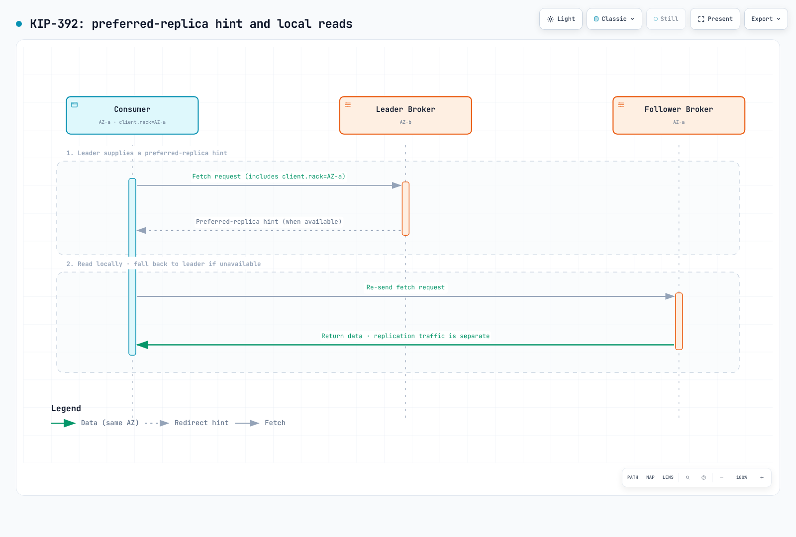

# 分区集群运维：流量转移、升级回滚与数据层 AZ 亲和性

> **审查基线**：EKS 回滚与 ARC 文档、Strimzi 1.2.0、Valkey GLIDE 2.5.2、AWS Advanced JDBC Wrapper 4.4.0
> **最近审查**：September 11, 2026。已检查配置示例；未进行实际集群切换或故障实验。

< [上一章：Tekton Pipelines](14-tekton-pipelines.md) | [目录](./README.md) | [下一章：故障排查手册](16-troubleshooting-playbook.md) >

***

本指南结合了**在工作节点位于本地 AZ 的集群之间转移流量、有条件的版本回滚，以及感知 AZ 的数据读取**。分区集群组不是每个团队的默认架构。当您能够独立运维各单元的容量、路由、部署和数据依赖时，可以考虑采用它。

这里的分区指**工作节点和应用的放置位置**。[托管 EKS 控制平面](https://docs.aws.amazon.com/eks/latest/userguide/eks-architecture.html)仍然分布在多个 AZ。整个集群并不位于单一 AZ 内。

## 目录

1. [为什么采用分区运维](#why-zonal-operations)
2. [流量层：目标组 + TargetGroupBinding + 权重转移](#traffic-layer-target-group--targetgroupbinding--weight-shifting)
3. [升级：就地升级与原生回滚的条件](#upgrades-conditions-for-in-place-and-native-rollback)
4. [数据层：优先在同一 AZ 读取](#data-layer-prefer-same-az-reads)
5. [推荐组合概览](#recommended-combination-summary)

***

## 为什么采用分区运维 {#why-zonal-operations}

| 方面 | 跨多个 AZ 的单一集群 | 每个集群的工作节点位于一个 AZ |
|--------|------------------------|--------------------------------------|
| 故障隔离 | 健康 AZ 中的副本和备用容量负责恢复 | 一个单元可能失去全部工作节点；共享数据库、路由和区域级依赖可能影响其他单元 |
| 跨 AZ 成本 | 取决于服务和数据路径 | 本地应用流量可以减少，但复制、共享服务和负载均衡器转发仍可能跨 AZ |
| 升级 | 控制平面和节点分阶段变更，并管理版本偏差 | 逐单元升级需要兼容的版本，以及其他单元的可用容量 |
| 运维复杂度 | 一个集群 | 多个集群及协调的路由 |

参阅 AWS 的[Amazon EKS 基于单元的架构指南](https://aws.amazon.com/solutions/guidance/cell-based-architecture-for-amazon-eks/)。尽量减少单元之间的依赖，并为健康单元配置足以承接故障单元流量的容量。通过 DNS 选择各单元的负载均衡器，与在一个负载均衡器后对目标组设置权重，是不同的路由设计。应根据实际流量路径和各服务的计费规则测算成本。

相关指南：[高级基础设施](02-infrastructure-advanced.md)和 [EKS 弹性](../eks/10-eks-resiliency.md)。

***


## 流量层：目标组 + TargetGroupBinding + 权重转移 {#traffic-layer-target-group--targetgroupbinding--weight-shifting}


[🔍 查看交互式图表](https://www.atomai.click/kubernetes-docs/archmaps/en-ops-15-zonal-operations-guide-0.html)

对于共享一个负载均衡器的两个集群：

1. 使用 IaC 在集群外创建 NLB/ALB 和目标组，使替换集群不会删除负载均衡器。
2. 使用 `TargetGroupBinding` 将每个集群的 Service 绑定到其专属目标组。
3. 在**侦听器的转发动作**中修改权重。TGB 本身没有权重字段。明确划分 IaC 与控制器对目标组和侦听器配置的管理权。

TGB 示例假定 `production` 命名空间、`app-service:80`、目标 VPC 中的 IP 类型目标组及 AWS Load Balancer Controller 已存在。替换示例 ARN，并验证目标健康状态和网络访问。

本示例使用**单独安装的 AWS Load Balancer Controller**。Auto Mode 内置 TGB 使用 eks.amazonaws.com/v1，并遵循不同的[标签和生命周期规则](https://docs.aws.amazon.com/eks/latest/userguide/auto-configure-alb.html)。AWS 文档说明，删除该内置 TGB 或集群时会删除目标组；不要将其管理模型与这里由外部管理的目标组混用。

```yaml
apiVersion: elbv2.k8s.aws/v1beta1
kind: TargetGroupBinding
metadata:
  name: zone-a-tgb
  namespace: production
spec:
  targetGroupARN: arn:aws:elasticloadbalancing:ap-northeast-2:ACCOUNT:targetgroup/zone-a-tg/xxxxxxxxxxxx
  serviceRef:
    name: app-service
    port: 80
  targetType: ip
```

```bash
set -euo pipefail
# NLB listener whose existing default action forwards to these two groups.
# Nondefault ALB rules require modify-rule, not this operation.
: "${LISTENER_ARN:?}" "${ZONE_A_TG_ARN:?}" "${ZONE_C_TG_ARN:?}"
aws elbv2 describe-listeners \
  --listener-arns "$LISTENER_ARN" \
  --query 'Listeners[0].DefaultActions' --output json > current-actions.json
jq -e --arg a "$ZONE_A_TG_ARN" --arg c "$ZONE_C_TG_ARN" '
  if $a == $c or length != 1 or .[0].Type != "forward"
     or ([.[0].ForwardConfig.TargetGroups[].TargetGroupArn] | sort)
        != ([$a, $c] | sort)
  then error("Expected one forward action with exactly the two selected groups")
  else
    .[0].ForwardConfig.TargetGroups |= map(
      .Weight = (if .TargetGroupArn == $a then 20 else 80 end))
  end
' current-actions.json > proposed-actions.json &&
aws elbv2 modify-listener \
  --listener-arn "$LISTENER_ARN" \
  --default-actions file://proposed-actions.json
```

执行前，应将此变更与 IaC 计划协调一致。普通 NLB 权重变更影响**新流**，但**权重为零需要单独处理**。[当前用户指南](https://docs.aws.amazon.com/elasticloadbalancing/latest/network/load-balancer-listeners.html)指出，设为零后不久，该组将不再接收新连接，现有连接也会关闭。不要假定现有连接会一直保留到自然结束；切换到零之前，测试应用排空、重连和重试行为。更改节点前，遵循[官方指南](https://aws.amazon.com/blogs/networking-and-content-delivery/network-load-balancers-now-support-weighted-target-groups/)，检查各目标组的 `NewFlowCount`、`ActiveFlowCount`、健康状态、错误率及连接排空情况。验证目标组协议/IP 版本兼容性和跨可用区设置。当目标仅位于不同 AZ 时，禁用跨可用区负载均衡可能阻止实现预期的权重分配。

Route 53 加权记录选择的是**负载均衡器 DNS 端点**，而不是目标组 ARN。TTL、客户端缓存和长连接也使 DNS 无法瞬时切换。周边配置参阅 [AWS Load Balancer Controller](../networking/03-aws-lb-controller.md) 和[高级基础设施](02-infrastructure-advanced.md)。

**计划内转移与故障响应：** 权重变更支持计划内切换，但不提供自动故障检测。[ARC zonal shift](https://docs.aws.amazon.com/eks/latest/userguide/zone-shift.html) 由运维人员发起。**Zonal autoshift** 需要单独启用，并配置演练和告警。EKS 资源的分区转移会改变该集群内受损 AZ 的端点/节点处理方式；不会改写另一个集群的目标组权重。负载均衡器资源的转移也需单独规划。

> **EKS Auto Mode 支持：** 在 [July 2026 发布](https://aws.amazon.com/about-aws/whats-new/2026/07/eks-auto-mode-arc-zonal-shift/)之后，启用集群 zonal shift 可让 Auto Mode 在转移期间限制受损 AZ 中的新资源预置和自愿中断。这本身并不会启用 autoshift。**从唯一包含工作节点的 AZ 移走流量可能导致服务中断。** EKS 转移需要健康 AZ 中的副本、CoreDNS 和备用容量。工作节点仅位于一个 AZ 的单元，恢复时需要外部单元路由。

***

## 升级：就地升级与原生回滚的条件 {#upgrades-conditions-for-in-place-and-native-rollback}

[EKS 原生版本回滚](https://docs.aws.amazon.com/eks/latest/userguide/rollback-cluster.html)于 July 2026 推出，**在升级完成后七天内发起时，可以返回紧邻的前一个次要版本**。七天是资格窗口，不是恢复时间保证。应检查集群创建版本、支持状态、后续升级、功能兼容性及 Rollback Readiness Insights。

- **Auto Mode：** EKS 先回滚 Auto Mode 节点，再回滚控制平面。PDB 和 NodePool 中断预算仍然适用；回滚并非瞬时完成。
- **托管节点组：** 使用 `UpdateNodegroupVersion` 单独回滚。运维人员需单独准备自管理节点和 Hybrid 节点。节点运行的版本不得高于控制平面。
- **附加组件、数据和应用：** 回滚不会恢复附加组件版本、etcd 数据、持久卷数据或应用变更。应独立规划兼容性和数据迁移恢复。
- **`--force`：** 可以绕过就绪性洞察，但不能绕过回滚资格前提或 Auto Mode 中断控制。应先解决问题，再执行正常回滚流程。

回滚功能本身不收取额外费用；现有集群、计算和流量费用仍然适用。验证其他单元的容量和恢复目标后，再选择就地升级或蓝绿方案。

| 方案 | 适用条件 |
|----------|------------------------|
| **蓝绿集群** | 在独立环境中验证，并保留将流量切回旧环境的能力；共享数据变更需要自己的恢复计划 |
| **分区就地升级 + 原生回滚** | 现有单元集群组能够承接流量，且已测试回滚资格、兼容性和恢复时间 |
| **Route 53 加权 DNS 切换** | 使用不同负载均衡器端点，包括跨区域/账户设计，并考虑 DNS 缓存和健康检查行为 |

运维顺序为**检查其他单元容量 → 转移权重 → 确认连接排空 → 升级 → 验证 → 恢复权重**。详细流程及节点特有条件参阅[升级运维](11-upgrade-operations.md)和 [EKS 升级](../eks/08-eks-upgrades.md)。

***

## 数据层：优先在同一 AZ 读取 {#data-layer-prefer-same-az-reads}

同一 AZ 存在合适副本且应用接受其一致性行为时，优先本地读取。写入、复制、初始元数据请求和故障回退仍可能跨 AZ。应一起测量复制延迟、错误、实际连接目标及传输量。


[🔍 查看交互式图表](https://www.atomai.click/kubernetes-docs/archmaps/en-ops-15-zonal-operations-guide-1.html)

首先确定 Pod 所在的 AZ。Downward API 暴露 Pod 字段，不会直接查询节点标签。

- **节点元数据注入：** 普通 Pod 创建准入发生在调度之前，因此尚不知道目标节点。[AWS MSK 指南](https://aws.amazon.com/blogs/big-data/optimize-traffic-costs-of-amazon-msk-consumers-on-amazon-eks-with-rack-awareness/)处理 **`Pod/binding` 请求**，读取选定节点并注入其 AZ ID。应一起配置 Kyverno 的 binding 请求过滤器、节点读取 RBAC，并确保在 Pod 启动前完成。
- **调度后查询：** 通过 Downward API 暴露 `spec.nodeName`，使用可信的初始化组件读取节点标签。不要向所有应用授予广泛的节点读取权限。
- **EC2 IMDSv2：** 有意开放 EC2 元数据访问时，应先获取令牌，再读取放置信息。不要假定 IMDSv1 GET 能工作，也不要无差别移除元数据限制。此方法不直接适用于 Fargate。
- **Operator 支持：** Strimzi 为其管理的 broker 和受支持的客户端资源配置机架感知。它不会自动设置无关应用 Deployment 中的 `client.rack`。

**不要混用 AZ 名称和 AZ ID。** Kafka 的 `broker.rack` 与 `client.rack` 必须使用匹配的字符串。如果 MSK 使用 AZ ID，不要替换为 `ap-northeast-2a` 这样的名称。GLIDE 的 `client_az` 同样必须与服务器报告的 AZ 值匹配。

### Kafka：KIP-392 跟随副本读取

Kafka 2.4 引入的 [KIP-392](https://cwiki.apache.org/confluence/display/KAFKA/KIP-392:+Allow+consumers+to+fetch+from+closest+replica) 允许消费者从同机架副本读取。这是功能的引入版本，不是建议现在部署 Kafka 2.4。



[🔍 查看交互式图表](https://www.atomai.click/kubernetes-docs/archmaps/en-ops-15-zonal-operations-guide-10.html)

- **Broker：** 配置 `replica.selector.class=org.apache.kafka.common.replica.RackAwareReplicaSelector` 和 `broker.rack`。
- **消费者：** 将 `client.rack` 设为消费者所在机架。没有合适的本地副本时，选择会回退到 leader。
- **Strimzi 1.2.0：** 以下是**需合并到现有 Kafka CR 的配置片段**，不是完整部署。还需要 KafkaNodePools、侦听器、存储及其他配置。从 Strimzi 1.0 起，CR API 为 `v1`；还应指定机架类型。

```yaml
apiVersion: kafka.strimzi.io/v1
kind: Kafka
metadata:
  name: my-cluster
spec:
  kafka:
    rack:
      type: topology-label
      topologyKey: topology.kubernetes.io/zone
    config:
      replica.selector.class: org.apache.kafka.common.replica.RackAwareReplicaSelector
```

这会配置 broker 的 `broker.rack`。普通应用消费者的 `client.rack` 需单独设置。KafkaConnect、MirrorMaker 2 和 Bridge 有各自的 CR 机架设置。还应遵循 [Strimzi 文档](https://strimzi.io/docs/operators/1.2.0/configuring.html)分散 broker 的放置位置。由于复制延迟，跟随副本读取可能增加读取延迟。

[KIP-881](https://cwiki.apache.org/confluence/display/KAFKA/KIP-881%3A+Rack-aware+Partition+Assignment+for+Kafka+Consumers) 涉及机架感知的分区分配，这是另一种机制。应检查消费者版本和分配器支持。部署指南参阅 [EKS 上的 Kafka](../data-on-eks/kafka/README.md)。

### Redis/Valkey（ElastiCache）：AZ 亲和性读取策略

以下是本章讨论的主要 [Valkey GLIDE](https://valkey.io/blog/az-affinity-strategy/) `ReadFrom` 选项。GLIDE 2.5.2 还提供 `ALL_NODES`；这不是完整的枚举列表。

| 策略 | 行为 |
|----------|----------|
| `PRIMARY` | 从主节点读取（默认） |
| `PREFER_REPLICA` | 在副本间轮询；无可用副本时使用主节点 |
| `AZ_AFFINITY` | 优先本地副本，然后使用其他副本或主节点 |
| `AZ_AFFINITY_REPLICAS_AND_PRIMARY` | 本地副本 → 本地主节点 → 其他 AZ 的副本或主节点 |

应用能够容忍陈旧数据时，可以考虑副本读取；读取比例本身不能决定策略。验证服务器对 AZ 元数据的支持/配置、主节点负载及回退行为。需要**数据新鲜度或写后读**的请求应单独设计，例如在适合数据模型的情况下从主节点读取。

这个 `valkey-glide==2.5.2` 示例**为集群模式创建配置**，但不打开连接。它启用 TLS；需要身份验证时应提供 `credentials`。如果禁用集群模式，则改用 `GlideClientConfiguration` 和 `GlideClient`。

```python
from glide import GlideClusterClientConfiguration, NodeAddress, ReadFrom


def cache_config(host: str, client_az: str, credentials=None):
    if not host or not client_az:
        raise ValueError("Cache endpoint and client AZ are required")
    return GlideClusterClientConfiguration(
        addresses=[NodeAddress(host, 6379)],
        use_tls=True,
        credentials=credentials,
        read_from=ReadFrom.AZ_AFFINITY_REPLICAS_AND_PRIMARY,
        client_az=client_az,
    )
```

[HotelTrader 案例](https://aws.amazon.com/blogs/database/how-hoteltrader-cut-inter-az-cost-95-and-latency-by-49-with-valkey-glide-on-amazon-elasticache/)报告，在**同时采用 AZ 感知路由和请求批处理**后，AZ 间传输成本降低了 95%，平均延迟降低了 49%。这些是该 ECS/ElastiCache 工作负载的结果，不是单独启用路由选项即可获得的保证。

### Aurora/RDS：读取器端点的限制与替代方案

Aurora 的[默认读取器端点](https://docs.aws.amazon.com/AmazonRDS/latest/AuroraUserGuide/Aurora.Endpoints.Reader.html)在只读副本间均衡分配**连接**；不保证 AZ 优先级或逐查询均衡。没有副本时，它可以连接到写入器。仅修改 DNS 不会将现有连接池中的连接迁移到另一个实例。

1. **每 AZ 自定义端点：** 验证实例的 AZ 和读取器角色后，明确选择实例 ID。将此创建示例中的名称替换为真实资源。

   ```bash
   aws rds create-db-cluster-endpoint \
     --db-cluster-identifier my-aurora-cluster \
     --db-cluster-endpoint-identifier reader-az-a \
     --endpoint-type READER \
     --static-members db-instance-az-a-1 db-instance-az-a-2
   ```

   CLI/API 支持 `READER` 端点。提升为写入器的成员会被排除，新副本不会自动加入静态列表。检查[成员行为](https://docs.aws.amazon.com/AmazonRDS/latest/AuroraUserGuide/Aurora.Endpoints.Custom.Considerations.html)，并在没有本地读取器时提供应用回退端点或明确的失败策略。

2. **AWS Advanced JDBC Wrapper 4.4.0：** [`fastestResponse`](https://github.com/aws/aws-advanced-jdbc-wrapper/blob/4.4.0/docs/using-the-jdbc-driver/HostSelectionStrategies.md) 根据实测响应时间选择主机。还需加载 `fastestResponseStrategy` 插件。这不是基于 AZ 标签的约束；响应最快的主机不保证位于本地。

[Issue #1139](https://github.com/aws/aws-advanced-jdbc-wrapper/issues/1139) 在讨论确认 2.5.5 的响应时间功能满足请求后，已于 **May 2025 关闭**。它不是一个仍开放的功能请求，不能据此证明自定义端点是唯一方案。

### Kubernetes Service 层的补充选项

[拓扑感知路由](https://kubernetes.io/docs/concepts/services-networking/topology-aware-routing/)和 [Istio 分区感知路由](../service-mesh/istio/resilience/03-zone-aware-routing.md)可补充 Service 端点选择。本地端点不足、健康状态变化和配置都可能使流量转向其他 AZ。它们不会自动控制外部 DB/cache/Kafka 连接。优先选择并不保证整个读取路径都留在一个 AZ。

***

## 推荐组合概览 {#recommended-combination-summary}

| 层 | 选择依据 | 替代方案/回退 |
|-------|--------------------|----------------------|
| 架构 | 独立单元运维和健康单元容量 | 跨多个 AZ 的单一集群仍是有效选择 |
| 流量转移 | 负载均衡器转发动作权重与 TGB 目标注册 | Route 53 选择负载均衡器端点 |
| 故障响应 | 手动 zonal shift / 单独启用的 autoshift | 单 AZ 工作节点单元需要外部单元路由 |
| 升级 | 已测试的资格、兼容性和恢复时间 | 蓝绿方案，数据恢复单独处理 |
| Kafka 读取 | Broker 选择器与匹配的消费者机架 | 无合适本地副本时回退到 leader |
| 缓存读取 | 匹配新鲜度和 AZ 元数据的 GLIDE 策略 | 验证远程回退和主节点负载 |
| 数据库读取 | 维护本地读取器列表或基于响应时间选择 | 处理本地读取器缺失和重连 |

测量负载、成本和恢复时间基线，然后在生产环境之外演练流量转移和回滚。读取路径优化也可独立引入：先在小范围验证一致性、回退和成本，再扩大应用范围。

***

< [上一章：Tekton Pipelines](14-tekton-pipelines.md) | [目录](./README.md) | [下一章：故障排查手册](16-troubleshooting-playbook.md) >
