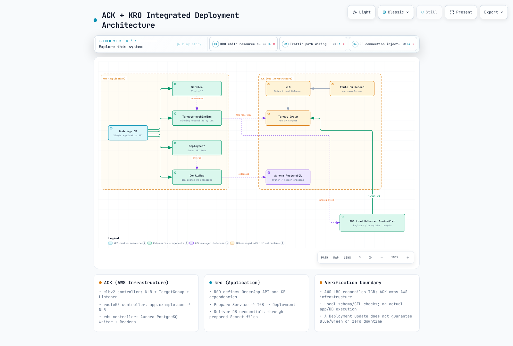

# ExampleCorp 订单系统：ACK + kro 集成

> **最后更新**: September 12, 2026 · kro 0.9.4 / AWS Load Balancer Controller 3.5.0

## 场景与验证范围

ExampleCorp 是虚构的。本指南定义了一份集成契约，用于将 kro 应用图（application graph）与由 ACK 管理的基础设施连接起来。它并不是一个端到端实验，不提供可用的 Order API 或公开的应用镜像。此前那个虚构的 ECR 镜像并不作为可运行镜像提供。

ACK 管理 NLB、TargetGroup、Listener、Route 53 记录以及 Aurora。kro 创建 Service、ConfigMap、TargetGroupBinding（TGB）和 Deployment 资源。**由一个独立的 AWS Load Balancer Controller（LBC）协调（reconcile）TGB，并注册/注销 Pod IP 目标。** 仅安装 ACK 和 kro 并不会实现这一连接。



[交互式图表](https://www.atomai.click/kubernetes-docs/archmaps/en-platform-engineering-05-example-corp-app-0.html)

## 基础设施与应用前置条件

请先查看 [ACK 资源示例](ack/03-elbv2-route53-rds.md) 中当前的 schema 与生命周期指引。准备好已批准的 VPC/私有子网/安全组、一个内部 NLB/Listener、一个 ip 类型的 TargetGroup、DNS 以及 Aurora 集群/实例。请从 `.status.ackResourceMetadata.arn` 读取 TargetGroup ARN，而不是此前的 `.status.targetGroupARN`。

请单独准备 AWS LBC 及其 CRD、IAM/ServiceAccount 和 webhook。本指南检查的是 OSS LBC 3.5.0 的 elbv2.k8s.aws/v1beta1 TGB，而不是 EKS Auto Mode 中另一套不同的负载均衡 API。TGB 的编写者可以引用 controller IAM 权限范围内的 TargetGroup，因此请约束允许的 ARN、namespace 以及写入权限。

运维方必须提供满足以下契约的 Order API 镜像：

- 在配置的端口上提供 HTTP 服务，readiness 路径为 `/readyz`。
- 从 ConfigMap 配置中读取 DB_WRITER_HOST、DB_READER_HOST、DB_PORT 和 DB_NAME。
- 读取并轮换 DB_CREDENTIALS_DIR 下的凭证文件。不要把密码放在环境变量、ConfigMap 或 status 中。
- 能以 UID 10001、只读根文件系统、受限资源以及可写的 /tmp 卷运行。如果实际镜像有差异，请在安全策略下调整该契约。

请通过已批准的 provider/ESO 流程准备 production 和 order-db-credentials。由 RDS 管理的 Secrets Manager 凭证不会自动创建 Kubernetes Secret。应用数据库/用户、最小化的数据库权限、TLS 校验和连接池是相互独立的要求。在 CR 中指定数据库名称并不会创建该数据库。

## 就绪门控与创建顺序

对于 LBC Pod readiness gate，请**在创建 Pod 之前**为 namespace 打上 elbv2.k8s.aws/pod-readiness-gate-inject=enabled 标签。匹配的 Service 及其 ip 类型 TGB 必须已经存在。该图通过 CEL 强制执行 Service → TGB → Deployment 的顺序；Deployment 注解引用 TGB 名称以建立该依赖关系。

TGB 没有用于等待目标健康的 readyWhen。让 Pod 创建等待目标健康可能导致死锁，因为此时并不存在可以成为健康目标的 Pod。TGB 的存在、LBC 的协调、目标健康和 Pod readiness 是不同的状态。请验证 webhook failurePolicy/注入、滚动发布、关闭宽限期以及注销延迟。

## ResourceGraphDefinition

这些文件同样位于 examples/platform/examplecorp 中。请审阅并为 OrderApp/status/finalizers 以及 Service、ConfigMap、Deployment 和 TGB 资源添加聚合 RBAC。创建 RGD 的权限相当于委派了 controller 权限的使用。

```yaml
apiVersion: kro.run/v1alpha1
kind: ResourceGraphDefinition
metadata:
  name: examplecorp-webapps
spec:
  schema:
    apiVersion: v1alpha1
    group: platform.example.com
    kind: OrderApp
    scope: Namespaced
    spec:
      replicas: integer | default=3 minimum=1 maximum=10
      image: string | required=true
      port: integer | default=8080 minimum=1 maximum=65535
      targetGroupARN: string | required=true
      vpcID: string | required=true
      credentialsSecretName: string | required=true
      aurora:
        writerEndpoint: string | required=true
        readerEndpoint: string | required=true
        port: integer | default=5432
        dbName: string | required=true
    status:
      availableReplicas: ${deployment.status.availableReplicas}
      serviceIP: ${service.spec.clusterIP}
  resources:
  - id: service
    template:
      apiVersion: v1
      kind: Service
      metadata:
        name: ${schema.metadata.name}
        namespace: ${schema.metadata.namespace}
        labels:
          app.kubernetes.io/name: ${schema.metadata.name}
      spec:
        type: ClusterIP
        selector:
          app.kubernetes.io/name: ${schema.metadata.name}
        ports:
        - name: http
          port: ${schema.spec.port}
          targetPort: http
  - id: dbConfig
    template:
      apiVersion: v1
      kind: ConfigMap
      metadata:
        name: ${schema.metadata.name + "-db"}
        namespace: ${schema.metadata.namespace}
        labels:
          app.kubernetes.io/name: ${schema.metadata.name}
      data:
        DB_WRITER_HOST: ${schema.spec.aurora.writerEndpoint}
        DB_READER_HOST: ${schema.spec.aurora.readerEndpoint}
        DB_PORT: ${string(schema.spec.aurora.port)}
        DB_NAME: ${schema.spec.aurora.dbName}
  - id: targetGroupBinding
    template:
      apiVersion: elbv2.k8s.aws/v1beta1
      kind: TargetGroupBinding
      metadata:
        name: ${schema.metadata.name + "-tgb"}
        namespace: ${schema.metadata.namespace}
        labels:
          app.kubernetes.io/name: ${schema.metadata.name}
      spec:
        targetGroupARN: ${schema.spec.targetGroupARN}
        targetType: ip
        vpcID: ${schema.spec.vpcID}
        serviceRef:
          name: ${service.metadata.name}
          port: ${schema.spec.port}
  - id: deployment
    readyWhen:
    - ${deployment.status.availableReplicas >= deployment.spec.replicas}
    - ${deployment.status.observedGeneration >= deployment.metadata.generation}
    template:
      apiVersion: apps/v1
      kind: Deployment
      metadata:
        name: ${schema.metadata.name}
        namespace: ${schema.metadata.namespace}
        labels:
          app.kubernetes.io/name: ${schema.metadata.name}
      spec:
        replicas: ${schema.spec.replicas}
        selector:
          matchLabels:
            app.kubernetes.io/name: ${schema.metadata.name}
        template:
          metadata:
            labels:
              app.kubernetes.io/name: ${schema.metadata.name}
            annotations:
              platform.example.com/target-group-binding: ${targetGroupBinding.metadata.name}
          spec:
            automountServiceAccountToken: false
            securityContext:
              runAsNonRoot: true
              runAsUser: 10001
              runAsGroup: 10001
              fsGroup: 10001
              seccompProfile:
                type: RuntimeDefault
            containers:
            - name: order-api
              image: ${schema.spec.image}
              ports:
              - name: http
                containerPort: ${schema.spec.port}
              securityContext:
                allowPrivilegeEscalation: false
                readOnlyRootFilesystem: true
                capabilities:
                  drop:
                  - ALL
              resources:
                requests:
                  cpu: 100m
                  memory: 64Mi
                limits:
                  cpu: 500m
                  memory: 128Mi
              readinessProbe:
                httpGet:
                  path: /readyz
                  port: http
              volumeMounts:
              - name: tmp
                mountPath: /tmp
              - name: db-credentials
                mountPath: /var/run/order-db
                readOnly: true
              envFrom:
              - configMapRef:
                  name: ${dbConfig.metadata.name}
              env:
              - name: DB_CREDENTIALS_DIR
                value: /var/run/order-db
            volumes:
            - name: tmp
              emptyDir:
                sizeLimit: 64Mi
            - name: db-credentials
              secret:
                secretName: ${schema.spec.credentialsSecretName}
```

## 实例输入

下面的 example.invalid 地址/镜像以及 ARN/VPC ID 都是占位符。请读取实际的 ACK endpoint/ARN，并在使用前验证应用镜像的 digest 和 Secret。手工复制的 endpoint 不会自动跟随 ACK 的变更；请提供一条已批准的 GitOps 输入更新路径。

```yaml
apiVersion: platform.example.com/v1alpha1
kind: OrderApp
metadata:
  name: order-api
  namespace: production
spec:
  replicas: 3
  image: example.invalid/order-api:replace-with-reviewed-image
  port: 8080
  targetGroupARN: arn:aws:elasticloadbalancing:us-west-2:123456789012:targetgroup/replace-with-approved-tg/0123456789abcdef
  vpcID: vpc-0123456789abcdef0
  credentialsSecretName: order-db-credentials
  aurora:
    writerEndpoint: replace-with-writer-endpoint.example.invalid
    readerEndpoint: replace-with-reader-endpoint.example.invalid
    port: 5432
    dbName: orders
```

## 验证与运维

```bash
kubectl get orderapps.platform.example.com order-api -n production -o yaml
kubectl get deploy,svc,targetgroupbindings.elbv2.k8s.aws,configmap \
  -n production -l app.kubernetes.io/name=order-api
kubectl get pods -n production -l app.kubernetes.io/name=order-api -o wide
```

请结合 Pod readiness gate、EndpointSlice、TGB 状态、AWS 目标健康、DNS/HTTP 以及数据库 TLS 连通性，一起检查 CR 的 conditions 和 Deployment 状态。readiness 是否检查数据库取决于实际的应用。所有生成的资源元数据都带有相同的查询标签。

一个新的支付服务需要经过审阅的镜像、独立的 TargetGroup/Listener 路由方案以及数据库用户/权限/schema 契约。共享 Aurora 并不保证数据、性能或成本隔离。在多个 TGB/集群之间共享同一个 TargetGroup 需要刻意处理 multiClusterTargetGroup 的生命周期；忽略默认的所有权模型可能会注销其他目标。

通过 ACK DBInstance 添加 Aurora 副本时，请使用受支持的实例类型/区域组合；名称/标签并不能确定 writer 角色。请遵循 [RDS 示例](ack/03-elbv2-route53-rds.md) 中关于 promotionTier、endpoint 和故障转移的指引，然后测试实际负载与恢复过程。

更新 Deployment 镜像通常执行的是 RollingUpdate，而不是自动的 Blue/Green，也不保证零停机。Blue/Green 需要独立的应用版本、目标/路由切换、验证指标、回滚条件以及数据库兼容性。删除/替换 CR 可能会清理子 TGB/Deployment 以及目标关联；这并不是一次无害的版本切换。

## 已执行的检查

两份原始指南和所有示例都已通读，并与当前的 RGD/TGB schema 进行了对比。cel-go 编译/求值了 21 个唯一表达式，用于检查四个资源、Service/Pod 选择器、ConfigMap/Service 引用、TGB 先于 Deployment 的依赖关系以及 status。这些都是使用合成输入的本地检查。没有执行任何 AWS 资源、应用镜像、数据库、目标健康、Pod 变更或流量相关操作。

- [ACK](02-ack.md)
- [kro](03-kro.md)
- [AWS LBC 3.5.0 TGB](https://github.com/kubernetes-sigs/aws-load-balancer-controller/blob/v3.5.0/docs/guide/targetgroupbinding/targetgroupbinding.md)
- [Pod readiness gates](https://github.com/kubernetes-sigs/aws-load-balancer-controller/blob/v3.5.0/docs/deploy/pod_readiness_gate.md)
