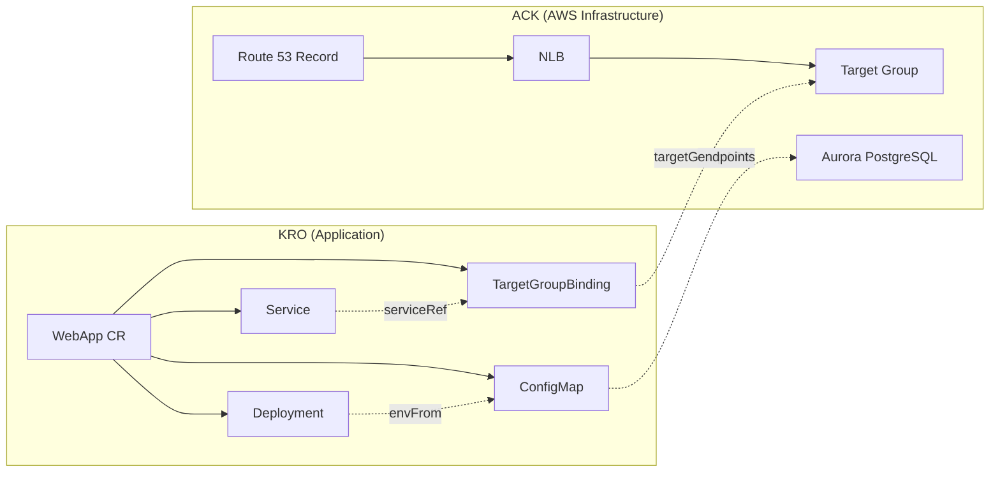

# ExampleCorp 订单系统：ACK + KRO 集成部署

> **最后更新**: February 21, 2026

## 场景概述

这是一个将 ExampleCorp 的 Order API 部署到 Kubernetes 的端到端示例。ACK 负责预置 AWS 基础设施（NLB、Aurora PostgreSQL、Route 53），而 KRO 将应用资源（Deployment、Service、TargetGroupBinding、ConfigMap）作为单个 Custom Resource（自定义资源）进行管理。

```
ACK (AWS Infrastructure)    KRO (App Deployment)
─────────────────────     ─────────────────────
NLB + TargetGroup    ←──  TargetGroupBinding
Aurora PostgreSQL    ←──  ConfigMap (endpoints)
Route 53 Record           Deployment + Service
```

ACK 使用 [ACK 文档](./02-ack.md) 中描述的 ELBv2、Route 53 和 RDS controllers 来创建基础设施，KRO 则将引用这些基础设施的应用资源作为单个 CR 进行管理。

## 架构图



## 步骤 1：使用 ACK 预置基础设施

使用 ACK controllers（elbv2、route53、rds）来预置以下基础设施。有关每个资源的详细 YAML，请参阅 [ACK 资源示例](./ack/03-elbv2-route53-rds.md)。

- **NLB + TargetGroup + Listener**：应用流量入口
- **Route 53 DNS Record**：`app.example.com` → NLB 映射
- **Aurora PostgreSQL**：DBSubnetGroup + DBCluster + Writer + 2 Readers + Custom Endpoint

## 步骤 2：KRO ResourceGraphDefinition

```yaml
apiVersion: kro.run/v1alpha1
kind: ResourceGraphDefinition
metadata:
  name: webapp-graph
spec:
  resourceKind:
    group: kro.example.com
    kind: WebApp
    version: v1
  childResources:
    # 1. ConfigMap — Aurora connection info
    - apiVersion: v1
      kind: ConfigMap
      nameTemplate: "{{.parent.metadata.name}}-db-config"
      template: |
        data:
          DB_WRITER_HOST: "{{.parent.spec.aurora.writerEndpoint}}"
          DB_READER_HOST: "{{.parent.spec.aurora.readerEndpoint}}"
          DB_PORT: "{{.parent.spec.aurora.port}}"
          DB_NAME: "{{.parent.spec.aurora.dbName}}"

    # 2. Deployment — App container
    - apiVersion: apps/v1
      kind: Deployment
      nameTemplate: "{{.parent.metadata.name}}"
      template: |
        spec:
          replicas: {{.parent.spec.replicas}}
          selector:
            matchLabels:
              app: {{.parent.spec.appName}}
          template:
            metadata:
              labels:
                app: {{.parent.spec.appName}}
            spec:
              containers:
              - name: {{.parent.spec.appName}}
                image: {{.parent.spec.image}}
                ports:
                - containerPort: {{.parent.spec.port}}
                envFrom:
                - configMapRef:
                    name: {{.children.configmap.metadata.name}}

    # 3. Service — ClusterIP
    - apiVersion: v1
      kind: Service
      nameTemplate: "{{.parent.metadata.name}}"
      template: |
        spec:
          selector:
            app: {{.parent.spec.appName}}
          ports:
          - port: {{.parent.spec.port}}
            targetPort: {{.parent.spec.port}}
          type: ClusterIP

    # 4. TargetGroupBinding — ACK Target Group connection
    - apiVersion: elbv2.k8s.aws/v1beta1
      kind: TargetGroupBinding
      nameTemplate: "{{.parent.metadata.name}}-tgb"
      template: |
        spec:
          targetGroupARN: {{.parent.spec.targetGroupARN}}
          serviceRef:
            name: {{.children.service.metadata.name}}
            port: {{.parent.spec.port}}
          targetType: ip

  statusMappings:
    - childResource:
        kind: Deployment
        name: "{{.parent.metadata.name}}"
      conditions:
        - type: Available
          mapping:
            type: Ready
    - childResource:
        kind: Service
        name: "{{.parent.metadata.name}}"
      fieldMappings:
        - child: "spec.clusterIP"
          parent: "status.serviceIP"
```

### 输入字段说明

| 字段 | 说明 |
|-------|-------------|
| `appName` | 应用名称（用于 labels、selectors） |
| `image` | Container image URI |
| `replicas` | Deployment replica 数量 |
| `port` | Container 和 Service 端口 |
| `targetGroupARN` | 由 ACK 创建的 Target Group ARN |
| `aurora.writerEndpoint` | ACK DBCluster Writer endpoint |
| `aurora.readerEndpoint` | ACK DBCluster Reader endpoint |
| `aurora.port` | Aurora 端口（默认 5432） |
| `aurora.dbName` | 数据库名称 |

## 步骤 3：应用部署

```yaml
apiVersion: kro.example.com/v1
kind: WebApp
metadata:
  name: order-api
  namespace: production
spec:
  appName: order-api
  image: 123456789012.dkr.ecr.ap-northeast-2.amazonaws.com/order-api:v1.2.0
  replicas: 3
  port: 8080
  targetGroupARN: <ACK TargetGroup's .status.targetGroupARN>
  aurora:
    writerEndpoint: <ACK DBCluster's .status.endpoint>
    readerEndpoint: <ACK DBCluster's .status.readerEndpoint>
    port: "5432"
    dbName: orders
```

将 ACK 创建的基础设施输出值（Target Group ARN、Aurora endpoints）注入到 KRO CR spec 中。

## 步骤 4：验证

```bash
# Check WebApp CR status
kubectl get webapp order-api -n production -o yaml

# Check created resources
kubectl get deploy,svc,targetgroupbinding,configmap -n production -l app=order-api
```

## 运维模式

### 添加新 Services

只需添加新的 WebApp CR，即可复用现有基础设施：

```yaml
apiVersion: kro.example.com/v1
kind: WebApp
metadata:
  name: payment-api
  namespace: production
spec:
  appName: payment-api
  image: 123456789012.dkr.ecr.ap-northeast-2.amazonaws.com/payment-api:v1.0.0
  replicas: 2
  port: 8080
  targetGroupARN: <new Target Group ARN>
  aurora:
    writerEndpoint: <existing Aurora Writer Endpoint>
    readerEndpoint: <existing Aurora Reader Endpoint>
    port: "5432"
    dbName: payments
```

### Aurora 扩展

添加 ACK DBInstances 以水平扩展 Read Replicas：

```yaml
apiVersion: rds.services.k8s.aws/v1alpha1
kind: DBInstance
metadata:
  name: my-aurora-reader-3
  namespace: infra
spec:
  dbInstanceIdentifier: my-aurora-reader-3
  dbClusterIdentifier: my-aurora-cluster
  dbInstanceClass: db.r6g.xlarge
  engine: aurora-postgresql
```

### Blue/Green 部署

通过替换 KRO CR 执行零停机部署。应用新版本的 CR 会使 KRO 自动更新 Deployment。

## 参考文档

- [ACK 概念和安装](./02-ack.md)
- [ACK 资源示例：ELBv2、Route 53、RDS](./ack/03-elbv2-route53-rds.md)
- [KRO 概念和 RGD](./03-kro.md)
