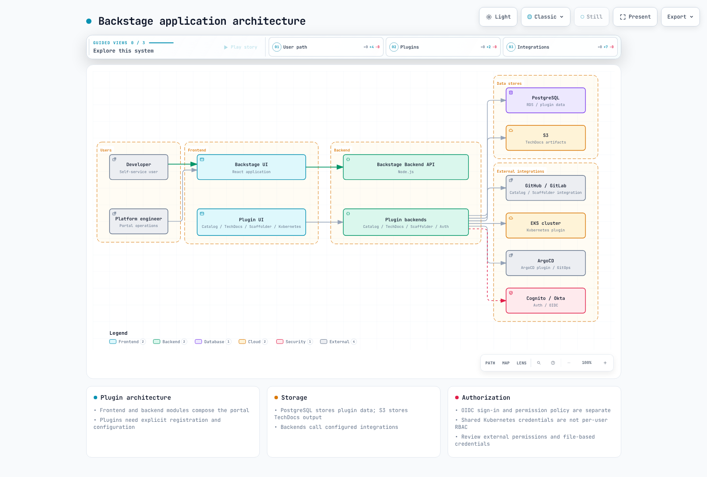

# 用作内部开发者门户的 Backstage

> **最后更新**: September 12, 2026 · Backstage 1.54.7 / Helm chart 2.10.0

## 定位与采用范围

Backstage 是源自 Spotify 的开源开发者门户框架，采用 Apache 2.0 许可。CNCF 将其列为 Incubating 项目。门户可以作为 IDP（内部开发者平台）面向用户的那一部分，但它并不能替代全部基础设施、交付、策略或运维自动化。

Software Catalog 对归属关系、API 以及资源之间的关联进行建模。Software Templates 在预先准备好的骨架（skeleton）上执行已配置的操作。TechDocs 负责文档的构建、发布与阅读。Search 需要配置好的 collator 与索引后端。把代码和文档放在一起并不会自动让内容保持最新。

在与 Port、Cortex、Humanitec、OpsLevel 或其他产品进行比较时，请评估当前的托管方式、数据边界、扩展 API 以及人力/订阅/基础设施成本。避免采用未经核实的插件数量或采用率数据、放之四海而皆准的排名，或者“Backstage 只需要付基础设施费用”这类说法。许可条款与运营成本是两件不同的事。

## 架构与插件

React 前端与 Node.js 后端共同组成 catalog、scaffolder、auth 和 TechDocs 插件。请安装并注册所需的模块。插件本身并不天然提供独立部署或安全隔离。请根据所选的应用架构，使用旧版 EntityPage 或较新的前端扩展 API。



[交互式图表](https://www.atomai.click/kubernetes-docs/archmaps/en-platform-engineering-06-backstage-idp-0.html)

## 应用创建、构建与版本

Backstage 的发布版本、各个 npm 包的版本、Helm chart 版本以及自定义镜像的修订号是彼此不同的值。1.54.7 版本要求 Node.js 22 或 24；此前基于 Node 20 的 Dockerfile 已不是当前的默认选项。

本次核查的 create-app 包版本为 0.9.1。生成之后，请检查其 lockfile、packageManager 以及前端/后端结构。以下命令描述的是应用的构建流程；本次核查过程中并未真正构建一个完整的 Backstage 应用。

```bash
npx @backstage/create-app@0.9.1
# In the generated app, using its supported Node/Yarn versions:
yarn install --immutable
yarn tsc
yarn build:backend
```

请查看生成的 packages/backend/Dockerfile。当前模板会解压 skeleton.tar.gz、安装生产依赖、解压 bundle.tar.gz，然后运行 packages/backend。仅仅复制 dist 并执行 node packages/backend/dist 与该 bundle 格式并不匹配。

请让主机与容器的 Node 主版本以及原生模块的 ABI 保持一致，并确认操作系统/架构对应的镜像。不要创建与镜像内置 node 用户冲突的第二个 UID 1000 用户。请单独准备 ECR/推送权限与镜像摘要；不要把凭证写入镜像、构建参数或环境变量。在采用外部 TechDocs 构建方式时，阅读侧的镜像无需运行文档构建工具链。

## 使用凭证文件的 EKS 配置

以下是一个配置示例。请替换 example.invalid 以及经过批准的组织、bucket 和 OIDC 客户端等取值。这并不能作为已连接 PostgreSQL、身份提供方、GitHub 或 S3 的证据。

请通过经过批准的提供方/ESO 流程准备 backstage-credentials，并以文件形式挂载。Backstage 实际的加载器会解析 `$file` 并去掉末尾换行符。请对齐配置路径与挂载路径，并确认每个插件在凭证轮换后何时重新读取新值。SubPath 挂载以及仅在启动时读取的配置可能需要重新滚动发布。

该示例把一个 PostgreSQL 数据库划分为多个插件 schema。ensureExists/ensureSchemaExists 已被禁用，因此需要事先准备好 schema/数据库。通过同一份凭证访问的多个 schema 并不是彼此独立的安全边界。请审查迁移权限，并按 **插件数 × 副本数** 汇总连接池的连接数。请校验 RDS CA，并保持启用 TLS 校验。

```yaml
app:
  title: Example Developer Portal
  baseUrl: https://backstage.example.com
backend:
  baseUrl: https://backstage.example.com
  listen:
    port: 7007
  cors:
    origin: https://backstage.example.com
    credentials: true
  database:
    client: pg
    pluginDivisionMode: schema
    ensureExists: false
    ensureSchemaExists: false
    connection:
      host: backstage-db.example.invalid
      port: 5432
      database: backstage
      user: backstage
      password:
        $file: /var/run/backstage-secrets/postgres-password
      ssl:
        rejectUnauthorized: true
        ca:
          $file: /var/run/backstage-public/rds-ca.pem
    knexConfig:
      pool:
        min: 0
        max: 10
  auditor:
    severityLogLevelMappings:
      low: debug
      medium: info
      high: warn
      critical: error
auth:
  environment: production
  session:
    secret:
      $file: /var/run/backstage-secrets/auth-session-secret
  providers:
    oidc:
      production:
        metadataUrl: https://issuer.example.invalid/.well-known/openid-configuration
        clientId: replace-with-approved-client-id
        clientSecret:
          $file: /var/run/backstage-secrets/oidc-client-secret
        additionalScopes: [profile, email]
        signIn:
          resolvers:
            - resolver: emailMatchingUserEntityProfileEmail
permission:
  enabled: true
integrations:
  github:
    - host: github.com
      token:
        $file: /var/run/backstage-secrets/github-token
catalog:
  providers:
    github:
      approvedOrg:
        organization: replace-approved-org
        catalogPath: /catalog-info.yaml
        filters:
          branch: main
          repository: "^approved-.*$"
        schedule:
          frequency: {minutes: 30}
          timeout: {minutes: 3}
  rules:
    - allow: [Component, API, Resource, System, Domain, Group, User, Template, Location]
techdocs:
  builder: external
  publisher:
    type: awsS3
    awsS3:
      bucketName: replace-approved-techdocs-bucket
      region: us-west-2
```

后端同样支持 RDS IAM 认证，但这需要 signer 包、rds-db:connect 权限、数据库用户配置以及 TLS。不要把该流程与上面基于密码文件的示例随意混用。

## Helm 配置与 HA

请构建包含已完成配置的 Backstage 应用的镜像。下方的 example.invalid 镜像只是占位符。请先准备好 ServiceAccount、凭证 Secret、RDS CA ConfigMap 以及 app-config ConfigMap。默认不会创建对公网开放的 ingress；经过批准的内部访问或由 CloudFront 前置的访问方式、认证、TLS 与网络管控仍然是运维层面的要求。

```yaml
fullnameOverride: backstage
backstage:
  image:
    registry: example.invalid
    repository: backstage
    tag: replace-with-reviewed-app-revision
  replicas: 3
  resources:
    requests:
      cpu: 250m
      memory: 512Mi
    limits:
      cpu: "1"
      memory: 1Gi
  extraEnvVarsSecrets: []
  extraAppConfig:
    - filename: app-config.production.yaml
      configMapRef: backstage-app-config
  extraVolumeMounts:
    - name: credentials
      mountPath: /var/run/backstage-secrets
      readOnly: true
    - name: public-config
      mountPath: /var/run/backstage-public
      readOnly: true
  extraVolumes:
    - name: credentials
      secret:
        secretName: backstage-credentials
    - name: public-config
      configMap:
        name: backstage-public-config
  readinessProbe:
    httpGet:
      path: /.backstage/health/v1/readiness
      port: 7007
  livenessProbe:
    httpGet:
      path: /.backstage/health/v1/liveness
      port: 7007
  strategy:
    type: RollingUpdate
    rollingUpdate:
      maxUnavailable: 0
      maxSurge: 1
serviceAccount:
  create: false
  name: backstage
  automountServiceAccountToken: false
postgresql:
  enabled: false
ingress:
  enabled: false
```

examples/platform/backstage/app-config-configmap.yaml 把该配置保存在 data.app-config.production.yaml 下。它与 extraAppConfig 的 filename/configMapRef 相匹配，并且其中包含的是文件引用而不是密钥明文。

```bash
helm template backstage backstage/backstage   --version 2.10.0 --namespace backstage   -f examples/platform/backstage/helm-values.yaml
```

请先注册官方的 backstage.github.io/charts 仓库。本次核查在本地下载并渲染了该 chart。serviceAccount 是 chart 的顶层取值，而不是 backstage.serviceAccount。此前的 backstage.podDisruptionBudget 取值在 chart 2.10.0 中不会创建 PDB；请单独准备该资源。

```yaml
apiVersion: policy/v1
kind: PodDisruptionBudget
metadata:
  name: backstage
  namespace: backstage
spec:
  minAvailable: 2
  selector:
    matchLabels:
      app.kubernetes.io/name: backstage
      app.kubernetes.io/instance: backstage
```

当前的健康检查路径是 /.backstage/health/v1/readiness 与 liveness。请让负载均衡器的健康检查与实际后端保持一致。仅有三个副本或一个 PDB 并不能保证 AZ 分布、数据库高可用或零停机。请核实拓扑约束规则、共享的数据库/会话状态、后台任务以及升级迁移。

## OIDC 登录与身份

请注册 OIDC 后端 provider 模块，并配置前端登录。metadataUrl 必须指向所选 Cognito 用户池或 Okta issuer 的可信 issuer discovery 地址。当前的 provider 通过 additionalScopes 来指定额外的 scope。

emailMatchingUserEntityProfileEmail 是一个基于 catalog 用户的 resolver 示例。请审查 issuer/邮箱验证、注册准入边界以及重复邮箱的情况；不要把任意外部 claim 映射为 catalog 管理员。请让 dangerouslyAllowSignInWithoutUserInCatalog 保持禁用。避免在同一个 provider ID 下同时注册内置 provider 与自定义 resolver 模块。

## Software Catalog

这八个实体覆盖了七种 kind，并且 owner/system/domain 引用均可解析。请通过 Component.dependsOn 声明 Resource 依赖。不要以为凭空捏造的 dependencyOf 字段会自动在后端建立关联关系。注册一个 Resource 实体并不会真正开通 AWS 基础设施。


[交互式图表](https://www.atomai.click/kubernetes-docs/archmaps/en-platform-engineering-06-backstage-idp-1.html)

```yaml
apiVersion: backstage.io/v1alpha1
kind: Domain
metadata:
  name: commerce
spec:
  owner: group:default/platform-team
---
apiVersion: backstage.io/v1alpha1
kind: System
metadata:
  name: order-system
spec:
  owner: group:default/backend-team
  domain: commerce
---
apiVersion: backstage.io/v1alpha1
kind: Component
metadata:
  name: order-api
  annotations:
    backstage.io/techdocs-ref: dir:.
    backstage.io/kubernetes-id: order-api
    backstage.io/kubernetes-namespace: production
    github.com/project-slug: replace-approved-org/order-api
    argocd/app-name: order-api
spec:
  type: service
  lifecycle: production
  owner: group:default/backend-team
  system: order-system
  providesApis:
  - order-rest-api
  dependsOn:
  - resource:default/order-db
---
apiVersion: backstage.io/v1alpha1
kind: API
metadata:
  name: order-rest-api
spec:
  type: openapi
  lifecycle: production
  owner: group:default/backend-team
  system: order-system
  definition: "openapi: 3.0.3\ninfo:\n  title: Order API\n  version: 1.0.0\npaths:\n\
    \  /orders:\n    get:\n      responses:\n        \"200\":\n          description:\
    \ Orders returned\n"
---
apiVersion: backstage.io/v1alpha1
kind: Resource
metadata:
  name: order-db
spec:
  type: database
  owner: group:default/backend-team
  system: order-system
---
apiVersion: backstage.io/v1alpha1
kind: Group
metadata:
  name: platform-team
spec:
  type: team
  children: []
---
apiVersion: backstage.io/v1alpha1
kind: Group
metadata:
  name: backend-team
spec:
  type: team
  children: []
  members:
  - alice
---
apiVersion: backstage.io/v1alpha1
kind: User
metadata:
  name: alice
spec:
  profile:
    displayName: Alice
    email: alice@example.com
  memberOf:
  - backend-team
```

GitHub discovery 需要集成凭证以及 catalog-backend-module-github 模块。请针对实际的组织配置 catalogPath、branch/repository 过滤条件以及调度计划。请限定可信来源，而不要假设任何仓库或任意 Location 都可以安全地被纳入。文件位置必须与容器内的路径一致；仅有一个 glob 字符串并不代表注册已经生效。

## Software Templates 与 GitOps

这是一个**仅包含 catalog 与 TechDocs 文件的完整小型骨架**。它并没有被标注为具备运行时、Dockerfile、Helm 与 CI 的完整微服务实现。一条可运行的黄金路径（golden path）需要真实的、与具体语言相关的源码、测试、镜像构建、chart、各环境取值以及流水线。多加一个复选框并不会开通数据库或 HPA。

```yaml
apiVersion: scaffolder.backstage.io/v1beta3
kind: Template
metadata:
  name: reviewed-documentation-starter
  title: Reviewed documentation starter
  description: Creates a catalog and TechDocs skeleton; it does not deploy an application.
spec:
  owner: group:default/platform-team
  type: documentation
  parameters:
    - title: Service metadata
      required: [name, description, owner, repoUrl]
      properties:
        name:
          type: string
          pattern: "^[a-z][a-z0-9-]{1,38}[a-z0-9]$"
        description:
          type: string
          maxLength: 200
        owner:
          type: string
          enum: [group:default/backend-team, group:default/platform-team]
        repoUrl:
          type: string
          ui:field: RepoUrlPicker
          ui:options:
            allowedHosts: [github.com]
            allowedOwners: [replace-approved-org]
  steps:
    - id: fetch
      name: Render the complete documentation skeleton
      action: fetch:template
      input:
        url: ./skeleton
        values:
          name: ${{ parameters.name }}
          description: ${{ parameters.description }}
          owner: ${{ parameters.owner }}
    - id: publish
      name: Create the approved repository
      action: publish:github
      input:
        repoUrl: ${{ parameters.repoUrl }}
        allowedHosts: [github.com]
        repoVisibility: private
        defaultBranch: main
        description: ${{ parameters.description }}
    - id: register
      name: Register the published catalog entity
      action: catalog:register
      input:
        repoContentsUrl: ${{ steps.publish.output.repoContentsUrl }}
        catalogInfoPath: /catalog-info.yaml
  output:
    links:
      - title: Repository
        url: ${{ steps.publish.output.remoteUrl }}
      - title: Catalog
        entityRef: ${{ steps.register.output.entityRef }}
```

template/skeleton 目录中包含 catalog-info.yaml、mkdocs.yml 与 docs/index.md。经过 dump 编码的 description/owner 取值可以保留 YAML 字符串原样，包括已测试过的引号与换行。OwnerPicker 中的实体引用并不是 GitHub team slug；不要通过简单的字符串替换去授予协作者权限。RepoUrlPicker 的限制只是 UI 层面的行为，不能替代后端 action 的校验或 GitHub 凭证的权限范围控制。

publish:github 需要 GitHub action 模块。请检查已注册的 action 及其实际的输入 schema。本示例在仓库发布之后再进行注册。在基础设施类的 publish:github:pull-request 流程中，不要立即去注册一个在合并前尚不存在于 main 分支的文件；应在之后再执行 discovery/注册。

ACK/kro 的 DatabaseClaim 并不是内置的 kind。请参考当前的 [ACK](02-ack.md)、[kro](03-kro.md) 与[集成](05-example-corp-app.md)示例，准备经过验证的 RGD/CRD、控制器与权限。Catalog 实体引用中包含 ':' 与 '/'，因此不能原样复制为 Kubernetes 标签值。

@roadiehq/scaffolder-backend-argocd 1.8.1 提供了 argocd:create-resources。它需要 appName、argoInstance、namespace、repoUrl 与 path；projectName/labelValue 是可选项。namespace 是部署目标，而旧版的 revision 输入项在该 action 的 schema 中已不存在。请注册其后端模块与 token，并限制 AppProject、destination 与仓库权限。本次并未执行任何仓库创建或 ArgoCD API 调用。

在工作流骨架中，请区分 Backstage 的 Nunjucks 表达式与 GitHub 表达式。此前的 CI 在只有 contents:read 权限的情况下尝试 git push，可能触发反复的自提交。请通过独立的 GitOps PR，并配合适当的认证、分支保护与合并检查，来提交经过审查的镜像摘要。

## TechDocs 与 S3

采用外部构建器时，由 CI 负责构建/发布，Backstage 后端负责从 S3 读取。请将 reader 与 publisher 的 IAM 角色分开；默认不要给运行时的 reader 授予 PutObject/DeleteObject 权限。请启用 S3 的全部四项 Block Public Access 设置，并在适用时配置 KMS 密钥策略/权限。ACK 中对应的字段名是 blockPublicACLs/ignorePublicACLs。


[交互式图表](https://www.atomai.click/kubernetes-docs/archmaps/en-platform-engineering-06-backstage-idp-2.html)

TechDocs 仍然支持 credentials.roleArn，但已将其标记为弃用。本示例选择省略该项，改用事先准备好的工作负载身份/SDK 凭证；必要时可使用 aws 的 account/provider 配置。请对齐 reader/publisher 的 bucketRootPath，并结合实际的 CLI 核实 namespace/kind/name 实体键。

这个小型骨架是用 MkDocs/techdocs-core 在 strict 模式下构建的；这并不代表构建了所有服务的文档。发布用的 CI 需要可信的分支/事件、id-token:write 权限、受约束的 OIDC 信任关系以及 publisher 权限。本次核查过程中没有向 S3 上传任何内容。

## Kubernetes、ArgoCD 与成本插件

Kubernetes 插件需要前端/后端注册、真实的 endpoint/CA、认证与 RBAC。不要把打印出来的长期有效 ServiceAccount token 复制进环境变量。EKS 的 AWS 认证需要工作负载身份、目标角色/EKS 访问权限以及 Kubernetes 授权，并且 x-k8s-aws-id 必须与真实的集群名称一致。

服务端的集群凭证可能会被所有 Backstage 用户共用。multiTenant locator 以及 catalog 的 namespace/id 选择器并不是授权边界。请审查每个用户可见的数据范围、后端权限覆盖情况以及集群 RBAC。请让工作负载标签与 catalog 注解相匹配。查看 Pod 日志需要 pods/log 授权以及相应的功能配置。列出 KEDA/Karpenter 的 customResources 并不会生成专门的扩缩容 UI；请使用实际的 CRD status 字段。

ArgoCD 的 UI 插件与 scaffolder action 分属不同的包，需要分别注册并配置权限。本次核查的 Roadie UI 包版本为 2.12.5。旧的 @kubecost/backstage-plugin 及其后端包名在 npm 上返回 404。它们不再作为可安装的命令保留；请选择仍在维护的集成方案或经过验证的成本 API 适配器。请把 allocation 与定价语义与 UI 卡片分开审查。

## 权限框架

permission.enabled:true 并不会安装团队策略。请在后端注册该模块，同时不要再注册与之冲突的 allow-all 策略。它使用当前的 PolicyQueryUser 与 AuthService/UserInfoService 接口，而不是已弃用的 user.info 或更早的 user.identity 形式。

该示例显式允许可信的 platform-team 管理员、允许已认证用户读取 catalog，并允许按 owner 条件删除 catalog 实体，其余操作一律拒绝。它并不是整个门户的完整允许清单；请有意识地逐项添加所需的操作。请保护 Group/User 数据来源，防止用户给自己提权。


[交互式图表](https://www.atomai.click/kubernetes-docs/archmaps/en-platform-engineering-06-backstage-idp-3.html)

```typescript
import {
  AuthorizeResult,
  isPermission,
  type PolicyDecision,
} from '@backstage/plugin-permission-common';
import type {
  PermissionPolicy,
  PolicyQuery,
  PolicyQueryUser,
} from '@backstage/plugin-permission-node';
import {
  catalogEntityDeletePermission,
  catalogEntityReadPermission,
} from '@backstage/plugin-catalog-common/alpha';
import {
  coreServices,
  createBackendModule,
  type AuthService,
  type UserInfoService,
} from '@backstage/backend-plugin-api';
import { policyExtensionPoint } from '@backstage/plugin-permission-node/alpha';

export class TeamPolicy implements PermissionPolicy {
  constructor(
    private readonly userInfo: UserInfoService,
    private readonly auth: Pick<AuthService, 'isPrincipal'>,
  ) {}

  async handle(
    request: PolicyQuery,
    user?: PolicyQueryUser,
  ): Promise<PolicyDecision> {
    if (!user || !this.auth.isPrincipal(user.credentials, 'user')) {
      return { result: AuthorizeResult.DENY };
    }
    const { ownershipEntityRefs } = await this.userInfo.getUserInfo(
      user.credentials,
    );
    if (ownershipEntityRefs.includes('group:default/platform-team')) {
      return { result: AuthorizeResult.ALLOW };
    }
    if (isPermission(request.permission, catalogEntityReadPermission)) {
      return { result: AuthorizeResult.ALLOW };
    }
    if (
      isPermission(request.permission, catalogEntityDeletePermission) &&
      ownershipEntityRefs.length > 0
    ) {
      return {
        result: AuthorizeResult.CONDITIONAL,
        pluginId: 'catalog',
        resourceType: 'catalog-entity',
        conditions: {
          resourceType: 'catalog-entity',
          rule: 'IS_ENTITY_OWNER',
          params: { claims: ownershipEntityRefs },
        },
      };
    }
    // Add explicit grants for required plugin actions after reviewing their scope.
    return { result: AuthorizeResult.DENY };
  }
}

export const teamPolicyModule = createBackendModule({
  pluginId: 'permission',
  moduleId: 'reviewed-team-policy',
  register(reg) {
    reg.registerInit({
      deps: {
        policy: policyExtensionPoint,
        userInfo: coreServices.userInfo,
        auth: coreServices.auth,
      },
      async init({ policy, userInfo, auth }) {
        policy.setPolicy(new TeamPolicy(userInfo, auth));
      },
    });
  },
});
```

CONDITIONAL 决策必须由 catalog 后端应用到实际的实体关联关系上。删除 catalog 实体的权限与修改 GitHub 或执行 ArgoCD 部署的权限是彼此独立的。不要把它泛化成“owner 可以执行任何更新”。这八个策略用例使用的是被 mock 的身份服务，而不是真实的 OIDC 或 catalog 归属关系评估器。

## 审计、恢复与升级

当前的核心 Auditor Service 默认通过 rootLogger 输出日志，并支持 backend.auditor.severityLogLevelMappings。此前的 backend.audit 与 backend.events.modules awsCloudWatch 配置并不会自动配置审计日志采集。请先确认各插件实际会发出哪些事件，然后通过独立的管道转发日志。避免在事件元数据中泄露凭证或个人数据。

请针对实际的 RPO/RTO 要求，规划 PostgreSQL 快照/PITR、TechDocs 版本管理/复制/生命周期、配置与 catalog 数据来源，以及密钥提供方的恢复方案。仅靠共享数据库中的 schema 划分、Aurora 只读副本或 S3 复制，并不能提供完整的隔离、备份或自动故障切换。Aurora 的恢复同样需要实例、网络以及 endpoint 切换的验证。

升级时，请先查阅发布说明与插件兼容性，然后验证 versions:bump、lockfile、类型/测试、镜像以及预发环境的数据库迁移。不要假设存在一个通用的 backstage-cli db:migrate 命令；请遵循插件/后端各自的迁移生命周期。恢复旧镜像并不会自动恢复数据库 schema。

## 核查范围

两份原始指南（韩文 2,279 行、英文 2,226 行）、其 143 行测验以及 118 个唯一代码块均已通读。核查内容包括官方 chart 渲染、五处实际的加载器文件引用、八个 catalog 实体加一个非法输入、TypeScript 与八个策略用例、两个模板字符串用例，以及一次小型 TechDocs 构建。

未执行完整的 Backstage 应用/镜像构建、PostgreSQL/OIDC、GitHub/ArgoCD/Kubernetes/AWS API 调用、真实的模板 action、部署、压力或 HA 测试。文中的占位符与运维前置条件均已显式说明。

- [Backstage 1.54.7](https://github.com/backstage/backstage/tree/v1.54.7)
- [Helm chart 2.10.0](https://github.com/backstage/charts/releases/tag/backstage-2.10.0)
- [配置](https://backstage.io/docs/conf/writing/)
- [Kubernetes 认证](https://backstage.io/docs/features/kubernetes/authentication/)
- [权限策略](https://backstage.io/docs/permissions/writing-a-policy/)
- [Auditor](https://backstage.io/docs/backend-system/core-services/auditor/)
- [TechDocs](https://backstage.io/docs/features/techdocs/configuration/)
- [CNCF 项目](https://www.cncf.io/projects/backstage/)

[Backstage 测验](../quizzes/platform-engineering/06-backstage-idp-quiz.md)
