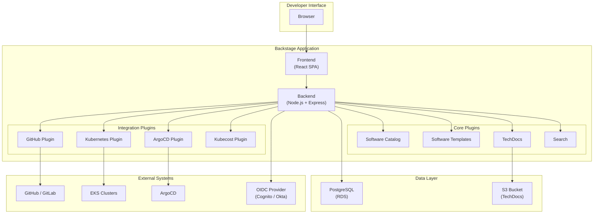
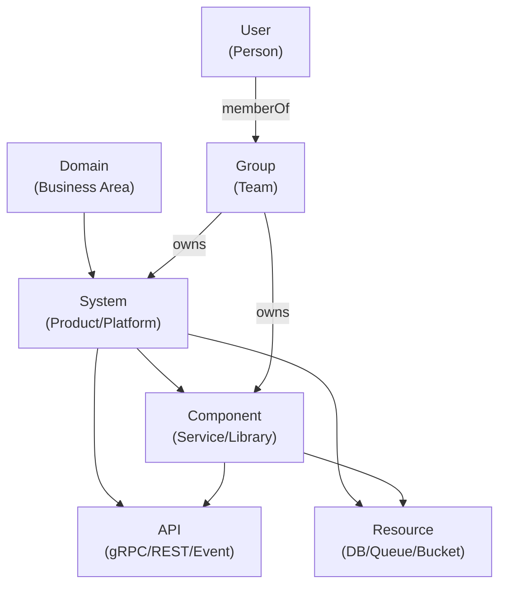
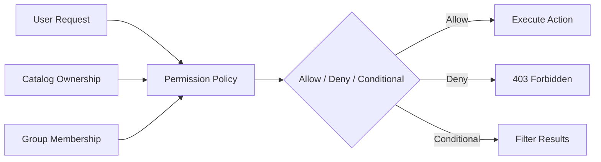

# Backstage：Internal Developer Platform 框架

> **支持版本**: Backstage 1.35+, Kubernetes 1.31+, EKS
> **最后更新**: June 22, 2026

## 目录

- [概述](#overview)
- [学习目标](#learning-objectives)
- [Backstage 架构](#backstage-architecture)
- [EKS 部署](#eks-deployment)
- [Software Catalog](#software-catalog)
- [Software Templates (Golden Paths)](#software-templates-golden-paths)
- [TechDocs](#techdocs)
- [面向 EKS 的 Plugin 生态系统](#plugin-ecosystem-for-eks)
- [RBAC 与治理](#rbac-and-governance)
- [生产运维](#production-operations)
- [最佳实践](#best-practices)
- [参考资料](#references)

---

## 概述

### 什么是 Internal Developer Platform (IDP)？

Internal Developer Platform (IDP) 是位于开发者与底层基础设施之间的自助服务层，为部署应用、预置资源和管理服务提供标准化工作流。正如 [Platform Engineering Overview](./00-platform-engineering-overview.md) 中所述，IDP 通过抽象运维复杂性，让开发者能够专注于编写代码。

IDP 通常提供：

- **Service Catalog**：所有服务、API 和基础设施组件的集中式注册表
- **自助服务工作流**：用于创建新服务、数据库和环境的模板化流程
- **文档中心**：集中化、可发现的技术文档
- **可见性**：跨组织实时查看部署、成本、所有权和健康状况

### 为什么选择 Backstage？

Backstage 是一个用于构建 Internal Developer Platform 的开源框架，最初由 Spotify 创建，现在是 CNCF Incubating 项目。Spotify 构建 Backstage 是为了管理数百个工程团队中的 2,000 多个 microservices（微服务）。在 2020 年开源后，Backstage 已成为 Kubernetes 生态系统中采用最广泛的 IDP 框架。

选择 Backstage 的主要原因：

1. **开源且可扩展**：采用 MIT 许可证，并拥有由 200+ 社区 plugins 组成的活跃 plugin 生态系统
2. **CNCF 支持**：Incubating 项目，具备强治理能力，确保长期可持续性
3. **Plugin 架构**：一切皆 plugin，无需 fork 即可高度定制
4. **Software Catalog**：集中式所有权注册表，可建模你的整个技术生态系统
5. **Software Templates**：Golden Path 脚手架，从第一天起强制执行组织标准
6. **TechDocs**：docs-like-code 方法，将文档与其描述的代码放在一起
7. **活跃社区**：超过 900 位贡献者，并被 American Airlines、Netflix、Zalando 和 HP 等公司采用

### IDP 平台对比

| Criteria | Backstage | Port | Cortex | Humanitec | OpsLevel |
|----------|-----------|------|--------|-----------|----------|
| **许可证** | 开源 (MIT) | 商业（免费层） | 商业 | 商业 | 商业 |
| **托管方式** | 自托管 | SaaS | SaaS | SaaS + Agent | SaaS |
| **定制能力** | 不受限制（plugin system） | API + Blueprints | 有限 | 中等 | 中等 |
| **Kubernetes Native** | 强（plugins） | 基于 API | 有限 | 强（Score） | 基于 API |
| **设置复杂度** | 高（DIY） | 低 | 低 | 中 | 低 |
| **社区生态系统** | 200+ plugins | 不断增长的市场 | 有限 | 不断增长 | 有限 |
| **成本** | 仅基础设施 | 每用户/月 | 每用户/月 | 每用户/月 | 每用户/月 |

> **注意**：与 SaaS 替代方案相比，Backstage 需要更多初始投入来完成设置，但它提供无可比拟的灵活性且没有许可成本。对于已经投入 Kubernetes 和 GitOps 的组织，Backstage 可以自然地集成到现有生态系统中。

---

## 学习目标

完成本文档后，你将能够：

1. **解释** Backstage 作为 IDP 框架在 Kubernetes 平台工程技术栈中的作用
2. **使用 Helm 在 Amazon EKS 上部署** Backstage，并配置 RDS PostgreSQL 和 ALB ingress
3. **配置** Software Catalog，从 GitHub repositories 自动发现服务
4. **创建** Software Templates (Golden Paths)，用于生成包含 CI/CD 和基础设施的 microservices 脚手架
5. **将** Backstage 与 Kubernetes plugin 集成，以在 EKS 上实现实时 workload 可见性
6. **设置** 使用 S3 storage 的 TechDocs，用于集中式文档
7. **安装并配置** ArgoCD、Kubecost 以及其他 Kubernetes 生态系统工具的 plugins
8. **为** 多团队环境实现 RBAC 和治理策略
9. **以** 高可用、备份和升级策略在生产环境中运行 Backstage

---

## Backstage 架构

### 高层架构



### 核心概念

Backstage 围绕四个基础支柱构建：

1. **Software Catalog**：组织中所有软件的集中式、自动更新的清单。它为每个组件跟踪所有权、依赖关系、API、文档链接和运维元数据。

2. **Software Templates**：可复用的脚手架定义（Golden Paths），用于创建包含全部组织标准的新项目、服务或基础设施 -- CI/CD pipelines、监控、安全策略和文档结构。

3. **TechDocs**：一种 docs-like-code 解决方案，可将 Markdown 文档（通过 MkDocs）直接渲染到 Backstage portal 中。文档与代码位于同一 repository，确保其保持最新。

4. **Search**：统一搜索平台，会索引 catalog、TechDocs 和任何其他数据源，为发现工程组织中的任何内容提供单一搜索栏。

### Plugin 架构

Backstage 遵循“一切皆 plugin”的理念。即使 Software Catalog 这样的核心功能也是以 plugins 形式实现的。该架构提供：

- **Frontend Plugins**：用于渲染 UI 元素（页面、卡片、标签页）的 React components
- **Backend Plugins**：提供 APIs、处理数据处理并与外部系统集成的 Node.js modules
- **Plugin 隔离**：每个 plugin 都有自己的数据库 schema、API routes 和配置
- **可组合性**：Plugins 可以通过定义良好的 extension points 依赖并扩展其他 plugins

```
┌─────────────────────────────────────────────────────────────────┐
│                     Backstage App Shell                         │
├─────────────────────────────────────────────────────────────────┤
│  ┌──────────┐  ┌──────────┐  ┌──────────┐  ┌──────────────┐   │
│  │ Catalog  │  │Templates │  │ TechDocs │  │   Search     │   │
│  │ Plugin   │  │ Plugin   │  │ Plugin   │  │   Plugin     │   │
│  └──────────┘  └──────────┘  └──────────┘  └──────────────┘   │
│  ┌──────────┐  ┌──────────┐  ┌──────────┐  ┌──────────────┐   │
│  │   K8s    │  │  ArgoCD  │  │ Kubecost │  │   Custom     │   │
│  │ Plugin   │  │  Plugin  │  │  Plugin  │  │   Plugins    │   │
│  └──────────┘  └──────────┘  └──────────┘  └──────────────┘   │
├─────────────────────────────────────────────────────────────────┤
│                    Plugin API / Extension Points                 │
├─────────────────────────────────────────────────────────────────┤
│                    Backend Services (Node.js)                    │
├─────────────────────────────────────────────────────────────────┤
│              PostgreSQL          │           S3 / Cache          │
└─────────────────────────────────────────────────────────────────┘
```

一个 plugin 通常包含：

| Component | Location | Purpose |
|-----------|----------|---------|
| **Frontend Plugin** | `plugins/<name>/` | React components、routes、API clients |
| **Backend Plugin** | `plugins/<name>-backend/` | Express routers、database access、external API calls |
| **Common** | `plugins/<name>-common/` | Shared types、constants、API definitions |
| **Node** | `plugins/<name>-node/` | Shared backend utilities、extension points |

---

## EKS 部署

### 前提条件

在 EKS 上部署 Backstage 之前，请确保以下资源可用：

| Resource | Purpose | Notes |
|----------|---------|-------|
| **EKS Cluster** | Backstage runtime | Kubernetes 1.31+ |
| **Amazon RDS (PostgreSQL)** | 持久化存储 | PostgreSQL 15+, db.r6g.large 或更大 |
| **Amazon ECR** | Container image registry | Backstage images 的私有 repository |
| **AWS ALB** | Ingress controller | 已安装 AWS Load Balancer Controller |
| **Amazon S3** | TechDocs storage | 用于生成文档的 Bucket |
| **AWS Certificate Manager** | TLS certificate | 用于 ALB 上的 HTTPS |
| **Amazon Cognito or Okta** | OIDC authentication | 用户登录的 identity provider |
| **GitHub App or Token** | Source code integration | 用于 catalog discovery 和 template scaffolding |

### 步骤 1：创建 Backstage Application

首先在本地生成一个新的 Backstage application 脚手架：

```bash
# Ensure Node.js 20+ and Yarn are installed
node --version   # v20.x or higher
yarn --version   # 4.x (Berry)

# Create a new Backstage app
npx @backstage/create-app@latest --skip-install
# When prompted, enter the app name: my-backstage-app

cd my-backstage-app

# Install dependencies
yarn install
```

生成的项目结构：

```
my-backstage-app/
├── app-config.yaml              # Main configuration
├── app-config.production.yaml   # Production overrides
├── catalog-info.yaml            # Backstage's own catalog entry
├── package.json
├── packages/
│   ├── app/                     # Frontend (React)
│   │   ├── src/
│   │   └── package.json
│   └── backend/                 # Backend (Node.js)
│       ├── src/
│       └── package.json
├── plugins/                     # Custom plugins
└── yarn.lock
```

### 步骤 2：将 Application 容器化

为生产部署创建一个 multi-stage Dockerfile：

```dockerfile
# Stage 1: Build the frontend and backend
FROM node:20-bookworm-slim AS build

WORKDIR /app

# Copy dependency files
COPY package.json yarn.lock .yarnrc.yml ./
COPY .yarn ./.yarn
COPY packages/app/package.json ./packages/app/
COPY packages/backend/package.json ./packages/backend/
COPY plugins/ ./plugins/

# Install all dependencies
RUN yarn install --immutable

# Copy the rest of the source
COPY . .

# Build the app
RUN yarn tsc
RUN yarn build:backend --config ../../app-config.yaml

# Stage 2: Production image
FROM node:20-bookworm-slim

# Install runtime dependencies for TechDocs
RUN apt-get update && \
    apt-get install -y --no-install-recommends \
      python3 python3-pip python3-venv git curl && \
    python3 -m pip install --break-system-packages \
      mkdocs-techdocs-core==1.4.* && \
    apt-get clean && \
    rm -rf /var/lib/apt/lists/*

# Create a non-root user
RUN useradd -m -u 1000 backstage
USER backstage
WORKDIR /app

# Copy the built backend bundle
COPY --from=build --chown=backstage:backstage /app/packages/backend/dist ./packages/backend/dist
COPY --from=build --chown=backstage:backstage /app/node_modules ./node_modules
COPY --from=build --chown=backstage:backstage /app/package.json ./

# Copy configuration files
COPY --chown=backstage:backstage app-config.yaml app-config.production.yaml ./

# Environment variables
ENV NODE_ENV=production

# Health check
HEALTHCHECK --interval=30s --timeout=5s --start-period=60s --retries=3 \
  CMD curl -f http://localhost:7007/healthcheck || exit 1

EXPOSE 7007

CMD ["node", "packages/backend/dist", "--config", "app-config.yaml", "--config", "app-config.production.yaml"]
```

构建 image 并推送到 ECR：

```bash
# Authenticate to ECR
aws ecr get-login-password --region ap-northeast-2 | \
  docker login --username AWS --password-stdin \
  111122223333.dkr.ecr.ap-northeast-2.amazonaws.com

# Build and push
docker build -t backstage:latest .
docker tag backstage:latest \
  111122223333.dkr.ecr.ap-northeast-2.amazonaws.com/backstage:v1.35.0
docker push \
  111122223333.dkr.ecr.ap-northeast-2.amazonaws.com/backstage:v1.35.0
```

### 步骤 3：使用 Helm 部署

添加 Backstage Helm chart repository 并创建 values 文件：

```bash
helm repo add backstage https://backstage.github.io/charts
helm repo update
```

创建一个完整的 `values.yaml`：

```yaml
# backstage-values.yaml
backstage:
  image:
    registry: 111122223333.dkr.ecr.ap-northeast-2.amazonaws.com
    repository: backstage
    tag: v1.35.0
    pullPolicy: IfNotPresent

  replicas: 2

  resources:
    requests:
      memory: 512Mi
      cpu: 250m
    limits:
      memory: 1Gi
      cpu: 1000m

  extraEnvVarsSecrets:
    - backstage-secrets

  appConfig:
    app:
      title: "My Company Developer Portal"
      baseUrl: https://backstage.example.com
    backend:
      baseUrl: https://backstage.example.com
      listen:
        port: 7007
      cors:
        origin: https://backstage.example.com
        methods: [GET, HEAD, PATCH, POST, PUT, DELETE]
        credentials: true
      database:
        client: pg
        connection:
          host: ${POSTGRES_HOST}
          port: ${POSTGRES_PORT}
          user: ${POSTGRES_USER}
          password: ${POSTGRES_PASSWORD}
          database: backstage
          ssl:
            require: true
            rejectUnauthorized: true

  podAnnotations:
    prometheus.io/scrape: "true"
    prometheus.io/port: "7007"
    prometheus.io/path: "/metrics"

  serviceAccount:
    create: true
    name: backstage
    annotations:
      eks.amazonaws.com/role-arn: arn:aws:iam::111122223333:role/backstage-irsa-role

ingress:
  enabled: true
  className: alb
  annotations:
    alb.ingress.kubernetes.io/scheme: internet-facing
    alb.ingress.kubernetes.io/target-type: ip
    alb.ingress.kubernetes.io/listen-ports: '[{"HTTPS":443}]'
    alb.ingress.kubernetes.io/certificate-arn: arn:aws:acm:ap-northeast-2:111122223333:certificate/abcd-1234-efgh
    alb.ingress.kubernetes.io/ssl-policy: ELBSecurityPolicy-TLS13-1-2-2021-06
    alb.ingress.kubernetes.io/healthcheck-path: /healthcheck
    alb.ingress.kubernetes.io/group.name: backstage
  hosts:
    - host: backstage.example.com
      paths:
        - path: /
          pathType: Prefix

postgresql:
  enabled: false  # Using external RDS

serviceAccount:
  create: true
  name: backstage
```

部署到 EKS：

```bash
# Create the namespace
kubectl create namespace backstage

# Create the secrets (referencing values from AWS Secrets Manager or SSM)
kubectl create secret generic backstage-secrets \
  --namespace backstage \
  --from-literal=POSTGRES_HOST=backstage-db.cluster-xxxxxxx.ap-northeast-2.rds.amazonaws.com \
  --from-literal=POSTGRES_PORT=5432 \
  --from-literal=POSTGRES_USER=backstage \
  --from-literal=POSTGRES_PASSWORD='<secure-password>' \
  --from-literal=GITHUB_TOKEN='ghp_xxxxxxxxxxxxxxxxxxxx' \
  --from-literal=AUTH_OIDC_CLIENT_ID='<client-id>' \
  --from-literal=AUTH_OIDC_CLIENT_SECRET='<client-secret>'

# Install the chart
helm install backstage backstage/backstage \
  --namespace backstage \
  --values backstage-values.yaml \
  --wait --timeout 10m
```

### 步骤 4：ALB Ingress 配置

如果你希望独立于 Helm chart 管理 Ingress resource，可以显式创建它：

```yaml
# backstage-ingress.yaml
apiVersion: networking.k8s.io/v1
kind: Ingress
metadata:
  name: backstage
  namespace: backstage
  annotations:
    alb.ingress.kubernetes.io/scheme: internet-facing
    alb.ingress.kubernetes.io/target-type: ip
    alb.ingress.kubernetes.io/listen-ports: '[{"HTTPS":443}]'
    alb.ingress.kubernetes.io/certificate-arn: arn:aws:acm:ap-northeast-2:111122223333:certificate/abcd-1234-efgh
    alb.ingress.kubernetes.io/ssl-policy: ELBSecurityPolicy-TLS13-1-2-2021-06
    alb.ingress.kubernetes.io/healthcheck-path: /healthcheck
    alb.ingress.kubernetes.io/healthcheck-interval-seconds: "15"
    alb.ingress.kubernetes.io/healthy-threshold-count: "2"
    alb.ingress.kubernetes.io/unhealthy-threshold-count: "3"
    alb.ingress.kubernetes.io/group.name: backstage
    alb.ingress.kubernetes.io/tags: Environment=production,Team=platform
    alb.ingress.kubernetes.io/load-balancer-attributes: >-
      idle_timeout.timeout_seconds=120,
      routing.http.drop_invalid_header_fields.enabled=true
spec:
  ingressClassName: alb
  rules:
    - host: backstage.example.com
      http:
        paths:
          - path: /
            pathType: Prefix
            backend:
              service:
                name: backstage
                port:
                  number: 7007
```

```bash
kubectl apply -f backstage-ingress.yaml
```

### 步骤 5：通过 RDS 使用 PostgreSQL

数据库连接在 `app-config.production.yaml` 中配置。以下示例展示了包含连接池和 SSL 的完整数据库部分：

```yaml
# app-config.production.yaml
backend:
  database:
    client: pg
    connection:
      host: ${POSTGRES_HOST}
      port: ${POSTGRES_PORT}
      user: ${POSTGRES_USER}
      password: ${POSTGRES_PASSWORD}
      database: backstage
      ssl:
        require: true
        rejectUnauthorized: true
    knexConfig:
      pool:
        min: 3
        max: 12
        acquireTimeoutMillis: 60000
        idleTimeoutMillis: 30000
    plugin:
      catalog:
        connection:
          database: backstage_plugin_catalog
      scaffolder:
        connection:
          database: backstage_plugin_scaffolder
      auth:
        connection:
          database: backstage_plugin_auth
      search:
        connection:
          database: backstage_plugin_search
```

> **注意**：Backstage 支持按 plugin 进行数据库隔离。每个 plugin 都可以在同一个 PostgreSQL instance 中使用独立数据库，从而提升安全性并简化备份和迁移。

### 步骤 6：OIDC Authentication 设置

Backstage 支持多个 authentication providers。下面是 Amazon Cognito 和 Okta 的配置。

#### Amazon Cognito 配置

```yaml
# app-config.production.yaml
auth:
  environment: production
  providers:
    oidc:
      production:
        metadataUrl: https://cognito-idp.ap-northeast-2.amazonaws.com/<user-pool-id>/.well-known/openid-configuration
        clientId: ${AUTH_OIDC_CLIENT_ID}
        clientSecret: ${AUTH_OIDC_CLIENT_SECRET}
        authorizationUrl: https://<domain>.auth.ap-northeast-2.amazoncognito.com/oauth2/authorize
        tokenUrl: https://<domain>.auth.ap-northeast-2.amazoncognito.com/oauth2/token
        scope: openid profile email
        prompt: auto
  session:
    secret: ${AUTH_SESSION_SECRET}
```

#### Okta 配置

```yaml
# app-config.production.yaml
auth:
  environment: production
  providers:
    okta:
      production:
        clientId: ${AUTH_OKTA_CLIENT_ID}
        clientSecret: ${AUTH_OKTA_CLIENT_SECRET}
        audience: https://dev-123456.okta.com
        authServerId: default
        idp: ${AUTH_OKTA_IDP_ID}
  session:
    secret: ${AUTH_SESSION_SECRET}
```

#### Sign-In Resolver 配置

在 backend plugin 代码中，配置 OIDC identities 如何映射到 Backstage users：

```typescript
// packages/backend/src/plugins/auth.ts
import { createBackendModule } from '@backstage/backend-plugin-api';
import {
  authProvidersExtensionPoint,
  createOAuthProviderFactory,
} from '@backstage/plugin-auth-node';
import { oidcAuthenticator } from '@backstage/plugin-auth-backend-module-oidc-provider';

export const authModuleOidc = createBackendModule({
  pluginId: 'auth',
  moduleId: 'oidc',
  register(reg) {
    reg.registerInit({
      deps: { providers: authProvidersExtensionPoint },
      async init({ providers }) {
        providers.registerProvider({
          providerId: 'oidc',
          factory: createOAuthProviderFactory({
            authenticator: oidcAuthenticator,
            async signInResolver({ result }, ctx) {
              const email = result.userinfo.email;
              if (!email) {
                throw new Error('OIDC login did not provide an email');
              }
              return ctx.signInWithCatalogUser({
                filter: { 'spec.profile.email': email },
              });
            },
          }),
        });
      },
    });
  },
});
```

---

## Software Catalog

### Entity Model

Backstage Software Catalog 使用定义良好的 entity model 来表示组织的软件生态系统。理解该模型对于有效管理 catalog 至关重要。



### Entity Types

| Entity Kind | Description | Example |
|-------------|-------------|---------|
| **Component** | 软件组件（service、website、library） | `order-service`, `payment-api` |
| **System** | 构成产品的一组 components | `order-platform`, `data-pipeline` |
| **Domain** | 将相关 systems 分组的业务 domain | `commerce`, `fulfillment` |
| **API** | 由 component 暴露的接口 | `order-api`, `payment-grpc` |
| **Resource** | 基础设施依赖 | `order-db`, `events-queue` |
| **Group** | 团队或组织单元 | `platform-team`, `commerce-team` |
| **User** | 单个个人 | `john.doe` |

### catalog-info.yaml 示例

#### Component Entity

```yaml
# catalog-info.yaml (in the service repository root)
apiVersion: backstage.io/v1alpha1
kind: Component
metadata:
  name: order-service
  description: Handles order creation, updates, and lifecycle management
  labels:
    app.kubernetes.io/name: order-service
  annotations:
    backstage.io/techdocs-ref: dir:.
    github.com/project-slug: my-org/order-service
    backstage.io/kubernetes-id: order-service
    argocd/app-name: order-service
    backstage.io/kubernetes-namespace: commerce
  tags:
    - java
    - spring-boot
    - grpc
  links:
    - url: https://grafana.example.com/d/order-service
      title: Grafana Dashboard
      icon: dashboard
    - url: https://runbook.example.com/order-service
      title: Runbook
      icon: docs
spec:
  type: service
  lifecycle: production
  owner: group:commerce-team
  system: order-platform
  providesApis:
    - order-api
  consumesApis:
    - payment-api
    - inventory-api
  dependsOn:
    - resource:order-db
    - resource:order-events-queue
```

#### System Entity

```yaml
apiVersion: backstage.io/v1alpha1
kind: System
metadata:
  name: order-platform
  description: End-to-end order management platform including order processing, payment, and fulfillment
  annotations:
    backstage.io/techdocs-ref: dir:.
  tags:
    - commerce
    - critical
spec:
  owner: group:commerce-team
  domain: commerce
```

#### Domain Entity

```yaml
apiVersion: backstage.io/v1alpha1
kind: Domain
metadata:
  name: commerce
  description: All systems related to the online commerce experience including ordering, payments, and fulfillment
spec:
  owner: group:commerce-leadership
```

#### API Entity

```yaml
apiVersion: backstage.io/v1alpha1
kind: API
metadata:
  name: order-api
  description: REST API for order management operations
  tags:
    - rest
    - json
spec:
  type: openapi
  lifecycle: production
  owner: group:commerce-team
  system: order-platform
  definition: |
    openapi: "3.0.0"
    info:
      title: Order API
      version: 1.0.0
    paths:
      /orders:
        get:
          summary: List orders
          responses:
            '200':
              description: A list of orders
        post:
          summary: Create an order
          responses:
            '201':
              description: Order created
      /orders/{orderId}:
        get:
          summary: Get order by ID
          parameters:
            - name: orderId
              in: path
              required: true
              schema:
                type: string
          responses:
            '200':
              description: Order details
```

#### Resource Entity

```yaml
apiVersion: backstage.io/v1alpha1
kind: Resource
metadata:
  name: order-db
  description: Aurora PostgreSQL cluster for order data
  annotations:
    aws.amazon.com/rds-cluster-id: order-db-cluster
  tags:
    - postgresql
    - aurora
spec:
  type: database
  owner: group:commerce-team
  system: order-platform
```

#### Group Entity

```yaml
apiVersion: backstage.io/v1alpha1
kind: Group
metadata:
  name: commerce-team
  description: Commerce engineering team responsible for the order platform
spec:
  type: team
  profile:
    displayName: Commerce Team
    email: commerce-team@example.com
    picture: https://avatars.example.com/commerce-team.png
  parent: engineering
  children: []
  members:
    - john.doe
    - jane.smith
    - alex.kim
```

#### User Entity

```yaml
apiVersion: backstage.io/v1alpha1
kind: User
metadata:
  name: john.doe
  description: Senior Backend Engineer
spec:
  profile:
    displayName: John Doe
    email: john.doe@example.com
    picture: https://avatars.example.com/john-doe.png
  memberOf:
    - commerce-team
```

### GitHub 自动发现

GitHub discovery plugin 会在你的 GitHub organization 中自动查找 `catalog-info.yaml` 文件：

```yaml
# app-config.yaml
catalog:
  providers:
    github:
      myOrgProvider:
        organization: my-org
        catalogPath: /catalog-info.yaml
        filters:
          branch: main
          repository: '.*'  # All repositories
        schedule:
          frequency:
            minutes: 30
          timeout:
            minutes: 3
  rules:
    - allow:
        - Component
        - System
        - Domain
        - API
        - Resource
        - Group
        - User
        - Template
        - Location
```

安装所需的 backend plugin：

```bash
# From the Backstage app root
yarn --cwd packages/backend add @backstage/plugin-catalog-backend-module-github
```

在 backend 中注册 module：

```typescript
// packages/backend/src/index.ts
import { createBackend } from '@backstage/backend-defaults';

const backend = createBackend();

// Core plugins
backend.add(import('@backstage/plugin-catalog-backend'));
backend.add(import('@backstage/plugin-catalog-backend-module-github'));
// ... other plugins

backend.start();
```

### Kubernetes Cluster 集成

Kubernetes plugin 会在每个 component 的 Backstage catalog 中直接显示实时 Pod、Deployment 和 Service 状态。

#### 安装 Kubernetes Plugin

```bash
# Frontend plugin
yarn --cwd packages/app add @backstage/plugin-kubernetes

# Backend plugin
yarn --cwd packages/backend add @backstage/plugin-kubernetes-backend
```

#### 配置 Backend

注册 Kubernetes backend plugin：

```typescript
// packages/backend/src/index.ts
backend.add(import('@backstage/plugin-kubernetes-backend'));
```

#### 配置 EKS Cluster 访问

```yaml
# app-config.yaml
kubernetes:
  serviceLocatorMethod:
    type: multiTenant
  clusterLocatorMethods:
    - type: config
      clusters:
        - name: production-eks
          url: https://ABCDEF1234567890.gr7.ap-northeast-2.eks.amazonaws.com
          authProvider: serviceAccount
          serviceAccountToken: ${K8S_PROD_SA_TOKEN}
          caData: ${K8S_PROD_CA_DATA}
          skipTLSVerify: false
          skipMetricsLookup: false
          dashboardUrl: https://console.aws.amazon.com/eks/home?region=ap-northeast-2#/clusters/production-eks
          dashboardApp: aws
        - name: staging-eks
          url: https://GHIJKL5678901234.gr7.ap-northeast-2.eks.amazonaws.com
          authProvider: serviceAccount
          serviceAccountToken: ${K8S_STAGING_SA_TOKEN}
          caData: ${K8S_STAGING_CA_DATA}
          skipTLSVerify: false
          skipMetricsLookup: false
```

#### 面向 Backstage 的 ServiceAccount 和 RBAC

在每个 EKS cluster 中创建只读 ServiceAccount，使 Backstage 能够查询 workload 状态：

```yaml
# backstage-k8s-rbac.yaml
---
apiVersion: v1
kind: Namespace
metadata:
  name: backstage-system
---
apiVersion: v1
kind: ServiceAccount
metadata:
  name: backstage-reader
  namespace: backstage-system
---
apiVersion: v1
kind: Secret
metadata:
  name: backstage-reader-token
  namespace: backstage-system
  annotations:
    kubernetes.io/service-account.name: backstage-reader
type: kubernetes.io/service-account-token
---
apiVersion: rbac.authorization.k8s.io/v1
kind: ClusterRole
metadata:
  name: backstage-reader
rules:
  - apiGroups: [""]
    resources:
      - pods
      - services
      - configmaps
      - namespaces
      - endpoints
      - serviceaccounts
    verbs: ["get", "list", "watch"]
  - apiGroups: ["apps"]
    resources:
      - deployments
      - replicasets
      - statefulsets
      - daemonsets
    verbs: ["get", "list", "watch"]
  - apiGroups: ["batch"]
    resources:
      - jobs
      - cronjobs
    verbs: ["get", "list", "watch"]
  - apiGroups: ["networking.k8s.io"]
    resources:
      - ingresses
    verbs: ["get", "list", "watch"]
  - apiGroups: ["autoscaling"]
    resources:
      - horizontalpodautoscalers
    verbs: ["get", "list", "watch"]
  - apiGroups: ["metrics.k8s.io"]
    resources:
      - pods
      - nodes
    verbs: ["get", "list"]
---
apiVersion: rbac.authorization.k8s.io/v1
kind: ClusterRoleBinding
metadata:
  name: backstage-reader-binding
subjects:
  - kind: ServiceAccount
    name: backstage-reader
    namespace: backstage-system
roleRef:
  kind: ClusterRole
  name: backstage-reader
  apiGroup: rbac.authorization.k8s.io
```

```bash
# Apply to each target EKS cluster
kubectl apply -f backstage-k8s-rbac.yaml

# Retrieve the token for Backstage configuration
kubectl get secret backstage-reader-token \
  -n backstage-system \
  -o jsonpath='{.data.token}' | base64 -d
```

#### 为 Kubernetes Discovery 标注 Components

为了让 Kubernetes plugin 找到正确的 workloads，请为 catalog entities 添加 annotations：

```yaml
# In catalog-info.yaml
metadata:
  annotations:
    backstage.io/kubernetes-id: order-service
    backstage.io/kubernetes-namespace: commerce
    backstage.io/kubernetes-label-selector: app=order-service
```

该 plugin 会通过这些 annotations 匹配 workloads，并直接在 component 页面显示 Pods、Deployments、ReplicaSets 和 HPA 状态。

---

## Software Templates (Golden Paths)

Software Templates 使平台团队能够定义创建新项目的标准化路径。这些 Golden Paths 确保每个新服务从一开始就具备正确的结构、CI/CD pipeline、监控和安全配置。有关 Golden Path 概念的背景信息，请参阅 [Platform Engineering Overview](./00-platform-engineering-overview.md)。

### Template 结构

Backstage template 包含：

1. **Parameters**：呈现给开发者的输入字段（forms）
2. **Steps**：按顺序执行以生成项目脚手架的 actions
3. **Output**：完成后显示的链接和信息

```
template.yaml
├── parameters:     # What the developer fills in
│   ├── service name
│   ├── team/owner
│   ├── language
│   └── features (database, queue, etc.)
├── steps:          # What happens automatically
│   ├── fetch:template (scaffold files)
│   ├── publish:github (create repository)
│   ├── catalog:register (add to Backstage)
│   └── argocd:create-resources (set up CD)
└── output:         # What the developer sees
    ├── repository URL
    ├── catalog entity link
    └── ArgoCD app link
```

### Microservice Golden Path Template

该 template 会生成一个完整 microservice 的脚手架，其中包含 Dockerfile、Helm chart、ArgoCD Application 和 GitHub Actions CI pipeline：

```yaml
# templates/microservice/template.yaml
apiVersion: scaffolder.backstage.io/v1beta3
kind: Template
metadata:
  name: microservice-golden-path
  title: Microservice Golden Path
  description: |
    Create a production-ready microservice with CI/CD pipeline,
    Kubernetes deployment, monitoring, and documentation scaffolding.
  tags:
    - recommended
    - microservice
    - kubernetes
spec:
  owner: group:platform-team
  type: service

  parameters:
    - title: Service Information
      required:
        - serviceName
        - owner
        - description
      properties:
        serviceName:
          title: Service Name
          type: string
          description: Unique name for the microservice (lowercase, hyphens only)
          pattern: "^[a-z][a-z0-9-]*$"
          maxLength: 40
          ui:autofocus: true
        description:
          title: Description
          type: string
          description: Brief description of what this service does
          maxLength: 200
        owner:
          title: Owner Team
          type: string
          description: The team that will own this service
          ui:field: OwnerPicker
          ui:options:
            catalogFilter:
              kind: Group
        system:
          title: System
          type: string
          description: The system this service belongs to
          ui:field: EntityPicker
          ui:options:
            catalogFilter:
              kind: System

    - title: Technical Configuration
      required:
        - language
        - port
      properties:
        language:
          title: Programming Language
          type: string
          enum:
            - java-spring
            - go
            - node-express
            - python-fastapi
          enumNames:
            - Java (Spring Boot 3)
            - Go (Gin)
            - Node.js (Express)
            - Python (FastAPI)
        port:
          title: Service Port
          type: integer
          default: 8080
          description: Port the service listens on
        enableDatabase:
          title: Enable Database
          type: boolean
          default: false
          description: Provision an Aurora PostgreSQL database via ACK
        enableQueue:
          title: Enable Message Queue
          type: boolean
          default: false
          description: Provision an SQS queue via ACK

    - title: Deployment Configuration
      required:
        - namespace
        - environment
      properties:
        namespace:
          title: Kubernetes Namespace
          type: string
          default: default
          description: Target namespace for deployment
        environment:
          title: Environment
          type: string
          enum:
            - dev
            - staging
            - production
          default: dev

    - title: Repository Configuration
      required:
        - repoUrl
      properties:
        repoUrl:
          title: Repository Location
          type: string
          ui:field: RepoUrlPicker
          ui:options:
            allowedHosts:
              - github.com
            allowedOwners:
              - my-org

  steps:
    # Step 1: Scaffold the project from a skeleton template
    - id: fetch-skeleton
      name: Fetch Project Skeleton
      action: fetch:template
      input:
        url: ./skeleton/${{ parameters.language }}
        targetPath: .
        values:
          serviceName: ${{ parameters.serviceName }}
          description: ${{ parameters.description }}
          owner: ${{ parameters.owner }}
          system: ${{ parameters.system }}
          port: ${{ parameters.port }}
          namespace: ${{ parameters.namespace }}
          environment: ${{ parameters.environment }}
          enableDatabase: ${{ parameters.enableDatabase }}
          enableQueue: ${{ parameters.enableQueue }}

    # Step 2: Generate the Helm chart
    - id: fetch-helm
      name: Generate Helm Chart
      action: fetch:template
      input:
        url: ./skeleton/helm-chart
        targetPath: ./deploy/helm
        values:
          serviceName: ${{ parameters.serviceName }}
          port: ${{ parameters.port }}
          namespace: ${{ parameters.namespace }}
          enableDatabase: ${{ parameters.enableDatabase }}
          enableQueue: ${{ parameters.enableQueue }}

    # Step 3: Generate GitHub Actions CI pipeline
    - id: fetch-ci
      name: Generate CI Pipeline
      action: fetch:template
      input:
        url: ./skeleton/github-actions/${{ parameters.language }}
        targetPath: ./.github/workflows
        values:
          serviceName: ${{ parameters.serviceName }}
          language: ${{ parameters.language }}

    # Step 4: Generate ArgoCD Application manifest
    - id: fetch-argocd
      name: Generate ArgoCD Application
      action: fetch:template
      input:
        url: ./skeleton/argocd-app
        targetPath: ./deploy/argocd
        values:
          serviceName: ${{ parameters.serviceName }}
          namespace: ${{ parameters.namespace }}
          environment: ${{ parameters.environment }}
          repoUrl: ${{ (parameters.repoUrl | parseRepoUrl).host }}/${{ (parameters.repoUrl | parseRepoUrl).owner }}/${{ (parameters.repoUrl | parseRepoUrl).repo }}

    # Step 5: Publish to GitHub
    - id: publish
      name: Create GitHub Repository
      action: publish:github
      input:
        repoUrl: ${{ parameters.repoUrl }}
        description: ${{ parameters.description }}
        defaultBranch: main
        protectDefaultBranch: true
        repoVisibility: internal
        collaborators:
          - team: ${{ parameters.owner | replace("group:", "") }}
            access: maintain
          - team: platform-team
            access: admin

    # Step 6: Register in Backstage catalog
    - id: register
      name: Register in Backstage Catalog
      action: catalog:register
      input:
        repoContentsUrl: ${{ steps['publish'].output.repoContentsUrl }}
        catalogInfoPath: /catalog-info.yaml

  output:
    links:
      - title: Source Code Repository
        url: ${{ steps['publish'].output.remoteUrl }}
      - title: Backstage Catalog Entity
        icon: catalog
        entityRef: ${{ steps['register'].output.entityRef }}
      - title: GitHub Actions CI
        url: ${{ steps['publish'].output.remoteUrl }}/actions
```

### Infrastructure Provisioning Template

该 template 通过 [ACK](./02-ack.md) 和 [KRO](./03-kro.md) Claims 创建 AWS 基础设施资源，为开发者提供数据库、缓存和队列的自助服务访问：

```yaml
# templates/infrastructure/template.yaml
apiVersion: scaffolder.backstage.io/v1beta3
kind: Template
metadata:
  name: aws-infrastructure-provisioning
  title: AWS Infrastructure Provisioning
  description: |
    Self-service provisioning of AWS infrastructure resources (RDS, ElastiCache, SQS)
    using ACK controllers and KRO resource graphs on EKS.
  tags:
    - infrastructure
    - aws
    - self-service
spec:
  owner: group:platform-team
  type: resource

  parameters:
    - title: Resource Information
      required:
        - resourceName
        - owner
        - resourceType
      properties:
        resourceName:
          title: Resource Name
          type: string
          description: Name for the infrastructure resource
          pattern: "^[a-z][a-z0-9-]*$"
          maxLength: 40
        owner:
          title: Owner Team
          type: string
          ui:field: OwnerPicker
          ui:options:
            catalogFilter:
              kind: Group
        resourceType:
          title: Resource Type
          type: string
          enum:
            - aurora-postgresql
            - aurora-mysql
            - elasticache-redis
            - sqs-queue
            - s3-bucket
          enumNames:
            - Aurora PostgreSQL
            - Aurora MySQL
            - ElastiCache Redis
            - SQS Queue
            - S3 Bucket

    - title: Resource Configuration
      required:
        - environment
        - size
      properties:
        environment:
          title: Environment
          type: string
          enum:
            - dev
            - staging
            - production
          default: dev
        size:
          title: Instance Size
          type: string
          enum:
            - small
            - medium
            - large
          enumNames:
            - "Small (dev/test: db.t4g.medium, cache.t4g.small)"
            - "Medium (staging: db.r6g.large, cache.r6g.large)"
            - "Large (production: db.r6g.xlarge, cache.r6g.xlarge)"
          default: small
        namespace:
          title: Target Namespace
          type: string
          default: default
          description: Kubernetes namespace where the resource claim will be created

    - title: Database-Specific Options
      description: Only applicable for database resource types
      properties:
        dbName:
          title: Database Name
          type: string
          default: appdb
          description: Name of the initial database to create
        storageSize:
          title: Storage Size (GiB)
          type: integer
          default: 20
          minimum: 20
          maximum: 1000
        enableMultiAZ:
          title: Enable Multi-AZ
          type: boolean
          default: false
          description: Enable Multi-AZ deployment for high availability

  steps:
    # Step 1: Generate the KRO resource claim
    - id: generate-claim
      name: Generate Resource Claim
      action: fetch:template
      input:
        url: ./skeleton/infrastructure/${{ parameters.resourceType }}
        targetPath: ./infrastructure
        values:
          resourceName: ${{ parameters.resourceName }}
          environment: ${{ parameters.environment }}
          size: ${{ parameters.size }}
          namespace: ${{ parameters.namespace }}
          dbName: ${{ parameters.dbName }}
          storageSize: ${{ parameters.storageSize }}
          enableMultiAZ: ${{ parameters.enableMultiAZ }}
          owner: ${{ parameters.owner }}

    # Step 2: Publish to the infrastructure GitOps repository
    - id: publish
      name: Create Pull Request
      action: publish:github:pull-request
      input:
        repoUrl: github.com?owner=my-org&repo=infrastructure-gitops
        branchName: provision/${{ parameters.resourceName }}
        title: "Provision ${{ parameters.resourceType }}: ${{ parameters.resourceName }}"
        description: |
          ## Infrastructure Provisioning Request

          | Field | Value |
          |-------|-------|
          | Resource | ${{ parameters.resourceName }} |
          | Type | ${{ parameters.resourceType }} |
          | Environment | ${{ parameters.environment }} |
          | Size | ${{ parameters.size }} |
          | Owner | ${{ parameters.owner }} |

          Provisioned via Backstage Software Template.
        targetPath: claims/${{ parameters.namespace }}

    # Step 3: Register as a Resource entity in the catalog
    - id: register
      name: Register Resource in Catalog
      action: catalog:register
      input:
        repoContentsUrl: https://github.com/my-org/infrastructure-gitops/tree/main
        catalogInfoPath: /claims/${{ parameters.namespace }}/${{ parameters.resourceName }}/catalog-info.yaml

  output:
    links:
      - title: Pull Request
        url: ${{ steps['publish'].output.remoteUrl }}
      - title: Catalog Entity
        icon: catalog
        entityRef: ${{ steps['register'].output.entityRef }}
```

生成的 Aurora PostgreSQL database KRO claim（由 template skeleton 创建）：

```yaml
# claims/<namespace>/<resource-name>/kro-claim.yaml
apiVersion: kro.run/v1alpha1
kind: DatabaseClaim
metadata:
  name: order-db
  namespace: commerce
  labels:
    app.kubernetes.io/managed-by: backstage
    backstage.io/owner: group:commerce-team
    environment: production
spec:
  engine: aurora-postgresql
  engineVersion: "15.4"
  instanceClass: db.r6g.xlarge
  storageSize: 100
  multiAZ: true
  databaseName: appdb
  backupRetentionDays: 30
  deletionProtection: true
```

### ArgoCD Integration Plugin

要将 Backstage templates 与 [ArgoCD](../gitops/argocd/02-applications.md) 链接起来以实现自动部署，请安装 ArgoCD scaffolder action：

```bash
yarn --cwd packages/backend add @roadiehq/scaffolder-backend-argocd
```

```typescript
// packages/backend/src/index.ts
backend.add(import('@roadiehq/scaffolder-backend-argocd'));
```

添加 ArgoCD 配置：

```yaml
# app-config.yaml
argocd:
  appLocatorMethods:
    - type: config
      instances:
        - name: main
          url: https://argocd.example.com
          token: ${ARGOCD_AUTH_TOKEN}
```

这使 templates 能够包含 ArgoCD steps：

```yaml
# In a template step
- id: create-argocd-app
  name: Create ArgoCD Application
  action: argocd:create-resources
  input:
    appName: ${{ parameters.serviceName }}-${{ parameters.environment }}
    argoInstance: main
    namespace: argocd
    repoUrl: ${{ steps['publish'].output.remoteUrl }}
    path: deploy/helm
    projectName: ${{ parameters.namespace }}
```

---

## TechDocs

TechDocs 为 Backstage 带来 “docs-like-code” 体验，可在 developer portal 中直接渲染基于 MkDocs 的 Markdown 文档。

### TechDocs 如何工作

1. 文档以 Markdown 文件形式与源代码一起编写
2. `mkdocs.yml` 配置文件定义文档结构
3. TechDocs 将文档构建为静态 HTML
4. 构建后的 docs 存储在 S3（或 GCS/Azure Blob）中以供提供服务
5. 开发者直接在 Backstage UI 中阅读与所属 component 关联的 docs

### S3 Storage 配置

```yaml
# app-config.yaml
techdocs:
  builder: external
  generator:
    runIn: local
  publisher:
    type: awsS3
    awsS3:
      bucketName: backstage-techdocs
      region: ap-northeast-2
      bucketRootPath: /
      accountId: "111122223333"
      credentials:
        roleArn: arn:aws:iam::111122223333:role/backstage-techdocs-role
```

### S3 Bucket Policy

```json
{
  "Version": "2012-10-17",
  "Statement": [
    {
      "Sid": "BackstageTechDocsReadWrite",
      "Effect": "Allow",
      "Principal": {
        "AWS": "arn:aws:iam::111122223333:role/backstage-techdocs-role"
      },
      "Action": [
        "s3:GetObject",
        "s3:PutObject",
        "s3:DeleteObject",
        "s3:ListBucket"
      ],
      "Resource": [
        "arn:aws:s3:::backstage-techdocs",
        "arn:aws:s3:::backstage-techdocs/*"
      ]
    }
  ]
}
```

### Service Repositories 中的 MkDocs 配置

每个发布 TechDocs 的 service 都需要在其根目录包含一个 `mkdocs.yml`：

```yaml
# mkdocs.yml (in the service repository)
site_name: Order Service Documentation
site_description: Technical documentation for the Order Service
plugins:
  - techdocs-core
nav:
  - Home: index.md
  - Architecture: architecture.md
  - API Reference: api-reference.md
  - Runbook: runbook.md
  - ADRs:
      - ADR-001 Database Choice: adrs/001-database-choice.md
      - ADR-002 Event Schema: adrs/002-event-schema.md
```

对应的 `catalog-info.yaml` annotation：

```yaml
metadata:
  annotations:
    backstage.io/techdocs-ref: dir:.
```

### External TechDocs Build Pipeline

对于 `external` builder 模式，设置一个 CI job，在每次 merge 时构建并发布文档：

```yaml
# .github/workflows/techdocs.yaml
name: Build and Publish TechDocs
on:
  push:
    branches: [main]
    paths:
      - 'docs/**'
      - 'mkdocs.yml'

jobs:
  publish-techdocs:
    runs-on: ubuntu-latest
    steps:
      - uses: actions/checkout@v4

      - name: Setup Python
        uses: actions/setup-python@v5
        with:
          python-version: '3.12'

      - name: Install dependencies
        run: pip install mkdocs-techdocs-core==1.4.*

      - name: Build TechDocs
        run: npx @techdocs/cli generate --no-docker

      - name: Configure AWS Credentials
        uses: aws-actions/configure-aws-credentials@v4
        with:
          role-to-assume: arn:aws:iam::111122223333:role/techdocs-publisher
          aws-region: ap-northeast-2

      - name: Publish TechDocs
        run: |
          npx @techdocs/cli publish \
            --publisher-type awsS3 \
            --storage-name backstage-techdocs \
            --entity default/Component/order-service \
            --awsRoleArn arn:aws:iam::111122223333:role/techdocs-publisher \
            --awsRegion ap-northeast-2
```

---

## 面向 EKS 的 Plugin 生态系统

Backstage 的 plugin system 是它最大的优势。以下 plugins 对在 Amazon EKS 上运行 workloads 的团队特别有价值。

### Kubernetes Plugin

Kubernetes plugin 可直接从 catalog entity 页面提供 Pod 和 Deployment 状态的实时可见性。

**它显示的内容：**

- Pod 数量和状态（Running、Pending、CrashLoopBackOff）
- Deployment replica 状态（desired vs. available）
- 最近的 Pod events 和错误消息
- HPA 当前指标和目标指标
- Container resource utilization（CPU、memory）

**Frontend integration：**

```typescript
// packages/app/src/components/catalog/EntityPage.tsx
import { EntityKubernetesContent } from '@backstage/plugin-kubernetes';

// Add to the service entity page
const serviceEntityPage = (
  <EntityLayout>
    <EntityLayout.Route path="/" title="Overview">
      {/* overview content */}
    </EntityLayout.Route>
    <EntityLayout.Route path="/kubernetes" title="Kubernetes">
      <EntityKubernetesContent refreshIntervalMs={10000} />
    </EntityLayout.Route>
  </EntityLayout>
);
```

### ArgoCD Plugin

ArgoCD plugin 会显示每个 component 的 GitOps deployment sync 状态、健康状况和历史记录。

**安装：**

```bash
# Frontend
yarn --cwd packages/app add @roadiehq/backstage-plugin-argo-cd

# Backend
yarn --cwd packages/backend add @roadiehq/backstage-plugin-argo-cd-backend
```

**配置：**

```yaml
# app-config.yaml
argocd:
  appLocatorMethods:
    - type: config
      instances:
        - name: main
          url: https://argocd.example.com
          token: ${ARGOCD_AUTH_TOKEN}
```

**Catalog annotation：**

```yaml
metadata:
  annotations:
    argocd/app-name: order-service
```

**Frontend integration：**

```typescript
// packages/app/src/components/catalog/EntityPage.tsx
import {
  EntityArgoCDOverviewCard,
  EntityArgoCDHistoryCard,
} from '@roadiehq/backstage-plugin-argo-cd';

// Add to the overview page
const overviewContent = (
  <Grid container spacing={3}>
    <Grid item md={6}>
      <EntityArgoCDOverviewCard />
    </Grid>
    <Grid item md={6}>
      <EntityArgoCDHistoryCard />
    </Grid>
  </Grid>
);
```

### Kubecost Plugin

Kubecost plugin 提供按 service 维度的成本可见性，显示每个 component 在 compute、memory 和 storage 方面的成本。

**安装：**

```bash
yarn --cwd packages/app add @kubecost/backstage-plugin
yarn --cwd packages/backend add @kubecost/backstage-plugin-backend
```

**配置：**

```yaml
# app-config.yaml
kubecost:
  baseUrl: https://kubecost.example.com
  # Optional: filter by cluster
  clusterFilter: production-eks
```

**Catalog annotation：**

```yaml
metadata:
  annotations:
    kubecost.com/deployment-name: order-service
    kubecost.com/namespace: commerce
```

**Frontend integration：**

```typescript
// packages/app/src/components/catalog/EntityPage.tsx
import { EntityKubecostCard } from '@kubecost/backstage-plugin';

const overviewContent = (
  <Grid container spacing={3}>
    <Grid item md={6}>
      <EntityKubecostCard />
    </Grid>
  </Grid>
);
```

### KEDA 和 Karpenter 可见性（Custom Plugin 概念）

虽然没有面向 KEDA 或 Karpenter 的官方 Backstage plugin，但你可以构建一个 custom plugin，查询 Kubernetes API 中的 ScaledObject 和 NodePool resources，然后在 component 旁边显示 scaling metrics。

**Custom plugin backend 概念：**

```typescript
// plugins/keda-backend/src/router.ts
import { Router } from 'express';
import { Logger } from 'winston';
import { Config } from '@backstage/config';

export async function createRouter(options: {
  logger: Logger;
  config: Config;
}): Promise<Router> {
  const router = Router();

  router.get('/scaled-objects/:namespace/:name', async (req, res) => {
    const { namespace, name } = req.params;

    // Query the Kubernetes API for ScaledObject
    const scaledObject = await k8sClient.getNamespacedCustomObject(
      'keda.sh',
      'v1alpha1',
      namespace,
      'scaledobjects',
      name,
    );

    res.json({
      name: scaledObject.body.metadata.name,
      minReplicas: scaledObject.body.spec.minReplicaCount,
      maxReplicas: scaledObject.body.spec.maxReplicaCount,
      triggers: scaledObject.body.spec.triggers,
      currentReplicas: scaledObject.body.status?.currentReplicas,
    });
  });

  return router;
}
```

**Custom plugin frontend 概念：**

```typescript
// plugins/keda/src/components/KedaCard.tsx
import React from 'react';
import { InfoCard, Progress } from '@backstage/core-components';
import { useEntity } from '@backstage/plugin-catalog-react';
import useAsync from 'react-use/lib/useAsync';

export const KedaScalingCard = () => {
  const { entity } = useEntity();
  const namespace =
    entity.metadata.annotations?.['backstage.io/kubernetes-namespace'];
  const name = entity.metadata.name;

  const { value, loading, error } = useAsync(async () => {
    const response = await fetch(
      `/api/keda/scaled-objects/${namespace}/${name}`,
    );
    return response.json();
  });

  if (loading) return <Progress />;
  if (error) return <div>Error loading KEDA data: {error.message}</div>;

  return (
    <InfoCard title="KEDA Autoscaling">
      <p>Min Replicas: {value?.minReplicas}</p>
      <p>Max Replicas: {value?.maxReplicas}</p>
      <p>Current Replicas: {value?.currentReplicas}</p>
      <p>Triggers: {value?.triggers?.length}</p>
    </InfoCard>
  );
};
```

### Plugin 摘要

| Plugin | Purpose | Data Source | Installation |
|--------|---------|-------------|--------------|
| **@backstage/plugin-kubernetes** | Pod/Deployment 状态 | Kubernetes API | 官方 |
| **@roadiehq/backstage-plugin-argo-cd** | Sync 状态、deploy 历史 | ArgoCD API | 社区（Roadie） |
| **@kubecost/backstage-plugin** | 按 service 的成本明细 | Kubecost API | 社区（Kubecost） |
| **Custom KEDA Plugin** | Autoscaler 状态 | Kubernetes API (keda.sh CRDs) | 自定义构建 |
| **Custom Karpenter Plugin** | Node provisioning 状态 | Kubernetes API (karpenter.sh CRDs) | 自定义构建 |
| **@backstage/plugin-techdocs** | Documentation viewer | S3 / GCS | 官方 |
| **@backstage/plugin-github-actions** | CI pipeline 状态 | GitHub API | 官方 |

---

## RBAC 与治理

### Permission Framework 概述

Backstage 包含内置 permission framework，用于控制对 catalog entities、templates 和 plugin features 的访问。该 permission system 基于策略，并与 catalog 的所有权模型集成。



### 启用 Permission Framework

```yaml
# app-config.yaml
permission:
  enabled: true
```

### 基于团队的访问控制

实现一个强制执行基于所有权访问的 custom permission policy：

```typescript
// packages/backend/src/plugins/permission.ts
import {
  PolicyDecision,
  AuthorizeResult,
  isPermission,
} from '@backstage/plugin-permission-common';
import {
  PermissionPolicy,
  PolicyQuery,
} from '@backstage/plugin-permission-node';
import {
  catalogEntityDeletePermission,
  catalogEntityCreatePermission,
} from '@backstage/plugin-catalog-common/alpha';
import {
  createCatalogConditionalDecision,
  catalogConditions,
} from '@backstage/plugin-catalog-backend/alpha';
import { BackstageIdentityResponse } from '@backstage/plugin-auth-node';
import { createBackendModule } from '@backstage/backend-plugin-api';
import { policyExtensionPoint } from '@backstage/plugin-permission-node/alpha';

class TeamBasedPermissionPolicy implements PermissionPolicy {
  async handle(
    request: PolicyQuery,
    user?: BackstageIdentityResponse,
  ): Promise<PolicyDecision> {
    // Platform team gets full access
    if (
      user?.identity.ownershipEntityRefs.includes(
        'group:default/platform-team',
      )
    ) {
      return { result: AuthorizeResult.ALLOW };
    }

    // Only owners can delete catalog entities
    if (isPermission(request.permission, catalogEntityDeletePermission)) {
      if (!user) {
        return { result: AuthorizeResult.DENY };
      }
      return createCatalogConditionalDecision(request.permission, {
        anyOf: user.identity.ownershipEntityRefs.map((ref) =>
          catalogConditions.isEntityOwner({ claims: [ref] }),
        ),
      });
    }

    // Everyone can create entities and view the catalog
    if (isPermission(request.permission, catalogEntityCreatePermission)) {
      return { result: AuthorizeResult.ALLOW };
    }

    // Default: allow read operations
    return { result: AuthorizeResult.ALLOW };
  }
}

export const permissionModule = createBackendModule({
  pluginId: 'permission',
  moduleId: 'team-based-policy',
  register(reg) {
    reg.registerInit({
      deps: { policy: policyExtensionPoint },
      async init({ policy }) {
        policy.setPolicy(new TeamBasedPermissionPolicy());
      },
    });
  },
});
```

### 治理规则示例

| Rule | Implementation | Scope |
|------|---------------|-------|
| **只有 owners 可以删除 entities** | 对 `catalogEntityDeletePermission` 使用 Conditional permission | Catalog |
| **只有 platform team 可以创建 templates** | 除非在 platform-team group 中，否则 DENY `templateCreatePermission` | Scaffolder |
| **外部 contractors 只读** | 对 contractor group DENY 所有写权限 | Global |
| **Template execution requires approval** | Templates 中的 custom approval workflow step | Scaffolder |
| **Production deployments restricted** | 基于 entity lifecycle 的 Conditional permission | Catalog + ArgoCD |

### Audit Logging

Backstage 支持 audit logging，用于跟踪谁做了什么。配置 audit log backend：

```yaml
# app-config.yaml
backend:
  audit:
    enabled: true
    logger:
      type: winston
      options:
        transports:
          - type: console
            level: info
          - type: file
            level: info
            filename: /var/log/backstage/audit.log
            maxsize: 10485760
            maxFiles: 10
```

对于生产环境，将 audit logs 发送到 CloudWatch：

```yaml
# app-config.yaml
backend:
  audit:
    enabled: true
    logger:
      type: winston
      options:
        transports:
          - type: cloudwatch
            level: info
            logGroupName: /backstage/audit
            logStreamName: backstage-production
            region: ap-northeast-2
```

Audit log entries 会捕获：

- **Who**：已认证的 user identity
- **What**：执行的 action（entity created、template executed、entity deleted）
- **When**：action 的 timestamp
- **Where**：目标 entity 或 resource
- **Result**：成功或失败，并附带错误详情

---

## 生产运维

### 高可用配置

对于生产部署，在 ALB 后运行多个 Backstage replicas，并使用共享的外部 PostgreSQL：

```yaml
# backstage-values.yaml (HA configuration)
backstage:
  replicas: 3

  resources:
    requests:
      memory: 1Gi
      cpu: 500m
    limits:
      memory: 2Gi
      cpu: 2000m

  podDisruptionBudget:
    enabled: true
    minAvailable: 2

  affinity:
    podAntiAffinity:
      preferredDuringSchedulingIgnoredDuringExecution:
        - weight: 100
          podAffinityTerm:
            labelSelector:
              matchExpressions:
                - key: app.kubernetes.io/name
                  operator: In
                  values:
                    - backstage
            topologyKey: topology.kubernetes.io/zone

  topologySpreadConstraints:
    - maxSkew: 1
      topologyKey: topology.kubernetes.io/zone
      whenUnsatisfiable: DoNotSchedule
      labelSelector:
        matchLabels:
          app.kubernetes.io/name: backstage

  livenessProbe:
    httpGet:
      path: /healthcheck
      port: 7007
    initialDelaySeconds: 60
    periodSeconds: 10
    failureThreshold: 3

  readinessProbe:
    httpGet:
      path: /healthcheck
      port: 7007
    initialDelaySeconds: 30
    periodSeconds: 5
    failureThreshold: 3

postgresql:
  enabled: false  # External RDS with Multi-AZ
```

**HA deployment 架构：**

```
┌─────────────────────────────────────────────────────────────┐
│                        ALB (internet-facing)                 │
│                      backstage.example.com                   │
└──────────┬──────────────────┬──────────────────┬────────────┘
           │                  │                  │
    ┌──────▼──────┐    ┌──────▼──────┐    ┌──────▼──────┐
    │ Backstage   │    │ Backstage   │    │ Backstage   │
    │ Pod (AZ-a)  │    │ Pod (AZ-b)  │    │ Pod (AZ-c)  │
    └──────┬──────┘    └──────┬──────┘    └──────┬──────┘
           │                  │                  │
           └──────────────────┼──────────────────┘
                              │
                    ┌─────────▼─────────┐
                    │   RDS PostgreSQL   │
                    │   (Multi-AZ)       │
                    └───────────────────┘
```

### 备份与恢复策略

| Component | Backup Method | Frequency | Retention |
|-----------|--------------|-----------|-----------|
| **PostgreSQL (RDS)** | Automated RDS snapshots | 每日 | 30 天 |
| **PostgreSQL (RDS)** | Point-in-time recovery | 持续 | 35 天 |
| **TechDocs (S3)** | S3 versioning + cross-region replication | 持续 | 90 天 |
| **Configuration** | Git repository (app-config.yaml) | 每次 commit | 无限期 |
| **Catalog entities** | Git repositories (catalog-info.yaml) | 每次 commit | 无限期 |
| **Secrets** | AWS Secrets Manager with rotation | 变更时 | 已版本化 |

**RDS 备份配置（Terraform 示例）：**

```hcl
resource "aws_rds_cluster" "backstage" {
  cluster_identifier      = "backstage-db"
  engine                  = "aurora-postgresql"
  engine_version          = "15.4"
  master_username         = "backstage"
  database_name           = "backstage"
  backup_retention_period = 30
  preferred_backup_window = "03:00-04:00"
  deletion_protection     = true
  storage_encrypted       = true
  kms_key_id              = aws_kms_key.backstage.arn

  copy_tags_to_snapshot = true

  tags = {
    Environment = "production"
    Service     = "backstage"
    ManagedBy   = "terraform"
  }
}
```

**灾难恢复流程：**

1. **数据库损坏或丢失**：从最新的 RDS automated snapshot 恢复，或使用 point-in-time recovery 恢复到特定时间戳
2. **TechDocs 丢失**：S3 versioning 允许恢复任何先前版本；cross-region replica 提供区域级故障转移
3. **配置漂移**：所有配置都在 Git 中；从已知良好的 commit 重新部署
4. **Catalog 数据丢失**：Catalog entities 定义在 Git repositories 中；重新触发 GitHub discovery provider 以重新填充

### 升级策略

Backstage 会频繁发布新版本（大约每月一次）。遵循以下升级策略：

1. **显式固定版本**：始终在 Dockerfile 和 package.json 中使用精确 version tags，绝不要使用 `latest`
2. **阅读 changelog**：升级前查看 [Backstage changelog](https://github.com/backstage/backstage/blob/master/CHANGELOG.md) 中的 breaking changes
3. **逐步升级**：不要跳过 major versions；一次升级一个 minor version
4. **在 staging 中测试**：先部署到带有生产数据库 schema 副本的 staging environment
5. **滚动更新**：使用带 readiness probes 的 Kubernetes rolling update strategy，确保零停机

```yaml
# Deployment strategy in values.yaml
backstage:
  strategy:
    type: RollingUpdate
    rollingUpdate:
      maxUnavailable: 0
      maxSurge: 1
```

**升级工作流：**

```bash
# 1. Update Backstage packages
yarn backstage-cli versions:bump --release 1.36.0

# 2. Run database migrations
yarn backstage-cli db:migrate

# 3. Build and test locally
yarn build:backend
yarn test

# 4. Build new container image
docker build -t backstage:v1.36.0 .

# 5. Push to ECR
docker tag backstage:v1.36.0 \
  111122223333.dkr.ecr.ap-northeast-2.amazonaws.com/backstage:v1.36.0
docker push \
  111122223333.dkr.ecr.ap-northeast-2.amazonaws.com/backstage:v1.36.0

# 6. Update Helm values and upgrade
helm upgrade backstage backstage/backstage \
  --namespace backstage \
  --set backstage.image.tag=v1.36.0 \
  --values backstage-values.yaml \
  --wait --timeout 10m
```

---

## 最佳实践

### 推荐实践

1. **从 Software Catalog 开始**：在构建 templates 或安装 plugins 之前，先投入时间构建完整且准确的 catalog。填充良好的 catalog 是让其他所有功能有价值的基础。首先注册所有现有服务，并确保所有权正确。

2. **将 Backstage 视为内部产品**：指定 product owner，收集开发者反馈，迭代功能，并跟踪采用指标。平台团队是一个 product team，其客户是其他工程团队。

3. **定义 Golden Paths，而不是 Golden Cages**：Templates 应编码最佳实践和组织标准，但当开发者有合理理由时，始终允许他们偏离。目标是让正确的事情变得容易，而不是让它成为唯一选择。

4. **自动化 Catalog 填充**：使用 GitHub discovery plugin 自动查找并注册 `catalog-info.yaml` 文件，而不是要求手动注册。这可以减少摩擦并保持 catalog 最新。

5. **将 app-config.yaml 保存在 Version Control 中**：切勿在运行中的 cluster 上手动编辑配置。所有 Backstage 配置都应位于 Git repository 中，并通过与 application 本身相同的 CI/CD pipeline 部署。

6. **投资文档（TechDocs）**：没有文档的 developer portal 只是一个 dashboard。让 TechDocs 成为每个 service 的要求 -- 将它包含在你的 Golden Path templates 中，使新服务从第一天起就随附文档脚手架。

7. **监控 Backstage 本身**：从 Backstage backend 暴露 Prometheus metrics，为 API latency、error rates 和 plugin health 设置 dashboards。使用你提供给开发者的同一套 observability stack。

8. **规划 Plugin 维护**：Community plugins 可能落后于 Backstage core releases。固定 plugin versions，在 staging 中测试升级，并维护一份对部署至关重要的 plugins 列表。

### 常见陷阱

1. **构建过多、过快**：尝试在第一天就部署包含每个 plugin 的 Backstage 会导致复杂性和延迟。先从 catalog 和一个 template 开始，然后根据开发者反馈逐步添加 plugins。

2. **忽视所有权数据**：缺失或不正确的所有权信息会削弱对 catalog 的信任。如果开发者无法找到某个 service 的 owner，他们就会停止使用 catalog。通过对 `catalog-info.yaml` 的 CI checks 强制执行所有权。

3. **从一开始就忽略 Authentication**：即使在 staging 中，在没有正确 OIDC authentication 的情况下部署 Backstage 也会造成安全缺口，并使之后实施 RBAC 更加困难。在将 Backstage 暴露给用户之前配置 authentication。

4. **将 Backstage 视为只读**：Backstage 的真正力量在于 Software Templates 和自助服务工作流，而不仅仅是查看 catalog 数据。如果开发者可以看到自己的 services，但不能通过 portal 创建新的 services，采用率就会停滞。

---

## 参考资料

### 官方文档

- [Backstage Official Documentation](https://backstage.io/docs/overview/what-is-backstage)
- [Backstage GitHub Repository](https://github.com/backstage/backstage)
- [Backstage Plugin Marketplace](https://backstage.io/plugins)
- [Backstage Helm Chart](https://github.com/backstage/charts)

### CNCF 和社区

- [CNCF Backstage Project Page](https://www.cncf.io/projects/backstage/)
- [CNCF Platform White Paper](https://tag-app-delivery.cncf.io/whitepapers/platforms/)
- [Backstage Community Sessions](https://github.com/backstage/community)

### AWS 和 EKS 集成

- [AWS EKS Best Practices Guide](https://aws.github.io/aws-eks-best-practices/)
- [AWS Load Balancer Controller Documentation](https://kubernetes-sigs.github.io/aws-load-balancer-controller/)
- [Amazon Cognito Developer Guide](https://docs.aws.amazon.com/cognito/latest/developerguide/)

### 本 Repository 中的相关文档

- [Platform Engineering Overview](./00-platform-engineering-overview.md) -- IDP 概念、成熟度模型和参考架构
- [Helm Package Manager](./01-helm.md) -- 用于 Backstage 部署的 Helm chart packaging
- [AWS Controllers for Kubernetes (ACK)](./02-ack.md) -- 通过 Kubernetes API 预置基础设施
- [Kubernetes Resource Operator (KRO)](./03-kro.md) -- 面向自助服务 claims 的 resource graph orchestration
- [Kubernetes Extension Mechanisms](./04-kubernetes-extensions.md) -- 驱动 Backstage plugins 的 CRDs 和 operators
- [ExampleCorp Integration Example](./05-example-corp-app.md) -- 端到端 ACK + KRO 部署示例
- [Crossplane](./07-crossplane.md) -- 通过 Kubernetes API 实现 Infrastructure as Code；与 Backstage 集成以支持自助服务
- [ArgoCD Applications](../gitops/argocd/02-applications.md) -- 与 Backstage templates 集成的 GitOps 部署
