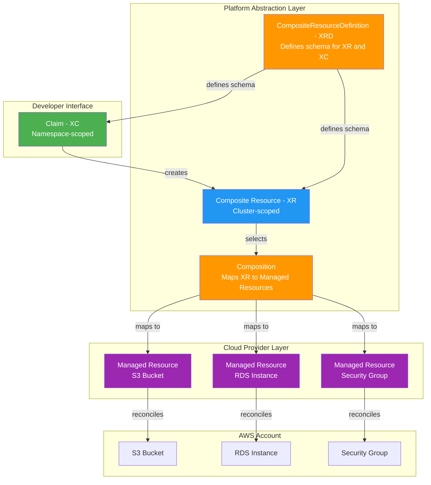
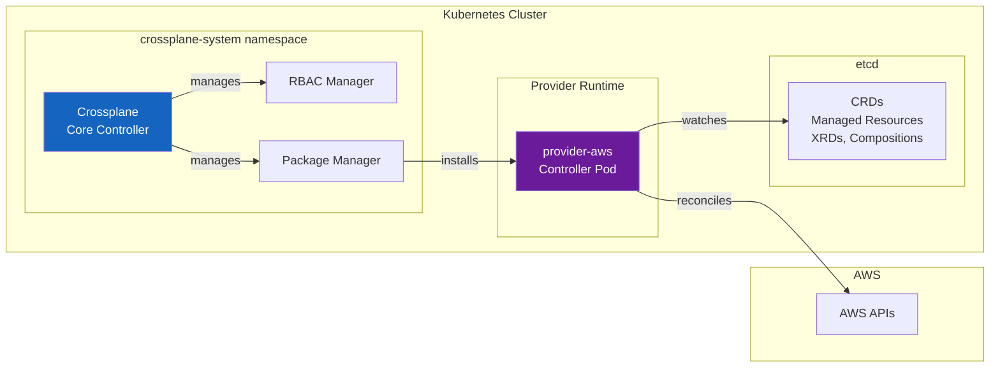
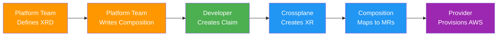
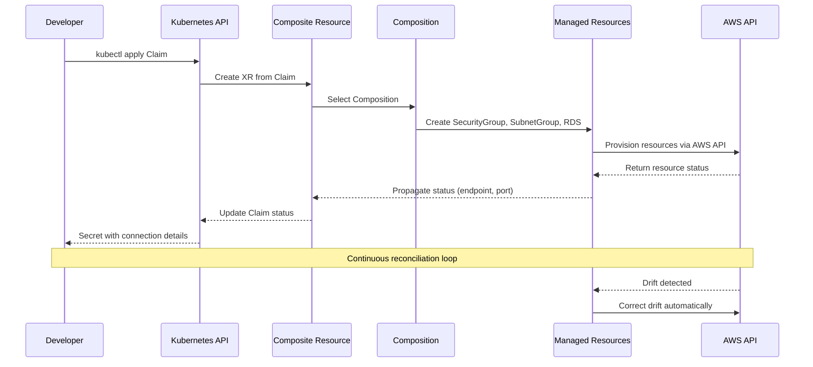
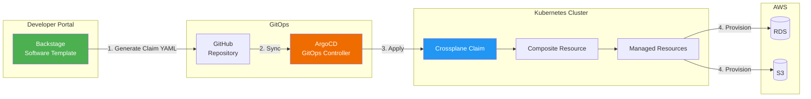

# Crossplane

> **支持的版本**: Crossplane v1.17+, Provider-AWS v1.15+
> **最后更新**: June 2025

## Table of Contents

- [Overview](#overview)
- [Learning Objectives](#learning-objectives)
- [Crossplane Architecture](#crossplane-architecture)
- [EKS Installation and Configuration](#eks-installation-and-configuration)
- [Managed Resources](#managed-resources)
- [Compositions (Platform Abstraction)](#compositions-platform-abstraction)
- [Claims (Self-Service)](#claims-self-service)
- [ACK vs Crossplane](#ack-vs-crossplane)
- [Backstage + Crossplane Integration](#backstage--crossplane-integration)
- [Production Operations](#production-operations)
- [Best Practices](#best-practices)
- [References](#references)

---

## Overview

### What is Crossplane?

Crossplane 是一个开源的 CNCF Graduated 项目，它扩展 Kubernetes，使其成为面向基础设施的通用 control plane（控制平面）。Crossplane 不再为配置云资源引入单独的工具或语言，而是让你使用已经用于应用程序的同一套 Kubernetes API、kubectl 命令和 GitOps 工作流来定义、组合和管理基础设施。

从核心上看，Crossplane 会把你的 Kubernetes cluster（集群）转变为一个 control plane，可以编排任意云提供商（AWS、GCP、Azure）甚至本地系统中的资源。基础设施工程师定义称为 Compositions（组合）的更高层抽象，应用开发人员则通过 Claims（声明）使用这些抽象，而无需了解底层特定云厂商的细节。

### Why Crossplane?

传统基础设施管理方式要求团队学习特定于提供商的工具和语言：

- **Terraform** 使用 HCL，需要管理状态文件，并在 Kubernetes 生态系统之外运行
- **CloudFormation** 仅适用于 AWS，并使用自己的模板语言
- **Pulumi** 需要通用编程语言和单独的状态后端

Crossplane 通过将基础设施管理直接引入 Kubernetes API 来解决这些挑战：

1. **Kubernetes-Native**：基础设施被定义为 Kubernetes Custom Resources（自定义资源）-- 无需学习新的语言或 CLI
2. **Continuous Reconciliation**：与任何 Kubernetes controller（控制器）一样，Crossplane 会持续将期望状态与实际状态进行调谐，自动检测并纠正漂移
3. **Composable Abstractions**：平台团队构建可复用的基础设施抽象（Compositions），开发人员通过简单的 Claims 使用它们
4. **Multi-Cloud**：单个 control plane 可以管理 AWS、GCP、Azure 等多个平台上的资源
5. **GitOps Compatible**：基础设施定义是存储在 Git 中的标准 YAML，可通过 ArgoCD 或 FluxCD 部署

### Infrastructure as Code Tool Comparison

| Criteria | Crossplane | Terraform | ACK | CloudFormation | Pulumi |
|----------|-----------|-----------|-----|----------------|--------|
| **Interface** | Kubernetes API (YAML) | HCL | Kubernetes API (YAML) | JSON/YAML templates | General-purpose code |
| **State Management** | Kubernetes etcd | Terraform state file | Kubernetes etcd | CloudFormation stack | Pulumi state backend |
| **Drift Detection** | Continuous (controller) | On `plan`/`apply` | Continuous (controller) | Drift detection API | On `preview`/`up` |
| **Abstraction Layer** | Compositions + Claims | Modules | None (1:1 mapping) | Nested stacks | Component resources |
| **Multi-Cloud** | Yes (multiple Providers) | Yes (multiple providers) | AWS only | AWS only | Yes (multiple providers) |
| **Self-Service** | Claims (namespace-scoped) | Terraform Cloud workspaces | Not built-in | Service Catalog | Automation API |
| **GitOps Integration** | Native (Kubernetes resources) | Requires wrapper (Atlantis) | Native (Kubernetes resources) | Limited | Requires wrapper |
| **CNCF Status** | Graduated | N/A (HashiCorp) | N/A (AWS) | N/A (AWS) | N/A (Pulumi Inc.) |
| **Learning Curve** | Medium (Kubernetes + XRDs) | Medium (HCL) | Low (simple CRDs) | Medium (templates) | Medium (programming) |

### CNCF Project History

Crossplane 由 Upbound 创建，并于 2020 年 6 月被 CNCF Sandbox 接纳。它于 2021 年 9 月进入 Incubating 阶段，并在 2024 年 11 月达到 Graduated 状态，与 Kubernetes、Prometheus 和 Envoy 一样成为完全成熟的 CNCF 项目。此次毕业反映了该项目的生产就绪性、强健治理以及在行业中的广泛采用。

---

## Learning Objectives

完成本文档后，你将能够：

1. **解释** Crossplane 的架构，以及它如何将 Kubernetes 扩展为通用 control plane
2. **安装** Crossplane 到 Amazon EKS，并通过 IRSA 配置 Provider-AWS
3. **创建** Managed Resources（托管资源），直接从 Kubernetes 配置 AWS 服务（S3、RDS、VPC）
4. **设计** CompositeResourceDefinitions（XRDs）和 Compositions，以构建平台抽象
5. **配置** 通过 namespace-scoped Claims 实现开发人员自助服务的基础设施
6. **比较** ACK 和 Crossplane，以便为你的用例选择合适工具
7. **集成** Crossplane 与 Backstage 和 ArgoCD，形成完整的 IDP 工作流
8. **运营** 生产环境中的 Crossplane，包括监控、升级策略和漂移检测

---

## Crossplane Architecture

### Core Concepts

Crossplane 引入了五个相互协作的基本概念，用于提供基础设施抽象：



**1. Provider**：一个 Crossplane package，会为特定云提供商安装 CRDs 和 controllers。例如，`provider-aws` 会为每个 AWS 服务（S3、RDS、VPC、IAM 等）安装 CRDs，并运行知道如何创建、更新和删除这些 AWS 资源的 controllers。

**2. Managed Resource (MR)**：以 Kubernetes Custom Resource 形式对外部云资源进行 1:1 表示。S3 bucket 的 Managed Resource 会直接映射到 AWS 中的实际 S3 bucket。Managed Resources 是 cluster-scoped，也是最低层级的 Crossplane 原语。

**3. Composite Resource (XR)**：由 CompositeResourceDefinition 定义的更高层级、cluster-scoped custom resource。XR 表示基础设施的逻辑分组 -- 例如，一个 "Database" XR 可以把一个 RDS instance、一个 security group 和一个 subnet group 组合成一个单元。

**4. Composition**：映射层，定义在配置 Composite Resource 时要创建哪些 Managed Resources。Composition 指定“配方”-- 给定一个类型为 "Database" 的 XR，使用这些配置创建这些特定的 Managed Resources，并把 XR spec 中的值 patch 到 MR 字段中。

**5. Claim (XC)**：Composite Resource 的 namespace-scoped 投影。Claims 是面向开发人员的接口 -- `team-alpha` namespace 中的开发人员可以创建一个 "DatabaseClaim"，而无需 cluster-level 权限。Claim 会创建底层 XR，XR 再触发 Composition。

### Control Plane Architecture

Crossplane 作为一组 controllers 运行在你的 Kubernetes cluster 内：



- **Crossplane Core Controller**：管理 Compositions、XRDs 以及 XRs 与 Managed Resources 之间映射的生命周期
- **RBAC Manager**：为 XRDs 自动生成 Kubernetes RBAC ClusterRoles，使 Claims 可以在 namespaces 中使用
- **Package Manager**：安装和升级 Providers 与 Configurations（XRDs + Compositions 的 bundle）
- **Provider Controllers**：每个已安装的 Provider 都运行自己的 controller pod(s)，监听 Managed Resources 并针对 cloud API 调谐它们

---

## EKS Installation and Configuration

### Prerequisites

- Amazon EKS cluster (v1.27+)
- 已配置 cluster 访问权限的 kubectl
- 已安装 Helm v3.x
- 具备适当 IAM 权限的 AWS account
- 已在 EKS cluster 上配置 OIDC provider（用于 IRSA）

### Step 1: Install Crossplane via Helm

```bash
# Add the Crossplane Helm repository
helm repo add crossplane-stable https://charts.crossplane.io/stable
helm repo update

# Create the crossplane-system namespace and install Crossplane
helm install crossplane \
  crossplane-stable/crossplane \
  --namespace crossplane-system \
  --create-namespace \
  --version 1.17.1 \
  --set args='{"--enable-usages"}' \
  --wait
```

验证安装：

```bash
# Check Crossplane pods are running
kubectl get pods -n crossplane-system

# Expected output:
# NAME                                       READY   STATUS    RESTARTS   AGE
# crossplane-6d67f8c8b5-abc12               1/1     Running   0          2m
# crossplane-rbac-manager-7f8d9c4b6-def34   1/1     Running   0          2m

# Verify Crossplane CRDs are installed
kubectl get crds | grep crossplane
```

### Step 2: Install Provider-AWS

安装 AWS provider，它会为所有受支持的 AWS 服务注册 CRDs：

```yaml
# provider-aws.yaml
apiVersion: pkg.crossplane.io/v1
kind: Provider
metadata:
  name: provider-aws-s3
spec:
  package: xpkg.upbound.io/upbound/provider-aws-s3:v1.15.0
  runtimeConfigRef:
    name: provider-aws-runtime
---
apiVersion: pkg.crossplane.io/v1
kind: Provider
metadata:
  name: provider-aws-rds
spec:
  package: xpkg.upbound.io/upbound/provider-aws-rds:v1.15.0
  runtimeConfigRef:
    name: provider-aws-runtime
---
apiVersion: pkg.crossplane.io/v1
kind: Provider
metadata:
  name: provider-aws-ec2
spec:
  package: xpkg.upbound.io/upbound/provider-aws-ec2:v1.15.0
  runtimeConfigRef:
    name: provider-aws-runtime
---
apiVersion: pkg.crossplane.io/v1
kind: Provider
metadata:
  name: provider-aws-iam
spec:
  package: xpkg.upbound.io/upbound/provider-aws-iam:v1.15.0
  runtimeConfigRef:
    name: provider-aws-runtime
```

```bash
kubectl apply -f provider-aws.yaml

# Wait for Providers to become healthy
kubectl get providers.pkg.crossplane.io
# NAME               INSTALLED   HEALTHY   PACKAGE                                              AGE
# provider-aws-s3    True        True      xpkg.upbound.io/upbound/provider-aws-s3:v1.15.0     60s
# provider-aws-rds   True        True      xpkg.upbound.io/upbound/provider-aws-rds:v1.15.0    60s
# provider-aws-ec2   True        True      xpkg.upbound.io/upbound/provider-aws-ec2:v1.15.0    60s
# provider-aws-iam   True        True      xpkg.upbound.io/upbound/provider-aws-iam:v1.15.0    60s
```

> **注意**：Upbound 的 provider-family 方式会为每个 AWS 服务安装一个 provider（例如 `provider-aws-s3`、`provider-aws-rds`）。对于生产环境，相比单体式 `provider-aws`，这是推荐方式，因为它减少了 CRD 数量和内存使用量。

### Step 3: Configure IAM with IRSA

使用 IAM Roles for Service Accounts (IRSA) 为 Crossplane Provider-AWS controllers 创建 IAM role：

```bash
# Set environment variables
export CLUSTER_NAME=my-eks-cluster
export AWS_ACCOUNT_ID=$(aws sts get-caller-identity --query Account --output text)
export OIDC_PROVIDER=$(aws eks describe-cluster --name $CLUSTER_NAME \
  --query "cluster.identity.oidc.issuer" --output text | sed 's|https://||')

# Create IAM policy for Crossplane (scope to required services)
cat > crossplane-policy.json << 'EOF'
{
  "Version": "2012-10-17",
  "Statement": [
    {
      "Effect": "Allow",
      "Action": [
        "s3:*",
        "rds:*",
        "ec2:*",
        "iam:*"
      ],
      "Resource": "*",
      "Condition": {
        "StringEquals": {
          "aws:RequestedRegion": "ap-northeast-2"
        }
      }
    }
  ]
}
EOF

aws iam create-policy \
  --policy-name CrossplaneProviderPolicy \
  --policy-document file://crossplane-policy.json

# Create IAM trust policy for IRSA
cat > trust-policy.json << EOF
{
  "Version": "2012-10-17",
  "Statement": [
    {
      "Effect": "Allow",
      "Principal": {
        "Federated": "arn:aws:iam::${AWS_ACCOUNT_ID}:oidc-provider/${OIDC_PROVIDER}"
      },
      "Action": "sts:AssumeRoleWithWebIdentity",
      "Condition": {
        "StringLike": {
          "${OIDC_PROVIDER}:sub": "system:serviceaccount:crossplane-system:provider-aws-*"
        }
      }
    }
  ]
}
EOF

aws iam create-role \
  --role-name CrossplaneProviderAWSRole \
  --assume-role-policy-document file://trust-policy.json

aws iam attach-role-policy \
  --role-name CrossplaneProviderAWSRole \
  --policy-arn arn:aws:iam::${AWS_ACCOUNT_ID}:policy/CrossplaneProviderPolicy
```

### Step 4: Configure DeploymentRuntimeConfig

DeploymentRuntimeConfig 控制 Provider pods 的部署方式，包括 IRSA 所需的 service account annotation：

```yaml
# deployment-runtime-config.yaml
apiVersion: pkg.crossplane.io/v1beta1
kind: DeploymentRuntimeConfig
metadata:
  name: provider-aws-runtime
spec:
  deploymentTemplate:
    spec:
      replicas: 1
      selector: {}
      template:
        spec:
          serviceAccountName: provider-aws-runtime
          containers:
            - name: package-runtime
              resources:
                requests:
                  cpu: 100m
                  memory: 256Mi
                limits:
                  cpu: 500m
                  memory: 512Mi
  serviceAccountTemplate:
    metadata:
      name: provider-aws-runtime
      annotations:
        eks.amazonaws.com/role-arn: arn:aws:iam::<AWS_ACCOUNT_ID>:role/CrossplaneProviderAWSRole
```

```bash
kubectl apply -f deployment-runtime-config.yaml
```

### Step 5: Create ProviderConfig

ProviderConfig 告诉 Provider 如何向 AWS 进行身份验证。使用 IRSA 时，该配置只需指示 Provider 使用注入的 IAM 凭证：

```yaml
# provider-config.yaml
apiVersion: aws.upbound.io/v1beta1
kind: ProviderConfig
metadata:
  name: default
spec:
  credentials:
    source: IRSA
```

```bash
kubectl apply -f provider-config.yaml

# Verify ProviderConfig
kubectl get providerconfig.aws.upbound.io
```

> **安全注意事项**：`default` ProviderConfig 会被未指定 `providerConfigRef` 的 Managed Resources 自动使用。在多租户环境中，请为每个团队创建单独的 ProviderConfigs，并使用适当限定范围的 IAM roles。

---

## Managed Resources

Managed Resources 是 Crossplane 的构建块 -- 每个都直接映射到一个云资源。本节演示如何配置常见的 AWS 资源。

### S3 Bucket

```yaml
# s3-bucket.yaml
apiVersion: s3.aws.upbound.io/v1beta2
kind: Bucket
metadata:
  name: my-app-data-bucket
  annotations:
    crossplane.io/external-name: my-app-data-bucket-prod-abc123
spec:
  forProvider:
    region: ap-northeast-2
    tags:
      Environment: production
      ManagedBy: crossplane
  providerConfigRef:
    name: default
---
apiVersion: s3.aws.upbound.io/v1beta1
kind: BucketVersioning
metadata:
  name: my-app-data-bucket-versioning
spec:
  forProvider:
    region: ap-northeast-2
    bucketRef:
      name: my-app-data-bucket
    versioningConfiguration:
      - status: Enabled
  providerConfigRef:
    name: default
---
apiVersion: s3.aws.upbound.io/v1beta2
kind: BucketServerSideEncryptionConfiguration
metadata:
  name: my-app-data-bucket-encryption
spec:
  forProvider:
    region: ap-northeast-2
    bucketRef:
      name: my-app-data-bucket
    rule:
      - applyServerSideEncryptionByDefault:
          - sseAlgorithm: aws:kms
  providerConfigRef:
    name: default
---
apiVersion: s3.aws.upbound.io/v1beta1
kind: BucketPublicAccessBlock
metadata:
  name: my-app-data-bucket-public-access
spec:
  forProvider:
    region: ap-northeast-2
    bucketRef:
      name: my-app-data-bucket
    blockPublicAcls: true
    blockPublicPolicy: true
    ignorePublicAcls: true
    restrictPublicBuckets: true
  providerConfigRef:
    name: default
```

### RDS Instance

```yaml
# rds-instance.yaml
apiVersion: rds.aws.upbound.io/v1beta2
kind: Instance
metadata:
  name: my-app-postgres
  annotations:
    crossplane.io/external-name: my-app-postgres-prod
spec:
  forProvider:
    region: ap-northeast-2
    engine: postgres
    engineVersion: "16.4"
    instanceClass: db.r6g.large
    allocatedStorage: 100
    maxAllocatedStorage: 500
    storageType: gp3
    storageEncrypted: true
    multiAz: true
    dbName: myapp
    username: admin
    passwordSecretRef:
      name: rds-master-password
      namespace: crossplane-system
      key: password
    dbSubnetGroupNameRef:
      name: my-app-db-subnet-group
    vpcSecurityGroupIdRefs:
      - name: my-app-db-sg
    backupRetentionPeriod: 7
    deletionProtection: true
    skipFinalSnapshot: false
    finalSnapshotIdentifier: my-app-postgres-final
    publiclyAccessible: false
    tags:
      Environment: production
      ManagedBy: crossplane
  providerConfigRef:
    name: default
  writeConnectionSecretToRef:
    name: rds-connection-details
    namespace: crossplane-system
```

### VPC and Networking

```yaml
# vpc.yaml
apiVersion: ec2.aws.upbound.io/v1beta1
kind: VPC
metadata:
  name: my-app-vpc
spec:
  forProvider:
    region: ap-northeast-2
    cidrBlock: 10.0.0.0/16
    enableDnsHostnames: true
    enableDnsSupport: true
    tags:
      Name: my-app-vpc
      ManagedBy: crossplane
  providerConfigRef:
    name: default
---
# subnet-private-a.yaml
apiVersion: ec2.aws.upbound.io/v1beta1
kind: Subnet
metadata:
  name: my-app-private-a
spec:
  forProvider:
    region: ap-northeast-2
    availabilityZone: ap-northeast-2a
    vpcIdRef:
      name: my-app-vpc
    cidrBlock: 10.0.1.0/24
    mapPublicIpOnLaunch: false
    tags:
      Name: my-app-private-a
      Type: private
  providerConfigRef:
    name: default
---
# subnet-private-c.yaml
apiVersion: ec2.aws.upbound.io/v1beta1
kind: Subnet
metadata:
  name: my-app-private-c
spec:
  forProvider:
    region: ap-northeast-2
    availabilityZone: ap-northeast-2c
    vpcIdRef:
      name: my-app-vpc
    cidrBlock: 10.0.2.0/24
    mapPublicIpOnLaunch: false
    tags:
      Name: my-app-private-c
      Type: private
  providerConfigRef:
    name: default
```

### Security Group

```yaml
# security-group.yaml
apiVersion: ec2.aws.upbound.io/v1beta1
kind: SecurityGroup
metadata:
  name: my-app-db-sg
spec:
  forProvider:
    region: ap-northeast-2
    vpcIdRef:
      name: my-app-vpc
    name: my-app-db-sg
    description: Security group for RDS database
    tags:
      Name: my-app-db-sg
      ManagedBy: crossplane
  providerConfigRef:
    name: default
---
apiVersion: ec2.aws.upbound.io/v1beta1
kind: SecurityGroupRule
metadata:
  name: my-app-db-sg-ingress-postgres
spec:
  forProvider:
    region: ap-northeast-2
    type: ingress
    fromPort: 5432
    toPort: 5432
    protocol: tcp
    cidrBlocks:
      - 10.0.0.0/16
    securityGroupIdRef:
      name: my-app-db-sg
    description: Allow PostgreSQL from VPC
  providerConfigRef:
    name: default
```

### Verifying Resource Status

应用 Managed Resources 后，验证其配置状态：

```bash
# Check overall status of all Managed Resources
kubectl get managed

# Check specific resource with conditions
kubectl get bucket.s3.aws.upbound.io my-app-data-bucket -o yaml

# Example output showing a healthy resource:
# status:
#   conditions:
#   - lastTransitionTime: "2025-06-15T10:30:00Z"
#     reason: Available
#     status: "True"
#     type: Ready
#   - lastTransitionTime: "2025-06-15T10:30:00Z"
#     reason: ReconcileSuccess
#     status: "True"
#     type: Synced
#   atProvider:
#     arn: arn:aws:s3:::my-app-data-bucket-prod-abc123
#     id: my-app-data-bucket-prod-abc123
#     region: ap-northeast-2

# Check RDS instance status
kubectl get instance.rds.aws.upbound.io my-app-postgres

# Watch resources until they become ready
kubectl get managed -w

# Describe a resource for detailed events
kubectl describe instance.rds.aws.upbound.io my-app-postgres
```

需要监控的关键状态 conditions：

| Condition | Status | Meaning |
|-----------|--------|---------|
| `Ready` | `True` | The external resource exists and is available |
| `Ready` | `False` | The resource is being created or has an error |
| `Synced` | `True` | The Crossplane controller successfully reconciled |
| `Synced` | `False` | Reconciliation failed (check events for details) |

---

## Compositions (Platform Abstraction)

Compositions 是 Crossplane 价值主张的核心。它们允许平台团队定义可复用的基础设施蓝图，抽象掉云特定的复杂性。

### Workflow Overview



### Step 1: Define a CompositeResourceDefinition (XRD)

XRD 为你的自定义 API 定义 schema。这个示例创建一个开发人员将使用的 `PostgreSQLDatabase` API：

```yaml
# xrd-database.yaml
apiVersion: apiextensions.crossplane.io/v1
kind: CompositeResourceDefinition
metadata:
  name: xpostgresqldatabases.database.example.com
spec:
  group: database.example.com
  names:
    kind: XPostgreSQLDatabase
    plural: xpostgresqldatabases
  claimNames:
    kind: PostgreSQLDatabase
    plural: postgresqldatabases
  versions:
    - name: v1alpha1
      served: true
      referenceable: true
      schema:
        openAPIV3Schema:
          type: object
          properties:
            spec:
              type: object
              properties:
                parameters:
                  type: object
                  description: Database configuration parameters
                  properties:
                    storageGB:
                      type: integer
                      description: Storage size in GB
                      minimum: 20
                      maximum: 1000
                      default: 100
                    instanceClass:
                      type: string
                      description: RDS instance class
                      enum:
                        - db.t4g.micro
                        - db.t4g.small
                        - db.t4g.medium
                        - db.r6g.large
                        - db.r6g.xlarge
                      default: db.t4g.medium
                    engineVersion:
                      type: string
                      description: PostgreSQL engine version
                      enum:
                        - "15.8"
                        - "16.4"
                      default: "16.4"
                    highAvailability:
                      type: boolean
                      description: Enable Multi-AZ deployment
                      default: false
                    backupRetentionDays:
                      type: integer
                      description: Number of days to retain backups
                      minimum: 1
                      maximum: 35
                      default: 7
                    environment:
                      type: string
                      description: Deployment environment
                      enum:
                        - dev
                        - staging
                        - production
                      default: dev
                  required:
                    - storageGB
                    - environment
              required:
                - parameters
            status:
              type: object
              properties:
                endpoint:
                  type: string
                  description: Database endpoint address
                port:
                  type: integer
                  description: Database port
                dbName:
                  type: string
                  description: Database name
      additionalPrinterColumns:
        - name: Engine Version
          type: string
          jsonPath: .spec.parameters.engineVersion
        - name: Instance Class
          type: string
          jsonPath: .spec.parameters.instanceClass
        - name: HA
          type: boolean
          jsonPath: .spec.parameters.highAvailability
        - name: Environment
          type: string
          jsonPath: .spec.parameters.environment
        - name: Ready
          type: string
          jsonPath: .status.conditions[?(@.type=='Ready')].status
        - name: Synced
          type: string
          jsonPath: .status.conditions[?(@.type=='Synced')].status
        - name: Age
          type: date
          jsonPath: .metadata.creationTimestamp
```

```bash
kubectl apply -f xrd-database.yaml

# Verify the XRD and the generated CRDs
kubectl get xrd
kubectl get crd | grep database.example.com
# xpostgresqldatabases.database.example.com
# postgresqldatabases.database.example.com   <-- Claim CRD
```

### Step 2: Write a Composition

Composition 定义在配置 `XPostgreSQLDatabase` 时要创建的具体 AWS 资源。这个示例将一个 RDS instance 与一个 security group 和一个 DB subnet group 打包在一起：

```yaml
# composition-database.yaml
apiVersion: apiextensions.crossplane.io/v1
kind: Composition
metadata:
  name: xpostgresqldatabases.aws.database.example.com
  labels:
    provider: aws
    service: rds
spec:
  compositeTypeRef:
    apiVersion: database.example.com/v1alpha1
    kind: XPostgreSQLDatabase

  writeConnectionSecretsToNamespace: crossplane-system

  patchSets:
    - name: common-tags
      patches:
        - type: FromCompositeFieldPath
          fromFieldPath: spec.parameters.environment
          toFieldPath: spec.forProvider.tags.Environment
        - type: FromCompositeFieldPath
          fromFieldPath: metadata.labels[crossplane.io/claim-namespace]
          toFieldPath: spec.forProvider.tags.Team
        - type: ToCompositeFieldPath
          fromFieldPath: metadata.annotations[crossplane.io/external-name]
          toFieldPath: status.externalName
          policy:
            fromFieldPath: Optional

  resources:
    # --- Security Group ---
    - name: security-group
      base:
        apiVersion: ec2.aws.upbound.io/v1beta1
        kind: SecurityGroup
        spec:
          forProvider:
            region: ap-northeast-2
            description: Crossplane-managed RDS security group
            vpcId: vpc-0abc123def456789  # Replace with your VPC ID
          providerConfigRef:
            name: default
      patches:
        - type: PatchSet
          patchSetName: common-tags
        - type: CombineFromComposite
          combine:
            variables:
              - fromFieldPath: metadata.labels[crossplane.io/claim-namespace]
              - fromFieldPath: metadata.labels[crossplane.io/claim-name]
            strategy: string
            string:
              fmt: "%s-%s-db-sg"
          toFieldPath: spec.forProvider.name

    # --- Security Group Ingress Rule ---
    - name: security-group-rule
      base:
        apiVersion: ec2.aws.upbound.io/v1beta1
        kind: SecurityGroupRule
        spec:
          forProvider:
            region: ap-northeast-2
            type: ingress
            fromPort: 5432
            toPort: 5432
            protocol: tcp
            cidrBlocks:
              - 10.0.0.0/16
            description: Allow PostgreSQL from VPC CIDR
          providerConfigRef:
            name: default
      patches:
        - type: FromCompositeFieldPath
          fromFieldPath: metadata.uid
          toFieldPath: spec.forProvider.securityGroupIdSelector.matchLabels.crossplane.io/composite
          policy:
            fromFieldPath: Required

    # --- DB Subnet Group ---
    - name: db-subnet-group
      base:
        apiVersion: rds.aws.upbound.io/v1beta1
        kind: SubnetGroup
        spec:
          forProvider:
            region: ap-northeast-2
            description: Crossplane-managed DB subnet group
            subnetIds:
              - subnet-0aaa111bbb222ccc3  # private-a
              - subnet-0ddd444eee555fff6  # private-c
          providerConfigRef:
            name: default
      patches:
        - type: PatchSet
          patchSetName: common-tags
        - type: CombineFromComposite
          combine:
            variables:
              - fromFieldPath: metadata.labels[crossplane.io/claim-namespace]
              - fromFieldPath: metadata.labels[crossplane.io/claim-name]
            strategy: string
            string:
              fmt: "%s-%s-db-subnet-group"
          toFieldPath: metadata.annotations[crossplane.io/external-name]

    # --- RDS Instance ---
    - name: rds-instance
      base:
        apiVersion: rds.aws.upbound.io/v1beta2
        kind: Instance
        spec:
          forProvider:
            region: ap-northeast-2
            engine: postgres
            storageType: gp3
            storageEncrypted: true
            publiclyAccessible: false
            autoMinorVersionUpgrade: true
            deletionProtection: false
            skipFinalSnapshot: false
            username: admin
            autoGeneratePassword: true
            passwordSecretRef: null
          providerConfigRef:
            name: default
      patches:
        - type: PatchSet
          patchSetName: common-tags
        # Storage
        - type: FromCompositeFieldPath
          fromFieldPath: spec.parameters.storageGB
          toFieldPath: spec.forProvider.allocatedStorage
        # Instance class
        - type: FromCompositeFieldPath
          fromFieldPath: spec.parameters.instanceClass
          toFieldPath: spec.forProvider.instanceClass
        # Engine version
        - type: FromCompositeFieldPath
          fromFieldPath: spec.parameters.engineVersion
          toFieldPath: spec.forProvider.engineVersion
        # Multi-AZ
        - type: FromCompositeFieldPath
          fromFieldPath: spec.parameters.highAvailability
          toFieldPath: spec.forProvider.multiAz
        # Backup retention
        - type: FromCompositeFieldPath
          fromFieldPath: spec.parameters.backupRetentionDays
          toFieldPath: spec.forProvider.backupRetentionPeriod
        # Database name from claim name
        - type: FromCompositeFieldPath
          fromFieldPath: metadata.labels[crossplane.io/claim-name]
          toFieldPath: spec.forProvider.dbName
          transforms:
            - type: string
              string:
                type: Convert
                convert: ToLower
            - type: string
              string:
                type: Regexp
                regexp:
                  match: '[^a-z0-9]'
                  group: 0
        # External name
        - type: CombineFromComposite
          combine:
            variables:
              - fromFieldPath: spec.parameters.environment
              - fromFieldPath: metadata.labels[crossplane.io/claim-namespace]
              - fromFieldPath: metadata.labels[crossplane.io/claim-name]
            strategy: string
            string:
              fmt: "%s-%s-%s"
          toFieldPath: metadata.annotations[crossplane.io/external-name]
        # Reference security group
        - type: FromCompositeFieldPath
          fromFieldPath: metadata.uid
          toFieldPath: spec.forProvider.vpcSecurityGroupIdSelector.matchLabels.crossplane.io/composite
          policy:
            fromFieldPath: Required
        # Reference subnet group
        - type: FromCompositeFieldPath
          fromFieldPath: metadata.uid
          toFieldPath: spec.forProvider.dbSubnetGroupNameSelector.matchLabels.crossplane.io/composite
          policy:
            fromFieldPath: Required
        # Environment-specific: production gets deletion protection
        - type: FromCompositeFieldPath
          fromFieldPath: spec.parameters.environment
          toFieldPath: spec.forProvider.deletionProtection
          transforms:
            - type: map
              map:
                dev: "false"
                staging: "false"
                production: "true"
        # Max allocated storage (autoscaling) = 5x base
        - type: FromCompositeFieldPath
          fromFieldPath: spec.parameters.storageGB
          toFieldPath: spec.forProvider.maxAllocatedStorage
          transforms:
            - type: math
              math:
                type: Multiply
                multiply: 5
        # Status: propagate endpoint to XR
        - type: ToCompositeFieldPath
          fromFieldPath: status.atProvider.address
          toFieldPath: status.endpoint
          policy:
            fromFieldPath: Optional
        - type: ToCompositeFieldPath
          fromFieldPath: status.atProvider.port
          toFieldPath: status.port
          policy:
            fromFieldPath: Optional
        - type: ToCompositeFieldPath
          fromFieldPath: spec.forProvider.dbName
          toFieldPath: status.dbName
          policy:
            fromFieldPath: Optional
      connectionDetails:
        - name: endpoint
          fromFieldPath: status.atProvider.address
        - name: port
          fromFieldPath: status.atProvider.port
          type: FromFieldPath
        - name: username
          fromFieldPath: spec.forProvider.username
          type: FromFieldPath
        - name: password
          fromConnectionSecretKey: attribute.password
```

```bash
kubectl apply -f composition-database.yaml

# Verify the Composition
kubectl get compositions
# NAME                                              XR-KIND              XR-APIVERSION                      AGE
# xpostgresqldatabases.aws.database.example.com     XPostgreSQLDatabase  database.example.com/v1alpha1      10s
```

### Patch and Transform Details

Crossplane Compositions 使用 patches 在 Composite Resource 和 Managed Resources 之间移动数据。关键 patch 类型包括：

| Patch Type | Direction | Description |
|-----------|-----------|-------------|
| `FromCompositeFieldPath` | XR -> MR | Copy a value from the XR spec into a Managed Resource field |
| `ToCompositeFieldPath` | MR -> XR | Copy a value from a Managed Resource status back to the XR status |
| `CombineFromComposite` | XR -> MR | Combine multiple XR fields into a single MR field using a format string |
| `CombineToComposite` | MR -> XR | Combine multiple MR fields into a single XR field |
| `PatchSet` | N/A | Apply a named, reusable group of patches |

Transforms 会在值被 patch 时对其进行修改：

| Transform | Description | Example |
|-----------|-------------|---------|
| `map` | Map discrete values | `dev` -> `db.t4g.micro` |
| `math` | Arithmetic operations | Multiply storage by 5 |
| `string` | String manipulation | Format, Convert, Regexp |
| `convert` | Type conversion | String to integer |

---

## Claims (Self-Service)

Claims 是面向开发人员的 Crossplane Compositions 接口。它们是 namespace-scoped，这意味着开发人员只需要在自己的 namespace 内拥有 RBAC 权限即可配置基础设施。

### Creating a Database via Claim

定义好上面的 XRD 和 Composition 后，开发人员现在可以通过一个简单的 Claim 配置完整的 PostgreSQL database：

```yaml
# database-claim-dev.yaml
apiVersion: database.example.com/v1alpha1
kind: PostgreSQLDatabase
metadata:
  name: orders-db
  namespace: team-alpha
spec:
  parameters:
    storageGB: 50
    instanceClass: db.t4g.small
    engineVersion: "16.4"
    highAvailability: false
    backupRetentionDays: 3
    environment: dev
  compositionRef:
    name: xpostgresqldatabases.aws.database.example.com
  writeConnectionSecretToRef:
    name: orders-db-connection
```

```bash
kubectl apply -f database-claim-dev.yaml

# Watch the Claim status
kubectl get postgresqldatabase orders-db -n team-alpha -w
# NAME        ENGINE VERSION   INSTANCE CLASS   HA      ENVIRONMENT   READY   SYNCED   AGE
# orders-db   16.4             db.t4g.small     false   dev           True    True     8m

# Check the underlying XR created by the Claim
kubectl get xpostgresqldatabase
# NAME                   ENGINE VERSION   INSTANCE CLASS   HA      ENVIRONMENT   READY   SYNCED   AGE
# orders-db-abc12        16.4             db.t4g.small     false   dev           True    True     8m

# Check all Managed Resources created by the Composition
kubectl get managed -l crossplane.io/claim-name=orders-db
```

### Production Database Claim

对于生产环境，开发人员只需更改参数 -- Composition 会处理启用 Multi-AZ、更强的 instance classes 和 deletion protection 的复杂性：

```yaml
# database-claim-prod.yaml
apiVersion: database.example.com/v1alpha1
kind: PostgreSQLDatabase
metadata:
  name: orders-db
  namespace: team-alpha-prod
spec:
  parameters:
    storageGB: 200
    instanceClass: db.r6g.large
    engineVersion: "16.4"
    highAvailability: true
    backupRetentionDays: 30
    environment: production
  compositionRef:
    name: xpostgresqldatabases.aws.database.example.com
  writeConnectionSecretToRef:
    name: orders-db-connection
```

### Connection Details

当 database 完成配置后，Crossplane 会自动创建一个包含连接详情的 Kubernetes Secret：

```bash
# View the auto-generated connection secret
kubectl get secret orders-db-connection -n team-alpha -o yaml

# The secret contains:
# data:
#   endpoint: <base64-encoded RDS endpoint>
#   port: <base64-encoded port>
#   username: <base64-encoded username>
#   password: <base64-encoded auto-generated password>
```

应用程序可以直接引用该 secret：

```yaml
# application-deployment.yaml
apiVersion: apps/v1
kind: Deployment
metadata:
  name: orders-api
  namespace: team-alpha
spec:
  replicas: 2
  selector:
    matchLabels:
      app: orders-api
  template:
    metadata:
      labels:
        app: orders-api
    spec:
      containers:
        - name: orders-api
          image: 123456789012.dkr.ecr.ap-northeast-2.amazonaws.com/orders-api:v1.0.0
          env:
            - name: DB_HOST
              valueFrom:
                secretKeyRef:
                  name: orders-db-connection
                  key: endpoint
            - name: DB_PORT
              valueFrom:
                secretKeyRef:
                  name: orders-db-connection
                  key: port
            - name: DB_USER
              valueFrom:
                secretKeyRef:
                  name: orders-db-connection
                  key: username
            - name: DB_PASSWORD
              valueFrom:
                secretKeyRef:
                  name: orders-db-connection
                  key: password
```

### Claim Lifecycle



---

## ACK vs Crossplane

[AWS Controllers for Kubernetes (ACK)](./02-ack.md) 和 Crossplane 都通过 Kubernetes API 管理 AWS 资源，但它们服务于不同目的，并在不同抽象层级上运行。

### Detailed Comparison

| Criteria | ACK | Crossplane |
|----------|-----|-----------|
| **Scope** | AWS only | Multi-cloud (AWS, GCP, Azure, etc.) |
| **Abstraction Level** | 1:1 resource mapping | Compositions + Claims (platform abstraction) |
| **Resource Coverage** | ~25 AWS service controllers | 900+ AWS resources via provider-aws family |
| **Custom APIs** | Not supported | XRDs define custom platform APIs |
| **Composition** | Not supported | Compositions package multiple resources |
| **Self-Service** | Cluster-scoped CRs only | Namespace-scoped Claims for tenants |
| **Maintained By** | AWS | Upbound / CNCF community |
| **CNCF Status** | Not a CNCF project | Graduated |
| **IAM Integration** | IRSA (native) | IRSA (via DeploymentRuntimeConfig) |
| **State Management** | Kubernetes etcd | Kubernetes etcd |
| **Drift Detection** | Yes (continuous) | Yes (continuous) |
| **Package System** | Helm charts per controller | Crossplane packages (OCI images) |
| **Learning Curve** | Low (simple CRDs) | Medium (XRDs, Compositions, patches) |
| **Multi-Tenancy** | Manual RBAC | Built-in via Claims + namespaces |
| **Connection Secrets** | Varies by controller | Standardized writeConnectionSecretToRef |

### When to Use ACK

在以下情况下，ACK 是合适选择：

- **AWS-only infrastructure**：你的组织只使用 AWS，且没有多云需求
- **Simple resource provisioning**：你需要直接以 1:1 方式管理 AWS 资源，不需要抽象层
- **Quick adoption**：你希望以最简单路径从 Kubernetes 管理 AWS 资源，并尽量降低学习成本
- **AWS-native support**：你更偏好由 AWS 直接维护、并与 EKS 紧密集成的工具
- **Limited scope**：你只管理少量 AWS 服务类型（例如仅 S3 和 SQS）

### When to Use Crossplane

在以下情况下，Crossplane 是合适选择：

- **Platform engineering**：你正在构建 Internal Developer Platform，并需要自定义、对开发人员友好的 APIs
- **Multi-cloud**：你从单个 control plane 管理 AWS、GCP、Azure 或其他 providers 上的资源
- **Self-service infrastructure**：开发团队应通过 namespace-scoped Claims 配置基础设施，而无需 cluster-admin 访问权限
- **Composition is essential**：你的基础设施模式涉及多个相关资源（例如 RDS + SecurityGroup + SubnetGroup），应作为一个单元进行配置
- **Standardization**：你希望通过 Compositions 强制执行组织标准（命名、标签、安全基线）

### Using ACK and Crossplane Together

ACK 和 Crossplane 并不互斥。一个务实的做法是：

1. 对于不需要抽象的简单、直接 AWS 资源管理，使用 **ACK**（例如管理 SQS queues、SNS topics）
2. 对于受益于 Composition 和自助 Claims 的复杂基础设施模式，使用 **Crossplane**（例如 database stacks、networking setups）
3. 两种工具都将状态存储在 Kubernetes etcd 中，并可与 GitOps 工作流（ArgoCD、FluxCD）配合使用

---

## Backstage + Crossplane Integration

将 [Backstage](./06-backstage-idp.md) 作为开发者门户、Crossplane 作为基础设施配置引擎进行组合，可以创建强大的自助服务平台。开发人员在 Backstage 的目录中选择基础设施，Backstage 生成提交到 Git 的 Crossplane Claims，再由 ArgoCD 部署。

### Architecture Overview



### Backstage Software Template for Crossplane Claims

创建一个 Backstage Software Template，让开发人员通过表单配置 database：

```yaml
# backstage-template-database.yaml
apiVersion: scaffolder.backstage.io/v1beta3
kind: Template
metadata:
  name: provision-database
  title: Provision PostgreSQL Database
  description: Self-service PostgreSQL database provisioning via Crossplane
  tags:
    - database
    - crossplane
    - aws
    - rds
spec:
  owner: platform-team
  type: infrastructure

  parameters:
    - title: Database Configuration
      required:
        - name
        - environment
        - storageGB
      properties:
        name:
          title: Database Name
          type: string
          pattern: '^[a-z][a-z0-9-]{2,28}[a-z0-9]$'
          description: Lowercase alphanumeric, 4-30 characters
        environment:
          title: Environment
          type: string
          enum:
            - dev
            - staging
            - production
          default: dev
        storageGB:
          title: Storage (GB)
          type: integer
          enum:
            - 20
            - 50
            - 100
            - 200
            - 500
          default: 50
        instanceClass:
          title: Instance Class
          type: string
          enum:
            - db.t4g.micro
            - db.t4g.small
            - db.t4g.medium
            - db.r6g.large
          default: db.t4g.small
        highAvailability:
          title: Multi-AZ (High Availability)
          type: boolean
          default: false

    - title: Repository Information
      required:
        - repoUrl
      properties:
        repoUrl:
          title: Infrastructure Repository
          type: string
          ui:field: RepoUrlPicker
          ui:options:
            allowedHosts:
              - github.com

  steps:
    - id: generate
      name: Generate Crossplane Claim
      action: fetch:template
      input:
        url: ./skeleton
        targetPath: ./infrastructure
        values:
          name: ${{ parameters.name }}
          environment: ${{ parameters.environment }}
          storageGB: ${{ parameters.storageGB }}
          instanceClass: ${{ parameters.instanceClass }}
          highAvailability: ${{ parameters.highAvailability }}

    - id: publish
      name: Create Pull Request
      action: publish:github:pull-request
      input:
        repoUrl: ${{ parameters.repoUrl }}
        branchName: infra/provision-${{ parameters.name }}-db
        title: "Provision database: ${{ parameters.name }}"
        description: |
          ## Database Provisioning Request

          | Parameter | Value |
          |-----------|-------|
          | Name | ${{ parameters.name }} |
          | Environment | ${{ parameters.environment }} |
          | Storage | ${{ parameters.storageGB }} GB |
          | Instance Class | ${{ parameters.instanceClass }} |
          | High Availability | ${{ parameters.highAvailability }} |

          This PR was created automatically by the Backstage self-service portal.
          Merging will trigger ArgoCD to apply the Crossplane Claim.

  output:
    links:
      - title: Pull Request
        url: ${{ steps.publish.output.remoteUrl }}
```

模板 skeleton 目录将包含 Claim YAML：

```yaml
# skeleton/claim.yaml
apiVersion: database.example.com/v1alpha1
kind: PostgreSQLDatabase
metadata:
  name: ${{ values.name }}
  namespace: ${{ values.namespace | default("default") }}
spec:
  parameters:
    storageGB: ${{ values.storageGB }}
    instanceClass: ${{ values.instanceClass }}
    engineVersion: "16.4"
    highAvailability: ${{ values.highAvailability }}
    backupRetentionDays: ${{ values.environment == "production" and 30 or 7 }}
    environment: ${{ values.environment }}
  compositionRef:
    name: xpostgresqldatabases.aws.database.example.com
  writeConnectionSecretToRef:
    name: ${{ values.name }}-connection
```

### GitOps Workflow: ArgoCD + Crossplane

配置 ArgoCD 监视基础设施 repository，并在 PR 合并后自动应用 Crossplane Claims。有关详细的 ArgoCD 配置，请参阅 [ArgoCD Applications](../gitops/argocd/02-applications.md)。

```yaml
# argocd-application-crossplane-claims.yaml
apiVersion: argoproj.io/v1alpha1
kind: Application
metadata:
  name: crossplane-claims
  namespace: argocd
spec:
  project: infrastructure
  source:
    repoURL: https://github.com/your-org/infrastructure-claims
    targetRevision: main
    path: claims/
    directory:
      recurse: true
  destination:
    server: https://kubernetes.default.svc
  syncPolicy:
    automated:
      prune: false        # Do not auto-delete Claims (protects infrastructure)
      selfHeal: true       # Re-apply if someone manually modifies a Claim
    syncOptions:
      - CreateNamespace=true
    retry:
      limit: 3
      backoff:
        duration: 30s
        factor: 2
        maxDuration: 5m
```

### End-to-End Self-Service Flow

完整的自助基础设施工作流如下：

1. **Developer** 打开 Backstage，并从模板目录中选择 "Provision PostgreSQL Database"
2. **Backstage** 渲染表单；开发人员填写名称、环境、大小和 instance class
3. **Backstage Template** 生成 Crossplane Claim YAML，并在基础设施 repository 中创建 Pull Request
4. **Reviewer**（平台团队或自动化策略检查）批准并合并 PR
5. **ArgoCD** 检测 Git 中的新 Claim，并将其应用到 Kubernetes cluster
6. **Crossplane** 创建 Composite Resource，选择匹配的 Composition，并配置 Managed Resources
7. **AWS Provider** 调用 AWS API 创建 RDS instance、security group 和 subnet group
8. **Connection Secret** 会在开发人员的 namespace 中自动创建，其中包含 endpoint、port 和 credentials
9. **Developer** 在其应用程序 Deployment 中引用该 Secret

---

## Production Operations

### State Management and Drift Detection

Crossplane 会持续将期望状态（Kubernetes resources）与实际状态（cloud resources）进行调谐。默认情况下，调谐循环每 10 分钟运行一次，但可以进行配置：

```yaml
# provider-aws.yaml with custom poll interval
apiVersion: pkg.crossplane.io/v1
kind: Provider
metadata:
  name: provider-aws-rds
spec:
  package: xpkg.upbound.io/upbound/provider-aws-rds:v1.15.0
  runtimeConfigRef:
    name: provider-aws-runtime
```

```bash
# Override the poll interval via DeploymentRuntimeConfig
# Add to the container args:
# --poll=5m          # Check every 5 minutes instead of 10
# --max-reconcile-rate=10   # Max concurrent reconciliations
```

当检测到漂移（有人在 Crossplane 之外修改资源）时，controller 会在下一次调谐周期自动纠正它。要观察漂移事件：

```bash
# Check events on a specific Managed Resource
kubectl describe instance.rds.aws.upbound.io my-app-postgres

# Events:
# Type     Reason                   Age   Message
# ----     ------                   ----  -------
# Normal   CreatedExternalResource  30m   Successfully requested creation...
# Warning  LateInitialized          25m   Late-initialized spec fields...
# Normal   UpdatedExternalResource   5m   Successfully requested update... (drift corrected)
```

### Import Existing Resources

Crossplane 可以接管在 Crossplane 之外创建的资源（例如通过 console 或 Terraform 创建的现有 RDS instances）：

```yaml
# Import an existing RDS instance by setting the external-name annotation
apiVersion: rds.aws.upbound.io/v1beta2
kind: Instance
metadata:
  name: imported-legacy-db
  annotations:
    crossplane.io/external-name: my-existing-rds-instance-id
spec:
  forProvider:
    region: ap-northeast-2
    engine: postgres
    engineVersion: "16.4"
    instanceClass: db.r6g.large
    allocatedStorage: 200
  providerConfigRef:
    name: default
```

应用后，Crossplane 会观察现有资源，并将其纳入管理。对 spec 的更改将应用到实际资源。

### Upgrade Strategy

#### Upgrading Crossplane Core

```bash
# Check current version
helm list -n crossplane-system

# Review changelog for breaking changes before upgrading
# https://github.com/crossplane/crossplane/releases

# Upgrade Crossplane core
helm upgrade crossplane \
  crossplane-stable/crossplane \
  --namespace crossplane-system \
  --version 1.18.0 \
  --wait

# Verify pods restart successfully
kubectl get pods -n crossplane-system -w
```

#### Upgrading Providers

Provider 升级应谨慎执行，因为它们涉及 CRD 变更：

```yaml
# Update the Provider version
apiVersion: pkg.crossplane.io/v1
kind: Provider
metadata:
  name: provider-aws-rds
spec:
  package: xpkg.upbound.io/upbound/provider-aws-rds:v1.16.0  # Updated version
  runtimeConfigRef:
    name: provider-aws-runtime
```

```bash
kubectl apply -f provider-aws-updated.yaml

# Monitor the upgrade
kubectl get providers.pkg.crossplane.io -w
# Wait for HEALTHY=True

# Verify no resources entered an error state
kubectl get managed | grep -v "True.*True"
```

**Provider 升级最佳实践：**

1. **阅读 release notes**：检查 breaking changes、deprecated fields 或 API version bumps
2. **先在非生产环境升级**：在生产前先在 dev/staging clusters 上测试
3. **一次只升级一个 provider**：不要同时升级所有 providers
4. **升级后监控**：至少在一个调谐周期内观察 Managed Resources 是否出现 `Synced=False` conditions
5. **固定精确版本**：始终指定精确版本（例如 `v1.16.0`），不要使用 `latest` 或浮动 tags

### Monitoring and Alerting

Crossplane 及其 Providers 暴露 Prometheus metrics。配置监控以检测配置失败和调谐问题：

```yaml
# prometheus-servicemonitor.yaml
apiVersion: monitoring.coreos.com/v1
kind: ServiceMonitor
metadata:
  name: crossplane-metrics
  namespace: crossplane-system
  labels:
    release: prometheus
spec:
  selector:
    matchLabels:
      app: crossplane
  endpoints:
    - port: metrics
      interval: 30s
      path: /metrics
---
apiVersion: monitoring.coreos.com/v1
kind: ServiceMonitor
metadata:
  name: provider-aws-metrics
  namespace: crossplane-system
  labels:
    release: prometheus
spec:
  selector:
    matchLabels:
      pkg.crossplane.io/revision: provider-aws-rds
  endpoints:
    - port: metrics
      interval: 30s
      path: /metrics
```

需要监控的关键 metrics：

| Metric | Description | Alert Threshold |
|--------|-------------|-----------------|
| `certwatcher_read_certificate_errors_total` | Certificate read failures | > 0 |
| `controller_runtime_reconcile_errors_total` | Reconciliation errors | > 5 per 5 min |
| `controller_runtime_reconcile_time_seconds` | Reconciliation duration | p99 > 30s |
| `workqueue_depth` | Items waiting for reconciliation | > 100 |
| `workqueue_retries_total` | Retry count | Sustained increase |

Prometheus alerting rules 示例：

```yaml
# crossplane-alerts.yaml
apiVersion: monitoring.coreos.com/v1
kind: PrometheusRule
metadata:
  name: crossplane-alerts
  namespace: crossplane-system
spec:
  groups:
    - name: crossplane
      rules:
        - alert: CrossplaneReconcileErrors
          expr: rate(controller_runtime_reconcile_errors_total[5m]) > 0
          for: 10m
          labels:
            severity: warning
          annotations:
            summary: "Crossplane reconciliation errors detected"
            description: "Controller {{ $labels.controller }} has reconciliation errors."

        - alert: CrossplaneManagedResourceNotReady
          expr: |
            kube_customresource_status_condition{
              group=~".*\\.aws\\.upbound\\.io",
              status="False",
              condition="Ready"
            } == 1
          for: 30m
          labels:
            severity: critical
          annotations:
            summary: "Managed Resource not ready for 30 minutes"
            description: "{{ $labels.customresource_kind }}/{{ $labels.customresource_name }} is not Ready."

        - alert: CrossplaneManagedResourceNotSynced
          expr: |
            kube_customresource_status_condition{
              group=~".*\\.aws\\.upbound\\.io",
              status="False",
              condition="Synced"
            } == 1
          for: 15m
          labels:
            severity: critical
          annotations:
            summary: "Managed Resource not synced for 15 minutes"
            description: "{{ $labels.customresource_kind }}/{{ $labels.customresource_name }} is not Synced."
```

---

## Best Practices

### Composition Design Principles

1. **从开发人员体验出发**：从 Claim 使用者的角度设计 XRD schema。API 应该简单、直观，并隐藏云特定复杂性。只暴露开发人员需要变更的参数。

2. **使用基于环境的默认值**：利用 `environment` 参数自动设置适合生产环境的值（Multi-AZ、deletion protection、更长的 backup retention），而无需开发人员了解这些细节：

    ```yaml
    # In Composition: map environment to deletion protection
    - type: FromCompositeFieldPath
      fromFieldPath: spec.parameters.environment
      toFieldPath: spec.forProvider.deletionProtection
      transforms:
        - type: map
          map:
            dev: "false"
            staging: "false"
            production: "true"
    ```

3. **使用 PatchSets 保持一致性**：在 PatchSets 中定义通用 patches（tags、region、provider config），并在 Composition 的所有资源中引用它们。这可以防止同一 Composition 内资源之间出现 tag drift。

4. **对 XRDs 进行版本化**：初始 APIs 使用 `v1alpha1`，随着 schema 稳定再提升到 `v1beta1` 和 `v1`。永远不要从已 served 的版本中删除字段 -- 而是添加新版本。

5. **限制 Composition 大小**：如果一个 Composition 超过 10-15 个资源，请考虑将其拆分为多个 Compositions，或使用嵌套 XRs（引用其他 XRs 的 Compositions）。

### Naming Conventions

在所有 Crossplane resources 中建立一致的命名约定：

| Resource Type | Convention | Example |
|--------------|-----------|---------|
| XRD | `x<plural>.<group>` | `xpostgresqldatabases.database.example.com` |
| Composition | `<xrd-plural>.<provider>.<group>` | `xpostgresqldatabases.aws.database.example.com` |
| Claim | `<descriptive-name>` | `orders-db` |
| Managed Resource | `<claim-name>-<resource-type>` | Auto-generated via patches |
| ProviderConfig | `default` or `<team>-<environment>` | `team-alpha-production` |
| Connection Secret | `<claim-name>-connection` | `orders-db-connection` |

### Secret Management

1. **使用 `writeConnectionSecretToRef`**：始终通过 Crossplane 内置的 connection secret 机制传播连接详情，而不是手动创建 Secrets。

2. **将 secrets 限定到 claim namespaces**：Claims 会在 Claim 的 namespace 中自动创建 connection Secrets，从而确保适当的 RBAC 隔离。

3. **与 External Secrets Operator 集成**：对于将 secrets 存储在 AWS Secrets Manager 或 HashiCorp Vault 中的组织，请将 External Secrets Operator 与 Crossplane 一起使用以同步连接详情：

    ```yaml
    # ExternalSecret that reads the Crossplane-generated secret
    # and syncs it to AWS Secrets Manager for non-Kubernetes consumers
    apiVersion: external-secrets.io/v1beta1
    kind: ExternalSecret
    metadata:
      name: orders-db-external
      namespace: team-alpha
    spec:
      refreshInterval: 1h
      secretStoreRef:
        name: aws-secrets-manager
        kind: ClusterSecretStore
      dataFrom:
        - sourceRef:
            generatorRef:
              apiVersion: v1
              kind: Secret
              name: orders-db-connection
    ```

4. **轮换凭证**：Crossplane 不会自动轮换 database credentials。请使用 CronJobs 实现轮换策略，或与 AWS Secrets Manager 自动轮换集成。

### Multi-Tenancy

1. **每个 tenant 一个 ProviderConfig**：在严格的多租户场景中，创建单独的 ProviderConfigs，并使用限定到每个 tenant AWS resources 的 IAM roles：

    ```yaml
    apiVersion: aws.upbound.io/v1beta1
    kind: ProviderConfig
    metadata:
      name: team-alpha
    spec:
      credentials:
        source: IRSA
      assumeRoleChain:
        - roleARN: arn:aws:iam::111122223333:role/CrossplaneTeamAlphaRole
    ```

2. **Namespace isolation**：Claims 天然是 namespace-scoped。结合 Kubernetes RBAC 和 network policies 来强制执行 tenant 边界。

3. **Resource quotas**：使用 Kubernetes ResourceQuotas 或 Kyverno policies 来限制每个 namespace 中 Claims 的数量和大小：

    ```yaml
    # Kyverno policy to limit database Claims per namespace
    apiVersion: kyverno.io/v1
    kind: ClusterPolicy
    metadata:
      name: limit-database-claims
    spec:
      validationFailureAction: Enforce
      rules:
        - name: limit-storage-size
          match:
            any:
              - resources:
                  kinds:
                    - PostgreSQLDatabase
          validate:
            message: "Storage cannot exceed 500GB in non-production environments"
            deny:
              conditions:
                all:
                  - key: "{{ request.object.spec.parameters.environment }}"
                    operator: NotEquals
                    value: production
                  - key: "{{ request.object.spec.parameters.storageGB }}"
                    operator: GreaterThan
                    value: 500
    ```

4. **Cost attribution**：在 Composition patches 中使用团队 namespace label，为所有 AWS resources 标记 cost allocation tags，从而在 AWS Cost Explorer 中启用按团队成本跟踪。

### Resource Deletion Safety

1. **使用 Crossplane 的 Usage resource** 来防止关键资源被意外删除：

    ```yaml
    apiVersion: apiextensions.crossplane.io/v1alpha1
    kind: Usage
    metadata:
      name: protect-production-db
    spec:
      of:
        apiVersion: rds.aws.upbound.io/v1beta2
        kind: Instance
        resourceRef:
          name: production-orders-db
      reason: "Protected production database - requires manual Usage deletion first"
    ```

2. **在关键 Managed Resources 上设置 `deletionPolicy: Orphan`**，以防止即使 Kubernetes object 被移除时云资源也被删除：

    ```yaml
    apiVersion: rds.aws.upbound.io/v1beta2
    kind: Instance
    metadata:
      name: critical-database
    spec:
      deletionPolicy: Orphan  # Default is "Delete"
      forProvider:
        # ...
    ```

---

## References

### Official Documentation

- [Crossplane 官方文档](https://docs.crossplane.io/)
- [Crossplane GitHub Repository](https://github.com/crossplane/crossplane)
- [Upbound Provider-AWS 文档](https://marketplace.upbound.io/providers/upbound/provider-family-aws/)
- [Crossplane Composition Functions](https://docs.crossplane.io/latest/concepts/composition-functions/)
- [Crossplane API Reference](https://doc.crds.dev/github.com/crossplane/crossplane)

### CNCF and Community

- [CNCF Crossplane Project Page](https://www.cncf.io/projects/crossplane/)
- [Crossplane Slack Community](https://slack.crossplane.io/)
- [Crossplane Blog](https://blog.crossplane.io/)
- [Upbound Blog](https://www.upbound.io/blog)

### AWS Integration

- [EKS IRSA Documentation](https://docs.aws.amazon.com/eks/latest/userguide/iam-roles-for-service-accounts.html)
- [AWS Provider CRD Reference](https://marketplace.upbound.io/providers/upbound/provider-aws-rds/)
- [Crossplane on AWS Prescriptive Guidance](https://docs.aws.amazon.com/prescriptive-guidance/latest/patterns/manage-aws-resources-with-crossplane.html)

### Related Documentation in This Repository

- [AWS Controllers for Kubernetes (ACK)](./02-ack.md) -- AWS-native Kubernetes resource management；请参阅 [ACK vs Crossplane](#ack-vs-crossplane) 了解比较
- [Backstage IDP](./06-backstage-idp.md) -- Internal Developer Platform framework；与 Crossplane 集成以实现自助基础设施
- [ArgoCD Applications](../gitops/argocd/02-applications.md) -- Crossplane Claims 的 GitOps deployment
- [Platform Engineering Overview](./00-platform-engineering-overview.md) -- IDP concepts 和 reference architecture
- [Kubernetes Extension Mechanisms](./04-kubernetes-extensions.md) -- 支撑 Crossplane 的 CRDs 和 controllers
- [Kubernetes Resource Operator (KRO)](./03-kro.md) -- 替代性的 resource composition 方法

---

[上一页：Backstage IDP](./06-backstage-idp.md) | [下一页：vCluster](./08-vcluster.md)
