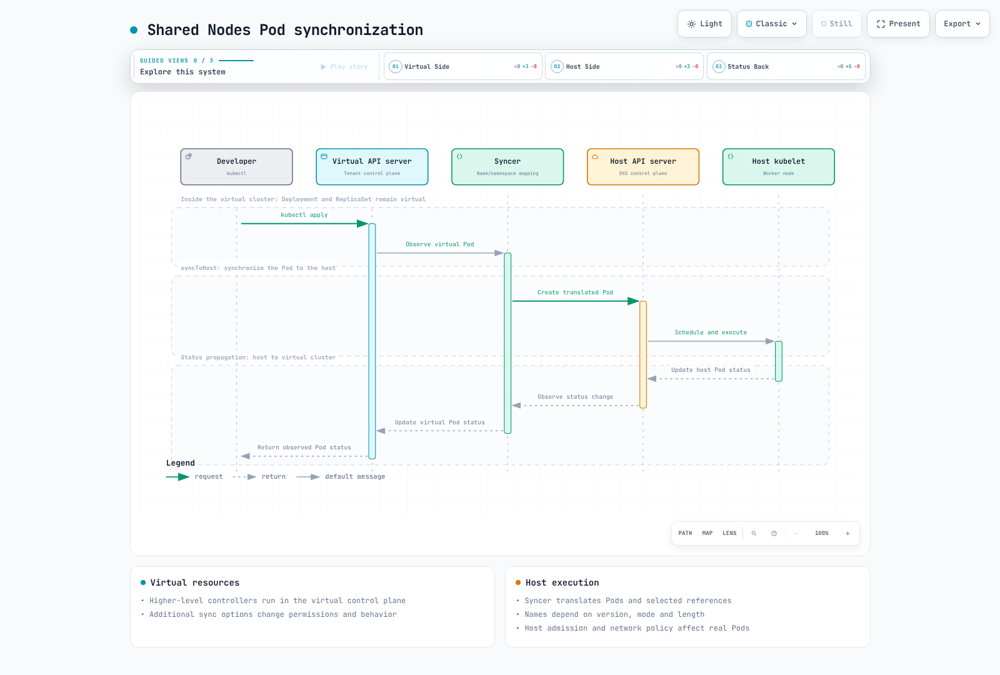
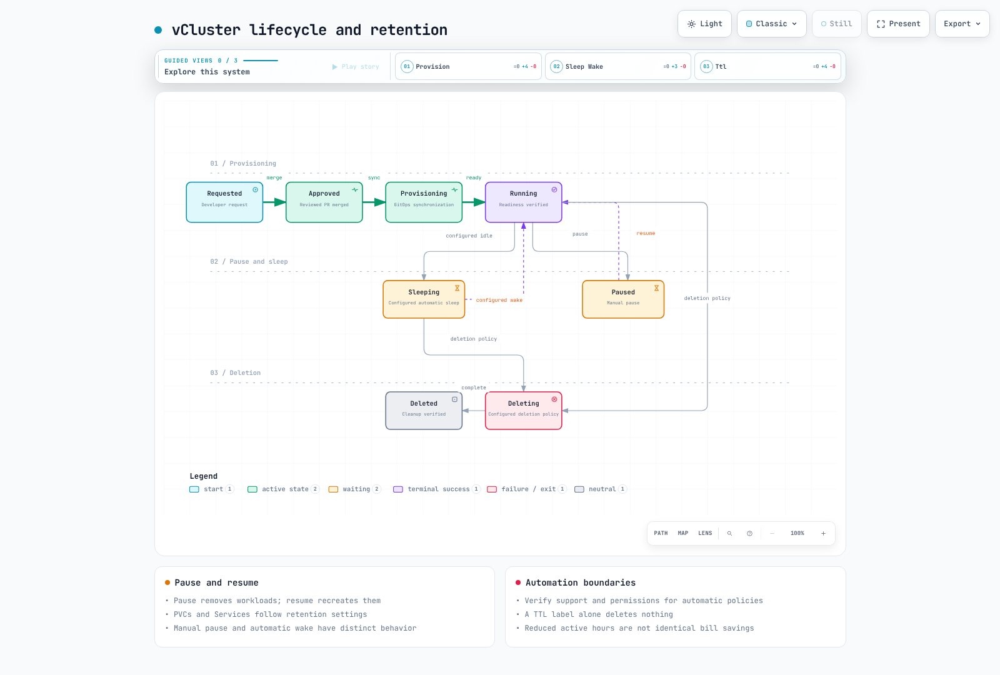

# vCluster

> **最后更新**：2026 年 9 月 13 日 · 审查基线：vCluster 0.37.0

## 概念和隔离边界

vCluster 可为租户提供独立 Kubernetes API、控制器和数据存储。在此**共享节点**示例中，工作负载运行于宿主集群节点，共享内核、CNI、CSI 和容量。独立 API/RBAC 不等于完整硬件、网络或性能隔离。

| 模式 | 需评估的边界 |
| --- | --- |
| 命名空间 | 共享 API 服务器、集群资源和节点；需要 RBAC、配额和网络策略。 |
| 共享节点 vCluster | 分离租户 API，同时共享工作负载节点、CNI 和 CSI。 |
| 专用/私有节点 | 验证节点放置及实际 Private Nodes CNI/CSI 边界。 |
| Standalone | 在没有宿主控制平面集群的基础设施上运行的另一部署模式。 |
| 独立 Kubernetes 集群 | 隔离仍取决于共享账户、VPC、管理员和硬件。 |

公共仓库使用 Apache 2.0。单独检查发行镜像、Platform 功能、支持和许可。原先“自 2024 年 11 月起为 CNCF Sandbox”的说法无法从官方项目页面确认，已移除。Kubernetes 一致性不同于 CNCF 项目成员资格。

不要承诺 30 秒内创建、100–200MiB 开销、数百集群或节省 60–70%。测量实际配置、宿主 API 负载、PVC、镜像拉取、工作负载和计费模型。


[交互式图表](https://www.atomai.click/kubernetes-docs/archmaps/en-platform-engineering-08-vcluster-10.html)

## 当前版本和基线

审查时，GitHub latest 端点返回 0.36.1，但已验证 2026 年 9 月 8 日的显式稳定 0.37.0 发布。因此示例针对 CLI/chart 0.37.0 和已验证 ghcr.io/loft-sh/kubernetes:v1.36.3 镜像。镜像执行及完整运行时兼容性仍需单独检查。

当前模式没有旧 k3s/k0s 发行版设置。区分 k8s 配置、后备存储和确切版本。默认 chart 镜像为 vcluster-pro；仅名称不决定源码许可或免费使用权。

此共享节点配置使用一个副本、嵌入式数据库和 PVC。操作员必须准备 gp3 存储/CSI、配额、身份和宿主策略。

```yaml
controlPlane:
  distro:
    k8s:
      enabled: true
      image:
        tag: v1.36.3
  backingStore:
    database:
      embedded:
        enabled: true
  statefulSet:
    highAvailability:
      replicas: 1
    resources:
      requests:
        cpu: 200m
        memory: 512Mi
        ephemeral-storage: 1Gi
      limits:
        cpu: "2"
        memory: 4Gi
        ephemeral-storage: 10Gi
    persistence:
      volumeClaim:
        enabled: true
        storageClass: gp3
        size: 10Gi
        retentionPolicy: Retain
  service:
    spec:
      type: ClusterIP
  ingress:
    enabled: false
sync:
  fromHost:
    nodes:
      enabled: false
    storageClasses:
      enabled: true
  toHost:
    pods:
      enabled: true
    services:
      enabled: true
    configMaps:
      enabled: true
      all: false
    secrets:
      enabled: true
      all: false
    persistentVolumeClaims:
      enabled: true
    ingresses:
      enabled: false
    serviceAccounts:
      enabled: false
    networkPolicies:
      enabled: false
privateNodes:
  enabled: false
policies:
  podSecurityStandard: restricted
telemetry:
  enabled: false
```

配置通过实际模式和 Helm 检查。但 Helm 也能渲染运行时源码拒绝的嵌入式数据库/三副本组合。高可用需要受支持存储、法定人数、存储及恢复验证；仅增加副本不够。

configMaps、serviceAccounts 和 persistentVolumeClaims 等键区分大小写。StorageClass/CSI 自动默认值取决于部署模式，因此不会普遍同步。此配置显式禁用 Ingress、ServiceAccount 和 NetworkPolicy 同步。



[交互式图表](https://www.atomai.click/kubernetes-docs/archmaps/en-platform-engineering-08-vcluster-11.html)

区分虚拟 Deployment/ReplicaSet 控制器和实际宿主 Pod。Syncer 名称/标签转换取决于模式、长度和版本；不要在 IRSA 信任或运维脚本猜测名称。fromHost.nodes 可见性不会自动强制工作负载节点隔离。

## 安装和访问

为正确操作系统/架构选择 CLI 制品，并验证官方校验和。这些示例命令可影响真实集群；先验证 HOST_CONTEXT 和命名空间。本审计未执行 create/delete/snapshot 操作。

```bash
helm repo add loft-sh https://charts.loft.sh
helm repo update
helm template team-alpha loft-sh/vcluster   --version 0.37.0 --namespace vcluster-team-alpha   -f examples/platform/vcluster/vcluster.yaml

# After the reviewed host prerequisites are ready:
vcluster create team-alpha --driver helm --context HOST_CONTEXT   --namespace vcluster-team-alpha --chart-version 0.37.0   --values examples/platform/vcluster/vcluster.yaml --connect=false

# Keep the forwarding lifetime tied to the child command:
vcluster connect team-alpha --driver helm --context HOST_CONTEXT   --namespace vcluster-team-alpha --background-proxy=false --   kubectl get namespaces
```

connect 管理访问路径和 kubeconfig。旧 --update-current/--kube-config 选项是已弃用别名，不是已移除标志。--print 可输出凭证；应存入受限文件，而非聊天、日志或 PR。

可复用外部 kubeconfig 需要可达 API 端点、匹配证书 SAN/CA 和适当凭证到期。保存 localhost 转发地址不会在转发停止后保留访问。后台代理可能需要 Docker 和另一镜像。使用每用户最小权限 ServiceAccount，审核 --token-expiration，不共享管理员凭证。

宿主操作使用 --context HOST_CONTEXT，避免命名空间删除/备份意外指向租户上下文。并行预置培训环境时收集每个退出状态，不要失败后仍报告全部就绪。

## EKS 存储、Ingress 和 IAM

共享节点模式下，PVC 同步到宿主，由宿主 CSI 处理卷。一起检查 StorageClass、volumeBindingMode、拓扑、回收和保留。当前配置使用 statefulSet.persistence.volumeClaim.storageClass/size。

同步 Ingress 需要真实宿主 LBC/IngressClass、Service 引用、TLS、安全组和获准访问路径。将宿主 LBC webhook Service 复制到租户不建立 ALB 集成。Service 注解放在 controlPlane.service.annotations；service.spec.annotations 不是 Kubernetes ServiceSpec 字段。

禁用 ServiceAccount 同步时，适用宿主工作负载 ServiceAccount 行为；启用时验证实际转换和同步。仅复制虚拟 Pod 注解不配置 IRSA。检查宿主 ServiceAccount、令牌 issuer/subject/audience、角色信任和注入。限制租户控制的 IAM 角色注解。

## 隔离和治理

```yaml
apiVersion: v1
kind: Namespace
metadata:
  name: vcluster-team-alpha
  labels:
    platform.example.com/tenant: team-alpha
    pod-security.kubernetes.io/enforce: baseline
    pod-security.kubernetes.io/enforce-version: v1.36
---
apiVersion: v1
kind: ResourceQuota
metadata:
  name: vcluster-budget
  namespace: vcluster-team-alpha
spec:
  hard:
    requests.cpu: "8"
    requests.memory: 16Gi
    limits.cpu: "16"
    limits.memory: 32Gi
    requests.ephemeral-storage: 20Gi
    limits.ephemeral-storage: 80Gi
    pods: "50"
    services: "20"
    services.loadbalancers: "0"
    services.nodeports: "0"
    persistentvolumeclaims: "10"
    requests.storage: 100Gi
---
apiVersion: v1
kind: LimitRange
metadata:
  name: workload-defaults
  namespace: vcluster-team-alpha
spec:
  limits:
    - type: Container
      defaultRequest:
        cpu: 100m
        memory: 128Mi
        ephemeral-storage: 128Mi
      default:
        cpu: "1"
        memory: 512Mi
        ephemeral-storage: 1Gi
```

LimitRange 还为省略 ephemeral-storage requests/limits 的普通及初始化容器提供默认值。没有该 limit 的 Pod 可能逃过临时存储配额执行；检查最终转换的租户 Pod 和控制平面初始化容器。这些示例值支持配额记账，不是容量预留或性能保证。

Chart 将控制平面 Syncer 渲染为 UID 0。盲目对宿主命名空间应用 restricted 可能拒绝控制平面。宿主 baseline 准入和配置中的 policies.podSecurityStandard: restricted 针对不同层：宿主 Pod 与虚拟工作负载验证。根据实际宿主策略检查转换后的 Pod。

配额预算包含控制平面、CoreDNS、租户工作负载和存储。配额不预留节点容量，也不保证性能。检查生成 Role/ClusterRole 和 Secret 访问；不要授予租户任意宿主 Secret/Role 修改权限。

可选使用这些 values 渲染 chart 网络策略。

```yaml
policies:
  networkPolicy:
    enabled: true
    workload:
      publicEgress:
        enabled: false
```

实际渲染禁用工作负载公共出站，但保留包括 443/8443/6443 在内的宽泛控制平面出站。这里不将其描述为完整阻断宿主 API。NetworkPolicy 允许规则可叠加；添加独立“拒绝”策略无法削减现有允许。

Syncer 需要宿主 API 访问。对控制平面应用相同拒绝出站可能停止同步。验证 DNS、端点 IP/DNAT、所需应用/数据库/仓库路径和 CNI 行为。默认拒绝及例外使用可信控制平面/工作负载分类。


[交互式图表](https://www.atomai.click/kubernetes-docs/archmaps/en-platform-engineering-08-vcluster-12.html)

## 暂停、休眠、删除和快照

当前 CLI pause 缩减虚拟控制平面并移除工作负载，resume 时重建。PVC 和 Service 遵循独立保留行为。这不是保留 Pod 内存的挂起，也不是数据备份。区分手动 pause 和自动休眠/唤醒条件。

这些生命周期设置可选。先验证产品许可、控制器和工作负载行为。此处不启用自动删除。

```yaml
# Optional configuration: verify product entitlement and workload behavior first.
sleep:
  auto:
    afterInactivity: 30m
    schedule: "0 20 * * 1-5"
    timezone: Etc/UTC
    wakeup:
      schedule: "0 8 * * 1-5"
# No automatic deletion is enabled by this example.
deletion:
  prevent: true
```

当前设置使用 sleep.auto 和 deletion.auto 等路径。旧虚构 management.loft.sh/VirtualCluster 字段不是当前配置约定。仅 TTL 标签/注解不会触发删除；使用实际控制器策略并审核所有权、活动工作负载和备份。

删除命名空间可移除 PVC 和剩余工作负载。区分 vcluster delete、Helm uninstall 和 ArgoCD Application 移除，包括 PVC 保留、PV 回收及外部资源。防删除设置不一定阻止宿主管理员直接删除命名空间。

snapshot create 提交异步请求。请求成功不等于 ready 状态或恢复成功。PV 名不是 EBS 卷 ID；EBS 应验证 spec.csi.driver 和 volumeHandle。在线数据库快照需要一致性、静默和恢复测试。

Chart 0.37 拒绝 deploy.volumeSnapshotController，但再次支持成对 volumeSnapshots/volumeSnapshotContents 同步。过时模式注释不被视为所有快照同步已移除的证明。准备 CSI 快照控制器/类和两个选项，再单独测试恢复。Secret 明文导出不是完整备份策略。



[交互式图表](https://www.atomai.click/kubernetes-docs/archmaps/en-platform-engineering-08-vcluster-14.html)

## Backstage、ArgoCD 和临时环境

团队开发、CI、预览、培训和 SaaS 有不同信任、性能及生命周期要求。不要假定开发工作负载容忍每次 Spot 中断，或 SaaS 租户无法相互影响。

CI 中配置宿主身份、可信事件/分支和 OIDC 权限。不要向不可信 fork 代码暴露宿主凭证。在创建、连接、测试和清理全过程使用显式命名空间/上下文，将转发生命周期绑定测试。独立清理任务也需要工具和身份；检查全部退出状态。

此 ApplicationSet 包含此前缺失的 $values sourceRef。将 gitops-config.yaml 保存为 vclusters/team-alpha/config.yaml，将已审核 vcluster.yaml 放在旁边。用获准值替换仓库和 AppProject/目标权限。

```yaml
apiVersion: argoproj.io/v1alpha1
kind: ApplicationSet
metadata:
  name: reviewed-vclusters
  namespace: argocd
spec:
  goTemplate: true
  goTemplateOptions: ["missingkey=error"]
  generators:
    - git:
        repoURL: https://github.com/REPLACE_APPROVED_ORG/platform-config
        revision: main
        files:
          - path: vclusters/*/config.yaml
  syncPolicy:
    preserveResourcesOnDeletion: true
  template:
    metadata:
      name: "vcluster-{{ .name }}"
    spec:
      project: vcluster-tenants
      sources:
        - repoURL: https://charts.loft.sh
          chart: vcluster
          targetRevision: "0.37.0"
          helm:
            releaseName: "{{ .name }}"
            valueFiles:
              - "$values/vclusters/{{ .name }}/vcluster.yaml"
        - repoURL: https://github.com/REPLACE_APPROVED_ORG/platform-config
          targetRevision: main
          ref: values
      destination:
        server: https://kubernetes.default.svc
        namespace: "{{ .namespace }}"
      syncPolicy:
        automated:
          selfHeal: true
          prune: false
        syncOptions: [CreateNamespace=true]
```

preserveResourcesOnDeletion 和 prune:false 是有意选择，避免将配置移除视为立即删除数据。跟踪保留资源所有权/成本，并建立独立退役流程。Backstage debug:log 操作不实现审批或等待部署。


[交互式图表](https://www.atomai.click/kubernetes-docs/archmaps/en-platform-engineering-08-vcluster-13.html)

## 可观测性、资源和成本

不要对有意暂停、期望副本为零的 StatefulSet 自动警报。单个聚合 absent() 可能在一个集群失败、另一个健康时漏报。使用实际 job/namespace/pod/container 标签、指标端点和期望状态清单。Chart 容器名为 syncer；不要虚构 vcluster_syncer_* 指标。

Requests 不是利用率或账单。CPU 1 与 250m，或内存 1Gi 与 512Mi，不能作为裸数字字符串相加。examples/platform/vcluster/usage 使用 Kubernetes PodRequests 处理单位、初始化容器、开销和 Pod 级 requests。

```bash
# Run inside examples/platform/vcluster/usage with the pinned Go dependencies:
kubectl --context HOST_CONTEXT get pods -n vcluster-team-alpha -o json | go run .
```

工具汇总非终态 Pod 基于 spec 的 requests，不是实际 RSS/CPU、resize 状态或 PVC 成本。测试了三个合成用例；未对工具执行真实集群查询。

将活动时间从 168 降为 50 小时，不会同比减少节点、EBS、负载均衡器和许可成本。将实际节点缩容、保留存储、承诺和最小容量与账单比较。Kubernetes 标签不会自动成为 AWS 成本分摊标签。

不要指示 EKS 用户直接调整托管 API 服务器/etcd 副本或实例大小。审核受支持托管控制平面设置/配额和请求负载。固定 chart/CLI/Kubernetes/存储组合，验证备份/预发布，并考虑不同命名空间中的相同 Helm 发布名。

## 已执行检查

阅读了 1,998 行韩文和 2,171 行英文指南、两份各 143 行的测验及 106 个唯一代码块。验证了 0.37.0 模式、Helm 配置、生命周期/网络策略渲染、官方校验和/镜像索引及 Kubernetes 资源记账。记录模式与运行时验证的差异。

两次使用 0.36.1 检查已弃用连接标志的尝试，以只读方式查询现有集群并因 Unauthorized 失败。未更改资源；后续 0.37 检查限于 version/help/源码和离线 chart。未验证 vCluster 创建、镜像执行、休眠/删除/快照/恢复、网络隔离、IAM 身份验证、负载或成本节省。

- [vCluster 0.37.0](https://github.com/loft-sh/vcluster/releases/tag/v0.37.0)
- [带版本配置](https://github.com/loft-sh/vcluster/blob/v0.37.0/config/values.yaml)
- [带版本模式](https://github.com/loft-sh/vcluster/blob/v0.37.0/chart/values.schema.json)
- [架构](https://www.vcluster.com/docs/vcluster/introduction/architecture)
- [休眠配置](https://www.vcluster.com/docs/vcluster/configure/vcluster-yaml/sleep)

[Backstage](06-backstage-idp.md) · [Crossplane](07-crossplane.md)

[vCluster 测验](../quizzes/platform-engineering/08-vcluster-quiz.md)
