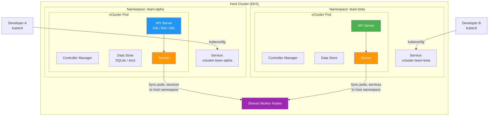
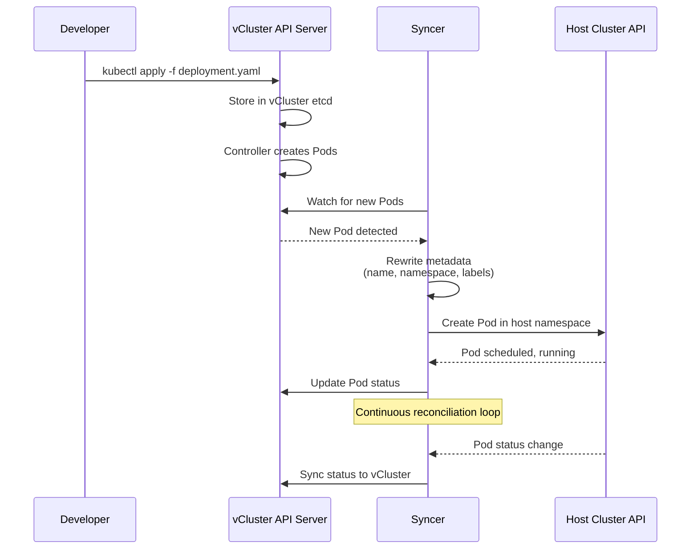
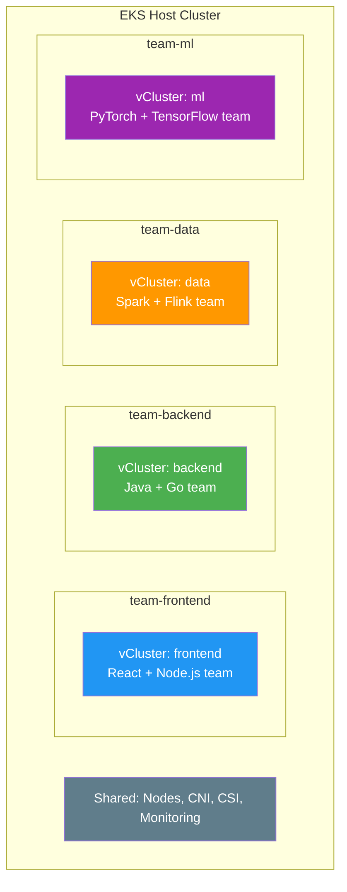
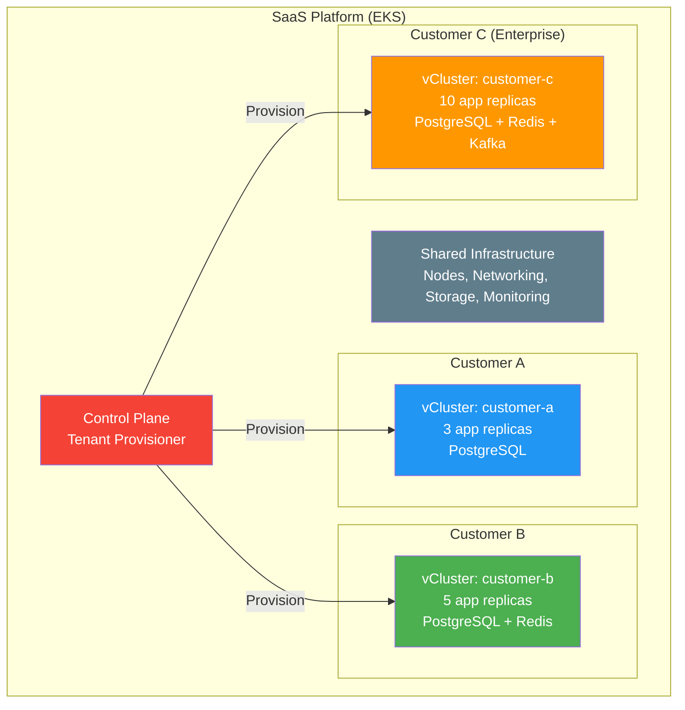
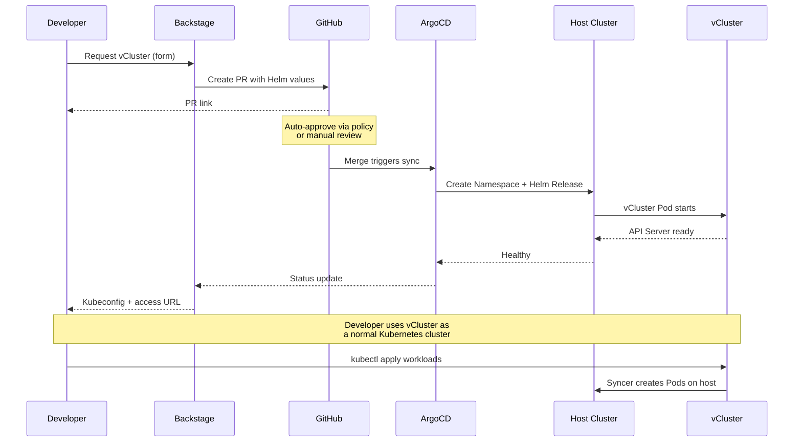

# vCluster

> **支持的版本**: vCluster v0.21+, vCluster Pro v0.21+
> **最后更新**: June 2025

## Table of Contents

- [Overview](#overview)
- [Learning Objectives](#learning-objectives)
- [vCluster Architecture](#vcluster-architecture)
- [EKS Installation and Configuration](#eks-installation-and-configuration)
- [Virtual Cluster Operations](#virtual-cluster-operations)
- [Multi-Tenancy Patterns](#multi-tenancy-patterns)
- [Security and Isolation](#security-and-isolation)
- [Backstage + vCluster Integration](#backstage--vcluster-integration)
- [Production Operations](#production-operations)
- [Best Practices](#best-practices)
- [References](#references)

---

## Overview

### What is vCluster?

vCluster 是 Loft Labs 推出的开源项目，用于创建功能完整的 virtual Kubernetes clusters（虚拟 Kubernetes 集群），这些集群运行在 host Kubernetes cluster（宿主 Kubernetes 集群）的 namespace 内。每个 virtual cluster 都有自己专用的 API server、control plane（控制平面）和 Syncer，但会共享 host cluster 底层的 worker nodes 和 container runtime。从用户或 workload 的视角看，virtual cluster 与真实 cluster 无法区分 -- 它支持 CRDs、admission webhooks、RBAC 以及完整的 Kubernetes API -- 但不需要额外基础设施。

不同于仅依赖 namespaces 和 RBAC 的传统 multi-tenancy 方法，vCluster 提供真正的 control plane 隔离。每个 tenant 都会获得完整的 Kubernetes control plane，可在其中以 cluster-admin 身份操作，安装自己的 CRDs，配置自己的 admission controllers，并管理 cluster-scoped resources -- 这一切都不会影响其他 tenants 或 host cluster。

### Why Virtual Clusters?

Kubernetes 中传统的 multi-tenancy 方法各自都有明显取舍：

- **Namespace isolation** 提供基本隔离，但无法隔离 CRDs、cluster-scoped resources 或 admission webhooks。Tenants 共享单个 API server，并且必须围绕共享资源进行协调。
- **Separate physical clusters** 提供强隔离，但会成倍增加基础设施成本、运维开销和管理复杂度。Provisioning 一个新 cluster 需要数分钟到数小时。
- **Virtual clusters** 介于两者之间：它们在共享底层 compute、storage 和 networking 基础设施的同时，提供强隔离（每个 tenant 都获得自己的 API server 和完整 cluster-admin 访问权限）。

### Multi-Tenancy Approach Comparison

| Criteria | Namespace Isolation | vCluster | Physical Cluster |
|----------|-------------------|----------|-----------------|
| **Isolation Level** | Low (shared API server) | High (dedicated API server) | Highest (separate infrastructure) |
| **CRD Isolation** | None (shared across cluster) | Full (per-vCluster CRDs) | Full |
| **Cluster-Admin Access** | Not possible for tenants | Yes (within vCluster) | Yes |
| **Admission Webhooks** | Shared (cluster-wide) | Isolated (per-vCluster) | Isolated |
| **RBAC Complexity** | High (many role bindings) | Low (cluster-admin per tenant) | Low |
| **Provisioning Time** | Seconds (create namespace) | Seconds to minutes | Minutes to hours |
| **Infrastructure Cost** | Lowest (shared everything) | Low (shared nodes, minimal overhead) | Highest (dedicated nodes) |
| **Resource Overhead** | None | ~100-200 MiB per vCluster | Full control plane per cluster |
| **Operational Overhead** | Low | Medium | High (cluster lifecycle) |
| **Node Sharing** | Yes | Yes | No (unless multi-cluster scheduling) |
| **Network Isolation** | Requires NetworkPolicy | Requires NetworkPolicy + Syncer rules | Physical separation possible |
| **Scalability** | Limited by API server load | Hundreds per host cluster | Limited by infrastructure budget |
| **GitOps Compatibility** | Native | Native (standard kubeconfig) | Native |

### CNCF Sandbox Project

vCluster 于 2024 年 11 月被 CNCF Sandbox 接纳，这表明 cloud-native 社区认可 virtual clusters 是 multi-tenancy 和 platform engineering 的合法模式。该项目在 GitHub 上已有超过 7,000 个 stars，并被从初创公司到 Fortune 500 企业的各种组织用于生产环境。vCluster Pro 是 Loft Labs 的商业产品，增加了 centralized management、Sleep Mode、Auto-Delete 和 advanced RBAC 等功能 -- 这些功能面向大规模 multi-tenant 运维而设计。

---

## Learning Objectives

完成本文档后，你将能够：

1. **解释** virtual cluster 概念，以及 vCluster 如何在单个 host cluster 内实现 control plane 隔离
2. **比较** multi-tenancy 方法（namespaces、vCluster、physical clusters），并为你的用例选择合适策略
3. **安装** vCluster 到 Amazon EKS，使用 CLI 和 Helm，并配置 EKS-specific 设置以支持 EBS CSI、ALB Ingress 和 IRSA
4. **创建和管理** virtual clusters -- 包括 pause、resume 和 deletion 等 lifecycle operations
5. **配置** resource synchronization 规则，以控制哪些 Kubernetes resources 在 virtual cluster 与 host cluster 之间流动
6. **设计** 面向 development environments、CI/CD pipelines、preview environments 和 multi-tenant SaaS platforms 的 multi-tenancy patterns
7. **实现** 安全控制，包括 NetworkPolicy isolation、ResourceQuota enforcement、Pod Security Standards 和 RBAC
8. **集成** vCluster 与 Backstage 和 ArgoCD，在 Internal Developer Platform 中实现 self-service virtual cluster provisioning
9. **运营** 生产环境中的 vCluster，包括 monitoring、backup、upgrade strategies，并通过 Sleep Mode 和 Auto-Delete 进行 cost optimization

---

## vCluster Architecture

### Virtual Control Plane

每个 vCluster 都在 host cluster 上的单个 pod（或 StatefulSet）中运行一个轻量级 Kubernetes control plane。virtual control plane 由 API server、controller manager 和 data store（etcd 或轻量级替代方案）组成。Syncer 组件通过在两者之间同步选定资源，连接 virtual cluster 与 host cluster。



### Syncer Component

Syncer 是 vCluster 背后的核心创新。它充当 virtual cluster 与 host cluster 之间的双向桥梁，跨边界翻译和同步 Kubernetes resources。当用户在 vCluster 内创建 Pod 时，Syncer 会在 host namespace 中创建对应的 Pod -- 但会重写名称、labels 和 metadata，以避免 virtual clusters 之间发生冲突。



**Resource synchronization behavior:**

| Resource Type | Direction | Behavior |
|--------------|-----------|----------|
| Pods | vCluster -> Host | Created in host namespace with rewritten names |
| Services | vCluster -> Host | Synced to host; ClusterIP re-mapped |
| Endpoints | Bidirectional | Kept in sync for service discovery |
| ConfigMaps | vCluster -> Host (for mounted) | Only synced if referenced by a synced Pod |
| Secrets | vCluster -> Host (for mounted) | Only synced if referenced by a synced Pod |
| Ingresses | vCluster -> Host | Synced to host for ingress controller processing |
| PersistentVolumeClaims | vCluster -> Host | Synced to host for storage provisioning |
| PersistentVolumes | Host -> vCluster | Synced from host after PVC binding |
| StorageClasses | Host -> vCluster | Synced from host so tenants can select storage |
| IngressClasses | Host -> vCluster | Synced from host for ingress configuration |
| CSIDrivers | Host -> vCluster | Synced from host for volume support |
| CSINodes | Host -> vCluster | Synced from host for scheduling |
| Nodes | Host -> vCluster (virtual) | Fake or real node objects synced for scheduling |

### Backing Distributions

vCluster 支持三种 Kubernetes distributions 作为 virtual control plane backend：

| Distribution | Default | Control Plane Footprint | CRD Support | Notes |
|-------------|---------|------------------------|-------------|-------|
| **k3s** | Yes | ~100 MiB RAM, ~0.5 CPU | Full | Lightweight, fast startup. Built-in CoreDNS, Traefik disabled in vCluster mode. |
| **k0s** | No | ~150 MiB RAM, ~0.5 CPU | Full | Zero-friction Kubernetes by Mirantis. Single binary, minimal dependencies. |
| **Vanilla k8s** | No | ~500 MiB RAM, ~1 CPU | Full | Upstream Kubernetes API server + etcd. Highest fidelity, highest resource cost. Recommended when exact API compatibility is critical. |

Distribution 的选择会影响资源开销，但不会影响功能。三者都支持 CRDs、admission webhooks 和完整的 Kubernetes API surface。对大多数 platform engineering 用例而言，k3s 在兼容性与资源效率之间提供最佳平衡。

### Relationship with Host Cluster

virtual cluster 与 host cluster 之间保持清晰的职责分离：

- **Virtual cluster owns**：API resources（Deployments、StatefulSets、CRDs、RBAC、admission webhooks）、workload scheduling decisions（从 tenant 视角看）以及 vCluster 内的 namespace-scoped objects。
- **Host cluster owns**：在 nodes 上实际调度 Pod、networking（CNI、NetworkPolicy enforcement）、storage provisioning（CSI drivers、StorageClasses）以及物理资源分配。
- **Syncer bridges**：将 virtual cluster resources 翻译为 host cluster resources，并将状态传播回去。Syncer 会重写 resource names 以包含 vCluster name，从而防止冲突。例如，vCluster `team-alpha` 中名为 `nginx` 的 Pod 会在 host namespace 中变为 `nginx-x-default-x-team-alpha`。

---

## EKS Installation and Configuration

### Prerequisites

在 EKS 上安装 vCluster 之前，请确保满足以下条件：

```bash
# Verify EKS cluster access
kubectl cluster-info
kubectl get nodes

# Required: Helm v3.10+
helm version

# Required: kubectl v1.28+
kubectl version --client
```

### vCluster CLI Installation

vCluster CLI 提供了创建和管理 virtual clusters 的最简单方式：

```bash
# macOS
brew install loft-sh/tap/vcluster

# Linux (amd64)
curl -L -o vcluster "https://github.com/loft-sh/vcluster/releases/latest/download/vcluster-linux-amd64"
chmod +x vcluster
sudo mv vcluster /usr/local/bin/

# Verify installation
vcluster --version
# vcluster version 0.21.x
```

### Helm Installation

对于 GitOps workflows 和 programmatic management，可以通过 Helm 部署 vCluster：

```bash
# Add the vCluster Helm repository
helm repo add loft-sh https://charts.loft.sh
helm repo update

# Install a vCluster named "team-alpha" in namespace "team-alpha"
kubectl create namespace team-alpha

helm install team-alpha loft-sh/vcluster \
  --namespace team-alpha \
  --values vcluster-values.yaml \
  --version 0.21.0
```

### vcluster.yaml Configuration File

`vcluster.yaml` 文件控制 virtual cluster 的方方面面。下面是一个面向 EKS 的完整、production-ready 配置：

```yaml
# vcluster.yaml -- Complete EKS production configuration
# Documentation: https://www.vcluster.com/docs/vcluster/configure/vcluster-yaml

# --- Control Plane Configuration ---
controlPlane:
  # Backing distribution: k3s (default), k0s, or k8s
  distro:
    k3s:
      enabled: true
      image:
        repository: rancher/k3s
        tag: v1.31.2-k3s1
      # Disable k3s built-in components not needed in vCluster
      extraArgs:
        - --disable=traefik,servicelb,metrics-server,local-storage

  # StatefulSet configuration for the vCluster control plane
  statefulSet:
    resources:
      requests:
        cpu: 200m
        memory: 256Mi
      limits:
        cpu: "1"
        memory: 1Gi
    persistence:
      # Use EBS for the vCluster data store
      size: 10Gi
      storageClass: gp3
    labels:
      app.kubernetes.io/managed-by: vcluster
      team: platform
    scheduling:
      nodeSelector:
        node.kubernetes.io/instance-type: m6i.large
      tolerations:
        - key: dedicated
          operator: Equal
          value: vcluster
          effect: NoSchedule

  # Ingress for API server access (optional -- alternative to LoadBalancer)
  ingress:
    enabled: false

  # Service configuration for API server access
  service:
    spec:
      type: ClusterIP  # Use ClusterIP with vcluster connect, or LoadBalancer for direct access

# --- Syncer Configuration ---
sync:
  # Resources synced FROM the virtual cluster TO the host cluster
  toHost:
    pods:
      enabled: true
    services:
      enabled: true
    configmaps:
      enabled: true
    secrets:
      enabled: true
    endpoints:
      enabled: true
    persistentvolumeclaims:
      enabled: true
    ingresses:
      enabled: true
    serviceaccounts:
      enabled: true
    networkpolicies:
      enabled: true

  # Resources synced FROM the host cluster TO the virtual cluster
  fromHost:
    nodes:
      enabled: true
      selector:
        labels:
          vcluster-enabled: "true"
    storageClasses:
      enabled: true
    ingressClasses:
      enabled: true
    csiDrivers:
      enabled: true
    csiNodes:
      enabled: true
    csiStorageCapacities:
      enabled: true

# --- Networking Configuration ---
networking:
  # Reuse host cluster DNS for external resolution
  replicateServices:
    fromHost:
      - from: kube-system/aws-load-balancer-webhook-service
        to: kube-system/aws-load-balancer-webhook-service
    toHost: []

  # Resolve DNS via host cluster CoreDNS
  resolveDNS:
    - hostname: "*.amazonaws.com"
      target: host
      service: ""

# --- Plugin Configuration ---
plugins: {}

# --- RBAC Configuration ---
rbac:
  # Role used by the Syncer on the host cluster
  role:
    # Extra rules needed for EKS-specific resources
    extraRules:
      - apiGroups: ["networking.k8s.io"]
        resources: ["networkpolicies"]
        verbs: ["create", "delete", "patch", "update", "get", "list", "watch"]

  # ClusterRole for host-level access
  clusterRole:
    extraRules:
      - apiGroups: ["storage.k8s.io"]
        resources: ["storageclasses", "csinodes", "csidrivers", "csistoragecapacities"]
        verbs: ["get", "list", "watch"]

# --- Export / Import CRDs ---
exportKubeconfig:
  context: vcluster-team-alpha
  server: https://localhost:8443

# --- Telemetry ---
telemetry:
  enabled: false
```

### EKS-Specific Configuration

#### EBS CSI Driver Integration

Amazon EBS CSI driver 在 host cluster 上运行。vCluster tenants 通过 StorageClass synchronization 透明地使用它：

```yaml
# Verify EBS CSI driver is running on the host
# kubectl get pods -n kube-system -l app.kubernetes.io/name=aws-ebs-csi-driver

# vcluster.yaml -- StorageClass sync (enabled by default)
sync:
  fromHost:
    storageClasses:
      enabled: true

# Inside the vCluster, tenants can now use EBS StorageClasses:
# kubectl get sc
# NAME            PROVISIONER             RECLAIMPOLICY   VOLUMEBINDINGMODE
# gp3 (default)   ebs.csi.aws.com         Delete          WaitForFirstConsumer
```

要让特定 StorageClass 在 vCluster 内可用：

```yaml
# StorageClass on the host cluster
apiVersion: storage.k8s.io/v1
kind: StorageClass
metadata:
  name: gp3
  annotations:
    storageclass.kubernetes.io/is-default-class: "true"
provisioner: ebs.csi.aws.com
parameters:
  type: gp3
  encrypted: "true"
volumeBindingMode: WaitForFirstConsumer
allowVolumeExpansion: true
```

#### ALB Ingress Controller Integration

AWS Load Balancer Controller 在 host cluster 上运行。vCluster 会将 Ingress resources 同步到 host，由 controller 处理：

```yaml
# vcluster.yaml -- Ingress sync configuration
sync:
  toHost:
    ingresses:
      enabled: true

# Inside the vCluster, tenants create Ingresses that reference the ALB class:
# ---
# apiVersion: networking.k8s.io/v1
# kind: Ingress
# metadata:
#   name: my-app
#   annotations:
#     alb.ingress.kubernetes.io/scheme: internet-facing
#     alb.ingress.kubernetes.io/target-type: ip
# spec:
#   ingressClassName: alb
#   rules:
#     - host: app.example.com
#       http:
#         paths:
#           - path: /
#             pathType: Prefix
#             backend:
#               service:
#                 name: my-app
#                 port:
#                   number: 80
```

#### IRSA (IAM Roles for Service Accounts) Integration

IRSA 需要在 vCluster 与 host cluster 之间协调，因为实际的 Pods 运行在 host 上。Syncer 必须将 ServiceAccount annotations 同步到 host，以便 IRSA mutating webhook 能注入正确的 IAM credentials：

```yaml
# vcluster.yaml -- ServiceAccount sync for IRSA
sync:
  toHost:
    serviceaccounts:
      enabled: true

# Step 1: Create the IAM role with the OIDC trust policy
# The trust policy must reference the HOST cluster's OIDC provider,
# and the service account namespace must be the HOST namespace (e.g., team-alpha),
# not the vCluster's internal namespace.

# Step 2: Inside the vCluster, create a ServiceAccount with the IAM role annotation
# ---
# apiVersion: v1
# kind: ServiceAccount
# metadata:
#   name: s3-reader
#   namespace: default
#   annotations:
#     eks.amazonaws.com/role-arn: arn:aws:iam::123456789012:role/vcluster-team-alpha-s3-reader
```

**IRSA trust policy for vCluster workloads:**

```json
{
  "Version": "2012-10-17",
  "Statement": [
    {
      "Effect": "Allow",
      "Principal": {
        "Federated": "arn:aws:iam::123456789012:oidc-provider/oidc.eks.us-west-2.amazonaws.com/id/EXAMPLED539D4633E53DE1B71EXAMPLE"
      },
      "Action": "sts:AssumeRoleWithWebIdentity",
      "Condition": {
        "StringEquals": {
          "oidc.eks.us-west-2.amazonaws.com/id/EXAMPLED539D4633E53DE1B71EXAMPLE:sub": "system:serviceaccount:team-alpha:s3-reader-x-default-x-team-alpha"
        }
      }
    }
  ]
}
```

请注意 `sub` claim 中重写后的 ServiceAccount name：`s3-reader-x-default-x-team-alpha`。Syncer 会重写 ServiceAccount name 以包含 vCluster namespace，OIDC trust policy 必须匹配这个重写后的名称。

#### Resource Limits for vCluster Control Plane

为 vCluster control plane 应用 resource limits，防止单个 vCluster 消耗过多 host resources：

```yaml
# vcluster.yaml -- Resource limits
controlPlane:
  statefulSet:
    resources:
      requests:
        cpu: 200m
        memory: 256Mi
      limits:
        cpu: "1"
        memory: 1Gi
    persistence:
      size: 10Gi
      storageClass: gp3

# Additionally, set a ResourceQuota on the host namespace
# to limit the total resources a vCluster's workloads can consume
# ---
# apiVersion: v1
# kind: ResourceQuota
# metadata:
#   name: team-alpha-quota
#   namespace: team-alpha
# spec:
#   hard:
#     requests.cpu: "8"
#     requests.memory: 16Gi
#     limits.cpu: "16"
#     limits.memory: 32Gi
#     pods: "50"
#     persistentvolumeclaims: "10"
```

---

## Virtual Cluster Operations

### Create a Virtual Cluster

```bash
# Using the vCluster CLI (quickest method)
vcluster create team-alpha \
  --namespace team-alpha \
  --connect=false \
  --values vcluster-values.yaml

# Using Helm (GitOps-friendly)
helm install team-alpha loft-sh/vcluster \
  --namespace team-alpha \
  --create-namespace \
  --values vcluster-values.yaml

# Verify the vCluster is running
kubectl get pods -n team-alpha
# NAME                                    READY   STATUS    RESTARTS   AGE
# team-alpha-0                            1/1     Running   0          45s

kubectl get statefulset -n team-alpha
# NAME         READY   AGE
# team-alpha   1/1     50s
```

### Connect and Access the Virtual Cluster

```bash
# Connect using the CLI (sets up port forwarding + kubeconfig automatically)
vcluster connect team-alpha --namespace team-alpha

# This modifies your kubeconfig and switches context.
# You are now inside the virtual cluster:
kubectl get namespaces
# NAME              STATUS   AGE
# default           Active   2m
# kube-system       Active   2m
# kube-public       Active   2m
# kube-node-lease   Active   2m

# Verify you have cluster-admin access
kubectl auth can-i '*' '*'
# yes

# Disconnect (restore previous kubeconfig context)
vcluster disconnect
```

### Export Kubeconfig for External Access

对于 CI/CD pipelines 或团队分发，可导出 standalone kubeconfig：

```bash
# Export kubeconfig to a file
vcluster connect team-alpha \
  --namespace team-alpha \
  --update-current=false \
  --kube-config ./team-alpha-kubeconfig.yaml

# Use the exported kubeconfig
export KUBECONFIG=./team-alpha-kubeconfig.yaml
kubectl get nodes
```

如果需要不通过 port forwarding 的持久访问，可通过 LoadBalancer 或 Ingress 暴露 vCluster API server：

```yaml
# vcluster.yaml -- LoadBalancer service for direct access
controlPlane:
  service:
    spec:
      type: LoadBalancer
      annotations:
        service.beta.kubernetes.io/aws-load-balancer-scheme: internal
        service.beta.kubernetes.io/aws-load-balancer-type: nlb
```

### Delete a Virtual Cluster

```bash
# Using the CLI
vcluster delete team-alpha --namespace team-alpha

# Using Helm
helm uninstall team-alpha --namespace team-alpha

# Clean up the namespace (optional -- removes PVCs and any remaining resources)
kubectl delete namespace team-alpha
```

当 vCluster 被删除时，Syncer 会清理它在 host namespace 中创建的所有 resources。由 vCluster workload provision 的任何 PersistentVolumes 都受 StorageClass reclaim policy 约束。

### Pause and Resume (vCluster Pro)

vCluster Pro 支持暂停 virtual clusters，以便在非工作时间节省资源。暂停的 vCluster 会将其 StatefulSet 扩缩到零副本，释放 CPU 和 memory，同时保留磁盘上的所有数据：

```bash
# Pause a vCluster (scales to 0 replicas)
vcluster pause team-alpha --namespace team-alpha

# Verify the vCluster is paused
kubectl get statefulset -n team-alpha
# NAME         READY   AGE
# team-alpha   0/1     24h

# Resume a vCluster
vcluster resume team-alpha --namespace team-alpha

# The vCluster restarts with all state intact
kubectl get statefulset -n team-alpha
# NAME         READY   AGE
# team-alpha   1/1     24h
```

### Resource Synchronization Rules

#### syncToHost -- Virtual Cluster to Host

在 vCluster 内创建、且需要存在于 host cluster 上以便实际执行的 resources：

```yaml
# vcluster.yaml
sync:
  toHost:
    # Core workload resources
    pods:
      enabled: true
      # Translate labels to avoid conflicts
      translatePatches:
        - path: metadata.labels.app
          expression: "'vcluster-' + value"
    services:
      enabled: true
    endpoints:
      enabled: true

    # Configuration resources (synced only if referenced by a Pod)
    configmaps:
      enabled: true
    secrets:
      enabled: true

    # Storage resources
    persistentvolumeclaims:
      enabled: true

    # Networking resources
    ingresses:
      enabled: true
    networkpolicies:
      enabled: true

    # Custom resources (sync CRDs from vCluster to host)
    customResources:
      certificates.cert-manager.io:
        enabled: true
```

#### syncFromHost -- Host to Virtual Cluster

存在于 host cluster 上、且应在 vCluster 内可见的 resources：

```yaml
# vcluster.yaml
sync:
  fromHost:
    # Node information for scheduling decisions
    nodes:
      enabled: true
      selector:
        labels:
          vcluster-enabled: "true"
      # Optionally clear node status to hide host details
      clearImageStatus: true

    # Storage infrastructure
    storageClasses:
      enabled: true
    csiDrivers:
      enabled: true
    csiNodes:
      enabled: true
    csiStorageCapacities:
      enabled: true

    # Networking infrastructure
    ingressClasses:
      enabled: true

    # Custom resources from host
    customResources:
      clusterissuers.cert-manager.io:
        enabled: true
```

### Storage Synchronization

当 tenant 在 vCluster 内创建 PVC 时，Syncer 会在 host namespace 中创建对应的 PVC。host cluster 的 CSI driver 会 provision 实际 volume：

```yaml
# Inside the vCluster -- tenant creates a PVC
apiVersion: v1
kind: PersistentVolumeClaim
metadata:
  name: data-volume
  namespace: default
spec:
  accessModes:
    - ReadWriteOnce
  storageClassName: gp3
  resources:
    requests:
      storage: 20Gi
---
# On the host cluster, the Syncer creates:
# PVC name: data-volume-x-default-x-team-alpha
# Namespace: team-alpha
# The EBS CSI driver provisions the volume as usual
```

### Service Exposure

Tenants 可以使用三种方式从 vCluster 内暴露 services：

**LoadBalancer (recommended for production services):**

```yaml
# Inside the vCluster
apiVersion: v1
kind: Service
metadata:
  name: my-api
  namespace: default
  annotations:
    service.beta.kubernetes.io/aws-load-balancer-scheme: internet-facing
    service.beta.kubernetes.io/aws-load-balancer-type: nlb
spec:
  type: LoadBalancer
  selector:
    app: my-api
  ports:
    - port: 443
      targetPort: 8443
      protocol: TCP
# The Syncer creates this Service on the host cluster.
# The AWS Load Balancer Controller provisions an NLB.
```

**Ingress (recommended for HTTP/HTTPS services):**

```yaml
# Inside the vCluster
apiVersion: networking.k8s.io/v1
kind: Ingress
metadata:
  name: my-app
  namespace: default
  annotations:
    alb.ingress.kubernetes.io/scheme: internet-facing
    alb.ingress.kubernetes.io/target-type: ip
    alb.ingress.kubernetes.io/certificate-arn: arn:aws:acm:us-west-2:123456789012:certificate/abc-123
spec:
  ingressClassName: alb
  rules:
    - host: myapp.example.com
      http:
        paths:
          - path: /
            pathType: Prefix
            backend:
              service:
                name: my-app
                port:
                  number: 80
```

**NodePort (for testing and development):**

```yaml
# Inside the vCluster
apiVersion: v1
kind: Service
metadata:
  name: debug-service
  namespace: default
spec:
  type: NodePort
  selector:
    app: debug
  ports:
    - port: 8080
      targetPort: 8080
      nodePort: 30080
```

---

## Multi-Tenancy Patterns

### Pattern 1: Development Environment Isolation (Per-Team vCluster)

为每个开发团队分配一个专用 vCluster，用于日常工作。团队在自己的 vCluster 内获得 cluster-admin 访问权限，可以安装所需的任何 CRDs 或工具，而不会影响其他团队。



```yaml
# vcluster-team-frontend.yaml
controlPlane:
  distro:
    k3s:
      enabled: true
  statefulSet:
    resources:
      requests:
        cpu: 200m
        memory: 256Mi
      limits:
        cpu: "1"
        memory: 1Gi
    labels:
      team: frontend
      environment: development

sync:
  toHost:
    pods:
      enabled: true
    services:
      enabled: true
    ingresses:
      enabled: true
    persistentvolumeclaims:
      enabled: true
  fromHost:
    storageClasses:
      enabled: true
    ingressClasses:
      enabled: true
    nodes:
      enabled: true
```

```bash
# Create vClusters for each team
for team in frontend backend data ml; do
  kubectl create namespace "team-${team}"

  vcluster create "${team}" \
    --namespace "team-${team}" \
    --values "vcluster-team-${team}.yaml" \
    --connect=false
done

# Distribute kubeconfigs to each team
for team in frontend backend data ml; do
  vcluster connect "${team}" \
    --namespace "team-${team}" \
    --update-current=false \
    --kube-config "./kubeconfigs/${team}-kubeconfig.yaml"
done
```

### Pattern 2: CI/CD Ephemeral Environments

为每次 CI/CD pipeline run 创建一个全新的 vCluster。vCluster 在 pipeline 开始时创建，测试在其中运行，并在 pipeline 完成时销毁。这保证了每次测试运行都有干净环境。

```yaml
# .github/workflows/integration-test.yaml
name: Integration Tests
on:
  push:
    branches: [main, develop]

jobs:
  test:
    runs-on: ubuntu-latest
    steps:
      - uses: actions/checkout@v4

      - name: Install vCluster CLI
        run: |
          curl -L -o vcluster "https://github.com/loft-sh/vcluster/releases/latest/download/vcluster-linux-amd64"
          chmod +x vcluster
          sudo mv vcluster /usr/local/bin/

      - name: Configure kubectl
        uses: aws-actions/configure-aws-credentials@v4
        with:
          role-to-assume: arn:aws:iam::123456789012:role/github-actions-eks
          aws-region: us-west-2
      - run: aws eks update-kubeconfig --name my-cluster --region us-west-2

      - name: Create ephemeral vCluster
        run: |
          VCLUSTER_NAME="ci-${GITHUB_RUN_ID}-${GITHUB_RUN_ATTEMPT}"
          vcluster create "${VCLUSTER_NAME}" \
            --namespace ci-environments \
            --connect=true \
            --values ci-vcluster.yaml

      - name: Run integration tests
        run: |
          kubectl apply -f ./k8s/manifests/
          kubectl wait --for=condition=available deployment/my-app --timeout=120s
          make integration-test

      - name: Cleanup vCluster
        if: always()
        run: |
          VCLUSTER_NAME="ci-${GITHUB_RUN_ID}-${GITHUB_RUN_ATTEMPT}"
          vcluster delete "${VCLUSTER_NAME}" \
            --namespace ci-environments \
            --delete-namespace=false
```

```yaml
# ci-vcluster.yaml -- Minimal configuration for CI
controlPlane:
  distro:
    k3s:
      enabled: true
  statefulSet:
    resources:
      requests:
        cpu: 100m
        memory: 128Mi
      limits:
        cpu: 500m
        memory: 512Mi
    persistence:
      size: 5Gi

sync:
  toHost:
    pods:
      enabled: true
    services:
      enabled: true
    configmaps:
      enabled: true
    secrets:
      enabled: true
  fromHost:
    storageClasses:
      enabled: true
```

### Pattern 3: Preview Environments (Per-PR vCluster)

为每个 pull request 创建一个 vCluster，让 reviewers 可以访问变更的 live preview：

```yaml
# .github/workflows/preview.yaml
name: Preview Environment
on:
  pull_request:
    types: [opened, synchronize, reopened]

jobs:
  preview:
    runs-on: ubuntu-latest
    steps:
      - uses: actions/checkout@v4

      - name: Setup tools
        run: |
          curl -L -o vcluster "https://github.com/loft-sh/vcluster/releases/latest/download/vcluster-linux-amd64"
          chmod +x vcluster && sudo mv vcluster /usr/local/bin/

      - name: Configure EKS access
        uses: aws-actions/configure-aws-credentials@v4
        with:
          role-to-assume: arn:aws:iam::123456789012:role/github-actions-eks
          aws-region: us-west-2
      - run: aws eks update-kubeconfig --name my-cluster --region us-west-2

      - name: Create or update preview vCluster
        run: |
          VCLUSTER_NAME="pr-${{ github.event.pull_request.number }}"

          # Create if it does not exist
          if ! vcluster list --namespace preview-envs | grep -q "${VCLUSTER_NAME}"; then
            vcluster create "${VCLUSTER_NAME}" \
              --namespace preview-envs \
              --values preview-vcluster.yaml \
              --connect=true
          else
            vcluster connect "${VCLUSTER_NAME}" \
              --namespace preview-envs
          fi

          # Deploy the application
          kubectl apply -f ./k8s/manifests/
          kubectl set image deployment/my-app \
            my-app=123456789012.dkr.ecr.us-west-2.amazonaws.com/my-app:pr-${{ github.event.pull_request.number }}

      - name: Post preview URL
        uses: actions/github-script@v7
        with:
          script: |
            github.rest.issues.createComment({
              issue_number: context.issue.number,
              owner: context.repo.owner,
              repo: context.repo.repo,
              body: `Preview environment ready: https://pr-${context.issue.number}.preview.example.com`
            })
```

```yaml
# Cleanup workflow when PR is closed
# .github/workflows/preview-cleanup.yaml
name: Preview Cleanup
on:
  pull_request:
    types: [closed]

jobs:
  cleanup:
    runs-on: ubuntu-latest
    steps:
      - name: Delete preview vCluster
        run: |
          VCLUSTER_NAME="pr-${{ github.event.pull_request.number }}"
          vcluster delete "${VCLUSTER_NAME}" \
            --namespace preview-envs \
            --delete-namespace=false
```

### Pattern 4: Training Environments

为 Kubernetes training sessions provision 隔离的 vClusters。每位参与者都会获得自己的 cluster，并预安装 sample applications：

```bash
#!/bin/bash
# provision-training.sh -- Create vClusters for a training session

TRAINING_ID="k8s-workshop-$(date +%Y%m%d)"
PARTICIPANT_COUNT=25

for i in $(seq 1 ${PARTICIPANT_COUNT}); do
  VCLUSTER_NAME="${TRAINING_ID}-student-${i}"

  vcluster create "${VCLUSTER_NAME}" \
    --namespace training \
    --values training-vcluster.yaml \
    --connect=false &

  echo "Creating vCluster for student ${i}..."
done

wait
echo "All ${PARTICIPANT_COUNT} vClusters created."

# Export kubeconfigs for distribution
for i in $(seq 1 ${PARTICIPANT_COUNT}); do
  VCLUSTER_NAME="${TRAINING_ID}-student-${i}"

  vcluster connect "${VCLUSTER_NAME}" \
    --namespace training \
    --update-current=false \
    --kube-config "./kubeconfigs/student-${i}.yaml"
done
```

```yaml
# training-vcluster.yaml
controlPlane:
  distro:
    k3s:
      enabled: true
  statefulSet:
    resources:
      requests:
        cpu: 100m
        memory: 128Mi
      limits:
        cpu: 500m
        memory: 512Mi
    persistence:
      size: 2Gi

sync:
  toHost:
    pods:
      enabled: true
    services:
      enabled: true
  fromHost:
    storageClasses:
      enabled: true
    nodes:
      enabled: true
```

### Pattern 5: Multi-Tenant SaaS Platform

对于向客户提供 Kubernetes-based 功能的 SaaS platforms，vCluster 可以在共享基础设施上实现 per-customer isolation：



```yaml
# saas-customer-vcluster.yaml -- Per-customer vCluster with tiered resources
controlPlane:
  distro:
    k3s:
      enabled: true
  statefulSet:
    resources:
      requests:
        cpu: 200m
        memory: 256Mi
      limits:
        cpu: "2"
        memory: 2Gi
    persistence:
      size: 20Gi
      storageClass: gp3

sync:
  toHost:
    pods:
      enabled: true
    services:
      enabled: true
    ingresses:
      enabled: true
    persistentvolumeclaims:
      enabled: true
    networkpolicies:
      enabled: true
  fromHost:
    storageClasses:
      enabled: true
    ingressClasses:
      enabled: true
    nodes:
      enabled: true
      selector:
        labels:
          node-pool: saas-tenants
```

---

## Security and Isolation

### NetworkPolicy Isolation

在 host cluster 上应用 NetworkPolicies，以限制 vCluster namespaces 之间的流量。由于 Syncer 会在 host namespace 中创建实际 Pods，因此 host-level NetworkPolicies 会由 CNI 强制执行：

```yaml
# host-network-policy.yaml -- Isolate vCluster namespace traffic
apiVersion: networking.k8s.io/v1
kind: NetworkPolicy
metadata:
  name: vcluster-isolation
  namespace: team-alpha
spec:
  podSelector: {}   # Apply to all Pods in the namespace
  policyTypes:
    - Ingress
    - Egress
  ingress:
    # Allow traffic within the same namespace
    - from:
        - podSelector: {}
    # Allow traffic from the vCluster control plane
    - from:
        - podSelector:
            matchLabels:
              app: vcluster
  egress:
    # Allow traffic within the same namespace
    - to:
        - podSelector: {}
    # Allow DNS resolution
    - to:
        - namespaceSelector: {}
          podSelector:
            matchLabels:
              k8s-app: kube-dns
      ports:
        - protocol: UDP
          port: 53
        - protocol: TCP
          port: 53
    # Allow egress to AWS services (S3, RDS, etc.)
    - to:
        - ipBlock:
            cidr: 0.0.0.0/0
            except:
              - 10.0.0.0/8     # Block access to other private subnets
      ports:
        - protocol: TCP
          port: 443
---
# Deny cross-namespace traffic from other vClusters
apiVersion: networking.k8s.io/v1
kind: NetworkPolicy
metadata:
  name: deny-cross-vcluster
  namespace: team-alpha
spec:
  podSelector: {}
  policyTypes:
    - Ingress
  ingress:
    # Only allow from same namespace
    - from:
        - podSelector: {}
```

### ResourceQuota Enforcement

在 host namespace 上应用 ResourceQuotas，为 vCluster 可以消耗的总 resources 设置上限。这可以防止任何单个 tenant 使其他 tenant 资源不足：

```yaml
# host-resource-quota.yaml
apiVersion: v1
kind: ResourceQuota
metadata:
  name: vcluster-resource-quota
  namespace: team-alpha
spec:
  hard:
    # Compute limits
    requests.cpu: "8"
    requests.memory: 16Gi
    limits.cpu: "16"
    limits.memory: 32Gi

    # Object count limits
    pods: "50"
    services: "20"
    services.loadbalancers: "2"
    services.nodeports: "5"
    persistentvolumeclaims: "10"
    secrets: "50"
    configmaps: "50"

    # Storage limits
    requests.storage: 100Gi
---
# LimitRange for default resource requests/limits
apiVersion: v1
kind: LimitRange
metadata:
  name: vcluster-limit-range
  namespace: team-alpha
spec:
  limits:
    - type: Container
      default:
        cpu: 500m
        memory: 512Mi
      defaultRequest:
        cpu: 100m
        memory: 128Mi
      max:
        cpu: "4"
        memory: 8Gi
    - type: PersistentVolumeClaim
      max:
        storage: 50Gi
```

### Pod Security Standards

在 host namespace 上强制执行 Pod Security Standards，以限制 vCluster tenants 创建的 Pods 的安全能力。由于 Syncer 会在 host namespace 中创建真实 Pods，这些限制会在 host level 执行：

```yaml
# Apply Pod Security Standards to the host namespace
apiVersion: v1
kind: Namespace
metadata:
  name: team-alpha
  labels:
    pod-security.kubernetes.io/enforce: restricted
    pod-security.kubernetes.io/enforce-version: latest
    pod-security.kubernetes.io/audit: restricted
    pod-security.kubernetes.io/audit-version: latest
    pod-security.kubernetes.io/warn: restricted
    pod-security.kubernetes.io/warn-version: latest
```

如需更细粒度控制，可在 host cluster 上使用 Kyverno 等 policy engine：

```yaml
# kyverno-policy-vcluster.yaml
apiVersion: kyverno.io/v1
kind: ClusterPolicy
metadata:
  name: vcluster-pod-restrictions
spec:
  validationFailureAction: Enforce
  background: true
  rules:
    - name: restrict-host-namespaces
      match:
        any:
          - resources:
              kinds:
                - Pod
              namespaces:
                - "team-*"
      validate:
        message: "Pods in vCluster namespaces must not use host namespaces."
        pattern:
          spec:
            =(hostNetwork): false
            =(hostPID): false
            =(hostIPC): false

    - name: restrict-privileged
      match:
        any:
          - resources:
              kinds:
                - Pod
              namespaces:
                - "team-*"
      validate:
        message: "Privileged containers are not allowed in vCluster namespaces."
        pattern:
          spec:
            containers:
              - =(securityContext):
                  =(privileged): false
            =(initContainers):
              - =(securityContext):
                  =(privileged): false

    - name: restrict-image-registries
      match:
        any:
          - resources:
              kinds:
                - Pod
              namespaces:
                - "team-*"
      validate:
        message: "Images must come from approved registries."
        pattern:
          spec:
            containers:
              - image: "123456789012.dkr.ecr.*.amazonaws.com/* | docker.io/library/*"
            =(initContainers):
              - image: "123456789012.dkr.ecr.*.amazonaws.com/* | docker.io/library/*"
```

### Admission Webhook Synchronization

默认情况下，在 vCluster 内配置的 admission webhooks 只适用于该 vCluster 内的 resources。不过，host cluster 的 admission webhooks 会应用于所有 namespaces 中的所有 Pods，包括 Syncer 创建的 Pods。这形成了分层安全模型：

1. **Host cluster webhooks**（例如 Kyverno、OPA Gatekeeper、Pod Security Admission）为所有 vClusters 强制执行 baseline security
2. **vCluster-local webhooks** 强制执行该 tenant 特定的额外 policies

```yaml
# Inside a vCluster, a tenant can install their own admission webhooks:
# For example, installing Kyverno inside the vCluster:
# helm install kyverno kyverno/kyverno --namespace kyverno --create-namespace

# The tenant's Kyverno policies affect resources INSIDE the vCluster.
# The host cluster's Kyverno policies affect the ACTUAL Pods on the host.
```

### RBAC Configuration

**Host cluster RBAC** -- 限制谁可以管理 vClusters：

```yaml
# ClusterRole for vCluster administrators
apiVersion: rbac.authorization.k8s.io/v1
kind: ClusterRole
metadata:
  name: vcluster-admin
rules:
  - apiGroups: [""]
    resources: ["namespaces"]
    verbs: ["create", "get", "list", "watch"]
  - apiGroups: ["apps"]
    resources: ["statefulsets"]
    verbs: ["*"]
  - apiGroups: [""]
    resources: ["services", "configmaps", "secrets", "serviceaccounts"]
    verbs: ["*"]
  - apiGroups: ["rbac.authorization.k8s.io"]
    resources: ["roles", "rolebindings"]
    verbs: ["*"]
---
# Bind to the platform engineering team
apiVersion: rbac.authorization.k8s.io/v1
kind: ClusterRoleBinding
metadata:
  name: vcluster-admin-binding
subjects:
  - kind: Group
    name: platform-engineering
    apiGroup: rbac.authorization.k8s.io
roleRef:
  kind: ClusterRole
  name: vcluster-admin
  apiGroup: rbac.authorization.k8s.io
```

**Inside the vCluster** -- tenants 默认拥有完整 cluster-admin 访问权限。要限制 vCluster 内的访问权限（例如对子团队）：

```yaml
# Inside the vCluster -- restrict a sub-team to specific namespaces
apiVersion: rbac.authorization.k8s.io/v1
kind: Role
metadata:
  name: developer
  namespace: app-staging
rules:
  - apiGroups: ["", "apps", "batch"]
    resources: ["*"]
    verbs: ["*"]
  - apiGroups: ["networking.k8s.io"]
    resources: ["ingresses"]
    verbs: ["get", "list", "watch", "create", "update", "patch"]
---
apiVersion: rbac.authorization.k8s.io/v1
kind: RoleBinding
metadata:
  name: developer-binding
  namespace: app-staging
subjects:
  - kind: Group
    name: sub-team-alpha
    apiGroup: rbac.authorization.k8s.io
roleRef:
  kind: Role
  name: developer
  apiGroup: rbac.authorization.k8s.io
```

### Host Cluster Access Restriction

默认情况下，Syncer 在 host cluster 上以有限权限运行。可以通过限制 Syncer 能做的事情来进一步收紧权限：

```yaml
# vcluster.yaml -- Restrict Syncer permissions
rbac:
  role:
    # Only allow the Syncer to manage specific resource types
    extraRules: []
    # The default rules cover pods, services, configmaps, secrets, etc.

  clusterRole:
    # Disable cluster-level access if not needed
    extraRules: []

# Restrict which namespaces the vCluster's Pods can reference
sync:
  toHost:
    pods:
      enabled: true
      # Enforce that pods cannot mount host paths
      patches:
        - path: spec.volumes[*].hostPath
          op: remove
```

---

## Backstage + vCluster Integration

### Provisioning vCluster from Backstage Templates

将 vCluster provisioning 集成到你的 [Backstage](./06-backstage-idp.md) Internal Developer Platform，使开发人员可以通过表单 self-service 创建 virtual clusters：

```yaml
# backstage-template-vcluster.yaml
apiVersion: scaffolder.backstage.io/v1beta3
kind: Template
metadata:
  name: provision-vcluster
  title: Provision Virtual Kubernetes Cluster
  description: Self-service virtual cluster for development and testing
  tags:
    - vcluster
    - kubernetes
    - multi-tenancy
spec:
  owner: platform-team
  type: environment

  parameters:
    - title: Virtual Cluster Configuration
      required:
        - name
        - team
        - purpose
      properties:
        name:
          title: Cluster Name
          type: string
          pattern: '^[a-z][a-z0-9-]{2,28}[a-z0-9]$'
          description: Lowercase alphanumeric with hyphens, 4-30 characters
        team:
          title: Team
          type: string
          enum:
            - frontend
            - backend
            - data
            - ml
            - qa
        purpose:
          title: Purpose
          type: string
          enum:
            - development
            - testing
            - preview
            - training
          default: development
        size:
          title: Cluster Size
          type: string
          enum:
            - small
            - medium
            - large
          default: small
          description: |
            small: 4 CPU / 8Gi, 20 pods
            medium: 8 CPU / 16Gi, 50 pods
            large: 16 CPU / 32Gi, 100 pods
        ttlHours:
          title: Time-to-Live (hours)
          type: integer
          default: 72
          minimum: 1
          maximum: 720
          description: Auto-delete after this many hours (max 30 days)

    - title: Repository
      required:
        - repoUrl
      properties:
        repoUrl:
          title: Infrastructure Repository
          type: string
          ui:field: RepoUrlPicker
          ui:options:
            allowedHosts:
              - github.com

  steps:
    - id: generate
      name: Generate vCluster manifests
      action: fetch:template
      input:
        url: ./skeleton
        targetPath: ./vcluster
        values:
          name: ${{ parameters.name }}
          team: ${{ parameters.team }}
          purpose: ${{ parameters.purpose }}
          size: ${{ parameters.size }}
          ttlHours: ${{ parameters.ttlHours }}
          namespace: "vc-${{ parameters.team }}-${{ parameters.name }}"

    - id: publish
      name: Create Pull Request
      action: publish:github:pull-request
      input:
        repoUrl: ${{ parameters.repoUrl }}
        branchName: "vcluster/${{ parameters.team }}/${{ parameters.name }}"
        title: "Provision vCluster: ${{ parameters.name }} for ${{ parameters.team }}"
        description: |
          ## Virtual Cluster Provisioning Request

          | Parameter | Value |
          |-----------|-------|
          | Name | ${{ parameters.name }} |
          | Team | ${{ parameters.team }} |
          | Purpose | ${{ parameters.purpose }} |
          | Size | ${{ parameters.size }} |
          | TTL | ${{ parameters.ttlHours }} hours |

          Created by the Backstage self-service portal.
          Merging will trigger ArgoCD to provision the vCluster.

  output:
    links:
      - title: Pull Request
        url: ${{ steps.publish.output.remoteUrl }}
```

Template skeleton：

```yaml
# skeleton/vcluster.yaml
apiVersion: v1
kind: Namespace
metadata:
  name: ${{ values.namespace }}
  labels:
    managed-by: backstage
    team: ${{ values.team }}
    purpose: ${{ values.purpose }}
    vcluster.loft.sh/auto-delete: "${{ values.ttlHours }}h"
---
# skeleton/helm-release.yaml (for ArgoCD or FluxCD)
apiVersion: argoproj.io/v1alpha1
kind: Application
metadata:
  name: vcluster-${{ values.name }}
  namespace: argocd
  labels:
    team: ${{ values.team }}
    purpose: ${{ values.purpose }}
  annotations:
    argocd.argoproj.io/sync-wave: "1"
spec:
  project: vcluster-tenants
  source:
    repoURL: https://charts.loft.sh
    chart: vcluster
    targetRevision: 0.21.0
    helm:
      valuesObject:
        controlPlane:
          distro:
            k3s:
              enabled: true
          statefulSet:
            resources:
              requests:
                cpu: |-
                  200m400m800m
                memory: |-
                  256Mi512Mi1Gi
        sync:
          toHost:
            pods:
              enabled: true
            services:
              enabled: true
            ingresses:
              enabled: true
          fromHost:
            storageClasses:
              enabled: true
            ingressClasses:
              enabled: true
  destination:
    server: https://kubernetes.default.svc
    namespace: ${{ values.namespace }}
  syncPolicy:
    automated:
      selfHeal: true
    syncOptions:
      - CreateNamespace=true
```

### GitOps Workflow: ArgoCD + vCluster

完全通过 GitOps 管理 vCluster lifecycle。ArgoCD 监听 repository 中的 vCluster Helm releases，并将它们应用到 host cluster：

```yaml
# argocd-appset-vclusters.yaml
apiVersion: argoproj.io/v1alpha1
kind: ApplicationSet
metadata:
  name: vclusters
  namespace: argocd
spec:
  goTemplate: true
  generators:
    - git:
        repoURL: https://github.com/your-org/platform-config
        revision: main
        directories:
          - path: vclusters/*/

  template:
    metadata:
      name: "vcluster-{{ .path.basename }}"
      namespace: argocd
    spec:
      project: vcluster-tenants
      source:
        repoURL: https://github.com/your-org/platform-config
        targetRevision: main
        path: "{{ .path.path }}"
      destination:
        server: https://kubernetes.default.svc
      syncPolicy:
        automated:
          selfHeal: true
          prune: true
        syncOptions:
          - CreateNamespace=true
```

这个 ApplicationSet 会为 config repository 中 `vclusters/` 下的每个目录自动创建一个 ArgoCD Application。要 provision 新 vCluster，添加包含 Helm values 的目录；要 decommission 某个 vCluster，则移除该目录。

### Self-Service Dev Environments in IDP

self-service virtual clusters 的完整开发人员工作流：



---

## Production Operations

### Monitoring and Alerting

使用 Prometheus metrics 从 host cluster 监控 vCluster health：

```yaml
# prometheus-vcluster-rules.yaml
apiVersion: monitoring.coreos.com/v1
kind: PrometheusRule
metadata:
  name: vcluster-alerts
  namespace: monitoring
spec:
  groups:
    - name: vcluster.health
      rules:
        - alert: VClusterDown
          expr: |
            kube_statefulset_status_replicas_ready{
              statefulset=~".*",
              namespace=~"team-.*|vc-.*"
            } == 0
          for: 5m
          labels:
            severity: critical
          annotations:
            summary: "vCluster {{ $labels.statefulset }} in {{ $labels.namespace }} is down"
            description: "The vCluster StatefulSet has 0 ready replicas for 5 minutes."

        - alert: VClusterHighMemory
          expr: |
            container_memory_working_set_bytes{
              pod=~".*-0",
              namespace=~"team-.*|vc-.*",
              container="syncer"
            } / container_spec_memory_limit_bytes{
              pod=~".*-0",
              namespace=~"team-.*|vc-.*",
              container="syncer"
            } > 0.85
          for: 10m
          labels:
            severity: warning
          annotations:
            summary: "vCluster {{ $labels.pod }} memory usage above 85%"
            description: "Consider increasing memory limits or reducing workload."

        - alert: VClusterPVCNearFull
          expr: |
            kubelet_volume_stats_used_bytes{
              namespace=~"team-.*|vc-.*",
              persistentvolumeclaim=~"data-.*"
            } / kubelet_volume_stats_capacity_bytes{
              namespace=~"team-.*|vc-.*",
              persistentvolumeclaim=~"data-.*"
            } > 0.80
          for: 15m
          labels:
            severity: warning
          annotations:
            summary: "vCluster PVC {{ $labels.persistentvolumeclaim }} is 80% full"

        - alert: VClusterSyncErrors
          expr: |
            rate(
              vcluster_syncer_reconcile_errors_total[5m]
            ) > 0.1
          for: 10m
          labels:
            severity: warning
          annotations:
            summary: "vCluster Syncer reconciliation errors detected"
```

**Grafana dashboard queries for vCluster monitoring:**

```
# Total vClusters running
count(kube_statefulset_status_replicas_ready{namespace=~"team-.*|vc-.*"} > 0)

# CPU usage per vCluster
sum by (namespace) (rate(container_cpu_usage_seconds_total{namespace=~"team-.*|vc-.*"}[5m]))

# Memory usage per vCluster
sum by (namespace) (container_memory_working_set_bytes{namespace=~"team-.*|vc-.*"})

# Pods per vCluster namespace
count by (namespace) (kube_pod_info{namespace=~"team-.*|vc-.*"})
```

### Backup and Recovery

通过备份 vCluster StatefulSet 使用的 PersistentVolume 来备份 vCluster state。该 PV 包含 vCluster 的 etcd data（或 k3s 的 SQLite database）：

```yaml
# Velero backup for vCluster data
# Install Velero on the host cluster first
# (see observability and ops documentation for Velero setup)

# Schedule regular backups of vCluster namespaces
apiVersion: velero.io/v1
kind: Schedule
metadata:
  name: vcluster-backup
  namespace: velero
spec:
  schedule: "0 2 * * *"   # Daily at 2 AM
  template:
    includedNamespaces:
      - "team-*"
      - "vc-*"
    includedResources:
      - persistentvolumeclaims
      - persistentvolumes
      - statefulsets
      - services
      - configmaps
      - secrets
    storageLocation: aws-s3
    volumeSnapshotLocations:
      - aws-ebs
    ttl: 168h   # Retain for 7 days
```

**Recovery procedure:**

```bash
# List available backups
velero backup get

# Restore a specific vCluster
velero restore create \
  --from-backup vcluster-backup-20250620020000 \
  --include-namespaces team-alpha \
  --restore-volumes=true

# Verify the vCluster restarts with its state intact
kubectl get statefulset -n team-alpha
kubectl get pvc -n team-alpha
```

### Upgrade Strategy

#### Upgrading the vCluster CLI

```bash
# Check current version
vcluster --version

# Upgrade via package manager
brew upgrade loft-sh/tap/vcluster

# Or download the latest release
curl -L -o vcluster "https://github.com/loft-sh/vcluster/releases/latest/download/vcluster-linux-amd64"
chmod +x vcluster && sudo mv vcluster /usr/local/bin/
```

#### Upgrading vCluster Instances

通过更新 Helm release 来升级单个 vClusters：

```bash
# Check current chart version
helm list -n team-alpha
# NAME         NAMESPACE    REVISION  STATUS    CHART            APP VERSION
# team-alpha   team-alpha   1         deployed  vcluster-0.21.0  0.21.0

# Review release notes for breaking changes
# https://github.com/loft-sh/vcluster/releases

# Upgrade to a new version
helm upgrade team-alpha loft-sh/vcluster \
  --namespace team-alpha \
  --version 0.22.0 \
  --values vcluster-values.yaml \
  --wait

# Verify the upgrade
kubectl get statefulset -n team-alpha -w
# Wait for the new Pod to become Ready

# Test connectivity
vcluster connect team-alpha --namespace team-alpha
kubectl get nodes
kubectl get namespaces
```

**Upgrade best practices:**

1. **每次升级前阅读 release notes**，了解 breaking changes 或新的 configuration options
2. **先升级 non-production vClusters**，并在升级 production instances 前运行 smoke tests
3. **升级前备份 PVC**，以便在需要 rollback 时使用
4. **一次升级一个 vCluster**，而不是同时 batch-upgrading 所有 instances
5. **在 GitOps manifests 中 pin Helm chart versions**；绝不要使用 `latest`

#### Rolling Upgrade Across All vClusters

```bash
#!/bin/bash
# upgrade-all-vclusters.sh
TARGET_VERSION="0.22.0"

# Get all vCluster Helm releases
VCLUSTERS=$(helm list --all-namespaces -f 'vcluster' -q)

for vc in ${VCLUSTERS}; do
  NS=$(helm list --all-namespaces -f "^${vc}$" -o json | jq -r '.[0].namespace')

  echo "Upgrading ${vc} in ${NS} to ${TARGET_VERSION}..."

  helm upgrade "${vc}" loft-sh/vcluster \
    --namespace "${NS}" \
    --version "${TARGET_VERSION}" \
    --reuse-values \
    --wait \
    --timeout 5m

  # Verify health before continuing
  kubectl rollout status statefulset/"${vc}" -n "${NS}" --timeout=120s

  echo "Successfully upgraded ${vc}."
done
```

### Cost Management

#### Sleep Mode (vCluster Pro)

在非工作时间自动暂停 vClusters，以节省 compute costs：

```yaml
# vcluster-pro-sleep.yaml
# Requires vCluster Pro license
apiVersion: management.loft.sh/v1
kind: VirtualCluster
metadata:
  name: team-alpha
  namespace: team-alpha
spec:
  sleepMode:
    # Auto-sleep after 30 minutes of inactivity
    afterInactivity: 1800
    # Schedule-based sleep: pause at 8 PM, wake at 8 AM (UTC)
    sleepSchedule: "0 20 * * 1-5"     # Sleep at 8 PM weekdays
    wakeSchedule: "0 8 * * 1-5"       # Wake at 8 AM weekdays
    # Auto-wake on API request
    autoWakeup: true
```

**Cost savings calculation:**

| Metric | Without Sleep Mode | With Sleep Mode | Savings |
|--------|-------------------|-----------------|---------|
| Active hours/week | 168 | 50 (10h x 5 days) | 70% |
| vCluster CPU (per vCluster) | 0.2 CPU x 168h | 0.2 CPU x 50h | 70% |
| Workload CPU (per vCluster, ~2 CPU avg) | 2 CPU x 168h | 2 CPU x 50h | 70% |
| Cost per vCluster/month (m5.large @ $0.096/hr) | ~$30 | ~$9 | ~$21 saved |
| 50 vClusters/month | ~$1,500 | ~$450 | ~$1,050 saved |

#### Auto-Delete (vCluster Pro)

自动删除超过 TTL 的 vClusters，以防止 resource sprawl：

```yaml
# vcluster-pro-auto-delete.yaml
apiVersion: management.loft.sh/v1
kind: VirtualCluster
metadata:
  name: ci-run-12345
  namespace: ci-environments
spec:
  autoDelete:
    # Delete after 4 hours of inactivity
    afterInactivity: 14400
```

对于 open-source vCluster，可使用 CronJob 实现 TTL：

```yaml
# vcluster-ttl-cleaner.yaml
apiVersion: batch/v1
kind: CronJob
metadata:
  name: vcluster-ttl-cleaner
  namespace: platform-system
spec:
  schedule: "*/30 * * * *"   # Run every 30 minutes
  jobTemplate:
    spec:
      template:
        spec:
          serviceAccountName: vcluster-cleaner
          containers:
            - name: cleaner
              image: bitnami/kubectl:1.31
              command:
                - /bin/bash
                - -c
                - |
                  # Find vCluster namespaces past their TTL
                  for ns in $(kubectl get ns -l managed-by=backstage -o name); do
                    CREATED=$(kubectl get ${ns} -o jsonpath='{.metadata.creationTimestamp}')
                    TTL=$(kubectl get ${ns} -o jsonpath='{.metadata.labels.vcluster\.loft\.sh/auto-delete}' 2>/dev/null)

                    if [ -z "${TTL}" ]; then
                      continue
                    fi

                    TTL_SECONDS=$(echo "${TTL}" | sed 's/h//' | awk '{print $1 * 3600}')
                    CREATED_EPOCH=$(date -d "${CREATED}" +%s)
                    NOW_EPOCH=$(date +%s)
                    AGE=$((NOW_EPOCH - CREATED_EPOCH))

                    if [ ${AGE} -gt ${TTL_SECONDS} ]; then
                      echo "Deleting expired vCluster namespace: ${ns}"
                      kubectl delete ${ns}
                    fi
                  done
          restartPolicy: OnFailure
```

### Large-Scale Operation Considerations

在单个 host cluster 上运行数十到数百个 vClusters 时：

| Concern | Recommendation |
|---------|---------------|
| **API server load** | Each vCluster Syncer makes API calls to the host. Use `--max-reconcile-rate` to throttle. Consider dedicated API server nodes. |
| **etcd performance** | Host cluster etcd stores metadata for all synced resources. Monitor etcd latency and consider larger instance types for the control plane. |
| **Node capacity** | Each vCluster control plane consumes ~200 MiB. 100 vClusters need ~20 GiB just for control planes. Use dedicated node pools. |
| **IP address exhaustion** | Each synced Pod gets a host cluster IP. Plan VPC CIDR ranges for the expected Pod count across all vClusters. |
| **DNS load** | vClusters generate DNS queries to host CoreDNS. Scale CoreDNS replicas and enable NodeLocal DNSCache. |
| **Storage IOPS** | Each vCluster PVC needs sustained IOPS for its data store. Use gp3 volumes with provisioned IOPS for host-intensive workloads. |
| **Monitoring cardinality** | Hundreds of vClusters multiply Prometheus metric cardinality. Use recording rules and aggregation to manage costs. |

```yaml
# Dedicated node pool for vCluster control planes
apiVersion: karpenter.sh/v1
kind: NodePool
metadata:
  name: vcluster-control-planes
spec:
  template:
    metadata:
      labels:
        node-pool: vcluster
    spec:
      nodeClassRef:
        group: karpenter.k8s.aws
        kind: EC2NodeClass
        name: default
      requirements:
        - key: node.kubernetes.io/instance-type
          operator: In
          values: ["m6i.large", "m6i.xlarge"]
        - key: karpenter.sh/capacity-type
          operator: In
          values: ["on-demand"]
      taints:
        - key: dedicated
          value: vcluster
          effect: NoSchedule
  limits:
    cpu: "64"
    memory: 128Gi
```

---

## Best Practices

### Resource Governance

1. **始终在 host namespaces 上设置 ResourceQuotas**：每个 vCluster namespace 都应有一个与团队资源分配匹配的 ResourceQuota。如果没有 quotas，单个 vCluster 的 workloads 可能无限制地消耗 host resources。

2. **使用 LimitRanges 设置默认值**：通过 LimitRange 设置默认 resource requests 和 limits，使没有显式 resource 定义的 Pods 仍然获得有界分配。

3. **分离 control plane 和 workload node pools**：在专用 nodes 上运行 vCluster StatefulSets，防止 control plane 不稳定影响 workloads，反之亦然。

4. **监控 host cluster capacity**：跟踪所有 vClusters 的 aggregate resource consumption。当 total committed resources 接近 host capacity 时发出告警。

### Naming Conventions

建立一致命名，使 vCluster resources 在规模化环境中易于识别：

| Resource | Convention | Example |
|----------|-----------|---------|
| Namespace | `vc-<team>-<name>` or `team-<name>` | `vc-frontend-dev`, `team-alpha` |
| vCluster name | `<team>-<purpose>` or `<purpose>-<id>` | `frontend-dev`, `ci-12345` |
| Helm release | Same as vCluster name | `frontend-dev` |
| Kubeconfig context | `vcluster-<team>-<name>` | `vcluster-frontend-dev` |
| Labels | `team`, `purpose`, `environment` | `team: frontend`, `purpose: development` |
| Host NetworkPolicy | `vcluster-isolation-<namespace>` | `vcluster-isolation-team-alpha` |

### Lifecycle Management

1. **为 ephemeral vClusters 实现 TTL**：CI/CD 和 preview vClusters 应设置 maximum TTL。使用 Auto-Delete（Pro）或上文描述的 CronJob 方法。

2. **对 development vClusters 使用 Sleep Mode**：Development environments 通常只在工作时间活跃。Sleep Mode 可降低 60-70% 成本。

3. **审计未使用的 vClusters**：每周运行一次审计，识别 workload Pods 数量为零的 vClusters。通知所属团队，并在 grace period 后自动删除。

4. **标准化 vCluster configurations**：维护经过验证的 `vcluster.yaml` profiles（small、medium、large）库，而不是允许任意配置。通过 Backstage templates 暴露这些 profiles。

5. **为所有组件 pin 版本**：Pin vCluster Helm chart version、backing distribution version（k3s tag）和 vCluster CLI version。记录经过测试的组合矩阵。

### Cost Optimization

1. **合理调整 control plane resources**：监控 vCluster Pods 的实际 CPU 和 memory usage，并调整 resource requests 以匹配。Control plane 过度 provision 是常见浪费来源。

2. **为 workload nodes 使用 Spot instances**：vCluster workloads（尤其是 development 和 CI/CD）可以容忍中断。对 workload node pools 使用 Karpenter 和 Spot instance provisioning。

3. **整合 idle vClusters**：如果多个团队的 vClusters 利用率较低，可考虑共享更少、更大的 vClusters，而不是维护许多 idle vClusters。

4. **为所有 resources 打 tag 以进行 cost allocation**：使用 Syncer 的 label rewriting 确保所有 host-level resources 都携带 cost allocation tags。这支持在 AWS Cost Explorer 中按团队和按 vCluster 进行 cost attribution。

5. **设置 storage limits**：通过 LimitRange 限制 PVC sizes，并通过 ResourceQuota 限制 total storage。无界 storage requests 是意外成本的常见来源。

---

## References

### Official Documentation

- [vCluster 官方文档](https://www.vcluster.com/docs)
- [vCluster GitHub Repository](https://github.com/loft-sh/vcluster)
- [vCluster Configuration Reference (vcluster.yaml)](https://www.vcluster.com/docs/vcluster/configure/vcluster-yaml)
- [vCluster Pro Documentation](https://www.vcluster.com/docs/vcluster-pro)
- [vCluster Helm Chart](https://artifacthub.io/packages/helm/loft/vcluster)

### CNCF and Community

- [CNCF vCluster Sandbox Page](https://www.cncf.io/projects/vcluster/)
- [Loft Labs Blog](https://loft.sh/blog)
- [vCluster Slack Community](https://slack.loft.sh/)
- [Virtual Clusters: Scalable Multi-Tenancy (KubeCon talk)](https://www.youtube.com/results?search_query=vcluster+kubecon)

### AWS and EKS Integration

- [EKS IRSA Documentation](https://docs.aws.amazon.com/eks/latest/userguide/iam-roles-for-service-accounts.html)
- [AWS Load Balancer Controller](https://kubernetes-sigs.github.io/aws-load-balancer-controller/)
- [Amazon EBS CSI Driver](https://docs.aws.amazon.com/eks/latest/userguide/ebs-csi.html)
- [EKS Best Practices Guide - Multi-Tenancy](https://aws.github.io/aws-eks-best-practices/security/docs/multitenancy/)

### Related Documentation in This Repository

- [Crossplane](./07-crossplane.md) -- 通过 Kubernetes API 进行 infrastructure provisioning；可与 vCluster 结合用于 per-tenant infrastructure
- [Backstage IDP](./06-backstage-idp.md) -- Internal Developer Platform framework；与 vCluster 集成以实现 self-service virtual cluster provisioning
- [Platform Engineering Overview](./00-platform-engineering-overview.md) -- IDP concepts 和 reference architecture
- [Network Policies](../security/04-network-policies.md) -- vCluster namespaces 的 host-level network isolation
- [Pod Security Standards](../security/03-pod-security-standards.md) -- 在 vCluster workloads 上强制执行 security baselines
- [Kyverno Policy Management](../security/01-kyverno-policy-management.md) -- 针对 vCluster namespaces 的 policy enforcement
- [ArgoCD](../gitops/argocd/README.md) -- vCluster lifecycle management 的 GitOps deployment
- [Karpenter](../autoscaling/02-karpenter.md) -- 用于 vCluster workload node pools 的 node autoscaling

---

[上一页：Crossplane](./07-crossplane.md) | Next: None
