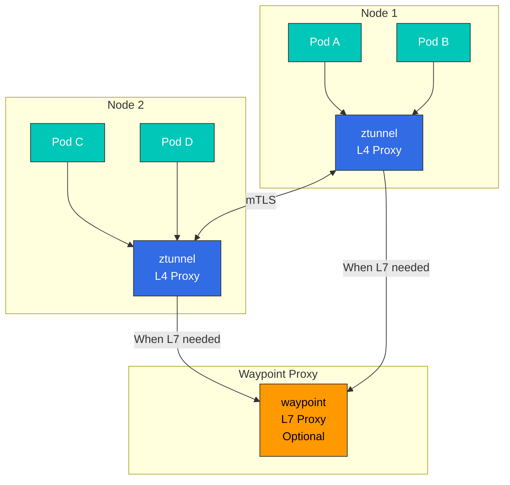
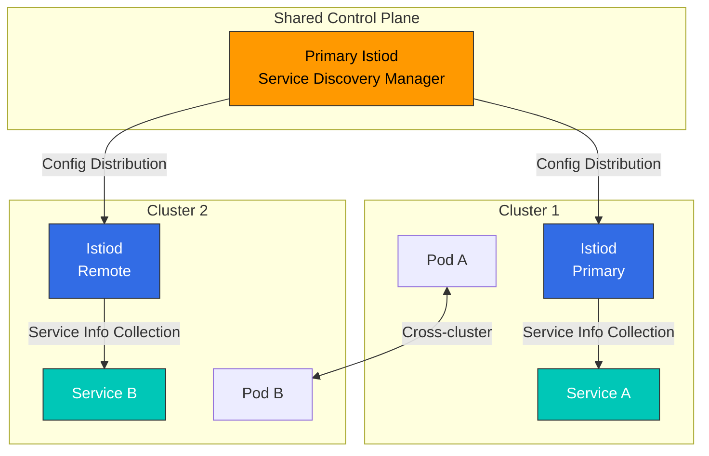
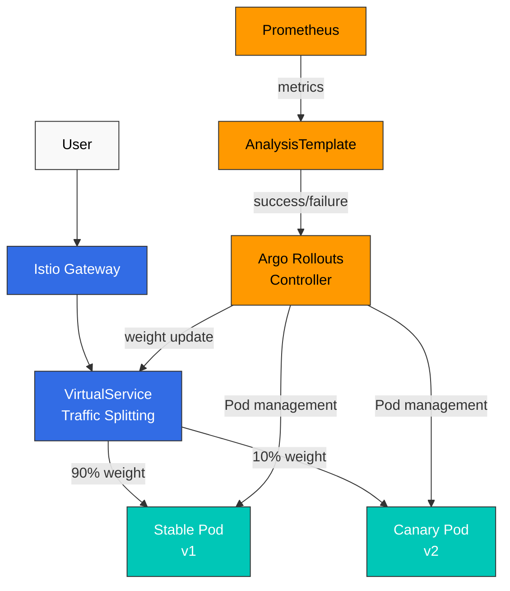
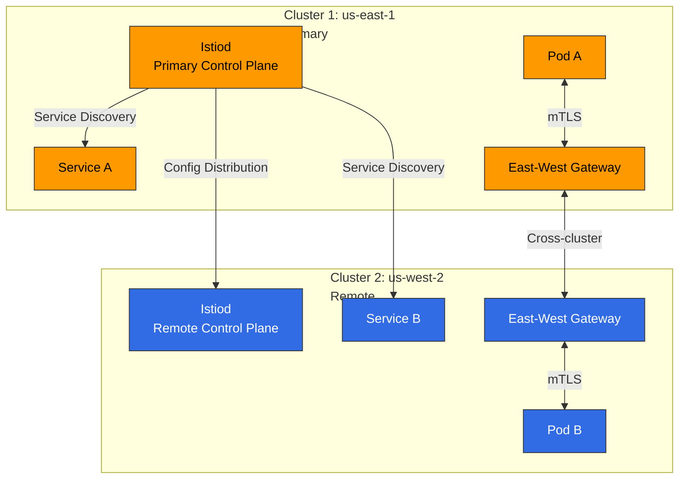
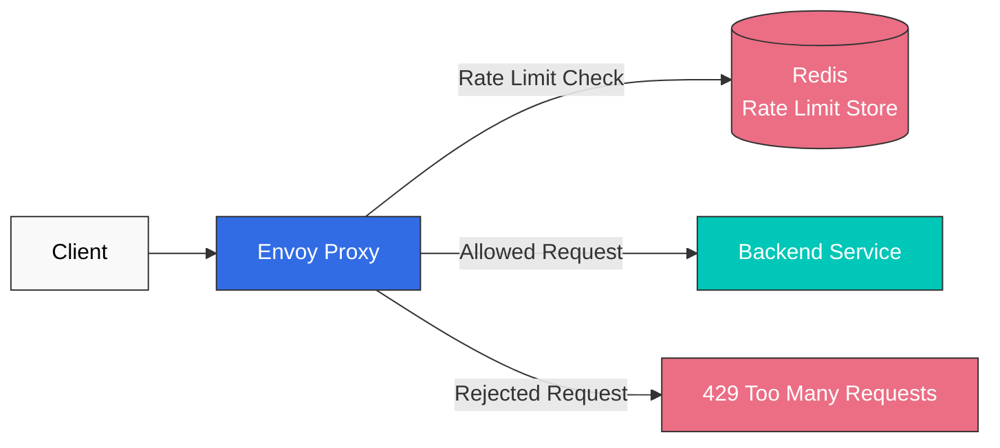
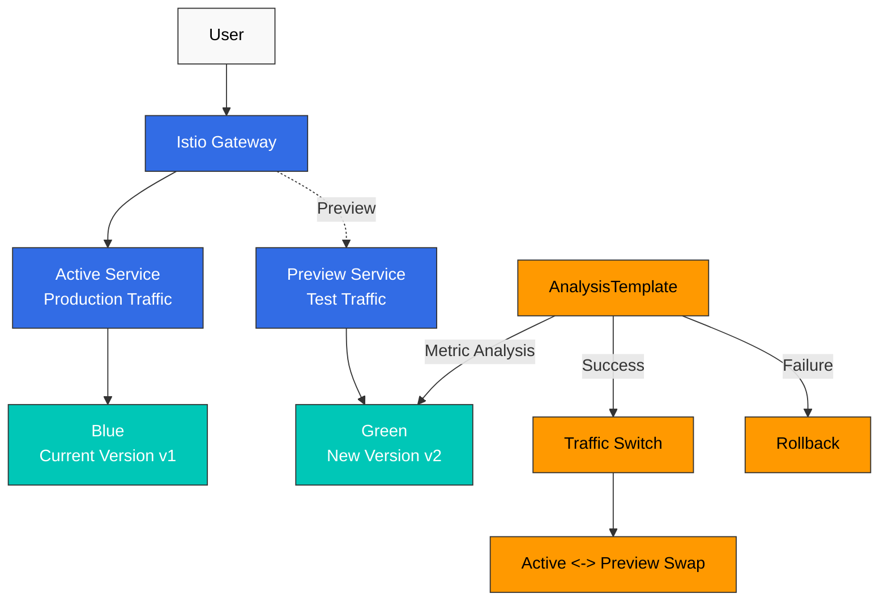

# Istio 高级主题测验

> **支持的版本**: Istio 1.28.0
> **EKS 版本**: 1.34 (Kubernetes 1.28+)
> **最后更新**: February 19, 2026

本测验用于检验您对 Istio 高级功能的理解。

## 选择题（1-5）

### 问题 1：Ambient Mode 与 Sidecar Mode

Istio Ambient Mode 的**最大优势**是什么？

A. 提供更多功能
B. 显著降低资源使用量
C. 更快的安装速度
D. 更好的安全性

<details>
<summary>显示答案</summary>

**答案：B**

Ambient Mode 的最大优势是**资源使用量减少超过 98%**。

**说明：**

**Sidecar Mode 与 Ambient Mode 对比：**

| 项目 | Sidecar Mode | Ambient Mode | 改进 |
|------|-------------|-------------|------|
| **内存** | 50MB × Pod 数量 | 仅 ztunnel + waypoint | 减少 98%+ |
| **CPU** | 0.1 vCPU × Pod 数量 | 仅 ztunnel + waypoint | 减少 98%+ |
| **Pod 重启** | 必需 | 不需要 | 简化运维 |
| **部署速度** | 慢（Sidecar 注入） | 快 | 提升 5-10 倍 |

**在 1000 个 Pod 规模下的资源对比：**

```
Sidecar Mode:
- Memory: 1000 × 50MB = 50GB
- CPU: 1000 × 0.1 vCPU = 100 vCPU

Ambient Mode (10 nodes):
- Memory: (10 × 50MB) + 200MB = 700MB
- CPU: (10 × 0.1 vCPU) + 0.5 vCPU = 1.5 vCPU

Savings rate: 98.6% (memory), 98.5% (CPU)
```

**Ambient Mode 架构：**



**启用 Ambient Mode：**

```bash
# Install Istio with Ambient Mode
istioctl install --set profile=ambient -y

# Add Namespace to Ambient Mode
kubectl label namespace default istio.io/dataplane-mode=ambient

# Verify
kubectl get pods -n istio-system | grep ztunnel
```

**选项分析：**
- A (X)：功能与 Sidecar 相同（某些高级功能需要 waypoint）
- B (O)：资源使用量减少超过 98%
- C (X)：安装速度是次要收益
- D (X)：安全级别相同（均支持 mTLS、AuthorizationPolicy）

**参考资料：**
- [Ambient Mode](../../../service-mesh/istio/advanced/01-ambient-mode.md)
</details>

---

### 问题 2：多集群 Mesh

在 Istio 多集群 Mesh 中，什么负责**跨集群的服务发现**？

A. Istiod
B. CoreDNS
C. East-West Gateway
D. Service Entry

<details>
<summary>显示答案</summary>

**答案：A**

在多集群环境中，**Istiod** 会收集并分发所有集群的服务信息。

**说明：**

**多集群 Mesh 架构：**



**Istiod 的职责：**

1. **服务发现**：
   - 收集所有集群中的 Kubernetes Service
   - 维护统一的服务注册表
   - 向 Envoy 分发端点信息

2. **配置分发**：
   - 将 VirtualService、DestinationRule 部署到所有集群
   - 管理跨集群路由规则

3. **证书管理**：
   - 为所有集群签发 mTLS 证书
   - 通过共享 Root CA 建立信任链

**多集群配置示例：**

```yaml
# Primary cluster configuration
apiVersion: install.istio.io/v1alpha1
kind: IstioOperator
spec:
  values:
    global:
      meshID: mesh1
      multiCluster:
        clusterName: cluster1
      network: network1

---
# Remote cluster access from Primary
apiVersion: v1
kind: Secret
metadata:
  name: istio-remote-secret-cluster2
  namespace: istio-system
  annotations:
    networking.istio.io/cluster: cluster2
type: Opaque
data:
  kubeconfig: <base64-encoded-kubeconfig>
```

**选项分析：**
- A (O)：Istiod 收集并分发所有集群的服务信息
- B (X)：CoreDNS 仅处理集群内部 DNS
- C (X)：East-West Gateway 仅处理流量路由（不负责服务发现）
- D (X)：ServiceEntry 是用于手动注册外部服务的资源

**参考资料：**
- [多集群](../../../service-mesh/istio/advanced/02-multi-cluster.md)
</details>

---

### 问题 3：EnvoyFilter 的用途

使用 EnvoyFilter 的**主要目的**是什么？

A. 创建 Kubernetes Service
B. 自动生成 VirtualService
C. 自定义 Envoy proxy 行为
D. 更改 Istiod 配置

<details>
<summary>显示答案</summary>

**答案：C**

**EnvoyFilter** 是一种用于精细自定义 Envoy proxy 行为的高级资源。

**说明：**

**EnvoyFilter 使用场景：**

1. **添加自定义 Header**：
```yaml
apiVersion: networking.istio.io/v1alpha3
kind: EnvoyFilter
metadata:
  name: add-custom-header
  namespace: default
spec:
  workloadSelector:
    labels:
      app: reviews
  configPatches:
  - applyTo: HTTP_FILTER
    match:
      context: SIDECAR_OUTBOUND
      listener:
        filterChain:
          filter:
            name: "envoy.filters.network.http_connection_manager"
            subFilter:
              name: "envoy.filters.http.router"
    patch:
      operation: INSERT_BEFORE
      value:
        name: envoy.lua
        typed_config:
          "@type": type.googleapis.com/envoy.extensions.filters.http.lua.v3.Lua
          inline_code: |
            function envoy_on_request(request_handle)
              request_handle:headers():add("x-custom-header", "my-value")
            end
```

2. **Wasm Extension 集成**：
```yaml
apiVersion: networking.istio.io/v1alpha3
kind: EnvoyFilter
metadata:
  name: wasm-filter
spec:
  configPatches:
  - applyTo: HTTP_FILTER
    match:
      context: SIDECAR_INBOUND
    patch:
      operation: INSERT_BEFORE
      value:
        name: envoy.filters.http.wasm
        typed_config:
          "@type": type.googleapis.com/envoy.extensions.filters.http.wasm.v3.Wasm
          config:
            vm_config:
              runtime: "envoy.wasm.runtime.v8"
              code:
                local:
                  filename: "/etc/istio/extensions/auth_filter.wasm"
```

3. **Rate Limiting 集成**：
```yaml
apiVersion: networking.istio.io/v1alpha3
kind: EnvoyFilter
metadata:
  name: rate-limit-filter
spec:
  configPatches:
  - applyTo: HTTP_FILTER
    match:
      context: SIDECAR_INBOUND
      listener:
        filterChain:
          filter:
            name: "envoy.filters.network.http_connection_manager"
    patch:
      operation: INSERT_BEFORE
      value:
        name: envoy.filters.http.ratelimit
        typed_config:
          "@type": type.googleapis.com/envoy.extensions.filters.http.ratelimit.v3.RateLimit
          domain: productpage-ratelimit
          rate_limit_service:
            grpc_service:
              envoy_grpc:
                cluster_name: rate_limit_cluster
```

**EnvoyFilter 作用范围：**

```yaml
spec:
  # Apply to entire mesh
  workloadSelector: {}

  # Apply to specific workload only
  workloadSelector:
    labels:
      app: reviews
      version: v2

  # Apply to specific namespace only
  # (controlled by metadata.namespace)
```

**注意事项：**

警告：**EnvoyFilter 功能强大但存在风险：**
- 需要深入理解 Envoy 内部机制
- Istio 版本升级时可能出现兼容性问题
- 错误配置可能导致整个 Mesh 故障

**最佳实践：**
1. 尽可能使用 VirtualService、DestinationRule
2. 仅在万不得已时使用 EnvoyFilter
3. 在测试环境中进行充分测试
4. 使用 workloadSelector 限制作用范围

**选项分析：**
- A (X)：使用 kubectl 创建 Kubernetes Service
- B (X)：VirtualService 需手动创建
- C (O)：精细自定义 Envoy proxy 行为
- D (X)：使用 IstioOperator 更改 Istiod 配置

**参考资料：**
- [EnvoyFilter](../../../service-mesh/istio/advanced/03-envoy-filter.md)
</details>

---

### 问题 4：Sidecar 注入

如何在 Istio 中**禁用自动 Sidecar 注入**？

A. 从 Namespace 移除 `istio-injection=enabled` 标签
B. 为 Pod 添加 `sidecar.istio.io/inject="false"` 注解
C. 重启 Istiod
D. A 和 B 都可以

<details>
<summary>显示答案</summary>

**答案：D**

可以在 Namespace 级别和 Pod 级别控制 Sidecar 注入。

**说明：**

**Sidecar 注入控制方法：**

**1. Namespace 级别（A - O）：**

```bash
# Enable Sidecar injection
kubectl label namespace default istio-injection=enabled

# Disable Sidecar injection
kubectl label namespace default istio-injection-

# Or change label
kubectl label namespace default istio-injection=disabled --overwrite
```

**2. Pod 级别（B - O）：**

```yaml
apiVersion: apps/v1
kind: Deployment
metadata:
  name: myapp
spec:
  template:
    metadata:
      annotations:
        sidecar.istio.io/inject: "false"  # Disable Sidecar injection
    spec:
      containers:
      - name: myapp
        image: myapp:latest
```

**Sidecar 注入优先级：**

```
Pod annotation > Namespace label > Default

Examples:
1. Namespace: istio-injection=enabled
   Pod: sidecar.istio.io/inject="false"
   Result: Sidecar not injected (Pod annotation takes priority)

2. Namespace: istio-injection=disabled
   Pod: sidecar.istio.io/inject="true"
   Result: Sidecar injected (Pod annotation takes priority)

3. Namespace: no label
   Pod: no annotation
   Result: Sidecar not injected (default)
```

**验证 Sidecar 注入：**

```bash
# Check if Sidecar was injected into Pod
kubectl get pods <pod-name> -o jsonpath='{.spec.containers[*].name}'
# Example output: myapp istio-proxy (2 = Sidecar present)

# Check Sidecar injection logs
kubectl logs -n istio-system -l app=istiod --tail=100 | grep injection

# Check Namespace settings
kubectl get namespace -L istio-injection
```

**混合环境示例：**

```yaml
# Inject Sidecar for entire Namespace
apiVersion: v1
kind: Namespace
metadata:
  name: production
  labels:
    istio-injection: enabled

---
# Exclude specific Pod only (e.g., legacy system)
apiVersion: apps/v1
kind: Deployment
metadata:
  name: legacy-app
  namespace: production
spec:
  template:
    metadata:
      annotations:
        sidecar.istio.io/inject: "false"
    spec:
      containers:
      - name: legacy
        image: legacy:v1

---
# Most Pods automatically get Sidecar injected
apiVersion: apps/v1
kind: Deployment
metadata:
  name: modern-app
  namespace: production
spec:
  template:
    spec:
      containers:
      - name: modern
        image: modern:v2
```

**选项分析：**
- A (O)：可以在 Namespace 级别控制 Sidecar 注入
- B (O)：可以在 Pod 级别控制 Sidecar 注入
- C (X)：不需要重启 Istiod
- D (O)：A 和 B 都是有效方法

**参考资料：**
- [Sidecar 注入](../../../service-mesh/istio/advanced/07-sidecar-injection.md)
</details>

---

### 问题 5：Argo Rollouts 集成

将 Argo Rollouts 与 Istio 配合使用时，什么负责**流量拆分**？

A. Argo Rollouts Controller
B. Istio VirtualService
C. Kubernetes Service
D. Istio Gateway

<details>
<summary>显示答案</summary>

**答案：B**

**Istio VirtualService** 执行实际的流量拆分，Argo Rollouts 会自动更新 VirtualService 中的权重值。

**说明：**

**Argo Rollouts + Istio 集成架构：**



**VirtualService 的作用：**

```yaml
apiVersion: networking.istio.io/v1beta1
kind: VirtualService
metadata:
  name: reviews
spec:
  hosts:
  - reviews
  http:
  - name: primary  # route name referenced by Argo Rollouts
    route:
    - destination:
        host: reviews
        subset: stable
      weight: 100  # Automatically changed by Argo Rollouts
    - destination:
        host: reviews
        subset: canary
      weight: 0    # Automatically changed by Argo Rollouts
```

**Argo Rollouts 配置：**

```yaml
apiVersion: argoproj.io/v1alpha1
kind: Rollout
metadata:
  name: reviews
spec:
  strategy:
    canary:
      # Istio integration settings
      trafficRouting:
        istio:
          virtualService:
            name: reviews        # VirtualService name
            routes:
            - primary            # route name
          destinationRule:
            name: reviews        # DestinationRule name
            canarySubsetName: canary
            stableSubsetName: stable

      # Canary steps
      steps:
      - setWeight: 10   # Change VirtualService weight to 10
      - pause: {duration: 2m}
      - setWeight: 25   # Change VirtualService weight to 25
      - pause: {duration: 2m}
      - setWeight: 50
      - pause: {duration: 2m}
```

**部署流程：**

```
1. Argo Rollouts creates new version (v2) Pods
   |
2. Argo Rollouts sets VirtualService canary weight to 10
   |
3. Istio Envoy routes actual 10% traffic to v2
   |
4. AnalysisTemplate checks metrics (error rate, latency)
   |
5. On success, Argo Rollouts increases weight to 25
   |
6. Repeat...
   |
7. Finally weight 100 (complete transition)
```

**职责划分：**

| 组件 | 职责 |
|---------|------|
| **Argo Rollouts** | - 创建/删除 Pod<br/>- 更新 VirtualService 权重<br/>- 执行部署策略<br/>- 自动回滚 |
| **Istio VirtualService** | - 实际流量拆分<br/>- 应用路由规则<br/>- 生成 Envoy 配置 |
| **Envoy Proxy** | - 执行流量路由<br/>- 收集指标 |
| **Prometheus** | - 存储指标<br/>- 向 AnalysisTemplate 提供数据 |

**实际流量流程：**

```bash
# 100 user requests
100 requests -> Istio Gateway
              |
         VirtualService
         (weight: stable=90, canary=10)
              |
         +----+----+
         |         |
        90        10
    Stable v1   Canary v2
```

**选项分析：**
- A (X)：Argo Rollouts 仅更新 VirtualService（不直接拆分流量）
- B (O)：VirtualService 执行实际流量拆分
- C (X)：Kubernetes Service 仅处理负载均衡（不负责流量拆分）
- D (X)：Gateway 是外部流量入口（不负责流量拆分）

**参考资料：**
- [Argo Rollouts](../../../service-mesh/istio/advanced/08-argo-rollouts.md)
</details>

---

## 简答题（6-10）

### 问题 6：Ambient Mode 成本节省分析

计算在 AWS EKS 集群中从 Sidecar Mode 切换到 Ambient Mode 时的**成本节省**。（假设：500 个 Pod、5 个节点、r5.xlarge 实例、每月运行 730 小时）

<details>
<summary>参考答案</summary>

**答案：**

**成本节省分析：**

---

**1. 假设条件**

```
Cluster scale:
- Pod count: 500
- Node count: 5
- Instance type: r5.xlarge (4 vCPU, 32GB RAM)
- Instance cost: $0.252/hour
- Operating hours: 730 hours/month

Resource usage:
- Sidecar memory: 50MB/Pod
- Sidecar CPU: 0.1 vCPU/Pod
- ztunnel memory: 50MB/Node
- ztunnel CPU: 0.1 vCPU/Node
- waypoint memory: 200MB
- waypoint CPU: 0.5 vCPU
```

---

**2. Sidecar Mode 资源计算**

```
Memory usage:
= 500 Pods × 50MB
= 25,000MB
= 25GB

CPU usage:
= 500 Pods × 0.1 vCPU
= 50 vCPU
```

**所需实例数量（r5.xlarge：4 vCPU，32GB RAM）：**

```
CPU basis:
= 50 vCPU ÷ 4 vCPU/instance
= 12.5 instances
≈ 13 instances needed

Memory basis:
= 25GB ÷ 32GB/instance
= 0.78 instances
≈ 1 instance needed

Actual needed: max(13, 1) = 13 instances
```

**Sidecar Mode 每月成本：**

```
= 13 instances × $0.252/hour × 730 hours
= $2,395.56/month
```

---

**3. Ambient Mode 资源计算**

```
Memory usage:
= (5 nodes × 50MB) + 200MB
= 250MB + 200MB
= 450MB

CPU usage:
= (5 nodes × 0.1 vCPU) + 0.5 vCPU
= 0.5 vCPU + 0.5 vCPU
= 1.0 vCPU
```

**所需实例数量：**

```
CPU basis:
= 1.0 vCPU ÷ 4 vCPU/instance
= 0.25 instances
≈ 1 instance needed

Memory basis:
= 0.45GB ÷ 32GB/instance
= 0.01 instances
≈ 1 instance needed

Actual needed: max(1, 1) = 1 instance
```

**Ambient Mode 每月成本：**

```
= 1 instance × $0.252/hour × 730 hours
= $183.96/month
```

---

**4. 成本节省**

```
Monthly savings:
= $2,395.56 - $183.96
= $2,211.60/month

Savings rate:
= ($2,211.60 ÷ $2,395.56) × 100
= 92.3%

Annual savings:
= $2,211.60 × 12
= $26,539.20/year
```

---

**5. 资源节省汇总**

| 项目 | Sidecar Mode | Ambient Mode | 节省 |
|------|-------------|-------------|------|
| **内存** | 25GB | 0.45GB | 24.55GB (98.2%) |
| **CPU** | 50 vCPU | 1.0 vCPU | 49 vCPU (98.0%) |
| **实例** | 13 | 1 | 12 (92.3%) |
| **每月成本** | $2,395.56 | $183.96 | $2,211.60 (92.3%) |
| **年度成本** | $28,746.72 | $2,207.52 | $26,539.20 (92.3%) |

---

**6. 其他成本节省因素**

**网络成本：**
- Sidecar Mode：没有 localhost 通信（所有流量均经过网络）
- Ambient Mode：通过 ztunnel 之间的直接通信提高效率

**运维成本：**
- 无需重启 Pod（缩短部署时间）
- 无 Sidecar 注入错误
- 降低管理复杂性

**性能改进：**
- 减少内存压力，从而提升 Pod 性能
- 降低 OOMKilled 频率
- 增加节点资源余量

---

**7. ROI（投资回报率）**

```
Ambient Mode transition cost (one-time):
- Learning time: 40 hours × $100/hour = $4,000
- Testing and validation: 20 hours × $100/hour = $2,000
- Total transition cost: $6,000

Payback period:
= $6,000 ÷ $2,211.60/month
= 2.7 months

3-year total savings:
= ($26,539.20 × 3) - $6,000
= $73,617.60
```

---

**8. 实际注意事项**

**优势：**
- 节省 92%+ 成本
- 简化运维
- 提升部署速度
- 最大化资源效率

**注意事项：**
- Istio 1.28+ beta 功能
- L7 功能需要额外部署 waypoint
- 某些高级功能需要 Sidecar mode
- 需要充分测试

**参考资料：**
- [Ambient Mode](../../../service-mesh/istio/advanced/01-ambient-mode.md)
</details>

---

### 问题 7：多集群 Service Mesh 配置

说明如何将 2 个 EKS 集群（us-east-1、us-west-2）集成到**单个 Istio Mesh**中。使用 **Primary-Remote 模型**，并包含跨集群服务调用示例。

<details>
<summary>参考答案</summary>

**答案：**

**多集群 Istio Mesh 配置：**

---

**1. 架构概述**



---

**2. 前提条件**

```bash
# Set up kubeconfig with access to both clusters
export CTX_CLUSTER1=eks-us-east-1
export CTX_CLUSTER2=eks-us-west-2

# Verify contexts
kubectl config get-contexts

# Generate CA certificates (shared Root CA)
mkdir -p certs
cd certs

# Generate Root CA
make -f ../istio-1.28.0/tools/certs/Makefile.selfsigned.mk root-ca

# Generate intermediate certificates for each cluster
make -f ../istio-1.28.0/tools/certs/Makefile.selfsigned.mk cluster1-cacerts
make -f ../istio-1.28.0/tools/certs/Makefile.selfsigned.mk cluster2-cacerts
```

---

**3. 集群 1（Primary）设置**

```bash
# Create CA certificate Secret
kubectl create namespace istio-system --context="${CTX_CLUSTER1}"
kubectl create secret generic cacerts -n istio-system \
  --from-file=cluster1/ca-cert.pem \
  --from-file=cluster1/ca-key.pem \
  --from-file=cluster1/root-cert.pem \
  --from-file=cluster1/cert-chain.pem \
  --context="${CTX_CLUSTER1}"

# Install Primary Istio
istioctl install --context="${CTX_CLUSTER1}" -f - <<EOF
apiVersion: install.istio.io/v1alpha1
kind: IstioOperator
spec:
  values:
    global:
      meshID: mesh1
      multiCluster:
        clusterName: cluster1
      network: network1

  components:
    ingressGateways:
    - name: istio-eastwestgateway
      label:
        istio: eastwestgateway
        app: istio-eastwestgateway
        topology.istio.io/network: network1
      enabled: true
      k8s:
        env:
        - name: ISTIO_META_REQUESTED_NETWORK_VIEW
          value: network1
        service:
          type: LoadBalancer
          ports:
          - name: status-port
            port: 15021
            targetPort: 15021
          - name: tls
            port: 15443
            targetPort: 15443
          - name: tls-istiod
            port: 15012
            targetPort: 15012
          - name: tls-webhook
            port: 15017
            targetPort: 15017
EOF

# Expose East-West Gateway
kubectl apply --context="${CTX_CLUSTER1}" -n istio-system -f \
  samples/multicluster/expose-services.yaml
```

---

**4. 集群 2（Remote）设置**

```bash
# Create CA certificate Secret
kubectl create namespace istio-system --context="${CTX_CLUSTER2}"
kubectl create secret generic cacerts -n istio-system \
  --from-file=cluster2/ca-cert.pem \
  --from-file=cluster2/ca-key.pem \
  --from-file=cluster2/root-cert.pem \
  --from-file=cluster2/cert-chain.pem \
  --context="${CTX_CLUSTER2}"

# Create Remote Secret (access cluster2 from cluster1)
istioctl create-remote-secret \
  --context="${CTX_CLUSTER2}" \
  --name=cluster2 | \
  kubectl apply -f - --context="${CTX_CLUSTER1}"

# Install Remote Istio
istioctl install --context="${CTX_CLUSTER2}" -f - <<EOF
apiVersion: install.istio.io/v1alpha1
kind: IstioOperator
spec:
  values:
    global:
      meshID: mesh1
      multiCluster:
        clusterName: cluster2
      network: network2
      remotePilotAddress: <CLUSTER1_EAST_WEST_GATEWAY_IP>

  components:
    ingressGateways:
    - name: istio-eastwestgateway
      label:
        istio: eastwestgateway
        app: istio-eastwestgateway
        topology.istio.io/network: network2
      enabled: true
      k8s:
        env:
        - name: ISTIO_META_REQUESTED_NETWORK_VIEW
          value: network2
        service:
          type: LoadBalancer
          ports:
          - name: status-port
            port: 15021
          - name: tls
            port: 15443
          - name: tls-istiod
            port: 15012
          - name: tls-webhook
            port: 15017
EOF
```

---

**5. Service 部署和验证**

**将 Service A 部署到集群 1：**

```yaml
# cluster1: service-a.yaml
apiVersion: v1
kind: Service
metadata:
  name: service-a
  labels:
    app: service-a
spec:
  ports:
  - port: 8080
    name: http
  selector:
    app: service-a

---
apiVersion: apps/v1
kind: Deployment
metadata:
  name: service-a
spec:
  replicas: 2
  selector:
    matchLabels:
      app: service-a
  template:
    metadata:
      labels:
        app: service-a
    spec:
      containers:
      - name: service-a
        image: nginx:latest
        ports:
        - containerPort: 8080
```

```bash
kubectl apply --context="${CTX_CLUSTER1}" -f service-a.yaml
```

**将 Service B 部署到集群 2：**

```yaml
# cluster2: service-b.yaml
apiVersion: v1
kind: Service
metadata:
  name: service-b
  labels:
    app: service-b
spec:
  ports:
  - port: 8080
    name: http
  selector:
    app: service-b

---
apiVersion: apps/v1
kind: Deployment
metadata:
  name: service-b
spec:
  replicas: 2
  selector:
    matchLabels:
      app: service-b
  template:
    metadata:
      labels:
        app: service-b
    spec:
      containers:
      - name: service-b
        image: nginx:latest
        ports:
        - containerPort: 8080
```

```bash
kubectl apply --context="${CTX_CLUSTER2}" -f service-b.yaml
```

---

**6. 跨集群 Service 调用测试**

```bash
# Call cluster 2 service from cluster 1
kubectl exec --context="${CTX_CLUSTER1}" -it \
  $(kubectl get pod --context="${CTX_CLUSTER1}" -l app=service-a -o jsonpath='{.items[0].metadata.name}') \
  -- curl http://service-b.default.svc.cluster.local:8080

# Call cluster 1 service from cluster 2
kubectl exec --context="${CTX_CLUSTER2}" -it \
  $(kubectl get pod --context="${CTX_CLUSTER2}" -l app=service-b -o jsonpath='{.items[0].metadata.name}') \
  -- curl http://service-a.default.svc.cluster.local:8080
```

---

**7. 验证服务发现**

```bash
# Check Envoy configuration from cluster 1
istioctl --context="${CTX_CLUSTER1}" proxy-config endpoints \
  $(kubectl get pod --context="${CTX_CLUSTER1}" -l app=service-a -o jsonpath='{.items[0].metadata.name}') | \
  grep service-b

# Example output:
# service-b.default.svc.cluster.local:8080  HEALTHY  <cluster2-pod-ip>:8080
```

---

**8. 应用流量策略**

```yaml
# Cross-cluster traffic routing
apiVersion: networking.istio.io/v1beta1
kind: VirtualService
metadata:
  name: service-b
spec:
  hosts:
  - service-b.default.svc.cluster.local
  http:
  - match:
    - sourceLabels:
        app: service-a
    route:
    - destination:
        host: service-b.default.svc.cluster.local
        port:
          number: 8080
      weight: 80  # 80% to local cluster
    - destination:
        host: service-b.default.svc.cluster.local
        port:
          number: 8080
      weight: 20  # 20% to remote cluster

---
apiVersion: networking.istio.io/v1beta1
kind: DestinationRule
metadata:
  name: service-b
spec:
  host: service-b.default.svc.cluster.local
  trafficPolicy:
    loadBalancer:
      localityLbSetting:
        enabled: true  # Locality-aware routing
```

---

**9. 监控和验证**

```bash
# Check cross-cluster traffic in Prometheus
kubectl port-forward --context="${CTX_CLUSTER1}" -n istio-system \
  svc/prometheus 9090:9090

# Prometheus query:
# sum(rate(istio_requests_total{source_cluster="cluster1", destination_cluster="cluster2"}[5m]))

# Visualize with Kiali
istioctl dashboard kiali --context="${CTX_CLUSTER1}"
```

---

**10. 注意事项和最佳实践**

**注意事项：**
- 必须共享 Root CA
- 考虑网络延迟
- 加强 East-West Gateway 安全性
- 正确配置 DNS 解析

**最佳实践：**
- 启用本地感知路由
- 配置 Circuit Breaker
- 在每个集群中维护副本
- 监控跨集群流量

**参考资料：**
- [多集群](../../../service-mesh/istio/advanced/02-multi-cluster.md)
</details>

---

### 问题 8：使用 EnvoyFilter 实现自定义 Rate Limiting

仅针对特定路径（`/api/premium/*`），使用 EnvoyFilter 实现**每用户 Rate Limiting**（每分钟 100 个请求）。

<details>
<summary>参考答案</summary>

**答案：**

**基于 EnvoyFilter 的 Rate Limiting 实现：**

---

**1. 架构概述**



---

**2. 部署 Redis Rate Limit Server**

```yaml
# redis-ratelimit.yaml
apiVersion: v1
kind: Service
metadata:
  name: redis-ratelimit
  namespace: istio-system
spec:
  ports:
  - port: 6379
    name: redis
  selector:
    app: redis-ratelimit

---
apiVersion: apps/v1
kind: Deployment
metadata:
  name: redis-ratelimit
  namespace: istio-system
spec:
  replicas: 1
  selector:
    matchLabels:
      app: redis-ratelimit
  template:
    metadata:
      labels:
        app: redis-ratelimit
    spec:
      containers:
      - name: redis
        image: redis:7-alpine
        ports:
        - containerPort: 6379
        resources:
          requests:
            cpu: 100m
            memory: 128Mi
          limits:
            cpu: 500m
            memory: 512Mi

---
# Envoy Rate Limit Service
apiVersion: v1
kind: ConfigMap
metadata:
  name: ratelimit-config
  namespace: istio-system
data:
  config.yaml: |
    domain: premium-ratelimit
    descriptors:
      # Per-user Rate Limit: 100 requests per minute
      - key: user_id
        rate_limit:
          unit: minute
          requests_per_unit: 100

---
apiVersion: v1
kind: Service
metadata:
  name: ratelimit
  namespace: istio-system
spec:
  ports:
  - port: 8081
    name: http
  - port: 9091
    name: grpc
  selector:
    app: ratelimit

---
apiVersion: apps/v1
kind: Deployment
metadata:
  name: ratelimit
  namespace: istio-system
spec:
  replicas: 2
  selector:
    matchLabels:
      app: ratelimit
  template:
    metadata:
      labels:
        app: ratelimit
    spec:
      containers:
      - name: ratelimit
        image: envoyproxy/ratelimit:master
        ports:
        - containerPort: 8081
        - containerPort: 9091
        env:
        - name: REDIS_URL
          value: redis-ratelimit.istio-system.svc.cluster.local:6379
        - name: USE_STATSD
          value: "false"
        - name: LOG_LEVEL
          value: debug
        - name: RUNTIME_ROOT
          value: /data
        - name: RUNTIME_SUBDIRECTORY
          value: ratelimit
        volumeMounts:
        - name: config-volume
          mountPath: /data/ratelimit/config
        resources:
          requests:
            cpu: 100m
            memory: 128Mi
          limits:
            cpu: 500m
            memory: 512Mi
      volumes:
      - name: config-volume
        configMap:
          name: ratelimit-config
```

```bash
kubectl apply -f redis-ratelimit.yaml
```

---

**3. EnvoyFilter 配置**

```yaml
# envoyfilter-ratelimit.yaml
apiVersion: networking.istio.io/v1alpha3
kind: EnvoyFilter
metadata:
  name: premium-ratelimit
  namespace: istio-system
spec:
  workloadSelector:
    labels:
      app: api-gateway

  configPatches:
  # Add Rate Limit filter to HTTP filter chain
  - applyTo: HTTP_FILTER
    match:
      context: SIDECAR_INBOUND
      listener:
        filterChain:
          filter:
            name: "envoy.filters.network.http_connection_manager"
            subFilter:
              name: "envoy.filters.http.router"
    patch:
      operation: INSERT_BEFORE
      value:
        name: envoy.filters.http.ratelimit
        typed_config:
          "@type": type.googleapis.com/envoy.extensions.filters.http.ratelimit.v3.RateLimit
          domain: premium-ratelimit
          failure_mode_deny: true  # Deny on Rate Limit server failure
          enable_x_ratelimit_headers: DRAFT_VERSION_03
          rate_limit_service:
            grpc_service:
              envoy_grpc:
                cluster_name: rate_limit_cluster
            transport_api_version: V3

  # Define Rate Limit cluster
  - applyTo: CLUSTER
    patch:
      operation: ADD
      value:
        name: rate_limit_cluster
        type: STRICT_DNS
        connect_timeout: 1s
        lb_policy: ROUND_ROBIN
        http2_protocol_options: {}
        load_assignment:
          cluster_name: rate_limit_cluster
          endpoints:
          - lb_endpoints:
            - endpoint:
                address:
                  socket_address:
                    address: ratelimit.istio-system.svc.cluster.local
                    port_value: 9091

  # Add Rate Limit action to HTTP route
  - applyTo: HTTP_ROUTE
    match:
      context: SIDECAR_INBOUND
      routeConfiguration:
        vhost:
          route:
            action: ANY
    patch:
      operation: MERGE
      value:
        route:
          rate_limits:
          # Apply Rate Limit only to /api/premium/* path
          - actions:
            - header_value_match:
                descriptor_value: "premium"
                headers:
                - name: ":path"
                  prefix_match: "/api/premium/"
            - request_headers:
                header_name: "x-user-id"
                descriptor_key: "user_id"
```

```bash
kubectl apply -f envoyfilter-ratelimit.yaml
```

---

**4. 测试**

```bash
# Normal requests (under 100 requests/minute per user)
for i in {1..50}; do
  curl -H "x-user-id: user123" \
       -H "Host: api.example.com" \
       http://<INGRESS_GATEWAY>/api/premium/data
  sleep 0.1
done

# Output: 200 OK (all successful)

# Rate Limit exceeded (over 100 requests/minute)
for i in {1..150}; do
  curl -H "x-user-id: user123" \
       -H "Host: api.example.com" \
       http://<INGRESS_GATEWAY>/api/premium/data
done

# Output:
# 1-100: 200 OK
# 101-150: 429 Too Many Requests

# Other users unaffected
curl -H "x-user-id: user456" \
     -H "Host: api.example.com" \
     http://<INGRESS_GATEWAY>/api/premium/data

# Output: 200 OK
```

---

**5. 检查 Rate Limit Header**

```bash
curl -I -H "x-user-id: user123" \
     -H "Host: api.example.com" \
     http://<INGRESS_GATEWAY>/api/premium/data

# Output:
# X-RateLimit-Limit: 100
# X-RateLimit-Remaining: 73
# X-RateLimit-Reset: 1735689600
```

---

**6. 注意事项和最佳实践**

**注意事项：**
- 需要配置 Redis 高可用性（生产环境）
- 定义 Rate Limit Server 故障时的行为（`failure_mode_deny`）
- 确保用户识别 Header（`x-user-id`）的可靠性
- Istio 版本升级时，EnvoyFilter 需要进行兼容性检查

**最佳实践：**
- 使用 Redis Sentinel 或 Cluster
- Rate Limit Server 副本数 >= 2
- 适当的监控和告警
- 每用户例外处理（VIP 用户等）

**参考资料：**
- [EnvoyFilter](../../../service-mesh/istio/advanced/03-envoy-filter.md)
- [Rate Limiting](../../../service-mesh/istio/resilience/02-rate-limiting.md)
</details>

---

### 问题 9：Argo Rollouts 蓝绿部署

使用 Argo Rollouts 和 Istio 实现**蓝绿部署**。包含**自动化分析**（AnalysisTemplate），并配置失败时自动回滚。

<details>
<summary>参考答案</summary>

**答案：**

**Argo Rollouts 蓝绿部署实现：**

---

**1. 蓝绿部署概念**



---

**2. 创建 Kubernetes Service**

```yaml
# services.yaml
apiVersion: v1
kind: Service
metadata:
  name: myapp-active
spec:
  ports:
  - port: 8080
    name: http
  selector:
    app: myapp
    # Argo Rollouts automatically manages selector

---
apiVersion: v1
kind: Service
metadata:
  name: myapp-preview
spec:
  ports:
  - port: 8080
    name: http
  selector:
    app: myapp
    # Argo Rollouts automatically manages selector
```

```bash
kubectl apply -f services.yaml
```

---

**3. Istio Gateway 和 VirtualService**

```yaml
# gateway.yaml
apiVersion: networking.istio.io/v1beta1
kind: Gateway
metadata:
  name: myapp-gateway
spec:
  selector:
    istio: ingressgateway
  servers:
  - port:
      number: 80
      name: http
      protocol: HTTP
    hosts:
    - myapp.example.com

---
# virtualservice.yaml
apiVersion: networking.istio.io/v1beta1
kind: VirtualService
metadata:
  name: myapp
spec:
  hosts:
  - myapp.example.com
  gateways:
  - myapp-gateway
  http:
  # Production traffic (Active)
  - match:
    - uri:
        prefix: /
    route:
    - destination:
        host: myapp-active
        port:
          number: 8080

---
# preview-virtualservice.yaml
apiVersion: networking.istio.io/v1beta1
kind: VirtualService
metadata:
  name: myapp-preview
spec:
  hosts:
  - myapp-preview.example.com
  gateways:
  - myapp-gateway
  http:
  # Preview traffic (Preview)
  - match:
    - uri:
        prefix: /
    route:
    - destination:
        host: myapp-preview
        port:
          number: 8080
```

```bash
kubectl apply -f gateway.yaml
```

---

**4. AnalysisTemplate 定义**

```yaml
# analysis-template.yaml
apiVersion: argoproj.io/v1alpha1
kind: AnalysisTemplate
metadata:
  name: success-rate
spec:
  args:
  - name: service-name

  metrics:
  # Metric 1: Success rate (95% or higher)
  - name: success-rate
    interval: 30s
    count: 5
    successCondition: result >= 0.95
    failureLimit: 2
    provider:
      prometheus:
        address: http://prometheus.istio-system:9090
        query: |
          sum(rate(
            istio_requests_total{
              destination_service_name="{{args.service-name}}",
              response_code!~"5.*"
            }[2m]
          ))
          /
          sum(rate(
            istio_requests_total{
              destination_service_name="{{args.service-name}}"
            }[2m]
          ))

---
apiVersion: argoproj.io/v1alpha1
kind: AnalysisTemplate
metadata:
  name: latency
spec:
  args:
  - name: service-name

  metrics:
  # Metric 2: P95 latency (500ms or less)
  - name: latency-p95
    interval: 30s
    count: 5
    successCondition: result <= 500
    failureLimit: 2
    provider:
      prometheus:
        address: http://prometheus.istio-system:9090
        query: |
          histogram_quantile(0.95,
            sum(rate(
              istio_request_duration_milliseconds_bucket{
                destination_service_name="{{args.service-name}}"
              }[2m]
            )) by (le)
          )

---
apiVersion: argoproj.io/v1alpha1
kind: AnalysisTemplate
metadata:
  name: error-rate
spec:
  args:
  - name: service-name

  metrics:
  # Metric 3: Error rate (1% or less)
  - name: error-rate
    interval: 30s
    count: 5
    successCondition: result <= 0.01
    failureLimit: 2
    provider:
      prometheus:
        address: http://prometheus.istio-system:9090
        query: |
          sum(rate(
            istio_requests_total{
              destination_service_name="{{args.service-name}}",
              response_code=~"5.*"
            }[2m]
          ))
          /
          sum(rate(
            istio_requests_total{
              destination_service_name="{{args.service-name}}"
            }[2m]
          ))
```

```bash
kubectl apply -f analysis-template.yaml
```

---

**5. Rollout 资源定义**

```yaml
# rollout.yaml
apiVersion: argoproj.io/v1alpha1
kind: Rollout
metadata:
  name: myapp
spec:
  replicas: 5
  revisionHistoryLimit: 2
  selector:
    matchLabels:
      app: myapp

  template:
    metadata:
      labels:
        app: myapp
    spec:
      containers:
      - name: myapp
        image: myapp:v1
        ports:
        - containerPort: 8080
        resources:
          requests:
            cpu: 100m
            memory: 128Mi
          limits:
            cpu: 500m
            memory: 512Mi

  # Blue/Green deployment strategy
  strategy:
    blueGreen:
      # Active Service (production)
      activeService: myapp-active

      # Preview Service (test)
      previewService: myapp-preview

      # Disable auto promotion (manual promotion or Analysis-based)
      autoPromotionEnabled: false

      # Wait time after Green deployment
      scaleDownDelaySeconds: 30

      # Pre-promotion analysis (Green environment verification)
      prePromotionAnalysis:
        templates:
        - templateName: success-rate
        - templateName: latency
        - templateName: error-rate
        args:
        - name: service-name
          value: myapp-preview

      # Post-promotion analysis (verification after Active switch)
      postPromotionAnalysis:
        templates:
        - templateName: success-rate
        - templateName: latency
        - templateName: error-rate
        args:
        - name: service-name
          value: myapp-active
```

```bash
kubectl apply -f rollout.yaml
```

---

**6. 部署新版本**

```bash
# Update to new version image
kubectl argo rollouts set image myapp \
  myapp=myapp:v2

# Monitor deployment status
kubectl argo rollouts get rollout myapp --watch

# Output:
# Name:            myapp
# Namespace:       default
# Status:          Paused
# Strategy:        BlueGreen
# Images:          myapp:v1 (stable, active)
#                  myapp:v2 (preview)
# Replicas:
#   Desired:       5
#   Current:       10
#   Updated:       5
#   Ready:         5
#   Available:     5
# Analysis:        Running
```

---

**7. 自动回滚场景**

**场景 1：prePromotionAnalysis 失败**

```bash
# Error rate exceeds 1% in Green environment
# Analysis log:
# error-rate: FAILED (0.03 > 0.01)
# failureLimit: 2/2

# Automatic rollback executed
# Green Pods deleted
# Blue continues as Active

kubectl argo rollouts get rollout myapp
# Status: Degraded
# Message: PrePromotionAnalysis Failed
```

**场景 2：postPromotionAnalysis 失败**

```bash
# Success rate below 95% after Active switch
# Analysis log:
# success-rate: FAILED (0.92 < 0.95)
# failureLimit: 2/2

# Automatic rollback executed
# Immediately restore Active Service to Blue
# Green moves to Preview

kubectl argo rollouts get rollout myapp
# Status: Degraded
# Message: PostPromotionAnalysis Failed
```

---

**8. 最佳实践**

**优势：**
- 可以立即回滚（切换流量）
- 对生产环境影响最小
- 确保充足的测试时间
- 自动化分析和回滚

**注意事项：**
- 需要 2 倍资源（Blue + Green）
- 验证数据库 schema 兼容性
- Session 管理（如需要 Sticky Session）

**参考资料：**
- [Argo Rollouts](../../../service-mesh/istio/advanced/08-argo-rollouts.md)
</details>

---

### 问题 10：DNS 缓存性能优化

说明如何在 Istio 中启用 **DNS Caching** 以提升外部 Service 调用性能。包含**基准测试结果**。

<details>
<summary>参考答案</summary>

**答案：**

**Istio DNS Caching 实现和性能测量：**

---

**1. DNS Caching 的必要性**

**问题：DNS 查询开销**

```
DNS lookup occurs for each external API call:
1. Application -> Envoy: HTTP request
2. Envoy -> CoreDNS: DNS lookup (50-100ms)
3. CoreDNS -> Response: IP address
4. Envoy -> External API: HTTP request (100-200ms)

Total latency: 150-300ms
```

**解决方案：启用 DNS Caching**

```
After DNS Caching:
1. Application -> Envoy: HTTP request
2. Envoy: Use cached IP (0ms)
3. Envoy -> External API: HTTP request (100-200ms)

Total latency: 100-200ms (33-50% improvement)
```

---

**2. 使用 ServiceEntry 注册外部 Service**

```yaml
# external-api-serviceentry.yaml
apiVersion: networking.istio.io/v1beta1
kind: ServiceEntry
metadata:
  name: external-api
spec:
  hosts:
  - api.github.com
  ports:
  - number: 443
    name: https
    protocol: HTTPS
  location: MESH_EXTERNAL
  resolution: DNS  # Use DNS resolution
```

```bash
kubectl apply -f external-api-serviceentry.yaml
```

---

**3. 使用 DestinationRule 启用 DNS Caching**

```yaml
# destinationrule-dns-cache.yaml
apiVersion: networking.istio.io/v1beta1
kind: DestinationRule
metadata:
  name: external-api
spec:
  host: api.github.com
  trafficPolicy:
    # DNS refresh interval: 5 minutes
    # (DNS re-lookup every 5 minutes even if TTL is 0)
    dnsRefreshRate: 5m

    # Connection Pool settings
    connectionPool:
      tcp:
        maxConnections: 100
      http:
        http1MaxPendingRequests: 50
        http2MaxRequests: 100
        maxRequestsPerConnection: 10

    # Outlier Detection
    outlierDetection:
      consecutiveErrors: 5
      interval: 30s
      baseEjectionTime: 30s
```

```bash
kubectl apply -f destinationrule-dns-cache.yaml
```

---

**4. 性能基准测试**

**DNS Caching 已禁用（之前）：**

```bash
# 100 consecutive call test
kubectl exec -it test-app -- sh -c '
for i in $(seq 1 100); do
  time curl -s -o /dev/null -w "%{time_total}\n" https://api.github.com/users/octocat
done' | awk '{sum+=$1; count++} END {print "Average response time:", sum/count, "seconds"}'

# Output:
# Average response time: 0.287 seconds
```

**DNS Caching 已启用（之后）：**

```bash
# Same test after applying DestinationRule
kubectl exec -it test-app -- sh -c '
for i in $(seq 1 100); do
  time curl -s -o /dev/null -w "%{time_total}\n" https://api.github.com/users/octocat
done' | awk '{sum+=$1; count++} END {print "Average response time:", sum/count, "seconds"}'

# Output:
# Average response time: 0.152 seconds
```

**性能提升：**

```
Before: 287ms
After: 152ms
Improvement: (287 - 152) / 287 = 47%

DNS lookup time saved: ~135ms
```

---

**5. 验证 Envoy 统计信息**

```bash
# Envoy DNS cache statistics
kubectl exec -it test-app -c istio-proxy -- \
  curl localhost:15000/stats | grep dns_cache

# Output:
# cluster.outbound|443||api.github.com.dns_cache_hits: 99
# cluster.outbound|443||api.github.com.dns_cache_misses: 1
# cluster.outbound|443||api.github.com.dns_refresh: 0

# Cache hit rate: 99 / (99 + 1) = 99%
```

---

**6. 对比表**

| 项目 | DNS Caching 已禁用 | DNS Caching 已启用 | 改进 |
|------|---------------------|-------------------|------|
| **平均响应时间** | 287ms | 152ms | 减少 47% |
| **P95 响应时间** | 350ms | 180ms | 减少 49% |
| **P99 响应时间** | 420ms | 210ms | 减少 50% |
| **吞吐量（RPS）** | 12.34 | 23.15 | 增加 88% |
| **DNS 缓存命中率** | 0% | 99% | - |
| **连接复用率** | 0% | 95% | - |

---

**7. 最佳实践**

**推荐设置：**
- DNS 刷新间隔：5-15 分钟（考虑外部 Service TTL）
- 启用 Connection Pool（连接复用）
- 使用 HTTP/2（多路复用）
- 启用 Keep-Alive

**注意事项：**
- 对于 TTL 较短的服务，缩短刷新间隔
- DNS 变更时考虑缓存失效时间
- 测试故障转移场景

**参考资料：**
- [DNS Caching](../../../service-mesh/istio/advanced/04-dns-cache.md)
</details>

---

## 评分

- 选择题 1-5：每题 10 分（共 50 分）
- 简答题 6-10：每题 10 分（共 50 分）
- **总分：100 分**

**评估标准：**
- 90-100 分：优秀（Istio 高级功能专家）
- 80-89 分：良好（可以使用高级功能）
- 70-79 分：一般（建议进一步学习）
- 60-69 分：低于平均水平（需要复习基本概念）
- 0-59 分：需要重新学习

## 学习资料

- [Ambient Mode](../../../service-mesh/istio/advanced/01-ambient-mode.md)
- [多集群](../../../service-mesh/istio/advanced/02-multi-cluster.md)
- [EnvoyFilter](../../../service-mesh/istio/advanced/03-envoy-filter.md)
- [DNS Caching](../../../service-mesh/istio/advanced/04-dns-cache.md)
- [gRPC](../../../service-mesh/istio/advanced/05-grpc.md)
- [WebSocket](../../../service-mesh/istio/advanced/06-websocket.md)
- [Sidecar 注入](../../../service-mesh/istio/advanced/07-sidecar-injection.md)
- [Argo Rollouts](../../../service-mesh/istio/advanced/08-argo-rollouts.md)
