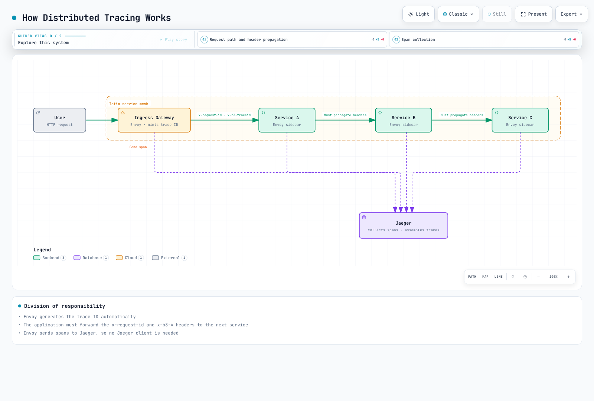
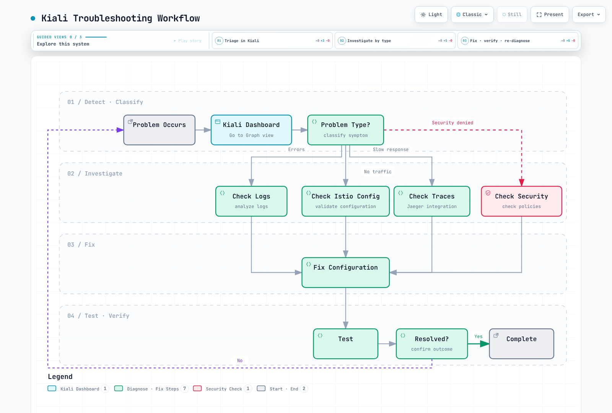

# 可观测性测验

> **最后更新**：2026 年 9 月 11 日 · Istio 1.31 · Kubernetes 1.32–1.36。EKS 和 Kiali 兼容性限制参阅安装及仪表板章节。

本测验涵盖已配置的 Sidecar/waypoint 遥测。各示例独立，假定所述后端、命名空间、权限和流量已存在。YAML/API/查询检查不是生产或真实集群测试；ztunnel L4、原生 Sidecar 和高可用部署需要各自采集配置。

## 选择题（1-5）

### 问题 1：Prometheus 指标

哪项**不是 Istio 标准服务指标名称/族**？

A. istio\_requests\_total（总请求数）\
B. istio\_request\_duration\_milliseconds（请求延迟）\
C. istio\_request\_bytes（请求大小）\
D. istio\_pod\_cpu\_usage（Pod CPU 用量）

<details>

<summary>显示答案</summary>

**答案：D**

Istio 标准服务指标描述流量；Envoy 还暴露内部代理统计。Prometheus 从 kubelet/cAdvisor（或运行时资源管道）获取容器 CPU 用量。Metrics Server 为自动扩缩容和 `kubectl top` 提供资源指标；kube-state-metrics 暴露对象状态及配置的 requests/limits，不是实测 CPU 消耗。

**解释：**

**Istio 采集的指标：**

1. **istio\_requests\_total（A - O）**

```promql
# Request rate by service (per second)
sum(rate(istio_requests_total{reporter="destination"}[5m])) by (destination_service_name, destination_service_namespace)
```

2. **istio\_request\_duration\_milliseconds（B - O）**

```promql
# P95 latency
histogram_quantile(0.95,
  sum(rate(istio_request_duration_milliseconds_bucket{reporter="destination"}[5m])) by (le)
)
```

3. **istio\_request\_bytes（C - O）**

```promql
# Request body byte rate (bytes/second), not mean request size
sum(rate(istio_request_bytes_sum{reporter="destination"}[5m])) by (destination_service_name, destination_service_namespace)
```

4. **istio\_pod\_cpu\_usage（D - X）**

* 这不是 Istio 指标
* Kubernetes 指标：`container_cpu_usage_seconds_total`
* 抓取 kubelet/cAdvisor；比较用量与配置 limits 时，kube-state-metrics 很有用

**Istio 指标类别：**

| 类别 | 示例指标 | 描述 |
| ------------ | --------------------------------------------- | ----------------------------- |
| **请求** | istio\_requests\_total | 请求数、响应码 |
| **持续时间** | istio\_request\_duration\_milliseconds | 延迟分布 |
| **大小** | istio\_request\_bytes、istio\_response\_bytes | 流量大小 |
| **TCP** | istio\_tcp\_connections\_opened\_total | TCP 连接 |

**黄金信号示例：**

```promql
# 1. Latency
histogram_quantile(0.95,
  sum(rate(
    istio_request_duration_milliseconds_bucket{reporter="destination",
      destination_service_name="reviews", destination_service_namespace="default"
    }[5m]
  )) by (le)
)

# 2. Traffic
sum(rate(
  istio_requests_total{reporter="destination",
    destination_service_name="reviews", destination_service_namespace="default"
  }[5m]
))

# 3. Errors (error rate)
sum(rate(
  istio_requests_total{reporter="destination",
    destination_service_name="reviews", destination_service_namespace="default",
    response_code=~"5.."
  }[5m]
))
/
sum(rate(
  istio_requests_total{reporter="destination",
    destination_service_name="reviews", destination_service_namespace="default"
  }[5m]
))

# 4. Saturation - Uses Kubernetes metrics
sum(rate(
  container_cpu_usage_seconds_total{
    namespace="default", container="istio-proxy", pod=~"reviews-.*"
  }[5m]
))
```

**检查指标：**

```bash
# Check metrics via Envoy Admin API
istioctl x envoy-stats <pod-name>.default --output prom

# Check in Prometheus
kubectl port-forward -n istio-system svc/prometheus 9090:9090
# Query at http://localhost:9090
```

**参考资料：**

* [指标](../../../service-mesh/istio/observability/01-metrics.md)

</details>

***

### 问题 2：分布式追踪

在追踪提供程序/后端正常工作的前提下，要连接跨服务调用的代理 span，应用必须承担哪项职责？

A. 应用必须生成 trace ID\
B. 应用必须传播 HTTP 标头\
C. 所有服务必须安装 Jaeger 客户端\
D. Envoy 自动处理一切

<details>

<summary>显示答案</summary>

**答案：B**

配置的代理可生成 span 和 trace ID，但应用必须向出站调用传播追踪上下文。SDK 应注入活动上下文，因此子 span ID 可改变，而 trace ID 保持相同。没有自身 span 的透明应用可转发所选传播标头。

**解释：**

**分布式追踪如何工作：**



[🔍 查看交互式图表](https://www.atomai.click/kubernetes-docs/archmaps/en-quizzes-service-mesh-istio-observability-0.html)

图中演示 B3 传播到已配置 Jaeger 后端。也支持 W3C 传播及中间 OpenTelemetry Collector；已插桩应用注入其活动 span 上下文，不是原样复制每个标头。

**需要传播的 HTTP 标头：**

```text
W3C: traceparent, tracestate
B3 (if configured): b3 OR x-b3-traceid, x-b3-spanid, x-b3-parentspanid, x-b3-sampled
Istio correlation: x-request-id
B3 debug flag: x-b3-flags (do not force debug sampling on ordinary traffic)
```

**应用代码示例：**

```python
# Python Flask example
from flask import Flask, request
import requests

app = Flask(__name__)

@app.route('/api/users')
def get_users():
    # 1. Extract received headers
    headers = {}
    for header in ['x-request-id', 'traceparent', 'tracestate', 'b3', 'x-b3-traceid', 'x-b3-spanid',
                   'x-b3-parentspanid', 'x-b3-sampled', 'x-b3-flags']:
        if header in request.headers:
            headers[header] = request.headers[header]

    # 2. Propagate headers when calling next service
    response = requests.get(
        'http://user-service/users',
        headers=headers, timeout=3  # Selected propagation format
    )

    response.raise_for_status()
    return response.json()
```

```javascript
// Node.js Express example
const express = require('express');
const axios = require('axios');
const app = express();

app.get('/api/users', async (req, res) => {
  // 1. Extract received headers
  const tracingHeaders = {};
  ['x-request-id', 'traceparent', 'tracestate', 'b3', 'x-b3-traceid', 'x-b3-spanid',
   'x-b3-parentspanid', 'x-b3-sampled', 'x-b3-flags'].forEach(header => {
    if (req.headers[header]) {
      tracingHeaders[header] = req.headers[header];
    }
  });

  // 2. Propagate headers when calling next service
  try {
    const response = await axios.get('http://user-service/users', {
      headers: tracingHeaders, timeout: 3000
    });
    res.json(response.data);
  } catch (error) {
    res.status(502).json({error: 'Downstream request failed'});
  }
});
```

**各选项分析：**

* **A（X）**：Envoy 自动生成 trace ID
* **B（O）**：应用必须传播 HTTP 标头（必需）
* **C（X）**：无需 Jaeger 客户端，Envoy 发送 span
* **D（X）**：Envoy 创建/发送 span，但标头传播是应用职责

**采样配置：**

此处假定使用追踪章节的 `otel-tracing` 提供程序。`1.0` 表示 1%，不是 100%；提供程序/导出器设置和上下文传播是独立要求。

```yaml
apiVersion: telemetry.istio.io/v1
kind: Telemetry
metadata:
  name: tracing-sample
  namespace: default
spec:
  tracing:
  - providers:
    - name: otel-tracing
    randomSamplingPercentage: 1.0
```

**访问 Jaeger：**

```bash
kubectl port-forward -n observability svc/jaeger-query 16686:16686
```

**参考资料：**

* [分布式追踪](../../../service-mesh/istio/observability/02-tracing.md)

</details>

***

### 问题 3：Kiali 可视化

Kiali **不提供**哪项功能？

A. 服务拓扑可视化\
B. 流量分析\
C. 自动执行金丝雀部署\
D. Istio 配置验证

<details>

<summary>显示答案</summary>

**答案：C**

Kiali 是**观察和分析工具**，部署执行由 **Argo Rollouts** 等工具处理。

**解释：**

**Kiali 主要功能：**

**1. 服务拓扑可视化（A - O）**

```bash
# Open Kiali dashboard
istioctl dashboard kiali

# Features:
# - Real-time service connection display
# - Traffic flow direction display
# - Service status (healthy/error)
# - Response time display
```

**图视图示例：**

```
Frontend → Backend → Database
   ↓
External API

Color codes:
- Green: Normal
- Red: Error
- Gray: No traffic
```

**2. 流量分析（B - O）**

Kiali 展示：

* 请求数（RPS）
* 错误率（%）
* P50/P95/P99 延迟
* TCP 连接数

**3. 自动执行金丝雀部署（C - X）**

* Kiali 可展示流量，并在有权限时编辑 Istio 配置/使用流量向导
* 它不替代自动渐进式交付控制器
* 部署执行：Argo Rollouts、Flagger

**4. Istio 配置验证（D - O）**

[Kiali 验证目录](https://kiali.io/docs/features/validations/)中的示例：

- VirtualService：未定义子集（`KIA1107`）。
- DestinationRule：重叠主机/子集定义（`KIA0201`）。
- AuthorizationPolicy：引用命名空间未找到（`KIA0101`），或主体未关联到已发现工作负载 ServiceAccount（`KIA0106`）。

检查取决于 Kiali 版本、发现范围和访问权限。检查实际代码/消息及生效代理策略；Kiali 不能证明任意策略冲突，也不能证明每个证书和运行时路由都正常。

**Kiali 安装：**

固定 Operator、身份验证及当前兼容性限制参阅[仪表板章节](../../../service-mesh/istio/observability/04-dashboards.md)。Kiali 单独安装；示例插件用于演示，没有后端/RBAC 配置的 Helm 安装不是生产设置。

**Kiali 主菜单：**

```
1. Overview: Service summary by Namespace
2. Graph: Service topology
3. Applications: Application list
4. Workloads: Deployment, StatefulSet, etc.
5. Services: Kubernetes Service
6. Istio Config: VirtualService, DestinationRule, etc.
```

**Kiali 与其他工具：**

| 工具 | 作用 | 自动渐进式交付 |
| ----------------- | ----------------------------------- | -------------------- |
| **Kiali** | 可视化、分析、验证 | 否 |
| **Argo Rollouts** | 渐进式交付 | 是 |
| **Flagger** | 自动金丝雀部署 | 是 |
| **Grafana** | 指标仪表板 | 否 |
| **Jaeger** | 分布式追踪 | 否 |

**实际使用示例：**

```bash
# 1. Check service topology in Kiali
istioctl dashboard kiali

# 2. Detect anomalies in Graph view
#    - reviews service error rate 5%
#    - productpage → reviews latency increase

# 3. Check details in Workload view
#    - Check reviews-v2 Pod logs
#    - Check Envoy metrics

# 4. Validate configuration in Istio Config view
#    - Found typo in VirtualService
#    - Fix and redeploy
```

**参考资料：**

* [可视化](../../../service-mesh/istio/observability/04-dashboards.md)
* [Kiali 官方文档](https://kiali.io/docs/)

</details>

***

### 问题 4：访问日志配置

如何在 Istio 中将访问日志输出配置为 **JSON 格式**？

A. 在 IstioOperator 中将 meshConfig.accessLogEncoding 设为 JSON\
B. 直接修改 Envoy ConfigMap\
C. 为每个 Pod 添加注解\
D. 通过 Prometheus 查询转换为 JSON

<details>

<summary>显示答案</summary>

**答案：A**

A 是有效的 MeshConfig 方法：在 `istioctl install -f` 输入中启用日志，并使用 `accessLogEncoding: JSON`。这不是集群内 Operator 资源。自定义 `envoyFileAccessLog.logFormat.labels` 提供程序是另一受支持方法，日志章节有说明。

**解释：**

**JSON 格式访问日志配置：**

```yaml
apiVersion: install.istio.io/v1alpha1
kind: IstioOperator
spec:
  meshConfig:
    # Enable Access Log
    accessLogFile: /dev/stdout

    # Output in JSON format
    accessLogEncoding: JSON

    # Define custom JSON format
    accessLogFormat: |
      {
        "log_type": "access",
        "start_time": "%START_TIME%",
        "method": "%REQ(:METHOD)%",
        "path": "%REQ_WITHOUT_QUERY(X-ENVOY-ORIGINAL-PATH?:PATH)%",
        "protocol": "%PROTOCOL%",
        "response_code": "%RESPONSE_CODE%",
        "response_flags": "%RESPONSE_FLAGS%",
        "bytes_received": "%BYTES_RECEIVED%",
        "bytes_sent": "%BYTES_SENT%",
        "duration": "%DURATION%",
        "upstream_service_time": "%RESP(X-ENVOY-UPSTREAM-SERVICE-TIME)%",
        "x_forwarded_for": "%REQ(X-FORWARDED-FOR)%",
        "user_agent": "%REQ(USER-AGENT)%",
        "request_id": "%REQ(X-REQUEST-ID)%",
        "authority": "%REQ(:AUTHORITY)%",
        "upstream_host": "%UPSTREAM_HOST%",
        "upstream_cluster": "%UPSTREAM_CLUSTER%",
        "upstream_local_address": "%UPSTREAM_LOCAL_ADDRESS%",
        "downstream_local_address": "%DOWNSTREAM_LOCAL_ADDRESS%",
        "downstream_remote_address": "%DOWNSTREAM_REMOTE_ADDRESS%",
        "requested_server_name": "%REQUESTED_SERVER_NAME%",
        "route_name": "%ROUTE_NAME%"
      }
```

**输出示例：**

```json
{
  "log_type": "access",
  "start_time": "2025-01-20T10:30:00.123Z",
  "method": "GET",
  "path": "/api/users",
  "protocol": "HTTP/1.1",
  "response_code": 200,
  "response_flags": "-",
  "bytes_received": 0,
  "bytes_sent": 1234,
  "duration": 42,
  "upstream_service_time": "40",
  "x_forwarded_for": "192.168.1.100",
  "user_agent": "Mozilla/5.0",
  "request_id": "abc-123-def",
  "authority": "example.com",
  "upstream_host": "10.0.1.20:8080",
  "upstream_cluster": "outbound|8080||backend.default.svc.cluster.local",
  "upstream_local_address": "10.0.1.10:54321",
  "downstream_local_address": "10.0.1.10:8080",
  "downstream_remote_address": "10.0.1.5:12345",
  "requested_server_name": "-",
  "route_name": "default"
}
```

**按命名空间配置：**

此替代方案需先按日志章节定义 `mesh-json`。Telemetry 选择提供程序/范围；本身不更改提供程序格式。

```yaml
apiVersion: telemetry.istio.io/v1
kind: Telemetry
metadata:
  name: access-logging
  namespace: production
spec:
  accessLogging:
  - providers:
    - name: mesh-json
    # Select the already-defined JSON provider
```

**Envoy 格式变量：**

```text
# Key variables:
%START_TIME%: Request start time
%REQ(HEADER)%: Request header
%RESP(HEADER)%: Response header
%RESPONSE_CODE%: HTTP response code
%DURATION%: Total duration (ms)
%BYTES_RECEIVED%: Bytes received
%BYTES_SENT%: Bytes sent
%UPSTREAM_HOST%: Upstream server address
%DOWNSTREAM_REMOTE_ADDRESS%: Client address
```

**CloudWatch Logs 集成：**

这仅是已部署 Fluent Bit 代理的输出片段，要求匹配的输入标签、CRI/JSON 解析、IAM 凭证和日志挂载。仅 ConfigMap 不采集日志。EKS Fargate 需要其受支持日志路由器配置。

```yaml
apiVersion: v1
kind: ConfigMap
metadata:
  name: fluent-bit-config
  namespace: istio-system
data:
  output.conf: |
    [OUTPUT]
        Name cloudwatch_logs
        Match *
        region us-east-1
        log_group_name /aws/eks/istio/access-logs
        log_stream_prefix istio-
        auto_create_group true
```

**检查日志：**

```bash
# Check Pod's Access Log
kubectl logs <pod-name> -c istio-proxy

# Real-time monitoring
kubectl logs -f <pod-name> -c istio-proxy | jq -R 'fromjson?'

# Filter specific response codes
kubectl logs <pod-name> -c istio-proxy | \
  jq -R 'fromjson? | select((.response_code | tonumber?) == 500)'
```

**TEXT 格式与 JSON 格式：**

| 项目 | TEXT | JSON |
| --------------- | ------------ | --------------- |
| **可读性** | 高（人工） | 低（人工） |
| **解析** | 困难 | 容易（机器） |
| **大小** | 小 | 大 |
| **结构** | 非结构化 | 结构化 |
| **查询** | 困难 | 容易（jq 等） |

**TEXT 格式示例：**

```
[2025-01-20T10:30:00.123Z] "GET /api/users HTTP/1.1" 200 - "-" "-" 0 1234 42 40 "192.168.1.100" "Mozilla/5.0" "abc-123-def" "example.com" "10.0.1.20:8080" outbound|8080||backend.default.svc.cluster.local 10.0.1.10:54321 10.0.1.10:8080 10.0.1.5:12345 - default
```

**参考资料：**

* [日志](../../../service-mesh/istio/observability/03-logging.md)
* [Envoy 访问日志格式](https://www.envoyproxy.io/docs/envoy/latest/configuration/observability/access_log/usage)

</details>

***

### 问题 5：Grafana 仪表板

哪个仪表板**不属于** Istio 发布的 Grafana 仪表板集合？

A. Istio 服务仪表板\
B. Istio 工作负载仪表板\
C. Istio 性能仪表板\
D. Istio 成本仪表板

<details>

<summary>显示答案</summary>

**答案：D**

D。Istio 发布流量/控制平面仪表板，但 Grafana 本身是独立插件；安装 Istio 不会自动安装这些仪表板。

**解释：**

1.31 目录包含 Service7636、Workload7630、Mesh7639、Performance11829、Control Plane7645、Wasm13277 和 Ztunnel21306。Performance 关注资源/数据用量；xDS/webhook 面板主要属于 Control Plane。Mesh 包含全局流量和组件版本，不包含此前此处列出的每个延迟面板。选择匹配已安装 Istio 版本的修订。

成本不能通过将 `istio_requests_total` 乘以 GB 传输价格计算：请求数不是字节数，`source_cluster`/`destination_cluster` 标识集群而非可用区。代理内存是用量，不是账单。网络成本需要计费字节测量及实际源/目标位置/服务规则；资源成本分摊需要节点价格、时间和明确分摊模型。应将估算与 AWS 计费/CUR 数据及适用价格核对，不要断言固定公式。

已验证目录修订和完整自定义 JSON/预置示例参阅[仪表板章节](../../../service-mesh/istio/observability/04-dashboards.md)。仅 ConfigMap 和标签不会安装仪表板加载器，也不会解析数据源输入。

</details>

***

## 简答题（6-10）

### 问题 6：黄金信号监控

解释如何使用 Istio 和 Prometheus 监控 Google SRE 的**黄金信号**（延迟、流量、错误、饱和度）。为每个信号提供 **Prometheus 查询**和**警报规则**。

<details>

<summary>显示答案</summary>

每次服务跳点计算使用一个报告方，并保留服务命名空间（适用时加集群）。目标指标测量服务收到的请求；从未到达的上游失败需要源指标。HTTP5xx 只是错误定义之一；gRPC 失败需要 `grpc_response_status` 及应用专属 SLI 规则。以下延迟以毫秒计，速率为每秒：

```promql
histogram_quantile(0.95, sum by (destination_service_name, destination_service_namespace, le) (rate(istio_request_duration_milliseconds_bucket{reporter="destination"}[5m])))

histogram_quantile(0.99, sum by (destination_service_name, destination_service_namespace, le) (rate(istio_request_duration_milliseconds_bucket{reporter="destination"}[5m])))

sum by (destination_service_name, destination_service_namespace) (rate(istio_requests_total{reporter="destination"}[5m]))

sum by (destination_service_name, destination_service_namespace) (rate(istio_requests_total{reporter="destination",response_code=~"5.."}[5m])) / sum by (destination_service_name, destination_service_namespace) (rate(istio_requests_total{reporter="destination"}[5m]))
```

对于单集群经典 Sidecar 部署，用量/limit 比率需要 kubelet/cAdvisor 和 kube-state-metrics。排除缺失/零 limit。原生 Sidecar 可能在初始化容器资源序列中报告声明的 limits；使用这些表达式前确认实际指标族：

```promql
sum by (namespace, pod, container) (rate(container_cpu_usage_seconds_total{container="istio-proxy"}[5m])) / on (namespace, pod, container) (max by (namespace, pod, container) (kube_pod_container_resource_limits{container="istio-proxy",resource="cpu",unit="core"}) > 0)

max by (namespace, pod, container) (container_memory_working_set_bytes{container="istio-proxy"}) / on (namespace, pod, container) (max by (namespace, pod, container) (kube_pod_container_resource_limits{container="istio-proxy",resource="memory",unit="byte"}) > 0)

envoy_cluster_upstream_cx_active
envoy_cluster_upstream_rq_pending_active
envoy_cluster_circuit_breakers_default_cx_open
```

`_cx_open` 指标是 0/1 状态 gauge；活动连接数除以它不是利用率。需要容量比率时检查配置的断路器阈值。CPU rate 相除前单位是核；内存工作集相除前单位是字节。按方法细分需要先添加有界 `request_method` Telemetry 标签。

以下 PrometheusRule 必须由已安装 Prometheus Operator 选中。阈值和比较窗口仅为示意；流量季节性、无数据、抓取失败和最小流量条件需要环境专属处理。前一个小时窗口不是学习得到的正常基线。

```yaml
apiVersion: monitoring.coreos.com/v1
kind: PrometheusRule
metadata:
  name: istio-golden-signals
  namespace: monitoring
spec:
  groups:
  - name: golden-signals
    rules:
    - alert: HighLatency
      expr: histogram_quantile(0.95, sum by (destination_service_name, destination_service_namespace,
        le) (rate(istio_request_duration_milliseconds_bucket{reporter="destination"}[5m]))) > 500
      for: 5m
      labels:
        severity: warning
      annotations:
        summary: P95 request duration exceeds500ms
    - alert: TrafficSpike
      expr: sum by (destination_service_name, destination_service_namespace) (rate(istio_requests_total{reporter="destination"}[5m]))
        > 2 * sum by (destination_service_name, destination_service_namespace) (rate(istio_requests_total{reporter="destination"}[1h]
        offset 1h))
      for: 5m
      labels:
        severity: warning
      annotations:
        summary: Traffic exceeds the previous comparison window
    - alert: HighErrorRate
      expr: sum by (destination_service_name, destination_service_namespace) (rate(istio_requests_total{reporter="destination",response_code=~"5.."}[5m]))
        / sum by (destination_service_name, destination_service_namespace) (rate(istio_requests_total{reporter="destination"}[5m]))
        > 0.01
      for: 5m
      labels:
        severity: warning
      annotations:
        summary: HTTP5xx fraction exceeds1%
    - alert: HighEnvoyCPU
      expr: sum by (namespace, pod, container) (rate(container_cpu_usage_seconds_total{container="istio-proxy"}[5m]))
        / on (namespace, pod, container) (max by (namespace, pod, container) (kube_pod_container_resource_limits{container="istio-proxy",resource="cpu",unit="core"})
        > 0) > 0.8
      for: 5m
      labels:
        severity: warning
      annotations:
        summary: Proxy CPU consumption exceeds80% of its configured limit
    - alert: HighEnvoyMemory
      expr: max by (namespace, pod, container) (container_memory_working_set_bytes{container="istio-proxy"})
        / on (namespace, pod, container) (max by (namespace, pod, container) (kube_pod_container_resource_limits{container="istio-proxy",resource="memory",unit="byte"})
        > 0) > 0.8
      for: 5m
      labels:
        severity: warning
      annotations:
        summary: Proxy working set exceeds80% of its configured limit
    - alert: ConnectionBreakerAtCapacity
      expr: envoy_cluster_circuit_breakers_default_cx_open == 1
      for: 5m
      labels:
        severity: warning
      annotations:
        summary: Connection breaker at capacity
```

使用[已检查仪表板模板](../../../service-mesh/istio/observability/04-dashboards.md)，为请求速率、错误比例、延迟和资源单位创建独立面板。不要将 CPU 核数和内存字节放在没有单位标注的共享刻度上。

</details>

***

### 问题 7：使用 Jaeger 查找性能瓶颈

解释如何使用分布式追踪工具 Jaeger 查找微服务架构中的**性能瓶颈**。包括**追踪分析方法**和**实际调试场景**。

<details>

<summary>显示答案</summary>

从 [Jaeger2/OTLP 追踪设置](../../../service-mesh/istio/observability/02-tracing.md)、已配置 Telemetry 提供程序及应用上下文传播开始。不要假定旧 Jaeger 插件/Zipkin 端口或仅采样值就会部署追踪。应用/数据库 span 需要 SDK 或代理插桩；代理 span 不能揭示数据库查询内部细节。

1. 用限定命名空间的 Prometheus 延迟查询定位受影响服务/时间窗口，再在 Jaeger 查找代表性慢追踪和正常追踪。Prometheus 直方图查询返回聚合统计，不是 trace ID。
2. 沿关键路径分析，区分父级持续时间与自身独占时间。长父级包含子级；不自动意味着它是原因。
3. 比较错误、重试、连接等待、查询执行和并行度。追踪时序、采样和缺失 span 限制结论。

```promql
histogram_quantile(0.99, sum by (destination_service_name, destination_service_namespace, le) (rate(istio_request_duration_milliseconds_bucket{reporter="destination"}[5m]))) > 2000
```

```bash
kubectl port-forward -n observability svc/jaeger-query 16686:16686
```

这些是假设调试场景，不是基准测试结果或字面 Jaeger API 响应：

| 观察 | 验证内容 | 适当响应 |
|---|---|---|
| 2.1s 请求，包含 1.8s 的已插桩数据库操作 | 区分连接池等待、查询时间、锁和网络延迟；验证数据库执行计划 | 修复测得的原因。名为 `redis.conf` 的 ConfigMap 不会添加应用缓存 |
| 约 10s 请求且连接池超时 | 检查应用数据库客户端池、并发和数据库容量 | 调整应用/数据库连接池并修复泄漏；Envoy DestinationRule 不配置应用连接池，HTTP 池设置也不调优 PostgreSQL |
| 独立的 2s+2s+1s 调用顺序运行 | 确认依赖、负载限制和追踪上下文 | 仅用真实异步客户端或有界线程并行独立 I/O；预期时间可接近最长调用加开销，不保证 2s |

对于现有同步 I/O 回调，此 Python3.9+ 片段保留返回顺序并使用工作线程。应用必须提供回调并执行自己的超时；取消等待任务不会停止已经运行的线程：

```python
import asyncio

async def get_user_data(user_id):
    # Application-owned synchronous I/O functions; each must enforce its timeout.
    profile, orders, recommendations = await asyncio.gather(
        asyncio.to_thread(call_backend_a, user_id),
        asyncio.to_thread(call_backend_b, user_id),
        asyncio.to_thread(call_backend_c, user_id),
    )
    return merge(profile, orders, recommendations)
```

超时限制等待；不修复慢数据库，重试可能放大负载。展示 VirtualService 超时时，包含实际路由目的地，仅在考虑幂等性/负载后使用重试。持久 Jaeger 依赖图可能需要额外聚合；单个追踪瀑布图与全局依赖图是不同视图。应通过重复流量和指标/追踪验证疑似修复，不要只看一条漂亮追踪。

</details>

***

### 问题 8：使用 Kiali 排查服务网格

解释如何使用 Kiali 诊断并解决 Istio 服务网格的**常见问题**（配置错误、流量异常、安全策略冲突）。

<details>

<summary>显示答案</summary>

将 Kiali 配置检查、观测流量、Pod 日志和追踪作为证据，再验证生效代理配置。仪表板章节记录版本/身份验证前提条件。不要凭图形形状虚构 Kiali 警告，也不要将绿色图标当作运行时保证。

| 症状 | 正确解释和检查 |
|---|---|
| 缺失服务/子集 | 在 `default` 中，`reviews` 和 `reviews.default.svc.cluster.local` 解析为同一主机。缩短名称不会创建缺失 Service。KIA1107 标识未定义子集；检查 Service/EndpointSlice、DestinationRule 和实际 Pod 标签 |
| 子集标签不匹配 | 标签值 `1.0` 本身没有错；让目标 Deployment 标签匹配子集。编写完整 DestinationRule 时包含元数据、host 和文档分隔符 |
| 配置 50/50，却观察到 90/10 | 检查有效权重、匹配规则、连接亲和性、重试、端点/剔除状态和时间窗口。仅就绪副本更少不会重新定义 VirtualService 子集权重，也不保证以后达到 50/50 |
| A↔B 环 | 双向图不证明递归调用、死锁或自动 Kiali 警报。重新设计应用前，使用追踪识别实际非预期循环 |
| HTTP403 | 检查执行代理的策略、身份和响应详情。空 spec AuthorizationPolicy 是没有匹配规则的 ALLOW 策略；另一 ALLOW 可提供例外。它不是优先覆盖的 DENY |
| mTLS 失败 | PeerAuthentication 描述接收方。检查特定方向的发送方 TLS 设置、接收方策略、纳管、证书/信任和端口协议。不同接收模式不自动构成冲突；统一 STRICT 是迁移决策，不是通用修复 |

假定 mTLS 提供命名 frontend 主体，且没有更早的 CUSTOM/DENY 拒绝请求，带 frontend 例外的限定范围默认拒绝基线有效：

```yaml
apiVersion: security.istio.io/v1
kind: AuthorizationPolicy
metadata:
  name: backend-default-deny
  namespace: default
spec:
  selector:
    matchLabels:
      app: backend
---
apiVersion: security.istio.io/v1
kind: AuthorizationPolicy
metadata:
  name: backend-allow-frontend
  namespace: default
spec:
  selector:
    matchLabels:
      app: backend
  action: ALLOW
  rules:
  - from:
    - source:
        principals:
        - cluster.local/ns/default/sa/frontend
```

```bash
kubectl get service reviews -n default
kubectl get endpointslice -n default -l kubernetes.io/service-name=reviews
kubectl get pods -n default -l app=reviews --show-labels
istioctl analyze -n default
istioctl proxy-config clusters <source-pod> -n default --fqdn reviews.default.svc.cluster.local -o json
istioctl x authz check <backend-pod>.default
```

流量动画概括选定窗口；不是字节精确的数据包检查。假设不成立时，重复诊断/配置/测试循环，不要盲目重启工作负载。



[🔍 查看交互式图表](https://www.atomai.click/kubernetes-docs/archmaps/en-quizzes-service-mesh-istio-observability-1.html)

</details>

***

### 问题 9：生产可观测性技术栈设置

解释如何为生产 Kubernetes 集群以**高可用（HA）** 配置部署 Istio 可观测性技术栈（Prometheus、Grafana、Jaeger、Kiali）。包含**持久存储**、**扩缩容**和**备份**策略。

<details>

<summary>显示答案</summary>

生产高可用技术栈是环境专属设计和验证任务。下文涵盖主要要求；不是经生产测试的部署包。固定兼容 Kubernetes/Istio/Operator/chart/后端版本，审核实际使用的 chart values，并在发布前验证故障和恢复行为。[仪表板章节](../../../service-mesh/istio/observability/04-dashboards.md)记录当前 Kiali 兼容性缺口；不要因版本最新就推断兼容。

| 组件 | 状态和高可用要求 |
|---|---|
| Prometheus | 运行独立副本，每副本一个 PVC；同集群副本共享集群标签，并使用不同副本标签（其他标签必须匹配才能去重）。分散故障域，按观测写入量规划保留期。负载均衡器不会合并历史 |
| Thanos | Sidecar 暴露 StoreAPI 并可选上传块；Query 发现真实 StoreAPI 端点并按配置副本标签去重。Store Gateway 读取对象存储；Compactor 负责块压缩整理/保留，并具备适当单写入方/分片所有权 |
| Grafana | 两个副本需要共享高可用 PostgreSQL/MySQL 数据库、一致预置/插件/密钥配置和负载均衡器。两个副本共享 SQLite 或跨节点共享一个 EBS ReadWriteOnce 卷，不是 Grafana 高可用 |
| Alertmanager | 副本需要对等/通知去重配置、持久状态和安全接收器凭证；将 Slack webhook 放入 chart values 不是完整密钥/通知设计 |
| Jaeger2/collector | 使用无状态 query/collector 副本，以及受支持的持久后端及其自身 HA/TLS/凭证。尾部采样器需要 trace ID 亲和性；随机 Service 后多个副本收不到完整追踪 |
| Kiali | 使用兼容 Operator/服务器、共享配置/会话密钥行为及适当 Pod 放置。保护后端 API 和用户命名空间权限。Token 策略是单集群；需要时选择文档规定的多集群身份验证 |

**存储和对象存储连接：**

- 即使使用对象存储，也保留本地 Prometheus 持久化：近期 head/WAL 数据可能尚未上传。Sidecar 上传应遵循安装的 Thanos 版本对本地压缩整理/块时长的要求。
- S3 桶、区域端点、加密、保留和 IAM 权限必须存在。将带凭证 ServiceAccount 绑定到实际运行 Sidecar/Store/Compactor 的 Pod。写着“IRSA”的 YAML 注释不会创建凭证。当前 Thanos S3 配置可使用 `aws_sdk_auth: true` 和受支持 AWS SDK 凭证链。
- 当前 kube-prometheus-stack values 在 `prometheus.prometheusSpec.thanos.objectStorageConfig.existingSecret` 下用真实名称/键选择现有对象存储 Secret。挂载键 `thanos.yaml` 不会创建名为 `objstore.yaml` 的文件。验证文件路径、命名 gRPC Service 端口和 DNS-SRV 目标。
- 当前 Thanos Query 使用 `--endpoint` 和 `--query.replica-label` 配置端点/去重。不要未检查所选版本就沿用旧 `--store` 示例。Kiali 查询兼容 Prometheus 后端时，可能还需文档规定的 `thanos_proxy` 设置。
- 每个 Deployment/StatefulSet 需要匹配选择器/Pod 标签和 Service；原先不完整资源无法构成有效 StoreAPI 拓扑。在 EKS 上，EBS 支持的状态需要受支持 EC2 放置/CSI 配置；Fargate 不挂载 EBS，也不运行任意 DaemonSet。

**配置、备份和证明：**

1. 配置实际监控/规则选择器和抓取目标。在 kube-prometheus-stack 中，`alertmanager.config` 与 `alertmanager.alertmanagerSpec` 同级；验证固定 chart 模式。将密码/webhook 保留在受支持 Secret 引用中。
2. 使用应用一致流程备份 Grafana 数据库/配置/预置仪表板/插件、所需 Prometheus 状态及 Jaeger 存储。仅对象存储保留不是所有组件的恢复策略。
3. 仅 Velero PVC/PV 清单不能证明卷数据已捕获。配置受支持的 CSI 快照/数据移动器或文件系统备份路径、快照类/插件、凭证和恢复工作负载所需资源。检查备份状态并执行隔离恢复。
4. 备份 Job 必须使用经过测试且包含所需工具的镜像、正确源 URL、限定范围身份、目标桶和失败处理。旧 AWS CLI 镜像/假定 curl+jq/S3 CronJob 不是已验证备份方案。
5. 监控接收器/导出器失败、排队、抓取健康和实际 PVC 容量指标。`prometheus_tsdb_storage_blocks_bytes_total` 不是有效容量分母。技术栈无法可靠报告自身全面故障；使用独立心跳/观察者，并将缺失序列/无数据与 `up == 0` 分开处理。
6. 测试副本/节点/可用区丢失、存储中断、后端/身份验证失败、发布和恢复。PDB 有助于计划中断；不创建数据库或可用区级高可用。记录 RPO/RTO 和观测容量，不要仅凭副本数声称达到目标。

参阅 [Grafana 高可用](https://grafana.com/docs/grafana/latest/setup-grafana/set-up-for-high-availability/)、[Thanos Sidecar](https://thanos.io/tip/components/sidecar.md/)、[Thanos Query](https://thanos.io/tip/components/query.md/)、[Thanos 存储](https://thanos.io/tip/thanos/storage.md/)及 [Velero CSI 备份](https://velero.io/docs/main/csi/)。

</details>

***

### 问题 10：自定义指标和仪表板创建

解释如何采集 Istio Envoy 默认指标之外的**业务指标**（如订单数、支付成功率），并创建 Grafana 自定义仪表板。

<details>

<summary>显示答案</summary>

选择指标前先定义业务事件和计数边界。Envoy 了解请求，不知道订单是否持久创建或支付是否结算。以下**集成片段统计已完成处理尝试**，不是唯一订单或会计收入。应用必须提供处理函数/错误约定、幂等性和验证。真实支付成功指标应在支付边界记录支付结果，并从结果计数器推导比率；未维护的 Gauge 不是成功率。

使用取值有界的类别/状态标签、尝试次数 Counter，以及非负金额/持续时间 Histogram。在 `finally` 中观察持续时间以包含失败。不要以订单 ID、用户 ID 或原始 URL 标记指标。这些是单进程示例；多工作进程聚合需要客户端库支持的设置。

**Python/Flask**（应用提供 `process_order` 和 `PaymentException`）：

```python
from flask import Flask, request, jsonify, Response
from prometheus_client import Counter, Histogram, generate_latest, CONTENT_TYPE_LATEST
import time

# Integration fragment: your application supplies process_order and PaymentException.
# process_order returns a validated nonnegative USD amount and category after processing.
app = Flask(__name__)
CATEGORIES = {"books", "electronics", "other"}
STATUSES = ("success", "payment_failed", "error")
orders_total = Counter("orders_total", "Completed order-processing attempts", ["status", "product_category"])
order_amount = Histogram("order_amount_dollars", "Observed amounts of successful attempts in USD",
                         buckets=[10, 50, 100, 500, 1000, 5000])
order_duration = Histogram("order_processing_duration_seconds", "Order attempt duration, including failures",
                           buckets=[0.1, 0.5, 1.0, 2.0, 5.0])
for status in STATUSES:
    for category in CATEGORIES:
        orders_total.labels(status=status, product_category=category).inc(0)

@app.post("/api/orders")
def create_order():
    payload = request.get_json()
    started = time.perf_counter()
    try:
        order = process_order(payload)
        category = order["category"] if order["category"] in CATEGORIES else "other"
        orders_total.labels(status="success", product_category=category).inc()
        order_amount.observe(order["amount"])
        return jsonify(order), 201
    except PaymentException:
        orders_total.labels(status="payment_failed", product_category="other").inc()
        return jsonify({"error": "Payment failed"}), 400
    except Exception:
        orders_total.labels(status="error", product_category="other").inc()
        return jsonify({"error": "Order processing failed"}), 500
    finally:
        order_duration.observe(time.perf_counter() - started)

@app.get("/metrics")
def metrics():
    return Response(generate_latest(), content_type=CONTENT_TYPE_LATEST)

# Use the application's server lifecycle. Do not treat a Flask development server
# or process-local counters as a production accounting system.
```

**Node.js/Express**：持续维护的包为 `@prometheus-io/client`（示例 API 使用 Node 22 上的 0.16.1 检查）。`prom-client` 已弃用，由此包替代；现有项目必须审核迁移变更日志。配置 JSON 中间件并 await `register.metrics()`：

```javascript
const express = require('express');
const client = require('@prometheus-io/client'); // Example verified with 0.16.1, Node 22
const app = express();
app.use(express.json());
const register = new client.Registry();
const categories = new Set(['books', 'electronics', 'other']);
const ordersTotal = new client.Counter({
  name: 'orders_total', help: 'Completed order-processing attempts',
  labelNames: ['status', 'product_category'], registers: [register]
});
const orderAmount = new client.Histogram({
  name: 'order_amount_dollars', help: 'Observed successful attempt amounts in USD',
  buckets: [10, 50, 100, 500, 1000, 5000], registers: [register]
});
const orderDuration = new client.Histogram({
  name: 'order_processing_duration_seconds', help: 'Order attempt duration, including failures',
  buckets: [0.1, 0.5, 1, 2, 5], registers: [register]
});
for (const status of ['success', 'payment_failed', 'error']) {
  for (const product_category of categories) ordersTotal.inc({status, product_category}, 0);
}
// The application supplies async processOrder with validated amount/category output.
app.post('/api/orders', async (req, res) => {
  const end = orderDuration.startTimer();
  try {
    const order = await processOrder(req.body);
    const product_category = categories.has(order.category) ? order.category : 'other';
    ordersTotal.inc({status: 'success', product_category});
    orderAmount.observe(order.amount);
    res.status(201).json(order);
  } catch (error) {
    const status = error.code === 'PAYMENT_FAILED' ? 'payment_failed' : 'error';
    ordersTotal.inc({status, product_category: 'other'});
    res.status(status === 'payment_failed' ? 400 : 500).json({error: 'Order processing failed'});
  } finally {
    end();
  }
});
app.get('/metrics', async (req, res) => {
  try {
    res.set('Content-Type', register.contentType);
    res.end(await register.metrics());
  } catch (error) {
    res.status(500).end();
  }
});
// Integrate app.listen/shutdown with the application's server lifecycle.
```

**Kubernetes 采集**：此 Sidecar 实验使用 Istio 合并端点，不假定明文应用抓取能通过 STRICT mTLS。将这些标签/注解合并到 `default` 中实际 `order-service` Deployment；镜像必须包含应用并在 8080 暴露 `/metrics`。网格必须启用 Prometheus 合并。代理端点 15020 为明文，因此限制网络访问。若现有抓取器已采集这些业务指标，不要添加重复监控器。

```yaml
spec:
  template:
    metadata:
      labels:
        app: order-service
      annotations:
        prometheus.io/scrape: 'true'
        prometheus.io/path: /metrics
        prometheus.io/port: '8080'
        prometheus.istio.io/merge-metrics: 'true'
```

```yaml
apiVersion: v1
kind: Service
metadata:
  name: order-service
  namespace: default
  labels:
    app: order-service
spec:
  selector:
    app: order-service
  ports:
  - name: http
    port: 8080
    targetPort: 8080
  - name: merged-metrics
    port: 15020
    targetPort: 15020
---
apiVersion: monitoring.coreos.com/v1
kind: ServiceMonitor
metadata:
  name: order-service-metrics
  namespace: istio-system
spec:
  namespaceSelector:
    matchNames:
    - default
  selector:
    matchLabels:
      app: order-service
  targetLabels:
  - app
  endpoints:
  - port: merged-metrics
    path: /stats/prometheus
    interval: 30s
    metricRelabelings:
    - sourceLabels:
      - __name__
      regex: orders_total|order_amount_dollars_(bucket|sum|count)|order_processing_duration_seconds_(bucket|sum|count)
      action: keep
```

Prometheus 资源必须选择 `istio-system` 中的 ServiceMonitor；它在 `default` 中发现 Service。仅保留业务指标族，避免重复其他位置已抓取的代理指标。`targetLabels` 显式添加 Service 的 `app` 标签。这是 Sidecar 示例；Ambient/直接 TLS 抓取需要自己的受支持设计。

**查询**（依次为：区间尝试次数、每秒尝试次数、成功比例、观测金额 P95、持续时间 P99、类别速率、订单尝试中的支付失败比例）：

```promql
sum(increase(orders_total{namespace="default",app="order-service"}[5m]))

sum(rate(orders_total{namespace="default",app="order-service"}[5m]))

sum(rate(orders_total{namespace="default",app="order-service",status="success"}[5m])) / sum(rate(orders_total{namespace="default",app="order-service"}[5m]))

histogram_quantile(0.95, sum by (le) (rate(order_amount_dollars_bucket{namespace="default",app="order-service"}[5m])))

histogram_quantile(0.99, sum by (le) (rate(order_processing_duration_seconds_bucket{namespace="default",app="order-service"}[5m])))

sum by (product_category) (rate(orders_total{namespace="default",app="order-service"}[5m]))

sum(rate(orders_total{namespace="default",app="order-service",status="payment_failed"}[5m])) / sum(rate(orders_total{namespace="default",app="order-service"}[5m]))
```

`increase` 估算区间总量；`rate` 为每秒值。进程重启、重试和漏抓意味着运维计数器/金额总和不是会计台账。对于唯一已提交订单或收入，应与持久业务系统核对，不要假定遥测恰好一次。

**Grafana**：此完整仪表板对象要求数据源 UID `prometheus` 及上方监控器标签。保存时不带 API 包装层，并使用[文档规定的仪表板文件预置](../../../service-mesh/istio/observability/04-dashboards.md)。仅 ConfigMap 标签不配置提供程序。

```json
{
  "uid": "order-business-metrics",
  "title": "Order Processing Operational Metrics",
  "timezone": "browser",
  "panels": [
    {
      "id": 1,
      "title": "Completed Attempts per Minute",
      "type": "timeseries",
      "datasource": {
        "type": "prometheus",
        "uid": "prometheus"
      },
      "targets": [
        {
          "expr": "sum(rate(orders_total{namespace=\"default\",app=\"order-service\"}[5m])) * 60",
          "refId": "A"
        }
      ],
      "gridPos": {
        "x": 0,
        "y": 0,
        "w": 12,
        "h": 8
      }
    },
    {
      "id": 2,
      "title": "Attempt Success Fraction",
      "type": "gauge",
      "datasource": {
        "type": "prometheus",
        "uid": "prometheus"
      },
      "targets": [
        {
          "expr": "sum(rate(orders_total{namespace=\"default\",app=\"order-service\",status=\"success\"}[5m])) / sum(rate(orders_total{namespace=\"default\",app=\"order-service\"}[5m]))",
          "refId": "A"
        }
      ],
      "gridPos": {
        "x": 12,
        "y": 0,
        "w": 12,
        "h": 8
      },
      "fieldConfig": {
        "defaults": {
          "unit": "percentunit"
        }
      }
    },
    {
      "id": 3,
      "title": "Processing P95",
      "type": "timeseries",
      "datasource": {
        "type": "prometheus",
        "uid": "prometheus"
      },
      "targets": [
        {
          "expr": "histogram_quantile(0.95, sum by (le) (rate(order_processing_duration_seconds_bucket{namespace=\"default\",app=\"order-service\"}[5m])))",
          "refId": "A"
        }
      ],
      "gridPos": {
        "x": 0,
        "y": 8,
        "w": 12,
        "h": 8
      },
      "fieldConfig": {
        "defaults": {
          "unit": "s"
        }
      }
    },
    {
      "id": 4,
      "title": "Observed Successful Attempt Amount (Last Hour)",
      "type": "stat",
      "datasource": {
        "type": "prometheus",
        "uid": "prometheus"
      },
      "targets": [
        {
          "expr": "sum(increase(order_amount_dollars_sum{namespace=\"default\",app=\"order-service\"}[1h]))",
          "refId": "A"
        }
      ],
      "gridPos": {
        "x": 12,
        "y": 8,
        "w": 12,
        "h": 8
      },
      "fieldConfig": {
        "defaults": {
          "unit": "currencyUSD"
        }
      }
    }
  ],
  "time": {
    "from": "now-1h",
    "to": "now"
  },
  "refresh": "30s"
}
```

**警报**：通过已安装 Prometheus Operator 选择此规则。最小流量阈值避免无流量时触发比例警报；缺失/抓取失败需要独立信号。阈值是示例，不是业务 SLO 保证。

```yaml
apiVersion: monitoring.coreos.com/v1
kind: PrometheusRule
metadata:
  name: business-metrics-alerts
  namespace: istio-system
spec:
  groups:
  - name: business-metrics
    rules:
    - alert: LowOrderAttemptSuccessFraction
      expr: (sum(rate(orders_total{namespace="default",app="order-service",status="success"}[5m])) / sum(rate(orders_total{namespace="default",app="order-service"}[5m]))
        < 0.95) and (sum(rate(orders_total{namespace="default",app="order-service"}[5m])) > 0.1)
      for: 5m
      labels:
        severity: warning
      annotations:
        summary: Order-processing attempt success fraction below95%
    - alert: SlowOrderProcessing
      expr: histogram_quantile(0.95, sum by (le) (rate(order_processing_duration_seconds_bucket{namespace="default",app="order-service"}[5m])))
        > 2
      for: 5m
      labels:
        severity: warning
      annotations:
        summary: P95 processing attempt duration exceeds2s
```

指标类型、暴露格式和进程模型参阅 [Python 客户端](https://prometheus.github.io/client_python/)及 [JavaScript 客户端](https://github.com/prometheus/client_js)文档。

</details>

***

## 分数计算

* 选择题 1-5：每题 10 分（共 50 分）
* 简答题 6-10：每题 10 分（共 50 分）
* **总分：100 分**

**评估标准：**

* 90-100 分：对这些主题理解出色
* 80-89 分：理解良好；部署验证仍需单独进行
* 70-79 分：一般（建议进一步学习）
* 60-69 分：低于平均（需要复习基本概念）
* 0-59 分：需要重新学习

## 学习资源

* [指标](../../../service-mesh/istio/observability/01-metrics.md)
* [分布式追踪](../../../service-mesh/istio/observability/02-tracing.md)
* [日志](../../../service-mesh/istio/observability/03-logging.md)
* [可视化](../../../service-mesh/istio/observability/04-dashboards.md)
