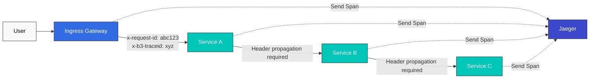
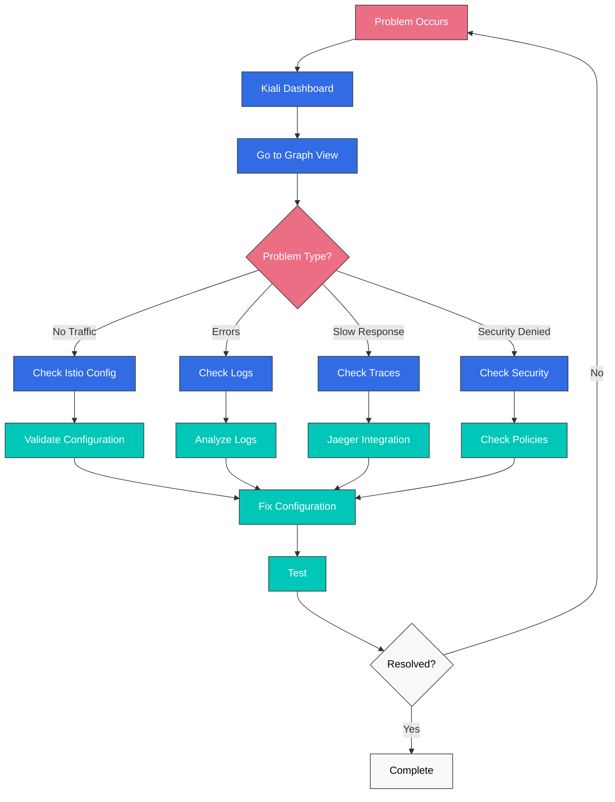

# 可观测性测验

> **支持版本**: Istio 1.28.0 **EKS 版本**: 1.34 (Kubernetes 1.28+) **最后更新**: February 19, 2026

本测验检验你对 Istio 可观测性功能的理解。

## 选择题（1-5）

### 问题 1：Prometheus 指标

以下哪个指标**不会**由 Istio 中的 Prometheus 默认采集？

A. istio\_requests\_total（请求总数） B. istio\_request\_duration\_milliseconds（请求延迟） C. istio\_request\_bytes（请求大小） D. istio\_pod\_cpu\_usage（Pod CPU 使用量）

<details>

<summary>显示答案</summary>

**答案：D**

Istio Envoy 仅采集**流量相关指标**，而 Pod CPU 使用量由 **Kubernetes Metrics Server** 或 **cAdvisor** 采集。

**说明：**

**Istio 采集的指标：**

1. **istio\_requests\_total (A - O)**

```promql
# Total requests by service
sum(rate(istio_requests_total[5m])) by (destination_service_name)
```

2. **istio\_request\_duration\_milliseconds (B - O)**

```promql
# P95 latency
histogram_quantile(0.95,
  sum(rate(istio_request_duration_milliseconds_bucket[5m])) by (le)
)
```

3. **istio\_request\_bytes (C - O)**

```promql
# Request size
sum(rate(istio_request_bytes_sum[5m])) by (destination_service_name)
```

4. **istio\_pod\_cpu\_usage (D - X)**

* 这不是 Istio 指标
* Kubernetes 指标：`container_cpu_usage_seconds_total`
* 需要 kube-state-metrics 才能在 Prometheus 中采集

**Istio 指标类别：**

| 类别     | 示例指标                                | 描述                   |
| ------------ | --------------------------------------------- | ----------------------------- |
| **请求**  | istio\_requests\_total                        | 请求数量、响应代码 |
| **时长** | istio\_request\_duration\_milliseconds        | 延迟分布          |
| **大小**     | istio\_request\_bytes, istio\_response\_bytes | 流量大小                  |
| **TCP**      | istio\_tcp\_connections\_opened\_total        | TCP 连接               |

**黄金信号示例：**

```promql
# 1. Latency
histogram_quantile(0.95,
  sum(rate(
    istio_request_duration_milliseconds_bucket{
      destination_service_name="reviews"
    }[5m]
  )) by (le)
)

# 2. Traffic
sum(rate(
  istio_requests_total{
    destination_service_name="reviews"
  }[5m]
))

# 3. Errors (error rate)
sum(rate(
  istio_requests_total{
    destination_service_name="reviews",
    response_code=~"5.."
  }[5m]
))
/
sum(rate(
  istio_requests_total{
    destination_service_name="reviews"
  }[5m]
))

# 4. Saturation - Uses Kubernetes metrics
sum(rate(
  container_cpu_usage_seconds_total{
    pod=~"reviews-.*"
  }[5m]
))
```

**检查指标：**

```bash
# Check metrics via Envoy Admin API
kubectl exec <pod-name> -c istio-proxy -- \
  curl localhost:15000/stats/prometheus

# Check in Prometheus
kubectl port-forward -n istio-system svc/prometheus 9090:9090
# Query at http://localhost:9090
```

**参考资料：**

* [指标](../../../service-mesh/istio/observability/01-metrics.md)

</details>

***

### 问题 2：分布式追踪

在 Istio 中启用分布式追踪所需的**最低配置**是什么？

A. 应用程序必须生成 trace ID B. 应用程序必须传播 HTTP header C. 必须在所有 Service 上安装 Jaeger client D. Envoy 自动处理所有事项

<details>

<summary>显示答案</summary>

**答案：B**

Istio Envoy 会自动生成 trace ID，但**应用程序必须将 HTTP header 传播**到下一个 Service。

**说明：**

**分布式追踪的工作方式：**



**要传播的 HTTP Headers：**

```yaml
# Zipkin (B3) headers
x-b3-traceid: Trace ID
x-b3-spanid: Current Span ID
x-b3-parentspanid: Parent Span ID
x-b3-sampled: Sampling decision
x-b3-flags: Flags

# Or single header
b3: {traceid}-{spanid}-{sampled}-{parentspanid}

# Istio internal headers
x-request-id: Unique request ID

# Jaeger native headers (optional)
uber-trace-id
```

**应用程序代码示例：**

```python
# Python Flask example
from flask import Flask, request
import requests

app = Flask(__name__)

@app.route('/api/users')
def get_users():
    # 1. Extract received headers
    headers = {}
    for header in ['x-request-id', 'x-b3-traceid', 'x-b3-spanid',
                   'x-b3-parentspanid', 'x-b3-sampled', 'x-b3-flags']:
        if header in request.headers:
            headers[header] = request.headers[header]

    # 2. Propagate headers when calling next service
    response = requests.get(
        'http://user-service/users',
        headers=headers  # Header propagation required
    )

    return response.json()
```

```javascript
// Node.js Express example
const express = require('express');
const axios = require('axios');
const app = express();

app.get('/api/users', async (req, res) => {
  // 1. Extract received headers
  const tracingHeaders = {};
  ['x-request-id', 'x-b3-traceid', 'x-b3-spanid',
   'x-b3-parentspanid', 'x-b3-sampled', 'x-b3-flags'].forEach(header => {
    if (req.headers[header]) {
      tracingHeaders[header] = req.headers[header];
    }
  });

  // 2. Propagate headers when calling next service
  const response = await axios.get('http://user-service/users', {
    headers: tracingHeaders  // Header propagation required
  });

  res.json(response.data);
});
```

**各选项分析：**

* **A (X)**：Envoy 自动生成 trace ID
* **B (O)**：应用程序必须传播 HTTP header（必需）
* **C (X)**：不需要 Jaeger client，Envoy 会发送 Span
* **D (X)**：Envoy 创建并发送 Span，但传播 header 是应用程序的职责

**采样配置：**

```yaml
apiVersion: install.istio.io/v1alpha1
kind: IstioOperator
spec:
  meshConfig:
    defaultConfig:
      tracing:
        sampling: 1.0  # 100% sampling (development)
        # sampling: 10.0  # 10% sampling (production)
```

**访问 Jaeger：**

```bash
istioctl dashboard jaeger
```

**参考资料：**

* [分布式追踪](https://github.com/Atom-oh/kubernetes-docs/blob/main/en/service-mesh/istio/observability/02-distributed-tracing.md)

</details>

***

### 问题 3：Kiali 可视化

以下哪项功能**不**由 Kiali 提供？

A. Service 拓扑可视化 B. 流量流向分析 C. 自动执行 Canary 部署 D. Istio 配置验证

<details>

<summary>显示答案</summary>

**答案：C**

Kiali 是一个**观测和分析工具**，而部署执行由 **Argo Rollouts** 等工具处理。

**说明：**

**Kiali 的主要功能：**

**1. Service 拓扑可视化 (A - O)**

```bash
# Open Kiali dashboard
istioctl dashboard kiali

# Features:
# - Real-time service connection display
# - Traffic flow direction display
# - Service status (healthy/error)
# - Response time display
```

**Graph 视图示例：**

```
Frontend → Backend → Database
   ↓
External API

Color codes:
- Green: Normal
- Red: Error
- Gray: No traffic
```

**2. 流量流向分析 (B - O)**

Kiali 显示：

* 请求数量（RPS）
* 错误率（%）
* P50/P95/P99 延迟
* TCP 连接数

**3. 自动执行 Canary 部署 (C - X)**

* Kiali 不执行部署
* Kiali 仅**可视化**流量分割状态
* 部署执行：Argo Rollouts、Flagger

**4. Istio 配置验证 (D - O)**

```yaml
# Items Kiali validates:

1. VirtualService errors:
   - Non-existent host reference
   - Invalid subset reference
   - Weight sum not equal to 100

2. DestinationRule errors:
   - Subset labels don't match Pods
   - Duplicate subset names

3. Gateway errors:
   - Missing TLS certificate
   - Invalid selector

4. AuthorizationPolicy errors:
   - Conflicting policies
   - Invalid principal format
```

**Kiali 安装：**

```bash
# Install Kiali included in Istio samples
kubectl apply -f samples/addons/kiali.yaml

# Or install with Helm
helm repo add kiali https://kiali.org/helm-charts
helm install kiali-server kiali/kiali-server \
  --namespace istio-system
```

**Kiali 主菜单：**

```
1. Overview: Service summary by Namespace
2. Graph: Service topology
3. Applications: Application list
4. Workloads: Deployment, StatefulSet, etc.
5. Services: Kubernetes Service
6. Istio Config: VirtualService, DestinationRule, etc.
```

**Kiali 与其他工具对比：**

| 工具              | 角色                                | 部署执行 |
| ----------------- | ----------------------------------- | -------------------- |
| **Kiali**         | 可视化、分析、验证 | 否                   |
| **Argo Rollouts** | 渐进式交付                | 是                  |
| **Flagger**       | 自动 Canary 部署         | 是                  |
| **Grafana**       | 指标仪表板                   | 否                   |
| **Jaeger**        | 分布式追踪                 | 否                   |

**实际使用示例：**

```bash
# 1. Check service topology in Kiali
istioctl dashboard kiali

# 2. Detect anomalies in Graph view
#    - reviews service error rate 5%
#    - productpage → reviews latency increase

# 3. Check details in Workload view
#    - Check reviews-v2 Pod logs
#    - Check Envoy metrics

# 4. Validate configuration in Istio Config view
#    - Found typo in VirtualService
#    - Fix and redeploy
```

**参考资料：**

* [可视化](https://github.com/Atom-oh/kubernetes-docs/blob/main/en/service-mesh/istio/observability/04-visualization.md)
* [Kiali 官方文档](https://kiali.io/docs/)

</details>

***

### 问题 4：Access Log 配置

如何在 Istio 中配置以 **JSON 格式**输出 Access Log？

A. 在 IstioOperator 中将 meshConfig.accessLogEncoding 设置为 JSON B. 直接修改 Envoy ConfigMap C. 为每个 Pod 添加 annotation D. 通过 Prometheus query 转换为 JSON

<details>

<summary>显示答案</summary>

**答案：A**

在 IstioOperator 中将 **meshConfig.accessLogEncoding** 字段设置为 `JSON`。

**说明：**

**JSON 格式 Access Log 配置：**

```yaml
apiVersion: install.istio.io/v1alpha1
kind: IstioOperator
spec:
  meshConfig:
    # Enable Access Log
    accessLogFile: /dev/stdout

    # Output in JSON format
    accessLogEncoding: JSON

    # Define custom JSON format
    accessLogFormat: |
      {
        "start_time": "%START_TIME%",
        "method": "%REQ(:METHOD)%",
        "path": "%REQ(X-ENVOY-ORIGINAL-PATH?:PATH)%",
        "protocol": "%PROTOCOL%",
        "response_code": "%RESPONSE_CODE%",
        "response_flags": "%RESPONSE_FLAGS%",
        "bytes_received": "%BYTES_RECEIVED%",
        "bytes_sent": "%BYTES_SENT%",
        "duration": "%DURATION%",
        "upstream_service_time": "%RESP(X-ENVOY-UPSTREAM-SERVICE-TIME)%",
        "x_forwarded_for": "%REQ(X-FORWARDED-FOR)%",
        "user_agent": "%REQ(USER-AGENT)%",
        "request_id": "%REQ(X-REQUEST-ID)%",
        "authority": "%REQ(:AUTHORITY)%",
        "upstream_host": "%UPSTREAM_HOST%",
        "upstream_cluster": "%UPSTREAM_CLUSTER%",
        "upstream_local_address": "%UPSTREAM_LOCAL_ADDRESS%",
        "downstream_local_address": "%DOWNSTREAM_LOCAL_ADDRESS%",
        "downstream_remote_address": "%DOWNSTREAM_REMOTE_ADDRESS%",
        "requested_server_name": "%REQUESTED_SERVER_NAME%",
        "route_name": "%ROUTE_NAME%"
      }
```

**输出示例：**

```json
{
  "start_time": "2025-01-20T10:30:00.123Z",
  "method": "GET",
  "path": "/api/users",
  "protocol": "HTTP/1.1",
  "response_code": 200,
  "response_flags": "-",
  "bytes_received": 0,
  "bytes_sent": 1234,
  "duration": 42,
  "upstream_service_time": "40",
  "x_forwarded_for": "192.168.1.100",
  "user_agent": "Mozilla/5.0",
  "request_id": "abc-123-def",
  "authority": "example.com",
  "upstream_host": "10.0.1.20:8080",
  "upstream_cluster": "outbound|8080||backend.default.svc.cluster.local",
  "upstream_local_address": "10.0.1.10:54321",
  "downstream_local_address": "10.0.1.10:8080",
  "downstream_remote_address": "10.0.1.5:12345",
  "requested_server_name": "-",
  "route_name": "default"
}
```

**按 Namespace 配置：**

```yaml
apiVersion: telemetry.istio.io/v1alpha1
kind: Telemetry
metadata:
  name: access-logging
  namespace: production
spec:
  accessLogging:
  - providers:
    - name: envoy
    # Can configure JSON format for specific Namespace only
```

**Envoy 格式变量：**

```yaml
# Key variables:
%START_TIME%: Request start time
%REQ(HEADER)%: Request header
%RESP(HEADER)%: Response header
%RESPONSE_CODE%: HTTP response code
%DURATION%: Total duration (ms)
%BYTES_RECEIVED%: Bytes received
%BYTES_SENT%: Bytes sent
%UPSTREAM_HOST%: Upstream server address
%DOWNSTREAM_REMOTE_ADDRESS%: Client address
```

**CloudWatch Logs 集成：**

```yaml
apiVersion: v1
kind: ConfigMap
metadata:
  name: fluent-bit-config
  namespace: istio-system
data:
  output.conf: |
    [OUTPUT]
        Name cloudwatch_logs
        Match *
        region us-east-1
        log_group_name /aws/eks/istio/access-logs
        log_stream_prefix istio-
        auto_create_group true
```

**检查日志：**

```bash
# Check Pod's Access Log
kubectl logs <pod-name> -c istio-proxy

# Real-time monitoring
kubectl logs -f <pod-name> -c istio-proxy | jq .

# Filter specific response codes
kubectl logs <pod-name> -c istio-proxy | \
  jq 'select(.response_code == "500")'
```

**TEXT 格式与 JSON 格式对比：**

| 项目            | TEXT         | JSON            |
| --------------- | ------------ | --------------- |
| **可读性** | 高（人工） | 低（人工）     |
| **解析**     | 困难    | 简单（机器）  |
| **大小**        | 小        | 大           |
| **结构**   | 非结构化 | 结构化      |
| **查询**    | 困难    | 简单（jq 等） |

**TEXT 格式示例：**

```
[2025-01-20T10:30:00.123Z] "GET /api/users HTTP/1.1" 200 - "-" "-" 0 1234 42 40 "192.168.1.100" "Mozilla/5.0" "abc-123-def" "example.com" "10.0.1.20:8080" outbound|8080||backend.default.svc.cluster.local 10.0.1.10:54321 10.0.1.10:8080 10.0.1.5:12345 - default
```

**参考资料：**

* [日志](../../../service-mesh/istio/observability/03-logging.md)
* [Envoy Access Log 格式](https://www.envoyproxy.io/docs/envoy/latest/configuration/observability/access_log/usage)

</details>

***

### 问题 5：Grafana 仪表板

以下哪个 Grafana 仪表板不会随 Istio 安装默认提供？

A. Istio Service Dashboard B. Istio Workload Dashboard C. Istio Performance Dashboard D. Istio Cost Dashboard

<details>

<summary>显示答案</summary>

**答案：D**

Istio 默认**不提供 Cost Dashboard**。

**说明：**

**Istio 默认 Grafana 仪表板：**

**1. Istio Service Dashboard (A - O)**

```
Service-level metrics:
- Request Volume (request count)
- Request Duration (P50, P95, P99)
- Request Size / Response Size
- Success Rate
- 4xx, 5xx error trends
```

**2. Istio Workload Dashboard (B - O)**

```
Workload (Pod) level metrics:
- Incoming Request Volume
- Incoming Success Rate
- Incoming Request Duration
- Incoming Request Size
- Outgoing Request Volume
- Outgoing Success Rate
```

**3. Istio Performance Dashboard (C - O)**

```
Istio's own performance metrics:
- Pilot performance (xDS push time)
- Envoy memory usage
- Envoy CPU usage
- Sidecar injection success rate
- Configuration sync latency
```

**4. Istio Control Plane Dashboard**

```
Control Plane metrics:
- Istiod resource usage
- xDS connection count
- Webhook performance
- Certificate issuance statistics
```

**5. Istio Mesh Dashboard**

```
Overall mesh metrics:
- Total request count
- Overall success rate
- Global P99 latency
- Service count, Pod count
```

**Cost Dashboard 不可用 (D - X)**

你需要为成本相关指标创建自定义仪表板：

```promql
# Cross-AZ traffic cost estimation
sum(rate(istio_requests_total{
  source_cluster="us-east-1a",
  destination_cluster!="us-east-1a"
}[5m])) * 86400 * 30 * 0.01 / 1000000

# Sidecar resource cost (memory basis)
sum(container_memory_usage_bytes{
  container="istio-proxy"
}) / 1024 / 1024 / 1024 * 30 * 0.01
```

**Grafana 安装和访问：**

```bash
# Install Grafana
kubectl apply -f samples/addons/grafana.yaml

# Access Grafana
istioctl dashboard grafana

# Or port forwarding
kubectl port-forward -n istio-system svc/grafana 3000:3000
# http://localhost:3000
```

**创建自定义仪表板：**

```json
{
  "dashboard": {
    "title": "Istio Custom Metrics",
    "panels": [
      {
        "title": "Request Rate",
        "targets": [
          {
            "expr": "sum(rate(istio_requests_total[5m])) by (destination_service_name)"
          }
        ]
      },
      {
        "title": "Error Rate",
        "targets": [
          {
            "expr": "sum(rate(istio_requests_total{response_code=~\"5..\"}[5m])) / sum(rate(istio_requests_total[5m]))"
          }
        ]
      }
    ]
  }
}
```

**使用仪表板变量：**

```yaml
# Add Namespace variable
variables:
  - name: namespace
    type: query
    query: label_values(istio_requests_total, destination_workload_namespace)

# Use variable in panel
expr: |
  sum(rate(
    istio_requests_total{
      destination_workload_namespace="$namespace"
    }[5m]
  )) by (destination_service_name)
```

**参考资料：**

* [可视化](https://github.com/Atom-oh/kubernetes-docs/blob/main/en/service-mesh/istio/observability/04-visualization.md)
* [Grafana 官方文档](https://grafana.com/docs/)

</details>

***

## 简答题（6-10）

### 问题 6：黄金信号监控

说明如何使用 Istio 和 Prometheus 监控 Google SRE 的**黄金信号**（Latency、Traffic、Errors、Saturation）。请包含每个信号的 **Prometheus 查询**和**告警规则**。

<details>

<summary>显示答案</summary>

**答案：**

**黄金信号监控实现：**

***

**1. Latency**

**Prometheus 查询：**

```promql
# P95 latency
histogram_quantile(0.95,
  sum(rate(
    istio_request_duration_milliseconds_bucket{
      destination_service_name="reviews"
    }[5m]
  )) by (le)
)

# P99 latency
histogram_quantile(0.99,
  sum(rate(
    istio_request_duration_milliseconds_bucket{
      destination_service_name="reviews"
    }[5m]
  )) by (le)
)

# P50 latency (median)
histogram_quantile(0.50,
  sum(rate(
    istio_request_duration_milliseconds_bucket{
      destination_service_name="reviews"
    }[5m]
  )) by (le)
)
```

**告警规则：**

```yaml
apiVersion: monitoring.coreos.com/v1
kind: PrometheusRule
metadata:
  name: istio-latency-alerts
  namespace: monitoring
spec:
  groups:
  - name: latency
    interval: 30s
    rules:
    # P95 latency exceeds 500ms
    - alert: HighLatency
      expr: |
        histogram_quantile(0.95,
          sum(rate(
            istio_request_duration_milliseconds_bucket[5m]
          )) by (le, destination_service_name)
        ) > 500
      for: 5m
      labels:
        severity: warning
      annotations:
        summary: "High latency detected on {{ $labels.destination_service_name }}"
        description: "P95 latency is {{ $value }}ms"

    # P99 latency exceeds 1 second
    - alert: CriticalLatency
      expr: |
        histogram_quantile(0.99,
          sum(rate(
            istio_request_duration_milliseconds_bucket[5m]
          )) by (le, destination_service_name)
        ) > 1000
      for: 5m
      labels:
        severity: critical
      annotations:
        summary: "Critical latency on {{ $labels.destination_service_name }}"
```

***

**2. Traffic**

**Prometheus 查询：**

```promql
# Requests per second (RPS)
sum(rate(
  istio_requests_total{
    destination_service_name="reviews"
  }[5m]
))

# RPS by service
sum(rate(
  istio_requests_total[5m]
)) by (destination_service_name)

# RPS by HTTP method
sum(rate(
  istio_requests_total[5m]
)) by (request_method)
```

**告警规则：**

```yaml
apiVersion: monitoring.coreos.com/v1
kind: PrometheusRule
metadata:
  name: istio-traffic-alerts
spec:
  groups:
  - name: traffic
    rules:
    # Traffic spike (2x normal)
    - alert: TrafficSpike
      expr: |
        sum(rate(istio_requests_total[5m])) by (destination_service_name)
        >
        sum(rate(istio_requests_total[1h] offset 1h)) by (destination_service_name) * 2
      for: 5m
      labels:
        severity: warning
      annotations:
        summary: "Traffic spike on {{ $labels.destination_service_name }}"

    # Traffic drop (below 50% of normal)
    - alert: TrafficDrop
      expr: |
        sum(rate(istio_requests_total[5m])) by (destination_service_name)
        <
        sum(rate(istio_requests_total[1h] offset 1h)) by (destination_service_name) * 0.5
      for: 10m
      labels:
        severity: warning
```

***

**3. Errors**

**Prometheus 查询：**

```promql
# Error rate (5xx)
sum(rate(
  istio_requests_total{
    destination_service_name="reviews",
    response_code=~"5.."
  }[5m]
))
/
sum(rate(
  istio_requests_total{
    destination_service_name="reviews"
  }[5m]
))

# 4xx + 5xx error rate
sum(rate(
  istio_requests_total{
    destination_service_name="reviews",
    response_code=~"[45].."
  }[5m]
))
/
sum(rate(
  istio_requests_total{
    destination_service_name="reviews"
  }[5m]
))

# Distribution by response code
sum(rate(
  istio_requests_total[5m]
)) by (response_code, destination_service_name)
```

**告警规则：**

```yaml
apiVersion: monitoring.coreos.com/v1
kind: PrometheusRule
metadata:
  name: istio-error-alerts
spec:
  groups:
  - name: errors
    rules:
    # Error rate > 1%
    - alert: HighErrorRate
      expr: |
        (
          sum(rate(istio_requests_total{response_code=~"5.."}[5m])) by (destination_service_name)
          /
          sum(rate(istio_requests_total[5m])) by (destination_service_name)
        ) > 0.01
      for: 5m
      labels:
        severity: warning
      annotations:
        summary: "High error rate on {{ $labels.destination_service_name }}"
        description: "Error rate is {{ $value | humanizePercentage }}"

    # Error rate > 5%
    - alert: CriticalErrorRate
      expr: |
        (
          sum(rate(istio_requests_total{response_code=~"5.."}[5m])) by (destination_service_name)
          /
          sum(rate(istio_requests_total[5m])) by (destination_service_name)
        ) > 0.05
      for: 2m
      labels:
        severity: critical
```

***

**4. Saturation**

**Prometheus 查询：**

```promql
# Envoy CPU usage
sum(rate(
  container_cpu_usage_seconds_total{
    pod=~".*",
    container="istio-proxy"
  }[5m]
)) by (pod)

# Envoy memory usage
sum(
  container_memory_usage_bytes{
    pod=~".*",
    container="istio-proxy"
  }
) by (pod)

# Envoy connection count
sum(
  envoy_cluster_upstream_cx_active
) by (cluster_name)

# Envoy pending requests
sum(
  envoy_cluster_upstream_rq_pending_active
) by (cluster_name)
```

**告警规则：**

```yaml
apiVersion: monitoring.coreos.com/v1
kind: PrometheusRule
metadata:
  name: istio-saturation-alerts
spec:
  groups:
  - name: saturation
    rules:
    # Envoy CPU > 80%
    - alert: HighEnvoyCPU
      expr: |
        sum(rate(
          container_cpu_usage_seconds_total{
            container="istio-proxy"
          }[5m]
        )) by (pod, namespace)
        /
        sum(
          container_spec_cpu_quota{
            container="istio-proxy"
          } / 100000
        ) by (pod, namespace)
        > 0.8
      for: 5m
      labels:
        severity: warning

    # Envoy Memory > 80%
    - alert: HighEnvoyMemory
      expr: |
        sum(
          container_memory_usage_bytes{
            container="istio-proxy"
          }
        ) by (pod, namespace)
        /
        sum(
          container_spec_memory_limit_bytes{
            container="istio-proxy"
          }
        ) by (pod, namespace)
        > 0.8
      for: 5m
      labels:
        severity: warning

    # Connection Pool Saturated
    - alert: ConnectionPoolSaturated
      expr: |
        envoy_cluster_upstream_cx_active
        /
        envoy_cluster_circuit_breakers_default_cx_open
        > 0.9
      for: 5m
      labels:
        severity: critical
```

***

**Grafana 仪表板配置：**

```json
{
  "dashboard": {
    "title": "Golden Signals",
    "panels": [
      {
        "title": "Latency (P95, P99)",
        "targets": [
          {"expr": "histogram_quantile(0.95, sum(rate(istio_request_duration_milliseconds_bucket[5m])) by (le))"},
          {"expr": "histogram_quantile(0.99, sum(rate(istio_request_duration_milliseconds_bucket[5m])) by (le))"}
        ]
      },
      {
        "title": "Traffic (RPS)",
        "targets": [
          {"expr": "sum(rate(istio_requests_total[5m])) by (destination_service_name)"}
        ]
      },
      {
        "title": "Errors (Rate)",
        "targets": [
          {"expr": "sum(rate(istio_requests_total{response_code=~\"5..\"}[5m])) / sum(rate(istio_requests_total[5m]))"}
        ]
      },
      {
        "title": "Saturation (CPU, Memory)",
        "targets": [
          {"expr": "sum(rate(container_cpu_usage_seconds_total{container=\"istio-proxy\"}[5m])) by (pod)"},
          {"expr": "sum(container_memory_usage_bytes{container=\"istio-proxy\"}) by (pod)"}
        ]
      }
    ]
  }
}
```

**参考资料：**

* [指标](../../../service-mesh/istio/observability/01-metrics.md)
* [Google SRE Book - 监控](https://sre.google/sre-book/monitoring-distributed-systems/)

</details>

***

### 问题 7：使用 Jaeger 查找性能瓶颈

说明如何使用分布式追踪工具 Jaeger 在微服务架构中查找**性能瓶颈**。请包含 **Trace 分析方法**和**实际调试场景**。

<details>

<summary>显示答案</summary>

**答案：**

**使用 Jaeger 进行性能瓶颈分析：**

***

**1. Jaeger 安装和配置**

```bash
# Install Jaeger
kubectl apply -f samples/addons/jaeger.yaml

# Enable Tracing (100% sampling)
istioctl install --set values.pilot.traceSampling=100.0
```

```yaml
# Or configure with IstioOperator
apiVersion: install.istio.io/v1alpha1
kind: IstioOperator
spec:
  meshConfig:
    defaultConfig:
      tracing:
        sampling: 100.0  # Development: 100%, Production: 1-10%
        zipkin:
          address: jaeger-collector.istio-system:9411
```

***

**2. 理解 Trace 结构**

```
Trace
└─ Span 1: Ingress Gateway (total 150ms)
   └─ Span 2: Frontend (total 140ms)
      ├─ Span 3: Backend API (total 100ms)
      │  ├─ Span 4: Database Query (80ms)  ← Bottleneck!
      │  └─ Span 5: Cache Check (10ms)
      └─ Span 6: External API (30ms)
```

**Span 信息：**

* **时长**：在 Span 中耗费的时间
* **Tags**：元数据（HTTP method、URL、响应代码）
* **Logs**：事件（错误、警告）
* **父子关系**：调用层级

***

**3. 实际调试场景**

**场景 1：高 P99 延迟**

**症状：**

```promql
# P99 latency is 2 seconds
histogram_quantile(0.99,
  sum(rate(
    istio_request_duration_milliseconds_bucket[5m]
  )) by (le)
) = 2000
```

**Jaeger 分析步骤：**

```bash
# 1. Access Jaeger UI
istioctl dashboard jaeger

# 2. Set search criteria
Service: productpage
Lookback: Last 1 hour
Min Duration: 2000ms  # Filter only 2+ seconds
Limit Results: 20

# 3. Analyze results
```

**识别出的问题：**

```
Trace ID: abc-123-def
Total Duration: 2.1 seconds

├─ productpage (2.1s)
   └─ reviews (2.0s)  ← Bottleneck!
      └─ ratings (1.9s)  ← Actual bottleneck!
         └─ MongoDB Query (1.8s)  ← Root cause!
```

**解决方案：**

```yaml
# 1. Optimize MongoDB query
# - Add index
# - Query tuning

# 2. Add caching
apiVersion: v1
kind: ConfigMap
metadata:
  name: ratings-config
data:
  redis.conf: |
    host: redis.default.svc.cluster.local
    port: 6379
    ttl: 300

# 3. Set Timeout
apiVersion: networking.istio.io/v1beta1
kind: VirtualService
metadata:
  name: ratings
spec:
  hosts:
  - ratings
  http:
  - timeout: 500ms  # Set timeout
    retries:
      attempts: 3
      perTryTimeout: 200ms
```

***

**场景 2：间歇性超时**

**Jaeger 分析：**

```
# Normal Trace
Trace ID: normal-001
Duration: 120ms
├─ frontend (120ms)
   └─ backend (100ms)
      └─ database (80ms)

# Timeout Trace
Trace ID: timeout-001
Duration: 10,000ms  ← Abnormal!
├─ frontend (10,000ms)
   └─ backend (9,980ms)
      └─ database (9,950ms)  ← Bottleneck!
         └─ Error: Connection timeout
```

**检查 Span 详情：**

```json
{
  "traceID": "timeout-001",
  "spanID": "span-db",
  "operationName": "database.query",
  "duration": 9950000,
  "tags": {
    "db.statement": "SELECT * FROM users WHERE status = 'active'",
    "db.type": "postgresql",
    "error": true
  },
  "logs": [
    {
      "timestamp": 1234567890,
      "fields": [
        {"key": "event", "value": "error"},
        {"key": "error.kind", "value": "ConnectionTimeout"},
        {"key": "message", "value": "Connection pool exhausted"}
      ]
    }
  ]
}
```

**解决方案：**

```yaml
# Increase Connection Pool
apiVersion: networking.istio.io/v1beta1
kind: DestinationRule
metadata:
  name: database
spec:
  host: database
  trafficPolicy:
    connectionPool:
      tcp:
        maxConnections: 100  # 50 → 100
      http:
        http1MaxPendingRequests: 50
        maxRequestsPerConnection: 2
```

***

**场景 3：级联延迟**

**Jaeger 分析：**

```
Trace ID: cascade-001
Total Duration: 5.2 seconds

├─ frontend (5.2s)
   ├─ backend-a (2.0s)
   │  └─ database (1.9s)
   ├─ backend-b (2.0s)  ← Sequential call issue!
   │  └─ external-api (1.9s)
   └─ backend-c (1.0s)
      └─ cache (0.9s)

Problem: Sequential execution of parallelizable calls
```

**解决方案（应用程序修改）：**

```python
# Sequential calls (Before)
def get_user_data(user_id):
    profile = call_backend_a(user_id)      # 2 seconds
    orders = call_backend_b(user_id)       # 2 seconds
    recommendations = call_backend_c(user_id)  # 1 second
    return merge(profile, orders, recommendations)

# Total time: 5 seconds

# Parallel calls (After)
import asyncio

async def get_user_data(user_id):
    profile, orders, recommendations = await asyncio.gather(
        call_backend_a(user_id),      # 2 seconds
        call_backend_b(user_id),       # 2 seconds
        call_backend_c(user_id)        # 1 second
    )
    return merge(profile, orders, recommendations)

# Total time: 2 seconds (longest call)
```

***

**4. Jaeger UI 提示**

**Service 依赖关系（Service Dependency Graph）：**

```bash
# Jaeger UI → Dependencies tab
# - Visualize service call relationships
# - Display error rates
# - Display request counts
```

**比较 Trace：**

```bash
# 1. Select normal Trace
# 2. Select slow Trace
# 3. Click Compare button
# 4. Check time differences per Span
```

**深层依赖关系图：**

```bash
# Check detailed dependencies for specific Trace
# - Time spent per Span
# - Parallel/sequential execution status
# - Critical Path
```

***

**5. 性能优化检查清单**

```yaml
# 1. Remove unnecessary calls
# - N+1 query problem
# - Duplicate API calls

# 2. Parallel processing
# - Execute independent calls in parallel
# - Use asyncio, Promise.all, etc.

# 3. Caching
# - Redis, Memcached
# - CDN (static resources)

# 4. Connection Pool tuning
# - Appropriate max connections
# - Enable Keep-Alive

# 5. Timeout settings
# - Appropriate timeout (not too long)
# - Fail Fast

# 6. Database optimization
# - Add indexes
# - Query optimization
# - Use read replicas
```

***

**6. Prometheus + Jaeger 集成**

```promql
# Find Traces with high latency
histogram_quantile(0.99,
  sum(rate(
    istio_request_duration_milliseconds_bucket[5m]
  )) by (le, destination_service_name)
) > 1000

# After checking in Prometheus, search Traces in Jaeger for that time period
```

**参考资料：**

* [分布式追踪](https://github.com/Atom-oh/kubernetes-docs/blob/main/en/service-mesh/istio/observability/02-distributed-tracing.md)
* [Jaeger 官方文档](https://www.jaegertracing.io/docs/)

</details>

***

### 问题 8：使用 Kiali 排查 Service Mesh 问题

说明如何使用 Kiali 诊断并解决 Istio service mesh 中的**常见问题**（配置错误、流量异常、安全策略冲突）。

<details>

<summary>显示答案</summary>

**答案：**

**使用 Kiali 排查 Service Mesh 问题：**

***

**1. 配置错误诊断**

**问题 1：VirtualService Host 错误**

**症状：**

```bash
# Service call failure
curl http://reviews:9080
# 503 Service Unavailable
```

**Kiali 诊断：**

```bash
# 1. Access Kiali dashboard
istioctl dashboard kiali

# 2. Istio Config → VirtualServices tab
# 3. Warning indicator on reviews VirtualService

# 4. Click for details
```

**Kiali 错误消息：**

```
Warning: VirtualService 'reviews-vs' has issues:
- Host 'reviews.default.svc.cluster.local' references service 'reviews'
  but service does not exist
- Subset 'v2' references DestinationRule 'reviews-dr'
  but subset is not defined
```

**解决方案：**

```yaml
# Incorrect configuration
apiVersion: networking.istio.io/v1beta1
kind: VirtualService
metadata:
  name: reviews-vs
spec:
  hosts:
  - reviews.default.svc.cluster.local  # Service doesn't exist!
  http:
  - route:
    - destination:
        host: reviews
        subset: v2  # Not defined in DestinationRule!

---
# Correct configuration
apiVersion: networking.istio.io/v1beta1
kind: VirtualService
metadata:
  name: reviews-vs
spec:
  hosts:
  - reviews  # Service name only
  http:
  - route:
    - destination:
        host: reviews
        subset: v1  # Existing subset

---
apiVersion: networking.istio.io/v1beta1
kind: DestinationRule
metadata:
  name: reviews-dr
spec:
  host: reviews
  subsets:
  - name: v1
    labels:
      version: v1
```

***

**问题 2：DestinationRule Subset label 不匹配**

**Kiali 诊断：**

```
In Graph view:
- No traffic being sent to reviews service
- Kiali shows red dashed line

In Istio Config tab:
Warning: DestinationRule 'reviews-dr' has issues:
- Subset 'v1' selects labels {version: v1}
  but no pods match these labels
```

**检查问题：**

```bash
# Check Pod labels
kubectl get pods -l app=reviews --show-labels

# Output:
NAME            LABELS
reviews-v1-xxx  app=reviews,version=1.0  ← version=1.0 (wrong)
```

**解决方案：**

```yaml
# Incorrect DestinationRule
apiVersion: networking.istio.io/v1beta1
kind: DestinationRule
spec:
  subsets:
  - name: v1
    labels:
      version: v1  # Pod has version=1.0

# Corrected DestinationRule
apiVersion: networking.istio.io/v1beta1
kind: DestinationRule
spec:
  subsets:
  - name: v1
    labels:
      version: "1.0"  # Match Pod label
```

***

**2. 流量异常诊断**

**问题 3：流量不均衡**

**在 Kiali Graph 视图中检查：**

```
frontend → backend-v1 (90% traffic)  ← Expected: 50%
frontend → backend-v2 (10% traffic)  ← Expected: 50%
```

**根本原因分析：**

```bash
# Kiali → Workloads tab → backend
# Check Pod status:

backend-v1: 5 pods (all Ready)
backend-v2: 5 pods (3 Ready, 2 Terminating)

# Problem: backend-v2 Pods not starting normally
```

**解决方案：**

```bash
# 1. Check backend-v2 logs in Kiali
Workloads → backend-v2 → Logs tab

# 2. Analyze logs
Error: Cannot connect to database
Connection: postgresql://db:5432

# 3. Fix
kubectl edit deployment backend-v2
# Fix database connection string

# 4. Verify traffic balance in Kiali
# After few minutes: 50% / 50% normalized
```

***

**问题 4：循环依赖**

**在 Kiali Graph 视图中检查：**

```
service-a → service-b
    ↑           ↓
    └───────────┘

Circular dependency detected!
```

**Kiali 告警：**

```
Warning: Circular dependency detected:
service-a → service-b → service-a
```

**解决方案：**

```yaml
# Architecture redesign needed
# Before:
service-a ↔ service-b

# After:
service-a → service-c (common service)
service-b → service-c
```

***

**3. 安全策略冲突诊断**

**问题 5：AuthorizationPolicy 冲突**

**症状：**

```bash
# frontend → backend call fails
curl http://backend:8080
# 403 RBAC: access denied
```

**Kiali 诊断：**

```bash
# Kiali → Istio Config → Authorization Policies

Policy 1:
apiVersion: security.istio.io/v1beta1
kind: AuthorizationPolicy
metadata:
  name: deny-all
spec: {}  # Deny all requests

Policy 2:
apiVersion: security.istio.io/v1beta1
kind: AuthorizationPolicy
metadata:
  name: allow-frontend
spec:
  action: ALLOW
  rules:
  - from:
    - source:
        principals: ["cluster.local/ns/default/sa/frontend"]

# Kiali warning:
Warning: Policy conflict detected:
- deny-all denies all traffic
- allow-frontend allows traffic from frontend
- Evaluation order: DENY policies are evaluated first
```

**解决方案：**

```yaml
# Correct configuration (per-Namespace separation)
---
# deny-all applies only to specific service
apiVersion: security.istio.io/v1beta1
kind: AuthorizationPolicy
metadata:
  name: backend-deny-all
spec:
  selector:
    matchLabels:
      app: backend
  # Empty rules = deny all requests

---
# Explicit allow policy
apiVersion: security.istio.io/v1beta1
kind: AuthorizationPolicy
metadata:
  name: backend-allow-frontend
spec:
  selector:
    matchLabels:
      app: backend
  action: ALLOW
  rules:
  - from:
    - source:
        principals: ["cluster.local/ns/default/sa/frontend"]
```

***

**问题 6：mTLS 模式不匹配**

**在 Kiali Security 视图中检查：**

```
service-a: mTLS STRICT
service-b: mTLS PERMISSIVE
service-c: mTLS DISABLED

Kiali warning:
Warning: mTLS configuration mismatch detected
- service-a requires mTLS but service-c has mTLS disabled
- Connection may fail
```

**解决方案：**

```yaml
# Apply consistent mTLS policy across entire mesh
apiVersion: security.istio.io/v1beta1
kind: PeerAuthentication
metadata:
  name: default
  namespace: istio-system
spec:
  mtls:
    mode: STRICT  # Apply STRICT to all services
```

***

**4. Kiali 高级功能**

**自定义时间范围：**

```bash
# Kiali → Graph view
# Time Range: Last 1 hour
# Refresh Interval: Every 15s

# Analyze specific time period
# - Check before/after incident
# - Compare before/after deployment
```

**流量动画：**

```bash
# Kiali → Graph view
# Display: Enable Traffic Animation

# Real-time traffic flow visualization
# - Request size shown as animation speed
# - Errors shown in red
```

**边标签：**

```bash
# Kiali → Graph view
# Edge Labels:
# - Request percentage
# - Request per second
# - Response time (95th percentile)

# Check traffic split ratio
frontend → backend-v1: 80% (8 rps)
frontend → backend-v2: 20% (2 rps)
```

**Service 详情：**

```bash
# Kiali → Services → backend

Tabs:
1. Overview: Summary information
2. Traffic: Inbound/Outbound traffic
3. Inbound Metrics: Metric charts
4. Traces: Jaeger trace integration
5. Envoy: Envoy configuration check
```

***

**5. 故障排查工作流**



**参考资料：**

* [可视化](https://github.com/Atom-oh/kubernetes-docs/blob/main/en/service-mesh/istio/observability/04-visualization.md)
* [Kiali 官方文档](https://kiali.io/docs/)

</details>

***

### 问题 9：生产环境可观测性栈设置

说明如何在生产 Kubernetes 集群中以**高可用性（HA）**配置部署 Istio 可观测性栈（Prometheus、Grafana、Jaeger、Kiali）。请包含**持久化存储**、**扩缩容**和**备份**策略。

<details>

<summary>显示答案</summary>

**答案：**

**生产环境可观测性栈设置：**

由于此答案篇幅较长，请参阅韩文源文件以获取完整实现细节，包括：

1. 使用 Helm（kube-prometheus-stack）的 **Prometheus HA 配置**
2. 使用 S3 backend 的 **Thanos 长期指标存储**
3. 使用 Elasticsearch backend 的 **Jaeger HA 配置**
4. **Kiali HA 配置**
5. 使用 Velero 的**备份和恢复策略**
6. 使用 PrometheusRules 的**监控和告警**

**参考资料：**

* [Prometheus Operator](https://github.com/prometheus-operator/prometheus-operator)
* [Thanos](https://thanos.io/tip/thanos/getting-started.md/)
* [Jaeger Operator](https://www.jaegertracing.io/docs/latest/operator/)

</details>

***

### 问题 10：自定义指标和仪表板创建

说明如何收集 Istio Envoy 默认指标之外的**业务指标**（例如订单数量、支付成功率），并创建 Grafana 自定义仪表板。

<details>

<summary>显示答案</summary>

**答案：**

**自定义指标和仪表板创建：**

由于此答案篇幅较长，请参阅韩文源文件以获取完整实现细节，包括：

1. **从应用程序暴露指标**（Python Flask 和 Node.js Express 示例）
2. **Kubernetes ServiceMonitor 配置**
3. 业务指标的 **Prometheus 查询**
4. **Grafana 自定义仪表板** JSON 配置
5. 使用 ConfigMap 的**仪表板配置供应**
6. 使用 PrometheusRules 的**告警配置**

**参考资料：**

* [指标](../../../service-mesh/istio/observability/01-metrics.md)
* [Prometheus Client Libraries](https://prometheus.io/docs/instrumenting/clientlibs/)
* [Grafana Provisioning](https://grafana.com/docs/grafana/latest/administration/provisioning/)

</details>

***

## 分数计算

* 选择题 1-5：每题 10 分（共 50 分）
* 简答题 6-10：每题 10 分（共 50 分）
* **总计：100 分**

**评估标准：**

* 90-100 分：优秀（Istio 可观测性专家）
* 80-89 分：良好（具备生产环境监控能力）
* 70-79 分：一般（建议进一步学习）
* 60-69 分：低于平均水平（需要复习基础概念）
* 0-59 分：需要重新学习

## 学习资源

* [指标](../../../service-mesh/istio/observability/01-metrics.md)
* [分布式追踪](https://github.com/Atom-oh/kubernetes-docs/blob/main/en/service-mesh/istio/observability/02-distributed-tracing.md)
* [日志](../../../service-mesh/istio/observability/03-logging.md)
* [可视化](https://github.com/Atom-oh/kubernetes-docs/blob/main/en/service-mesh/istio/observability/04-visualization.md)
