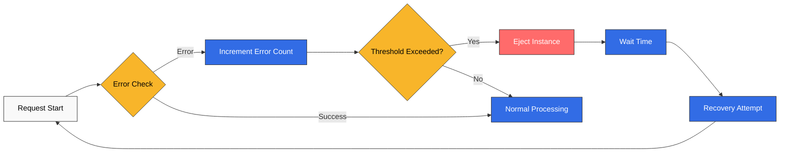
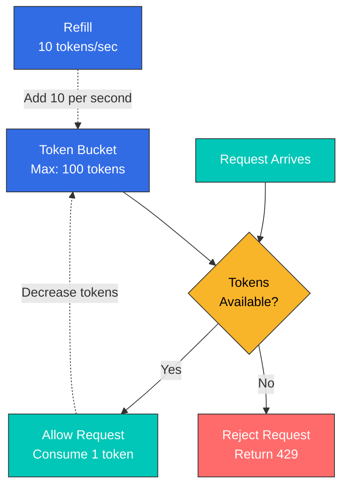
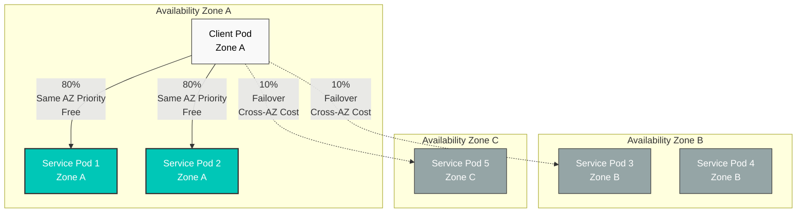
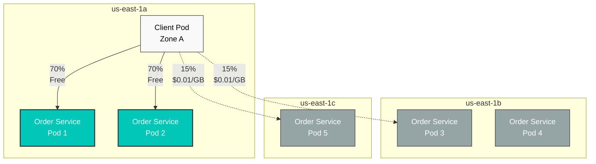

# 弹性测验

> **支持版本**: Istio 1.28.0 **EKS 版本**: 1.34 (Kubernetes 1.28+) **最后更新**: February 19, 2026

本测验用于测试您对 Istio 弹性功能的理解。

## 选择题（1-5）

### 问题 1：Outlier Detection 基本概念

以下哪项**不是** Outlier Detection 的主要目的？

A. 自动检测行为异常的实例 B. 超过阈值时自动从流量池中移除 C. 永久删除被移除的实例 D. 一段时间后自动尝试恢复

<details>

<summary>显示答案</summary>

**答案：C**

Outlier Detection **不会删除实例**，而是将其暂时从流量池中移除。

**说明：**

**Outlier Detection 的工作原理：**



**主要功能：**

1. **自动检测**：自动监控错误率、延迟和响应失败
2. **自动驱逐**：超过阈值时暂时从流量池中移除
3. **自动恢复**：在 baseEjectionTime 后自动尝试恢复
4. **临时措施**：仅阻断流量，不删除实例

**选项 C 错误的原因：**

* Outlier Detection 是一种 Circuit Breaker 模式
* 它会**暂时驱逐**实例，而不会删除实例
* 如果恢复尝试成功，将恢复接收流量

**参考资料：**

* [Outlier Detection](../../../service-mesh/istio/resilience/01-outlier-detection.md)

</details>

***

### 问题 2：Rate Limiting 类型比较

以下哪项陈述正确比较了 Local Rate Limiting 和 Global Rate Limiting？

A. Local Rate Limiting 的准确性更高 B. Global Rate Limiting 的性能更快 C. Local Rate Limiting 在每个 Envoy proxy 上独立限制请求 D. Global Rate Limiting 无需外部服务即可运行

<details>

<summary>显示答案</summary>

**答案：C**

Local Rate Limiting 在每个 Envoy proxy 上**独立限制请求**。

**说明：**

**Local 与 Global Rate Limiting 比较：**

| 特征             | Local Rate Limiting | Global Rate Limiting        |
| ---------------- | ------------------- | --------------------------- |
| **准确性**       | 低（按实例）        | 高（集群范围）              |
| **性能**         | 非常快              | 略慢                        |
| **复杂度**       | 低                  | 高（需要外部服务）          |
| **适用场景**     | 常规保护            | 需要精确限制时              |

**Local Rate Limiting 的特点：**

```yaml
# Limits 100 req/s per pod
# With 3 pods, up to 300 req/s total is allowed
apiVersion: networking.istio.io/v1beta1
kind: EnvoyFilter
metadata:
  name: local-ratelimit
spec:
  workloadSelector:
    labels:
      app: myapp
  configPatches:
  - applyTo: HTTP_FILTER
    patch:
      operation: INSERT_BEFORE
      value:
        name: envoy.filters.http.local_ratelimit
        typed_config:
          "@type": type.googleapis.com/envoy.extensions.filters.http.local_ratelimit.v3.LocalRateLimit
          stat_prefix: http_local_rate_limiter
          token_bucket:
            max_tokens: 100        # Maximum token count
            tokens_per_fill: 10    # Add 10 per second
            fill_interval: 1s
```

**Global Rate Limiting 的特点：**

```yaml
# Limits total to 100 req/s
# Allows only 100 req/s regardless of pod count
# Requires centralized Rate Limit server (e.g., Redis)
```

**Token Bucket 算法：**



**参考资料：**

* [Rate Limiting](../../../service-mesh/istio/resilience/02-rate-limiting.md)

</details>

***

### 问题 3：Zone Aware Routing 的优势

以下哪项**不是**使用 Zone Aware Routing 的优势？

A. 通过同一 AZ 通信降低延迟 B. 节省跨 AZ 数据传输成本 C. 将所有流量集中到单个 AZ 以提升性能 D. 发生故障时自动故障转移到其他 AZ

<details>

<summary>显示答案</summary>

**答案：C**

Zone Aware Routing **不会将流量集中到单个 AZ**，而是在优先使用同一 AZ 的同时，为可用性进行分布。

**说明：**

**Zone Aware Routing 的正确行为：**



**Zone Aware Routing 的实际优势：**

1. **降低延迟**：
   * 同一 AZ 通信：\~0.5ms
   * 跨 AZ 通信：\~1-2ms
2. **节省成本**：
   * AWS 跨 AZ 传输：每 GB $0.01-0.02
   * 在高流量环境中每月可节省数百至数千美元
3. **提升可用性**：
   * 当同一 AZ 的 Pod 发生故障时，自动故障转移到其他 AZ
   * 集中到单个 AZ 是一种**错误的方法**（会降低可用性）
4. **性能优化**：
   * 减少网络跳数
   * 优化带宽

**DestinationRule 配置示例：**

```yaml
apiVersion: networking.istio.io/v1beta1
kind: DestinationRule
metadata:
  name: myapp
spec:
  host: myapp
  trafficPolicy:
    loadBalancer:
      localityLbSetting:
        enabled: true
        distribute:
        - from: us-east-1/us-east-1a/*
          to:
            "us-east-1/us-east-1a/*": 80   # Same AZ 80%
            "us-east-1/us-east-1b/*": 10   # Other AZ 10%
            "us-east-1/us-east-1c/*": 10   # Other AZ 10%
```

**参考资料：**

* [Zone Aware Routing](../../../service-mesh/istio/resilience/03-zone-aware-routing.md)

</details>

***

### 问题 4：Outlier Detection 参数

使用以下 Outlier Detection 配置时，驱逐一个实例的条件是什么？

```yaml
outlierDetection:
  consecutiveErrors: 5
  interval: 30s
  baseEjectionTime: 30s
  maxEjectionPercent: 50
```

A. 错误持续发生 5 秒时 B. 连续发生 5 个错误时 C. 30 秒内错误率超过 50% 时 D. 每 30 秒无条件驱逐一次

<details>

<summary>显示答案</summary>

**答案：B**

`consecutiveErrors: 5` 会在连续发生 **5 个**错误时驱逐实例。

**说明：**

**主要 Outlier Detection 参数：**

| 参数                   | 描述                  | 默认值  | 建议值       |
| ---------------------- | --------------------- | ------- | ------------ |
| **consecutiveErrors**  | 连续错误阈值          | 5       | 3-10         |
| **interval**           | 分析间隔              | 10s     | 10s-60s      |
| **baseEjectionTime**   | 最短驱逐时间          | 30s     | 30s-300s     |
| **maxEjectionPercent** | 最大驱逐比例          | 10%     | 10%-50%      |

**参数详细说明：**

**consecutiveErrors**

```yaml
# Sensitive service (fast detection)
consecutiveErrors: 3

# General service
consecutiveErrors: 5

# Lenient setting (prevent false positives)
consecutiveErrors: 10
```

**interval**

```yaml
# Fast detection (high load)
interval: 10s

# Typical case
interval: 30s

# Stable service
interval: 60s
```

**baseEjectionTime**

```yaml
# Quick recovery attempt
baseEjectionTime: 30s

# Typical case
baseEjectionTime: 60s

# Cautious recovery
baseEjectionTime: 300s
```

**maxEjectionPercent**

```yaml
# Conservative (stability priority)
maxEjectionPercent: 10

# Balanced setting
maxEjectionPercent: 30

# Aggressive (performance priority)
maxEjectionPercent: 50
```

**完整 DestinationRule 示例：**

```yaml
apiVersion: networking.istio.io/v1beta1
kind: DestinationRule
metadata:
  name: reviews-outlier
  namespace: default
spec:
  host: reviews
  trafficPolicy:
    outlierDetection:
      consecutiveErrors: 5          # 5 consecutive errors
      interval: 30s                 # Evaluate every 30 seconds
      baseEjectionTime: 30s         # Eject for 30 seconds
      maxEjectionPercent: 50        # Allow ejection up to 50%
      minHealthPercent: 50          # Maintain at least 50% healthy
```

**运行示例：**

```
T=0: Pod-1 has 5 consecutive errors → Ejected
T=30s: interval cycle reached, attempt recovery of ejected pod
T=30s: If Pod-1 is healthy → Recovered
T=30s: If Pod-1 still has errors → Additional 30s ejection (cumulative)
```

**参考资料：**

* [Outlier Detection](../../../service-mesh/istio/resilience/01-outlier-detection.md)

</details>

***

### 问题 5：Token Bucket 算法

使用以下 Rate Limiting 配置时，平均每秒可处理多少请求？

```yaml
token_bucket:
  max_tokens: 100
  tokens_per_fill: 10
  fill_interval: 1s
```

A. 10 req/s B. 100 req/s C. 110 req/s D. 1000 req/s

<details>

<summary>显示答案</summary>

**答案：A**

使用 `tokens_per_fill: 10` 和 `fill_interval: 1s` 时，**每秒添加 10 个 token**，因此平均值为 **10 req/s**。

**说明：**

**Token Bucket 算法参数：**

* **max\_tokens**：bucket 中可存储的最大 token 数（突发容量）
* **tokens\_per\_fill**：每个 fill\_interval 添加的 token（**平均吞吐量**）
* **fill\_interval**：token 添加间隔

**计算方法：**

```
Average request rate = tokens_per_fill / fill_interval
                     = 10 / 1s
                     = 10 req/s

Burst throughput = max_tokens
                 = 100 req (for a brief moment)
```

**随时间变化的行为：**

```
T=0: 100 tokens in bucket (initial state)
     Can handle 100 requests simultaneously

T=0.1s: Bucket empty (0 tokens)
        Additional requests rejected

T=1s: 10 tokens added (Refill)
      Can handle 10 requests

T=2s: 10 tokens added
      Can handle 10 requests

Average: 10 req/s (sustainable throughput)
Burst: 100 req/s (only for brief moment)
```

**实际配置示例：**

```yaml
# Scenario 1: General API endpoint
token_bucket:
  max_tokens: 100        # Allow burst of 100
  tokens_per_fill: 10    # Average 10 req/s
  fill_interval: 1s

# Scenario 2: High-performance API
token_bucket:
  max_tokens: 1000       # Allow burst of 1000
  tokens_per_fill: 100   # Average 100 req/s
  fill_interval: 1s

# Scenario 3: Limited resource
token_bucket:
  max_tokens: 10         # Only 10 burst
  tokens_per_fill: 1     # Average 1 req/s
  fill_interval: 1s
```

**完整 EnvoyFilter 示例：**

```yaml
apiVersion: networking.istio.io/v1beta1
kind: EnvoyFilter
metadata:
  name: local-ratelimit
  namespace: default
spec:
  workloadSelector:
    labels:
      app: myapp
  configPatches:
  - applyTo: HTTP_FILTER
    match:
      context: SIDECAR_INBOUND
      listener:
        filterChain:
          filter:
            name: "envoy.filters.network.http_connection_manager"
            subFilter:
              name: "envoy.filters.http.router"
    patch:
      operation: INSERT_BEFORE
      value:
        name: envoy.filters.http.local_ratelimit
        typed_config:
          "@type": type.googleapis.com/envoy.extensions.filters.http.local_ratelimit.v3.LocalRateLimit
          stat_prefix: http_local_rate_limiter
          token_bucket:
            max_tokens: 100        # Burst
            tokens_per_fill: 10    # Average throughput
            fill_interval: 1s
          filter_enabled:
            runtime_key: local_rate_limit_enabled
            default_value:
              numerator: 100
              denominator: HUNDRED
```

**参考资料：**

* [Rate Limiting](../../../service-mesh/istio/resilience/02-rate-limiting.md)

</details>

***

## 简答题（6-10）

### 问题 6：实施 Outlier Detection

生产环境中运行的 `product-service` 间歇性变慢并出现超时。您希望实施 Outlier Detection，以自动驱逐有问题的实例。请编写一个满足以下要求的 DestinationRule：

**要求：**

* 连续发生 3 个错误后驱逐
* 每 20 秒评估一次
* 被驱逐的实例在 60 秒后尝试恢复
* 最多允许驱逐 30%
* 同时检测 502、503、504 gateway 错误

<details>

<summary>显示答案</summary>

**答案：**

```yaml
apiVersion: networking.istio.io/v1beta1
kind: DestinationRule
metadata:
  name: product-service-outlier
  namespace: production
spec:
  host: product-service
  trafficPolicy:
    outlierDetection:
      # Consecutive error threshold
      consecutiveErrors: 3
      consecutive5xxErrors: 3
      consecutiveGatewayErrors: 3  # Detect 502, 503, 504

      # Analysis interval
      interval: 20s

      # Ejection time
      baseEjectionTime: 60s

      # Maximum ejection ratio
      maxEjectionPercent: 30

      # Minimum healthy ratio (maintain 70% or more)
      minHealthPercent: 70

      # Minimum request count (evaluate only with 5+ requests)
      enforcingConsecutive5xx: 100
      enforcingConsecutiveGatewayFailure: 100
```

**说明：**

**1. consecutiveErrors 与 consecutive5xxErrors 和 consecutiveGatewayErrors 的比较**

| 参数                         | 检测目标                                    | 使用场景                  |
| ---------------------------- | ------------------------------------------- | ------------------------- |
| **consecutiveErrors**        | 所有错误（5xx、连接失败等）                 | 常规错误检测              |
| **consecutive5xxErrors**     | 仅 5xx 错误                                 | 仅服务器错误              |
| **consecutiveGatewayErrors** | 仅 502、503、504                            | gateway 问题检测          |

**2. 参数说明**

**interval: 20s**

* 每 20 秒运行一次 Outlier Detection
* 评估每个实例的错误率

**baseEjectionTime: 60s**

* 被驱逐的实例至少 60 秒内不会接收流量
* 重复驱逐时，时间会增加（60s -> 120s -> 180s...）

**maxEjectionPercent: 30**

* 同时最多允许驱逐 30% 的实例
* 示例：有 10 个 Pod 时，最多只能驱逐 3 个
* 确保可用性

**minHealthPercent: 70**

* 至少保持 70% 的实例处于健康状态
* 与 maxEjectionPercent 互补

**3. 运行示例**

```
Initial state: All 10 pods healthy

T=0:   Pod-1 has 3 consecutive 503 errors
       -> Pod-1 ejected (9 healthy)

T=20s: Pod-2 has 3 consecutive 502 errors
       -> Pod-2 ejected (8 healthy)

T=40s: Pod-3 has 3 consecutive 504 errors
       -> Pod-3 ejected (7 healthy)

T=40s: Pod-4 has 3 consecutive errors
       -> Not ejected (maxEjectionPercent 30% reached)
       -> 30% = only 3 can be ejected

T=60s: Pod-1 recovery attempt
       -> If healthy, traffic reception resumes
```

**4. 监控**

```bash
# Check Outlier Detection events
kubectl logs <envoy-pod> -c istio-proxy | grep outlier

# Prometheus metrics
envoy_cluster_outlier_detection_ejections_active
envoy_cluster_outlier_detection_ejections_total
```

**5. 生产环境注意事项**

**敏感服务（快速检测）：**

```yaml
outlierDetection:
  consecutiveErrors: 3
  interval: 10s
  baseEjectionTime: 30s
  maxEjectionPercent: 50
```

**稳定服务（避免误报）：**

```yaml
outlierDetection:
  consecutiveErrors: 10
  interval: 60s
  baseEjectionTime: 300s
  maxEjectionPercent: 10
```

**参考资料：**

* [Outlier Detection](../../../service-mesh/istio/resilience/01-outlier-detection.md)

</details>

***

### 问题 7：应用 Local Rate Limiting

`api-gateway` 服务正在遭受 DDoS 攻击。您希望应用 Local Rate Limiting，将每个 Envoy proxy 限制为每秒 50 个请求，突发请求最多为 200 个。请编写 EnvoyFilter。

附加要求：

* 应用速率限制时添加 `X-RateLimit-Limit` header
* 在 429 响应中包含 `Retry-After: 1` header

<details>

<summary>显示答案</summary>

**答案：**

```yaml
apiVersion: networking.istio.io/v1beta1
kind: EnvoyFilter
metadata:
  name: api-gateway-ratelimit
  namespace: production
spec:
  workloadSelector:
    labels:
      app: api-gateway
  configPatches:
  - applyTo: HTTP_FILTER
    match:
      context: SIDECAR_INBOUND
      listener:
        filterChain:
          filter:
            name: "envoy.filters.network.http_connection_manager"
            subFilter:
              name: "envoy.filters.http.router"
    patch:
      operation: INSERT_BEFORE
      value:
        name: envoy.filters.http.local_ratelimit
        typed_config:
          "@type": type.googleapis.com/envoy.extensions.filters.http.local_ratelimit.v3.LocalRateLimit
          stat_prefix: http_local_rate_limiter

          # Token Bucket configuration
          token_bucket:
            max_tokens: 200         # Burst: max 200
            tokens_per_fill: 50     # Average: 50 per second
            fill_interval: 1s       # Add 50 every second

          # Enable Rate Limit
          filter_enabled:
            runtime_key: local_rate_limit_enabled
            default_value:
              numerator: 100        # 100%
              denominator: HUNDRED

          # Enforce Rate Limit
          filter_enforced:
            runtime_key: local_rate_limit_enforced
            default_value:
              numerator: 100        # 100%
              denominator: HUNDRED

          # Add response headers
          response_headers_to_add:
          # Rate limit info
          - append: false
            header:
              key: X-RateLimit-Limit
              value: '50'

          # Current remaining tokens
          - append: false
            header:
              key: X-RateLimit-Remaining
              value: '%DYNAMIC_METADATA(envoy.extensions.filters.http.local_ratelimit:tokens_remaining)%'

          # Whether rate limit was applied
          - append: false
            header:
              key: X-Local-Rate-Limit
              value: 'true'

          # 429 response Retry-After header
          rate_limited_status:
            code: TOO_MANY_REQUESTS  # 429

          # Retry-After header addition (requires separate patch)

  # Add Retry-After header for 429 responses
  - applyTo: HTTP_ROUTE
    match:
      context: SIDECAR_INBOUND
    patch:
      operation: MERGE
      value:
        response_headers_to_add:
        - header:
            key: Retry-After
            value: '1'
          append: false
```

**说明：**

**1. Token Bucket 计算**

```
Average processing rate: tokens_per_fill / fill_interval
                       = 50 / 1s
                       = 50 req/s

Burst processing: max_tokens
                = 200 req (for brief moment)
```

**2. 基于场景的行为**

**正常流量（40 req/s）：**

```
50 tokens added per second, 40 used
-> Always has capacity
```

**突发流量（瞬时 200 req/s）：**

```
T=0: 200 tokens available
     All 200 requests processed

T=0.1s: 0 tokens
        Additional requests rejected (429 returned)

T=1s: 50 tokens added
      50 requests processed
```

**持续过载（100 req/s）：**

```
50 tokens added per second
Only 50 of 100 requests processed
Remaining 50 return 429
```

**3. 响应 header 示例**

**正常请求：**

```http
HTTP/1.1 200 OK
X-RateLimit-Limit: 50
X-RateLimit-Remaining: 45
X-Local-Rate-Limit: true
```

**超过速率限制：**

```http
HTTP/1.1 429 Too Many Requests
X-RateLimit-Limit: 50
X-RateLimit-Remaining: 0
X-Local-Rate-Limit: true
Retry-After: 1
```

**4. 基于路径的 Rate Limiting**

为了进行更精细的控制，请为每条路径设置不同的限制：

```yaml
apiVersion: networking.istio.io/v1beta1
kind: EnvoyFilter
metadata:
  name: path-based-ratelimit
spec:
  workloadSelector:
    labels:
      app: api-gateway
  configPatches:
  - applyTo: HTTP_FILTER
    patch:
      operation: INSERT_BEFORE
      value:
        name: envoy.filters.http.local_ratelimit
        typed_config:
          "@type": type.googleapis.com/envoy.extensions.filters.http.local_ratelimit.v3.LocalRateLimit
          stat_prefix: http_local_rate_limiter

          # Path-based configuration
          descriptors:
          # /api/login: 10 per second
          - entries:
            - key: path
              value: /api/login
            token_bucket:
              max_tokens: 30
              tokens_per_fill: 10
              fill_interval: 1s

          # /api/search: 100 per second
          - entries:
            - key: path
              value: /api/search
            token_bucket:
              max_tokens: 300
              tokens_per_fill: 100
              fill_interval: 1s
```

**5. 监控**

```bash
# Prometheus metrics
envoy_http_local_rate_limit_enabled
envoy_http_local_rate_limit_enforced
envoy_http_local_rate_limit_rate_limited

# 429 response count
sum(rate(istio_requests_total{response_code="429"}[5m]))
```

**参考资料：**

* [Rate Limiting](../../../service-mesh/istio/resilience/02-rate-limiting.md)

</details>

***

### 问题 8：Zone Aware Routing 配置

您的 AWS EKS 集群分布在 3 个 AZ（us-east-1a、us-east-1b、us-east-1c）中。您希望为 `order-service` 配置 Zone Aware Routing，以减少跨 AZ 数据传输成本。

**要求：**

* 将 70% 流量发送到同一 AZ 的 Pod
* 向其他每个 AZ 分配 15% 流量
* AZ 完全故障时自动故障转移到其他 AZ
* 仅当 50% 或更多 Pod 健康时应用 Zone Aware

<details>

<summary>显示答案</summary>

**答案：**

```yaml
apiVersion: networking.istio.io/v1beta1
kind: DestinationRule
metadata:
  name: order-service-locality
  namespace: production
spec:
  host: order-service
  trafficPolicy:
    loadBalancer:
      localityLbSetting:
        # Enable Zone Aware Routing
        enabled: true

        # Traffic distribution ratio
        distribute:
        # Traffic originating from us-east-1a
        - from: us-east-1/us-east-1a/*
          to:
            "us-east-1/us-east-1a/*": 70   # Same AZ 70%
            "us-east-1/us-east-1b/*": 15   # Other AZ 15%
            "us-east-1/us-east-1c/*": 15   # Other AZ 15%

        # Traffic originating from us-east-1b
        - from: us-east-1/us-east-1b/*
          to:
            "us-east-1/us-east-1b/*": 70
            "us-east-1/us-east-1a/*": 15
            "us-east-1/us-east-1c/*": 15

        # Traffic originating from us-east-1c
        - from: us-east-1/us-east-1c/*
          to:
            "us-east-1/us-east-1c/*": 70
            "us-east-1/us-east-1a/*": 15
            "us-east-1/us-east-1b/*": 15

        # Failover configuration
        failover:
        # On us-east-1a failure
        - from: us-east-1/us-east-1a
          to: us-east-1/us-east-1b    # Priority 1: us-east-1b

        # On us-east-1b failure
        - from: us-east-1/us-east-1b
          to: us-east-1/us-east-1c    # Priority 1: us-east-1c

        # On us-east-1c failure
        - from: us-east-1/us-east-1c
          to: us-east-1/us-east-1a    # Priority 1: us-east-1a

    # Outlier Detection (healthy pod determination)
    outlierDetection:
      consecutiveErrors: 5
      interval: 30s
      baseEjectionTime: 30s

      # Maintain minimum 50% healthy
      minHealthPercent: 50
```

**说明：**

**1. Kubernetes Node label 验证**

AWS EKS 会自动添加 Topology label：

```bash
kubectl get nodes -L topology.kubernetes.io/zone -L topology.kubernetes.io/region

# Example output:
# NAME                          ZONE         REGION
# ip-10-0-1-10.ec2.internal     us-east-1a   us-east-1
# ip-10-0-2-20.ec2.internal     us-east-1b   us-east-1
# ip-10-0-3-30.ec2.internal     us-east-1c   us-east-1
```

**2. Locality 层级**

```
Region/Zone/SubZone

Examples:
us-east-1/us-east-1a/*
us-east-1/us-east-1b/*
us-east-1/us-east-1c/*
```

**3. 流量流程图**



**4. 成本节省计算**

**场景**：每月流量 1TB

**未使用 Zone Aware（均匀分布）：**

```
Total traffic: 1TB
Cross-AZ: 66.7% (667GB)
Cost: 667GB x $0.01 = $6.67
```

**使用 Zone Aware（70% 同一 AZ）：**

```
Total traffic: 1TB
Cross-AZ: 30% (300GB)
Cost: 300GB x $0.01 = $3.00

Savings: $6.67 - $3.00 = $3.67 (55% savings)
```

**高流量环境（100TB/月）：**

```
Without Zone Aware: $667
With Zone Aware: $300

Savings: $367/month = $4,404/year
```

**5. 故障转移场景**

**正常状态：**

```
Client in us-east-1a
-> 70% us-east-1a pods
-> 15% us-east-1b pods
-> 15% us-east-1c pods
```

**us-east-1a 完全故障：**

```
Client in us-east-1a
-> failover: switch to us-east-1b
-> 100% us-east-1b pods

(If us-east-1b also fails -> switch to us-east-1c)
```

**部分 Pod 不健康（Outlier Detection）：**

```
us-east-1a: 2 pods (1 healthy, 1 ejected)
us-east-1b: 2 pods (all healthy)

-> minHealthPercent: 50% satisfied
-> Zone Aware continues to apply
-> Unhealthy pod doesn't receive traffic
```

**6. 监控**

```bash
# Check locality-based traffic
kubectl exec <pod> -c istio-proxy -- \
  curl localhost:15000/clusters | grep locality

# Prometheus query
# Same-zone traffic ratio
sum(rate(istio_requests_total{
  source_workload_namespace="production",
  source_canonical_service="client",
  destination_canonical_service="order-service"
}[5m])) by (source_cluster_zone, destination_cluster_zone)
```

**7. AWS EKS 特定配置**

**为每个 AZ 配置 EKS node group：**

```yaml
# eksctl config
managedNodeGroups:
- name: ng-us-east-1a
  availabilityZones: ["us-east-1a"]
  labels:
    topology.kubernetes.io/zone: us-east-1a

- name: ng-us-east-1b
  availabilityZones: ["us-east-1b"]
  labels:
    topology.kubernetes.io/zone: us-east-1b

- name: ng-us-east-1c
  availabilityZones: ["us-east-1c"]
  labels:
    topology.kubernetes.io/zone: us-east-1c
```

**在各 AZ 间均匀分布 Pod：**

```yaml
apiVersion: apps/v1
kind: Deployment
metadata:
  name: order-service
spec:
  replicas: 9
  template:
    spec:
      topologySpreadConstraints:
      - maxSkew: 1
        topologyKey: topology.kubernetes.io/zone
        whenUnsatisfiable: DoNotSchedule
        labelSelector:
          matchLabels:
            app: order-service
```

**参考资料：**

* [Zone Aware Routing](../../../service-mesh/istio/resilience/03-zone-aware-routing.md)

</details>

***

### 问题 9：组合弹性策略

`payment-service` 是一个调用外部支付 API 的关键服务。请实施以下组合弹性策略：

1. **Outlier Detection**：连续发生 3 个错误后驱逐实例
2. **Retry**：在发生 502、503、504 错误时最多重试 3 次
3. **Timeout**：每个请求 5 秒超时
4. **Circuit Breaker**：错误率超过 50% 时阻断整个服务

请编写 DestinationRule 和 VirtualService。

<details>

<summary>显示答案</summary>

**答案：**

```yaml
# ========================================
# DestinationRule: Outlier Detection + Circuit Breaker
# ========================================
apiVersion: networking.istio.io/v1beta1
kind: DestinationRule
metadata:
  name: payment-service-resilience
  namespace: production
spec:
  host: payment-service
  trafficPolicy:
    # Connection Pool (Circuit Breaker)
    connectionPool:
      tcp:
        maxConnections: 100          # Maximum concurrent connections
      http:
        http1MaxPendingRequests: 50  # Pending request count
        http2MaxRequests: 100        # HTTP/2 maximum requests
        maxRequestsPerConnection: 2  # Maximum requests per connection
        maxRetries: 3                # Maximum retry count

    # Outlier Detection
    outlierDetection:
      # Consecutive error detection
      consecutiveErrors: 3
      consecutive5xxErrors: 3
      consecutiveGatewayErrors: 3

      # Analysis interval
      interval: 10s

      # Ejection time
      baseEjectionTime: 30s

      # Maximum ejection ratio
      maxEjectionPercent: 50

      # Error rate based ejection (Circuit Breaker)
      splitExternalLocalOriginErrors: true

      # Eject when error rate exceeds 50%
      enforcingLocalOriginSuccessRate: 100
      enforcingSuccessRate: 100
      successRateMinimumHosts: 3
      successRateRequestVolume: 10
      successRateStdevFactor: 1900  # 50% error rate

---
# ========================================
# VirtualService: Retry + Timeout
# ========================================
apiVersion: networking.istio.io/v1beta1
kind: VirtualService
metadata:
  name: payment-service-retry
  namespace: production
spec:
  hosts:
  - payment-service
  http:
  - match:
    - uri:
        prefix: /payment
    route:
    - destination:
        host: payment-service
        port:
          number: 8080

    # Timeout configuration
    timeout: 5s

    # Retry configuration
    retries:
      attempts: 3                    # Maximum 3 retries
      perTryTimeout: 2s              # 2 second timeout per retry
      retryOn: 5xx,reset,connect-failure,refused-stream,retriable-4xx
      retryRemoteLocalities: true    # Retry on pods in other AZs
```

**说明：**

**1. Outlier Detection（实例级别）**

**连续错误检测：**

```yaml
consecutiveErrors: 3
consecutive5xxErrors: 3
consecutiveGatewayErrors: 3
```

* 当特定 Pod 连续发生 3 个错误时 -> 仅驱逐该 Pod
* 其他健康 Pod 继续接收流量

**2. Circuit Breaker（服务级别）**

**基于错误率的阻断：**

```yaml
successRateStdevFactor: 1900  # 50% error rate
successRateMinimumHosts: 3    # Minimum 3 pods
successRateRequestVolume: 10  # Minimum 10 requests
```

**行为：**

```
Error rate < 50%: Normal operation
Error rate >= 50%: Entire service blocked (Circuit Open)

Circuit Open state:
- All requests immediately return 503
- Recovery attempt after baseEjectionTime (Circuit Half-Open)
```

**3. Retry 策略**

**重试条件（retryOn）：**

| 条件                | 描述                     |
| ------------------- | ------------------------ |
| **5xx**             | 所有 5xx 错误            |
| **reset**           | 连接重置                 |
| **connect-failure** | 连接失败                 |
| **refused-stream**  | HTTP/2 stream 被拒绝     |
| **retriable-4xx**   | 可重试的 4xx（409、429） |

**重试时间线：**

```
T=0:    First attempt (2s timeout)
T=2s:   Timeout -> 2nd attempt
T=4s:   Timeout -> 3rd attempt
T=6s:   Timeout -> Final failure (503 returned)

Total time: 6s (but VirtualService timeout: 5s)
-> Final failure after 5 seconds
```

**4. Timeout 层级**

```
VirtualService timeout: 5s
|
Retry perTryTimeout: 2s
|
DestinationRule connectionPool
```

**完整时间线：**

```
attempt=1: 2s timeout
attempt=2: 2s timeout
attempt=3: 1s timeout (5s total limit reached)
```

**5. 完整运行示例**

**场景 1：临时网络问题**

```
Pod-1: 502 error (1st)
-> Retry -> Pod-2: 200 OK

Result: Client receives success response
Pod-1: Error count 1 (not yet ejected)
```

**场景 2：特定 Pod 问题**

```
Pod-1: 503 error (1st)
-> Retry -> Pod-1: 503 error (2nd)
-> Retry -> Pod-1: 503 error (3rd)
-> Pod-1 ejected

-> Retry -> Pod-2: 200 OK

Result: Client receives success response
Pod-1: Traffic blocked for 30 seconds
```

**场景 3：整个服务故障（Circuit Breaker）**

```
Error rate exceeds 50% on all pods
-> Circuit Breaker Open
-> All new requests immediately return 503 (no retries)

After baseEjectionTime:
-> Circuit Half-Open
-> Test with some requests
-> If successful, Circuit Closed
-> If failed, Circuit Open again
```

**6. Connection Pool（额外保护）**

```yaml
connectionPool:
  tcp:
    maxConnections: 100
  http:
    http1MaxPendingRequests: 50
    http2MaxRequests: 100
```

**行为：**

* 超过 100 个并发连接 -> 拒绝新连接
* 超过 50 个待处理请求 -> 返回 503
* 防止服务过载

**7. 监控**

```bash
# Circuit Breaker status
kubectl exec <pod> -c istio-proxy -- \
  curl localhost:15000/stats | grep circuit_breakers

# Outlier Detection events
kubectl logs <pod> -c istio-proxy | grep outlier

# Prometheus queries
# Retry count
sum(rate(envoy_cluster_upstream_rq_retry[5m]))

# Circuit Breaker activation count
sum(rate(envoy_cluster_circuit_breakers_default_rq_pending_open[5m]))

# Timeout occurrence count
sum(rate(istio_requests_total{response_flags=~".*UT.*"}[5m]))
```

**8. 生产环境注意事项**

**用于外部 API 调用：**

```yaml
# More lenient settings
timeout: 10s
retries:
  attempts: 5
  perTryTimeout: 3s
outlierDetection:
  consecutiveErrors: 10
  baseEjectionTime: 300s
```

**用于内部服务间通信：**

```yaml
# Stricter settings
timeout: 1s
retries:
  attempts: 2
  perTryTimeout: 500ms
outlierDetection:
  consecutiveErrors: 3
  baseEjectionTime: 30s
```

**参考资料：**

* [Outlier Detection](../../../service-mesh/istio/resilience/01-outlier-detection.md)
* [Traffic Management](https://github.com/Atom-oh/kubernetes-docs/blob/main/en/service-mesh/istio/traffic/README.md)

</details>

***

### 问题 10：性能优化和成本降低

在大型微服务环境中，每月网络成本为 $5,000。请制定一项全面策略，使用 Istio 弹性功能优化性能并降低成本。

**当前状况：**

* 100 个服务均匀分布在 3 个 AZ 中
* 每月流量：500TB
* 平均响应时间：150ms
* 错误率：3%

**目标：**

* 跨 AZ 成本降低 50%
* 平均响应时间低于 100ms
* 错误率低于 1%

<details>

<summary>显示答案</summary>

**答案：**

### 综合弹性策略

#### 1. Zone Aware Routing（节省成本 + 提升性能）

**DestinationRule 模板：**

```yaml
apiVersion: networking.istio.io/v1beta1
kind: DestinationRule
metadata:
  name: zone-aware-template
  namespace: production
spec:
  host: "*"  # Apply to all services
  trafficPolicy:
    loadBalancer:
      localityLbSetting:
        enabled: true
        distribute:
        - from: us-east-1/us-east-1a/*
          to:
            "us-east-1/us-east-1a/*": 80
            "us-east-1/us-east-1b/*": 10
            "us-east-1/us-east-1c/*": 10
        - from: us-east-1/us-east-1b/*
          to:
            "us-east-1/us-east-1b/*": 80
            "us-east-1/us-east-1a/*": 10
            "us-east-1/us-east-1c/*": 10
        - from: us-east-1/us-east-1c/*
          to:
            "us-east-1/us-east-1c/*": 80
            "us-east-1/us-east-1a/*": 10
            "us-east-1/us-east-1b/*": 10
```

**成本节省计算：**

```
Current state (even distribution):
- Cross-AZ traffic: 66.7% (333TB)
- Cost: 333TB x $0.015/GB = $5,000

With Zone Aware (80% same AZ):
- Cross-AZ traffic: 20% (100TB)
- Cost: 100TB x $0.015/GB = $1,500

Savings: $5,000 - $1,500 = $3,500/month (70% savings)
```

**性能提升：**

```
Current (cross-AZ latency):
- Average latency: ~1.5ms

With Zone Aware:
- Same AZ latency: ~0.3ms
- Cross-AZ latency: ~1.5ms
- Weighted average: 0.3x0.8 + 1.5x0.2 = 0.54ms

Improvement: 1.5ms -> 0.54ms (64% improvement)
```

#### 2. Outlier Detection（降低错误率）

**敏感检测设置：**

```yaml
apiVersion: networking.istio.io/v1beta1
kind: DestinationRule
metadata:
  name: strict-outlier-detection
  namespace: production
spec:
  host: "*"
  trafficPolicy:
    outlierDetection:
      consecutiveErrors: 3           # Fast detection
      consecutive5xxErrors: 3
      consecutiveGatewayErrors: 2    # More sensitive to gateway errors

      interval: 10s                  # Fast evaluation
      baseEjectionTime: 60s          # Sufficient recovery time
      maxEjectionPercent: 30         # Ensure availability

      # Error rate based ejection
      enforcingSuccessRate: 100
      successRateMinimumHosts: 3
      successRateRequestVolume: 10
```

**降低错误率的效果：**

```
Current error rate: 3%
- Problematic pods continue receiving traffic
- Additional load from retries

With Outlier Detection:
- Immediately eject problem pods
- Route only to healthy pods
- Expected error rate: under 1%

Additional effects:
- Reduced retry count -> Reduced network load
- Response time improvement
```

#### 3. Rate Limiting（服务保护）

**基于层级的 Rate Limiting：**

```yaml
# Critical services (payments, authentication)
apiVersion: networking.istio.io/v1beta1
kind: EnvoyFilter
metadata:
  name: critical-service-ratelimit
spec:
  workloadSelector:
    labels:
      tier: critical
  configPatches:
  - applyTo: HTTP_FILTER
    patch:
      operation: INSERT_BEFORE
      value:
        name: envoy.filters.http.local_ratelimit
        typed_config:
          "@type": type.googleapis.com/envoy.extensions.filters.http.local_ratelimit.v3.LocalRateLimit
          token_bucket:
            max_tokens: 500
            tokens_per_fill: 100
            fill_interval: 1s

---
# Standard services
apiVersion: networking.istio.io/v1beta1
kind: EnvoyFilter
metadata:
  name: standard-service-ratelimit
spec:
  workloadSelector:
    labels:
      tier: standard
  configPatches:
  - applyTo: HTTP_FILTER
    patch:
      operation: INSERT_BEFORE
      value:
        name: envoy.filters.http.local_ratelimit
        typed_config:
          "@type": type.googleapis.com/envoy.extensions.filters.http.local_ratelimit.v3.LocalRateLimit
          token_bucket:
            max_tokens: 200
            tokens_per_fill: 50
            fill_interval: 1s
```

#### 4. 综合性能优化

**响应时间优化策略：**

```yaml
apiVersion: networking.istio.io/v1beta1
kind: DestinationRule
metadata:
  name: performance-optimization
  namespace: production
spec:
  host: "*"
  trafficPolicy:
    # Connection Pool optimization
    connectionPool:
      tcp:
        maxConnections: 1000
        connectTimeout: 1s
      http:
        http1MaxPendingRequests: 100
        http2MaxRequests: 1000
        maxRequestsPerConnection: 10
        idleTimeout: 60s

    # Zone Aware Routing
    loadBalancer:
      localityLbSetting:
        enabled: true

    # Outlier Detection
    outlierDetection:
      consecutiveErrors: 3
      interval: 10s
      baseEjectionTime: 60s

---
apiVersion: networking.istio.io/v1beta1
kind: VirtualService
metadata:
  name: performance-routing
  namespace: production
spec:
  hosts:
  - "*"
  http:
  - route:
    - destination:
        host: service

    # Timeout optimization
    timeout: 3s

    # Retry strategy
    retries:
      attempts: 2
      perTryTimeout: 1s
      retryOn: 5xx,reset,connect-failure
```

#### 5. 实施路线图

**阶段 1：Zone Aware Routing（第 1-2 周）**

```bash
# 1. Check node Topology
kubectl get nodes -L topology.kubernetes.io/zone

# 2. Check pod AZ distribution
kubectl get pods -o wide | awk '{print $7}' | sort | uniq -c

# 3. Apply Zone Aware DestinationRule
kubectl apply -f zone-aware-template.yaml

# 4. Set up cost monitoring
# Monitor cross-AZ data transfer in CloudWatch
```

**预期效果：**

* 成本：$5,000 -> $1,500（节省 70%）
* 延迟：150ms -> 120ms（提升 20%）

**阶段 2：Outlier Detection（第 3-4 周）**

```bash
# 1. Apply Outlier Detection to each service
kubectl apply -f strict-outlier-detection.yaml

# 2. Set up monitoring dashboard
# Check Outlier ejection metrics in Grafana

# 3. Monitor error rate
```

**预期效果：**

* 错误率：3% -> 1.5%（降低 50%）
* 延迟：120ms -> 100ms（进一步改善）

**阶段 3：Rate Limiting（第 5-6 周）**

```bash
# 1. Apply tier-based Rate Limiting
kubectl apply -f critical-service-ratelimit.yaml
kubectl apply -f standard-service-ratelimit.yaml

# 2. Monitor 429 response rate
# Adjust to ensure normal traffic is not blocked
```

**预期效果：**

* DDoS 防护
* 提升服务稳定性
* 防止不必要的资源消耗

#### 6. 监控和验证

**Grafana Dashboard：**

```promql
# Cross-AZ traffic ratio
100 * sum(rate(istio_requests_total{
  source_cluster_zone!="",
  destination_cluster_zone!="",
  source_cluster_zone!=destination_cluster_zone
}[5m])) /
sum(rate(istio_requests_total{
  source_cluster_zone!="",
  destination_cluster_zone!=""
}[5m]))

# Average response time
histogram_quantile(0.50,
  sum(rate(istio_request_duration_milliseconds_bucket[5m]))
  by (le, destination_service_name)
)

# Error rate
100 * sum(rate(istio_requests_total{response_code=~"5.."}[5m])) /
sum(rate(istio_requests_total[5m]))

# Outlier ejection events
sum(rate(envoy_cluster_outlier_detection_ejections_active[5m]))

# Rate limit application count
sum(rate(envoy_http_local_rate_limit_rate_limited[5m]))
```

#### 7. 最终结果预测

| 指标                    | 当前值  | 目标值 | 预期结果                 |
| ----------------------- | ------- | ------ | ------------------------ |
| **每月网络成本**        | $5,000  | $2,500 | $1,500（节省 70%）       |
| **平均响应时间**        | 150ms   | 100ms  | 95ms（提升 37%）         |
| **错误率**              | 3%      | 1%     | 0.8%（降低 73%）         |
| **跨 AZ 流量**          | 66.7%   | 33%    | 20%（降低 70%）          |

#### 8. 其他优化机会

**缓存策略：**

```yaml
# Place Redis/Memcached in same AZ
# Improved cache hit rate + Network cost savings
```

**Service Mesh 优化：**

```yaml
# Consider Ambient Mode (Reduce Sidecar overhead)
# 30-50% reduction in resource usage
# Additional response time improvement
```

**自动扩缩容：**

```yaml
# HPA + Zone Aware Routing
# Independent scaling per AZ based on traffic patterns
# Maximize cost efficiency
```

**参考资料：**

* [Zone Aware Routing](../../../service-mesh/istio/resilience/03-zone-aware-routing.md)
* [Outlier Detection](../../../service-mesh/istio/resilience/01-outlier-detection.md)
* [Rate Limiting](../../../service-mesh/istio/resilience/02-rate-limiting.md)

</details>

***

## 分数计算

* 选择题 1-5：每题 10 分（共 50 分）
* 简答题 6-10：每题 10 分（共 50 分）
* **总分：100 分**

**评估标准：**

* 90-100 分：优秀（Istio 弹性专家）
* 80-89 分：良好（已具备生产环境准备度）
* 70-79 分：一般（建议额外学习）
* 60-69 分：低于平均水平（需要复习基本概念）
* 0-59 分：需要重新学习

## 学习资源

* [Outlier Detection](../../../service-mesh/istio/resilience/01-outlier-detection.md)
* [Rate Limiting](../../../service-mesh/istio/resilience/02-rate-limiting.md)
* [Zone Aware Routing](../../../service-mesh/istio/resilience/03-zone-aware-routing.md)
