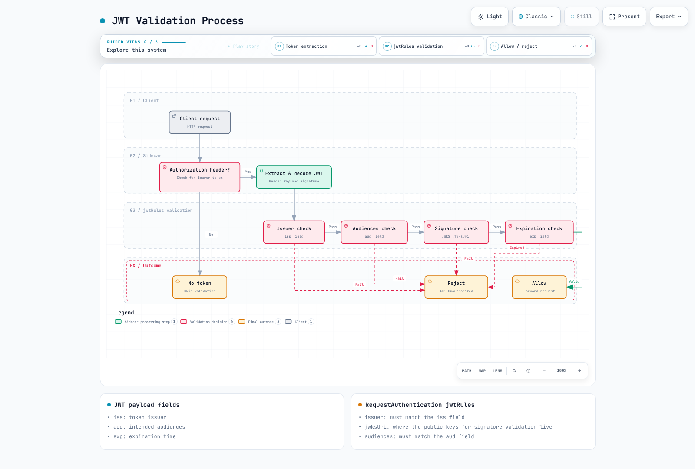

# 安全测验

> **最后更新**：2026 年 9 月 11 日 · Istio 1.31 · Kubernetes 1.32–1.36（EKS 标准支持：1.34–1.36）。参阅[安装矩阵](../../../service-mesh/istio/01-installation.md)。

本测验使用 Sidecar 示例检验 Istio 安全知识。每题是独立场景；不要将每个 ALLOW 策略组合到同一工作负载。Ambient 的 HTTP/JWT 策略需要 waypoint `targetRefs`，且不支持 PeerAuthentication `DISABLE`。命名工作负载、ServiceAccount、端口和身份必须匹配实际部署。

## 选择题（1-5）

### 问题 1：PeerAuthentication 模式

哪项正确描述 PeerAuthentication 中的 **PERMISSIVE** mTLS 模式？

A. 同时允许 mTLS 和明文流量\
B. 仅允许 mTLS，拒绝明文\
C. 拒绝所有流量\
D. 禁用 mTLS

<details>

<summary>显示答案</summary>

**答案：A**

PERMISSIVE 模式**同时允许 mTLS 和明文流量**，支持渐进迁移。

**解释：**

**PeerAuthentication mTLS 模式：**

| 模式 | 描述 | 使用场景 |
| -------------- | ------------------------------ | ------------------------------------- |
| **PERMISSIVE** | 同时允许 mTLS + 明文 | 渐进迁移、混合环境 |
| **STRICT** | 仅允许 mTLS | 生产安全加固 |
| **DISABLE** | 在所选接收方禁用网格 mTLS | 明确的旧系统例外 |

**PERMISSIVE 模式示例：**

```yaml
apiVersion: security.istio.io/v1
kind: PeerAuthentication
metadata:
  name: default
  namespace: istio-system
spec:
  mtls:
    mode: PERMISSIVE  # Allows both mTLS + plaintext
```

**行为：**

```
Client A (Istio Sidecar) -> [mTLS] -> Server (PERMISSIVE)  Allowed
Client B (No Sidecar)    -> [Plaintext] -> Server (PERMISSIVE)  Allowed
```

**与 STRICT 模式比较：**

```yaml
apiVersion: security.istio.io/v1
kind: PeerAuthentication
metadata:
  name: strict-mtls
  namespace: production
spec:
  mtls:
    mode: STRICT  # Only allows mTLS
```

```
Client A (Istio Sidecar) -> [mTLS] -> Server (STRICT)  Allowed
Client B (No Sidecar)    -> [Plaintext] -> Server (STRICT)  Rejected
```

**迁移策略：**

```
Step 1: PERMISSIVE (Allow mixed traffic)
  |
Step 2: Inject Sidecars to all services
  |
Step 3: STRICT (Enforce mTLS)
```

**参考资料：**

* [PeerAuthentication](../../../service-mesh/istio/security/01-mtls.md)
* [mTLS](../../../service-mesh/istio/security/01-mtls.md)

</details>

***

### 问题 2：AuthorizationPolicy 操作

如果这是唯一选择其命名空间内工作负载的 AuthorizationPolicy，它意味着什么？

```yaml
apiVersion: security.istio.io/v1
kind: AuthorizationPolicy
metadata:
  name: deny-all
spec:
  {}
```

A. 允许所有请求\
B. 拒绝所有请求\
C. 不应用任何策略\
D. 仅允许 mTLS

<details>

<summary>显示答案</summary>

**答案：B**

空 spec 默认为没有匹配规则的 ALLOW，因此仅此策略会**拒绝所有请求**。其他匹配 ALLOW 策略可提供例外；显式 DENY-all 不能被 ALLOW 覆盖。

**解释：**

**AuthorizationPolicy 默认行为：**

1. **不存在策略**：允许所有请求
2. **空 spec（如示例）**：拒绝所有请求
3. **有规则**：根据规则允许/拒绝

**默认拒绝模式：**

```yaml
# Step 1: Deny all requests
apiVersion: security.istio.io/v1
kind: AuthorizationPolicy
metadata:
  name: deny-all
  namespace: default
spec: {}  # Empty spec = deny all requests

---
# Step 2: Selectively allow only what's needed
apiVersion: security.istio.io/v1
kind: AuthorizationPolicy
metadata:
  name: allow-frontend
  namespace: default
spec:
  selector:
    matchLabels:
      app: backend
  action: ALLOW
  rules:
  - from:
    - source:
        principals: ["cluster.local/ns/default/sa/frontend"]
    to:
    - operation:
        methods: ["GET", "POST"]
```

**评估顺序：** CUSTOM → DENY → ALLOW。匹配的 CUSTOM 提供程序必须允许请求；随后任何匹配 DENY 都会拒绝。如果存在适用 ALLOW 策略，至少一条规则必须匹配。没有适用 ALLOW 策略时，此阶段允许请求。规则和 ALLOW 策略形成并集，不是依次增加限制的有序列表。AUDIT 为配置的审计插件标记匹配请求；不是第四个执行阶段，也不会自行记录日志。

**实际示例：**

```yaml
# Scenario: Restrict HTTP methods
---
# DENY: Prohibit DELETE
apiVersion: security.istio.io/v1
kind: AuthorizationPolicy
metadata:
  name: deny-delete
spec:
  selector:
    matchLabels:
      app: backend
  action: DENY
  rules:
  - to:
    - operation:
        methods: ["DELETE"]

---
# ALLOW: Only allow GET, POST
apiVersion: security.istio.io/v1
kind: AuthorizationPolicy
metadata:
  name: allow-read-write
spec:
  selector:
    matchLabels:
      app: backend
  action: ALLOW
  rules:
  - from:
    - source:
        principals: ["cluster.local/ns/default/sa/frontend"]
    to:
    - operation:
        methods: ["GET", "POST"]
```

**测试：** 从使用 ServiceAccount `frontend` 的网格内 frontend 工作负载运行；配置后端 HTTP 协议/端口检测。

```bash
# GET request -> Matches ALLOW policy -> Allowed
curl http://backend/api

# POST request -> Matches ALLOW policy -> Allowed
curl -X POST http://backend/api

# DELETE request -> Matches DENY policy -> Rejected
curl -X DELETE http://backend/api

# PUT request -> No ALLOW policy match -> Rejected
curl -X PUT http://backend/api
```

**参考资料：**

* [授权策略](../../../service-mesh/istio/security/03-authorization.md)

</details>

***

### 问题 3：JWT 身份验证

RequestAuthentication 使用哪些字段验证 JWT 令牌？

A. issuer 和 audiences\
B. principals 和 namespaces\
C. methods 和 paths\
D. hosts 和 ports

<details>

<summary>显示答案</summary>

**答案：A**

RequestAuthentication 使用 **issuer** 和 **audiences** 字段验证 JWT 令牌。

**解释：**

令牌存在时，必须通过签名、签发者、受众和时间检查。仅 RequestAuthentication 接受缺失令牌；AuthorizationPolicy 必须要求 `requestPrincipals`。下方时间戳是已过期的历史示意，不是可用令牌。

**JWT 令牌结构：**

```
Header.Payload.Signature

Payload example:
{
  "iss": "https://auth.example.com",        # issuer
  "sub": "user@example.com",                # subject
  "aud": ["api.example.com"],               # audiences
  "exp": 1735689600,                        # expiration
  "iat": 1735686000                         # issued at
}
```

**RequestAuthentication 配置：**

```yaml
apiVersion: security.istio.io/v1
kind: RequestAuthentication
metadata:
  name: jwt-auth
  namespace: default
spec:
  selector:
    matchLabels:
      app: backend
  jwtRules:
  - issuer: "https://auth.example.com"      # Validate iss field
    jwksUri: "https://auth.example.com/.well-known/jwks.json"
    audiences:
    - "api.example.com"                     # Validate aud field
    forwardOriginalToken: true
```

**JWT 验证过程：**



[🔍 查看交互式图表](https://www.atomai.click/kubernetes-docs/archmaps/en-quizzes-service-mesh-istio-security-0.html)

图表描述已有令牌的验证，不描述授权或令牌缺失处理。下方提供程序示例是备选方案；配置应用预期的令牌类型和受众。

**与 OIDC 提供程序集成：**

```yaml
# Google OAuth2 example
apiVersion: security.istio.io/v1
kind: RequestAuthentication
metadata:
  name: google-jwt
spec:
  jwtRules:
  - issuer: "https://accounts.google.com"
    jwksUri: "https://www.googleapis.com/oauth2/v3/certs"
    audiences:
    - "123456789-abcdefg.apps.googleusercontent.com"

---
# Keycloak example
apiVersion: security.istio.io/v1
kind: RequestAuthentication
metadata:
  name: keycloak-jwt
spec:
  jwtRules:
  - issuer: "https://keycloak.example.com/realms/myrealm"
    jwksUri: "https://keycloak.example.com/realms/myrealm/protocol/openid-connect/certs"
    audiences:
    - "myapp"
```

**与 AuthorizationPolicy 结合：**

```yaml
# 1. RequestAuthentication: Validate JWT
apiVersion: security.istio.io/v1
kind: RequestAuthentication
metadata:
  name: jwt-auth
spec:
  selector:
    matchLabels:
      app: backend
  jwtRules:
  - issuer: "https://auth.example.com"
    jwksUri: "https://auth.example.com/.well-known/jwks.json"
    audiences: ["api.example.com"]

---
# 2. AuthorizationPolicy: Only allow authenticated requests
apiVersion: security.istio.io/v1
kind: AuthorizationPolicy
metadata:
  name: require-jwt
spec:
  selector:
    matchLabels:
      app: backend
  action: ALLOW
  rules:
  - from:
    - source:
        requestPrincipals: ["https://auth.example.com/*"]  # Verified issuer + method in the same rule
    to:
    - operation:
        methods: ["GET", "POST"]

```

**测试：**

```bash
# Request without JWT -> Passes RequestAuthentication, denied by AuthorizationPolicy
curl http://backend/api
# 403 Forbidden

# Request with valid JWT
read -rsp "Test access token: " TOKEN; echo
curl -H "Authorization: Bearer $TOKEN" http://backend/api
unset TOKEN
# 200 OK
```

**参考资料：**

* [请求身份验证](../../../service-mesh/istio/security/02-authentication.md)

</details>

***

### 问题 4：mTLS 证书管理

Istio 中 mTLS 证书的默认有效期是多少？

A. 1 小时\
B. 24 小时\
C. 7 天\
D. 90 天

<details>

<summary>显示答案</summary>

**答案：B**

Istio mTLS 证书默认有效期为 **24 小时**，并自动续订。

**解释：**

代理默认请求 24 小时叶证书，并在约半生命周期时带抖动续订（`SECRET_GRACE_PERIOD_RATIO=0.5`）。Istiod 或所选外部 CA 签署请求；代理通过 SDS 将结果交给 Envoy。根/中间证书寿命独立。默认自签根直接签署工作负载叶证书；中间层次是管理员选择。

检查公有证书，不假定磁盘上有 `/etc/certs` 文件或固定 SDS 数组顺序：

```bash
istioctl proxy-config secret <pod-name> -n <namespace> -o json | \
  jq -r '.dynamicActiveSecrets[] | select(.secret.name == "default") | .secret.tlsCertificate.certificateChain.inlineBytes' | \
  base64 -d | openssl x509 -noout -dates -issuer -ext subjectAltName
```

**自定义有效期：**

```yaml
apiVersion: install.istio.io/v1alpha1
kind: IstioOperator
spec:
  meshConfig:
    # Change certificate validity period
    defaultConfig:
      proxyMetadata:
        SECRET_TTL: "48h"  # Extend to 48 hours
```

这是 `istioctl install -f` 输入片段，不是集群内 Operator 资源。签发者可能限制请求的 48 小时 TTL；更改引导设置时，验证实际签发证书并轮换所选代理。

续订失败时，重启工作负载前先检查代理和 istiod 日志、CA 连通性、令牌身份验证、时钟同步和信任包。仅重启不能修复过期 CA。cert-manager 集成需要 **istio-csr** 及安装前提条件；仅 `EXTERNAL_CA=ISTIOD_RA_KUBERNETES_API` 不是 cert-manager 设置。参阅[证书生命周期指南](../../../service-mesh/istio/security/01-mtls.md)。

</details>

***

### 问题 5：基于 ServiceAccount 的身份验证

Istio 使用什么身份进行服务间身份验证？

A. Pod 名称\
B. Service 名称\
C. ServiceAccount\
D. 命名空间名称

<details>

<summary>显示答案</summary>

**答案：C**

Istio 基于 **ServiceAccount** 管理服务间身份。

**解释：**

**基于 ServiceAccount 的身份：**

```yaml
# 1. Create Service Account
apiVersion: v1
kind: ServiceAccount
metadata:
  name: frontend
  namespace: default

---
# 2. Use Service Account in Deployment
apiVersion: apps/v1
kind: Deployment
metadata:
  name: frontend
  namespace: default
spec:
  selector:
    matchLabels:
      app: frontend
  template:
    metadata:
      labels:
        app: frontend
    spec:
      serviceAccountName: frontend  # Used as identity
      containers:
      - name: frontend
        image: registry.example.com/team/frontend:REPLACE_WITH_TESTED_TAG
```

**SPIFFE ID 格式：**

```
spiffe://<trust-domain>/ns/<namespace>/sa/<service-account>

Examples:
spiffe://cluster.local/ns/default/sa/frontend
spiffe://cluster.local/ns/production/sa/backend
```

**在 AuthorizationPolicy 中使用 ServiceAccount：**

```yaml
apiVersion: security.istio.io/v1
kind: AuthorizationPolicy
metadata:
  name: backend-policy
  namespace: default
spec:
  selector:
    matchLabels:
      app: backend
  action: ALLOW
  rules:
  # Only allow frontend Service Account
  - from:
    - source:
        principals:
        - "cluster.local/ns/default/sa/frontend"
    to:
    - operation:
        methods: ["GET", "POST"]
        paths: ["/api/*"]

  # admin Service Account allowed for all operations
  - from:
    - source:
        principals:
        - "cluster.local/ns/default/sa/admin"
```

上方镜像是应用占位符。Kubernetes RBAC 管理 Kubernetes API 访问；不会自动授予网格流量权限。Istio 授权独立使用经过身份验证的 ServiceAccount 身份。主体还包含命名空间和信任域。

**ServiceAccount 与 Pod/Service 名称：**

| 项目 | ServiceAccount | Pod 名称 | Service 名称 |
| -------------------- | ----------------------- | ------------------- | --------------- |
| **稳定性** | 稳定 | 动态变化 | 稳定 |
| **安全性** | 基于证书 | 不可信 | 不可信 |
| **RBAC 集成** | Kubernetes RBAC | 不可行 | 不可行 |
| **mTLS** | 包含在证书中 | 不包含 | 不包含 |

**实际示例：三层应用：**

```yaml
# Frontend -> Backend only allowed
---
apiVersion: v1
kind: ServiceAccount
metadata:
  name: frontend
  namespace: app

---
apiVersion: v1
kind: ServiceAccount
metadata:
  name: backend
  namespace: app

---
apiVersion: v1
kind: ServiceAccount
metadata:
  name: database
  namespace: app

---
# Backend policy: Only allow Frontend access
apiVersion: security.istio.io/v1
kind: AuthorizationPolicy
metadata:
  name: backend-policy
  namespace: app
spec:
  selector:
    matchLabels:
      app: backend
  action: ALLOW
  rules:
  - from:
    - source:
        principals: ["cluster.local/ns/app/sa/frontend"]

---
# Database policy: Only allow Backend access
apiVersion: security.istio.io/v1
kind: AuthorizationPolicy
metadata:
  name: database-policy
  namespace: app
spec:
  selector:
    matchLabels:
      app: database
  action: ALLOW
  rules:
  - from:
    - source:
        principals: ["cluster.local/ns/app/sa/backend"]
```

**检查 ServiceAccount：**

```bash
# Check pod's Service Account
kubectl get pod <pod-name> -o jsonpath='{.spec.serviceAccountName}'

# Check SPIFFE ID in mTLS certificate
istioctl proxy-config secret <pod-name> -o json | \
  jq -r '.dynamicActiveSecrets[] | select(.secret.name == "default") | .secret.tlsCertificate.certificateChain.inlineBytes' | \
  base64 -d | openssl x509 -text -noout | grep URI

# Output:
# URI:spiffe://cluster.local/ns/default/sa/frontend
```

**跨命名空间通信：**

```yaml
# Allow production namespace's frontend -> staging namespace's backend access
apiVersion: security.istio.io/v1
kind: AuthorizationPolicy
metadata:
  name: backend-policy
  namespace: staging
spec:
  selector:
    matchLabels:
      app: backend
  action: ALLOW
  rules:
  - from:
    - source:
        principals:
        - "cluster.local/ns/production/sa/frontend"
        namespaces:
        - "production"
```

**参考资料：**

* [mTLS](../../../service-mesh/istio/security/01-mtls.md)
* [授权策略](../../../service-mesh/istio/security/03-authorization.md)

</details>

***

## 简答题（6-10）

### 问题 6：实现默认拒绝安全策略

逐步解释如何在 Kubernetes 集群中使用 Istio 实现**默认拒绝**安全策略。包含**所需资源**（PeerAuthentication、AuthorizationPolicy）及**例外处理**方法。

<details>

<summary>显示答案</summary>

1. 清点实际调用方、ServiceAccount、工作负载端口和应用协议。将工作负载纳入网格，检查兼容性后在命名空间强制 `STRICT`。仅 PeerAuthentication 不授权调用方。
2. 应用空 ALLOW 策略作为命名空间基线；为所需调用图添加显式规则。有意提供例外时，不要使用带 `rules: [{}]` 的 `DENY`。
3. 示例假定命名空间 `app`、网格内 frontend/backend/database 工作负载具有匹配 `app` 标签和 ServiceAccount、HTTP 端口 8080、PostgreSQL 端口 5432，以及 `istio-system` 中网关 ServiceAccount `istio-ingressgateway`。从实际网关 Pod 验证该身份。网关 Service 将 HTTPS 443 映射到**工作负载端口 8443**，后者才是 AuthorizationPolicy 端口。单独为 `myapp.example.com/api/*` 配置 TLS 终止和 VirtualService。

```yaml
apiVersion: security.istio.io/v1
kind: PeerAuthentication
metadata:
  name: default
  namespace: app
spec:
  mtls:
    mode: STRICT
---
apiVersion: security.istio.io/v1
kind: AuthorizationPolicy
metadata:
  name: default-deny
  namespace: app
spec: {}
---
apiVersion: security.istio.io/v1
kind: AuthorizationPolicy
metadata:
  name: ingress-public-api
  namespace: istio-system
spec:
  selector:
    matchLabels:
      istio: ingressgateway
  action: ALLOW
  rules:
  - to:
    - operation:
        ports:
        - '8443'
        hosts:
        - myapp.example.com
        paths:
        - /api/*
        methods:
        - GET
        - POST
---
apiVersion: security.istio.io/v1
kind: AuthorizationPolicy
metadata:
  name: frontend-policy
  namespace: app
spec:
  selector:
    matchLabels:
      app: frontend
  action: ALLOW
  rules:
  - from:
    - source:
        principals:
        - cluster.local/ns/istio-system/sa/istio-ingressgateway
    to:
    - operation:
        ports:
        - '8080'
        paths:
        - /api/*
        methods:
        - GET
        - POST
---
apiVersion: security.istio.io/v1
kind: AuthorizationPolicy
metadata:
  name: backend-policy
  namespace: app
spec:
  selector:
    matchLabels:
      app: backend
  action: ALLOW
  rules:
  - from:
    - source:
        principals:
        - cluster.local/ns/app/sa/frontend
    to:
    - operation:
        ports:
        - '8080'
        paths:
        - /api/*
        methods:
        - GET
        - POST
---
apiVersion: security.istio.io/v1
kind: AuthorizationPolicy
metadata:
  name: database-policy
  namespace: app
spec:
  selector:
    matchLabels:
      app: database
  action: ALLOW
  rules:
  - from:
    - source:
        principals:
        - cluster.local/ns/app/sa/backend
    to:
    - operation:
        ports:
        - '5432'
```

4. 保留 Istio 的默认 Sidecar 探针重写：kubelet HTTP/TCP/gRPC 探针经代理转发（通常 15020）。HTTP ALLOW 路径不会使明文通过 STRICT。若旧健康端点需要明文例外，`portLevelMtls` 要求工作负载选择器和工作负载端口；授权/网络限制仍必须约束端点。不要将禁用应用端口 mTLS 作为通用健康修复。
5. Agent/Envoy 指标端口（15020/15090）不同于被拦截的应用指标端点。对于受保护应用指标端点，将 ALLOW 策略限定到工作负载、实际端口/路径及 mTLS 验证的 Prometheus 主体。对于代理指标，配置抓取和网络访问；应用入站流量上的 AuthorizationPolicy 不够。
6. 验证生效配置及允许/拒绝流量：

```bash
istioctl analyze -n app
istioctl proxy-config secret <backend-pod> -n app
istioctl proxy-config clusters <frontend-pod> -n app -o json
istioctl x authz check <backend-pod>.app
# Run from the indicated application containers with the test clients installed.
kubectl exec <frontend-pod> -n app -c frontend -- curl -i http://backend:8080/api/users
kubectl exec <frontend-pod> -n app -c frontend -- pg_isready -h database -p 5432
kubectl exec <backend-pod> -n app -c backend -- pg_isready -h database -p 5432
```

frontend → backend 应到达应用；frontend → database 应在 TCP 层失败，不返回 HTTP 403。backend → database 应到达 PostgreSQL（数据库凭证是独立检查）。缺失路由可能在授权测试到达目标后端前产生 404。使用带命名空间限定的 Pod、应用容器和真实测试客户端。参阅[授权](../../../service-mesh/istio/security/03-authorization.md)及[健康检查](https://istio.io/latest/docs/ops/configuration/mesh/app-health-check/)。

</details>

***

### 问题 7：JWT + mTLS 双重身份验证

实现 Istio 同时使用**终端用户身份验证（JWT）** 和**服务间身份验证（mTLS）** 的场景。包含与 OAuth2/OIDC 提供程序（如 Keycloak）的集成方式。

<details>

<summary>显示答案</summary>

配置 Keycloak realm `myrealm`、OIDC 客户端及显式 API 受众 `myapp`。使用带 PKCE 的授权码流程和精确 HTTPS 重定向 URI。客户端类型/身份验证取决于应用能否保守密钥。Keycloak 角色通常位于 `realm_access.roles`；使用受众映射器/客户端作用域，使 API 令牌包含预期 `aud`。

每个评估 `requestPrincipals` 或 `request.auth.claims` 的代理都需要自己的 RequestAuthentication。网关验证 JWT 不会建立 frontend 或 backend 的请求身份。`forwardOriginalToken` 保留当前转发请求的令牌，而 **frontend 应用必须将 Authorization 传播到其新建后端请求**。

以下替换问题 6 中相关策略。不要在基于角色限制的后端规则旁保留更宽泛 ALLOW 策略：ALLOW 策略形成并集。部署和 HTTPS 网关前提条件与问题 6 相同。

```yaml
apiVersion: security.istio.io/v1
kind: PeerAuthentication
metadata:
  name: default
  namespace: app
spec:
  mtls:
    mode: STRICT
---
apiVersion: security.istio.io/v1
kind: AuthorizationPolicy
metadata:
  name: default-deny
  namespace: app
spec: {}
---
apiVersion: security.istio.io/v1
kind: RequestAuthentication
metadata:
  name: jwt-ingress
  namespace: istio-system
spec:
  selector:
    matchLabels:
      istio: ingressgateway
  jwtRules:
  - issuer: https://keycloak.example.com/realms/myrealm
    jwksUri: https://keycloak.example.com/realms/myrealm/protocol/openid-connect/certs
    audiences:
    - myapp
    forwardOriginalToken: true
---
apiVersion: security.istio.io/v1
kind: AuthorizationPolicy
metadata:
  name: ingress-public-api
  namespace: istio-system
spec:
  selector:
    matchLabels:
      istio: ingressgateway
  action: ALLOW
  rules:
  - to:
    - operation:
        ports:
        - '8443'
        hosts:
        - myapp.example.com
        paths:
        - /api/*
        methods:
        - GET
        - POST
        - DELETE
    from:
    - source:
        requestPrincipals:
        - https://keycloak.example.com/realms/myrealm/*
---
apiVersion: security.istio.io/v1
kind: RequestAuthentication
metadata:
  name: jwt-frontend
  namespace: app
spec:
  selector:
    matchLabels:
      app: frontend
  jwtRules:
  - issuer: https://keycloak.example.com/realms/myrealm
    jwksUri: https://keycloak.example.com/realms/myrealm/protocol/openid-connect/certs
    audiences:
    - myapp
    forwardOriginalToken: true
---
apiVersion: security.istio.io/v1
kind: AuthorizationPolicy
metadata:
  name: frontend-policy
  namespace: app
spec:
  selector:
    matchLabels:
      app: frontend
  action: ALLOW
  rules:
  - from:
    - source:
        principals:
        - cluster.local/ns/istio-system/sa/istio-ingressgateway
        requestPrincipals:
        - https://keycloak.example.com/realms/myrealm/*
    to:
    - operation:
        ports:
        - '8080'
        paths:
        - /api/*
        methods:
        - GET
        - POST
        - DELETE
---
apiVersion: security.istio.io/v1
kind: RequestAuthentication
metadata:
  name: jwt-backend
  namespace: app
spec:
  selector:
    matchLabels:
      app: backend
  jwtRules:
  - issuer: https://keycloak.example.com/realms/myrealm
    jwksUri: https://keycloak.example.com/realms/myrealm/protocol/openid-connect/certs
    audiences:
    - myapp
    forwardOriginalToken: true
---
apiVersion: security.istio.io/v1
kind: AuthorizationPolicy
metadata:
  name: backend-policy
  namespace: app
spec:
  selector:
    matchLabels:
      app: backend
  action: ALLOW
  rules:
  - from:
    - source:
        principals:
        - cluster.local/ns/app/sa/frontend
        requestPrincipals:
        - https://keycloak.example.com/realms/myrealm/*
    to:
    - operation:
        ports:
        - '8080'
        paths:
        - /api/users/*
        methods:
        - GET
        - POST
    when:
    - key: request.auth.claims[realm_access][roles]
      values:
      - user
      - admin
  - from:
    - source:
        principals:
        - cluster.local/ns/app/sa/frontend
        requestPrincipals:
        - https://keycloak.example.com/realms/myrealm/*
    to:
    - operation:
        ports:
        - '8080'
        methods:
        - DELETE
        paths:
        - /api/admin/*
    when:
    - key: request.auth.claims[realm_access][roles]
      values:
      - admin
```

若应用需要将标量声明作为标头，RequestAuthentication 支持实验性 `outputClaimToHeaders` 字段，例如 `header: x-user-id` 配合 `claim: sub`。授权使用已验证 JWT 声明；不要信任调用方提供的身份标头。`outputPayloadToHeader` 包含编码载荷，Envoy Lua 运行时不包含任意 `require("json")` 模块。角色数组应作为声明匹配，不要盲目拼接到标头。

通过配置的登录流程获取测试令牌，再测试 HTTPS。不要在测验命令嵌入密码/客户端密钥：

```bash
read -rsp "Test access token: " TOKEN; echo
curl -i -H "Authorization: Bearer $TOKEN" https://myapp.example.com/api/users/test
unset TOKEN
curl -i https://myapp.example.com/api/users/test
# No JWT: 403 from AuthorizationPolicy.
curl -i -H "Authorization: Bearer invalid-token" https://myapp.example.com/api/users/test
# Invalid JWT: 401 from RequestAuthentication.
```

还应测试来自错误 ServiceAccount、错误受众及角色不足的有效令牌。JWT 角色更改不会即时撤销已签发令牌；令牌寿命及签发者/应用撤销机制很重要。参阅[身份验证](../../../service-mesh/istio/security/02-authentication.md)和 [Keycloak 授权类型](https://www.keycloak.org/securing-apps/oidc-layers)。

</details>

***

### 问题 8：外部服务访问控制

解释如何控制 Istio **出站流量**，仅允许访问特定外部服务。包含使用 **ServiceEntry**、**VirtualService** 和 **AuthorizationPolicy** 的完整示例。

<details>

<summary>显示答案</summary>

`ALLOW_ANY` 转发未知目的地；`REGISTRY_ONLY` 拒绝代理注册表中未知目的地。注册表包含 Kubernetes 服务及 ServiceEntry。两种模式都不是防火墙，没有独立网络限制时应用可绕过代理。通过现有安装 values 应用网格设置；不要用单字段片段替换整个 `istio` ConfigMap。

AuthorizationPolicy 评估所选代理收到的流量。客户端 Sidecar 上的命名空间策略不是出站 ACL。要控制身份/方法/路径，应通过终止网格 mTLS 的出站网关路由，在那里授权，再向外部服务器发起 TLS。应用向 Sidecar 发送 HTTP；HTTPS 透传会隐藏 HTTP 路径和方法。

前提条件：`app` 命名空间中的网格客户端、带 `istio: egressgateway` 标签的专用出站网关、将 443 映射到工作负载 8443 的 Service `istio-egressgateway.istio-system.svc.cluster.local`，且无其他宽泛网关 ALLOW 策略。已安装代理的公共 CA 信任必须能验证 GitHub 证书。

```yaml
apiVersion: networking.istio.io/v1
kind: ServiceEntry
metadata:
  name: github-api
  namespace: app
spec:
  hosts:
  - api.github.com
  location: MESH_EXTERNAL
  resolution: DNS
  ports:
  - number: 80
    targetPort: 443
    name: http
    protocol: HTTP
---
apiVersion: networking.istio.io/v1
kind: Gateway
metadata:
  name: github-egress
  namespace: istio-system
spec:
  selector:
    istio: egressgateway
  servers:
  - port:
      number: 443
      name: https
      protocol: HTTPS
    hosts:
    - api.github.com
    tls:
      mode: ISTIO_MUTUAL
---
apiVersion: networking.istio.io/v1
kind: DestinationRule
metadata:
  name: to-egress
  namespace: app
spec:
  host: istio-egressgateway.istio-system.svc.cluster.local
  trafficPolicy:
    tls:
      mode: ISTIO_MUTUAL
      sni: api.github.com
---
apiVersion: networking.istio.io/v1
kind: VirtualService
metadata:
  name: github-through-egress
  namespace: app
spec:
  hosts:
  - api.github.com
  gateways:
  - mesh
  - istio-system/github-egress
  http:
  - match:
    - gateways:
      - mesh
      port: 80
    route:
    - destination:
        host: istio-egressgateway.istio-system.svc.cluster.local
        port:
          number: 443
  - match:
    - gateways:
      - istio-system/github-egress
      port: 443
    timeout: 10s
    retries:
      attempts: 2
      perTryTimeout: 3s
      retryOn: connect-failure,reset
    route:
    - destination:
        host: api.github.com
        port:
          number: 80
---
apiVersion: networking.istio.io/v1
kind: DestinationRule
metadata:
  name: github-origin-tls
  namespace: istio-system
spec:
  host: api.github.com
  workloadSelector:
    matchLabels:
      istio: egressgateway
  trafficPolicy:
    tls:
      mode: SIMPLE
      sni: api.github.com
      subjectAltNames:
      - api.github.com
---
apiVersion: security.istio.io/v1
kind: AuthorizationPolicy
metadata:
  name: github-egress-allow
  namespace: istio-system
spec:
  selector:
    matchLabels:
      istio: egressgateway
  action: ALLOW
  rules:
  - from:
    - source:
        principals:
        - cluster.local/ns/app/sa/backend
    to:
    - operation:
        hosts:
        - api.github.com
        methods:
        - GET
        paths:
        - /users/*
        ports:
        - '8443'
```

网格客户端调用 `http://api.github.com/users/octocat`。其 Sidecar 使用 ISTIO_MUTUAL 连接网关。网关 HTTP 监听器可强制 backend ServiceAccount 和 GET `/users/*`，再通过端口 80 → targetPort 443 向 GitHub 发送 HTTPS。所示重试用于此幂等 GET 场景，不适用于任意有副作用 API。

```bash
kubectl exec <backend-pod> -n app -c backend -- curl -i http://api.github.com/users/octocat
kubectl exec <frontend-pod> -n app -c frontend -- curl -i http://api.github.com/users/octocat
# Gateway should reject the second caller with HTTP 403.
istioctl proxy-config clusters <egress-pod> -n istio-system --fqdn api.github.com -o json
istioctl x authz check <egress-pod>.istio-system
```

对于私有外部数据库，使用带显式端点/地址和 TCP 端口 5432 的 STATIC ServiceEntry；TLS/数据库身份验证必须针对该协议设计。仅 HTTP 服务可使用 HTTP ServiceEntry，但敏感数据需要加密。将 API 凭证存于应用或受支持的 Secret 支持签名/身份验证组件；VirtualService 标头字面值是可读配置，不是密钥存储。

最后以 CNI NetworkPolicy/防火墙控制强制路径：客户端可访问所需网格服务、DNS、istiod 和出站网关，但不能访问任意互联网 IP；网关获得所需外部访问。考虑 IPv4/IPv6、绕过/排除端口和特权工作负载。标准 NetworkPolicy 不过滤 DNS 名称；需要时使用受支持的 FQDN 感知控制。除获准路径外，也测试直接 IP/HTTPS 绕过。参阅[出站控制](../../../service-mesh/istio/traffic-management/11-egress-control.md)及 [TLS 发起](https://istio.io/latest/docs/tasks/traffic-management/egress/egress-gateway-tls-origination/)。

</details>

***

### 问题 9：安全审计和日志

解释如何**审计**并记录 Istio 安全相关事件。包含 **AuthorizationPolicy 的 AUDIT 操作**和**访问日志**配置。

<details>

<summary>显示答案</summary>

`AUDIT` 为**已安装审计插件**标记匹配请求。没有该插件时，策略无日志效果，也不允许或拒绝流量。此示例审计合取条件（DELETE 且为 admin 路径），不是两个有序条件：

```yaml
apiVersion: security.istio.io/v1
kind: AuthorizationPolicy
metadata:
  name: audit-sensitive
  namespace: app
spec:
  selector:
    matchLabels:
      app: backend
  action: AUDIT
  rules:
  - to:
    - operation:
        methods:
        - DELETE
        paths:
        - /api/admin/*
```

访问日志是独立功能。用 `istioctl install -f` 将此自定义提供程序合并到现有 Istio 安装配置（保留其他提供程序/设置），再仅为选定 backend 启用。格式有意排除查询字符串、Bearer 令牌和完整 JWT 载荷。

```yaml
apiVersion: install.istio.io/v1alpha1
kind: IstioOperator
spec:
  meshConfig:
    extensionProviders:
    - name: security-json
      envoyFileAccessLog:
        path: /dev/stdout
        logFormat:
          labels:
            start_time: '%START_TIME%'
            method: '%REQ(:METHOD)%'
            path: '%REQ_WITHOUT_QUERY(:PATH)%'
            response_code: '%RESPONSE_CODE%'
            response_code_details: '%RESPONSE_CODE_DETAILS%'
            response_flags: '%RESPONSE_FLAGS%'
            peer: '%DOWNSTREAM_PEER_URI_SAN%'
            request_id: '%REQ(X-REQUEST-ID)%'
```

```yaml
apiVersion: telemetry.istio.io/v1
kind: Telemetry
metadata:
  name: backend-security
  namespace: app
spec:
  selector:
    matchLabels:
      app: backend
  accessLogging:
  - providers:
    - name: security-json
    filter:
      expression: response.code >= 400 || request.method == "DELETE" || request.url_path.startsWith("/api/admin/")
  metrics:
  - providers:
    - name: prometheus
    overrides:
    - match:
        metric: REQUEST_COUNT
        mode: SERVER
      tagOverrides:
        security_operation:
          value: 'request.url_path.startsWith("/api/admin/") ? "admin" : "other"'
```

Telemetry 资源还为请求计数添加有界 `security_operation` 维度（`admin`/`other`）。`request_method` 和原始 URL 路径不是默认 Istio 指标标签。避免完整 URL 标签，以免高基数和敏感数据问题。即使未安装 AUDIT 插件，错误、DELETE 请求和 admin 访问仍被记录。记录所有请求时省略过滤器；覆盖命名空间时省略选择器；根命名空间中无选择器策略作用于整个网格。

对于 CloudWatch，部署/配置受支持 EKS 日志代理或 Fluent Bit DaemonSet，包含节点日志挂载、CRI/containerd 解析、`log` 字段 JSON 解析、IAM 凭证和 CloudWatch 输出。仅 ConfigMap 不启动代理。对于 Elasticsearch/OpenSearch，使用配置到该目的地的采集器输出；提供程序为 `envoy` 的 Telemetry 写入 stdout，不配置 Elasticsearch。Fargate 需要其受支持日志机制，而非节点 DaemonSet。

导入结构化 JSON 字段后，分别运行各 CloudWatch Logs Insights 查询：

```sql
fields @timestamp, method, path, response_code, peer
| filter method = "DELETE"
| sort @timestamp desc
| limit 100
```

```sql
fields @timestamp, path, response_code, response_code_details
| filter path like /^\/api\/admin\//
| filter response_code = "403"
| stats count() by bin(5m), response_code_details
```

403 可能来自应用、JWT 授权或外部提供程序。归因于 Istio 前，检查 `response_code_details`、代理 RBAC 日志和生效策略。不要假定 `envoy_http_rbac_logged_total` 是内置 AUDIT 计数器。实际 RBAC/实验性试运行统计取决于代理配置和命名；检查导出序列。

Grafana 可绘制标准目标报告的 403 速率及自定义 admin 维度。由已安装 Prometheus Operator 选中的 PrometheusRule 可对后者警报：

```yaml
apiVersion: monitoring.coreos.com/v1
kind: PrometheusRule
metadata:
  name: istio-security-alerts
  namespace: monitoring
spec:
  groups:
  - name: istio-security
    rules:
    - alert: AdminHTTP403Responses
      expr: sum(rate(istio_requests_total{reporter="destination",security_operation="admin",response_code="403"}[5m]))
        > 0
      for: 5m
      labels:
        severity: warning
      annotations:
        summary: Admin API returned HTTP 403; inspect response_code_details to identify
          the cause
```

执行新策略前，ALLOW/DENY 上的实验性 `istio.io/dry-run: "true"` 注解可报告影子决策；它不同于 AUDIT，诊断输出不是稳定 API。按实际组织/法律要求设置保留期、访问控制和脱敏；不存在通用 90 天/一年保留规定。参阅[访问日志](https://istio.io/latest/docs/tasks/observability/logs/access-log/)和[授权试运行](https://istio.io/latest/docs/tasks/security/authorization/authz-dry-run/)。

</details>

***

### 问题 10：实现零信任网络

解释如何使用 Istio 实现**零信任网络**原则。包含应用 **mTLS STRICT**、**默认拒绝**和**最小权限**原则的完整示例。

<details>

<summary>显示答案</summary>

零信任结合经验证身份、明确最小权限授权，以及工作负载被攻陷时仍有效的控制。Istio 保护其数据平面捕获的流量；不替代 Kubernetes RBAC、准入策略、网络隔离或应用授权。

1. 为 frontend/backend/database 分配独立 ServiceAccount，防止工作负载自由使用彼此账户。将工作负载纳入网格；验证信任域、证书签发和续订。
2. 对目标命名空间应用 STRICT 及空 ALLOW 基线。`default` 中策略不会自动覆盖 `app`；根命名空间基线影响更广，需要显式网关/运维例外。
3. 仅允许 gateway → frontend → backend → database。在与问题 6 相同部署前提下，完整流量策略集为：

```yaml
apiVersion: security.istio.io/v1
kind: PeerAuthentication
metadata:
  name: default
  namespace: app
spec:
  mtls:
    mode: STRICT
---
apiVersion: security.istio.io/v1
kind: AuthorizationPolicy
metadata:
  name: default-deny
  namespace: app
spec: {}
---
apiVersion: security.istio.io/v1
kind: AuthorizationPolicy
metadata:
  name: ingress-public-api
  namespace: istio-system
spec:
  selector:
    matchLabels:
      istio: ingressgateway
  action: ALLOW
  rules:
  - to:
    - operation:
        ports:
        - '8443'
        hosts:
        - myapp.example.com
        paths:
        - /api/*
        methods:
        - GET
        - POST
---
apiVersion: security.istio.io/v1
kind: AuthorizationPolicy
metadata:
  name: frontend-policy
  namespace: app
spec:
  selector:
    matchLabels:
      app: frontend
  action: ALLOW
  rules:
  - from:
    - source:
        principals:
        - cluster.local/ns/istio-system/sa/istio-ingressgateway
    to:
    - operation:
        ports:
        - '8080'
        paths:
        - /api/*
        methods:
        - GET
        - POST
---
apiVersion: security.istio.io/v1
kind: AuthorizationPolicy
metadata:
  name: backend-policy
  namespace: app
spec:
  selector:
    matchLabels:
      app: backend
  action: ALLOW
  rules:
  - from:
    - source:
        principals:
        - cluster.local/ns/app/sa/frontend
    to:
    - operation:
        ports:
        - '8080'
        paths:
        - /api/*
        methods:
        - GET
        - POST
---
apiVersion: security.istio.io/v1
kind: AuthorizationPolicy
metadata:
  name: database-policy
  namespace: app
spec:
  selector:
    matchLabels:
      app: database
  action: ALLOW
  rules:
  - from:
    - source:
        principals:
        - cluster.local/ns/app/sa/backend
    to:
    - operation:
        ports:
        - '5432'
```

4. 需要命名空间隔离时，匹配经过身份验证的命名空间/主体。选择 `production` 且带 `notNamespaces: [production, istio-system]` 的 DENY 阻止的是**其他调用方进入 production**，不是 production → staging。考虑网关和操作员；DENY 覆盖 ALLOW。
5. 若访问取决于营业时间，使用应用授权或已配置 CUSTOM 外部授权提供程序，明确时区、时钟来源和失败策略。插入点/时区未指定的 Lua `os.date()` 检查不是完整授权设计。CUSTOM 允许后仍须通过 DENY/ALLOW。
6. 通过问题 8 的网关模式加网络控制强制出站；REGISTRY_ONLY 和名为 `deny-all-egress` 的 Sidecar 策略都不是防火墙。匹配每个主机的入站 DENY 反而阻止应用流量，且不能被 ALLOW 撤销。
7. 保留探针重写，为正确端口设计抓取，并仅按问题 6 添加必要例外。使用问题 7 的 JWT 验证和逐跳令牌传播进行终端用户授权。按问题 9 记录日志和警报，并结合 mTLS 章节证书到期监控。
8. 每次更改后检查实际策略，测试预期允许/拒绝矩阵、TCP 数据库访问和出站绕过：

```bash
istioctl analyze -n app
istioctl proxy-config secret <backend-pod> -n app
istioctl proxy-config clusters <frontend-pod> -n app -o json
istioctl x authz check <backend-pod>.app
# Run from the indicated application containers with the test clients installed.
kubectl exec <frontend-pod> -n app -c frontend -- curl -i http://backend:8080/api/users
kubectl exec <frontend-pod> -n app -c frontend -- pg_isready -h database -p 5432
kubectl exec <backend-pod> -n app -c backend -- pg_isready -h database -p 5432
```

测验分数不是生产就绪证据。应为真实环境审核工作负载身份分配、网络绕过路径、签发者信任、最小权限规则、可观测性、回滚和应用自身权限。参阅[安全概念](https://istio.io/latest/docs/concepts/security/)和[授权](../../../service-mesh/istio/security/03-authorization.md)。

</details>

***

## 分数计算

* 选择题 1-5：每题 10 分（共 50 分）
* 简答题 6-10：每题 10 分（共 50 分）
* **总分：100 分**

**评估标准：**

* 90-100 分：对这些测验主题理解出色
* 80-89 分：理解良好；真实部署需单独验证
* 70-79 分：一般（建议进一步学习）
* 60-69 分：低于平均（需复习基本概念）
* 0-59 分：需要重新学习

## 学习资源

* [mTLS](../../../service-mesh/istio/security/01-mtls.md)
* [授权策略](../../../service-mesh/istio/security/03-authorization.md)
* [请求身份验证](../../../service-mesh/istio/security/02-authentication.md)
* [对等身份验证](../../../service-mesh/istio/security/01-mtls.md)
