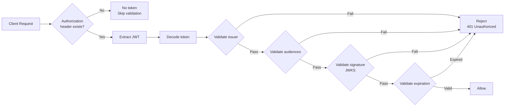
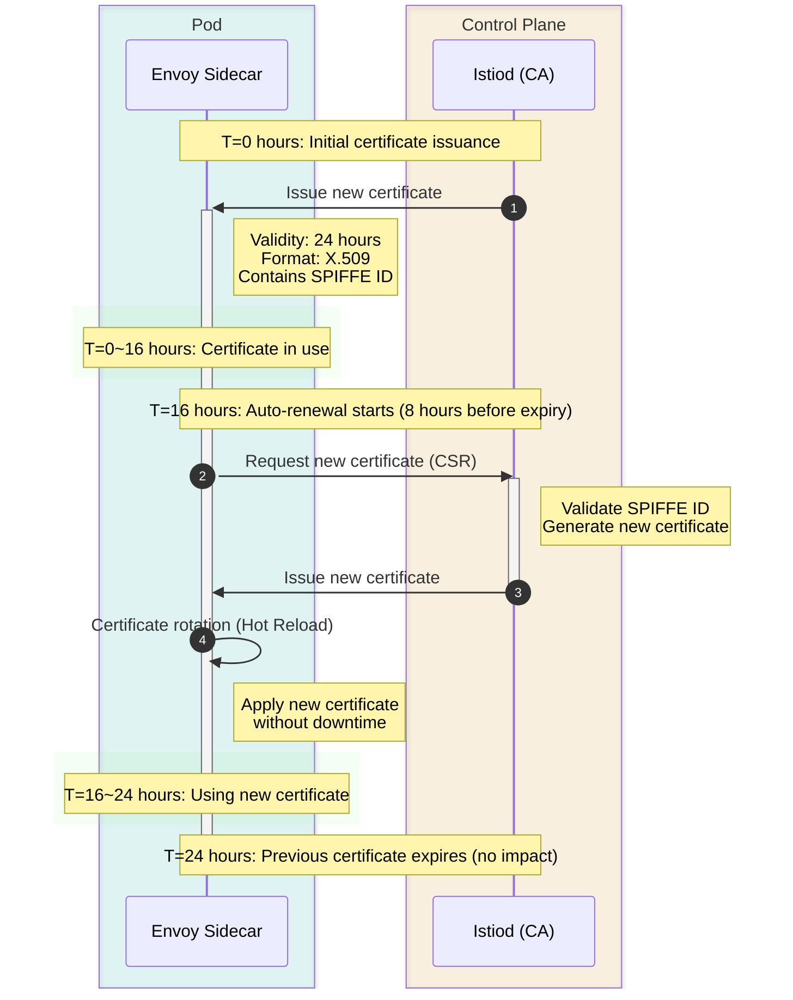

# 安全测验

> **支持版本**: Istio 1.28.0 **EKS 版本**: 1.34 (Kubernetes 1.28+) **最后更新**: February 23, 2026

本测验用于测试您对 Istio 安全功能的理解。

## 选择题（1-5）

### 问题 1：PeerAuthentication 模式

以下哪项正确描述了 PeerAuthentication 中的 **PERMISSIVE** mTLS 模式？

A. 它同时允许 mTLS 和明文流量 B. 它仅允许 mTLS 并拒绝明文流量 C. 它拒绝所有流量 D. 它禁用 mTLS

<details>

<summary>显示答案</summary>

**答案：A**

PERMISSIVE 模式**同时允许 mTLS 和明文流量**，以支持渐进式迁移。

**说明：**

**PeerAuthentication mTLS 模式：**

| 模式           | 描述                    | 使用场景                          |
| -------------- | ------------------------------ | ------------------------------------- |
| **PERMISSIVE** | 同时允许 mTLS + 明文   | 渐进式迁移、混合环境 |
| **STRICT**     | 仅允许 mTLS               | 生产环境安全加固         |
| **DISABLE**    | 禁用 mTLS（仅明文） | 调试、旧版系统             |

**PERMISSIVE 模式示例：**

```yaml
apiVersion: security.istio.io/v1beta1
kind: PeerAuthentication
metadata:
  name: default
  namespace: istio-system
spec:
  mtls:
    mode: PERMISSIVE  # Allows both mTLS + plaintext
```

**行为：**

```
Client A (Istio Sidecar) -> [mTLS] -> Server (PERMISSIVE)  Allowed
Client B (No Sidecar)    -> [Plaintext] -> Server (PERMISSIVE)  Allowed
```

**与 STRICT 模式的对比：**

```yaml
apiVersion: security.istio.io/v1beta1
kind: PeerAuthentication
metadata:
  name: strict-mtls
  namespace: production
spec:
  mtls:
    mode: STRICT  # Only allows mTLS
```

```
Client A (Istio Sidecar) -> [mTLS] -> Server (STRICT)  Allowed
Client B (No Sidecar)    -> [Plaintext] -> Server (STRICT)  Rejected
```

**迁移策略：**

```
Step 1: PERMISSIVE (Allow mixed traffic)
  |
Step 2: Inject Sidecars to all services
  |
Step 3: STRICT (Enforce mTLS)
```

**参考资料：**

* [PeerAuthentication](https://github.com/Atom-oh/kubernetes-docs/blob/main/en/service-mesh/istio/security/04-peer-authentication.md)
* [mTLS](../../../service-mesh/istio/security/01-mtls.md)

</details>

***

### 问题 2：AuthorizationPolicy 操作

以下 AuthorizationPolicy 配置表示什么？

```yaml
apiVersion: security.istio.io/v1beta1
kind: AuthorizationPolicy
metadata:
  name: deny-all
spec:
  {}
```

A. 它允许所有请求 B. 它拒绝所有请求 C. 它不应用任何策略 D. 它仅允许 mTLS

<details>

<summary>显示答案</summary>

**答案：B**

具有空 spec 的 AuthorizationPolicy 会**拒绝所有请求**（默认拒绝）。

**说明：**

**AuthorizationPolicy 的默认行为：**

1. **不存在策略**：允许所有请求
2. **空 spec（如示例所示）**：拒绝所有请求
3. **包含规则**：根据规则允许/拒绝

**默认拒绝模式：**

```yaml
# Step 1: Deny all requests
apiVersion: security.istio.io/v1beta1
kind: AuthorizationPolicy
metadata:
  name: deny-all
  namespace: default
spec: {}  # Empty spec = deny all requests

---
# Step 2: Selectively allow only what's needed
apiVersion: security.istio.io/v1beta1
kind: AuthorizationPolicy
metadata:
  name: allow-frontend
  namespace: default
spec:
  selector:
    matchLabels:
      app: backend
  action: ALLOW
  rules:
  - from:
    - source:
        principals: ["cluster.local/ns/default/sa/frontend"]
    to:
    - operation:
        methods: ["GET", "POST"]
```

**AuthorizationPolicy 操作类型：**

| 操作     | 描述           | 优先级    |
| ---------- | --------------------- | ----------- |
| **DENY**   | 显式拒绝         | 1（最高） |
| **ALLOW**  | 显式允许        | 2           |
| **AUDIT**  | 仅记录日志              | 3           |
| **CUSTOM** | 外部认证服务 | 4           |

**评估顺序：**

```
1. Evaluate DENY policies -> If matched, immediately deny
   | (pass)
2. Evaluate ALLOW policies -> If matched, allow
   | (no match)
3. Default behavior
   - If any ALLOW policy exists -> Deny
   - If no ALLOW policy exists -> Allow
```

**实际示例：**

```yaml
# Scenario: Restrict HTTP methods
---
# DENY: Prohibit DELETE
apiVersion: security.istio.io/v1beta1
kind: AuthorizationPolicy
metadata:
  name: deny-delete
spec:
  selector:
    matchLabels:
      app: backend
  action: DENY
  rules:
  - to:
    - operation:
        methods: ["DELETE"]

---
# ALLOW: Only allow GET, POST
apiVersion: security.istio.io/v1beta1
kind: AuthorizationPolicy
metadata:
  name: allow-read-write
spec:
  selector:
    matchLabels:
      app: backend
  action: ALLOW
  rules:
  - from:
    - source:
        principals: ["cluster.local/ns/default/sa/frontend"]
    to:
    - operation:
        methods: ["GET", "POST"]
```

**测试：**

```bash
# GET request -> Matches ALLOW policy -> Allowed
curl http://backend/api

# POST request -> Matches ALLOW policy -> Allowed
curl -X POST http://backend/api

# DELETE request -> Matches DENY policy -> Rejected
curl -X DELETE http://backend/api

# PUT request -> No ALLOW policy match -> Rejected
curl -X PUT http://backend/api
```

**参考资料：**

* [授权策略](https://github.com/Atom-oh/kubernetes-docs/blob/main/en/service-mesh/istio/security/02-authorization-policy.md)

</details>

***

### 问题 3：JWT 认证

RequestAuthentication 中使用哪些字段验证 JWT Token？

A. issuer 和 audiences B. principals 和 namespaces C. methods 和 paths D. hosts 和 ports

<details>

<summary>显示答案</summary>

**答案：A**

RequestAuthentication 使用 **issuer** 和 **audiences** 字段来验证 JWT Token。

**说明：**

**JWT Token 结构：**

```
Header.Payload.Signature

Payload example:
{
  "iss": "https://auth.example.com",        # issuer
  "sub": "user@example.com",                # subject
  "aud": ["api.example.com"],               # audiences
  "exp": 1735689600,                        # expiration
  "iat": 1735686000                         # issued at
}
```

**RequestAuthentication 配置：**

```yaml
apiVersion: security.istio.io/v1beta1
kind: RequestAuthentication
metadata:
  name: jwt-auth
  namespace: default
spec:
  selector:
    matchLabels:
      app: backend
  jwtRules:
  - issuer: "https://auth.example.com"      # Validate iss field
    jwksUri: "https://auth.example.com/.well-known/jwks.json"
    audiences:
    - "api.example.com"                     # Validate aud field
    forwardOriginalToken: true
```

**JWT 验证流程：**



**与 OIDC 提供商集成：**

```yaml
# Google OAuth2 example
apiVersion: security.istio.io/v1beta1
kind: RequestAuthentication
metadata:
  name: google-jwt
spec:
  jwtRules:
  - issuer: "https://accounts.google.com"
    jwksUri: "https://www.googleapis.com/oauth2/v3/certs"
    audiences:
    - "123456789-abcdefg.apps.googleusercontent.com"

---
# Keycloak example
apiVersion: security.istio.io/v1beta1
kind: RequestAuthentication
metadata:
  name: keycloak-jwt
spec:
  jwtRules:
  - issuer: "https://keycloak.example.com/realms/myrealm"
    jwksUri: "https://keycloak.example.com/realms/myrealm/protocol/openid-connect/certs"
    audiences:
    - "myapp"
```

**与 AuthorizationPolicy 结合：**

```yaml
# 1. RequestAuthentication: Validate JWT
apiVersion: security.istio.io/v1beta1
kind: RequestAuthentication
metadata:
  name: jwt-auth
spec:
  selector:
    matchLabels:
      app: backend
  jwtRules:
  - issuer: "https://auth.example.com"
    jwksUri: "https://auth.example.com/.well-known/jwks.json"

---
# 2. AuthorizationPolicy: Only allow authenticated requests
apiVersion: security.istio.io/v1beta1
kind: AuthorizationPolicy
metadata:
  name: require-jwt
spec:
  selector:
    matchLabels:
      app: backend
  action: ALLOW
  rules:
  - from:
    - source:
        requestPrincipals: ["*"]  # Only requests with JWT
    to:
    - operation:
        methods: ["GET", "POST"]

---
# 3. AuthorizationPolicy: Only allow specific issuer
apiVersion: security.istio.io/v1beta1
kind: AuthorizationPolicy
metadata:
  name: require-specific-issuer
spec:
  selector:
    matchLabels:
      app: backend
  action: ALLOW
  rules:
  - from:
    - source:
        requestPrincipals: ["https://auth.example.com/*"]
```

**测试：**

```bash
# Request without JWT -> Passes RequestAuthentication, denied by AuthorizationPolicy
curl http://backend/api
# 401 Unauthorized

# Request with valid JWT
TOKEN="eyJhbGc..."
curl -H "Authorization: Bearer $TOKEN" http://backend/api
# 200 OK
```

**参考资料：**

* [请求认证](https://github.com/Atom-oh/kubernetes-docs/blob/main/en/service-mesh/istio/security/03-request-authentication.md)

</details>

***

### 问题 4：mTLS 证书管理

Istio 中 mTLS 证书的默认有效期是多久？

A. 1 小时 B. 24 小时 C. 7 天 D. 90 天

<details>

<summary>显示答案</summary>

**答案：B**

Istio 中 mTLS 证书的默认有效期为 **24 小时**，并会自动续期。

**说明：**

**Istio 证书管理：**

```yaml
# Istiod configuration (defaults)
apiVersion: install.istio.io/v1alpha1
kind: IstioOperator
spec:
  meshConfig:
    certificates:
    - secretName: dns.example-service-account
      dnsNames:
      - example.com
```

**默认设置：**

* **证书有效期**：24 小时（1 天）
* **续期时间**：到期前 8 小时
* **续期方式**：自动（由 Istiod 管理）
* **证书格式**：X.509

**证书生命周期：**



**检查证书：**

```bash
# Check pod's mTLS certificate
istioctl proxy-config secret <pod-name> -o json

# Example output:
{
  "name": "default",
  "tlsCertificate": {
    "certificateChain": {
      "inlineBytes": "LS0tLS1CRU..."
    },
    "privateKey": {
      "inlineBytes": "LS0tLS1CRU..."
    }
  },
  "validationContext": {
    "trustedCa": {
      "inlineBytes": "LS0tLS1CRU..."
    }
  }
}

# Decode certificate contents
kubectl exec <pod-name> -c istio-proxy -- \
  openssl x509 -text -noout -in /etc/certs/cert-chain.pem

# Example output:
Certificate:
    Validity
        Not Before: Jan 20 00:00:00 2025 GMT
        Not After : Jan 21 00:00:00 2025 GMT  # 24 hours later
    Subject: O=cluster.local
    X509v3 Subject Alternative Name:
        URI:spiffe://cluster.local/ns/default/sa/myapp
```

**自定义有效期：**

```yaml
apiVersion: install.istio.io/v1alpha1
kind: IstioOperator
spec:
  meshConfig:
    # Change certificate validity period
    defaultConfig:
      proxyMetadata:
        SECRET_TTL: "48h"  # Extend to 48 hours
```

**证书续期失败场景：**

```bash
# Check Istiod logs
kubectl logs -n istio-system -l app=istiod

# Common issues:
# 1. Communication issues between Istiod and Envoy
# 2. RBAC permission issues
# 3. Blocked by network policies

# Manually trigger certificate renewal
kubectl delete pod <pod-name>  # Pod restart reissues certificate
```

**SPIFFE ID：**

```
Istio's mTLS certificates follow the SPIFFE (Secure Production Identity Framework For Everyone) standard.

Format: spiffe://<trust-domain>/ns/<namespace>/sa/<service-account>
Example: spiffe://cluster.local/ns/default/sa/frontend
```

**CA 层次结构：**

```
Root CA (Istiod)
  +- Intermediate CA (auto-generated)
  |   +- frontend Pod certificate (24 hours)
  |   +- backend Pod certificate (24 hours)
  |   +- database Pod certificate (24 hours)
  +- ...
```

**外部 CA 集成：**

```yaml
# Using external CA with Cert-Manager
apiVersion: install.istio.io/v1alpha1
kind: IstioOperator
spec:
  components:
    pilot:
      k8s:
        env:
        - name: EXTERNAL_CA
          value: ISTIOD_RA_KUBERNETES_API
```

**参考资料：**

* [mTLS](../../../service-mesh/istio/security/01-mtls.md)
* [证书管理](../../../service-mesh/istio/03-architecture.md#certificate-management)

</details>

***

### 问题 5：基于 Service Account 的认证

Istio 中用于服务到服务认证的身份是什么？

A. Pod 名称 B. Service 名称 C. Service Account D. Namespace 名称

<details>

<summary>显示答案</summary>

**答案：C**

Istio 基于 **Service Account** 管理服务到服务的身份。

**说明：**

**基于 Service Account 的身份：**

```yaml
# 1. Create Service Account
apiVersion: v1
kind: ServiceAccount
metadata:
  name: frontend
  namespace: default

---
# 2. Use Service Account in Deployment
apiVersion: apps/v1
kind: Deployment
metadata:
  name: frontend
spec:
  template:
    spec:
      serviceAccountName: frontend  # Used as identity
      containers:
      - name: frontend
        image: frontend:v1
```

**SPIFFE ID 格式：**

```
spiffe://<trust-domain>/ns/<namespace>/sa/<service-account>

Examples:
spiffe://cluster.local/ns/default/sa/frontend
spiffe://cluster.local/ns/production/sa/backend
```

**在 AuthorizationPolicy 中使用 Service Account：**

```yaml
apiVersion: security.istio.io/v1beta1
kind: AuthorizationPolicy
metadata:
  name: backend-policy
  namespace: default
spec:
  selector:
    matchLabels:
      app: backend
  action: ALLOW
  rules:
  # Only allow frontend Service Account
  - from:
    - source:
        principals:
        - "cluster.local/ns/default/sa/frontend"
    to:
    - operation:
        methods: ["GET", "POST"]
        paths: ["/api/*"]

  # admin Service Account allowed for all operations
  - from:
    - source:
        principals:
        - "cluster.local/ns/default/sa/admin"
```

**Service Account 与 Pod/Service 名称对比：**

| 项目                 | Service Account         | Pod 名称            | Service 名称    |
| -------------------- | ----------------------- | ------------------- | --------------- |
| **稳定性**        | 稳定                  | 动态变化 | 稳定          |
| **安全性**         | 基于证书       | 不可信     | 不可信 |
| **RBAC 集成** | Kubernetes RBAC         | 不可实现        | 不可实现    |
| **mTLS**             | 包含在证书中 | 不包含        | 不包含    |

**实际示例：三层应用程序：**

```yaml
# Frontend -> Backend only allowed
---
apiVersion: v1
kind: ServiceAccount
metadata:
  name: frontend
  namespace: app

---
apiVersion: v1
kind: ServiceAccount
metadata:
  name: backend
  namespace: app

---
apiVersion: v1
kind: ServiceAccount
metadata:
  name: database
  namespace: app

---
# Backend policy: Only allow Frontend access
apiVersion: security.istio.io/v1beta1
kind: AuthorizationPolicy
metadata:
  name: backend-policy
  namespace: app
spec:
  selector:
    matchLabels:
      app: backend
  action: ALLOW
  rules:
  - from:
    - source:
        principals: ["cluster.local/ns/app/sa/frontend"]

---
# Database policy: Only allow Backend access
apiVersion: security.istio.io/v1beta1
kind: AuthorizationPolicy
metadata:
  name: database-policy
  namespace: app
spec:
  selector:
    matchLabels:
      app: database
  action: ALLOW
  rules:
  - from:
    - source:
        principals: ["cluster.local/ns/app/sa/backend"]
```

**检查 Service Account：**

```bash
# Check pod's Service Account
kubectl get pod <pod-name> -o jsonpath='{.spec.serviceAccountName}'

# Check SPIFFE ID in mTLS certificate
istioctl proxy-config secret <pod-name> -o json | \
  jq -r '.dynamicActiveSecrets[0].secret.tlsCertificate.certificateChain.inlineBytes' | \
  base64 -d | openssl x509 -text -noout | grep URI

# Output:
# URI:spiffe://cluster.local/ns/default/sa/frontend
```

**跨 Namespace 通信：**

```yaml
# Allow production namespace's frontend -> staging namespace's backend access
apiVersion: security.istio.io/v1beta1
kind: AuthorizationPolicy
metadata:
  name: backend-policy
  namespace: staging
spec:
  selector:
    matchLabels:
      app: backend
  action: ALLOW
  rules:
  - from:
    - source:
        principals:
        - "cluster.local/ns/production/sa/frontend"
        namespaces:
        - "production"
```

**参考资料：**

* [mTLS](../../../service-mesh/istio/security/01-mtls.md)
* [授权策略](https://github.com/Atom-oh/kubernetes-docs/blob/main/en/service-mesh/istio/security/02-authorization-policy.md)

</details>

***

## 简答题（6-10）

### 问题 6：实施默认拒绝安全策略

请逐步说明如何在 Kubernetes 集群中使用 Istio 实施**默认拒绝**安全策略。包括**必需资源**（PeerAuthentication、AuthorizationPolicy）和**异常处理**方法。

<details>

<summary>显示答案</summary>

**答案：**

**实施默认拒绝安全策略：**

***

**第 1 步：启用 mTLS STRICT 模式**

强制所有服务到服务通信使用 mTLS：

```yaml
apiVersion: security.istio.io/v1beta1
kind: PeerAuthentication
metadata:
  name: default
  namespace: istio-system
spec:
  mtls:
    mode: STRICT  # Enforce mTLS
```

**范围：**

* 部署在 `istio-system` Namespace 中 -> 应用于整个 mesh
* 部署在特定 Namespace 中 -> 仅应用于该 Namespace
* 使用 selector -> 仅应用于特定 workload

***

**第 2 步：拒绝所有流量（默认拒绝）**

```yaml
apiVersion: security.istio.io/v1beta1
kind: AuthorizationPolicy
metadata:
  name: deny-all
  namespace: default
spec: {}  # Empty spec = deny all requests
```

**应用此策略后：**

* 拒绝所有入站流量
* 阻止服务到服务通信
* 阻止外部访问

***

**第 3 步：选择性允许所需通信**

**示例 1：允许 Frontend -> Backend 通信**

```yaml
apiVersion: security.istio.io/v1beta1
kind: AuthorizationPolicy
metadata:
  name: allow-frontend-to-backend
  namespace: default
spec:
  selector:
    matchLabels:
      app: backend  # Apply to Backend
  action: ALLOW
  rules:
  - from:
    - source:
        principals:
        - "cluster.local/ns/default/sa/frontend"  # Only allow Frontend
    to:
    - operation:
        methods: ["GET", "POST"]
        paths: ["/api/*"]
```

**示例 2：允许 Backend -> Database 通信**

```yaml
apiVersion: security.istio.io/v1beta1
kind: AuthorizationPolicy
metadata:
  name: allow-backend-to-database
  namespace: default
spec:
  selector:
    matchLabels:
      app: database
  action: ALLOW
  rules:
  - from:
    - source:
        principals:
        - "cluster.local/ns/default/sa/backend"
    to:
    - operation:
        ports: ["5432"]  # PostgreSQL port
```

***

**第 4 步：Ingress Gateway 策略**

需要为 Ingress Gateway 配置策略以允许外部流量：

```yaml
# Allow traffic to Ingress Gateway
apiVersion: security.istio.io/v1beta1
kind: AuthorizationPolicy
metadata:
  name: allow-ingress
  namespace: istio-system
spec:
  selector:
    matchLabels:
      istio: ingressgateway
  action: ALLOW
  rules:
  - to:
    - operation:
        ports: ["80", "443"]

---
# Allow Ingress Gateway -> Frontend
apiVersion: security.istio.io/v1beta1
kind: AuthorizationPolicy
metadata:
  name: allow-gateway-to-frontend
  namespace: default
spec:
  selector:
    matchLabels:
      app: frontend
  action: ALLOW
  rules:
  - from:
    - source:
        principals:
        - "cluster.local/ns/istio-system/sa/istio-ingressgateway-service-account"
```

***

**第 5 步：健康检查和就绪探针例外**

处理例外，以免 Kubernetes 健康检查被阻止：

```yaml
apiVersion: security.istio.io/v1beta1
kind: AuthorizationPolicy
metadata:
  name: allow-health-checks
  namespace: default
spec:
  selector:
    matchLabels:
      app: backend
  action: ALLOW
  rules:
  # Allow Kubernetes health checks
  - to:
    - operation:
        paths: ["/health", "/ready"]
        methods: ["GET"]
```

或者在 PeerAuthentication 中排除特定端口：

```yaml
apiVersion: security.istio.io/v1beta1
kind: PeerAuthentication
metadata:
  name: default
  namespace: default
spec:
  mtls:
    mode: STRICT
  portLevelMtls:
    8080:
      mode: DISABLE  # Disable mTLS for health check port
```

***

**第 6 步：监控和日志记录例外**

允许 Prometheus 收集指标：

```yaml
apiVersion: security.istio.io/v1beta1
kind: AuthorizationPolicy
metadata:
  name: allow-prometheus
  namespace: default
spec:
  action: ALLOW
  rules:
  - from:
    - source:
        namespaces: ["istio-system"]
        principals: ["cluster.local/ns/istio-system/sa/prometheus"]
    to:
    - operation:
        paths: ["/stats/prometheus"]
        methods: ["GET"]
```

***

**完整示例：三层应用程序**

```yaml
# 1. mTLS STRICT
---
apiVersion: security.istio.io/v1beta1
kind: PeerAuthentication
metadata:
  name: default
  namespace: production
spec:
  mtls:
    mode: STRICT

# 2. Deny-by-default
---
apiVersion: security.istio.io/v1beta1
kind: AuthorizationPolicy
metadata:
  name: deny-all
  namespace: production
spec: {}

# 3. Ingress -> Frontend
---
apiVersion: security.istio.io/v1beta1
kind: AuthorizationPolicy
metadata:
  name: allow-ingress-to-frontend
  namespace: production
spec:
  selector:
    matchLabels:
      app: frontend
  action: ALLOW
  rules:
  - from:
    - source:
        principals: ["cluster.local/ns/istio-system/sa/istio-ingressgateway-service-account"]

# 4. Frontend -> Backend
---
apiVersion: security.istio.io/v1beta1
kind: AuthorizationPolicy
metadata:
  name: allow-frontend-to-backend
  namespace: production
spec:
  selector:
    matchLabels:
      app: backend
  action: ALLOW
  rules:
  - from:
    - source:
        principals: ["cluster.local/ns/production/sa/frontend"]
    to:
    - operation:
        methods: ["GET", "POST", "PUT", "DELETE"]
        paths: ["/api/*"]

# 5. Backend -> Database
---
apiVersion: security.istio.io/v1beta1
kind: AuthorizationPolicy
metadata:
  name: allow-backend-to-database
  namespace: production
spec:
  selector:
    matchLabels:
      app: database
  action: ALLOW
  rules:
  - from:
    - source:
        principals: ["cluster.local/ns/production/sa/backend"]

# 6. Health Checks
---
apiVersion: security.istio.io/v1beta1
kind: AuthorizationPolicy
metadata:
  name: allow-health-checks
  namespace: production
spec:
  action: ALLOW
  rules:
  - to:
    - operation:
        paths: ["/health", "/ready", "/live"]

# 7. Prometheus metrics
---
apiVersion: security.istio.io/v1beta1
kind: AuthorizationPolicy
metadata:
  name: allow-prometheus
  namespace: production
spec:
  action: ALLOW
  rules:
  - from:
    - source:
        namespaces: ["istio-system"]
    to:
    - operation:
        paths: ["/stats/prometheus"]
```

***

**测试和验证：**

```bash
# 1. Frontend -> Backend (allowed)
kubectl exec -it <frontend-pod> -- curl http://backend/api
# 200 OK

# 2. Direct Database access (denied)
kubectl exec -it <frontend-pod> -- curl http://database:5432
# 403 RBAC: access denied

# 3. External direct Backend access (denied)
curl http://<ingress-gateway>/backend
# 403 RBAC: access denied

# 4. Normal path (allowed)
curl http://<ingress-gateway>/frontend
# 200 OK
```

***

**最佳实践：**

1. **渐进式应用**：
   * 首先以 PERMISSIVE 模式启用 mTLS
   * 验证所有服务均已注入 Sidecar
   * 切换到 STRICT 模式
   * 应用默认拒绝策略
2. **最小权限原则**：
   * 仅允许所需的最小通信范围
   * 限制 HTTP 方法（仅 GET、仅 POST 等）
   * 限制路径（仅 /api/\* 等）
3. **异常处理**：
   * 始终处理健康检查例外
   * 允许监控系统访问
   * 配置 Ingress Gateway 策略
4. **测试**：
   * 每应用一项策略后进行测试
   * 检查副作用（日志、指标）
   * 准备回滚计划

**参考资料：**

* [授权策略](https://github.com/Atom-oh/kubernetes-docs/blob/main/en/service-mesh/istio/security/02-authorization-policy.md)
* [PeerAuthentication](https://github.com/Atom-oh/kubernetes-docs/blob/main/en/service-mesh/istio/security/04-peer-authentication.md)

</details>

***

### 问题 7：JWT + mTLS 双重认证

在 Istio 中实施一个同时使用**最终用户认证（JWT）**和**服务到服务认证（mTLS）**的场景。包括如何与 OAuth2/OIDC 提供商（例如 Keycloak）集成。

<details>

<summary>显示答案</summary>

**答案：**

**JWT + mTLS 双重认证架构：**

```
User
  | (JWT Token)
Ingress Gateway (Validate JWT with RequestAuthentication)
  | (mTLS)
Frontend (Validate mTLS with PeerAuthentication)
  | (mTLS)
Backend
```

***

**第 1 步：Keycloak 设置**

```bash
# Create Keycloak Realm
Realm: myrealm

# Create Client
Client ID: myapp
Access Type: confidential
Valid Redirect URIs: http://myapp.example.com/*

# Get JWKS URI
https://keycloak.example.com/realms/myrealm/protocol/openid-connect/certs
```

***

**第 2 步：启用 mTLS（服务到服务认证）**

```yaml
# Apply STRICT mTLS to entire mesh
apiVersion: security.istio.io/v1beta1
kind: PeerAuthentication
metadata:
  name: default
  namespace: istio-system
spec:
  mtls:
    mode: STRICT
```

***

**第 3 步：配置 JWT 认证（最终用户认证）**

```yaml
# Validate JWT at Ingress Gateway
apiVersion: security.istio.io/v1beta1
kind: RequestAuthentication
metadata:
  name: jwt-ingress
  namespace: istio-system
spec:
  selector:
    matchLabels:
      istio: ingressgateway
  jwtRules:
  - issuer: "https://keycloak.example.com/realms/myrealm"
    jwksUri: "https://keycloak.example.com/realms/myrealm/protocol/openid-connect/certs"
    audiences:
    - "myapp"
    forwardOriginalToken: true  # Forward JWT to backend
    outputPayloadToHeader: "x-jwt-payload"  # Extract payload to header
```

***

**第 4 步：配置 AuthorizationPolicy**

**Ingress Gateway 策略**

```yaml
apiVersion: security.istio.io/v1beta1
kind: AuthorizationPolicy
metadata:
  name: ingress-jwt-policy
  namespace: istio-system
spec:
  selector:
    matchLabels:
      istio: ingressgateway
  action: ALLOW
  rules:
  # Only allow requests with JWT
  - from:
    - source:
        requestPrincipals: ["*"]
    to:
    - operation:
        paths: ["/api/*", "/app/*"]

  # Allow health checks without JWT
  - to:
    - operation:
        paths: ["/health", "/ready"]
```

**Backend 策略**

```yaml
apiVersion: security.istio.io/v1beta1
kind: AuthorizationPolicy
metadata:
  name: backend-jwt-mtls-policy
  namespace: default
spec:
  selector:
    matchLabels:
      app: backend
  action: ALLOW
  rules:
  # 1. mTLS: Only allow Frontend Service Account
  # 2. JWT: Must have valid JWT
  - from:
    - source:
        principals: ["cluster.local/ns/default/sa/frontend"]
        requestPrincipals: ["https://keycloak.example.com/realms/myrealm/*"]
    to:
    - operation:
        methods: ["GET", "POST"]
```

***

**第 5 步：基于角色的访问控制**

基于 JWT 声明进行细粒度授权：

```yaml
apiVersion: security.istio.io/v1beta1
kind: AuthorizationPolicy
metadata:
  name: backend-rbac
  namespace: default
spec:
  selector:
    matchLabels:
      app: backend
  action: ALLOW
  rules:
  # Only Admin role allowed for DELETE
  - from:
    - source:
        principals: ["cluster.local/ns/default/sa/frontend"]
        requestPrincipals: ["*"]
    when:
    - key: request.auth.claims[roles]
      values: ["admin"]
    to:
    - operation:
        methods: ["DELETE"]
        paths: ["/api/admin/*"]

  # User role only allowed GET, POST
  - from:
    - source:
        principals: ["cluster.local/ns/default/sa/frontend"]
        requestPrincipals: ["*"]
    when:
    - key: request.auth.claims[roles]
      values: ["user"]
    to:
    - operation:
        methods: ["GET", "POST"]
        paths: ["/api/users/*"]
```

***

**第 6 步：利用 JWT Payload**

在 Backend 中使用 JWT Payload：

```yaml
# EnvoyFilter to pass JWT claims as headers
apiVersion: networking.istio.io/v1alpha3
kind: EnvoyFilter
metadata:
  name: jwt-claim-to-header
  namespace: istio-system
spec:
  workloadSelector:
    labels:
      istio: ingressgateway
  configPatches:
  - applyTo: HTTP_FILTER
    match:
      context: GATEWAY
      listener:
        filterChain:
          filter:
            name: "envoy.filters.network.http_connection_manager"
            subFilter:
              name: "envoy.filters.http.jwt_authn"
    patch:
      operation: INSERT_AFTER
      value:
        name: envoy.lua
        typed_config:
          "@type": type.googleapis.com/envoy.extensions.filters.http.lua.v3.Lua
          inline_code: |
            function envoy_on_request(request_handle)
              local payload = request_handle:headers():get("x-jwt-payload")
              if payload then
                -- Base64 decode and JSON parse
                local json = require("json")
                local decoded = json.decode(payload)

                -- Pass user info as headers
                request_handle:headers():add("x-user-id", decoded.sub)
                request_handle:headers():add("x-user-email", decoded.email)
                request_handle:headers():add("x-user-roles", table.concat(decoded.roles, ","))
              end
            end
```

***

**第 7 步：完整示例**

**Ingress Gateway**

```yaml
---
# JWT validation
apiVersion: security.istio.io/v1beta1
kind: RequestAuthentication
metadata:
  name: jwt-ingress
  namespace: istio-system
spec:
  selector:
    matchLabels:
      istio: ingressgateway
  jwtRules:
  - issuer: "https://keycloak.example.com/realms/myrealm"
    jwksUri: "https://keycloak.example.com/realms/myrealm/protocol/openid-connect/certs"
    audiences: ["myapp"]
    forwardOriginalToken: true

---
# Require JWT
apiVersion: security.istio.io/v1beta1
kind: AuthorizationPolicy
metadata:
  name: require-jwt
  namespace: istio-system
spec:
  selector:
    matchLabels:
      istio: ingressgateway
  action: ALLOW
  rules:
  - from:
    - source:
        requestPrincipals: ["*"]
```

**Frontend**

```yaml
---
# mTLS STRICT
apiVersion: security.istio.io/v1beta1
kind: PeerAuthentication
metadata:
  name: frontend-mtls
  namespace: default
spec:
  selector:
    matchLabels:
      app: frontend
  mtls:
    mode: STRICT

---
# Only allow Ingress Gateway access
apiVersion: security.istio.io/v1beta1
kind: AuthorizationPolicy
metadata:
  name: frontend-policy
  namespace: default
spec:
  selector:
    matchLabels:
      app: frontend
  action: ALLOW
  rules:
  - from:
    - source:
        principals: ["cluster.local/ns/istio-system/sa/istio-ingressgateway-service-account"]
        requestPrincipals: ["*"]
```

**Backend**

```yaml
---
# mTLS STRICT
apiVersion: security.istio.io/v1beta1
kind: PeerAuthentication
metadata:
  name: backend-mtls
  namespace: default
spec:
  selector:
    matchLabels:
      app: backend
  mtls:
    mode: STRICT

---
# Only allow Frontend access + Require JWT
apiVersion: security.istio.io/v1beta1
kind: AuthorizationPolicy
metadata:
  name: backend-policy
  namespace: default
spec:
  selector:
    matchLabels:
      app: backend
  action: ALLOW
  rules:
  - from:
    - source:
        principals: ["cluster.local/ns/default/sa/frontend"]
        requestPrincipals: ["https://keycloak.example.com/realms/myrealm/*"]
```

***

**测试：**

```bash
# 1. Get token from Keycloak
TOKEN=$(curl -X POST \
  "https://keycloak.example.com/realms/myrealm/protocol/openid-connect/token" \
  -d "client_id=myapp" \
  -d "client_secret=<secret>" \
  -d "grant_type=password" \
  -d "username=user@example.com" \
  -d "password=password123" \
  | jq -r '.access_token')

# 2. Call API with JWT
curl -H "Authorization: Bearer $TOKEN" \
  http://myapp.example.com/api/users

# 3. Call without JWT (fails)
curl http://myapp.example.com/api/users
# 401 Unauthorized

# 4. Invalid JWT (fails)
curl -H "Authorization: Bearer invalid-token" \
  http://myapp.example.com/api/users
# 401 Unauthorized
```

***

**安全优势：**

1. **双重认证**：
   * JWT：验证最终用户身份
   * mTLS：验证服务身份
2. **纵深防御**：
   * 在 Gateway 处验证 JWT
   * 服务之间通过 mTLS 加密通信
   * 使用 AuthorizationPolicy 进行细粒度授权
3. **基于角色的访问控制（RBAC）**：
   * 基于 JWT 声明的授权管理
   * 动态权限更新（在 Keycloak 中管理）

**参考资料：**

* [请求认证](https://github.com/Atom-oh/kubernetes-docs/blob/main/en/service-mesh/istio/security/03-request-authentication.md)
* [mTLS](../../../service-mesh/istio/security/01-mtls.md)

</details>

***

### 问题 8：外部服务访问控制

说明如何在 Istio 中控制**出口流量**，使其仅允许访问特定外部服务。包括使用 **ServiceEntry**、**VirtualService** 和 **AuthorizationPolicy** 的完整示例。

<details>

<summary>显示答案</summary>

**答案：**

**出口流量控制策略：**

***

**第 1 步：检查出口流量默认模式**

Istio 支持两种出口模式：

```yaml
apiVersion: install.istio.io/v1alpha1
kind: IstioOperator
spec:
  meshConfig:
    outboundTrafficPolicy:
      mode: REGISTRY_ONLY  # or ALLOW_ANY
```

**模式对比：**

| 模式               | 描述                                    | 安全性 |
| ------------------ | ---------------------------------------------- | -------- |
| **ALLOW\_ANY**     | 允许所有外部流量（默认）           | 低      |
| **REGISTRY\_ONLY** | 仅允许在 ServiceEntry 中注册的服务 | 高     |

**切换到 REGISTRY\_ONLY 模式：**

```bash
istioctl install --set meshConfig.outboundTrafficPolicy.mode=REGISTRY_ONLY
```

***

**第 2 步：使用 ServiceEntry 注册外部服务**

**示例 1：HTTPS API（GitHub）**

```yaml
apiVersion: networking.istio.io/v1beta1
kind: ServiceEntry
metadata:
  name: github-api
  namespace: default
spec:
  hosts:
  - api.github.com
  ports:
  - number: 443
    name: https
    protocol: HTTPS
  location: MESH_EXTERNAL
  resolution: DNS
```

**示例 2：HTTP API（httpbin）**

```yaml
apiVersion: networking.istio.io/v1beta1
kind: ServiceEntry
metadata:
  name: httpbin-ext
  namespace: default
spec:
  hosts:
  - httpbin.org
  ports:
  - number: 80
    name: http
    protocol: HTTP
  - number: 443
    name: https
    protocol: HTTPS
  location: MESH_EXTERNAL
  resolution: DNS
```

**示例 3：特定 IP 地址**

```yaml
apiVersion: networking.istio.io/v1beta1
kind: ServiceEntry
metadata:
  name: external-database
  namespace: default
spec:
  hosts:
  - database.external.com
  addresses:
  - 203.0.113.10  # Specific IP
  ports:
  - number: 5432
    name: postgres
    protocol: TCP
  location: MESH_EXTERNAL
  resolution: STATIC
  endpoints:
  - address: 203.0.113.10
```

***

**第 3 步：使用 VirtualService 控制流量**

**超时和重试设置**

```yaml
apiVersion: networking.istio.io/v1beta1
kind: VirtualService
metadata:
  name: github-api-vs
  namespace: default
spec:
  hosts:
  - api.github.com
  http:
  - timeout: 10s
    retries:
      attempts: 3
      perTryTimeout: 3s
      retryOn: 5xx,reset,connect-failure
    route:
    - destination:
        host: api.github.com
```

**添加 Header（API Key）**

```yaml
apiVersion: networking.istio.io/v1beta1
kind: VirtualService
metadata:
  name: external-api-vs
  namespace: default
spec:
  hosts:
  - api.example.com
  http:
  - headers:
      request:
        add:
          X-API-Key: "my-secret-key"
    route:
    - destination:
        host: api.example.com
```

***

**第 4 步：使用 AuthorizationPolicy 进行访问控制**

**仅允许特定 Service Account**

```yaml
apiVersion: security.istio.io/v1beta1
kind: AuthorizationPolicy
metadata:
  name: allow-github-api
  namespace: default
spec:
  action: ALLOW
  rules:
  # Only allow Backend Service Account to access GitHub API
  - from:
    - source:
        principals: ["cluster.local/ns/default/sa/backend"]
    to:
    - operation:
        hosts: ["api.github.com"]
```

**仅允许特定路径**

```yaml
apiVersion: security.istio.io/v1beta1
kind: AuthorizationPolicy
metadata:
  name: allow-specific-api
  namespace: default
spec:
  action: ALLOW
  rules:
  - from:
    - source:
        principals: ["cluster.local/ns/default/sa/backend"]
    to:
    - operation:
        hosts: ["api.example.com"]
        paths: ["/v1/data", "/v1/status"]
        methods: ["GET"]
```

***

**第 5 步：使用 Egress Gateway（可选）**

集中式出口控制：

```yaml
# Deploy Egress Gateway
apiVersion: install.istio.io/v1alpha1
kind: IstioOperator
spec:
  components:
    egressGateways:
    - name: istio-egressgateway
      enabled: true
      k8s:
        replicas: 2

---
# Define Gateway
apiVersion: networking.istio.io/v1beta1
kind: Gateway
metadata:
  name: egress-gateway
  namespace: default
spec:
  selector:
    istio: egressgateway
  servers:
  - port:
      number: 443
      name: https
      protocol: HTTPS
    hosts:
    - api.github.com
    tls:
      mode: PASSTHROUGH  # Pass TLS traffic through

---
# DestinationRule
apiVersion: networking.istio.io/v1beta1
kind: DestinationRule
metadata:
  name: egress-gateway-dr
  namespace: default
spec:
  host: istio-egressgateway.istio-system.svc.cluster.local
  subsets:
  - name: github

---
# VirtualService: Pod -> Egress Gateway
apiVersion: networking.istio.io/v1beta1
kind: VirtualService
metadata:
  name: github-through-egress
  namespace: default
spec:
  hosts:
  - api.github.com
  gateways:
  - mesh  # From Sidecar
  - egress-gateway
  http:
  - match:
    - gateways:
      - mesh  # Starting from Pod
      port: 443
    route:
    - destination:
        host: istio-egressgateway.istio-system.svc.cluster.local
        subset: github
        port:
          number: 443
  - match:
    - gateways:
      - egress-gateway  # From Egress Gateway
      port: 443
    route:
    - destination:
        host: api.github.com
        port:
          number: 443
```

**流量流向：**

```
Pod -> Sidecar -> Egress Gateway -> External Service
```

***

**第 6 步：完整示例**

**场景**：仅允许 Backend 服务访问 GitHub API

```yaml
# 1. Set REGISTRY_ONLY mode
---
apiVersion: v1
kind: ConfigMap
metadata:
  name: istio
  namespace: istio-system
data:
  mesh: |
    outboundTrafficPolicy:
      mode: REGISTRY_ONLY

# 2. GitHub API ServiceEntry
---
apiVersion: networking.istio.io/v1beta1
kind: ServiceEntry
metadata:
  name: github-api
  namespace: default
spec:
  hosts:
  - api.github.com
  ports:
  - number: 443
    name: https
    protocol: HTTPS
  location: MESH_EXTERNAL
  resolution: DNS

# 3. VirtualService: Timeout and retry
---
apiVersion: networking.istio.io/v1beta1
kind: VirtualService
metadata:
  name: github-api-vs
  namespace: default
spec:
  hosts:
  - api.github.com
  http:
  - timeout: 30s
    retries:
      attempts: 3
      perTryTimeout: 10s
      retryOn: 5xx,reset,connect-failure
    route:
    - destination:
        host: api.github.com
        port:
          number: 443

# 4. AuthorizationPolicy: Only allow Backend
---
apiVersion: security.istio.io/v1beta1
kind: AuthorizationPolicy
metadata:
  name: allow-backend-github
  namespace: default
spec:
  action: ALLOW
  rules:
  - from:
    - source:
        principals: ["cluster.local/ns/default/sa/backend"]
    to:
    - operation:
        hosts: ["api.github.com"]
        methods: ["GET", "POST"]

# 5. Deny-by-default (block all other egress)
---
apiVersion: security.istio.io/v1beta1
kind: AuthorizationPolicy
metadata:
  name: deny-all-egress
  namespace: default
spec:
  action: DENY
  rules:
  - to:
    - operation:
        hosts: ["*"]
```

***

**测试：**

```bash
# 1. Call GitHub API from Backend (allowed)
kubectl exec -it <backend-pod> -- \
  curl -I https://api.github.com/users/octocat
# 200 OK

# 2. Call GitHub API from Frontend (denied)
kubectl exec -it <frontend-pod> -- \
  curl -I https://api.github.com/users/octocat
# Connection refused

# 3. Call other external service from Backend (denied)
kubectl exec -it <backend-pod> -- \
  curl -I https://google.com
# Connection refused (No ServiceEntry)
```

***

**监控：**

```bash
# Check egress traffic
kubectl exec -it <backend-pod> -c istio-proxy -- \
  curl localhost:15000/stats/prometheus | grep upstream_cx_total

# Check ServiceEntry
istioctl proxy-config clusters <backend-pod> | grep github
```

***

**安全优势：**

1. **白名单方法**：仅允许访问在 ServiceEntry 中注册的服务
2. **基于 Service Account 的控制**：仅特定服务可以调用外部 API
3. **审计和日志记录**：可以记录所有出口流量
4. **集中式管理**：通过 Egress Gateway 监控所有外部流量

**参考资料：**

* [ServiceEntry](https://istio.io/latest/docs/reference/config/networking/service-entry/)
* [出口流量](https://istio.io/latest/docs/tasks/traffic-management/egress/)

</details>

***

### 问题 9：安全审计和日志记录

说明如何在 Istio 中**审计**和记录安全相关事件。包括 **AuthorizationPolicy 的 AUDIT 操作**和 **Access Log** 配置。

<details>

<summary>显示答案</summary>

**答案：**

**Istio 安全审计和日志记录策略：**

***

**1. AuthorizationPolicy AUDIT 操作**

AUDIT 操作记录流量，但不会阻止流量。

**基本 AUDIT 策略**

```yaml
apiVersion: security.istio.io/v1beta1
kind: AuthorizationPolicy
metadata:
  name: audit-all-requests
  namespace: default
spec:
  selector:
    matchLabels:
      app: backend
  action: AUDIT
  rules:
  - {}  # Audit all requests
```

**仅审计特定条件**

```yaml
apiVersion: security.istio.io/v1beta1
kind: AuthorizationPolicy
metadata:
  name: audit-sensitive-operations
  namespace: default
spec:
  selector:
    matchLabels:
      app: backend
  action: AUDIT
  rules:
  # Audit DELETE operations
  - to:
    - operation:
        methods: ["DELETE"]

  # Audit Admin API access
  - to:
    - operation:
        paths: ["/api/admin/*"]

  # Audit external IP access
  - from:
    - source:
        notNamespaces: ["default", "production"]
```

***

**2. 启用访问日志**

**为整个 mesh 启用访问日志**

```yaml
apiVersion: install.istio.io/v1alpha1
kind: IstioOperator
spec:
  meshConfig:
    accessLogFile: /dev/stdout
    accessLogEncoding: JSON
    accessLogFormat: |
      {
        "start_time": "%START_TIME%",
        "method": "%REQ(:METHOD)%",
        "path": "%REQ(X-ENVOY-ORIGINAL-PATH?:PATH)%",
        "protocol": "%PROTOCOL%",
        "response_code": "%RESPONSE_CODE%",
        "response_flags": "%RESPONSE_FLAGS%",
        "bytes_received": "%BYTES_RECEIVED%",
        "bytes_sent": "%BYTES_SENT%",
        "duration": "%DURATION%",
        "upstream_service_time": "%RESP(X-ENVOY-UPSTREAM-SERVICE-TIME)%",
        "x_forwarded_for": "%REQ(X-FORWARDED-FOR)%",
        "user_agent": "%REQ(USER-AGENT)%",
        "request_id": "%REQ(X-REQUEST-ID)%",
        "authority": "%REQ(:AUTHORITY)%",
        "upstream_host": "%UPSTREAM_HOST%",
        "upstream_cluster": "%UPSTREAM_CLUSTER%",
        "upstream_local_address": "%UPSTREAM_LOCAL_ADDRESS%",
        "downstream_local_address": "%DOWNSTREAM_LOCAL_ADDRESS%",
        "downstream_remote_address": "%DOWNSTREAM_REMOTE_ADDRESS%",
        "requested_server_name": "%REQUESTED_SERVER_NAME%",
        "route_name": "%ROUTE_NAME%"
      }
```

**仅应用于特定 Namespace**

```yaml
apiVersion: telemetry.istio.io/v1alpha1
kind: Telemetry
metadata:
  name: access-logging
  namespace: production
spec:
  accessLogging:
  - providers:
    - name: envoy
```

***

**3. 用于安全审计的自定义日志过滤器**

**包含 mTLS 信息**

```yaml
apiVersion: install.istio.io/v1alpha1
kind: IstioOperator
spec:
  meshConfig:
    accessLogFile: /dev/stdout
    accessLogFormat: |
      [%START_TIME%] "%REQ(:METHOD)% %REQ(X-ENVOY-ORIGINAL-PATH?:PATH)% %PROTOCOL%"
      %RESPONSE_CODE% %RESPONSE_FLAGS%
      %BYTES_RECEIVED% %BYTES_SENT% %DURATION%
      "%REQ(X-FORWARDED-FOR)%" "%REQ(USER-AGENT)%"
      "%REQ(X-REQUEST-ID)%" "%REQ(:AUTHORITY)%"
      "%UPSTREAM_HOST%" "%DOWNSTREAM_REMOTE_ADDRESS%"
      mtls=%DOWNSTREAM_PEER_ISSUER% peer=%DOWNSTREAM_PEER_URI_SAN%
```

**包含授权信息**

```yaml
apiVersion: telemetry.istio.io/v1alpha1
kind: Telemetry
metadata:
  name: security-audit-logging
  namespace: default
spec:
  accessLogging:
  - providers:
    - name: envoy
    filter:
      expression: response.code >= 400  # Log only errors
```

***

**4. 与外部日志系统集成**

**使用 FluentBit 发送到 CloudWatch**

```yaml
apiVersion: v1
kind: ConfigMap
metadata:
  name: fluent-bit-config
  namespace: istio-system
data:
  fluent-bit.conf: |
    [SERVICE]
        Flush         5
        Log_Level     info

    [INPUT]
        Name              tail
        Path              /var/log/containers/*istio-proxy*.log
        Parser            docker
        Tag               istio.proxy
        Refresh_Interval  5

    [FILTER]
        Name    parser
        Match   istio.proxy
        Parser  istio-access-log

    [OUTPUT]
        Name cloudwatch_logs
        Match   istio.proxy
        region  us-east-1
        log_group_name  /aws/eks/istio/access-logs
        log_stream_prefix proxy-
        auto_create_group true
```

**Elasticsearch 集成**

```yaml
apiVersion: telemetry.istio.io/v1alpha1
kind: Telemetry
metadata:
  name: elasticsearch-logging
  namespace: default
spec:
  accessLogging:
  - providers:
    - name: envoy
    filter:
      expression: |
        response.code >= 400 ||
        request.headers['x-audit'] == 'true'
```

***

**5. 完整安全审计配置**

```yaml
# 1. AUDIT Policy: Audit sensitive operations
---
apiVersion: security.istio.io/v1beta1
kind: AuthorizationPolicy
metadata:
  name: audit-sensitive
  namespace: production
spec:
  selector:
    matchLabels:
      app: backend
  action: AUDIT
  rules:
  # DELETE operations
  - to:
    - operation:
        methods: ["DELETE"]

  # Admin API
  - to:
    - operation:
        paths: ["/api/admin/*"]

  # Access from outside production
  - from:
    - source:
        notNamespaces: ["production"]

# 2. DENY Policy: Actually block
---
apiVersion: security.istio.io/v1beta1
kind: AuthorizationPolicy
metadata:
  name: deny-unauthorized
  namespace: production
spec:
  selector:
    matchLabels:
      app: backend
  action: DENY
  rules:
  # Block admin access from outside production
  - from:
    - source:
        notNamespaces: ["production"]
    to:
    - operation:
        paths: ["/api/admin/*"]

# 3. Access Logging: JSON format
---
apiVersion: telemetry.istio.io/v1alpha1
kind: Telemetry
metadata:
  name: security-logging
  namespace: production
spec:
  accessLogging:
  - providers:
    - name: envoy
    filter:
      expression: |
        response.code >= 400 ||
        request.method == "DELETE" ||
        request.url_path.startsWith("/api/admin")
```

***

**6. 日志分析查询**

**Prometheus 查询**

```promql
# Authorization deny count
sum(rate(
  envoy_http_rbac_denied_total[5m]
)) by (namespace, pod)

# AUDIT action trigger count
sum(rate(
  envoy_http_rbac_logged_total[5m]
)) by (namespace, pod)

# 403 Forbidden responses
sum(rate(
  istio_requests_total{
    response_code="403"
  }[5m]
)) by (destination_service_name)
```

**CloudWatch Insights 查询**

```sql
# Audit DELETE operations
fields @timestamp, method, path, response_code, downstream_remote_address
| filter method = "DELETE"
| sort @timestamp desc
| limit 100

# Admin API access
fields @timestamp, path, response_code, downstream_remote_address, user_agent
| filter path like /api/admin/
| sort @timestamp desc

# Failed Authorization
fields @timestamp, path, response_code, response_flags
| filter response_code = 403
| stats count() by bin(5m)
```

***

**7. Grafana 仪表板**

```yaml
# Panel 1: Authorization deny rate
rate(envoy_http_rbac_denied_total[5m])

# Panel 2: AUDIT log trend
rate(envoy_http_rbac_logged_total[5m])

# Panel 3: 403 response distribution
sum by (destination_service_name) (
  rate(istio_requests_total{response_code="403"}[5m])
)

# Panel 4: Sensitive operations (DELETE)
sum by (destination_service_name) (
  rate(istio_requests_total{request_method="DELETE"}[5m])
)
```

***

**8. 告警配置**

```yaml
# PrometheusRule
apiVersion: monitoring.coreos.com/v1
kind: PrometheusRule
metadata:
  name: istio-security-alerts
  namespace: monitoring
spec:
  groups:
  - name: istio-security
    interval: 30s
    rules:
    # High Authorization deny rate
    - alert: HighAuthorizationDenyRate
      expr: |
        sum(rate(envoy_http_rbac_denied_total[5m])) by (namespace)
        > 10
      for: 5m
      labels:
        severity: warning
      annotations:
        summary: "High authorization deny rate in {{ $labels.namespace }}"
        description: "{{ $value }} denials per second"

    # Unauthorized Admin API access attempt
    - alert: UnauthorizedAdminAccess
      expr: |
        sum(rate(istio_requests_total{
          request_url_path=~"/api/admin/.*",
          response_code="403"
        }[5m])) > 0
      for: 1m
      labels:
        severity: critical
      annotations:
        summary: "Unauthorized admin API access attempt"
```

***

**最佳实践：**

1. **先 AUDIT，后 DENY**：
   * 以 AUDIT 启动新策略
   * 分析日志后切换到 DENY
2. **选择性日志记录**：
   * 记录所有流量会增加成本
   * 仅记录敏感操作
3. **日志保留**：
   * 安全审计：至少 90 天
   * 合规：1 年或更久
4. **实时告警**：
   * 针对未授权访问尝试立即发出告警
   * 检测异常模式

**参考资料：**

* [授权策略](https://github.com/Atom-oh/kubernetes-docs/blob/main/en/service-mesh/istio/security/02-authorization-policy.md)
* [访问日志](../../../service-mesh/istio/observability/03-logging.md)

</details>

***

### 问题 10：实施零信任网络

说明如何使用 Istio 实施**零信任网络**原则。包括应用 **mTLS STRICT**、**默认拒绝**和**最小权限**原则的完整示例。

<details>

<summary>显示答案</summary>

**答案：**

**零信任网络原则：**

1. **永不信任，始终验证**：验证所有通信
2. **最小权限**：仅授予所需的最小权限
3. **假定已被攻破**：按已遭入侵的前提进行设计

***

**Istio 零信任架构：**

```yaml
# 1. mTLS STRICT (Only encrypted communication allowed)
# 2. Deny-by-default (Deny all traffic by default)
# 3. Explicit Allow (Explicitly allow required communication only)
# 4. Identity-based (Based on Service Account)
# 5. Fine-grained (Path/method level control)
```

***

**第 1 步：mTLS STRICT 模式**

加密所有服务到服务通信：

```yaml
apiVersion: security.istio.io/v1beta1
kind: PeerAuthentication
metadata:
  name: default
  namespace: istio-system
spec:
  mtls:
    mode: STRICT
```

**验证：**

```bash
# Check mTLS status
istioctl authn tls-check <pod-name>.<namespace>

# Output:
# HOST:PORT                            STATUS     SERVER     CLIENT     AUTHN POLICY
# backend.default.svc.cluster.local    OK         mTLS       mTLS       default/default
```

***

**第 2 步：默认拒绝策略**

**全局拒绝策略**

```yaml
# Apply to all Namespaces
---
apiVersion: security.istio.io/v1beta1
kind: AuthorizationPolicy
metadata:
  name: deny-all
  namespace: default
spec: {}

---
apiVersion: security.istio.io/v1beta1
kind: AuthorizationPolicy
metadata:
  name: deny-all
  namespace: production
spec: {}
```

***

**第 3 步：最小权限**

**场景：三层 Web 应用程序**

```
User -> Ingress Gateway -> Frontend -> Backend -> Database
```

**创建 Service Accounts**

```yaml
---
apiVersion: v1
kind: ServiceAccount
metadata:
  name: frontend
  namespace: app

---
apiVersion: v1
kind: ServiceAccount
metadata:
  name: backend
  namespace: app

---
apiVersion: v1
kind: ServiceAccount
metadata:
  name: database
  namespace: app
```

**Ingress Gateway -> Frontend**

```yaml
apiVersion: security.istio.io/v1beta1
kind: AuthorizationPolicy
metadata:
  name: allow-ingress-to-frontend
  namespace: app
spec:
  selector:
    matchLabels:
      app: frontend
  action: ALLOW
  rules:
  - from:
    - source:
        principals:
        - "cluster.local/ns/istio-system/sa/istio-ingressgateway-service-account"
```

**Frontend -> Backend**

```yaml
apiVersion: security.istio.io/v1beta1
kind: AuthorizationPolicy
metadata:
  name: allow-frontend-to-backend
  namespace: app
spec:
  selector:
    matchLabels:
      app: backend
  action: ALLOW
  rules:
  - from:
    - source:
        principals:
        - "cluster.local/ns/app/sa/frontend"
    to:
    - operation:
        methods: ["GET", "POST", "PUT"]  # Exclude DELETE
        paths: ["/api/v1/*"]  # Only v1 API
        ports: ["8080"]  # Specific port only
```

**Backend -> Database**

```yaml
apiVersion: security.istio.io/v1beta1
kind: AuthorizationPolicy
metadata:
  name: allow-backend-to-database
  namespace: app
spec:
  selector:
    matchLabels:
      app: database
  action: ALLOW
  rules:
  - from:
    - source:
        principals:
        - "cluster.local/ns/app/sa/backend"
    to:
    - operation:
        ports: ["5432"]  # PostgreSQL only
```

***

**第 4 步：Namespace 隔离**

阻止来自其他 Namespace 的访问：

```yaml
# Block Production -> Staging
apiVersion: security.istio.io/v1beta1
kind: AuthorizationPolicy
metadata:
  name: deny-cross-namespace
  namespace: production
spec:
  action: DENY
  rules:
  - from:
    - source:
        notNamespaces: ["production", "istio-system"]
```

***

**第 5 步：基于时间的访问控制**

使用 EnvoyFilter 实现基于时间的控制：

```yaml
apiVersion: networking.istio.io/v1alpha3
kind: EnvoyFilter
metadata:
  name: time-based-access
  namespace: app
spec:
  workloadSelector:
    labels:
      app: backend
  configPatches:
  - applyTo: HTTP_FILTER
    match:
      context: SIDECAR_INBOUND
    patch:
      operation: INSERT_BEFORE
      value:
        name: envoy.filters.http.lua
        typed_config:
          "@type": type.googleapis.com/envoy.extensions.filters.http.lua.v3.Lua
          inline_code: |
            function envoy_on_request(request_handle)
              local hour = tonumber(os.date("%H"))
              -- Allow only business hours (9AM-6PM)
              if hour < 9 or hour >= 18 then
                request_handle:respond(
                  {[":status"] = "403"},
                  "Access denied outside business hours"
                )
              end
            end
```

***

**第 6 步：出口流量控制**

限制外部服务访问：

```yaml
# REGISTRY_ONLY mode
apiVersion: install.istio.io/v1alpha1
kind: IstioOperator
spec:
  meshConfig:
    outboundTrafficPolicy:
      mode: REGISTRY_ONLY

---
# Register only approved external services
apiVersion: networking.istio.io/v1beta1
kind: ServiceEntry
metadata:
  name: allowed-external-api
  namespace: app
spec:
  hosts:
  - api.approved-vendor.com
  ports:
  - number: 443
    name: https
    protocol: HTTPS
  location: MESH_EXTERNAL
  resolution: DNS

---
# Only allow Backend to access external API
apiVersion: security.istio.io/v1beta1
kind: AuthorizationPolicy
metadata:
  name: allow-backend-egress
  namespace: app
spec:
  action: ALLOW
  rules:
  - from:
    - source:
        principals: ["cluster.local/ns/app/sa/backend"]
    to:
    - operation:
        hosts: ["api.approved-vendor.com"]
```

***

**第 7 步：完整零信任配置**

```yaml
# ========================================
# 1. mTLS STRICT (Entire mesh)
# ========================================
---
apiVersion: security.istio.io/v1beta1
kind: PeerAuthentication
metadata:
  name: default
  namespace: istio-system
spec:
  mtls:
    mode: STRICT

# ========================================
# 2. Deny-by-default (Each Namespace)
# ========================================
---
apiVersion: security.istio.io/v1beta1
kind: AuthorizationPolicy
metadata:
  name: deny-all
  namespace: app
spec: {}

# ========================================
# 3. Ingress Gateway Policy
# ========================================
---
# Only allow external traffic to Gateway Pod
apiVersion: security.istio.io/v1beta1
kind: AuthorizationPolicy
metadata:
  name: allow-external
  namespace: istio-system
spec:
  selector:
    matchLabels:
      istio: ingressgateway
  action: ALLOW
  rules:
  - to:
    - operation:
        ports: ["80", "443"]

# ========================================
# 4. Frontend Policy (Least privilege)
# ========================================
---
apiVersion: security.istio.io/v1beta1
kind: AuthorizationPolicy
metadata:
  name: frontend-policy
  namespace: app
spec:
  selector:
    matchLabels:
      app: frontend
  action: ALLOW
  rules:
  # Only allow Ingress Gateway
  - from:
    - source:
        principals:
        - "cluster.local/ns/istio-system/sa/istio-ingressgateway-service-account"

# ========================================
# 5. Backend Policy (Fine-grained control)
# ========================================
---
apiVersion: security.istio.io/v1beta1
kind: AuthorizationPolicy
metadata:
  name: backend-policy
  namespace: app
spec:
  selector:
    matchLabels:
      app: backend
  action: ALLOW
  rules:
  # Only allow Frontend
  - from:
    - source:
        principals: ["cluster.local/ns/app/sa/frontend"]
    to:
    - operation:
        methods: ["GET", "POST", "PUT"]
        paths: ["/api/v1/users/*", "/api/v1/data/*"]
        ports: ["8080"]

# ========================================
# 6. Database Policy (Most restrictive)
# ========================================
---
apiVersion: security.istio.io/v1beta1
kind: AuthorizationPolicy
metadata:
  name: database-policy
  namespace: app
spec:
  selector:
    matchLabels:
      app: database
  action: ALLOW
  rules:
  # Only allow Backend
  - from:
    - source:
        principals: ["cluster.local/ns/app/sa/backend"]
    to:
    - operation:
        ports: ["5432"]

# ========================================
# 7. Health Check Exception
# ========================================
---
apiVersion: security.istio.io/v1beta1
kind: AuthorizationPolicy
metadata:
  name: allow-health-checks
  namespace: app
spec:
  action: ALLOW
  rules:
  - to:
    - operation:
        paths: ["/health", "/ready", "/live"]
        methods: ["GET"]

# ========================================
# 8. Prometheus Metrics Exception
# ========================================
---
apiVersion: security.istio.io/v1beta1
kind: AuthorizationPolicy
metadata:
  name: allow-prometheus
  namespace: app
spec:
  action: ALLOW
  rules:
  - from:
    - source:
        namespaces: ["istio-system"]
        principals: ["cluster.local/ns/istio-system/sa/prometheus"]
    to:
    - operation:
        paths: ["/stats/prometheus"]

# ========================================
# 9. Egress Control
# ========================================
---
apiVersion: security.istio.io/v1beta1
kind: AuthorizationPolicy
metadata:
  name: deny-all-egress
  namespace: app
spec:
  action: DENY
  rules:
  - to:
    - operation:
        hosts: ["*"]

---
apiVersion: security.istio.io/v1beta1
kind: AuthorizationPolicy
metadata:
  name: allow-backend-egress
  namespace: app
spec:
  action: ALLOW
  rules:
  - from:
    - source:
        principals: ["cluster.local/ns/app/sa/backend"]
    to:
    - operation:
        hosts: ["api.approved-vendor.com"]
```

***

**第 8 步：验证和监控**

```bash
# 1. mTLS validation
istioctl authn tls-check <pod-name>.<namespace>

# 2. Authorization test
# Frontend -> Backend (allowed)
kubectl exec -it <frontend-pod> -n app -- \
  curl http://backend:8080/api/v1/users

# Frontend -> Database (denied)
kubectl exec -it <frontend-pod> -n app -- \
  curl http://database:5432

# 3. Prometheus query
# Authorization deny count
sum(rate(envoy_http_rbac_denied_total[5m])) by (namespace, pod)

# 4. Grafana dashboard
# - mTLS connection count
# - Authorization deny rate
# - Service-to-service communication matrix
```

***

**零信任检查清单：**

* mTLS STRICT 模式（加密所有通信）
* 默认拒绝（默认拒绝所有流量）
* 显式允许（仅允许必要内容）
* 基于 Service Account 的身份
* 最小权限（限制方法/路径/端口）
* Namespace 隔离
* 出口流量控制
* 健康检查例外处理
* 监控和审计
* 定期策略审查

**参考资料：**

* [使用 Istio 实现零信任](https://istio.io/latest/blog/2021/zero-trust/)
* [mTLS](../../../service-mesh/istio/security/01-mtls.md)
* [授权策略](https://github.com/Atom-oh/kubernetes-docs/blob/main/en/service-mesh/istio/security/02-authorization-policy.md)

</details>

***

## 分数计算

* 选择题 1-5：每题 10 分（共 50 分）
* 简答题 6-10：每题 10 分（共 50 分）
* **总分：100 分**

**评估标准：**

* 90-100 分：优秀（Istio 安全专家）
* 80-89 分：良好（可进行生产环境安全配置）
* 70-79 分：一般（建议进一步学习）
* 60-69 分：低于平均水平（需要复习基础概念）
* 0-59 分：需要重新学习

## 学习资源

* [mTLS](../../../service-mesh/istio/security/01-mtls.md)
* [授权策略](https://github.com/Atom-oh/kubernetes-docs/blob/main/en/service-mesh/istio/security/02-authorization-policy.md)
* [请求认证](https://github.com/Atom-oh/kubernetes-docs/blob/main/en/service-mesh/istio/security/03-request-authentication.md)
* [Peer 认证](https://github.com/Atom-oh/kubernetes-docs/blob/main/en/service-mesh/istio/security/04-peer-authentication.md)
