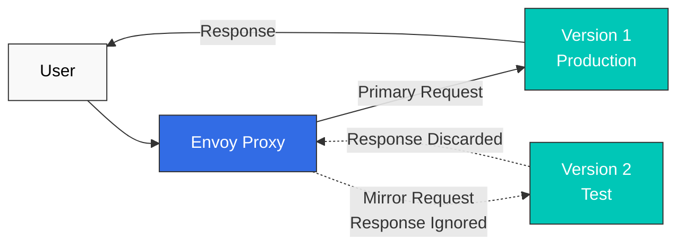

# 流量管理测验

> **支持的版本**: Istio 1.28.0 **EKS 版本**: 1.34 (Kubernetes 1.28+) **最后更新**: February 23, 2026

本测验用于测试您对 Istio 流量管理功能的理解。

## 多项选择题（1-5）

### 问题 1：VirtualService 的作用

关于 VirtualService，以下哪项说法是**正确的**？

A. 它是替代 Kubernetes Service 的资源 B. 它只能定义负载均衡算法 C. 它定义路由规则并控制流量 D. 它仅在控制平面中运行

<details>

<summary>显示答案</summary>

**答案：C**

VirtualService 是一个核心 Istio CRD，通过定义**路由规则**来控制流量。

**说明：**

* A (X)：VirtualService 不会替代 Kubernetes Service；它在 Service 之上添加路由规则
* B (X)：负载均衡由 DestinationRule 处理；VirtualService 定义路由规则
* C (O)：VirtualService 定义以下内容：
  * HTTP/TCP 路由规则
  * 基于 URL 路径的路由
  * 基于 Header 的路由
  * 基于权重的流量拆分
  * Timeout 和 Retry 设置
* D (X)：VirtualService 在数据平面的 Envoy 中运行

**示例：**

```yaml
apiVersion: networking.istio.io/v1beta1
kind: VirtualService
metadata:
  name: reviews
spec:
  hosts:
  - reviews
  http:
  - match:
    - headers:
        end-user:
          exact: jason
    route:
    - destination:
        host: reviews
        subset: v2
  - route:
    - destination:
        host: reviews
        subset: v1
```

**参考：**

* [路由](../../../service-mesh/istio/traffic-management/02-routing.md)
* [VirtualService 概念](../../../service-mesh/istio/02-basic-concepts.md#virtualservice)

</details>

***

### 问题 2：DestinationRule 功能

以下哪项**不是** DestinationRule 执行的功能？

A. 定义子集 B. 配置负载均衡算法 C. 基于 HTTP 路径的路由 D. 配置 Connection Pool

<details>

<summary>显示答案</summary>

**答案：C**

基于 HTTP 路径的路由是 **VirtualService** 的职责。

**说明：**

**DestinationRule 的主要功能：**

1. **定义子集（A - O）**

```yaml
apiVersion: networking.istio.io/v1beta1
kind: DestinationRule
metadata:
  name: reviews
spec:
  host: reviews
  subsets:
  - name: v1
    labels:
      version: v1
  - name: v2
    labels:
      version: v2
```

2. **负载均衡配置（B - O）**

```yaml
spec:
  trafficPolicy:
    loadBalancer:
      simple: ROUND_ROBIN  # RANDOM, LEAST_REQUEST, etc.
```

3. **Connection Pool 配置（D - O）**

```yaml
spec:
  trafficPolicy:
    connectionPool:
      tcp:
        maxConnections: 100
      http:
        http1MaxPendingRequests: 50
```

4. **基于 HTTP 路径的路由（C - X）**

* 这是 VirtualService 的职责：

```yaml
# Handled by VirtualService
apiVersion: networking.istio.io/v1beta1
kind: VirtualService
spec:
  http:
  - match:
    - uri:
        prefix: /api  # Path-based routing
    route:
    - destination:
        host: api-service
```

**对比表：**

| 功能              | VirtualService | DestinationRule |
| ----------------- | -------------- | --------------- |
| 路由规则          | 是             | 否              |
| 路径匹配          | 是             | 否              |
| 子集定义          | 否             | 是              |
| 负载均衡          | 否             | 是              |
| Connection Pool   | 否             | 是              |

**参考：**

* [负载均衡](https://github.com/Atom-oh/kubernetes-docs/blob/main/en/service-mesh/istio/traffic-management/05-load-balancing.md)
* [Connection Pool](https://github.com/Atom-oh/kubernetes-docs/blob/main/en/service-mesh/istio/traffic-management/08-connection-pool.md)

</details>

***

### 问题 3：Canary Deployment 流量拆分

以下 VirtualService 配置中，v1 和 v2 之间的流量比例是多少？

```yaml
apiVersion: networking.istio.io/v1beta1
kind: VirtualService
metadata:
  name: reviews
spec:
  hosts:
  - reviews
  http:
  - route:
    - destination:
        host: reviews
        subset: v1
      weight: 80
    - destination:
        host: reviews
        subset: v2
      weight: 20
```

A. v1：50%，v2：50% B. v1：80%，v2：20% C. v1：20%，v2：80% D. v1：100%，v2：0%

<details>

<summary>显示答案</summary>

**答案：B**

由于权重值为 **v1：80，v2：20**，流量会按 **80% 分配给 v1**、**20% 分配给 v2**。

**说明：**

**基于权重的流量拆分：**

* `weight` 字段表示相对比例
* 总权重：80 + 20 = 100
* v1 比例：80/100 = 80%
* v2 比例：20/100 = 20%

**Canary Deployment 阶段：**

```yaml
# Stage 1: 10% Canary
- weight: 90  # v1
- weight: 10  # v2

# Stage 2: 25% Canary
- weight: 75  # v1
- weight: 25  # v2

# Stage 3: 50% Canary
- weight: 50  # v1
- weight: 50  # v2

# Stage 4: 100% v2
- weight: 0   # v1
- weight: 100 # v2
```

**使用 Argo Rollouts 自动执行 Canary：**

```yaml
apiVersion: argoproj.io/v1alpha1
kind: Rollout
spec:
  strategy:
    canary:
      trafficRouting:
        istio:
          virtualService:
            name: reviews
      steps:
      - setWeight: 10
      - pause: {duration: 2m}
      - setWeight: 25
      - pause: {duration: 2m}
      - setWeight: 50
      - pause: {duration: 2m}
```

**参考：**

* [流量拆分](https://github.com/Atom-oh/kubernetes-docs/blob/main/en/service-mesh/istio/traffic-management/03-traffic-splitting.md)
* [Argo Rollouts 集成](../../../service-mesh/istio/advanced/08-argo-rollouts.md)

</details>

***

### 问题 4：Gateway 的用途

以下哪项**不是** Istio Gateway 的主要作用？

A. 集群外部流量进入集群内部的入口点 B. TLS 终止和证书管理 C. Service 之间的 mTLS 加密 D. 外部流量的负载均衡

<details>

<summary>显示答案</summary>

**答案：C**

Service 之间的 mTLS 加密是 **Sidecar Envoy** 和 **PeerAuthentication** 的职责。

**说明：**

**Gateway 的主要作用：**

1. **Ingress/Egress 流量入口点（A - O）**

```yaml
apiVersion: networking.istio.io/v1beta1
kind: Gateway
metadata:
  name: bookinfo-gateway
spec:
  selector:
    istio: ingressgateway  # Select Ingress Gateway Pod
  servers:
  - port:
      number: 80
      name: http
      protocol: HTTP
    hosts:
    - "*"
```

2. **TLS 终止（B - O）**

```yaml
spec:
  servers:
  - port:
      number: 443
      name: https
      protocol: HTTPS
    tls:
      mode: SIMPLE
      credentialName: bookinfo-secret  # TLS certificate
    hosts:
    - bookinfo.example.com
```

3. **外部流量负载均衡（D - O）**

* Gateway 与 Kubernetes LoadBalancer Service 集成
* 将外部流量分发到集群中

4. **Service 到 Service 的 mTLS（C - X）**

* 这是 Sidecar Envoy 的职责：

```yaml
# Enable mTLS with PeerAuthentication
apiVersion: security.istio.io/v1beta1
kind: PeerAuthentication
metadata:
  name: default
spec:
  mtls:
    mode: STRICT
```

**Gateway 与 Sidecar 的角色：**

| 功能                         | Gateway | Sidecar Envoy |
| ---------------------------- | ------- | ------------- |
| 外部 -> 内部流量             | 是      | 否            |
| TLS 终止                     | 是      | 否            |
| Service 到 Service 的 mTLS   | 否      | 是            |
| 内部路由                     | 否      | 是            |

**参考：**

* [Gateway](https://github.com/Atom-oh/kubernetes-docs/blob/main/en/service-mesh/istio/traffic-management/01-gateway.md)
* [mTLS](../../../service-mesh/istio/security/01-mtls.md)

</details>

***

### 问题 5：Timeout 和 Retry 策略

以下 VirtualService 配置表示什么含义？

```yaml
apiVersion: networking.istio.io/v1beta1
kind: VirtualService
metadata:
  name: reviews
spec:
  hosts:
  - reviews
  http:
  - route:
    - destination:
        host: reviews
    timeout: 10s
    retries:
      attempts: 3
      perTryTimeout: 2s
```

A. 原始请求之后最多 Retry 3 次，每次传递限制为 2 秒，整个请求限制为 10 秒 B. 总共在 2 秒内最多 Retry 3 次，每次尝试限制为 10 秒 C. 总共在 10 秒内无限 Retry，每次尝试限制为 2 秒 D. 10 秒后失败且不 Retry

<details>

<summary>显示答案</summary>

**答案：A**

此配置允许在原始请求之后**额外最多 Retry 3 次**，将每次传递限制为 **2 秒**，并将整个请求限制为 **10 秒**。因此，它最多可以向上游传递该请求四次。

**说明：**

**配置解读：**

```yaml
timeout: 10s           # Maximum time for entire request
retries:
  attempts: 3          # Up to 3 retries after the original request
  perTryTimeout: 2s    # Time limit for each delivery
```

**执行场景：**

```
Scenario 1: First attempt succeeds
+- 1st attempt: 1.5s elapsed -> Success
+- Total time: 1.5s

Scenario 2: Success after 2 attempts
+- 1st attempt: 2s timeout -> Failure
+- 2nd attempt: 1.8s elapsed -> Success
+- Total time: 3.8s

Scenario 3: Original request plus all 3 retries fail
+- 1st attempt: 2s timeout -> Failure
+- 2nd attempt: 2s timeout -> Failure
+- 3rd attempt: 2s timeout -> Failure
+- 4th attempt: 2s timeout -> Failure
+- Total time: about 8s
```

**Retry 条件设置：**

```yaml
retries:
  attempts: 3
  perTryTimeout: 2s
  retryOn: 5xx,connect-failure,refused-stream  # Retry conditions
```

**最佳实践：**

```yaml
# Read requests: limited retry
- match:
  - method:
      regex: "^(GET|HEAD)$"
  retries:
    attempts: 2
    perTryTimeout: 2s
    retryOn: connect-failure,refused-stream

# Write requests: disable mesh retry
- match:
  - method:
      regex: "^(POST|PATCH)$"
  retries:
    attempts: 0
```

**注意事项：**

* 为每次 Retry 预留时间时，`timeout` 应大致大于 `(1 + attempts) x perTryTimeout`，并包含 backoff
* Retry 过多可能导致级联故障
* `attempts: 0` 会禁用 Retry；`attempts: 1` 允许在原始请求后重放一次
* 默认对 POST/PATCH 禁用 mesh Retry，因为服务器可能已提交操作而仅丢失响应
* Workload mTLS 或网络加密不会使请求重放变得安全

**参考：**

* [Timeout 和 Retry](../../../service-mesh/istio/traffic-management/05-retry-timeout.md)

</details>

***

## 简答题（6-10）

### 问题 6：Argo Rollouts + Istio Canary Deployment

说明如何结合使用 Argo Rollouts 和 Istio 实现自动化 Canary Deployment 的过程。包括**所需资源**（Rollout、VirtualService、DestinationRule、AnalysisTemplate）和**自动回滚条件**。

<details>

<summary>显示答案</summary>

**答案：**

**实现 Argo Rollouts + Istio Canary Deployment：**

***

**1. 创建 Service（基础 Kubernetes Service）**

```yaml
apiVersion: v1
kind: Service
metadata:
  name: reviews
spec:
  ports:
  - port: 9080
    name: http
  selector:
    app: reviews  # Select all Pods from Rollout
```

***

**2. 定义 DestinationRule（子集定义）**

```yaml
apiVersion: networking.istio.io/v1beta1
kind: DestinationRule
metadata:
  name: reviews-destrule
spec:
  host: reviews
  subsets:
  - name: stable
    labels: {}  # Managed automatically by Rollout
  - name: canary
    labels: {}  # Managed automatically by Rollout
```

**重要**：Rollout 会自动向 Pod 添加 `rollouts-pod-template-hash` label，并使用此 label 区分子集。

***

**3. 定义 VirtualService（流量拆分）**

```yaml
apiVersion: networking.istio.io/v1beta1
kind: VirtualService
metadata:
  name: reviews-vsvc
spec:
  hosts:
  - reviews
  http:
  - name: primary  # Route name referenced by Rollout (required)
    route:
    - destination:
        host: reviews
        subset: stable
      weight: 100  # Automatically modified by Rollout
    - destination:
        host: reviews
        subset: canary
      weight: 0    # Automatically modified by Rollout
```

**要点：**

* `http[].name` 字段是必需的
* Rollout 仅自动更新此 VirtualService 中的 `weight` 值

***

**4. 定义 AnalysisTemplate（自动回滚条件）**

**成功率分析：**

```yaml
apiVersion: argoproj.io/v1alpha1
kind: AnalysisTemplate
metadata:
  name: success-rate
spec:
  args:
  - name: service-name

  metrics:
  - name: success-rate
    interval: 30s
    count: 4  # 4 measurements (total 2 minutes)
    successCondition: result >= 0.95  # 95% or higher success rate
    failureLimit: 2  # Auto rollback after 2 failures
    provider:
      prometheus:
        address: http://prometheus.istio-system:9090
        query: |
          sum(rate(
            istio_requests_total{
              destination_service_name="{{args.service-name}}",
              response_code!~"5.*"
            }[2m]
          ))
          /
          sum(rate(
            istio_requests_total{
              destination_service_name="{{args.service-name}}"
            }[2m]
          ))
```

**延迟分析：**

```yaml
apiVersion: argoproj.io/v1alpha1
kind: AnalysisTemplate
metadata:
  name: latency
spec:
  args:
  - name: service-name

  metrics:
  - name: latency-p95
    interval: 30s
    count: 4
    successCondition: result <= 500  # P95 latency 500ms or less
    failureLimit: 2
    provider:
      prometheus:
        address: http://prometheus.istio-system:9090
        query: |
          histogram_quantile(0.95,
            sum(rate(
              istio_request_duration_milliseconds_bucket{
                destination_service_name="{{args.service-name}}"
              }[2m]
            )) by (le)
          )
```

***

**5. 定义 Rollout 资源（Canary 策略）**

```yaml
apiVersion: argoproj.io/v1alpha1
kind: Rollout
metadata:
  name: reviews
spec:
  replicas: 5
  revisionHistoryLimit: 2
  selector:
    matchLabels:
      app: reviews
  template:
    metadata:
      labels:
        app: reviews
    spec:
      containers:
      - name: reviews
        image: istio/examples-bookinfo-reviews-v2:1.17.0
        ports:
        - containerPort: 9080

  # Canary deployment strategy
  strategy:
    canary:
      # Traffic control via Istio VirtualService
      trafficRouting:
        istio:
          virtualService:
            name: reviews-vsvc
            routes:
            - primary
          destinationRule:
            name: reviews-destrule
            canarySubsetName: canary
            stableSubsetName: stable

      # Define Canary stages
      steps:
      - setWeight: 10    # 10% traffic to Canary
      - pause:
          duration: 2m

      - setWeight: 25    # 25% traffic to Canary
      - pause:
          duration: 2m

      - setWeight: 50    # 50% traffic to Canary
      - pause:
          duration: 2m

      - setWeight: 75    # 75% traffic to Canary
      - pause:
          duration: 2m

      # Automatic metric analysis
      analysis:
        templates:
        - templateName: success-rate
        - templateName: latency
        startingStep: 1
        args:
        - name: service-name
          value: reviews
```

***

**6. Deployment 执行和监控**

```bash
# Install Argo Rollouts
kubectl create namespace argo-rollouts
kubectl apply -n argo-rollouts -f https://github.com/argoproj/argo-rollouts/releases/latest/download/install.yaml

# Deploy resources
kubectl apply -f service.yaml
kubectl apply -f destination-rule.yaml
kubectl apply -f virtual-service.yaml
kubectl apply -f analysis-templates.yaml
kubectl apply -f rollout.yaml

# Deploy new version
kubectl argo rollouts set image reviews \
  reviews=istio/examples-bookinfo-reviews-v3:1.17.0

# Monitor deployment status in real-time
kubectl argo rollouts get rollout reviews --watch

# Rollout dashboard
kubectl argo rollouts dashboard
```

***

**自动回滚场景：**

**场景 1：错误率 > 5%**

```
10% Canary -> Analysis starts
+- Measurement 1 (30s): 6% error rate -> Failure (1/2)
+- Measurement 2 (30s): 7% error rate -> Failure (2/2)
+- Auto rollback executed -> Stable 100%
```

**场景 2：延迟 > 500ms**

```
25% Canary -> Analysis starts
+- Measurement 1 (30s): P95 600ms -> Failure (1/2)
+- Measurement 2 (30s): P95 550ms -> Failure (2/2)
+- Auto rollback executed -> Stable 100%
```

**场景 3：所有指标正常**

```
10% Canary -> Analysis passed -> 25% Canary
25% Canary -> Analysis passed -> 50% Canary
50% Canary -> Analysis passed -> 75% Canary
75% Canary -> Analysis passed -> 100% Canary
```

***

**主要优势：**

1. **完全自动化**：无需人工干预即可推进 Deployment
2. **即时回滚**：检测到指标失败后数秒内回滚
3. **安全 Deployment**：在每个阶段自动验证
4. **一致的流程**：标准化的 Deployment 策略

**参考：**

* [流量拆分](https://github.com/Atom-oh/kubernetes-docs/blob/main/en/service-mesh/istio/traffic-management/03-traffic-splitting.md)
* [Argo Rollouts](../../../service-mesh/istio/advanced/08-argo-rollouts.md)

</details>

***

### 问题 7：Blue/Green Deployment 与 Canary Deployment

比较 Blue/Green Deployment 与 Canary Deployment 的**差异**，并说明各自的**优缺点**和**适用场景**。

<details>

<summary>显示答案</summary>

**答案：**

**Blue/Green Deployment 与 Canary Deployment 对比：**

***

**1. Deployment 方法差异**

**Blue/Green Deployment：**

```
Blue (current version) --+
                         +--> [100% Traffic]
Green (new version) -----+

Stage 1: Blue 100% active
Stage 2: Deploy and test Green (0% traffic)
Stage 3: Switch traffic (Blue 0% -> Green 100%)
Stage 4: Remove Blue
```

**Canary Deployment：**

```
Stable (current version) --> 90% -> 75% -> 50% -> 0%
Canary (new version) -----> 10% -> 25% -> 50% -> 100%

Gradually increase traffic
```

***

**2. 详细对比表**

| 项目               | Blue/Green                           | Canary                                 |
| ------------------ | ------------------------------------ | -------------------------------------- |
| **流量切换**       | 即时 100% 切换                       | 逐步增加（10% -> 100%）                |
| **回滚速度**       | 即时（单次切换）                     | 快速（仅从当前阶段回滚）               |
| **资源使用量**     | 2 倍（Blue + Green）                 | 1 倍 + 少量资源（Stable + Canary）     |
| **风险级别**       | 中等（所有用户同时受到影响）         | 低（从少量用户开始）                   |
| **测试周期**       | Deployment 前进行充分测试            | 在生产环境中逐步验证                   |
| **复杂度**         | 低                                   | 中等（需要指标分析）                   |
| **用户影响**       | 所有用户同时受到影响                 | 从少量用户开始逐步产生影响             |

***

**3. Istio 实现示例**

**Blue/Green Deployment（Argo Rollouts）：**

```yaml
apiVersion: argoproj.io/v1alpha1
kind: Rollout
metadata:
  name: myapp
spec:
  replicas: 5
  strategy:
    blueGreen:
      activeService: myapp-active    # Blue (production)
      previewService: myapp-preview  # Green (test)
      autoPromotionEnabled: false    # Manual approval
      scaleDownDelaySeconds: 30      # Remove previous version 30s after Green -> Blue switch

      # Pre-promotion testing
      prePromotionAnalysis:
        templates:
        - templateName: smoke-tests

      # Post-promotion validation
      postPromotionAnalysis:
        templates:
        - templateName: performance-tests
```

**Canary Deployment（Argo Rollouts）：**

```yaml
apiVersion: argoproj.io/v1alpha1
kind: Rollout
metadata:
  name: myapp
spec:
  replicas: 5
  strategy:
    canary:
      trafficRouting:
        istio:
          virtualService:
            name: myapp-vsvc
      steps:
      - setWeight: 10
      - pause: {duration: 2m}
      - analysis:
          templates:
          - templateName: success-rate
      - setWeight: 25
      - pause: {duration: 2m}
      - analysis:
          templates:
          - templateName: success-rate
      - setWeight: 50
      - pause: {duration: 2m}
      - setWeight: 100
```

***

**4. 优缺点对比**

**Blue/Green 优点：**

* 结构简单（仅 Blue <-> Green 切换）
* 可即时回滚（切换开关）
* 可在 Deployment 前进行充分测试
* 行为可预测

**Blue/Green 缺点：**

* 需要 2 倍资源
* 所有用户同时受到影响
* 数据库迁移复杂
* 无法逐步验证

**Canary 优点：**

* 从少量用户开始逐步验证
* 资源效率高（1 倍 + 少量资源）
* 在生产环境中进行真实验证
* 可以自动回滚（基于指标）

**Canary 缺点：**

* 配置复杂（指标、分析）
* 需要监控
* Deployment 时间更长
* 存在版本共存期

***

**5. 适用场景**

**推荐使用 Blue/Green 的场景：**

1. **重要发布**：充分测试后快速切换
2. **无数据库变更**：没有 schema 变更时
3. **需要即时回滚**：出现问题时需要快速恢复
4. **资源充足**：能够负担 2 倍资源时
5. **可预测的变更**：预先测试足以完成验证时

**示例：**

```
- Major feature releases
- Complete UI redesign
- API version upgrades
- Marketing campaign integration (switch at specific time)
```

**推荐使用 Canary 的场景：**

1. **实验性功能**：先使用少量用户进行测试
2. **资源受限**：没有 2 倍资源时
3. **逐步验证**：在生产环境中使用真实数据验证
4. **自动化 Deployment**：在 CI/CD 中自动 Deployment
5. **Microservices**：Service 依赖关系复杂时

**示例：**

```
- A/B testing
- Performance optimization
- Bug fixes
- Minor feature additions
- Daily deployment (Continuous Deployment)
```

***

**6. 混合方法**

实践中，可以结合这两种策略：

```yaml
# Stage 1: Gradual validation with Canary
10% -> 25% -> 50%

# Stage 2: Final switch with Blue/Green
50% -> 100% (instant switch)
```

**参考：**

* [流量拆分](https://github.com/Atom-oh/kubernetes-docs/blob/main/en/service-mesh/istio/traffic-management/03-traffic-splitting.md)
* [Blue/Green Deployment](https://github.com/Atom-oh/kubernetes-docs/blob/main/en/service-mesh/istio/traffic-management/03-traffic-splitting.md#bluegreen-deployment)

</details>

***

### 问题 8：流量镜像（Shadow Testing）

说明如何使用流量镜像安全地测试新版本。包括**用例**、**配置方法**和**注意事项**。

<details>

<summary>显示答案</summary>

**答案：**

**流量镜像概念：**

流量镜像是一种将生产流量复制并发送到新版本、同时**忽略响应**的技术。它也称为“shadow testing”。

***

**1. 工作原理**



**主要特性：**

* 用户只会收到 v1 的响应
* v2 的响应会被 Envoy 丢弃
* v2 的错误不会影响用户

***

**2. 配置方法**

**基础镜像（100%）：**

```yaml
apiVersion: networking.istio.io/v1beta1
kind: VirtualService
metadata:
  name: reviews
spec:
  hosts:
  - reviews
  http:
  - route:
    - destination:
        host: reviews
        subset: v1
      weight: 100  # Primary traffic
    mirror:
      host: reviews
      subset: v2  # Mirror target
    mirrorPercentage:
      value: 100  # 100% mirroring
```

**部分镜像（50%）：**

```yaml
spec:
  http:
  - route:
    - destination:
        host: reviews
        subset: v1
      weight: 100
    mirror:
      host: reviews
      subset: v2
    mirrorPercentage:
      value: 50  # Only 50% mirroring (reduce traffic load)
```

**镜像 + Canary 组合：**

```yaml
spec:
  http:
  - route:
    # Primary traffic: 90% v1, 10% v2
    - destination:
        host: reviews
        subset: v1
      weight: 90
    - destination:
        host: reviews
        subset: v2
      weight: 10

    # Mirroring: Mirror all traffic to v3 (test)
    mirror:
      host: reviews
      subset: v3
    mirrorPercentage:
      value: 100
```

***

**3. 用例**

**案例 1：新版本性能测试**

```
Purpose: Verify if v2's performance is better than v1

1. Run v1 (production) + v2 (mirror) simultaneously
2. Monitor v2's latency, CPU, memory
3. If v2 is faster than v1 -> Proceed with Canary deployment
4. If v2 is slower than v1 -> Optimize and retest
```

**案例 2：数据库迁移验证**

```
Purpose: Verify new database schema

1. v1 -> Existing DB
2. v2 -> New DB (mirroring)
3. Verify v2's query performance and error rate
4. If no issues -> Switch to v2
```

**案例 3：Bug 修复验证**

```
Purpose: Verify that bug fix actually works

1. Run v1 (with bug) + v2 (fixed version, mirror)
2. Test v2 with production traffic
3. If v2's error rate decreases -> Deploy
```

**案例 4：缓存预热**

```
Purpose: Pre-populate new version's cache

1. Warm cache via mirroring before v2 deployment
2. Once v2's cache is sufficiently populated
3. No cold start when switching to v2
```

***

**4. 监控配置**

**使用 Prometheus Query 监控镜像流量：**

```promql
# v2 (mirror) error rate
sum(rate(
  istio_requests_total{
    destination_version="v2",
    response_code=~"5.."
  }[5m]
))
/
sum(rate(
  istio_requests_total{
    destination_version="v2"
  }[5m]
))

# v1 vs v2 latency comparison
histogram_quantile(0.95,
  sum(rate(
    istio_request_duration_milliseconds_bucket[5m]
  )) by (destination_version, le)
)
```

**Grafana Dashboard：**

```yaml
# Panel 1: Error rate comparison (v1 vs v2)
# Panel 2: Latency comparison (P50, P95, P99)
# Panel 3: CPU/Memory usage
# Panel 4: Request count (v1: actual, v2: mirror)
```

***

**5. 注意事项**

**警告 - 负载增加：**

```
Mirroring increases service load.

Example:
- v1: 1000 RPS
- v2: 1000 RPS (mirror)
- Total load: 2000 RPS

Solution: Set mirrorPercentage to 50% or less
```

**警告 - 注意副作用：**

```yaml
# Don't mirror write operations!

# Bad example
POST /api/orders  # Both v1 and v2 create orders -> Duplicates!

# Good example
GET /api/orders   # Mirror only read-only operations
```

**警告 - 成本：**

```
Mirroring increases resources and costs.

- 2x computing resources
- 2x network traffic
- 2x database queries

Solution: Mirror only for short periods (1-2 days)
```

**警告 - 无法验证响应：**

```
Mirror traffic responses are discarded, so
you cannot validate response content.

Can validate:
- Error rate
- Latency
- Resource usage

Cannot validate:
- Response data accuracy
- Business logic verification
```

***

**6. 最佳实践**

```yaml
# Good examples
1. Mirror only read-only APIs
2. mirrorPercentage: 50% (reduce load)
3. Short-term testing (1-2 days)
4. Automatic validation based on metrics

# Bad examples
1. Mirroring write operations (duplicate data)
2. mirrorPercentage: 100% (overload)
3. Long-term mirroring (cost increase)
4. Manual validation (slow)
```

**参考：**

* [流量镜像](https://github.com/Atom-oh/kubernetes-docs/blob/main/en/service-mesh/istio/traffic-management/04-traffic-mirroring.md)

</details>

***

### 问题 9：本地性负载均衡（Zone Aware Routing）

说明如何使用 Istio 的本地性负载均衡在 AWS EKS 中**降低跨 AZ 成本**。包括配置示例和**预估成本节省**。

<details>

<summary>显示答案</summary>

**答案：**

**本地性负载均衡概念：**

本地性负载均衡是一项**优先路由到同一 Availability Zone (AZ) 内的 Service** 的功能，可降低网络延迟和跨 AZ 成本。

***

**1. AWS EKS 中的跨 AZ 成本**

**成本结构：**

```
Same AZ traffic: Free
Cross-AZ traffic: $0.01-0.02 per GB
Cross-Region traffic: $0.02-0.09 per GB
```

**计算示例：**

```
Service A (us-east-1a) -> Service B (us-east-1b)
- Monthly traffic: 1TB = 1000GB
- Cross-AZ cost: 1000GB x $0.01 = $10/month

If 80% traffic is routed to same AZ:
- Same AZ: 800GB x $0 = $0
- Cross-AZ: 200GB x $0.01 = $2/month
- Savings: $8/month (80%)
```

***

**2. EKS Pod 拓扑 label**

EKS Node 会自动设置拓扑 label：

```yaml
# EKS node labels (automatic)
topology.kubernetes.io/region: us-east-1
topology.kubernetes.io/zone: us-east-1a

# Pods inherit node labels
```

***

**3. 本地性负载均衡配置**

**基础配置（同一 AZ 优先）：**

```yaml
apiVersion: networking.istio.io/v1beta1
kind: DestinationRule
metadata:
  name: reviews
spec:
  host: reviews
  trafficPolicy:
    loadBalancer:
      localityLbSetting:
        enabled: true
        # 100% routing to same AZ if Pods exist there
        # Automatic failover to other AZ if not
```

**高级配置（加权分配）：**

```yaml
apiVersion: networking.istio.io/v1beta1
kind: DestinationRule
metadata:
  name: reviews
spec:
  host: reviews
  trafficPolicy:
    loadBalancer:
      localityLbSetting:
        enabled: true
        distribute:
        # Traffic originating from us-east-1a
        - from: us-east-1/us-east-1a/*
          to:
            "us-east-1/us-east-1a/*": 80  # Same AZ 80%
            "us-east-1/us-east-1b/*": 20  # Other AZ 20% (for failover)

        # Traffic originating from us-east-1b
        - from: us-east-1/us-east-1b/*
          to:
            "us-east-1/us-east-1b/*": 80  # Same AZ 80%
            "us-east-1/us-east-1a/*": 20  # Other AZ 20% (for failover)
```

**故障转移策略：**

```yaml
spec:
  trafficPolicy:
    loadBalancer:
      localityLbSetting:
        enabled: true
        failover:
        # On us-east-1a failure, route to us-east-1b
        - from: us-east-1/us-east-1a
          to: us-east-1/us-east-1b

        # On us-east-1 complete failure, route to us-west-2
        - from: us-east-1
          to: us-west-2
```

***

**4. 与 Outlier Detection 结合使用**

```yaml
apiVersion: networking.istio.io/v1beta1
kind: DestinationRule
metadata:
  name: reviews
spec:
  host: reviews
  trafficPolicy:
    # Locality Load Balancing
    loadBalancer:
      localityLbSetting:
        enabled: true

    # Outlier Detection (exclude unhealthy instances)
    outlierDetection:
      consecutiveErrors: 5
      interval: 30s
      baseEjectionTime: 30s
      maxEjectionPercent: 50
```

**行为：**

```
1. Prioritize Pods in same AZ (us-east-1a)
2. Exclude that Pod after 5 consecutive failures
3. Automatic switch to healthy Pod in other AZ (us-east-1b)
4. Retry excluded Pod after 30 seconds
```

***

**5. 成本节省计算**

**场景：大规模 Microservices 架构**

```
Assumptions:
- Number of services: 20
- Monthly traffic between each service: 500GB
- Total monthly traffic: 20 x 20 x 500GB = 200TB
- Cross-AZ ratio (without Locality LB): 70%
- Cross-AZ ratio (with Locality LB): 20%
```

**未使用 Locality LB：**

```
Cross-AZ traffic: 200TB x 70% = 140TB
Cost: 140,000GB x $0.01 = $1,400/month
```

**使用 Locality LB：**

```
Cross-AZ traffic: 200TB x 20% = 40TB
Cost: 40,000GB x $0.01 = $400/month

Savings: $1,400 - $400 = $1,000/month (71% savings)
Annual savings: $1,000 x 12 = $12,000/year
```

***

**6. 性能改进**

**延迟改进：**

```
Same AZ communication: ~1ms
Cross-AZ communication: ~2-3ms

With Locality LB:
- 30-50% reduction in average latency
- 40-60% reduction in P99 latency
```

**实际测量示例：**

```bash
# us-east-1a -> us-east-1a (same AZ)
$ kubectl exec -it pod-a -- curl -w "%{time_total}\n" http://service-b
0.001s

# us-east-1a -> us-east-1b (cross-AZ)
$ kubectl exec -it pod-a -- curl -w "%{time_total}\n" http://service-b
0.003s
```

***

**7. 监控**

**Prometheus Query：**

```promql
# Traffic distribution by Locality
sum(rate(
  istio_requests_total[5m]
)) by (
  source_workload_namespace,
  destination_workload_namespace,
  source_canonical_service,
  destination_canonical_service
)

# Cross-AZ traffic ratio
sum(rate(istio_requests_total{
  source_cluster="us-east-1a",
  destination_cluster!="us-east-1a"
}[5m]))
/
sum(rate(istio_requests_total[5m]))
```

**Grafana Dashboard：**

```yaml
Panel 1: Request count by Locality (us-east-1a, us-east-1b, us-east-1c)
Panel 2: Cross-AZ traffic ratio (target: <20%)
Panel 3: Latency (same AZ vs cross-AZ)
Panel 4: Estimated cost (cross-AZ traffic x $0.01/GB)
```

***

**8. 注意事项**

**警告 - 负载不均衡：**

```
If all traffic concentrates on one AZ, overload can occur

Solutions:
- Deploy sufficient replicas in each AZ
- Configure HPA (Horizontal Pod Autoscaler)
- Ensure minimum replicas with PodDisruptionBudget
```

**警告 - AZ 故障：**

```
If entire AZ fails, traffic moves to other AZs

Failover policy configuration required:
- from: us-east-1/us-east-1a
  to: us-east-1/us-east-1b
```

**警告 - 冷启动：**

```
On failover, Pods in other AZ may be in cold start state

Solutions:
- Maintain at least 1 replica in each AZ
- Verify ready state with Readiness Probe
```

***

**9. 最佳实践**

```yaml
# Recommended configuration
apiVersion: networking.istio.io/v1beta1
kind: DestinationRule
metadata:
  name: production-service
spec:
  host: production-service
  trafficPolicy:
    loadBalancer:
      localityLbSetting:
        enabled: true
        distribute:
        - from: us-east-1/us-east-1a/*
          to:
            "us-east-1/us-east-1a/*": 80  # Cost savings
            "us-east-1/us-east-1b/*": 15  # Failover
            "us-east-1/us-east-1c/*": 5   # Additional backup

    outlierDetection:
      consecutiveErrors: 5
      interval: 30s
      baseEjectionTime: 30s

    connectionPool:
      tcp:
        maxConnections: 100
      http:
        http1MaxPendingRequests: 50
```

**参考：**

* [Zone Aware Routing](../../../service-mesh/istio/resilience/03-zone-aware-routing.md)
* [AWS EKS 成本优化](../../../service-mesh/istio/best-practices.md#cost-optimization)

</details>

***

### 问题 10：Gateway TLS 配置

说明如何在 Istio Gateway 中配置 **TLS 终止**并设置 **HTTPS 重定向**。包括两种情况：使用 ACM (AWS Certificate Manager) 证书和使用自签名证书。

<details>

<summary>显示答案</summary>

**答案：**

**Istio Gateway TLS 配置：**

***

**1. 使用自签名证书（Kubernetes Secret）**

**步骤 1：生成 TLS 证书**

```bash
# Generate self-signed certificate (for testing)
openssl req -x509 -nodes -days 365 -newkey rsa:2048 \
  -keyout bookinfo.key \
  -out bookinfo.crt \
  -subj "/CN=bookinfo.example.com"

# Or use Let's Encrypt certificate
certbot certonly --standalone -d bookinfo.example.com
```

**步骤 2：创建 Kubernetes Secret**

```bash
# Create Secret for Istio to use
kubectl create -n istio-system secret tls bookinfo-secret \
  --key=bookinfo.key \
  --cert=bookinfo.crt

# Verify Secret
kubectl get secret bookinfo-secret -n istio-system
```

**步骤 3：配置 Gateway（HTTPS + HTTP -> HTTPS 重定向）**

```yaml
apiVersion: networking.istio.io/v1beta1
kind: Gateway
metadata:
  name: bookinfo-gateway
  namespace: default
spec:
  selector:
    istio: ingressgateway
  servers:
  # HTTPS (port 443)
  - port:
      number: 443
      name: https
      protocol: HTTPS
    tls:
      mode: SIMPLE  # One-way TLS (server certificate only)
      credentialName: bookinfo-secret  # Kubernetes Secret name
    hosts:
    - bookinfo.example.com

  # HTTP (port 80) - Redirect to HTTPS
  - port:
      number: 80
      name: http
      protocol: HTTP
    hosts:
    - bookinfo.example.com
    tls:
      httpsRedirect: true  # HTTP -> HTTPS redirect
```

**步骤 4：连接 VirtualService**

```yaml
apiVersion: networking.istio.io/v1beta1
kind: VirtualService
metadata:
  name: bookinfo-vs
  namespace: default
spec:
  hosts:
  - bookinfo.example.com
  gateways:
  - bookinfo-gateway
  http:
  - match:
    - uri:
        prefix: /productpage
    route:
    - destination:
        host: productpage
        port:
          number: 9080
    timeout: 10s
    retries:
      attempts: 3
      perTryTimeout: 2s
```

**步骤 5：测试**

```bash
# HTTPS access
curl -v https://bookinfo.example.com/productpage

# HTTP access -> HTTPS redirect verification
curl -v http://bookinfo.example.com/productpage
# Output:
# HTTP/1.1 301 Moved Permanently
# location: https://bookinfo.example.com/productpage
```

***

**2. 使用 AWS ACM 证书（NLB Annotation）**

在 AWS EKS 中，推荐的方法是在 NLB 使用 ACM 证书进行 TLS 终止。

**步骤 1：签发 ACM 证书**

```bash
# Issue ACM certificate via AWS Console or CLI
aws acm request-certificate \
  --domain-name bookinfo.example.com \
  --validation-method DNS \
  --region us-east-1

# Get ARN
aws acm list-certificates --region us-east-1
# Output: arn:aws:acm:us-east-1:123456789012:certificate/abc123
```

**步骤 2：修改 Istio Ingress Gateway Service**

```yaml
apiVersion: v1
kind: Service
metadata:
  name: istio-ingressgateway
  namespace: istio-system
  annotations:
    # Use NLB
    service.beta.kubernetes.io/aws-load-balancer-type: "nlb"

    # TLS termination (ACM certificate)
    service.beta.kubernetes.io/aws-load-balancer-ssl-cert: "arn:aws:acm:us-east-1:123456789012:certificate/abc123"
    service.beta.kubernetes.io/aws-load-balancer-ssl-ports: "443"

    # HTTP -> HTTPS redirect (NLB level)
    service.beta.kubernetes.io/aws-load-balancer-ssl-negotiation-policy: "ELBSecurityPolicy-TLS-1-2-2017-01"

    # Cross-AZ load balancing
    service.beta.kubernetes.io/aws-load-balancer-cross-zone-load-balancing-enabled: "true"

spec:
  type: LoadBalancer
  selector:
    istio: ingressgateway
    app: istio-ingressgateway
  ports:
  # HTTP (80) - NLB redirects to HTTPS(443)
  - name: http
    port: 80
    targetPort: 8080
    protocol: TCP

  # HTTPS (443) - NLB terminates TLS and forwards to 8443
  - name: https
    port: 443
    targetPort: 8443
    protocol: TCP
```

**步骤 3：配置 Gateway（TLS Passthrough）**

```yaml
apiVersion: networking.istio.io/v1beta1
kind: Gateway
metadata:
  name: bookinfo-gateway
spec:
  selector:
    istio: ingressgateway
  servers:
  # Receive as HTTP since NLB terminated TLS
  - port:
      number: 8443
      name: http
      protocol: HTTP  # NLB already terminated TLS
    hosts:
    - bookinfo.example.com
```

***

**3. Mutual TLS (mTLS) - 客户端认证**

当客户端也必须提供证书时：

```yaml
apiVersion: networking.istio.io/v1beta1
kind: Gateway
metadata:
  name: secure-gateway
spec:
  selector:
    istio: ingressgateway
  servers:
  - port:
      number: 443
      name: https-mutual
      protocol: HTTPS
    tls:
      mode: MUTUAL  # Two-way TLS
      credentialName: server-cert-secret  # Server certificate
      caCertificates: /etc/istio/client-ca/ca-chain.crt  # Client CA
    hosts:
    - secure.example.com
```

**使用客户端证书连接：**

```bash
curl --cert client.crt --key client.key \
  https://secure.example.com/api
```

***

**4. 通配符证书**

使用单个证书支持多个子域名：

```bash
# Generate wildcard certificate
openssl req -x509 -nodes -days 365 -newkey rsa:2048 \
  -keyout wildcard.key \
  -out wildcard.crt \
  -subj "/CN=*.example.com"

# Create Secret
kubectl create -n istio-system secret tls wildcard-secret \
  --key=wildcard.key \
  --cert=wildcard.crt
```

```yaml
apiVersion: networking.istio.io/v1beta1
kind: Gateway
metadata:
  name: wildcard-gateway
spec:
  selector:
    istio: ingressgateway
  servers:
  - port:
      number: 443
      name: https
      protocol: HTTPS
    tls:
      mode: SIMPLE
      credentialName: wildcard-secret
    hosts:
    - "*.example.com"  # Allow all subdomains
```

**使用 VirtualService 按子域名路由：**

```yaml
apiVersion: networking.istio.io/v1beta1
kind: VirtualService
metadata:
  name: multi-subdomain
spec:
  hosts:
  - api.example.com
  - web.example.com
  - admin.example.com
  gateways:
  - wildcard-gateway
  http:
  - match:
    - uri:
        prefix: /api
      authority:
        exact: api.example.com
    route:
    - destination:
        host: api-service

  - match:
    - authority:
        exact: web.example.com
    route:
    - destination:
        host: web-service

  - match:
    - authority:
        exact: admin.example.com
    route:
    - destination:
        host: admin-service
```

***

**5. TLS 版本和 Cipher Suite 设置**

```yaml
apiVersion: networking.istio.io/v1beta1
kind: Gateway
metadata:
  name: secure-gateway
spec:
  selector:
    istio: ingressgateway
  servers:
  - port:
      number: 443
      name: https
      protocol: HTTPS
    tls:
      mode: SIMPLE
      credentialName: bookinfo-secret
      minProtocolVersion: TLSV1_2  # Allow only TLS 1.2 and above
      maxProtocolVersion: TLSV1_3
      cipherSuites:
      - ECDHE-ECDSA-AES256-GCM-SHA384
      - ECDHE-RSA-AES256-GCM-SHA384
      - ECDHE-ECDSA-AES128-GCM-SHA256
    hosts:
    - bookinfo.example.com
```

***

**6. 自动续订证书（cert-manager）**

```bash
# Install cert-manager
kubectl apply -f https://github.com/cert-manager/cert-manager/releases/download/v1.13.0/cert-manager.yaml

# Create Let's Encrypt Issuer
kubectl apply -f - <<EOF
apiVersion: cert-manager.io/v1
kind: ClusterIssuer
metadata:
  name: letsencrypt-prod
spec:
  acme:
    server: https://acme-v02.api.letsencrypt.org/directory
    email: admin@example.com
    privateKeySecretRef:
      name: letsencrypt-prod
    solvers:
    - http01:
        ingress:
          class: istio
EOF

# Create Certificate resource (auto-renewal)
kubectl apply -f - <<EOF
apiVersion: cert-manager.io/v1
kind: Certificate
metadata:
  name: bookinfo-cert
  namespace: istio-system
spec:
  secretName: bookinfo-secret
  issuerRef:
    name: letsencrypt-prod
    kind: ClusterIssuer
  dnsNames:
  - bookinfo.example.com
EOF
```

***

**7. 最佳实践**

```yaml
# Recommended configuration
apiVersion: networking.istio.io/v1beta1
kind: Gateway
metadata:
  name: production-gateway
spec:
  selector:
    istio: ingressgateway
  servers:
  # HTTPS (recommended)
  - port:
      number: 443
      name: https
      protocol: HTTPS
    tls:
      mode: SIMPLE
      credentialName: prod-tls-secret
      minProtocolVersion: TLSV1_2  # Security hardening
    hosts:
    - "*.example.com"

  # HTTP -> HTTPS redirect
  - port:
      number: 80
      name: http
      protocol: HTTP
    hosts:
    - "*.example.com"
    tls:
      httpsRedirect: true
```

**说明：**

* 使用 TLS 1.2 或更高版本
* 配置强 Cipher Suites
* 自动续订证书（cert-manager）
* 启用 HTTP -> HTTPS 重定向
* 不要在生产环境中使用自签名证书
* 不要使用 TLS 1.0/1.1

**参考：**

* [Gateway](https://github.com/Atom-oh/kubernetes-docs/blob/main/en/service-mesh/istio/traffic-management/01-gateway.md)
* [TLS 配置](https://github.com/Atom-oh/kubernetes-docs/blob/main/en/service-mesh/istio/traffic-management/01-gateway.md#tls-configuration)

</details>

***

## 分数计算

* 多项选择题 1-5：每题 10 分（共 50 分）
* 简答题 6-10：每题 10 分（共 50 分）
* **总分：100 分**

**评估标准：**

* 90-100 分：优秀（Istio 流量管理专家）
* 80-89 分：良好（具备生产运维能力）
* 70-79 分：一般（建议进一步学习）
* 60-69 分：低于平均水平（需要复习基础概念）
* 0-59 分：需要重新学习

## 学习资源

* [流量管理文档](../../../service-mesh/istio/traffic-management/README.md)
* [VirtualService](../../../service-mesh/istio/traffic-management/02-routing.md)
* [Gateway](https://github.com/Atom-oh/kubernetes-docs/blob/main/en/service-mesh/istio/traffic-management/01-gateway.md)
* [流量拆分](https://github.com/Atom-oh/kubernetes-docs/blob/main/en/service-mesh/istio/traffic-management/03-traffic-splitting.md)
* [Argo Rollouts](../../../service-mesh/istio/advanced/08-argo-rollouts.md)
