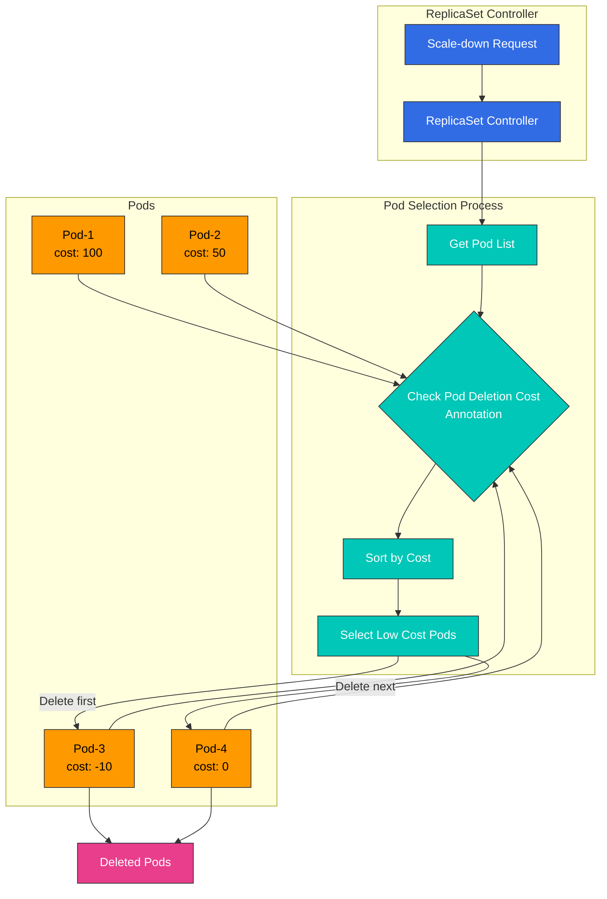

# 第 3 部分：高级功能

## EKS 中 Custom Scheduler 的实现案例

在本节中，我们将探讨在 EKS 中实现 custom scheduler 的真实案例。

### 案例 1：GPU Workload 优化 Scheduler

在运行 AI/ML workload 的 EKS 集群中，高效利用 GPU 资源非常重要。以下是一个优化 GPU workload 的 custom scheduler 实现案例。

#### GPU Workload 优化 Scheduler 架构

下图展示了 GPU workload 优化 scheduler 的架构：

#### GPU Workload 调度工作流

下图展示了 GPU workload 调度工作流：

#### 需求

1. 基于 GPU 内存需求选择 Node
2. 基于 GPU 型号（例如 NVIDIA A100、V100、T4 等）选择 Node
3. 考虑 GPU 利用率选择 Node
4. 在多 GPU 实例上优化 GPU 共享

#### 实现方法

此案例使用 scheduler framework plugin 方法。

1. **Node 标记**：将 GPU 相关信息作为 label 添加到每个 Node。

```bash
# Add GPU model label
kubectl label node <node-name> gpu.nvidia.com/model=A100

# Add GPU memory label
kubectl label node <node-name> gpu.nvidia.com/memory=40960

# Add GPU count label
kubectl label node <node-name> gpu.nvidia.com/count=8
```

2. **Custom Scheduler Plugin 实现**：

```go
// GPUTopologyPlugin is a scheduler plugin that considers GPU topology.
type GPUTopologyPlugin struct {
    handle framework.Handle
}

// Filter filters nodes based on GPU requirements.
func (gtp *GPUTopologyPlugin) Filter(ctx context.Context, state *framework.CycleState, pod *v1.Pod, node *framework.NodeInfo) *framework.Status {
    // Check GPU requirements
    gpuReq := getGPURequest(pod)
    if gpuReq == 0 {
        return framework.NewStatus(framework.Success, "")
    }

    // Check node's GPU info
    gpuCount := getGPUCount(node.Node())
    if gpuCount < gpuReq {
        return framework.NewStatus(framework.Unschedulable, "Not enough GPUs")
    }

    // Check GPU model requirements
    requiredModel := getRequiredGPUModel(pod)
    if requiredModel != "" && getGPUModel(node.Node()) != requiredModel {
        return framework.NewStatus(framework.Unschedulable, "GPU model mismatch")
    }

    // Check GPU memory requirements
    memReq := getGPUMemoryRequest(pod)
    if memReq > 0 && getGPUMemory(node.Node()) < memReq {
        return framework.NewStatus(framework.Unschedulable, "Not enough GPU memory")
    }

    return framework.NewStatus(framework.Success, "")
}

// Score assigns scores to nodes based on GPU topology.
func (gtp *GPUTopologyPlugin) Score(ctx context.Context, state *framework.CycleState, pod *v1.Pod, nodeName string) (int64, *framework.Status) {
    nodeInfo, err := gtp.handle.SnapshotSharedLister().NodeInfos().Get(nodeName)
    if err != nil {
        return 0, framework.NewStatus(framework.Error, fmt.Sprintf("Error getting node info: %v", err))
    }

    node := nodeInfo.Node()

    // Return default score if no GPU requirements
    gpuReq := getGPURequest(pod)
    if gpuReq == 0 {
        return 0, framework.NewStatus(framework.Success, "")
    }

    // Check GPU utilization
    gpuUtilization := getGPUUtilization(node)

    // Calculate score based on GPU count
    gpuCount := getGPUCount(node)

    // Assign higher score to nodes with available GPUs slightly more than requested
    // This is for efficient GPU resource utilization
    score := 100 - int64(math.Abs(float64(gpuCount-gpuReq))*10)
    if score < 0 {
        score = 0
    }

    // Assign higher score to nodes with low GPU utilization
    utilizationScore := int64((1.0 - gpuUtilization) * 100)

    // Final score is weighted average of both scores
    finalScore := (score * 7 + utilizationScore * 3) / 10

    return finalScore, framework.NewStatus(framework.Success, "")
}
```

3. **Scheduler 配置**：

```yaml
apiVersion: kubescheduler.config.k8s.io/v1beta1
kind: KubeSchedulerConfiguration
clientConnection:
  kubeconfig: /etc/kubernetes/scheduler.conf
profiles:
- schedulerName: gpu-scheduler
  plugins:
    filter:
      enabled:
      - name: GPUTopologyPlugin
    score:
      enabled:
      - name: GPUTopologyPlugin
        weight: 10
  pluginConfig:
  - name: GPUTopologyPlugin
    args: {}
```

4. **在 Pod Spec 中指定 GPU 需求**：

```yaml
apiVersion: v1
kind: Pod
metadata:
  name: gpu-pod
  annotations:
    gpu.nvidia.com/model: "A100"
    gpu.nvidia.com/memory: "40960"
spec:
  schedulerName: gpu-scheduler
  containers:
  - name: gpu-container
    image: nvidia/cuda:11.6.0-base-ubuntu20.04
    resources:
      limits:
        nvidia.com/gpu: 2
```

### 案例 2：Network Locality 优化 Scheduler

在 EKS 集群中，你可以实现一个考虑 network locality 的 custom scheduler，以优化网络成本。

#### Network Locality 优化 Scheduler 架构

下图展示了 network locality 优化 scheduler 的架构。

#### Network Locality 优化工作流

下图展示了 network locality 优化 scheduler 的工作流。

## 使用 Pod Deletion Cost 进行 Scale-Down 优化

Pod Deletion Cost 是 Kubernetes 1.22 引入的一项功能，它允许你在 ReplicaSet、Deployment 或 StatefulSet 等 workload 资源缩容时，控制哪些 Pod 先被删除。这对于优化应用可用性和性能很有用。

### Pod Deletion Cost 概念

Pod Deletion Cost 通过 `controller.kubernetes.io/pod-deletion-cost` annotation 为每个 Pod 分配一个成本值。在缩容期间，成本较低的 Pod 会先被删除。

**关键特性**：

* 默认值：0
* 范围：-2147483648 到 2147483647（int32 范围）
* 值越高 = 越重要的 Pod（越晚删除）
* 值越低 = 越不重要的 Pod（越早删除）

### Pod Deletion Cost 架构

下图展示了 Pod Deletion Cost 在缩容期间的工作方式：



### 使用场景

#### 1. 保护已预热的缓存 Pod

当应用在启动时加载缓存时，你可以优先保留已预热的 Pod 以优化性能。

```yaml
apiVersion: v1
kind: Pod
metadata:
  name: app-pod-warmed-up
  annotations:
    controller.kubernetes.io/pod-deletion-cost: "100"  # Cache warmed up
spec:
  containers:
  - name: app
    image: my-app:latest
    lifecycle:
      postStart:
        exec:
          command:
          - /bin/sh
          - -c
          - |
            # Cache warm-up
            /app/warm-cache.sh
            # Increase deletion cost after warm-up complete
            kubectl annotate pod $HOSTNAME \
              controller.kubernetes.io/pod-deletion-cost=100 --overwrite
```

#### 2. 保护具有活动连接的 Pod

保护具有 WebSocket 或长时间运行连接的 Pod：

```go
// Go example: Dynamically update deletion cost based on active connection count
package main

import (
    "context"
    "fmt"
    "os"
    "time"

    metav1 "k8s.io/apimachinery/pkg/apis/meta/v1"
    "k8s.io/client-go/kubernetes"
    "k8s.io/client-go/rest"
)

type ConnectionTracker struct {
    activeConnections int
    k8sClient         *kubernetes.Clientset
    podName           string
    namespace         string
}

func NewConnectionTracker() (*ConnectionTracker, error) {
    config, err := rest.InClusterConfig()
    if err != nil {
        return nil, err
    }

    clientset, err := kubernetes.NewForConfig(config)
    if err != nil {
        return nil, err
    }

    return &ConnectionTracker{
        k8sClient: clientset,
        podName:   os.Getenv("POD_NAME"),
        namespace: os.Getenv("POD_NAMESPACE"),
    }, nil
}

func (ct *ConnectionTracker) UpdateDeletionCost() error {
    // Set deletion cost proportional to active connection count
    // 10 cost per connection, max 1000
    cost := ct.activeConnections * 10
    if cost > 1000 {
        cost = 1000
    }

    pod, err := ct.k8sClient.CoreV1().Pods(ct.namespace).Get(
        context.TODO(),
        ct.podName,
        metav1.GetOptions{},
    )
    if err != nil {
        return err
    }

    if pod.Annotations == nil {
        pod.Annotations = make(map[string]string)
    }

    pod.Annotations["controller.kubernetes.io/pod-deletion-cost"] = fmt.Sprintf("%d", cost)

    _, err = ct.k8sClient.CoreV1().Pods(ct.namespace).Update(
        context.TODO(),
        pod,
        metav1.UpdateOptions{},
    )

    return err
}

func (ct *ConnectionTracker) StartPeriodicUpdate() {
    ticker := time.NewTicker(30 * time.Second)
    defer ticker.Stop()

    for range ticker.C {
        if err := ct.UpdateDeletionCost(); err != nil {
            fmt.Printf("Failed to update deletion cost: %v\n", err)
        }
    }
}

func (ct *ConnectionTracker) OnConnectionOpen() {
    ct.activeConnections++
}

func (ct *ConnectionTracker) OnConnectionClose() {
    ct.activeConnections--
    if ct.activeConnections < 0 {
        ct.activeConnections = 0
    }
}
```

#### 3. 保护具有 Data Locality 的 Pod

保护在特定 Node 上缓存或使用数据的 Pod：

```yaml
apiVersion: apps/v1
kind: Deployment
metadata:
  name: data-processor
spec:
  replicas: 5
  selector:
    matchLabels:
      app: data-processor
  template:
    metadata:
      labels:
        app: data-processor
      annotations:
        # Set high cost for pods with high data locality
        controller.kubernetes.io/pod-deletion-cost: "50"
    spec:
      affinity:
        podAntiAffinity:
          preferredDuringSchedulingIgnoredDuringExecution:
          - weight: 100
            podAffinityTerm:
              labelSelector:
                matchExpressions:
                - key: app
                  operator: In
                  values:
                  - data-processor
              topologyKey: kubernetes.io/hostname
      containers:
      - name: processor
        image: data-processor:latest
        env:
        - name: POD_NAME
          valueFrom:
            fieldRef:
              fieldPath: metadata.name
        - name: POD_NAMESPACE
          valueFrom:
            fieldRef:
              fieldPath: metadata.namespace
```

#### 4. 优先删除新启动的 Pod

新启动的 Pod 可能尚未完全预热，因此先删除它们：

```yaml
apiVersion: v1
kind: Pod
metadata:
  name: app-pod-new
  annotations:
    controller.kubernetes.io/pod-deletion-cost: "-50"  # New pods have low cost
spec:
  containers:
  - name: app
    image: my-app:latest
    lifecycle:
      postStart:
        exec:
          command:
          - /bin/sh
          - -c
          - |
            # Initially low cost
            sleep 60
            # Change to normal cost after 1 minute
            kubectl annotate pod $HOSTNAME \
              controller.kubernetes.io/pod-deletion-cost=0 --overwrite
```

### 与 Horizontal Pod Autoscaler 集成

与 HPA 一起使用时，你可以利用 Pod Deletion Cost 在缩容期间保护重要的 Pod：

```yaml
apiVersion: autoscaling/v2
kind: HorizontalPodAutoscaler
metadata:
  name: app-hpa
spec:
  scaleTargetRef:
    apiVersion: apps/v1
    kind: Deployment
    name: app
  minReplicas: 3
  maxReplicas: 10
  metrics:
  - type: Resource
    resource:
      name: cpu
      target:
        type: Utilization
        averageUtilization: 70
  behavior:
    scaleDown:
      stabilizationWindowSeconds: 300  # 5-minute stabilization period
      policies:
      - type: Percent
        value: 50
        periodSeconds: 60
      - type: Pods
        value: 2
        periodSeconds: 60
      selectPolicy: Min
```

### Dynamic Pod Deletion Cost 更新模式

当 Pod 的重要性实时变化时，你可以动态更新 deletion cost：

```python
# Python example: Dynamic deletion cost update based on metrics
from kubernetes import client, config
import time
import os

class DeletionCostManager:
    def __init__(self):
        config.load_incluster_config()
        self.v1 = client.CoreV1Api()
        self.pod_name = os.environ.get('POD_NAME')
        self.namespace = os.environ.get('POD_NAMESPACE')

    def calculate_cost(self, metrics):
        """
        Calculate deletion cost based on metrics
        - Active request count
        - Cache hit rate
        - Average response time
        """
        base_cost = 0

        # Higher cost for more active requests
        active_requests = metrics.get('active_requests', 0)
        base_cost += active_requests * 5

        # Higher cost for higher cache hit rate
        cache_hit_rate = metrics.get('cache_hit_rate', 0)
        base_cost += int(cache_hit_rate * 100)

        # Higher cost for faster response time (optimized pod)
        avg_response_time = metrics.get('avg_response_time_ms', 1000)
        if avg_response_time < 100:
            base_cost += 50
        elif avg_response_time < 500:
            base_cost += 20

        # Limit to max 1000
        return min(base_cost, 1000)

    def update_deletion_cost(self, cost):
        """Update pod's deletion cost annotation"""
        try:
            pod = self.v1.read_namespaced_pod(
                name=self.pod_name,
                namespace=self.namespace
            )

            if pod.metadata.annotations is None:
                pod.metadata.annotations = {}

            pod.metadata.annotations['controller.kubernetes.io/pod-deletion-cost'] = str(cost)

            self.v1.patch_namespaced_pod(
                name=self.pod_name,
                namespace=self.namespace,
                body=pod
            )

            print(f"Updated deletion cost to {cost}")
        except Exception as e:
            print(f"Error updating deletion cost: {e}")

    def run(self, get_metrics_func):
        """Periodically collect metrics and update deletion cost"""
        while True:
            try:
                metrics = get_metrics_func()
                cost = self.calculate_cost(metrics)
                self.update_deletion_cost(cost)
            except Exception as e:
                print(f"Error in main loop: {e}")

            time.sleep(30)  # Update every 30 seconds

# Usage example
def get_app_metrics():
    """Collect application metrics (implementation required)"""
    return {
        'active_requests': 15,
        'cache_hit_rate': 0.85,
        'avg_response_time_ms': 120
    }

if __name__ == '__main__':
    manager = DeletionCostManager()
    manager.run(get_app_metrics)
```

### 监控和调试

如何验证 Pod Deletion Cost 正常工作：

```bash
# 1. Check pod's deletion cost
kubectl get pods -o custom-columns=\
NAME:.metadata.name,\
DELETION_COST:.metadata.annotations.controller\.kubernetes\.io/pod-deletion-cost

# 2. Check all pod deletion costs for a specific Deployment
kubectl get pods -l app=my-app -o json | \
  jq -r '.items[] | "\(.metadata.name): \(.metadata.annotations["controller.kubernetes.io/pod-deletion-cost"] // "0")"'

# 3. Scale-down simulation
kubectl scale deployment my-app --replicas=3

# 4. Check which pods were deleted
kubectl get events --field-selector involvedObject.kind=Pod,reason=Killing \
  --sort-by='.lastTimestamp'
```

### Prometheus Metrics 收集

```yaml
# ServiceMonitor for Pod Deletion Cost metrics
apiVersion: monitoring.coreos.com/v1
kind: ServiceMonitor
metadata:
  name: pod-deletion-cost-monitor
  namespace: monitoring
spec:
  selector:
    matchLabels:
      app: my-app
  endpoints:
  - port: metrics
    interval: 30s
    relabelings:
    - sourceLabels: [__meta_kubernetes_pod_annotation_controller_kubernetes_io_pod_deletion_cost]
      targetLabel: pod_deletion_cost
```

### Grafana Dashboard

```json
{
  "dashboard": {
    "title": "Pod Deletion Cost Monitoring",
    "panels": [
      {
        "title": "Pod Deletion Cost Distribution",
        "targets": [
          {
            "expr": "kube_pod_annotations{annotation_controller_kubernetes_io_pod_deletion_cost!=\"\"}"
          }
        ],
        "type": "graph"
      },
      {
        "title": "Pods by Deletion Cost Range",
        "targets": [
          {
            "expr": "count(kube_pod_annotations{annotation_controller_kubernetes_io_pod_deletion_cost=~\"[0-9]+\"}) by (annotation_controller_kubernetes_io_pod_deletion_cost)"
          }
        ],
        "type": "piechart"
      }
    ]
  }
}
```

### 最佳实践

1. **使用一致的成本范围**：在团队内定义并使用一致的成本范围。
   * `-100 to -1`：优先删除（新 Pod、正在预热的 Pod）
   * `0`：默认（普通 Pod）
   * `1 to 100`：中等重要性（具有活动连接的 Pod）
   * `100 to 1000`：高重要性（具有已预热缓存的 Pod、具有许多连接的 Pod）
2. **动态更新**：当 Pod 状态变化时动态更新 deletion cost。
3. **设置上限**：为 deletion cost 设置上限，以防止值过大导致问题。
4. **监控**：监控 deletion cost 的分布，以验证它们按预期工作。
5. **测试**：在应用到生产环境之前，在预发布环境中测试缩容行为。
6. **文档化**：记录每个成本范围的含义。

### 限制

* **与 Pod Disruption Budget 的交互**：一起使用时，PDB 优先。
* **Kubernetes 版本**：仅在 1.22 及以上版本可用。
* **Workload 类型限制**：仅适用于使用 ReplicaSet controller 的 workload（Deployment、ReplicaSet）。
* **Node 故障**：当 Node 完全故障时，不会考虑 deletion cost。

## Custom Scheduler 监控和调试

实现 custom scheduler 后，监控和调试非常重要。本节介绍如何监控和调试 custom scheduler。

### 监控架构

下图展示了在 EKS 中监控 custom scheduler 的架构。

### 关键监控指标

下图展示了 custom scheduler 的关键监控指标及其关系：

### 日志

你可以通过检查 custom scheduler 的日志来了解调度决策：

```bash
kubectl logs -n kube-system -l app=custom-scheduler
```

### 检查 Events

你可以检查与 Pod 调度相关的 events：

```bash
kubectl get events --field-selector involvedObject.name=<pod-name>
```

### Metrics 收集

你可以使用 Prometheus 收集 custom scheduler metrics：

```yaml
apiVersion: monitoring.coreos.com/v1
kind: ServiceMonitor
metadata:
  name: custom-scheduler
  namespace: monitoring
spec:
  selector:
    matchLabels:
      app: custom-scheduler
  endpoints:
  - port: metrics
    interval: 15s
```

### Dashboard 配置

你可以使用 Grafana 可视化 custom scheduler metrics：

```yaml
apiVersion: v1
kind: ConfigMap
metadata:
  name: custom-scheduler-dashboard
  namespace: monitoring
data:
  custom-scheduler-dashboard.json: |
    {
      "annotations": {
        "list": [
          {
            "builtIn": 1,
            "datasource": "-- Grafana --",
            "enable": true,
            "hide": true,
            "iconColor": "rgba(0, 211, 255, 1)",
            "name": "Annotations & Alerts",
            "type": "dashboard"
          }
        ]
      },
      "editable": true,
      "gnetId": null,
      "graphTooltip": 0,
      "id": 1,
      "links": [],
      "panels": [
        {
          "aliasColors": {},
          "bars": false,
          "dashLength": 10,
          "dashes": false,
          "datasource": null,
          "fieldConfig": {
            "defaults": {
              "custom": {}
            },
            "overrides": []
          },
          "fill": 1,
          "fillGradient": 0,
          "gridPos": {
            "h": 8,
            "w": 12,
            "x": 0,
            "y": 0
          },
          "hiddenSeries": false,
          "id": 2,
          "legend": {
            "avg": false,
            "current": false,
            "max": false,
            "min": false,
            "show": true,
            "total": false,
            "values": false
          },
          "lines": true,
          "linewidth": 1,
          "nullPointMode": "null",
          "options": {
            "alertThreshold": true
          },
          "percentage": false,
          "pluginVersion": "7.2.0",
          "pointradius": 2,
          "points": false,
          "renderer": "flot",
          "seriesOverrides": [],
          "spaceLength": 10,
          "stack": false,
          "steppedLine": false,
          "targets": [
            {
              "expr": "scheduler_scheduling_duration_seconds_count",
              "interval": "",
              "legendFormat": "",
              "refId": "A"
            }
          ],
          "thresholds": [],
          "timeFrom": null,
          "timeRegions": [],
          "timeShift": null,
          "title": "Scheduling Duration",
          "tooltip": {
            "shared": true,
            "sort": 0,
            "value_type": "individual"
          },
          "type": "graph",
          "xaxis": {
            "buckets": null,
            "mode": "time",
            "name": null,
            "show": true,
            "values": []
          },
          "yaxes": [
            {
              "format": "short",
              "label": null,
              "logBase": 1,
              "max": null,
              "min": null,
              "show": true
            },
            {
              "format": "short",
              "label": null,
              "logBase": 1,
              "max": null,
              "min": null,
              "show": true
            }
          ],
          "yaxis": {
            "align": false,
            "alignLevel": null
          }
        }
      ],
      "schemaVersion": 26,
      "style": "dark",
      "tags": [],
      "templating": {
        "list": []
      },
      "time": {
        "from": "now-6h",
        "to": "now"
      },
      "timepicker": {},
      "timezone": "",
      "title": "Custom Scheduler Dashboard",
      "uid": "custom-scheduler",
      "version": 1
    }
```

## 结论

Custom scheduler 是一种强大的方式，可根据特定需求自定义 Kubernetes 调度行为。在 EKS 中，你可以通过多种方法实现 custom scheduler，包括 multiple scheduler 方法、scheduler extender 方法和 scheduler framework plugin 方法。

Custom scheduler 可用于 GPU workload 优化和 network locality 优化等多种场景。实现 custom scheduler 时，同时配置监控和调试工具也很重要。

## 测验

要测试你在本章中学到的内容，请尝试完成[主题测验](../quizzes/scheduling/02-custom-scheduler-part3-quiz.md)。
