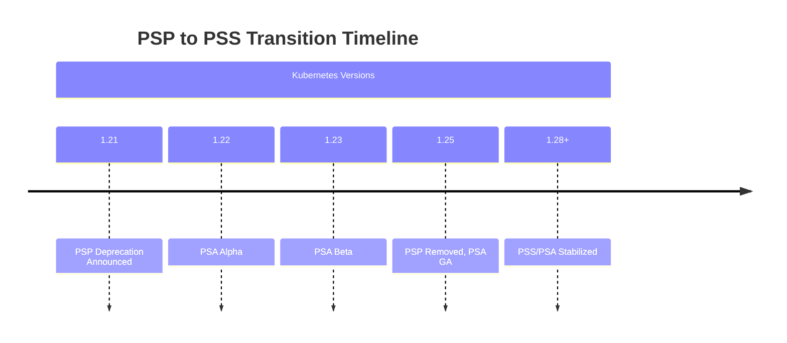
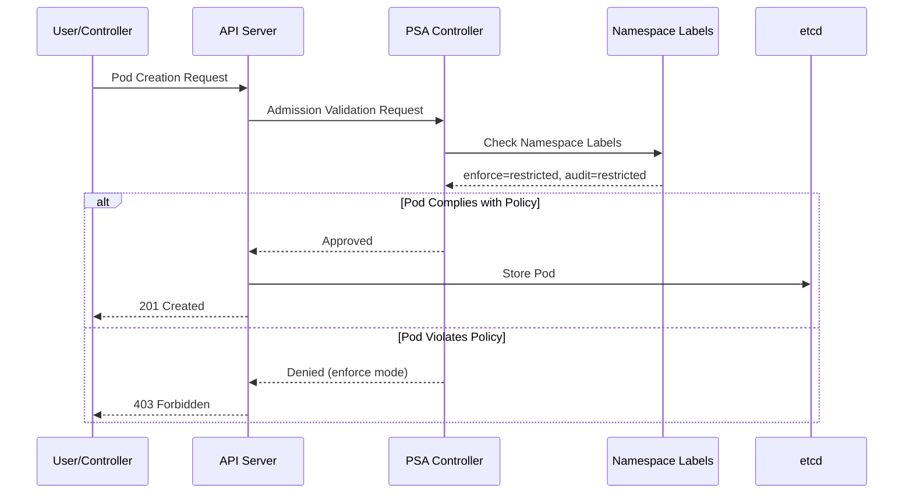
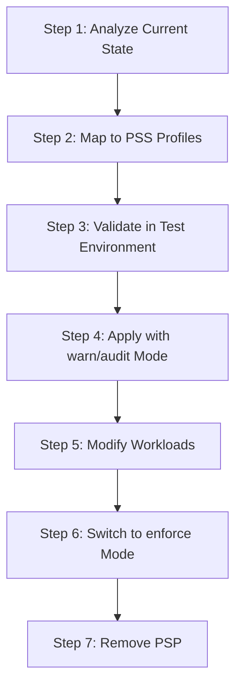

# Pod Security Standards (PSS)

> **支持版本**: Kubernetes 1.31, 1.32, 1.33
> **最后更新**: February 22, 2026

Pod Security Standards (PSS) 是 Kubernetes 中用于 Pod 安全的标准化 policy framework。本文档介绍 PSS 概念、配置方法，以及在 EKS 环境中的实施方式。

## 目录

1. [从 PSP 到 PSS 的演进](#evolution-from-psp-to-pss)
2. [Pod Security Admission (PSA) Controller](#pod-security-admission-psa-controller)
3. [安全级别](#security-levels)
4. [执行模式](#enforcement-modes)
5. [Namespace 级别配置](#namespace-level-configuration)
6. [从 PSP 迁移到 PSS](#migration-from-psp-to-pss)
7. [EKS 默认值和配置](#eks-defaults-and-configuration)
8. [安全 Profile 详细信息](#security-profile-details)
9. [豁免配置](#exemptions-configuration)
10. [渐进式采用的最佳实践](#best-practices-for-gradual-adoption)

---

## 从 PSP 到 PSS 的演进

### PodSecurityPolicy (PSP) 的历史

PodSecurityPolicy (PSP) 最早在 Kubernetes 1.3 中作为 Pod 安全机制引入。然而，由于以下问题，它在 Kubernetes 1.21 中被弃用，并在 1.25 中被完全移除：

```
┌─────────────────────────────────────────────────────────────────┐
│                    Key Issues with PSP                           │
├─────────────────────────────────────────────────────────────────┤
│ 1. Complex RBAC binding requirements                             │
│ 2. Implicit policy application (unclear which policy applies)    │
│ 3. User vs workload permission confusion                         │
│ 4. No dry-run mode                                               │
│ 5. Limited audit capabilities                                    │
└─────────────────────────────────────────────────────────────────┘
```

### PSS 简介

Pod Security Standards (PSS) 和 Pod Security Admission (PSA) 在 Kubernetes 1.22 中作为 alpha 引入，在 1.23 中进入 beta，并在 1.25 中达到 GA (Generally Available)。



### PSP 与 PSS 对比

| 功能 | PodSecurityPolicy (PSP) | Pod Security Standards (PSS) |
|---------|------------------------|------------------------------|
| **启用方式** | Admission Controller plugin | 内置（默认启用） |
| **Policy 定义** | 自定义 PSP resources | 三个预定义 profiles |
| **Policy 绑定** | 复杂的 RBAC binding | 简单的 namespace labels |
| **范围** | Cluster-wide 或 namespace | Namespace 级别 |
| **Dry-run** | 不支持 | 支持 warn/audit modes |
| **审计** | 有限 | 内置 audit 支持 |
| **灵活性** | 高（细粒度控制） | 中等（标准化 profiles） |
| **复杂度** | 高 | 低 |

---

## Pod Security Admission (PSA) Controller

### PSA 架构

Pod Security Admission (PSA) 是 Kubernetes API server 中内置的 Admission Controller，用于拦截 Pod 创建和更新请求，并根据 Pod Security Standards 对其进行验证。

```
┌─────────────────────────────────────────────────────────────────────────┐
│                         Kubernetes API Server                            │
│  ┌─────────────────────────────────────────────────────────────────┐    │
│  │                    Admission Controllers                         │    │
│  │  ┌───────────┐  ┌───────────┐  ┌─────────────────────────────┐  │    │
│  │  │ Mutating  │──▶│Validating │──▶│  Pod Security Admission    │  │    │
│  │  │ Webhooks  │  │ Webhooks  │  │  (PSA Controller)           │  │    │
│  │  └───────────┘  └───────────┘  │  ┌───────────────────────┐  │  │    │
│  │                                 │  │ Security Standards    │  │  │    │
│  │                                 │  │ • Privileged          │  │  │    │
│  │                                 │  │ • Baseline            │  │  │    │
│  │                                 │  │ • Restricted          │  │  │    │
│  │                                 │  └───────────────────────┘  │  │    │
│  │                                 └─────────────────────────────┘  │    │
│  └─────────────────────────────────────────────────────────────────┘    │
└─────────────────────────────────────────────────────────────────────────┘
```

### PSA 工作方式



### 验证 PSA 状态

在 Kubernetes 1.25 及以上版本中，PSA 默认启用：

```bash
# Check API server configuration (not directly accessible in EKS managed control plane)
# For local clusters:
kubectl get pods -n kube-system -l component=kube-apiserver -o yaml | grep -A5 "enable-admission-plugins"

# Check PSA feature gate
kubectl get --raw /metrics | grep pod_security
```

---

## 安全级别

PSS 定义了三个安全级别（profiles）。每个级别都会应用逐步更严格的安全约束。

### 1. Privileged

最宽松的 policy，没有任何限制。适用于系统和基础设施级别的 workloads。

```yaml
# Privileged level: Everything is allowed
# Use cases: System daemons, CNI plugins, monitoring agents

apiVersion: v1
kind: Pod
metadata:
  name: privileged-pod
  namespace: kube-system
spec:
  hostNetwork: true      # Allowed
  hostPID: true          # Allowed
  hostIPC: true          # Allowed
  containers:
  - name: privileged-container
    image: nginx
    securityContext:
      privileged: true   # Allowed
      runAsRoot: true    # Allowed
```

**Privileged 级别允许：**
- Host network、PID、IPC namespaces
- Privileged containers
- 所有 capabilities
- HostPath mounts
- 任意 user/group IDs

### 2. Baseline

应用最小限制，以防止已知的 privilege escalation。适用于大多数通用 workloads。

```yaml
# Baseline level: Prevents known privilege escalations
# Use cases: General applications, web servers, API servers

apiVersion: v1
kind: Pod
metadata:
  name: baseline-pod
spec:
  containers:
  - name: app
    image: nginx
    securityContext:
      # The following are prohibited in Baseline:
      # privileged: true        ❌
      # allowPrivilegeEscalation: true (under certain conditions)  ❌

      # The following are allowed in Baseline:
      runAsNonRoot: false      # ✓ (allowed but not recommended)
      readOnlyRootFilesystem: false  # ✓ (allowed)
    ports:
    - containerPort: 80
```

**Baseline 级别限制：**

| 字段 | 限制 |
|-------|------------|
| HostProcess | 禁止 Windows HostProcess containers |
| Host Namespaces | 禁止 hostNetwork、hostPID、hostIPC |
| Privileged Containers | 禁止 privileged: true |
| Capabilities | 禁止 NET_RAW 以外的额外 capabilities |
| HostPath Volumes | 禁止 hostPath volumes |
| Host Ports | 禁止使用 host port |
| AppArmor | 仅允许 default profile 或 localhost/* |
| SELinux | 仅允许 restricted type values，禁止设置 user/role |
| /proc Mount Type | 仅允许 default value |
| Seccomp | 仅允许 RuntimeDefault、Localhost |
| Sysctls | 仅允许 safe sysctls |

### 3. Restricted

最严格的 policy，应用 Pod 安全加固最佳实践。适用于安全敏感的 workloads。

```yaml
# Restricted level: Apply security best practices
# Use cases: Security-sensitive apps, multi-tenant environments

apiVersion: v1
kind: Pod
metadata:
  name: restricted-pod
spec:
  securityContext:
    runAsNonRoot: true           # Required
    seccompProfile:              # Required
      type: RuntimeDefault
  containers:
  - name: app
    image: nginx
    securityContext:
      allowPrivilegeEscalation: false  # Required
      readOnlyRootFilesystem: true     # Recommended
      capabilities:
        drop:
          - ALL                  # Required
      runAsNonRoot: true         # Required
    resources:
      limits:
        memory: "128Mi"
        cpu: "500m"
```

**Restricted 级别附加限制：**

| 字段 | 限制 |
|-------|------------|
| Volume Types | 仅允许 configMap、csi、downwardAPI、emptyDir、ephemeral、persistentVolumeClaim、projected、secret |
| Privilege Escalation | 必须设置 allowPrivilegeEscalation: false |
| Running as Non-root | 必须设置 runAsNonRoot: true |
| Running as Non-root user | runAsUser 必须为非零值 (v1.23+) |
| Seccomp | 必须使用 RuntimeDefault 或 Localhost |
| Capabilities | 必须 drop 所有 capabilities，只能添加 NET_BIND_SERVICE |

### 安全级别对比图

```
┌──────────────────────────────────────────────────────────────────────────┐
│                     Security Level Comparison                             │
├──────────────────────────────────────────────────────────────────────────┤
│                                                                          │
│  Restriction  ━━━━━━━━━━━━━━━━━━━━━━━━━━━━━━━━━━━━━━━━━━━━━━━━━━━▶       │
│               Low                                           High          │
│                                                                          │
│  ┌──────────────┐    ┌──────────────┐    ┌──────────────┐               │
│  │  Privileged  │    │   Baseline   │    │  Restricted  │               │
│  │              │    │              │    │              │               │
│  │ No           │    │ Prevent      │    │ Security     │               │
│  │ restrictions │    │ known        │    │ best         │               │
│  │              │    │ escalations  │    │ practices    │               │
│  │              │    │              │    │              │               │
│  │ Use cases:   │    │ Use cases:   │    │ Use cases:   │               │
│  │ - CNI        │    │ - General    │    │ - Financial  │               │
│  │ - CSI        │    │   apps       │    │   apps       │               │
│  │ - Monitoring │    │ - Web        │    │ - Healthcare │               │
│  │              │    │   servers    │    │ - Multi-     │               │
│  │              │    │ - API        │    │   tenant     │               │
│  └──────────────┘    └──────────────┘    └──────────────┘               │
│                                                                          │
└──────────────────────────────────────────────────────────────────────────┘
```

---

## 执行模式

PSA 提供三种执行模式。这些模式可以独立使用，也可以组合使用。

### 1. enforce

当违反 policy 时阻止 Pod 创建。

```yaml
# enforce mode: Block Pod creation on violation
apiVersion: v1
kind: Namespace
metadata:
  name: production
  labels:
    pod-security.kubernetes.io/enforce: restricted
    pod-security.kubernetes.io/enforce-version: v1.31
```

**行为示例：**
```bash
# Attempting to create a policy-violating Pod
$ kubectl apply -f privileged-pod.yaml -n production
Error from server (Forbidden): error when creating "privileged-pod.yaml":
pods "privileged-pod" is forbidden: violates PodSecurity "restricted:v1.31":
privileged (container "app" must not set securityContext.privileged=true),
allowPrivilegeEscalation != false (container "app" must set
securityContext.allowPrivilegeEscalation=false)
```

### 2. audit

在 audit logs 中记录 policy 违规，但允许 Pod 创建。

```yaml
# audit mode: Record violations in audit logs
apiVersion: v1
kind: Namespace
metadata:
  name: staging
  labels:
    pod-security.kubernetes.io/audit: restricted
    pod-security.kubernetes.io/audit-version: v1.31
```

**Audit Log 示例：**
```json
{
  "kind": "Event",
  "apiVersion": "audit.k8s.io/v1",
  "level": "Metadata",
  "auditID": "abc123",
  "stage": "ResponseComplete",
  "requestURI": "/api/v1/namespaces/staging/pods",
  "verb": "create",
  "user": {
    "username": "developer@example.com"
  },
  "objectRef": {
    "resource": "pods",
    "namespace": "staging",
    "name": "my-pod"
  },
  "annotations": {
    "pod-security.kubernetes.io/audit-violations": "privileged (container \"app\" must not set securityContext.privileged=true)"
  }
}
```

### 3. warn

向用户显示 warning messages，但允许 Pod 创建。

```yaml
# warn mode: Display warning messages on violation
apiVersion: v1
kind: Namespace
metadata:
  name: development
  labels:
    pod-security.kubernetes.io/warn: restricted
    pod-security.kubernetes.io/warn-version: v1.31
```

**Warning Message 示例：**
```bash
$ kubectl apply -f non-compliant-pod.yaml -n development
Warning: would violate PodSecurity "restricted:v1.31":
allowPrivilegeEscalation != false (container "app" must set
securityContext.allowPrivilegeEscalation=false),
unrestricted capabilities (container "app" must set
securityContext.capabilities.drop=["ALL"])
pod/my-pod created
```

### 模式组合策略

在 production 环境中，建议组合使用多种模式：

```yaml
# Recommended configuration: Use mode combinations
apiVersion: v1
kind: Namespace
metadata:
  name: app-namespace
  labels:
    # Current enforcement level
    pod-security.kubernetes.io/enforce: baseline
    pod-security.kubernetes.io/enforce-version: v1.31
    # Audit next level
    pod-security.kubernetes.io/audit: restricted
    pod-security.kubernetes.io/audit-version: v1.31
    # Warn next level
    pod-security.kubernetes.io/warn: restricted
    pod-security.kubernetes.io/warn-version: v1.31
```

```
┌─────────────────────────────────────────────────────────────────┐
│                    Mode Combination Strategy                      │
├─────────────────────────────────────────────────────────────────┤
│                                                                 │
│  Phase 1: Assess Current State                                   │
│  ┌─────────────────────────────────────────────────────────┐   │
│  │ enforce: privileged                                      │   │
│  │ audit: baseline                                          │   │
│  │ warn: baseline                                           │   │
│  └─────────────────────────────────────────────────────────┘   │
│                           │                                     │
│                           ▼                                     │
│  Phase 2: Gradual Hardening                                      │
│  ┌─────────────────────────────────────────────────────────┐   │
│  │ enforce: baseline                                        │   │
│  │ audit: restricted                                        │   │
│  │ warn: restricted                                         │   │
│  └─────────────────────────────────────────────────────────┘   │
│                           │                                     │
│                           ▼                                     │
│  Phase 3: Final Goal                                             │
│  ┌─────────────────────────────────────────────────────────┐   │
│  │ enforce: restricted                                      │   │
│  │ audit: restricted                                        │   │
│  │ warn: restricted                                         │   │
│  └─────────────────────────────────────────────────────────┘   │
│                                                                 │
└─────────────────────────────────────────────────────────────────┘
```

---

## Namespace 级别配置

### 基本 Label 配置

PSS 通过 namespace labels 进行配置：

```yaml
apiVersion: v1
kind: Namespace
metadata:
  name: secure-namespace
  labels:
    # Format: pod-security.kubernetes.io/<MODE>: <LEVEL>
    pod-security.kubernetes.io/enforce: restricted
    pod-security.kubernetes.io/enforce-version: v1.31
    pod-security.kubernetes.io/audit: restricted
    pod-security.kubernetes.io/audit-version: v1.31
    pod-security.kubernetes.io/warn: restricted
    pod-security.kubernetes.io/warn-version: v1.31
```

### 版本指定

你可以使用特定 Kubernetes 版本中的 PSS definitions：

```yaml
apiVersion: v1
kind: Namespace
metadata:
  name: versioned-namespace
  labels:
    # Use PSS definitions from a specific version
    pod-security.kubernetes.io/enforce: restricted
    pod-security.kubernetes.io/enforce-version: v1.31  # Specific version

    # Using 'latest' applies PSS from current cluster version
    # pod-security.kubernetes.io/enforce-version: latest
```

### 按环境配置示例

```yaml
---
# Development environment: Relaxed policy
apiVersion: v1
kind: Namespace
metadata:
  name: development
  labels:
    environment: development
    pod-security.kubernetes.io/enforce: baseline
    pod-security.kubernetes.io/warn: restricted
---
# Staging environment: Intermediate policy
apiVersion: v1
kind: Namespace
metadata:
  name: staging
  labels:
    environment: staging
    pod-security.kubernetes.io/enforce: baseline
    pod-security.kubernetes.io/audit: restricted
    pod-security.kubernetes.io/warn: restricted
---
# Production environment: Strict policy
apiVersion: v1
kind: Namespace
metadata:
  name: production
  labels:
    environment: production
    pod-security.kubernetes.io/enforce: restricted
    pod-security.kubernetes.io/audit: restricted
    pod-security.kubernetes.io/warn: restricted
```

### 向现有 Namespaces 添加 Labels

```bash
# Add labels using kubectl
kubectl label namespace my-namespace \
  pod-security.kubernetes.io/enforce=restricted \
  pod-security.kubernetes.io/enforce-version=v1.31 \
  pod-security.kubernetes.io/audit=restricted \
  pod-security.kubernetes.io/warn=restricted

# Verify labels
kubectl get namespace my-namespace -o yaml | grep pod-security
```

---

## 从 PSP 迁移到 PSS

### 迁移概述

从 PSP 迁移到 PSS 应谨慎规划并分阶段执行。



### Step 1: 分析当前 PSP

```bash
# List current PSPs
kubectl get psp

# Get PSP details
kubectl get psp <psp-name> -o yaml

# Check Pods with PSP applied
kubectl get pods --all-namespaces -o jsonpath='{range .items[*]}{.metadata.namespace}/{.metadata.name}: {.metadata.annotations.kubernetes\.io/psp}{"\n"}{end}'
```

### Step 2: 将 PSP 映射到 PSS Profiles

```yaml
# Example: Existing PSP
apiVersion: policy/v1beta1
kind: PodSecurityPolicy
metadata:
  name: restricted-psp
spec:
  privileged: false
  allowPrivilegeEscalation: false
  requiredDropCapabilities:
    - ALL
  volumes:
    - 'configMap'
    - 'emptyDir'
    - 'projected'
    - 'secret'
    - 'downwardAPI'
    - 'persistentVolumeClaim'
  hostNetwork: false
  hostIPC: false
  hostPID: false
  runAsUser:
    rule: MustRunAsNonRoot
  seLinux:
    rule: RunAsAny
  fsGroup:
    rule: RunAsAny
  supplementalGroups:
    rule: RunAsAny
```

**映射结果：** 上述 PSP 对应 `restricted` profile

### PSP 到 PSS 映射表

| PSP 设置 | PSS Profile | 备注 |
|-------------|-------------|-------|
| `privileged: true` | Privileged | - |
| `privileged: false`, `allowPrivilegeEscalation: true` | Baseline | - |
| `privileged: false`, `allowPrivilegeEscalation: false`, `runAsUser.rule: MustRunAsNonRoot` | Restricted | 必须 drop 所有 capabilities |

### Step 3: 在测试环境中验证

```bash
# Create test namespace
kubectl create namespace pss-test

# Apply restricted in warn mode
kubectl label namespace pss-test \
  pod-security.kubernetes.io/warn=restricted \
  pod-security.kubernetes.io/warn-version=v1.31

# Test existing workload deployment
kubectl apply -f my-deployment.yaml -n pss-test

# Check warnings and modify workloads
```

### Step 4: 渐进式应用

```yaml
# Staged migration namespace configuration
apiVersion: v1
kind: Namespace
metadata:
  name: migrating-namespace
  labels:
    # Phase 1: Monitoring only (maintain existing behavior)
    pod-security.kubernetes.io/enforce: privileged
    pod-security.kubernetes.io/audit: baseline
    pod-security.kubernetes.io/warn: baseline

    # Phase 2: Apply baseline, monitor restricted
    # pod-security.kubernetes.io/enforce: baseline
    # pod-security.kubernetes.io/audit: restricted
    # pod-security.kubernetes.io/warn: restricted

    # Phase 3: Final restricted enforcement
    # pod-security.kubernetes.io/enforce: restricted
```

### Step 5: 修改 Workloads

```yaml
# Before: PSS-violating Pod
apiVersion: v1
kind: Pod
metadata:
  name: old-pod
spec:
  containers:
  - name: app
    image: nginx
    # No securityContext

---
# After: Restricted-compliant Pod
apiVersion: v1
kind: Pod
metadata:
  name: new-pod
spec:
  securityContext:
    runAsNonRoot: true
    seccompProfile:
      type: RuntimeDefault
  containers:
  - name: app
    image: nginx
    securityContext:
      allowPrivilegeEscalation: false
      capabilities:
        drop:
          - ALL
      runAsNonRoot: true
      readOnlyRootFilesystem: true
```

### 迁移自动化脚本

```bash
#!/bin/bash
# psp-to-pss-migration.sh

# Apply warn mode baseline to all namespaces
for ns in $(kubectl get namespaces -o jsonpath='{.items[*].metadata.name}'); do
  # Exclude system namespaces
  if [[ "$ns" != "kube-system" && "$ns" != "kube-public" && "$ns" != "kube-node-lease" ]]; then
    echo "Applying warn mode to namespace: $ns"
    kubectl label namespace "$ns" \
      pod-security.kubernetes.io/warn=baseline \
      pod-security.kubernetes.io/warn-version=v1.31 \
      --overwrite
  fi
done

# Monitor for violations
echo "Monitoring for violations..."
kubectl get events --all-namespaces --field-selector reason=FailedCreate | grep -i "pod security"
```

---

## EKS 默认值和配置

### EKS 中的 PSA 默认设置

Amazon EKS 在 Kubernetes 1.23 及以上版本中默认启用 PSA。但是，默认情况下不会向任何 namespace 应用 PSS labels。

```bash
# Check PSA status in EKS cluster
kubectl get namespaces -o yaml | grep pod-security

# Check system namespaces
kubectl get namespace kube-system -o yaml
```

### 在 EKS 中配置 PSS

```yaml
# Apply PSS to EKS namespace
apiVersion: v1
kind: Namespace
metadata:
  name: eks-app-namespace
  labels:
    # EKS recommended configuration
    pod-security.kubernetes.io/enforce: baseline
    pod-security.kubernetes.io/enforce-version: latest
    pod-security.kubernetes.io/audit: restricted
    pod-security.kubernetes.io/warn: restricted

    # EKS-related labels
    app.kubernetes.io/managed-by: eks
```

### EKS System Namespace 注意事项

```yaml
# kube-system namespace requires privileged
apiVersion: v1
kind: Namespace
metadata:
  name: kube-system
  labels:
    pod-security.kubernetes.io/enforce: privileged
    pod-security.kubernetes.io/audit: privileged
    pod-security.kubernetes.io/warn: privileged
---
# AWS system components like aws-for-fluent-bit
apiVersion: v1
kind: Namespace
metadata:
  name: amazon-cloudwatch
  labels:
    pod-security.kubernetes.io/enforce: privileged  # Requires host access
```

### EKS Add-ons 与 PSS 兼容性

| EKS Add-on | 推荐的 PSS 级别 | 备注 |
|------------|----------------------|-------|
| VPC CNI (aws-node) | Privileged | 需要 host networking |
| CoreDNS | Baseline | - |
| kube-proxy | Privileged | 需要 host networking |
| EBS CSI Driver | Privileged | 需要 host volume access |
| EFS CSI Driver | Privileged | 需要 host volume access |
| CloudWatch Agent | Privileged | 需要 host access |
| Fluent Bit | Privileged | 需要 host log access |
| ALB Controller | Baseline | - |
| Cluster Autoscaler | Baseline | - |

### EKS Terraform 示例

```hcl
# Configure EKS namespaces and PSS with Terraform
resource "kubernetes_namespace" "app" {
  metadata {
    name = "my-app"

    labels = {
      "pod-security.kubernetes.io/enforce"         = "restricted"
      "pod-security.kubernetes.io/enforce-version" = "latest"
      "pod-security.kubernetes.io/audit"           = "restricted"
      "pod-security.kubernetes.io/warn"            = "restricted"
      "environment"                                = "production"
    }
  }
}

# Exception for system namespaces
resource "kubernetes_labels" "kube_system_pss" {
  api_version = "v1"
  kind        = "Namespace"

  metadata {
    name = "kube-system"
  }

  labels = {
    "pod-security.kubernetes.io/enforce" = "privileged"
    "pod-security.kubernetes.io/audit"   = "privileged"
    "pod-security.kubernetes.io/warn"    = "privileged"
  }
}
```

---

## 安全 Profile 详细信息

### Privileged Profile 详细信息

Privileged profile 允许所有权限且没有限制。

```yaml
# All options allowed in Privileged profile
apiVersion: v1
kind: Pod
metadata:
  name: privileged-example
spec:
  hostNetwork: true
  hostPID: true
  hostIPC: true
  containers:
  - name: privileged-container
    image: nginx
    securityContext:
      privileged: true
      allowPrivilegeEscalation: true
      runAsUser: 0
      capabilities:
        add:
          - ALL
    volumeMounts:
    - name: host-root
      mountPath: /host
  volumes:
  - name: host-root
    hostPath:
      path: /
      type: Directory
```

### Baseline Profile 详细信息

```yaml
# Baseline profile restrictions (v1.31)
#
# Prohibited fields and values:
#
# spec.hostNetwork: true prohibited
# spec.hostPID: true prohibited
# spec.hostIPC: true prohibited
#
# spec.containers[*].securityContext.privileged: true prohibited
# spec.initContainers[*].securityContext.privileged: true prohibited
# spec.ephemeralContainers[*].securityContext.privileged: true prohibited
#
# spec.containers[*].securityContext.capabilities.add restricted
#   - Allowed: NET_BIND_SERVICE (only this in Restricted)
#   - Additionally allowed in Baseline: AUDIT_WRITE, CHOWN, DAC_OVERRIDE,
#     FOWNER, FSETID, KILL, MKNOD, NET_BIND_SERVICE, NET_RAW,
#     SETFCAP, SETGID, SETPCAP, SETUID, SYS_CHROOT
#
# spec.volumes[*].hostPath prohibited
#
# spec.containers[*].ports[*].hostPort prohibited (except 0)
#
# spec.securityContext.appArmorProfile.type restricted
#   - Allowed: RuntimeDefault, Localhost, "" (empty)
#   - Prohibited: Unconfined
#
# spec.securityContext.seLinuxOptions.type restricted
#   - Prohibited: Custom types (container_t etc. allowed)
#
# spec.securityContext.seccompProfile.type restricted
#   - Prohibited: Unconfined
#
# spec.securityContext.sysctls restricted
#   - Only safe sysctls allowed

apiVersion: v1
kind: Pod
metadata:
  name: baseline-compliant
spec:
  containers:
  - name: app
    image: nginx:latest
    ports:
    - containerPort: 80  # No hostPort
    securityContext:
      # No privileged setting or false
      capabilities:
        add:
          - NET_BIND_SERVICE  # Allowed
        drop:
          - ALL
    volumeMounts:
    - name: config
      mountPath: /etc/nginx/conf.d
  volumes:
  - name: config
    configMap:  # Use configMap instead of hostPath
      name: nginx-config
```

### Restricted Profile 详细信息

```yaml
# Restricted profile: Strictest security
#
# All Baseline restrictions + additional:
#
# 1. Volume type restrictions
#    Allowed: configMap, csi, downwardAPI, emptyDir, ephemeral,
#             persistentVolumeClaim, projected, secret
#
# 2. allowPrivilegeEscalation required
#    spec.containers[*].securityContext.allowPrivilegeEscalation: false required
#    spec.initContainers[*].securityContext.allowPrivilegeEscalation: false required
#
# 3. runAsNonRoot required
#    spec.securityContext.runAsNonRoot: true required
#    Or set individually on all containers
#
# 4. Seccomp profile required
#    spec.securityContext.seccompProfile.type: RuntimeDefault or Localhost
#
# 5. Capabilities restrictions
#    Must drop all capabilities
#    Only NET_BIND_SERVICE can be added

apiVersion: v1
kind: Pod
metadata:
  name: restricted-compliant
spec:
  securityContext:
    runAsNonRoot: true
    runAsUser: 1000
    runAsGroup: 1000
    fsGroup: 1000
    seccompProfile:
      type: RuntimeDefault
  containers:
  - name: app
    image: nginx:latest
    securityContext:
      allowPrivilegeEscalation: false
      readOnlyRootFilesystem: true
      runAsNonRoot: true
      runAsUser: 1000
      capabilities:
        drop:
          - ALL
        add:
          - NET_BIND_SERVICE  # Needed for binding ports below 1024
    ports:
    - containerPort: 8080
    volumeMounts:
    - name: tmp
      mountPath: /tmp
    - name: cache
      mountPath: /var/cache/nginx
    - name: run
      mountPath: /var/run
  volumes:
  - name: tmp
    emptyDir: {}
  - name: cache
    emptyDir: {}
  - name: run
    emptyDir: {}
```

### 完整的 Restricted-Compliant Nginx 示例

```yaml
apiVersion: apps/v1
kind: Deployment
metadata:
  name: nginx-restricted
  namespace: production
spec:
  replicas: 3
  selector:
    matchLabels:
      app: nginx
  template:
    metadata:
      labels:
        app: nginx
    spec:
      securityContext:
        runAsNonRoot: true
        runAsUser: 101  # nginx user
        runAsGroup: 101
        fsGroup: 101
        seccompProfile:
          type: RuntimeDefault
      containers:
      - name: nginx
        image: nginxinc/nginx-unprivileged:latest  # Unprivileged nginx image
        securityContext:
          allowPrivilegeEscalation: false
          readOnlyRootFilesystem: true
          runAsNonRoot: true
          runAsUser: 101
          capabilities:
            drop:
              - ALL
        ports:
        - containerPort: 8080
        resources:
          limits:
            cpu: 100m
            memory: 128Mi
          requests:
            cpu: 50m
            memory: 64Mi
        volumeMounts:
        - name: tmp
          mountPath: /tmp
        - name: cache
          mountPath: /var/cache/nginx
        - name: run
          mountPath: /var/run
        - name: config
          mountPath: /etc/nginx/conf.d
          readOnly: true
        livenessProbe:
          httpGet:
            path: /healthz
            port: 8080
          initialDelaySeconds: 5
          periodSeconds: 10
        readinessProbe:
          httpGet:
            path: /healthz
            port: 8080
          initialDelaySeconds: 5
          periodSeconds: 5
      volumes:
      - name: tmp
        emptyDir: {}
      - name: cache
        emptyDir: {}
      - name: run
        emptyDir: {}
      - name: config
        configMap:
          name: nginx-config
---
apiVersion: v1
kind: ConfigMap
metadata:
  name: nginx-config
  namespace: production
data:
  default.conf: |
    server {
        listen 8080;
        server_name localhost;

        location / {
            root /usr/share/nginx/html;
            index index.html;
        }

        location /healthz {
            return 200 'OK';
            add_header Content-Type text/plain;
        }
    }
```

---

## 豁免配置

### Cluster 级别豁免配置

PSA 可以通过 AdmissionConfiguration 配置 cluster 级别的 exemptions。

```yaml
# /etc/kubernetes/admission/admission-config.yaml
apiVersion: apiserver.config.k8s.io/v1
kind: AdmissionConfiguration
plugins:
- name: PodSecurity
  configuration:
    apiVersion: pod-security.admission.config.k8s.io/v1
    kind: PodSecurityConfiguration

    # Default settings (applied to namespaces without labels)
    defaults:
      enforce: "baseline"
      enforce-version: "latest"
      audit: "restricted"
      audit-version: "latest"
      warn: "restricted"
      warn-version: "latest"

    # Exemptions configuration
    exemptions:
      # User exemptions: Exemptions for specific users/groups
      usernames:
        - "system:serviceaccount:kube-system:*"

      # RuntimeClass exemptions
      runtimeClasses:
        - "gvisor"
        - "kata"

      # Namespace exemptions
      namespaces:
        - "kube-system"
        - "kube-public"
        - "kube-node-lease"
        - "amazon-cloudwatch"
        - "amazon-vpc-cni"
```

### EKS 中的豁免配置

由于 EKS 使用 managed control plane，你无法直接修改 AdmissionConfiguration。相反，可以通过 namespace labels 配置 exemptions：

```yaml
# Apply privileged to system namespaces
apiVersion: v1
kind: Namespace
metadata:
  name: kube-system
  labels:
    pod-security.kubernetes.io/enforce: privileged
    pod-security.kubernetes.io/audit: privileged
    pod-security.kubernetes.io/warn: privileged
---
# CNI namespace
apiVersion: v1
kind: Namespace
metadata:
  name: amazon-vpc-cni
  labels:
    pod-security.kubernetes.io/enforce: privileged
---
# Monitoring namespace
apiVersion: v1
kind: Namespace
metadata:
  name: monitoring
  labels:
    # Prometheus node-exporter requires hostNetwork
    pod-security.kubernetes.io/enforce: baseline
    pod-security.kubernetes.io/audit: restricted
    pod-security.kubernetes.io/warn: restricted
```

### 基于 RuntimeClass 的豁免

```yaml
# RuntimeClass definition
apiVersion: node.k8s.io/v1
kind: RuntimeClass
metadata:
  name: gvisor
handler: runsc
---
# Pods using gVisor can have more permissive policies
apiVersion: v1
kind: Pod
metadata:
  name: sandboxed-pod
spec:
  runtimeClassName: gvisor
  containers:
  - name: app
    image: nginx
```

### 使用 Kyverno 进行细粒度豁免

当仅靠 PSS 无法处理 exemption requirements 时，可以使用 Kyverno：

```yaml
apiVersion: kyverno.io/v1
kind: ClusterPolicy
metadata:
  name: pss-exception-for-monitoring
spec:
  validationFailureAction: enforce
  background: true
  rules:
  - name: allow-hostpath-for-prometheus
    match:
      any:
      - resources:
          kinds:
            - Pod
          namespaces:
            - monitoring
          selector:
            matchLabels:
              app: prometheus-node-exporter
    validate:
      podSecurity:
        level: baseline
        version: latest
        exclude:
        - controlName: HostPath Volumes
          images:
          - 'quay.io/prometheus/node-exporter:*'
```

---

## 渐进式采用的最佳实践

### Step 1: 分析当前状态

```bash
#!/bin/bash
# analyze-pss-compliance.sh

echo "=== Pod Security Standards Compliance Analysis ==="

# Analyze Pods in all namespaces
for ns in $(kubectl get namespaces -o jsonpath='{.items[*].metadata.name}'); do
  echo ""
  echo "=== Namespace: $ns ==="

  # Check restricted violations
  kubectl label namespace "$ns" \
    pod-security.kubernetes.io/warn=restricted \
    pod-security.kubernetes.io/warn-version=v1.31 \
    --overwrite --dry-run=server 2>&1 | head -20

  # Per-Pod analysis
  for pod in $(kubectl get pods -n "$ns" -o jsonpath='{.items[*].metadata.name}'); do
    echo "  Pod: $pod"

    # Check privileged containers
    kubectl get pod "$pod" -n "$ns" -o jsonpath='{range .spec.containers[*]}{.name}: privileged={.securityContext.privileged}{"\n"}{end}' 2>/dev/null

    # Check hostNetwork/hostPID
    kubectl get pod "$pod" -n "$ns" -o jsonpath='hostNetwork={.spec.hostNetwork}, hostPID={.spec.hostPID}{"\n"}' 2>/dev/null
  done
done
```

### Step 2: 渐进式发布策略

```yaml
# Gradual rollout using GitOps

# Phase 1: Monitoring (Day 1-7)
# - Apply warn: baseline to all namespaces
# - Collect and analyze violations

# Phase 2: Development Environment (Day 8-14)
# - Apply enforce: baseline to development namespaces
# - Apply warn: baseline to staging namespaces

# Phase 3: Staging Environment (Day 15-21)
# - Apply enforce: baseline to staging namespaces
# - Apply warn: baseline to production namespaces

# Phase 4: Production Environment (Day 22-28)
# - Apply enforce: baseline to production namespaces
# - Apply warn: restricted to all environments

# Phase 5: Restricted Hardening (Day 29+)
# - Apply enforce: restricted as default for new namespaces
# - Gradually migrate existing namespaces
```

### Step 3: 设置监控和告警

```yaml
# Prometheus alerting rules
apiVersion: monitoring.coreos.com/v1
kind: PrometheusRule
metadata:
  name: pss-violations
  namespace: monitoring
spec:
  groups:
  - name: pod-security-standards
    rules:
    - alert: PSSViolationDetected
      expr: |
        increase(apiserver_admission_webhook_rejection_count{
          name="pod-security-webhook",
          error_type="no_error"
        }[5m]) > 0
      for: 1m
      labels:
        severity: warning
      annotations:
        summary: "Pod Security Standards violation detected"
        description: "PSS violation detected in namespace {{ $labels.namespace }}."

    - alert: PSSAuditViolation
      expr: |
        increase(pod_security_evaluations_total{
          mode="audit",
          decision="deny"
        }[5m]) > 10
      for: 5m
      labels:
        severity: info
      annotations:
        summary: "PSS Audit mode violations increasing"
        description: "{{ $value }} PSS audit violations detected."
```

### Step 4: 自动化 Compliance Checks

```yaml
# PSS compliance checks in CI/CD pipeline
# .gitlab-ci.yml or GitHub Actions

name: PSS Compliance Check

on:
  pull_request:
    paths:
      - 'k8s/**'

jobs:
  pss-check:
    runs-on: ubuntu-latest
    steps:
    - uses: actions/checkout@v4

    - name: Install kubeconform
      run: |
        wget https://github.com/yannh/kubeconform/releases/latest/download/kubeconform-linux-amd64.tar.gz
        tar xzf kubeconform-linux-amd64.tar.gz
        sudo mv kubeconform /usr/local/bin/

    - name: Install kubectl
      uses: azure/setup-kubectl@v3

    - name: Check PSS compliance
      run: |
        for file in k8s/*.yaml; do
          echo "Checking $file..."

          # Extract Pod resources and check PSS
          if grep -q "kind: Pod\|kind: Deployment\|kind: StatefulSet\|kind: DaemonSet" "$file"; then
            kubectl apply --dry-run=server -f "$file" 2>&1 | grep -i "pod security" && exit 1
          fi
        done
        echo "All files are PSS compliant!"
```

### Step 5: 文档和培训

```markdown
# Pod Security Standards Guidelines

## Checklist for Developers

### When Writing Restricted-Level Pods:

- [ ] Set `spec.securityContext.runAsNonRoot: true`
- [ ] Set `spec.securityContext.seccompProfile.type: RuntimeDefault`
- [ ] Set `allowPrivilegeEscalation: false` on all containers
- [ ] Set `capabilities.drop: ["ALL"]` on all containers
- [ ] Set `readOnlyRootFilesystem: true` (recommended)
- [ ] Use unprivileged images (e.g., nginxinc/nginx-unprivileged)
- [ ] Mount emptyDir for writable paths

### Common Problem Solutions:

1. **nginx fails to bind port 80**
   → Add `NET_BIND_SERVICE` capability or use port 8080

2. **File write failures**
   → Mount emptyDir volumes to required paths

3. **Process runs as root**
   → Use unprivileged base image or add USER directive in Dockerfile
```

---

## 故障排查

### 常见错误和解决方案

#### 1. "allowPrivilegeEscalation != false" 错误

```yaml
# Error message
Error: pods "my-pod" is forbidden: violates PodSecurity "restricted:v1.31":
allowPrivilegeEscalation != false

# Solution: Add setting to all containers
spec:
  containers:
  - name: app
    securityContext:
      allowPrivilegeEscalation: false
```

#### 2. "unrestricted capabilities" 错误

```yaml
# Error message
Error: violates PodSecurity "restricted:v1.31":
unrestricted capabilities (container "app" must set securityContext.capabilities.drop=["ALL"])

# Solution: Set capabilities drop
spec:
  containers:
  - name: app
    securityContext:
      capabilities:
        drop:
          - ALL
```

#### 3. "runAsNonRoot != true" 错误

```yaml
# Error message
Error: violates PodSecurity "restricted:v1.31":
runAsNonRoot != true

# Solution 1: Set at Pod level
spec:
  securityContext:
    runAsNonRoot: true
    runAsUser: 1000

# Solution 2: Set at container level
spec:
  containers:
  - name: app
    securityContext:
      runAsNonRoot: true
      runAsUser: 1000
```

#### 4. "seccompProfile" 错误

```yaml
# Error message
Error: violates PodSecurity "restricted:v1.31":
seccompProfile (pod or container "app" must set securityContext.seccompProfile.type to "RuntimeDefault" or "Localhost")

# Solution: Set seccompProfile
spec:
  securityContext:
    seccompProfile:
      type: RuntimeDefault
```

### PSS Violation 检查工具

```bash
# Dry-run check with kubectl
kubectl apply -f my-pod.yaml --dry-run=server

# Check with Polaris
polaris audit --audit-path ./k8s/ --format pretty

# Check with kube-score
kube-score score my-deployment.yaml

# Configuration check with Trivy
trivy config ./k8s/
```

---

## 总结

Pod Security Standards (PSS) 为 Kubernetes 中的 Pod 安全管理提供了标准化方法：

1. **三个安全级别**：Privileged（所有权限）、Baseline（防止已知 escalations）、Restricted（最小权限）
2. **三种执行模式**：enforce（阻止）、audit（记录日志）、warn（警告）
3. **通过 Namespace Labels 进行简单配置**：仅使用 labels 应用 policies，无需 RBAC binding
4. **支持渐进式采用**：通过 warn/audit modes 安全迁移

### 建议

- 对新 clusters 从一开始就启用 PSS
- 对现有 clusters 先从 warn mode 开始，然后逐步加固
- 在 production 环境中至少应用 baseline 级别
- 对敏感 workloads 应用 restricted 级别

---

## 参考资料

- [Kubernetes Pod Security Standards 官方文档](https://kubernetes.io/docs/concepts/security/pod-security-standards/)
- [Pod Security Admission 官方文档](https://kubernetes.io/docs/concepts/security/pod-security-admission/)
- [EKS Best Practices Guide - Pod Security](https://aws.github.io/aws-eks-best-practices/security/docs/pods/)
- [从 PSP 到 PSS 的迁移指南](https://kubernetes.io/docs/tasks/configure-pod-container/migrate-from-psp/)
