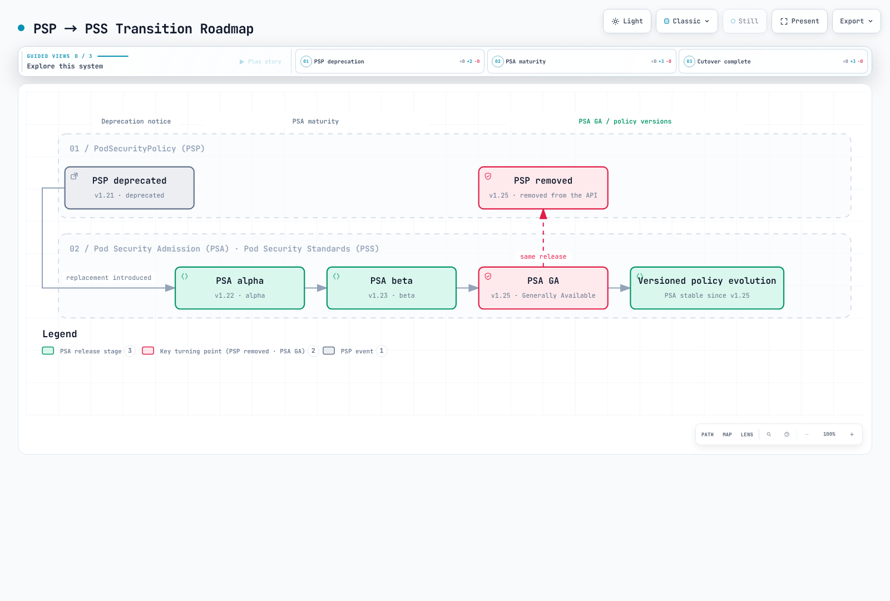

# Pod 安全标准 (PSS)

> **验证基线**：Kubernetes PSA 库 `k8s.io/pod-security-admission` v0.36.2；示例 PSS 策略 v1.35
> **最后更新**：October 12, 2026

Pod 安全标准（PSS）是 Kubernetes 中用于 Pod 安全的标准化策略框架。本文档涵盖 PSS 概念、配置方法以及在 EKS 环境中的实现。

PSS 定义策略；PSA 是应用这些策略的内置准入实现。除非另有说明，本指南假定使用**不带用户命名空间的常规 Linux Pod**。本地上游策略评估以及 schema/命令检查与部署不同：未测试实时集群、EKS 或容器执行。示例 `v1.35` 是固定的策略定义，并非关于最新 Kubernetes/EKS 支持版本的声明。API server 升级时，`latest` 的含义会改变。

## 目录

1. [从 PSP 演进到 PSS](#evolution-from-psp-to-pss)
2. [Pod 安全准入（PSA）Controller](#pod-security-admission-psa-controller)
3. [安全级别](#security-levels)
4. [强制模式](#enforcement-modes)
5. [Namespace 级配置](#namespace-level-configuration)
6. [从 PSP 迁移到 PSS](#migration-from-psp-to-pss)
7. [EKS 默认设置与配置](#eks-defaults-and-configuration)
8. [安全配置文件详情](#security-profile-details)
9. [豁免配置](#exemptions-configuration)
10. [逐步采用的最佳实践](#best-practices-for-gradual-adoption)

---

## 从 PSP 演进到 PSS {#evolution-from-psp-to-pss}

### PodSecurityPolicy (PSP) 的历史

PodSecurityPolicy（PSP）最早在 Kubernetes 1.3 中作为 Pod 安全机制引入。但是，由于以下问题，它在 Kubernetes 1.21 中被弃用，并在 1.25 中完全移除：

```
┌─────────────────────────────────────────────────────────────────┐
│                    Key Issues with PSP                           │
├─────────────────────────────────────────────────────────────────┤
│ 1. Complex RBAC binding requirements                             │
│ 2. Implicit policy application (unclear which policy applies)    │
│ 3. User vs workload permission confusion                         │
│ 4. No warn/audit rollout modes                                               │
│ 5. Limited audit capabilities                                    │
└─────────────────────────────────────────────────────────────────┘
```

### PSS 的引入

Pod 安全标准（PSS）和 Pod 安全准入（PSA）在 Kubernetes 1.22 中以 alpha 版本引入，在 1.23 中进入 beta，并在 1.25 达到 GA（正式可用）。



[🔍 查看交互式图表](https://www.atomai.click/kubernetes-docs/archmaps/en-security-03-pod-security-standards-0.html)

> 图表解读：PSA 在 1.25 达到 GA；1.28 并不是单独的稳定化里程碑。

### PSP 与 PSS 对比

| 特性 | PodSecurityPolicy (PSP) | Pod 安全标准 (PSS) |
|---------|------------------------|------------------------------|
| **启用方式** | 旧的准入插件 | 由内置 PSA 插件强制执行的 PSS 定义 |
| **策略定义** | 自定义 PSP 资源 | 三个预定义配置文件 |
| **策略绑定** | 复杂的 RBAC 绑定 | 简单的 Namespace 标签 |
| **范围** | 集群范围或 Namespace | Namespace 级别 |
| **策略预览** | 没有 PSA 风格的 warn/audit 模式；API dry-run 独立存在 | warn/audit 模式加 API dry-run |
| **审计** | 有限 | 内置审计支持 |
| **灵活性** | 高（细粒度控制） | 中（标准化配置文件） |
| **复杂性** | 高 | 低 |

---

## Pod 安全准入（PSA）Controller {#pod-security-admission-psa-controller}

### PSA 架构

PSA 在变更准入之后、验证准入期间**在 API server 内部**运行。身份验证、授权、schema 验证和其他准入检查同样适用。这不是外部 webhook，图表也不应暗示 PSA 与其他每个验证器之间存在通用顺序。

```text
Request → authentication / authorization → mutating admission
        → validating admission (PSA + other checks) → persistence if accepted
```

### PSA 的工作原理


[🔍 查看交互式图表](https://www.atomai.click/kubernetes-docs/archmaps/en-security-03-pod-security-standards-1.html)

> 图表范围：PSA 位于 API server 内部。只有所有适用检查都通过后，成功的 Pod CREATE 才会持久化；仅 PSA 批准并不保证 201 Created。

### 验证 PSA 状态

PSA 在 Kubernetes 1.23 变为 beta 且默认启用，随后在 1.25 达到 GA。缺少显式的 `--enable-admission-plugins=PodSecurity` 标志并不表示它被禁用。检查自管理 API server 配置中是否显式禁用；EKS 不公开该配置。指标显示的是评估而不是 feature-gate 设置。访问 `/metrics` 需要授权，未使用的序列可能不存在。

```bash
kubectl --context "$PSS_CONTEXT" get namespace "$PSS_NAMESPACE" -o yaml
kubectl --context "$PSS_CONTEXT" get --raw /metrics
```

使用下面的正向/负向 Pod dry-run 控制项测试实际准入路径。切勿仅从成功的 Deployment dry-run 推断合规性。

---

## 安全级别 {#security-levels}

PSS 定义了三个安全级别（配置文件）。每个级别逐步应用更严格的安全约束。

### 1. Privileged

此配置文件不增加 PSS 限制。它既不会自动启用容器特权，也不会绕过 RBAC、API 验证或其他准入策略。

```yaml
# Privileged profile: PSS imposes no controls; API/RBAC/other policies still apply
# Use cases: System daemons, CNI plugins, monitoring agents

apiVersion: v1
kind: Pod
metadata:
  name: privileged-pod
  namespace: pss-privileged-lab
spec:
  hostNetwork: true      # Allowed
  hostPID: true          # Allowed
  hostIPC: true          # Allowed
  containers:
  - name: privileged-container
    image: nginx
    securityContext:
      privileged: true   # Allowed
      runAsUser: 0    # Allowed
```

**Privileged 级别允许：**
- 主机网络、PID、IPC 命名空间
- 特权容器
- 所有 capability
- HostPath 挂载
- 任意用户/组 ID

### 2. Baseline

应用最低限制以防止已知的特权提升。适用于大多数通用工作负载。

```yaml
# Baseline level: Prevents known privilege escalations
# Use cases: General applications, web servers, API servers

apiVersion: v1
kind: Pod
metadata:
  name: baseline-pod
spec:
  containers:
  - name: app
    image: nginx
    securityContext:
      # The following are prohibited in Baseline:
      # privileged: true        ❌
      # allowPrivilegeEscalation is not constrained by Baseline

      # The following are allowed in Baseline:
      runAsNonRoot: false      # ✓ (allowed but not recommended)
      readOnlyRootFilesystem: false  # ✓ (allowed)
    ports:
    - containerPort: 80
```

**Baseline 级别限制：**

| 字段 | 限制 |
|-------|------------|
| HostProcess | 禁止 Windows HostProcess 容器 |
| 主机命名空间 | 禁止 hostNetwork、hostPID、hostIPC |
| 特权容器 | 禁止 privileged: true |
| Capabilities | 显式添加仅限于列出的 Baseline 允许列表；`NET_RAW` 不在其中 |
| HostPath Volumes | 禁止 hostPath volume |
| 主机端口 | 内置 PSA 允许未设置/0；没有自定义端口允许列表 |
| AppArmor | 未设置或 RuntimeDefault/Localhost；旧 annotation 使用 runtime/default 或 localhost/* |
| SELinux | 仅允许受限 type 值，禁止设置 user/role |
| /proc 挂载类型 | 仅允许默认值 |
| Seccomp | 允许未设置；如已指定，则为 RuntimeDefault 或 Localhost（不能为 Unconfined） |
| Sysctls | 仅 PSS 版本显式的 sysctl 允许列表；不是所有 kubelet-safe sysctl |

### 3. Restricted

最严格的策略，应用 Pod 安全强化最佳实践。适用于安全敏感的工作负载。

```yaml
apiVersion: v1
kind: Pod
metadata:
  name: restricted-pod
spec:
  automountServiceAccountToken: false
  securityContext:
    runAsNonRoot: true
    runAsUser: 101
    runAsGroup: 101
    fsGroup: 101
    seccompProfile:
      type: RuntimeDefault
  containers:
  - name: app
    image: ghcr.io/nginx/nginx-unprivileged@sha256:442753882674b49ae2c1de83ed67896131c0777f56df5005e356e62bc3f7e7ce
    securityContext:
      allowPrivilegeEscalation: false
      readOnlyRootFilesystem: true
      capabilities:
        drop: [ALL]
    ports:
    - containerPort: 8080
    resources:
      requests:
        cpu: 50m
        memory: 64Mi
      limits:
        cpu: 500m
        memory: 128Mi
    volumeMounts:
    - name: tmp
      mountPath: /tmp
  volumes:
  - name: tmp
    emptyDir: {}
```

**Restricted 级别的额外限制：**

| 字段 | 限制 |
|-------|------------|
| Volume 类型 | 仅允许 configMap、csi、downwardAPI、emptyDir、ephemeral、persistentVolumeClaim、projected、secret |
| 特权提升 | 必须设置 allowPrivilegeEscalation: false |
| 以非 root 运行 | 必须设置 runAsNonRoot: true |
| 以非 root 用户运行 | 禁止显式 runAsUser: 0（v1.23+）；可省略该字段 |
| Seccomp | 必须为 RuntimeDefault 或 Localhost |
| Capabilities | 必须删除所有 capability，仅可添加 NET_BIND_SERVICE |


这些控制应用于适用的常规、init 和 ephemeral 容器。Pod 级别的非 root/seccomp 值可以继承；冲突的容器覆盖不合规。策略 v1.34+ 还禁止 HTTP/TCP probe 与 lifecycle hook 中非空的 `host`。在 v1.35 中，`hostUsers: false` 放宽非 root 检查；Baseline 也放宽 `procMount`，但 Restricted 仍禁止 `Unmasked`。这需要实际的用户命名空间支持，而不只是一个标签。针对特权提升、seccomp 和 Linux capability 的 Windows 特定放宽与此 Linux 示例相互独立。

### 安全级别对比图

```
┌──────────────────────────────────────────────────────────────────────────┐
│                     Security Level Comparison                             │
├──────────────────────────────────────────────────────────────────────────┤
│                                                                          │
│  Restriction  ━━━━━━━━━━━━━━━━━━━━━━━━━━━━━━━━━━━━━━━━━━━━━━━━━━━▶       │
│               Low                                           High          │
│                                                                          │
│  ┌──────────────┐    ┌──────────────┐    ┌──────────────┐               │
│  │  Privileged  │    │   Baseline   │    │  Restricted  │               │
│  │              │    │              │    │              │               │
│  │ No           │    │ Prevent      │    │ Security     │               │
│  │ restrictions │    │ known        │    │ best         │               │
│  │              │    │ escalations  │    │ practices    │               │
│  │              │    │              │    │              │               │
│  │ Use cases:   │    │ Use cases:   │    │ Use cases:   │               │
│  │ - CNI        │    │ - General    │    │ - Financial  │               │
│  │ - CSI        │    │   apps       │    │   apps       │               │
│  │ - Monitoring │    │ - Web        │    │ - Healthcare │               │
│  │              │    │   servers    │    │ - Multi-     │               │
│  │              │    │ - API        │    │   tenant     │               │
│  └──────────────┘    └──────────────┘    └──────────────┘               │
│                                                                          │
└──────────────────────────────────────────────────────────────────────────┘
```

---

## 强制模式 {#enforcement-modes}

PSA 提供三种强制模式。这些模式可单独使用，也可组合使用。

### 1. enforce

拒绝违反策略的 Pod 创建和相关 Pod 更新。工作负载模板会收到 warn/audit 检查；强制发生在生成的 Pod 上。重新标记 Namespace 不会驱逐已运行的 Pod。

```yaml
# enforce mode: Block Pod creation on violation
apiVersion: v1
kind: Namespace
metadata:
  name: production
  labels:
    pod-security.kubernetes.io/enforce: restricted
    pod-security.kubernetes.io/enforce-version: v1.35
```

**说明性响应摘录（非记录的集群执行）：**
```text
# Attempting to create a policy-violating Pod
$ kubectl apply --dry-run=server -f privileged-pod.yaml -n production
Error from server (Forbidden): error when creating "privileged-pod.yaml":
pods "privileged-pod" is forbidden: violates PodSecurity "restricted:v1.35":
privileged (container "app" must not set securityContext.privileged=true),
allowPrivilegeEscalation != false (container "app" must set
securityContext.allowPrivilegeEscalation=false)
```

### 2. audit

将违反策略的 annotation 添加到 audit event；此模式本身不会拒绝请求。audit-policy/log-delivery 配置决定是否保留这些 event。其他模式和准入检查仍可能拒绝请求。

```yaml
# audit mode: Record violations in audit logs
apiVersion: v1
kind: Namespace
metadata:
  name: staging
  labels:
    pod-security.kubernetes.io/audit: restricted
    pod-security.kubernetes.io/audit-version: v1.35
```

**合成 audit-event 摘录（不是完整捕获的 event）：**
```json
{
  "kind": "Event",
  "apiVersion": "audit.k8s.io/v1",
  "level": "Metadata",
  "auditID": "00000000-0000-4000-8000-000000000001",
  "stage": "ResponseComplete",
  "requestURI": "/api/v1/namespaces/staging/pods",
  "verb": "create",
  "user": {
    "username": "developer@example.com"
  },
  "objectRef": {
    "resource": "pods",
    "namespace": "staging",
    "name": "my-pod"
  },
  "annotations": {
    "pod-security.kubernetes.io/audit-violations": "privileged (container \"app\" must not set securityContext.privileged=true)"
  }
}
```

### 3. warn

返回对客户端可见的警告，但本身不会拒绝请求；enforce 或其他准入检查仍可能拒绝。

```yaml
# warn mode: Display warning messages on violation
apiVersion: v1
kind: Namespace
metadata:
  name: development
  labels:
    pod-security.kubernetes.io/warn: restricted
    pod-security.kubernetes.io/warn-version: v1.35
```

**说明性警告摘录（非记录的执行）：**
```text
$ kubectl apply --dry-run=server -f non-compliant-pod.yaml -n development
Warning: would violate PodSecurity "restricted:v1.35":
allowPrivilegeEscalation != false (container "app" must set
securityContext.allowPrivilegeEscalation=false),
unrestricted capabilities (container "app" must set
securityContext.capabilities.drop=["ALL"])
pod/my-pod created (server dry run)
```

### 模式组合策略

初始 Privileged 阶段仅适用于没有更强现有策略的 Namespace。切勿为了遵循此图表而降低 Baseline/Restricted 强制级别。

在生产环境中，建议组合多个模式：

```yaml
# Recommended configuration: Use mode combinations
apiVersion: v1
kind: Namespace
metadata:
  name: app-namespace
  labels:
    # Current enforcement level
    pod-security.kubernetes.io/enforce: baseline
    pod-security.kubernetes.io/enforce-version: v1.35
    # Audit next level
    pod-security.kubernetes.io/audit: restricted
    pod-security.kubernetes.io/audit-version: v1.35
    # Warn next level
    pod-security.kubernetes.io/warn: restricted
    pod-security.kubernetes.io/warn-version: v1.35
```

```
┌─────────────────────────────────────────────────────────────────┐
│                    Mode Combination Strategy                      │
├─────────────────────────────────────────────────────────────────┤
│                                                                 │
│  Phase 1: Assess Current State                                   │
│  ┌─────────────────────────────────────────────────────────┐   │
│  │ enforce: privileged                                      │   │
│  │ audit: baseline                                          │   │
│  │ warn: baseline                                           │   │
│  └─────────────────────────────────────────────────────────┘   │
│                           │                                     │
│                           ▼                                     │
│  Phase 2: Gradual Hardening                                      │
│  ┌─────────────────────────────────────────────────────────┐   │
│  │ enforce: baseline                                        │   │
│  │ audit: restricted                                        │   │
│  │ warn: restricted                                         │   │
│  └─────────────────────────────────────────────────────────┘   │
│                           │                                     │
│                           ▼                                     │
│  Phase 3: Final Goal                                             │
│  ┌─────────────────────────────────────────────────────────┐   │
│  │ enforce: restricted                                      │   │
│  │ audit: restricted                                        │   │
│  │ warn: restricted                                         │   │
│  └─────────────────────────────────────────────────────────┘   │
│                                                                 │
└─────────────────────────────────────────────────────────────────┘
```

---

## Namespace 级配置 {#namespace-level-configuration}

### 基本标签配置

通过 Namespace 标签配置 PSS：

```yaml
apiVersion: v1
kind: Namespace
metadata:
  name: secure-namespace
  labels:
    # Format: pod-security.kubernetes.io/<MODE>: <LEVEL>
    pod-security.kubernetes.io/enforce: restricted
    pod-security.kubernetes.io/enforce-version: v1.35
    pod-security.kubernetes.io/audit: restricted
    pod-security.kubernetes.io/audit-version: v1.35
    pod-security.kubernetes.io/warn: restricted
    pod-security.kubernetes.io/warn-version: v1.35
```

### 版本指定

可以使用特定 Kubernetes 版本中的 PSS 定义：

```yaml
apiVersion: v1
kind: Namespace
metadata:
  name: versioned-namespace
  labels:
    # Use PSS definitions from a specific version
    pod-security.kubernetes.io/enforce: restricted
    pod-security.kubernetes.io/enforce-version: v1.35  # Specific version

    # Using 'latest' applies PSS from current cluster version
    # pod-security.kubernetes.io/enforce-version: latest
```

### 特定环境配置示例

```yaml
---
# Development environment: Relaxed policy
apiVersion: v1
kind: Namespace
metadata:
  name: development
  labels:
    environment: development
    pod-security.kubernetes.io/enforce: baseline
    pod-security.kubernetes.io/warn: restricted
---
# Staging environment: Intermediate policy
apiVersion: v1
kind: Namespace
metadata:
  name: staging
  labels:
    environment: staging
    pod-security.kubernetes.io/enforce: baseline
    pod-security.kubernetes.io/audit: restricted
    pod-security.kubernetes.io/warn: restricted
---
# Production environment: Strict policy
apiVersion: v1
kind: Namespace
metadata:
  name: production
  labels:
    environment: production
    pod-security.kubernetes.io/enforce: restricted
    pod-security.kubernetes.io/audit: restricted
    pod-security.kubernetes.io/warn: restricted
```

### 向现有 Namespace 添加标签

```bash
# Add labels using kubectl
kubectl label namespace my-namespace \
  pod-security.kubernetes.io/enforce=restricted \
  pod-security.kubernetes.io/enforce-version=v1.35 \
  pod-security.kubernetes.io/audit=restricted \
  pod-security.kubernetes.io/warn=restricted

# Verify labels
kubectl get namespace my-namespace -o yaml | grep pod-security
```

---

## 从 PSP 迁移到 PSS {#migration-from-psp-to-pss}

### 迁移概览

应谨慎规划从 PSP 到 PSS 的迁移，并分阶段执行。


[🔍 查看交互式图表](https://www.atomai.click/kubernetes-docs/archmaps/en-security-03-pod-security-standards-2.html)

> 图表范围：PSP 分析/移除是历史内容。切勿为了观察而降低现有更强的 enforce 策略；readOnlyRootFilesystem 是建议项，而非 Restricted 的要求。

### 步骤 1：分析当前 PSP

**仅限历史流程**：以下 PSP 命令/资源适用于仍提供 `policy/v1beta1` 服务的旧集群（最高 Kubernetes 1.24），或保存的 manifest。不要将此 PSP 应用于当前集群。同时盘点之前由 PSP 默认设置/变更的字段；PSA 不会填充它们。

```bash
# List current PSPs
kubectl get psp

# Get PSP details
kubectl get psp <psp-name> -o yaml

# Check Pods with PSP applied
kubectl get pods --all-namespaces -o jsonpath='{range .items[*]}{.metadata.namespace}/{.metadata.name}: {.metadata.annotations.kubernetes\.io/psp}{"\n"}{end}'
```

### 步骤 2：将 PSP 映射到 PSS 配置文件

```yaml
# Example: Existing PSP
apiVersion: policy/v1beta1
kind: PodSecurityPolicy
metadata:
  name: restricted-psp
spec:
  privileged: false
  allowPrivilegeEscalation: false
  requiredDropCapabilities:
    - ALL
  volumes:
    - 'configMap'
    - 'emptyDir'
    - 'projected'
    - 'secret'
    - 'downwardAPI'
    - 'persistentVolumeClaim'
  hostNetwork: false
  hostIPC: false
  hostPID: false
  runAsUser:
    rule: MustRunAsNonRoot
  seLinux:
    rule: RunAsAny
  fsGroup:
    rule: RunAsAny
  supplementalGroups:
    rule: RunAsAny
```

**映射结果**：Restricted 是候选目标，而不是等效策略。此 PSP 缺少必需的 seccomp 控制，并允许 PSS 可能拒绝的 SELinux 设置。比较每项控制和每个生成的 Pod；三个选定字段无法确定等效性。

### PSP 到 PSS 映射表

| 工作负载要求 | 候选 PSS 配置文件 | 必需审查 |
|---|---|---|
| 主机命名空间、特权容器或 hostPath | Privileged | 隔离例外并应用额外控制 |
| 不访问主机但需要 root 进程 | Baseline | 检查每项 Baseline 控制，包括 capability 和 seccomp |
| 非 root、无特权提升、删除 ALL | Restricted | 还要检查 volume、seccomp、覆盖和版本特定控制 |

### 步骤 3：在测试环境中验证

```bash
# Create test namespace
kubectl create namespace pss-test

# Apply restricted in warn mode
kubectl label namespace pss-test \
  pod-security.kubernetes.io/warn=restricted \
  pod-security.kubernetes.io/warn-version=v1.35

# Test existing workload deployment
kubectl apply -f my-deployment.yaml -n pss-test

# Check warnings and modify workloads
```

### 步骤 4：逐步应用

```yaml
# Staged migration namespace configuration
apiVersion: v1
kind: Namespace
metadata:
  name: migrating-namespace
  labels:
    # Phase 1: New namespace without a previous stronger enforce policy
    pod-security.kubernetes.io/enforce: privileged
    pod-security.kubernetes.io/audit: baseline
    pod-security.kubernetes.io/warn: baseline

    # Phase 2: Apply baseline, monitor restricted
    # pod-security.kubernetes.io/enforce: baseline
    # pod-security.kubernetes.io/audit: restricted
    # pod-security.kubernetes.io/warn: restricted

    # Phase 3: Final restricted enforcement
    # pod-security.kubernetes.io/enforce: restricted
```

### 步骤 5：修改工作负载

之前：没有 security context 的普通 `nginx` Pod 无法通过 Restricted 检查。仅添加 `runAsNonRoot` 不足以解决问题：image 用户、listener 和可写路径也必须兼容。已修正的 Pod 使用上游 unprivileged image（UID/GID 101）、端口 8080，以及带只读 root filesystem 的可写 `/tmp`。

```yaml
apiVersion: v1
kind: Pod
metadata:
  name: new-pod
spec:
  automountServiceAccountToken: false
  securityContext:
    runAsNonRoot: true
    runAsUser: 101
    runAsGroup: 101
    fsGroup: 101
    seccompProfile:
      type: RuntimeDefault
  containers:
  - name: app
    image: ghcr.io/nginx/nginx-unprivileged@sha256:442753882674b49ae2c1de83ed67896131c0777f56df5005e356e62bc3f7e7ce
    securityContext:
      allowPrivilegeEscalation: false
      readOnlyRootFilesystem: true
      capabilities:
        drop: [ALL]
    ports:
    - containerPort: 8080
    resources:
      requests:
        cpu: 50m
        memory: 64Mi
      limits:
        cpu: 500m
        memory: 128Mi
    volumeMounts:
    - name: tmp
      mountPath: /tmp
  volumes:
  - name: tmp
    emptyDir: {}
```

### 迁移自动化脚本

此脚本刻意针对**一个已审查的 Namespace**，仅添加此前不存在的 warn/audit 标签，保留 enforce，并使用观察到的 resource version 拒绝并发编辑。运行时它会实际变更 Namespace；请先检查目标。现有标签会导致失败，以便手动比较而不是自动降级。警告将在后续请求中出现，而不是对所有运行中 Pod 进行追溯扫描。

```python
#!/usr/bin/env python3
# add-pss-observation.py CONTEXT NAMESPACE
import json, subprocess, sys

if len(sys.argv) != 3:
    raise SystemExit("Usage: add-pss-observation.py CONTEXT NAMESPACE")
context, namespace = sys.argv[1:]
if namespace in {"kube-system", "kube-public", "kube-node-lease"}:
    raise SystemExit("Refusing system namespace; review its workload requirements separately")
base = ["kubectl", "--context", context, "--request-timeout=30s"]
obj = json.loads(subprocess.run(
    base + ["get", "namespace", namespace, "-o", "json"],
    check=True, text=True, capture_output=True).stdout)
labels = obj["metadata"].get("labels", {})
new = {
    "pod-security.kubernetes.io/warn": "restricted",
    "pod-security.kubernetes.io/warn-version": "v1.35",
    "pod-security.kubernetes.io/audit": "restricted",
    "pod-security.kubernetes.io/audit-version": "v1.35",
}
if any(key in labels for key in new):
    raise SystemExit("Existing observation policy: review it; do not overwrite automatically")
subprocess.run(base + [
    "label", "namespace", namespace,
    "--resource-version=" + obj["metadata"]["resourceVersion"],
] + [key + "=" + value for key, value in new.items()], check=True)
```

---

## EKS 默认设置与配置 {#eks-defaults-and-configuration}

### EKS 中的 PSA 默认设置

AWS 文档说明，PSA 从 EKS 1.23 起默认启用，集群对所有模式的默认设置为 `privileged/latest`，且没有静态豁免。这些宽松默认设置并非工作负载强化策略。平台工具或管理员创建的 Namespace 标签可以覆盖默认设置；请检查实际 Namespace，而不是假设每个 Namespace 都没有标签。

```bash
kubectl --context "$PSS_CONTEXT" get namespace "$PSS_NAMESPACE" -o yaml
```

### 在 EKS 中配置 PSS

```yaml
# Apply PSS to EKS namespace
apiVersion: v1
kind: Namespace
metadata:
  name: eks-app-namespace
  labels:
    # Example rollout choice, not a universal AWS requirement
    pod-security.kubernetes.io/enforce: baseline
    pod-security.kubernetes.io/enforce-version: v1.35
    pod-security.kubernetes.io/audit: restricted
    pod-security.kubernetes.io/warn: restricted

    # EKS-related labels
    app.kubernetes.io/managed-by: eks
```

### EKS 系统 Namespace 注意事项

主机访问 agent 无法满足 Baseline，但这并不意味着 `kube-system` 中每个 Pod 都需要完整 Privileged。审查确切的 add-on 版本和渲染后的 Pod spec。避免对整个系统 Namespace 进行全面覆盖，从而禁用 warn/audit。尽可能将获准主机 agent 与普通应用隔离，并限制可在其中部署的人员。以下是专用示例 Namespace，并非重新标记现有系统 Namespace 的指令。

```yaml
apiVersion: v1
kind: Namespace
metadata:
  name: host-agents
  labels:
    pod-security.kubernetes.io/enforce: privileged
    pod-security.kubernetes.io/audit: restricted
    pod-security.kubernetes.io/audit-version: v1.35
    pod-security.kubernetes.io/warn: restricted
    pod-security.kubernetes.io/warn-version: v1.35
```

### EKS Add-on 与 PSS 兼容性

| 组件 / 典型部署 | PSS 审查点 |
|---|---|
| VPC CNI `aws-node`、kube-proxy | 主机网络或特权节点操作可能超出 Baseline |
| EBS/EFS CSI node DaemonSet | 主机挂载可能超出 Baseline；controller Pod 有不同需求 |
| 节点级 CloudWatch Agent / Fluent Bit | 主机日志/文件系统访问取决于实际配置 |
| CoreDNS、AWS Load Balancer Controller、Cluster Autoscaler | 根据 Baseline/Restricted 评估渲染后的 spec；仅组件名称不足以证明合规 |

EKS Auto Mode 内置节点组件与自管理 add-on 不同。此表是审查辅助工具，而非经过测试的兼容性矩阵，也不是安装列出所有 add-on 的要求。

### EKS Terraform 示例

此片段管理一个应用 Namespace。单独配置并审查 Kubernetes provider 及其目标 context；未运行 provider initialization、plan 或 apply。请通过其所有者采用/import 现有 Namespace，而不要创建竞争性的 Terraform/GitOps 所有权。策略刻意固定，且不更改系统 Namespace 标签。

```hcl
# Provider authentication/context and ownership must be configured separately.
resource "kubernetes_namespace_v1" "app" {
  metadata {
    name = "my-app"
    labels = {
      "pod-security.kubernetes.io/enforce"         = "restricted"
      "pod-security.kubernetes.io/enforce-version" = "v1.35"
      "pod-security.kubernetes.io/audit"           = "restricted"
      "pod-security.kubernetes.io/audit-version"   = "v1.35"
      "pod-security.kubernetes.io/warn"            = "restricted"
      "pod-security.kubernetes.io/warn-version"    = "v1.35"
      "environment"                              = "production"
    }
  }
}
```

---

## 安全配置文件详情 {#security-profile-details}

### Privileged 配置文件详情

Privileged 配置文件不施加 PSS 限制；API 验证、RBAC 及其他准入检查仍有效。以下主机 root 示例仅用于策略分析，并非建议部署的工作负载。

```yaml
# All options allowed in Privileged profile
apiVersion: v1
kind: Pod
metadata:
  name: privileged-example
spec:
  hostNetwork: true
  hostPID: true
  hostIPC: true
  containers:
  - name: privileged-container
    image: nginx
    securityContext:
      privileged: true
      allowPrivilegeEscalation: true
      runAsUser: 0
      capabilities:
        add:
          - ALL
    volumeMounts:
    - name: host-root
      mountPath: /host
  volumes:
  - name: host-root
    hostPath:
      path: /
      type: Directory
```

### Baseline 配置文件详情

```yaml
# Baseline profile restrictions (v1.35)
#
# Prohibited fields and values:
#
# spec.hostNetwork: true prohibited
# spec.hostPID: true prohibited
# spec.hostIPC: true prohibited
#
# spec.containers[*].securityContext.privileged: true prohibited
# spec.initContainers[*].securityContext.privileged: true prohibited
# spec.ephemeralContainers[*].securityContext.privileged: true prohibited
#
# spec.containers[*].securityContext.capabilities.add restricted
#   - Allowed: NET_BIND_SERVICE (only this in Restricted)
#   - Additionally allowed in Baseline: AUDIT_WRITE, CHOWN, DAC_OVERRIDE,
#     FOWNER, FSETID, KILL, MKNOD, NET_BIND_SERVICE,
#     SETFCAP, SETGID, SETPCAP, SETUID, SYS_CHROOT
#
# spec.volumes[*].hostPath prohibited
#
# spec.containers[*].ports[*].hostPort prohibited (except 0)
#
# spec.securityContext.appArmorProfile.type restricted
#   - Allowed: profile omitted, or type RuntimeDefault/Localhost
#   - Prohibited: Unconfined
#
# spec.securityContext.seLinuxOptions.type restricted
#   - Prohibited: Custom types (container_t etc. allowed)
#
# spec.securityContext.seccompProfile.type restricted
#   - Prohibited: Unconfined
#
# spec.securityContext.sysctls restricted
#   - Only the explicit versioned PSS sysctl allowlist

apiVersion: v1
kind: Pod
metadata:
  name: baseline-compliant
spec:
  automountServiceAccountToken: false
  containers:
  - name: app
    image: ghcr.io/nginx/nginx-unprivileged@sha256:442753882674b49ae2c1de83ed67896131c0777f56df5005e356e62bc3f7e7ce
    ports:
    - containerPort: 8080
    securityContext:
      capabilities:
        drop: [ALL]
```

### Restricted 配置文件详情

Restricted 在 Baseline 基础上增加其 volume 允许列表、非 root 执行、显式 seccomp、禁止特权提升和删除所有 capability。`NET_BIND_SERVICE` 是唯一允许添加的 capability，但此 8080 listener 不需要它。`readOnlyRootFilesystem` 是推荐的强化措施，而非 PSS 要求。设置 `containerPort` 是 metadata；它不会重新配置 Nginx。

```yaml
apiVersion: v1
kind: Pod
metadata:
  name: restricted-compliant
spec:
  automountServiceAccountToken: false
  securityContext:
    runAsNonRoot: true
    runAsUser: 101
    runAsGroup: 101
    fsGroup: 101
    seccompProfile:
      type: RuntimeDefault
  containers:
  - name: app
    image: ghcr.io/nginx/nginx-unprivileged@sha256:442753882674b49ae2c1de83ed67896131c0777f56df5005e356e62bc3f7e7ce
    securityContext:
      allowPrivilegeEscalation: false
      readOnlyRootFilesystem: true
      capabilities:
        drop: [ALL]
    ports:
    - containerPort: 8080
    resources:
      requests:
        cpu: 50m
        memory: 64Mi
      limits:
        cpu: 500m
        memory: 128Mi
    volumeMounts:
    - name: tmp
      mountPath: /tmp
  volumes:
  - name: tmp
    emptyDir: {}
```

### 完整的 Restricted 合规 Nginx 示例

已根据上游 OCI metadata 检查该 digest 对 Linux amd64/arm64（Nginx 1.30.4，用户 101）的适用性；未拉取 image layer，也未执行容器。上游文档说明端口 8080、`/tmp/nginx.pid` 和 `/tmp` 下的临时路径。以下 ConfigMap 提供匹配的 listener 和 health endpoint。请在 Deployment 之前在同一 Namespace 创建它。在 rollout 前，于获批环境中验证 startup/readiness。

```yaml
apiVersion: apps/v1
kind: Deployment
metadata:
  name: nginx-restricted
  namespace: production
spec:
  replicas: 3
  selector:
    matchLabels:
      app: nginx
  template:
    metadata:
      labels:
        app: nginx
    spec:
      automountServiceAccountToken: false
      securityContext:
        runAsNonRoot: true
        runAsUser: 101  # nginx user
        runAsGroup: 101
        fsGroup: 101
        seccompProfile:
          type: RuntimeDefault
      containers:
      - name: nginx
        image: ghcr.io/nginx/nginx-unprivileged@sha256:442753882674b49ae2c1de83ed67896131c0777f56df5005e356e62bc3f7e7ce
        securityContext:
          allowPrivilegeEscalation: false
          readOnlyRootFilesystem: true
          runAsNonRoot: true
          runAsUser: 101
          capabilities:
            drop:
              - ALL
        ports:
        - containerPort: 8080
        resources:
          limits:
            cpu: 100m
            memory: 128Mi
          requests:
            cpu: 50m
            memory: 64Mi
        volumeMounts:
        - name: tmp
          mountPath: /tmp
        - name: config
          mountPath: /etc/nginx/conf.d
          readOnly: true
        livenessProbe:
          httpGet:
            path: /healthz
            port: 8080
          initialDelaySeconds: 5
          periodSeconds: 10
        readinessProbe:
          httpGet:
            path: /healthz
            port: 8080
          initialDelaySeconds: 5
          periodSeconds: 5
      volumes:
      - name: tmp
        emptyDir: {}
      - name: config
        configMap:
          name: nginx-config
---
apiVersion: v1
kind: ConfigMap
metadata:
  name: nginx-config
  namespace: production
data:
  default.conf: |
    server {
        listen 8080;
        server_name localhost;

        location / {
            root /usr/share/nginx/html;
            index index.html;
        }

        location /healthz {
            return 200 'OK';
            add_header Content-Type text/plain;
        }
    }
```

---

## 豁免配置 {#exemptions-configuration}

### 集群级豁免配置

自管理 API server 可通过 `--admission-control-config-file` 加载此配置。该示例保持每个豁免列表为空。豁免会跳过**所有 PSA 模式**。`usernames` 匹配确切的已认证请求 username，而不是 group、wildcard 或未来 Pod 的 ServiceAccount。豁免 controller account 会绕过其代表许多用户创建的 Pod 检查。Namespace 和 RuntimeClass 名称同样精确匹配。仅在另外限制了谁可以使用该例外后，才配置例外。

```yaml
# Self-managed API server configuration; not an EKS control-plane setting
apiVersion: apiserver.config.k8s.io/v1
kind: AdmissionConfiguration
plugins:
- name: PodSecurity
  configuration:
    apiVersion: pod-security.admission.config.k8s.io/v1
    kind: PodSecurityConfiguration
    defaults:
      enforce: baseline
      enforce-version: v1.35
      audit: restricted
      audit-version: v1.35
      warn: restricted
      warn-version: v1.35
    exemptions:
      usernames: []
      runtimeClasses: []
      namespaces: []
```

### EKS 中的豁免配置

EKS 不允许编辑托管 API server 的 AdmissionConfiguration。Namespace `enforce: privileged` 是宽松配置文件，**不是静态豁免**：warn/audit 仍可以评估请求。限制 Namespace 写入/部署权限，并将主机 agent 与普通应用分离。例如，使用 hostNetwork/hostPID/hostPath 配置的 node-exporter 无法通过 Baseline；设置 Baseline 不会使这些主机访问变得安全或被允许。

```yaml
apiVersion: v1
kind: Namespace
metadata:
  name: host-agents
  labels:
    pod-security.kubernetes.io/enforce: privileged
    pod-security.kubernetes.io/audit: restricted
    pod-security.kubernetes.io/audit-version: v1.35
    pod-security.kubernetes.io/warn: restricted
    pod-security.kubernetes.io/warn-version: v1.35
```

### 基于 RuntimeClass 的豁免

RuntimeClass 选择配置的 CRI runtime handler。创建资源不会安装 gVisor/Kata，也不会授予 PSA 例外。所有目标节点必须支持该 handler（或使用适当的调度约束）。仅此定义仍完全适用 PSA：

```yaml
apiVersion: node.k8s.io/v1
kind: RuntimeClass
metadata:
  name: gvisor
handler: runsc
```

仅自管理 API server 上单独配置的 `runtimeClasses: ["gvisor"]` 豁免会跳过 PSA。允许选择该 class 的任何请求都可能绕过 PSA；runtime 隔离不能替代准入授权。此托管 control plane 配置在 EKS 中不可用。

### 使用 Kyverno 进行细粒度豁免

Kyverno 无法将 PSA 拒绝变为允许。如果主机 agent 需要例外，请先设计 Namespace 的 PSA 配置文件和部署权限，再添加具有狭窄范围例外的独立强制策略。仅 HostPath 排除并不排除 hostNetwork/hostPID 检查；仅匹配 image tag 或可变 Pod 标签不是授权。

有关已审查的 policy API 及版本/弃用限制，请参阅 [Kyverno 策略管理](./01-kyverno-policy-management.md)。不要复制带小写 `validationFailureAction: enforce` 的旧版 `ClusterPolicy`；这不是有效值，且 ClusterPolicy 已在 Kyverno 1.19 中弃用。替代方案必须针对普通和例外工作负载进行测试。

---

## 逐步采用的最佳实践 {#best-practices-for-gradual-adoption}

### 步骤 1：分析当前状态

预览对 **enforce** 的更改，而不是 warn：只有 enforce 级别/版本更改才会触发现有 Pod 检查。此 server dry-run 不会保存标签或驱逐 Pod。如果有效 enforce 策略未改变，不会触发新的扫描。扫描尽力而为，可能限制/去重警告；没有警告并不代表完成了工作负载审计。命令/身份验证失败仍然是失败。

```bash
#!/usr/bin/env bash
# preview-pss.sh: no namespace mutation
set -euo pipefail
: "${PSS_CONTEXT:?Set the approved test context}"
: "${PSS_NAMESPACE:?Set one namespace to inspect}"
kubectl --context "$PSS_CONTEXT" --request-timeout=30s \
  get namespace "$PSS_NAMESPACE" -o yaml
kubectl --context "$PSS_CONTEXT" --request-timeout=30s \
  label namespace "$PSS_NAMESPACE" \
  pod-security.kubernetes.io/enforce=restricted \
  pod-security.kubernetes.io/enforce-version=v1.35 \
  --overwrite --dry-run=server
```

### 步骤 2：逐步 rollout 策略

日期范围是说明性的规划计划，而不是测得的迁移持续时间。使用明确的 Namespace 清单，绝不降低现有更强策略，并且仅在测试替代 Pod 和回滚能力后推进。

```yaml
# Gradual rollout using GitOps

# Phase 1: Monitoring (Day 1-7)
# - Apply warn: baseline to all namespaces
# - Collect and analyze violations

# Phase 2: Development Environment (Day 8-14)
# - Apply enforce: baseline to development namespaces
# - Apply warn: baseline to staging namespaces

# Phase 3: Staging Environment (Day 15-21)
# - Apply enforce: baseline to staging namespaces
# - Apply warn: baseline to production namespaces

# Phase 4: Production Environment (Day 22-28)
# - Apply enforce: baseline to production namespaces
# - Apply warn: restricted to all environments

# Phase 5: Restricted Hardening (Day 29+)
# - Apply enforce: restricted as default for new namespaces
# - Gradually migrate existing namespaces
```

### 步骤 3：设置监控和告警

这些规则需要 Prometheus Operator CRD、包含此 PrometheusRule 的 selector，以及公开 `pod_security_evaluations_total` 的已授权 API-server scrape。内置 PSA 不是名为 `pod-security-webhook` 的 webhook。评估标签包括 decision、policy_level、policy_version、mode、request_operation、resource 和 subresource；**没有 namespace 标签**。关联保留的 audit event 以获得 Namespace/请求详情。缺少 metric 不是零违规的证据；audit-mode denial 表示发生了违规评估，不一定表示 API 请求被拒绝。

```yaml
apiVersion: monitoring.coreos.com/v1
kind: PrometheusRule
metadata:
  name: pss-violations
  namespace: monitoring
spec:
  groups:
  - name: pod-security-standards
    rules:
    - alert: PSSViolationDetected
      expr: |
        sum by (policy_level, policy_version, mode) (
          increase(pod_security_evaluations_total{mode="enforce",decision="deny"}[5m])
        ) > 0
      labels:
        severity: warning
      annotations:
        summary: "PSA denied a Pod request"
        description: "Policy {{ $labels.policy_level }}:{{ $labels.policy_version }}. Correlate audit logs for namespace and request identity."
    - alert: PSSAuditViolation
      expr: |
        sum by (policy_level, policy_version, mode) (
          increase(pod_security_evaluations_total{mode="audit",decision="deny"}[5m])
        ) > 10
      for: 5m
      labels:
        severity: info
      annotations:
        summary: "PSA audit violations increasing"
        description: "{{ $value }} violating evaluations over five minutes; not a count of unique Pods."
```

### 步骤 4：自动化合规检查

将其保存为拥有工作负载的项目中的 `check-pss.py`。先决条件：带 PyYAML 的 Python 3、兼容的 kubectl、获批集群凭据、支持策略 v1.35 的 Kubernetes API server，以及显式强制 `restricted:v1.35` 的现有测试 Namespace。调用方即使进行 server dry-run，也需要 Namespace 读取和 Pod 创建授权。不要将集群凭据暴露给不受信任的 pull-request 代码。

```python
#!/usr/bin/env python3
# check-pss.py CONTEXT NAMESPACE pod.yaml [pod2.yaml ...]
# Requires Python 3 + PyYAML and a preconfigured, authorized kubectl.
import copy, json, subprocess, sys
from pathlib import Path
import yaml

if len(sys.argv) < 4:
    raise SystemExit("Usage: check-pss.py CONTEXT NAMESPACE pod.yaml [...]")
context, namespace, *files = sys.argv[1:]
pods = []
for filename in files:
    docs = list(yaml.safe_load_all(Path(filename).read_text()))
    if not docs or any(not isinstance(p, dict) for p in docs):
        raise SystemExit(f"{filename}: empty/non-object YAML")
    for pod in docs:
        if (pod.get("apiVersion"), pod.get("kind")) != ("v1", "Pod"):
            raise SystemExit(f"{filename}: only explicit v1 Pod test inputs are supported")
        meta = pod.setdefault("metadata", {})
        if meta.get("namespace", namespace) != namespace:
            raise SystemExit(f"{filename}: namespace mismatch")
        meta["namespace"] = namespace
        pods.append(pod)
base = ["kubectl", "--context", context, "--request-timeout=30s"]
ns = json.loads(subprocess.run(
    base + ["get", "namespace", namespace, "-o", "json"],
    check=True, text=True, capture_output=True).stdout)
labels = ns["metadata"].get("labels", {})
if (labels.get("pod-security.kubernetes.io/enforce"),
    labels.get("pod-security.kubernetes.io/enforce-version")) != ("restricted", "v1.35"):
    raise SystemExit("Test namespace must explicitly enforce restricted:v1.35")

def dry_run(pod):
    return subprocess.run(
        base + ["create", "--dry-run=server", "--validate=strict",
                "--namespace", namespace, "-f", "-"],
        input=json.dumps(pod), text=True, capture_output=True)

control = {
    "apiVersion": "v1", "kind": "Pod",
    "metadata": {"generateName": "pss-control-", "namespace": namespace},
    "spec": {
        "automountServiceAccountToken": False,
        "securityContext": {"runAsNonRoot": True, "runAsUser": 65532,
                            "seccompProfile": {"type": "RuntimeDefault"}},
        "containers": [{"name": "probe", "image": "registry.k8s.io/pause:3.10",
                        "securityContext": {"allowPrivilegeEscalation": False,
                                            "capabilities": {"drop": ["ALL"]}}}],
    },
}
good = dry_run(control)
if good.returncode:
    raise SystemExit("Positive control failed; no compliance result:\n" + good.stderr)
bad = copy.deepcopy(control)
bad["spec"]["hostPID"] = True
denied = dry_run(bad)
if denied.returncode == 0 or 'violates PodSecurity "restricted:v1.35"' not in denied.stderr:
    raise SystemExit("Negative control did not confirm PSA rejection:\n" + denied.stderr)
for pod in pods:
    result = dry_run(pod)
    if result.returncode:
        raise SystemExit("Pod dry-run failed:\n" + result.stderr)
print(f"{len(pods)} explicit Pod inputs passed server dry-run in {namespace}")
```

```bash
python3 check-pss.py "$PSS_CONTEXT" "$PSS_NAMESPACE" ./pss-inputs/web-pod.yaml
```

显式输入列表必须涵盖每个工作负载的 Pod template，包括 init container。此示例会拒绝 Deployment、空文件、错误 Namespace、查询失败、缺少强制以及豁免/非活动的负向控制路径。template 提取、mutating webhook、调度、image 启动和未来 runtime 行为需要单独检查。负向控制必须由 PSA 拒绝；任何其他错误均不确定，并会使检查失败。候选 Pod 选择的不同豁免（例如豁免的 RuntimeClass）也必须由测试集群所有者禁止或单独测试。

### 步骤 5：文档与培训

```markdown
# Pod Security Standards Guidelines

## Checklist for Developers

### When Writing Restricted-Level Pods:

- [ ] Set `spec.securityContext.runAsNonRoot: true`
- [ ] Set `spec.securityContext.seccompProfile.type: RuntimeDefault`
- [ ] Set `allowPrivilegeEscalation: false` on all containers
- [ ] Set `capabilities.drop: ["ALL"]` on all containers
- [ ] Set `readOnlyRootFilesystem: true` (recommended)
- [ ] Use unprivileged images (e.g., nginxinc/nginx-unprivileged)
- [ ] Mount emptyDir for writable paths

### Common Problem Solutions:

1. **nginx fails to bind port 80**
   → Add `NET_BIND_SERVICE` capability or use port 8080

2. **File write failures**
   → Mount emptyDir volumes to required paths

3. **Process runs as root**
   → Use unprivileged base image or add USER directive in Dockerfile
```

---

## 故障排除

### 常见错误和解决方案

#### 1. “allowPrivilegeEscalation != false” 错误

说明性错误摘录；YAML 是**部分 Pod-spec 修正**，不是独立 manifest。保留现有 container image/configuration。也要将相关的每容器控制应用于 init 和 ephemeral container。

```text
allowPrivilegeEscalation != false
```

```yaml
spec:
  containers:
  - name: app
    securityContext:
      allowPrivilegeEscalation: false
```

#### 2. “unrestricted capabilities” 错误

说明性错误摘录；YAML 是**部分 Pod-spec 修正**，不是独立 manifest。保留现有 container image/configuration。也要将相关的每容器控制应用于 init 和 ephemeral container。

```text
unrestricted capabilities
```

```yaml
spec:
  containers:
  - name: app
    securityContext:
      capabilities:
        drop: [ALL]
```

#### 3. “runAsNonRoot != true” 错误

说明性错误摘录；YAML 是**部分 Pod-spec 修正**，不是独立 manifest。保留现有 container image/configuration。也要将相关的每容器控制应用于 init 和 ephemeral container。

```text
runAsNonRoot != true
```

```yaml
spec:
  securityContext:
    runAsNonRoot: true
    runAsUser: 101
```

#### 4. “seccompProfile” 错误

说明性错误摘录；YAML 是**部分 Pod-spec 修正**，不是独立 manifest。保留现有 container image/configuration。也要将相关的每容器控制应用于 init 和 ephemeral container。

```text
seccompProfile must be RuntimeDefault or Localhost
```

```yaml
spec:
  securityContext:
    seccompProfile:
      type: RuntimeDefault
```

### PSS 违规检查工具

Polaris、kube-score 和 Trivy 提供额外的静态检查，但不能精确替代集群版本化 PSA 策略、豁免和变更。安装经过审查的版本并查阅其 CLI help。成功的 server dry-run 仅限于该请求、身份、Namespace 和时刻；请使用上面显式的 Pod 控制项。

```bash
# Dry-run check with kubectl
kubectl apply -f my-pod.yaml --dry-run=server

# Check with Polaris
polaris audit --audit-path ./k8s/ --format pretty

# Check with kube-score
kube-score score my-deployment.yaml

# Configuration check with Trivy
trivy config ./k8s/
```

---

## 总结

Pod 安全标准（PSS）提供了一种在 Kubernetes 中管理 Pod 安全的标准化方法：

1. **三个安全级别**：Privileged（所有权限）、Baseline（防止已知提升）、Restricted（最小权限）
2. **三种强制模式**：enforce（阻止）、audit（记录）、warn（警告）
3. **Namespace 标签**：没有 PSP 风格的使用绑定；RBAC 仍必须限制 Namespace 标签和工作负载创建
4. **逐步采用支持**：通过 warn/audit 模式安全迁移

### 建议

- 从一开始就在新集群中启用 PSS
- 对现有集群从 warn 模式开始并逐步强化
- 在生产环境中至少应用 Baseline 级别
- 对敏感工作负载应用 Restricted 级别

---

## 参考资料

- [Kubernetes Pod 安全标准官方文档](https://kubernetes.io/docs/concepts/security/pod-security-standards/)
- [Pod 安全准入官方文档](https://kubernetes.io/docs/concepts/security/pod-security-admission/)
- [EKS 最佳实践指南 - Pod 安全](https://docs.aws.amazon.com/eks/latest/best-practices/pod-security.html)
- [从 PSP 到 PSS 的迁移指南](https://kubernetes.io/docs/tasks/configure-pod-container/migrate-from-psp/)

- [PSA Namespace 标签预览和现有 Pod 检查](https://kubernetes.io/docs/tasks/configure-pod-container/enforce-standards-namespace-labels/)
- [PSA 配置和豁免](https://kubernetes.io/docs/tasks/configure-pod-container/enforce-standards-admission-controller/)
- [Nginx unprivileged image 和可写路径](https://github.com/nginx/docker-nginx-unprivileged)
