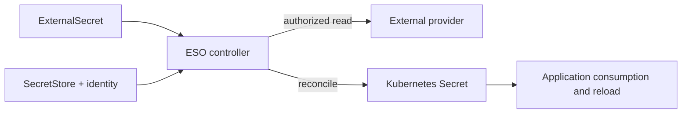
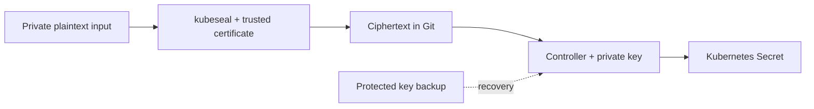

# Secrets 管理

> **最后更新**: September 13, 2026

本章区分原生 Secret、ESO、AWS 存储、Sealed Secrets、Vault 和 SOPS 的职责与集成要求。请使用[完整示例文件](https://github.com/Atom-oh/kubernetes-docs/tree/main/examples/security/secrets-management)。未执行任何集群/AWS 安装或真实凭证轮换。

## 目录

- [Kubernetes 原生 Secret](#kubernetes-native-secrets)
- [加密、更新与审计边界](#encryption-updates-and-audit-boundaries)
- [External Secrets Operator (ESO)](#external-secrets-operator-eso)
- [PushSecret（反向同步）](#pushsecret-reverse-sync)
- [AWS Secrets Manager 集成](#aws-secrets-manager-integration)
- [AWS Systems Manager Parameter Store 集成](#aws-systems-manager-parameter-store-integration)
- [Sealed Secrets](#sealed-secrets)
- [HashiCorp Vault 集成](#hashicorp-vault-integration)
- [Vault CSI Driver 和 Argo CD Vault Plugin](#vault-csi-driver-and-argo-cd-vault-plugin)
- [SOPS (Secrets OPerationS)](#sops-secrets-operations)
- [EKS Pod Identity 和 IRSA](#eks-pod-identity-and-irsa)
- [工具对比](#tool-comparison)
- [最佳实践](#best-practices)
- [总结](#summary)
- [参考资料](#references)

## Kubernetes 原生 Secret

### Secret 概览

Secret 是具有访问控制、存储和使用语义的 API 对象。
JSON/YAML 的 `data` 表示形式使用 Base64；编码不是加密。
`stringData` 接受明文输入并合并到 `data` 中。它不是更强的
保护机制，并且无法很好地配合 server-side apply 使用。
避免将实际凭证写入受版本控制的 manifest、shell 历史记录或日志。

### Secret 类型

| 类型 | 用途 |
|---|---|
| `Opaque` | 应用程序定义的值 |
| `kubernetes.io/service-account-token` | 显式创建的旧式长期 token；优先使用 TokenRequest/投射的短期 token |
| `kubernetes.io/dockerconfigjson` | 镜像仓库凭证 |
| `kubernetes.io/basic-auth` / `kubernetes.io/ssh-auth` | Basic 或 SSH 认证数据 |
| `kubernetes.io/tls` | 证书和私钥 |

### 创建 Secret

使用受保护的文件和明确指定的 namespace。将路径替换为通过已批准的
凭证流程提供的文件。这些命令不会打印生成的 Secret，但操作人员仍需具备适当的 Kubernetes 访问权限。

```bash
kubectl -n production create secret generic db-credentials   --from-file=username=/secure/input/username   --from-file=password=/secure/input/password   --from-file=host=/secure/input/host
kubectl -n production create secret generic ssh-key   --type=kubernetes.io/ssh-auth   --from-file=ssh-privatekey=/secure/input/id_rsa
kubectl -n production create secret tls app-tls   --cert=/secure/input/tls.crt --key=/secure/input/tls.key
kubectl -n production create secret generic regcred   --type=kubernetes.io/dockerconfigjson   --from-file=.dockerconfigjson=/secure/input/docker-config.json
```

字面量 flag 对**非敏感测试数据**很方便，但命令参数中的真实密码
可能会出现在历史记录和进程检查中。

### 使用 Secret

`secretKeyRef` 选择一个 key；`envFrom.secretRef` 导入所有 key。环境
变量不会在已运行的 container 中更新。挂载的 Secret volume
通常最终会更新，而 `subPath` 挂载不会收到这些更新。
应用程序必须按需重新打开/重新加载文件；同步并不等于重新加载。

以下 manifest 为非 root 应用程序提供组可读文件。应用程序 image 是明确的替换占位符，且未执行。
应用程序 ServiceAccount 仅为使用已挂载 Secret 无需 Secret `get` 权限：kubelet 会执行挂载。
但创建 Pod 的权限仍可能允许间接访问 namespace Secret。

```yaml
# Replace the image with a reviewed application that reads /etc/app-secrets.
# This Pod is a manifest example; it was not started.
apiVersion: v1
kind: Pod
metadata:
  name: secret-file-consumer
  namespace: production
spec:
  automountServiceAccountToken: false
  securityContext:
    runAsNonRoot: true
    runAsUser: 10001
    runAsGroup: 10001
    fsGroup: 10001
    seccompProfile:
      type: RuntimeDefault
  containers:
    - name: app
      image: registry.example.com/team/app:replace-with-reviewed-tag
      securityContext:
        allowPrivilegeEscalation: false
        readOnlyRootFilesystem: true
        capabilities:
          drop: [ALL]
      volumeMounts:
        - name: secrets
          mountPath: /etc/app-secrets
          readOnly: true
  volumes:
    - name: secrets
      secret:
        secretName: db-credentials
        defaultMode: 0440
        items:
          - key: username
            path: username
          - key: password
            path: password
          - key: host
            path: host
```

## 加密、更新与审计边界

### Secret 的限制

- 上游自管 Kubernetes 需要适当的静态加密配置。**EKS 1.28+ 默认使用 AWS 拥有的 KMS key 对所有 Kubernetes API
  数据进行信封加密**，并提供 customer-managed-key 选项。
- 静态加密无法阻止已获授权的 API 读取者、遭入侵的
  应用程序，或被允许创建使用 Secret 的 Pod 的主体。
- `immutable: true` 会冻结 Secret **数据**，而非所有 metadata；它无法
  恢复为可变状态。相比删除正在使用的依赖项，优先使用新的 Secret 名称和受控的 workload rollout。
- Provider 凭证轮换、Secret 更新、文件传播和应用程序
  重新加载是不同的操作。
- API audit 事件可以记录 Secret 访问。保护 audit 目标，并避免
  记录 Secret 请求/响应主体。挂载文件的读取并非每次应用程序读取都会产生一个 API audit
  事件。

### etcd 加密配置

`EncryptionConfiguration` 文件用于**自管 API server**，而不是可以安装到 EKS 托管 control plane 的
文件。使用多个 provider 时，第一个会加密新的写入；后续 provider 支持解密现有
数据。`identity` 允许明文读取，绝不能意外成为
第一个 provider 的明文写入策略。

对于自管 KMS v2 集成，应根据 Kubernetes 文档配置真实的 plugin socket、
可用性和 key 生命周期。旧示例混合了 AES-CBC、KMS v1 风格缓存和 EKS label；它并非 EKS
安装方案。启用加密不会自动重写每个现有存储对象。请遵循备份、迁移和验证流程。


## External Secrets Operator (ESO)

### ESO 概览

ESO 将外部值协调到 Kubernetes Secret 中。Store 资源描述
provider 访问；controller 执行调用。SecretStore 不是独立运行的 proxy。



### ESO 安装

固定基线为 chart/application **2.10.0**。Helm 声明的 Kubernetes
约束并非针对每个 EKS/add-on 组合的兼容性测试。

```bash
helm repo add external-secrets https://charts.external-secrets.io
helm repo update external-secrets
helm upgrade --install external-secrets external-secrets/external-secrets   --version 2.10.0 --namespace external-secrets --create-namespace   --values eso-values.yaml
```

提供的 values 默认禁用 PushSecret 协调。Chart RBAC 属于
controller 管理权限：仅 namespace 范围的 store 不会将 cluster-wide controller 变为租户隔离边界。

### SecretStore 配置

以下完整资源集使用 IRSA。请先创建 IAM role/trust。
引用的 ServiceAccount 位于 **production**，与 SecretStore 在同一 namespace。
ClusterSecretStore 则要求在 `serviceAccountRef` 上显式指定 namespace；还应限制哪些 namespace 可以使用共享 store。

### ExternalSecret 定义

当前 SecretStore/ExternalSecret 示例使用 `external-secrets.io/v1`。
`Periodic` 是默认 refresh policy；正值 `refreshInterval` 会安排
协调，但 provider 错误/backoff 表示它不是交付截止时间。
`OnChange` 和 `CreatedOnce` 有不同的触发条件。`creationPolicy: Owner`
影响 Kubernetes owner reference；`deletionPolicy: Retain` 描述 provider
删除处理，而非防止 ExternalSecret 的所有删除。

显式选择 key 可限制意外暴露。`dataFrom.extract` 可以在有此意图时导入
所有属性。Template 必须转义结构化值：将密码直接插入 PostgreSQL URL 可能破坏 URL 语法。
优先使用单独字段和应用程序的连接构建器。

```yaml
apiVersion: v1
kind: Namespace
metadata:
  name: production
---
apiVersion: v1
kind: ServiceAccount
metadata:
  name: external-secrets-reader
  namespace: production
  annotations:
    eks.amazonaws.com/role-arn: arn:aws:iam::123456789012:role/production-secret-reader
---
apiVersion: external-secrets.io/v1
kind: SecretStore
metadata:
  name: aws-secretsmanager
  namespace: production
spec:
  provider:
    aws:
      service: SecretsManager
      region: ap-northeast-2
      auth:
        jwt:
          serviceAccountRef:
            name: external-secrets-reader
---
apiVersion: external-secrets.io/v1
kind: ExternalSecret
metadata:
  name: database-credentials
  namespace: production
spec:
  refreshPolicy: Periodic
  refreshInterval: 1h
  secretStoreRef:
    name: aws-secretsmanager
    kind: SecretStore
  target:
    name: db-credentials
    creationPolicy: Owner
    deletionPolicy: Retain
  data:
    - secretKey: username
      remoteRef:
        key: production/database
        property: username
    - secretKey: password
      remoteRef:
        key: production/database
        property: password
    - secretKey: host
      remoteRef:
        key: production/database
        property: host
```

## PushSecret（反向同步）

PushSecret 是独立的反向写入功能，并非上述只读
示例的一部分。版本 **2.10.0** 仍将其 API 暴露为
`external-secrets.io/v1alpha1`；应验证已安装的 CRD，而非盲目地将
每个 ESO 资源改为 v1。

启用前，请选择独立的 writer identity、允许的 remote key、
`updatePolicy` 和 `deletionPolicy`。否则，本地 Kubernetes 写入
可能会覆盖其他系统使用的凭证。避免在同一 key 上形成 pull/push 反馈循环。Store 读取权限不授予 provider 写入权限。


## AWS Secrets Manager 集成

### IRSA 设置

提供的 `irsa-trust.json` 绑定确切的 cluster OIDC issuer、`aud` 和
`system:serviceaccount:production:external-secrets-reader` subject。请替换
示例 account/OIDC ID，并在使用前创建 IAM OIDC provider。

`aws-reader-policy.json` 读取一个 Secrets Manager secret 和一个 SSM parameter。
六个 `?` 字符覆盖服务生成的 secret ARN 后缀；可用时请使用
实际 ARN。它不授予 `ListSecrets`、通配符发现、
凭证写入或轮换权限。Customer-managed KMS key 需要适当受限的 decrypt grant **以及**兼容的 KMS key policy。

### 在 AWS Secrets Manager 中创建 Secret

将凭证载荷保存在私有文件中。以下操作是操作人员示例，未针对 AWS 执行：

```bash
aws secretsmanager create-secret --region ap-northeast-2   --name production/database --secret-string file:///secure/input/database.json
aws secretsmanager put-secret-value --region ap-northeast-2   --secret-id production/database --secret-string file:///secure/input/database-next.json
```

仅更新存储的密码不会更新数据库密码。
Secrets Manager 具有托管轮换集成以及基于 Lambda 的
轮换。Lambda 方案需要受支持的轮换函数、权限、
网络访问和目标凭证更新逻辑。仅因命令中出现 ARN 和 30 天计划，它并不会自动发生。

### 完整 AWS ESO 示例

使用上面的资源集以及匹配的 trust 和 reader policy。在不打印生成值的情况下，等待
SecretStore 和 ExternalSecret 就绪：

```bash
kubectl -n production wait secretstore/aws-secretsmanager   --for=condition=Ready --timeout=120s
kubectl -n production wait externalsecret/database-credentials   --for=condition=Ready --timeout=120s
```

成功的初始同步不能证明后续轮换/重新加载有效。请使用已批准的
测试验证 provider version、协调状态和应用程序认证。使用原生 Secret 的 workload 无需继承 ESO role。

```json
{
  "Version": "2012-10-17",
  "Statement": [
    {
      "Sid": "ReadOneSecret",
      "Effect": "Allow",
      "Action": ["secretsmanager:GetSecretValue", "secretsmanager:DescribeSecret"],
      "Resource": "arn:aws:secretsmanager:ap-northeast-2:123456789012:secret:production/database-??????",
      "Condition": {"StringEquals": {"aws:RequestedRegion": "ap-northeast-2"}}
    },
    {
      "Sid": "ReadOneParameter",
      "Effect": "Allow",
      "Action": ["ssm:GetParameter", "ssm:GetParameters"],
      "Resource": "arn:aws:ssm:ap-northeast-2:123456789012:parameter/production/api/key",
      "Condition": {"StringEquals": {"aws:RequestedRegion": "ap-northeast-2"}}
    }
  ]
}
```

## AWS Systems Manager Parameter Store 集成

### Parameter Store 设置

使用 `SecureString` 和选定的 KMS key。对于 CLI 输入，私有
`--cli-input-json file:///secure/input/parameter.json` 可避免将值放在
参数中。文件必须包含实际的 `Name`、`Value`、`Type` 以及
预期的 overwrite/key 设置。不要将 `get-parameter --with-decryption`
作为常规状态命令：它会返回明文。

KMS 权限在 AWS 托管的 `aws/ssm` key 与 customer
managed key 之间不同。Parameter Store 授权、KMS 授权和路径层级
必须全部匹配；宽泛的递归路径读取可能暴露子 parameter。

### ESO Parameter Store 配置

这里复用明确创建的 production ServiceAccount。Reader policy
包含指定的 parameter。仅有 Secret Manager 权限不涵盖 SSM。

```yaml
apiVersion: external-secrets.io/v1
kind: SecretStore
metadata:
  name: aws-parameter-store
  namespace: production
spec:
  provider:
    aws:
      service: ParameterStore
      region: ap-northeast-2
      auth:
        jwt:
          serviceAccountRef:
            name: external-secrets-reader
---
apiVersion: external-secrets.io/v1
kind: ExternalSecret
metadata:
  name: ssm-parameters
  namespace: production
spec:
  refreshPolicy: Periodic
  refreshInterval: 1h
  secretStoreRef:
    name: aws-parameter-store
    kind: SecretStore
  target:
    name: app-config
    creationPolicy: Owner
    deletionPolicy: Retain
  data:
    - secretKey: api-key
      remoteRef:
        key: /production/api/key
```

## Sealed Secrets

### Sealed Secrets 概览

公钥证书用于加密；持有适当私钥的任何人都可以解密，包括获授权的备份/恢复操作人员。
Controller 并非唯一在数学上可能的解密者。名称和其他 metadata 仍然可见，而受入侵的旧 key 可能暴露保留在 Git 历史中的 ciphertext。



### Sealed Secrets 安装

使用 chart **2.20.0**、controller/CLI **0.40.0**。旧的
`bitnami-labs.github.io/sealed-secrets` 索引在本次审查期间返回 404。

```bash
helm repo add sealed-secrets https://bitnami.github.io/sealed-secrets
helm repo update sealed-secrets
helm upgrade --install sealed-secrets sealed-secrets/sealed-secrets   --version 2.20.0 --namespace kube-system   --set-string fullnameOverride=sealed-secrets-controller
```

选择与 OS/architecture 匹配的 CLI release，并在安装前验证其发布的 checksum。
已在本地测试 Linux arm64 CLI/crypto 行为。

### 创建 SealedSecrets

从预期的已认证 cluster context 获取证书并验证其来源。
使用被替换的攻击者证书加密并不安全。

```bash
kubeseal --fetch-cert --controller-name=sealed-secrets-controller   --controller-namespace=kube-system > sealed-secrets-pub.pem
kubectl -n production create secret generic app-sealed   --from-file=password=/secure/input/password --dry-run=client -o json   | kubeseal --cert sealed-secrets-pub.pem --scope strict --format yaml   > sealed-secret.yaml
```

在 pipeline 中运行 `set -o pipefail`，并在替换受信任 artifact 前通过私有临时
文件写入输出。提交前检查是否成功。

### SealedSecret YAML

使用实际生成的 `bitnami.com/v1alpha1` SealedSecret。以
`...` 结尾的字符串仅为说明，不能解密为 ciphertext。保持 metadata 和 template
名称/namespace 一致。

### Scope 设置

`strict` 绑定 namespace 和名称；`namespace-wide` 允许在该
namespace 内重命名；`cluster-wide` 允许在其他 namespace 中使用。仅在确有此访问意图时选择更宽的 scope。为每个
加密命令提供证书/输入/输出；单独使用 `kubeseal --scope` 并不是完整工作流。

### Key 轮换

Sealing key 按 controller 配置的计划更新（默认 30 天）；
旧 key 保留用于解密。这不会轮换应用程序的密码。
使用私有文件权限和 Git 之外的存储，保护**所有必需历史 sealing key**的备份。
`kubeseal --re-encrypt` 使用 controller 和当前 key；重新加密不会清除旧 Git ciphertext，也不会撤销已
泄露的凭证。依赖备份前请测试恢复。


## HashiCorp Vault 集成

### Vault 架构

Vault 的 secret engine、认证和 audit device 是独立功能。
Agent Injector、Vault CSI provider 和 Argo CD Vault Plugin 通过不同 identity 和交付路径使用 Vault。AVP 在
Argo CD repo-server 中渲染 manifest；它不是运行时 Pod secret mount。

### Vault 安装（Helm）

Chart **0.34.1** 默认使用 Vault 2.0.4。本示例显式将 server
和注入的 Agent image 覆盖为 **2.1.0**。它启用 TLS，而非沿用
chart 禁用 TLS 的开发默认值。

```bash
helm repo add hashicorp https://helm.releases.hashicorp.com
helm repo update hashicorp
helm upgrade --install vault hashicorp/vault --version 0.34.1   --namespace vault --create-namespace --values vault-values.yaml
```

这些 values 是**仅渲染的基线**，不是可用于生产的安装。
使用前，请提供包含 key、certificate 和 CA 以及与 service/Pod endpoint 匹配 SAN 的 `vault-server-tls`；可用的 gp3 StorageClass；placement/resources；
网络访问；初始化/unseal；Raft 加入；以及备份/恢复。
三个 Pod 并不能证明三个成员的 quorum 正常运行。`auditStorage` 仅
挂载存储：应单独配置 Vault audit device。

开发模式保留了便利的初始化/unseal 行为，必须保持为隔离的本地测试。本次审查仅使用 loopback dev-TLS 测试 JSON
template 渲染，而非验证 HA 或 Kubernetes 认证。

### Kubernetes 认证设置

对于运行在 Kubernetes 中的 Vault，受支持的 Vault version 可重新读取本地投射的 reviewer token。
不要将短期 token 粘贴到 `token_reviewer_jwt` 中，并假定它会永久刷新。Vault ServiceAccount
需要预期的 TokenReview 授权，通常为经审查的
`system:auth-delegator` binding。

创建精确路径 policy，绑定 `production/app-sa`，并在示例中将 `audience=vault`
与投射 token 配合使用。配置实际的 API server 和受信任 CA。启用 KV v2 mount、填充其路径和认证
操作人员是先决条件；示例不会自动创建它们。

```hcl
path "secret/data/production/config" {
  capabilities = ["read"]
}
```

### Vault Agent Injector

写入结构化 JSON，而非 shell `export` statement。包含
引号、换行符或 `$()` 的密码必须保持为数据。`/bin/sh` 也并非普遍
支持 `source` 命令。提供的示例为 Agent 使用专用 audience token，且没有默认应用程序 API token。

应用程序必须解析 `/vault/secrets/config.json` 并在适当时重新加载它。渲染新的静态 KV 数据不会自动
重新加载应用程序，动态 lease 也有自身的续期/过期行为。

```yaml
# Requires a configured Vault Kubernetes auth role, KV v2 path and trusted CA.
# The application must parse JSON and reopen the file on refresh.
apiVersion: v1
kind: ServiceAccount
metadata:
  name: app-sa
  namespace: production
---
apiVersion: apps/v1
kind: Deployment
metadata:
  name: secret-json-consumer
  namespace: production
spec:
  replicas: 1
  selector:
    matchLabels:
      app: secret-json-consumer
  template:
    metadata:
      labels:
        app: secret-json-consumer
      annotations:
        vault.hashicorp.com/agent-inject: "true"
        vault.hashicorp.com/role: app-role
        vault.hashicorp.com/agent-service-account-token-volume-name: vault-token
        vault.hashicorp.com/tls-secret: vault-client-ca
        vault.hashicorp.com/ca-cert: /vault/tls/ca.crt
        vault.hashicorp.com/agent-inject-secret-config.json: secret/data/production/config
        vault.hashicorp.com/agent-inject-template-config.json: |
          {{- with secret "secret/data/production/config" -}}
          {{ .Data.data | toJSON }}
          {{- end }}
    spec:
      serviceAccountName: app-sa
      automountServiceAccountToken: false
      volumes:
        - name: vault-token
          projected:
            sources:
              - serviceAccountToken:
                  path: token
                  audience: vault
                  expirationSeconds: 3600
      containers:
        - name: app
          image: registry.example.com/team/app:replace-with-reviewed-tag
```

## Vault CSI Driver 和 Argo CD Vault Plugin

### Vault CSI Driver

同时安装 Secrets Store CSI Driver 和 Vault provider；仅启用 Vault
chart 的 `csi` flag 不会安装所有依赖项。Provider 使用 SecretProviderClass 和使用它的 Pod identity。

使用具有受信任 CA 的 HTTPS。`vaultCACertPath` 是 provider
Pod **内部的文件路径**，因此须在该处挂载 CA；仅存在于应用程序 Pod 中的路径并不足够。请一致地配置 `audience`、auth mount 和 role。不要为使示例可运行而绕过 TLS
验证。

可选的 `secretObjects` 同步需要 driver 的 sync feature 和一个挂载 volume 的 Pod。
轮换还需要 driver 的 rotation support 以及应用程序重新加载策略。从同步的 Secret 获取的环境变量在运行中的 container 内仍不会刷新。原生 AWS ASCP/CSI 是另一种
选择；请分别评估其平台和 identity 支持。

### ArgoCD Vault Plugin (AVP)

旧的 `argocd-cm.configManagementPlugins` 机制在当前
Argo CD 中已废弃。配置 repo-server **CMP sidecar**，并将 `argocd-plugin.yaml` 放在该 sidecar
内部的 `/home/argocd/cmp-server/config/plugin.yaml`。此 ConfigManagementPlugin 形状的文档**不是 Kubernetes CRD**。

Image 必须包含 AVP **1.18.1** 及其依赖项。Versioned plugin
选择会在 Application source 中使用 `argocd-vault-plugin-v1.18.1`。请根据 Argo CD 指南配置
sidecar 的 Vault 认证、CA、发现或显式选择、共享 socket 和隔离临时目录。

如 `<password>` 的 AVP placeholder 会在 manifest generation 期间解析。
解密后的值会经过 Argo CD 的 rendering/cache/API 路径；应限制 repo
和 application 访问，并防止 debug 输出暴露 manifest。


## SOPS (Secrets OPerationS)

### SOPS 概览

SOPS 使用受配置的 age/PGP/KMS identity 保护的数据 key 加密文件值。
加密和解密权限与 Git 访问是分开的。测试的基线为 **SOPS 3.13.3 / age 1.3.2**。

### SOPS 安装和设置

为 OS/architecture 安装经 checksum 验证的 binary。在 repository 外部生成具有严格权限的 age identity，
并仅将其公钥 recipient 复制到 `.sops.yaml` 中。不要将 `AGE-SECRET-KEY-...` 放入 Git。

```bash
umask 077
age-keygen -o /secure/keys/docs-age.key
age-keygen -y /secure/keys/docs-age.key
```

对于 Kubernetes YAML 文件，`encrypted_regex: '^(data|stringData)$'` 会保留
resource metadata。Creation rule 使用**第一个匹配的路径规则**；
配置 key 为 `kms`，不是 `aws_kms`。选择不重叠的 pattern，并
测试实际传递给 SOPS 的路径，而非仅测试重定向的输出名称。

将 `sops-config.example.yaml` 复制为 `.sops.yaml`，替换其公钥 recipient，并在其目录外运行时显式使用该配置。

```yaml
# Copy to .sops.yaml and replace the public age recipient before encryption.
# The private age identity stays outside the repository.
creation_rules:
  - path_regex: '(^|/)app-secret(\.enc)?\.yaml$'
    encrypted_regex: '^(data|stringData)$'
    age: REPLACE_WITH_YOUR_PUBLIC_AGE_RECIPIENT
```

### 使用 SOPS 加密 Secret

配置 recipient 后，加密受保护的输入文件，并在不打印值的情况下验证
本地往返：

```bash
sops encrypt /secure/input/app-secret.yaml > app-secret.enc.yaml
SOPS_AGE_KEY_FILE=/secure/keys/docs-age.key   sops decrypt app-secret.enc.yaml > /secure/output/app-secret.yaml
SOPS_AGE_KEY_FILE=/secure/keys/docs-age.key sops edit app-secret.enc.yaml
```

`SOPS_AGE_KEY_FILE` 值是路径，而非私钥。应用私有
权限和原子输出处理；否则命令失败可能留下截断的目标文件。Editor 临时文件和 backup 也需要保护。

### 加密文件格式

保留生成的 `sops` metadata 和 MAC。`ENC[...data:...]` 缩写
不是有效的可部署文件。测试值是否已加密且预期 metadata 是否保持可读。成功解密必须验证完整性；不要禁用
MAC 检查来绕过损坏。

### FluxCD SOPS 集成

从私有 identity 文件创建现有的 `flux-system/sops-age` Secret；
key 名称必须以 `.agekey` 结尾。以下 Kustomization 引用该
Secret 和一个已配置的 GitRepository。Kubernetes/RBAC 和 Flux
解密权限仍是安全边界。

```yaml
# Create flux-system/sops-age from a private age.agekey file separately.
# Never put an actual AGE-SECRET-KEY value in a tracked manifest.
apiVersion: kustomize.toolkit.fluxcd.io/v1
kind: Kustomization
metadata:
  name: app
  namespace: flux-system
spec:
  interval: 10m
  path: ./k8s
  prune: true
  sourceRef:
    kind: GitRepository
    name: my-repo
  decryption:
    provider: sops
    secretRef:
      name: sops-age
```

### 配合 SOPS 使用 AWS KMS

使用有效的 KMS key ARN 和受限的 identity/key policy。多个 recipient
通常提供替代解密者，而不是自动要求所有 key 都授权解密；threshold key group 是单独功能。
`sops updatekeys` 更改 recipient，而 `sops rotate` 轮换文件的 data
key。两者都不会更改文件中存储的应用程序/数据库凭证。


## EKS Pod Identity 和 IRSA

### IRSA（IAM Roles for Service Accounts）

IRSA 使用 cluster OIDC provider 和 role trust policy。SDK 将投射的 token 交换为**临时 AWS 凭证**；
它不会在没有凭证的情况下调用 AWS。使用受支持的 SDK/default credential chain 和精确的 namespace/
ServiceAccount binding。环境/静态凭证可能具有更高优先级。

### EKS Pod Identity（新增）

Pod Identity 要求 service trust principal `pods.eks.amazonaws.com`、
`sts:AssumeRole`/`sts:TagSession`、受支持的 SDK/platform 和 association。
IAM role 管理仍是你的责任。该 agent 内置于 EKS
Auto Mode；不要盲目安装重复项。选择前请检查当前 Fargate、Windows、
hybrid 及其他平台支持。

对于 ESO，将 role 与**controller 的** ServiceAccount 关联。
`SecretStore.auth.jwt.serviceAccountRef` 无法模拟另一个
Pod-Identity-associated ServiceAccount。因此，下方的替代 store 省略 `auth`。不要将它与 IRSA 示例组合使用，并期待相同的
每 store identity 边界。

### IRSA 与 Pod Identity 对比

| 关注点 | IRSA | EKS Pod Identity |
|---|---|---|
| 信任 | Cluster OIDC issuer、audience 和 subject | EKS service principal 及配置的 conditions/session tags |
| 绑定 | ServiceAccount annotation | 针对精确 cluster/namespace/ServiceAccount 的 EKS association |
| 凭证 | 临时 STS 凭证 | 通过受支持的 agent/SDK 路径交付的临时凭证 |
| 选择 | 平台支持和现有 trust/operating model | 平台支持、association 和 operating model |

新旧 cluster 的使用年限本身并不是选择规则。

```yaml
# Alternative to IRSA. Associate the actual ESO controller ServiceAccount
# external-secrets/external-secrets-controller with a constrained Pod Identity role.
# This store intentionally has no auth.jwt.serviceAccountRef.
apiVersion: external-secrets.io/v1
kind: SecretStore
metadata:
  name: aws-controller-identity
  namespace: production
spec:
  provider:
    aws:
      service: SecretsManager
      region: ap-northeast-2
```

## 工具对比

### Secrets 管理工具对比表

| 工具 | 职责 | 主要限制 |
|---|---|---|
| Native Secret | Kubernetes 交付对象 | 保护 API/RBAC/存储和应用程序使用 |
| ESO | 将外部值同步到 Secret | 同步不是 provider 凭证轮换或应用程序重新加载 |
| Sealed Secrets | 用于 Git 的公钥加密 | 保护 private/backup key；更新不是凭证轮换 |
| Vault | Engine、identity、lease 和已配置 audit | 运营 TLS、storage/quorum、unseal、policy 和 audit device |
| SOPS | 加密文件和 recipient/data-key 管理 | 保护 decryptor identity 和明文处理 |

### 按使用场景的建议

根据 source of truth、轮换/重新加载需求、平台支持、
团队运营能力、灾难恢复和成本选择。Git 可以保存不含值的 ESO reference、SealedSecret ciphertext 或 SOPS ciphertext。任何工具本身都无法建立合规性，也无法自动使所有使用都可审计。


## 最佳实践

### 1. Secret 创建和存储

将真实值和私钥排除在 Git、命令参数和 build output 之外。
审查加密 artifact 是否存在意外明文和非预期 recipient。

### 2. 最小权限原则

API reader 可使用仅允许对指定 Secret 执行 `get` 的 Role。Mounted-file
consumer 仅为读取其 mount 无需该 Role。还应限制 Pod
创建、exec/debug、controller 管理和 external provider 访问。
Namespace 隔离必须由这些实际授权边界支持。

### 3. Secret 轮换

测试整个链路：更改目标凭证、发布 provider
version、协调、按需更新文件/重启、重新加载应用程序、
验证认证并安全地撤销旧凭证。仅有 timer 并不能证明此链路有效。

### 4. 审计和监控

Falco syscall 事件不会自动包含 Kubernetes API audit 字段。
Kubernetes audit rule 需要适当的 audit source/plugin 和 delivery
pipeline。旧的 `kevt`/wildcard-list 示例并未建立此设置。
优先采用经过测试的 audit pipeline，其中包含显式允许的 identity、被拒绝/
成功访问语义和受保护的输出。`in` 列表中以 `*` 结尾的字符串不会自动成为前缀匹配。不要将所有 kube-system
ServiceAccount 都归类为已获授权的 secret reader。

### 5. 环境隔离

为开发和生产使用独立的 provider path、受限 role、namespace store 和运营
owner。仅有 resource name 并不构成隔离。

## 总结

当访问、存储、使用和生命周期受到控制时，Native Secret 仍是有效的生产交付对象。外部 store 和加密
工具解决额外问题；它们不会消除 Kubernetes/application
安全要求。

### 主要建议

使用明确的 source of truth、最小权限、受保护的 key、经验证的恢复，
以及经过观测的轮换/重新加载流程。本地验证证据有意与生产部署证明分开。


## 参考资料

- [Kubernetes Secrets](https://kubernetes.io/docs/concepts/configuration/secret/)
- [EKS default envelope encryption](https://docs.aws.amazon.com/eks/latest/userguide/envelope-encryption.html)
- [ESO AWS authentication](https://external-secrets.io/latest/provider/aws-access/)
- [ESO ExternalSecret refresh policies](https://external-secrets.io/latest/api/externalsecret/)
- [Sealed Secrets 0.40.0](https://github.com/bitnami/sealed-secrets/tree/v0.40.0)
- [Vault Kubernetes authentication](https://developer.hashicorp.com/vault/docs/auth/kubernetes)
- [Vault injector annotations](https://developer.hashicorp.com/vault/docs/deploy/kubernetes/injector/annotations)
- [Vault CSI configuration](https://developer.hashicorp.com/vault/docs/deploy/kubernetes/csi/configurations)
- [Argo CD CMP sidecars](https://argo-cd.readthedocs.io/en/stable/operator-manual/config-management-plugins/)
- [SOPS configuration](https://getsops.io/docs/usage/identities/config-file/)
- [Flux SOPS decryption](https://fluxcd.io/flux/components/kustomize/kustomizations/#decryption)
- [EKS Pod Identity](https://docs.aws.amazon.com/eks/latest/userguide/pod-identities.html)
