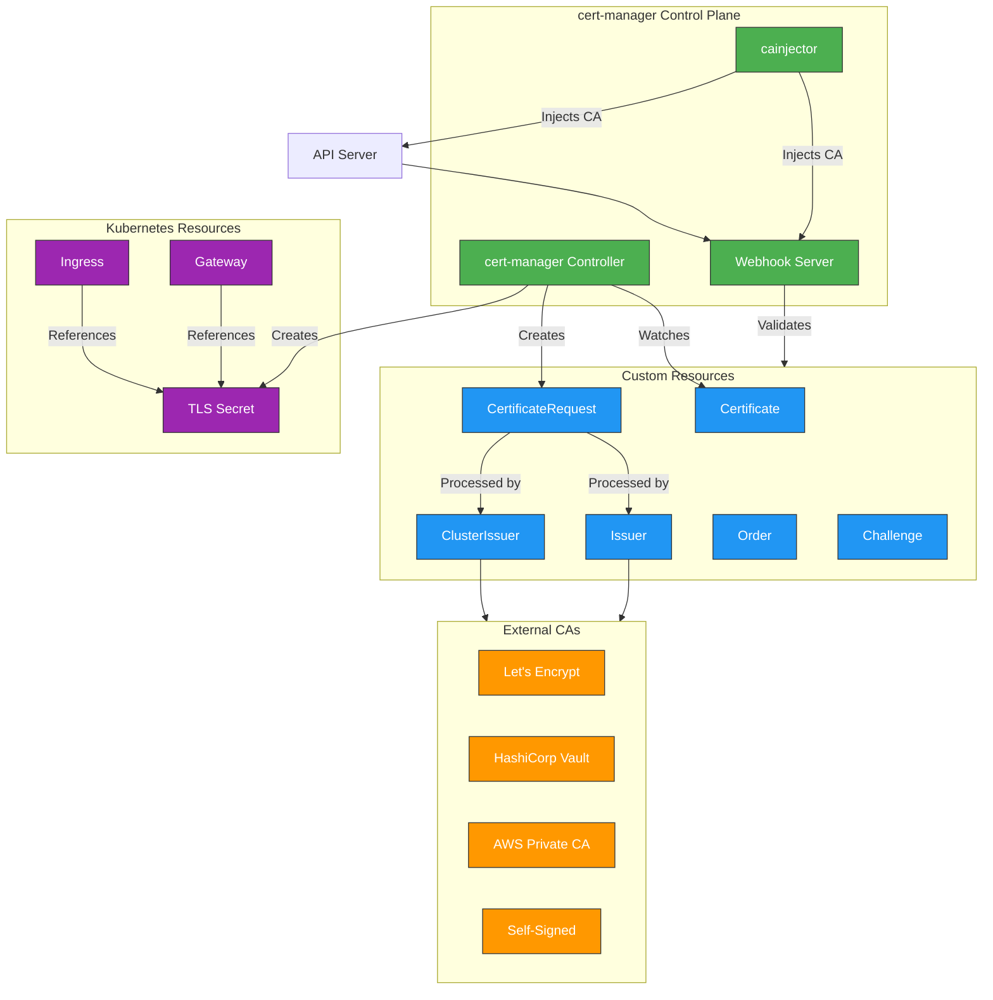
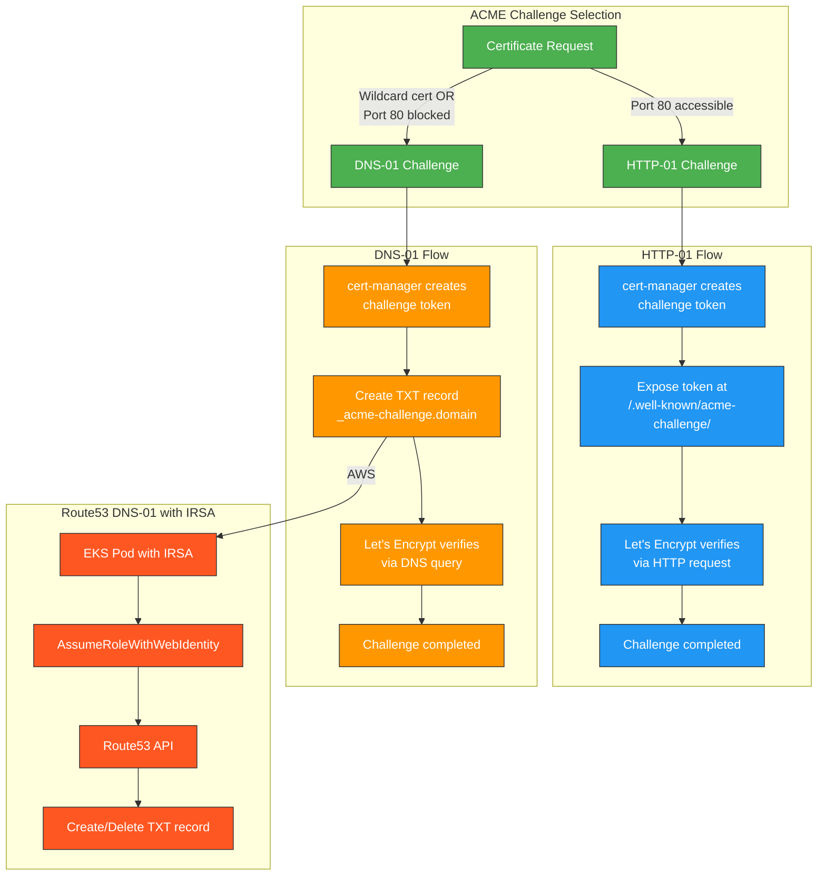
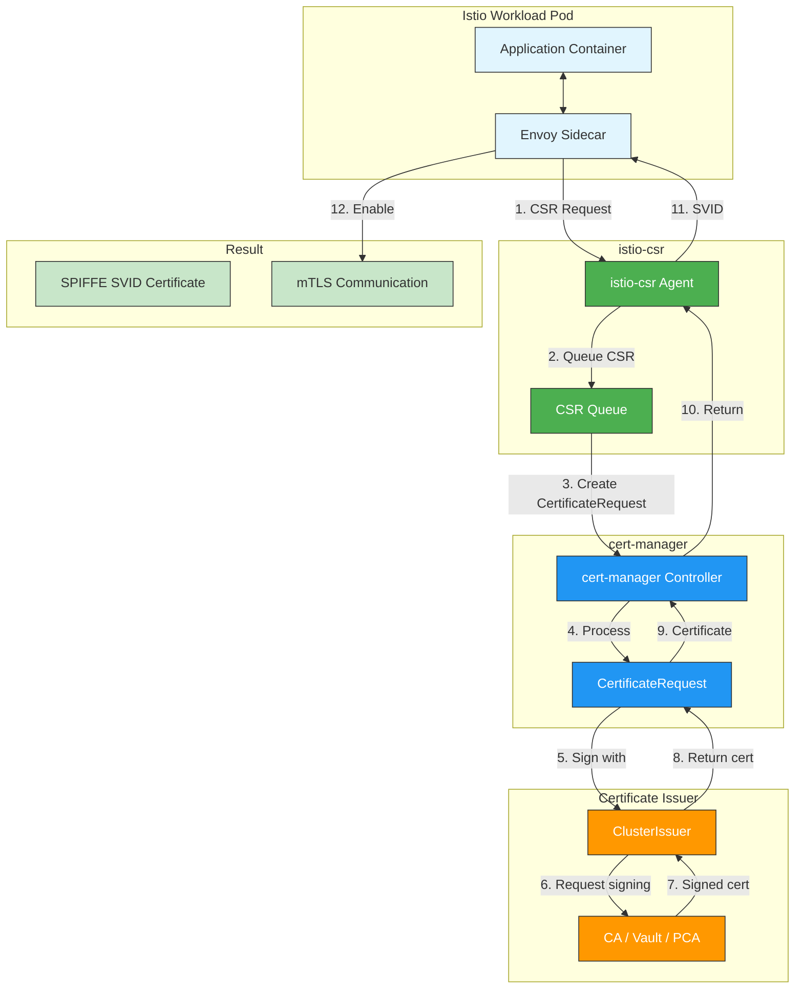

# 使用 cert-manager 进行证书管理

> **支持的版本**: cert-manager 1.16+, Kubernetes 1.31, 1.32, 1.33
> **最后更新**: July 13, 2026

cert-manager 是适用于 Kubernetes 的强大且可扩展的 X.509 证书控制器。它可以自动管理和签发来自多种来源的 TLS 证书，包括 Let's Encrypt、HashiCorp Vault、Venafi 和私有 PKI 系统。

## 目录

1. [概述](#overview)
2. [架构](#architecture)
3. [安装](#installation)
4. [核心概念](#core-concepts)
5. [Issuer 类型](#issuer-types)
6. [EKS 集成模式](#eks-integration-patterns)
7. [AWS 原生替代方案：ACM + ACK](#aws-native-alternative-acm--ack)
8. [Service Mesh 集成](#service-mesh-integration)
9. [trust-manager](#trust-manager)
10. [监控与故障排查](#monitoring-and-troubleshooting)
11. [最佳实践](#best-practices)
12. [总结与参考资料](#summary-and-references)

---

## 概述

### cert-manager 解决的问题

在 Kubernetes 环境中手动管理证书会带来显著的运维挑战：

| 挑战 | 影响 | cert-manager 解决方案 |
|-----------|--------|----------------------|
| **手动续期** | 证书过期导致 Service 中断 | 在过期前自动续期 |
| **流程不一致** | 安全缺口和配置漂移 | 声明式 Certificate 资源 |
| **密钥管理** | 密钥暴露风险 | 自动生成和轮换密钥 |
| **多 Issuer 复杂性** | 运维开销 | 面向所有 CA 类型的统一接口 |
| **与 GitOps 不兼容** | 无法对 Secret 进行版本控制 | Certificate CR 对 GitOps 友好 |

### 项目状态

cert-manager 是一个 **CNCF Graduated 项目**，表明它已达到生产就绪的成熟度：

- 首次发布：2017
- CNCF Sandbox：2020
- CNCF Incubating：2022
- CNCF Graduated：2024
- 活跃维护者来自 Venafi、Red Hat 和社区
- GitHub stars 超过 10,000，并在生产环境中被广泛采用

### 为什么证书生命周期自动化很重要

```
┌─────────────────────────────────────────────────────────────────────────┐
│              Certificate Lifecycle Without Automation                    │
├─────────────────────────────────────────────────────────────────────────┤
│                                                                         │
│  Day 1: Generate CSR → Day 2: Submit to CA → Day 3: Receive cert       │
│  Day 4: Configure application → Day 89: Forget about renewal           │
│  Day 90: Certificate expires → Day 90: Production outage!              │
│                                                                         │
├─────────────────────────────────────────────────────────────────────────┤
│              Certificate Lifecycle With cert-manager                     │
├─────────────────────────────────────────────────────────────────────────┤
│                                                                         │
│  Day 1: Apply Certificate CR → cert-manager handles everything         │
│  Day 60: Automatic renewal triggered → Zero intervention required      │
│  Day 90: New certificate active → No outage, no manual work            │
│                                                                         │
└─────────────────────────────────────────────────────────────────────────┘
```

---

## 架构

### 组件概览

cert-manager 由三个主要组件组成，它们协同工作来管理证书生命周期：



### 组件职责

| 组件 | 职责 | 关键功能 |
|-----------|---------------|---------------|
| **Controller** | 主协调循环 | 监视 Certificate CR，创建 CertificateRequest，存储已签发证书 |
| **Webhook** | Admission control | 验证并变更 cert-manager 资源 |
| **cainjector** | CA bundle 注入 | 将 CA 证书注入 Webhook 和 API server |

### 证书签发流程

```mermaid
flowchart LR
    subgraph User["User Action"]
        U[Create Certificate CR]
    end

    subgraph Controller["cert-manager Controller"]
        DETECT[Detect new Certificate]
        CREATECR[Create CertificateRequest]
        PROCESS[Process with Issuer]
        STORE[Store in Secret]
    end

    subgraph ACME["ACME Flow (if applicable)"]
        ORDER[Create Order]
        CHALLENGE[Create Challenge]
        SOLVE[Solve Challenge]
        FINALIZE[Finalize Order]
    end

    subgraph Output["Result"]
        SECRET[TLS Secret Created]
        READY[Certificate Ready]
    end

    U --> DETECT
    DETECT --> CREATECR
    CREATECR --> PROCESS

    PROCESS --> |ACME Issuer| ORDER
    ORDER --> CHALLENGE
    CHALLENGE --> SOLVE
    SOLVE --> FINALIZE
    FINALIZE --> STORE

    PROCESS --> |Non-ACME| STORE

    STORE --> SECRET
    SECRET --> READY

    classDef user fill:#E1F5FE,stroke:#333
    classDef controller fill:#4CAF50,stroke:#333,color:white
    classDef acme fill:#FF9800,stroke:#333,color:white
    classDef output fill:#C8E6C9,stroke:#333

    class U user
    class DETECT,CREATECR,PROCESS,STORE controller
    class ORDER,CHALLENGE,SOLVE,FINALIZE acme
    class SECRET,READY output
```



---

## 安装

### 前置条件

安装 cert-manager 之前，请确保：

- Kubernetes cluster 版本 1.25+
- `kubectl` 已配置 cluster admin 访问权限
- Helm 3.x（用于 Helm 安装方式）

### 使用 Helm 安装（推荐）

```bash
# Add the Jetstack Helm repository
helm repo add jetstack https://charts.jetstack.io
helm repo update

# Install cert-manager with CRDs
helm install cert-manager jetstack/cert-manager \
  --namespace cert-manager \
  --create-namespace \
  --version v1.16.2 \
  --set crds.enabled=true \
  --set prometheus.enabled=true \
  --set webhook.timeoutSeconds=30
```

### 生产环境 Helm Values

```yaml
# cert-manager-values.yaml
crds:
  enabled: true
  keep: true

replicaCount: 2

podDisruptionBudget:
  enabled: true
  minAvailable: 1

resources:
  requests:
    cpu: 50m
    memory: 64Mi
  limits:
    cpu: 200m
    memory: 256Mi

prometheus:
  enabled: true
  servicemonitor:
    enabled: true
    namespace: monitoring

webhook:
  replicaCount: 2
  timeoutSeconds: 30
  resources:
    requests:
      cpu: 25m
      memory: 32Mi
    limits:
      cpu: 100m
      memory: 128Mi

cainjector:
  replicaCount: 2
  resources:
    requests:
      cpu: 25m
      memory: 64Mi
    limits:
      cpu: 100m
      memory: 256Mi

# For EKS with IRSA
serviceAccount:
  annotations:
    eks.amazonaws.com/role-arn: arn:aws:iam::ACCOUNT_ID:role/cert-manager-role

# Global settings
global:
  leaderElection:
    namespace: cert-manager
  logLevel: 2
```

```bash
# Install with custom values
helm install cert-manager jetstack/cert-manager \
  --namespace cert-manager \
  --create-namespace \
  --version v1.16.2 \
  -f cert-manager-values.yaml
```

### 使用 kubectl 安装

```bash
# Install cert-manager manifests (includes CRDs)
kubectl apply -f https://github.com/cert-manager/cert-manager/releases/download/v1.16.2/cert-manager.yaml

# Verify installation
kubectl get pods -n cert-manager
```

### 验证安装

```bash
# Check all pods are running
kubectl get pods -n cert-manager

# Expected output:
# NAME                                       READY   STATUS    RESTARTS   AGE
# cert-manager-5d7f97b46d-xxxxx              1/1     Running   0          2m
# cert-manager-cainjector-7f694c4c58-xxxxx   1/1     Running   0          2m
# cert-manager-webhook-7cd8c769bb-xxxxx      1/1     Running   0          2m

# Check CRDs are installed
kubectl get crd | grep cert-manager

# Expected output:
# certificaterequests.cert-manager.io
# certificates.cert-manager.io
# challenges.acme.cert-manager.io
# clusterissuers.cert-manager.io
# issuers.cert-manager.io
# orders.acme.cert-manager.io

# Test with cmctl (optional)
# Install cmctl: https://cert-manager.io/docs/reference/cmctl/
cmctl check api
```

---

## 核心概念

### Custom Resource Definitions (CRDs)

cert-manager 引入了多个 CRD 来管理证书生命周期：

| CRD | 作用域 | 用途 |
|-----|-------|---------|
| **Certificate** | Namespaced | 声明期望的证书属性 |
| **CertificateRequest** | Namespaced | 表示绑定到某个 Issuer 的 CSR |
| **Issuer** | Namespaced | 定义如何获取证书（namespace-scoped） |
| **ClusterIssuer** | Cluster | 定义如何获取证书（cluster-wide） |
| **Order** | Namespaced | 表示 ACME order |
| **Challenge** | Namespaced | 表示 ACME challenge |

### Certificate 资源

Certificate 资源是请求证书的主要接口：

```yaml
apiVersion: cert-manager.io/v1
kind: Certificate
metadata:
  name: example-com-tls
  namespace: default
spec:
  # Secret where the certificate will be stored
  secretName: example-com-tls-secret

  # Certificate duration (default: 2160h = 90 days)
  duration: 2160h

  # Renewal window (default: 360h = 15 days before expiry)
  renewBefore: 360h

  # Subject fields
  subject:
    organizations:
      - Example Inc

  # Common name (deprecated, use dnsNames)
  commonName: example.com

  # Private key settings
  privateKey:
    algorithm: RSA
    size: 2048
    rotationPolicy: Always

  # Usages
  usages:
    - digital signature
    - key encipherment
    - server auth

  # DNS names for the certificate
  dnsNames:
    - example.com
    - www.example.com
    - api.example.com

  # IP addresses (optional)
  ipAddresses:
    - 192.168.1.1

  # Reference to the issuer
  issuerRef:
    name: letsencrypt-prod
    kind: ClusterIssuer
    group: cert-manager.io
```

### Issuer vs ClusterIssuer

```yaml
# Issuer - namespace-scoped
apiVersion: cert-manager.io/v1
kind: Issuer
metadata:
  name: ca-issuer
  namespace: my-namespace  # Only usable in this namespace
spec:
  ca:
    secretName: ca-key-pair

---
# ClusterIssuer - cluster-wide
apiVersion: cert-manager.io/v1
kind: ClusterIssuer
metadata:
  name: letsencrypt-prod  # No namespace, available cluster-wide
spec:
  acme:
    server: https://acme-v02.api.letsencrypt.org/directory
    email: admin@example.com
    privateKeySecretRef:
      name: letsencrypt-prod-account-key
    solvers:
      - http01:
          ingress:
            class: nginx
```

### CertificateRequest 资源

CertificateRequest 通常由 cert-manager 自动创建：

```yaml
apiVersion: cert-manager.io/v1
kind: CertificateRequest
metadata:
  name: example-com-tls-xxxxx
  namespace: default
spec:
  # Base64-encoded CSR
  request: LS0tLS1CRUdJTi...

  # Reference to the issuer
  issuerRef:
    name: letsencrypt-prod
    kind: ClusterIssuer
    group: cert-manager.io

  # Requested duration
  duration: 2160h

  # Usages
  usages:
    - digital signature
    - key encipherment
    - server auth
```

---

## Issuer 类型

### SelfSigned Issuer（开发/测试）

自签名证书适用于开发和测试环境：

```yaml
apiVersion: cert-manager.io/v1
kind: ClusterIssuer
metadata:
  name: selfsigned-issuer
spec:
  selfSigned: {}

---
# Create a self-signed CA certificate
apiVersion: cert-manager.io/v1
kind: Certificate
metadata:
  name: selfsigned-ca
  namespace: cert-manager
spec:
  isCA: true
  commonName: selfsigned-ca
  secretName: selfsigned-ca-secret
  privateKey:
    algorithm: ECDSA
    size: 256
  issuerRef:
    name: selfsigned-issuer
    kind: ClusterIssuer
    group: cert-manager.io
```

### CA Issuer（内部 PKI）

适用于拥有自己内部 Certificate Authority 的组织：

```yaml
# First, create a Secret with the CA certificate and key
apiVersion: v1
kind: Secret
metadata:
  name: ca-key-pair
  namespace: cert-manager
type: kubernetes.io/tls
data:
  tls.crt: LS0tLS1CRUdJTi...  # Base64-encoded CA certificate
  tls.key: LS0tLS1CRUdJTi...  # Base64-encoded CA private key

---
apiVersion: cert-manager.io/v1
kind: ClusterIssuer
metadata:
  name: ca-issuer
spec:
  ca:
    secretName: ca-key-pair

---
# Request a certificate from the CA issuer
apiVersion: cert-manager.io/v1
kind: Certificate
metadata:
  name: internal-service-tls
  namespace: default
spec:
  secretName: internal-service-tls-secret
  duration: 8760h  # 1 year
  renewBefore: 720h  # 30 days
  dnsNames:
    - internal-service.default.svc.cluster.local
    - internal-service.default.svc
    - internal-service
  issuerRef:
    name: ca-issuer
    kind: ClusterIssuer
```

### ACME / Let's Encrypt

ACME（Automatic Certificate Management Environment）与 Let's Encrypt 和其他兼容 ACME 的 CA 一起使用。

#### ACME Challenge 类型



#### HTTP-01 Solver

```yaml
apiVersion: cert-manager.io/v1
kind: ClusterIssuer
metadata:
  name: letsencrypt-prod
spec:
  acme:
    # Let's Encrypt production server
    server: https://acme-v02.api.letsencrypt.org/directory

    # Email for certificate expiry notifications
    email: admin@example.com

    # Secret to store the ACME account private key
    privateKeySecretRef:
      name: letsencrypt-prod-account-key

    # HTTP-01 solver configuration
    solvers:
      - http01:
          ingress:
            class: nginx
            # Or specify a specific ingress name
            # ingressTemplate:
            #   metadata:
            #     annotations:
            #       kubernetes.io/ingress.class: nginx
```

#### 使用 Route53 和 IRSA 的 DNS-01 Solver

```yaml
# IAM Policy for cert-manager (create via AWS CLI or Terraform)
# {
#   "Version": "2012-10-17",
#   "Statement": [
#     {
#       "Effect": "Allow",
#       "Action": "route53:GetChange",
#       "Resource": "arn:aws:route53:::change/*"
#     },
#     {
#       "Effect": "Allow",
#       "Action": [
#         "route53:ChangeResourceRecordSets",
#         "route53:ListResourceRecordSets"
#       ],
#       "Resource": "arn:aws:route53:::hostedzone/HOSTED_ZONE_ID"
#     },
#     {
#       "Effect": "Allow",
#       "Action": "route53:ListHostedZonesByName",
#       "Resource": "*"
#     }
#   ]
# }

---
apiVersion: cert-manager.io/v1
kind: ClusterIssuer
metadata:
  name: letsencrypt-dns01
spec:
  acme:
    server: https://acme-v02.api.letsencrypt.org/directory
    email: admin@example.com
    privateKeySecretRef:
      name: letsencrypt-dns01-account-key
    solvers:
      # DNS-01 solver for Route53
      - selector:
          dnsZones:
            - "example.com"
        dns01:
          route53:
            region: us-east-1
            hostedZoneID: Z1234567890ABC
            # Using IRSA - no credentials needed in the spec
            # cert-manager ServiceAccount must have the IAM role annotation

---
# Wildcard certificate (only possible with DNS-01)
apiVersion: cert-manager.io/v1
kind: Certificate
metadata:
  name: wildcard-example-com
  namespace: default
spec:
  secretName: wildcard-example-com-tls
  dnsNames:
    - "example.com"
    - "*.example.com"
  issuerRef:
    name: letsencrypt-dns01
    kind: ClusterIssuer
```

### AWS Private CA Issuer

适用于需要 AWS Private Certificate Authority 的企业环境：

```bash
# Install AWS PCA Issuer
helm repo add awspca https://cert-manager.github.io/aws-privateca-issuer
helm install aws-pca-issuer awspca/aws-privateca-issuer \
  --namespace cert-manager \
  --set serviceAccount.annotations."eks\.amazonaws\.com/role-arn"=arn:aws:iam::ACCOUNT_ID:role/aws-pca-issuer-role
```

```yaml
# IAM Policy for AWS PCA Issuer
# {
#   "Version": "2012-10-17",
#   "Statement": [
#     {
#       "Effect": "Allow",
#       "Action": [
#         "acm-pca:IssueCertificate",
#         "acm-pca:GetCertificate",
#         "acm-pca:DescribeCertificateAuthority"
#       ],
#       "Resource": "arn:aws:acm-pca:REGION:ACCOUNT_ID:certificate-authority/CA_ID"
#     }
#   ]
# }

---
apiVersion: awspca.cert-manager.io/v1beta1
kind: AWSPCAClusterIssuer
metadata:
  name: aws-pca-issuer
spec:
  arn: arn:aws:acm-pca:us-east-1:123456789012:certificate-authority/xxxxxxxx-xxxx-xxxx-xxxx-xxxxxxxxxxxx
  region: us-east-1

---
apiVersion: cert-manager.io/v1
kind: Certificate
metadata:
  name: internal-mtls-cert
  namespace: default
spec:
  secretName: internal-mtls-tls
  duration: 8760h
  renewBefore: 720h
  commonName: service.internal.example.com
  dnsNames:
    - service.internal.example.com
  usages:
    - digital signature
    - key encipherment
    - server auth
    - client auth  # For mTLS
  issuerRef:
    name: aws-pca-issuer
    kind: AWSPCAClusterIssuer
    group: awspca.cert-manager.io
```

### HashiCorp Vault PKI

适用于将 HashiCorp Vault 作为 PKI 后端的组织：

```yaml
apiVersion: cert-manager.io/v1
kind: ClusterIssuer
metadata:
  name: vault-issuer
spec:
  vault:
    # Vault server address
    server: https://vault.example.com

    # PKI secrets engine path
    path: pki/sign/my-role

    # Vault namespace (Enterprise only)
    # namespace: admin

    # CA bundle for Vault TLS
    caBundle: LS0tLS1CRUdJTi...

    # Authentication method
    auth:
      # Kubernetes auth method
      kubernetes:
        role: cert-manager
        mountPath: /v1/auth/kubernetes
        serviceAccountRef:
          name: cert-manager
          # namespace: cert-manager  # Optional, defaults to issuer namespace

      # Or use AppRole auth
      # appRole:
      #   path: approle
      #   roleId: my-role-id
      #   secretRef:
      #     name: vault-approle-secret
      #     key: secretId

---
# Vault configuration (run in Vault)
# vault secrets enable pki
# vault secrets tune -max-lease-ttl=8760h pki
# vault write pki/root/generate/internal \
#     common_name="Example Root CA" \
#     ttl=87600h
# vault write pki/roles/my-role \
#     allowed_domains="example.com" \
#     allow_subdomains=true \
#     max_ttl=72h
# vault write auth/kubernetes/role/cert-manager \
#     bound_service_account_names=cert-manager \
#     bound_service_account_namespaces=cert-manager \
#     policies=pki-policy \
#     ttl=1h
```

---

## EKS 集成模式

### TLS 终止比较

| 方案 | TLS 终止 | 证书来源 | 使用场景 |
|----------|----------------|-------------------|----------|
| **ALB + ACM** | 在 ALB | AWS Certificate Manager | 面向公网并使用 AWS 托管证书 |
| **ALB + cert-manager** | 在 ALB | cert-manager | 面向公网并使用自定义 CA |
| **NLB + Ingress** | 在 Ingress Controller | cert-manager | Layer 4 load balancing |
| **NLB + Pod** | 在 Pod | cert-manager | 端到端加密 |
| **Gateway API** | 在 Gateway | cert-manager | 现代 API，面向未来 |

> ACM 证书现在也可以定义并协调为原生 Kubernetes 资源。请参见下方的 [AWS 原生替代方案：ACM + ACK](#aws-native-alternative-acm--ack)。

### ALB Ingress with ACM vs cert-manager

```yaml
# Option 1: ALB with ACM (AWS-managed certificates)
apiVersion: networking.k8s.io/v1
kind: Ingress
metadata:
  name: app-ingress-acm
  annotations:
    kubernetes.io/ingress.class: alb
    alb.ingress.kubernetes.io/scheme: internet-facing
    alb.ingress.kubernetes.io/target-type: ip
    alb.ingress.kubernetes.io/listen-ports: '[{"HTTPS":443}]'
    # ACM certificate ARN
    alb.ingress.kubernetes.io/certificate-arn: arn:aws:acm:us-east-1:123456789012:certificate/xxxxxxxx
    alb.ingress.kubernetes.io/ssl-policy: ELBSecurityPolicy-TLS13-1-2-2021-06
spec:
  rules:
    - host: app.example.com
      http:
        paths:
          - path: /
            pathType: Prefix
            backend:
              service:
                name: app-service
                port:
                  number: 80

---
# Option 2: Ingress-nginx with cert-manager
apiVersion: networking.k8s.io/v1
kind: Ingress
metadata:
  name: app-ingress-certmanager
  annotations:
    kubernetes.io/ingress.class: nginx
    cert-manager.io/cluster-issuer: letsencrypt-prod
spec:
  tls:
    - hosts:
        - app.example.com
      secretName: app-example-com-tls
  rules:
    - host: app.example.com
      http:
        paths:
          - path: /
            pathType: Prefix
            backend:
              service:
                name: app-service
                port:
                  number: 80
```

### 使用 Ingress Controller 进行 TLS 终止的 NLB

```yaml
# NLB Service for ingress-nginx
apiVersion: v1
kind: Service
metadata:
  name: ingress-nginx-controller
  namespace: ingress-nginx
  annotations:
    service.beta.kubernetes.io/aws-load-balancer-type: external
    service.beta.kubernetes.io/aws-load-balancer-nlb-target-type: ip
    service.beta.kubernetes.io/aws-load-balancer-scheme: internet-facing
spec:
  type: LoadBalancer
  ports:
    - name: https
      port: 443
      targetPort: 443
      protocol: TCP
  selector:
    app.kubernetes.io/name: ingress-nginx

---
# Certificate for ingress controller
apiVersion: cert-manager.io/v1
kind: Certificate
metadata:
  name: ingress-tls
  namespace: ingress-nginx
spec:
  secretName: ingress-tls-secret
  dnsNames:
    - "*.example.com"
    - example.com
  issuerRef:
    name: letsencrypt-dns01
    kind: ClusterIssuer
```

### Gateway API 集成

```yaml
# Install Gateway API CRDs
# kubectl apply -f https://github.com/kubernetes-sigs/gateway-api/releases/download/v1.2.0/standard-install.yaml

---
apiVersion: gateway.networking.k8s.io/v1
kind: Gateway
metadata:
  name: main-gateway
  namespace: default
  annotations:
    cert-manager.io/cluster-issuer: letsencrypt-prod
spec:
  gatewayClassName: nginx  # or istio, envoy, etc.
  listeners:
    - name: https
      port: 443
      protocol: HTTPS
      hostname: "*.example.com"
      tls:
        mode: Terminate
        certificateRefs:
          - name: wildcard-example-com-tls
            kind: Secret
      allowedRoutes:
        namespaces:
          from: All

---
apiVersion: gateway.networking.k8s.io/v1
kind: HTTPRoute
metadata:
  name: app-route
  namespace: default
spec:
  parentRefs:
    - name: main-gateway
      namespace: default
  hostnames:
    - app.example.com
  rules:
    - matches:
        - path:
            type: PathPrefix
            value: /
      backendRefs:
        - name: app-service
          port: 80
```

---

## AWS 原生替代方案：ACM + ACK

### 概述

2025 年 12 月 15 日，AWS 发布了[使用 AWS Certificate Manager (ACM) 为 Kubernetes 自动化证书管理](https://aws.amazon.com/about-aws/whats-new/2025/12/acm-automated-certificate-management-kubernetes)，将 ACM 与 AWS Controllers for Kubernetes (ACK) 集成。在 cluster 中安装 ACM ACK controller 后，可以将证书定义为原生 Kubernetes custom resource (YAML)，ACK controller 会自动处理完整生命周期：请求签发、完成域名/所有权验证，以及创建并续期对应的 Kubernetes Secret。

cert-manager 是一个 CNCF 开源解决方案，支持广泛的 Issuer（Let's Encrypt 和其他 ACME Issuer、Vault、AWS Private CA、自签名等）；而 ACM+ACK 集成是一个 **AWS 原生替代方案**。对于已经投入 IAM/ACM 生态系统的组织，它可以在不运行单独开源控制器的情况下提供同类自动化能力。

### 2026 年 7 月更新：ACM 现在支持 ACME 协议

2026 年 7 月，ACM 增加了[通过 ACME 协议签发公有证书](https://aws.amazon.com/about-aws/whats-new/2026/07/aws-certificate-manager-acme/)的支持。你可以预置一个完全托管的 ACME server endpoint，该 endpoint 使用 Amazon Trust Services 签发有效期为 45 天的公有 TLS 证书，并可由任何兼容 ACMEv2 的客户端使用——包括 Certbot、acme.sh 和用于 Kubernetes 的 cert-manager。换句话说，现在只需将 cert-manager 现有 ACME Issuer 的 `server` 字段指向 ACM ACME endpoint，即可使用 ACM 公有证书，而无需安装 ACK controller。

PKI 管理员可以在 endpoint 级别应用集中治理——限制域名范围并强制执行 wildcard 策略——并将证书请求委派给应用团队，而无需分发 DNS 凭据；所有活动都可通过 CloudTrail 日志和 CloudWatch 指标审计。随着 CA/Browser Forum 要求到 2029 年证书生命周期为 47 天，cert-manager + ACM ACME endpoint 组合被定位为 Let's Encrypt 的 AWS 原生替代方案。

### 支持的证书类型

| 类型 | 使用场景 |
|------|----------|
| **ACM Exportable Public Certificates** | 导出到 Kubernetes Secret 以供 Pod/Ingress 直接使用的公有域名证书 |
| **AWS Private CA** | 需要私有 PKI 的内部服务和 service-mesh（Istio、Linkerd）mTLS 工作负载 |

### 适用场景

- 直接在应用程序 Pod 中终止 TLS（NGINX、自定义应用程序）
- Service mesh（Istio、Linkerd）工作负载证书
- 未使用 ALB/NLB 原生证书集成的第三方 Ingress Controllers（NGINX Ingress、Traefik）
- 需要一致证书管理的多 cluster/混合环境

### 示例：通过 ACK 定义 Certificate

```yaml
apiVersion: acm.services.k8s.aws/v1alpha1
kind: Certificate
metadata:
  name: example-com-tls
  namespace: default
spec:
  domainName: example.com
  subjectAlternativeNames:
    - "*.example.com"
  validationMethod: DNS
  tags:
    - key: managed-by
      value: ack
```

ACK controller 会监视此资源，向 ACM 请求证书，并在签发完成后创建/续期生成的 Kubernetes Secret。具体字段名称和 Secret 导出机制可能因 ACM ACK controller 版本而异，因此安装前请查看官方文档。

### 与 cert-manager 的比较

| 方面 | cert-manager | ACM + ACK |
|--------|--------------|-----------|
| **Issuers** | Let's Encrypt、Vault、AWS PCA 等 | ACM（公有）、AWS Private CA |
| **生态系统** | CNCF 开源、厂商中立 | AWS 原生、基于 IAM 的访问控制 |
| **安装内容** | cert-manager controller | 用于 ACM 的 ACK service controller |
| **成本** | 免费（仅基础设施成本） | 标准 ACM/AWS Private CA 定价；Kubernetes 集成本身不额外收费 |
| **最适合** | Multi-cloud，或需要 ACME Issuer | 以 AWS 为中心且已使用 ACM/IAM 的组织 |

这两种方式并不互斥——例如，公有域名证书可以通过 ACM+ACK 管理，而内部 mTLS 证书继续通过 cert-manager 与 AWS PCA Issuer 管理。

---

## Service Mesh 集成

### Istio 与 istio-csr

istio-csr 是一个 cert-manager agent，可与 Istio 集成以提供工作负载证书。它会用 cert-manager 签名的证书替换默认的 istiod CA。



#### 安装 istio-csr

```bash
# Create issuer for istio-csr
kubectl apply -f - <<EOF
apiVersion: cert-manager.io/v1
kind: ClusterIssuer
metadata:
  name: istio-ca
spec:
  ca:
    secretName: istio-ca-secret
EOF

# Install istio-csr
helm repo add jetstack https://charts.jetstack.io
helm install istio-csr jetstack/cert-manager-istio-csr \
  --namespace cert-manager \
  --set app.certmanager.issuer.name=istio-ca \
  --set app.certmanager.issuer.kind=ClusterIssuer \
  --set app.certmanager.issuer.group=cert-manager.io \
  --set app.tls.certificateDuration=1h \
  --set app.tls.istiodCertificateDuration=1h \
  --set app.tls.rootCAFile=/var/run/secrets/istio-csr/ca.pem
```

#### 配置 Istio 使用 istio-csr

```yaml
# IstioOperator configuration
apiVersion: install.istio.io/v1alpha1
kind: IstioOperator
metadata:
  name: istio
  namespace: istio-system
spec:
  profile: default
  meshConfig:
    # Use istio-csr for workload certificates
    caCertificates:
      - pem: |
          # CA certificate from cert-manager
    defaultConfig:
      proxyMetadata:
        # Point to istio-csr for certificate signing
        ISTIO_META_CERT_SIGNER: istio-csr.cert-manager.svc
  components:
    pilot:
      k8s:
        env:
          # Disable istiod CA
          - name: ENABLE_CA_SERVER
            value: "false"
          # Use external CA
          - name: EXTERNAL_CA
            value: ISTIOD_RA_KUBERNETES_API
        overlays:
          - apiVersion: apps/v1
            kind: Deployment
            name: istiod
            patches:
              - path: spec.template.spec.containers[0].volumeMounts[-]
                value:
                  name: istio-csr-ca-configmap
                  mountPath: /var/run/secrets/istiod/tls
                  readOnly: true
              - path: spec.template.spec.volumes[-]
                value:
                  name: istio-csr-ca-configmap
                  configMap:
                    name: istio-csr-ca-configmap
```

### Linkerd Trust Anchor 管理

Linkerd 需要用于 mTLS 的 trust anchor 证书。cert-manager 可以管理它：

```yaml
# Create a self-signed issuer for the trust anchor
apiVersion: cert-manager.io/v1
kind: ClusterIssuer
metadata:
  name: linkerd-trust-anchor
spec:
  selfSigned: {}

---
# Trust anchor certificate (root CA)
apiVersion: cert-manager.io/v1
kind: Certificate
metadata:
  name: linkerd-trust-anchor
  namespace: linkerd
spec:
  isCA: true
  commonName: root.linkerd.cluster.local
  secretName: linkerd-trust-anchor
  privateKey:
    algorithm: ECDSA
    size: 256
  duration: 87600h  # 10 years
  renewBefore: 8760h  # 1 year
  issuerRef:
    name: linkerd-trust-anchor
    kind: ClusterIssuer

---
# Issuer using the trust anchor
apiVersion: cert-manager.io/v1
kind: Issuer
metadata:
  name: linkerd-identity-issuer
  namespace: linkerd
spec:
  ca:
    secretName: linkerd-trust-anchor

---
# Identity issuer certificate
apiVersion: cert-manager.io/v1
kind: Certificate
metadata:
  name: linkerd-identity-issuer
  namespace: linkerd
spec:
  isCA: true
  commonName: identity.linkerd.cluster.local
  secretName: linkerd-identity-issuer
  privateKey:
    algorithm: ECDSA
    size: 256
  duration: 48h
  renewBefore: 25h
  issuerRef:
    name: linkerd-identity-issuer
    kind: Issuer
```

```bash
# Install Linkerd with cert-manager managed certificates
linkerd install \
  --identity-trust-anchors-file <(kubectl get secret linkerd-trust-anchor -n linkerd -o jsonpath='{.data.ca\.crt}' | base64 -d) \
  --identity-issuer-certificate-file <(kubectl get secret linkerd-identity-issuer -n linkerd -o jsonpath='{.data.tls\.crt}' | base64 -d) \
  --identity-issuer-key-file <(kubectl get secret linkerd-identity-issuer -n linkerd -o jsonpath='{.data.tls\.key}' | base64 -d) \
  | kubectl apply -f -
```

---

## trust-manager

trust-manager 是 cert-manager 的配套项目，用于跨 namespace 分发 CA trust bundle。

### 安装 trust-manager

```bash
helm repo add jetstack https://charts.jetstack.io
helm install trust-manager jetstack/trust-manager \
  --namespace cert-manager \
  --set app.trust.namespace=cert-manager
```

### Bundle 资源

```yaml
apiVersion: trust.cert-manager.io/v1alpha1
kind: Bundle
metadata:
  name: public-bundle
spec:
  sources:
    # Include default CA certificates
    - useDefaultCAs: true

    # Include specific ConfigMap
    - configMap:
        name: my-ca-bundle
        key: ca-bundle.crt

    # Include from Secret
    - secret:
        name: internal-ca
        key: tls.crt

    # Inline CA certificate
    - inlineString: |
        -----BEGIN CERTIFICATE-----
        MIIBkTCB+wIJAKHBfpEgcMFuMA0GCSqGSIb3DQEBCwUAMBExDzANBgNVBAMMBnJv
        ...
        -----END CERTIFICATE-----

  target:
    # Create ConfigMap in all namespaces
    configMap:
      key: ca-bundle.crt

    # Or specify namespaces
    # namespaceSelector:
    #   matchLabels:
    #     trust-bundle: enabled
```

### 在应用程序中使用 Trust Bundle

```yaml
apiVersion: apps/v1
kind: Deployment
metadata:
  name: app-with-trust-bundle
spec:
  template:
    spec:
      containers:
        - name: app
          image: myapp:latest
          volumeMounts:
            - name: ca-bundle
              mountPath: /etc/ssl/certs/ca-certificates.crt
              subPath: ca-bundle.crt
              readOnly: true
          env:
            - name: SSL_CERT_FILE
              value: /etc/ssl/certs/ca-certificates.crt
      volumes:
        - name: ca-bundle
          configMap:
            name: public-bundle
```

---

## 监控与故障排查

### Prometheus Metrics

cert-manager 暴露用于监控证书健康状况的 metrics：

```yaml
# ServiceMonitor for Prometheus Operator
apiVersion: monitoring.coreos.com/v1
kind: ServiceMonitor
metadata:
  name: cert-manager
  namespace: monitoring
spec:
  selector:
    matchLabels:
      app.kubernetes.io/name: cert-manager
  namespaceSelector:
    matchNames:
      - cert-manager
  endpoints:
    - port: tcp-prometheus-servicemonitor
      interval: 30s
```

### 关键 Metrics

| Metric | 描述 | 告警阈值 |
|--------|-------------|-----------------|
| `certmanager_certificate_ready_status` | Certificate 就绪状态（1=ready，0=not ready） | != 1 |
| `certmanager_certificate_expiration_timestamp_seconds` | Certificate 过期时间戳 | < 7 days |
| `certmanager_certificate_renewal_timestamp_seconds` | 下一次续期时间戳 | Past due |
| `certmanager_controller_sync_call_count` | Controller 同步操作 | Spike detection |
| `certmanager_http_acme_client_request_count` | ACME HTTP 请求 | Rate limiting detection |

### 用于告警的 PrometheusRule

```yaml
apiVersion: monitoring.coreos.com/v1
kind: PrometheusRule
metadata:
  name: cert-manager-alerts
  namespace: monitoring
spec:
  groups:
    - name: cert-manager
      rules:
        - alert: CertificateNotReady
          expr: certmanager_certificate_ready_status == 0
          for: 10m
          labels:
            severity: warning
          annotations:
            summary: "Certificate {{ $labels.name }} in {{ $labels.namespace }} is not ready"
            description: "Certificate has been in not-ready state for more than 10 minutes"

        - alert: CertificateExpiringSoon
          expr: (certmanager_certificate_expiration_timestamp_seconds - time()) < 604800
          for: 1h
          labels:
            severity: warning
          annotations:
            summary: "Certificate {{ $labels.name }} expires in less than 7 days"
            description: "Certificate will expire in {{ $value | humanizeDuration }}"

        - alert: CertificateExpiryCritical
          expr: (certmanager_certificate_expiration_timestamp_seconds - time()) < 86400
          for: 10m
          labels:
            severity: critical
          annotations:
            summary: "Certificate {{ $labels.name }} expires in less than 24 hours"
            description: "Certificate will expire in {{ $value | humanizeDuration }}"
```

### Certificate 就绪检查

```bash
# Check certificate status
kubectl get certificates -A

# Detailed certificate status
kubectl describe certificate <name> -n <namespace>

# Check CertificateRequest status
kubectl get certificaterequests -A

# View certificate details
kubectl get secret <secret-name> -o jsonpath='{.data.tls\.crt}' | base64 -d | openssl x509 -text -noout
```

### 常见错误和解决方案

| 错误 | 原因 | 解决方案 |
|-------|-------|----------|
| `Waiting for HTTP-01 challenge propagation` | Challenge endpoint 不可访问 | 检查 Ingress、Service、防火墙规则 |
| `DNS problem: NXDOMAIN` | DNS record 未创建 | 验证 Route53 权限和 hosted zone ID |
| `Error presenting challenge: 403 Forbidden` | IRSA/IAM 权限问题 | 检查 ServiceAccount annotations 和 IAM policy |
| `acme: error code 429` | 超出 rate limit | 等待 1 小时，测试时使用 staging server |
| `certificate is not valid for any names` | DNS name 不匹配 | 验证 Certificate spec 中的 `dnsNames` |
| `Error getting keypair for CA issuer` | CA secret 缺失或格式错误 | 检查 CA secret 是否存在且包含正确 key |

### cmctl CLI Tool

```bash
# Install cmctl
# Linux
curl -fsSL https://github.com/cert-manager/cmctl/releases/download/v2.1.0/cmctl_linux_amd64.tar.gz | tar xz
sudo mv cmctl /usr/local/bin/

# Verify API is ready
cmctl check api

# Check certificate status
cmctl status certificate <name> -n <namespace>

# Manually trigger renewal
cmctl renew <certificate-name> -n <namespace>

# Create CertificateRequest for testing
cmctl create certificaterequest my-cr \
  --from-certificate-file cert.yaml \
  --namespace default

# Approve/Deny CertificateRequest (if approval is required)
cmctl approve <certificaterequest-name> -n <namespace>
cmctl deny <certificaterequest-name> -n <namespace>

# Convert legacy cert-manager resources
cmctl convert -f old-resources.yaml
```

---

## 最佳实践

### 续期缓冲区配置

设置合适的续期窗口以防止证书过期：

```yaml
apiVersion: cert-manager.io/v1
kind: Certificate
metadata:
  name: example-cert
spec:
  # Certificate valid for 90 days
  duration: 2160h

  # Renew 30 days before expiry (gives time for issues)
  renewBefore: 720h

  # For short-lived certificates (1 hour)
  # duration: 1h
  # renewBefore: 30m
```

### CA 备份策略

始终维护 CA 备份以支持灾难恢复：

```bash
# Backup CA certificate and key
kubectl get secret ca-key-pair -n cert-manager -o yaml > ca-backup.yaml

# Store securely (encrypted, off-cluster)
# Consider using AWS Secrets Manager or HashiCorp Vault for CA storage

# Restore procedure
kubectl apply -f ca-backup.yaml
```

### 多租户 Issuer 策略

```yaml
# ClusterIssuer for shared infrastructure
apiVersion: cert-manager.io/v1
kind: ClusterIssuer
metadata:
  name: letsencrypt-prod
spec:
  acme:
    server: https://acme-v02.api.letsencrypt.org/directory
    email: platform-team@example.com
    privateKeySecretRef:
      name: letsencrypt-prod-key
    solvers:
      - http01:
          ingress:
            class: nginx

---
# Namespace-scoped Issuer for team-specific CA
apiVersion: cert-manager.io/v1
kind: Issuer
metadata:
  name: team-a-ca
  namespace: team-a
spec:
  ca:
    secretName: team-a-ca-keypair

---
# RBAC for namespace issuers
apiVersion: rbac.authorization.k8s.io/v1
kind: Role
metadata:
  name: cert-manager-issuer-admin
  namespace: team-a
rules:
  - apiGroups: ["cert-manager.io"]
    resources: ["issuers"]
    verbs: ["create", "delete", "get", "list", "patch", "update", "watch"]
  - apiGroups: ["cert-manager.io"]
    resources: ["certificates", "certificaterequests"]
    verbs: ["create", "delete", "get", "list", "patch", "update", "watch"]
```

### RBAC 配置

```yaml
# Allow developers to create Certificates but not Issuers
apiVersion: rbac.authorization.k8s.io/v1
kind: ClusterRole
metadata:
  name: cert-manager-certificate-creator
rules:
  - apiGroups: ["cert-manager.io"]
    resources: ["certificates"]
    verbs: ["create", "delete", "get", "list", "watch"]
  - apiGroups: [""]
    resources: ["secrets"]
    verbs: ["get", "list", "watch"]
    # Note: Don't grant create/delete on secrets unless needed

---
apiVersion: rbac.authorization.k8s.io/v1
kind: ClusterRoleBinding
metadata:
  name: developers-certificate-creator
subjects:
  - kind: Group
    name: developers
    apiGroup: rbac.authorization.k8s.io
roleRef:
  kind: ClusterRole
  name: cert-manager-certificate-creator
  apiGroup: rbac.authorization.k8s.io
```

### Private Key 轮换

```yaml
apiVersion: cert-manager.io/v1
kind: Certificate
metadata:
  name: rotating-cert
spec:
  secretName: rotating-cert-tls
  dnsNames:
    - app.example.com
  privateKey:
    # Rotate key on each renewal
    rotationPolicy: Always
    algorithm: ECDSA
    size: 256
  issuerRef:
    name: ca-issuer
    kind: ClusterIssuer
```

---

## 总结与参考资料

### 关键概念总结

| 概念 | 描述 |
|---------|-------------|
| **Certificate** | 声明期望的证书并触发签发 |
| **Issuer** | Namespace-scoped 的证书颁发机构配置 |
| **ClusterIssuer** | Cluster-wide 的证书颁发机构配置 |
| **CertificateRequest** | 表示单个证书签名请求 |
| **ACME** | 用于自动证书签发的协议（Let's Encrypt） |
| **HTTP-01** | 通过 HTTP endpoint 验证的 ACME challenge |
| **DNS-01** | 通过 DNS TXT record 验证的 ACME challenge |
| **trust-manager** | 跨 namespace 分发 CA bundle |
| **istio-csr** | 将 cert-manager 与 Istio 集成以提供工作负载证书 |

### Issuer 选择指南

| 场景 | 推荐 Issuer |
|----------|-------------------|
| 开发/测试 | SelfSigned 或 CA |
| 公有网站 | ACME (Let's Encrypt) |
| 使用现有 PKI 的内部服务 | CA 或 Vault |
| AWS 原生企业 | AWS PCA |
| Multi-cloud 企业 | Vault PKI |
| Service mesh 工作负载 | 结合 istio-csr/Linkerd 集成的 CA |

### 官方参考资料

| 资源 | URL |
|----------|-----|
| cert-manager 文档 | https://cert-manager.io/docs/ |
| cert-manager GitHub | https://github.com/cert-manager/cert-manager |
| ACME Protocol RFC | https://datatracker.ietf.org/doc/html/rfc8555 |
| Let's Encrypt 文档 | https://letsencrypt.org/docs/ |
| AWS PCA Issuer | https://github.com/cert-manager/aws-privateca-issuer |
| Kubernetes 的 ACM 自动化证书管理（2025 年 12 月 15 日） | https://aws.amazon.com/about-aws/whats-new/2025/12/acm-automated-certificate-management-kubernetes |
| istio-csr | https://github.com/cert-manager/istio-csr |
| trust-manager | https://github.com/cert-manager/trust-manager |
| cmctl CLI | https://cert-manager.io/docs/reference/cmctl/ |
| Helm Chart | https://artifacthub.io/packages/helm/cert-manager/cert-manager |

### 版本兼容性矩阵

| cert-manager | Kubernetes | Helm |
|--------------|------------|------|
| 1.16.x | 1.28 - 1.33 | 3.x |
| 1.15.x | 1.27 - 1.32 | 3.x |
| 1.14.x | 1.26 - 1.31 | 3.x |
| 1.13.x | 1.25 - 1.30 | 3.x |
