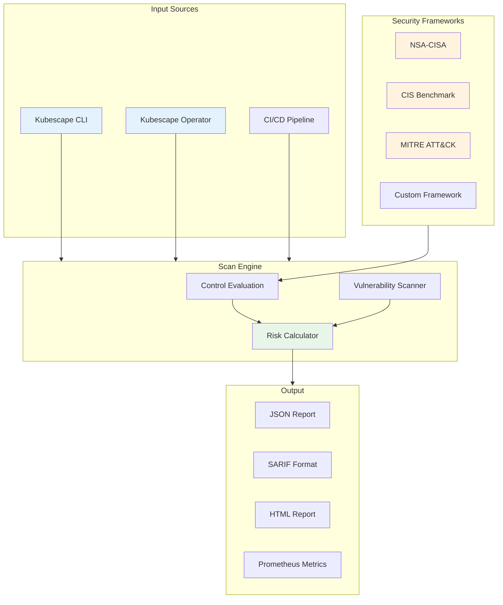
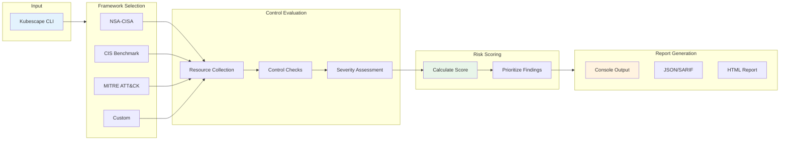
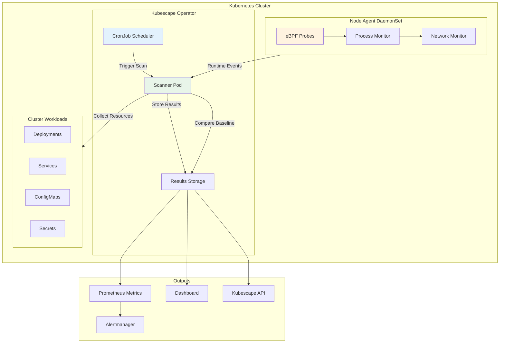
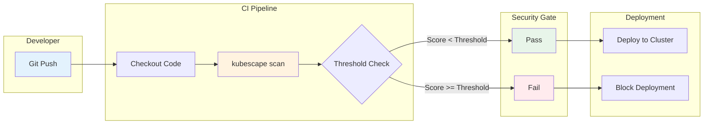

# 使用 Kubescape 进行安全态势管理

> **支持版本**: Kubescape 3.0+, Kubernetes 1.31, 1.32, 1.33
> **最后更新**: February 25, 2026

Kubescape 是一个开源 Kubernetes 安全平台，提供全面的安全态势管理、漏洞扫描和合规性检查。作为 CNCF Sandbox 项目，它帮助组织在其 Kubernetes 环境中识别错误配置、漏洞和合规性违规。

## 目录

1. [概述](#overview)
2. [安装](#installation)
3. [安全框架](#security-frameworks)
4. [CLI 扫描](#cli-scanning)
5. [Operator 模式（集群内）](#operator-mode-in-cluster)
6. [风险评分](#risk-scoring)
7. [CI/CD 集成](#cicd-integration)
8. [EKS 专用指南](#eks-specific-guide)
9. [控制项例外处理](#control-exception-handling)
10. [最佳实践](#best-practices)
11. [总结和参考资料](#summary-and-references)

---

## 概述

### Kubescape 解决的问题

Kubescape 解决 Kubernetes 环境中的关键安全挑战：

- **错误配置检测**: 识别工作负载、RBAC、网络策略和集群设置中的安全错误配置
- **合规性验证**: 根据行业框架（NSA-CISA、CIS、MITRE ATT&CK）验证集群
- **漏洞扫描**: 检测容器镜像和 Kubernetes 组件中的漏洞
- **RBAC 分析**: 可视化并分析基于角色的访问控制配置
- **Shift-Left 安全**: 在部署前扫描清单和 Helm charts

### CNCF Sandbox 项目

Kubescape 于 2022 年加入 CNCF Sandbox，体现了其对开源原则和社区驱动开发的承诺。该项目由 ARMO 和开源社区积极维护。

### 与类似工具的比较

| 特性 | Kubescape | kube-bench | Polaris | Trivy |
|---------|-----------|------------|---------|-------|
| **CIS Benchmark** | 是 | 是 | 否 | 是 |
| **NSA-CISA Framework** | 是 | 否 | 否 | 否 |
| **MITRE ATT&CK** | 是 | 否 | 否 | 否 |
| **Image Scanning** | 是 | 否 | 否 | 是 |
| **RBAC Analysis** | 是 | 否 | 否 | 否 |
| **Helm/YAML Scanning** | 是 | 否 | 是 | 是 |
| **In-Cluster Operator** | 是 | 有限 | 是 | 是 |
| **Risk Scoring** | 是 | 否 | 是 | 是 |
| **Custom Frameworks** | 是 | 否 | 是 | 否 |
| **CI/CD Integration** | 原生 | 手动 | 原生 | 原生 |
| **Runtime Detection** | 是（配合 Node Agent） | 否 | 否 | 否 |
| **License** | Apache 2.0 | Apache 2.0 | Apache 2.0 | Apache 2.0 |

### Kubescape 架构



---

## 安装

### CLI 安装

#### Linux 和 macOS

```bash
# Using curl (recommended)
curl -s https://raw.githubusercontent.com/kubescape/kubescape/master/install.sh | /bin/bash

# Using Homebrew (macOS/Linux)
brew install kubescape

# Using Krew (kubectl plugin manager)
kubectl krew install kubescape

# Verify installation
kubescape version
```

#### Windows

```powershell
# Using PowerShell
iwr -useb https://raw.githubusercontent.com/kubescape/kubescape/master/install.ps1 | iex

# Using Chocolatey
choco install kubescape

# Using Scoop
scoop install kubescape
```

#### 容器镜像

```bash
# Run Kubescape as a container
docker run -v ~/.kube:/root/.kube quay.io/kubescape/kubescape:latest scan framework nsa

# With specific kubeconfig
docker run -v /path/to/kubeconfig:/root/.kube/config \
    quay.io/kubescape/kubescape:latest scan framework cis
```

### Helm Operator 安装（集群内）

Kubescape Operator 在你的集群内提供持续扫描和监控能力。

```bash
# Add Kubescape Helm repository
helm repo add kubescape https://kubescape.github.io/helm-charts/
helm repo update

# Install Kubescape Operator with default settings
helm install kubescape kubescape/kubescape-operator \
    -n kubescape \
    --create-namespace

# Install with custom configuration
helm install kubescape kubescape/kubescape-operator \
    -n kubescape \
    --create-namespace \
    --set clusterName=my-eks-cluster \
    --set capabilities.continuousScan=enable \
    --set capabilities.vulnerabilityScan=enable \
    --set capabilities.nodeScan=enable \
    --set capabilities.runtimeDetection=enable
```

#### Operator 配置值

```yaml
# values.yaml
clusterName: "production-eks-cluster"

capabilities:
  continuousScan: enable
  vulnerabilityScan: enable
  nodeScan: enable
  runtimeDetection: enable
  networkPolicyService: enable

kubescape:
  serviceMonitor:
    enabled: true
  resources:
    requests:
      cpu: 100m
      memory: 256Mi
    limits:
      cpu: 500m
      memory: 512Mi

storage:
  enabled: true
  storageClassName: gp3
  size: 10Gi

nodeAgent:
  enabled: true
  resources:
    requests:
      cpu: 50m
      memory: 128Mi
    limits:
      cpu: 200m
      memory: 256Mi

gateway:
  enabled: true
  service:
    type: ClusterIP
```

### Kubescape Cloud (SaaS)

Kubescape Cloud 提供集中式仪表板，用于跨多个集群管理安全。

```bash
# Connect to Kubescape Cloud
kubescape scan framework nsa --account <ACCOUNT_ID> --submit

# Generate account ID
kubescape config set accountID <YOUR_ACCOUNT_ID>

# Verify cloud connectivity
kubescape config view
```

---

## 安全框架

Kubescape 支持多个安全框架，用于全面的合规性检查。

### NSA-CISA Kubernetes 加固指南

NSA-CISA 框架提供来自美国国家安全局和网络安全与基础设施安全局的安全建议。

```bash
# Scan against NSA-CISA framework
kubescape scan framework nsa

# Scan specific namespaces
kubescape scan framework nsa --include-namespaces production,staging
```

关键控制项类别：
- Pod Security
- Network Separation
- Authentication and Authorization
- Audit Logging
- Upgrade and Patching

### CIS Kubernetes Benchmark

Center for Internet Security (CIS) Benchmark 提供规范性的安全配置指南。

```bash
# Scan against CIS Benchmark
kubescape scan framework cis

# CIS v1.8 for Kubernetes 1.27+
kubescape scan framework cis-v1.8

# EKS-specific CIS benchmark
kubescape scan framework cis-eks
```

CIS Benchmark 章节：
- Control Plane Components
- etcd Configuration
- Control Plane Configuration
- Worker Node Security
- Policies

### MITRE ATT&CK Framework

MITRE ATT&CK 框架将安全控制项映射到已知攻击技术。

```bash
# Scan against MITRE ATT&CK
kubescape scan framework mitre

# View specific attack techniques
kubescape scan framework mitre --verbose
```

涵盖的攻击类别：
- Initial Access
- Execution
- Persistence
- Privilege Escalation
- Defense Evasion
- Credential Access
- Discovery
- Lateral Movement
- Impact

### 自定义框架

为组织特定需求创建自定义框架。

```yaml
# custom-framework.yaml
name: "Organization Security Standards"
description: "Custom security framework for internal compliance"
controls:
  - controlID: C-0001
  - controlID: C-0002
  - controlID: C-0009
  - controlID: C-0034
  - controlID: C-0038
  - controlID: C-0041
  - controlID: C-0044
  - controlID: C-0055
  - controlID: C-0057
```

```bash
# Scan with custom framework
kubescape scan framework --custom-framework custom-framework.yaml

# List available controls
kubescape list controls
```

### 框架比较

| 框架 | 关注领域 | 控制项 | 最适合 |
|-----------|------------|----------|----------|
| **NSA-CISA** | 政府加固 | 30+ | 联邦/政府合规 |
| **CIS** | 配置基线 | 100+ | 通用安全基线 |
| **MITRE ATT&CK** | 威胁映射 | 40+ | 威胁建模、红队 |
| **CIS-EKS** | AWS EKS specific | 50+ | EKS 部署 |
| **SOC2** | 合规性 | 20+ | SOC 2 审计 |
| **Custom** | 组织特定 | 可变 | 内部标准 |

---

## CLI 扫描

### 扫描流水线流程



### 集群扫描

```bash
# Full cluster scan with NSA-CISA framework
kubescape scan framework nsa

# Scan with verbose output
kubescape scan framework nsa --verbose

# Scan specific namespaces
kubescape scan framework nsa \
    --include-namespaces production,staging \
    --exclude-namespaces kube-system,monitoring

# Scan with severity threshold
kubescape scan framework nsa --severity-threshold high

# Output to JSON
kubescape scan framework nsa --format json --output results.json

# Output to SARIF (for GitHub integration)
kubescape scan framework nsa --format sarif --output results.sarif

# Generate HTML report
kubescape scan framework nsa --format html --output report.html
```

### 特定控制项扫描

```bash
# List all available controls
kubescape list controls

# Scan for a specific control
kubescape scan control C-0034

# Scan multiple controls
kubescape scan control C-0034,C-0038,C-0041

# Get control details
kubescape describe control C-0034
```

常见安全控制项：

| Control ID | 名称 | 描述 |
|------------|------|-------------|
| C-0001 | Forbidden Container Registries | 检测来自不受信任 registry 的镜像 |
| C-0002 | Exec into Container | 检测 exec 权限 |
| C-0009 | Resource Limits | 检查缺失的资源限制 |
| C-0016 | Allow Privilege Escalation | 检测权限提升风险 |
| C-0017 | Immutable Container Filesystem | 检查只读根文件系统 |
| C-0034 | Automatic Mapping of SA | 检测自动挂载 service account |
| C-0038 | Host PID/IPC Privileges | 检测 host namespace 共享 |
| C-0041 | HostNetwork Access | 检测 host network 使用 |
| C-0044 | Container Hostport | 检测 hostPort 使用 |
| C-0046 | Insecure Capabilities | 检测危险的 capabilities |
| C-0055 | Linux Hardening | 检查 seccomp/AppArmor profiles |
| C-0057 | Privileged Container | 检测 privileged containers |

### YAML 和 Helm Manifest 扫描（Shift-Left）

在部署前扫描 manifests，以尽早发现问题。

```bash
# Scan YAML files
kubescape scan *.yaml

# Scan a directory
kubescape scan ./manifests/

# Scan Helm chart
kubescape scan ./my-chart/

# Scan Helm chart with values
kubescape scan ./my-chart/ --helm-set key=value

# Scan from URL
kubescape scan https://raw.githubusercontent.com/org/repo/main/deployment.yaml

# Scan with specific framework
kubescape scan framework nsa ./manifests/

# Fail on high severity findings
kubescape scan ./manifests/ --severity-threshold high --fail-threshold 0
```

Manifest 扫描输出示例：

```
Controls: 25 (Failed: 3, Excluded: 0, Skipped: 0)
Failed Resources: 5
Compliance Score: 88%

┌──────────────┬────────────────────────────────────────┬──────────────┬────────┐
│ SEVERITY     │ CONTROL NAME                           │ FAILED       │ STATUS │
├──────────────┼────────────────────────────────────────┼──────────────┼────────┤
│ High         │ Privileged container                   │ 1            │ failed │
│ High         │ Allow privilege escalation             │ 2            │ failed │
│ Medium       │ Resource limits                        │ 2            │ failed │
└──────────────┴────────────────────────────────────────┴──────────────┴────────┘
```

### 镜像漏洞扫描

```bash
# Scan a specific image
kubescape scan image nginx:latest

# Scan all images in cluster
kubescape scan image --cluster

# Scan images in specific namespace
kubescape scan image --namespace production

# Filter by severity
kubescape scan image nginx:latest --severity critical,high

# Output vulnerabilities as JSON
kubescape scan image nginx:latest --format json --output vulns.json
```

漏洞输出示例：

```
Image: nginx:1.21.0
Vulnerabilities Found: 12 (Critical: 2, High: 4, Medium: 6)

┌─────────────────┬──────────────┬──────────┬─────────────────────────────────┐
│ CVE             │ SEVERITY     │ PACKAGE  │ FIX VERSION                     │
├─────────────────┼──────────────┼──────────┼─────────────────────────────────┤
│ CVE-2023-44487  │ Critical     │ openssl  │ 1.1.1w                          │
│ CVE-2023-38545  │ Critical     │ curl     │ 8.4.0                           │
│ CVE-2023-4911   │ High         │ glibc    │ 2.38-1                          │
└─────────────────┴──────────────┴──────────┴─────────────────────────────────┘

Recommendation: Update to nginx:1.25.3 or later
```

### RBAC 可视化和分析

```bash
# Scan RBAC configuration
kubescape scan rbac

# Analyze specific service account
kubescape scan rbac --service-account default:default

# Analyze specific user
kubescape scan rbac --user admin@example.com

# List subjects with cluster-admin equivalent
kubescape scan rbac --list-cluster-admins

# Export RBAC graph
kubescape scan rbac --format json --output rbac.json
```

RBAC 分析能力：
- 识别权限过高的 service accounts
- 检测等同于 cluster-admin 的权限
- 可视化 role bindings 及其作用范围
- 查找未使用的 roles 和 bindings
- 突出显示高风险权限组合

---

## Operator 模式（集群内）

### 持续扫描架构



### Operator 组件

```bash
# Verify operator installation
kubectl get pods -n kubescape

# Expected output:
# NAME                                    READY   STATUS    RESTARTS   AGE
# kubescape-operator-7d8f9c6b4d-x2h8k    1/1     Running   0          2h
# kubescape-storage-6b9d4f5c8a-m3n7p     1/1     Running   0          2h
# kubescape-gateway-5c7e8d9f6b-q4w2r     1/1     Running   0          2h
# node-agent-abcd1                        1/1     Running   0          2h
# node-agent-efgh2                        1/1     Running   0          2h

# Check CRDs
kubectl get crd | grep kubescape
```

### 定时扫描配置

```yaml
# scanning-schedule.yaml
apiVersion: kubescape.io/v1alpha1
kind: ScanSchedule
metadata:
  name: daily-compliance-scan
  namespace: kubescape
spec:
  schedule: "0 2 * * *"  # Daily at 2 AM
  scanType: framework
  framework: nsa
  namespaces:
    include:
      - production
      - staging
    exclude:
      - kube-system
  severityThreshold: medium
  notifications:
    slack:
      enabled: true
      channel: "#security-alerts"
    email:
      enabled: true
      recipients:
        - security-team@example.com
```

```bash
# Apply scanning schedule
kubectl apply -f scanning-schedule.yaml

# View scan results
kubectl get vulnerabilitymanifests -n kubescape
kubectl get configurationscans -n kubescape
```

### 漏洞扫描集成

```yaml
# vulnerability-scan-config.yaml
apiVersion: kubescape.io/v1alpha1
kind: VulnerabilityScanConfig
metadata:
  name: image-scanning
  namespace: kubescape
spec:
  enabled: true
  scanNewImages: true
  scanInterval: "24h"
  registries:
    - url: "123456789012.dkr.ecr.us-west-2.amazonaws.com"
      credentials:
        secretRef: ecr-credentials
  severityThreshold: high
  ignoredCVEs:
    - CVE-2023-12345  # Known false positive
```

### 运行时威胁检测（带 eBPF 的 Node Agent）

Node Agent 使用 eBPF 进行低开销运行时监控。

```yaml
# node-agent configuration
nodeAgent:
  enabled: true

  config:
    applicationProfile:
      enabled: true
      interval: "1m"

    networkPolicy:
      enabled: true

    runtimeDetection:
      enabled: true
      rules:
        - name: "Crypto Mining Detection"
          enabled: true
        - name: "Reverse Shell Detection"
          enabled: true
        - name: "Privilege Escalation"
          enabled: true
        - name: "Container Escape"
          enabled: true

    alertThreshold: warning
```

运行时检测能力：
- 进程执行异常
- 文件系统访问监控
- 网络连接跟踪
- Capability 使用检测
- Syscall 监控

### Kubernetes API 攻击检测

```yaml
# api-threat-detection.yaml
apiVersion: kubescape.io/v1alpha1
kind: ThreatDetectionConfig
metadata:
  name: api-monitoring
  namespace: kubescape
spec:
  apiServer:
    enabled: true
    detectionRules:
      - name: "Suspicious kubectl exec"
        severity: high
        pattern:
          verb: create
          resource: pods/exec

      - name: "Secret Enumeration"
        severity: medium
        pattern:
          verb: list
          resource: secrets

      - name: "RBAC Modification"
        severity: high
        pattern:
          verb: ["create", "update", "patch", "delete"]
          resource: ["roles", "rolebindings", "clusterroles", "clusterrolebindings"]

      - name: "Service Account Token Access"
        severity: medium
        pattern:
          verb: create
          resource: serviceaccounts/token
```

---

## 风险评分

### 风险分数计算

Kubescape 根据多个因素计算风险分数：

```
Risk Score = Σ (Control Severity × Resource Count × Exposure Factor)
           ─────────────────────────────────────────────────────────
                          Total Controls × Max Severity
```

组成部分：
- **Control Severity**: Critical (10), High (7), Medium (4), Low (1)
- **Resource Count**: 受影响资源数量
- **Exposure Factor**: 网络暴露、权限级别、数据敏感性

### 严重性级别

| 级别 | 分数范围 | 描述 | 需要的操作 |
|-------|-------------|-------------|-----------------|
| **Critical** | 9-10 | 立即被利用的风险 | 立即修复 |
| **High** | 7-8 | 显著安全风险 | 24 小时内修复 |
| **Medium** | 4-6 | 中等安全问题 | 7 天内修复 |
| **Low** | 1-3 | 轻微安全改进 | 30 天内修复 |
| **Negligible** | 0 | 信息性 | 无需操作 |

### 查看风险分数

```bash
# Scan with detailed risk scoring
kubescape scan framework nsa --verbose

# Get risk score summary
kubescape scan framework nsa --format json | jq '.riskScore'

# Sort results by risk score
kubescape scan framework nsa --format pretty-printer
```

风险分数输出示例：

```
┌─────────────────────────────────────────────────────────────────────────────┐
│                            Risk Assessment Summary                           │
├─────────────────────────────────────────────────────────────────────────────┤
│                                                                             │
│  Overall Risk Score: 34/100                                                 │
│  Compliance Score: 76%                                                      │
│                                                                             │
│  ┌─────────────┬──────────┬───────────────────────────────────────────┐   │
│  │ Severity    │ Controls │ Progress                                  │   │
│  ├─────────────┼──────────┼───────────────────────────────────────────┤   │
│  │ Critical    │ 0/2      │ ████████████████████ 100%                │   │
│  │ High        │ 3/8      │ ██████████████░░░░░░ 62%                 │   │
│  │ Medium      │ 5/15     │ ████████████████░░░░ 67%                 │   │
│  │ Low         │ 2/10     │ ████████████████████ 80%                 │   │
│  └─────────────┴──────────┴───────────────────────────────────────────┘   │
│                                                                             │
│  Top 5 Risks:                                                               │
│  1. Privileged containers in production (Score: 9.2)                        │
│  2. Missing network policies (Score: 7.8)                                   │
│  3. Containers with CAP_SYS_ADMIN (Score: 7.5)                             │
│  4. Service accounts with cluster-admin (Score: 6.9)                        │
│  5. Images from untrusted registries (Score: 6.2)                          │
│                                                                             │
└─────────────────────────────────────────────────────────────────────────────┘
```

### 优先级策略

```bash
# Focus on critical and high severity first
kubescape scan framework nsa --severity-threshold high

# Get prioritized remediation list
kubescape scan framework nsa --format json | \
    jq '[.results[].controls[] | select(.status == "failed")] |
        sort_by(.severity) | reverse'
```

---

## CI/CD 集成

### CI/CD 集成工作流



### GitHub Actions 工作流

```yaml
# .github/workflows/security-scan.yaml
name: Kubernetes Security Scan

on:
  push:
    branches: [main, develop]
    paths:
      - 'k8s/**'
      - 'helm/**'
  pull_request:
    branches: [main]
    paths:
      - 'k8s/**'
      - 'helm/**'

jobs:
  kubescape-scan:
    runs-on: ubuntu-latest
    steps:
      - name: Checkout code
        uses: actions/checkout@v4

      - name: Install Kubescape
        run: |
          curl -s https://raw.githubusercontent.com/kubescape/kubescape/master/install.sh | /bin/bash

      - name: Scan Kubernetes manifests
        id: scan
        run: |
          kubescape scan framework nsa ./k8s/ \
            --format sarif \
            --output results.sarif \
            --severity-threshold high \
            --compliance-threshold 75

      - name: Upload SARIF results
        uses: github/codeql-action/upload-sarif@v3
        if: always()
        with:
          sarif_file: results.sarif

      - name: Scan Helm charts
        run: |
          kubescape scan framework cis ./helm/my-app/ \
            --format json \
            --output helm-results.json

      - name: Check compliance score
        run: |
          SCORE=$(cat helm-results.json | jq -r '.complianceScore')
          echo "Compliance Score: $SCORE%"
          if [ $(echo "$SCORE < 75" | bc) -eq 1 ]; then
            echo "Compliance score below threshold!"
            exit 1
          fi

      - name: Upload scan artifacts
        uses: actions/upload-artifact@v4
        if: always()
        with:
          name: kubescape-results
          path: |
            results.sarif
            helm-results.json

  image-scan:
    runs-on: ubuntu-latest
    needs: kubescape-scan
    steps:
      - name: Checkout code
        uses: actions/checkout@v4

      - name: Install Kubescape
        run: |
          curl -s https://raw.githubusercontent.com/kubescape/kubescape/master/install.sh | /bin/bash

      - name: Scan container images
        run: |
          # Extract image names from manifests
          IMAGES=$(grep -r "image:" ./k8s/ | awk '{print $2}' | sort -u)

          for IMAGE in $IMAGES; do
            echo "Scanning: $IMAGE"
            kubescape scan image "$IMAGE" \
              --format json \
              --output "image-scan-$(echo $IMAGE | tr '/:' '-').json" \
              --severity critical,high || true
          done

      - name: Check for critical vulnerabilities
        run: |
          CRITICAL=$(find . -name "image-scan-*.json" -exec cat {} \; | \
            jq -s '[.[].vulnerabilities[] | select(.severity == "Critical")] | length')

          if [ "$CRITICAL" -gt 0 ]; then
            echo "Critical vulnerabilities found: $CRITICAL"
            exit 1
          fi
```

### GitLab CI/CD 集成

```yaml
# .gitlab-ci.yml
stages:
  - security-scan
  - deploy

variables:
  KUBESCAPE_VERSION: "latest"
  COMPLIANCE_THRESHOLD: 75
  SEVERITY_THRESHOLD: "high"

kubescape-scan:
  stage: security-scan
  image: quay.io/kubescape/kubescape:${KUBESCAPE_VERSION}
  script:
    - kubescape scan framework nsa ./manifests/
        --format json
        --output gl-security-report.json
        --severity-threshold ${SEVERITY_THRESHOLD}
    - |
      SCORE=$(cat gl-security-report.json | jq -r '.complianceScore')
      echo "Compliance Score: $SCORE%"
      if [ $(echo "$SCORE < ${COMPLIANCE_THRESHOLD}" | bc) -eq 1 ]; then
        echo "Security scan failed: compliance below threshold"
        exit 1
      fi
  artifacts:
    reports:
      sast: gl-security-report.json
    paths:
      - gl-security-report.json
    when: always
  rules:
    - if: $CI_PIPELINE_SOURCE == "merge_request_event"
    - if: $CI_COMMIT_BRANCH == $CI_DEFAULT_BRANCH
```

### Jenkins Pipeline 集成

```groovy
// Jenkinsfile
pipeline {
    agent any

    environment {
        KUBESCAPE_ACCOUNT = credentials('kubescape-account-id')
    }

    stages {
        stage('Install Kubescape') {
            steps {
                sh '''
                    curl -s https://raw.githubusercontent.com/kubescape/kubescape/master/install.sh | /bin/bash
                '''
            }
        }

        stage('Security Scan') {
            steps {
                sh '''
                    kubescape scan framework nsa ./k8s/ \
                        --format json \
                        --output kubescape-results.json \
                        --severity-threshold high \
                        --account ${KUBESCAPE_ACCOUNT} \
                        --submit
                '''
            }
            post {
                always {
                    archiveArtifacts artifacts: 'kubescape-results.json'
                    publishHTML([
                        allowMissing: false,
                        alwaysLinkToLastBuild: true,
                        keepAll: true,
                        reportDir: '.',
                        reportFiles: 'kubescape-results.html',
                        reportName: 'Kubescape Security Report'
                    ])
                }
            }
        }

        stage('Gate Check') {
            steps {
                script {
                    def results = readJSON file: 'kubescape-results.json'
                    def score = results.complianceScore

                    if (score < 75) {
                        error "Security compliance score (${score}%) below threshold (75%)"
                    }
                    echo "Security scan passed with score: ${score}%"
                }
            }
        }
    }
}
```

### 基于阈值的 Gate

```bash
# Set compliance threshold
kubescape scan framework nsa ./manifests/ \
    --compliance-threshold 80 \
    --fail-threshold 5

# Fail on any high/critical findings
kubescape scan framework nsa ./manifests/ \
    --severity-threshold high \
    --fail-threshold 0

# Custom exit codes
kubescape scan framework nsa ./manifests/ \
    --format json \
    --output results.json

# Check results and set exit code
CRITICAL=$(jq '[.results[].controls[] | select(.status == "failed" and .severity == "Critical")] | length' results.json)
HIGH=$(jq '[.results[].controls[] | select(.status == "failed" and .severity == "High")] | length' results.json)

if [ "$CRITICAL" -gt 0 ]; then
    echo "Critical findings: $CRITICAL"
    exit 2
elif [ "$HIGH" -gt 3 ]; then
    echo "Too many high findings: $HIGH"
    exit 1
fi
```

---

## EKS 专用指南

### EKS 专用控制项

```bash
# Scan with EKS-specific CIS benchmark
kubescape scan framework cis-eks

# Scan for EKS-specific controls
kubescape scan control \
    C-0001,C-0034,C-0035,C-0036,C-0037 \
    --verbose
```

### aws-auth ConfigMap 分析

```bash
# Analyze aws-auth ConfigMap permissions
kubectl get configmap aws-auth -n kube-system -o yaml

# Kubescape RBAC scan includes aws-auth analysis
kubescape scan rbac --verbose | grep -A 20 "aws-auth"
```

常见 aws-auth 问题：
- 过于宽松的 mapRoles 条目
- 直接 root account 映射
- 缺少 group 限制

安全 aws-auth 配置示例：

```yaml
apiVersion: v1
kind: ConfigMap
metadata:
  name: aws-auth
  namespace: kube-system
data:
  mapRoles: |
    - rolearn: arn:aws:iam::123456789012:role/EKSNodeRole
      username: system:node:{{EC2PrivateDNSName}}
      groups:
        - system:bootstrappers
        - system:nodes
    - rolearn: arn:aws:iam::123456789012:role/EKSAdminRole
      username: eks-admin
      groups:
        - system:masters
    - rolearn: arn:aws:iam::123456789012:role/EKSDeveloperRole
      username: eks-developer
      groups:
        - eks-developers  # Custom group with limited permissions
```

### IRSA（IAM Roles for Service Accounts）验证

```bash
# Check service accounts with IRSA annotations
kubectl get sa -A -o json | jq '.items[] |
    select(.metadata.annotations["eks.amazonaws.com/role-arn"] != null) |
    {namespace: .metadata.namespace, name: .metadata.name, role: .metadata.annotations["eks.amazonaws.com/role-arn"]}'

# Kubescape validates IRSA configuration
kubescape scan control C-0034 --verbose  # Automatic SA token mounting
```

IRSA 安全检查清单：
- 在不需要时禁用自动 service account token 挂载
- 为每个工作负载使用专用 service accounts
- 应用最小权限 IAM policies
- 在 IAM trust policies 中启用 OIDC provider 条件

```yaml
# Secure IRSA service account configuration
apiVersion: v1
kind: ServiceAccount
metadata:
  name: my-app
  namespace: production
  annotations:
    eks.amazonaws.com/role-arn: arn:aws:iam::123456789012:role/MyAppRole
automountServiceAccountToken: false  # Disable unless needed
---
apiVersion: apps/v1
kind: Deployment
metadata:
  name: my-app
  namespace: production
spec:
  template:
    spec:
      serviceAccountName: my-app
      automountServiceAccountToken: true  # Enable only where needed
      containers:
        - name: app
          image: my-app:latest
```

### EKS 安全最佳实践扫描

```bash
# Comprehensive EKS security scan
kubescape scan framework nsa,cis-eks \
    --verbose \
    --format json \
    --output eks-security-report.json

# Check for EKS-specific misconfigurations
kubescape scan control \
    C-0001 \  # Container registries
    C-0002 \  # Exec permissions
    C-0034 \  # SA token mounting
    C-0035 \  # Cluster admin binding
    C-0038 \  # Host namespaces
    C-0041 \  # Host network
    C-0044 \  # Host ports
    C-0046 \  # Insecure capabilities
    C-0055 \  # Linux hardening
    C-0057    # Privileged containers
```

---

## 控制项例外处理

### 例外策略

为已知可接受风险或误报创建例外。

```yaml
# exceptions.yaml
apiVersion: kubescape.io/v1alpha1
kind: ControlException
metadata:
  name: allow-privileged-monitoring
  namespace: kubescape
spec:
  controlID: C-0057  # Privileged Container
  resources:
    - namespace: monitoring
      kind: DaemonSet
      name: node-exporter
    - namespace: monitoring
      kind: DaemonSet
      name: fluent-bit
  reason: "Required for host metrics collection"
  approvedBy: "security-team@example.com"
  expiresAt: "2027-02-25T00:00:00Z"
---
apiVersion: kubescape.io/v1alpha1
kind: ControlException
metadata:
  name: allow-hostnetwork-ingress
  namespace: kubescape
spec:
  controlID: C-0041  # HostNetwork access
  resources:
    - namespace: ingress-nginx
      kind: DaemonSet
      name: ingress-nginx-controller
  reason: "Ingress controller requires host network for port 80/443"
  approvedBy: "platform-team@example.com"
  expiresAt: "2027-02-25T00:00:00Z"
```

### 通过 CLI 应用例外

```bash
# Apply exceptions file
kubescape scan framework nsa --exceptions exceptions.yaml

# Exclude specific namespaces
kubescape scan framework nsa \
    --exclude-namespaces kube-system,monitoring,ingress-nginx

# Exclude by label
kubescape scan framework nsa \
    --exclude-label "kubescape.io/ignore=true"

# Skip specific controls
kubescape scan framework nsa \
    --skip-controls C-0057,C-0041
```

### 已接受风险文档

```yaml
# accepted-risks.yaml
apiVersion: kubescape.io/v1alpha1
kind: AcceptedRisk
metadata:
  name: legacy-app-privileges
  namespace: kubescape
spec:
  description: "Legacy application requires elevated privileges pending migration"

  affectedControls:
    - controlID: C-0057
      severity: high
      justification: "Application binary requires CAP_NET_ADMIN for network management"
    - controlID: C-0016
      severity: high
      justification: "Required for privilege escalation within container"

  affectedResources:
    - namespace: legacy
      kind: Deployment
      name: legacy-network-app

  mitigations:
    - "Network policies restrict communication to essential services only"
    - "Pod security context limits other capabilities"
    - "Runtime monitoring enabled via Falco"

  riskOwner: "legacy-team@example.com"
  approvedBy: "ciso@example.com"
  approvalDate: "2026-02-01"
  reviewDate: "2026-08-01"
  status: "accepted"
```

### 资源内联例外

```yaml
# Annotate resources to skip specific controls
apiVersion: apps/v1
kind: DaemonSet
metadata:
  name: node-exporter
  namespace: monitoring
  annotations:
    kubescape.io/ignore: "true"  # Skip all controls
    kubescape.io/ignore-controls: "C-0057,C-0038"  # Skip specific controls
    kubescape.io/exception-reason: "Required for host metrics collection"
spec:
  template:
    spec:
      containers:
        - name: node-exporter
          image: prom/node-exporter:latest
          securityContext:
            privileged: true  # Required for host access
```

---

## 最佳实践

### 周期性扫描计划

| 环境 | 框架 | 频率 | 阈值 |
|-------------|-----------|-----------|-----------|
| Production | NSA-CISA + CIS | 每日 | Critical: 0, High: 0 |
| Staging | NSA-CISA | 每日 | Critical: 0, High: 5 |
| Development | Custom（核心控制项） | 每周 | Critical: 0 |
| Pre-production | Full（所有框架） | 每次部署 | Critical: 0, High: 0 |
| CI/CD | NSA-CISA | 每次提交 | Critical: 0 |

### 扫描配置

```yaml
# production-scan-config.yaml
apiVersion: kubescape.io/v1alpha1
kind: ScanConfiguration
metadata:
  name: production-compliance
spec:
  frameworks:
    - nsa
    - cis

  schedule:
    continuous:
      enabled: true
      interval: "1h"
    full:
      enabled: true
      cron: "0 2 * * *"

  namespaces:
    include:
      - production
      - production-*
    exclude:
      - kube-system

  thresholds:
    compliance: 90
    severities:
      critical: 0
      high: 0
      medium: 10

  notifications:
    onFailure:
      slack:
        channel: "#security-alerts"
        priority: immediate
      pagerduty:
        enabled: true
    onSuccess:
      slack:
        channel: "#security-daily"
        priority: low
```

### 合规性报告

```bash
# Generate compliance report
kubescape scan framework nsa,cis \
    --format html \
    --output compliance-report-$(date +%Y%m%d).html

# Generate executive summary
kubescape scan framework nsa \
    --format json \
    --output results.json

# Extract key metrics
jq '{
  date: now | strftime("%Y-%m-%d"),
  overallScore: .complianceScore,
  criticalFindings: [.results[].controls[] | select(.status == "failed" and .severity == "Critical")] | length,
  highFindings: [.results[].controls[] | select(.status == "failed" and .severity == "High")] | length,
  totalControls: .results[].controls | length,
  passedControls: [.results[].controls[] | select(.status == "passed")] | length
}' results.json > executive-summary.json
```

### 修复工作流

```
┌─────────────────────────────────────────────────────────────────────────────┐
│                         Remediation Workflow                                 │
├─────────────────────────────────────────────────────────────────────────────┤
│                                                                             │
│  1. Scan & Identify                                                         │
│     └─▶ kubescape scan framework nsa --format json --output findings.json  │
│                                                                             │
│  2. Prioritize by Risk                                                      │
│     └─▶ Sort findings by severity and exposure                             │
│     └─▶ Critical → High → Medium → Low                                     │
│                                                                             │
│  3. Assign & Track                                                          │
│     └─▶ Create tickets for each finding                                    │
│     └─▶ Assign to appropriate team                                         │
│     └─▶ Set SLA based on severity                                          │
│                                                                             │
│  4. Remediate                                                               │
│     └─▶ Apply fixes to manifests                                           │
│     └─▶ Validate in dev/staging                                            │
│     └─▶ Deploy to production                                               │
│                                                                             │
│  5. Verify                                                                  │
│     └─▶ Re-scan to confirm remediation                                     │
│     └─▶ Update ticket status                                               │
│     └─▶ Document exceptions if needed                                      │
│                                                                             │
│  6. Monitor                                                                 │
│     └─▶ Set up alerts for regression                                       │
│     └─▶ Track compliance trends                                            │
│                                                                             │
└─────────────────────────────────────────────────────────────────────────────┘
```

### 与其他安全工具集成

```yaml
# Multi-tool security pipeline
apiVersion: batch/v1
kind: CronJob
metadata:
  name: security-scan-pipeline
  namespace: security
spec:
  schedule: "0 3 * * *"
  jobTemplate:
    spec:
      template:
        spec:
          containers:
            # Kubescape for configuration scanning
            - name: kubescape
              image: quay.io/kubescape/kubescape:latest
              command:
                - /bin/sh
                - -c
                - |
                  kubescape scan framework nsa,cis \
                    --format json \
                    --output /reports/kubescape-$(date +%Y%m%d).json \
                    --submit
              volumeMounts:
                - name: reports
                  mountPath: /reports

            # Trivy for image scanning
            - name: trivy
              image: aquasec/trivy:latest
              command:
                - /bin/sh
                - -c
                - |
                  trivy k8s --report summary \
                    --output /reports/trivy-$(date +%Y%m%d).json \
                    --format json
              volumeMounts:
                - name: reports
                  mountPath: /reports

          volumes:
            - name: reports
              persistentVolumeClaim:
                claimName: security-reports
          restartPolicy: OnFailure
```

### Prometheus Metrics 集成

```yaml
# ServiceMonitor for Kubescape metrics
apiVersion: monitoring.coreos.com/v1
kind: ServiceMonitor
metadata:
  name: kubescape
  namespace: monitoring
spec:
  selector:
    matchLabels:
      app: kubescape
  endpoints:
    - port: metrics
      interval: 60s
      path: /metrics
```

需要监控的关键指标：

| 指标 | 描述 | 告警阈值 |
|--------|-------------|-----------------|
| `kubescape_compliance_score` | 总体合规百分比 | < 80% |
| `kubescape_critical_findings` | Critical findings 数量 | > 0 |
| `kubescape_high_findings` | High findings 数量 | > 5 |
| `kubescape_scan_duration_seconds` | 扫描执行时间 | > 600 |
| `kubescape_last_scan_timestamp` | 上次成功扫描时间 | > 24h ago |

---

## 总结和参考资料

### 关键要点

1. **多框架支持**: Kubescape 支持 NSA-CISA、CIS、MITRE ATT&CK 和自定义框架，可实现全面的合规覆盖。

2. **Shift-Left 安全**: 在 CI/CD 流水线中部署前扫描 manifests 和 Helm charts，以尽早发现问题。

3. **持续监控**: 部署 Operator，通过定时扫描持续监控安全态势。

4. **基于风险的优先级排序**: 使用风险评分，优先修复影响最大的发现项。

5. **例外管理**: 通过适当的审批工作流记录并跟踪已接受风险。

6. **EKS 集成**: 利用 EKS 专用控制项和 IRSA 验证来支持 AWS 部署。

### 快速参考命令

```bash
# Basic cluster scan
kubescape scan framework nsa

# Scan with multiple frameworks
kubescape scan framework nsa,cis,mitre

# Scan manifests before deployment
kubescape scan ./manifests/

# Image vulnerability scan
kubescape scan image nginx:latest

# RBAC analysis
kubescape scan rbac

# CI/CD integration (fail on high severity)
kubescape scan framework nsa \
    --severity-threshold high \
    --compliance-threshold 80 \
    --format sarif \
    --output results.sarif

# Generate HTML report
kubescape scan framework nsa --format html --output report.html
```

### 参考资料

- [Kubescape 官方文档](https://kubescape.io/docs/)
- [Kubescape GitHub Repository](https://github.com/kubescape/kubescape)
- [NSA-CISA Kubernetes 加固指南](https://media.defense.gov/2022/Aug/29/2003066362/-1/-1/0/CTR_KUBERNETES_HARDENING_GUIDANCE_1.2_20220829.PDF)
- [CIS Kubernetes Benchmark](https://www.cisecurity.org/benchmark/kubernetes)
- [MITRE ATT&CK for Containers](https://attack.mitre.org/matrices/enterprise/containers/)
- [Kubescape Cloud Platform](https://cloud.armosec.io/)
- [CNCF Sandbox Projects](https://www.cncf.io/sandbox-projects/)

---

## 相关文档

- [Kyverno Policy Management](./01-kyverno-policy-management.md)
- [Pod Security Standards](./03-pod-security-standards.md)
- [EKS Security Best Practices](./06-eks-security-best-practices.md)
- [Image Security](./07-image-security.md)
- [Runtime Security](./08-runtime-security.md)
- [OPA Gatekeeper](./09-opa-gatekeeper.md)
