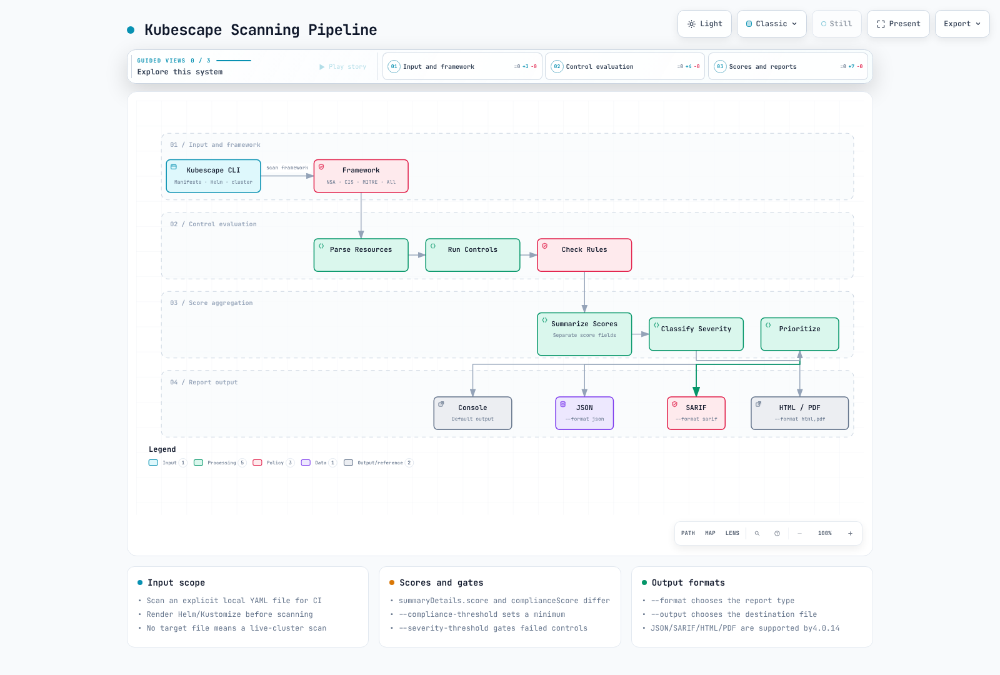
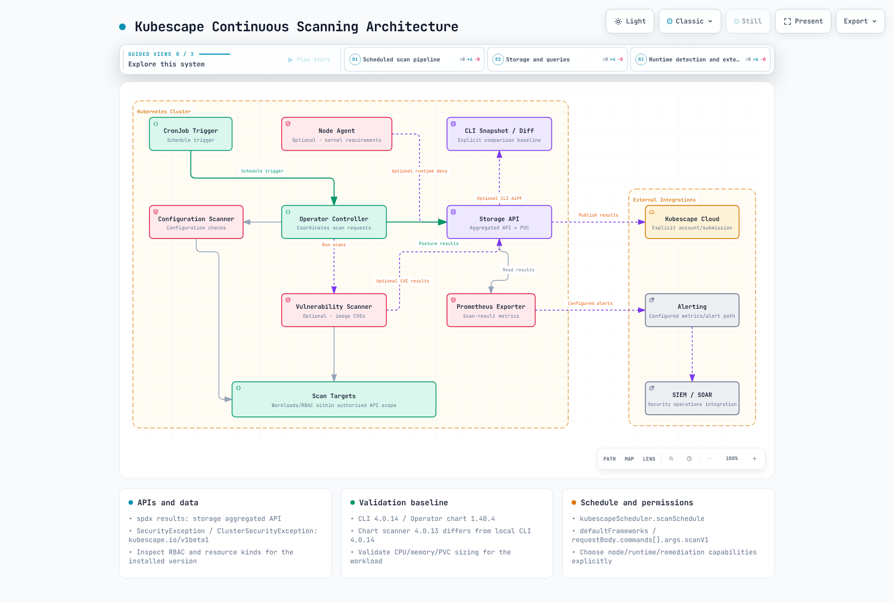
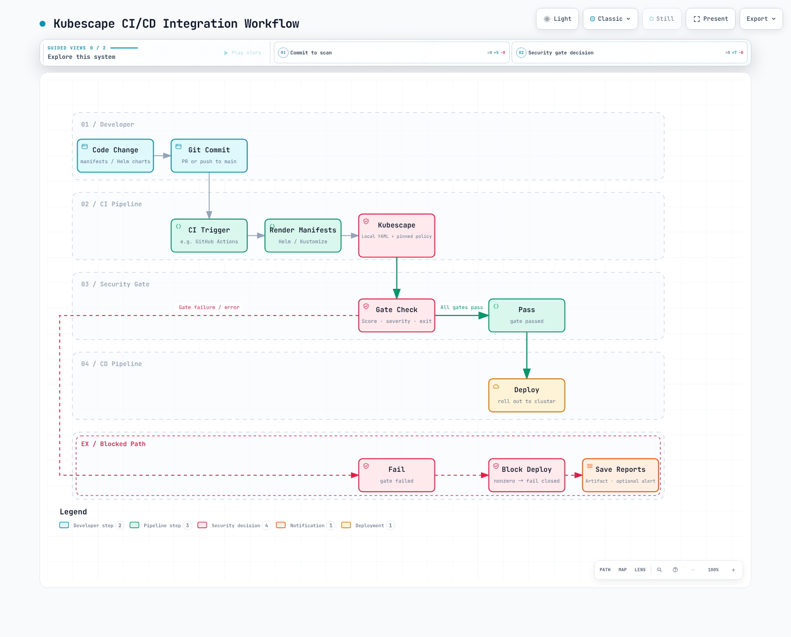

# 使用 Kubescape 进行安全态势管理

> **最后更新**: September 13, 2026
> **验证基线**: CLI 4.0.14 与 Operator chart 1.40.4。该 chart 的扫描器镜像为 4.0.13，与 CLI 相互独立。策略哈希记录在示例目录中。

Kubescape 评估 Kubernetes 配置以及部分镜像/运行时数据。**通过扫描并不等于安全保证或合规认证；无法覆盖的范围必须单独识别。** 本指南通过本地 YAML、策略包、实际 CLI 以及 chart 渲染进行了检查。未执行任何实时集群扫描、node-agent 安装、镜像仓库镜像/数据库扫描或 SaaS 提交。

<span id="what-kubescape-solves"></span>
<span id="cncf-sandbox-project"></span>
<span id="comparison-with-similar-tools"></span>
<span id="kubescape-architecture"></span>

## 概述

Kubescape 于 2022 年 12 月 13 日加入 CNCF，并于 **2025 年 1 月 13 日进入 Incubating 阶段**。此前的 Sandbox 描述以及过时的工具成熟度对比表格已不再是当前的指导内容。

CLI 执行显式的文件或集群扫描；Operator 则根据已启用的 capabilities 提供持续/定时行为。配置类控制项、RBAC 分析、镜像 CVE 和运行时检测的适用范围各不相同。请针对带版本的需求来比较 kube-bench 的节点/CIS 检查、Polaris 的工作负载策略以及 Trivy 的镜像/配置扫描，而不要做笼统的优劣断言。


[View interactive diagram](https://www.atomai.click/kubernetes-docs/archmaps/en-security-11-kubescape-0.html)


<span id="linux-and-macos"></span>
<span id="windows"></span>
<span id="container-image"></span>
<span id="helm-operator-installation-in-cluster"></span>
<span id="operator-configuration-values"></span>
<span id="kubescape-cloud-saas"></span>

## 安装

### CLI 安装

从[官方 4.0.14 发布页](https://github.com/kubescape/kubescape/releases/tag/v4.0.14)下载与操作系统/CPU 匹配的构件，并校验其 checksum。下面的 Linux AMD64 示例固定了已审阅归档包的哈希值；ARM64 需要不同的归档包/哈希值。

```bash
curl --fail --location \
  https://github.com/kubescape/kubescape/releases/download/v4.0.14/kubescape_4.0.14_linux_amd64.tar.gz \
  --output kubescape.tgz
printf '%s  %s\n' '1d253b70f88e80b74f68af73ccd422f897381468300be7cc486fdd656d907a40' kubescape.tgz | sha256sum --check
tar -xzf kubescape.tgz kubescape
./kubescape version
./kubescape scan --help
```

使用 Homebrew/Krew 或其他安装方式时，请检查实际的软件包版本。将安装程序的执行范围和 kubeconfig 暴露范围限制在预期范围内。`kubescape scan` 若省略文件目标，可能会扫描当前集群。

### Helm Operator 安装

下载[示例目录](https://github.com/Atom-oh/kubernetes-docs/tree/main/examples/security/kubescape)，并在 `examples/security/kubescape` 目录中运行以下命令。该配置侧重于态势检查与指标，显式禁用了节点/镜像/运行时/修复类 capabilities。

```bash
helm repo add kubescape https://kubescape.github.io/helm-charts
helm repo update kubescape
helm upgrade --install kubescape kubescape/kubescape-operator \
  --version 1.40.4 --namespace kubescape --create-namespace \
  --values operator-values.yaml
```

```yaml
clusterName: documentation-cluster
defaultFrameworks:
- nsa
- mitre
capabilities:
  continuousScan: enable
  configurationScan: enable
  nodeScan: disable
  nodeSbomGeneration: disable
  vulnerabilityScan: disable
  relevancy: disable
  runtimeObservability: disable
  networkPolicyService: disable
  networkEventsStreaming: disable
  runtimeDetection: disable
  nodeProfileService: disable
  admissionController: disable
  httpDetection: disable
  seccompProfileService: disable
  prometheusExporter: enable
  riskAcceptance: disable
  remediation: disable
  manageWorkloads: disable
global:
  enableClusterWideSecretAccess: false
persistence:
  storageClass: gp3
kubescapeScheduler:
  scanSchedule: 0 8 * * *
```


请准备好 gp3 StorageClass/CSI 驱动，并确认 namespace、RBAC、CRD 以及聚合 API 的可用性。EKS Auto Mode 与普通的 EBS CSI StorageClass 可能使用不同的 provisioner。Helm 渲染成功并不代表安装、持久化或扫描成功。

credentials.cloudSecret 是一个已存在的 Secret 名称，而不是账户 ID。需要使用 SaaS 时，请显式配置并授权 backend/account/accessKey/数据范围。CLI 的 --submit 会请求提交；本地示例使用 --keep-local 和隔离的缓存。在检查主机权限、内核/BTF 以及受支持的节点类型之后，再单独启用节点/运行时功能。

<span id="nsa-cisa-kubernetes-hardening-guide"></span>
<span id="cis-kubernetes-benchmark"></span>
<span id="mitre-att-ck-framework"></span>
<span id="framework-comparison"></span>

## 安全框架

### 框架与控制项

框架名称和控制项数量取决于策略包。已审阅的下载内容包含 NSA、MITRE、SOC2、ArmoBest、DevOpsBest、AllControls 以及带版本的 CIS 框架。NSA 包含 26 个控制项，并非全部适用于本地的单个 Pod。

```bash
kubescape list frameworks
kubescape list controls --framework NSA
kubescape list controls --framework NSA --search container
```

已审阅策略包中的示例名称包括 cis-v1.12.0 和 cis-eks-t1.8.0。不要假设 cis-v1.23 或 cis 是通用别名。策略更新会改变覆盖范围/评分；请将二进制版本与策略哈希一并记录。

| Control ID | Reviewed bundle name |
|---|---|
| C-0004 | Resources memory limit and request |
| C-0009 | Resource limits |
| C-0013 | Non-root containers |
| C-0016 | Allow privilege escalation |
| C-0034 | Automatic mapping of service account |
| C-0035 | Administrative Roles |
| C-0036 | Validate admission controller (validating) |
| C-0039 | Validate admission controller (mutating) |
| C-0057 | Privileged container |

C-0036/0039 并不是通配符 RBAC/高风险 ServiceAccount 控制项。严重级别同样取决于策略包：已审阅的 C-0057 为 High，而非普遍意义上的 Critical。

### 自定义框架

--use-from 会加载本地策略对象。仅有一个 YAML 名称和一串未解析的控制项 ID，并不一定构成可执行的框架。示例中的 policies/nsa.json 是经过测试的策略包，并附有许可证、来源和 SHA 记录。请使用当前 CLI 提供的 kubescape policy init 和 kubescape policy test 等功能来编写和测试新的 Rego 控制项，然后再审阅组织的相关需求。

<span id="scanning-pipeline-flow"></span>
<span id="cluster-scanning"></span>
<span id="specific-control-scanning"></span>
<span id="yaml-and-helm-manifest-scanning-shift-left"></span>
<span id="image-vulnerability-scanning"></span>
<span id="rbac-visualization-and-analysis"></span>

## CLI 扫描



[View interactive diagram](https://www.atomai.click/kubernetes-docs/archmaps/en-security-11-kubescape-1.html)


### 集群输入与本地输入

```bash
# This accesses the current cluster; check authorization and scope first.
kubescape scan framework nsa --include-namespaces production
# Explicit local-file scan:
kubescape scan framework nsa secure-pod.yaml \
  --use-from policies/nsa.json --controls-config policies/controls-inputs.json \
  --exceptions no-exceptions.json --keep-local \
  --format json --output report.json
```

--format/-f 用于选择格式；--output/-o 用于指定文件名。`-o json > report.json` 并不会选择 JSON 输出。4.0.14 版本支持 JSON/SARIF/HTML/PDF/JUnit/gitlab-sast 等格式；请选择接收工具所期望的格式。

在扫描前先在本地渲染 Helm/Kustomize，以便明确实际生效的值。本地检查无法复现 API 默认值填充、admission、IAM 授权或网络行为。--include-api-audit、--custom-framework 和 --sort-by 在已审阅的 CLI 中属于未知选项。不要将 scan rbac 描述为当前独立存在的子命令。

### 实际本地结果

insecure-pod.yaml 是一个**用于扫描的合成测试样例，而不是部署范例**。它使用真实的 privileged/runAsUser 字段，而不是不存在的 runAsRoot。secure-pod.yaml 同样只用于演示配置；在任何实际部署前请替换其应用镜像。

| Local input | Compliance | score | Result |
|---|---:|---:|---|
| Insecure Pod | 55 | 62.5 | High failures |
| Secure Pod | 95 | 6.818182 | High gate passes; not every control passes |

这些数值仅适用于所附的策略快照和一个本地 Pod。它们并不衡量集群安全性或可利用性。

### 镜像与 RBAC 分析

请使用 kubescape scan image IMAGE 显式发起镜像扫描。CLI 4.0.14 在其源码依赖中使用 Grype 0.104.1 和 Syft 1.42.3；Operator 的 kubevuln 组件有独立的版本。请确认镜像仓库凭据、平台、数据库新鲜度以及扫描错误。主机扫描与镜像扫描不同，可能需要额外的主机访问权限/资源创建。

RBAC 控制项在授权的 API 范围内评估所收集的 Role/Binding。RoleBinding 仅在其所属 namespace 内授予访问权限，而非所有 namespace。静态分析本身并不能确定未使用的权限、外部 IAM 授权或所有实际生效的访问路径。

<span id="continuous-scanning-architecture"></span>
<span id="operator-components"></span>
<span id="scheduled-scanning-configuration"></span>
<span id="vulnerability-scanning-integration"></span>
<span id="runtime-threat-detection-node-agent-with-ebpf"></span>
<span id="kubernetes-api-attack-detection"></span>

## Operator 模式（集群内）



[View interactive diagram](https://www.atomai.click/kubernetes-docs/archmaps/en-security-11-kubescape-2.html)


请使用该 chart 的 kubescapeScheduler.scanSchedule 和 requestBody.commands[].args.scanV1 字段。defaultFrameworks 为未指定目标的请求提供默认值；显式指定的 targetNames 优先。一个带有 scanSchedule 的任意 ConfigMap 并不能证明有控制器会消费它。

spdx.softwarecomposition.kubescape.io/v1beta1 的结果由 storage 组件的**聚合 API** 提供，而不是全部由普通 CRD 提供。独立的 CRD 包括 SecurityException、ClusterSecurityException 和 OperatorCommand。查询结果前请先发现实际的名称/作用范围。

```bash
kubectl get apiservices v1beta1.spdx.softwarecomposition.kubescape.io
kubectl api-resources --api-group=spdx.softwarecomposition.kubescape.io
kubectl get pods,pvc -n kubescape
```

不要将旧的 ScanSchedule、VulnerabilityScanConfig、ThreatDetectionConfig、AcceptedRisk 和 ScanConfiguration 示例当作该 chart 所安装的 API。node-agent 的配置文件/检测必须针对所选镜像使用实际的 API/capabilities。启用某项配置并不能证明所有节点上的采集或检测都健康。

<span id="risk-score-calculation"></span>
<span id="severity-levels"></span>
<span id="viewing-risk-scores"></span>
<span id="prioritization-strategy"></span>

## 风险评分

summaryDetails.complianceScore 和 summaryDetails.score 是两种不同的聚合值。compliance 越高表示通过的检查越多；风险评分既不是同一个数值，也不是简单的 100 减去 compliance。不要把凭空编造的严重级别权重或响应 SLA 当作 Kubescape 的通用公式。

```bash
jq '{compliance: .summaryDetails.complianceScore, risk: .summaryDetails.score,
     failed: [.summaryDetails.controls[] | select(.status == "failed") | {controlID, name, severity}]}' report.json
```

将 --compliance-threshold 用作**最低合规评分**，将 --severity-threshold 用于失败控制项的严重级别。本地评分 55 在阈值为 55 时返回退出码 0，在阈值为 56 时返回退出码 1。--min-severity 只过滤输出；它不能替代当前的门禁计算。

**4.0.14 版本仍接受 --fail-threshold 作为已弃用的兼容性标志，但会忽略其值。** 测试中仅提供 --fail-threshold 0 时，即便存在失败发现项也返回了退出码 0。请把这个无效标志与 --scan-images/--skip-controls 等仍会被处理的选项，以及确实未知的标志区分开。

<span id="ci-cd-integration-workflow"></span>
<span id="github-actions-workflow"></span>
<span id="gitlab-ci-cd-integration"></span>
<span id="jenkins-pipeline-integration"></span>
<span id="threshold-based-gates"></span>

<span id="cicd-integration"></span>

## CI/CD 集成



[View interactive diagram](https://www.atomai.click/kubernetes-docs/archmaps/en-security-11-kubescape-3.html)


### 共享安全门禁

```bash
#!/usr/bin/env bash
# Scan explicit local manifests with an isolated Kubernetes/client configuration.
set -euo pipefail
if [[ $# -ne 2 ]]; then
  printf 'Usage: %s LOCAL_MANIFEST OUTPUT_JSON\n' "$0" >&2
  exit 2
fi
manifest_path=$1
report_path=$2
if [[ ! -f $manifest_path ]]; then
  printf 'Expected an existing local manifest file: %s\n' "$manifest_path" >&2
  exit 2
fi
# An absolute operand cannot be parsed as a flag such as --help.
manifest_path="$(cd -- "$(dirname -- "$manifest_path")" && pwd)/$(basename -- "$manifest_path")"
script_dir=$(cd -- "$(dirname -- "${BASH_SOURCE[0]}")" && pwd)
: "${KUBESCAPE_BIN:=kubescape}"
: "${COMPLIANCE_MINIMUM:=90}"
: "${SEVERITY_LIMIT:=high}"
umask 077
scan_temp_dir=$(mktemp -d "${TMPDIR:-/tmp}/kubescape-local.XXXXXX")
trap 'rm -rf -- "$scan_temp_dir"' EXIT
mkdir -- "$scan_temp_dir/cache"
cat > "$scan_temp_dir/kubeconfig" <<'YAML'
apiVersion: v1
kind: Config
clusters: []
contexts: []
users: []
current-context: ''
YAML
# Block inherited in-cluster discovery as well as kubeconfig and cached backend state.
env -u KUBERNETES_SERVICE_HOST -u KUBERNETES_SERVICE_PORT -u KUBERNETES_PORT -u KUBERNETES_MASTER \
  KUBECONFIG="$scan_temp_dir/kubeconfig" KS_CACHE_DIR="$scan_temp_dir/cache" \
  "$KUBESCAPE_BIN" --cache-dir "$scan_temp_dir/cache" scan framework nsa "$manifest_path" \
  --kubeconfig "$scan_temp_dir/kubeconfig" --host-scan=false \
  --use-from "$script_dir/policies/nsa.json" \
  --controls-config "$script_dir/policies/controls-inputs.json" \
  --exceptions "$script_dir/no-exceptions.json" \
  --honor-inline-exceptions=false \
  --keep-local \
  --compliance-threshold "$COMPLIANCE_MINIMUM" \
  --severity-threshold "$SEVERITY_LIMIT" \
  --format json --output "$report_path"
```


该 CI 门禁会忽略 skip-control 注解，使用空的 kubeconfig 和全新的缓存，并清除继承而来的集群内服务发现信息。仅使用 --keep-local 并不能阻止访问 Kubernetes API。在使用一个恶意的回环 API context 进行的五项原生测试中，产生了零次请求以及预期的失败/成功退出码。

输入缺失、扫描错误和阈值未达标都会返回非零退出码。不要用 continue-on-error 或 `|| true` 将其隐藏。报告上传可以在失败之后执行，但它不决定成功与否。排除某个控制项会改变评估的分母，因此必须记录下来。

### GitHub Actions

[已验证的工作流](https://github.com/Atom-oh/kubernetes-docs/blob/main/examples/security/kubescape/github-actions.yaml)固定了二进制文件/checksum，并且仅使用本地策略快照扫描 k8s/rendered.yaml。项目必须先生成该文件；文件缺失会导致作业失败。权限为 contents:read，不包含 PR 评论或 SaaS 提交。

### GitLab 与 Jenkins

这两种系统都可以保留相同的 scan-manifests.sh 退出码并归档报告。通用的 Kubescape JSON 并不是 GitLab SAST 或 Code Quality 的 schema。若要进行集成的 SAST 报告，请针对接收方的版本验证当前 --format gitlab-sast 的输出。Jenkins 的 readJSON/publishHTML 需要相应插件；不要发布流水线从未生成过的 HTML 文件。

<span id="eks-specific-controls"></span>
<span id="aws-auth-configmap-analysis"></span>
<span id="irsa-iam-roles-for-service-accounts-validation"></span>
<span id="eks-security-best-practices-scan"></span>

## EKS 专项指南

Kubernetes manifest 扫描无法完整验证 EKS 控制平面配置、IAM、access entries、Pod Identity/IRSA 或节点策略。aws-auth 是一种遗留认证路径；请检查当前的认证模式和 access entries。system:masters 或紧急 IAM 用户并不是最小权限的示例。

C-0034 检查的是 service account token 的自动挂载，而不是完整的 IRSA 信任关系/aud/sub/IAM 策略。请区分投射的 STS token 与 Kubernetes API token 的自动挂载。请单独验证实际的工作负载身份和允许的 AWS 操作。

在启用主机扫描和自动修复之前，请先审阅其所需权限/变更行为。示例中禁用了集群范围的 Secret 访问和自动修复，但运维人员仍需检查其安装所需的 scanner/operator/storage RBAC。

<span id="exception-policies"></span>
<span id="applying-exceptions-via-cli"></span>
<span id="accepted-risks-documentation"></span>
<span id="inline-resource-exceptions"></span>

## 控制项例外处理

### CLI 例外

```json
[
  {
    "name": "documentation-privileged-exception",
    "policyType": "postureExceptionPolicy",
    "actions": [
      "alertOnly"
    ],
    "resources": [
      {
        "designatorType": "Attributes",
        "attributes": {
          "namespace": "demo-app",
          "kind": "Pod",
          "name": "insecure-example"
        }
      }
    ],
    "posturePolicies": [
      {
        "controlID": "C-0057"
      }
    ]
  }
]
```


这是一个供 CLI 使用的 **JSON 数组**，而不是 ConfigMap 包装结构。经过测试的 alertOnly 例外将 C-0057 标记为已确认，同时仍保留失败状态和 compliance 55。--exclude-controls C-0057 会将该控制项从评估中移除，从而改变分母和评分。例外并不等于修复。

### 集群内例外

```yaml
apiVersion: kubescape.io/v1beta1
kind: SecurityException
metadata:
  name: documentation-privileged-exception
  namespace: demo-app
spec:
  author: documentation-security-team
  reason: Synthetic scan example; replace with an approved owner and justification.
  expiresAt: '2026-09-30T00:00:00Z'
  match:
    resources:
      - apiGroup: ''
        kind: Pod
        name: insecure-example
  posture:
    - controlID: C-0057
      action: alert_only
```


当前的 API 是 kubescape.io/v1beta1 的 SecurityException/ClusterSecurityException。请按照已批准的策略设置 namespace 作用范围、match、posture action、过期时间和归属责任人。schema 校验通过并不能证明控制器已强制执行、RBAC 已就绪或 CEL 行为正确。CLI 的 alertOnly 与 CRD 的 alert_only 不同。不要依赖凭空编造的 ignore 注解来进行例外处理。

<span id="periodic-scanning-schedule"></span>
<span id="scanning-configuration"></span>
<span id="compliance-reporting"></span>
<span id="remediation-workflow"></span>
<span id="integration-with-other-security-tools"></span>
<span id="prometheus-metrics-integration"></span>

## 最佳实践


[View interactive diagram](https://www.atomai.click/kubernetes-docs/archmaps/en-security-11-kubescape-4.html)


请记录扫描范围、通过/失败/无法覆盖的检查项、策略哈希、工具镜像、例外责任人以及过期日期。只在输入/策略等价的情况下比较评分。节点扫描、镜像扫描和运行时检测是彼此独立的证据来源。

### Prometheus 集成

```yaml
apiVersion: monitoring.coreos.com/v1
kind: PodMonitor
metadata:
  name: kubescape-posture
  namespace: monitoring
spec:
  namespaceSelector:
    matchNames: [kubescape]
  selector:
    matchLabels:
      app.kubernetes.io/name: kubescape-operator
      app.kubernetes.io/instance: kubescape
      app.kubernetes.io/component: prometheus-exporter
  podMetricsEndpoints:
    - port: metrics
      path: /metrics
      interval: 60s
```


已审阅的 exporter Pod 将容器端口 8080 命名为 metrics，而其 Service 端口未命名。因此本示例使用 PodMonitor 来匹配实际的 Pod 标签和已命名的端口。Prometheus Operator 与 Prometheus 的 PodMonitor 选择器是两项独立的前置条件。

exporter 0.2.23 的实际 gauge 示例为 kubescape_controls_total_cluster_high 和 kubescape_controls_total_workload_high。带有 _total 后缀并不意味着它们是 counter。旧的 kubescape_compliance_score/critical_findings/last_scan_timestamp 名称并不是既有的常用指标。请单独监控抓取缺失和数据陈旧的情况。

<span id="table-of-contents"></span>
<span id="key-takeaways"></span>
<span id="quick-reference-commands"></span>
<span id="references"></span>
<span id="related-documentation"></span>

## 总结与参考资料

本地验证覆盖了二进制文件/checksum、策略快照、阈值边界/严重级别/已弃用门禁标志、例外与排除行为、已发布的 shell 门禁脚本、Helm 渲染、SecurityException schema、PodMonitor 目标匹配、GitHub Actions 语法以及三十个图示浏览器用例。未执行任何真实的 AWS/Kubernetes/镜像仓库/通知/SaaS 操作。

- [CNCF Kubescape history](https://www.cncf.io/projects/kubescape/)
- [Kubescape documentation](https://kubescape.io/docs/)
- [Frameworks and controls](https://kubescape.io/docs/frameworks-and-controls/)
- [Operator documentation](https://kubescape.io/docs/operator/)
- [CLI 4.0.14](https://github.com/kubescape/kubescape/releases/tag/v4.0.14)
- [Pinned CLI flags](https://github.com/kubescape/kubescape/blob/v4.0.14/cmd/scan/scan.go)
- [Operator chart 1.40.4](https://github.com/kubescape/helm-charts/releases/tag/kubescape-operator-1.40.4)
- [Policy library](https://github.com/kubescape/regolibrary)
- [Exporter metrics 0.2.23](https://github.com/kubescape/prometheus-exporter/blob/v0.2.23/metrics/metrics.go)
- [Runtime security](./08-runtime-security.md)
- [EKS security practices](./06-eks-security-best-practices.md)
