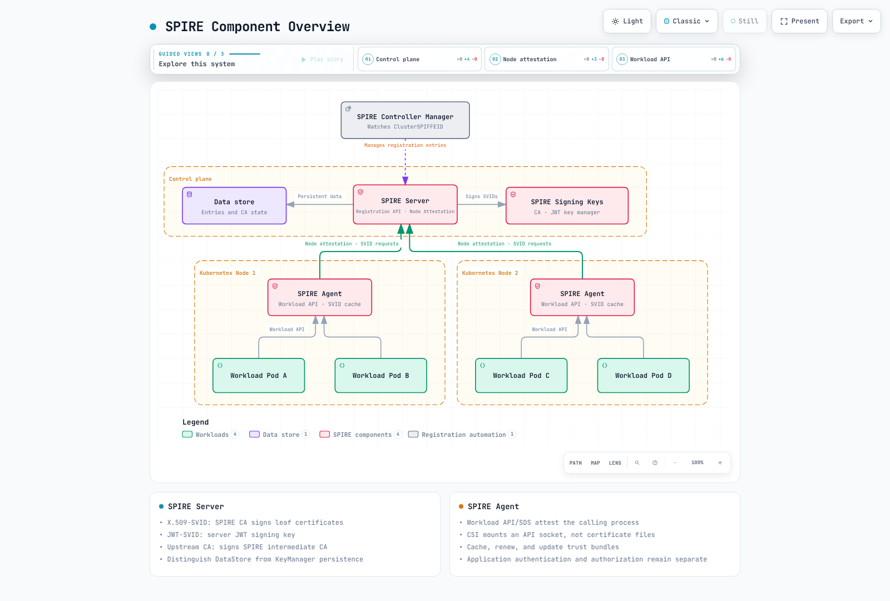
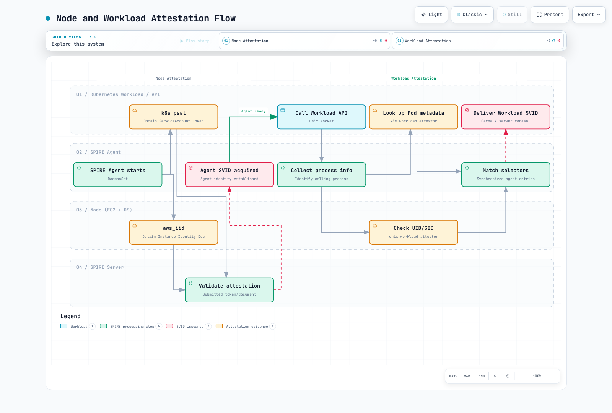
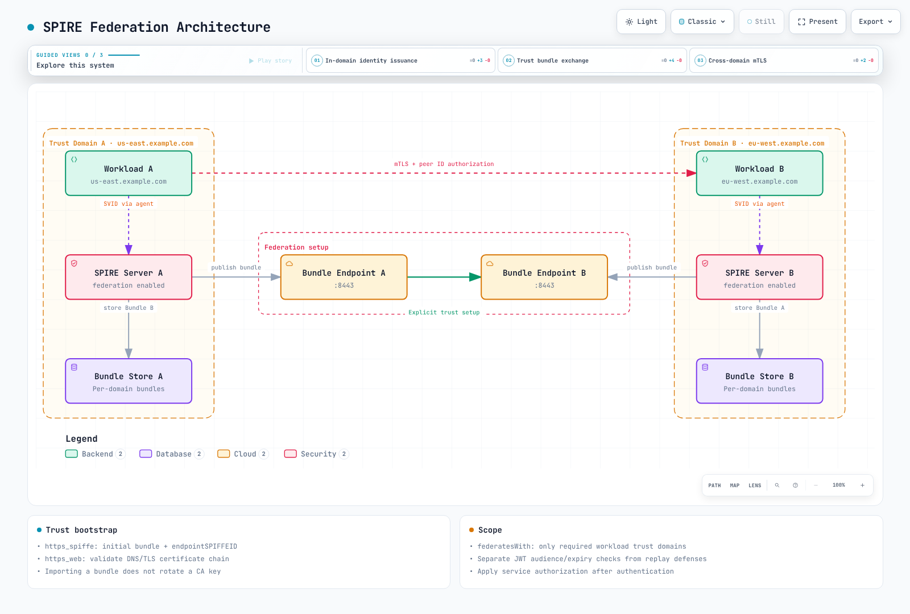

# 使用 SPIFFE/SPIRE 实现工作负载身份

> **最后更新**: September 13, 2026
> **验证基线**: SPIRE 1.15.3、hardened chart 0.30.2 / CRD chart 0.6.1、Controller Manager 0.7.0、chart CSI 镜像 0.2.7（同时对照当前 CSI 0.2.13 文档进行了检查）、go-spiffe 2.8.1。请单独检查 chart 渲染出的镜像版本。

SPIFFE 定义工作负载身份、凭证、分发以及信任格式；SPIRE 则实现这些定义。**签发身份并不会自动加密流量或授权服务访问。** 本指南验证的是本地配置、schema、库、chart 和示意图。未执行任何真实集群、AWS CA、SPIRE 证明（attestation）或服务网格安装操作。

## 概述

SPIFFE 和 SPIRE 是 CNCF 毕业（Graduated）项目。它们的 CNCF 项目页面分别记录为 2022 年 8 月 23 日和 2022 年 8 月 22 日。项目成熟度与单个部署的验证是两件不同的事情。

在 IP/Pod 不断变化的情况下，稳定的身份很有价值，但应用程序仍然需要 Workload API 客户端、SDK、代理或显式的文件适配器。“所有工作负载都零应用改动”并不是一个普适的保证。本章聚焦于 SPIRE 的 X.509/JWT 路径；单独发布的 **孵化中（Incubating）WIT-SVID 规范** 不应被假定在每个部署中都受支持。

<span id="svid-spiffe-verifiable-identity-document"></span>
<span id="x-509-svid-vs-jwt-svid-comparison"></span>
<span id="trust-bundle"></span>
<span id="trust-domain"></span>

## 核心概念

### SPIFFE ID

```text
spiffe://example.org/ns/payments/sa/payment-processor
```

一个 ID 包含 scheme、信任域（trust domain）以及可选的 path。不允许出现 query、fragment、端口、点号段（dot-segment）以及百分号编码的 path 组成部分。类 DNS 形式的稳定信任域名称很有用，但并不需要能够通过 DNS 解析。形如 IPv4 或纯数字的名称并非一律无效；请区分语法要求与命名建议。

### SVID 与验证

| 关注点 | X.509-SVID | JWT-SVID |
|---|---|---|
| 身份 | 叶证书中的 SPIFFE URI SAN | sub |
| 验证 | 证书链、有效期、SVID 规则、信任域 | 签名、subject、audience、过期时间 |
| 用途 | TLS 客户端/服务端认证 | 接受 bearer token 的 API |
| 密钥 | 工作负载/agent 私钥路径 | 签发方保留签名私钥 |
| 有效期 | 策略与实际签发结果 | 策略与实际 token 的 exp |

CN 不是 SPIFFE 身份。本地 go-spiffe 测试拒绝了仅有 CN、包含多个 SPIFFE URI、已过期以及信任域错误的情况。Audience 验证限制了接收方，但不等于重放检测：同一个有效的 bearer token 再次通过了验证。请在需要时应用适当的 TLS/token 使用策略以及重放防护。

信任包（trust bundle）包含 X.509 权威机构、JWT 验证密钥和元数据。PEM、SPIFFE bundle JSON 以及任意 YAML 之间不可互换。公开的 bundle 绝不能包含工作负载或 CA 私钥。

<span id="spire-server"></span>
<span id="spire-agent"></span>
<span id="svid-issuance-flow"></span>

## SPIRE 架构



[View interactive diagram](https://www.atomai.click/kubernetes-docs/archmaps/en-security-12-spiffe-spire-0.html)


Server 负责 agent 证明、注册以及 X.509/JWT 签名。DataStore 与 KeyManager 承担不同的持久化职责。诸如 AWS Private CA 之类的 UpstreamAuthority 为 SPIRE 中间 CA 签名；它并不替代每一次工作负载叶证书的签名操作。

Agent 对调用其 API 的进程进行证明，并使用同步得到的条目/SVID 缓存。缓存有效时，并不需要在每次 API 请求时都由 server 重新签发。消费方必须通过流、SDK 或代理来采用更新后的凭证。


[View interactive diagram](https://www.atomai.click/kubernetes-docs/archmaps/en-security-12-spiffe-spire-1.html)


<span id="prerequisites"></span>
<span id="helm-installation-recommended"></span>
<span id="namespace-layout"></span>
<span id="high-availability-configuration"></span>
<span id="verify-installation"></span>

## 安装

下载[示例目录](https://github.com/Atom-oh/kubernetes-docs/tree/main/examples/security/spiffe)并在 `examples/security/spiffe` 下操作。请核实 hostPath/CSI/内核/kubelet 相关要求。在诸如 Fargate 这类无法获得所需访问权限的主机上，不能假定相同的 DaemonSet 能够运行。

```bash
helm repo add spiffe https://spiffe.github.io/helm-charts-hardened
helm repo update spiffe
helm upgrade --install spire-crds spiffe/spire-crds \
  --version 0.6.1 --namespace spire-system --create-namespace
helm upgrade --install spire spiffe/spire \
  --version 0.30.2 --namespace spire-system --values lab-values.yaml
```

### 单 Server 实验环境

```yaml
global:
  spire:
    trustDomain: example.org
    clusterName: documentation
    caSubject:
      organization: Documentation Lab
      country: KR
    namespaces:
      server:
        name: spire-system
      system:
        name: spire-system
  installAndUpgradeHooks:
    enabled: false
  deleteHooks:
    enabled: false
spire-server:
  replicaCount: 1
  controllerManager:
    enabled: true
    identities:
      clusterSPIFFEIDs:
        default:
          enabled: false
        oidc-discovery-provider:
          enabled: false
        test-keys:
          enabled: false
  externalControllerManagers:
    enabled: false
  persistence:
    enabled: true
    size: 1Gi
spire-agent:
  workloadAttestors:
    k8s:
      verification:
        type: apiServerCA
    unix:
      enabled: true
spiffe-oidc-discovery-provider:
  enabled: false
spiffe-csi-driver:
  enabled: true
```


这是一个使用 SQLite 的单 server 实验环境。范围过宽的默认身份、测试身份以及未使用的 OIDC 身份均被禁用；由单独的 ClusterSPIFFEID 来选择工作负载。chart 默认跳过 kubelet 验证，因此这里显式设置了 apiServerCA。这假定实际的 kubelet 服务端证书能够在该 CA 下通过验证；对于其他 PKI，请使用相应的 CA/主机证书方式，而不要禁用验证。

在此配置档中安装/删除 hook 被禁用；请单独执行所需的迁移/清理工作。渲染结果包含带 Controller Manager sidecar 的 Server StatefulSet，以及 Agent 和 CSI DaemonSet。请确认与具体 release 相关的资源名称、标签和 socket 路径。

### 高可用

[ha-values.yaml](https://github.com/Atom-oh/kubernetes-docs/blob/main/examples/security/spiffe/ha-values.yaml) 使用三个副本、共享的 PostgreSQL、已有的密码 Secret、挂载 CA 的 verify-full TLS，以及与实际 Pod 标签匹配的反亲和性（anti-affinity）。三个相互独立的 SQLite 副本并不构成共享的 HA 数据存储。

请先准备好 PostgreSQL/DNS、CA ConfigMap、`spire-database` Secret 中的 `password` 键、StorageClass 以及网络连通性。该示例通过 `extraEnv.valueFrom.secretKeyRef` 以 `PGPASSWORD` 提供原始密码。它禁用了 chart 的 `dataStore.sql.externalSecret` 插值并将 `password` 留空，因此生成的连接字符串中不包含密码。SPIRE 的 PostgreSQL 驱动会单独读取 `PGPASSWORD`：引号、反斜杠、空白字符和美元符号不会进入 JSON/DSN 解析器。请不要对实际密码做预先转义或 URI 编码。

针对原生 SPIRE 1.15.3 配置以及 lib/pq 1.12.3 解析的检查覆盖了六种合成密码用例，同时保留了 `sslmode=verify-full` 和 CA 路径。这些检查并未连接 PostgreSQL，也未测试故障转移。以环境变量形式下发的 Secret 变更需要重启 server Pod；请将数据库密码轮换与重启协同安排，并验证可用性。HA 还需要密钥持久化、备份、bundle 轮转以及恢复测试。

<span id="attestation-flow"></span>
<span id="kubernetes-psat-projected-service-account-token"></span>
<span id="aws-instance-identity-document-iid"></span>
<span id="join-token-bootstrap"></span>
<span id="node-attestor-comparison"></span>

## 节点证明



[View interactive diagram](https://www.atomai.click/kubernetes-docs/archmaps/en-security-12-spiffe-spire-2.html)


k8s_psat 通过 **Kubernetes TokenReview** 验证 agent 的投射式（projected）ServiceAccount token，随后检查 namespace/SA/Pod/节点数据。这不是 IRSA 所使用的 IAM OIDC provider 流程。请对齐逻辑集群名称、token audience、SA 允许列表以及 TokenReview 权限。

默认的 agent ID 形如 `spiffe://TRUST_DOMAIN/spire/agent/k8s_psat/CLUSTER/NODE_UID`；当前版本还提供 Pod UID 模式。请查询已注册的 agent/别名 ID，而不要自行臆造 parentID。token generate、entry create 和 bundle set 会改变真实状态。

aws_iid 是使用 EC2 实例身份的另一种方案。它并非一律强于 PSAT，也不限于非 EKS 环境。请审查 skip_block_device、本地验证假设、允许的账户以及附加选择器。不要将静态 AWS 凭证放入 ConfigMap。

<span id="kubernetes-workload-attestor"></span>
<span id="registration-entry-examples"></span>
<span id="unix-workload-attestor"></span>

## 工作负载证明

Agent 使用调用方的 PID/cgroup 以及 kubelet 信息。不要默认使用不安全的 kubelet 端口 10255，也不要设置 skip_kubelet_verification=true。安全认证、正确的服务端 CA 以及网络访问是前提条件。

常见选择器包括 k8s:ns、k8s:sa、k8s:pod-label、k8s:pod-uid 以及 k8s:container-name/image。container-image 反映的是 Kubernetes 报告的 tag/digest；nginx:* 并不是 glob 选择器。tag 字符串不等于供应链验证。必要时请单独使用适当的 digest/签名证明机制。

能够修改 namespace/Pod 标签或以某个 ServiceAccount 创建 Pod 的主体，可以影响身份的适用性。请将 namespace/SA/Pod 的创建控制与身份策略的归属一并管理。Unix 的 UID/GID/路径/哈希选择器同样取决于插件配置和威胁模型。

<span id="spiffe-csi-driver"></span>
<span id="spire-controller-manager"></span>
<span id="envoy-sds-integration"></span>

## Kubernetes 集成

### CSI 挂载 API socket

chart 中的 SPIFFE CSI 0.2.7 以及当前的 0.2.13 实现挂载的是 **包含 Workload API Unix socket 的目录**。它不会自动创建 svid.pem、svid.key 或 bundle.pem 文件。基于文件的应用程序需要单独的适配器，并处理续期/重载逻辑。

```yaml
apiVersion: v1
kind: Namespace
metadata:
  name: payments
  labels:
    spiffe-enabled: 'true'
---
apiVersion: v1
kind: ServiceAccount
metadata:
  name: payment-processor
  namespace: payments
---
apiVersion: spire.spiffe.io/v1alpha1
kind: ClusterSPIFFEID
metadata:
  name: payments-workload
spec:
  spiffeIDTemplate: spiffe://{{ .TrustDomain }}/ns/{{ .PodMeta.Namespace }}/sa/{{
    .PodSpec.ServiceAccountName }}
  namespaceSelector:
    matchLabels:
      spiffe-enabled: 'true'
  podSelector:
    matchLabels:
      spiffe-managed: 'true'
  workloadSelectorTemplates:
  - k8s:ns:{{ .PodMeta.Namespace }}
  - k8s:sa:{{ .PodSpec.ServiceAccountName }}
  - k8s:container-name:app
  ttl: 1h
  jwtTtl: 5m
---
apiVersion: v1
kind: Pod
metadata:
  name: payment-processor
  namespace: payments
  labels:
    spiffe-managed: 'true'
spec:
  serviceAccountName: payment-processor
  containers:
  - name: app
    image: registry.example.com/team/payment-app:REPLACE_WITH_APPROVED_VERSION
    env:
    - name: SPIFFE_ENDPOINT_SOCKET
      value: unix:///spiffe-workload-api/spire-agent.sock
    volumeMounts:
    - name: spiffe-workload-api
      mountPath: /spiffe-workload-api
      readOnly: true
  volumes:
  - name: spiffe-workload-api
    csi:
      driver: csi.spiffe.io
      readOnly: true
```


请将应用镜像替换为真正的 Workload API 消费方。注意区分 chart 身份中的 jwtTTL 与 CRD 中的 jwtTtl。示例中的显式选择器指向 app 容器；单独的 Envoy 容器需要相应匹配的代理注册策略。

### Envoy SDS

[完整的 bootstrap 示例](https://github.com/Atom-oh/kubernetes-docs/blob/main/examples/security/spiffe/envoy.yaml)包含 HTTP filter、SDS 集群、require_client_certificate:true 以及精确匹配的允许对端 URI matcher。Envoy 进程必须可被证明，并且命名的 server/client 身份都必须已注册。

SDS 与 Workload API 共用公开的 agent socket。证书资源名称使用工作负载 SPIFFE ID 或 default；验证上下文使用信任域 ID 或 ROOTCA/ALL。请确认 SPIFFE 证书验证器的支持情况，尤其是对 ALL 的支持。协议 schema 和 URI matcher 实现已经过验证；未运行任何真实的 Envoy/SDS/mTLS 握手。

<span id="istio-spire-integration"></span>
<span id="cilium-spire-mutual-authentication"></span>
<span id="linkerd-identity-trust-anchors"></span>

## 服务网格集成

### Istio

不要将 Istio 的 CA 地址指向 SPIRE Server 的 8081 端口，也不要使用臆造的 ENABLE_SPIFFE_IDENTITY/PILOT_ENABLE_SPIRE_INTEGRATION 变量。当前的[官方集成方案](https://istio.io/latest/docs/ops/integrations/spire/)配置的是 CSI socket 挂载、SPIRE 注册以及 sidecar/gateway 模板。

在使用原生 sidecar 时，istio-proxy 是一个 initContainer，必须在那里进行 patch。显式禁用原生 sidecar 模式时则使用 containers。请验证已安装的版本、模板、socket 以及就绪状态；不要用片段式的配置替换完整的 injector ConfigMap。

### Cilium

Cilium 1.20.1 的双向认证功能处于 **beta 阶段，且与普通连接是带外（out-of-band）关系**。流量加密需要单独配置 WireGuard/IPsec。仅包含 SPIFFE ID 的任意标签并不构成经过认证的身份策略。

官方安装方式使用 authentication.mutual.spire.enabled，若使用其自带的安装方式则还需 authentication.mutual.spire.install.enabled。请将自带 SPIRE 与外部 SPIRE 的配置区分清楚，并参考[固定版本的安装源文档](https://github.com/cilium/cilium/blob/v1.20.1/Documentation/network/servicemesh/mutual-authentication/installation.rst)。端点选择器/认证模式、身份签发与加密各自承担不同的职责。

### Linkerd

不要在 Linkerd 期望 PEM 格式根证书的位置传入 SPIRE bundle JSON，也不要把 SPIRE CA 私钥复制为 issuer 密钥。Linkerd 需要合适的 issuer 证书/密钥和受信任的根证书，并具备续期和根证书轮转能力。参见[已审阅的 cert-manager/Linkerd 方案](./10-cert-manager.md#linkerd-and-trust-manager)。仅共享根信任并不等于集成了 SPIFFE Workload API 或 SDS。

<span id="federation-trust-establishment"></span>
<span id="configuring-federation"></span>
<span id="federated-registration-entries"></span>
<span id="multi-cloud-federation-example"></span>

## 联邦



[View interactive diagram](https://www.atomai.click/kubernetes-docs/archmaps/en-security-12-spiffe-spire-3.html)


请显式配置每个信任方向；联邦不会自动建立双向信任或授权。需要运维 bundle 端点连通性、TLS 验证、刷新失败、过期以及轮转。

```yaml
apiVersion: spire.spiffe.io/v1alpha1
kind: ClusterFederatedTrustDomain
metadata:
  name: partner-domain
spec:
  trustDomain: partner.example.org
  bundleEndpointURL: https://bundle.partner.example.org
  bundleEndpointProfile:
    type: https_web
```


这个 https_web 示例假定存在一个具备有效 Web PKI 证书的真实端点。https_spiffe 还额外需要 endpointSPIFFEID 以及 **通过经过认证的引导路径获取的初始受信任 bundle**；仅设置 URL 是不够的。在适用的工作负载 federatesWith 列表中，请使用形如 partner.example.org 的裸信任域名称。获取信任 bundle 与授权对端工作负载是两件不同的事。

<span id="irsa-vs-spiffe-comparison"></span>
<span id="pod-identity-vs-spire"></span>
<span id="hybrid-use-cases"></span>
<span id="eks-specific-node-attestation"></span>

## EKS 集成

IRSA/Pod Identity 提供 AWS API 凭证路径；SPIFFE/SPIRE 提供工作负载身份路径。两者互不替代，也不是每个环境都需要同时使用。IRSA 支持跨账户设计，并通过兼容的 SDK/投射式 token 行为刷新凭证；重启 Pod 本身并非必需。不要假定存在固定的十二小时有效期。

请在 ServiceAccount 上配置 IRSA，并验证 aud/sub 信任关系和 AWS 权限。仅有 Pod 注解或 AWS_ROLE_ARN 环境变量是不够的。对于工作负载 mTLS，应用程序/代理必须消费 SVID 并单独完成对端身份授权。

### AWS Private CA

请在完整的 server plugins 段落中使用[固定版本的插件字段](https://github.com/spiffe/spire/blob/v1.15.3/doc/plugin_server_upstreamauthority_aws_pca.md)。以下是插件片段，不是可以独立运行的 server 配置。

```hcl
# Merge this plugin into an otherwise complete server configuration.
UpstreamAuthority "aws_pca" {
  plugin_data {
    region = "ap-northeast-2"
    certificate_authority_arn = "arn:aws:acm-pca:ap-northeast-2:111122223333:certificate-authority/REPLACE_CA_ID"
    ca_signing_template_arn = "arn:aws:acm-pca:::template/SubordinateCACertificate_PathLen0/V1"
  }
}
```


SPIRE 拥有中间 CA 并签发叶证书。请使用[策略示例](https://github.com/Atom-oh/kubernetes-docs/blob/main/examples/security/spiffe/aws-pca-policy.json)将 DescribeCertificateAuthority/IssueCertificate/GetCertificate 的范围限制到目标 CA ARN。请为真实的 CA 选择合适的签名算法/模板。supplemental_bundle_path 包含额外的 PEM 权威机构，而不是备份区域。请区分 aws_kms KeyManager 与 UpstreamAuthority 插件。

## 最佳实践与故障排查

请结合续期失败、时钟偏移、签发负载和离线时段来调整有效期。短 TTL 并不能解决所有吊销或 JWT 重放问题。bundle set 会更改受信任的 bundle；它不会轮换 CA 私钥。

网络策略除了 Server↔Agent 流量之外，还必须考虑 DNS、Kubernetes TokenReview/API、数据存储、上游 CA/KMS、联邦以及遥测。某个 namespace 中的 Pod 选择器不会选中另一个 namespace 中的 agent。在声称策略已放通全部所需流量之前，请验证真实的连通性。

在 agent Pod 内部运行 api fetch 所证明的是该调用进程，而不是应用程序的上下文。请依照经过批准的流程，从目标工作负载的上下文进行诊断。请限制日志中的敏感选择器、token 和密钥。

<span id="table-of-contents"></span>
<span id="the-zero-trust-identity-problem"></span>
<span id="spiffe-specification-overview"></span>
<span id="cncf-graduation-status"></span>
<span id="best-practices"></span>
<span id="trust-domain-naming"></span>
<span id="svid-ttl-tuning"></span>
<span id="high-availability-deployment"></span>
<span id="key-rotation"></span>
<span id="security-hardening"></span>
<span id="troubleshooting"></span>
<span id="common-issues"></span>
<span id="health-checks"></span>
<span id="key-takeaways"></span>
<span id="architecture-decision-guide"></span>
<span id="references"></span>

## 总结与参考资料

本地验证覆盖了 server/agent 配置、九个 ID 用例、五个 X.509 用例、六个 JWT 用例、实验环境/HA Helm、CRD/Pod schema、Envoy protobuf schema，以及针对八张示意图的二十四个浏览器用例。未执行任何真实的证明、集群安装、数据库连接、AWS 签发、联邦交换或 mTLS 流量。

- [SPIFFE ID specification](https://spiffe.io/docs/latest/spiffe-specs/spiffe-id/)
- [X.509-SVID](https://spiffe.io/docs/latest/spiffe-specs/x509-svid/)
- [JWT-SVID](https://spiffe.io/docs/latest/spiffe-specs/jwt-svid/)
- [Incubating WIT-SVID](https://spiffe.io/docs/latest/spiffe-specs/wit-svid/)
- [Trust domain and bundle](https://spiffe.io/docs/latest/spiffe-specs/spiffe_trust_domain_and_bundle/)
- [Federation specification](https://spiffe.io/docs/latest/spiffe-specs/spiffe_federation/)
- [SPIFFE CNCF history](https://www.cncf.io/projects/spiffe/)
- [SPIRE CNCF history](https://www.cncf.io/projects/spire/)
- [SPIRE 1.15.3](https://github.com/spiffe/spire/releases/tag/v1.15.3)
- [SPIFFE CSI 0.2.13](https://github.com/spiffe/spiffe-csi/blob/v0.2.13/README.md)
- [Hardened Helm charts](https://github.com/spiffe/helm-charts-hardened)
- [Cilium 1.20.1 mutual authentication](https://github.com/cilium/cilium/blob/v1.20.1/Documentation/network/servicemesh/mutual-authentication/mutual-authentication.rst)
