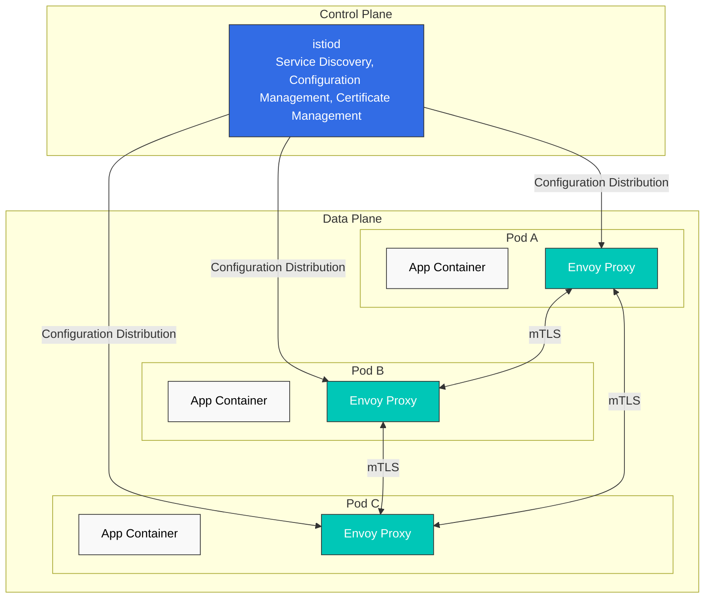

# Istio

> **支持的版本**: Istio 1.28.0
> **EKS 版本**: 1.34 (Kubernetes 1.28+)
> **最后更新**: February 23, 2026

## 目录

- [简介](#introduction)
- [主要功能](#key-features)
- [架构概览](#architecture-overview)
- [详细文档](#detailed-documentation)
- [快速开始](#quick-start)
- [学习资源](#learning-resources)

## 简介

Istio 是一个面向微服务应用程序的开源服务网格平台。服务网格是一层用于处理服务间通信的基础设施层，使您能够在不修改应用程序代码的情况下控制和观测服务间通信。

### 什么是服务网格？

服务网格提供以下核心功能：

1. **流量管理**：控制服务之间的流量
2. **安全性**：对服务间通信进行加密和身份验证
3. **可观测性**：深入了解服务间通信

### Istio 的主要优势

- **平台独立性**：可在各种环境中运行（Kubernetes、VM 等）
- **透明集成**：无需更改应用程序代码即可应用
- **自动 mTLS**：自动加密服务间通信
- **高级流量管理**：路由、负载均衡、故障注入等
- **详细指标**：提供服务间通信的详细指标
- **策略执行**：访问控制和速率限制

## 主要功能

### 1. 流量管理

Istio 提供强大的流量管理功能：

- **Gateway**：将外部流量路由到网格
- **VirtualService**：定义服务之间的路由规则
- **DestinationRule**：配置负载均衡和连接池
- **流量拆分**：支持 Canary 部署和 A/B 测试
- **Argo Rollouts 集成**：自动化渐进式交付

### 2. 安全性

全面的安全功能：

- **mTLS**：服务之间的自动加密
- **Authorization Policy**：细粒度访问控制
- **Request Authentication**：基于 JWT 的身份验证
- **Peer Authentication**：服务间身份验证策略

### 3. 可观测性

全面了解服务网格：

- **指标**：Prometheus 集成
- **分布式追踪**：支持 Jaeger/Zipkin
- **日志记录**：访问日志和结构化日志
- **可视化**：Kiali 仪表板

### 4. 弹性

服务弹性模式：

- **Circuit Breaker**：防止过载
- **Retry**：自动重试
- **Timeout**：请求超时配置
- **Outlier Detection**：排除不健康实例
- **Rate Limiting**：请求速率限制

## 架构概览

Istio 由 **Control Plane** 和 **Data Plane** 组成。



### Control Plane（istiod）

istiod 是 Istio 的中央控制组件，提供：

- **服务发现**：维护网格的服务注册表
- **配置管理**：存储和分发 Istio 配置
- **证书管理**：为 mTLS 生成和轮换证书

### Data Plane（Envoy Proxy）

Envoy 是作为 sidecar 部署在每个 Pod 中的高性能代理：

- **流量路由**：控制服务之间的流量
- **负载均衡**：在服务实例之间分配流量
- **安全性**：mTLS 加密和身份验证
- **可观测性**：收集指标、日志和追踪数据

## 详细文档

所有 Istio 功能的详细指南。

### 📚 基础文档

| 文档 | 说明 |
|----------|-------------|
| [安装指南](istio/installation.md) | Istio 安装和初始设置 |
| [核心概念](istio/core-concepts.md) | Istio 的基本概念和术语 |
| [组件](istio/components.md) | Istio 架构和组件 |

### 🚦 流量管理

| 文档 | 说明 |
|----------|-------------|
| [Gateway 与 VirtualService](istio/traffic-management/01-gateway-virtualservice.md) | Ingress/Egress Gateway 配置 |
| [路由](istio/traffic-management/02-routing.md) | VirtualService 路由规则 |
| [DestinationRule](istio/traffic-management/03-destination-rule.md) | 服务流量策略 |
| [流量拆分](istio/traffic-management/04-traffic-splitting.md) | Canary 部署和 A/B 测试 |
| [超时与重试](istio/traffic-management/05-retry-timeout.md) | 超时和重试策略 |
| [负载均衡](istio/traffic-management/06-load-balancing.md) | 各种负载均衡策略 |
| [Circuit Breaker](istio/traffic-management/07-circuit-breaker.md) | Circuit Breaker 模式实现 |
| [故障注入](istio/traffic-management/08-fault-injection.md) | 混沌工程 |
| [流量镜像](istio/traffic-management/09-traffic-mirror.md) | 流量镜像和影子测试 |
| [会话亲和性](istio/traffic-management/10-session-affinity.md) | 会话亲和性配置 |

### 🔐 安全性

| 文档 | 说明 |
|----------|-------------|
| [mTLS](istio/security/01-mtls.md) | 服务间 mTLS 配置 |
| [Authorization Policy](istio/security/02-authorization-policy.md) | 访问控制策略 |
| [Request Authentication](istio/security/03-request-authentication.md) | 基于 JWT 的身份验证 |
| [Peer Authentication](istio/security/04-peer-authentication.md) | 服务间身份验证 |

### 📊 可观测性

| 文档 | 说明 |
|----------|-------------|
| [指标](istio/observability/01-metrics.md) | Prometheus 指标收集 |
| [分布式追踪](istio/observability/02-distributed-tracing.md) | Jaeger/Zipkin 集成 |
| [日志记录](istio/observability/03-logging.md) | 访问日志和结构化日志 |
| [可视化](istio/observability/04-visualization.md) | Kiali、Grafana 仪表板 |

### 💪 弹性

| 文档 | 说明 |
|----------|-------------|
| [Outlier Detection](istio/resilience/01-outlier-detection.md) | 不健康实例检测 |
| [Rate Limiting](istio/resilience/02-rate-limiting.md) | 本地和全局速率限制 |
| [区域感知路由](istio/resilience/03-zone-aware-routing.md) | 基于位置感知的路由 |

### 🚀 高级主题

| 文档 | 说明 |
|----------|-------------|
| [Ambient Mode](istio/advanced/01-ambient-mode.md) | 无 sidecar 服务网格 |
| [多集群](istio/advanced/02-multi-cluster.md) | 多集群网格配置 |
| [EnvoyFilter](istio/advanced/03-envoy-filter.md) | Envoy 自定义 |
| [DNS 缓存](istio/advanced/04-dns-cache.md) | 使用 DNS 缓存提高性能 |
| [gRPC](istio/advanced/05-grpc.md) | gRPC 协议支持 |
| [WebSocket](istio/advanced/06-websocket.md) | WebSocket 连接支持 |
| [Sidecar 注入](istio/advanced/07-sidecar-injection.md) | Sidecar 注入机制 |
| [Argo Rollouts](istio/advanced/08-argo-rollouts.md) | 渐进式交付集成 |

### ✅ 最佳实践

| 文档 | 说明 |
|----------|-------------|
| [最佳实践](istio/best-practices.md) | 生产环境检查清单和建议 |

## 快速开始

### 1. 前提条件

- Kubernetes 集群（v1.28+）
- 已配置 kubectl
- 管理员权限

### 2. 安装 Istio

```bash
# Download Istioctl
curl -L https://istio.io/downloadIstio | sh -
cd istio-1.28.0
export PATH=$PWD/bin:$PATH

# Install with default profile
istioctl install --set profile=default -y

# Enable Sidecar injection on namespace
kubectl label namespace default istio-injection=enabled
```

### 3. 部署示例应用程序

```bash
# Deploy Bookinfo sample application
kubectl apply -f samples/bookinfo/platform/kube/bookinfo.yaml

# Create Gateway
kubectl apply -f samples/bookinfo/networking/bookinfo-gateway.yaml

# Verify installation
kubectl get pods
kubectl get svc istio-ingressgateway -n istio-system
```

### 4. 发送流量

```bash
# Check Ingress Gateway address
export INGRESS_HOST=$(kubectl get svc istio-ingressgateway -n istio-system -o jsonpath='{.status.loadBalancer.ingress[0].hostname}')
export INGRESS_PORT=$(kubectl get svc istio-ingressgateway -n istio-system -o jsonpath='{.spec.ports[?(@.name=="http2")].port}')
export GATEWAY_URL=$INGRESS_HOST:$INGRESS_PORT

# Access application
curl -s "http://${GATEWAY_URL}/productpage"
```

### 5. 访问可观测性工具

```bash
# Kiali dashboard
istioctl dashboard kiali

# Prometheus
istioctl dashboard prometheus

# Grafana
istioctl dashboard grafana

# Jaeger
istioctl dashboard jaeger
```

## 学习资源

### 官方文档

- [Istio 官方文档](https://istio.io/latest/docs/)
- [Istio GitHub 仓库](https://github.com/istio/istio)
- [Envoy Proxy 文档](https://www.envoyproxy.io/docs/envoy/latest/)

### AWS 相关资源

- [AWS EKS Workshop - Istio](https://www.eksworkshop.com/docs/security/servicemesh/)
- [AWS App Mesh 与 Istio 的比较](https://aws.amazon.com/blogs/containers/choosing-between-aws-app-mesh-and-istio/)

### 社区

- [Istio Discuss](https://discuss.istio.io/)
- [Istio Slack](https://istio.slack.com/)
- [CNCF Istio 工作组](https://github.com/cncf/tag-app-delivery)

### 补充资源

- [服务网格模式（O'Reilly）](https://www.oreilly.com/library/view/service-mesh-patterns/9781492086444/)
- [Istio 实战（Manning）](https://www.manning.com/books/istio-in-action)
- [Istio 性能优化指南](https://istio.io/latest/docs/ops/deployment/performance-and-scalability/)

## 测验

为测试您对 Istio 的理解，请尝试 [Istio 测验](../quizzes/service-mesh/02-istio-quiz.md)。

测验涵盖以下主题：

- 服务网格基本概念
- Istio 架构
- 流量管理（Canary 部署）
- 安全性（mTLS）
- Gateway 和 Ingress
- 可观测性工具
- 最新服务网格趋势
- Rate Limiting
- 位置路由
- Amazon EKS 集成

---

**后续步骤**：请参阅[安装指南](istio/installation.md)安装 Istio，并在[核心概念](istio/core-concepts.md)中学习基本概念。
