# Cilium Service Mesh 架构

> **支持的版本**: Cilium 1.16+, Kubernetes 1.28+
> **最后更新**: February 22, 2026

## 概述

Cilium Service Mesh 的架构与传统基于 sidecar 的服务网格有着根本性的不同。它利用 eBPF 在内核级别处理 L3/L4 流量，并通过每个节点一个共享的 Envoy proxy 提供 L7 功能。本章将详细说明 Cilium Service Mesh 的核心架构组件和运行方式。

## 整体架构

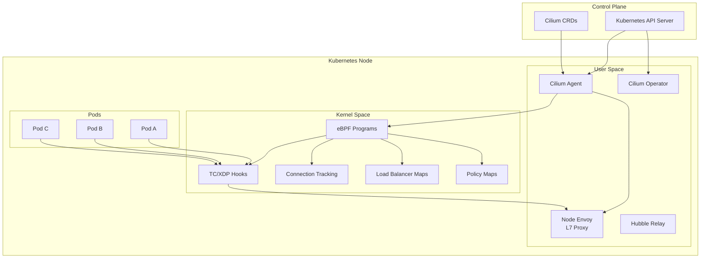

## eBPF 数据路径

### 什么是 eBPF？

eBPF（extended Berkeley Packet Filter）是一项可在 Linux 内核中运行沙箱程序的技术。它无需修改内核即可实现网络、安全和可观测性功能。

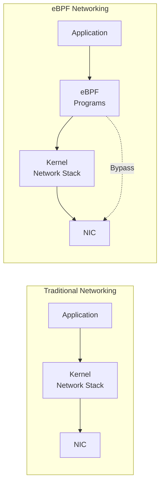

### eBPF 挂载点

Cilium 使用多个 eBPF 挂载点：

| 挂载点 | 位置 | 用途 |
|------------|----------|---------|
| **XDP (eXpress Data Path)** | NIC 驱动程序 | 超高速数据包处理、DDoS 防护 |
| **TC (Traffic Control)** | 网络栈入口 | 数据包过滤、重定向 |
| **Socket 操作** | Socket 层级 | Socket 连接加速 |
| **cgroup** | 进程组 | 资源控制、策略执行 |

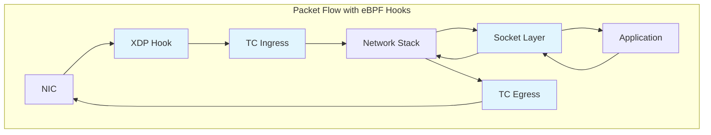

### L3/L4 处理

eBPF 中的 L3/L4 处理流程如下：

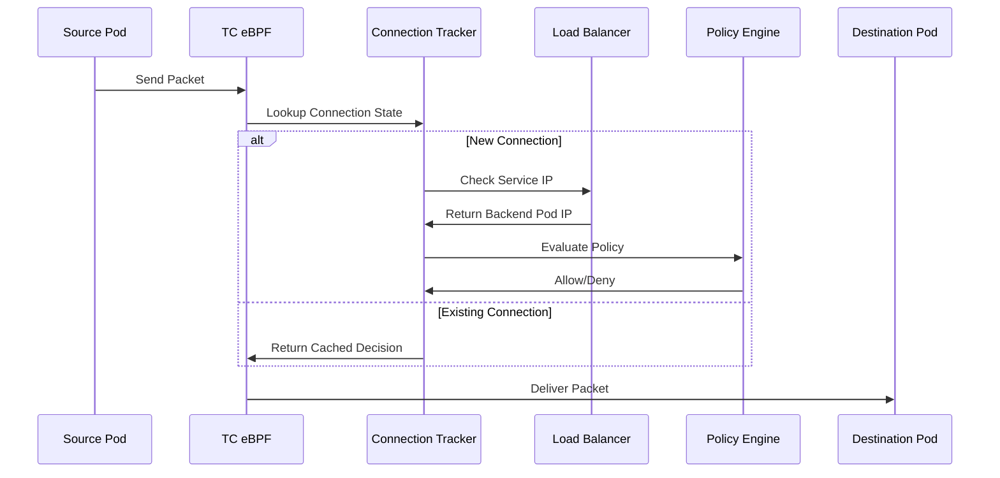

#### eBPF Map 结构

```c
// Connection Tracking Map
struct ct_entry {
    __u32 src_ip;
    __u32 dst_ip;
    __u16 src_port;
    __u16 dst_port;
    __u8  protocol;
    __u64 lifetime;
    __u32 rx_packets;
    __u32 tx_packets;
};

// Service Map
struct lb_service {
    __u32 service_ip;
    __u16 service_port;
    __u32 backend_count;
    __u32 backend_slot;
};

// Policy Map
struct policy_entry {
    __u32 identity;
    __u16 port;
    __u8  protocol;
    __u8  action;  // ALLOW, DENY, AUDIT
};
```

### kube-proxy 替代方案

Cilium 基于 eBPF 的负载均衡器可完全替代 kube-proxy：

```yaml
# Enable kube-proxy replacement during Cilium installation
kubeProxyReplacement: true

# Load balancer algorithm configuration
loadBalancer:
  algorithm: maglev  # or random
  mode: dsr          # Direct Server Return
```

**kube-proxy 与 Cilium eBPF 对比：**

| 功能 | kube-proxy (iptables) | Cilium eBPF |
|---------|----------------------|-------------|
| 规则复杂度 | O(n) - 与 Service 数量成正比 | O(1) - hash map 查找 |
| 连接跟踪 | conntrack 模块 | eBPF CT Map |
| DSR 支持 | 有限 | 完整支持 |
| 会话亲和性 | 基于 iptables | Maglev hashing |
| 性能 | 中等 | 高 |

## 每节点 Envoy Proxy

### Sidecar 与节点 Proxy

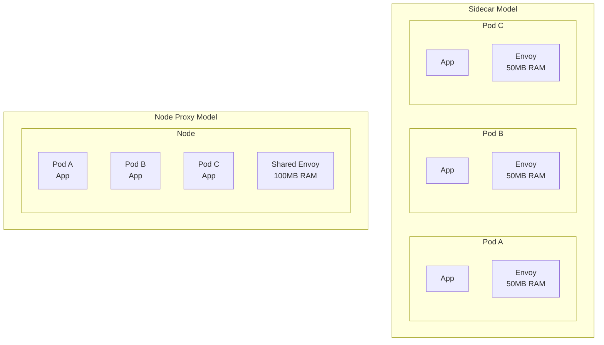

### Envoy 部署方式

Cilium 通过 DaemonSet 在每个节点上部署一个 Envoy proxy：

```bash
# Check Envoy DaemonSet
kubectl get daemonset -n kube-system cilium-envoy

# Expected output
NAME           DESIRED   CURRENT   READY   UP-TO-DATE   AVAILABLE
cilium-envoy   3         3         3       3            3
```

### L7 处理流程

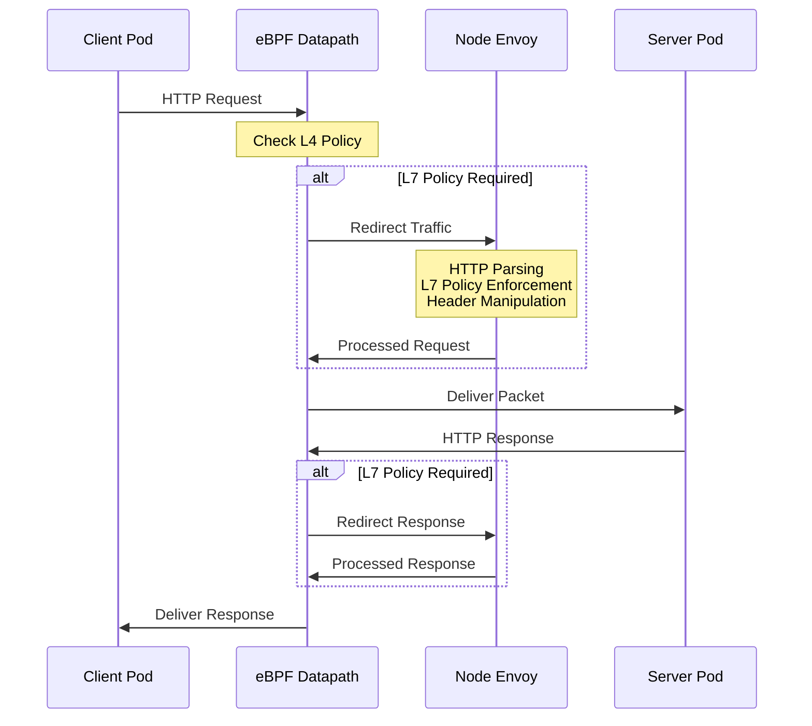

### Envoy 资源配置

```yaml
# values.yaml
envoy:
  enabled: true
  resources:
    limits:
      cpu: 2000m
      memory: 2Gi
    requests:
      cpu: 100m
      memory: 256Mi

  # Envoy concurrent connection settings
  maxConnectionsPerHost: 1000
  connectTimeout: 5s

  # Proxy protocol settings
  proxy:
    protocol:
      http2:
        enabled: true
      tls:
        enabled: true
```

## CRD 模型

### Cilium CRD 结构

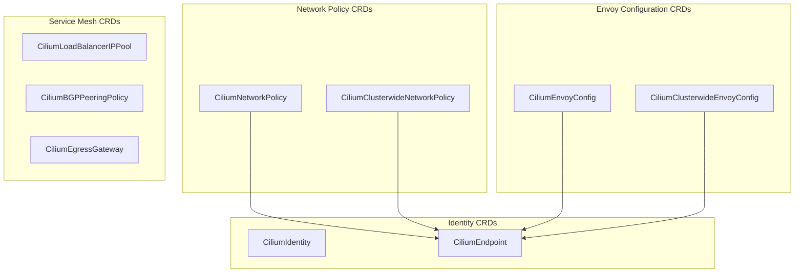

### CiliumEnvoyConfig

CiliumEnvoyConfig 定义 namespace 作用域的 Envoy 配置：

```yaml
apiVersion: cilium.io/v2
kind: CiliumEnvoyConfig
metadata:
  name: http-filter
  namespace: default
spec:
  # Services this configuration applies to
  services:
  - name: my-service
    namespace: default

  # Envoy resource definitions
  resources:
  - "@type": type.googleapis.com/envoy.config.listener.v3.Listener
    name: my-service-listener
    filter_chains:
    - filters:
      - name: envoy.filters.network.http_connection_manager
        typed_config:
          "@type": type.googleapis.com/envoy.extensions.filters.network.http_connection_manager.v3.HttpConnectionManager
          stat_prefix: my-service
          route_config:
            name: local_route
            virtual_hosts:
            - name: my-service
              domains: ["*"]
              routes:
              - match:
                  prefix: "/"
                route:
                  cluster: default/my-service
          http_filters:
          - name: envoy.filters.http.router
            typed_config:
              "@type": type.googleapis.com/envoy.extensions.filters.http.router.v3.Router
```

### CiliumClusterwideEnvoyConfig

集群范围的 Envoy 配置：

```yaml
apiVersion: cilium.io/v2
kind: CiliumClusterwideEnvoyConfig
metadata:
  name: global-ratelimit
spec:
  # Apply to all services cluster-wide
  services:
  - name: "*"
    namespace: "*"

  resources:
  - "@type": type.googleapis.com/envoy.config.listener.v3.Listener
    name: global-listener
    filter_chains:
    - filters:
      - name: envoy.filters.network.http_connection_manager
        typed_config:
          "@type": type.googleapis.com/envoy.extensions.filters.network.http_connection_manager.v3.HttpConnectionManager
          stat_prefix: global
          http_filters:
          - name: envoy.filters.http.local_ratelimit
            typed_config:
              "@type": type.googleapis.com/envoy.extensions.filters.http.local_ratelimit.v3.LocalRateLimit
              stat_prefix: http_local_rate_limiter
              token_bucket:
                max_tokens: 1000
                tokens_per_fill: 100
                fill_interval: 1s
          - name: envoy.filters.http.router
            typed_config:
              "@type": type.googleapis.com/envoy.extensions.filters.http.router.v3.Router
```

### CiliumNetworkPolicy (L7)

包含 L7 规则的网络策略：

```yaml
apiVersion: cilium.io/v2
kind: CiliumNetworkPolicy
metadata:
  name: l7-policy
  namespace: default
spec:
  endpointSelector:
    matchLabels:
      app: backend

  ingress:
  - fromEndpoints:
    - matchLabels:
        app: frontend
    toPorts:
    - ports:
      - port: "8080"
        protocol: TCP
      rules:
        http:
        - method: GET
          path: "/api/v1/.*"
          headers:
          - name: "X-Request-ID"
            value: ".*"
        - method: POST
          path: "/api/v1/users"
        - method: DELETE
          path: "/api/v1/users/[0-9]+"

  egress:
  - toEndpoints:
    - matchLabels:
        app: database
    toPorts:
    - ports:
      - port: "5432"
        protocol: TCP
```

## Cilium Agent 与 Service Mesh

### Cilium Agent 的角色

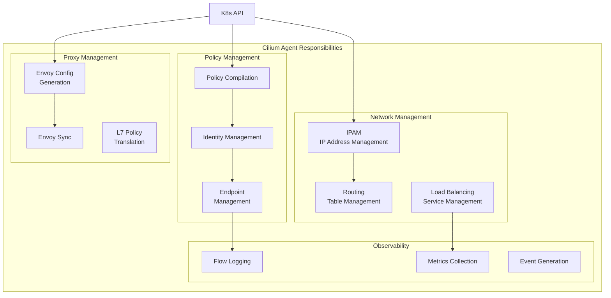

### Agent 配置

```yaml
# ConfigMap: cilium-config
apiVersion: v1
kind: ConfigMap
metadata:
  name: cilium-config
  namespace: kube-system
data:
  # Agent basic settings
  debug: "false"
  enable-ipv4: "true"
  enable-ipv6: "false"

  # Service mesh settings
  enable-l7-proxy: "true"
  enable-envoy-config: "true"

  # kube-proxy replacement
  kube-proxy-replacement: "true"

  # Observability
  enable-hubble: "true"
  hubble-listen-address: ":4244"
  hubble-metrics-server: ":9965"

  # Encryption
  enable-wireguard: "true"
  enable-ipsec: "false"
```

## Service Identity 和 SPIFFE

### Cilium Identity

Cilium 为每个 workload 分配唯一的 identity：

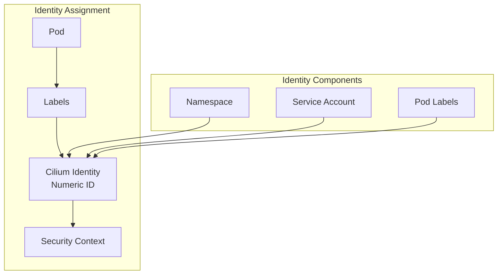

### 基于 Identity 的策略

```yaml
# Check Pod's Identity
apiVersion: cilium.io/v2
kind: CiliumIdentity
metadata:
  name: "12345"
  labels:
    app: frontend
    k8s:io.kubernetes.pod.namespace: default
spec:
  security-labels:
    k8s:app: frontend
    k8s:io.kubernetes.pod.namespace: default
```

```bash
# List identities
cilium identity list

# Expected output
ID      LABELS
1       reserved:host
2       reserved:world
3       reserved:health
12345   k8s:app=frontend,k8s:io.kubernetes.pod.namespace=default
12346   k8s:app=backend,k8s:io.kubernetes.pod.namespace=default
```

### SPIFFE 集成

通过 SPIFFE（Secure Production Identity Framework for Everyone）实现 workload identity：

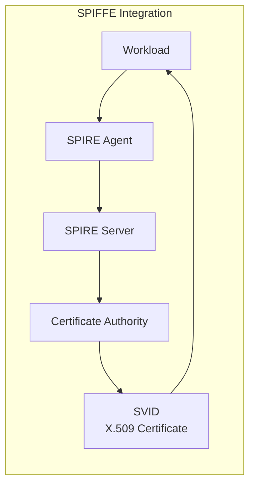

```yaml
# SPIRE integration configuration
authentication:
  mutual:
    spire:
      enabled: true
      install:
        enabled: true
        server:
          dataStorage:
            size: 1Gi
        agent:
          socketPath: /run/spire/sockets/agent.sock
```

SPIFFE ID 格式：
```
spiffe://cluster.local/ns/<namespace>/sa/<service-account>
```

## 数据包流分析

### Pod 到 Pod 通信（同一节点）

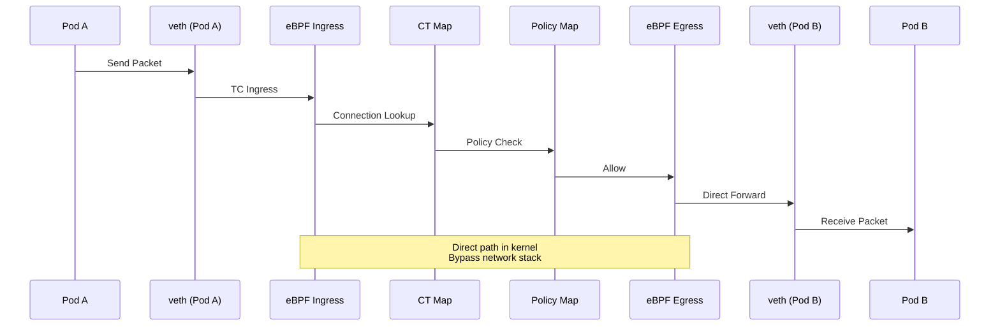

### Pod 到 Pod 通信（不同节点）

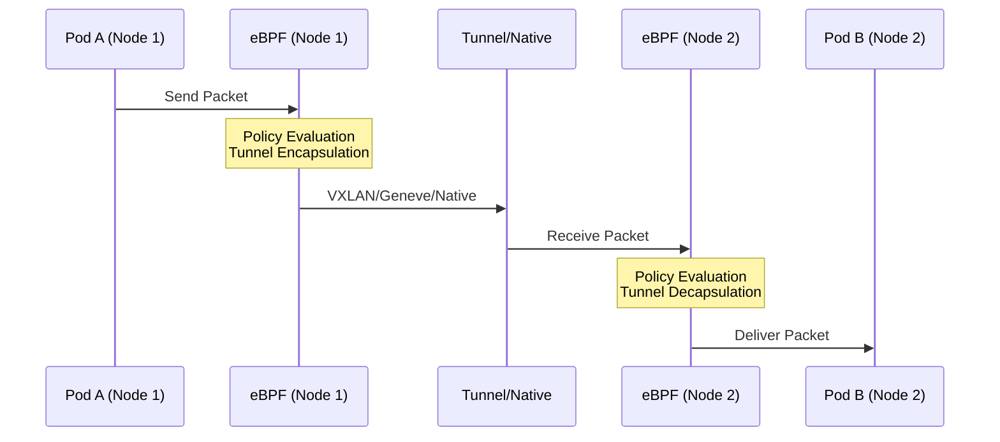

### 需要 L7 处理时

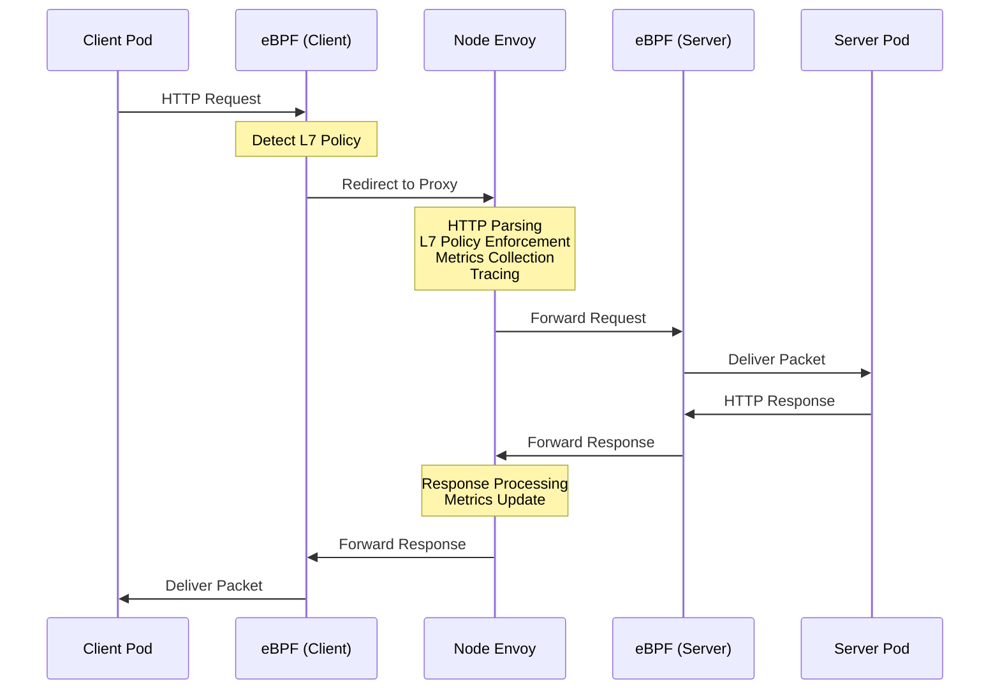

## 与 Istio Sidecar 架构的比较

### 架构对比表

| 方面 | Cilium Service Mesh | Istio Sidecar |
|--------|---------------------|---------------|
| **Proxy 位置** | 每个节点 1 个 | 每个 Pod 1 个 |
| **Proxy 类型** | eBPF + Envoy | 仅 Envoy |
| **L4 处理** | 内核（eBPF） | 用户空间（Envoy） |
| **L7 处理** | 用户空间（Envoy） | 用户空间（Envoy） |
| **内存使用量** | ~100MB/节点 | ~50MB/Pod |
| **CPU 使用量** | 低 | 中高 |
| **延迟** | 0.1-0.5ms | 1-3ms |
| **配置模型** | CiliumEnvoyConfig | VirtualService/DestinationRule |
| **mTLS 实现** | eBPF/WireGuard | Envoy |
| **注入** | 不需要 | 需要注入 Sidecar |

### 延迟分析

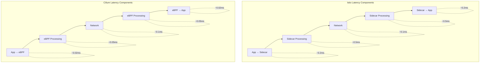

### 资源效率分析

对于一个包含 100 个 Pod 的集群：

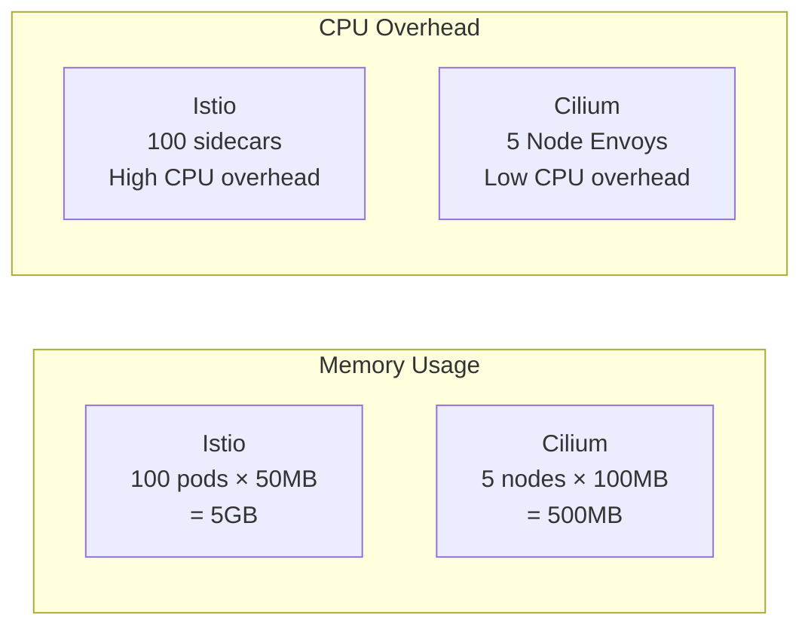

## 可扩展性注意事项

### eBPF Map 大小

```yaml
# Cilium ConfigMap settings
bpf-map-dynamic-size-ratio: "0.0025"
bpf-ct-global-tcp-max: "524288"
bpf-ct-global-any-max: "262144"
bpf-nat-global-max: "524288"
bpf-policy-map-max: "16384"
```

### 大型集群配置

```yaml
# Large cluster (1000+ nodes) configuration
apiVersion: v1
kind: ConfigMap
metadata:
  name: cilium-config
  namespace: kube-system
data:
  # Identity-related settings
  cluster-id: "1"
  cluster-name: "production"

  # Connection tracking optimization
  bpf-ct-global-tcp-max: "1048576"
  bpf-ct-global-any-max: "524288"

  # NAT table size
  bpf-nat-global-max: "1048576"

  # Policy map size
  bpf-policy-map-max: "65536"

  # Performance optimization
  sockops-enable: "true"
  bpf-lb-sock: "true"

  # Hubble settings
  hubble-disable: "false"
  hubble-socket-path: "/var/run/cilium/hubble.sock"
```

### Node Envoy 扩缩容

```yaml
# Envoy resource scaling
envoy:
  resources:
    limits:
      cpu: 4000m
      memory: 4Gi
    requests:
      cpu: 500m
      memory: 512Mi

  # Envoy worker threads
  concurrency: 4

  # Connection limits
  perConnectionBufferLimitBytes: 32768

  # Cluster settings
  cluster:
    connectTimeout: 5s
    circuitBreakers:
      maxConnections: 10000
      maxPendingRequests: 10000
      maxRequests: 10000
```

## 后续步骤

- [流量管理](./02-traffic-management.md)：配置 L7 路由和流量控制
- [安全](./03-security.md)：设置 mTLS 和 L7 网络策略
- [可观测性](./04-observability.md)：使用 Hubble 监控服务网格

## 参考资料

- [Cilium 架构文档](https://docs.cilium.io/en/stable/concepts/overview/)
- [eBPF 文档](https://ebpf.io/what-is-ebpf/)
- [Envoy Proxy 架构](https://www.envoyproxy.io/docs/envoy/latest/intro/arch_overview/arch_overview)
- [SPIFFE 规范](https://spiffe.io/docs/latest/spiffe-about/overview/)
