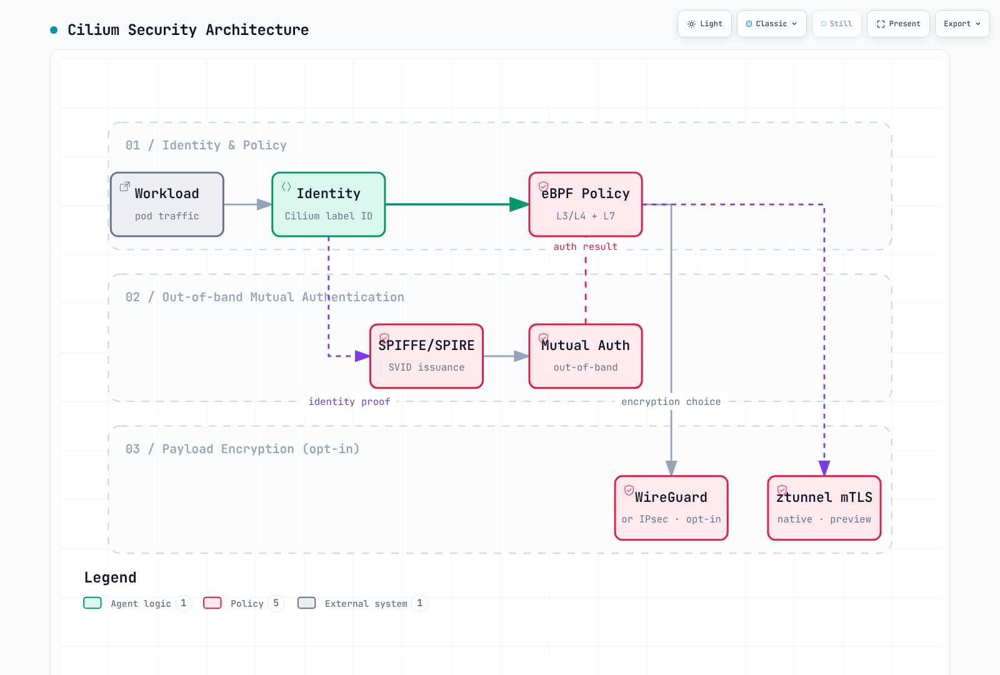
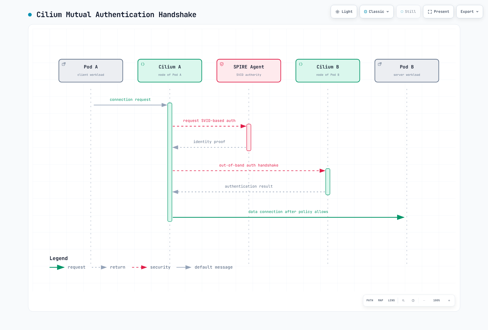

# Cilium Service Mesh 安全

> **支持的版本**：Cilium 1.16+，Kubernetes 1.28+
> **最后更新**：August 21, 2026

## 概述

Cilium 安全具有三个不同的层：

1. **基于身份的授权：** Cilium Identity 和 eBPF policy 决定哪些 workload 可以通信。
2. **双向认证：** Cilium 通过 SPIFFE/SPIRE 实现的双向认证，借助独立于应用数据连接的**带外**握手来验证对端身份。
3. **数据加密：** 在成熟实现中，必须单独启用 WireGuard/IPsec 来加密负载。在受支持的情况下，原生 ztunnel mTLS 预览版会使用 TLS 加密 workload 流量。

这些功能可以组合使用，但它们并不自动等同于 Istio `PeerAuthentication` `STRICT` workload mTLS。请将身份授权、对端认证和传输中的加密作为独立需求进行评估。

## 安全架构



[🔍 查看交互式图表](https://www.atomai.click/kubernetes-docs/archmaps/en-service-mesh-cilium-service-mesh-03-security-0.html)

## 双向认证和数据加密

### 成熟的 Cilium 双向认证

Cilium 双向认证会在允许连接之前验证两个 endpoint 的身份，但成熟的认证握手与应用数据路径是分离的。不要认为仅使用 `authentication.mode: required` 就会通过 TLS 加密现有数据连接的负载。当需要数据保密性时，请配置 [WireGuard 或 IPsec](https://docs.cilium.io/en/stable/security/network/encryption/)。



[🔍 查看交互式图表](https://www.atomai.click/kubernetes-docs/archmaps/en-service-mesh-cilium-service-mesh-03-security-1.html)

### 通过 ztunnel 实现原生 mTLS（2026 更新）

Cilium 于 2026 年 3 月公布的原生 mTLS 设计采用 ztunnel 模型，在 workload-mTLS 路径上将双向认证与实际负载加密结合起来。它与成熟的带外双向认证加 WireGuard/IPsec 是不同的数据平面。该技术栈由三个协作组件构成：

- **SPIRE** — 签发 workload 身份和 X.509 证书（与下面基于 SPIRE 的配置中作用相同）
- **Cilium** — 安装 iptables 规则，将出站 Pod 流量透明地重定向到端口 15001 上的 ztunnel
- **ztunnel** — 每个 Node 一个 proxy（而非每个 Pod 一个 sidecar），执行实际的 mTLS 握手并加密 Pod-to-Pod 流量

这保留了“无需每个 Pod 配置 sidecar、无需更改应用”的特性，同时 TLS 握手在专用的每 Node 进程中运行。采用前请检查当前的预览状态和平台支持情况；不要将其视为对运维上已成熟的 Istio `STRICT` mTLS 路径的自动替代方案。

有关完整的架构说明，请参阅 [Cilium 关于原生 mTLS 的博客文章](https://cilium.io/blog/2026/03/23/native-mtls-cilium/)。

### 何时为 mTLS 选择 Cilium 或 Istio

- 当需求是在已运行 Cilium 的数据平面上实现高效的 L3/L4 identity policy 和网络加密时，**选择 Cilium** — 无需额外运行 sidecar 或每 Service proxy，并且 CiliumNetworkPolicy/CiliumClusterwideNetworkPolicy 已能表达所需的访问规则。
- 当需求是具有 `PeerAuthentication` `STRICT` 语义的成熟 workload-certificate mTLS，或 Istio 原生的 L7 policy/routing（包括 [sidecar 与 ambient 对比](../istio/comparison/03-sidecar-vs-ambient.md) 中涵盖的 `AuthorizationPolicy`、重试和流量迁移规则）时，**选择 Istio** — Cilium 成熟的双向认证是带外的，且不具备该 policy surface。
- 不要只依据加密层做决定：Cilium 的 WireGuard/IPsec 及其原生 ztunnel mTLS 预览版都会加密负载，但单独使用其中任何一种都无法复现 Istio `PeerAuthentication` `STRICT` 将 workload identity 签发、policy enforcement 和负载加密集于一个开关的组合。

### 基于 SPIRE 的双向认证配置

```yaml
# values.yaml - SPIRE integration configuration
authentication:
  mutual:
    spire:
      enabled: true
      install:
        enabled: true
        namespace: cilium-spire

        server:
          # SPIRE Server configuration
          replicas: 1
          dataStorage:
            enabled: true
            size: 1Gi
            storageClass: gp3

          # Trust Domain configuration
          trustDomain: cluster.local

          # CA configuration
          ca:
            # Use internal CA
            keyType: ec-p256
            ttl: 24h

          # Node Attestor configuration
          nodeAttestor:
            k8sPsat:
              enabled: true

        agent:
          # SPIRE Agent configuration
          socketPath: /run/spire/sockets/agent.sock

          # Workload Attestor configuration
          workloadAttestor:
            k8s:
              enabled: true
              disableContainerSelectors: false
```

### 双向认证 Policy 强制执行

```yaml
# Require mutual authentication cluster-wide
apiVersion: cilium.io/v2
kind: CiliumClusterwideNetworkPolicy
metadata:
  name: enforce-mtls
spec:
  endpointSelector: {}
  authentication:
  - mode: required
```

### 每 Namespace 双向认证

```yaml
# Apply mutual authentication to a specific namespace
apiVersion: cilium.io/v2
kind: CiliumNetworkPolicy
metadata:
  name: namespace-mtls
  namespace: production
spec:
  endpointSelector: {}
  ingress:
  - fromEndpoints:
    - {}
    authentication:
    - mode: required
  egress:
  - toEndpoints:
    - {}
    authentication:
    - mode: required
```

### 每 Service 双向认证

```yaml
# Enforce mutual authentication between specific services
apiVersion: cilium.io/v2
kind: CiliumNetworkPolicy
metadata:
  name: service-mtls
  namespace: default
spec:
  endpointSelector:
    matchLabels:
      app: backend

  ingress:
  - fromEndpoints:
    - matchLabels:
        app: frontend
    authentication:
    - mode: required
    toPorts:
    - ports:
      - port: "8080"
        protocol: TCP
```

## CiliumNetworkPolicy L7 规则

### HTTP L7 安全 Policy

```yaml
apiVersion: cilium.io/v2
kind: CiliumNetworkPolicy
metadata:
  name: http-security-policy
  namespace: default
spec:
  endpointSelector:
    matchLabels:
      app: api-server

  ingress:
  # Read-only access
  - fromEndpoints:
    - matchLabels:
        role: reader
    toPorts:
    - ports:
      - port: "8080"
        protocol: TCP
      rules:
        http:
        - method: GET
          path: "/api/.*"

  # Admin access
  - fromEndpoints:
    - matchLabels:
        role: admin
    toPorts:
    - ports:
      - port: "8080"
        protocol: TCP
      rules:
        http:
        - method: ".*"
          path: "/api/.*"
          headers:
          - "Authorization: Bearer .*"

  # Health checks
  - fromEndpoints:
    - matchLabels:
        app: monitoring
    toPorts:
    - ports:
      - port: "8080"
        protocol: TCP
      rules:
        http:
        - method: GET
          path: "/health"
        - method: GET
          path: "/metrics"
```

### Kafka L7 安全 Policy

```yaml
apiVersion: cilium.io/v2
kind: CiliumNetworkPolicy
metadata:
  name: kafka-security
  namespace: kafka
spec:
  endpointSelector:
    matchLabels:
      app: kafka

  ingress:
  # Producer - allow writing to specific topics only
  - fromEndpoints:
    - matchLabels:
        role: producer
    toPorts:
    - ports:
      - port: "9092"
        protocol: TCP
      rules:
        kafka:
        - apiKey: produce
          topic: "orders"
        - apiKey: produce
          topic: "events"
        - apiKey: metadata

  # Consumer - allow reading from specific topics only
  - fromEndpoints:
    - matchLabels:
        role: consumer
    toPorts:
    - ports:
      - port: "9092"
        protocol: TCP
      rules:
        kafka:
        - apiKey: fetch
          topic: "orders"
        - apiKey: fetch
          topic: "events"
        - apiKey: listoffsets
          topic: "orders"
        - apiKey: listoffsets
          topic: "events"
        - apiKey: metadata
        - apiKey: findcoordinator
        - apiKey: joingroup
        - apiKey: heartbeat
        - apiKey: leavegroup
        - apiKey: syncgroup
        - apiKey: offsetcommit
          topic: "orders"
        - apiKey: offsetfetch
          topic: "orders"
```

### DNS L7 安全 Policy

```yaml
apiVersion: cilium.io/v2
kind: CiliumNetworkPolicy
metadata:
  name: dns-security
  namespace: default
spec:
  endpointSelector:
    matchLabels:
      app: web-application

  egress:
  # Restrict DNS queries
  - toEndpoints:
    - matchLabels:
        k8s:io.kubernetes.pod.namespace: kube-system
        k8s-app: kube-dns
    toPorts:
    - ports:
      - port: "53"
        protocol: UDP
      rules:
        dns:
        # Allow internal services only
        - matchPattern: "*.svc.cluster.local"
        # Allow specific external domains only
        - matchName: "api.stripe.com"
        - matchName: "api.aws.amazon.com"
        - matchPattern: "*.s3.amazonaws.com"

  # Egress to allowed external services
  - toFQDNs:
    - matchName: "api.stripe.com"
    - matchName: "api.aws.amazon.com"
    - matchPattern: "*.s3.amazonaws.com"
    toPorts:
    - ports:
      - port: "443"
        protocol: TCP
```

## 双向认证

> 本节配置 `authentication.mode` policy 示例。有关双向认证涵盖和不涵盖的内容（带外握手，与负载加密分离），请参阅上文的[双向认证和数据加密](#mutual-authentication-and-data-encryption)。

### 认证模式

```yaml
# Cilium authentication mode options

# 1. disabled - no authentication (default)
authentication:
- mode: disabled

# 2. optional - use authentication if possible, otherwise allow
authentication:
- mode: optional

# 3. required - authentication required
authentication:
- mode: required

# 4. test-always-fail - for testing (always fails)
authentication:
- mode: test-always-fail
```

### 双向认证 Policy 示例

```yaml
apiVersion: cilium.io/v2
kind: CiliumNetworkPolicy
metadata:
  name: mutual-auth-policy
  namespace: production
spec:
  endpointSelector:
    matchLabels:
      app: secure-service

  ingress:
  # Allow authenticated clients only
  - fromEndpoints:
    - matchLabels:
        app: trusted-client
    authentication:
    - mode: required
    toPorts:
    - ports:
      - port: "443"
        protocol: TCP

  # Optional authentication for monitoring
  - fromEndpoints:
    - matchLabels:
        app: prometheus
    authentication:
    - mode: optional
    toPorts:
    - ports:
      - port: "9090"
        protocol: TCP
```

### 基于 SPIFFE ID 的认证

```yaml
apiVersion: cilium.io/v2
kind: CiliumNetworkPolicy
metadata:
  name: spiffe-auth
  namespace: default
spec:
  endpointSelector:
    matchLabels:
      app: database

  ingress:
  # Allow specific SPIFFE ID only
  - fromEndpoints:
    - matchLabels:
        app: backend
    authentication:
    - mode: required
      # SPIFFE ID verification is performed automatically
      # spiffe://cluster.local/ns/default/sa/backend
```

## 加密

> 本节配置上文[双向认证和数据加密](#mutual-authentication-and-data-encryption)中概念性介绍的负载加密机制（WireGuard/IPsec）——加密是与双向认证分开的选择，并非其副产品。

### WireGuard 透明加密

WireGuard 在 Linux kernel 层加密所有 Pod-to-Pod 流量：

```yaml
# values.yaml - Enable WireGuard
encryption:
  enabled: true
  type: wireguard

  wireguard:
    # Userspace fallback (when kernel support unavailable)
    userspaceFallback: true

  # Node-to-node encryption
  nodeEncryption: true
```

```bash
# Check WireGuard status
cilium status | grep Encryption

# Expected output
Encryption:              Wireguard  [NodeEncryption: Enabled, cilium_wg0 (Pubkey: xxx, Port: 51871, Peers: 2)]

# Check WireGuard peers
cilium encrypt status

# Expected output
Encryption: Wireguard
Keys in use: 1
Max Seq. Number: 0x0
Errors: 0
```

#### WireGuard 架构


[🔍 查看交互式图表](https://www.atomai.click/kubernetes-docs/archmaps/en-service-mesh-cilium-service-mesh-03-security-2.html)

### IPsec 加密

```yaml
# values.yaml - Enable IPsec
encryption:
  enabled: true
  type: ipsec

  ipsec:
    # IPsec interface
    interface: ""

    # Key rotation interval
    keyRotationDuration: "5m"

    # Encryption interface
    mountPath: /etc/ipsec

# Generate IPsec key
# kubectl create secret generic -n kube-system cilium-ipsec-keys \
#   --from-literal=keys="3 rfc4106(gcm(aes)) $(openssl rand -hex 20) 128"
```

### 加密对比

| 特性 | WireGuard | IPsec |
|---------|-----------|-------|
| 性能 | 非常高 | 高 |
| 配置复杂度 | 低 | 中 |
| Kernel 支持 | 5.6+（内置） | 所有版本 |
| 加密算法 | ChaCha20Poly1305 | AES-GCM 等 |
| 密钥管理 | 自动 | 手动/自动 |
| 标准 | 非标准 | IETF 标准 |

## 基于身份的安全

### Cilium Identity

Cilium 基于身份而不是 IP 应用安全 policy：


[🔍 查看交互式图表](https://www.atomai.click/kubernetes-docs/archmaps/en-service-mesh-cilium-service-mesh-03-security-3.html)

### 身份组件

```bash
# Identity label composition
# - k8s:io.kubernetes.pod.namespace
# - k8s:io.cilium.k8s.policy.serviceaccount
# - k8s:app
# - k8s:version
# - Other user-defined labels

# List identities
cilium identity list

# Example output
IDENTITY   LABELS
1          reserved:host
2          reserved:world
3          reserved:unmanaged
4          reserved:health
5          reserved:init
6          reserved:remote-node
12345      k8s:app=frontend,k8s:io.kubernetes.pod.namespace=default
12346      k8s:app=backend,k8s:io.kubernetes.pod.namespace=default
```

### 基于身份的 Policy

```yaml
# Identity-based network policy
apiVersion: cilium.io/v2
kind: CiliumNetworkPolicy
metadata:
  name: identity-based-policy
  namespace: default
spec:
  endpointSelector:
    matchLabels:
      app: backend

  ingress:
  # Allow only Pods with specific labels (Identity)
  - fromEndpoints:
    - matchLabels:
        app: frontend
        environment: production
    toPorts:
    - ports:
      - port: "8080"

  # Allow specific service from another namespace
  - fromEndpoints:
    - matchLabels:
        k8s:io.kubernetes.pod.namespace: monitoring
        app: prometheus
    toPorts:
    - ports:
      - port: "9090"
```

### IP 与 Identity 对比


[🔍 查看交互式图表](https://www.atomai.click/kubernetes-docs/archmaps/en-service-mesh-cilium-service-mesh-03-security-4.html)

## 外部 PKI 集成

### cert-manager 集成

```yaml
# Certificate management with cert-manager
apiVersion: cert-manager.io/v1
kind: ClusterIssuer
metadata:
  name: cilium-ca-issuer
spec:
  ca:
    secretName: cilium-ca-secret
---
apiVersion: cert-manager.io/v1
kind: Certificate
metadata:
  name: cilium-spire-ca
  namespace: cilium-spire
spec:
  secretName: spire-ca-secret
  duration: 8760h  # 1 year
  renewBefore: 720h  # Renew 30 days before expiry
  isCA: true
  privateKey:
    algorithm: ECDSA
    size: 256
  subject:
    organizations:
    - Cilium
  commonName: SPIRE CA
  issuerRef:
    name: cilium-ca-issuer
    kind: ClusterIssuer
```

### Vault 集成

```yaml
# Use Vault as CA in SPIRE
apiVersion: v1
kind: ConfigMap
metadata:
  name: spire-server-config
  namespace: cilium-spire
data:
  server.conf: |
    server {
      trust_domain = "cluster.local"

      ca_subject = {
        country = ["US"]
        organization = ["MyOrg"]
        common_name = ""
      }

      # Vault UpstreamAuthority
      UpstreamAuthority "vault" {
        plugin_data {
          vault_addr = "https://vault.vault.svc:8200"
          pki_mount_path = "pki"
          ca_cert_path = "/vault/ca/ca.crt"
          token_path = "/vault/token/token"
        }
      }
    }
```

## Zero Trust 网络

### 默认拒绝 Policy

```yaml
# Cluster-wide default deny
apiVersion: cilium.io/v2
kind: CiliumClusterwideNetworkPolicy
metadata:
  name: default-deny
spec:
  endpointSelector: {}
  ingress:
  - fromEndpoints:
    - matchLabels:
        reserved:host: ""
  egress:
  - toEndpoints:
    - matchLabels:
        reserved:host: ""
  - toEndpoints:
    - matchLabels:
        k8s:io.kubernetes.pod.namespace: kube-system
        k8s-app: kube-dns
    toPorts:
    - ports:
      - port: "53"
        protocol: UDP
```

### 最小权限访问

```yaml
# Production namespace security policy
apiVersion: cilium.io/v2
kind: CiliumNetworkPolicy
metadata:
  name: production-security
  namespace: production
spec:
  # Apply to all Pods
  endpointSelector: {}

  # Default deny
  ingressDeny:
  - fromEntities:
    - world

  # Allow rules
  ingress:
  # Allow communication within same namespace
  - fromEndpoints:
    - matchLabels:
        k8s:io.kubernetes.pod.namespace: production
    authentication:
    - mode: required

  # Allow access from Ingress Controller
  - fromEndpoints:
    - matchLabels:
        k8s:io.kubernetes.pod.namespace: ingress-nginx
        app: nginx-ingress
    toPorts:
    - ports:
      - port: "8080"

  egress:
  # DNS
  - toEndpoints:
    - matchLabels:
        k8s:io.kubernetes.pod.namespace: kube-system
        k8s-app: kube-dns
    toPorts:
    - ports:
      - port: "53"
        protocol: UDP

  # Communication within same namespace
  - toEndpoints:
    - matchLabels:
        k8s:io.kubernetes.pod.namespace: production
    authentication:
    - mode: required
```

### 微分段

```yaml
# 3-tier architecture security
---
# Frontend policy
apiVersion: cilium.io/v2
kind: CiliumNetworkPolicy
metadata:
  name: frontend-policy
  namespace: app
spec:
  endpointSelector:
    matchLabels:
      tier: frontend

  ingress:
  - fromEntities:
    - world
    toPorts:
    - ports:
      - port: "443"

  egress:
  - toEndpoints:
    - matchLabels:
        tier: backend
    toPorts:
    - ports:
      - port: "8080"
---
# Backend policy
apiVersion: cilium.io/v2
kind: CiliumNetworkPolicy
metadata:
  name: backend-policy
  namespace: app
spec:
  endpointSelector:
    matchLabels:
      tier: backend

  ingress:
  - fromEndpoints:
    - matchLabels:
        tier: frontend
    toPorts:
    - ports:
      - port: "8080"
    authentication:
    - mode: required

  egress:
  - toEndpoints:
    - matchLabels:
        tier: database
    toPorts:
    - ports:
      - port: "5432"
    authentication:
    - mode: required
---
# Database policy
apiVersion: cilium.io/v2
kind: CiliumNetworkPolicy
metadata:
  name: database-policy
  namespace: app
spec:
  endpointSelector:
    matchLabels:
      tier: database

  ingress:
  - fromEndpoints:
    - matchLabels:
        tier: backend
    toPorts:
    - ports:
      - port: "5432"
    authentication:
    - mode: required

  # No external egress (data exfiltration prevention)
  egressDeny:
  - toEntities:
    - world
```

## 安全审计和监控

### Policy 审计模式

```yaml
# Test policy in audit mode
apiVersion: cilium.io/v2
kind: CiliumNetworkPolicy
metadata:
  name: audit-policy
  namespace: default
  annotations:
    # Audit mode - logging only, no blocking
    cilium.io/audit-mode: "true"
spec:
  endpointSelector:
    matchLabels:
      app: backend

  ingress:
  - fromEndpoints:
    - matchLabels:
        app: frontend
    toPorts:
    - ports:
      - port: "8080"
```

### Policy 违规监控

```bash
# Observe policy violations with Hubble
hubble observe --verdict DROPPED

# Dropped traffic in specific namespace
hubble observe --namespace production --verdict DROPPED

# Policy violation statistics
hubble observe --verdict DROPPED -o json | jq -r '.flow | "\(.source.namespace)/\(.source.pod_name) -> \(.destination.namespace)/\(.destination.pod_name)"' | sort | uniq -c | sort -rn
```

### Prometheus 指标

```yaml
# Collect security-related metrics
hubble:
  metrics:
    enabled:
    - dns
    - drop
    - flow
    - http
    - icmp
    - port-distribution
    - tcp

# Useful metrics
# - cilium_drop_count_total: Packets dropped by policy
# - cilium_policy_verdict: Policy decisions (allow/deny)
# - cilium_forward_count_total: Forwarded packets
```

## 后续步骤

- [可观测性](./04-observability.md)：使用 Hubble 进行安全监控
- [Ingress 和 Gateway](./05-ingress-gateway.md)：外部流量安全
- [最佳实践](./06-best-practices.md)：生产环境安全配置

## 参考资料

- [Cilium Network Policy 文档](https://docs.cilium.io/en/stable/security/policy/)
- [Cilium 双向认证](https://docs.cilium.io/en/stable/network/servicemesh/mutual-authentication/)
- [Cilium 加密文档](https://docs.cilium.io/en/stable/security/network/encryption/)
- [Cilium 原生 mTLS](https://cilium.io/blog/2026/03/23/native-mtls-cilium/)
- [Istio PeerAuthentication](https://istio.io/latest/docs/reference/config/security/peer_authentication/)
- [SPIFFE/SPIRE 文档](https://spiffe.io/docs/latest/)
- [Zero Trust Architecture - NIST](https://www.nist.gov/publications/zero-trust-architecture)
