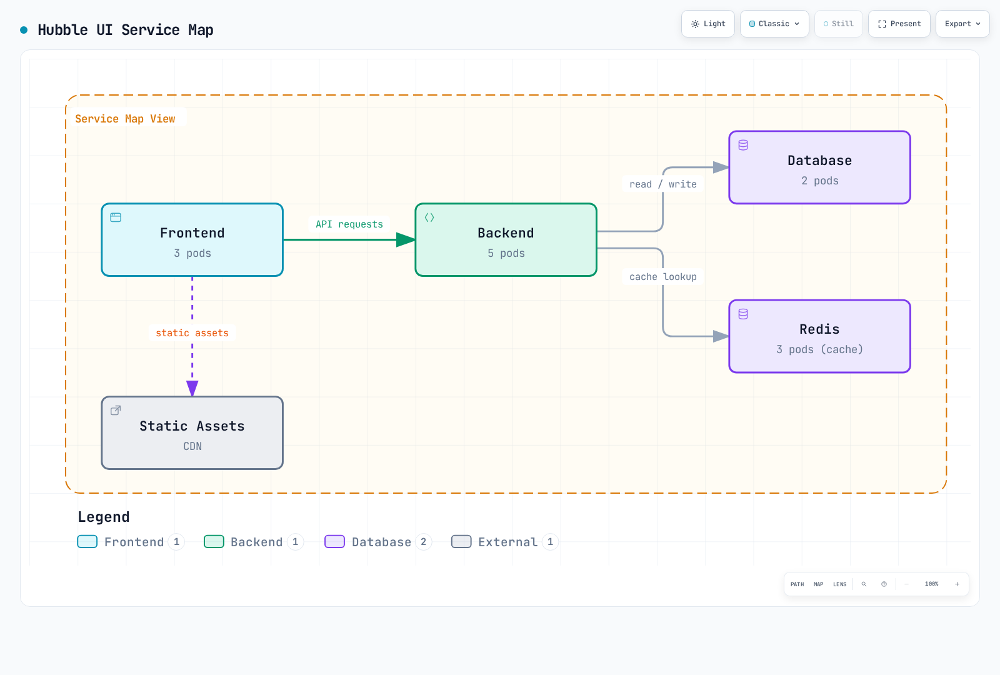
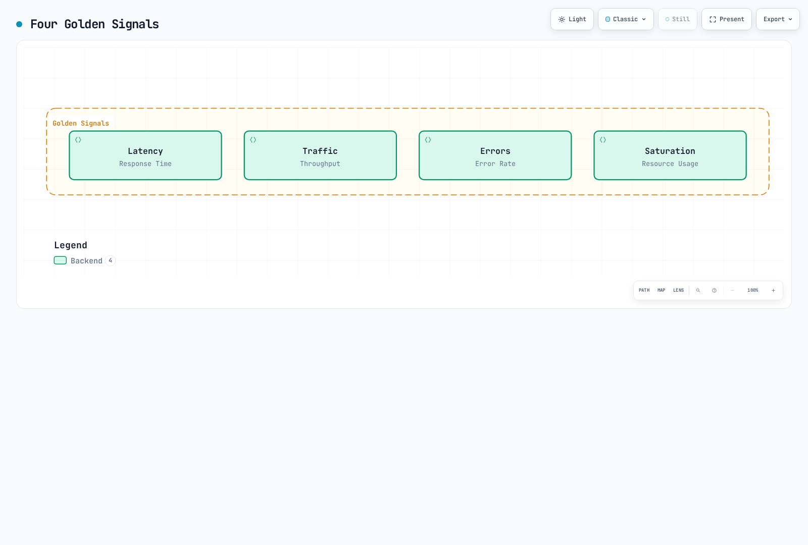

# Cilium 服务网格可观测性

> **最后更新**：2026 年 9 月 11 日 · Cilium/chart 1.20.1 · Hubble CLI 1.19.4 · Collector Contrib 0.160.0 · Loki 3.7.7。Kubernetes/EKS 和平台要求参阅[概述](./README.md)。

## 概述

Hubble 暴露 Cilium 所处理流量的观测。L3/L4 事件来自数据路径；HTTP 可见性还需要受支持的 L7 代理/策略路径。仅启用 Hubble 不会解密任意应用 TLS、发现所有依赖或生成分布式应用追踪。

示例假定 `production` 中工作负载已准备好，且 Cilium 已正确安装。解释可观测内容时，应应用[安全章节](./03-security.md)的加密/ztunnel 限制。

## Hubble 架构


[🔍 查看交互式图表](https://www.atomai.click/kubernetes-docs/archmaps/en-service-mesh-cilium-service-mesh-04-observability-0.html)

图中按组件分组。配置后 Envoy 也提供 L7 事件；eBPF 不是 HTTP 观测的唯一输入。Prometheus 抓取指标，与 Relay 流 API 相互独立。

| 组件 | 作用 |
|---|---|
| Cilium Agent 中的 Observer | 存储并提供每节点有界流历史 |
| Hubble Relay | 聚合已连接 Hubble 服务器的观测 |
| Hubble UI | 展示观测关系和流详情 |
| Hubble CLI | 查询 API 或读取导出的 JSON 记录 |
| Hubble 指标处理器 | 将合格观测转换为 Prometheus 指标 |

观测缓冲区不是长期日志存储。缓冲区满、节点缺失、导出器失败和事件丢失必须与应用健康分开解释。

## Hubble 安装和配置

### 通过 Helm 安装

将此覆盖配置合并到 Cilium 1.20.1 安装的已审核 values。它暴露指标，并启用通过端口转发访问的 Relay/UI。不安装 Prometheus、Grafana、Collector 或 Loki：

```yaml
prometheus:
  enabled: true
hubble:
  enabled: true
  relay:
    enabled: true
    replicas: 1
    resources:
      requests:
        cpu: 100m
        memory: 128Mi
      limits:
        cpu: 1000m
        memory: 1024Mi
  ui:
    enabled: true
    replicas: 1
    ingress:
      enabled: false
  metrics:
    enabled:
    - dns
    - drop
    - tcp
    - flow
    - icmp
    - port-distribution
    - httpV2:labelsContext=source_namespace,source_workload,destination_namespace,destination_workload
  tls:
    enabled: true
    auto:
      enabled: true
      method: cronJob
      certValidityDuration: 365
      schedule: 0 0 1 */4 *
```

资源数量是示例，不是容量规划结果。某些代理配置更改需要受控滚动发布；应用更改前检查渲染工作负载和安装流程。

Hubble 服务器到 Relay 的 mTLS 保护观测传输。UI 入口、面向客户端的 Relay API、指标端点和应用流量有独立 TLS/身份验证设置。公开可达 UI 需要适当访问控制边界；仅 TLS Secret 不是用户身份验证。

此覆盖配置选择 `cronJob` 证书续订。所选 chart 默认有效期为 365 天；TLS 指南也展示显式配置的 1,095 天示例。`method: helm` 可生成证书，但不安排续订。检查证书任务、到期和信任；Hubble 支持证书重新加载，但不能替代续订流程运维。

### 安装 Hubble CLI

此 Unix 示例固定发布版本，选择 Linux/macOS 和 amd64/arm64，下载或校验和失败即停止：

```bash
set -eu
HUBBLE_VERSION=v1.19.4
case "$(uname -s)" in
  Linux) HUBBLE_RELEASE_OS=linux ;;
  Darwin) HUBBLE_RELEASE_OS=darwin ;;
  *) echo "Use the matching release archive for this operating system." >&2; exit 1 ;;
esac
case "$(uname -m)" in
  x86_64|amd64) HUBBLE_RELEASE_ARCH=amd64 ;;
  aarch64|arm64) HUBBLE_RELEASE_ARCH=arm64 ;;
  *) echo "Unsupported architecture for this example." >&2; exit 1 ;;
esac
HUBBLE_ARCHIVE="hubble-${HUBBLE_RELEASE_OS}-${HUBBLE_RELEASE_ARCH}.tar.gz"
HUBBLE_RELEASE_BASE="https://github.com/cilium/hubble/releases/download/${HUBBLE_VERSION}"
curl -fSLO "${HUBBLE_RELEASE_BASE}/${HUBBLE_ARCHIVE}"
curl -fSLO "${HUBBLE_RELEASE_BASE}/${HUBBLE_ARCHIVE}.sha256sum"
if command -v sha256sum >/dev/null 2>&1; then
  sha256sum --check "${HUBBLE_ARCHIVE}.sha256sum"
else
  shasum -a 256 -c "${HUBBLE_ARCHIVE}.sha256sum"
fi
tar -xzf "$HUBBLE_ARCHIVE" hubble
sudo install -m 0755 hubble /usr/local/bin/hubble
hubble version
```

使用适合下载的工作目录。官方发布也提供 Windows amd64/arm64 压缩包；验证公布的 SHA-256 值，并遵循平台安装流程。CLI 平台可用不意味着支持在该操作系统运行 Cilium Linux 数据路径。

### 连接 Relay

```bash
# Terminal 1
cilium hubble port-forward --port-forward 4245
# Terminal 2
hubble status --server localhost:4245
hubble observe --server localhost:4245 --namespace production --last 100
hubble observe --server localhost:4245 --namespace production --follow
```

保留完整状态/错误。成功 grep 到“Hubble”，或示例输出显示三个已连接节点，都不能证明此安装健康。

## Hubble CLI

### 基本用法和过滤

`hubble observe` 通常返回近期缓冲观测。不使用 `--follow` 就不是连续流。`--last` 限制历史数量，Relay 可为每个已连接 Hubble 实例返回该上限。

```bash
hubble observe --pod production/frontend --last 100
hubble observe --from-ip 10.0.1.5 --to-ip 10.0.2.10
hubble observe --to-port 8080
hubble observe --protocol http --http-status '5+'
hubble observe --protocol http --http-status '2+'
hubble observe --http-method POST --http-method PUT
hubble observe --http-path '^/api/v1/users/.*$'
hubble observe --to-label 'k8s:app=backend,k8s:version=v2'
hubble observe --from-namespace production --to-namespace production --from-workload frontend --to-workload backend
hubble observe --to-service production/backend
hubble observe --namespace production --verdict DROPPED --drop-reason-desc POLICY_DENIED
```

重要匹配规则：

- Pod 和 Service 名称是**前缀**，省略命名空间时使用 `default`。
- 使用 `--from-ip` 和 `--to-ip`；旧 `--ip-source`/`--ip-destination` 标志无效。
- HTTP 状态支持精确状态码及 `5+` 等前缀；不接受 `500-599`。
- HTTP 方法值是精确方法选择。POST 或 PUT 需重复标志；`"POST|PUT"` 是字面方法值，不是正则表达式。
- 单个标签选择器字符串内逗号分隔的要求是 AND；重复标签选择器是备选条件。
- Service 过滤器使用从 Service/ClusterIP 派生的元数据。`--from-service frontend` 不是通用的 frontend Service 所属 Pod 过滤器。调用方工作负载使用工作负载/Pod/标签过滤器。
- 带命名空间的 `--to-service production/backend` 独立使用；CLI 拒绝将 `--to-service` 与 `--namespace` 组合。

### 输出格式和保留数据

`json` 和 `jsonpb` 是相同 protobuf JSON 映射的别名。也支持 `dict`、`compact` 和 `table` 显示格式。

```bash
hubble observe --namespace production --last 100 -o json
hubble observe --input-file flows.jsonl --last 100 -o json
hubble observe --since 5m
```

绝对 RFC3339 `--since`/`--until` 时间戳仅查询可用数据。内存缓冲区不会提供数年流历史；需要历史调查时应保留导出。

## Hubble UI

### 服务图



[🔍 查看交互式图表](https://www.atomai.click/kubernetes-docs/archmaps/en-service-mesh-cilium-service-mesh-04-observability-1.html)

UI 关系来自观测流量。安静工作负载、不受支持路径、外部浏览器/CDN 流量和缺失端点元数据可能不出现。缺少边不能证明依赖不存在。

### UI 功能和访问

UI 提供命名空间/裁决过滤、近期流详情和观测服务图。L7 详情需要 L7 可见性。

```bash
kubectl -n kube-system port-forward --address 127.0.0.1 service/hubble-ui 12000:80
# Open http://localhost:12000
```

## L7 流可见性

### HTTP、gRPC 和 DNS

```bash
hubble observe --protocol http --last 100 -o json |
  jq 'select(.flow.l7.type == "RESPONSE") | .flow.l7.http'
hubble observe --protocol http --last 100 -o json |
  jq 'select(.flow.l7.type == "RESPONSE") |
      select((.flow.l7.latency_ns // "0" | tonumber) > 1000000000)'
hubble observe --protocol dns --last 100 -o json |
  jq 'select(.flow.l7.dns.rcode == 3)'
hubble observe --protocol http --http-path '^/myapp[.]UserService/GetUser$'
hubble observe --port 9092
```

JSON 映射将 64 位 `latency_ns` 值编码为**字符串**。数值比较前用 `tonumber` 转换；直接将字符串与 JSON 数字比较会产生错误慢请求结果。

HTTP 响应记录包含响应状态，请求记录可能尚无状态。gRPC 方法可通过 HTTP 路径选择，但 HTTP 200 不意味着应用级 gRPC 成功。需要时单独采集 RPC 结果。

所选 CLI 没有 `--dns-rcode` 标志。检查 JSON 中数值 DNS 响应码；3 表示 NXDOMAIN。`kafka` CLI 过滤器可读取兼容历史数据，但不会恢复 Cilium 1.20.1 已移除的 Kafka L7 处理。端口 9092 过滤提供 L4 观测，不提供主题/操作检查。

## Prometheus 指标

### 启用采集

每个处理器只启用一次。例如 `dns` 输出 DNS 指标族；`dns:query` 添加查询名上下文，不是启用独立查询计数器。将 `dns` 或 `http` 作为独立查询/响应/持续时间条目重复，会尝试注册重叠指标族。

`httpV2` 替代已弃用 `http` 处理器，不能同时启用。其 `hubble_http_requests_total` 计数器使用**响应事件**，包含 `status`，并按请求方向呈现源/目标上下文。它不输出旧 `hubble_http_responses_total` 指标族。

基础覆盖配置显式请求命名空间/工作负载上下文标签。`destination_service` 不是受支持 `labelsContext` 名称。仅在安装 Prometheus Operator CRD/控制器并检查选择器后，才添加实际 Prometheus 采集：

```yaml
prometheus:
  serviceMonitor:
    enabled: true
    labels:
      release: prometheus
    relabelings:
    - sourceLabels:
      - __meta_kubernetes_pod_node_name
      targetLabel: node
      action: replace
      replacement: ${1}
    - targetLabel: cluster
      replacement: example-cluster
      action: replace
hubble:
  metrics:
    serviceMonitor:
      enabled: true
      labels:
        release: prometheus
      relabelings:
      - sourceLabels:
        - __meta_kubernetes_pod_node_name
        targetLabel: node
        action: replace
        replacement: ${1}
      - targetLabel: cluster
        replacement: example-cluster
        action: replace
```

将 `example-cluster` 替换为目标唯一指标标签，将 `release: prometheus` 替换为匹配已安装 Prometheus 选择器的标签。自定义列表时保留节点重标记。以下规则还要求匹配 `ruleSelector`/命名空间选择。

此重标记向抓取目标和样本添加 `cluster`。仅设置 Prometheus `external_labels` 不会给本地查询样本添加该标签。检查实际目标标签；使用 `job="hubble-metrics"` 或 `job="cilium-agent"` 的示例假定常规 Service 派生 job 名称。

### 记录和警报规则

Prometheus 评估这些规则；Alertmanager 处理通知路由。使用依赖查询/仪表板前必须加载记录规则。

```yaml
apiVersion: monitoring.coreos.com/v1
kind: PrometheusRule
metadata:
  name: cilium-hubble-observation
  namespace: monitoring
  labels:
    release: prometheus
spec:
  groups:
  - name: cilium.hubble.httpv2
    rules:
    - record: cilium_hubble:http_responses:rate5m
      expr: sum by (cluster, destination_namespace, destination_workload) (rate(hubble_http_requests_total{reporter="server",cluster!="",destination_namespace!="",destination_workload!=""}[5m]))
    - record: cilium_hubble:http_5xx:rate5m
      expr: 'sum by (cluster, destination_namespace, destination_workload) (rate(hubble_http_requests_total{reporter="server",cluster!="",destination_namespace!="",destination_workload!="",status=~"5.."}[5m]))

        or on (cluster, destination_namespace, destination_workload) (0 * cilium_hubble:http_responses:rate5m)'
    - record: cilium_hubble:http_5xx_percent:rate5m
      expr: '(100 * cilium_hubble:http_5xx:rate5m / cilium_hubble:http_responses:rate5m)

        and on (cluster, destination_namespace, destination_workload) (cilium_hubble:http_responses:rate5m
        > 0)'
    - record: cilium_hubble:http_latency_bucket:rate5m
      expr: sum by (le, cluster, destination_namespace, destination_workload) (rate(hubble_http_request_duration_seconds_bucket{reporter="server",cluster!="",destination_namespace!="",destination_workload!=""}[5m]))
    - alert: HighObservedHTTP5xx
      expr: (cilium_hubble:http_5xx_percent:rate5m > 5) and on (cluster, destination_namespace,
        destination_workload) (cilium_hubble:http_responses:rate5m > 1)
      for: 5m
      labels:
        severity: warning
      annotations:
        summary: High observed HTTP 5xx ratio
        description: '{{ $labels.cluster }}/{{ $labels.destination_namespace }}/{{
          $labels.destination_workload }}: {{ $value }}%'
    - alert: HighObservedHTTPP99
      expr: (histogram_quantile(0.99, cilium_hubble:http_latency_bucket:rate5m) >
        1) and on (cluster, destination_namespace, destination_workload) (cilium_hubble:http_responses:rate5m
        > 1)
      for: 5m
      labels:
        severity: warning
      annotations:
        summary: High observed HTTP latency
        description: '{{ $labels.cluster }}/{{ $labels.destination_namespace }}/{{
          $labels.destination_workload }}: {{ $value }}s'
    - alert: HubbleMetricsScrapeFailed
      expr: up{job="hubble-metrics"} == 0
      for: 5m
      labels:
        severity: warning
      annotations:
        summary: Known Hubble metrics target cannot be scraped
    - alert: CiliumBPFMapPressure
      expr: cilium_bpf_map_pressure > 0.9
      for: 5m
      labels:
        severity: warning
      annotations:
        summary: High pressure in an instrumented BPF map
        description: '{{ $labels.cluster }}/{{ $labels.node }} {{ $labels.map_name
          }}: {{ $value }}'
```

示例选择**服务器/入站观测边界**。客户端/出站观测可能描述同一次交换；混合边界可重复计数。涉及多个网关或 L7 策略时，验证实际代理路径。

仅对匹配的已观测总量，才将缺失 5xx 序列变为零。不会将空闲总量参与除法来制造健康百分比，缺失观测保持缺失。这些比例不覆盖每次 TCP 失败、拒绝请求、缺失响应或应用级失败。

阈值、每秒一条响应下限和五分钟时长是需按工作负载错误预算调整的示例。`up == 0` 检测已知失败抓取目标；缺失目标需要独立清单/就绪检查。映射表压力指标仅覆盖已插桩映射表，策略映射表压力低于报告阈值时可能缺失。

### 关键查询

前三个查询使用上方记录规则。单位和观测范围是指标含义的一部分。

### 观测到的服务器 HTTP 响应/秒

```promql
cilium_hubble:http_responses:rate5m
```

### 观测到的 HTTP5xx 百分比

```promql
cilium_hubble:http_5xx_percent:rate5m
```

### 观测到的 HTTP P99 秒数

```promql
histogram_quantile(0.99, cilium_hubble:http_latency_bucket:rate5m)
```

### Hubble 流丢弃事件/秒

```promql
sum by (cluster, reason) (rate(hubble_drop_total[5m]))
```

### 观测到的 DNS 查询/秒

```promql
sum by (cluster) (rate(hubble_dns_queries_total[5m]))
```

### 观测到的 SYN 标志出现次数/秒

```promql
sum by (cluster) (rate(hubble_tcp_flags_total{flag="SYN"}[5m]))
```

### 观测到的流事件/秒

```promql
sum by (cluster) (rate(hubble_flows_processed_total[5m]))
```

### Cilium 转发字节/秒

```promql
sum by (cluster, node, direction) (rate(cilium_forward_bytes_total[5m]))
```

### Prometheus 抓取成功

```promql
up{job=~"cilium-agent|hubble-metrics"}
```

### 受管理端点数

```promql
cilium_endpoint
```

### 已加载策略数

```promql
cilium_policy
```

### 已插桩 BPF 映射表压力

```promql
cilium_bpf_map_pressure
```

### 最近一次垃圾回收时的 CT 条目数

```promql
cilium_datapath_conntrack_gc_entries
```

### 已安装端点代理重定向

```promql
cilium_proxy_redirects
```

`hubble_flows_processed_total` 统计流事件，不是字节。Hubble 丢弃事件不同于代理数据包计数器。SYN 出现次数包含重传，不是活动连接 gauge。

代理导出 `cilium_endpoint` 和 `cilium_policy`，不是旧 `*_count` 名称。`cilium_datapath_conntrack_gc_entries` 描述垃圾回收运行时观察的条目；旧 `cilium_datapath_conntrack_active`/`max` 比率不是当前文档中的指标对。`cilium_proxy_redirects` 统计已安装重定向，不是请求。BPF 压力和容量指标有自己的映射表标签及报告行为；不要虚构无关利用率分母。

## Grafana 仪表板

### 发布的仪表板

Cilium 在所选版本包含仪表板 JSON。根据启用指标和目标标签审核每个仪表板：通用 Hubble 仪表板仍有旧 HTTP 响应查询，而 HTTP 工作负载仪表板使用 HTTPv2 式数据及集群/工作负载变量。无成功序列时，其成功比例面板也需谨慎处理。

旧 v1.12 仪表板 ID 列表不是匹配本指南版本的安装流程。下方自定义仪表板使用修正记录规则、显式数据源输入、布局和单位。将其导入现有 Grafana 实例，选择匹配 Prometheus 数据源。

### 自定义仪表板示例

```json
{
  "__inputs": [
    {
      "name": "DS_PROMETHEUS",
      "label": "Prometheus",
      "type": "datasource",
      "pluginId": "prometheus",
      "pluginName": "Prometheus"
    }
  ],
  "id": null,
  "uid": "cilium-hubble-observed",
  "title": "Cilium Hubble Observations",
  "tags": [
    "cilium",
    "hubble"
  ],
  "schemaVersion": 38,
  "version": 1,
  "timezone": "browser",
  "time": {
    "from": "now-1h",
    "to": "now"
  },
  "refresh": "30s",
  "panels": [
    {
      "id": 1,
      "title": "Observed HTTP responses/s",
      "type": "timeseries",
      "gridPos": {
        "x": 0,
        "y": 0,
        "w": 12,
        "h": 8
      },
      "datasource": {
        "type": "prometheus",
        "uid": "${DS_PROMETHEUS}"
      },
      "targets": [
        {
          "refId": "A",
          "expr": "cilium_hubble:http_responses:rate5m",
          "legendFormat": "{{cluster}} / {{destination_namespace}} / {{destination_workload}}"
        }
      ],
      "fieldConfig": {
        "defaults": {
          "unit": "reqps"
        },
        "overrides": []
      }
    },
    {
      "id": 2,
      "title": "Observed HTTP5xx (%)",
      "type": "timeseries",
      "gridPos": {
        "x": 12,
        "y": 0,
        "w": 12,
        "h": 8
      },
      "datasource": {
        "type": "prometheus",
        "uid": "${DS_PROMETHEUS}"
      },
      "targets": [
        {
          "refId": "A",
          "expr": "cilium_hubble:http_5xx_percent:rate5m",
          "legendFormat": "{{cluster}} / {{destination_namespace}} / {{destination_workload}}"
        }
      ],
      "fieldConfig": {
        "defaults": {
          "unit": "percent"
        },
        "overrides": []
      }
    },
    {
      "id": 3,
      "title": "Observed HTTP P99",
      "type": "timeseries",
      "gridPos": {
        "x": 0,
        "y": 8,
        "w": 12,
        "h": 8
      },
      "datasource": {
        "type": "prometheus",
        "uid": "${DS_PROMETHEUS}"
      },
      "targets": [
        {
          "refId": "A",
          "expr": "histogram_quantile(0.99, cilium_hubble:http_latency_bucket:rate5m)",
          "legendFormat": "{{cluster}} / {{destination_namespace}} / {{destination_workload}}"
        }
      ],
      "fieldConfig": {
        "defaults": {
          "unit": "s"
        },
        "overrides": []
      }
    },
    {
      "id": 4,
      "title": "Observed flow drops/s",
      "type": "timeseries",
      "gridPos": {
        "x": 12,
        "y": 8,
        "w": 12,
        "h": 8
      },
      "datasource": {
        "type": "prometheus",
        "uid": "${DS_PROMETHEUS}"
      },
      "targets": [
        {
          "refId": "A",
          "expr": "sum by (cluster, reason) (rate(hubble_drop_total[5m]))",
          "legendFormat": "{{cluster}} / {{reason}}"
        }
      ],
      "fieldConfig": {
        "defaults": {
          "unit": "ops"
        },
        "overrides": []
      }
    }
  ]
}
```

仪表板报告观测，不是保证的端到端应用 SLI。数据缺失时，应检查流量、L7 可见性和抓取。

## 服务依赖图

### 依赖提取

此示例对**入站边界观测的 HTTP 请求**分组，保留方向，并避免工作负载元数据缺失时报错：

```bash
hubble observe --namespace production --protocol http --traffic-direction ingress --last 1000 -o json |
  jq -r 'select(.flow.l7.type == "REQUEST") |
    [.flow.source.namespace,
     (.flow.source.workloads[0].name // .flow.source.pod_name // "unknown"),
     .flow.destination.namespace,
     (.flow.destination.workloads[0].name // .flow.destination.pod_name // "unknown")] |
    @tsv' |
  sort | uniq -c | sort -rn
```

计数是选定观测的数量，不自动等于请求速率或完整依赖清单。未知端点和观测路径外依赖需要其他证据。

### 服务图示例


[🔍 查看交互式图表](https://www.atomai.click/kubernetes-docs/archmaps/en-service-mesh-cilium-service-mesh-04-observability-2.html)

图中数字在此没有测量来源。用它解释关系，不用于选择容量或 SLO 阈值。Cilium 可观察到 Kafka 的 L4 流量，但没有 Kafka 主题级可见性。

## 黄金信号监控



[🔍 查看交互式图表](https://www.atomai.click/kubernetes-docs/archmaps/en-service-mesh-cilium-service-mesh-04-observability-3.html)

使用适合服务的信号定义。可用性不属于四个名称之一，但仍需明确 SLI；观测 HTTP 5xx 比例不是完整可用性测量。直方图分位数必须聚合兼容桶并保留 `le`，不能对每实例百分位数求平均。

## OpenTelemetry 集成

### Hubble 流导出

所选 chart 支持静态/动态**文件导出**。旧 `hubble.export.opentelemetry` 和 `fileOutput` 设置不配置 OTLP 发送器。

此示例为涉及 `production` 的观测启用动态导出器，使用有界文件轮换及选定字段：

```yaml
hubble:
  export:
    static:
      enabled: false
    dynamic:
      enabled: true
      config:
        createConfigMap: true
        configMapName: cilium-flowlog-config
        content:
        - name: production
          filePath: /var/run/cilium/hubble/events.log
          fileMaxSizeMb: 10
          fileMaxBackups: 5
          fileCompress: false
          includeFilters:
          - source_pod:
            - production/
          - destination_pod:
            - production/
          excludeFilters: []
          fieldMask:
          - time
          - node_name
          - source.namespace
          - source.pod_name
          - source.workloads
          - destination.namespace
          - destination.pod_name
          - destination.workloads
          - IP
          - l4
          - verdict
          - drop_reason_desc
          - l7.type
          - l7.latency_ns
          - l7.http.code
          - l7.http.method
          - l7.http.protocol
          - l7.dns.rcode
```

两个包含过滤器是备选条件：源或目标位于该命名空间。此字段掩码省略 HTTP URL/标头和工作负载标签；有意选择任何额外字段。导出器启用后，动态配置更新可无需重启代理应用，但初次启用/安装更改仍需适当滚动发布。

轮换是本地文件保留，不是持久集中存储。确认文件写在预期节点，并安排适当日志读取器。

### Collector 配置

以下是 Collector Contrib 0.160.0 **配置**，不是 Deployment。必须为节点本地 Collector DaemonSet 提供对应主机日志目录读取权限、可写持久检查点存储，以及通过 downward API 获取的 `K8S_NODE_NAME`。

```yaml
extensions:
  file_storage:
    directory: /var/lib/otelcol/file_storage
    create_directory: true
receivers:
  filelog/hubble:
    include:
    - /var/run/cilium/hubble/events*.log
    start_at: end
    storage: file_storage
    operators:
    - type: json_parser
      parse_from: body
      parse_to: body
      timestamp:
        parse_from: body.time
        layout_type: gotime
        layout: 2006-01-02T15:04:05.999999999Z07:00
processors:
  memory_limiter:
    check_interval: 1s
    limit_mib: 128
    spike_limit_mib: 32
  resource/hubble:
    attributes:
    - key: service.name
      value: hubble-flow-logs
      action: upsert
    - key: k8s.node.name
      value: ${env:K8S_NODE_NAME}
      action: upsert
  batch:
    timeout: 5s
exporters:
  otlphttp/loki:
    endpoint: https://logs.example.com/otlp
    headers:
      X-Scope-OrgID: example-tenant
    tls:
      ca_file: /etc/otel/tls/backend-ca.crt
service:
  extensions:
  - file_storage
  pipelines:
    logs:
      receivers:
      - filelog/hubble
      processors:
      - memory_limiter
      - resource/hubble
      - batch
      exporters:
      - otlphttp/loki
```

将示意后端地址、租户和 CA 路径替换为实际 Loki OTLP 端点及信任配置。提供所选网关要求的身份验证；`X-Scope-OrgID` 标识租户，不是身份验证。

filelog 接收器解析 JSON 日志正文和时间戳。持久 `file_storage` 检查点保留读取偏移；临时检查点卷可改变重启行为。无保存位置时，`start_at: end` 跳过预先存在内容。它不是重放/导入设置。

Loki 3.7.7 在 `/otlp/v1/logs` 接受 OTLP/HTTP 日志；导出器向 `/otlp` 基础端点追加 `/v1/logs`。Loki 必须支持/启用结构化元数据和兼容存储设置。不要使用已移除 Collector `loki` 导出器。资源属性 `service.name` 变为 Loki 标签 `service_name`；结构化正文仍为日志内容。

流日志、Prometheus 指标和应用追踪是不同信号：

| 信号 | 本指南中的路径 |
|---|---|
| Hubble 流记录 | 文件导出器 → 节点 filelog 接收器 → OTLP/HTTP 日志后端 |
| Hubble/代理指标 | 指标端点 → Prometheus 采集 |
| 应用/Envoy 追踪 | 独立插桩和适当追踪管道/后端 |

旧 Collector `jaeger` 导出器在所选发行版中也不存在。当前 Jaeger 可通过正确配置的追踪管道接收 OTLP 追踪；将流日志指向追踪导出器不会创建分布式追踪。本章 Collector 管道**仅导出日志**。

## 故障排除

### 状态和配置

```bash
cilium status
hubble status --server localhost:4245
kubectl -n kube-system get daemonset cilium
kubectl -n kube-system get deployment hubble-relay hubble-ui
kubectl -n kube-system get configmap cilium-config -o yaml
kubectl -n kube-system get pods -l k8s-app=cilium -o wide
CILIUM_POD='<agent-on-the-node-being-inspected>'
kubectl -n kube-system exec "$CILIUM_POD" -c cilium-agent -- cilium-dbg status --verbose
kubectl -n kube-system exec "$CILIUM_POD" -c cilium-agent -- cilium-dbg bpf ct list global
kubectl -n kube-system logs deployment/hubble-relay --since=10m
```

使用相关节点的 Agent。客户端 `cilium` CLI 不同于代理内 `cilium-dbg` 接口。保留错误和完整状态；grep 输出不是就绪断言。

### 无流或缺失指标

判定数据路径故障前，检查流量生成、保留窗口和过滤器。验证已连接 Hubble 实例及 TLS/证书续订，再区分：

- 命名空间、前缀、方向或协议过滤器错误，导致无匹配观测。
- 未配置受支持 L7 可见性或载荷仍加密，导致无 HTTP 观测。
- Relay/服务器不可用，或指标目标不可访问。
- ServiceMonitor/PrometheusRule 未被已安装 Prometheus 资源选中。
- 缺失上下文/集群标签，或查询针对错误指标处理器。
- 导出/读取器错误、轮换/保留缺口或观测丢失。

不要仅为填充图表而运行无界连接测试循环。为已准备工作负载使用受控流量，并验证每项观测代表什么。

## 后续步骤

- [Ingress 和 Gateway](./05-ingress-gateway.md)
- [最佳实践](./06-best-practices.md)
- [可观测性测验](../../quizzes/service-mesh/cilium-service-mesh/observability.md)

## 参考资料

- [Cilium1.20.1 Hubble 设置](https://github.com/cilium/cilium/blob/v1.20.1/Documentation/observability/hubble/setup.rst)
- [Hubble TLS 和续订](https://github.com/cilium/cilium/blob/v1.20.1/Documentation/observability/hubble/configuration/tls.rst)
- [Hubble 导出](https://github.com/cilium/cilium/blob/v1.20.1/Documentation/observability/hubble/configuration/export.rst)
- [Hubble CLI](https://github.com/cilium/cilium/blob/v1.20.1/Documentation/observability/hubble/hubble-cli.rst)
- [Hubble CLI1.19.4 发布](https://github.com/cilium/hubble/releases/tag/v1.19.4)
- [Hubble UI](https://github.com/cilium/cilium/blob/v1.20.1/Documentation/observability/hubble/hubble-ui.rst)
- [指标定义](https://github.com/cilium/cilium/blob/v1.20.1/Documentation/observability/metrics.rst)
- [HTTP 指标实现](https://github.com/cilium/cilium/blob/v1.20.1/pkg/hubble/metrics/http/handler.go)
- [指标上下文标签](https://github.com/cilium/cilium/blob/v1.20.1/pkg/hubble/metrics/api/context.go)
- [发布的 HTTP 工作负载仪表板](https://github.com/cilium/cilium/blob/v1.20.1/install/kubernetes/cilium/files/hubble/dashboards/hubble-l7-http-metrics-by-workload.json)
- [发布的通用 Hubble 仪表板](https://github.com/cilium/cilium/blob/v1.20.1/install/kubernetes/cilium/files/hubble/dashboards/hubble-dashboard.json)
- [Collector0.160 filelog 接收器](https://github.com/open-telemetry/opentelemetry-collector-contrib/blob/v0.160.0/receiver/filelogreceiver/README.md)
- [Loki3.7.7 OTLP 导入](https://github.com/grafana/loki/blob/v3.7.7/docs/sources/send-data/otel/_index.md)
- [Loki3.7.7 OTLP 映射和端点](https://github.com/grafana/loki/blob/v3.7.7/docs/sources/shared/otel.md)
- [Collector JSON 解析器](https://github.com/open-telemetry/opentelemetry-collector-contrib/blob/v0.160.0/pkg/stanza/docs/operators/json_parser.md)
- [Google SRE 黄金信号](https://sre.google/sre-book/monitoring-distributed-systems/)
