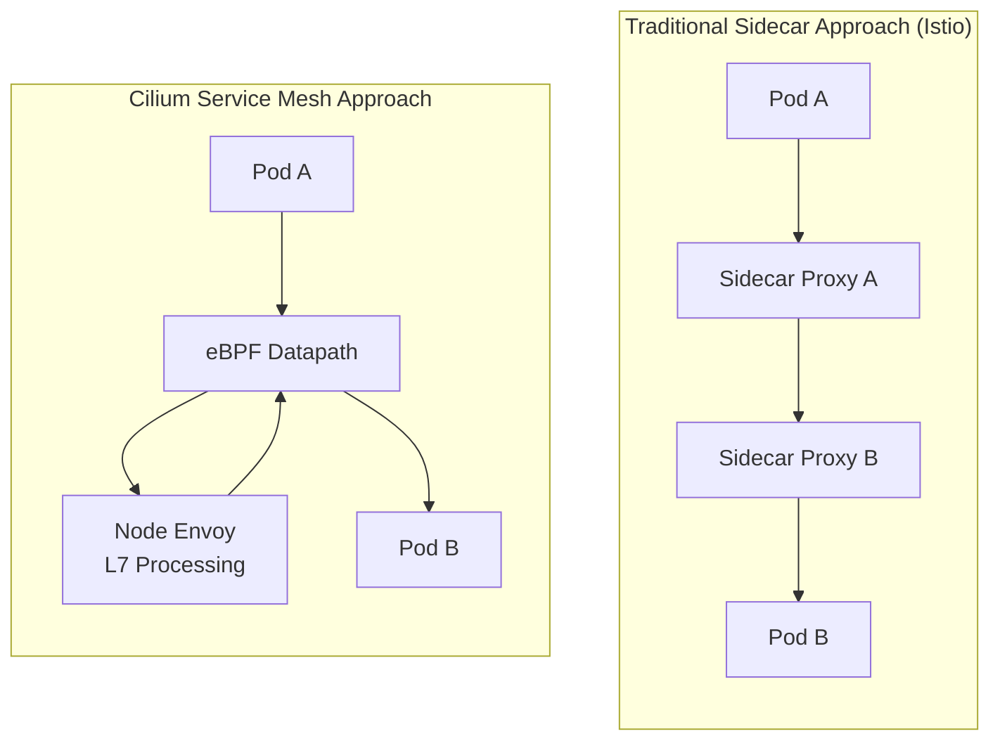
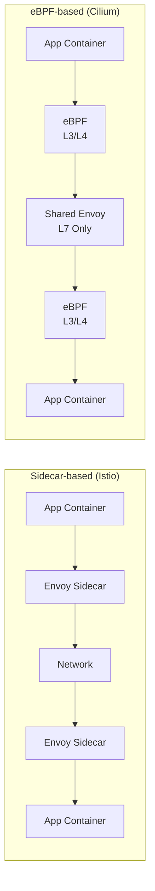
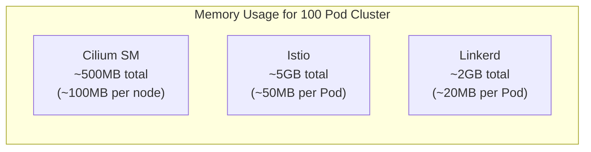

# Cilium Service Mesh 概述

> **支持版本**: Cilium 1.16+, Kubernetes 1.28+
> **最后更新**: February 22, 2026

## 简介

Cilium Service Mesh 是一种基于 eBPF 的无 Sidecar 服务网格解决方案。与传统的 Sidecar 代理方法不同，Cilium Service Mesh 利用 Linux kernel 的 eBPF 技术处理网络流量，并在每个节点使用单个共享的 Envoy 代理来提供 L7 功能。

### 核心价值主张

Cilium Service Mesh 的核心价值在于提供一个**统一的网络和服务网格平台**：

1. **资源效率**：无需承担 Sidecar 代理开销即可使用服务网格功能
2. **低延迟**：通过 eBPF 实现内核级数据包处理
3. **简化运维**：将 CNI 和服务网格集成到单个组件中
4. **渐进式采用**：现有 Cilium CNI 用户可以轻松扩展至服务网格
5. **强大安全性**：基于 SPIFFE 的身份和透明 mTLS 支持

## Sidecar 与无 Sidecar 架构



### 架构对比图



## 服务网格对比

| 功能 | Cilium Service Mesh | Istio | Linkerd |
|---------|---------------------|-------|---------|
| **架构** | eBPF + Node Envoy | Sidecar Envoy | Sidecar linkerd2-proxy |
| **代理** | 每个节点 1 个（仅 L7） | 每个 Pod 1 个 | 每个 Pod 1 个 |
| **内存开销** | 低（~50-100MB/节点） | 高（~50MB/Pod） | 中（~20MB/Pod） |
| **CPU 开销** | 非常低 | 高 | 中 |
| **延迟** | ~0.1-0.5ms | ~1-3ms | ~0.5-1ms |
| **L4 处理** | eBPF（内核） | Envoy（用户空间） | linkerd2-proxy |
| **L7 处理** | Envoy | Envoy | linkerd2-proxy |
| **mTLS** | 透明（eBPF/WireGuard） | Sidecar Envoy | linkerd2-proxy |
| **CNI 集成** | 原生 | 需要单独的 CNI | 需要单独的 CNI |
| **安装复杂度** | 低 | 高 | 中 |
| **Gateway API** | 完全支持 | 完全支持 | 部分支持 |
| **网络策略** | CiliumNetworkPolicy（L3-L7） | AuthorizationPolicy | Server（L4） |
| **可观测性** | Hubble（原生） | Kiali、Jaeger | Linkerd Viz |

### 资源使用对比



## 何时选择 Cilium Service Mesh

### 适用场景

1. **已在使用 Cilium CNI**
   - 利用现有的 Cilium 投资
   - 无需额外组件即可启用服务网格功能
   - 统一运维和监控

2. **资源效率至关重要**
   - 在大型集群中消除 Sidecar 开销
   - 需要优化节点资源
   - 成本降低很重要

3. **低延迟必不可少**
   - 高性能工作负载
   - 实时应用程序
   - 金融/交易系统

4. **希望简化运维**
   - 使用单个组件提供 CNI + 服务网格
   - 无需管理 Sidecar 注入
   - 简化升级和故障排查

### 不适用场景

1. **已有大量 Istio 投资**
   - 已实施复杂的 Istio 策略
   - 依赖 Istio 特定功能

2. **需要广泛的 Envoy 扩展**
   - 每个 Sidecar 的自定义过滤器
   - 精细的每 Pod 代理设置

3. **复杂的多集群网格**
   - 需要 Istio 成熟的多集群功能

## 前置条件

### 验证 Cilium CNI 安装

Cilium Service Mesh 要求先安装 Cilium CNI：

```bash
# Check Cilium status
cilium status

# Expected output
    /¯¯\
 /¯¯\__/¯¯\    Cilium:             OK
 \__/¯¯\__/    Operator:           OK
 /¯¯\__/¯¯\    Envoy DaemonSet:    OK
 \__/¯¯\__/    Hubble Relay:       OK
    \__/       ClusterMesh:        disabled

# Check Cilium version
cilium version
```

### 在 EKS 上安装 Cilium

```bash
# Add Helm repository
helm repo add cilium https://helm.cilium.io/
helm repo update

# Install Cilium on EKS (with service mesh features)
helm install cilium cilium/cilium --version 1.16.0 \
  --namespace kube-system \
  --set eni.enabled=true \
  --set ipam.mode=eni \
  --set egressMasqueradeInterfaces=eth0 \
  --set routingMode=native \
  --set kubeProxyReplacement=true \
  --set loadBalancer.algorithm=maglev \
  --set envoy.enabled=true \
  --set hubble.enabled=true \
  --set hubble.relay.enabled=true \
  --set hubble.ui.enabled=true
```

### 必需组件

| 组件 | 角色 | 是否必需 |
|-----------|------|----------|
| Cilium Agent | eBPF 程序管理、策略实施 | 必需 |
| Cilium Operator | CRD 管理、IPAM | 必需 |
| Envoy (cilium-envoy) | L7 代理处理 | 服务网格必需 |
| Hubble | 可观测性 | 推荐 |
| Hubble Relay | UI/CLI 连接 | 推荐 |
| Hubble UI | 可视化 | 可选 |

## 启用服务网格功能

### 基本启用

```yaml
# values.yaml
envoy:
  enabled: true

# Default configuration for L7 proxy policy enforcement
proxy:
  enabled: true
```

### 完整服务网格配置

```yaml
# values.yaml - Full service mesh features
envoy:
  enabled: true
  resources:
    limits:
      cpu: 2000m
      memory: 2Gi
    requests:
      cpu: 100m
      memory: 256Mi

# Hubble observability
hubble:
  enabled: true
  relay:
    enabled: true
  ui:
    enabled: true
  metrics:
    enabled:
      - dns
      - drop
      - tcp
      - flow
      - icmp
      - http

# Mutual authentication (mTLS)
authentication:
  mutual:
    spire:
      enabled: true
      install:
        enabled: true

# Ingress Controller
ingressController:
  enabled: true
  loadbalancerMode: shared

# Gateway API
gatewayAPI:
  enabled: true
```

## 文档结构

本节的组织如下：

| 文档 | 描述 |
|----------|-------------|
| [架构](./01-architecture.md) | eBPF 数据路径、Node Envoy、CRD 模型 |
| [流量管理](./02-traffic-management.md) | L7 路由、负载均衡、流量拆分 |
| [安全](./03-security.md) | mTLS、网络策略、加密 |
| [可观测性](./04-observability.md) | Hubble、指标、服务地图 |
| [Ingress 与 Gateway](./05-ingress-gateway.md) | Ingress Controller、Gateway API |
| [最佳实践](./06-best-practices.md) | 生产部署、迁移、调优 |

## 快速开始

### 1. 验证服务网格功能

```bash
# Check Envoy DaemonSet
kubectl get daemonset -n kube-system cilium-envoy

# Check Cilium service mesh status
cilium status | grep -E "Envoy|Hubble"
```

### 2. 部署示例应用程序

```yaml
# bookinfo.yaml
apiVersion: v1
kind: Namespace
metadata:
  name: bookinfo
---
apiVersion: apps/v1
kind: Deployment
metadata:
  name: productpage
  namespace: bookinfo
spec:
  replicas: 1
  selector:
    matchLabels:
      app: productpage
  template:
    metadata:
      labels:
        app: productpage
    spec:
      containers:
      - name: productpage
        image: docker.io/istio/examples-bookinfo-productpage-v1:1.18.0
        ports:
        - containerPort: 9080
---
apiVersion: v1
kind: Service
metadata:
  name: productpage
  namespace: bookinfo
spec:
  selector:
    app: productpage
  ports:
  - port: 9080
    targetPort: 9080
```

### 3. 应用 L7 策略

```yaml
# l7-policy.yaml
apiVersion: cilium.io/v2
kind: CiliumNetworkPolicy
metadata:
  name: productpage-l7
  namespace: bookinfo
spec:
  endpointSelector:
    matchLabels:
      app: productpage
  ingress:
  - fromEndpoints:
    - matchLabels:
        app: frontend
    toPorts:
    - ports:
      - port: "9080"
        protocol: TCP
      rules:
        http:
        - method: GET
          path: "/productpage"
        - method: GET
          path: "/health"
```

### 4. 观察流量

```bash
# Observe L7 traffic with Hubble CLI
hubble observe --namespace bookinfo -f

# Filter HTTP requests
hubble observe --namespace bookinfo --protocol http

# Check inter-service flows
hubble observe --namespace bookinfo --to-service productpage
```

## 后续步骤

1. **[架构](./01-architecture.md)**：了解 Cilium Service Mesh 的内部工作原理。
2. **[流量管理](./02-traffic-management.md)**：配置 L7 路由和流量控制。
3. **[安全](./03-security.md)**：设置 mTLS 和 L7 网络策略。

## 参考资料

- [Cilium 官方文档](https://docs.cilium.io/)
- [Cilium Service Mesh 指南](https://docs.cilium.io/en/stable/network/servicemesh/)
- [eBPF 简介](https://ebpf.io/)
- [Gateway API 文档](https://gateway-api.sigs.k8s.io/)
