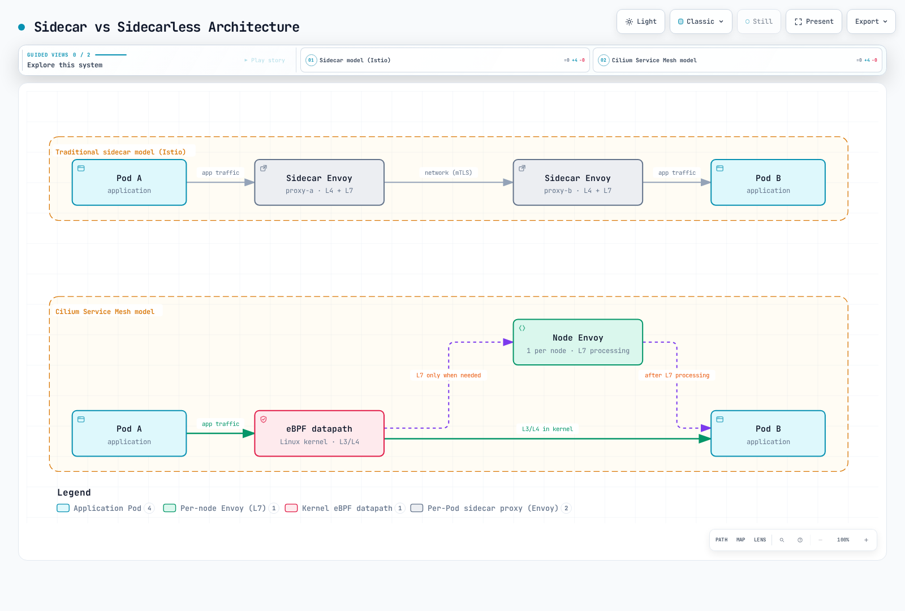

# Cilium 服务网格概述

> **最后更新**：2026 年 9 月 11 日 · Cilium/chart 1.20.1 · CLI 0.20.0 · Hubble CLI 1.19.4

Cilium 结合 Kubernetes 网络、eBPF 策略/负载均衡及可选应用层代理功能。选定 L7 流量由 Cilium Envoy 集成处理；移除每应用 Sidecar 不会移除代理、内核要求或运维组件。

## 架构和安全边界



[查看交互式图表](https://www.atomai.click/kubernetes-docs/archmaps/en-service-mesh-cilium-service-mesh-readme-0.html)

Envoy 可作为 Cilium 代理旁的进程运行，也可作为独立管理的 `cilium-envoy` DaemonSet。所选 chart 的常规渲染配置使用专用 DaemonSet。实际放置和 L7 跳数取决于启用的功能/策略；并非每个数据包都经过 Envoy。

| 组件 | 作用 |
|---|---|
| Cilium agent | 节点数据路径、端点身份和策略执行 |
| Cilium operator | 所选模式的 IPAM 及其他集群/控制器职责 |
| Envoy | 匹配的 L7 策略、入口和 Gateway API 处理 |
| Hubble | 流观测；L7 记录需要相关代理可见性 |
| Hubble Relay / UI | 额外聚合和可视化组件 |
| SPIRE（配置后） | beta 双向身份验证功能的身份基础设施 |

### 双向身份验证不等于自动流量加密

Cilium 1.20.1 文档将**带外双向身份验证标为 beta 且未完成**。基于 mTLS 的身份握手在代理之间带外执行，针对 Cilium 安全身份。这不会将每个应用连接封装为与 Istio 或 Linkerd 工作负载代理相同的 TLS 传输模型。

WireGuard/IPsec 是独立加密机制，各有受支持模式和范围。WireGuard 不是 TLS，仅启用 SPIRE 不会加密应用数据或为每个端点激活身份验证规则。所选版本还说明，双向身份验证不兼容 ClusterMesh 或外部网格 mTLS 方案。

Cilium 1.20.1 还提供独立的 [ztunnel 透明加密 beta](https://github.com/cilium/cilium/blob/v1.20.1/Documentation/security/network/encryption-ztunnel.rst)，通过 `encryption.type: ztunnel` 选择。它以命名空间纳管提供 TCP 工作负载 mTLS；两端均必须纳管。它排除 ClusterMesh 和主机网络 Pod，发布指南警告：除针对 HBONE 端口 15008 外，普通 L4 策略在此路径不工作。这是独立部署选择，有自己的 CA/引导要求。

采用此 beta 路径前，审核[安全指南](03-security.md)和发布安全模型/限制。将路由、身份验证、授权和加密视为不同要求。

Cilium 也可为 Istio 部署提供底层 CNI。此网络集成不意味着身份验证机制可互换；审核模式专属套接字负载均衡、CNI 共存和 L7 策略所有权。

## 比较能力和实测成本

| 主题 | Cilium | Istio | Linkerd |
|---|---|---|---|
| 数据平面模型 | eBPF 加处理选定 L7 工作的共享 Envoy | Sidecar 模式，或 Ambient ztunnel/waypoint 角色 | 每 Pod 代理，包括原生 Sidecar 放置 |
| Pod 网络 | 根据模式提供 CNI 或与 CNI 链接 | 需要底层 Pod 网络；其 CNI 重定向网格流量 | 需要底层 Pod 网络；可选 CNI 重定向网格流量 |
| 策略 | Kubernetes/Cilium 网络策略和 L7 功能 | 网格授权/路由，另有独立网络策略层 | Server/路由授权和出站路由，不是仅 L4 策略 |
| Gateway API | 选择启用的控制器及文档规定的一致性/功能 | 网关和网格路由角色 | 支持以 Service/Server 为父对象的路由角色 |
| 安全 | 带外身份验证及独立加密；另有受限制的 ztunnel mTLS beta | 工作负载网格 mTLS 加策略 | 工作负载网格 mTLS 加策略 |

没有产品拥有独立于工作负载和配置的通用 CPU、内存或延迟排名。旧的固定每节点/每 Pod 数值和 100 Pod 内存图不是有来源的基准测试，且遗漏组件、节点数和工作负载细节。针对同一基线比较实测增量成本，包括代理、控制器、遥测和身份基础设施。

Cilium 网络模型和所需 L7 功能适合环境时，尤其已有 Cilium 运维经验时，它可能很有用。评估 CNI 迁移、内核/平台支持、共享节点故障影响、安全要求和现有策略依赖。“无 Sidecar”和“eBPF”都不能证明金融/实时工作负载达到延迟或成本目标。

更广泛能力边界参阅持续维护的[服务网格比较](../istio/comparison/01-service-mesh-comparison.md)。

## 版本和平台前提条件

对于所选版本：

- 通用 Kubernetes 端到端兼容列表为 **1.33–1.36**。发布的 EKS CI 文件列出 **1.33–1.35**，默认 1.35。这是不同证据集；更新/未列出提供商组合需要单独验证。
- Helm chart 宽松的 `kubeVersion >=1.21.0-0` 不是已测试支持矩阵，较新 Kubernetes 版本不会自动被覆盖。
- 主机需要受支持 AMD64/AArch64 Linux，通常为内核 5.10 或更新版本，或文档规定的等效回移版本。L7 重定向及其他高级功能有额外内核/模块要求。
- 此 Cilium 版本的 Gateway API 参考为 **v1.6.1**。更改前检查必需/可选 CRD 和 1.20 TLSRoute 升级说明；不要未经兼容性审核就替换为目录最新版。

```bash
cilium version --client
cilium version
cilium status --wait --wait-duration 5m
kubectl -n kube-system get daemonset cilium
# For the dedicated Envoy mode selected below:
kubectl -n kube-system get daemonset cilium-envoy
```

CLI 自身版本与运行中 Cilium 镜像版本是不同信息。保留完整状态输出和失败；grep 匹配“Envoy”或“Hubble”不能证明就绪。嵌入模式下没有专用 Envoy DaemonSet 可能符合预期。

### EKS 安装选择

| 模式/平台 | 必须区分的内容 |
|---|---|
| Cilium AWS ENI 模式 | Cilium 管理 ENI IPAM/原生路由；需要 IAM、路由和节点/Pod 纳管规划。通用 1.20.1 ENI 参考记录 IPv6 Beta，但 EKS 安装页面仍称仅 IPv4；此处使用 IPv4 示例，单独验证平台专属 IPv6 前提条件/支持 |
| AWS VPC CNI 链式模式 | AWS VPC CNI 保留接口/IPAM 职责；Cilium 随后附加数据路径；必须评估高级 L7/IPsec 限制 |
| EKS Fargate | 不支持替代 CNI；必须使用 AWS VPC CNI |
| EKS Auto Mode | 不支持替代 CNI 和网络策略插件 |
| EKS Hybrid Nodes | 遵循独立 AWS 支持的 Cilium 版本/配置/能力指南，不使用 EC2 ENI 参数 |

AWS 对 EC2 节点 CNI 的支持限于 Amazon VPC CNI；其他兼容 CNI 需要自身运维/厂商支持。不能从通用 Cilium 兼容表推断独立 Hybrid Nodes 支持边界。

一行 Helm install 不是现有 AWS VPC CNI 集群的迁移计划。应通过经过测试的流程处理 API 引导访问、kube-proxy 替代、CNI 所有权、IAM、节点就绪污点和原有未管理 Pod 的重建。本次审计未创建集群或替换 CNI。

## 启用所选功能

对于已正确安装的 Cilium 部署，将此功能覆盖配置保存为 `cilium-mesh-features.yaml`：

```yaml
l7Proxy: true
envoy:
  enabled: true
hubble:
  enabled: true
  relay:
    enabled: true
  ui:
    enabled: true
```

受支持 L7 标志为 `l7Proxy`；`proxy.enabled` 不是其替代。原生 chart 检查确认 `proxy.enabled:false` 仍启用 L7，而 `l7Proxy:false` 禁用它。

```bash
set -euo pipefail
umask 077
helm repo add cilium https://helm.cilium.io/
helm repo update cilium
# Preview only: reviewed-cni-values.yaml must describe the existing intended CNI mode.
helm template cilium cilium/cilium --version 1.20.1 \
  --namespace kube-system --kube-version 1.35.0 \
  -f reviewed-cni-values.yaml -f cilium-mesh-features.yaml \
  > cilium-mesh-rendered.yaml
```

此操作预览示例兼容 Kubernetes 版本，并与安装已审核 CNI values 合并。检查结果，在现有所有者管理下遵循该版本受支持升级流程。它不是完整 CNI 安装，也不是更改网络模式的许可。

| 可选能力 | 额外要求 |
|---|---|
| Gateway API | kube-proxy 替代、L7 代理、必需 v1.6.1 CRD 及适当负载均衡器/主机网络设计 |
| Ingress 控制器 | 其受支持配置和暴露模型；不会自动处理所有网格流量 |
| Hubble 指标 | 所选指标族和已配置采集器；Relay/UI 本身不创建 Prometheus |
| 双向身份验证 | beta 审查、显式启用、SPIRE/存储/连通性、适用身份验证策略和单独评估的加密 |

对于**隔离的 beta 身份验证评估**，必须包含旧示例缺失的顶层标志：

```yaml
authentication:
  enabled: true
  mutual:
    spire:
      enabled: true
      install:
        enabled: true
```

没有 `authentication.enabled:true` 时，chart 拒绝 SPIRE 集成。提供的 SPIRE 服务器默认使用持久存储，因此合适 PVC 预置是前提。此片段不确立生产安全、跨集群身份验证或加密应用流量。

## L7 策略和观测示例

在 `bookinfo` 中准备 Cilium 管理、带 `app:productpage` 标签的 HTTP 应用，以及同命名空间 Cilium 管理、带 `app:frontend` 标签的客户端。若使用 Bookinfo，部署其完整必需应用依赖；仅 productpage Deployment 不是完整 Bookinfo 应用。使用已验证镜像和适合应用的就绪检查。

以下策略选择该端点，并允许所示客户端/方法/路径组合。它不创建任一工作负载：

```yaml
apiVersion: cilium.io/v2
kind: CiliumNetworkPolicy
metadata:
  name: productpage-l7
  namespace: bookinfo
spec:
  endpointSelector:
    matchLabels:
      k8s:app: productpage
  ingress:
  - fromEndpoints:
    - matchLabels:
        k8s:app: frontend
        k8s:io.kubernetes.pod.namespace: bookinfo
    toPorts:
    - ports:
      - port: '9080'
        protocol: TCP
      rules:
        http:
        - method: GET
          path: ^/productpage$
        - method: GET
          path: ^/health$
```

通过策略所有者应用前，评估其他策略及预期默认拒绝效果。示例允许两条路径，不是完整浏览器流程所需全部静态资源或依赖。身份验证/加密与此 L7 允许策略独立。

```bash
# Keep this terminal running; configure the intended kube context first.
cilium hubble port-forward --port-forward 4245

# In another terminal, use the selected Hubble CLI:
hubble status --server localhost:4245
hubble observe --server localhost:4245 --namespace bookinfo --protocol http --follow
# Service-name filters are an alternative to --namespace in this CLI.
hubble observe --server localhost:4245 --to-service bookinfo/productpage
```

所选 Hubble CLI 拒绝组合 `--namespace` 和 `--to-service`。使用命名空间观测，或带命名空间的服务名前缀。L7 记录需要实际匹配流量和代理可见性；L7 代理前发生的丢弃可能需要更广流/丢弃检查。未观察到流不能证明应用路径被允许、被拒绝或健康。

## 文档结构和参考资料

| 指南 | 范围 |
|---|---|
| [架构](01-architecture.md) | 数据路径、Envoy 和 API 模型 |
| [流量管理](02-traffic-management.md) | 路由和负载均衡 |
| [安全](03-security.md) | 策略、身份验证和加密边界 |
| [可观测性](04-observability.md) | Hubble 和指标 |
| [Ingress/Gateway](05-ingress-gateway.md) | 外部流量和 Gateway API |
| [最佳实践](06-best-practices.md) | 运维、迁移和验证 |

- [发布的 Kubernetes 兼容性](https://github.com/cilium/cilium/blob/v1.20.1/Documentation/network/kubernetes/compatibility.rst)
- [系统要求](https://github.com/cilium/cilium/blob/v1.20.1/Documentation/operations/system_requirements.rst)
- [Cilium 网络与 Istio](https://github.com/cilium/cilium/blob/v1.20.1/Documentation/network/servicemesh/istio.rst)
- [Envoy 模式](https://github.com/cilium/cilium/blob/v1.20.1/Documentation/security/network/proxy/envoy.rst)
- [双向身份验证限制](https://github.com/cilium/cilium/blob/v1.20.1/Documentation/network/servicemesh/mutual-authentication/mutual-authentication.rst)
- [Gateway API 前提条件](https://github.com/cilium/cilium/blob/v1.20.1/Documentation/network/servicemesh/gateway-api/installation.rst)
- [EKS ENI 要求](https://github.com/cilium/cilium/blob/v1.20.1/Documentation/installation/requirements-eks.rst)和 [AWS VPC CNI 链式模式](https://github.com/cilium/cilium/blob/v1.20.1/Documentation/installation/cni-chaining-aws-cni.rst)
- [EKS 替代 CNI](https://docs.aws.amazon.com/eks/latest/userguide/alternate-cni-plugins.html)和 [Hybrid Nodes CNI](https://docs.aws.amazon.com/eks/latest/userguide/hybrid-nodes-cni.html)
- [Cilium 1.20.1 ENI IPAM / IPv6 Beta](https://github.com/cilium/cilium/blob/v1.20.1/Documentation/network/concepts/ipam/eni.rst)
