# 基本概念

本文档介绍 Istio 的核心概念和架构。理解这些基本概念对于有效使用 Istio 至关重要。

## 目录

1. [背景与历史](02-basic-concepts.md#background-and-history)
2. [为什么选择 Istio？](02-basic-concepts.md#why-istio)
3. [Istio 架构](02-basic-concepts.md#istio-architecture)
4. [部署模式：Sidecar 与 Ambient](02-basic-concepts.md#deployment-modes-sidecar-vs-ambient)
5. [核心资源](02-basic-concepts.md#core-resources)
6. [流量管理概念](02-basic-concepts.md#traffic-management-concepts)
7. [安全概念](02-basic-concepts.md#security-concepts)
8. [可观测性概念](02-basic-concepts.md#observability-concepts)
9. [Namespace 与服务网格](02-basic-concepts.md#namespaces-and-service-mesh)
10. [后续步骤](02-basic-concepts.md#next-steps)

## 背景与历史

### 服务网格的诞生

#### 微服务的挑战

2010 年代初，企业开始将单体应用拆分为微服务。

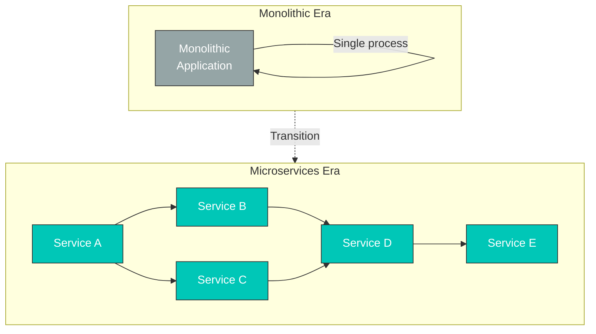

**新问题**：

| 问题                         | 说明                                  | 影响                         |
| ------------------------------- | -------------------------------------------- | ------------------------------ |
| **服务间通信** | 网络调用增加                      | 延迟、故障传播   |
| **可观测性**               | 需要分布式追踪                 | 调试困难            |
| **安全性**                    | 服务间认证/加密 | mTLS 实现复杂度 |
| **流量控制**             | 金丝雀部署、A/B 测试              | 应用代码修改 |
| **故障处理**            | Circuit Breaker、重试                       | 每个服务分别实现     |

#### 早期解决方案：库

**问题**：

* 每种语言都需要开发库（Java 使用 Hystrix、Go 使用单独的库……）
* 与应用代码紧密耦合
* 更新时需要重新部署所有服务
* 版本管理复杂

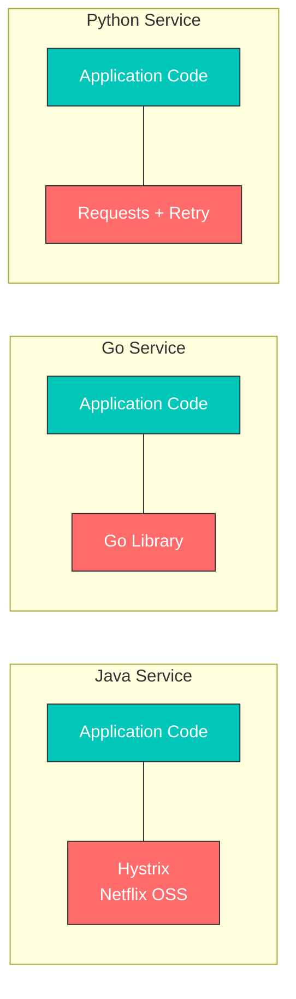

**服务网格理念**：将网络逻辑从应用中移至基础设施层

### Envoy Proxy 的诞生

#### Lyft 面临的问题

**2015 年，Lyft** 面临以下问题：

* 运营 200 多个微服务
* 使用多种语言和框架（Python、Go、Java 等）
* 现有代理（HAProxy、NGINX）无法满足需求
  * 难以动态更改配置
  * 缺乏可观测性
  * 高级路由功能有限

#### Matt Klein 与 Envoy

**Matt Klein**（Lyft 工程师）于 2016 年将 Envoy 开源。

**Envoy 解决的问题**：

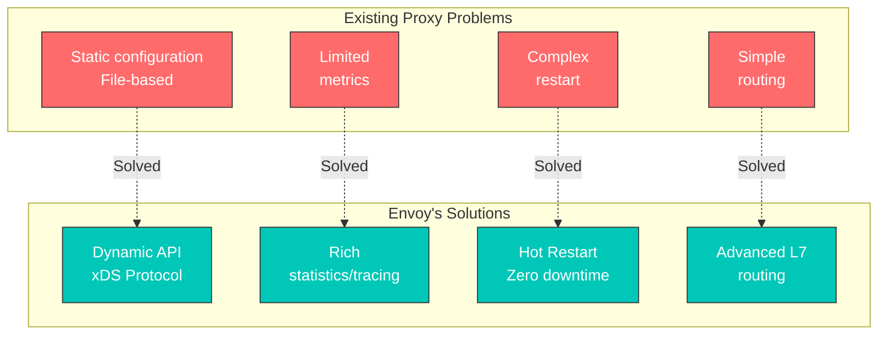

**Envoy 的主要功能**：

1. **进程外架构**：与应用分离的独立进程
2. **xDS API**：动态配置更新
3. **L7 代理**：支持 HTTP/2、gRPC、WebSocket
4. **可观测性**：详细指标、追踪、日志
5. **性能**：使用 C++ 编写，性能优异

#### CNCF 采纳

**时间线**：

* **2016 年 9 月**：Envoy 开源
* **2017 年 9 月**：被接纳为 CNCF 项目（Incubating）
* **2018 年 11 月**：晋升为 CNCF Graduated 项目

### Istio 的诞生与历史

#### Google、IBM、Lyft 合作

**2017 年 5 月**，Google、IBM 和 Lyft 共同宣布 Istio。

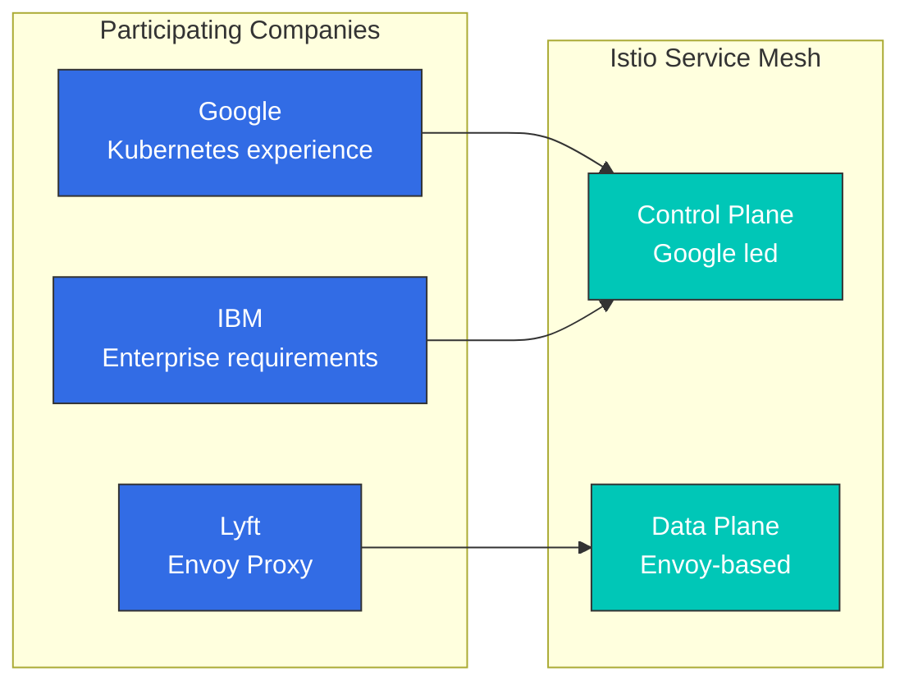

**各公司的贡献**：

| 公司    | 主要贡献    | 原因                           |
| ---------- | -------------------- | -------------------------------- |
| **Google** | Control Plane 设计 | Borg、Kubernetes 经验      |
| **IBM**    | 企业功能  | 企业客户需求 |
| **Lyft**   | Envoy Proxy          | 经过生产验证的代理          |

#### Istio 版本历史

**主要里程碑**：

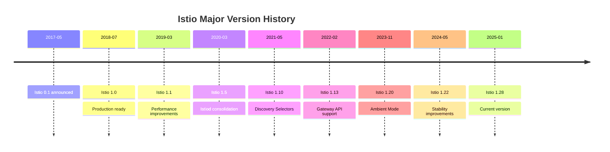

**版本 1.5（2020 年 3 月）——重要转折点**：

之前的架构（Istio 1.4 及更早版本）：

```
Separated into individual components:
- Mixer (policy/telemetry)
- Pilot (traffic management)
- Citadel (certificate management)
- Galley (configuration validation)
```

新架构（Istio 1.5+，当前为 1.28）：

```
Istiod (consolidated into single binary)
├── Pilot functionality (Service Discovery, Traffic Management)
├── Citadel functionality (Certificate Authority, Identity)
└── Galley functionality (Configuration Validation)

Mixer completely removed (functionality moved to Envoy)
```

**变更原因**：

* 降低复杂性（4 个组件 → 1 个）
* 提升性能（移除 Mixer 后延迟降低 50%）
* 简化运维（管理单一进程）
* 提高资源效率（降低内存、CPU 使用量）

## 为什么选择 Istio？

Kubernetes 提供容器编排功能，但在管理微服务之间的复杂通信方面存在局限。Istio 是用于解决这些问题的服务网格解决方案。

### 微服务的挑战

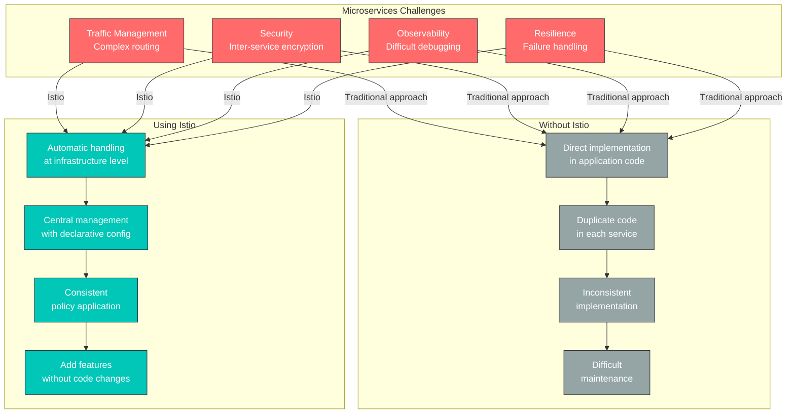

### Istio 提供的核心价值

#### 1. 流量管理

**问题**：部署新版本时，希望安全地切换流量。

**Istio 解决方案**：

```yaml
# Canary deployment without code changes
apiVersion: networking.istio.io/v1
kind: VirtualService
metadata:
  name: reviews
spec:
  hosts:
  - reviews
  http:
  - route:
    - destination:
        host: reviews
        subset: v1
      weight: 90  # Existing version 90%
    - destination:
        host: reviews
        subset: v2
      weight: 10  # New version 10%
```

**优势**：

* 无需修改应用代码
* 可实时调整流量拆分
* 支持自动回滚
* 支持 A/B 测试、Blue/Green 部署

#### 2. 安全性

**问题**：希望加密并认证服务间通信。

**Istio 解决方案**：

```yaml
# Automatic mTLS enablement
apiVersion: security.istio.io/v1
kind: PeerAuthentication
metadata:
  name: default
  namespace: istio-system
spec:
  mtls:
    mode: STRICT  # Automatic encryption for all inter-service communication
```

**优势**：

* 自动签发和续订证书
* 自动验证服务身份
* 细粒度权限控制
* 实现 Zero Trust 网络

#### 3. 可观测性

**问题**：难以追踪跨越数十个微服务的请求流。

**Istio 解决方案**：

* 自动生成指标（Latency、Traffic、Errors、Saturation）
* 分布式追踪
* 服务拓扑可视化

**优势**：

* 自动识别瓶颈
* 快速识别错误根因
* 实时监控服务状态

#### 4. 弹性

**问题**：一个服务的故障会传播至整个系统。

**Istio 解决方案**：

```yaml
# Automatic Circuit Breaker configuration
apiVersion: networking.istio.io/v1
kind: DestinationRule
metadata:
  name: reviews
spec:
  host: reviews
  trafficPolicy:
    outlierDetection:
      consecutiveErrors: 5
      interval: 30s
      baseEjectionTime: 30s
```

**优势**：

* 故障隔离（Circuit Breaker）
* 自动重试和超时
* 自动移除不健康实例
* 流量限制（Rate Limiting）

### 何时使用 Istio

**✅ 适合使用 Istio 的情况：**

1. **微服务架构**
   * 10 个或更多服务
   * 服务之间存在复杂依赖关系
   * 频繁部署
2. **需要高级流量管理**
   * 金丝雀部署、A/B 测试
   * 细粒度路由控制
   * Traffic Mirroring
3. **安全要求高**
   * 必须加密服务间通信
   * 细粒度访问控制
   * 合规要求
4. **可观测性和调试**
   * 复杂服务间问题跟踪
   * 性能瓶颈识别
   * SLO/SLA 监控

**❌ Istio 可能大材小用的情况：**

1. **简单应用**
   * 服务数量较少（少于 5 个）
   * 需求简单
   * Kubernetes Ingress 已足够
2. **资源受限**
   * 小型集群
   * 无法承受资源开销
   * Sidecar 内存成本负担较重
3. **缺乏运维能力**
   * 学习时间不足
   * 没有专门的平台团队
   * 更偏好简单的解决方案

### 替代方案对比

#### Kubernetes Ingress 与 Istio

| 功能           | Kubernetes Ingress | Istio                             |
| ----------------- | ------------------ | --------------------------------- |
| **范围**         | 外部 → 集群 | 外部 + 内部服务间通信 |
| **路由**       | 基础（Path、Host） | 高级（Header、Cookie 等）   |
| **mTLS**          | 手动设置       | 自动                         |
| **可观测性** | 有限            | 丰富                              |
| **复杂性**    | 低                | 高                              |
| **使用场景**      | 简单应用        | 微服务                     |

#### AWS VPC Lattice 与 Istio

有关详细对比，请参阅 [AWS 集成](04-aws-integration.md#istio-vs-other-solutions-comparison)文档。

**快速总结：**

* **VPC Lattice**：AWS 托管、简单、支持跨 VPC/账户通信
* **Istio**：开源、功能强大、仅限 Kubernetes、支持细粒度控制

#### Linkerd 与 Istio

| 属性           | Istio     | Linkerd            |
| ------------------ | --------- | ------------------ |
| **复杂性**     | 高      | 低                |
| **功能**       | 非常丰富 | 仅核心功能 |
| **资源**      | 高      | 低                |
| **学习曲线** | 陡峭     | 平缓             |
| **社区**      | 大     | 小              |

**选择指南：**

* 需要高级功能和灵活性 → **Istio**
* 需要简单轻量的网格 → **Linkerd**

## 部署模式：Sidecar 与 Ambient

Istio 支持两种部署模式：**Sidecar Mode** 和 **Ambient Mode**。

### Sidecar Mode（默认）

将 Envoy proxy 作为 sidecar container 注入到每个应用 Pod 中。

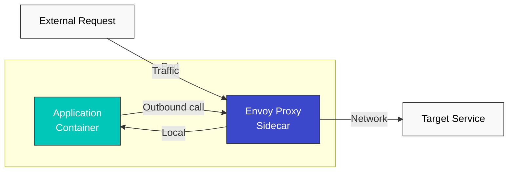

**优点：**

* 成熟稳定
* 支持所有 Istio 功能
* 可按 Pod 进行细粒度控制

**缺点：**

* 资源开销（每个 Pod 一个 Envoy）
* 启动时间增加（Init Container）
* 权限设置复杂（iptables）

### Ambient Mode（新方法）

在没有 sidecar 的情况下于节点级别处理流量。

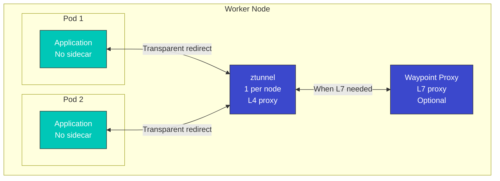

**优点：**

* 资源使用量低（每个节点 1 个）
* Pod 启动快速
* 运维简单
* 可逐步应用 L7 功能

**缺点：**

* 技术相对较新（成熟度较低）
* 部分高级功能受限
* 难以按 Pod 进行细粒度控制

### 对比表

| 属性                   | Sidecar Mode                | Ambient Mode                   |
| -------------------------- | --------------------------- | ------------------------------ |
| **资源使用量**         | 高（每个 Pod）              | 低（每个节点）                 |
| **启动时间**           | 慢（Init Container）       | 快                           |
| **运维复杂度** | 高                        | 低                            |
| **L4 功能**            | 支持                   | 支持                      |
| **L7 功能**            | 完全支持                | 可选（Waypoint）            |
| **成熟度**               | 高                        | 中等                         |
| **迁移**              | -                           | 可从现有 sidecar 迁移 |
| **推荐用途**        | 需要高级 L7 功能 | 优先考虑资源效率   |

### 选择指南

**选择 Sidecar Mode：**

* 需要使用所有 Istio 功能
* 需要按 Pod 进行细粒度策略控制
* 需要经过生产验证的稳定性

**选择 Ambient Mode：**

* 资源效率很重要
* 仅需要简单的 L4 功能
* 计划逐步添加 L7 功能

**有关详细信息**，请参阅 [进阶：Ambient Mode](advanced/01-ambient-mode.md)文档。

## Istio 架构

Istio 由两个主要组件组成：**Control Plane** 和 **Data Plane**。

| 组件                    | 说明                                                                                                  |
| ---------------------------- | ------------------------------------------------------------------------------------------------------------ |
| **Control Plane (istiod)**   | 负责服务发现、配置分发和证书管理的中央控制系统 |
| **Data Plane (Envoy Proxy)** | 作为 sidecar 部署在每个 Pod 中，处理实际流量（路由、mTLS、指标）                             |

**有关详细的架构结构、内部工作原理和流量拦截机制**，请参阅[架构文档](03-architecture.md)。

## 核心资源

Istio 使用 Kubernetes Custom Resource Definitions (CRDs) 管理配置。

### 1. VirtualService

VirtualService 定义请求如何路由到服务。

```yaml
apiVersion: networking.istio.io/v1
kind: VirtualService
metadata:
  name: reviews-route
spec:
  hosts:
  - reviews  # Target service
  http:
  - match:
    - headers:
        end-user:
          exact: jason
    route:
    - destination:
        host: reviews
        subset: v2  # Route specific user to v2
  - route:
    - destination:
        host: reviews
        subset: v1  # Route to v1 by default
```

**主要功能**：

* 基于路径的路由（Path、Header、Query Parameter）
* 流量拆分（Canary、A/B 测试）
* Retry、Timeout、Fault Injection
* URL Rewrite、Header 操作

### 2. DestinationRule

DestinationRule 定义服务子集（版本）并应用流量策略。

```yaml
apiVersion: networking.istio.io/v1
kind: DestinationRule
metadata:
  name: reviews-destination
spec:
  host: reviews
  trafficPolicy:
    loadBalancer:
      simple: LEAST_REQUEST  # Load balancing algorithm
    connectionPool:
      tcp:
        maxConnections: 100
      http:
        http1MaxPendingRequests: 50
        maxRequestsPerConnection: 2
    outlierDetection:
      consecutiveErrors: 5
      interval: 30s
      baseEjectionTime: 30s
  subsets:
  - name: v1
    labels:
      version: v1
  - name: v2
    labels:
      version: v2
  - name: v3
    labels:
      version: v3
```

**主要功能**：

* 服务版本（subset）定义
* 负载均衡算法
* Connection Pool 设置
* Circuit Breaker（Outlier Detection）
* TLS 设置

### 3. Gateway

Gateway 管理进入网格的外部流量。

```yaml
apiVersion: networking.istio.io/v1
kind: Gateway
metadata:
  name: bookinfo-gateway
spec:
  selector:
    istio: ingressgateway  # Select Ingress Gateway pod
  servers:
  - port:
      number: 80
      name: http
      protocol: HTTP
    hosts:
    - "bookinfo.example.com"
  - port:
      number: 443
      name: https
      protocol: HTTPS
    tls:
      mode: SIMPLE
      credentialName: bookinfo-credential  # TLS certificate
    hosts:
    - "bookinfo.example.com"
```

**主要功能**：

* 定义外部流量入口点
* Host、端口、协议设置
* TLS 终止
* SNI 路由

### 4. ServiceEntry

ServiceEntry 允许将网格外部服务像内部服务一样使用。

```yaml
apiVersion: networking.istio.io/v1
kind: ServiceEntry
metadata:
  name: external-api
spec:
  hosts:
  - api.external.com
  ports:
  - number: 443
    name: https
    protocol: HTTPS
  location: MESH_EXTERNAL
  resolution: DNS
```

**主要功能**：

* 外部服务注册
* 外部服务的流量控制
* Egress 流量管理

### 5. PeerAuthentication

PeerAuthentication 定义服务之间的认证策略。

```yaml
apiVersion: security.istio.io/v1
kind: PeerAuthentication
metadata:
  name: default
  namespace: default
spec:
  mtls:
    mode: STRICT  # STRICT, PERMISSIVE, DISABLE
```

### 6. AuthorizationPolicy

AuthorizationPolicy 定义服务访问权限。

```yaml
apiVersion: security.istio.io/v1
kind: AuthorizationPolicy
metadata:
  name: allow-ratings
  namespace: default
spec:
  selector:
    matchLabels:
      app: ratings
  action: ALLOW
  rules:
  - from:
    - source:
        principals: ["cluster.local/ns/default/sa/reviews"]
    to:
    - operation:
        methods: ["GET"]
```

## 流量管理概念

### 流量路由流程

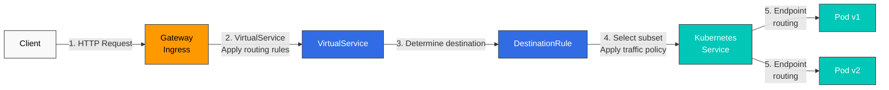

### 流量拆分（Canary 部署）

```yaml
apiVersion: networking.istio.io/v1
kind: VirtualService
metadata:
  name: reviews-canary
spec:
  hosts:
  - reviews
  http:
  - route:
    - destination:
        host: reviews
        subset: v1
      weight: 90  # 90% of traffic
    - destination:
        host: reviews
        subset: v2
      weight: 10  # 10% of traffic (canary)
```

### Circuit Breaker

```yaml
apiVersion: networking.istio.io/v1
kind: DestinationRule
metadata:
  name: reviews-circuit-breaker
spec:
  host: reviews
  trafficPolicy:
    connectionPool:
      tcp:
        maxConnections: 100
      http:
        http1MaxPendingRequests: 10
        maxRequestsPerConnection: 2
    outlierDetection:
      consecutiveErrors: 5
      interval: 30s
      baseEjectionTime: 30s
      maxEjectionPercent: 50
```

## 安全概念

### mTLS（Mutual TLS）

Istio 会自动加密服务间通信。

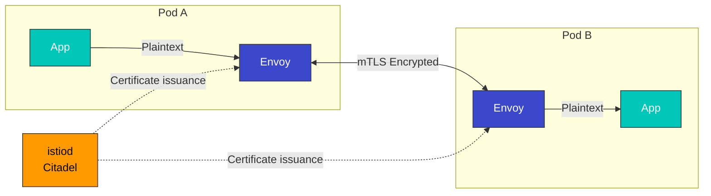

**mTLS 模式**：

* **STRICT**：仅允许 mTLS
* **PERMISSIVE**：允许 mTLS 和明文通信（用于迁移）
* **DISABLE**：禁用 mTLS

### 认证和授权

```yaml
# JWT Authentication
apiVersion: security.istio.io/v1
kind: RequestAuthentication
metadata:
  name: jwt-auth
spec:
  jwtRules:
  - issuer: "https://accounts.google.com"
    jwksUri: "https://www.googleapis.com/oauth2/v3/certs"
---
# Authorization Policy
apiVersion: security.istio.io/v1
kind: AuthorizationPolicy
metadata:
  name: require-jwt
spec:
  action: DENY
  rules:
  - from:
    - source:
        notRequestPrincipals: ["*"]
```

## 可观测性概念

Istio 自动生成指标、日志和追踪。

### 自动生成的指标

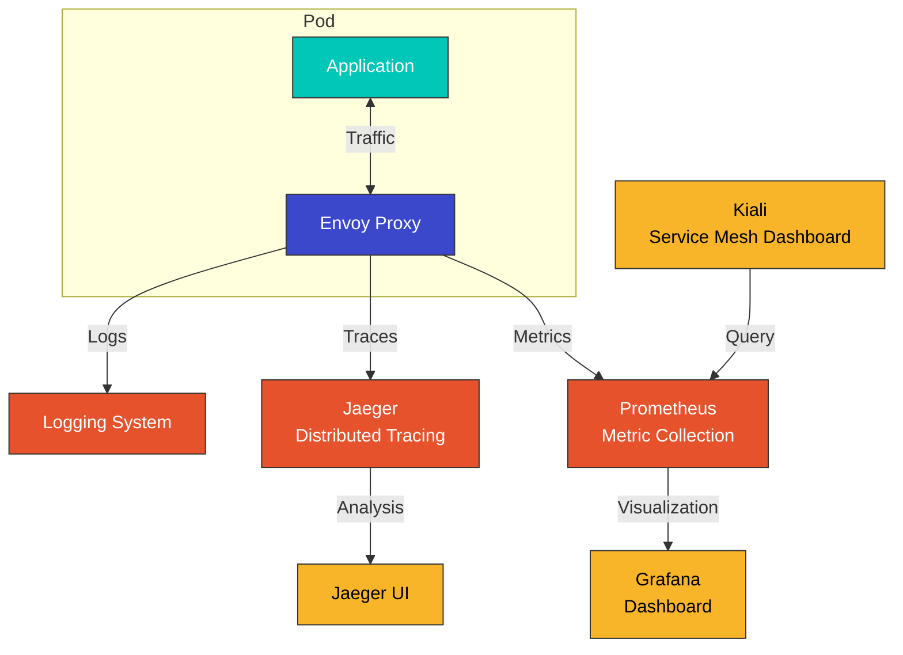

### 关键指标

| 指标                                | 说明          |
| ------------------------------------- | -------------------- |
| `istio_requests_total`                | 请求总数  |
| `istio_request_duration_milliseconds` | 请求延迟      |
| `istio_request_bytes`                 | 请求大小         |
| `istio_response_bytes`                | 响应大小        |
| `istio_tcp_connections_opened_total`  | TCP 连接数 |

### 分布式追踪

```yaml
# Enable tracing in Envoy
apiVersion: install.istio.io/v1alpha1
kind: IstioOperator
spec:
  meshConfig:
    enableTracing: true
    defaultConfig:
      tracing:
        sampling: 100.0  # 100% sampling
        zipkin:
          address: jaeger-collector.istio-system:9411
```

## Namespace 与服务网格

### Namespace 隔离

```yaml
# Per-namespace mTLS policy
apiVersion: security.istio.io/v1
kind: PeerAuthentication
metadata:
  name: default
  namespace: production
spec:
  mtls:
    mode: STRICT
---
# Per-namespace authorization policy
apiVersion: security.istio.io/v1
kind: AuthorizationPolicy
metadata:
  name: deny-all
  namespace: production
spec:
  action: DENY
  rules:
  - {}
```

### 服务网格范围

```bash
# Include only specific namespaces in the mesh
kubectl label namespace default istio-injection=enabled
kubectl label namespace staging istio-injection=enabled

# Exclude specific namespace
kubectl label namespace kube-system istio-injection=disabled
```

### 多租户

```yaml
# Restrict mesh scope with Sidecar resource
apiVersion: networking.istio.io/v1
kind: Sidecar
metadata:
  name: default
  namespace: production
spec:
  egress:
  - hosts:
    - "production/*"  # Only production namespace accessible
    - "istio-system/*"
```

## VM Workload 注册

Istio 不仅可以在服务网格中注册 Kubernetes Pod，还可以注册 **Virtual Machine (VM) workload**。这使传统应用或集群外服务能够使用 Istio 的流量管理、安全和可观测性功能。

### 为什么需要 VM Workload

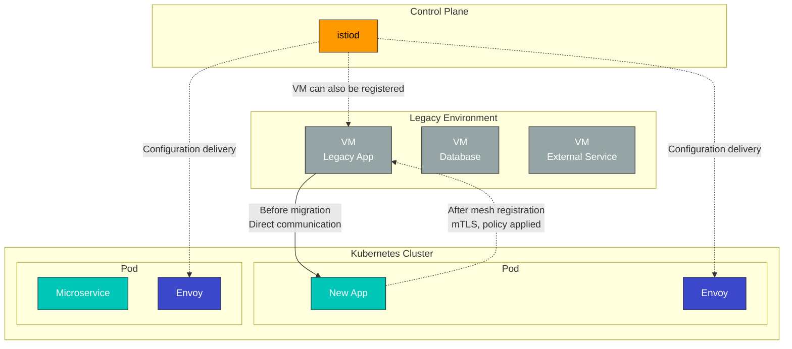

**使用场景**：

* 逐步迁移传统应用
* 将数据库服务器纳入网格
* 集成集群外服务
* 配置混合云环境

### VM 注册架构

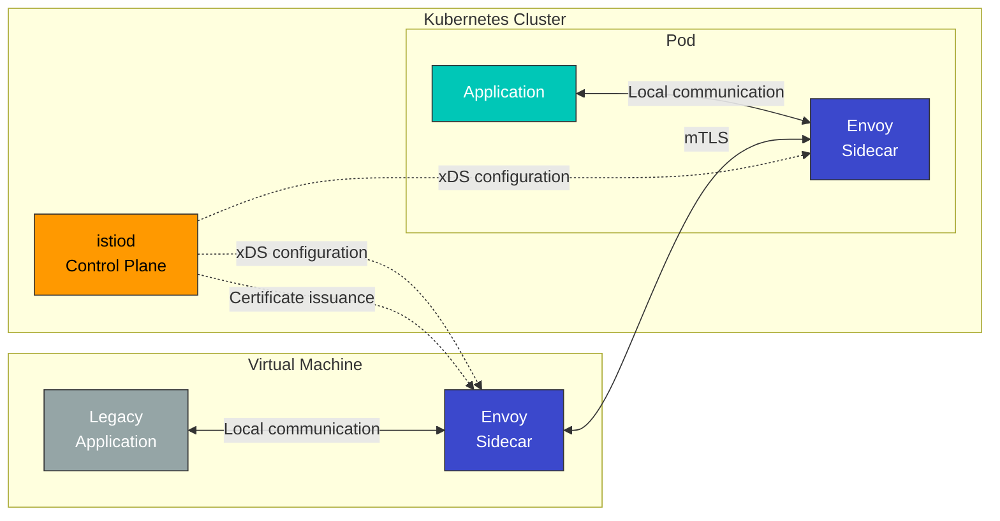

### WorkloadEntry 资源

VM workload 使用 **WorkloadEntry** 资源注册。

```yaml
apiVersion: networking.istio.io/v1
kind: WorkloadEntry
metadata:
  name: legacy-database
  namespace: default
spec:
  address: 192.168.1.100  # VM IP address
  labels:
    app: mysql
    version: v5.7
  serviceAccount: database-sa
  ports:
    mysql: 3306
```

**WorkloadEntry 关键字段**：

* `address`：VM IP 地址
* `labels`：与 service selector 匹配
* `serviceAccount`：用于 mTLS 认证的服务账户
* `ports`：暴露端口定义

### 与 ServiceEntry 集成

WorkloadEntry 与 ServiceEntry 结合使用，以在网格中注册 VM 服务。

```yaml
# Define service with ServiceEntry
apiVersion: networking.istio.io/v1
kind: ServiceEntry
metadata:
  name: legacy-database
spec:
  hosts:
  - database.legacy.com
  ports:
  - number: 3306
    name: mysql
    protocol: TCP
  location: MESH_INTERNAL  # Register as internal mesh service
  resolution: STATIC
  workloadSelector:
    labels:
      app: mysql
---
# Register VM instance with WorkloadEntry
apiVersion: networking.istio.io/v1
kind: WorkloadEntry
metadata:
  name: mysql-vm-1
  namespace: default
spec:
  address: 192.168.1.100
  labels:
    app: mysql
    version: v5.7
  serviceAccount: mysql-sa
```

### VM 注册与 Multi-Cluster 对比

| 功能                    | VM Workload 注册 | Multi-Cluster                  | Kubernetes Pod      |
| -------------------------- | ------------------------ | ------------------------------ | ------------------- |
| **Workload 位置**      | 集群外 VM       | 不同 Kubernetes 集群   | 集群内部      |
| **Envoy 安装**     | 手动安装      | 自动（sidecar）            | 自动（sidecar） |
| **注册方法**    | WorkloadEntry            | ServiceEntry + EndpointSlice   | Service + Pod       |
| **mTLS**                   | 支持                | 支持                      | 支持           |
| **服务发现**      | 手动（指定 IP）    | 自动                      | 自动           |
| **使用场景**         | 传统应用、DB          | Multi-cloud、灾难恢复 | Cloud-native 应用   |
| **运维复杂度** | 高                     | 中等                         | 低                 |

### VM 注册的优势

#### 1. 渐进式迁移

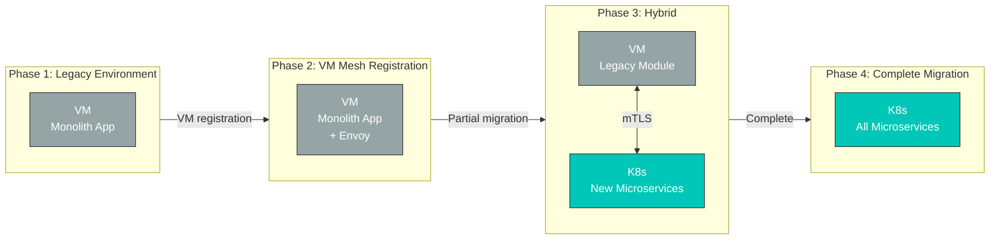

**优势**：

* 无需修改即可将现有 VM 应用集成到网格中
* 分阶段迁移到 Kubernetes
* 在迁移期间保持一致的安全性和可观测性

#### 2. 统一安全策略

```yaml
# mTLS policy applied to both VMs and pods
apiVersion: security.istio.io/v1
kind: PeerAuthentication
metadata:
  name: default
  namespace: default
spec:
  mtls:
    mode: STRICT  # Enforce mTLS for both VMs and pods
---
# VM database access control
apiVersion: security.istio.io/v1
kind: AuthorizationPolicy
metadata:
  name: database-access
  namespace: default
spec:
  selector:
    matchLabels:
      app: mysql  # WorkloadEntry label
  action: ALLOW
  rules:
  - from:
    - source:
        principals: ["cluster.local/ns/default/sa/app-sa"]
    to:
    - operation:
        methods: ["*"]
```

#### 3. 一致的可观测性

VM workload 可提供与 Kubernetes Pod 相同的指标、日志和分布式追踪。

```promql
# Unified metric query for VMs and pods
sum(rate(istio_requests_total{destination_workload="mysql-vm-1"}[5m]))

# Error rate from VM
sum(rate(istio_requests_total{destination_workload="mysql-vm-1",response_code="500"}[5m]))
/
sum(rate(istio_requests_total{destination_workload="mysql-vm-1"}[5m]))
```

### VM 注册的限制

1. **手动安装 Envoy**：必须在 VM 上手动安装并配置 Envoy proxy
2. **网络连接**：需要 VM 与 Kubernetes 集群之间的网络连接
3. **证书管理**：必须将服务账户证书部署到 VM
4. **运维负担**：需要管理和更新 VM Envoy 版本
5. **自动扩缩容限制**：不具备 Kubernetes HPA 等自动扩缩容能力

### 实际使用示例

#### 场景：传统数据库集成

```yaml
# 1. Define database service with ServiceEntry
apiVersion: networking.istio.io/v1
kind: ServiceEntry
metadata:
  name: legacy-postgres
  namespace: production
spec:
  hosts:
  - postgres.production.svc.cluster.local
  addresses:
  - 240.240.1.10  # Virtual IP
  ports:
  - number: 5432
    name: postgresql
    protocol: TCP
  location: MESH_INTERNAL
  resolution: STATIC
  workloadSelector:
    labels:
      app: postgres
      tier: database
---
# 2. Register VM instance with WorkloadEntry
apiVersion: networking.istio.io/v1
kind: WorkloadEntry
metadata:
  name: postgres-vm-1
  namespace: production
spec:
  address: 10.0.1.100  # Actual VM IP
  labels:
    app: postgres
    tier: database
    version: v13
  serviceAccount: postgres-sa
  ports:
    postgresql: 5432
---
# 3. Access control policy
apiVersion: security.istio.io/v1
kind: AuthorizationPolicy
metadata:
  name: postgres-access-control
  namespace: production
spec:
  selector:
    matchLabels:
      app: postgres
  action: ALLOW
  rules:
  - from:
    - source:
        namespaces: ["production"]
        principals: ["cluster.local/ns/production/sa/api-service"]
    to:
    - operation:
        ports: ["5432"]
```

**结果**：

* Kubernetes Pod 通过 `postgres.production.svc.cluster.local` 访问数据库
* VM 与 Pod 之间自动进行 mTLS 加密
* 应用访问控制策略
* 自动收集指标和分布式追踪

### Workload 注册对比总结

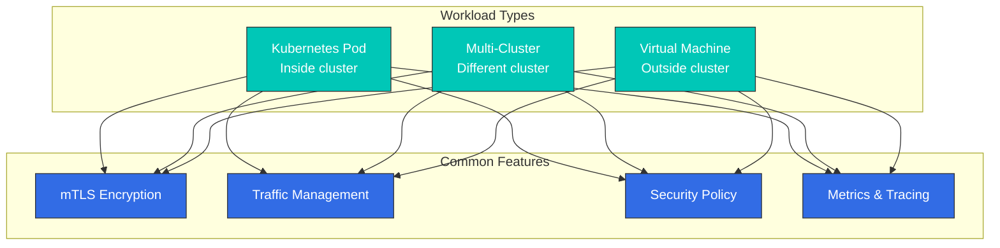

通过 Istio 灵活的 Workload 注册功能：

* **Kubernetes Pod**：Cloud-native 应用
* **Multi-Cluster**：Multi-cloud、区域分布、灾难恢复
* **Virtual Machine**：传统应用、数据库、混合环境

所有 Workload 都可获得一致的安全性、流量管理和可观测性功能。

## 后续步骤

现在，您已经了解 Istio 的基本概念。通过以下文档学习如何在实践中使用它们：

### 核心功能

1. [**流量管理**](traffic-management/README.md)
   * Gateway 和 VirtualService 用法
   * DestinationRule 和 subset 定义
   * ServiceEntry 和 WorkloadEntry（VM 注册）
   * 高级路由模式（Canary、A/B 测试）
   * Traffic Mirroring 和 Shadowing
2. [**安全性**](security/README.md)
   * mTLS 配置和 PeerAuthentication
   * 认证（RequestAuthentication、JWT）
   * 授权（AuthorizationPolicy）
   * 安全策略管理
   * 外部认证集成
3. [**可观测性**](observability/README.md)
   * 指标收集（Prometheus）
   * 分布式追踪（Jaeger、Zipkin）
   * 日志配置
   * Kiali 服务网格可视化
   * Grafana dashboard
4. [**弹性**](resilience/README.md)
   * Circuit Breaker 模式
   * Retry 和 Timeout 设置
   * Rate Limiting
   * Outlier Detection
   * Fault Injection 测试

### 高级主题

5. [**高级主题**](advanced/README.md)
   * Ambient Mode（无 sidecar 网格）
   * Multi-Cluster 配置
   * EnvoyFilter 自定义
   * DNS Proxy 和 Caching
   * VM workload 详细配置
   * WASM plugin 开发

## 参考资料

* [Istio 官方文档 - 概念](https://istio.io/latest/docs/concepts/)
* [Istio 官方文档 - 流量管理](https://istio.io/latest/docs/concepts/traffic-management/)
* [Istio 官方文档 - 安全](https://istio.io/latest/docs/concepts/security/)
* [Istio 官方文档 - 可观测性](https://istio.io/latest/docs/concepts/observability/)
* [Envoy Proxy 官方文档](https://www.envoyproxy.io/docs/envoy/latest/)
