# 架构

> **支持的版本**: Istio 1.28+ **API 版本**: `networking.istio.io/v1`, `security.istio.io/v1` **最后更新**: February 19, 2026

本文档深入介绍 Istio 的内部架构和网络机制。

**有关背景和历史**，请参阅 [基本概念](02-basic-concepts.md#background-and-history) 文档。

**重要变更（Istio 1.5+）**：

* Pilot、Citadel、Galley **不再是独立组件**
* 它们已整合为名为 Istiod（`pilot-discovery`）的**单个二进制文件**
* Pilot/Citadel/Galley 术语指的是**描述功能的历史名称**

## 目录

1. [Istio 架构概览](03-architecture.md#istio-architecture-overview)
2. [控制平面：Istiod](03-architecture.md#control-plane-istiod)
3. [数据平面：Envoy Proxy](03-architecture.md#data-plane-envoy-proxy)
4. [Sidecar 注入机制](03-architecture.md#sidecar-injection-mechanism)
5. [iptables 与流量拦截](03-architecture.md#iptables-and-traffic-interception)
6. [DNS 处理机制](03-architecture.md#dns-processing-mechanism)
7. [xDS API 通信](03-architecture.md#xds-api-communication)
8. [使用 Sidecar 资源进行优化](03-architecture.md#optimization-with-sidecar-resource)

## Istio 架构概览

### 总体结构

### 控制平面与数据平面

| 类别        | 控制平面（Istiod）                        | 数据平面（Envoy）        |
| --------------- | --------------------------------------------- | ------------------------- |
| **角色**        | 策略管理、配置分发 | 实际流量处理 |
| **位置**    | 独立的 Pod（通常为 1-3 个）                 | 所有应用程序 Pod      |
| **语言**    | Go                                            | C++                       |
| **负载**        | 低                                           | 高（所有流量）        |
| **可扩展性** | 水平扩缩容（HA）                       | 自动（每个 Pod 1 个）     |

## 控制平面：Istiod

### Istiod 内部结构

**重要提示**：自 Istio 1.5 起，Pilot、Citadel 和 Galley 是 Istiod 的**内部功能，而非独立组件**。

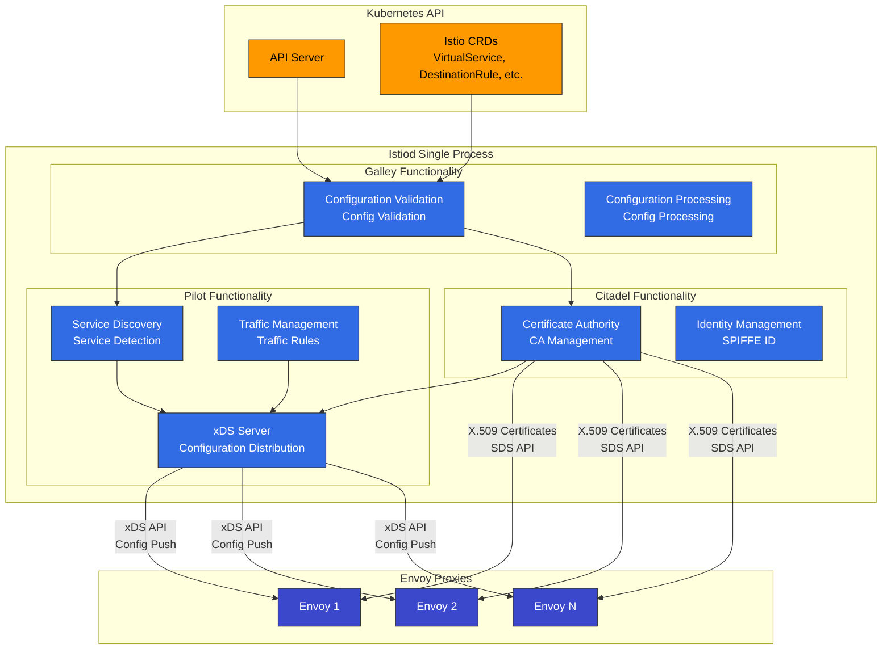

### Istiod 主要功能

**注意**：在 Istio 1.28 中，以下功能已集成在 Istiod 内部。使用历史名称（Pilot、Citadel、Galley）来描述功能。

#### 1. 服务发现（Pilot 功能）

```yaml
# Kubernetes Service detection
apiVersion: v1
kind: Service
metadata:
  name: reviews
spec:
  selector:
    app: reviews
  ports:
  - port: 9080
```

Istiod 会跟踪：

* Kubernetes Service
* Endpoints（Pod IP）
* Pod 状态变更
* 外部服务（ServiceEntry）

#### 2. 流量管理（Pilot 功能）

将 Istio CRD 转换为 Envoy 配置：

```yaml
# VirtualService (user-defined)
apiVersion: networking.istio.io/v1
kind: VirtualService
metadata:
  name: reviews
spec:
  hosts:
  - reviews
  http:
  - route:
    - destination:
        host: reviews
        subset: v1
      weight: 90
    - destination:
        host: reviews
        subset: v2
      weight: 10
```

↓ Istiod 转换为 Envoy 配置 ↓

```json
{
  "route_config": {
    "weighted_clusters": {
      "clusters": [
        {"name": "outbound|9080|v1|reviews", "weight": 90},
        {"name": "outbound|9080|v2|reviews", "weight": 10}
      ]
    }
  }
}
```

#### 3. 证书管理（Citadel 功能）

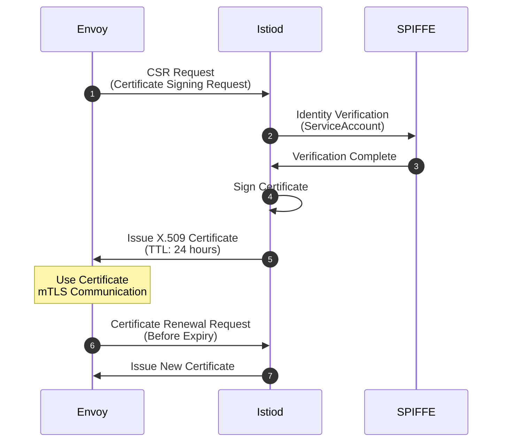

**SPIFFE ID 格式**：

```
spiffe://cluster.local/ns/default/sa/reviews
```

#### 4. 配置验证（Galley 功能）

```yaml
# Invalid configuration
apiVersion: networking.istio.io/v1
kind: VirtualService
metadata:
  name: invalid
spec:
  hosts:
  - reviews
  http:
  - route:
    - destination:
        host: non-existent-service  # ❌ Non-existent service
```

Istiod 会在应用前进行验证：

```bash
$ kubectl apply -f invalid-vs.yaml
Error from server: admission webhook "validation.istio.io" denied the request:
configuration is invalid: host "non-existent-service" not found
```

### Istiod 进程结构

**Istio 1.28 中的实际实现**：

```bash
# Processes inside Istiod pod
$ kubectl exec -n istio-system deploy/istiod -- ps aux
USER       PID  COMMAND
istio-p+     1  /usr/local/bin/pilot-discovery discovery

# Single binary 'pilot-discovery' performs all functions
```

**关键要点**：

* Istiod 作为名为 `pilot-discovery` 的**单个 Go 二进制文件**运行
* Pilot、Citadel、Galley 以**代码级 package/module**的形式存在，但不是独立进程
* 所有功能都作为 goroutine 在单个进程中运行

**Istiod 提供的主要端口**：

| 端口      | 协议 | 用途                  | 功能             |
| --------- | -------- | ------------------------ | ------------------------- |
| **15010** | gRPC     | xDS（旧版）             | 向后兼容    |
| **15012** | gRPC     | TLS 上的 xDS             | 主要 xDS API 端点  |
| **15014** | HTTP     | 控制平面监控 | 指标与健康检查 |
| **15017** | HTTPS    | Webhook                  | Sidecar 注入         |
| **8080**  | HTTP     | 调试                    | 调试接口       |

### Istiod 部署

**高可用配置**：

```yaml
apiVersion: apps/v1
kind: Deployment
metadata:
  name: istiod
  namespace: istio-system
spec:
  replicas: 3  # 3 replicas for HA
  selector:
    matchLabels:
      app: istiod
  template:
    metadata:
      labels:
        app: istiod
    spec:
      containers:
      - name: discovery
        image: istio/pilot:1.28.0
        resources:
          requests:
            cpu: 500m
            memory: 2Gi
```

**典型资源用量**：

* CPU：0.5 - 2 核
* 内存：2 - 4 GB
* 可处理数千个 Service 和 Pod

## 数据平面：Envoy Proxy

### Envoy 架构

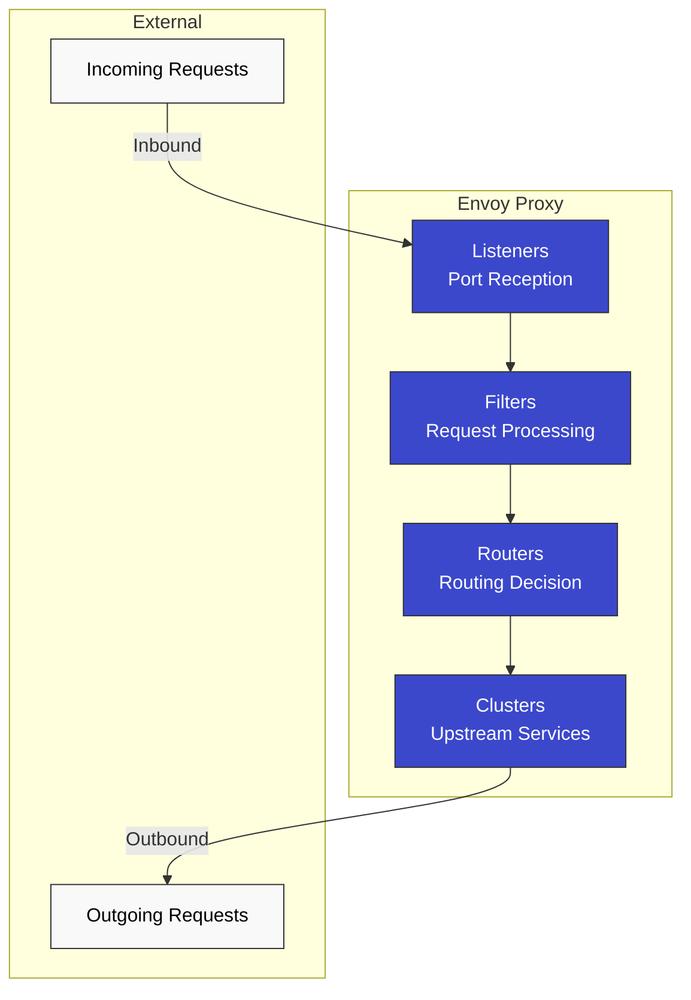

### Envoy 主要组件

#### 1. Listeners

**接收端口上的连接**：

```json
{
  "name": "0.0.0.0_15001",
  "address": {
    "socket_address": {
      "address": "0.0.0.0",
      "port_value": 15001
    }
  },
  "filter_chains": [...]
}
```

**默认 Istio Listeners**：

* `0.0.0.0:15001`：所有出站 TCP 流量
* `0.0.0.0:15006`：所有入站 TCP 流量
* `0.0.0.0:15021`：健康检查
* `0.0.0.0:15090`：Prometheus 指标

#### 2. Filters

**处理请求/响应的插件**：

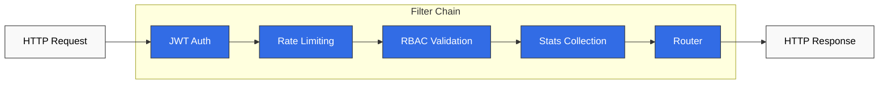

#### 3. Clusters

**上游服务的逻辑分组**：

```json
{
  "name": "outbound|9080|v1|reviews.default.svc.cluster.local",
  "type": "EDS",
  "eds_cluster_config": {
    "service_name": "outbound|9080|v1|reviews.default.svc.cluster.local"
  },
  "circuit_breakers": {...},
  "outlier_detection": {...}
}
```

#### 4. Endpoints

**实际 Pod IP 列表**：

```json
{
  "cluster_name": "outbound|9080|v1|reviews",
  "endpoints": [
    {
      "lb_endpoints": [
        {"endpoint": {"address": {"socket_address": {"address": "10.244.1.5", "port_value": 9080}}}},
        {"endpoint": {"address": {"socket_address": {"address": "10.244.2.8", "port_value": 9080}}}}
      ]
    }
  ]
}
```

### Envoy 性能

**基准测试**（典型环境）：

* 吞吐量：每核 10,000+ RPS
* 新增延迟：< 1ms（P99）
* 内存：50-100 MB（默认配置）
* CPU：0.1-0.5 核（典型负载）

## Sidecar 注入机制

### 注入流程

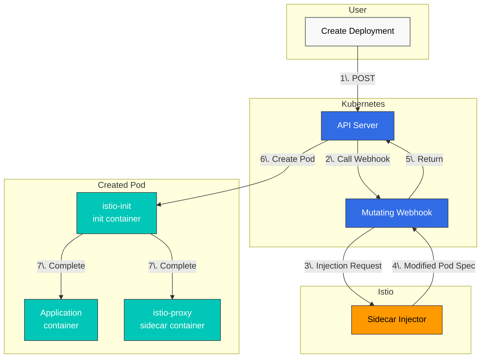

### 原始配置与注入后配置

**原始 Deployment**：

```yaml
apiVersion: apps/v1
kind: Deployment
metadata:
  name: reviews
spec:
  template:
    spec:
      containers:
      - name: reviews
        image: reviews:v1
        ports:
        - containerPort: 9080
```

**注入后**：

```yaml
apiVersion: v1
kind: Pod
metadata:
  annotations:
    sidecar.istio.io/status: '{"initContainers":["istio-init"],"containers":["istio-proxy"]}'
spec:
  initContainers:
  - name: istio-init
    image: istio/proxyv2:1.28.0
    command: ['istio-iptables', ...]
    securityContext:
      capabilities:
        add: [NET_ADMIN, NET_RAW]
  containers:
  - name: reviews
    image: reviews:v1
    ports:
    - containerPort: 9080
  - name: istio-proxy
    image: istio/proxyv2:1.28.0
    args: ['proxy', 'sidecar', ...]
```

### 启用 Sidecar 注入

#### 自动注入（推荐）

**Namespace 级别**：

```bash
# Add label to namespace
kubectl label namespace default istio-injection=enabled

# All pods deployed to this namespace will automatically have sidecar injected
kubectl apply -f deployment.yaml
```

**Pod 级别**（Annotation）：

```yaml
apiVersion: v1
kind: Pod
metadata:
  annotations:
    sidecar.istio.io/inject: "true"  # Enable injection per pod
spec:
  containers:
  - name: app
    image: myapp:v1
```

#### 手动注入

使用 `istioctl kube-inject` 命令将 Sidecar 直接注入 YAML 文件。

```bash
# Inject sidecar into YAML file and deploy
istioctl kube-inject -f deployment.yaml | kubectl apply -f -

# Or save to file
istioctl kube-inject -f deployment.yaml -o deployment-injected.yaml
kubectl apply -f deployment-injected.yaml
```

**手动注入场景**：

* 无法使用自动注入的环境
* CI/CD pipeline 中需要显式控制时
* 希望检查注入后的 YAML 以进行调试时

## iptables 与流量拦截

### istio-init Container

**角色**：设置 iptables 规则，将 Pod 网络流量重定向到 Envoy Proxy

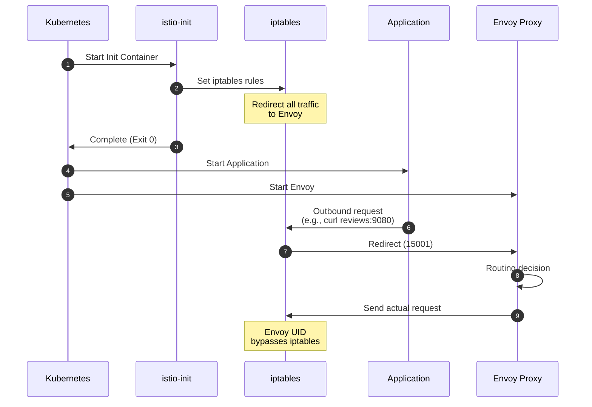

### iptables 规则详情

**由 istio-init 执行的命令**：

```bash
#!/bin/bash
# istio-iptables script (simplified)

# 1. OUTPUT chain: Application outbound traffic
iptables -t nat -A OUTPUT -p tcp \
  -m owner ! --uid-owner 1337 \  # Exclude Envoy UID
  -j REDIRECT --to-port 15001     # Envoy outbound port

# 2. PREROUTING chain: Inbound traffic to pod
iptables -t nat -A PREROUTING -p tcp \
  -j REDIRECT --to-port 15006     # Envoy inbound port

# 3. Exclusion rules
# - localhost traffic
iptables -t nat -I OUTPUT -d 127.0.0.1/32 -j RETURN

# - Istiod communication (15012)
iptables -t nat -I OUTPUT -p tcp --dport 15012 -j RETURN

# - DNS (53)
iptables -t nat -I OUTPUT -p udp --dport 53 -j RETURN
```

### 流量流向（应用 iptables 后）

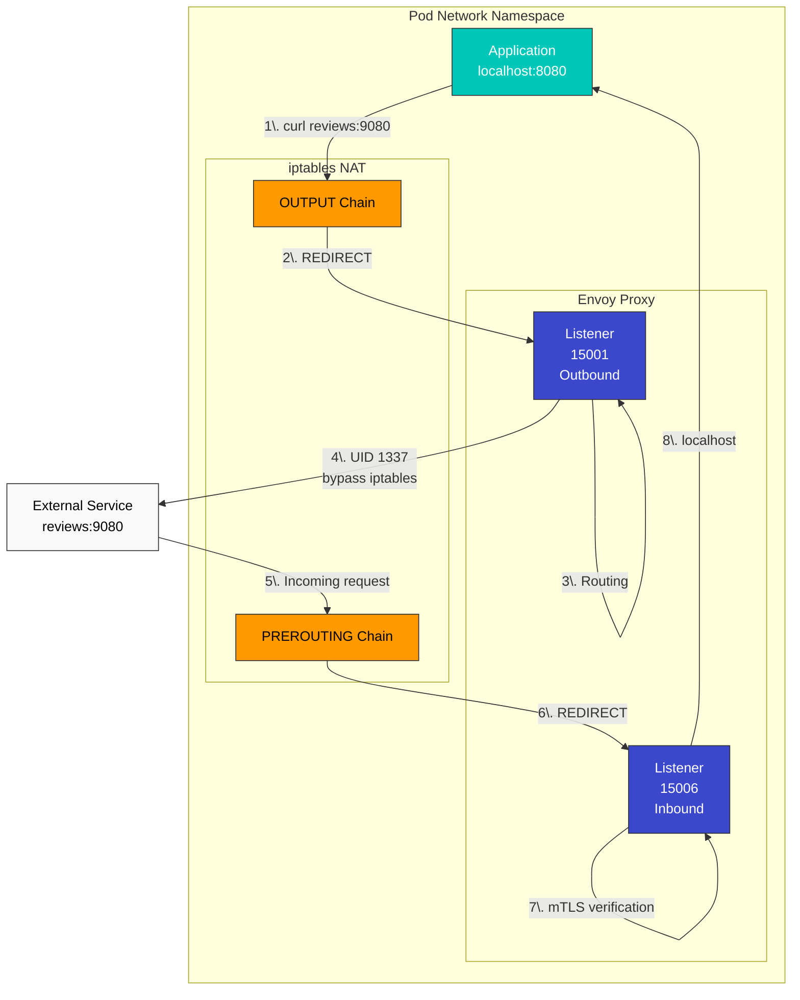

### 检查 iptables 规则

**从 Pod 内部检查**：

```bash
# Enter pod
kubectl exec -it <pod-name> -c istio-proxy -- /bin/bash

# Check iptables rules
iptables -t nat -L -n -v

# OUTPUT chain
Chain OUTPUT (policy ACCEPT)
target     prot opt source     destination
ISTIO_OUTPUT  tcp  --  0.0.0.0/0  0.0.0.0/0

# ISTIO_OUTPUT detail
Chain ISTIO_OUTPUT (1 references)
RETURN     all  --  0.0.0.0/0  127.0.0.1           # Exclude localhost
RETURN     all  --  0.0.0.0/0  0.0.0.0/0           owner UID match 1337  # Exclude Envoy
REDIRECT   tcp  --  0.0.0.0/0  0.0.0.0/0           redir ports 15001  # Redirect rest

# PREROUTING chain
Chain PREROUTING (policy ACCEPT)
ISTIO_INBOUND  tcp  --  0.0.0.0/0  0.0.0.0/0

# ISTIO_INBOUND detail
Chain ISTIO_INBOUND (1 references)
REDIRECT   tcp  --  0.0.0.0/0  0.0.0.0/0           redir ports 15006
```

### iptables 与 eBPF（CNI Plugin）

Istio 支持两种流量拦截方法：

| 方法         | 优点           | 缺点           | 使用场景                   |
| -------------- | -------------------- | ----------------------- | ------------------------------ |
| **iptables**   | 简单、通用    | 需要 Init Container | 默认设置                  |
| **eBPF（CNI）** | 无需 Init，速度快 | 需要现代内核  | 高性能、Ambient Mode |

## DNS 处理机制

### Kubernetes DNS 基本操作

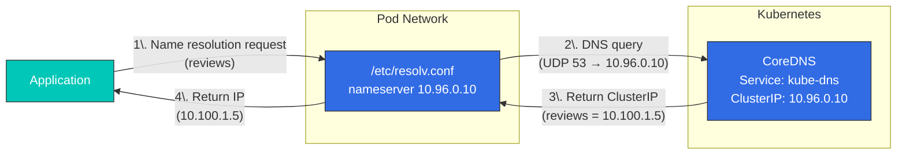

**/etc/resolv.conf**（Pod 内部）：

```bash
nameserver 10.96.0.10  # kube-dns ClusterIP
search default.svc.cluster.local svc.cluster.local cluster.local
options ndots:5
```

### Envoy 的 DNS 处理

**在 Istio 中，Envoy 处理 DNS**：

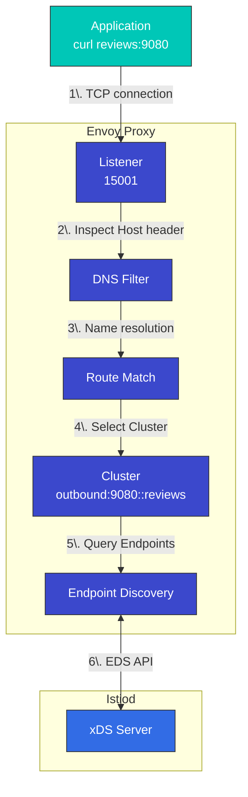

**优点**：

* 无需调用 CoreDNS（性能提升）
* 动态更新 Endpoint
* 高级路由（版本、权重等）

### DNS Proxy（可选）

**Istio 1.8+ 中新增的 DNS Proxy 功能**：

```yaml
apiVersion: install.istio.io/v1alpha1
kind: IstioOperator
spec:
  meshConfig:
    defaultConfig:
      proxyMetadata:
        ISTIO_META_DNS_CAPTURE: "true"  # Enable DNS Proxy
```

**工作方式**：

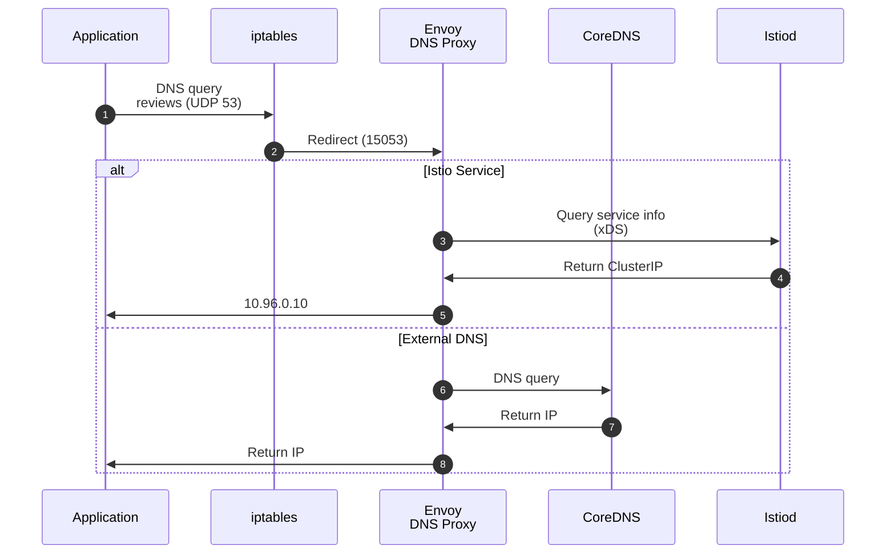

**DNS Proxy iptables 规则**：

```bash
# Redirect UDP port 53 to Envoy DNS Proxy
iptables -t nat -A OUTPUT -p udp --dport 53 \
  -m owner ! --uid-owner 1337 \
  -j REDIRECT --to-port 15053
```

## xDS API 通信

### xDS 协议概览

**xDS**：代表 Discovery Service，是 Envoy 的动态配置协议。

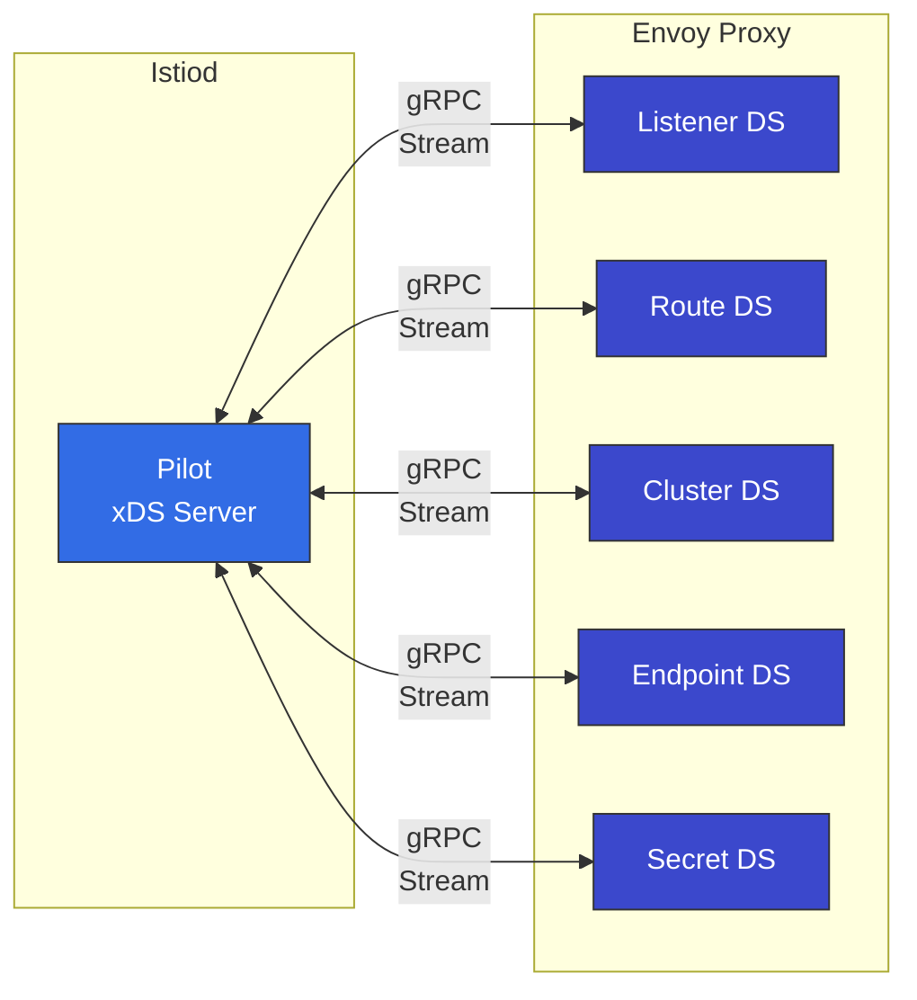

### xDS API 类型

| API     | 名称               | 角色                       | 示例           |
| ------- | ------------------ | -------------------------- | ----------------- |
| **LDS** | Listener Discovery | 接收端口配置 | 15001、15006      |
| **RDS** | Route Discovery    | HTTP 路由规则         | VirtualService    |
| **CDS** | Cluster Discovery  | 上游服务          | DestinationRule   |
| **EDS** | Endpoint Discovery | Pod IP 列表                | Service Endpoints |
| **SDS** | Secret Discovery   | TLS 证书           | mTLS 证书 |

### xDS 通信流程

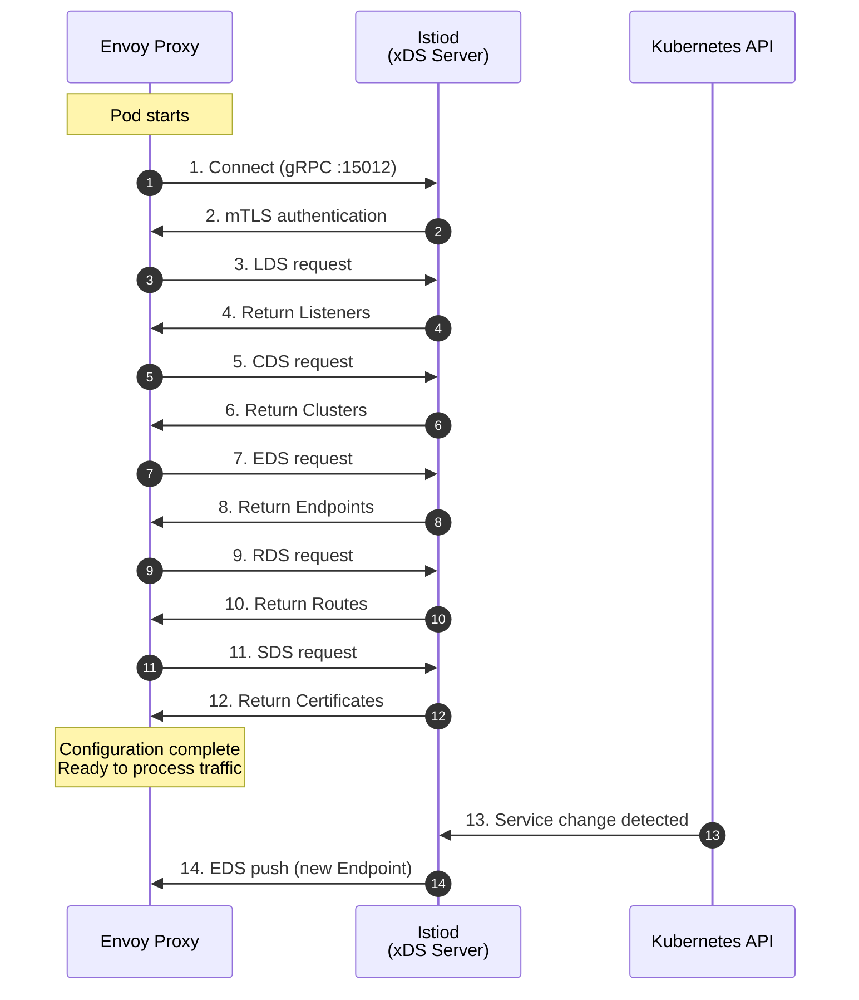

### 验证 xDS 通信

**使用 Envoy Admin API 检查**：

```bash
# From inside pod
kubectl exec -it <pod-name> -c istio-proxy -- curl localhost:15000/config_dump

# LDS (Listeners)
kubectl exec -it <pod-name> -c istio-proxy -- \
  curl -s localhost:15000/config_dump | jq '.configs[0].dynamic_listeners'

# CDS (Clusters)
kubectl exec -it <pod-name> -c istio-proxy -- \
  curl -s localhost:15000/config_dump | jq '.configs[1].dynamic_active_clusters'

# EDS (Endpoints)
kubectl exec -it <pod-name> -c istio-proxy -- \
  curl -s localhost:15000/clusters | grep -A 5 "reviews"

# RDS (Routes)
kubectl exec -it <pod-name> -c istio-proxy -- \
  curl -s localhost:15000/config_dump | jq '.configs[2].dynamic_route_configs'
```

**使用 istioctl 检查**：

```bash
# Listener configuration
istioctl proxy-config listeners <pod-name> -n default

# Cluster configuration
istioctl proxy-config clusters <pod-name> -n default

# Endpoint configuration
istioctl proxy-config endpoints <pod-name> -n default

# Route configuration
istioctl proxy-config routes <pod-name> -n default
```

## 使用 Sidecar 资源进行优化

### 问题：接收所有 Service 信息

默认情况下，每个 Envoy 都会接收**整个 mesh 中所有 Service 的信息**：

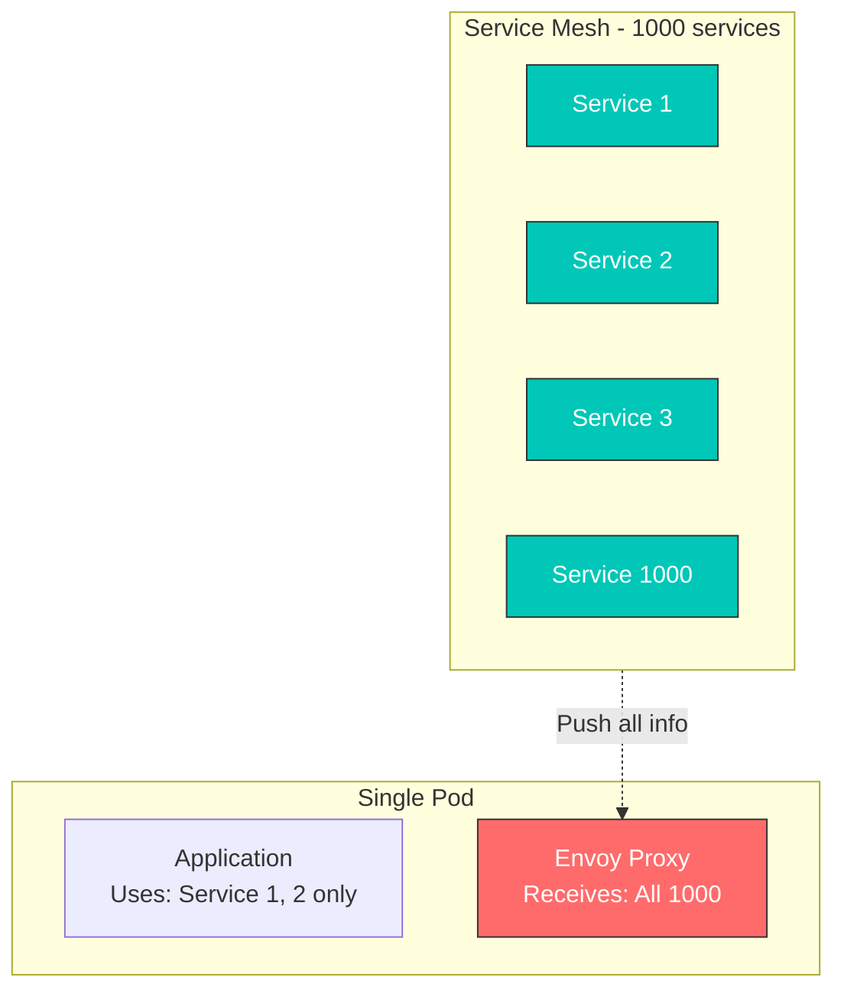

**问题**：

* 内存使用量增加
* CPU 使用量增加（配置处理）
* 网络带宽浪费
* Istiod 负载增加

### 解决方案：Sidecar 资源

使用 **Sidecar 资源**限制为仅接收必要的 Service：

```yaml
apiVersion: networking.istio.io/v1
kind: Sidecar
metadata:
  name: default
  namespace: default
spec:
  egress:
  - hosts:
    - "./*"  # All services in same namespace
    - "istio-system/*"  # All services in istio-system
    - "production/reviews"  # Only reviews in production namespace
```

### Sidecar 资源示例

#### 1. Namespace 隔离

```yaml
apiVersion: networking.istio.io/v1
kind: Sidecar
metadata:
  name: default
  namespace: team-a
spec:
  egress:
  - hosts:
    - "team-a/*"  # Own namespace only
    - "istio-system/*"  # System services
    - "shared/*"  # Shared services
```

#### 2. 仅访问特定 Service

```yaml
apiVersion: networking.istio.io/v1
kind: Sidecar
metadata:
  name: frontend
  namespace: default
spec:
  workloadSelector:
    labels:
      app: frontend
  egress:
  - hosts:
    - "default/reviews"
    - "default/ratings"
    - "default/details"
  - port:
      number: 443
      protocol: HTTPS
    hosts:
    - "external/*"
```

#### 3. 仅访问外部服务

```yaml
apiVersion: networking.istio.io/v1
kind: Sidecar
metadata:
  name: external-only
  namespace: default
spec:
  workloadSelector:
    labels:
      app: batch-job
  egress:
  - hosts:
    - "./*"  # Same namespace
  outboundTrafficPolicy:
    mode: REGISTRY_ONLY  # Only those registered in ServiceEntry
```

### Sidecar 资源效果

**之前（无 Sidecar）**：

* 1000 个 Service → 1000 个 Cluster 配置
* Envoy 内存：\~500 MB
* 配置推送时间：5-10 秒

**之后（应用 Sidecar）**：

* 10 个 Service → 10 个 Cluster 配置
* Envoy 内存：\~80 MB
* 配置推送时间：< 1 秒

### DNS 与 Sidecar 集成

```yaml
apiVersion: networking.istio.io/v1
kind: Sidecar
metadata:
  name: dns-optimized
  namespace: default
spec:
  egress:
  - hosts:
    - "default/reviews"
    - "default/ratings"
  # Envoy only handles DNS for reviews, ratings
  # Rest forwarded to CoreDNS
```

**结果**：

* Envoy 仅解析 `reviews`、`ratings`
* `google.com` 等外部域名转发给 CoreDNS
* 节省内存和 CPU

## 参考资料

### 官方文档

* [Istio 架构](https://istio.io/latest/docs/ops/deployment/architecture/)
* [Envoy Proxy](https://www.envoyproxy.io/docs/envoy/latest/intro/intro)
* [xDS 协议](https://www.envoyproxy.io/docs/envoy/latest/api-docs/xds_protocol)
* [SPIFFE](https://spiffe.io/)

### 历史和背景

* [Envoy 起源故事 - Matt Klein](https://blog.envoyproxy.io/the-universal-data-plane-api-d15cec7a)
* [Istio 公告 - Google Cloud Blog](https://cloud.google.com/blog/products/gcp/istio-service-mesh-for-microservices)
* [Service Mesh 历史](https://www.nginx.com/blog/what-is-a-service-mesh/)

### 进阶学习

* [Envoy 架构概览](https://www.envoyproxy.io/docs/envoy/latest/intro/arch_overview/arch_overview)
* [Istio 性能与可扩展性](https://istio.io/latest/docs/ops/deployment/performance-and-scalability/)
* [iptables 教程](https://www.frozentux.net/iptables-tutorial/iptables-tutorial.html)
