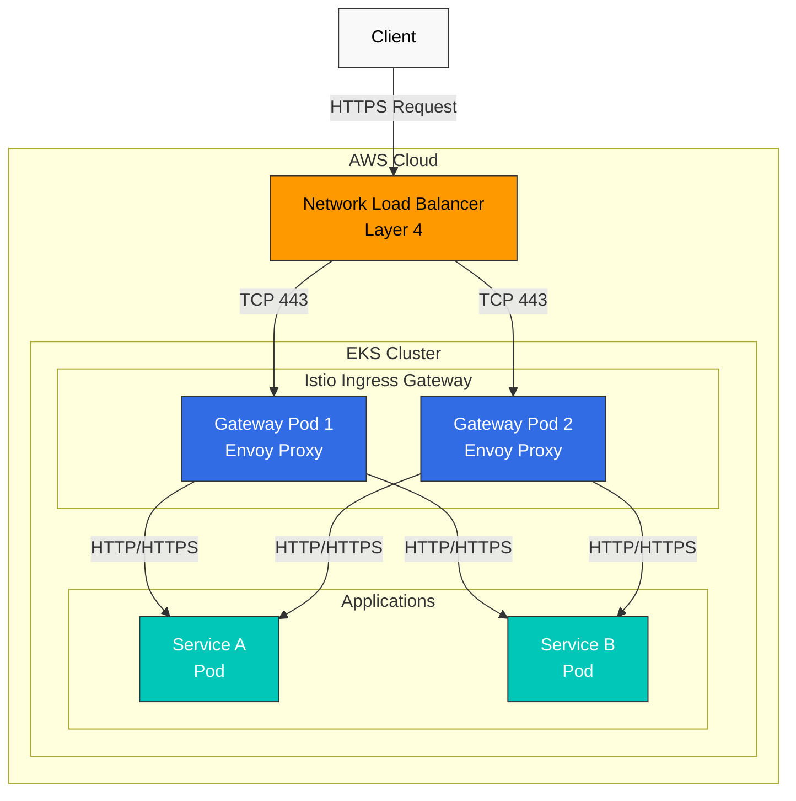
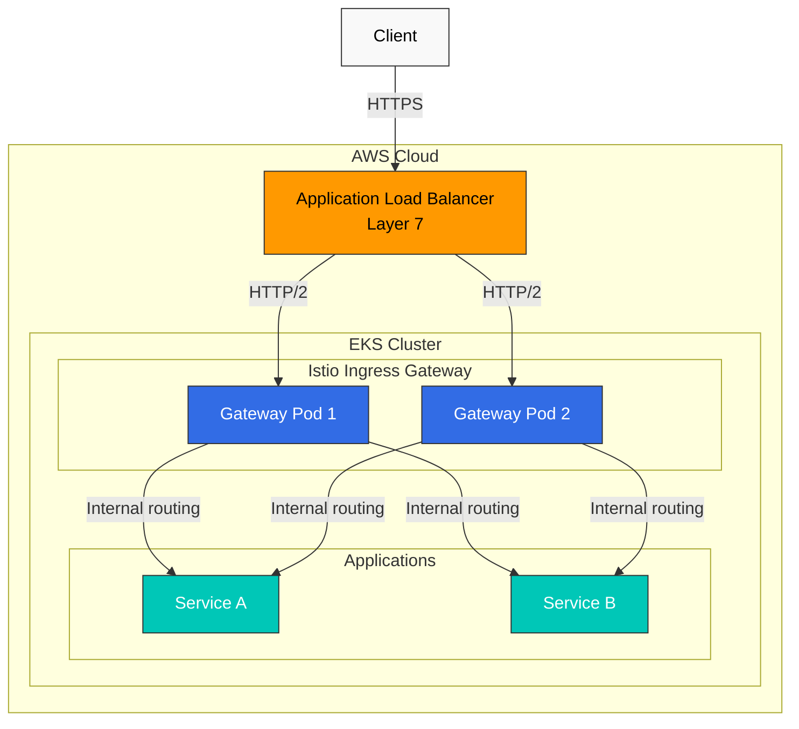
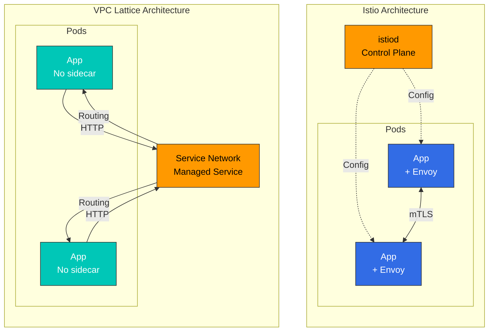
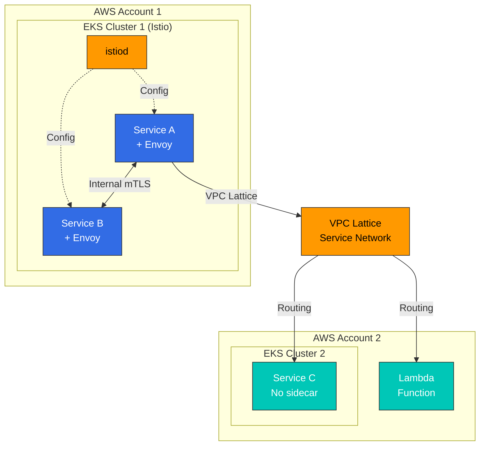

# AWS 集成

本文档介绍如何在 Amazon EKS 环境中将 Istio 与 AWS 服务集成。

## 目录

1. [AWS 负载均衡器集成](04-aws-integration.md#aws-load-balancer-integration)
2. [Istio 与其他解决方案对比](04-aws-integration.md#istio-vs-other-solutions-comparison)
3. [EKS 专用优化](04-aws-integration.md#eks-specific-optimization)
4. [最佳实践](04-aws-integration.md#best-practices)

## AWS 负载均衡器集成

Istio Ingress Gateway 可与 AWS Load Balancer 集成以处理外部流量。

### Network Load Balancer (NLB) 集成

NLB 是第 4 层（TCP/UDP）负载均衡器，适用于需要高性能和低延迟的场景。

#### NLB 架构



#### NLB 配置

**1. 安装 AWS Load Balancer Controller**

```bash
# Create IAM policy
curl -o iam_policy.json https://raw.githubusercontent.com/kubernetes-sigs/aws-load-balancer-controller/main/docs/install/iam_policy.json

aws iam create-policy \
    --policy-name AWSLoadBalancerControllerIAMPolicy \
    --policy-document file://iam_policy.json

# IRSA setup
eksctl create iamserviceaccount \
  --cluster=my-cluster \
  --namespace=kube-system \
  --name=aws-load-balancer-controller \
  --attach-policy-arn=arn:aws:iam::<AWS_ACCOUNT_ID>:policy/AWSLoadBalancerControllerIAMPolicy \
  --override-existing-serviceaccounts \
  --approve

# Install controller with Helm
helm repo add eks https://aws.github.io/eks-charts
helm repo update

helm install aws-load-balancer-controller eks/aws-load-balancer-controller \
  -n kube-system \
  --set clusterName=my-cluster \
  --set serviceAccount.create=false \
  --set serviceAccount.name=aws-load-balancer-controller
```

**2. 使用 NLB 配置 Istio Ingress Gateway**

```yaml
# istio-ingress-nlb.yaml
apiVersion: v1
kind: Service
metadata:
  name: istio-ingressgateway
  namespace: istio-system
  annotations:
    # NLB configuration
    service.beta.kubernetes.io/aws-load-balancer-type: "external"
    service.beta.kubernetes.io/aws-load-balancer-nlb-target-type: "ip"
    service.beta.kubernetes.io/aws-load-balancer-scheme: "internet-facing"

    # TLS configuration
    service.beta.kubernetes.io/aws-load-balancer-ssl-cert: "arn:aws:acm:region:account:certificate/cert-id"
    service.beta.kubernetes.io/aws-load-balancer-ssl-ports: "443"
    service.beta.kubernetes.io/aws-load-balancer-backend-protocol: "tcp"

    # Health check configuration
    service.beta.kubernetes.io/aws-load-balancer-healthcheck-protocol: "http"
    service.beta.kubernetes.io/aws-load-balancer-healthcheck-port: "15021"
    service.beta.kubernetes.io/aws-load-balancer-healthcheck-path: "/healthz/ready"

    # Additional configuration
    service.beta.kubernetes.io/aws-load-balancer-cross-zone-load-balancing-enabled: "true"
    service.beta.kubernetes.io/aws-load-balancer-proxy-protocol: "*"
spec:
  type: LoadBalancer
  selector:
    app: istio-ingressgateway
    istio: ingressgateway
  ports:
  - name: status-port
    port: 15021
    protocol: TCP
    targetPort: 15021
  - name: http2
    port: 80
    protocol: TCP
    targetPort: 8080
  - name: https
    port: 443
    protocol: TCP
    targetPort: 8443
```

**3. Gateway 资源配置**

```yaml
apiVersion: networking.istio.io/v1
kind: Gateway
metadata:
  name: my-gateway
  namespace: istio-system
spec:
  selector:
    istio: ingressgateway
  servers:
  - port:
      number: 443
      name: https
      protocol: HTTPS
    tls:
      mode: SIMPLE
      credentialName: my-tls-secret
    hosts:
    - "myapp.example.com"
  - port:
      number: 80
      name: http
      protocol: HTTP
    hosts:
    - "myapp.example.com"
    tls:
      httpsRedirect: true
```

#### NLB 优势

* **高性能**：每秒可处理数百万个请求
* **低延迟**：在第 4 层运行，响应迅速
* **静态 IP**：可分配 Elastic IP
* **协议支持**：TCP、UDP、TLS
* **高性价比**：比 ALB 更便宜

#### NLB 使用场景

* WebSocket、gRPC 和其他长连接
* 每秒处理数百万个请求
* 需要静态 IP 时
* 应在 Istio 处执行 TLS 终止时

### Application Load Balancer (ALB) 集成

ALB 是第 7 层（HTTP/HTTPS）负载均衡器，适用于需要高级路由功能的场景。

#### ALB 架构



#### ALB 配置

**1. 使用 Ingress 资源创建 ALB**

```yaml
# istio-ingress-alb.yaml
apiVersion: networking.k8s.io/v1
kind: Ingress
metadata:
  name: istio-ingress
  namespace: istio-system
  annotations:
    # ALB configuration
    alb.ingress.kubernetes.io/scheme: internet-facing
    alb.ingress.kubernetes.io/target-type: ip
    alb.ingress.kubernetes.io/listen-ports: '[{"HTTP": 80}, {"HTTPS": 443}]'
    alb.ingress.kubernetes.io/ssl-redirect: '443'

    # ACM certificate
    alb.ingress.kubernetes.io/certificate-arn: arn:aws:acm:region:account:certificate/cert-id

    # Health check
    alb.ingress.kubernetes.io/healthcheck-protocol: HTTP
    alb.ingress.kubernetes.io/healthcheck-port: '15021'
    alb.ingress.kubernetes.io/healthcheck-path: /healthz/ready
    alb.ingress.kubernetes.io/healthcheck-interval-seconds: '15'
    alb.ingress.kubernetes.io/healthcheck-timeout-seconds: '5'
    alb.ingress.kubernetes.io/success-codes: '200'
    alb.ingress.kubernetes.io/healthy-threshold-count: '2'
    alb.ingress.kubernetes.io/unhealthy-threshold-count: '2'

    # Additional configuration
    alb.ingress.kubernetes.io/load-balancer-attributes: idle_timeout.timeout_seconds=60
    alb.ingress.kubernetes.io/target-group-attributes: deregistration_delay.timeout_seconds=30
spec:
  ingressClassName: alb
  rules:
  - host: "myapp.example.com"
    http:
      paths:
      - path: /
        pathType: Prefix
        backend:
          service:
            name: istio-ingressgateway
            port:
              number: 80
```

**2. 基于路径的路由**

```yaml
apiVersion: networking.k8s.io/v1
kind: Ingress
metadata:
  name: istio-ingress-path-based
  namespace: istio-system
  annotations:
    alb.ingress.kubernetes.io/scheme: internet-facing
    alb.ingress.kubernetes.io/target-type: ip
spec:
  ingressClassName: alb
  rules:
  - host: "api.example.com"
    http:
      paths:
      - path: /v1
        pathType: Prefix
        backend:
          service:
            name: istio-ingressgateway
            port:
              number: 80
  - host: "admin.example.com"
    http:
      paths:
      - path: /
        pathType: Prefix
        backend:
          service:
            name: istio-ingressgateway
            port:
              number: 80
```

#### ALB 优势

* **高级路由**：基于路径、Header、查询字符串的路由
* **WAF 集成**：通过 AWS WAF 提升安全性
* **身份验证集成**：Cognito、OIDC 集成
* **ACM 集成**：自动证书管理
* **容器优化**：针对 ECS、EKS 优化

#### ALB 使用场景

* 仅 HTTP/HTTPS 流量
* 需要基于路径的路由时
* 需要 WAF 安全防护时
* 使用单个负载均衡器处理多个域名时

### NLB 与 ALB 对比

| 属性            | NLB                                    | ALB                                      |
| ------------------- | -------------------------------------- | ---------------------------------------- |
| **OSI 层**       | 第 4 层（TCP/UDP）                      | 第 7 层（HTTP/HTTPS）                     |
| **性能**     | 每秒数百万个请求        | 每秒数万个请求 |
| **延迟**         | 极低                               | 低                                      |
| **静态 IP**       | 支持（Elastic IP）                 | 不支持                            |
| **TLS 终止** | 以 TCP 直通（由 Istio 处理） | 可由 ALB 处理                    |
| **路由**         | 基于 IP/端口                          | 基于路径、Host、Header                 |
| **WAF 集成** | 不可用                          | 可用                                |
| **成本**            | 较低                                  | 相对较高                        |
| **WebSocket**       | 原生支持                         | 支持                                |
| **gRPC**            | 原生支持                         | 需要 HTTP/2                          |
| **推荐用途** | 高性能、WebSocket、gRPC      | HTTP 路由、WAF、身份验证        |

## Istio 与其他解决方案对比

### Istio 与 VPC Lattice

VPC Lattice 是 AWS 的托管应用程序网络服务。

#### 架构对比



#### 功能对比

| 属性               | Istio                                | VPC Lattice                 |
| ---------------------- | ------------------------------------ | --------------------------- |
| **管理**         | 自行管理                         | AWS 托管（全托管） |
| **Sidecar**            | 必需（Sidecar 或 Ambient）        | 不需要                |
| **资源开销**  | 高（每个 Pod 一个 Envoy）                 | 低（无 Sidecar）            |
| **复杂性**         | 高                                 | 低                         |
| **学习曲线**     | 陡峭                                | 平缓                      |
| **流量管理** | 非常高级（细粒度控制） | 基础（功能足够） |
| **mTLS**               | 自动，细粒度控制      | 支持                   |
| **可观测性**      | 丰富的指标、追踪                 | 基础指标               |
| **故障注入**    | 支持                            | 不支持               |
| **熔断器**    | 细粒度控制                 | 基础功能         |
| **限流**      | 本地 + 全局                       | 基础功能         |
| **多集群**      | 强大支持                       | 跨 VPC 连接      |
| **跨账户**      | 复杂                              | 简单（原生支持）     |
| **成本**               | 计算成本（EC2）                   | 服务使用成本          |
| **供应商锁定**     | 无（开源）                   | AWS 锁定                 |
| **仅 Kubernetes**    | 是                                  | 否（EC2、Lambda 等）      |

#### 何时选择 Istio

**以下情况适合使用 Istio：**

1. **需要细粒度流量控制**
   * 金丝雀部署、A/B 测试、Traffic Mirroring
   * 复杂路由规则（基于 Header、Cookie 等）
   * 用于混沌工程的故障注入
2. **安全要求严格**
   * 服务之间自动 mTLS 加密
   * 细粒度授权策略
   * JWT 验证、RBAC
3. **需要高级可观测性**
   * 详细指标（Latency P50/P95/P99）
   * 分布式追踪（Jaeger、Zipkin）
   * Service 拓扑可视化（Kiali）
4. **多集群 Mesh**
   * 多个 EKS 集群之间的通信
   * 跨集群故障转移
   * 全局负载均衡
5. **供应商独立性**
   * 可迁移至其他云或本地环境
   * 使用 Kubernetes 标准

**示例：Istio 的高级流量管理**

```yaml
apiVersion: networking.istio.io/v1
kind: VirtualService
metadata:
  name: reviews
spec:
  hosts:
  - reviews
  http:
  # Header-based routing
  - match:
    - headers:
        user-agent:
          regex: ".*Mobile.*"
    route:
    - destination:
        host: reviews
        subset: mobile-v2
  # Canary deployment (10%)
  - match:
    - headers:
        x-canary:
          exact: "true"
    route:
    - destination:
        host: reviews
        subset: v3
      weight: 10
    - destination:
        host: reviews
        subset: v2
      weight: 90
  # Traffic Mirroring
  - route:
    - destination:
        host: reviews
        subset: v2
    mirror:
      host: reviews
      subset: v3
    mirrorPercentage:
      value: 100
```

#### 何时选择 VPC Lattice

**以下情况适合使用 VPC Lattice：**

1. **简单 Service 连接**
   * 仅需要基础负载均衡和路由
   * 快速实施很重要
2. **低运维开销**
   * 偏好 AWS 托管服务
   * 没有 Sidecar 管理负担
3. **跨 VPC/账户通信**
   * 跨多个 AWS 账户连接 Service
   * 无需 VPC Peering 的通信
4. **混合环境**
   * EKS + EC2 + Lambda 混合环境
   * 使用 Kubernetes 以外的多种计算类型
5. **成本优化**
   * 降低 Sidecar 资源成本
   * 小规模 Service

#### 同时使用 Istio + VPC Lattice

这两种解决方案并不相互排斥，可以一起使用：



**使用场景：**

* **集群内部**：使用 Istio 进行细粒度流量管理和安全防护
* **跨集群/跨账户**：使用 VPC Lattice 实现简单连接
* **混合环境**：使用 VPC Lattice 连接 Istio 集群与 Lambda/EC2

### Istio 与 Cilium（基于 eBPF）

Cilium 是使用 eBPF 的 Kubernetes 网络和安全解决方案。

#### 架构对比

| 属性             | Istio                             | Cilium                         |
| -------------------- | --------------------------------- | ------------------------------ |
| **技术栈** | Envoy Proxy（Sidecar）             | eBPF（内核级）            |
| **主要用途**  | Service Mesh                      | CNI + Service Mesh             |
| **网络**       | 在 Kubernetes CNI 之上运行 | 自行提供 CNI            |
| **性能**      | 良好                              | 出色（内核级）       |
| **资源使用量**   | 高（Sidecar）                    | 低（内核级）             |
| **L7 功能**      | 非常强大                     | 基础                          |
| **可观测性**    | 丰富                              | Hubble（基础）                 |
| **学习曲线**   | 陡峭                             | 陡峭                          |
| **成熟度**         | 高                              | 中等（Service Mesh 功能） |

#### 功能对比

| 功能                | Istio                           | Cilium                              |
| ---------------------- | ------------------------------- | ----------------------------------- |
| **Network Policy**     | Kubernetes + Istio              | Kubernetes + Cilium（更强大） |
| **L7 负载均衡**  | 非常细粒度               | 基础                               |
| **mTLS**               | 自动，细粒度控制 | 支持                           |
| **流量管理** | 非常高级                   | 基础                               |
| **可观测性**      | Prometheus、Jaeger、Kiali       | Hubble                              |
| **性能**        | 良好                            | 出色                           |
| **多集群**      | 强大                          | Cluster Mesh                        |

#### 如何选择

**选择 Istio：**

* L7 流量管理是核心需求
* 需要强大的 Service Mesh 功能
* 需要丰富的可观测性和调试工具

**选择 Cilium：**

* 考虑替换 CNI
* 网络安全是主要关注点
* 性能优化很重要
* 希望利用 eBPF 技术

**同时使用：**

* 可将 Cilium 用作 CNI，并将 Istio 用作 Service Mesh
* 但应考虑功能重叠及复杂性增加

## EKS 专用优化

### IAM Roles for Service Accounts (IRSA) 集成

设置 IRSA，使 Istio 工作负载能够安全访问 AWS 服务。

#### IRSA 配置

```bash
# 1. Create OIDC provider
eksctl utils associate-iam-oidc-provider \
    --cluster my-cluster \
    --approve

# 2. Create IAM policy
cat <<EOF > app-policy.json
{
    "Version": "2012-10-17",
    "Statement": [
        {
            "Effect": "Allow",
            "Action": [
                "s3:GetObject",
                "s3:ListBucket"
            ],
            "Resource": [
                "arn:aws:s3:::my-bucket",
                "arn:aws:s3:::my-bucket/*"
            ]
        }
    ]
}
EOF

aws iam create-policy \
    --policy-name MyAppS3Policy \
    --policy-document file://app-policy.json

# 3. Link IAM Role to Service Account
eksctl create iamserviceaccount \
    --cluster my-cluster \
    --namespace default \
    --name my-app-sa \
    --attach-policy-arn arn:aws:iam::<ACCOUNT_ID>:policy/MyAppS3Policy \
    --approve
```

#### 将 Istio 与 IRSA 配合使用

```yaml
apiVersion: v1
kind: ServiceAccount
metadata:
  name: my-app-sa
  namespace: default
  annotations:
    eks.amazonaws.com/role-arn: arn:aws:iam::<ACCOUNT_ID>:role/my-app-role
---
apiVersion: apps/v1
kind: Deployment
metadata:
  name: my-app
  namespace: default
spec:
  selector:
    matchLabels:
      app: my-app
  template:
    metadata:
      labels:
        app: my-app
    spec:
      serviceAccountName: my-app-sa  # Using IRSA
      containers:
      - name: app
        image: my-app:latest
        env:
        - name: AWS_REGION
          value: us-west-2
```

### AWS Certificate Manager (ACM) 集成

如何将 ACM 证书与 Istio Gateway 配合使用。

#### 在 NLB 处终止 TLS

```yaml
apiVersion: v1
kind: Service
metadata:
  name: istio-ingressgateway
  namespace: istio-system
  annotations:
    service.beta.kubernetes.io/aws-load-balancer-type: "external"
    service.beta.kubernetes.io/aws-load-balancer-nlb-target-type: "ip"
    service.beta.kubernetes.io/aws-load-balancer-ssl-cert: "arn:aws:acm:region:account:certificate/cert-id"
    service.beta.kubernetes.io/aws-load-balancer-ssl-ports: "443"
    service.beta.kubernetes.io/aws-load-balancer-backend-protocol: "tcp"
spec:
  type: LoadBalancer
  selector:
    istio: ingressgateway
  ports:
  - name: https
    port: 443
    targetPort: 8443
```

#### 在 Istio 处终止 TLS（ACM Private CA）

```bash
# 1. Issue certificate from ACM Private CA
aws acm-pca issue-certificate \
    --certificate-authority-arn arn:aws:acm-pca:region:account:certificate-authority/ca-id \
    --csr file://csr.pem \
    --signing-algorithm "SHA256WITHRSA" \
    --validity Value=365,Type="DAYS"

# 2. Create Kubernetes Secret
kubectl create secret tls my-tls-secret \
    --cert=certificate.pem \
    --key=private-key.pem \
    -n istio-system

# 3. Use in Gateway
```

```yaml
apiVersion: networking.istio.io/v1
kind: Gateway
metadata:
  name: my-gateway
  namespace: istio-system
spec:
  selector:
    istio: ingressgateway
  servers:
  - port:
      number: 443
      name: https
      protocol: HTTPS
    tls:
      mode: SIMPLE
      credentialName: my-tls-secret  # ACM certificate
    hosts:
    - "myapp.example.com"
```

### CloudWatch Container Insights 集成

通过将 Istio 指标发送到 CloudWatch 来实现统一监控。

#### CloudWatch Agent 配置

```bash
# 1. Attach IAM policy
eksctl create iamserviceaccount \
    --cluster my-cluster \
    --namespace amazon-cloudwatch \
    --name cloudwatch-agent \
    --attach-policy-arn arn:aws:iam::aws:policy/CloudWatchAgentServerPolicy \
    --approve

# 2. Install CloudWatch Agent
kubectl apply -f https://raw.githubusercontent.com/aws-samples/amazon-cloudwatch-container-insights/latest/k8s-deployment-manifest-templates/deployment-mode/daemonset/container-insights-monitoring/cloudwatch-namespace.yaml

kubectl apply -f https://raw.githubusercontent.com/aws-samples/amazon-cloudwatch-container-insights/latest/k8s-deployment-manifest-templates/deployment-mode/daemonset/container-insights-monitoring/cwagent/cwagent-serviceaccount.yaml
```

#### Prometheus 指标抓取

```yaml
# prometheus-config.yaml
apiVersion: v1
kind: ConfigMap
metadata:
  name: prometheus-config
  namespace: amazon-cloudwatch
data:
  prometheus.yaml: |
    global:
      scrape_interval: 1m
      scrape_timeout: 10s

    scrape_configs:
    # Istio Control Plane metrics
    - job_name: 'istiod'
      kubernetes_sd_configs:
      - role: endpoints
        namespaces:
          names:
          - istio-system
      relabel_configs:
      - source_labels: [__meta_kubernetes_service_name, __meta_kubernetes_endpoint_port_name]
        action: keep
        regex: istiod;http-monitoring

    # Envoy sidecar metrics
    - job_name: 'envoy-stats'
      metrics_path: /stats/prometheus
      kubernetes_sd_configs:
      - role: pod
      relabel_configs:
      - source_labels: [__meta_kubernetes_pod_container_port_name]
        action: keep
        regex: '.*-envoy-prom'
      - source_labels: [__address__, __meta_kubernetes_pod_annotation_prometheus_io_port]
        action: replace
        regex: ([^:]+)(?::\d+)?;(\d+)
        replacement: $1:15090
        target_label: __address__
```

#### CloudWatch Logs Insights 查询

```sql
-- Istio error log analysis
fields @timestamp, @message
| filter @logStream like /istio-proxy/
| filter @message like /error/
| sort @timestamp desc
| limit 100

-- Request latency analysis
fields @timestamp, request_duration_ms
| filter @logStream like /istio-proxy/
| stats avg(request_duration_ms), max(request_duration_ms), pct(request_duration_ms, 95) by bin(5m)
```

### EKS 优化设置

#### 1. Pod 资源优化

```yaml
# Envoy sidecar resource optimization
apiVersion: install.istio.io/v1alpha1
kind: IstioOperator
spec:
  meshConfig:
    defaultConfig:
      proxyMetadata:
        # EKS optimization
        ISTIO_META_DNS_CAPTURE: "true"
        ISTIO_META_DNS_AUTO_ALLOCATE: "true"
  values:
    global:
      proxy:
        resources:
          requests:
            cpu: 100m
            memory: 128Mi
          limits:
            cpu: 2000m
            memory: 1024Mi
        # Connection pool settings
        concurrency: 2
```

#### 2. Cluster Autoscaler 注意事项

```yaml
# Istio Gateway Autoscaling
apiVersion: autoscaling/v2
kind: HorizontalPodAutoscaler
metadata:
  name: istio-ingressgateway
  namespace: istio-system
spec:
  scaleTargetRef:
    apiVersion: apps/v1
    kind: Deployment
    name: istio-ingressgateway
  minReplicas: 2
  maxReplicas: 10
  metrics:
  - type: Resource
    resource:
      name: cpu
      target:
        type: Utilization
        averageUtilization: 80
  - type: Resource
    resource:
      name: memory
      target:
        type: Utilization
        averageUtilization: 80
```

#### 3. Pod Disruption Budget

```yaml
apiVersion: policy/v1
kind: PodDisruptionBudget
metadata:
  name: istio-ingressgateway
  namespace: istio-system
spec:
  minAvailable: 1
  selector:
    matchLabels:
      app: istio-ingressgateway
```

## 最佳实践

### 1. 负载均衡器选择指南

**使用 NLB：**

* gRPC、WebSocket 和其他长连接
* 每秒处理数百万个请求
* 需要静态 IP
* 在 Istio 处终止 TLS

**使用 ALB：**

* 仅 HTTP/HTTPS
* 基于路径的路由
* 需要 WAF 安全防护
* Cognito 身份验证集成

### 2. TLS 终止位置

**在 Load Balancer 处终止（推荐）：**

* ACM 证书自动续订
* 易于管理
* 降低 Istio 负载

**在 Istio 处终止：**

* 需要端到端加密
* 需要细粒度 TLS 策略控制
* 使用 mTLS

### 3. 成本优化

* **Spot Instances**：用于 Istio Gateway 工作负载
* **Graviton Instances**：使用基于 ARM 的实例节省成本
* **资源限制**：设置合适的 Sidecar 资源限制
* **Ambient Mode**：考虑使用以消除 Sidecar 开销

### 4. 安全

* **IRSA**：使用 IAM roles 访问 AWS 服务
* **Security Groups**：最小权限原则
* **mTLS**：启用服务之间的加密
* **Network Policy**：与 Cilium 或 Calico 配合使用

### 5. 监控

* **CloudWatch**：统一日志和指标
* **X-Ray**：分布式追踪
* **Prometheus + Grafana**：详细指标
* **Kiali**：Service Mesh 可视化

## 后续步骤

完成 AWS 集成后，请参阅以下文档：

1. [**流量管理**](traffic-management/)：高级流量管理功能
2. [**安全**](security/)：mTLS 和身份验证/授权
3. [**可观测性**](/broken/pages/HT0uW6gT7EfVN0LF8wU5)：指标、日志、追踪收集

## 参考资料

* [AWS Load Balancer Controller](https://kubernetes-sigs.github.io/aws-load-balancer-controller/)
* [EKS 最佳实践 - 网络](https://aws.github.io/aws-eks-best-practices/networking/)
* [VPC Lattice 文档](https://docs.aws.amazon.com/vpc-lattice/)
* [Cilium 文档](https://docs.cilium.io/)
* [AWS Container Insights](https://docs.aws.amazon.com/AmazonCloudWatch/latest/monitoring/ContainerInsights.html)
