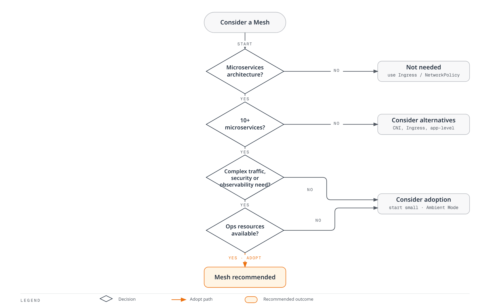
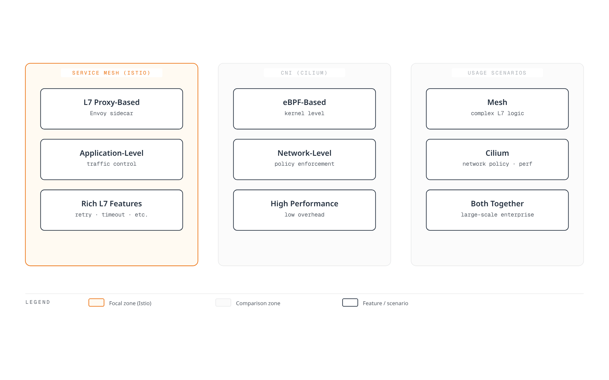
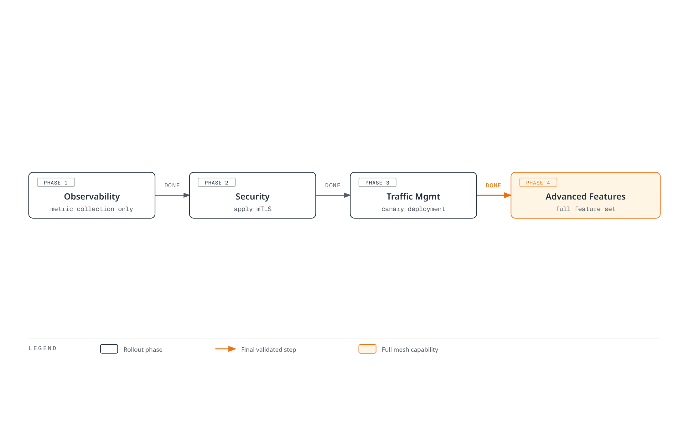
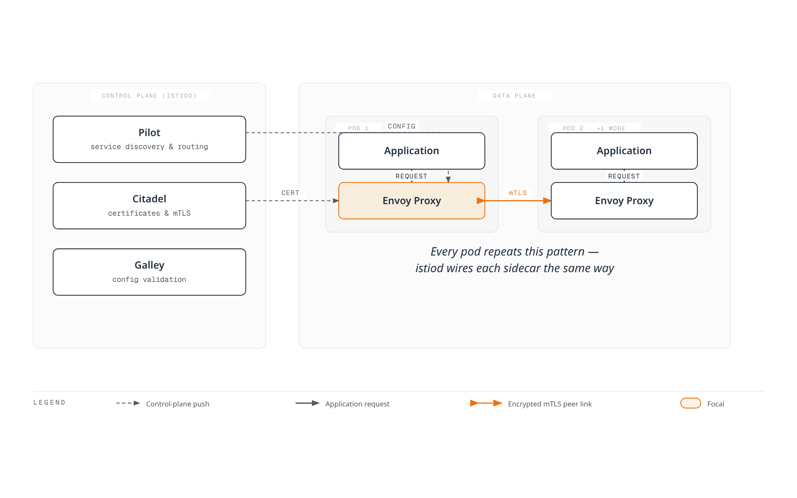

# Istio

> **最后更新**: August 31, 2026

在 Amazon EKS 上使用 Istio Service Mesh 的实用指南。

### 2026 年 8 月更新：Istio 1.30.4 / 1.29.7 安全补丁版本发布

2026 年 8 月 27 日，Istio 1.30.4 和 1.29.7 补丁版本发布。这些版本**包含安全修复（[ISTIO-SECURITY-2026-006](https://istio.io/latest/news/security/istio-security-2026-006/)），因此建议尽快升级**：

- **修复了 13 个 Envoy CVE**：包括 HTTP/2 trailer 处理中的堆 use-after-free（CVE-2026-73513）、通过 `ignore_path_parameters_in_path_matching` 绕过 RBAC（CVE-2026-73553），以及因丢弃重复 Host header 导致的 HTTP/2 内存耗尽（CVE-2026-73550）
- **修复了 1 个 Istio CVE**：当其 CA 引用无法解析时，`BackendTLSPolicy` 在 sidecar proxy 上以明文形式开放失败（GHSA-qm8v-g4f9-qhjx）
- 还包含多项稳定性修复，例如多集群环境中远程集群的 network gateway/endpoints 可能在凭证轮换后消失的问题

与此同时，下一个版本 1.31 的 release candidate 于 8 月 25 日至 27 日从 rc.2 持续发布至 rc.4，因此正式版本即将发布。详情请参阅 [1.30.4 官方公告](https://istio.io/latest/news/releases/1.30.x/announcing-1.30.4/)。

### 2026 年 8 月更新：Istio 1.31 进入 RC 阶段

2026 年 8 月 19 日，1.31.0-beta.2 发布后，当天随即发布了首个 release candidate [1.31.0-rc.0](https://github.com/istio/istio/releases)，标志着下一个 minor version 1.31 进入 release-candidate 阶段。RC 是在 GA 前进行最终验证的预发布版本，意味着正式版本即将推出。生产环境请继续使用 GA 版本。

### 2026 年 8 月更新：Istio 1.31 进入 Beta 阶段

下一个 minor version Istio 1.31 的发布流程正在进行：1.31.0-alpha.2 于 2026 年 8 月 11 日发布，随后 1.31.0-beta.0 于 8 月 13 日发布，1.31.0-beta.1 于 8 月 14 日发布。Alpha/beta build 是用于早期验证的预发布版本，不应用于生产环境；只有希望在 GA 版本发布前测试新功能时才应使用。详情请参阅 [Istio 发布页面](https://github.com/istio/istio/releases)。

### 2026 年 7 月更新：Istio 1.30.3 / 1.29.6 补丁版本发布

2026 年 7 月 16 日，Istio 1.30.3 和 1.29.6 补丁版本发布。1.30.3 的亮点包括：

- 通过将由 workload/service 地址变更触发的 XDS 推送限定为仅发送至受影响的 waypoint，提升了 ambient mode 下 istiod 的可扩展性
- 修复了 istiod 在重启前无法获取更新后的远程集群 secret（例如凭证/token 轮换期间）的问题
- 现在可通过 `PILOT_NODE_UNTAINT_CONTROLLERS_TAINT_NAME` environment variable 自定义 pilot node untaint controller 的 taint 名称

详情请参阅[官方公告](https://istio.io/latest/news/releases/1.30.x/announcing-1.30.3/)。

## 目录

1. [是否真的需要 Service Mesh？](#do-you-really-need-a-service-mesh)
2. [安装和初始设置](01-installation.md)
3. [基本概念](02-basic-concepts.md)
4. [架构](03-architecture.md)
5. [AWS 集成](04-aws-integration.md)
6. [术语表](glossary.md)
7. [流量管理](traffic-management/README.md)
8. [安全](security/README.md)
9. [可观测性](observability/README.md)
10. [弹性](resilience/README.md)
11. [高级](advanced/README.md)
12. [故障排除](troubleshooting/common-errors.md)
13. [最佳实践](best-practices.md)
14. [替代方案对比](comparison/README.md)

## 什么是 Istio？

Istio 是一个开源 Service Mesh 平台，用于连接、保护、控制和观测 microservice。它管理复杂 microservice 架构中 Service 之间的通信，并提供流量控制、安全性和可观测性。

### Service Mesh 概念

<div align="center"></div>

Service Mesh 是管理 microservice 之间通信的基础设施层。Istio 会在每个 Service 旁部署一个 Sidecar Proxy（Envoy），以拦截和控制所有网络流量。无需修改应用程序代码，即可提供以下能力：

* **流量路由**：智能路由、负载均衡、Canary 部署
* **安全**：自动 mTLS、认证、授权
* **可观测性**：指标、日志、分布式追踪
* **弹性**：Circuit Breaking、Retry、Timeout

### 实际使用示例

<p align="center"><br><em>未使用 Istio 的应用程序</em></p>

<p align="center"><br><em>使用 Istio 的应用程序 - Envoy Proxy 作为 Sidecar 部署到每个 Service</em></p>

应用 Istio 后，Envoy Proxy 会作为 sidecar container 自动部署到每个 microservice，透明地拦截和控制所有网络流量。

## 是否真的需要 Service Mesh？

Service Mesh 是一个强大的工具，但并不适合所有情况。采用前需要认真评估。

### 决策流程



### 需要 Service Mesh 的场景 ✅

#### 1. 复杂的 Microservices 环境


**建议标准**：

* ✅ 10 个或更多 microservice
* ✅ 频繁的 Service 间通信（East-West 流量）
* ✅ 使用多种编程语言（Polyglot）
* ✅ 多个团队独立开发 Service

#### 2. Zero Trust 安全要求

**Service Mesh 提供**：

* Service 间自动 mTLS 加密
* 基于 SPIFFE 的 Identity 管理
* 细粒度认证/授权策略
* 保证加密通信

**不使用替代方案时难以实现**：

* 在每个 Service 中重复实现安全逻辑
* 手动管理 certificate 的复杂性
* 安全策略不一致

#### 3. 高级流量管理

```yaml
# Canary Deployment (Traffic Distribution)
apiVersion: networking.istio.io/v1
kind: VirtualService
metadata:
  name: reviews
spec:
  hosts:
  - reviews
  http:
  - route:
    - destination:
        host: reviews
        subset: v1
      weight: 90
    - destination:
        host: reviews
        subset: v2
      weight: 10  # Only 10% to new version
```

**需要的场景**：

* Canary 部署、A/B 测试
* 基于 Header/path 的路由
* Traffic Mirroring（Shadow Testing）
* Fault Injection（Chaos Engineering）
* Circuit Breaking、Retry、Timeout

#### 4. 统一的可观测性

**Service Mesh 的优势**：

* 无需修改应用程序代码即可自动收集指标
* 自动实现 Distributed Tracing
* 统一的日志格式
* Service 拓扑可视化（Kiali）

### 不需要 Service Mesh 的场景 ❌

#### 1. 简单架构


**请改用**：

* Kubernetes Ingress Controller（NGINX、Traefik）
* 简单的 load balancer
* 应用程序级实现

#### 2. Microservice 数量较少（<10）

**开销更大**：

* Service Mesh 的运维复杂性 > 获得的收益
* 5-10 个 Service 可以手动管理
* NetworkPolicy 提供足够的安全性

**替代方案**：

```yaml
# Kubernetes NetworkPolicy is sufficient
apiVersion: networking.k8s.io/v1
kind: NetworkPolicy
metadata:
  name: allow-frontend-to-backend
spec:
  podSelector:
    matchLabels:
      app: backend
  ingress:
  - from:
    - podSelector:
        matchLabels:
          app: frontend
```

#### 3. 运维资源不足

**Service Mesh 运维要求**：

* Istio/Envoy 专业知识
* Control Plane 监控和管理
* 升级和 patch 管理
* 故障排除能力（调试复杂度增加）

**所需团队准备**：

* 至少 1-2 名 Service Mesh 专家
* 持续学习和跟踪更新
* 充足的测试环境

#### 4. 性能极其关键时

**Service Mesh 开销**：

* 延迟：+1-3ms（P50）、+5-10ms（P99）
* CPU：每个 pod +10-20%
* 内存：每个 pod +50-100MB（Sidecar mode）

**考虑替代方案**：

* Ambient Mode（资源使用量减少 90%）
* 基于 CNI 的解决方案（Cilium）
* 应用程序级优化

### 替代解决方案对比

| 功能                    | Service Mesh                                 | CNI（Cilium）    | Ingress Controller | 应用程序级                |
| -------------------------- | -------------------------------------------- | --------------- | ------------------ | ------------------------ |
| **L7 流量管理**  | ✅ 完整支持                               | ⚠️ 有限      | ⚠️ 仅 Ingress    | ✅ 可实现               |
| **mTLS 自动化**        | ✅ 完整支持                               | ✅ 可实现      | ❌ 不支持    | ❌ 手动实现  |
| **Distributed Tracing**    | ✅ 自动                                  | ❌ 不支持 | ❌ 不支持    | ⚠️ 手动实现 |
| **L3/L4 策略**         | ✅ 支持                                  | ✅ 完整支持  | ❌ 不支持    | ❌ 不支持          |
| **运维复杂性** | 🔴 高                                      | 🟡 中等       | 🟢 低             | 🟡 中等                |
| **资源开销**      | <p>🔴 高（Sidecar）<br>🟢 低（Ambient）</p> | 🟢 低          | 🟢 低             | 🟢 无                  |
| **适用规模**         | 10+ 个 Service                                 | 所有规模      | 小规模        | 小规模              |

### 基于 CNI 的解决方案（Cilium）

Cilium 基于 eBPF 在**网络层**提供许多功能：



**Cilium 更适合的场景**：

* L3/L4 network policy 是主要目的
* 高性能是核心要求
* 希望避免 Service Mesh 的运维负担
* 只需要简单的 mTLS 和可观测性

**参考**：[Cilium 文档](../../networking/cilium/README.md)

### 决策检查清单

采用前请回答以下问题：

**架构**：

* [ ] 是否有 10 个或更多 microservice？
* [ ] Service 间通信是否复杂？
* [ ] 是否使用多种编程语言？

**安全**：

* [ ] 是否需要 Zero Trust 安全模型？
* [ ] Service 间 mTLS 加密是否是强制要求？
* [ ] 是否需要细粒度访问控制？

**流量管理**：

* [ ] 是否需要 Canary 部署、A/B 测试？
* [ ] 是否需要高级路由规则？
* [ ] 是否有许多 Service 需要 Circuit Breaking、Retry？

**可观测性**：

* [ ] Distributed tracing 是否是强制要求？
* [ ] 是否需要统一的指标收集？
* [ ] 是否需要 Service 拓扑可视化？

**运维**：

* [ ] 是否有 Service Mesh 专家？
* [ ] 是否能够应对运维复杂性？
* [ ] 是否能够接受资源开销？

**结果**：

* ✅ 勾选 10 项或更多：强烈建议使用 Service Mesh
* 🟡 勾选 5-9 项：需要认真评估，从小规模开始（建议使用 Ambient Mode）
* ❌ 勾选 4 项或更少：考虑替代方案（CNI、Ingress、应用程序级）

### 渐进式采用策略

如果确定需要 Service Mesh，请逐步采用：



**建议顺序**：

1. **试点项目**（1-2 个 namespace）
2. **可观测性优先**（metrics、logs、traces）
3. **应用安全性**（mTLS PERMISSIVE → STRICT）
4. **流量管理**（VirtualService、DestinationRule）
5. **全公司推广**

### 核心功能

1.  **流量管理**

    <div align="center"></div>

    * 智能路由和负载均衡
    * A/B 测试、Canary 部署、Blue/Green 部署
    * Circuit Breaking、Retry、Timeout 控制
    * Traffic Mirroring 和 Fault Injection
2.  **安全**

    <div align="center"></div>

    * Service 间自动 mTLS 加密
    * 强认证和授权
    * 细粒度访问控制策略
    * 网络隔离和安全策略
3.  **可观测性**

    <div align="center"></div>

    * 自动生成 metrics、logs 和 trace
    * Prometheus、Grafana、Jaeger、Kiali 集成
    * Service 拓扑可视化
    * 实时流量监控
4. **弹性**
   * Circuit Breaker 模式
   * Rate Limiting
   * Outlier Detection
   * Zone Aware Routing

### Istio 架构

<div align="center"></div>

Istio 由 Control Plane 和 Data Plane 组成：



**Control Plane（istiod）**：

* **Pilot**：Service discovery、流量路由规则管理
* **Citadel**：certificate 生成和管理、启用 mTLS
* **Galley**：配置验证和部署

**Data Plane**：

* **Envoy Proxy**：作为 sidecar 部署到每个 pod，拦截并控制所有网络流量

### 在 Amazon EKS 上使用 Istio 的优势

1. **易于管理 Microservices**
   * 无需修改应用程序代码即可进行流量管理
   * 通过声明式配置一致地应用策略
   * 使用 Kubernetes Native API
2. **增强安全性**
   * Service 间自动加密
   * 与 AWS IAM 集成的认证
   * 细粒度权限控制
3. **提升可观测性**
   * 与 Amazon CloudWatch 集成
   * 通过 AWS X-Ray 进行 distributed tracing
   * 详细的 metrics 和 logs
4. **与 AWS Service 集成**
   * Application Load Balancer（ALB）集成
   * AWS Certificate Manager（ACM）集成
   * 兼容 Amazon EBS CSI Driver

### 开始使用

<div align="center"></div>

如果你是 Istio 新手，请按以下顺序阅读文档：

1. [**安装和初始设置**](01-installation.md)：在 EKS cluster 上安装 Istio
2. [**基本概念**](02-basic-concepts.md)：了解 Istio 核心概念
3. [**流量管理**](traffic-management/README.md)：学习 Gateway、VirtualService、DestinationRule
4. [**安全**](security/README.md)：配置 mTLS、认证、授权
5. [**可观测性**](observability/README.md)：收集 metrics、logs、traces
6. [**最佳实践**](best-practices.md)：生产环境建议

### 实操示例

每个部分都包含可运行的 YAML 示例。所有示例均支持点击复制：

```yaml
# Example VirtualService
apiVersion: networking.istio.io/v1
kind: VirtualService
metadata:
  name: reviews
spec:
  hosts:
  - reviews
  http:
  - route:
    - destination:
        host: reviews
        subset: v1
```

### 参考资料

* [Istio 官方文档](https://istio.io/latest/docs/)
* [Istio GitHub](https://github.com/istio/istio)
* [AWS EKS Workshop - Istio](https://www.eksworkshop.com/intermediate/330_servicemesh_using_istio/)
* [Istio 社区](https://discuss.istio.io/)

### 测验

要测试你在本章学到的内容，请尝试以下测验：

* [流量管理测验](../../quizzes/service-mesh/istio/traffic-management.md)
* [安全测验](../../quizzes/service-mesh/istio/security.md)
* [可观测性测验](../../quizzes/service-mesh/istio/observability.md)
* [弹性测验](../../quizzes/service-mesh/istio/resilience.md)
* [高级测验](../../quizzes/service-mesh/istio/advanced.md)
