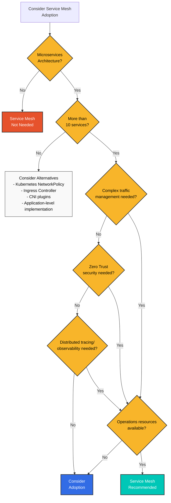
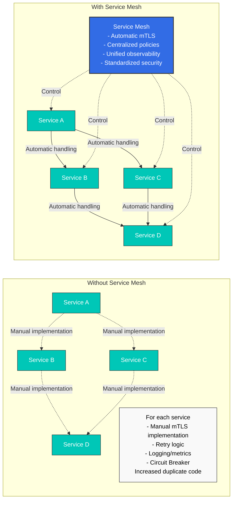
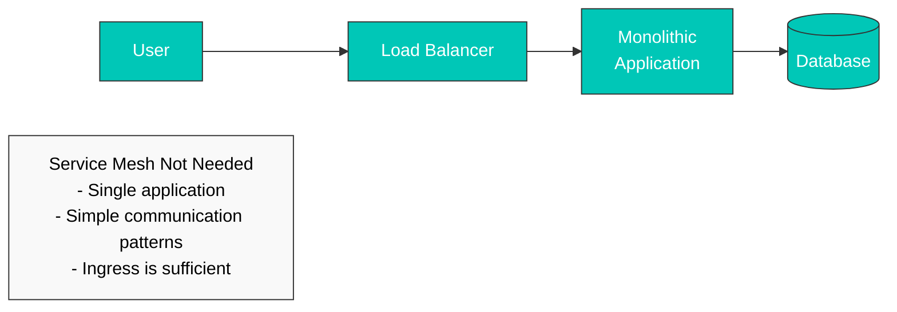
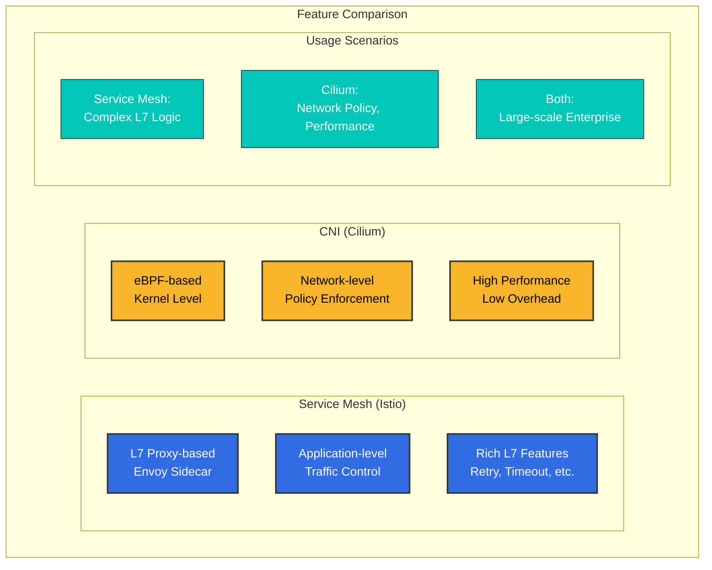
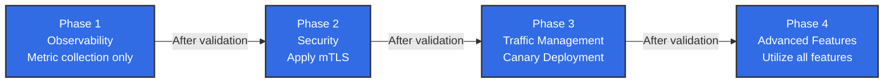
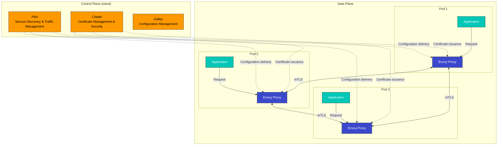

# Istio

> **最后更新**: August 17, 2026

在 Amazon EKS 上使用 Istio Service Mesh 的实用指南。

### 2026 年 8 月更新：Istio 1.31 进入 Beta 阶段

下一个次要版本 Istio 1.31 的发布流程正在进行中：1.31.0-alpha.2 于 2026 年 8 月 11 日发布，随后 1.31.0-beta.0 于 8 月 13 日发布，1.31.0-beta.1 于 8 月 14 日发布。Alpha/Beta 构建版本是供早期验证使用的预发布版本，并非用于生产环境——仅当您希望在 GA 发布之前测试新功能时才使用它们。详情请参阅 [Istio 发布页面](https://github.com/istio/istio/releases)。

### 2026 年 7 月更新：Istio 1.30.3 / 1.29.6 补丁发布

2026 年 7 月 16 日，Istio 1.30.3 和 1.29.6 补丁版本发布。1.30.3 的重点包括：

- 通过将因 workload/service 地址变更触发的 XDS 推送限定为仅受影响的 waypoint，提高 ambient mode 中 istiod 的可扩展性
- 修复了 istiod 在重启前无法获取已更新的远程集群 Secret（例如，在凭证/token 轮换期间）的问题
- pilot node untaint controller 的 taint 名称现在可通过 `PILOT_NODE_UNTAINT_CONTROLLERS_TAINT_NAME` 环境变量自定义

详情请参阅[官方公告](https://istio.io/latest/news/releases/1.30.x/announcing-1.30.3/)。

## 目录

1. [您真的需要 Service Mesh 吗？](./#do-you-really-need-a-service-mesh)
2. [安装和初始设置](01-installation.md)
3. [基本概念](02-basic-concepts.md)
4. [架构](03-architecture.md)
5. [AWS 集成](04-aws-integration.md)
6. [术语表](glossary.md)
7. [流量管理](traffic-management/)
8. [安全](security/)
9. [可观测性](observability/)
10. [弹性](resilience/)
11. [高级](advanced/)
12. [故障排除](troubleshooting/common-errors.md)
13. [最佳实践](best-practices.md)
14. [替代方案比较](comparison/)

## 什么是 Istio？

Istio 是一个开源 Service Mesh 平台，用于连接、保护、控制和观测微服务。它管理复杂微服务架构中服务之间的通信，并提供流量控制、安全性和可观测性。

### Service Mesh 概念

<div align="center"></div>

Service Mesh 是管理微服务之间通信的基础设施层。Istio 会在每个服务旁部署 Sidecar Proxy（Envoy），以拦截和控制所有网络流量。无需修改应用程序代码即可获得以下功能：

* **流量路由**：智能路由、负载均衡、Canary 部署
* **安全性**：自动 mTLS、身份验证、授权
* **可观测性**：指标、日志、分布式追踪
* **弹性**：Circuit Breaking、Retry、Timeout

### 实际使用示例

<p align="center"><br><em>没有 Istio 的应用程序</em></p>

<p align="center"><br><em>使用 Istio 的应用程序 - Envoy Proxy 作为 Sidecar 部署到每个服务</em></p>

应用 Istio 后，Envoy Proxy 会作为 Sidecar 容器自动部署到每个微服务，透明地拦截和控制所有网络流量。

## 您真的需要 Service Mesh 吗？

Service Mesh 是一个强大的工具，但并不适用于所有情况。采用前需要认真考量。

### 决策流程



### 何时需要 Service Mesh ✅

#### 1. 复杂的微服务环境



**推荐条件**：

* ✅ 10 个或更多微服务
* ✅ 频繁的服务间通信（East-West 流量）
* ✅ 使用多种编程语言（Polyglot）
* ✅ 多个团队独立开发服务

#### 2. Zero Trust 安全要求

**Service Mesh 提供**：

* 服务之间的自动 mTLS 加密
* 基于 SPIFFE 的 Identity 管理
* 精细的身份验证/授权策略
* 有保障的加密通信

**使用替代方案难以实现**：

* 在每个服务中重复实现安全逻辑
* 手动证书管理的复杂性
* 不一致的安全策略

#### 3. 高级流量管理

```yaml
# Canary Deployment (Traffic Distribution)
apiVersion: networking.istio.io/v1
kind: VirtualService
metadata:
  name: reviews
spec:
  hosts:
  - reviews
  http:
  - route:
    - destination:
        host: reviews
        subset: v1
      weight: 90
    - destination:
        host: reviews
        subset: v2
      weight: 10  # Only 10% to new version
```

**需要时**：

* Canary 部署、A/B 测试
* 基于 Header/path 的路由
* Traffic Mirroring（Shadow Testing）
* Fault Injection（Chaos Engineering）
* Circuit Breaking、Retry、Timeout

#### 4. 统一可观测性

**Service Mesh 优势**：

* 无需修改应用程序代码即可自动收集指标
* 自动实现 Distributed Tracing
* 统一的日志格式
* 服务拓扑可视化（Kiali）

### 何时不需要 Service Mesh ❌

#### 1. 简单架构



**改用**：

* Kubernetes Ingress Controller（NGINX、Traefik）
* 简单的负载均衡器
* 应用程序级实现

#### 2. 微服务数量较少（<10）

**开销更大**：

* Service Mesh 的运维复杂度 > 获得的收益
* 5-10 个服务可以手动管理
* NetworkPolicy 提供足够的安全性

**替代方案**：

```yaml
# Kubernetes NetworkPolicy is sufficient
apiVersion: networking.k8s.io/v1
kind: NetworkPolicy
metadata:
  name: allow-frontend-to-backend
spec:
  podSelector:
    matchLabels:
      app: backend
  ingress:
  - from:
    - podSelector:
        matchLabels:
          app: frontend
```

#### 3. 运维资源不足

**Service Mesh 运维要求**：

* Istio/Envoy 专业知识
* Control Plane 监控和管理
* 升级和补丁管理
* 故障排除能力（调试复杂度增加）

**所需的团队准备**：

* 至少 1-2 名 Service Mesh 专家
* 持续学习并跟踪更新
* 充足的测试环境

#### 4. 性能极其关键时

**Service Mesh 开销**：

* 延迟：+1-3ms（P50）、+5-10ms（P99）
* CPU：每个 pod +10-20%
* 内存：每个 pod +50-100MB（Sidecar 模式）

**考虑替代方案**：

* Ambient Mode（资源使用量减少 90%）
* 基于 CNI 的解决方案（Cilium）
* 应用程序级优化

### 替代解决方案比较

| 功能                    | Service Mesh                                 | CNI（Cilium）    | Ingress Controller | 应用程序级                |
| -------------------------- | -------------------------------------------- | --------------- | ------------------ | ------------------------ |
| **L7 流量管理**  | ✅ 完整支持                               | ⚠️ 有限      | ⚠️ 仅 Ingress    | ✅ 可以               |
| **mTLS 自动化**        | ✅ 完整支持                               | ✅ 可以      | ❌ 不支持    | ❌ 手动实现  |
| **Distributed Tracing**    | ✅ 自动                                  | ❌ 不支持 | ❌ 不支持    | ⚠️ 手动实现 |
| **L3/L4 策略**         | ✅ 支持                                  | ✅ 完整支持  | ❌ 不支持    | ❌ 不支持          |
| **运维复杂度** | 🔴 高                                      | 🟡 中等       | 🟢 低             | 🟡 中等                |
| **资源开销**      | <p>🔴 高（Sidecar）<br>🟢 低（Ambient）</p> | 🟢 低          | 🟢 低             | 🟢 无                  |
| **适用规模**         | 10+ 个服务                                 | 所有规模      | 小规模        | 小规模              |

### 基于 CNI 的解决方案（Cilium）

Cilium 基于 eBPF 在**网络层**提供许多功能：



**Cilium 更适合的情况**：

* L3/L4 网络策略是主要目的
* 高性能是核心要求
* 希望避免 Service Mesh 的运维负担
* 仅需要简单的 mTLS 和可观测性

**参考**：[Cilium 文档](../../networking/cilium/)

### 决策检查清单

采用前请回答以下问题：

**架构**：

* [ ] 您是否有 10 个或更多微服务？
* [ ] 服务间通信是否复杂？
* [ ] 是否使用多种编程语言？

**安全性**：

* [ ] 是否需要 Zero Trust 安全模型？
* [ ] 服务之间是否必须使用 mTLS 加密？
* [ ] 是否需要精细的访问控制？

**流量管理**：

* [ ] 是否需要 Canary 部署、A/B 测试？
* [ ] 是否需要高级路由规则？
* [ ] 是否为许多服务需要 Circuit Breaking、Retry？

**可观测性**：

* [ ] 是否必须使用分布式追踪？
* [ ] 是否需要统一的指标收集？
* [ ] 是否需要服务拓扑可视化？

**运维**：

* [ ] 您是否拥有 Service Mesh 专家？
* [ ] 您能否应对运维复杂度？
* [ ] 您能否接受资源开销？

**结果**：

* ✅ 勾选 10 项或更多：强烈推荐 Service Mesh
* 🟡 勾选 5-9 项：需要谨慎评估，从小规模开始（推荐 Ambient Mode）
* ❌ 勾选 4 项或更少：考虑替代解决方案（CNI、Ingress、应用程序级）

### 渐进式采用策略

如果您确定需要 Service Mesh，请逐步采用：



**推荐顺序**：

1. **试点项目**（1-2 个 namespace）
2. **可观测性优先**（指标、日志、追踪）
3. **应用安全性**（mTLS PERMISSIVE → STRICT）
4. **流量管理**（VirtualService、DestinationRule）
5. **全公司范围扩展**

### 主要功能

1.  **流量管理**

    <div align="center"></div>

    * 智能路由和负载均衡
    * A/B 测试、Canary 部署、Blue/Green 部署
    * Circuit Breaking、Retry、Timeout 控制
    * Traffic Mirroring 和 Fault Injection
2.  **安全性**

    <div align="center"></div>

    * 服务之间的自动 mTLS 加密
    * 强身份验证和授权
    * 精细的访问控制策略
    * 网络隔离和安全策略
3.  **可观测性**

    <div align="center"></div>

    * 自动生成指标、日志和追踪
    * Prometheus、Grafana、Jaeger、Kiali 集成
    * 服务拓扑可视化
    * 实时流量监控
4. **弹性**
   * Circuit Breaker 模式
   * Rate Limiting
   * Outlier Detection
   * Zone Aware Routing

### Istio 架构

<div align="center"></div>

Istio 由 Control Plane 和 Data Plane 组成：



**Control Plane（istiod）**：

* **Pilot**：服务发现、流量路由规则管理
* **Citadel**：证书生成和管理、启用 mTLS
* **Galley**：配置验证和部署

**Data Plane**：

* **Envoy Proxy**：作为 Sidecar 部署到每个 pod，拦截和控制所有网络流量

### 在 Amazon EKS 上使用 Istio 的优势

1. **便捷的微服务管理**
   * 无需修改应用程序代码即可进行流量管理
   * 通过声明式配置应用一致的策略
   * 使用 Kubernetes Native API
2. **增强的安全性**
   * 服务之间自动加密
   * 与 AWS IAM 集成的身份验证
   * 精细的权限控制
3. **改进的可观测性**
   * 与 Amazon CloudWatch 集成
   * 通过 AWS X-Ray 实现分布式追踪
   * 详细的指标和日志
4. **与 AWS 服务集成**
   * Application Load Balancer（ALB）集成
   * AWS Certificate Manager（ACM）集成
   * 兼容 Amazon EBS CSI Driver

### 开始使用

<div align="center"></div>

如果您刚开始使用 Istio，请按以下顺序阅读文档：

1. [**安装和初始设置**](01-installation.md)：在 EKS 集群上安装 Istio
2. [**基本概念**](02-basic-concepts.md)：了解 Istio 核心概念
3. [**流量管理**](traffic-management/)：学习 Gateway、VirtualService、DestinationRule
4. [**安全**](security/)：配置 mTLS、身份验证、授权
5. [**可观测性**](observability/)：收集指标、日志、追踪
6. [**最佳实践**](best-practices.md)：生产环境建议

### 实操示例

每个部分都包含可运行的 YAML 示例。所有示例均采用点击复制的结构：

```yaml
# Example VirtualService
apiVersion: networking.istio.io/v1
kind: VirtualService
metadata:
  name: reviews
spec:
  hosts:
  - reviews
  http:
  - route:
    - destination:
        host: reviews
        subset: v1
```

### 参考资料

* [Istio 官方文档](https://istio.io/latest/docs/)
* [Istio GitHub](https://github.com/istio/istio)
* [AWS EKS Workshop - Istio](https://www.eksworkshop.com/intermediate/330_servicemesh_using_istio/)
* [Istio 社区](https://discuss.istio.io/)

### 测验

若要测试您在本章所学的内容，请尝试以下测验：

* [流量管理测验](../../quizzes/service-mesh/istio/traffic-management.md)
* [安全测验](../../quizzes/service-mesh/istio/security.md)
* [可观测性测验](../../quizzes/service-mesh/istio/observability.md)
* [弹性测验](../../quizzes/service-mesh/istio/resilience.md)
* [高级测验](../../quizzes/service-mesh/istio/advanced.md)
